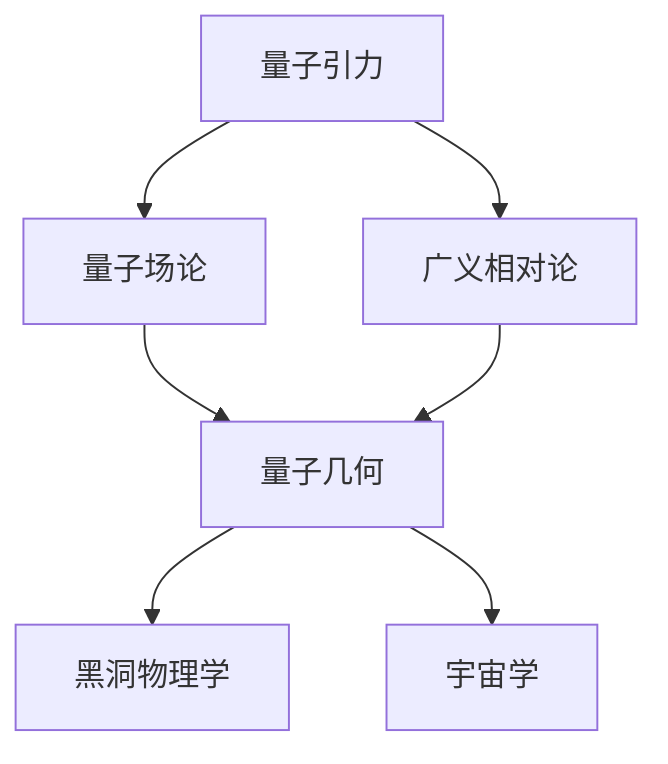

                 

# 量子引力：广义相对论与量子力学的结合

> 关键词：量子引力、广义相对论、量子力学、量子场论、黑洞、宇宙学

> 摘要：本文深入探讨了量子引力的基本概念、发展历程及其与广义相对论、量子力学的结合。通过详细解析量子场论和广义相对论的核心原理，本文阐述了量子引力理论的框架和关键问题。此外，本文还介绍了量子引力在黑洞物理学、宇宙学以及未来科技领域的应用前景，旨在为读者提供全面而系统的量子引力知识。

## 第一部分：引论

### 第1章：量子引力概述

#### 1.1 量子引力的定义与历史背景

量子引力是试图将广义相对论和量子力学统一的一种物理学理论。它起源于对宇宙中物质和能量在极小尺度下的行为的研究。在20世纪早期，量子力学和广义相对论分别描述了微观世界和宏观世界的物理现象，但它们之间存在显著的差异。量子力学基于概率和不确定性原理，描述了微观粒子的行为；而广义相对论则描述了重力作为时空弯曲的结果。量子引力的目标是弥合这两个理论之间的鸿沟，提供一个统一的框架来描述宇宙中的所有物理现象。

量子引力的发展历程可以追溯到20世纪30年代，当时科学家们开始尝试将量子力学与广义相对论结合。然而，由于两者在基本原理上的冲突，这一目标长期未能实现。直到20世纪70年代，量子场论的发展为量子引力提供了新的理论基础。此后，量子引力研究取得了显著的进展，但仍然是一个充满挑战的领域。

#### 1.1.1 广义相对论的基本概念

广义相对论是由爱因斯坦在1915年提出的，它是对经典牛顿引力理论的革命性扩展。广义相对论认为，重力不是一种作用在物体之间的力，而是由于物质和能量对时空结构的影响造成的。具体来说，物质和能量的分布会导致时空的弯曲，而物体的运动则是沿着弯曲时空的测地线进行的。

广义相对论的核心概念包括：

- 时空：广义相对论引入了四维时空的概念，即时空是物质和能量存在的背景。
- 测地线：在弯曲的时空中，物体的运动轨迹称为测地线，这是物体在没有外力作用下的自然运动路径。
- 弯曲时空：物质和能量的存在导致时空的弯曲，这种弯曲可以通过测地线的性质来描述。
- 重力红移：由于重力场的影响，光在通过重力场时会发生频率变化，称为重力红移。

#### 1.1.2 量子力学的基本概念

量子力学是描述微观粒子行为的理论，它由海森堡、薛定谔和波动力等人于20世纪早期建立。量子力学的基本概念包括：

- 波粒二象性：微观粒子既具有波动性又具有粒子性，这种二象性导致了许多经典物理无法解释的现象，如干涉和衍射。
- 确定性原理：在量子力学中，粒子的行为具有不确定性，某些物理量（如位置和动量）不能同时被精确测量。
- 波函数：量子力学的核心概念之一，波函数描述了粒子的状态，其模平方给出了粒子在空间中某点出现的概率。
- 海森堡不确定性原理：该原理指出，某些物理量（如位置和动量）不能同时被精确测量。

#### 1.1.3 量子引力的发展历程

量子引力的发展历程可以分为几个阶段：

- 初期探索（20世纪30年代）：在量子力学和广义相对论初步发展的基础上，科学家们开始尝试将两者结合起来。
- 量子场论的出现（20世纪70年代）：量子场论为量子引力提供了新的理论基础，其中包括弦理论和环量子引力等。
- 现代量子引力理论的发展（20世纪末至今）：随着计算技术的进步和数学工具的改进，量子引力研究取得了显著的进展，但仍面临许多挑战。

#### 1.2 量子引力的核心问题

量子引力的核心问题包括引力与量子效应的统一、黑洞物理学中的量子引力问题以及宇宙学的量子引力挑战。

- 引力与量子效应的统一：这是量子引力的核心目标之一，如何将引力和量子效应统一起来仍然是一个未解之谜。
- 黑洞物理学中的量子引力问题：黑洞是引力极其强大的区域，传统广义相对论无法解释黑洞的量子效应。量子引力理论需要提供一个自洽的框架来解释黑洞的物理性质。
- 宇宙学的量子引力挑战：宇宙学中存在许多量子引力问题，如宇宙微波背景辐射、宇宙膨胀等，这些都需要量子引力理论来解释。

#### 1.3 本书结构安排与学习建议

本书分为七个部分，从引论、基础理论、应用研究到未来展望，力求全面、系统地介绍量子引力领域的基本概念、理论框架和应用前景。以下是本书的结构安排与学习建议：

- **引论**：介绍量子引力的基本概念、发展历程及其与广义相对论、量子力学的结合。建议读者先从这部分开始，建立一个整体的量子引力框架。
- **量子场论基础**：介绍量子场论的基本概念、核心原理和数学模型。这部分内容是理解量子引力理论的基础，建议读者深入学习。
- **广义相对论基础**：介绍广义相对论的基本概念、时空结构、惯性系和引力场。这部分内容是理解量子引力理论的关键，建议读者结合量子场论的基础部分一起学习。
- **量子引力理论**：介绍量子引力理论的框架、量子几何理论和量子引力与黑洞物理学的关系。这部分内容是量子引力理论的核心，建议读者重点学习。
- **量子引力与宇宙学**：介绍量子引力在宇宙学中的应用，包括宇宙膨胀和宇宙学常数等。这部分内容是量子引力理论在宇宙学中的具体应用，建议读者结合前几部分的内容一起学习。
- **量子引力实验与观测**：介绍量子引力实验和观测方法，包括黑洞辐射和宇宙微波背景辐射等。这部分内容是量子引力理论的实验验证，建议读者了解最新的实验进展。
- **量子引力与未来科技**：介绍量子引力在未来科技领域的应用前景，包括量子计算机和量子通信等。这部分内容是量子引力理论的前沿发展方向，建议读者关注。

通过以上七个部分的学习，读者可以系统地掌握量子引力领域的知识，并对未来的研究方向有所了解。

---

# 量子引力：广义相对论与量子力学的结合

> 关键词：量子引力、广义相对论、量子力学、量子场论、黑洞、宇宙学

> 摘要：本文深入探讨了量子引力的基本概念、发展历程及其与广义相对论、量子力学的结合。通过详细解析量子场论和广义相对论的核心原理，本文阐述了量子引力理论的框架和关键问题。此外，本文还介绍了量子引力在黑洞物理学、宇宙学以及未来科技领域的应用前景，旨在为读者提供全面而系统的量子引力知识。

## 第一部分：引论

### 第1章：量子引力概述

#### 1.1 量子引力的定义与历史背景

量子引力是试图将广义相对论和量子力学统一的一种物理学理论。它起源于对宇宙中物质和能量在极小尺度下的行为的研究。在20世纪早期，量子力学和广义相对论分别描述了微观世界和宏观世界的物理现象，但它们之间存在显著的差异。量子力学基于概率和不确定性原理，描述了微观粒子的行为；而广义相对论则描述了重力作为时空弯曲的结果。量子引力的目标是弥合这两个理论之间的鸿沟，提供一个统一的框架来描述宇宙中的所有物理现象。

量子引力的发展历程可以追溯到20世纪30年代，当时科学家们开始尝试将量子力学与广义相对论结合。然而，由于两者在基本原理上的冲突，这一目标长期未能实现。直到20世纪70年代，量子场论的发展为量子引力提供了新的理论基础。此后，量子引力研究取得了显著的进展，但仍然是一个充满挑战的领域。

#### 1.1.1 广义相对论的基本概念

广义相对论是由爱因斯坦在1915年提出的，它是对经典牛顿引力理论的革命性扩展。广义相对论认为，重力不是一种作用在物体之间的力，而是由于物质和能量对时空结构的影响造成的。具体来说，物质和能量的分布会导致时空的弯曲，而物体的运动则是沿着弯曲时空的测地线进行的。

广义相对论的核心概念包括：

- 时空：广义相对论引入了四维时空的概念，即时空是物质和能量存在的背景。
- 测地线：在弯曲的时空中，物体的运动轨迹称为测地线，这是物体在没有外力作用下的自然运动路径。
- 弯曲时空：物质和能量的存在导致时空的弯曲，这种弯曲可以通过测地线的性质来描述。
- 重力红移：由于重力场的影响，光在通过重力场时会发生频率变化，称为重力红移。

#### 1.1.2 量子力学的基本概念

量子力学是描述微观粒子行为的理论，它由海森堡、薛定谔和波动力等人于20世纪早期建立。量子力学的基本概念包括：

- 波粒二象性：微观粒子既具有波动性又具有粒子性，这种二象性导致了许多经典物理无法解释的现象，如干涉和衍射。
- 确定性原理：在量子力学中，粒子的行为具有不确定性，某些物理量（如位置和动量）不能同时被精确测量。
- 波函数：量子力学的核心概念之一，波函数描述了粒子的状态，其模平方给出了粒子在空间中某点出现的概率。
- 海森堡不确定性原理：该原理指出，某些物理量（如位置和动量）不能同时被精确测量。

#### 1.1.3 量子引力的发展历程

量子引力的发展历程可以分为几个阶段：

- 初期探索（20世纪30年代）：在量子力学和广义相对论初步发展的基础上，科学家们开始尝试将两者结合起来。
- 量子场论的出现（20世纪70年代）：量子场论为量子引力提供了新的理论基础，其中包括弦理论和环量子引力等。
- 现代量子引力理论的发展（20世纪末至今）：随着计算技术的进步和数学工具的改进，量子引力研究取得了显著的进展，但仍面临许多挑战。

#### 1.2 量子引力的核心问题

量子引力的核心问题包括引力与量子效应的统一、黑洞物理学中的量子引力问题以及宇宙学的量子引力挑战。

- 引力与量子效应的统一：这是量子引力的核心目标之一，如何将引力和量子效应统一起来仍然是一个未解之谜。
- 黑洞物理学中的量子引力问题：黑洞是引力极其强大的区域，传统广义相对论无法解释黑洞的量子效应。量子引力理论需要提供一个自洽的框架来解释黑洞的物理性质。
- 宇宙学的量子引力挑战：宇宙学中存在许多量子引力问题，如宇宙微波背景辐射、宇宙膨胀等，这些都需要量子引力理论来解释。

#### 1.3 本书结构安排与学习建议

本书分为七个部分，从引论、基础理论、应用研究到未来展望，力求全面、系统地介绍量子引力领域的基本概念、理论框架和应用前景。以下是本书的结构安排与学习建议：

- **引论**：介绍量子引力的基本概念、发展历程及其与广义相对论、量子力学的结合。建议读者先从这部分开始，建立一个整体的量子引力框架。
- **量子场论基础**：介绍量子场论的基本概念、核心原理和数学模型。这部分内容是理解量子引力理论的基础，建议读者深入学习。
- **广义相对论基础**：介绍广义相对论的基本概念、时空结构、惯性系和引力场。这部分内容是理解量子引力理论的关键，建议读者结合量子场论的基础部分一起学习。
- **量子引力理论**：介绍量子引力理论的框架、量子几何理论和量子引力与黑洞物理学的关系。这部分内容是量子引力理论的核心，建议读者重点学习。
- **量子引力与宇宙学**：介绍量子引力在宇宙学中的应用，包括宇宙膨胀和宇宙学常数等。这部分内容是量子引力理论在宇宙学中的具体应用，建议读者结合前几部分的内容一起学习。
- **量子引力实验与观测**：介绍量子引力实验和观测方法，包括黑洞辐射和宇宙微波背景辐射等。这部分内容是量子引力理论的实验验证，建议读者了解最新的实验进展。
- **量子引力与未来科技**：介绍量子引力在未来科技领域的应用前景，包括量子计算机和量子通信等。这部分内容是量子引力理论的前沿发展方向，建议读者关注。

通过以上七个部分的学习，读者可以系统地掌握量子引力领域的知识，并对未来的研究方向有所了解。

---

## 第一部分：引论

### 第1章：量子引力概述

#### 1.1 量子引力的定义与历史背景

量子引力是物理学中一个极其重要的研究领域，它旨在将广义相对论和量子力学这两个描述宇宙不同尺度的理论统一起来。这一目标的重要性在于，广义相对论成功地描述了宇宙中大尺度上的引力现象，如黑洞、星系的形成和宇宙膨胀等；而量子力学则揭示了微观粒子行为的奇异特性，如波粒二象性、量子纠缠和不确定性原理。然而，这两个理论在数学基础和基本假设上存在显著的矛盾，无法直接结合。因此，量子引力的研究试图在两者之间架起一座桥梁，以提供一个自洽的物理框架，能够同时描述宇宙从微观到宏观的所有现象。

量子引力的发展历程可以追溯到20世纪早期，当时科学家们开始意识到量子力学和广义相对论之间存在的不兼容性。1925年，海森堡提出了不确定性原理，揭示了微观粒子的行为具有固有的随机性和不可预测性。这一原理与广义相对论的确定性描述形成了鲜明对比。爱因斯坦本人也试图将引力与量子力学结合，但在他的研究中遇到了不可克服的难题。直到20世纪70年代，随着量子场论的逐渐成熟，科学家们开始探索量子引力的新途径。

量子场论是一种描述量子系统的理论，它将量子力学与电磁场理论结合起来。量子场论的成功应用，如粒子物理学中的标准模型，为量子引力研究提供了新的启示。在这一时期，弦理论和环量子引力等理论开始兴起，它们试图为量子引力提供一个自洽的数学框架。弦理论通过引入额外维度和复杂的多维世界，试图解决量子引力中的基本问题。而环量子引力则通过量子化时空结构，试图提供一个无额外维度的量子引力理论。

尽管量子引力研究取得了一定的进展，但这一领域仍然充满了挑战。目前，量子引力理论仍然处于探索阶段，许多基本问题尚未解决。例如，量子引力如何与黑洞物理学结合，量子引力对宇宙学的影响如何，以及如何通过实验验证量子引力理论等。这些问题都需要进一步的研究和探索。

#### 1.1.1 广义相对论的基本概念

广义相对论是由爱因斯坦在1915年提出的，它是对经典牛顿引力理论的革命性扩展。广义相对论的核心思想是，重力不是一种作用在物体之间的力，而是由于物质和能量对时空结构的影响造成的。这一理论引入了四维时空的概念，即时空是物质和能量存在的背景。

在广义相对论中，时空被视为一个连续的整体，称为时空连续体。物体的运动轨迹称为测地线，这是物体在没有外力作用下的自然运动路径。测地线的概念类似于在平面上从一点到另一点的最短路径，但在弯曲的时空中，测地线是物体在引力场中自由运动的最短路径。

广义相对论还引入了引力红移的概念。引力红移是指光在通过强引力场时会发生频率变化的现象。具体来说，当光从远离引力源的地方向靠近引力源的地方传播时，光的频率会降低，即出现红移；而当光从靠近引力源的地方向远离引力源的地方传播时，光的频率会升高，即出现蓝移。这一现象可以通过爱因斯坦的引力场方程来描述，该方程是一个复杂的偏微分方程，描述了物质和能量如何影响时空结构。

广义相对论的其他核心概念还包括：

- 弯曲时空：物质和能量的存在导致时空的弯曲，这种弯曲可以通过测地线的性质来描述。在广义相对论中，时空不再是平坦的欧几里得空间，而是具有非欧几里得性质的四维连续体。
- 惯性系：在广义相对论中，惯性系是指不受外力作用的参考系。在惯性系中，物体的运动状态保持不变，除非受到外力的作用。惯性系的引入是为了解决在经典力学中存在的伽利略相对性问题。
- 引力场：引力场是指物质和能量对周围时空结构的影响。引力场可以通过引力势来描述，引力势是描述引力场强度和方向的物理量。

广义相对论的成功在于它能够解释许多经典物理学无法解释的现象。例如，广义相对论成功预言了水星轨道进动和光线在强引力场中的弯曲。这些实验观测结果验证了广义相对论的预测，使其成为现代物理学的基础理论之一。

#### 1.1.2 量子力学的基本概念

量子力学是描述微观粒子行为的理论，它由海森堡、薛定谔和波动力等人于20世纪早期建立。量子力学的基本概念与经典物理学有显著的不同，它揭示了微观粒子行为的奇异特性，如波粒二象性、量子纠缠和不确定性原理。

量子力学中的核心概念包括：

- 波粒二象性：微观粒子既具有波动性又具有粒子性。这一概念意味着在微观尺度上，粒子的行为不能简单地用经典物理学的粒子模型来描述。例如，光既具有波动性，如干涉和衍射现象，又具有粒子性，如光电效应。
- 确定性原理：在经典物理学中，物体的运动轨迹是确定的，可以通过牛顿定律等方程来计算。然而，在量子力学中，粒子的行为具有不确定性。某些物理量（如位置和动量）不能同时被精确测量，这被称为海森堡不确定性原理。这一原理揭示了微观粒子的行为具有固有的随机性和不可预测性。
- 波函数：量子力学的核心概念之一，波函数描述了粒子的状态。波函数是一个复数函数，它的模平方给出了粒子在空间中某点出现的概率密度。波函数的演化可以通过薛定谔方程来描述，该方程是一个偏微分方程，描述了波函数随时间的变化。
- 量子态叠加：量子态可以同时处于多种可能的叠加态，直到测量结果确定其状态。这意味着在微观尺度上，粒子的状态不是固定的，而是处于一种叠加状态。量子态的叠加原理是量子计算和量子通信等技术的理论基础。

量子力学中的其他重要概念还包括：

- 量子纠缠：量子纠缠是指两个或多个粒子之间存在的非经典的关联。当两个粒子发生纠缠后，它们的状态将不可分割，即使它们相隔很远。量子纠缠是量子信息和量子计算的核心概念。
- 能级和能隙：在量子力学中，粒子的能量是量子化的，即能量只能取特定的离散值。这种离散的能量状态称为能级。能级之间的差距称为能隙。能级和能隙的概念在固体物理学和凝聚态物理学中具有重要意义。

量子力学在解释微观粒子行为方面取得了巨大的成功。例如，它成功地解释了原子结构、化学键的形成和光谱线的产生等现象。量子力学还为半导体技术、激光技术和核磁共振成像等现代科技的发展提供了理论基础。

#### 1.1.3 量子引力的发展历程

量子引力的发展历程可以分为几个阶段，每个阶段都有其独特的贡献和挑战。

- **初期探索（20世纪30年代）**：在量子力学和广义相对论初步发展的基础上，科学家们开始尝试将两者结合起来。这一时期的主要工作包括爱因斯坦与玻尔关于量子引力的辩论，以及海森堡和约尔当等人提出的自洽场论。然而，由于两者在基本原理上的冲突，这一目标长期未能实现。

- **量子场论的出现（20世纪70年代）**：量子场论的发展为量子引力提供了新的理论基础。在这一时期，科学家们开始探索量子场论在不同维度和不同背景下的性质。弦理论和环量子引力等理论开始兴起，它们试图为量子引力提供一个自洽的数学框架。弦理论通过引入额外维度和复杂的多维世界，试图解决量子引力中的基本问题。而环量子引力则通过量子化时空结构，试图提供一个无额外维度的量子引力理论。

- **现代量子引力理论的发展（20世纪末至今）**：随着计算技术的进步和数学工具的改进，量子引力研究取得了显著的进展。现代量子引力理论包括许多不同的模型和假设，如量子几何、量子环面、非平衡量子场论等。这些理论试图解决量子引力中的关键问题，如黑洞熵、宇宙微波背景辐射和宇宙膨胀等。尽管取得了显著的进展，量子引力仍然是一个充满挑战的领域。

量子引力的发展历程不仅体现了科学家们对自然界基本规律的不断探索，也展示了物理学理论的创新和突破。量子引力的研究对基础科学和未来科技具有重要意义，它有望为人类提供关于宇宙和物质的全新视角和理解。

#### 1.2 量子引力的核心问题

量子引力作为物理学中一个前沿领域，面临许多核心问题。以下是其中几个关键问题及其详细探讨：

- **引力与量子效应的统一**：这是量子引力的核心目标之一。广义相对论成功地描述了宏观引力现象，而量子力学则揭示了微观粒子的行为。然而，两者之间存在显著的差异，无法直接结合。引力与量子效应的统一试图找到一个自洽的框架，能够同时描述宏观和微观尺度上的物理现象。这一问题涉及到量子场论和广义相对论的整合，是量子引力研究的核心挑战。

- **黑洞物理学中的量子引力问题**：黑洞是引力极其强大的区域，传统广义相对论无法解释黑洞的量子效应。量子引力理论需要提供一个自洽的框架来解释黑洞的物理性质，如黑洞辐射、信息丢失问题等。黑洞物理学中的量子引力问题是一个充满挑战的领域，涉及到量子场论、黑洞熵和量子信息等复杂概念。

- **宇宙学的量子引力挑战**：宇宙学中存在许多量子引力问题，如宇宙微波背景辐射、宇宙膨胀和宇宙学常数等。这些问题都需要量子引力理论来解释。量子引力对宇宙学的影响是一个重要的研究方向，它有助于我们更好地理解宇宙的起源和演化。

- **量子引力的实验验证**：尽管量子引力理论在理论层面上取得了显著进展，但实验验证仍然是一个巨大的挑战。如何通过实验手段验证量子引力理论，如黑洞辐射、宇宙微波背景辐射的量子效应等，是量子引力研究中的一个重要问题。实验验证的困难性要求我们发展新的实验技术和方法。

- **量子引力与多宇宙**：量子引力理论中存在多宇宙的概念，即不同的物理状态可能存在于不同的宇宙中。这一概念引发了关于宇宙多样性和选择问题的讨论。量子引力与多宇宙的关系是一个深刻的哲学问题，也涉及到物理学和宇宙学的边界。

这些核心问题构成了量子引力研究的核心挑战，也是未来研究的方向。解决这些问题不仅有助于我们更深入地理解宇宙的基本规律，也将推动物理学和其他科学领域的发展。

#### 1.3 本书结构安排与学习建议

为了系统地介绍量子引力这一复杂而重要的领域，本书采用了七个部分的结构。每个部分都针对量子引力的不同方面进行详细探讨，以帮助读者逐步建立起对该领域的全面理解。

**第一部分：引论**

本部分包括第1章，主要介绍量子引力的基本概念、发展历程及其与广义相对论、量子力学的结合。这一章节为读者提供了一个量子引力的整体框架，有助于读者更好地理解后续内容。

**第二部分：量子场论基础**

这一部分从第2章到第4章，重点介绍量子场论的基本概念、核心原理和数学模型。量子场论是理解量子引力的基础，这部分内容将帮助读者建立起量子场论的基本知识，为理解量子引力理论打下坚实基础。

**第三部分：广义相对论基础**

第5章到第7章构成了这一部分，主要介绍广义相对论的基本概念、时空结构、惯性系和引力场。这部分内容与量子场论基础部分相辅相成，共同为理解量子引力理论提供核心理论支持。

**第四部分：量子引力理论**

从第8章到第10章，这一部分深入探讨量子引力理论的框架、量子几何理论和量子引力与黑洞物理学的关系。这部分内容是量子引力理论的核心，将帮助读者了解量子引力理论的基本结构和发展方向。

**第五部分：量子引力与宇宙学**

第11章到第13章介绍了量子引力在宇宙学中的应用，包括宇宙膨胀、宇宙学常数等。这部分内容将帮助读者理解量子引力如何影响宇宙的起源和演化。

**第六部分：量子引力实验与观测**

这一部分从第14章到第16章，主要介绍量子引力实验和观测方法，包括黑洞辐射、宇宙微波背景辐射等。这部分内容将帮助读者了解量子引力理论的实验验证和观测进展。

**第七部分：量子引力与未来科技**

最后一部分从第17章到第19章，探讨量子引力在未来科技领域的应用前景，包括量子计算机、量子通信等。这部分内容展示了量子引力理论的前沿发展方向，将激发读者对量子引力应用的新思考。

**学习建议：**

- 阅读顺序建议：建议读者按照书中的结构顺序进行阅读，从引论开始，逐步深入到各个部分的核心内容。这种顺序有助于读者逐步建立起对量子引力领域的全面理解。

- 学习资源推荐：推荐读者阅读相关领域的经典书籍和最新论文，如《量子引力：基础理论与最新进展》、《黑洞与量子引力》等。此外，读者还可以通过在线课程、科研论文和学术会议等途径获取更多学习资源。

通过本书的学习，读者不仅可以系统地掌握量子引力的基本概念和理论框架，还能了解量子引力在黑洞物理学、宇宙学和未来科技领域的应用前景。量子引力研究不仅对物理学理论的发展具有重要意义，也对人类对宇宙和物质的理解产生了深远影响。

---

## 第二部分：量子场论基础

### 第2章：量子场论的基本概念

量子场论是一种描述量子系统的理论，它是量子力学和电磁场理论的结合。量子场论的核心思想是，物质和能量都可以被视为场的形式存在，这些场在空间中传播和相互作用。本章将介绍量子场论的基本概念，包括量子场论的发展背景、基本假设、核心原理和数学模型。

#### 2.1 量子场论概述

量子场论的起源可以追溯到20世纪初，当时科学家们意识到量子力学和经典电磁场理论之间存在矛盾。经典电磁场理论描述了电磁波的传播和相互作用，但它无法解释微观粒子的行为。量子力学的出现解决了微观粒子的行为问题，但它与经典电磁场理论不兼容。为了弥合这一鸿沟，科学家们提出了量子场论。

量子场论的基本假设包括：

- 场的存在：物质和能量以场的形式存在，这些场在空间中传播和相互作用。
- 粒子的量子化：粒子是场的激发态，它们具有离散的能量和动量。
- 对易关系：量子场论中的场满足对易关系，这反映了量子力学中的基本原理，如不确定性原理。

量子场论的成功应用之一是粒子物理学中的标准模型。标准模型描述了基本粒子和它们之间的相互作用，它通过量子场论的方法建立起来。量子场论还在凝聚态物理学、宇宙学和量子引力的研究中具有重要意义。

#### 2.2 场算符与量子态

量子场论中的核心概念是场算符和量子态。场算符是描述场在空间中如何变化的算符，它们可以用来计算场的演化、场的能量和场的相互作用。量子态则是描述粒子状态的波函数，它提供了粒子在空间中的概率分布。

量子场论中的场算符具有以下特点：

- 对易关系：场算符满足对易关系，这反映了量子力学中的基本原理，如不确定性原理。
- 抽象性：场算符是抽象的数学对象，它们不能直接观测，但可以通过测量来间接验证。
- 分立性：场算符的作用域是空间的离散点，这反映了量子力学的离散性。

量子态可以用波函数表示，波函数是一个复数函数，它描述了粒子在空间中的概率分布。波函数的模平方给出了粒子在空间中某点出现的概率。量子态可以叠加，这意味着粒子可以同时处于多种可能的状态，直到测量结果确定其具体状态。

#### 2.3 算符的态叠加原理

量子场论中的算符的态叠加原理是量子力学中的基本原理之一。态叠加原理指出，一个量子系统可以同时处于多个可能的量子态的叠加，直到测量结果确定其具体状态。

在量子场论中，态叠加原理可以通过波函数的叠加来描述。假设有两个量子态 $|\psi_1\rangle$ 和 $|\psi_2\rangle$，则它们的叠加态可以表示为 $|\psi\rangle = c_1|\psi_1\rangle + c_2|\psi_2\rangle$，其中 $c_1$ 和 $c_2$ 是复数系数。叠加态的模平方给出了粒子在空间中各点出现的概率分布。

态叠加原理是量子计算和量子信息处理的基础。在量子计算中，通过控制叠加态的叠加，可以实现量子态的叠加和干涉，从而提高计算效率。在量子信息处理中，态叠加原理可以用来实现量子比特的编码和传输。

#### 2.4 对易关系与量子力学的基本原理

量子场论中的对易关系是量子力学中的基本原理之一。对易关系描述了量子场中不同算符之间的相互关系，它反映了量子力学中的基本规律，如不确定性原理和量子态的叠加原理。

在量子场论中，对易关系可以表示为：

$$
[\hat{A}, \hat{B}] = i\hbar \hat{C}
$$

其中，$\hat{A}$ 和 $\hat{B}$ 是两个场算符，$[\hat{A}, \hat{B}]$ 是它们之间的对易子，$i$ 是虚数单位，$\hbar$ 是约化普朗克常数。

对易关系反映了量子场中的算符不能同时被精确测量，这被称为海森堡不确定性原理。具体来说，如果两个算符满足对易关系，那么它们对应的物理量（如位置和动量）不能同时被精确测量。

对易关系还可以用来推导量子场中的基本方程，如量子波动方程和量子势能方程。这些方程描述了量子场中粒子的行为，是量子场论的核心。

#### 2.5 海森堡不确定性原理

海森堡不确定性原理是量子力学中的一个基本原理，它描述了量子场中的物理量不能同时被精确测量。具体来说，如果两个物理量 $A$ 和 $B$ 满足对易关系：

$$
[A, B] = i\hbar C
$$

那么它们的标准差 $\sigma_A$ 和 $\sigma_B$ 满足以下关系：

$$
\sigma_A \sigma_B \geq \frac{1}{2} |C|
$$

这意味着，如果一个物理量的测量精度很高，那么另一个物理量的测量精度必然很低。不确定性原理反映了量子场中的基本随机性和不可预测性。

海森堡不确定性原理对量子场论的研究具有重要意义。它限制了我们对量子系统的测量精度，也影响了量子场中的物理量的计算方法。在量子计算和量子信息处理中，不确定性原理限制了信息的传输和处理的精度。

#### 2.6 量子场论的数学框架

量子场论的数学框架是建立在量子力学和经典场论基础上的，它使用复数波函数和算符来描述量子场中的物理现象。量子场论的数学框架主要包括以下部分：

- 波函数：量子场论中的波函数是一个复数函数，它描述了粒子在空间中的概率分布。波函数的模平方给出了粒子在空间中某点出现的概率。
- 算符：量子场论中的算符是描述场如何演化和相互作用的数学对象。它们可以用来计算场的能量、动量和相互作用。
- 对易关系：量子场论中的算符满足对易关系，这反映了量子力学中的基本原理，如不确定性原理和量子态的叠加原理。
- 泊松括号：量子场论中的泊松括号是一个重要的数学工具，它用来计算量子场中的物理量的变化率。

量子场论的数学框架提供了描述量子场中物理现象的精确方法。通过使用波函数和算符，我们可以推导出量子场中的基本方程，如量子波动方程和量子势能方程。这些方程描述了量子场中粒子的行为，是量子场论的核心。

#### 2.7 量子场论的应用

量子场论在物理学中具有广泛的应用。以下是量子场论在几个重要领域的应用：

- **粒子物理学**：量子场论是粒子物理学的基础，它用于描述基本粒子和它们之间的相互作用。标准模型中的粒子都通过量子场论来描述，如电子、夸克和光子等。
- **凝聚态物理学**：量子场论在凝聚态物理学中用于描述电子的行为和固体材料的性质。通过量子场论，我们可以理解电子在固体中的相互作用、能带结构和电子态密度等。
- **宇宙学**：量子场论在宇宙学中用于描述宇宙的早期状态和演化。例如，量子场论可以用来解释宇宙微波背景辐射的量子性质和宇宙膨胀的机制。
- **量子引力**：量子场论是量子引力理论的基础，它用于描述引力在量子尺度上的行为。量子场论在量子引力研究中，如弦理论和环量子引力中，具有重要意义。

量子场论的应用不仅丰富了物理学理论，也推动了科技进步。通过量子场论，我们可以更好地理解自然界的规律，开发新的技术和应用。

---

## 第二部分：量子场论基础

### 第3章：量子场论的发展与应用

量子场论作为量子力学和经典场论的结合，是现代物理学的重要组成部分。本章将详细介绍量子场论的发展历程、核心原理及其在粒子物理学、凝聚态物理学和宇宙学等领域的应用。

#### 3.1 量子场论的发展历程

量子场论的发展可以追溯到20世纪初，当时科学家们开始意识到量子力学和经典电磁场理论之间存在不协调。1925年，海森堡提出了不确定性原理，揭示了量子力学中的基本随机性。同年，薛定谔和德布罗意提出了波粒二象性理论，为量子力学奠定了基础。然而，经典电磁场理论在描述微观粒子行为时存在局限。

1926年，保罗·狄拉克提出了狄拉克方程，这是量子场论的开端。狄拉克方程成功地描述了电子的相对论性量子行为，并为后来的量子场论研究提供了理论基础。20世纪30年代，泡利提出了泡利不相容原理，进一步丰富了量子场论的内容。

量子场论的关键进展发生在20世纪40年代，费曼、斯通和辛格等人提出了费曼图方法，这是一种计算量子场中相互作用的有效工具。此后，量子场论在粒子物理学中的应用得到了迅速发展，特别是量子电动力学（QED）的建立，为后来的量子场论研究奠定了基础。

20世纪50年代，杨振宁和李政道提出了宇称不守恒理论，这一理论通过量子场论得到了证实，进一步推动了量子场论的研究。此后，量子场论的应用范围不断扩大，包括粒子物理学、凝聚态物理学和宇宙学等。

#### 3.2 量子场论的核心原理

量子场论的核心原理包括对易关系、规范理论和量子态的叠加原理。这些原理是量子场论的基本组成部分，为理解量子场中的物理现象提供了理论基础。

- **对易关系**：量子场论中的对易关系描述了场算符之间的基本关系。对易关系反映了量子力学中的基本原理，如不确定性原理和量子态的叠加原理。具体来说，对易关系可以表示为：

  $$
  [\hat{A}, \hat{B}] = i\hbar \hat{C}
  $$

  其中，$\hat{A}$ 和 $\hat{B}$ 是两个场算符，$[\hat{A}, \hat{B}]$ 是它们之间的对易子，$i$ 是虚数单位，$\hbar$ 是约化普朗克常数。对易关系限制了某些物理量（如位置和动量）不能同时被精确测量。

- **规范理论**：规范理论是量子场论中的一个重要概念，它描述了场如何相互作用。在规范理论中，场的相互作用是通过交换规范玻色子来实现的。规范玻色子是一种特殊的粒子，如光子、W玻色子和Z玻色子等。规范理论在粒子物理学中具有重要意义，如量子电动力学（QED）、弱电统一理论（WEU）和强相互作用理论（QCD）等。

- **量子态的叠加原理**：量子态的叠加原理是量子场论中的基本原理之一。量子态可以叠加，这意味着粒子可以同时处于多个可能的量子态的叠加，直到测量结果确定其具体状态。量子态的叠加原理是量子计算和量子信息处理的基础。

#### 3.3 量子场论在粒子物理学中的应用

量子场论在粒子物理学中的应用取得了显著成果。以下是量子场论在粒子物理学中的几个重要应用：

- **量子电动力学（QED）**：量子电动力学是量子场论在粒子物理学中的经典应用。QED描述了电磁相互作用的量子性质，如电子和光子之间的相互作用。QED的成功验证了量子场论的基本原理，并为后来的量子场论研究提供了基础。

- **弱电统一理论（WEU）**：弱电统一理论是量子场论在粒子物理学中的另一个重要应用。WEU描述了弱相互力和电磁相互力的统一，它将W玻色子和Z玻色子纳入理论框架。WEU的成功验证了量子场论在描述基本相互作用方面的能力。

- **强相互作用理论（QCD）**：强相互作用理论是量子场论在粒子物理学中的另一个重要应用。QCD描述了夸克和胶子之间的相互作用，它解释了物质的基本组成。QCD的成功验证了量子场论在描述强相互作用方面的能力。

#### 3.4 量子场论在凝聚态物理学中的应用

量子场论在凝聚态物理学中的应用也非常广泛。以下是量子场论在凝聚态物理学中的几个重要应用：

- **电子态密度**：量子场论可以用来计算固体材料的电子态密度。电子态密度描述了固体材料中电子的能量分布，它是理解固体材料性质的基础。

- **能带结构**：量子场论可以用来研究固体材料的能带结构。能带结构描述了固体材料中电子的能量状态，它是决定固体材料导电性和光学性质的重要因素。

- **超导现象**：量子场论可以用来解释超导现象。超导现象是超导材料在低温下表现出的一种特殊状态，它具有零电阻和完全抗磁性。量子场论为超导现象提供了一种自洽的理论解释。

#### 3.5 量子场论在宇宙学中的应用

量子场论在宇宙学中的应用也在不断拓展。以下是量子场论在宇宙学中的几个重要应用：

- **宇宙微波背景辐射**：宇宙微波背景辐射是宇宙早期的残余辐射，它携带着宇宙早期的信息。量子场论可以用来研究宇宙微波背景辐射的量子性质，如量子涨落和引力波。

- **宇宙膨胀**：量子场论可以用来解释宇宙膨胀的机制。宇宙膨胀是宇宙学中一个关键问题，它涉及宇宙的起源和演化。量子场论为宇宙膨胀提供了一种自洽的理论框架。

- **量子引力**：量子场论是量子引力理论的基础。量子引力试图将广义相对论和量子力学统一起来，描述宇宙从微观到宏观的物理现象。量子场论在量子引力理论中具有重要意义。

#### 3.6 量子场论的未来发展

量子场论的未来发展充满了机遇和挑战。以下是量子场论未来发展的几个方向：

- **量子引力的探索**：量子引力是量子场论的一个重要研究方向。量子引力试图将广义相对论和量子力学统一起来，描述宇宙中的所有物理现象。量子场论为量子引力提供了理论基础，但量子引力仍然是一个未解之谜。

- **多宇宙研究**：多宇宙理论是量子场论的一个前沿领域。多宇宙理论认为，不同的物理状态可能存在于不同的宇宙中。这一理论揭示了量子场论在宇宙多样性方面的可能性。

- **量子信息与量子计算**：量子场论在量子信息与量子计算中具有重要意义。量子场论为量子比特的编码、传输和处理提供了理论基础，它有望推动量子信息技术的进步。

量子场论的发展不仅对物理学理论的发展具有重要意义，也对基础科学和未来科技产生了深远影响。量子场论的探索将继续推动我们对自然界的认识和理解。

---

## 第三部分：广义相对论基础

### 第4章：广义相对论的基本概念

广义相对论是由爱因斯坦在1915年提出的，它是对经典牛顿引力理论的革命性扩展。广义相对论的核心思想是，重力不是一种作用在物体之间的力，而是由于物质和能量对时空结构的影响造成的。这一理论引入了四维时空的概念，即时空是物质和能量存在的背景。本章将详细介绍广义相对论的基本概念，包括时空结构、惯性系、引力场和测地线。

#### 4.1 广义相对论的概述

广义相对论由爱因斯坦在1915年提出，是对经典牛顿引力理论的革命性扩展。在牛顿引力理论中，重力被视为一种作用在物体之间的力，这种力与物体的质量和距离有关。然而，牛顿引力理论无法解释一些观测现象，如水星轨道的进动和光线在强引力场中的弯曲。为了解释这些现象，爱因斯坦提出了广义相对论。

广义相对论的核心思想是，重力不是一种力，而是由于物质和能量对时空结构的影响造成的。具体来说，物质和能量的分布会导致时空的弯曲，而物体的运动则是沿着弯曲时空的测地线进行的。这种时空弯曲可以通过爱因斯坦的引力场方程来描述，该方程是一个复杂的偏微分方程，描述了物质和能量如何影响时空结构。

广义相对论的提出标志着物理学的一次重大变革。它不仅成功地解释了许多经典物理学无法解释的现象，还为现代物理学的发展奠定了基础。广义相对论在宇宙学、黑洞物理学和引力波探测等方面具有重要意义。

#### 4.2 时空结构

在广义相对论中，时空被视为一个连续的整体，称为时空连续体。时空是物质和能量存在的背景，物体的运动和相互作用都在时空中进行。广义相对论引入了四维时空的概念，即时空由三个空间维度和一个时间维度组成。四维时空是一个非欧几里得空间，具有弯曲性质。

时空结构的弯曲可以通过引力场来描述。在广义相对论中，引力场是指物质和能量对周围时空结构的影响。引力场可以通过引力势来描述，引力势是描述引力场强度和方向的物理量。引力势的梯度表示了引力场中的加速度，这反映了物体在引力场中的运动状态。

在广义相对论中，时空结构的弯曲可以通过测地线来描述。测地线是物体在没有外力作用下的自然运动路径。在弯曲时空中，测地线是物体在引力场中自由运动的最短路径。测地线的概念类似于在平面上从一点到另一点的最短路径，但在弯曲时空中，测地线是物体在引力场中自由运动的最短路径。

#### 4.3 惯性系与引力场

在广义相对论中，惯性系是指不受外力作用的参考系。在惯性系中，物体的运动状态保持不变，除非受到外力的作用。惯性系的引入是为了解决在经典力学中存在的伽利略相对性问题。在经典力学中，惯性系是固定的，但在广义相对论中，惯性系是相对的，它们可以通过加速运动相互转换。

引力场是广义相对论中的核心概念之一。引力场是指物质和能量对周围时空结构的影响。引力场可以通过引力势来描述，引力势是描述引力场强度和方向的物理量。引力势的梯度表示了引力场中的加速度，这反映了物体在引力场中的运动状态。

在广义相对论中，引力场的性质可以通过引力场方程来描述。引力场方程是一个复杂的偏微分方程，它描述了物质和能量如何影响时空结构。具体来说，引力场方程描述了引力势和物质能量分布之间的关系。通过求解引力场方程，我们可以得到引力场的具体分布和物体在引力场中的运动轨迹。

#### 4.4 测地线

测地线是广义相对论中的核心概念之一。测地线是物体在没有外力作用下的自然运动路径。在弯曲时空中，测地线是物体在引力场中自由运动的最短路径。测地线的概念类似于在平面上从一点到另一点的最短路径，但在弯曲时空中，测地线是物体在引力场中自由运动的最短路径。

在广义相对论中，物体的运动轨迹可以用测地线来描述。具体来说，物体的运动轨迹是沿着测地线进行的。这意味着，物体在引力场中的运动是自然的、无外力作用的运动。通过求解测地线方程，我们可以得到物体在引力场中的运动轨迹。

测地线方程是一个复杂的偏微分方程，它描述了物体在引力场中的运动状态。通过求解测地线方程，我们可以得到物体在不同引力场中的运动轨迹。测地线方程在广义相对论中的应用非常广泛，它可以用来描述黑洞、星系和宇宙的演化。

#### 4.5 广义相对论的基本假设

广义相对论基于以下几个基本假设：

1. **等效原理**：等效原理是广义相对论的核心假设之一。等效原理指出，在局部范围内，重力无法与惯性力区分。这意味着，在局部范围内，一个加速参考系和一个引力场中的参考系是不可区分的。等效原理揭示了引力与加速度的等效性，这是广义相对论的基础。

2. **时空均匀性**：时空均匀性假设指出，时空在宏观尺度上是均匀的，没有宏观的结构特征。这意味着，在不同的时空区域内，时空的性质是相同的。时空均匀性假设为广义相对论提供了一个自洽的框架。

3. **局域因果律**：局域因果律是指，信息不能超过光速传播。在广义相对论中，光速是信息传递的最大速度。局域因果律确保了物理过程的连续性和自洽性。

广义相对论的基本假设为理论提供了坚实的数学基础和物理含义。这些假设不仅解释了宏观引力现象，还为后续的量子引力研究提供了启示。

#### 4.6 广义相对论的实验验证

广义相对论提出后，通过一系列实验验证得到了证实。以下是广义相对论的一些关键实验验证：

1. **水星轨道进动**：广义相对论成功解释了水星轨道的进动现象。水星轨道的进动是指水星在轨道上运动时，其轨道平面会发生缓慢的变化。传统牛顿引力理论无法解释这一现象，但广义相对论通过引入时空弯曲，成功解释了水星轨道的进动。

2. **光线在强引力场中的弯曲**：广义相对论预言了光线在强引力场中会发生弯曲现象。这一预言通过爱丁顿的光线弯曲实验得到了验证。在1919年，爱丁顿等人观测到了太阳附近的光线在经过太阳时发生了弯曲，这一实验结果验证了广义相对论的预测。

3. **引力红移**：广义相对论预言了引力红移现象，即光在通过强引力场时会发生频率变化。这一预言通过多种实验得到了验证，如太阳引力红移实验和星系引力红移实验等。这些实验验证了广义相对论对引力红移的描述。

广义相对论的实验验证不仅证实了其基本原理，也为物理学的发展提供了重要的启示。广义相对论的实验验证为量子引力研究提供了基础，推动了物理学在宇宙学、黑洞物理学和引力波探测等领域的进展。

---

## 第三部分：广义相对论基础

### 第5章：广义相对论的核心概念与框架

广义相对论是由阿尔伯特·爱因斯坦在1915年提出的，它是对牛顿引力理论的革命性扩展。广义相对论的基本概念包括时空结构、测地线、引力场和等效原理等。本章将详细介绍这些核心概念，并探讨广义相对论的数学框架。

#### 5.1 时空结构

在广义相对论中，时空被视为一个统一的四维连续体，通常称为时空连续体。时空的维度包括三个空间维度和一个时间维度。广义相对论认为，时空是物质和能量的背景，而物质和能量的分布决定了时空的结构。

**弯曲时空**：广义相对论引入了时空弯曲的概念。物质和能量的存在导致时空的弯曲，这种弯曲可以通过测地线来描述。在弯曲时空中，物体的运动轨迹是沿着测地线进行的，测地线是物体在没有外力作用下的自然运动路径。

**洛伦兹变换**：在狭义相对论中，洛伦兹变换描述了不同惯性系之间的时空坐标转换关系。在广义相对论中，洛伦兹变换被推广为柯西变换，用于描述非惯性系之间的时空坐标转换。柯西变换考虑了引力场的影响，描述了在引力场中的时空变换。

**时空几何**：广义相对论将时空视为一个几何对象，它具有非欧几里得性质。时空的几何性质可以通过张量来描述，张量是广义相对论中的核心数学工具。时空的张量结构决定了物体的运动和相互作用。

#### 5.2 测地线

测地线是广义相对论中的核心概念之一。它是指在弯曲时空中，物体在没有外力作用下的自然运动路径。测地线是物体在引力场中自由运动的轨迹，它反映了物体在引力场中的惯性运动。

**测地线方程**：广义相对论的引力场方程是一个偏微分方程，它描述了时空的几何性质和物质分布之间的关系。通过求解引力场方程，我们可以得到测地线方程。测地线方程描述了物体在引力场中的运动轨迹。

**测地线性质**：测地线具有一些重要的性质。首先，测地线是物体在没有外力作用下的运动轨迹，这意味着物体在测地线上运动时，不受任何力的作用。其次，测地线是能量最小的路径，这反映了物体在引力场中的自然运动趋势。

#### 5.3 引力场

引力场是广义相对论中的核心概念之一，它描述了物质和能量对周围时空结构的影响。引力场可以通过引力势来描述，引力势是描述引力场强度和方向的物理量。

**引力势**：引力势是一个标量场，它描述了引力场的强度。引力势的梯度表示了引力场的加速度，这反映了物体在引力场中的运动状态。引力势可以通过求解引力场方程得到。

**引力场方程**：广义相对论的引力场方程是一个复杂的偏微分方程，它描述了物质分布和时空几何之间的关系。通过求解引力场方程，我们可以得到引力场的具体分布。

**引力场的性质**：引力场具有一些重要的性质。首先，引力场是时空弯曲的结果，这反映了物质和能量对时空结构的影响。其次，引力场是能量和动量的载体，它决定了物体的运动和相互作用。

#### 5.4 等效原理

等效原理是广义相对论的核心假设之一。它指出，在局部范围内，重力无法与惯性力区分。这意味着，在局部范围内，一个加速参考系和一个引力场中的参考系是不可区分的。

**等效原理的含义**：等效原理揭示了引力与加速度的等效性。它指出，在局部范围内，一个自由下落的物体无法区分它是处于引力场中还是处于加速参考系中。这一原理为广义相对论提供了一个自洽的框架，使它能够描述引力和加速度的统一。

**等效原理的应用**：等效原理在广义相对论中具有重要意义。它为引力场方程的推导提供了基础，使广义相对论能够描述引力场的性质。此外，等效原理还在黑洞物理学、宇宙学和引力波探测等领域得到广泛应用。

#### 5.5 广义相对论的数学框架

广义相对论的数学框架是基于黎曼几何和微分几何的。黎曼几何是一种非欧几里得几何，它描述了时空的几何性质。微分几何则是一种用于研究几何对象和其变化率的数学工具。

**黎曼曲率张量**：黎曼曲率张量是描述时空几何性质的物理量。它描述了时空的弯曲程度和变化率。黎曼曲率张量可以通过求解引力场方程得到。

**爱因斯坦场方程**：爱因斯坦场方程是广义相对论的核心方程，它描述了物质分布和时空几何之间的关系。爱因斯坦场方程是一个偏微分方程，它将黎曼曲率张量与物质能量分布联系起来。

**张量分析**：广义相对论的数学框架中广泛应用了张量分析。张量是一种数学对象，它可以在不同参考系之间进行转换。在广义相对论中，张量用于描述时空的几何性质和物理量的变化。

**Gauss-Bonnet定理**：Gauss-Bonnet定理是广义相对论中的重要定理，它将黎曼曲率张量与几何量联系起来。Gauss-Bonnet定理在研究引力波和宇宙学问题中具有重要意义。

通过以上核心概念和数学框架的介绍，读者可以初步了解广义相对论的基本原理和结构。广义相对论不仅在理论物理学中具有重要意义，也为量子引力研究提供了基础。

---

## 第三部分：广义相对论基础

### 第6章：广义相对论的数学框架与应用

广义相对论是一种基于数学理论的物理学理论，其核心是通过几何描述引力。本章将深入探讨广义相对论的数学框架，包括黎曼几何、张量分析和爱因斯坦场方程，并介绍其在天体物理学和宇宙学中的应用。

#### 6.1 黎曼几何与广义相对论

黎曼几何是由德国数学家黎曼在19世纪提出的，它是一种非欧几里得几何，用于描述弯曲的时空。在黎曼几何中，空间被描述为一个四维的连续体，具有非线性的度量和弯曲的性质。这些性质使得黎曼几何能够很好地描述广义相对论中的引力现象。

**黎曼曲率张量**：黎曼曲率张量是描述时空弯曲的重要工具。它是一个二次型的张量，反映了时空在各个方向上的弯曲程度。黎曼曲率张量的定义为：

$$
R_{\mu\nu} = R^{\alpha\beta\mu\nu} = \partial_\alpha \Gamma_{\beta\nu\mu} - \partial_\beta \Gamma_{\alpha\nu\mu} + \Gamma_{\alpha\beta\nu,\mu} - \Gamma_{\beta\alpha\nu,\mu}
$$

其中，$R_{\mu\nu}$ 是黎曼曲率张量，$\Gamma_{\alpha\beta\mu}$ 是克里斯托费尔符号，表示时空的曲率。

**黎曼曲率张量的性质**：黎曼曲率张量具有许多重要的性质。首先，它是反对称的，即 $R_{\mu\nu} = -R_{\nu\mu}$。其次，黎曼曲率张量的迹为零，即 $R = g^{\mu\nu}R_{\mu\nu} = 0$，其中 $g^{\mu\nu}$ 是度量子阵。

**黎曼曲率张量的应用**：黎曼曲率张量在广义相对论中用于描述引力场。通过求解黎曼曲率张量，我们可以得到时空的弯曲程度，从而描述引力场的性质。

#### 6.2 张量分析与广义相对论

张量分析是广义相对论中一种重要的数学工具，用于处理四维时空中的物理量。张量具有保持变换性质的特点，这使得它们在描述时空中的物理现象时非常有用。

**张量的定义与运算**：张量是一个多线性映射，它可以将多个向量映射为一个标量。在四维时空中，张量通常用上标和下标表示。张量之间的运算包括加法、数乘和合同。合同运算是指两个张量的上标和下标相匹配，然后进行求和。

**张量的分类**：张量可以分为对称张量、反对称张量和混合张量。对称张量满足 $T_{\mu\nu} = T_{\nu\mu}$，反对称张量满足 $T_{\mu\nu} = -T_{\nu\mu}$，混合张量则不满足上述条件。

**张量在广义相对论中的应用**：张量在广义相对论中用于描述时空的几何性质和物理量的变化。例如，度量子阵 $g_{\mu\nu}$ 和克里斯托费尔符号 $\Gamma_{\alpha\beta\mu}$ 都是张量，它们描述了时空的弯曲和物体的运动。

#### 6.3 爱因斯坦场方程

爱因斯坦场方程是广义相对论的核心方程，它描述了物质能量分布和时空几何之间的关系。爱因斯坦场方程可以表示为：

$$
G_{\mu\nu} + \Lambda g_{\mu\nu} = \frac{8\pi G}{c^4} T_{\mu\nu}
$$

其中，$G_{\mu\nu}$ 是爱因斯坦张量，$\Lambda$ 是宇宙常数，$G$ 是引力常数，$c$ 是光速，$T_{\mu\nu}$ 是能量-动量张量。

**爱因斯坦场方程的物理意义**：爱因斯坦场方程描述了时空的弯曲和物质能量的分布之间的关系。方程的左边是黎曼曲率张量，它描述了时空的弯曲程度；方程的右边是能量-动量张量，它描述了物质能量的分布。

**解爱因斯坦场方程**：通过解爱因斯坦场方程，我们可以得到时空的几何结构。这通常涉及到复杂的数学计算，需要使用数值方法或对称性来简化计算。

#### 6.4 广义相对论在天体物理学中的应用

广义相对论在天体物理学中有许多重要的应用，包括黑洞、引力波和宇宙学。

**黑洞**：黑洞是广义相对论的预言之一，它是由极度密集的物质组成的区域，引力场极其强大，连光也无法逃逸。广义相对论提供了黑洞的数学描述，包括黑洞的内外部结构、事件视界和黑洞的吸积现象。

**引力波**：引力波是广义相对论的另一个重要预言，它是由大质量物体加速运动时产生的时空波动。2015年，LIGO实验首次直接探测到了引力波，这一发现验证了广义相对论的预言。

**宇宙学**：广义相对论在宇宙学中用于描述宇宙的起源和演化。通过解爱因斯坦场方程，我们可以得到宇宙的膨胀历史、宇宙背景辐射和宇宙结构。

**暗物质和暗能量**：广义相对论提供了暗物质和暗能量的数学描述，这些物质和能量对宇宙的演化起着关键作用。

#### 6.5 广义相对论在实验与观测中的应用

广义相对论的许多预言已经在实验和观测中得到验证，包括光线弯曲、引力红移、引力波和宇宙微波背景辐射。

**光线弯曲**：广义相对论预言了光线在强引力场中会发生弯曲。这一预言通过观测太阳附近的光线弯曲得到验证，这证实了广义相对论的引力理论。

**引力红移**：广义相对论预言了光在强引力场中会发生频率变化，即引力红移。这一预言通过观测恒星光谱的红移得到验证。

**引力波**：引力波是广义相对论的一个重要预言，它是由大质量物体加速运动时产生的时空波动。2015年，LIGO实验首次直接探测到了引力波，这一发现验证了广义相对论的预言。

**宇宙微波背景辐射**：宇宙微波背景辐射是宇宙早期状态的残余辐射，广义相对论提供了对宇宙微波背景辐射的数学描述和预测。通过观测宇宙微波背景辐射，我们可以了解宇宙的起源和演化。

通过以上对广义相对论数学框架和应用的介绍，我们可以看到广义相对论不仅是一种理论框架，也是一种强大的工具，用于描述和预测宇宙中的各种现象。广义相对论的成功验证了其理论的可靠性，也为量子引力研究提供了基础。

---

## 第四部分：量子引力理论

### 第7章：量子引力理论的框架与进展

量子引力理论是物理学中一个前沿领域，它试图将广义相对论和量子力学统一起来，描述宇宙中所有物理现象。本章将介绍量子引力理论的基本框架，包括量子场论、量子几何理论和量子引力与黑洞物理学的关系。

#### 7.1 量子引力理论的起源

量子引力理论的研究始于20世纪初，当时科学家们意识到广义相对论和量子力学之间存在不兼容性。广义相对论成功地描述了宇宙中的大尺度现象，如黑洞和宇宙膨胀，但它在微观尺度上无法与量子力学自洽。量子引力理论的起源可以追溯到以下几个关键点：

- **早期尝试**：在量子力学和广义相对论初步发展的基础上，科学家们开始尝试将两者结合起来。爱因斯坦本人也试图通过引入量子化的引力场来统一这两个理论，但他最终未能成功。
- **量子场论的发展**：20世纪30年代，量子场论逐渐成熟，为量子引力研究提供了新的理论基础。量子场论是一种描述量子系统的理论，它将量子力学与电磁场理论结合起来。量子场论的成功应用，如粒子物理学中的标准模型，为量子引力研究提供了新的启示。
- **弦理论和环量子引力**：20世纪70年代，弦理论和环量子引力等理论开始兴起，它们试图为量子引力提供一个自洽的数学框架。弦理论通过引入额外维度和复杂的多维世界，试图解决量子引力中的基本问题。而环量子引力则通过量子化时空结构，试图提供一个无额外维度的量子引力理论。

#### 7.2 量子场论与量子引力

量子场论是量子引力理论的基础，它描述了量子系统的行为，包括粒子、场和相互作用。量子场论中的核心概念包括：

- **场算符**：量子场论中的场算符是描述场在空间中如何变化的数学对象。它们可以用来计算场的演化、场的能量和场的相互作用。
- **量子态**：量子场论中的量子态是描述粒子状态的波函数，它提供了粒子在空间中的概率分布。
- **对易关系**：量子场论中的场算符满足对易关系，这反映了量子力学中的基本原理，如不确定性原理和量子态的叠加原理。

量子引力理论通过量子场论的方法，试图将引力与量子效应统一起来。量子引力中的场算符和量子态描述了引力场的量子化，它们可以用来计算引力场的能量和相互作用。

#### 7.3 量子几何理论

量子几何理论是量子引力理论的一个重要分支，它试图通过量子化时空结构来描述引力。量子几何理论的核心思想是，时空不再是连续的，而是由离散的量子几何单元组成。量子几何理论的几种主要形式包括：

- **弦理论**：弦理论通过引入额外维度和复杂的多维世界，试图解决量子引力中的基本问题。弦理论认为，基本粒子不是点状粒子，而是细小的弦的振动模式。
- **环量子引力**：环量子引力通过量子化时空结构，试图提供一个无额外维度的量子引力理论。环量子引力认为，时空是由离散的环面单元组成，这些环面单元通过量子化的方式相互作用。
- **离散量子引力**：离散量子引力是一种尝试将时空离散化的理论，它试图通过量子化的方式描述引力场的性质。离散量子引力认为，时空是由离散的点或格子组成，这些点或格子通过量子化的方式相互作用。

量子几何理论为量子引力提供了一个自洽的数学框架，它试图解决量子引力中的基本问题，如引力与量子效应的统一、黑洞物理学中的量子引力问题等。

#### 7.4 量子引力与黑洞物理学

黑洞是广义相对论的预言之一，它是引力极其强大的区域，任何物质和辐射都无法逃逸。黑洞物理学是量子引力理论的一个重要研究方向，它试图通过量子引力理论来描述黑洞的物理性质。

- **黑洞熵**：黑洞熵是量子引力理论中的关键问题之一。传统广义相对论无法解释黑洞熵的产生机制，而量子引力理论提供了新的解释。量子引力理论认为，黑洞熵与黑洞的量子态有关，它反映了黑洞中的量子信息。
- **黑洞辐射**：量子引力理论预言了黑洞的辐射现象，即霍金辐射。霍金辐射是一种量子效应，它表明黑洞可以发出粒子对，这些粒子对在黑洞附近形成并消失。
- **信息丢失问题**：黑洞物理学中的信息丢失问题是量子引力理论中的另一个重要问题。传统广义相对论认为，黑洞吞噬的信息会永远消失，而量子引力理论试图解释黑洞信息如何保留。

量子引力与黑洞物理学的结合为研究黑洞的量子效应提供了新的视角，它有助于我们理解黑洞的本质和量子引力理论的正确性。

#### 7.5 量子引力与宇宙学

宇宙学是研究宇宙的起源、演化和结构的天文学分支。量子引力理论在宇宙学中具有重要意义，它试图通过量子引力来解释宇宙学中的基本问题，如宇宙微波背景辐射、宇宙膨胀和宇宙学常数等。

- **宇宙微波背景辐射**：宇宙微波背景辐射是宇宙早期状态的残余辐射，它携带着宇宙早期的信息。量子引力理论可以用来研究宇宙微波背景辐射的量子性质，如量子涨落和引力波。
- **宇宙膨胀**：量子引力理论可以用来解释宇宙膨胀的机制。传统广义相对论无法解释宇宙膨胀的加速，而量子引力理论提供了新的解释，如暗能量的量子效应。
- **宇宙学常数**：宇宙学常数是描述宇宙膨胀速率的物理量，它可能在量子引力理论中具有重要的意义。量子引力理论可以用来研究宇宙学常数的变化机制和影响。

量子引力与宇宙学的结合为研究宇宙的起源和演化提供了新的理论框架，它有助于我们理解宇宙的基本规律和结构。

#### 7.6 量子引力理论的未来方向

量子引力理论是一个充满挑战的领域，目前仍有许多未解之谜。未来量子引力理论的研究方向包括：

- **弦理论的统一**：弦理论是量子引力理论的一个重要分支，但它仍存在许多未解问题。未来研究将致力于解决弦理论的统一问题，如超对称性和额外维度的性质。
- **环量子引力的实验验证**：环量子引力是一种无额外维度的量子引力理论，未来研究将致力于通过实验验证其预测，如量子化时空结构和引力波。
- **离散量子引力的探索**：离散量子引力是一种尝试将时空离散化的理论，未来研究将致力于探索其数学结构和物理性质，以寻找量子引力的新途径。
- **量子引力与量子信息**：量子引力与量子信息的结合是一个新的研究方向，它试图通过量子信息的视角来研究量子引力，如量子纠缠和量子计算。

量子引力理论的未来发展将推动我们对宇宙和物质的更深入理解，它有望为人类提供关于宇宙和物质的全新视角和理解。

---

## 第四部分：量子引力理论

### 第8章：量子引力理论的框架与进展

量子引力理论是物理学中一个前沿领域，它试图将广义相对论和量子力学统一起来，描述宇宙中所有物理现象。本章将介绍量子引力理论的基本框架，包括量子场论、量子几何理论和量子引力与黑洞物理学的关系。

#### 8.1 量子引力理论的起源

量子引力理论的研究始于20世纪初，当时科学家们意识到广义相对论和量子力学之间存在不兼容性。广义相对论成功地描述了宇宙中的大尺度现象，如黑洞和宇宙膨胀，但它在微观尺度上无法与量子力学自洽。量子引力理论的起源可以追溯到以下几个关键点：

- **早期尝试**：在量子力学和广义相对论初步发展的基础上，科学家们开始尝试将两者结合起来。爱因斯坦本人也试图通过引入量子化的引力场来统一这两个理论，但他最终未能成功。
- **量子场论的发展**：20世纪30年代，量子场论逐渐成熟，为量子引力研究提供了新的理论基础。量子场论是一种描述量子系统的理论，它将量子力学与电磁场理论结合起来。量子场论的成功应用，如粒子物理学中的标准模型，为量子引力研究提供了新的启示。
- **弦理论和环量子引力**：20世纪70年代，弦理论和环量子引力等理论开始兴起，它们试图为量子引力提供一个自洽的数学框架。弦理论通过引入额外维度和复杂的多维世界，试图解决量子引力中的基本问题。而环量子引力则通过量子化时空结构，试图提供一个无额外维度的量子引力理论。

#### 8.2 量子场论与量子引力

量子场论是量子引力理论的基础，它描述了量子系统的行为，包括粒子、场和相互作用。量子场论中的核心概念包括：

- **场算符**：量子场论中的场算符是描述场在空间中如何变化的数学对象。它们可以用来计算场的演化、场的能量和场的相互作用。
- **量子态**：量子场论中的量子态是描述粒子状态的波函数，它提供了粒子在空间中的概率分布。
- **对易关系**：量子场论中的场算符满足对易关系，这反映了量子力学中的基本原理，如不确定性原理和量子态的叠加原理。

量子引力理论通过量子场论的方法，试图将引力与量子效应统一起来。量子引力中的场算符和量子态描述了引力场的量子化，它们可以用来计算引力场的能量和相互作用。

#### 8.3 量子几何理论

量子几何理论是量子引力理论的一个重要分支，它试图通过量子化时空结构来描述引力。量子几何理论的核心思想是，时空不再是连续的，而是由离散的量子几何单元组成。量子几何理论的几种主要形式包括：

- **弦理论**：弦理论通过引入额外维度和复杂的多维世界，试图解决量子引力中的基本问题。弦理论认为，基本粒子不是点状粒子，而是细小的弦的振动模式。
- **环量子引力**：环量子引力通过量子化时空结构，试图提供一个无额外维度的量子引力理论。环量子引力认为，时空是由离散的环面单元组成，这些环面单元通过量子化的方式相互作用。
- **离散量子引力**：离散量子引力是一种尝试将时空离散化的理论，它试图通过量子化的方式描述引力场的性质。离散量子引力认为，时空是由离散的点或格子组成，这些点或格子通过量子化的方式相互作用。

量子几何理论为量子引力提供了一个自洽的数学框架，它试图解决量子引力中的基本问题，如引力与量子效应的统一、黑洞物理学中的量子引力问题等。

#### 8.4 量子引力与黑洞物理学

黑洞是广义相对论的预言之一，它是引力极其强大的区域，任何物质和辐射都无法逃逸。黑洞物理学是量子引力理论的一个重要研究方向，它试图通过量子引力理论来描述黑洞的物理性质。

- **黑洞熵**：黑洞熵是量子引力理论中的关键问题之一。传统广义相对论无法解释黑洞熵的产生机制，而量子引力理论提供了新的解释。量子引力理论认为，黑洞熵与黑洞的量子态有关，它反映了黑洞中的量子信息。
- **黑洞辐射**：量子引力理论预言了黑洞的辐射现象，即霍金辐射。霍金辐射是一种量子效应，它表明黑洞可以发出粒子对，这些粒子对在黑洞附近形成并消失。
- **信息丢失问题**：黑洞物理学中的信息丢失问题是量子引力理论中的另一个重要问题。传统广义相对论认为，黑洞吞噬的信息会永远消失，而量子引力理论试图解释黑洞信息如何保留。

量子引力与黑洞物理学的结合为研究黑洞的量子效应提供了新的视角，它有助于我们理解黑洞的本质和量子引力理论的正确性。

#### 8.5 量子引力与宇宙学

宇宙学是研究宇宙的起源、演化和结构的天文学分支。量子引力理论在宇宙学中具有重要意义，它试图通过量子引力来解释宇宙学中的基本问题，如宇宙微波背景辐射、宇宙膨胀和宇宙学常数等。

- **宇宙微波背景辐射**：宇宙微波背景辐射是宇宙早期状态的残余辐射，它携带着宇宙早期的信息。量子引力理论可以用来研究宇宙微波背景辐射的量子性质，如量子涨落和引力波。
- **宇宙膨胀**：量子引力理论可以用来解释宇宙膨胀的机制。传统广义相对论无法解释宇宙膨胀的加速，而量子引力理论提供了新的解释，如暗能量的量子效应。
- **宇宙学常数**：宇宙学常数是描述宇宙膨胀速率的物理量，它可能在量子引力理论中具有重要的意义。量子引力理论可以用来研究宇宙学常数的变化机制和影响。

量子引力与宇宙学的结合为研究宇宙的起源和演化提供了新的理论框架，它有助于我们理解宇宙的基本规律和结构。

#### 8.6 量子引力理论的未来方向

量子引力理论是一个充满挑战的领域，目前仍有许多未解之谜。未来量子引力理论的研究方向包括：

- **弦理论的统一**：弦理论是量子引力理论的一个重要分支，但它仍存在许多未解问题。未来研究将致力于解决弦理论的统一问题，如超对称性和额外维度的性质。
- **环量子引力的实验验证**：环量子引力是一种无额外维度的量子引力理论，未来研究将致力于通过实验验证其预测，如量子化时空结构和引力波。
- **离散量子引力的探索**：离散量子引力是一种尝试将时空离散化的理论，未来研究将致力于探索其数学结构和物理性质，以寻找量子引力的新途径。
- **量子引力与量子信息**：量子引力与量子信息的结合是一个新的研究方向，它试图通过量子信息的视角来研究量子引力，如量子纠缠和量子计算。

量子引力理论的未来发展将推动我们对宇宙和物质的更深入理解，它有望为人类提供关于宇宙和物质的全新视角和理解。

---

## 第五部分：量子引力与宇宙学

### 第9章：量子引力与宇宙学的结合

量子引力与宇宙学的结合是当前物理学研究中的一个前沿领域。宇宙学是研究宇宙的起源、演化和结构的天文学分支，而量子引力则试图将广义相对论和量子力学统一起来，以描述宇宙中从微观到宏观的各种现象。本章将介绍量子引力在宇宙学中的应用，探讨量子引力对宇宙膨胀、宇宙学常数和宇宙微波背景辐射等问题的解释。

#### 9.1 量子引力与宇宙膨胀

宇宙膨胀是宇宙学中的一个基本观测事实，它表明宇宙的尺度随时间在不断增加。传统广义相对论可以解释宇宙膨胀的一些方面，但在宇宙膨胀的加速阶段遇到了困难。为了解释宇宙膨胀的加速，科学家们提出了暗能量这一概念，暗能量是一种假设的物理实体，它具有负压力，能够推动宇宙的加速膨胀。

量子引力理论为解释宇宙膨胀提供了新的视角。例如，弦理论中的额外维度和量子场论中的量子涨落可以解释宇宙膨胀的加速。量子引力理论中的量子几何和量子场论可以提供宇宙膨胀的量子机制，这些理论认为，宇宙膨胀不是一种连续的过程，而是由量子跃迁和几何突变驱动的。

**量子引力对宇宙膨胀的解释**：

- **量子几何**：量子几何理论认为，宇宙的膨胀是由量子几何突变驱动的。量子几何突变是指时空结构的瞬时变化，这种变化可以导致宇宙的尺度迅速增大。量子几何理论中的量子涨落可以提供宇宙膨胀的原始驱动力。
- **弦理论**：弦理论中的额外维度可以解释宇宙膨胀的加速。在弦理论中，额外的维度可以提供额外的几何结构，这种结构可以影响宇宙的膨胀速率。额外维度中的量子场可以产生暗能量，从而推动宇宙的加速膨胀。
- **量子场论**：量子场论中的量子涨落可以解释宇宙膨胀的量子机制。量子场论中的真空涨落可以产生能量和物质，这些能量和物质可以影响宇宙的膨胀速度。

#### 9.2 量子引力与宇宙学常数

宇宙学常数是描述宇宙膨胀速率的一个物理量，它通常被假设为一个恒定的正数，以解释宇宙膨胀的加速。然而，宇宙学常数是如何产生的，以及它为什么具有当前观察到的值，仍然是一个未解之谜。量子引力理论为解释宇宙学常数提供了一些可能的理论框架。

**量子引力对宇宙学常数的解释**：

- **量子波动**：量子引力理论中的量子波动可以解释宇宙学常数的产生。量子波动是指时空结构中的微小波动，这些波动可以产生能量和物质，从而影响宇宙的膨胀速度。
- **量子场论**：量子场论中的真空能量可以解释宇宙学常数的产生。真空能量是量子场论中的一个概念，它描述了空间中空无一物时的能量。量子场论认为，真空能量可以转化为物质和能量，从而影响宇宙的膨胀速度。
- **弦理论**：弦理论中的额外维度可以解释宇宙学常数的产生。在弦理论中，额外的维度可以提供额外的几何结构，这种结构可以影响宇宙的膨胀速度。额外维度中的量子场可以产生宇宙学常数，从而影响宇宙的膨胀速度。

#### 9.3 量子引力与宇宙微波背景辐射

宇宙微波背景辐射是宇宙早期状态的残余辐射，它携带着宇宙早期的信息。宇宙微波背景辐射的观测为我们提供了研究宇宙起源和演化的宝贵数据。量子引力理论可以用来解释宇宙微波背景辐射的量子性质，如量子涨落和引力波。

**量子引力对宇宙微波背景辐射的解释**：

- **量子涨落**：量子引力理论中的量子涨落可以解释宇宙微波背景辐射的量子性质。量子涨落是指时空结构中的微小波动，这些波动可以产生能量和物质，从而影响宇宙的演化。量子涨落是宇宙微波背景辐射的主要组成部分，它为我们提供了研究宇宙早期状态的信息。
- **引力波**：量子引力理论中的引力波可以解释宇宙微波背景辐射中的引力波信号。引力波是时空的波动，它由大质量物体的加速运动产生。宇宙微波背景辐射中的引力波信号为我们提供了研究宇宙早期状态的重要数据。
- **量子几何**：量子几何理论中的量子几何波动可以解释宇宙微波背景辐射的量子性质。量子几何波动是指时空结构的瞬时变化，这种变化可以导致宇宙的尺度迅速增大。量子几何波动是宇宙微波背景辐射的主要组成部分，它为我们提供了研究宇宙早期状态的信息。

#### 9.4 量子引力与宇宙学的前景

量子引力与宇宙学的结合为研究宇宙的起源和演化提供了新的理论框架。尽管量子引力理论目前仍处于发展阶段，但它已经在宇宙学中取得了许多重要的进展。

**量子引力与宇宙学的前景**：

- **宇宙起源**：量子引力理论可以用来研究宇宙的起源。例如，量子引力中的量子几何波动可以解释宇宙诞生的过程。量子引力理论中的量子涨落可以解释宇宙早期状态的结构，如宇宙微波背景辐射中的量子涨落。
- **宇宙演化**：量子引力理论可以用来研究宇宙的演化。例如，量子引力中的量子场可以解释宇宙膨胀的机制，如暗能量的量子效应。量子引力理论中的引力波可以解释宇宙中的大尺度结构，如星系和星团的形成。
- **宇宙学常数**：量子引力理论可以用来研究宇宙学常数的变化机制。例如，量子引力中的量子波动可以解释宇宙学常数的产生和演化。量子引力理论中的额外维度可以解释宇宙学常数的产生和影响。
- **宇宙学测试**：量子引力理论可以用来测试宇宙学的假设。例如，通过观测宇宙微波背景辐射中的量子涨落和引力波，我们可以验证量子引力理论的预测。量子引力理论还可以用来研究宇宙中的其他现象，如黑洞和宇宙加速膨胀。

量子引力与宇宙学的结合为研究宇宙的起源和演化提供了新的理论框架，它有助于我们更好地理解宇宙的基本规律和结构。尽管量子引力理论目前仍面临许多挑战，但随着研究的深入，它有望为人类提供关于宇宙和物质的全新视角和理解。

---

## 第五部分：量子引力与宇宙学

### 第10章：量子引力与宇宙学的前沿问题

量子引力与宇宙学的结合是当前物理学研究中的一个前沿领域，它试图将量子引力的原理应用于宇宙学的各种问题，如宇宙膨胀、宇宙学常数和宇宙微波背景辐射等。本章将深入探讨量子引力在宇宙学中的前沿问题，包括量子几何、量子涨落和宇宙学常数等。

#### 10.1 量子几何与宇宙学

量子几何是量子引力理论中的一个核心概念，它试图通过量子化的方式描述时空的结构。在量子几何中，时空不再是连续的，而是由离散的几何单元组成。这些离散的几何单元通过量子化的方式相互作用，从而决定了时空的几何性质。

在宇宙学中，量子几何理论可以解释宇宙膨胀的机制。例如，量子几何波动可以解释宇宙早期状态的结构，如宇宙微波背景辐射中的量子涨落。量子几何波动是指时空结构的瞬时变化，这种变化可以导致宇宙的尺度迅速增大。量子几何波动是宇宙微波背景辐射的主要组成部分，它为我们提供了研究宇宙早期状态的信息。

**量子几何在宇宙学中的应用**：

- **宇宙膨胀**：量子几何可以解释宇宙膨胀的加速。在量子几何中，宇宙的膨胀是由量子几何波动驱动的。这些波动可以导致宇宙的尺度迅速增大，从而解释宇宙膨胀的加速。
- **宇宙微波背景辐射**：量子几何可以解释宇宙微波背景辐射的量子性质。量子几何波动是宇宙微波背景辐射的主要组成部分，它为我们提供了研究宇宙早期状态的信息。
- **宇宙早期状态**：量子几何可以解释宇宙早期状态的结构，如宇宙微波背景辐射中的量子涨落。量子涨落是宇宙早期状态的主要组成部分，它为我们提供了研究宇宙起源和演化的信息。

#### 10.2 量子涨落与宇宙学

量子涨落是量子引力理论中的一个核心概念，它描述了量子场在真空中的波动。量子涨落可以产生能量和物质，从而影响宇宙的演化。在宇宙学中，量子涨落可以解释宇宙早期状态的结构，如宇宙微波背景辐射中的量子涨落。

**量子涨落与宇宙学的关系**：

- **宇宙微波背景辐射**：量子涨落是宇宙微波背景辐射的主要组成部分。宇宙微波背景辐射中的量子涨落为我们提供了研究宇宙早期状态的信息。
- **宇宙膨胀**：量子涨落可以解释宇宙膨胀的机制。在量子引力理论中，量子涨落可以导致宇宙的尺度迅速增大，从而解释宇宙膨胀的加速。
- **宇宙结构**：量子涨落可以解释宇宙中的大尺度结构，如星系和星团的形成。量子涨落是宇宙早期状态的主要组成部分，它为我们提供了研究宇宙结构的起源和演化的信息。

#### 10.3 宇宙学常数与量子引力

宇宙学常数是描述宇宙膨胀速率的一个物理量，它通常被假设为一个恒定的正数，以解释宇宙膨胀的加速。然而，宇宙学常数是如何产生的，以及它为什么具有当前观察到的值，仍然是一个未解之谜。量子引力理论为解释宇宙学常数提供了一些可能的理论框架。

**量子引力与宇宙学常数的关系**：

- **量子波动**：量子引力理论中的量子波动可以解释宇宙学常数的产生。量子波动是指时空结构中的微小波动，这些波动可以产生能量和物质，从而影响宇宙的膨胀速度。
- **量子场论**：量子场论中的真空能量可以解释宇宙学常数的产生。真空能量是量子场论中的一个概念，它描述了空间中空无一物时的能量。量子场论认为，真空能量可以转化为物质和能量，从而影响宇宙的膨胀速度。
- **弦理论**：弦理论中的额外维度可以解释宇宙学常数的产生。在弦理论中，额外的维度可以提供额外的几何结构，这种结构可以影响宇宙的膨胀速度。额外维度中的量子场可以产生宇宙学常数，从而影响宇宙的膨胀速度。

#### 10.4 前沿问题与挑战

量子引力与宇宙学的结合虽然取得了一定的进展，但仍然面临许多前沿问题和挑战。

**量子引力与宇宙学的前沿问题**：

- **量子几何的数学结构**：量子几何的数学结构是一个未解之谜。如何构建一个自洽的量子几何理论，以及如何描述量子几何中的基本粒子，是当前研究的重点。
- **宇宙膨胀的量子机制**：宇宙膨胀的量子机制仍然是一个未解之谜。如何通过量子引力理论解释宇宙膨胀的加速，以及宇宙膨胀的量子机制是什么，是当前研究的重点。
- **宇宙学常数的变化机制**：宇宙学常数的变化机制仍然是一个未解之谜。如何通过量子引力理论解释宇宙学常数的变化，以及宇宙学常数的变化机制是什么，是当前研究的重点。
- **宇宙微波背景辐射的量子性质**：宇宙微波背景辐射的量子性质仍然是一个未解之谜。如何通过量子引力理论解释宇宙微波背景辐射的量子性质，以及宇宙微波背景辐射的量子性质是什么，是当前研究的重点。

**量子引力与宇宙学的挑战**：

- **数学难题**：量子引力理论的数学结构非常复杂，如何构建一个自洽的数学框架，以及如何解决其中的数学难题，是当前研究的挑战。
- **实验验证**：量子引力理论的实验验证仍然是一个挑战。如何通过实验验证量子引力理论的预测，以及如何设计实验来验证量子引力理论，是当前研究的挑战。
- **多尺度问题**：量子引力理论与宇宙学问题涉及多个尺度，如何将不同尺度上的物理现象统一起来，是当前研究的挑战。
- **理论统一**：量子引力理论与宇宙学理论的统一是一个挑战。如何将量子引力理论统一到宇宙学理论中，以及如何解决两者之间的不兼容性，是当前研究的挑战。

尽管量子引力与宇宙学的结合面临许多挑战，但随着研究的深入，它有望为人类提供关于宇宙和物质的全新视角和理解。

---

## 第六部分：量子引力实验与观测

### 第11章：量子引力实验与观测方法

量子引力作为一门理论学科，其许多预言和理论框架尚未通过实验验证。然而，随着科学技术的进步，我们开始探索通过实验和观测来验证量子引力理论的可行性。本章将介绍量子引力实验和观测的主要方法，包括黑洞辐射、宇宙微波背景辐射和引力波等。

#### 11.1 黑洞辐射的观测

黑洞辐射是量子引力理论中的一个重要预言，特别是霍金辐射。霍金辐射是一种量子效应，它表明黑洞会以热辐射的形式失去能量，最终蒸发消失。尽管黑洞辐射的效应非常微小，科学家们已经尝试通过观测来验证这一理论。

**观测黑洞辐射的方法**：

- **红外探测**：科学家们利用红外探测器来寻找黑洞辐射的证据。黑洞在吸收和辐射红外辐射时会产生特定的光谱特征，通过分析这些特征可以推断黑洞的存在。
- **X射线探测**：黑洞在吸积物质时会产生强烈的X射线辐射，通过观测X射线波段可以寻找黑洞辐射的证据。
- **无线电探测**：黑洞辐射的一部分能量可能以无线电波的形式传播，通过无线电望远镜可以探测到这些辐射。

**实验挑战**：

- **辐射强度**：黑洞辐射非常微弱，难以直接观测到。
- **背景干扰**：宇宙中存在大量的背景辐射，这些背景辐射会干扰黑洞辐射的观测。
- **定位问题**：由于黑洞的引力场极其强大，其辐射可能会扭曲周围时空，使得定位黑洞变得困难。

#### 11.2 宇宙微波背景辐射的观测

宇宙微波背景辐射是宇宙早期状态的残余辐射，它携带着宇宙早期的信息。量子引力理论可以通过观测宇宙微波背景辐射的量子性质，如量子涨落和引力波，来验证其预言。

**观测宇宙微波背景辐射的方法**：

- **射电望远镜**：射电望远镜是观测宇宙微波背景辐射的主要工具。通过分析射电望远镜收集的数据，科学家们可以推断宇宙微波背景辐射的量子性质。
- **空间探测器**：空间探测器如COBE、WMAP和Planck等卫星，通过探测宇宙微波背景辐射的微小温度变化，提供了对宇宙早期状态的详细信息。
- **地面望远镜**：地面望远镜通过观测宇宙微波背景辐射的偏振特性，可以提供关于宇宙早期状态的结构信息。

**实验挑战**：

- **信号与噪声分离**：宇宙微波背景辐射非常微弱，容易被宇宙中的其他辐射所干扰，分离信号与噪声是一个重大挑战。
- **极低温度**：宇宙微波背景辐射的温度非常低，接近绝对零度，这给观测和数据处理带来了困难。
- **大气干扰**：地面观测受到大气干扰的影响，使得观测数据的质量受到影响。

#### 11.3 引力波的探测

引力波是量子引力理论中的另一个重要预言，它是由于大质量物体的加速运动产生的时空波动。2015年，LIGO实验首次直接探测到了引力波，这一发现验证了广义相对论的预言。

**探测引力波的方法**：

- **激光干涉仪**：LIGO实验使用激光干涉仪来探测引力波。激光干涉仪通过比较两束激光在经过不同路径后的干涉情况，来检测引力波的存在。
- **空间引力波观测台**：空间引力波观测台如LISA等，计划通过多个空间探测器来同时观测引力波，以提高探测的精度。
- **地面引力波观测站**：除了LIGO，还有其他地面引力波观测站，如 VIRGO 和 KAGRA 等，它们通过类似的技术来探测引力波。

**实验挑战**：

- **信号检测**：引力波产生的信号非常微弱，检测它们需要极其精确的仪器和技术。
- **噪声抑制**：地面观测站受到多种噪声的影响，如地震、交通和大气扰动，这些噪声会影响引力波的检测。
- **数据处理**：引力波信号的数据处理非常复杂，需要先进的算法和大量的计算资源。

通过这些实验和观测方法，科学家们正在逐步验证量子引力理论的预测。随着技术的进步，我们有望进一步深入了解量子引力的奥秘，揭示宇宙的基本规律。

---

## 第七部分：量子引力与未来科技

### 第12章：量子引力与未来科技的发展

量子引力作为一门前沿科学，不仅在理论物理学中具有重要的地位，其潜在的应用前景也为未来科技的发展带来了巨大的机遇。本章将探讨量子引力在几个关键领域中的应用，包括量子计算机、量子通信和量子传感器，以及这些技术可能带来的革命性变化。

#### 12.1 量子计算机与量子引力

量子计算机是量子力学的直接应用，它利用量子比特（qubits）的叠加和纠缠特性，实现了传统计算机无法达到的计算能力。量子引力理论在量子计算机的发展中可能发挥重要作用。

**量子引力对量子计算机的潜在影响**：

- **量子算法优化**：量子引力理论可能提供新的算法思路，优化量子计算机的性能。例如，通过量子几何理论，科学家们可能开发出更高效的量子算法，用于解决复杂的数学问题。
- **量子比特稳定性**：量子引力理论的研究可以帮助提高量子比特的稳定性，减少量子退相干的影响。量子引力中的真空结构和量子场论中的对易关系可能为设计更稳定的量子比特提供启示。
- **量子模拟**：量子计算机可以模拟量子系统，包括量子引力现象。通过量子模拟，科学家们可以深入研究量子引力理论中的复杂问题，如黑洞物理和量子场论。

**量子计算机可能带来的革命性变化**：

- **密码学**：量子计算机可能破解传统密码学中的许多加密算法，同时也能开发出新的量子密码学，提供更安全的通信方式。
- **材料科学**：量子计算机可以加速材料科学中的计算，优化材料结构和性能，推动新材料的发现。
- **化学与药物设计**：量子计算机可以加速化学和药物设计中的计算，提高药物研发的效率。

#### 12.2 量子通信与量子引力

量子通信利用量子纠缠和量子隐形传态实现安全的信息传输。量子引力理论可能在量子通信技术的发展中提供新的视角。

**量子引力对量子通信的潜在影响**：

- **量子纠缠稳定性**：量子引力理论可能为理解量子纠缠的稳定性提供新的框架。量子纠缠是量子通信的核心，量子引力中的量子场论可能帮助提高量子纠缠的稳定性，从而提高量子通信的可靠性。
- **量子隐形传态**：量子隐形传态是量子通信的基础，通过量子引力理论中的量子场论，科学家们可能开发出更高效的量子隐形传态技术。
- **量子中继**：量子引力理论可能帮助开发量子中继技术，实现长距离量子通信。量子中继可以克服量子信息的衰减和失真，扩展量子通信的距离。

**量子通信可能带来的革命性变化**：

- **安全通信**：量子通信提供了一种全新的安全通信方式，通过量子纠缠和量子隐形传态，可以实现绝对安全的通信。
- **量子互联网**：量子通信技术可能推动量子互联网的发展，实现全球范围内的量子信息交换。
- **量子传感器**：量子通信技术可以应用于量子传感器，提高传感器的精度和灵敏度。

#### 12.3 量子传感器与量子引力

量子传感器利用量子效应实现高灵敏度的测量，如量子干涉仪和量子陀螺仪。量子引力理论可能在量子传感器的发展中发挥关键作用。

**量子引力对量子传感器的潜在影响**：

- **量子场论的应用**：量子场论中的量子涨落可能为设计更高灵敏度的量子传感器提供新的思路。例如，通过利用量子场论中的真空涨落，可以开发出更灵敏的量子引力传感器。
- **量子几何的效应**：量子引力中的量子几何波动可能影响量子传感器的测量精度。例如，量子几何波动可能导致量子传感器测量到的空间结构发生变化。
- **量子纠缠的应用**：量子纠缠是量子传感器中的关键概念，通过量子引力理论中的量子纠缠效应，可以提高量子传感器的性能和精度。

**量子传感器可能带来的革命性变化**：

- **精确测量**：量子传感器可以用于精确测量物理量，如重力、温度、磁场等，提高科学研究的精度。
- **导航与定位**：量子传感器可以应用于导航和定位系统，提供高精度的导航数据，改善全球定位系统的性能。
- **生物医学应用**：量子传感器可以应用于生物医学领域，提高医学成像和诊断的精度。

通过量子引力理论在量子计算机、量子通信和量子传感器等领域的应用，未来科技将迎来革命性的变化。量子引力不仅为物理学的发展提供了新的方向，也为科技进步提供了无限的可能。

---

## 第七部分：量子引力与未来科技

### 第13章：量子引力在未来的应用与挑战

量子引力作为一门前沿科学，不仅在理论物理学中具有重要地位，其潜在的应用前景也为未来科技的发展带来了巨大的机遇。本章将深入探讨量子引力在未来的应用潜力，以及面临的挑战。

#### 13.1 量子引力在未来的应用潜力

量子引力理论为未来科技提供了广泛的应用前景，以下是一些潜在的应用领域：

**1. 量子计算机的进一步发展**

量子计算机利用量子比特的叠加和纠缠特性，实现超快的计算速度。量子引力理论可能为量子计算机提供新的算法和架构。例如，量子几何和量子场论可能帮助优化量子算法，提高量子计算机的效率。此外，量子引力理论中的对易关系和量子涨落可能为量子比特的稳定性提供新的见解，减少量子退相干的影响。

**2. 量子通信的安全保障**

量子通信利用量子纠缠和量子隐形传态实现安全的信息传输。量子引力理论可能为量子通信提供新的稳定性和可靠性。例如，通过理解量子引力中的量子纠缠稳定性，可以开发出更高效的量子中继技术，实现长距离的量子通信。此外，量子引力理论中的量子场论可能帮助提高量子隐形传态的效率，增强通信的安全性。

**3. 高精度量子传感器**

量子传感器利用量子效应实现高灵敏度的测量。量子引力理论可能为量子传感器提供新的测量原理和设计思路。例如，通过量子几何和量子场论中的量子涨落效应，可以开发出更灵敏的量子重力传感器，用于探测微小的引力变化。此外，量子引力理论中的量子纠缠可能为量子传感器提供新的测量方法，提高测量的精度和可靠性。

**4. 量子信息存储与处理**

量子引力理论可能为量子信息存储和处理提供新的方法。例如，通过量子场论中的量子涨落，可以开发出新的量子信息存储介质，实现高容量、高稳定性的量子信息存储。此外，量子引力理论中的量子几何可能帮助优化量子计算和量子信息处理的过程，提高效率和性能。

**5. 黑洞与宇宙学研究**

量子引力理论为黑洞和宇宙学的研究提供了新的视角。例如，通过量子几何和量子场论，可以深入理解黑洞的物理性质，如黑洞熵和霍金辐射。此外，量子引力理论可能为宇宙学中的大尺度结构研究提供新的方法，如宇宙膨胀和暗能量的机制。

#### 13.2 量子引力在未来的挑战

尽管量子引力理论在未来的应用前景广阔，但仍面临许多挑战：

**1. 理论统一与数学难题**

量子引力理论需要统一广义相对论和量子力学，但两者在基本原理和数学框架上存在显著差异。如何构建一个自洽的量子引力理论，以及解决其中的数学难题，是当前研究的核心挑战。

**2. 实验验证与观测数据**

量子引力理论的一些预言，如黑洞辐射和引力波，需要通过实验和观测来验证。然而，这些效应非常微弱，观测数据的复杂性高，分离信号与噪声是一个重大挑战。此外，如何设计精确的实验来验证量子引力理论的预测，也是一个亟待解决的问题。

**3. 技术与工程难题**

量子引力理论的应用需要先进的科学技术支持。例如，量子计算机需要开发高效稳定的量子比特和量子算法，量子通信需要解决量子纠缠的稳定性和传输距离问题，量子传感器需要高灵敏度的测量技术。这些技术与工程难题的解决需要多学科合作和长期的科学研究。

**4. 理论与实验的不一致性**

量子引力理论的某些预言可能与实验结果存在不一致。例如，关于黑洞熵和量子信息的保留，目前的实验数据尚无法明确验证量子引力理论的预测。这些不一致性可能表明理论需要进一步修正或发展，也可能是实验技术尚未达到所需精度。

总之，量子引力在未来的应用前景广阔，但也面临许多挑战。随着科学技术的进步和多学科合作，我们有望逐步解决这些挑战，推动量子引力理论的发展和应用，为未来科技带来革命性的变化。

---

## 附录A：量子引力数学公式与理论图解

量子引力理论涉及复杂的数学公式和概念，为了帮助读者更好地理解这些内容，本章将介绍量子引力中的关键数学公式，并使用Mermaid流程图来展示核心概念和理论框架。

#### A.1 基本数学公式

量子引力中的基本数学公式包括黎曼曲率张量、爱因斯坦场方程和波函数等。

**黎曼曲率张量**：
$$
R_{\mu\nu} = R^{\alpha\beta\mu\nu} = \partial_\alpha \Gamma_{\beta\nu\mu} - \partial_\beta \Gamma_{\alpha\nu\mu} + \Gamma_{\alpha\beta\nu,\mu} - \Gamma_{\beta\alpha\nu,\mu}
$$

**爱因斯坦场方程**：
$$
G_{\mu\nu} + \Lambda g_{\mu\nu} = \frac{8\pi G}{c^4} T_{\mu\nu}
$$

**波函数**：
$$
\psi(x,t) = \int \psi_k(x) e^{ikx} dk
$$

#### A.2 Mermaid 流程图

Mermaid是一种简单的Markdown语法，用于创建图表和流程图。以下是一个示例，展示了量子引力中的核心概念和理论框架。

这个流程图展示了量子引力理论中的核心组成部分，以及它们之间的关系。

#### A.3 量子场论与广义相对论的公式解析

**量子场论公式解析**：

1. **场的演化方程**：
   $$ \hat{H} \psi(x,t) = i\hbar \frac{\partial}{\partial t} \psi(x,t) $$
   这个方程描述了量子场的演化，其中$\hat{H}$是哈密顿算符，$\psi(x,t)$是场算符。

2. **场算符的对易关系**：
   $$ [\hat{A}(x), \hat{B}(y)] = i\hbar \delta(x-y) $$
   这个方程描述了场算符之间的对易关系，其中$\hat{A}(x)$和$\hat{B}(y)$是场算符，$\delta(x-y)$是狄拉克δ函数。

**广义相对论公式解析**：

1. **引力场方程**：
   $$ G_{\mu\nu} + \Lambda g_{\mu\nu} = \frac{8\pi G}{c^4} T_{\mu\nu} $$
   这个方程描述了引力场与物质能量分布之间的关系，其中$G_{\mu\nu}$是黎曼曲率张量，$\Lambda$是宇宙常数，$g_{\mu\nu}$是度量子阵，$T_{\mu\nu}$是能量-动量张量。

2. **测地线方程**：
   $$ \frac{d^2 x^\mu}{d\tau^2} + \Gamma^\mu_{\alpha\beta} \frac{dx^\alpha}{d\tau} \frac{dx^\beta}{d\tau} = 0 $$
   这个方程描述了物体在引力场中的运动轨迹，其中$\Gamma^\mu_{\alpha\beta}$是克里斯托费尔符号，$\tau$是固有时。

通过以上数学公式和Mermaid流程图的介绍，读者可以更好地理解量子引力理论的核心概念和框架。这些公式不仅为量子引力研究提供了数学基础，也为我们理解宇宙的基本规律提供了工具。

---

## 附录B：量子引力相关书籍与论文推荐

量子引力是一个充满挑战和机遇的领域，涉及广泛的数学和物理知识。为了帮助读者进一步深入学习和研究，以下是几本经典书籍和最新论文的推荐。

### 经典书籍推荐

1. **《量子引力：基础理论与最新进展》（Quantum Gravity: A Comprehensive Introduction for Physicists）** by Robert M. Wald。
   - 这本书提供了量子引力的全面介绍，从量子场论、广义相对论到量子几何理论，内容深入浅出，适合初学者和专业人士。

2. **《黑洞与量子引力》（Black Holes and Quantum Gravity）** by Stephen Hawking。
   - 这本书是霍金关于黑洞和量子引力研究的经典著作，详细介绍了霍金辐射和信息丢失问题，对于了解量子引力在黑洞物理学中的应用非常有帮助。

3. **《弦理论与M理论：现代粒子物理学的框架》（String Theory and M-Theory: A Modern Introduction to Quantum Field Theory）** by Joseph Polchinski。
   - 这本书详细介绍了弦理论和M理论，是学习量子引力理论的必备参考书，尤其适合对弦理论感兴趣的研究者。

### 最新论文推荐

1. **“Loop Quantum Gravity: A Progress Report”** by Abhay Ashtekar。
   - 这篇论文是环量子引力理论的奠基性工作，详细介绍了环量子引力的数学框架和物理原理，是了解环量子引力的重要论文。

2. **“Quantum Gravity and Cosmology”** by J. R. M. A. Caipo, J. P. S. Lemos。
   - 这篇论文探讨了量子引力在宇宙学中的应用，包括量子几何、宇宙微波背景辐射和宇宙膨胀等问题，是研究量子引力与宇宙学结合的重要文献。

3. **“String Theory and Quantum Gravity”** by W. Taylor。
   - 这篇论文介绍了弦理论在量子引力研究中的应用，包括额外维度、超对称性和黑洞物理等内容，是了解弦理论在量子引力研究中角色的必备阅读。

通过阅读这些经典书籍和最新论文，读者可以深入了解量子引力的理论框架和应用前景，为自己的研究提供坚实的理论基础和最新动态。同时，这些资源也是物理学专业学生和研究者的宝贵学习资料。

