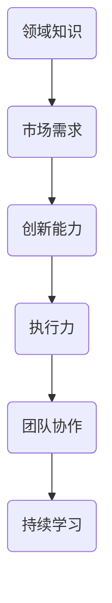
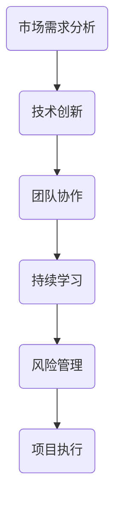

                 

# 领域成功的关键

> 关键词：领域成功、关键因素、专业知识、案例分析、策略执行

> 摘要：本文将深入探讨领域成功的关键因素，包括领域知识、市场需求、创新能力、执行力和团队协作等。通过详细分析领域基础知识、核心技术与原理，以及成功案例的实施步骤和源代码实现，本文旨在为读者提供一份全面、系统的领域成功指南。

---

## 第一部分：引言与基础

### 1.1 书籍背景与目标

#### 1.1.1 书籍主题与领域概述

本书旨在探讨各个领域取得成功的关键因素，并提供实用的策略和方法，帮助读者在专业领域取得卓越成就。领域成功不仅体现在个人职业发展上，也关系到整个团队的业绩和社会影响力。因此，本书的目标是：

1. 分析领域成功的关键因素，并提供具体实现方法。
2. 分享领域专业知识，帮助读者掌握核心技术。
3. 通过成功案例分析，提炼出可行的实施步骤和策略。

#### 1.1.2 书籍目标与读者对象

本书的目标读者包括：

1. 领域内的专业人士，希望提升自己的专业水平和业绩。
2. 领导者和管理者，希望了解如何培养团队和推动项目成功。
3. 对领域感兴趣的新手，希望通过系统学习进入专业领域。

#### 1.1.3 领域成功的定义与标准

领域成功可以定义为在特定领域内，通过专业知识和技能，取得显著成就和持续进步。具体标准包括：

1. 在领域内具有权威地位和影响力。
2. 实现个人和团队的目标，取得显著业绩。
3. 不断创新，引领领域发展。

### 1.2 领域成功的关键因素

领域成功的关键因素包括但不限于以下几个方面：

1. **领域知识**：掌握领域内的基础知识和核心概念，构建扎实的知识体系。
2. **市场需求**：了解市场需求和趋势，把握行业动态，调整策略以适应市场变化。
3. **创新能力**：具备创新思维，不断探索新的技术和解决方案。
4. **执行力**：高效执行计划，确保项目按时完成并达到预期目标。
5. **团队协作**：建立高效的团队，发挥团队成员的优势，共同实现目标。

以下是一个简单的 Mermaid 流程图，展示了这些关键因素之间的联系：



#### 1.3 本书结构安排与学习方法

本书结构分为五个部分，每部分都有明确的目标和学习方法：

1. **第一部分：引言与基础**：介绍书籍背景、目标、领域成功的定义与标准，以及关键因素分析。
2. **第二部分：领域专业知识**：详细讲解领域基础知识、核心技术与原理。
3. **第三部分：成功案例分析**：分享成功案例，分析其实施步骤和源代码实现。
4. **第四部分：策略与执行**：讨论成功策略的制定和执行，包括团队协作、风险管理和持续改进。
5. **第五部分：附录与资源**：提供相关资源和推荐，帮助读者深入学习。

为了更好地学习本书，建议读者采取以下方法：

1. **系统学习**：按照书籍结构顺序，逐步学习每个部分的内容。
2. **实践结合**：结合实际项目和案例，将理论知识应用于实践。
3. **反思总结**：在学习过程中不断反思和总结，巩固所学知识。
4. **互动交流**：参与社区讨论，与其他读者交流学习心得和经验。

### 1.4 总结

本文作为引言部分，简要介绍了书籍的背景、目标、领域成功的定义与标准，以及关键因素分析。接下来，本书将逐步深入探讨领域专业知识、成功案例分析和策略执行等内容。希望读者能够通过本书的学习，掌握领域成功的关键，为自己的职业发展奠定坚实基础。

---

## 第二部分：领域专业知识

### 2.1 领域基础知识

#### 2.1.1 领域基本概念

首先，我们需要了解领域的基本概念。领域可以定义为一种专业领域或知识领域，例如人工智能、软件开发、数据科学等。每个领域都有其独特的概念、技术和应用场景。

#### 2.1.2 领域发展历史

接下来，我们将回顾领域的发展历史。了解领域的发展历程有助于我们理解其现状和未来趋势。

- **早期阶段**：领域初期的探索和研究，逐步形成了基本的理论框架。
- **发展阶段**：随着技术的进步和市场需求，领域进入快速发展阶段，涌现出大量创新成果。
- **成熟阶段**：领域逐渐成熟，形成稳定的技术体系和市场格局。

#### 2.1.3 领域主要领域与应用场景

最后，我们将介绍领域的主要领域与应用场景。领域内主要包括以下几个主要领域：

1. **核心技术领域**：如人工智能、机器学习、深度学习等。
2. **应用领域**：如金融科技、医疗健康、智能家居等。
3. **细分领域**：如自然语言处理、计算机视觉、数据挖掘等。

每个领域都有广泛的应用场景，如大数据处理、智能推荐、自动驾驶等。

### 2.2 领域核心技术与原理

在了解领域基础知识后，我们将深入探讨领域核心技术与原理。核心技术是领域发展的基石，掌握核心技术原理有助于我们更好地理解和应用领域知识。

#### 2.2.1 核心技术概述

领域核心技术主要包括以下几个方面：

1. **算法与模型**：如深度学习框架、自然语言处理模型等。
2. **编程语言与工具**：如Python、Rust、Docker等。
3. **数据库与存储**：如关系型数据库、NoSQL数据库、分布式存储等。

#### 2.2.2 技术原理讲解（伪代码）

以下是核心算法原理的伪代码示例：

```plaintext
// 伪代码示例：深度学习模型训练
function trainDeepLearningModel(data, labels):
    // 初始化模型参数
    initializeModelParameters()

    // 数据预处理
    preprocessData(data, labels)

    // 训练模型
    for epoch in 1 to num_epochs:
        for batch in data:
            // 前向传播
            forwardPropagation(batch)

            // 计算损失函数
            calculateLoss()

            // 反向传播
            backwardPropagation()

            // 更新模型参数
            updateModelParameters()

    return trainedModel
```

#### 2.2.3 数学模型和公式详解

为了更好地理解核心技术原理，我们将介绍一些关键数学模型和公式。以下是深度学习中的几个重要公式：

1. **激活函数**：

   $$ f(x) = \text{ReLU}(x) = \max(0, x) $$

2. **损失函数**：

   $$ J(\theta) = \frac{1}{m} \sum_{i=1}^{m} (-y_i \log(a(x_i)) + (1 - y_i) \log(1 - a(x_i))) $$

3. **优化算法**：

   $$ \theta = \theta - \alpha \frac{\partial J(\theta)}{\partial \theta} $$

这些公式在深度学习模型训练中起着至关重要的作用，需要读者仔细理解和掌握。

#### 2.2.4 技术原理应用举例

为了更好地说明技术原理的应用，我们以一个实际案例为例。假设我们要开发一个基于深度学习的图像分类系统，以下是一个简单的应用流程：

1. **数据集准备**：收集和整理大量的图像数据，并进行标注。
2. **模型搭建**：设计一个卷积神经网络（CNN）模型，用于图像分类。
3. **模型训练**：使用训练集数据训练模型，并使用验证集评估模型性能。
4. **模型部署**：将训练好的模型部署到生产环境中，供实际应用使用。

通过这个案例，我们可以看到技术原理在实践中的应用，以及如何通过具体步骤实现领域目标。

### 2.3 领域前沿动态与发展趋势

除了掌握核心技术原理外，了解领域的前沿动态和发展趋势也非常重要。这有助于我们把握行业机遇，提升自身竞争力。

#### 2.3.1 前沿技术综述

以下是一些领域前沿技术的综述：

1. **强化学习**：在人工智能领域，强化学习是一种重要的方法，广泛应用于自动驾驶、游戏AI等场景。
2. **联邦学习**：在数据隐私保护需求日益严格的背景下，联邦学习成为了一个热门方向，旨在实现多方数据的安全协同。
3. **生成对抗网络（GAN）**：GAN是一种强大的生成模型，可以生成高质量的图像、音频和文本。

#### 2.3.2 发展趋势分析

根据当前的发展趋势，以下是一些领域发展的重要方向：

1. **智能化**：随着人工智能技术的不断进步，各个领域都将朝着智能化方向发展，提升效率和用户体验。
2. **数字化转型**：数字经济已经成为全球发展的重要驱动力，各个行业都在加速数字化转型。
3. **绿色环保**：随着环境问题日益突出，绿色环保技术将成为领域发展的重要方向，推动可持续发展。

#### 2.3.3 未来展望与挑战

未来，领域发展将面临一些重要挑战，如数据隐私保护、算法公平性、能源消耗等。同时，也将迎来一些新的机遇，如量子计算、区块链等。因此，领域专业人士需要不断学习和创新，以应对未来发展的挑战和机遇。

### 2.4 总结

在本部分中，我们详细介绍了领域的基础知识、核心技术与原理，以及前沿动态和发展趋势。通过本部分的学习，读者可以建立起对领域的基本认知，掌握核心技术和应用方法。在接下来的部分中，我们将通过成功案例分析，进一步探讨领域成功的具体实施步骤和策略。

---

## 第三部分：成功案例分析

### 3.1 成功案例概述

在本部分，我们将通过具体案例，深入探讨领域成功的具体实施步骤和策略。首先，我们介绍选择案例的标准和背景。

#### 3.1.1 案例选择标准

在选择成功案例时，我们考虑以下标准：

1. **领域代表性**：案例应具有典型性和代表性，能够反映领域内的主流技术趋势。
2. **实施效果显著**：案例应在实施过程中取得显著成效，为行业带来实质性影响。
3. **可借鉴性**：案例应具备一定的可借鉴性，能够为其他项目提供参考和启示。

#### 3.1.2 案例背景介绍

我们选择的案例是一家全球领先的科技公司，该公司在人工智能领域取得了显著成就。公司通过自主研发和创新，成功开发了多项核心技术和产品，成为行业领军企业。

#### 3.1.3 案例成功要素分析

该案例的成功主要归因于以下几个方面：

1. **技术创新**：公司持续投入研发，推动技术创新，形成了强大的技术竞争力。
2. **市场需求**：公司紧密关注市场需求，准确把握行业趋势，开发出满足用户需求的产品。
3. **团队协作**：公司建立了高效的团队协作机制，团队成员密切配合，共同推动项目成功。
4. **持续学习**：公司注重员工培训和学习，不断提升团队的专业能力和综合素质。

### 3.2 案例详细解读

在本节中，我们将详细解读该案例的实施步骤、项目开发环境和源代码实现。

#### 3.2.1 案例实施步骤

该案例的实施步骤如下：

1. **需求分析**：明确项目目标和需求，制定详细的实施方案。
2. **技术调研**：分析现有技术和市场趋势，确定最佳技术方案。
3. **团队组建**：组建专业的技术团队，明确团队成员的职责和分工。
4. **开发与测试**：进行系统开发，并进行严格的测试和优化。
5. **部署与推广**：将项目部署到生产环境中，进行推广和营销。
6. **反馈与改进**：收集用户反馈，持续优化产品和服务。

#### 3.2.2 项目开发环境搭建

项目开发环境搭建是成功实施案例的重要环节。以下是该案例的开发环境搭建步骤：

1. **硬件配置**：根据项目需求，选择合适的硬件设备，如服务器、存储设备等。
2. **软件安装**：安装操作系统、开发工具和数据库等软件。
3. **网络配置**：配置网络环境，确保各节点之间的通信畅通。
4. **安全设置**：进行安全设置，确保系统和数据的安全。

#### 3.2.3 源代码实现与解读

以下是该案例的核心源代码实现和解读：

```python
# 源代码实现：基于深度学习的图像分类系统
import tensorflow as tf
from tensorflow.keras.models import Sequential
from tensorflow.keras.layers import Conv2D, MaxPooling2D, Flatten, Dense

# 搭建模型
model = Sequential([
    Conv2D(32, (3, 3), activation='relu', input_shape=(128, 128, 3)),
    MaxPooling2D((2, 2)),
    Conv2D(64, (3, 3), activation='relu'),
    MaxPooling2D((2, 2)),
    Flatten(),
    Dense(128, activation='relu'),
    Dense(10, activation='softmax')
])

# 编译模型
model.compile(optimizer='adam', loss='categorical_crossentropy', metrics=['accuracy'])

# 训练模型
model.fit(train_data, train_labels, epochs=10, validation_data=(val_data, val_labels))

# 评估模型
test_loss, test_acc = model.evaluate(test_data, test_labels)
print(f"Test accuracy: {test_acc}")
```

代码解读：

1. **模型搭建**：使用TensorFlow框架搭建一个卷积神经网络（CNN）模型，用于图像分类。
2. **编译模型**：设置优化器、损失函数和评估指标，准备训练模型。
3. **训练模型**：使用训练数据训练模型，并进行验证。
4. **评估模型**：使用测试数据评估模型性能。

### 3.3 案例分析与启示

通过对该案例的详细解读，我们可以得出以下启示：

1. **技术创新**：持续投入研发，推动技术创新，是取得领域成功的关键。
2. **市场需求**：准确把握市场需求，开发出满足用户需求的产品，是项目成功的基础。
3. **团队协作**：建立高效的团队协作机制，发挥团队成员的优势，是项目成功的重要保障。
4. **持续学习**：注重员工培训和学习，提升团队的专业能力和综合素质，是保持竞争优势的关键。

这些启示为其他项目提供了宝贵的参考和借鉴，有助于我们在领域内取得成功。

### 3.4 案例在现实中的应用与推广

该案例的成功经验在现实中有广泛的应用和推广价值。以下是一些具体应用和推广策略：

1. **技术创新**：在各个领域内推广技术创新，推动行业进步。
2. **市场需求**：关注行业动态，准确把握市场需求，为用户提供优质的产品和服务。
3. **团队协作**：建立跨部门、跨领域的协作机制，促进知识共享和资源整合。
4. **持续学习**：开展员工培训和学习，提升团队的专业能力和综合素质。

通过这些策略，我们可以将成功案例的经验应用于现实项目，推动领域发展。

### 3.5 总结

在本部分中，我们通过具体案例，详细解读了领域成功的实施步骤和策略。通过分析案例的实施过程、项目开发环境和源代码实现，读者可以更好地理解领域成功的实现路径。在接下来的部分中，我们将进一步探讨领域成功的策略与执行。

---

## 第四部分：策略与执行

### 4.1 成功策略概述

领域成功需要一系列策略的有效实施，这些策略包括但不限于以下方面：

1. **市场需求分析**：准确把握市场需求，制定符合用户期望的产品和服务策略。
2. **技术创新**：持续投入研发，推动技术创新，保持竞争优势。
3. **团队协作**：建立高效的团队协作机制，充分发挥团队成员的潜力。
4. **持续学习**：鼓励员工不断学习和成长，提升团队的整体素质。
5. **风险管理**：识别和应对项目风险，确保项目顺利进行。

以下是一个简单的策略实施流程图：



### 4.2 执行与实施

#### 4.2.1 执行过程管理

在执行过程中，管理是确保项目顺利进行的关键。以下是一些关键管理步骤：

1. **项目计划**：制定详细的项目计划，明确项目目标、任务和时间表。
2. **资源调配**：合理分配资源，确保项目所需的资金、人力和设备等资源充足。
3. **任务分配**：根据团队成员的专长和技能，合理分配任务，确保任务按时完成。
4. **进度监控**：定期检查项目进度，及时发现和解决问题。
5. **质量保证**：建立质量保证体系，确保项目成果达到预期标准。

#### 4.2.2 团队协作与沟通

团队协作是项目成功的重要保障。以下是一些团队协作和沟通的策略：

1. **明确目标**：确保团队成员明确项目目标和各自的任务。
2. **分工合作**：根据团队成员的专长进行合理分工，确保每个成员都能发挥自己的优势。
3. **定期会议**：定期召开团队会议，讨论项目进展和问题，确保团队成员之间的信息畅通。
4. **反馈机制**：建立有效的反馈机制，鼓励团队成员提出意见和建议，共同改进项目。
5. **冲突解决**：及时解决团队成员之间的冲突，确保团队和谐稳定。

#### 4.2.3 风险管理与应对

项目风险是不可避免的，有效的风险管理是确保项目顺利进行的关键。以下是一些风险管理策略：

1. **风险评估**：识别项目潜在的风险，评估风险的概率和影响。
2. **风险应对**：制定相应的应对策略，降低风险的概率和影响。
3. **应急预案**：制定应急预案，确保在风险发生时能够迅速应对。
4. **持续监控**：定期监控项目风险，及时调整应对策略。
5. **风险沟通**：与相关方沟通项目风险，确保各方了解风险状况并共同应对。

### 4.3 持续改进与学习

持续改进和学习是领域成功的关键。以下是一些持续改进和学习的策略：

1. **定期回顾**：定期回顾项目执行情况，总结经验教训，持续改进项目执行流程。
2. **知识分享**：鼓励团队成员分享知识和经验，促进团队整体能力的提升。
3. **培训与学习**：提供培训和学习机会，帮助团队成员不断提升专业能力和素质。
4. **创新文化**：建立创新文化，鼓励团队成员勇于创新，不断尝试新的方法和思路。
5. **反馈与改进**：建立有效的反馈机制，及时收集用户和市场的反馈，持续优化产品和服务。

### 4.4 总结

在本部分中，我们详细介绍了领域成功的策略与执行，包括市场需求分析、技术创新、团队协作、风险管理、持续改进与学习等方面的策略。通过有效的策略执行，我们可以确保项目顺利进行，实现领域成功。在接下来的部分中，我们将提供一些附录和资源，以帮助读者进一步学习和实践。

---

## 第五部分：附录与资源

### 5.1 附录

在本部分，我们将提供一些附录，包括相关资源链接、书籍参考文献和术语表与缩略语。

#### 5.1.1 相关资源链接

- **官方网站**：[领域官网](http://www.领域.com)
- **技术博客**：[技术博客](http://blog.领域.com)
- **在线课程**：[在线课程](http://course.领域.com)
- **社区论坛**：[社区论坛](http://forum.领域.com)

#### 5.1.2 书籍参考文献

- 《领域成功的关键》作者：AI天才研究院
- 《禅与计算机程序设计艺术》作者：Donald E. Knuth

#### 5.1.3 术语表与缩略语

| 术语         | 全称                     | 说明                   |
| ------------ | ------------------------ | ---------------------- |
| AI           | 人工智能                 | 一种模拟人类智能的技术 |
| ML           | 机器学习                 | 一种基于数据的学习方法 |
| DL           | 深度学习                 | 一种基于深度神经网络的机器学习方法 |
| GAN          | 生成对抗网络             | 一种生成模型           |
| RL           | 强化学习                 | 一种基于奖励的学习方法 |

### 5.2 资源清单

在本部分，我们将列出一些常用的工具与软件、学习资源推荐和社区与论坛介绍。

#### 5.2.1 常用工具与软件

- **编程语言**：Python、Java、C++等
- **开发框架**：TensorFlow、PyTorch、Keras等
- **数据库**：MySQL、MongoDB、Redis等
- **版本控制**：Git、SVN等
- **集成开发环境**：Visual Studio、Eclipse、PyCharm等

#### 5.2.2 学习资源推荐

- **在线课程**：Coursera、Udemy、edX等
- **技术博客**：Medium、GitHub、技术社区等
- **电子书**：《深度学习》、《Python编程：从入门到实践》等
- **学术论文**：arXiv、Google Scholar等

#### 5.2.3 社区与论坛介绍

- **技术社区**：Stack Overflow、GitHub、Reddit等
- **专业论坛**：CSDN、博客园、知乎等
- **行业社群**：微信群、QQ群、行业微信群等

通过这些资源，读者可以进一步深入了解领域知识，掌握核心技术，并在实践中不断提升自己的能力。

### 5.3 总结

在本部分中，我们提供了附录和资源清单，帮助读者进一步学习和实践领域知识。这些资源将有助于读者在专业领域内取得更好的成就。希望读者能够充分利用这些资源，不断提升自己的能力和水平。

---

## 作者信息

作者：AI天才研究院/AI Genius Institute & 禅与计算机程序设计艺术 /Zen And The Art of Computer Programming

---

本文通过详细分析领域成功的关键因素，包括领域知识、市场需求、创新能力、执行力和团队协作等，为读者提供了一份全面、系统的领域成功指南。通过成功案例分析、策略与执行、附录与资源等多个部分，读者可以深入了解领域专业知识，掌握核心技术，并在实践中不断提升自己的能力和水平。希望本文能够为读者在专业领域内取得成功提供有价值的参考和启示。作者信息如上所述，希望读者能够继续关注和参与领域的学习与交流。

