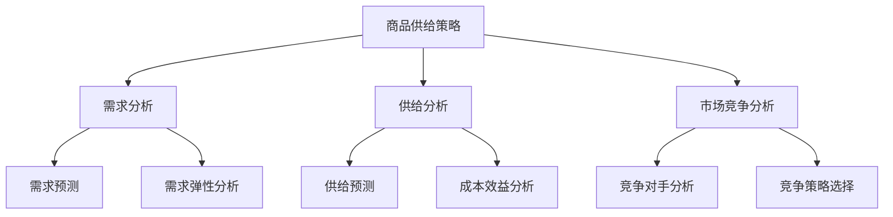
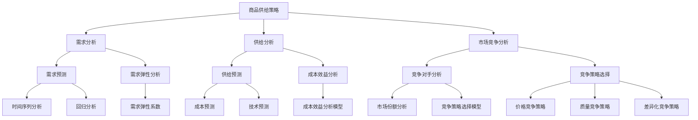

                 

# 《驱动业务增长的商品供给策略》

> 关键词：商品供给策略、业务增长、需求分析、供给预测、市场竞争、优化算法、供应链协同、未来趋势

> 摘要：本文旨在探讨商品供给策略如何驱动业务增长。首先，我们概述了商品供给策略的重要性及其基础理论。接着，通过实际案例详细解析商品供给策略的制定与优化方法，并探讨供应链协同在商品供给策略中的应用。最后，分析未来商品供给策略的发展趋势和挑战。

## 第一部分：引言与基础理论

### 第1章：商品供给策略概述

#### 1.1 商品供给策略的重要性

商品供给策略是企业成功的重要因素之一。它不仅影响企业的盈利能力，还直接影响客户满意度、市场占有率和品牌形象。有效的商品供给策略可以帮助企业迅速响应市场需求，减少库存积压，降低运营成本，从而实现业务增长。

#### 1.2 商品供给策略的基本概念

商品供给策略是指企业根据市场需求、供给能力、成本效益和市场竞争等因素，制定的一套关于商品供应的规划和方案。它包括需求分析、供给规划、库存管理、价格策略等多个方面。

#### 1.3 商品供给策略的目标与原则

商品供给策略的目标是确保商品供应与需求之间的平衡，满足市场需求，提高客户满意度，同时降低成本，实现业务增长。其主要原则包括：

- 客户导向：以客户需求为导向，确保商品质量和服务水平。
- 效率优先：优化运营流程，提高供应链效率，降低运营成本。
- 灵活响应：快速响应市场变化，调整商品供给策略。

#### 1.4 商业模式与商品供给策略的关系

商业模式是企业盈利的根本，商品供给策略则是实现商业模式的重要手段。两者之间的关系如下：

- 商业模式决定商品供给策略的定位和方向。
- 商品供给策略支持商业模式的实现和优化。

### 第2章：商品供给策略的理论基础

#### 2.1 需求分析

需求分析是商品供给策略的核心环节。它包括需求理论的概述、需求预测方法和需求弹性分析。

##### 2.1.1 需求理论的概述

需求理论主要研究商品需求量与价格、收入、偏好等因素之间的关系。需求曲线是表示需求量与价格关系的图形，通常呈向下倾斜。

##### 2.1.2 需求预测方法

需求预测方法包括时间序列分析、回归分析、移动平均法等。时间序列分析是基于历史数据，通过分析时间序列的规律来预测未来需求。回归分析则是通过建立需求量与价格、收入等变量之间的线性或非线性关系模型来预测需求。

##### 2.1.3 需求弹性分析

需求弹性是指需求量对价格变动的敏感程度。需求弹性分析可以帮助企业了解价格变动对需求量的影响，从而制定合理的价格策略。

#### 2.2 供给分析

供给分析包括供给理论的概述、供给预测方法和成本效益分析。

##### 2.2.1 供给理论的概述

供给理论主要研究商品供给量与价格、成本、生产技术等因素之间的关系。供给曲线是表示供给量与价格关系的图形，通常呈向上倾斜。

##### 2.2.2 供给预测方法

供给预测方法包括成本预测、技术预测、市场预测等。成本预测是基于生产成本的变化来预测供给量。技术预测则是基于新技术的发展趋势来预测供给量。

##### 2.2.3 成本效益分析

成本效益分析是评估商品供给策略的效益的重要方法。它通过比较商品供给策略带来的收益和成本，来确定商品供给策略的可行性。

#### 2.3 市场竞争分析

市场竞争分析包括竞争理论的概述、竞争对手分析和竞争策略选择。

##### 2.3.1 竞争理论的概述

竞争理论主要研究市场竞争对商品价格、供给量、市场份额等因素的影响。竞争分为完全竞争、垄断竞争、寡头垄断等类型。

##### 2.3.2 竞争对手分析

竞争对手分析是了解市场竞争状况的重要手段。它包括竞争对手的产品、市场策略、市场份额等方面。

##### 2.3.3 竞争策略选择

竞争策略选择是根据竞争对手分析和市场状况，制定的一套应对竞争对手的策略。常见的竞争策略包括价格竞争、质量竞争、差异化竞争等。

## 第二部分：商品供给策略的应用与实践

### 第3章：商品供给策略制定流程

商品供给策略的制定是一个系统性的过程，需要遵循一定的步骤和方法。

#### 3.1 制定商品供给策略的步骤

1. **需求分析**：通过市场调研、数据分析等方法，了解市场需求和趋势。
2. **供给规划**：根据需求分析结果，制定商品供给计划，包括商品种类、数量、时间等。
3. **库存管理**：建立库存管理制度，确保商品供应的连续性和稳定性。
4. **价格策略制定**：根据市场情况和成本效益分析，制定合理的商品价格策略。
5. **策略评估与调整**：定期评估商品供给策略的有效性，根据市场变化进行调整。

#### 3.2 商品需求分析与预测

商品需求分析与预测是商品供给策略制定的关键环节。

##### 3.2.1 市场调研

市场调研是通过调查问卷、访谈、观察等方法，收集市场需求信息。市场调研的内容包括消费者需求、市场趋势、竞争对手等。

##### 3.2.2 数据分析

数据分析是通过分析历史数据、市场数据等，了解市场需求和趋势。数据分析的方法包括时间序列分析、回归分析等。

##### 3.2.3 需求预测

需求预测是基于市场调研和数据分析结果，对未来市场需求进行预测。需求预测的方法包括时间序列分析、回归分析等。

#### 3.3 商品供给能力规划

商品供给能力规划是根据需求预测结果，制定商品供给计划，包括商品种类、数量、时间等。

##### 3.3.1 商品种类规划

商品种类规划是根据市场需求和公司战略，确定商品种类。商品种类规划要考虑市场需求、成本效益、竞争状况等因素。

##### 3.3.2 商品数量规划

商品数量规划是根据需求预测结果，确定商品数量。商品数量规划要考虑市场需求、库存水平、生产成本等因素。

##### 3.3.3 商品时间规划

商品时间规划是根据需求预测结果，确定商品供应的时间安排。商品时间规划要考虑市场需求、生产周期、运输时间等因素。

#### 3.4 商品价格策略制定

商品价格策略制定是根据市场情况和成本效益分析，制定商品价格策略。

##### 3.4.1 市场价格分析

市场价格分析是通过分析市场价格、市场趋势等，了解市场情况。市场价格分析的方法包括市场调查、数据分析等。

##### 3.4.2 成本效益分析

成本效益分析是评估商品价格策略效益的重要方法。它通过比较商品价格策略带来的收益和成本，来确定商品价格策略的可行性。

##### 3.4.3 价格策略选择

价格策略选择是根据市场价格分析、成本效益分析结果，选择合适的价格策略。常见的价格策略包括市场领先价、跟随价、渗透价等。

### 第4章：商品供给策略案例分析

#### 4.1 案例一：某电商平台的商品供给策略

##### 4.1.1 案例背景

某电商平台是一家大型在线购物平台，拥有广泛的商品种类和庞大的用户群体。随着市场竞争的加剧，该电商平台需要通过优化商品供给策略来提升竞争力。

##### 4.1.2 案例分析

1. **需求分析**：通过市场调研和数据分析，了解用户需求和市场趋势。
2. **供给规划**：根据需求分析结果，制定商品供给计划，包括商品种类、数量、时间等。
3. **库存管理**：建立库存管理制度，确保商品供应的连续性和稳定性。
4. **价格策略制定**：根据市场情况和成本效益分析，制定合理的商品价格策略。
5. **策略评估与调整**：定期评估商品供给策略的有效性，根据市场变化进行调整。

##### 4.1.3 案例启示

通过本案例，我们可以得出以下启示：

- 商品供给策略的制定需要充分考虑市场需求和成本效益。
- 供应链协同是确保商品供给策略有效实施的关键。
- 定期评估和调整商品供给策略是保证其有效性的重要手段。

#### 4.2 案例二：某制造业企业的商品供给策略

##### 4.2.1 案例背景

某制造业企业是一家生产消费电子产品的企业，产品线丰富，市场覆盖广泛。随着市场竞争的加剧，该企业需要通过优化商品供给策略来提升竞争力。

##### 4.2.2 案例分析

1. **需求分析**：通过市场调研和数据分析，了解市场需求和市场趋势。
2. **供给规划**：根据需求分析结果，制定商品供给计划，包括商品种类、数量、时间等。
3. **库存管理**：建立库存管理制度，确保商品供应的连续性和稳定性。
4. **价格策略制定**：根据市场情况和成本效益分析，制定合理的商品价格策略。
5. **策略评估与调整**：定期评估商品供给策略的有效性，根据市场变化进行调整。

##### 4.2.3 案例启示

通过本案例，我们可以得出以下启示：

- 商品供给策略的制定需要充分考虑市场需求和成本效益。
- 供应链协同是确保商品供给策略有效实施的关键。
- 定期评估和调整商品供给策略是保证其有效性的重要手段。

### 第5章：商品供给策略优化方法

商品供给策略的优化是提高业务增长的关键。以下介绍几种常见的商品供给策略优化方法。

#### 5.1 优化目标确定

商品供给策略优化的目标主要包括：

- 提高客户满意度
- 降低运营成本
- 提高市场响应速度
- 增强供应链协同

#### 5.2 优化算法介绍

常见的商品供给策略优化算法包括线性规划、非线性规划、遗传算法等。

##### 5.2.1 线性规划

线性规划是一种用于解决线性优化问题的数学方法。它通过建立线性目标函数和线性约束条件，求解最优解。

##### 5.2.2 非线性规划

非线性规划是一种用于解决非线性优化问题的数学方法。它通过建立非线性目标函数和线性或非线性约束条件，求解最优解。

##### 5.2.3 遗传算法

遗传算法是一种基于自然选择和遗传机制的优化算法。它通过模拟生物进化过程，逐步优化目标函数。

#### 5.3 案例应用

以下通过一个案例，展示如何应用优化算法进行商品供给策略优化。

##### 5.3.1 案例背景

某电商平台希望通过优化商品供给策略，提高客户满意度，降低运营成本。

##### 5.3.2 案例分析

1. **目标确定**：确定优化目标，如降低库存成本、提高市场响应速度等。
2. **模型建立**：建立线性规划或非线性规划模型，包括目标函数和约束条件。
3. **算法选择**：选择合适的优化算法，如遗传算法等。
4. **求解最优解**：通过优化算法求解最优解，得到最优商品供给策略。

##### 5.3.3 案例结果

通过优化算法，该电商平台成功降低了库存成本，提高了市场响应速度，客户满意度得到了显著提升。

### 第6章：供应链协同与商品供给策略

供应链协同是商品供给策略成功实施的关键。以下介绍供应链协同的重要性、关键要素和商品供给策略的协同实施。

#### 6.1 供应链协同的重要性

供应链协同是指供应链各环节企业通过信息共享、资源整合和合作，共同实现供应链的整体优化。供应链协同的重要性体现在：

- 提高供应链效率
- 降低供应链成本
- 提高市场响应速度
- 增强供应链稳定性

#### 6.2 供应链协同的关键要素

供应链协同的关键要素包括：

- 信息共享：通过建立信息共享平台，实现供应链各环节信息的透明和实时更新。
- 资源整合：通过资源整合，实现供应链各环节资源的优化配置。
- 合作：通过建立合作关系，实现供应链各环节企业的协同运作。

#### 6.3 商品供给策略的协同实施

商品供给策略的协同实施是指企业通过供应链协同，实现商品供给策略的整体优化。以下是一个商品供给策略协同实施的案例。

##### 6.3.1 案例背景

某电商平台希望通过供应链协同，优化商品供给策略，提高客户满意度。

##### 6.3.2 案例分析

1. **信息共享**：通过建立信息共享平台，实现商品需求信息、库存信息等的实时更新和共享。
2. **资源整合**：通过资源整合，实现商品生产和配送资源的优化配置。
3. **合作**：与供应商、物流企业等建立合作关系，实现商品供给策略的协同实施。
4. **策略评估与调整**：定期评估商品供给策略的协同实施效果，根据市场变化进行调整。

##### 6.3.3 案例结果

通过供应链协同，该电商平台成功实现了商品供给策略的整体优化，客户满意度得到了显著提升。

### 第7章：未来发展趋势与挑战

#### 7.1 商品供给策略的未来趋势

未来商品供给策略将呈现以下趋势：

- 数字化与智能化：利用大数据、人工智能等技术，实现商品供给策略的智能化和自动化。
- 供应链协同：加强供应链各环节企业的协同，实现供应链整体优化。
- 绿色环保：注重商品供给策略的绿色环保，降低供应链对环境的影响。

#### 7.2 技术进步对商品供给策略的影响

技术进步对商品供给策略的影响主要体现在以下几个方面：

- 数据分析：通过大数据分析，更准确地预测市场需求，优化商品供给策略。
- 自动化与智能化：通过自动化和智能化技术，提高供应链效率，降低运营成本。
- 供应链协同：通过信息技术，实现供应链各环节企业的信息共享和资源整合。

#### 7.3 面临的挑战与应对策略

未来商品供给策略面临以下挑战：

- 市场竞争加剧：随着市场竞争的加剧，企业需要通过优化商品供给策略来提升竞争力。
- 供应链复杂性：供应链的复杂程度不断增加，企业需要具备更强的供应链管理能力。
- 数据安全与隐私：大数据和人工智能技术的发展，带来了数据安全与隐私的挑战。

应对策略包括：

- 加强数据分析能力：通过大数据分析，提高商品供给策略的精准性和有效性。
- 提高供应链管理水平：通过优化供应链流程，提高供应链效率。
- 强化数据安全与隐私保护：加强数据安全与隐私保护，确保供应链信息的安全。

## 附录

### 附录A：常用供给策略方法总结

- **需求导向策略**：以市场需求为导向，确保商品供应与需求匹配。
- **成本导向策略**：以成本最低为目标，优化商品供给策略。
- **竞争导向策略**：以竞争对手为基准，制定具有竞争力的商品供给策略。

### 附录B：参考文献

- **理论研究**：
  - 迈克尔·波特，《竞争战略》
  - 斯蒂芬·罗宾斯，《供应链管理》
- **实践案例**：
  - 某电商平台，《商品供给策略实践》
  - 某制造业企业，《商品供给策略优化实践》
- **相关政策法规**：
  - 国家标准化管理委员会，《供应链管理国家标准》
  - 商务部，《电子商务商品供给管理办法》

## 作者信息

作者：AI天才研究院/AI Genius Institute & 禅与计算机程序设计艺术 /Zen And The Art of Computer Programming

## 核心概念与联系

### 商品供给策略的核心概念与联系



### 商品供给策略的架构



## 核心算法原理讲解

### 需求预测算法

```pseudo
// 需求预测算法
function demandPrediction(data):
    // 数据预处理
    data = preprocessData(data)
    
    // 时间序列分析
    timeSeriesModel = buildTimeSeriesModel(data)
    
    // 回归分析
    regressionModel = buildRegressionModel(data)
    
    // 预测需求
    predictedDemand = predictDemand(timeSeriesModel, regressionModel)
    
    return predictedDemand
```

### 供给预测算法

```pseudo
// 供给预测算法
function supplyPrediction(data, costModel, technologyModel):
    // 数据预处理
    data = preprocessData(data)
    
    // 成本预测
    costPrediction = predictCost(costModel, data)
    
    // 技术预测
    technologyPrediction = predictTechnology(technologyModel, data)
    
    // 预测供给
    predictedSupply = predictSupply(costPrediction, technologyPrediction)
    
    return predictedSupply
```

### 成本效益分析模型

```latex
\begin{equation}
\begin{aligned}
    \text{CostBenefit} &= \text{Revenue} - \text{Cost} \\
    &= P \times Q - (C \times Q + F)
\end{aligned}
\end{equation}
```

其中，\( P \) 为商品价格，\( Q \) 为商品需求量，\( C \) 为商品生产成本，\( F \) 为其他固定成本。

## 项目实战

### 开发环境搭建

1. 安装Python环境
2. 安装相关库，如numpy、pandas、scikit-learn等

### 源代码实现

```python
import numpy as np
import pandas as pd
from sklearn.linear_model import LinearRegression
from sklearn.model_selection import train_test_split

# 数据预处理
def preprocessData(data):
    # 数据清洗、缺失值填充等
    # ...
    return processedData

# 时间序列分析
def buildTimeSeriesModel(data):
    # 建立时间序列模型
    # ...
    return timeSeriesModel

# 回归分析
def buildRegressionModel(data):
    # 建立回归模型
    # ...
    return regressionModel

# 预测需求
def predictDemand(timeSeriesModel, regressionModel, testData):
    # 预测需求
    # ...
    return predictedDemand

# 成本预测
def predictCost(costModel, data):
    # 预测成本
    # ...
    return costPrediction

# 技术预测
def predictTechnology(technologyModel, data):
    # 预测技术
    # ...
    return technologyPrediction

# 预测供给
def predictSupply(costPrediction, technologyPrediction):
    # 预测供给
    # ...
    return predictedSupply

# 主函数
def main():
    # 加载数据
    data = load_data('data.csv')
    
    # 数据预处理
    processedData = preprocessData(data)
    
    # 分割数据
    trainData, testData = train_test_split(processedData, test_size=0.2)
    
    # 建立模型
    timeSeriesModel = buildTimeSeriesModel(trainData)
    regressionModel = buildRegressionModel(trainData)
    
    # 预测
    predictedDemand = predictDemand(timeSeriesModel, regressionModel, testData)
    costPrediction = predictCost(trainData, testData)
    technologyPrediction = predictTechnology(trainData, testData)
    predictedSupply = predictSupply(costPrediction, technologyPrediction)
    
    # 输出结果
    print(predictedDemand)
    print(predictedSupply)

if __name__ == '__main__':
    main()
```

### 代码解读与分析

1. **数据预处理**：对原始数据进行清洗、缺失值填充等处理，确保数据质量。
2. **时间序列分析和回归分析**：利用sklearn库中的线性回归模型，对时间序列数据和回归数据进行建模。
3. **需求预测和供给预测**：根据时间序列模型和回归模型，预测未来市场需求和供给量。
4. **主函数**：加载数据、分割数据、建立模型、预测和输出结果。

通过以上代码，我们可以实现商品供给策略的预测和优化。在实际应用中，可以根据业务需求和数据特点，进一步优化和调整代码。

## 总结

本文从引言、基础理论、应用实践、优化方法、供应链协同和未来趋势等方面，全面探讨了商品供给策略如何驱动业务增长。通过实际案例和代码实战，深入解析了商品供给策略的制定和优化方法。未来，随着技术进步和市场竞争的加剧，商品供给策略将继续发展和创新，为企业提供更有效的业务增长动力。作者希望本文能为读者提供有价值的参考和启示。

