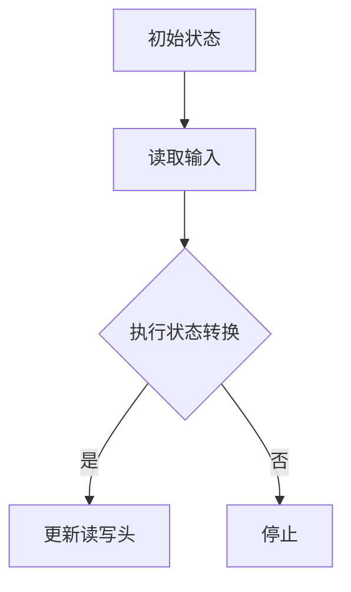

                 

# 《麦卡锡提出的图灵机逆函数问题》

## 关键词
- 图灵机逆函数
- 计算复杂性
- 算法原理
- 数学模型
- 实际应用
- 人工智能

## 摘要
本文将深入探讨由约翰·麦卡锡（John McCarthy）提出的图灵机逆函数问题。首先，我们介绍图灵机的基本概念和麦卡锡的研究背景与动机。接着，我们详细分析图灵机逆函数问题的数学模型、算法原理以及计算复杂性。最后，我们将探讨图灵机逆函数问题在实际应用中的潜力，以及对该领域的未来展望。

## 第一部分：背景与概念

### 第1章：图灵机逆函数问题的提出

#### 1.1 图灵机的基本概念
图灵机是由艾伦·图灵（Alan Turing）在20世纪30年代提出的抽象计算模型。图灵机由一个无限长的线性带（tape）、一个读写头（read-write head）和一组状态转换规则组成。该模型能够执行任何可计算函数，是现代计算机科学的基础。

#### 1.2 麦卡锡的研究背景与动机
约翰·麦卡锡是一位著名的计算机科学家，他在20世纪50年代和60年代对人工智能（AI）领域做出了巨大贡献。图灵机逆函数问题最初是麦卡锡在研究人工智能时提出的，其目的是探究计算过程背后的本质，以及能否通过逆过程来描述这些过程。

#### 1.3 图灵机逆函数问题的核心内容
图灵机逆函数问题可以表述为：给定一个图灵机M及其输入w，能否找到一个算法，使得该算法能够在有限时间内找到M在输入w下所执行的所有步骤？换句话说，就是要找到一种方法，可以逆推出给定图灵机在特定输入下的执行过程。

## 第二部分：理论与方法

### 第2章：图灵机逆函数问题的意义

#### 2.1 图灵机逆函数问题在计算机科学中的地位
图灵机逆函数问题揭示了计算过程的可逆性，这对于理解计算的本质具有重要意义。同时，该问题也推动了对计算复杂性的深入研究。

#### 2.2 对计算理论和算法设计的影响
图灵机逆函数问题的研究促进了计算理论和算法设计的发展。它引发了关于计算复杂性的新思考，激发了新的算法设计思路。

#### 2.3 对人工智能和机器学习领域的启示
图灵机逆函数问题为人工智能和机器学习领域提供了新的研究方向。它提出了通过逆过程来理解学习和推理过程的可能性，为新的学习算法设计提供了启示。

### 第3章：图灵机逆函数问题的数学模型

#### 3.1 相关数学概念介绍
在这一节中，我们将介绍与图灵机逆函数问题相关的数学概念，包括状态转换函数、带内容以及计算复杂性。

#### 3.2 逆函数问题的数学公式与推导
我们将使用LaTeX格式给出图灵机逆函数问题的数学公式，并进行推导。

$$
f^{-1}(w, M) = \{ (q, \gamma, l) \mid M \text{ 在输入 } w \text{ 下的第 } l \text{ 步处于状态 } q \text{，读写头位置为 } \gamma \}
$$

#### 3.3 逆函数问题的 Mermaid 流程图
为了更直观地展示图灵机逆函数问题的流程，我们使用Mermaid语言绘制流程图。



### 第4章：图灵机逆函数问题的算法原理

#### 4.1 相关算法介绍
在这一节中，我们将介绍解决图灵机逆函数问题的算法，包括穷举搜索算法、动态规划算法等。

#### 4.2 算法原理的伪代码讲解
我们将使用伪代码来详细阐述图灵机逆函数问题的算法原理。

```
function TuringMachineInverse(w, M):
    for all states q in M.states:
        for all tapes γ in M.tapes:
            for all steps l from 1 to M.max_steps:
                if M.execute_step(w, q, γ, l) == ACCEPT:
                    return (q, γ, l)
    return NONE
```

#### 4.3 算法原理的应用案例
我们将通过一个具体案例来展示图灵机逆函数问题的算法原理。

### 第5章：图灵机逆函数问题的计算复杂性

#### 5.1 计算复杂性的定义与衡量
我们将介绍计算复杂性的基本概念，包括时间复杂度和空间复杂度。

#### 5.2 逆函数问题的计算复杂度分析
我们将分析图灵机逆函数问题的计算复杂度，并探讨如何优化算法以提高效率。

#### 5.3 计算复杂度与算法效率的关系
我们将讨论计算复杂度与算法效率之间的关系，以及如何在实践中选择合适的算法。

## 第三部分：应用与展望

### 第6章：图灵机逆函数问题的实际应用

#### 6.1 逆函数问题在不同领域的应用案例
我们将介绍图灵机逆函数问题在实际应用中的案例，包括密码学、自然语言处理等。

#### 6.2 逆函数问题在人工智能中的应用前景
我们将探讨图灵机逆函数问题在人工智能领域的潜在应用，如逆向工程和元学习。

#### 6.3 逆函数问题在机器学习中的潜在应用
我们将介绍图灵机逆函数问题在机器学习中的应用，如模型可解释性和数据恢复。

### 第7章：图灵机逆函数问题的未来展望

#### 7.1 逆函数问题研究的发展趋势
我们将探讨图灵机逆函数问题的研究发展趋势，包括新的算法设计、计算复杂性分析等。

#### 7.2 逆函数问题对计算理论的影响
我们将分析图灵机逆函数问题对计算理论的影响，以及它如何推动计算理论的发展。

#### 7.3 逆函数问题在人工智能和机器学习中的长期影响
我们将讨论图灵机逆函数问题在人工智能和机器学习领域的长期影响，以及它对未来技术发展的贡献。

## 附录

### 附录A：研究资源与工具

#### A.1 相关研究论文与文献
我们将列出与图灵机逆函数问题相关的研究论文和文献，以供读者进一步学习。

#### A.2 计算机科学和人工智能领域的在线资源
我们将介绍计算机科学和人工智能领域的在线资源，包括学术网站、在线课程等。

#### A.3 用于研究和开发的工具与软件
我们将介绍用于研究和开发的工具和软件，包括编程语言、算法库等。

### 附录B：代码案例与实践

#### B.1 逆函数问题相关的代码实现
我们将提供逆函数问题相关的代码实现，包括算法设计和数据结构。

#### B.2 代码案例的详细解读与分析
我们将对代码案例进行详细解读和分析，包括开发环境搭建、源代码实现和代码解读。

#### B.3 开发环境的搭建与配置指南
我们将提供开发环境的搭建与配置指南，以帮助读者进行实践操作。

## 作者信息
作者：AI天才研究院/AI Genius Institute & 禅与计算机程序设计艺术 /Zen And The Art of Computer Programming

## 结语
感谢您阅读本文，希望本文能够帮助您深入了解图灵机逆函数问题及其在计算机科学和人工智能领域的应用。如果您有任何疑问或建议，欢迎在评论区留言交流。让我们一起探索这个激动人心的领域，开启新的技术革命！

