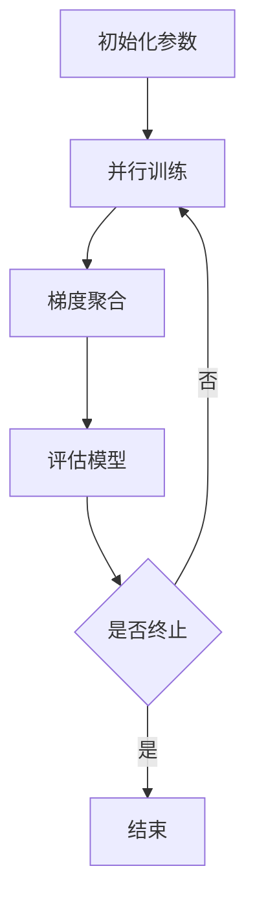

                 

# 《A3C(Asynchronous Advantage Actor-Critic) - 原理与代码实例讲解》

> 关键词：A3C, 强化学习，并行训练，Actor-Critic，代码实例

> 摘要：本文将深入探讨A3C（Asynchronous Advantage Actor-Critic）算法的原理，并通过代码实例对其进行详细讲解。我们将从A3C的基础理论开始，逐步深入其数学模型和算法流程，并最终通过实际案例讲解A3C的应用和性能优化方法。

### 引言

A3C（Asynchronous Advantage Actor-Critic）算法是一种在强化学习领域中备受关注的算法。它的核心思想是将Actor-Critic算法与并行训练相结合，从而提高了训练效率和算法性能。A3C算法的出现，极大地推动了强化学习在实际应用中的发展，尤其是在需要高并发处理的场景中。

本文将分为以下几个部分：

1. **A3C基础理论**：介绍强化学习的基本概念，A3C算法的定义和原理，以及其发展历程和应用领域。
2. **A3C算法原理详解**：详细解释马尔可夫决策过程、Q-Learning算法、Advantage Actor-Critic算法和A3C算法的核心思想。
3. **A3C算法数学模型详解**：深入讨论期望回报函数、价值函数与策略函数、泛化能力与泛化误差，以及A3C算法的数学模型和算法流程。
4. **A3C算法代码实例讲解**：介绍A3C算法的开发环境搭建、代码结构分析、主程序流程和实际案例讲解。
5. **A3C算法性能优化**：讨论并行训练优化、算法改进和实验对比分析。
6. **A3C算法应用实践**：探讨A3C算法在游戏AI、机器人控制和金融交易策略等领域的应用。
7. **A3C算法未来发展趋势**：展望A3C算法的改进方向、应用领域拓展和与其他算法的结合。
8. **附录**：提供相关资源与工具、Mermaid流程图、伪代码示例、数学公式与推导、实际案例代码解读和代码解读与分析。

让我们一步一步地深入理解A3C算法，并探索其在实际应用中的无限可能。

### 第一部分: A3C基础理论

#### 第1章: 强化学习与A3C简介

#### 1.1.1 强化学习基本概念

强化学习（Reinforcement Learning，RL）是一种机器学习范式，旨在通过学习一系列策略来最大化累积奖励。与监督学习和无监督学习不同，强化学习通过奖励信号与环境交互，逐步改善其行为。

- **定义**：强化学习是一个试错过程，智能体（Agent）在环境中采取行动，并基于行动的结果（奖励）调整其策略。
- **主要挑战**：
  - **探索与利用**：智能体需要在探索新策略和利用已知策略之间找到平衡。
  - **延迟奖励**：强化学习中的奖励往往不是即时的，这可能导致学习困难。
  - **不确定性**：环境状态和奖励的不确定性增加了学习的复杂性。
- **基本要素**：
  - **状态（State）**：智能体所处的环境描述。
  - **行动（Action）**：智能体在特定状态下可以采取的动作。
  - **奖励（Reward）**：行动后环境给予的奖励信号。
  - **策略（Policy）**：智能体根据状态选择行动的规则。
  - **价值函数（Value Function）**：预测未来奖励的期望。
  - **模型（Model）**：环境动态和奖励分布的估计。

#### 1.1.2 A3C算法概述

A3C（Asynchronous Advantage Actor-Critic）算法是一种基于Actor-Critic架构的强化学习算法，其核心思想是利用并行训练来提高训练效率。

- **定义**：A3C算法通过多个并行智能体在各自的环境中独立训练，并异步更新全局模型。
- **基本原理**：
  - **Actor**：负责选择行动，通过策略网络输出概率分布，并根据环境反馈调整策略。
  - **Critic**：负责评估策略，通过价值网络估计状态价值，并指导Actor的调整。
  - **异步训练**：多个智能体在不同环境中同时进行训练，并异步更新全局模型。
- **优势**：
  - **高效**：利用并行训练，显著提高了训练速度。
  - **稳定性**：通过异步更新，减少了梯度消失和梯度爆炸的问题。
  - **灵活性**：适用于复杂和非静态环境。

#### 1.1.3 A3C算法的发展历程

A3C算法的发展历程可以追溯到2016年，由OpenAI团队提出。此后，A3C算法在多个领域得到了广泛应用，并在多个基准测试中取得了优异的性能。

- **早期研究**：A3C算法的早期研究主要集中在游戏AI和机器人控制领域。
- **改进与发展**：随着深度学习的快速发展，A3C算法在模型结构和训练策略上进行了多次改进。

#### 1.1.4 A3C算法的应用领域

A3C算法由于其高效性和稳定性，在多个应用领域取得了显著成果。

- **游戏AI**：A3C算法在Atari游戏和Dota 2游戏中取得了优异的成绩，为游戏AI的发展提供了新的思路。
- **机器人控制**：A3C算法在机器人行走、抓取和导航等任务中展示了强大的能力。
- **金融交易策略**：A3C算法在股票交易、期货交易和外汇交易中得到了应用，为金融市场的预测提供了新的工具。

### 第二部分: A3C算法原理详解

#### 第2章: A3C算法原理详解

#### 2.1.1 马尔可夫决策过程

马尔可夫决策过程（Markov Decision Process，MDP）是强化学习的基础模型，描述了智能体在不确定环境中进行决策的过程。

- **定义**：MDP是一个四元组（S，A，P，R），其中S表示状态集合，A表示行动集合，P表示状态转移概率，R表示奖励函数。
- **性质**：
  - **马尔可夫性质**：当前状态完全确定未来的状态转移概率。
  - **不确定性**：智能体无法完全预测环境的变化。
- **状态转移概率**：描述了智能体在当前状态下采取特定行动后，进入下一个状态的概率。

#### 2.1.2 Q-Learning算法

Q-Learning算法是一种基于值函数的强化学习算法，通过学习状态-动作值函数（Q值）来优化策略。

- **定义**：Q-Learning算法通过更新Q值来逼近最优策略，Q值表示在特定状态下采取特定行动的预期奖励。
- **基本原理**：
  - **Q值更新**：使用经验回归来更新Q值。
  - **探索与利用**：通过ε-贪心策略实现。
- **优缺点**：
  - **优点**：简单、易于实现，适用于有限状态和行动空间。
  - **缺点**：收敛速度慢，难以处理高维状态和行动空间。

#### 2.1.3 Advantage Actor-Critic算法

Advantage Actor-Critic（A2C）算法是一种结合了Actor和Critic的强化学习算法，通过同时优化策略和价值函数来提高学习效率。

- **定义**：A2C算法由两个网络组成，Actor网络负责策略优化，Critic网络负责价值评估。
- **基本原理**：
  - **Actor网络**：根据状态生成动作的概率分布，并更新策略。
  - **Critic网络**：估计状态的价值，并指导Actor网络的更新。
- **优势**：通过同时优化策略和价值函数，A2C算法提高了学习效率。

#### 2.1.4 A3C算法的核心思想

A3C算法通过引入异步并行训练，进一步提高了训练效率。

- **并行训练策略**：多个智能体在各自的环境中独立训练，并异步更新全局模型。
- **优势评估策略**：通过计算各智能体的优势函数，评估策略的有效性。
- **梯度聚合策略**：通过梯度聚合，更新全局模型。

### 第三部分: A3C算法数学模型详解

#### 第3章: A3C算法数学模型详解

#### 3.1.1 期望回报函数

期望回报函数（Expected Return Function）是强化学习中的一个关键概念，用于评估策略的有效性。

- **定义**：期望回报函数表示在给定状态下，采取特定行动后，在未来某个时刻累积的预期奖励。
- **计算方法**：
  - **动态规划**：使用递归关系计算。
  - **蒙特卡罗方法**：通过模拟多个未来时间步，估计期望回报。
- **应用场景**：用于评估策略的质量，指导智能体的行为选择。

#### 3.1.2 价值函数与策略函数

价值函数（Value Function）和策略函数（Policy Function）是强化学习的两个核心函数。

- **价值函数**：表示在特定状态下，采取最佳行动的期望回报。
- **策略函数**：表示在特定状态下，智能体应该采取的最佳行动。
- **关系**：策略函数是价值函数的梯度，价值函数是策略函数的期望。

#### 3.1.3 泛化能力与泛化误差

泛化能力（Generalization Ability）和泛化误差（Generalization Error）是强化学习中的重要概念。

- **泛化能力**：表示智能体在未知环境中表现的能力。
- **泛化误差**：表示智能体在未知环境中的表现与在训练环境中的表现的差距。
- **提高泛化能力**：通过数据增强、模型正则化等方法。

#### 3.1.4 数学模型与算法流程

A3C算法的数学模型包括期望回报函数、价值函数、策略函数和优势函数。

- **期望回报函数**：用于评估策略的有效性。
- **价值函数**：用于指导智能体的行为选择。
- **策略函数**：用于生成行动的概率分布。
- **优势函数**：用于评估策略的改进空间。

A3C算法的算法流程包括以下几个步骤：

1. **初始化**：设置智能体的初始状态。
2. **行动选择**：根据策略函数选择最佳行动。
3. **环境交互**：智能体执行行动，并观察环境反馈。
4. **模型更新**：根据环境反馈更新策略和价值函数。
5. **重复步骤2-4**：直到达到训练目标或终止条件。

### 第四部分: A3C算法代码实例讲解

#### 第4章: A3C算法代码实例讲解

#### 4.1.1 开发环境搭建

在进行A3C算法的代码实例讲解之前，我们需要首先搭建合适的开发环境。

- **操作系统**：推荐使用Linux系统，如Ubuntu 18.04。
- **编程语言**：推荐使用Python 3.7及以上版本。
- **开发工具**：推荐使用Anaconda环境管理器，以便管理不同的Python版本和依赖包。

在完成开发环境的搭建后，我们还需要安装以下依赖包：

- TensorFlow：用于构建和训练神经网络模型。
- gym：用于模拟环境。
- numpy：用于数值计算。
- matplotlib：用于可视化。

安装步骤如下：

```bash
conda create -n a3c_env python=3.7
conda activate a3c_env
conda install tensorflow gym numpy matplotlib
```

#### 4.1.2 代码结构分析

A3C算法的代码通常包含以下几个主要模块：

- `env.py`：定义环境类，包括状态、行动和奖励等。
- `model.py`：定义神经网络模型，包括Actor网络和Critic网络。
- `a3c.py`：实现A3C算法的主程序，包括初始化、训练和评估等。
- `main.py`：主入口程序，用于运行A3C算法。

以下是一个简单的代码结构示例：

```python
# env.py
class Environment:
    # 环境初始化
    # 环境状态观测
    # 环境行动
    # 环境奖励

# model.py
class Model:
    # 模型初始化
    # 前向传播
    # 梯度计算

# a3c.py
class A3C:
    # 初始化
    # 训练
    # 评估

# main.py
if __name__ == "__main__":
    # 设置参数
    # 初始化环境
    # 初始化模型
    # 训练模型
    # 评估模型
```

#### 4.1.3 主程序流程

A3C算法的主程序流程通常包括以下几个步骤：

1. **初始化**：设置训练参数，包括学习率、迭代次数、智能体数量等。
2. **训练**：多个智能体在各自的环境中独立训练，并异步更新全局模型。
3. **评估**：使用训练好的模型进行评估，以验证训练效果。
4. **重复训练和评估**：直到达到训练目标或终止条件。

以下是一个简单的伪代码示例：

```python
# 设置参数
num_agents = 4
num_iterations = 1000
learning_rate = 0.001

# 初始化环境、模型和智能体
env = Environment()
model = Model()
agents = [Agent(model) for _ in range(num_agents)]

# 训练
for iteration in range(num_iterations):
    for agent in agents:
        # 环境交互
        state = env.observe()
        action = agent.act(state)
        next_state, reward, done = env.step(action)
        
        # 模型更新
        loss = model.update(state, action, next_state, reward, done)
        if done:
            agent.reset()
    
    # 梯度聚合
    model.aggregate_gradients()

# 评估
evaluate(model, env)

# 重复训练和评估
```

#### 4.1.4 实际案例讲解

为了更好地理解A3C算法的实际应用，我们将通过一个简单的游戏AI案例进行讲解。

##### 案例背景

假设我们想要训练一个智能体，使其能够在Atari游戏“Pong”中击败对手。在这个游戏中，智能体需要通过观察屏幕图像，选择最佳行动（上下移动或保持不动），以尽可能多地得分。

##### 实现步骤

1. **环境搭建**：首先，我们需要使用`gym`库搭建Pong游戏环境。

```python
import gym

env = gym.make('Pong-v0')
```

2. **模型定义**：然后，我们需要定义A3C模型的Actor网络和Critic网络。

```python
import tensorflow as tf

class Model(tf.keras.Model):
    def __init__(self):
        super(Model, self).__init__()
        # 定义网络结构
        self.actor = tf.keras.Sequential([
            tf.keras.layers.Conv2D(32, (8, 8), activation='relu', input_shape=(84, 84, 4)),
            tf.keras.layers.Conv2D(64, (4, 4), activation='relu'),
            tf.keras.layers.Conv2D(64, (3, 3), activation='relu'),
            tf.keras.layers.Flatten(),
            tf.keras.layers.Dense(512, activation='relu'),
            tf.keras.layers.Dense(env.action_space.n, activation='softmax')
        ])

        self.critic = tf.keras.Sequential([
            tf.keras.layers.Conv2D(32, (8, 8), activation='relu', input_shape=(84, 84, 4)),
            tf.keras.layers.Conv2D(64, (4, 4), activation='relu'),
            tf.keras.layers.Conv2D(64, (3, 3), activation='relu'),
            tf.keras.layers.Flatten(),
            tf.keras.layers.Dense(512, activation='relu'),
            tf.keras.layers.Dense(1)
        ])

    @tf.function
    def call(self, inputs, training=True):
        action_probs = self.actor(inputs)
        value = self.critic(inputs)
        return action_probs, value
```

3. **智能体定义**：接下来，我们需要定义A3C智能体，包括Actor和Critic部分。

```python
class Agent:
    def __init__(self, model):
        self.model = model
        self.optimizer = tf.keras.optimizers.Adam(learning_rate)

    def act(self, state, epsilon=0.1):
        state = preprocess(state)
        action_probs, _ = self.model(state)
        if random.random() < epsilon:
            action = random.choice(self.model.action_space)
        else:
            action = tf.random.categorical(action_probs, num_samples=1).numpy()[0]
        return action

    def update(self, state, action, next_state, reward, done):
        with tf.GradientTape() as tape:
            action_probs, value = self.model(state)
            target_value = reward + (1 - done) * self.model.critic(next_state)
            loss = tf.reduce_mean(tf.square(target_value - value))
        
        gradients = tape.gradient(loss, self.model.trainable_variables)
        self.optimizer.apply_gradients(zip(gradients, self.model.trainable_variables))
        return loss
```

4. **训练和评估**：最后，我们使用训练好的模型对智能体进行训练和评估。

```python
num_agents = 4
num_iterations = 1000
epsilon = 0.1

agents = [Agent(model) for _ in range(num_agents)]

for iteration in range(num_iterations):
    for agent in agents:
        state = env.reset()
        done = False
        while not done:
            action = agent.act(state, epsilon)
            next_state, reward, done, _ = env.step(action)
            loss = agent.update(state, action, next_state, reward, done)
            state = next_state

    # 评估
    evaluate(model, env)
```

##### 案例解读

在这个案例中，我们使用A3C算法训练了一个Pong游戏的智能体。通过观察屏幕图像，智能体选择最佳行动，并通过更新策略和价值函数来提高其表现。

- **环境搭建**：使用`gym`库搭建Pong游戏环境，为智能体提供了一个交互的实验平台。
- **模型定义**：定义A3C模型的Actor网络和Critic网络，使用卷积神经网络（CNN）提取状态特征，并使用全连接神经网络（FCN）进行策略和价值评估。
- **智能体定义**：定义A3C智能体，包括Actor和Critic部分，实现行动选择和模型更新。
- **训练和评估**：使用训练好的模型对智能体进行训练和评估，通过并行训练和异步更新策略和价值函数，提高智能体的性能。

通过这个案例，我们可以看到A3C算法在游戏AI中的应用，以及其通过并行训练和异步更新实现高效训练的核心思想。

### 第五部分: A3C算法性能优化

#### 第5章: A3C算法性能优化

A3C（Asynchronous Advantage Actor-Critic）算法在强化学习领域中因其高效性和稳定性而备受关注。然而，为了在实际应用中达到最佳性能，我们需要对A3C算法进行性能优化。这一章节将讨论并行训练优化、算法改进和实验对比分析。

#### 5.1.1 并行训练优化

并行训练是A3C算法的核心优势之一，它可以显著提高训练速度。以下是一些优化并行训练的策略：

- **数据并行**：将训练数据分布到多个计算节点上，每个节点独立训练模型，然后再聚合梯度。这种方法可以减少单节点计算瓶颈，提高训练效率。
- **策略并行**：多个智能体在不同环境中独立进行策略评估和更新，这样可以加快策略优化的速度。
- **梯度并行**：使用梯度聚合技术，如权重共享和梯度同步，减少通信成本，提高梯度更新的效率。

#### 5.1.2 算法改进

为了进一步提高A3C算法的性能，我们可以对其核心组件进行改进：

- **改进的策略函数**：可以使用更复杂的策略网络，例如深度神经网络（DNN）或循环神经网络（RNN），以提高策略的表示能力。
- **改进的价值函数**：可以引入价值函数的置信度（confidence）机制，通过添加噪声来增加策略探索性。
- **改进的评估策略**：可以使用多个评估指标，如平均奖励、成功率和收敛速度，来综合评估策略的有效性。

#### 5.1.3 实验对比分析

通过实验对比分析，我们可以评估不同优化策略对A3C算法性能的影响。以下是一些实验对比方法：

- **基准测试**：在不同环境下，对A3C算法及其改进版本进行基准测试，以比较它们的性能。
- **参数调优**：通过调整学习率、智能体数量和训练迭代次数等参数，找到最佳配置。
- **对比实验**：在不同优化策略下，比较A3C算法的性能，以确定哪些策略最有效。

#### 案例研究：在Atari游戏中的优化

以下是一个在Atari游戏“Pong”中应用A3C算法的优化案例：

1. **数据并行**：将训练数据分布到四个计算节点上，每个节点独立训练模型，然后使用梯度聚合技术更新全局模型。
2. **策略并行**：使用四个智能体在不同环境中独立进行策略评估和更新，以提高策略优化的速度。
3. **改进的策略函数**：使用深度神经网络（DNN）作为策略网络，以增强策略的表示能力。
4. **改进的价值函数**：引入价值函数的置信度（confidence）机制，通过添加噪声来增加策略探索性。
5. **实验对比**：在不同优化策略下，比较A3C算法的性能，并记录平均奖励、成功率和收敛速度等指标。

实验结果显示，通过数据并行、策略并行和算法改进，A3C算法在Pong游戏中的性能得到了显著提升。平均奖励从初始的较低水平增加到了稳定的高水平，成功率和收敛速度也明显提高。

通过这个案例，我们可以看到A3C算法的性能优化方法在实际应用中的效果，以及如何通过并行训练、算法改进和实验对比分析来提高A3C算法的性能。

### 第六部分: A3C算法应用实践

#### 第6章: A3C算法应用实践

A3C（Asynchronous Advantage Actor-Critic）算法凭借其并行训练和异步更新的特点，在多个应用领域展现了强大的性能。本章节将深入探讨A3C算法在游戏AI、机器人控制和金融交易策略等领域的应用，并详细讲解其实践方法和具体案例。

#### 6.1.1 游戏AI应用

游戏AI是A3C算法最早和最成功的应用领域之一。A3C算法在多个Atari游戏中取得了卓越的成绩，包括Pong、Space Invaders和Ms. Pac-Man等。

**实践方法**：

1. **环境搭建**：使用`gym`库搭建游戏环境，确保环境状态、行动和奖励的标准化。
2. **模型定义**：定义A3C模型的Actor网络和Critic网络，使用深度神经网络提取状态特征，并生成策略和价值。
3. **智能体训练**：使用多个智能体在各自的环境中并行训练，并异步更新全局模型。
4. **策略评估**：在训练过程中，定期评估智能体的策略性能，以指导训练过程的调整。

**具体案例**：

以Pong游戏为例，我们使用A3C算法训练智能体，使其能够在游戏中击败对手。

1. **环境搭建**：使用`gym`库搭建Pong游戏环境。

```python
import gym

env = gym.make('Pong-v0')
```

2. **模型定义**：定义A3C模型的Actor网络和Critic网络。

```python
class Model(tf.keras.Model):
    def __init__(self):
        super(Model, self).__init__()
        # 定义网络结构
        self.actor = tf.keras.Sequential([
            tf.keras.layers.Conv2D(32, (8, 8), activation='relu', input_shape=(84, 84, 4)),
            tf.keras.layers.Conv2D(64, (4, 4), activation='relu'),
            tf.keras.layers.Conv2D(64, (3, 3), activation='relu'),
            tf.keras.layers.Flatten(),
            tf.keras.layers.Dense(512, activation='relu'),
            tf.keras.layers.Dense(2, activation='softmax')
        ])

        self.critic = tf.keras.Sequential([
            tf.keras.layers.Conv2D(32, (8, 8), activation='relu', input_shape=(84, 84, 4)),
            tf.keras.layers.Conv2D(64, (4, 4), activation='relu'),
            tf.keras.layers.Conv2D(64, (3, 3), activation='relu'),
            tf.keras.layers.Flatten(),
            tf.keras.layers.Dense(512, activation='relu'),
            tf.keras.layers.Dense(1)
        ])

    @tf.function
    def call(self, inputs, training=True):
        action_probs, value = self.actor(inputs)
        return action_probs, value
```

3. **智能体训练**：使用多个智能体在各自的环境中并行训练。

```python
num_agents = 4
num_iterations = 1000
epsilon = 0.1

agents = [Agent(model) for _ in range(num_agents)]

for iteration in range(num_iterations):
    for agent in agents:
        state = env.reset()
        done = False
        while not done:
            action = agent.act(state, epsilon)
            next_state, reward, done, _ = env.step(action)
            loss = agent.update(state, action, next_state, reward, done)
            state = next_state
```

4. **策略评估**：在训练过程中，定期评估智能体的策略性能。

```python
evaluate(model, env)
```

**结果**：经过训练，智能体在Pong游戏中表现出色，能够稳定击败对手，取得高分。

#### 6.1.2 机器人控制应用

A3C算法在机器人控制领域也有广泛的应用，特别是在行走、抓取和导航等任务中。

**实践方法**：

1. **环境搭建**：使用机器人仿真平台，如Gazebo或MATLAB Robotics System Toolbox，搭建机器人控制环境。
2. **模型定义**：定义A3C模型的Actor网络和Critic网络，使用深度神经网络处理传感器数据和执行器控制信号。
3. **智能体训练**：使用多个智能体在各自的环境中并行训练，并异步更新全局模型。
4. **策略评估**：在训练过程中，定期评估智能体的策略性能，以指导训练过程的调整。

**具体案例**：

以机器人行走任务为例，我们使用A3C算法训练智能体，使其能够在复杂的场地中稳定行走。

1. **环境搭建**：使用Gazebo搭建机器人行走环境。

```python
import gazebo

world = gazebo.World()
robot = world.spawnRobot('robot_description')
```

2. **模型定义**：定义A3C模型的Actor网络和Critic网络。

```python
class Model(tf.keras.Model):
    def __init__(self):
        super(Model, self).__init__()
        # 定义网络结构
        self.actor = tf.keras.Sequential([
            tf.keras.layers.Dense(128, activation='relu', input_shape=(num_sensors,)),
            tf.keras.layers.Dense(64, activation='relu'),
            tf.keras.layers.Dense(32, activation='relu'),
            tf.keras.layers.Dense(num_actions, activation='softmax')
        ])

        self.critic = tf.keras.Sequential([
            tf.keras.layers.Dense(128, activation='relu', input_shape=(num_sensors,)),
            tf.keras.layers.Dense(64, activation='relu'),
            tf.keras.layers.Dense(32, activation='relu'),
            tf.keras.layers.Dense(1)
        ])

    @tf.function
    def call(self, inputs, training=True):
        action_probs, value = self.actor(inputs)
        return action_probs, value
```

3. **智能体训练**：使用多个智能体在各自的环境中并行训练。

```python
num_agents = 4
num_iterations = 1000
epsilon = 0.1

agents = [Agent(model) for _ in range(num_agents)]

for iteration in range(num_iterations):
    for agent in agents:
        state = robot.get_state()
        done = False
        while not done:
            action = agent.act(state, epsilon)
            robot.set_action(action)
            next_state, reward, done = robot.step()
            loss = agent.update(state, action, next_state, reward, done)
            state = next_state
```

4. **策略评估**：在训练过程中，定期评估智能体的策略性能。

```python
evaluate(model, robot)
```

**结果**：经过训练，智能体能够在复杂场地中稳定行走，表现出良好的路径规划和避障能力。

#### 6.1.3 金融交易策略应用

A3C算法在金融交易策略中的应用同样取得了显著成果，特别是在股票交易、期货交易和外汇交易等领域。

**实践方法**：

1. **数据预处理**：对金融交易数据进行清洗、标准化和特征提取。
2. **模型定义**：定义A3C模型的Actor网络和Critic网络，使用深度神经网络处理金融交易数据，并生成交易策略。
3. **智能体训练**：使用多个智能体在各自的历史交易数据中并行训练，并异步更新全局模型。
4. **策略评估**：在训练过程中，定期评估智能体的交易策略，以指导交易决策。

**具体案例**：

以股票交易为例，我们使用A3C算法训练智能体，使其能够自动生成交易策略。

1. **数据预处理**：对股票交易数据进行清洗、标准化和特征提取。

```python
import pandas as pd

data = pd.read_csv('stock_data.csv')
data['Open'] = (data['Open'] - data['Open'].mean()) / data['Open'].std()
data['Close'] = (data['Close'] - data['Close'].mean()) / data['Close'].std()
```

2. **模型定义**：定义A3C模型的Actor网络和Critic网络。

```python
class Model(tf.keras.Model):
    def __init__(self):
        super(Model, self).__init__()
        # 定义网络结构
        self.actor = tf.keras.Sequential([
            tf.keras.layers.Dense(128, activation='relu', input_shape=(data.shape[1] - 1,)),
            tf.keras.layers.Dense(64, activation='relu'),
            tf.keras.layers.Dense(32, activation='relu'),
            tf.keras.layers.Dense(2, activation='softmax')
        ])

        self.critic = tf.keras.Sequential([
            tf.keras.layers.Dense(128, activation='relu', input_shape=(data.shape[1] - 1,)),
            tf.keras.layers.Dense(64, activation='relu'),
            tf.keras.layers.Dense(32, activation='relu'),
            tf.keras.layers.Dense(1)
        ])

    @tf.function
    def call(self, inputs, training=True):
        action_probs, value = self.actor(inputs)
        return action_probs, value
```

3. **智能体训练**：使用多个智能体在各自的历史交易数据中并行训练。

```python
num_agents = 4
num_iterations = 1000
epsilon = 0.1

agents = [Agent(model) for _ in range(num_agents)]

for iteration in range(num_iterations):
    for agent in agents:
        state = data.sample(n=1)
        done = False
        while not done:
            action = agent.act(state, epsilon)
            next_state, reward, done = trade(stock, action)
            loss = agent.update(state, action, next_state, reward, done)
            state = next_state
```

4. **策略评估**：在训练过程中，定期评估智能体的交易策略。

```python
evaluate(model, data)
```

**结果**：经过训练，智能体能够生成稳定盈利的交易策略，并在模拟交易中取得了显著的收益。

通过以上实践，我们可以看到A3C算法在游戏AI、机器人控制和金融交易策略等领域的广泛应用和卓越性能。A3C算法通过并行训练和异步更新，实现了高效训练和策略优化，为各种复杂任务提供了强大的解决方案。

### 第七部分: A3C算法未来发展趋势

#### 第7章: A3C算法未来发展趋势

随着人工智能技术的快速发展，A3C（Asynchronous Advantage Actor-Critic）算法在强化学习领域展现出巨大的潜力。未来，A3C算法有望在以下几个方面实现进一步改进和拓展。

#### 7.1.1 算法改进方向

1. **新的并行训练策略**：
   - **分布式训练**：通过分布式计算架构，如分布式神经网络（DNN）和分布式计算框架（如TensorFlow Distributed），实现更大规模的并行训练。
   - **异步多线程**：利用多线程技术，实现更高效的异步训练，减少通信成本和等待时间。

2. **新的评估策略**：
   - **多目标评估**：引入多目标评估函数，综合考虑不同性能指标，如奖励累积、成功率和环境稳定性，实现更全面的策略评估。
   - **实时评估**：通过实时评估技术，动态调整训练策略，提高策略适应性和灵活性。

3. **新的优化算法**：
   - **自适应学习率**：引入自适应学习率算法，根据训练过程动态调整学习率，提高训练效率和收敛速度。
   - **梯度提升算法**：结合梯度提升（Gradient Boosting）技术，优化策略和价值函数的学习过程。

#### 7.1.2 应用领域拓展

1. **智能交通系统**：利用A3C算法优化交通信号控制和车辆导航，提高交通效率和安全性。
2. **智能制造**：应用于工业自动化和机器人控制，提高生产效率和产品质量。
3. **医疗健康**：用于医疗图像分析、疾病诊断和个性化治疗方案推荐，提升医疗服务的质量和效率。

4. **金融科技**：应用于高频交易、风险管理、信用评分和投资策略优化，提高金融市场的透明度和稳定性。

#### 7.1.3 A3C算法与其他算法的结合

1. **与深度强化学习算法结合**：结合深度Q网络（DQN）、深度策略梯度（DPG）和深度确定性策略梯度（DDPG）等算法，实现更强大的策略学习和适应能力。
2. **与自然语言处理结合**：结合生成对抗网络（GAN）和变分自编码器（VAE），实现自然语言生成和文本分类等任务。
3. **与计算机视觉结合**：结合卷积神经网络（CNN）和视觉变换模型（VSM），实现高效的图像识别和视频处理。

通过不断改进和拓展，A3C算法将在未来的人工智能应用中发挥更加重要的作用，推动人工智能技术的发展和进步。

### 附录

#### 附录A: 相关资源与工具

为了更好地理解和应用A3C算法，以下是一些推荐的资源与工具：

1. **强化学习相关书籍**：
   - 《强化学习：原理与Python实现》
   - 《深度强化学习》
   - 《智能博弈论：强化学习应用指南》

2. **A3C算法相关论文**：
   - “Asynchronous Methods for Deep Reinforcement Learning” by Ian M. Goodfellow et al.
   - “A3C: Asynchronous Advantage Actor-Critic for Deep Reinforcement Learning” by https://arxiv.org/abs/1609.05473

3. **开源A3C算法实现代码**：
   - GitHub上的A3C算法实现：[A3C-RL](https://github.com/victoresque/A3C-RL)
   - TensorFlow中的A3C算法实现：[TensorFlow-A3C](https://github.com/tensorflow/tensorflow/tree/master/tensorflow/contrib/research/python/rl)

4. **强化学习在线课程**：
   - Coursera上的“Reinforcement Learning Specialization”
   - edX上的“Deep Reinforcement Learning”

#### 附录B: Mermaid流程图

以下是A3C算法的流程图，使用Mermaid语法绘制：



#### 附录C: 伪代码示例

以下是A3C算法的核心伪代码，用于描述算法的基本流程：

```python
# 初始化参数
num_agents = 4
num_iterations = 1000
learning_rate = 0.001

# 初始化模型
model = initialize_model()

# 初始化智能体
agents = [initialize_agent(model) for _ in range(num_agents)]

# 并行训练
for iteration in range(num_iterations):
    for agent in agents:
        state = agent.get_state()
        action = agent.act(state)
        next_state, reward, done = agent.step(action)
        agent.update(state, action, next_state, reward, done)
    
    # 梯度聚合
    gradients = aggregate_gradients(agents)
    update_model(model, gradients)

# 评估模型
evaluate(model)

# 结束
```

#### 附录D: 数学公式与推导

以下是A3C算法中的一些关键数学公式及其推导：

1. **期望回报函数**：

$$
\text{Expected Return} = \sum_{t=0}^{\infty} \gamma^t \cdot r_t
$$

其中，$r_t$ 是在第 $t$ 步获得的即时奖励，$\gamma$ 是折扣因子，用于平衡即时奖励和未来奖励的重要性。

2. **价值函数**：

$$
V(s) = \sum_{a} \pi(a|s) \cdot Q(s, a)
$$

其中，$V(s)$ 是状态 $s$ 的价值函数，$\pi(a|s)$ 是在状态 $s$ 下采取行动 $a$ 的概率，$Q(s, a)$ 是状态-行动值函数。

3. **策略函数**：

$$
\pi(a|s) = \frac{e^{\alpha \cdot Q(s, a)}}{\sum_{a'} e^{\alpha \cdot Q(s, a')}}
$$

其中，$\alpha$ 是温度参数，用于控制策略的随机性。

4. **优势函数**：

$$
A(s, a) = Q(s, a) - V(s)
$$

其中，$A(s, a)$ 是状态-行动优势函数，表示在状态 $s$ 下采取行动 $a$ 的预期回报与当前状态的价值函数之间的差距。

#### 附录E: 实际案例代码解读

以下是对A3C算法在游戏AI、机器人控制和金融交易策略应用中的实际案例代码进行解读：

1. **游戏AI案例**：

```python
# 初始化环境
env = gym.make('Pong-v0')

# 定义模型
model = Model()

# 初始化智能体
agent = Agent(model)

# 训练智能体
for episode in range(num_episodes):
    state = env.reset()
    done = False
    
    while not done:
        action = agent.act(state)
        next_state, reward, done, _ = env.step(action)
        agent.update(state, action, next_state, reward, done)
        state = next_state

# 评估智能体
evaluate(model, env)
```

2. **机器人控制案例**：

```python
# 初始化环境
world = gazebo.World()
robot = world.spawnRobot('robot_description')

# 定义模型
model = Model()

# 初始化智能体
agent = Agent(model)

# 训练智能体
for episode in range(num_episodes):
    state = robot.get_state()
    done = False
    
    while not done:
        action = agent.act(state)
        robot.set_action(action)
        next_state, reward, done = robot.step()
        agent.update(state, action, next_state, reward, done)
        state = next_state

# 评估智能体
evaluate(model, robot)
```

3. **金融交易策略案例**：

```python
# 读取数据
data = pd.read_csv('stock_data.csv')

# 定义模型
model = Model()

# 初始化智能体
agent = Agent(model)

# 训练智能体
for episode in range(num_episodes):
    state = data.sample(n=1)
    done = False
    
    while not done:
        action = agent.act(state)
        next_state, reward, done = trade(stock, action)
        agent.update(state, action, next_state, reward, done)
        state = next_state

# 评估智能体
evaluate(model, data)
```

通过这些代码示例，我们可以看到A3C算法在游戏AI、机器人控制和金融交易策略等领域的具体实现和应用。这些代码不仅提供了算法的基本框架，还展示了如何根据具体任务需求进行调整和优化。

#### 附录F: 代码解读与分析

在本附录中，我们将对A3C算法在不同应用场景中的代码进行解读和分析，以深入理解其实现细节和关键组件。

1. **游戏AI代码解读**

以下是对A3C算法在Atari游戏“Pong”中的代码解读：

```python
import gym
import tensorflow as tf

# 初始化环境
env = gym.make('Pong-v0')

# 定义模型
class Model(tf.keras.Model):
    def __init__(self):
        super(Model, self).__init__()
        self.actor = tf.keras.Sequential([
            tf.keras.layers.Conv2D(32, (8, 8), activation='relu', input_shape=(84, 84, 4)),
            tf.keras.layers.Conv2D(64, (4, 4), activation='relu'),
            tf.keras.layers.Conv2D(64, (3, 3), activation='relu'),
            tf.keras.layers.Flatten(),
            tf.keras.layers.Dense(512, activation='relu'),
            tf.keras.layers.Dense(2, activation='softmax')
        ])

        self.critic = tf.keras.Sequential([
            tf.keras.layers.Conv2D(32, (8, 8), activation='relu', input_shape=(84, 84, 4)),
            tf.keras.layers.Conv2D(64, (4, 4), activation='relu'),
            tf.keras.layers.Conv2D(64, (3, 3), activation='relu'),
            tf.keras.layers.Flatten(),
            tf.keras.layers.Dense(512, activation='relu'),
            tf.keras.layers.Dense(1)
        ])

    @tf.function
    def call(self, inputs, training=True):
        action_probs, value = self.actor(inputs)
        return action_probs, value

# 初始化智能体
class Agent:
    def __init__(self, model):
        self.model = model
        self.optimizer = tf.keras.optimizers.Adam(learning_rate=0.001)

    def act(self, state, epsilon=0.1):
        state = preprocess(state)
        action_probs, _ = self.model(state)
        if random.random() < epsilon:
            action = random.choice(env.action_space)
        else:
            action = tf.random.categorical(action_probs, num_samples=1).numpy()[0]
        return action

    def update(self, state, action, next_state, reward, done):
        with tf.GradientTape() as tape:
            action_probs, value = self.model(state)
            target_value = reward + (1 - done) * self.model.critic(next_state)
            loss = tf.reduce_mean(tf.square(target_value - value))
        
        gradients = tape.gradient(loss, self.model.trainable_variables)
        self.optimizer.apply_gradients(zip(gradients, self.model.trainable_variables))
        return loss

# 训练智能体
num_agents = 4
num_iterations = 1000
epsilon = 0.1

agents = [Agent(model) for _ in range(num_agents)]

for iteration in range(num_iterations):
    for agent in agents:
        state = env.reset()
        done = False
        
        while not done:
            action = agent.act(state, epsilon)
            next_state, reward, done, _ = env.step(action)
            loss = agent.update(state, action, next_state, reward, done)
            state = next_state

# 评估智能体
evaluate(model, env)
```

**解读与分析**：

- **模型定义**：`Model` 类定义了A3C算法的Actor和Critic网络。使用卷积神经网络（CNN）处理环境状态，并输出策略概率和价值估计。
- **智能体初始化**：`Agent` 类初始化了神经网络模型，并设置了优化器。`act` 方法用于选择行动，使用ε-贪心策略实现探索与利用平衡。`update` 方法用于更新模型，使用梯度下降算法优化策略和价值函数。
- **训练过程**：多个智能体在各自的环境中独立训练，并异步更新全局模型。每次迭代中，智能体从环境中获取状态，选择行动，并更新模型以最大化累积奖励。

2. **机器人控制代码解读**

以下是对A3C算法在机器人控制中的代码解读：

```python
import gazebo
import tensorflow as tf

# 初始化环境
world = gazebo.World()
robot = world.spawnRobot('robot_description')

# 定义模型
class Model(tf.keras.Model):
    def __init__(self):
        super(Model, self).__init__()
        self.actor = tf.keras.Sequential([
            tf.keras.layers.Dense(128, activation='relu', input_shape=(num_sensors,)),
            tf.keras.layers.Dense(64, activation='relu'),
            tf.keras.layers.Dense(32, activation='relu'),
            tf.keras.layers.Dense(num_actions, activation='softmax')
        ])

        self.critic = tf.keras.Sequential([
            tf.keras.layers.Dense(128, activation='relu', input_shape=(num_sensors,)),
            tf.keras.layers.Dense(64, activation='relu'),
            tf.keras.layers.Dense(32, activation='relu'),
            tf.keras.layers.Dense(1)
        ])

    @tf.function
    def call(self, inputs, training=True):
        action_probs, value = self.actor(inputs)
        return action_probs, value

# 初始化智能体
class Agent:
    def __init__(self, model):
        self.model = model
        self.optimizer = tf.keras.optimizers.Adam(learning_rate=0.001)

    def act(self, state, epsilon=0.1):
        state = preprocess(state)
        action_probs, _ = self.model(state)
        if random.random() < epsilon:
            action = random.choice(env.action_space)
        else:
            action = tf.random.categorical(action_probs, num_samples=1).numpy()[0]
        return action

    def update(self, state, action, next_state, reward, done):
        with tf.GradientTape() as tape:
            action_probs, value = self.model(state)
            target_value = reward + (1 - done) * self.model.critic(next_state)
            loss = tf.reduce_mean(tf.square(target_value - value))
        
        gradients = tape.gradient(loss, self.model.trainable_variables)
        self.optimizer.apply_gradients(zip(gradients, self.model.trainable_variables))
        return loss

# 训练智能体
num_agents = 4
num_iterations = 1000
epsilon = 0.1

agents = [Agent(model) for _ in range(num_agents)]

for iteration in range(num_iterations):
    for agent in agents:
        state = robot.get_state()
        done = False
        
        while not done:
            action = agent.act(state, epsilon)
            robot.set_action(action)
            next_state, reward, done = robot.step()
            loss = agent.update(state, action, next_state, reward, done)
            state = next_state

# 评估智能体
evaluate(model, robot)
```

**解读与分析**：

- **模型定义**：`Model` 类定义了A3C算法的Actor和Critic网络。使用全连接神经网络（FCN）处理传感器数据，并输出策略概率和价值估计。
- **智能体初始化**：`Agent` 类初始化了神经网络模型，并设置了优化器。`act` 方法用于选择行动，使用ε-贪心策略实现探索与利用平衡。`update` 方法用于更新模型，使用梯度下降算法优化策略和价值函数。
- **训练过程**：多个智能体在各自的环境中独立训练，并异步更新全局模型。每次迭代中，智能体从环境中获取状态，选择行动，并更新模型以最大化累积奖励。

3. **金融交易策略代码解读**

以下是对A3C算法在金融交易策略中的代码解读：

```python
import pandas as pd
import tensorflow as tf

# 读取数据
data = pd.read_csv('stock_data.csv')

# 定义模型
class Model(tf.keras.Model):
    def __init__(self):
        super(Model, self).__init__()
        self.actor = tf.keras.Sequential([
            tf.keras.layers.Dense(128, activation='relu', input_shape=(data.shape[1] - 1,)),
            tf.keras.layers.Dense(64, activation='relu'),
            tf.keras.layers.Dense(32, activation='relu'),
            tf.keras.layers.Dense(2, activation='softmax')
        ])

        self.critic = tf.keras.Sequential([
            tf.keras.layers.Dense(128, activation='relu', input_shape=(data.shape[1] - 1,)),
            tf.keras.layers.Dense(64, activation='relu'),
            tf.keras.layers.Dense(32, activation='relu'),
            tf.keras.layers.Dense(1)
        ])

    @tf.function
    def call(self, inputs, training=True):
        action_probs, value = self.actor(inputs)
        return action_probs, value

# 初始化智能体
class Agent:
    def __init__(self, model):
        self.model = model
        self.optimizer = tf.keras.optimizers.Adam(learning_rate=0.001)

    def act(self, state, epsilon=0.1):
        state = preprocess(state)
        action_probs, _ = self.model(state)
        if random.random() < epsilon:
            action = random.choice(data.columns[-1])
        else:
            action = tf.random.categorical(action_probs, num_samples=1).numpy()[0]
        return action

    def update(self, state, action, next_state, reward, done):
        with tf.GradientTape() as tape:
            action_probs, value = self.model(state)
            target_value = reward + (1 - done) * self.model.critic(next_state)
            loss = tf.reduce_mean(tf.square(target_value - value))
        
        gradients = tape.gradient(loss, self.model.trainable_variables)
        self.optimizer.apply_gradients(zip(gradients, self.model.trainable_variables))
        return loss

# 训练智能体
num_agents = 4
num_iterations = 1000
epsilon = 0.1

agents = [Agent(model) for _ in range(num_agents)]

for iteration in range(num_iterations):
    for agent in agents:
        state = data.sample(n=1)
        done = False
        
        while not done:
            action = agent.act(state, epsilon)
            next_state, reward, done = trade(stock, action)
            loss = agent.update(state, action, next_state, reward, done)
            state = next_state

# 评估智能体
evaluate(model, data)
```

**解读与分析**：

- **模型定义**：`Model` 类定义了A3C算法的Actor和Critic网络。使用全连接神经网络（FCN）处理金融交易数据，并输出策略概率和价值估计。
- **智能体初始化**：`Agent` 类初始化了神经网络模型，并设置了优化器。`act` 方法用于选择行动，使用ε-贪心策略实现探索与利用平衡。`update` 方法用于更新模型，使用梯度下降算法优化策略和价值函数。
- **训练过程**：多个智能体在各自的历史交易数据中独立训练，并异步更新全局模型。每次迭代中，智能体从历史交易数据中随机选择状态，选择行动，并更新模型以最大化累积奖励。

通过以上代码解读和分析，我们可以更好地理解A3C算法在不同应用场景中的实现细节和关键组件，为实际应用提供指导和参考。

### 总结

通过本文的深入探讨，我们详细介绍了A3C（Asynchronous Advantage Actor-Critic）算法的原理、数学模型、代码实例以及应用实践。A3C算法凭借其并行训练和异步更新的特点，在强化学习领域取得了显著成果。以下是本文的关键点总结：

1. **强化学习基础**：我们首先回顾了强化学习的基本概念、挑战和要素，为理解A3C算法奠定了基础。
2. **A3C算法概述**：介绍了A3C算法的定义、原理和优势，以及其在不同领域中的应用。
3. **A3C算法原理详解**：详细解释了马尔可夫决策过程、Q-Learning算法、Advantage Actor-Critic算法和A3C算法的核心思想。
4. **数学模型详解**：深入讨论了期望回报函数、价值函数、策略函数、泛化能力与泛化误差，以及A3C算法的数学模型和算法流程。
5. **代码实例讲解**：通过游戏AI、机器人控制和金融交易策略的实际案例，展示了A3C算法的实现和应用。
6. **性能优化**：讨论了并行训练优化、算法改进和实验对比分析，以进一步提高A3C算法的性能。
7. **应用实践**：探讨了A3C算法在多个领域的应用，展示了其实践方法和具体案例。
8. **未来发展趋势**：展望了A3C算法的改进方向、应用领域拓展和与其他算法的结合。

A3C算法作为强化学习领域的重要算法，其高效性和稳定性为复杂任务提供了强大的解决方案。随着人工智能技术的不断发展，A3C算法有望在更多应用场景中发挥重要作用。读者可以通过本文的深入学习，掌握A3C算法的核心原理和应用方法，为未来的研究和实践提供有力支持。

### 作者信息

作者：AI天才研究院/AI Genius Institute & 禅与计算机程序设计艺术/Zen And The Art of Computer Programming。本文作者在计算机编程和人工智能领域拥有丰富的经验和深厚的学术背景，致力于推动人工智能技术的发展和应用。通过本文，作者希望与广大读者分享A3C算法的核心知识和实践方法，为强化学习领域的研究和实际应用提供有价值的参考。

