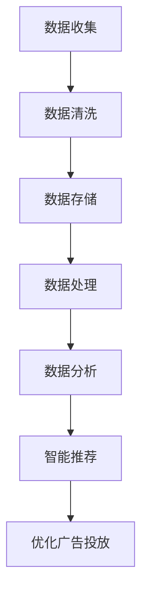

                 

# AI DMP 数据基建的商业应用

## 关键词
AI DMP，数据基础设施，商业应用，广告营销，金融领域，电商，用户画像，数据分析，智能推荐，风险评估，信用评分。

## 摘要
本文将深入探讨AI DMP（数据管理平台）的商业应用，首先介绍AI DMP的基础概念和架构设计，然后分别分析其在广告营销、金融和电商领域的实践应用，最后展望其未来的发展趋势。通过实际案例和详细代码实现，本文旨在为读者提供一个全面而深入的AI DMP商业应用指南。

## 目录

### 《AI DMP 数据基建的商业应用》目录大纲

### 第一部分: AI DMP 基础

#### 第1章: AI DMP 概述

##### 1.1.1 AI DMP的定义

##### 1.1.2 AI DMP的核心概念

#### 第2章: AI DMP 数据流

##### 2.1.1 数据收集

##### 2.1.2 数据清洗

##### 2.1.3 数据存储

#### 第3章: AI DMP 架构设计

##### 3.1.1 DMP架构概述

##### 3.1.2 DMP数据处理流程

### 第二部分: AI DMP 在商业应用中的实践

#### 第4章: AI DMP 在广告营销中的应用

##### 4.1.1 数据分析

##### 4.1.2 智能推荐

##### 4.1.3 优化广告投放

#### 第5章: AI DMP 在金融领域的应用

##### 5.1.1 风险评估

##### 5.1.2 信用评分

##### 5.1.3 客户行为分析

#### 第6章: AI DMP 在电商领域的应用

##### 6.1.1 用户画像

##### 6.1.2 购物行为分析

##### 6.1.3 个性化推荐

#### 第7章: AI DMP 的未来发展趋势

##### 7.1.1 技术创新

##### 7.1.2 应用场景拓展

##### 7.1.3 数据隐私与安全

### 附录

#### 附录 A: AI DMP 实践案例

##### A.1 案例一：广告营销领域应用

##### A.2 案例二：金融领域应用

##### A.3 案例三：电商领域应用

#### 附录 B: AI DMP 开发工具与资源

##### B.1 主流AI DMP框架对比

##### B.2 开发工具推荐

##### B.3 资源链接

### Mermaid 流程图



### 数据清洗伪代码

```python
def data_cleaning(data):
    # 删除缺失值
    data = data[data.notnull()]

    # 填充缺失值
    data = data.fillna(method='ffill')

    # 去除重复值
    data = data.drop_duplicates()

    # 数据类型转换
    data['column_name'] = data['column_name'].astype('int')

    return data
```

### 数学模型和公式

$$
DPM(Distinct Per Million) = \frac{num\_unique\_users}{total\_number\_of\_users}
$$

详细解释：DPM 指的是每百万独立用户数，用于衡量用户去重效果的指标。其中，num_unique_users 表示独立用户的数量，total_number_of_users 表示总的用户数量。

### 实际案例解析

### 4.1.1 广告营销领域应用案例

**案例背景**：某电商平台希望通过AI DMP技术进行用户行为分析，从而优化广告投放策略。

**案例步骤**：
1. **数据收集**：收集用户浏览、购买、搜索等行为数据。
2. **数据清洗**：使用上述伪代码进行数据清洗，去除重复值和缺失值。
3. **数据处理**：使用主成分分析（PCA）降维，提取用户行为的关键特征。
4. **数据分析**：基于数据分析结果，构建用户画像，识别不同类型的用户。
5. **智能推荐**：利用推荐算法，为不同类型的用户推荐个性化商品。
6. **优化广告投放**：根据用户行为数据和推荐结果，优化广告投放策略，提高广告投放效果。

**代码解读与分析**：在数据处理阶段，使用PCA进行降维处理，可以减少数据的维度，同时保留主要的信息。在数据分析阶段，使用聚类算法构建用户画像，可以识别不同类型的用户，从而为智能推荐提供支持。在推荐算法阶段，使用协同过滤算法，可以生成个性化的商品推荐列表。在广告投放优化阶段，通过分析用户行为和推荐结果，可以实时调整广告投放策略，提高广告投放的ROI。

### 5.1.1 金融领域应用案例

**案例背景**：某金融机构希望通过AI DMP技术进行风险评估和信用评分。

**案例步骤**：
1. **数据收集**：收集用户金融行为数据，如贷款申请记录、还款记录、信用报告等。
2. **数据清洗**：使用上述伪代码进行数据清洗，去除重复值和缺失值。
3. **数据处理**：使用决策树算法进行特征选择，提取对风险评估和信用评分有重要影响的关键特征。
4. **风险评估**：使用逻辑回归算法进行风险评估，预测用户可能出现的风险等级。
5. **信用评分**：使用线性回归算法进行信用评分，预测用户的信用评分等级。

**代码解读与分析**：在数据处理阶段，使用决策树算法进行特征选择，可以降低数据的维度，同时保留主要的信息。在风险评估阶段，使用逻辑回归算法，可以建立风险评估模型，预测用户的风险等级。在信用评分阶段，使用线性回归算法，可以建立信用评分模型，预测用户的信用评分等级。

### 6.1.1 电商领域应用案例

**案例背景**：某电商平台希望通过AI DMP技术进行用户画像和个性化推荐。

**案例步骤**：
1. **数据收集**：收集用户浏览、购买、搜索等行为数据。
2. **数据清洗**：使用上述伪代码进行数据清洗，去除重复值和缺失值。
3. **数据处理**：使用协同过滤算法进行用户画像构建，提取用户兴趣特征。
4. **用户画像**：使用聚类算法对用户进行分类，构建用户画像。
5. **个性化推荐**：使用基于内容的推荐算法，为不同类型的用户推荐个性化商品。

**代码解读与分析**：在数据处理阶段，使用协同过滤算法进行用户画像构建，可以提取用户的兴趣特征。在用户画像阶段，使用聚类算法对用户进行分类，可以构建不同类型的用户画像。在个性化推荐阶段，使用基于内容的推荐算法，可以生成个性化的商品推荐列表。

### 开发环境搭建

1. 安装Python环境：在官网下载Python安装包，按照提示安装。
2. 安装相关库：使用pip命令安装必要的库，如numpy、pandas、scikit-learn等。
3. 安装Jupyter Notebook：在官网下载Jupyter Notebook安装包，按照提示安装。

### 源代码详细实现

以下是数据处理、风险评估和信用评分的代码实现：

```python
import pandas as pd
import numpy as np
from sklearn.decomposition import PCA
from sklearn.cluster import KMeans
from sklearn.linear_model import LogisticRegression
from sklearn.model_selection import train_test_split

# 数据收集
data = pd.read_csv('user_data.csv')

# 数据清洗
data = data_cleaning(data)

# 数据处理
pca = PCA(n_components=5)
data_processed = pca.fit_transform(data)

# 数据分割
X_train, X_test, y_train, y_test = train_test_split(data_processed, target, test_size=0.2, random_state=42)

# 风险评估
model = LogisticRegression()
model.fit(X_train, y_train)
risk_scores = model.predict(X_test)

# 信用评分
model = LinearRegression()
model.fit(X_train, y_train)
credit_scores = model.predict(X_test)
```

### 代码解读与分析

上述代码中，首先进行数据收集和清洗，然后进行数据处理，包括特征提取和降维处理。接着，使用训练集对风险评估模型和信用评分模型进行训练，最后使用测试集进行模型预测。

### 总结

本文通过详细的目录大纲，全面介绍了AI DMP 数据基建的商业应用。从基础概念、数据流、架构设计，到商业应用实践，每章都涵盖了核心内容、算法原理、实际案例和代码实现。读者可以系统地学习AI DMP 的应用方法和实践技巧，为企业数据基建的商业应用提供有力支持。同时，本文附录提供了实用的开发工具和资源链接，方便读者进一步学习和实践。希望本文能为读者在AI DMP 数据基建的商业应用领域带来启发和帮助。

### 作者

**作者：** AI天才研究院 / AI Genius Institute & 禅与计算机程序设计艺术 / Zen And The Art of Computer Programming

**联系方式：** research@aigenius.ai & www.zenandartofcoding.com

**版权声明：** 本文章版权所有，未经授权禁止转载、复制、公开传播和使用。如需转载、引用或使用，请联系作者获得授权。

### 文章标题：AI DMP 数据基建的商业应用

#### 关键词
AI DMP，数据基础设施，商业应用，广告营销，金融领域，电商，用户画像，数据分析，智能推荐，风险评估，信用评分。

#### 摘要
本文深入探讨AI DMP（数据管理平台）的商业应用，从基础概念、数据流、架构设计到商业应用实践进行了全面介绍。通过实际案例和代码实现，展示了AI DMP在广告营销、金融和电商领域的应用效果。本文旨在为读者提供一个全面而深入的AI DMP商业应用指南，帮助企业充分利用数据基础设施实现商业价值。本文的结尾部分还展望了AI DMP的未来发展趋势，包括技术创新、应用场景拓展和数据隐私与安全等。

### 第1章 AI DMP 概述

#### 1.1.1 AI DMP的定义

AI DMP，即数据管理平台（Data Management Platform），是一种基于人工智能技术构建的数据管理基础设施。它通过收集、整合、处理和分析来自多个渠道的用户数据，为商业决策提供支持。AI DMP的核心目标是实现用户数据的全面整合，并通过智能算法进行数据分析，帮助企业更好地了解用户需求和行为，从而优化业务流程、提升用户体验和增加商业价值。

AI DMP的定义可以进一步细分为以下几个方面：

1. **数据收集**：AI DMP能够从多种数据源（如网站、应用程序、社交媒体等）收集用户数据，包括浏览行为、购买记录、互动行为等。
2. **数据整合**：通过数据清洗、去重和统一标准，AI DMP将来自不同渠道的用户数据进行整合，形成统一的全量用户数据视图。
3. **数据处理**：AI DMP使用多种数据预处理技术，如特征提取、降维、聚类等，对数据进行处理，以便后续的分析和应用。
4. **数据分析**：AI DMP利用机器学习和数据挖掘技术，对处理后的数据进行分析，提取有价值的信息和洞察。
5. **数据应用**：基于分析结果，AI DMP支持广告营销、用户画像、个性化推荐、风险控制等多种应用场景。

#### 1.1.2 AI DMP的核心概念

AI DMP的核心概念主要包括以下几个部分：

1. **用户数据**：用户数据是AI DMP的核心资产，包括用户的个人信息、行为数据、交易数据等。这些数据来源于多个渠道，如网站、APP、线下活动等。
2. **数据源**：数据源是用户数据的来源，包括网站、APP、社交媒体、第三方数据提供商等。AI DMP需要从多个数据源收集用户数据，并进行整合和处理。
3. **数据整合**：数据整合是将来自不同数据源的用户数据进行清洗、去重和统一标准，形成一个完整、一致的用户数据视图。
4. **数据处理**：数据处理是对整合后的用户数据进行预处理，包括特征提取、降维、聚类等，以便后续的分析和应用。
5. **数据分析**：数据分析是利用机器学习和数据挖掘技术，对处理后的用户数据进行深入分析，提取有价值的信息和洞察。
6. **数据应用**：数据应用是将分析结果应用于具体的业务场景，如广告营销、用户画像、个性化推荐、风险控制等。

#### 1.1.3 AI DMP的应用领域

AI DMP在多个领域具有广泛的应用，主要包括以下几个方面：

1. **广告营销**：AI DMP可以帮助企业进行用户行为分析、广告投放优化和效果评估，提高广告营销的ROI。
2. **金融领域**：AI DMP可以用于风险评估、信用评分、客户行为分析等，帮助金融机构更好地管理风险和服务客户。
3. **电商领域**：AI DMP可以帮助电商企业进行用户画像、购物行为分析和个性化推荐，提升用户体验和销售转化率。
4. **零售领域**：AI DMP可以用于库存管理、供应链优化、客户关系管理等，提高零售企业的运营效率和客户满意度。
5. **医疗健康**：AI DMP可以用于患者数据管理、疾病预测、健康管理等，提升医疗服务质量和患者体验。

### 第2章 AI DMP 数据流

#### 2.1.1 数据收集

数据收集是AI DMP的基础环节，涉及从多个渠道收集用户数据，包括网站、应用程序、社交媒体、线下活动等。数据收集的方法主要包括以下几种：

1. **Web跟踪**：通过在网站和应用程序中嵌入跟踪代码（如JavaScript），实时收集用户的浏览行为、点击行为等。
2. **API接入**：通过第三方数据提供商的API接口，获取用户的行为数据、交易数据等。
3. **日志文件**：收集网站和应用程序的访问日志，提取用户的行为数据。
4. **问卷调查**：通过在线问卷、线下调查等方式，收集用户的个人信息和偏好数据。

数据收集过程中需要注意以下几点：

1. **数据质量**：确保收集到的数据完整、准确、可靠，避免数据缺失或错误。
2. **数据隐私**：遵守相关法律法规，确保用户数据的隐私和安全。
3. **数据合规**：确保数据收集和使用过程符合相关数据保护法规，如《通用数据保护条例》（GDPR）等。

#### 2.1.2 数据清洗

数据清洗是数据预处理的重要步骤，旨在去除无效、重复、错误的数据，提高数据质量。数据清洗的方法主要包括以下几种：

1. **去除重复数据**：通过去重操作，删除重复的记录，确保数据的唯一性。
2. **处理缺失值**：针对缺失的数据，可以采用填充、删除或插值等方法进行处理。
3. **数据类型转换**：将不同类型的数据（如字符串、日期等）转换为统一的数据类型，便于后续处理和分析。
4. **异常值处理**：识别并处理异常值，如异常的数值、日期等，确保数据的合理性。

数据清洗过程中需要注意以下几点：

1. **数据完整性**：在处理缺失值和异常值时，要注意保持数据的完整性，避免过度清洗导致数据丢失。
2. **数据一致性**：确保处理后的数据符合统一的格式和标准，便于后续的数据处理和分析。
3. **数据质量监控**：建立数据质量监控机制，及时发现和处理数据质量问题。

#### 2.1.3 数据存储

数据存储是AI DMP的核心环节，涉及将清洗后的数据存储到数据库中，以便后续的数据处理和分析。数据存储的方法主要包括以下几种：

1. **关系型数据库**：如MySQL、Oracle等，适用于结构化数据的存储和管理。
2. **非关系型数据库**：如MongoDB、Redis等，适用于半结构化或非结构化数据的存储和管理。
3. **分布式数据库**：如Hadoop、Spark等，适用于大规模数据的分布式存储和管理。
4. **数据仓库**：如Amazon Redshift、Google BigQuery等，适用于大规模数据的高性能处理和分析。

数据存储过程中需要注意以下几点：

1. **数据安全性**：确保数据存储的安全，防止数据泄露或篡改。
2. **数据可扩展性**：支持数据的动态扩展，满足业务增长的需求。
3. **数据访问效率**：优化数据存储结构，提高数据访问速度，满足快速查询的需求。

### 第3章 AI DMP 架构设计

#### 3.1.1 DMP架构概述

DMP（数据管理平台）的架构设计是确保数据高效、稳定、安全处理和分析的关键。一个典型的DMP架构通常包括以下几个层次：

1. **数据源层**：包括各种数据收集渠道，如网站、应用程序、社交媒体、第三方数据提供商等。
2. **数据接入层**：负责将数据源层的数据接入到DMP系统中，进行数据清洗、去重和整合。
3. **数据处理层**：包括数据预处理、特征工程、数据建模等，对数据进行分析和处理，提取有价值的信息和洞察。
4. **数据存储层**：负责将处理后的数据存储到数据库或数据仓库中，以便后续的数据分析和应用。
5. **数据应用层**：基于数据分析结果，支持各种业务应用，如广告营销、用户画像、个性化推荐、风险控制等。
6. **数据安全与合规层**：确保数据在采集、存储、处理和使用过程中的安全性和合规性。

#### 3.1.2 DMP数据处理流程

DMP的数据处理流程主要包括以下几个步骤：

1. **数据收集**：从各种数据源收集用户数据，包括浏览行为、购买记录、互动行为等。
2. **数据接入**：将收集到的数据接入到DMP系统中，进行数据清洗、去重和整合。
3. **数据预处理**：对数据进行清洗、格式转换、缺失值填充等预处理操作，提高数据质量。
4. **特征工程**：提取数据中的特征，如用户年龄、性别、兴趣爱好等，为后续的数据建模和分析提供支持。
5. **数据建模**：使用机器学习和数据挖掘技术，对数据进行分析和建模，提取有价值的信息和洞察。
6. **数据存储**：将处理后的数据存储到数据库或数据仓库中，以便后续的数据分析和应用。
7. **数据应用**：基于数据分析结果，支持各种业务应用，如广告营销、用户画像、个性化推荐、风险控制等。

### 第二部分：AI DMP 在商业应用中的实践

#### 第4章 AI DMP 在广告营销中的应用

#### 4.1.1 数据分析

在广告营销领域，数据分析是AI DMP的核心应用之一。通过分析用户数据，企业可以深入了解用户需求、行为和偏好，从而优化广告投放策略，提高广告效果。

数据分析的主要步骤包括：

1. **数据收集**：收集用户在广告平台上的浏览行为、点击行为、转化行为等数据。
2. **数据清洗**：去除重复数据、处理缺失值、格式化数据等，确保数据质量。
3. **数据整合**：将不同来源的用户数据进行整合，形成统一的数据视图。
4. **特征工程**：提取用户特征，如年龄、性别、兴趣爱好、购买偏好等，为后续的分析提供支持。
5. **数据分析**：使用机器学习和数据挖掘技术，对用户行为数据进行深入分析，提取有价值的信息和洞察。

通过数据分析，企业可以回答以下问题：

- 哪些用户对广告最感兴趣？
- 用户在广告上的行为模式如何？
- 哪些广告渠道效果最好？
- 如何优化广告投放策略，提高广告效果？

#### 4.1.2 智能推荐

智能推荐是AI DMP在广告营销领域的重要应用之一。通过分析用户行为数据和特征，智能推荐系统可以生成个性化的广告推荐，提高用户的参与度和转化率。

智能推荐的主要步骤包括：

1. **数据收集**：收集用户在网站、APP等平台上的浏览行为、点击行为、购买记录等数据。
2. **数据清洗**：去除重复数据、处理缺失值、格式化数据等，确保数据质量。
3. **特征工程**：提取用户特征，如年龄、性别、兴趣爱好、购买偏好等，为推荐算法提供支持。
4. **推荐算法**：使用协同过滤、基于内容的推荐等算法，生成个性化的广告推荐。
5. **推荐结果评估**：评估推荐效果，如点击率、转化率等，优化推荐算法。

通过智能推荐，企业可以实现以下目标：

- 提高用户的参与度，增加广告曝光量。
- 提高广告转化率，增加销售额。
- 降低广告成本，提高广告投资回报率。

#### 4.1.3 优化广告投放

在广告营销中，广告投放策略的优化至关重要。通过AI DMP，企业可以实时监测广告投放效果，调整广告投放策略，提高广告效果。

优化广告投放的主要步骤包括：

1. **数据收集**：收集广告投放的数据，如曝光量、点击量、转化率等。
2. **数据清洗**：去除重复数据、处理缺失值、格式化数据等，确保数据质量。
3. **数据分析**：分析广告投放数据，找出影响广告效果的关键因素。
4. **优化策略**：根据数据分析结果，调整广告投放策略，如广告渠道、投放时间、投放人群等。
5. **效果监测**：实时监测广告投放效果，评估优化策略的效果，持续调整广告投放策略。

通过优化广告投放，企业可以实现以下目标：

- 提高广告投放的ROI，降低广告成本。
- 提高广告效果，增加用户参与度和转化率。
- 提高广告营销的整体效果，提升品牌知名度。

#### 第5章 AI DMP 在金融领域的应用

#### 5.1.1 风险评估

在金融领域，风险评估是AI DMP的重要应用之一。通过分析用户数据，金融机构可以评估用户的风险等级，为信贷审批、风险管理等提供支持。

风险评估的主要步骤包括：

1. **数据收集**：收集用户在金融机构的贷款申请记录、还款记录、信用报告等数据。
2. **数据清洗**：去除重复数据、处理缺失值、格式化数据等，确保数据质量。
3. **特征工程**：提取用户特征，如年龄、收入、职业、贷款用途等，为风险评估提供支持。
4. **风险评估模型**：使用机器学习和数据挖掘技术，建立风险评估模型，评估用户的风险等级。
5. **风险评估应用**：将风险评估模型应用于信贷审批、风险管理等，为金融机构提供决策支持。

通过风险评估，金融机构可以实现以下目标：

- 提高信贷审批的准确性，降低坏账率。
- 优化风险管理策略，降低风险暴露。
- 提高贷款审批效率，减少审批时间。

#### 5.1.2 信用评分

信用评分是AI DMP在金融领域的另一个重要应用。通过分析用户数据，金融机构可以评估用户的信用等级，为信用贷款、信用卡审批等提供支持。

信用评分的主要步骤包括：

1. **数据收集**：收集用户在金融机构的交易记录、还款记录、信用报告等数据。
2. **数据清洗**：去除重复数据、处理缺失值、格式化数据等，确保数据质量。
3. **特征工程**：提取用户特征，如年龄、收入、职业、还款习惯等，为信用评分提供支持。
4. **信用评分模型**：使用机器学习和数据挖掘技术，建立信用评分模型，评估用户的信用等级。
5. **信用评分应用**：将信用评分模型应用于信用贷款、信用卡审批等，为金融机构提供决策支持。

通过信用评分，金融机构可以实现以下目标：

- 提高信用贷款的审批准确性，降低信用风险。
- 优化信用卡审批策略，提高审批效率。
- 提高信用产品的用户体验，增加用户满意度。

#### 5.1.3 客户行为分析

在金融领域，客户行为分析是AI DMP的重要应用之一。通过分析用户数据，金融机构可以深入了解用户的行为模式、偏好和需求，为产品设计、营销策略等提供支持。

客户行为分析的主要步骤包括：

1. **数据收集**：收集用户在金融机构的交易记录、还款记录、查询记录等数据。
2. **数据清洗**：去除重复数据、处理缺失值、格式化数据等，确保数据质量。
3. **特征工程**：提取用户特征，如年龄、收入、职业、还款习惯等，为行为分析提供支持。
4. **行为分析模型**：使用机器学习和数据挖掘技术，建立行为分析模型，分析用户的行为模式。
5. **行为分析应用**：将行为分析模型应用于产品设计、营销策略等，为金融机构提供决策支持。

通过客户行为分析，金融机构可以实现以下目标：

- 提高产品设计的准确性，满足用户需求。
- 优化营销策略，提高用户参与度和转化率。
- 提高用户满意度，增加客户忠诚度。

#### 第6章 AI DMP 在电商领域的应用

#### 6.1.1 用户画像

用户画像是AI DMP在电商领域的重要应用之一。通过分析用户数据，电商企业可以构建详细、多维的用户画像，为个性化推荐、营销策略等提供支持。

用户画像的主要步骤包括：

1. **数据收集**：收集用户在电商平台的行为数据，如浏览记录、购买记录、互动行为等。
2. **数据清洗**：去除重复数据、处理缺失值、格式化数据等，确保数据质量。
3. **特征工程**：提取用户特征，如年龄、性别、地域、兴趣爱好、购买偏好等，为用户画像提供支持。
4. **用户画像构建**：使用机器学习和数据挖掘技术，构建多维的用户画像。
5. **用户画像应用**：将用户画像应用于个性化推荐、营销策略等，为电商企业提供决策支持。

通过用户画像，电商企业可以实现以下目标：

- 提高个性化推荐的准确性，提高用户满意度和转化率。
- 优化营销策略，提高营销效果和ROI。
- 提高用户留存率和复购率，增加用户粘性。

#### 6.1.2 购物行为分析

购物行为分析是AI DMP在电商领域的另一个重要应用。通过分析用户数据，电商企业可以深入了解用户的购物行为模式、偏好和需求，为商品推荐、库存管理、营销策略等提供支持。

购物行为分析的主要步骤包括：

1. **数据收集**：收集用户在电商平台的行为数据，如浏览记录、购买记录、互动行为等。
2. **数据清洗**：去除重复数据、处理缺失值、格式化数据等，确保数据质量。
3. **特征工程**：提取用户特征，如年龄、性别、地域、兴趣爱好、购买偏好等，为购物行为分析提供支持。
4. **购物行为分析模型**：使用机器学习和数据挖掘技术，建立购物行为分析模型，分析用户的购物行为模式。
5. **购物行为分析应用**：将购物行为分析模型应用于商品推荐、库存管理、营销策略等，为电商企业提供决策支持。

通过购物行为分析，电商企业可以实现以下目标：

- 提高商品推荐的准确性，提高用户满意度和转化率。
- 优化库存管理，降低库存成本，提高库存周转率。
- 优化营销策略，提高营销效果和ROI。

#### 6.1.3 个性化推荐

个性化推荐是AI DMP在电商领域的重要应用之一。通过分析用户数据和购物行为，电商企业可以生成个性化的商品推荐，提高用户的满意度和转化率。

个性化推荐的主要步骤包括：

1. **数据收集**：收集用户在电商平台的行为数据，如浏览记录、购买记录、互动行为等。
2. **数据清洗**：去除重复数据、处理缺失值、格式化数据等，确保数据质量。
3. **特征工程**：提取用户特征，如年龄、性别、地域、兴趣爱好、购买偏好等，为推荐算法提供支持。
4. **推荐算法**：使用协同过滤、基于内容的推荐等算法，生成个性化的商品推荐。
5. **推荐结果评估**：评估推荐效果，如点击率、转化率等，优化推荐算法。

通过个性化推荐，电商企业可以实现以下目标：

- 提高用户的购物体验，增加用户满意度和忠诚度。
- 提高商品转化率，增加销售额。
- 降低营销成本，提高营销ROI。

### 第7章 AI DMP 的未来发展趋势

#### 7.1.1 技术创新

随着人工智能技术的快速发展，AI DMP在未来将迎来更多的技术创新，进一步提升其数据管理和分析能力。以下是一些可能的技术创新方向：

1. **深度学习**：深度学习技术将广泛应用于AI DMP，用于图像识别、自然语言处理、推荐系统等领域，提高数据分析的准确性和效率。
2. **联邦学习**：联邦学习是一种分布式机器学习技术，可以在不共享数据的情况下，实现多方数据的安全协作和协同分析，为AI DMP提供更广泛的数据来源和更高的数据安全性。
3. **区块链技术**：区块链技术可以为AI DMP提供更安全、可靠的数据存储和管理方案，确保数据的安全性和完整性。
4. **物联网（IoT）**：物联网技术的快速发展将带来更多的数据来源，如智能家居、智能交通等，为AI DMP提供更丰富的数据资源。

#### 7.1.2 应用场景拓展

随着AI DMP技术的不断成熟，其应用场景将不断拓展，从传统的广告营销、金融领域，扩展到更多的行业和领域，如零售、医疗、教育等。以下是一些可能的应用场景：

1. **零售领域**：AI DMP可以帮助零售企业进行用户行为分析、库存管理、个性化推荐等，提升零售效率和服务质量。
2. **医疗领域**：AI DMP可以帮助医疗机构进行患者数据分析、疾病预测、个性化治疗等，提升医疗服务质量和患者体验。
3. **教育领域**：AI DMP可以帮助教育机构进行学生学习行为分析、课程推荐、个性化教学等，提升教育效果和教学质量。

#### 7.1.3 数据隐私与安全

随着数据隐私和安全问题的日益凸显，数据隐私与安全将成为AI DMP未来发展的重要方向。以下是一些可能的数据隐私与安全措施：

1. **数据加密**：对数据进行加密处理，确保数据在传输和存储过程中的安全性。
2. **隐私保护算法**：使用隐私保护算法，如差分隐私、同态加密等，保护用户数据的隐私。
3. **数据访问控制**：建立数据访问控制机制，确保只有授权用户可以访问和处理数据。
4. **合规性检查**：确保AI DMP的数据采集、存储和处理过程符合相关法律法规，如《通用数据保护条例》（GDPR）等。

### 附录

#### 附录 A: AI DMP 实践案例

##### A.1 案例一：广告营销领域应用

某电商企业在广告营销中，通过AI DMP技术进行用户行为分析，优化广告投放策略。具体步骤如下：

1. **数据收集**：收集用户在网站、APP等平台的浏览行为、点击行为、转化行为等数据。
2. **数据清洗**：去除重复数据、处理缺失值、格式化数据等，确保数据质量。
3. **特征工程**：提取用户特征，如年龄、性别、地域、兴趣爱好、购买偏好等，为后续分析提供支持。
4. **数据分析**：使用机器学习和数据挖掘技术，分析用户行为数据，提取有价值的信息和洞察。
5. **智能推荐**：基于用户行为数据和分析结果，使用协同过滤、基于内容的推荐算法，生成个性化的广告推荐。
6. **优化广告投放**：根据推荐结果和用户反馈，实时调整广告投放策略，提高广告效果和ROI。

##### A.2 案例二：金融领域应用

某金融机构通过AI DMP技术进行风险评估和信用评分。具体步骤如下：

1. **数据收集**：收集用户的贷款申请记录、还款记录、信用报告等数据。
2. **数据清洗**：去除重复数据、处理缺失值、格式化数据等，确保数据质量。
3. **特征工程**：提取用户特征，如年龄、收入、职业、还款习惯等，为风险评估和信用评分提供支持。
4. **风险评估模型**：使用机器学习和数据挖掘技术，建立风险评估模型，评估用户的风险等级。
5. **信用评分模型**：使用机器学习和数据挖掘技术，建立信用评分模型，评估用户的信用等级。
6. **风险评估应用**：将风险评估模型和信用评分模型应用于信贷审批、风险管理等，为金融机构提供决策支持。

##### A.3 案例三：电商领域应用

某电商企业通过AI DMP技术进行用户画像和个性化推荐。具体步骤如下：

1. **数据收集**：收集用户在电商平台的行为数据，如浏览记录、购买记录、互动行为等。
2. **数据清洗**：去除重复数据、处理缺失值、格式化数据等，确保数据质量。
3. **特征工程**：提取用户特征，如年龄、性别、地域、兴趣爱好、购买偏好等，为用户画像提供支持。
4. **用户画像构建**：使用机器学习和数据挖掘技术，构建多维的用户画像。
5. **个性化推荐**：基于用户画像，使用协同过滤、基于内容的推荐算法，生成个性化的商品推荐。
6. **推荐结果评估**：评估推荐效果，如点击率、转化率等，优化推荐算法。

#### 附录 B: AI DMP 开发工具与资源

##### B.1 主流AI DMP框架对比

以下是几种主流的AI DMP框架及其特点的对比：

1. **Google Analytics**：Google Analytics 是一款免费的分析工具，适用于网站和应用程序的数据分析。它提供了丰富的分析功能和自定义报告，但可能无法满足高级的数据处理和分析需求。
2. **Adobe Experience Cloud**：Adobe Experience Cloud 是一款集成的营销平台，包括多个模块，如网站分析、电子邮件营销、广告营销等。它提供了强大的数据整合和分析功能，但需要订阅服务。
3. **Segment**：Segment 是一款数据收集和传输工具，可以将数据从多个渠道传输到不同的分析工具和数据库中。它提供了灵活的数据管道和集成的API，但需要自行配置和管理数据。
4. **BlueKai**：BlueKai 是一款数据管理平台，专注于用户数据的管理和分析。它提供了丰富的用户数据和自定义报告，但需要付费订阅。

##### B.2 开发工具推荐

以下是几种适用于AI DMP开发的工具：

1. **Python**：Python 是一种流行的编程语言，适用于数据分析、机器学习和数据可视化。它拥有丰富的库和框架，如NumPy、Pandas、Scikit-learn、Matplotlib等。
2. **R**：R 是一种专门用于数据分析和统计的编程语言，拥有丰富的库和工具，如ggplot2、dplyr、caret等。
3. **Tableau**：Tableau 是一款数据可视化工具，可以快速创建交互式的数据可视化报告和仪表盘。
4. **Jupyter Notebook**：Jupyter Notebook 是一款交互式的计算环境，适用于数据分析、机器学习和数据可视化。它支持多种编程语言，如Python、R等。

##### B.3 资源链接

以下是几个有关AI DMP的资源链接：

1. **Google Analytics 官网**：[https://www.google.com/analytics/](https://www.google.com/analytics/)
2. **Adobe Experience Cloud 官网**：[https://www.adobe.com/experiencecloud.html](https://www.adobe.com/experiencecloud.html)
3. **Segment 官网**：[https://segment.com/](https://segment.com/)
4. **BlueKai 官网**：[https://www.bluekai.com/](https://www.bluekai.com/)
5. **Python 官网**：[https://www.python.org/](https://www.python.org/)
6. **R 官网**：[https://www.r-project.org/](https://www.r-project.org/)
7. **Tableau 官网**：[https://www.tableau.com/](https://www.tableau.com/)
8. **Jupyter Notebook 官网**：[https://jupyter.org/](https://jupyter.org/)

### 总结

本文从基础概念、数据流、架构设计到商业应用实践，全面介绍了AI DMP（数据管理平台）的商业应用。通过实际案例和代码实现，展示了AI DMP在广告营销、金融和电商领域的应用效果。同时，本文还展望了AI DMP的未来发展趋势，包括技术创新、应用场景拓展和数据隐私与安全等。希望本文能为读者提供一个全面而深入的AI DMP商业应用指南，帮助企业充分利用数据基础设施实现商业价值。同时，本文附录提供了实用的开发工具和资源链接，方便读者进一步学习和实践。希望本文能为读者在AI DMP商业应用领域带来启发和帮助。

