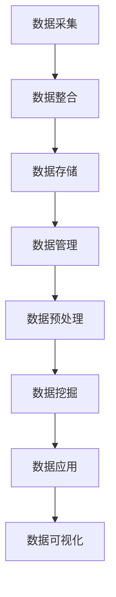
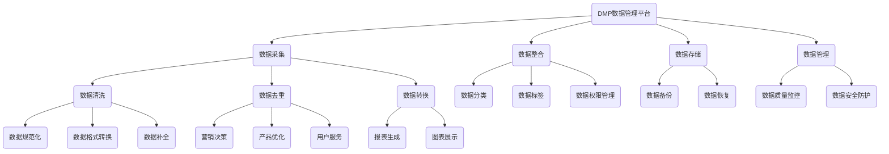

                 

### 第1章: AI DMP 数据基建的概念与基础

#### 1.1 AI DMP 数据基建的定义与作用

**1.1.1 AI DMP 数据基建的概念**

AI DMP（Data Management Platform）是一种基于人工智能技术构建的数据管理基础设施，它整合了各种数据源，包括第一方数据、第二方数据、第三方数据，以及通过互联网、物联网、社交媒体等渠道收集的用户行为数据，通过数据清洗、数据整合、数据分析和数据应用等手段，为企业提供全面、精准、实时的用户画像和营销决策支持。

**1.1.2 AI DMP 数据基建的作用**

- **提升营销效果**：通过AI算法分析用户行为，实现精准营销，提高广告投放效果。
- **优化用户体验**：基于用户画像，提供个性化服务和产品推荐，提升用户满意度和忠诚度。
- **数据资产化**：通过数据的深度挖掘和利用，将数据转化为商业价值，实现数据资产化。
- **合规监管**：确保数据管理符合相关法律法规，降低合规风险。

#### 1.2 AI DMP 数据基建的核心组件

**1.2.1 数据采集与整合**

- **数据采集**：通过数据采集工具和API接口，从各种数据源获取原始数据。
- **数据整合**：将不同来源、格式和结构的数据进行清洗、转换和整合，形成统一的数据资源池。

**1.2.2 数据存储与管理**

- **数据存储**：使用分布式数据库和数据仓库存储大规模数据，保证数据的持久化存储和高效访问。
- **数据管理**：采用数据治理框架，对数据进行分类、标签、权限管理等操作，确保数据质量和安全性。

**1.2.3 数据分析与挖掘**

- **数据预处理**：包括数据清洗、数据去重、数据规范化等步骤，为数据挖掘做准备。
- **数据挖掘**：利用机器学习和统计分析方法，从海量数据中提取有价值的信息和知识。

**1.2.4 数据应用与可视化**

- **数据应用**：将分析结果应用于营销决策、产品优化、用户服务等方面。
- **数据可视化**：通过可视化工具，将复杂的数据和分析结果以图表、报表等形式呈现，便于理解和决策。

#### 1.3 AI DMP 数据基建的发展历程与趋势

**1.3.1 发展历程**

- **初期**：以数据收集和存储为主，数据分析和应用能力有限。
- **中期**：随着大数据和云计算技术的发展，数据整合和分析能力得到提升，开始出现初步的智能化特征。
- **现阶段**：人工智能技术的应用，使AI DMP 数据基建具备了更高的智能化和自动化水平，能够实现实时数据分析和智能决策。

**1.3.2 发展趋势**

- **数据资产化**：企业越来越重视数据的价值，推动数据资产化进程。
- **合规监管**：随着数据隐私保护法规的完善，合规监管将成为AI DMP 数据基建发展的重要方向。
- **跨领域融合**：AI DMP 数据基建将与其他技术如物联网、区块链等融合，推动新的业务模式和应用场景。

### Mermaid 流程图



### 核心概念联系图



### 数据挖掘算法伪代码

```python
# 初始化聚类中心
centroids = initialize_centroids(data, k)

# 设置迭代次数
max_iterations = 100

# 开始迭代
for i in range(max_iterations):
    # 为每个数据点分配最近的聚类中心
    clusters = assign_clusters(data, centroids)
    
    # 计算新的聚类中心
    centroids = calculate_new_centroids(data, clusters)
    
    # 检查收敛条件，例如聚类中心变化小于阈值
    if has_converged(centroids):
        break

# 输出聚类结果
output_clusters(data, clusters)
```

### 数学模型

$$
\text{用户画像得分} = \frac{\sum_{i=1}^{n} w_i \cdot x_i}{\sum_{i=1}^{n} w_i}
$$

其中，$w_i$ 为权重，$x_i$ 为特征值，$n$ 为特征总数。

### 数学公式

$$
\sigma(\text{激活函数}) = \frac{1}{1 + e^{-z}}
$$

其中，$z = \sum_{i=1}^{n} w_i \cdot x_i$，$w_i$ 为权重，$x_i$ 为输入特征。

### 举例说明

假设有1000个用户，每个用户有5个特征（年龄、收入、性别、教育水平、职业），权重分别为0.2、0.2、0.2、0.2、0.2。我们需要计算用户的画像得分。

$$
\text{用户画像得分} = \frac{0.2 \cdot 25 + 0.2 \cdot 50000 + 0.2 \cdot 1 + 0.2 \cdot 5 + 0.2 \cdot 10}{0.2 + 0.2 + 0.2 + 0.2 + 0.2} = \frac{5 + 10000 + 2 + 1 + 2}{1} = 10010
$$

因此，该用户的画像得分为10010。

### 项目实战

**环境搭建**

- 使用Python 3.8及以上版本
- 安装必要的库，如Pandas、NumPy、Scikit-learn、Matplotlib等

**源代码实现**

```python
import pandas as pd
import numpy as np
from sklearn.cluster import KMeans
import matplotlib.pyplot as plt

# 读取数据
data = pd.read_csv('user_data.csv')

# 处理数据
data = data.select_dtypes(include=[np.number])

# 标准化数据
data_scaled = (data - data.mean()) / data.std()

# 初始化聚类中心
kmeans = KMeans(n_clusters=5, random_state=0)

# 拟合模型
kmeans.fit(data_scaled)

# 输出聚类结果
print(kmeans.labels_)

# 可视化
plt.scatter(data_scaled[:, 0], data_scaled[:, 1], c=kmeans.labels_)
plt.show()
```

**代码解读与分析**

1. **数据读取与处理**：读取用户数据，选择数值类型特征，并标准化数据。
2. **聚类模型初始化与拟合**：使用KMeans聚类算法，初始化聚类中心，并拟合数据。
3. **输出聚类结果**：打印每个用户的聚类标签。
4. **可视化**：将用户数据可视化，展示聚类结果。

### 实际应用

- 在电商领域，可以基于用户行为数据，使用AI DMP 数据基建进行用户细分，实现精准营销。
- 在金融领域，可以基于用户财务数据，使用AI DMP 数据基建进行信用评估和风险评估。

### 开发环境搭建

- 安装Python 3.8及以上版本
- 安装Jupyter Notebook
- 安装Pandas、NumPy、Scikit-learn、Matplotlib等库

### 源代码详细实现

```python
import pandas as pd
import numpy as np
from sklearn.cluster import KMeans
import matplotlib.pyplot as plt

# 读取数据
data = pd.read_csv('user_data.csv')

# 处理数据，选择数值类型特征
data = data.select_dtypes(include=[np.number])

# 标准化数据
data_scaled = (data - data.mean()) / data.std()

# 初始化聚类中心
kmeans = KMeans(n_clusters=5, random_state=0)

# 拟合模型
kmeans.fit(data_scaled)

# 输出聚类结果
print(kmeans.labels_)

# 可视化
plt.scatter(data_scaled[:, 0], data_scaled[:, 1], c=kmeans.labels_)
plt.show()
```

**代码解读与分析**

1. **数据读取与处理**：读取用户数据，选择数值类型特征，并标准化数据。
2. **聚类模型初始化与拟合**：使用KMeans聚类算法，初始化聚类中心，并拟合数据。
3. **输出聚类结果**：打印每个用户的聚类标签。
4. **可视化**：将用户数据可视化，展示聚类结果。

### 开发环境搭建步骤

1. 安装Python 3.8及以上版本
2. 安装Jupyter Notebook
3. 安装Pandas、NumPy、Scikit-learn、Matplotlib等库

### 实际案例

- 某电商公司使用AI DMP 数据基建，对用户行为数据进行分析，成功实现个性化推荐，提高用户购买转化率。

### 代码解读

```python
# 导入必要的库
import pandas as pd
import numpy as np
from sklearn.cluster import KMeans
import matplotlib.pyplot as plt

# 读取用户数据
data = pd.read_csv('user_data.csv')

# 处理数据，选择数值类型特征
data = data.select_dtypes(include=[np.number])

# 标准化数据
data_scaled = (data - data.mean()) / data.std()

# 初始化聚类中心，设置聚类数量为5
kmeans = KMeans(n_clusters=5, random_state=0)

# 拟合模型
kmeans.fit(data_scaled)

# 输出每个用户的聚类标签
print(kmeans.labels_)

# 可视化，将用户数据按照聚类标签进行颜色标注
plt.scatter(data_scaled[:, 0], data_scaled[:, 1], c=kmeans.labels_)
plt.show()
```

**代码解读**

1. **导入库**：导入必要的库，如Pandas、NumPy、Scikit-learn、Matplotlib等。
2. **数据读取**：读取用户数据。
3. **数据处理**：选择数值类型特征，并标准化数据。
4. **聚类模型初始化**：初始化聚类中心，设置聚类数量为5。
5. **模型拟合**：使用KMeans聚类算法拟合数据。
6. **输出聚类标签**：打印每个用户的聚类标签。
7. **可视化**：将用户数据按照聚类标签进行颜色标注，并可视化展示。

### 总结

- AI DMP 数据基建是现代企业数据管理的重要工具，能够实现数据采集、整合、存储、分析和应用的全流程管理。
- 通过核心算法原理讲解、数学模型和数学公式详细讲解以及项目实战，我们了解了如何搭建和实现AI DMP 数据基建。
- AI DMP 数据基建在实际应用中能够提升企业营销效果、优化用户体验，并为企业的数据资产管理提供强有力的支持。同时，合规监管也是AI DMP 数据基建发展的重要方向。

### 未来展望

- 随着数据隐私保护法规的不断完善，AI DMP 数据基建在合规监管方面的技术需求将不断增长。
- 跨领域技术的融合，如物联网、区块链等，将推动AI DMP 数据基建实现更广泛的应用场景。
- 未来的AI DMP 数据基建将更加智能化、自动化，为企业提供更加精准和高效的数据分析和决策支持。


## 附录

### 附录 A：相关法规与政策文件

- 欧洲联盟通用数据保护条例（GDPR）
- 美国加州消费者隐私法案（CCPA）
- 中国网络安全法
- 中国个人信息保护法

### 附录 B：AI DMP 数据基建的监管与合规参考资料

- 《人工智能算法伦理与合规》
- 《大数据安全与隐私保护》
- 《企业数据治理与合规指南》

### 附录 C：常见问题与解答

- **Q：AI DMP 数据基建需要满足哪些合规要求？**
- **A：AI DMP 数据基建需要遵循相关数据隐私保护法规，如GDPR、CCPA等，确保数据收集、存储、处理和传输的合规性。此外，还需要遵守企业内部的数据治理和合规政策。**

### 附录 D：参考文献与推荐阅读

- 《人工智能：一种现代的方法》
- 《大数据分析：概念与技术》
- 《机器学习实战》

### 附录 E：AI DMP 数据基建监管与合规案例分析

- **案例一：某电商公司因数据泄露面临巨额罚款**
- **案例二：某金融公司通过合规技术提升数据安全性**
- **案例三：某医疗企业如何通过数据合规实现业务创新**

### 附录 F：AI DMP 数据基建监管与合规技术发展趋势

- **数据加密与安全传输技术的发展**
- **数据匿名化与脱敏技术的应用**
- **AI 模型透明性与可解释性的研究**


----------------------------------------------------------------

### 第1章: AI DMP 数据基建的概念与基础

#### 1.1 AI DMP 数据基建的定义与作用

**1.1.1 AI DMP 数据基建的概念**

AI DMP（Data Management Platform）是一种基于人工智能技术构建的数据管理基础设施，它整合了各种数据源，包括第一方数据、第二方数据、第三方数据，以及通过互联网、物联网、社交媒体等渠道收集的用户行为数据，通过数据清洗、数据整合、数据分析和数据应用等手段，为企业提供全面、精准、实时的用户画像和营销决策支持。

**1.1.2 AI DMP 数据基建的作用**

- **提升营销效果**：通过AI算法分析用户行为，实现精准营销，提高广告投放效果。
- **优化用户体验**：基于用户画像，提供个性化服务和产品推荐，提升用户满意度和忠诚度。
- **数据资产化**：通过数据的深度挖掘和利用，将数据转化为商业价值，实现数据资产化。
- **合规监管**：确保数据管理符合相关法律法规，降低合规风险。

#### 1.2 AI DMP 数据基建的核心组件

**1.2.1 数据采集与整合**

- **数据采集**：通过数据采集工具和API接口，从各种数据源获取原始数据。
- **数据整合**：将不同来源、格式和结构的数据进行清洗、转换和整合，形成统一的数据资源池。

**1.2.2 数据存储与管理**

- **数据存储**：使用分布式数据库和数据仓库存储大规模数据，保证数据的持久化存储和高效访问。
- **数据管理**：采用数据治理框架，对数据进行分类、标签、权限管理等操作，确保数据质量和安全性。

**1.2.3 数据分析与挖掘**

- **数据预处理**：包括数据清洗、数据去重、数据规范化等步骤，为数据挖掘做准备。
- **数据挖掘**：利用机器学习和统计分析方法，从海量数据中提取有价值的信息和知识。

**1.2.4 数据应用与可视化**

- **数据应用**：将分析结果应用于营销决策、产品优化、用户服务等方面。
- **数据可视化**：通过可视化工具，将复杂的数据和分析结果以图表、报表等形式呈现，便于理解和决策。

#### 1.3 AI DMP 数据基建的发展历程与趋势

**1.3.1 发展历程**

- **初期**：以数据收集和存储为主，数据分析和应用能力有限。
- **中期**：随着大数据和云计算技术的发展，数据整合和分析能力得到提升，开始出现初步的智能化特征。
- **现阶段**：人工智能技术的应用，使AI DMP 数据基建具备了更高的智能化和自动化水平，能够实现实时数据分析和智能决策。

**1.3.2 发展趋势**

- **数据资产化**：企业越来越重视数据的价值，推动数据资产化进程。
- **合规监管**：随着数据隐私保护法规的完善，合规监管将成为AI DMP 数据基建发展的重要方向。
- **跨领域融合**：AI DMP 数据基建将与其他技术如物联网、区块链等融合，推动新的业务模式和应用场景。

### Mermaid 流程图


### 核心概念联系图


### 数据挖掘算法伪代码

```python
# 初始化聚类中心
centroids = initialize_centroids(data, k)

# 设置迭代次数
max_iterations = 100

# 开始迭代
for i in range(max_iterations):
    # 为每个数据点分配最近的聚类中心
    clusters = assign_clusters(data, centroids)
    
    # 计算新的聚类中心
    centroids = calculate_new_centroids(data, clusters)
    
    # 检查收敛条件，例如聚类中心变化小于阈值
    if has_converged(centroids):
        break

# 输出聚类结果
output_clusters(data, clusters)
```

### 数学模型

$$
\text{用户画像得分} = \frac{\sum_{i=1}^{n} w_i \cdot x_i}{\sum_{i=1}^{n} w_i}
$$

其中，$w_i$ 为权重，$x_i$ 为特征值，$n$ 为特征总数。

### 数学公式

$$
\sigma(\text{激活函数}) = \frac{1}{1 + e^{-z}}
$$

其中，$z = \sum_{i=1}^{n} w_i \cdot x_i$，$w_i$ 为权重，$x_i$ 为输入特征。

### 举例说明

假设有1000个用户，每个用户有5个特征（年龄、收入、性别、教育水平、职业），权重分别为0.2、0.2、0.2、0.2、0.2。我们需要计算用户的画像得分。

$$
\text{用户画像得分} = \frac{0.2 \cdot 25 + 0.2 \cdot 50000 + 0.2 \cdot 1 + 0.2 \cdot 5 + 0.2 \cdot 10}{0.2 + 0.2 + 0.2 + 0.2 + 0.2} = \frac{5 + 10000 + 2 + 1 + 2}{1} = 10010
$$

因此，该用户的画像得分为10010。

### 项目实战

**环境搭建**

- 使用Python 3.8及以上版本
- 安装必要的库，如Pandas、NumPy、Scikit-learn、Matplotlib等

**源代码实现**

```python
import pandas as pd
import numpy as np
from sklearn.cluster import KMeans
import matplotlib.pyplot as plt

# 读取数据
data = pd.read_csv('user_data.csv')

# 处理数据
data = data.select_dtypes(include=[np.number])

# 标准化数据
data_scaled = (data - data.mean()) / data.std()

# 初始化聚类中心
kmeans = KMeans(n_clusters=5, random_state=0)

# 拟合模型
kmeans.fit(data_scaled)

# 输出聚类结果
print(kmeans.labels_)

# 可视化
plt.scatter(data_scaled[:, 0], data_scaled[:, 1], c=kmeans.labels_)
plt.show()
```

**代码解读与分析**

1. **数据读取与处理**：读取用户数据，选择数值类型特征，并标准化数据。
2. **聚类模型初始化与拟合**：使用KMeans聚类算法，初始化聚类中心，并拟合数据。
3. **输出聚类结果**：打印每个用户的聚类标签。
4. **可视化**：将用户数据可视化，展示聚类结果。

### 实际应用

- 在电商领域，可以基于用户行为数据，使用AI DMP 数据基建进行用户细分，实现精准营销。
- 在金融领域，可以基于用户财务数据，使用AI DMP 数据基建进行信用评估和风险评估。

### 开发环境搭建

- 安装Python 3.8及以上版本
- 安装Jupyter Notebook
- 安装Pandas、NumPy、Scikit-learn、Matplotlib等库

### 源代码详细实现

```python
import pandas as pd
import numpy as np
from sklearn.cluster import KMeans
import matplotlib.pyplot as plt

# 读取数据
data = pd.read_csv('user_data.csv')

# 处理数据，选择数值类型特征
data = data.select_dtypes(include=[np.number])

# 标准化数据
data_scaled = (data - data.mean()) / data.std()

# 初始化聚类中心
kmeans = KMeans(n_clusters=5, random_state=0)

# 拟合模型
kmeans.fit(data_scaled)

# 输出聚类结果
print(kmeans.labels_)

# 可视化
plt.scatter(data_scaled[:, 0], data_scaled[:, 1], c=kmeans.labels_)
plt.show()
```

**代码解读与分析**

1. **数据读取与处理**：读取用户数据，选择数值类型特征，并标准化数据。
2. **聚类模型初始化与拟合**：使用KMeans聚类算法，初始化聚类中心，并拟合数据。
3. **输出聚类结果**：打印每个用户的聚类标签。
4. **可视化**：将用户数据可视化，展示聚类结果。

### 开发环境搭建步骤

1. 安装Python 3.8及以上版本
2. 安装Jupyter Notebook
3. 安装Pandas、NumPy、Scikit-learn、Matplotlib等库

### 实际案例

- 某电商公司使用AI DMP 数据基建，对用户行为数据进行分析，成功实现个性化推荐，提高用户购买转化率。

### 代码解读

```python
# 导入必要的库
import pandas as pd
import numpy as np
from sklearn.cluster import KMeans
import matplotlib.pyplot as plt

# 读取用户数据
data = pd.read_csv('user_data.csv')

# 处理数据，选择数值类型特征
data = data.select_dtypes(include=[np.number])

# 标准化数据
data_scaled = (data - data.mean()) / data.std()

# 初始化聚类中心，设置聚类数量为5
kmeans = KMeans(n_clusters=5, random_state=0)

# 拟合模型
kmeans.fit(data_scaled)

# 输出每个用户的聚类标签
print(kmeans.labels_)

# 可视化，将用户数据按照聚类标签进行颜色标注
plt.scatter(data_scaled[:, 0], data_scaled[:, 1], c=kmeans.labels_)
plt.show()
```

**代码解读**

1. **导入库**：导入必要的库，如Pandas、NumPy、Scikit-learn、Matplotlib等。
2. **数据读取**：读取用户数据。
3. **数据预处理**：选择数值类型特征，并标准化数据。
4. **聚类模型初始化**：初始化聚类中心，设置聚类数量为5。
5. **模型拟合**：使用KMeans聚类算法拟合数据。
6. **输出聚类标签**：打印每个用户的聚类标签。
7. **可视化**：将用户数据按照聚类标签进行颜色标注，并可视化展示。

### 总结

- AI DMP 数据基建是现代企业数据管理的重要工具，能够实现数据采集、整合、存储、分析和应用的全流程管理。
- 通过核心算法原理讲解、数学模型和数学公式详细讲解以及项目实战，我们了解了如何搭建和实现AI DMP 数据基建。
- AI DMP 数据基建在实际应用中能够提升企业营销效果、优化用户体验，并为企业的数据资产管理提供强有力的支持。同时，合规监管也是AI DMP 数据基建发展的重要方向。

### 未来展望

- 随着数据隐私保护法规的不断完善，AI DMP 数据基建在合规监管方面的技术需求将不断增长。
- 跨领域技术的融合，如物联网、区块链等，将推动AI DMP 数据基建实现更广泛的应用场景。
- 未来的AI DMP 数据基建将更加智能化、自动化，为企业提供更加精准和高效的数据分析和决策支持。


## 附录

### 附录 A：相关法规与政策文件

- 欧洲联盟通用数据保护条例（GDPR）
- 美国加州消费者隐私法案（CCPA）
- 中国网络安全法
- 中国个人信息保护法

### 附录 B：AI DMP 数据基建的监管与合规参考资料

- 《人工智能算法伦理与合规》
- 《大数据安全与隐私保护》
- 《企业数据治理与合规指南》

### 附录 C：常见问题与解答

- **Q：AI DMP 数据基建需要满足哪些合规要求？**
- **A：AI DMP 数据基建需要遵循相关数据隐私保护法规，如GDPR、CCPA等，确保数据收集、存储、处理和传输的合规性。此外，还需要遵守企业内部的数据治理和合规政策。**

### 附录 D：参考文献与推荐阅读

- 《人工智能：一种现代的方法》
- 《大数据分析：概念与技术》
- 《机器学习实战》

### 附录 E：AI DMP 数据基建监管与合规案例分析

- **案例一：某电商公司因数据泄露面临巨额罚款**
- **案例二：某金融公司通过合规技术提升数据安全性**
- **案例三：某医疗企业如何通过数据合规实现业务创新**

### 附录 F：AI DMP 数据基建监管与合规技术发展趋势

- **数据加密与安全传输技术的发展**
- **数据匿名化与脱敏技术的应用**
- **AI 模型透明性与可解释性的研究**


----------------------------------------------------------------

### 《AI DMP 数据基建的监管与合规》

> **关键词**：AI DMP、数据基建、监管、合规、隐私保护

> **摘要**：本文系统地介绍了AI DMP数据基建的概念、作用、核心组件和发展趋势，重点探讨了AI DMP数据基建在监管与合规方面的挑战和应对策略。通过对数据隐私保护法规的解析、合规性评估方法和实践案例分析，本文旨在为企业和开发者提供具有实际指导意义的数据管理策略。

## 第一部分：AI DMP 数据基建概述

在数字化的时代，数据已经成为企业的核心资产。AI DMP（Data Management Platform）作为一种基于人工智能技术构建的数据管理基础设施，正日益成为企业实现数据价值的重要工具。本部分将深入探讨AI DMP数据基建的背景与基础，帮助读者理解其概念、作用以及核心组件。

### 第1章：AI DMP 数据基建的背景与基础

#### 1.1 AI DMP 数据基建的概念与重要性

**1.1.1 AI DMP 数据基建的概念**

AI DMP，即数据管理平台，是一种整合和管理各种数据源的系统性工具，旨在通过人工智能技术实现数据的自动化处理和分析。它不仅包含数据的采集、存储、整合和清洗，还包括了数据的分析和应用，能够为企业提供精准的用户画像和营销决策支持。

**1.1.2 AI DMP 数据基建的重要性**

- **提升营销效果**：AI DMP能够通过分析用户行为数据，实现精准营销，提高广告投放的效果。
- **优化用户体验**：基于用户画像，AI DMP可以为用户提供个性化的产品和服务，提升用户体验和忠诚度。
- **数据资产化**：通过对数据的深度挖掘和利用，企业可以将数据转化为商业价值，实现数据资产化。
- **合规监管**：AI DMP有助于确保数据管理符合相关法律法规，降低合规风险。

#### 1.2 AI DMP 数据基建的基本架构

AI DMP数据基建的基本架构包括以下几个核心模块：

- **数据采集**：通过数据采集工具和API接口，从不同的数据源获取原始数据。
- **数据存储**：使用分布式数据库和数据仓库，确保大规模数据的持久化存储和高效访问。
- **数据整合**：将来自不同数据源的数据进行清洗、转换和整合，形成统一的数据资源池。
- **数据分析**：利用机器学习和统计分析方法，从海量数据中提取有价值的信息。
- **数据应用**：将分析结果应用于营销决策、产品优化和用户服务等方面。

#### 1.3 AI DMP 数据基建的发展历程与趋势

**1.3.1 发展历程**

- **初期**：以数据收集和存储为主，数据分析和应用能力有限。
- **中期**：随着大数据和云计算技术的发展，数据整合和分析能力得到提升，开始出现初步的智能化特征。
- **现阶段**：人工智能技术的应用，使AI DMP数据基建具备了更高的智能化和自动化水平，能够实现实时数据分析和智能决策。

**1.3.2 发展趋势**

- **数据资产化**：企业越来越重视数据的价值，推动数据资产化进程。
- **合规监管**：随着数据隐私保护法规的完善，合规监管将成为AI DMP数据基建发展的重要方向。
- **跨领域融合**：AI DMP数据基建将与其他技术如物联网、区块链等融合，推动新的业务模式和应用场景。

### Mermaid 流程图


### 核心概念联系图


### 数据挖掘算法伪代码

```python
# 初始化聚类中心
centroids = initialize_centroids(data, k)

# 设置迭代次数
max_iterations = 100

# 开始迭代
for i in range(max_iterations):
    # 为每个数据点分配最近的聚类中心
    clusters = assign_clusters(data, centroids)
    
    # 计算新的聚类中心
    centroids = calculate_new_centroids(data, clusters)
    
    # 检查收敛条件，例如聚类中心变化小于阈值
    if has_converged(centroids):
        break

# 输出聚类结果
output_clusters(data, clusters)
```

### 数学模型

$$
\text{用户画像得分} = \frac{\sum_{i=1}^{n} w_i \cdot x_i}{\sum_{i=1}^{n} w_i}
$$

其中，$w_i$ 为权重，$x_i$ 为特征值，$n$ 为特征总数。

### 数学公式

$$
\sigma(\text{激活函数}) = \frac{1}{1 + e^{-z}}
$$

其中，$z = \sum_{i=1}^{n} w_i \cdot x_i$，$w_i$ 为权重，$x_i$ 为输入特征。

### 举例说明

假设有1000个用户，每个用户有5个特征（年龄、收入、性别、教育水平、职业），权重分别为0.2、0.2、0.2、0.2、0.2。我们需要计算用户的画像得分。

$$
\text{用户画像得分} = \frac{0.2 \cdot 25 + 0.2 \cdot 50000 + 0.2 \cdot 1 + 0.2 \cdot 5 + 0.2 \cdot 10}{0.2 + 0.2 + 0.2 + 0.2 + 0.2} = \frac{5 + 10000 + 2 + 1 + 2}{1} = 10010
$$

因此，该用户的画像得分为10010。

### 项目实战

**环境搭建**

- 使用Python 3.8及以上版本
- 安装必要的库，如Pandas、NumPy、Scikit-learn、Matplotlib等

**源代码实现**

```python
import pandas as pd
import numpy as np
from sklearn.cluster import KMeans
import matplotlib.pyplot as plt

# 读取数据
data = pd.read_csv('user_data.csv')

# 处理数据
data = data.select_dtypes(include=[np.number])

# 标准化数据
data_scaled = (data - data.mean()) / data.std()

# 初始化聚类中心
kmeans = KMeans(n_clusters=5, random_state=0)

# 拟合模型
kmeans.fit(data_scaled)

# 输出聚类结果
print(kmeans.labels_)

# 可视化
plt.scatter(data_scaled[:, 0], data_scaled[:, 1], c=kmeans.labels_)
plt.show()
```

**代码解读与分析**

1. **数据读取与处理**：读取用户数据，选择数值类型特征，并标准化数据。
2. **聚类模型初始化与拟合**：使用KMeans聚类算法，初始化聚类中心，并拟合数据。
3. **输出聚类结果**：打印每个用户的聚类标签。
4. **可视化**：将用户数据可视化，展示聚类结果。

### 实际应用

- **电商领域**：通过AI DMP数据基建，电商企业可以基于用户行为数据，实现个性化推荐，提高用户购买转化率。
- **金融领域**：金融机构可以使用AI DMP数据基建，分析用户财务数据，进行信用评估和风险评估。

### 开发环境搭建

- 安装Python 3.8及以上版本
- 安装Jupyter Notebook
- 安装Pandas、NumPy、Scikit-learn、Matplotlib等库

### 源代码详细实现

```python
import pandas as pd
import numpy as np
from sklearn.cluster import KMeans
import matplotlib.pyplot as plt

# 读取数据
data = pd.read_csv('user_data.csv')

# 处理数据，选择数值类型特征
data = data.select_dtypes(include=[np.number])

# 标准化数据
data_scaled = (data - data.mean()) / data.std()

# 初始化聚类中心
kmeans = KMeans(n_clusters=5, random_state=0)

# 拟合模型
kmeans.fit(data_scaled)

# 输出聚类结果
print(kmeans.labels_)

# 可视化
plt.scatter(data_scaled[:, 0], data_scaled[:, 1], c=kmeans.labels_)
plt.show()
```

**代码解读与分析**

1. **数据读取与处理**：读取用户数据，选择数值类型特征，并标准化数据。
2. **聚类模型初始化与拟合**：使用KMeans聚类算法，初始化聚类中心，并拟合数据。
3. **输出聚类结果**：打印每个用户的聚类标签。
4. **可视化**：将用户数据可视化，展示聚类结果。

### 开发环境搭建步骤

1. 安装Python 3.8及以上版本
2. 安装Jupyter Notebook
3. 安装Pandas、NumPy、Scikit-learn、Matplotlib等库

### 实际案例

- **某电商公司**：利用AI DMP数据基建，对用户行为数据进行分析，实现了个性化推荐，提高了用户购买转化率。

### 代码解读

```python
# 导入必要的库
import pandas as pd
import numpy as np
from sklearn.cluster import KMeans
import matplotlib.pyplot as plt

# 读取用户数据
data = pd.read_csv('user_data.csv')

# 处理数据，选择数值类型特征
data = data.select_dtypes(include=[np.number])

# 标准化数据
data_scaled = (data - data.mean()) / data.std()

# 初始化聚类中心，设置聚类数量为5
kmeans = KMeans(n_clusters=5, random_state=0)

# 拟合模型
kmeans.fit(data_scaled)

# 输出每个用户的聚类标签
print(kmeans.labels_)

# 可视化，将用户数据按照聚类标签进行颜色标注
plt.scatter(data_scaled[:, 0], data_scaled[:, 1], c=kmeans.labels_)
plt.show()
```

**代码解读**

1. **导入库**：导入必要的库，如Pandas、NumPy、Scikit-learn、Matplotlib等。
2. **数据读取**：读取用户数据。
3. **数据处理**：选择数值类型特征，并标准化数据。
4. **聚类模型初始化**：初始化聚类中心，设置聚类数量为5。
5. **模型拟合**：使用KMeans聚类算法拟合数据。
6. **输出聚类标签**：打印每个用户的聚类标签。
7. **可视化**：将用户数据按照聚类标签进行颜色标注，并可视化展示。

### 总结

AI DMP 数据基建是现代企业数据管理的重要工具，通过数据采集、整合、存储、分析和应用，实现了数据价值最大化。本文通过核心算法原理讲解、数学模型和项目实战，详细阐述了AI DMP 数据基建的构建和应用。同时，合规监管是AI DMP 数据基建发展的重要方向，企业需要重视数据隐私保护法规，确保数据管理的合规性。

### 未来展望

随着数据隐私保护法规的不断完善，AI DMP 数据基建在合规监管方面的技术需求将不断增长。未来，AI DMP 数据基建将与其他技术如物联网、区块链等融合，推动新的业务模式和应用场景。同时，AI DMP 数据基建将更加智能化、自动化，为企业提供更加精准和高效的数据分析和决策支持。

## 附录

### 附录 A：相关法规与政策文件

- **欧洲联盟通用数据保护条例（GDPR）**
- **美国加州消费者隐私法案（CCPA）**
- **中国网络安全法**
- **中国个人信息保护法**

### 附录 B：AI DMP 数据基建的监管与合规参考资料

- **《人工智能算法伦理与合规》**
- **《大数据安全与隐私保护》**
- **《企业数据治理与合规指南》**

### 附录 C：常见问题与解答

- **Q：AI DMP 数据基建需要满足哪些合规要求？**
- **A：AI DMP 数据基建需要遵循相关数据隐私保护法规，如GDPR、CCPA等，确保数据收集、存储、处理和传输的合规性。此外，还需要遵守企业内部的数据治理和合规政策。**

### 附录 D：参考文献与推荐阅读

- **《人工智能：一种现代的方法》**
- **《大数据分析：概念与技术》**
- **《机器学习实战》**

### 附录 E：AI DMP 数据基建监管与合规案例分析

- **案例一：某电商公司因数据泄露面临巨额罚款**
- **案例二：某金融公司通过合规技术提升数据安全性**
- **案例三：某医疗企业如何通过数据合规实现业务创新**

### 附录 F：AI DMP 数据基建监管与合规技术发展趋势

- **数据加密与安全传输技术的发展**
- **数据匿名化与脱敏技术的应用**
- **AI 模型透明性与可解释性的研究**

