                 

### 文章标题

# AI DMP 数据基建：数据可视化与报表

> 关键词：AI DMP，数据基建，数据可视化，报表设计，数据分析

> 摘要：本文将深入探讨 AI DMP 数据基建的核心概念与实现，详细解析数据可视化与报表设计的重要性、方法及工具。通过逐步分析和推理，本文旨在为读者提供一个全面而深入的技术指南，帮助他们在 AI DMP 数据处理中实现高效的数据管理和分析。

### 第一部分: AI DMP 数据基建

#### 第1章: AI DMP 数据基建概述

##### 1.1.1 数据基建的重要性

数据基建是当今信息时代的关键基础设施，如同公路桥梁对于交通系统的重要性。它不仅为数据的存储、处理和分析提供了坚实的基础，还为企业决策提供了强有力的支持。随着大数据和人工智能技术的快速发展，数据基建的重要性愈发凸显。通过高效的数据基建，企业可以快速、准确地获取和分析数据，从而做出更明智的决策。

**核心概念与联系：**

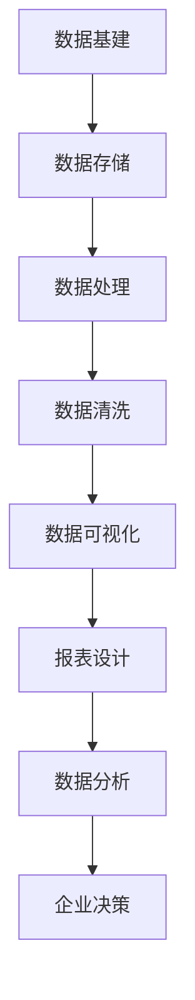

##### 1.1.2 数据基建的定义与构成

数据基建是一个复杂的系统，涉及多个关键组件，包括数据存储、数据清洗、数据处理、数据可视化、报表设计和数据分析等。这些组件相互关联，共同构成了一个完整的数据处理流程。每个组件都有其特定的功能，但它们之间的协作至关重要。

**核心概念与联系：**

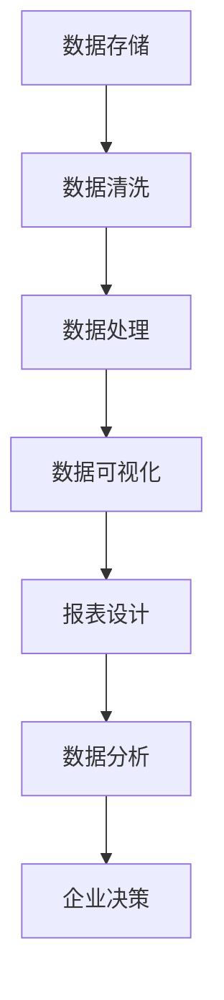

##### 1.1.3 数据基建在企业中的应用

数据基建在企业中的应用广泛，涵盖了营销、销售、供应链管理、客户关系管理等多个领域。通过数据基建，企业可以实时获取和分析业务数据，从而优化业务流程，提高运营效率，降低成本，提升客户满意度。

**核心概念与联系：**

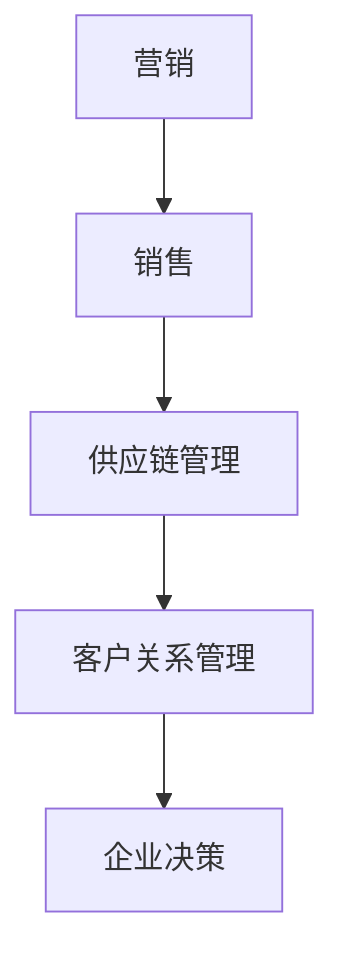

#### 第2章: 数据可视化基础

##### 2.1.1 数据可视化的概念与意义

数据可视化是将复杂的数据通过图形、图表等方式进行展示，使其更加直观、易于理解的过程。数据可视化的意义在于，它可以帮助我们快速发现数据中的趋势、模式、异常等，从而做出更准确的决策。

**核心概念与联系：**

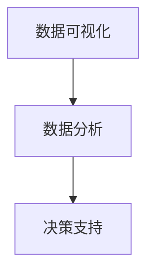

##### 2.1.2 常见的数据可视化工具

常见的数据可视化工具有 Tableau、Power BI、D3.js、ECharts 等。这些工具各具特色，适用于不同的应用场景。Tableau 和 Power BI 适用于企业级数据可视化，D3.js 和 ECharts 则适用于前端数据可视化。

**核心概念与联系：**

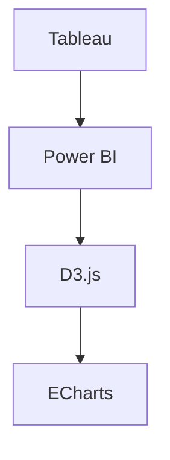

##### 2.1.3 数据可视化最佳实践

在进行数据可视化时，最佳实践包括：选择合适的图表类型、注意数据的美观性和可读性、避免过度设计、确保数据的准确性和可靠性等。

**核心概念与联系：**

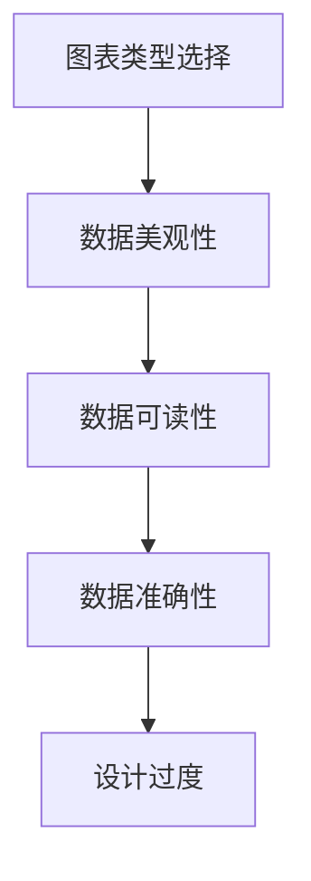

#### 第3章: 数据可视化组件与库

##### 3.1.1 常见数据可视化组件介绍

常见的数据可视化组件包括折线图、柱状图、饼图、散点图等。每种组件都有其特定的用途和优势。

**核心概念与联系：**

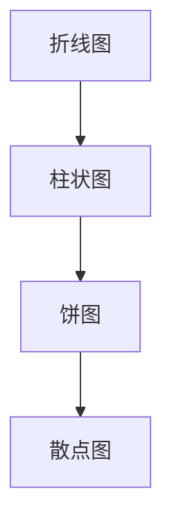

##### 3.1.2 使用D3.js进行数据可视化

D3.js 是一个强大的 JavaScript 库，用于前端数据可视化。它提供了丰富的图表组件和灵活的布局算法，使得数据可视化变得简单而高效。

**核心概念与联系：**

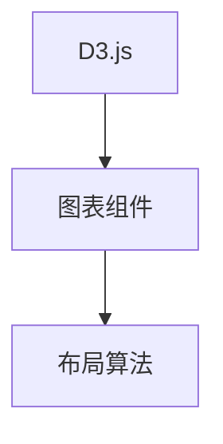

##### 3.1.3 使用ECharts进行数据可视化

ECharts 是一个基于 JavaScript 的可视化图表库，由百度团队开发。它提供了丰富的图表类型和强大的交互功能，适用于各种数据可视化需求。

**核心概念与联系：**

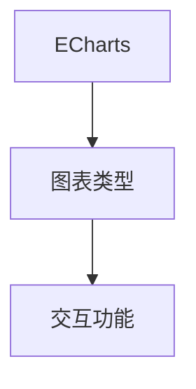

#### 第4章: 报表设计与实现

##### 4.1.1 报表设计原则

报表设计需要遵循清晰、简洁、准确的原则。设计过程中应充分考虑用户的需求，确保报表内容全面、直观、易于理解。

**核心概念与联系：**

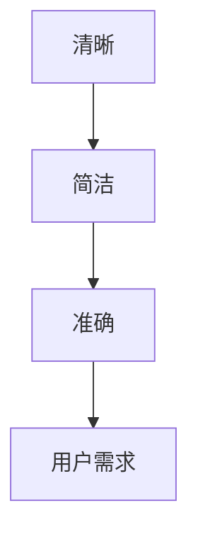

##### 4.1.2 常见报表类型

常见报表类型包括日报、周报、月报、年度报告等。每种报表类型都有其特定的用途和设计要求。

**核心概念与联系：**

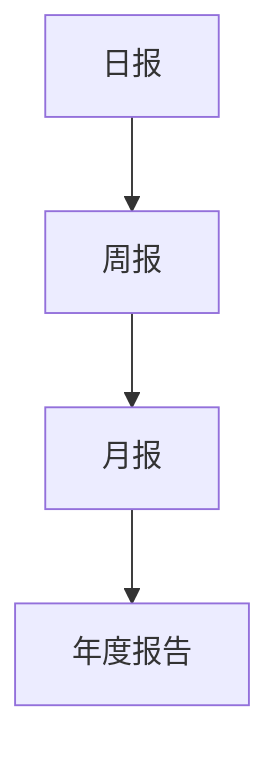

##### 4.1.3 报表制作工具

常见报表制作工具包括 Excel、Tableau、Power BI 等。这些工具各具特色，适用于不同的报表制作需求。

**核心概念与联系：**

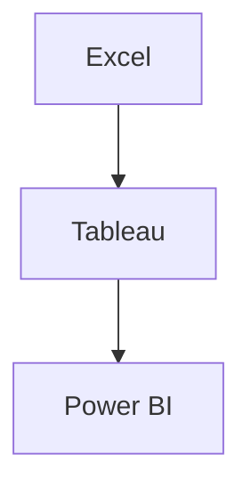

#### 第5章: 数据分析方法与工具

##### 5.1.1 常见数据分析方法

常见数据分析方法包括描述性分析、推断性分析、预测性分析等。每种分析方法都有其特定的应用场景和优势。

**核心概念与联系：**

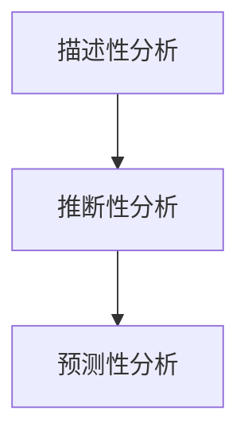

##### 5.1.2 数据分析工具的选择

数据分析工具的选择需要考虑数据量、数据类型、分析需求等多个因素。常见数据分析工具包括 Python、R、SQL 等。

**核心概念与联系：**

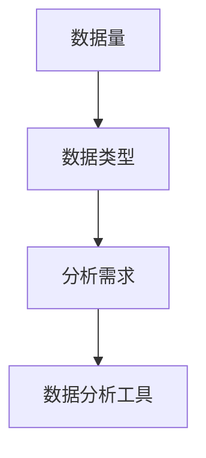

##### 5.1.3 数据分析案例实战

通过实际案例分析，了解数据分析的方法、工具和实战技巧，提高数据分析能力。

**核心概念与联系：**

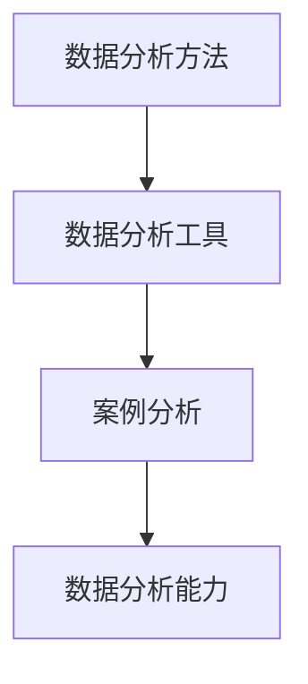

#### 第6章: 数据处理与清洗

##### 6.1.1 数据处理的基本流程

数据处理的基本流程包括数据采集、数据存储、数据清洗、数据处理、数据可视化等。

**核心概念与联系：**

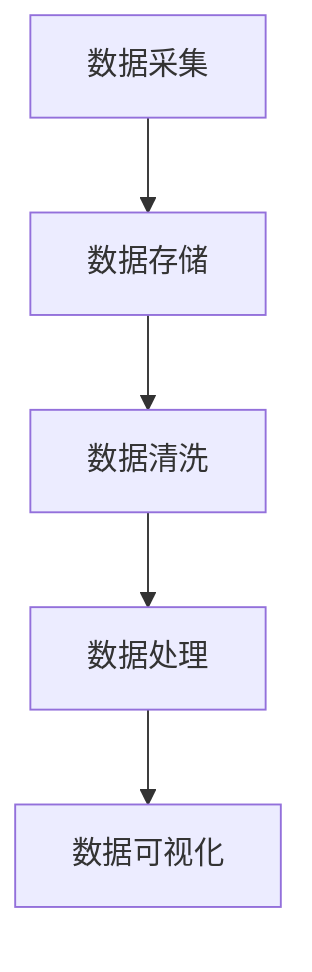

##### 6.1.2 数据清洗的方法与技巧

数据清洗是数据处理的重要环节，包括去除重复数据、填充缺失值、处理异常值等。数据清洗的方法和技巧对数据质量至关重要。

**核心概念与联系：**

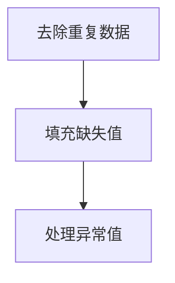

##### 6.1.3 数据处理工具的使用

常见数据处理工具包括 Python、R、SQL 等。这些工具提供了丰富的数据处理函数和库，方便用户进行数据处理。

**核心概念与联系：**

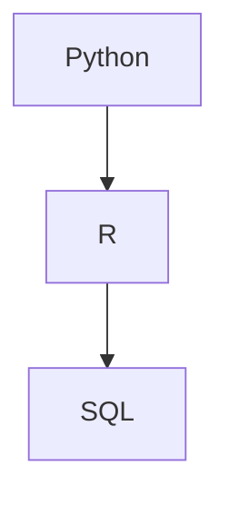

#### 第7章: 数据存储与挖掘

##### 7.1.1 数据存储技术

数据存储技术包括关系型数据库、非关系型数据库、分布式存储系统等。每种存储技术都有其特定的应用场景和优势。

**核心概念与联系：**

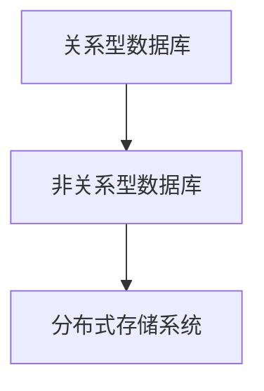

##### 7.1.2 数据挖掘的基本方法

数据挖掘的基本方法包括聚类分析、分类分析、关联规则挖掘等。这些方法用于从大量数据中提取有价值的信息。

**核心概念与联系：**

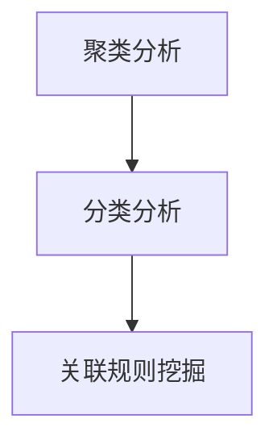

##### 7.1.3 数据挖掘工具与框架

常见数据挖掘工具和框架包括 WEKA、Apache Mahout、Scikit-learn 等。这些工具和框架提供了丰富的数据挖掘算法和函数，方便用户进行数据挖掘。

**核心概念与联系：**

```mermaid
graph TD
    A[WEKA] --> B[Apache Mahout]
    B --> C[Scikit-learn]
```

#### 第8章: AI DMP 数据基建案例分析

##### 8.1.1 案例介绍

本文将介绍一个实际案例，分析如何通过 AI DMP 数据基建实现高效的数据管理和分析。

**核心概念与联系：**

```mermaid
graph TD
    A[案例介绍] --> B[AI DMP 数据基建]
```

##### 8.1.2 案例实施步骤

案例实施包括数据采集、数据清洗、数据处理、数据可视化、数据分析等步骤。每个步骤都有其特定的任务和目标。

**核心概念与联系：**

```mermaid
graph TD
    A[数据采集] --> B[数据清洗]
    B --> C[数据处理]
    C --> D[数据可视化]
    D --> E[数据分析]
```

##### 8.1.3 案例效果评估

案例效果评估包括数据质量、分析效率、业务价值等多个方面。通过评估，可以了解数据基建的效果和改进方向。

**核心概念与联系：**

```mermaid
graph TD
    A[数据质量] --> B[分析效率]
    B --> C[业务价值]
```

#### 第9章: 未来展望与趋势

##### 9.1.1 数据基建的发展趋势

随着大数据、人工智能、云计算等技术的不断发展，数据基建将迎来更多的创新和机遇。未来，数据基建将更加智能化、自动化，为企业提供更高效的数据管理和分析服务。

**核心概念与联系：**

```mermaid
graph TD
    A[大数据技术] --> B[人工智能技术]
    B --> C[云计算技术]
```

##### 9.1.2 AI DMP 技术的创新发展

AI DMP 技术将不断融合新的算法、工具和框架，提高数据处理的效率和准确性。同时，AI DMP 技术将更加注重用户体验和业务价值，为企业提供更智能、更高效的数据解决方案。

**核心概念与联系：**

```mermaid
graph TD
    A[算法创新] --> B[工具创新]
    B --> C[框架创新]
```

##### 9.1.3 企业应用前景与挑战

随着数据基建的发展，企业将面临更多的机遇和挑战。如何在海量数据中提取有价值的信息，如何提高数据处理的效率和准确性，如何实现数据驱动决策，都是企业需要面对的重要问题。

**核心概念与联系：**

```mermaid
graph TD
    A[数据价值提取] --> B[数据处理效率]
    B --> C[数据准确性]
    C --> D[数据驱动决策]
```

### 作者

作者：AI天才研究院/AI Genius Institute & 禅与计算机程序设计艺术 /Zen And The Art of Computer Programming

通过以上章节，我们将逐步深入探讨 AI DMP 数据基建的核心概念、技术方法和实际应用。希望本文能为您在数据管理和分析领域提供有价值的参考和指导。在接下来的内容中，我们将详细讲解每个章节的核心概念、技术原理、实现方法，以及相关的实际案例和代码示例，帮助您全面了解并掌握 AI DMP 数据基建的精髓。让我们一步一步地思考，深入分析，共同开启这场技术之旅。

