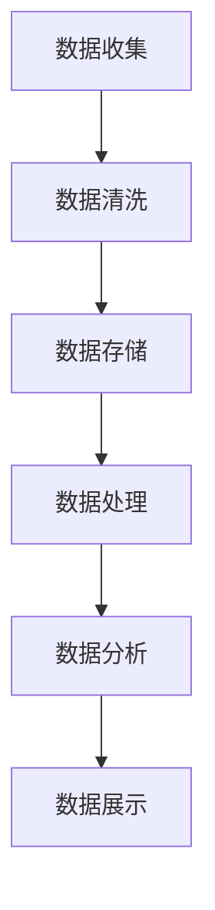
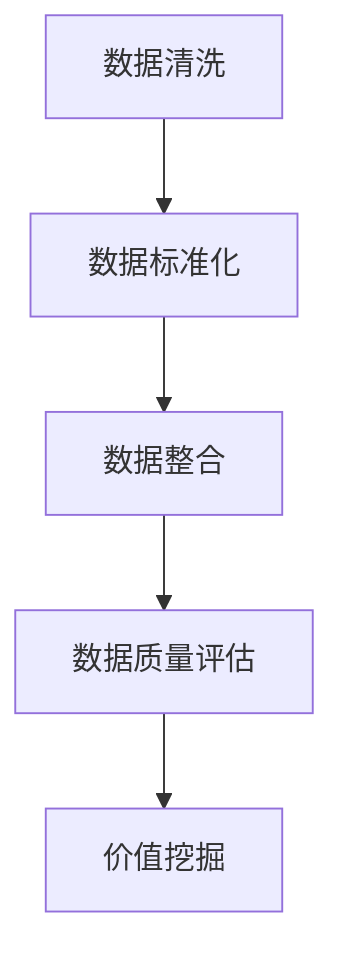
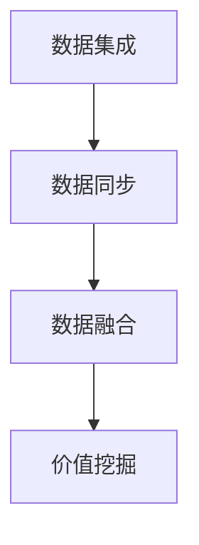
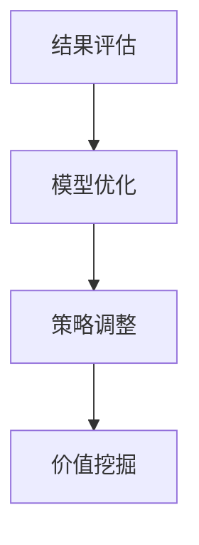
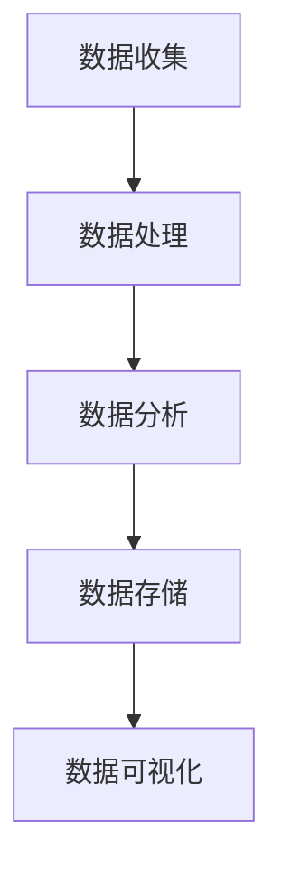
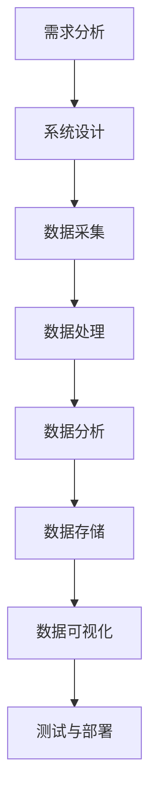

                 

# AI DMP 数据基建：数据应用与价值挖掘

> 关键词：人工智能，数据管理平台，数据挖掘，数据应用，价值挖掘

> 摘要：本文深入探讨了人工智能数据管理平台（AI DMP）的数据基建，包括其基础概念、架构设计、数据应用技术、价值挖掘方法以及实战应用。通过逐步分析，本文揭示了AI DMP在现代商业中的重要性及其面临的挑战和未来发展趋势。

## 第一部分: AI DMP 数据基建概述

### 第1章: AI DMP 基础概念与架构

#### 1.1 AI DMP 概念与背景

**1.1.1 数据管理与数据挖掘**

数据管理是指通过有效的组织、存储、检索和保护数据，以满足组织内部和外部的需求。数据挖掘则是从大量数据中发现有用模式和知识的过程。

**1.1.2 DMP的基本原理与功能**

DMP（数据管理平台）是一种用于收集、管理和分析数据的工具，它可以帮助企业从海量数据中提取有价值的信息。

**1.1.3 AI技术在DMP中的应用**

人工智能技术，如机器学习和深度学习，已经被广泛应用于DMP中，以提高数据分析和挖掘的效率和质量。

#### 1.2 AI DMP 架构与组件

**1.2.1 数据收集与清洗**

数据收集涉及从多个来源获取数据，而数据清洗则是去除噪声和不准确的数据。

**1.2.2 数据存储与管理**

数据存储与管理包括数据的存储、访问和管理，以确保数据的可用性和可靠性。

**1.2.3 数据分析与挖掘**

数据分析和挖掘是DMP的核心，通过算法和模型从数据中提取有价值的信息。

**1.2.4 数据可视化与报告**

数据可视化与报告是将分析结果以图表和报告的形式展示给用户，以便他们理解和决策。

#### 1.3 AI DMP 在商业中的应用

**1.3.1 AI DMP在市场营销中的应用**

AI DMP可以帮助企业更好地了解客户，优化营销策略，提高转化率。

**1.3.2 AI DMP在客户关系管理中的应用**

AI DMP可以帮助企业更好地管理客户关系，提高客户满意度和忠诚度。

**1.3.3 AI DMP在商业策略制定中的应用**

AI DMP可以帮助企业更好地分析市场趋势，制定更加科学的商业策略。

## 第二部分: AI DMP 数据应用

### 第2章: 数据应用技术基础

#### 2.1 数据应用技术概述

**2.1.1 数据挖掘方法与技术**

数据挖掘方法包括分类、聚类、关联规则挖掘等，技术包括机器学习、深度学习等。

**2.1.2 数据分析工具与平台**

数据分析工具和平台包括Excel、Python、R等，这些工具可以帮助用户更有效地进行数据分析和挖掘。

**2.1.3 数据可视化与报表**

数据可视化与报表是将分析结果以图表和报告的形式展示给用户，以便他们理解和决策。

#### 2.2 数据挖掘算法原理

**2.2.1 分类算法**

分类算法是一种将数据分为不同类别的算法，如决策树、支持向量机等。

**2.2.2 聚类算法**

聚类算法是一种将相似的数据归为一类的算法，如K-means、层次聚类等。

**2.2.3 关联规则挖掘**

关联规则挖掘是一种发现数据之间关联关系的算法，如Apriori算法、FP-growth算法等。

**2.2.4 异常检测算法**

异常检测算法是一种检测数据中的异常或异常模式的算法，如孤立森林、k-近邻等。

#### 2.3 数据应用案例解析

**2.3.1 市场营销案例分析**

市场营销案例分析展示了如何使用AI DMP来优化营销策略，提高销售额。

**2.3.2 客户行为分析案例**

客户行为分析案例展示了如何使用AI DMP来分析客户行为，提高客户满意度。

**2.3.3 竞争对手分析案例**

竞争对手分析案例展示了如何使用AI DMP来分析竞争对手的数据，制定有效的竞争策略。

## 第三部分: AI DMP 价值挖掘

### 第3章: 价值挖掘方法与策略

#### 3.1 价值挖掘概念与原理

**3.1.1 数据价值的定义**

数据价值是指数据对组织或个人决策的影响程度。

**3.1.2 价值挖掘的目标与挑战**

价值挖掘的目标是发现有价值的数据模式，挑战包括数据质量、计算资源等。

**3.1.3 价值挖掘的方法与步骤**

价值挖掘的方法包括数据预处理、模式识别、评估与优化等步骤。

#### 3.2 价值挖掘策略与实施

**3.2.1 数据质量优化策略**

数据质量优化策略包括数据清洗、数据整合等。

**3.2.2 数据整合与融合策略**

数据整合与融合策略包括数据标准化、数据同步等。

**3.2.3 价值评估与优化策略**

价值评估与优化策略包括模型评估、策略优化等。

#### 3.3 价值挖掘案例分析

**3.3.1 成功案例解析**

成功案例解析展示了如何通过价值挖掘实现业务增长。

**3.3.2 失败案例分析与反思**

失败案例分析与反思展示了如何避免价值挖掘中的常见问题。

## 第四部分: AI DMP 实战

### 第4章: AI DMP 开发实战

#### 4.1 AI DMP 系统设计与开发

**4.1.1 系统设计原则与架构**

系统设计原则与架构包括模块化设计、分布式架构等。

**4.1.2 开发工具与平台**

开发工具与平台包括Python、Hadoop等。

**4.1.3 开发流程与规范**

开发流程与规范包括需求分析、设计、编码、测试等。

#### 4.2 数据采集与清洗实战

**4.2.1 数据采集工具与方法**

数据采集工具与方法包括Web爬虫、API调用等。

**4.2.2 数据清洗策略与实现**

数据清洗策略与实现包括去重、格式转换等。

**4.2.3 数据质量评估与优化**

数据质量评估与优化包括质量评估、优化策略等。

#### 4.3 数据分析与挖掘实战

**4.3.1 数据分析流程与工具**

数据分析流程与工具包括数据预处理、模型选择等。

**4.3.2 数据挖掘算法应用**

数据挖掘算法应用包括分类、聚类等。

**4.3.3 挖掘结果分析与解读**

挖掘结果分析与解读包括结果评估、解读技巧等。

#### 4.4 数据可视化与报告实战

**4.4.1 可视化工具与应用**

可视化工具与应用包括Tableau、Power BI等。

**4.4.2 报告编写与展示技巧**

报告编写与展示技巧包括结构、格式、图表应用等。

**4.4.3 可视化案例解析**

可视化案例解析包括案例展示、分析技巧等。

## 第五部分: AI DMP 挑战与未来

### 第5章: AI DMP 面临的挑战与未来趋势

#### 5.1 AI DMP 面临的挑战

**5.1.1 技术挑战**

技术挑战包括数据存储、计算资源等。

**5.1.2 数据隐私与安全**

数据隐私与安全是AI DMP面临的重要挑战。

**5.1.3 法规与合规**

法规与合规是AI DMP发展的关键因素。

#### 5.2 AI DMP 未来发展趋势

**5.2.1 人工智能技术演进**

人工智能技术将继续演进，为AI DMP带来新的机遇。

**5.2.2 数据管理发展趋势**

数据管理将更加智能化、自动化。

**5.2.3 AI DMP 在未来的商业应用**

AI DMP将在未来的商业应用中发挥更大的作用。

### 附录

#### 附录 A: AI DMP 相关工具与资源

**A.1 开源数据挖掘工具**

开源数据挖掘工具包括Weka、Scikit-learn等。

**A.2 商业数据挖掘工具**

商业数据挖掘工具包括IBM SPSS、SAS等。

**A.3 数据可视化工具**

数据可视化工具包括Tableau、Power BI等。

#### 附录 B: AI DMP 开发指南

**B.1 开发环境搭建**

开发环境搭建包括软件安装、配置等。

**B.2 开发技巧与最佳实践**

开发技巧与最佳实践包括编码规范、测试策略等。

**B.3 问题解决与故障排除**

问题解决与故障排除包括常见问题、解决方法等。

### 作者

作者：AI天才研究院/AI Genius Institute & 禅与计算机程序设计艺术 /Zen And The Art of Computer Programming

以上是《AI DMP 数据基建：数据应用与价值挖掘》的完整目录大纲，接下来将逐步深入探讨每一章节的内容。

---

## 第1章: AI DMP 基础概念与架构

在当今信息化和数字化快速发展的时代，数据已经成为企业的重要资产。如何有效地管理和利用这些数据，已经成为企业成功的关键。人工智能数据管理平台（AI DMP）作为一种先进的数据管理工具，正在逐渐得到企业的关注和重视。本章将介绍AI DMP的基础概念、架构以及其在商业中的应用。

### 1.1 AI DMP 概念与背景

#### 1.1.1 数据管理与数据挖掘

数据管理是指通过有效的组织、存储、检索和保护数据，以满足组织内部和外部的需求。数据管理包括数据收集、数据存储、数据清洗、数据集成、数据安全和数据治理等多个方面。

数据挖掘是指从大量数据中发现有用模式和知识的过程。数据挖掘的目标是从数据中发现隐藏的模式和关系，从而为决策提供支持。

#### 1.1.2 DMP的基本原理与功能

DMP（数据管理平台）是一种用于收集、管理和分析数据的工具，它可以帮助企业从海量数据中提取有价值的信息。DMP的基本原理包括数据收集、数据存储、数据处理、数据分析和数据展示。

DMP的主要功能包括：

1. **数据收集**：从多个数据源收集数据，包括内部数据源和外部数据源。
2. **数据存储**：将收集到的数据进行存储，并确保数据的可用性和可靠性。
3. **数据处理**：对数据进行清洗、转换和整合，以提高数据质量。
4. **数据分析**：使用数据分析工具和算法对数据进行处理，以发现数据中的模式和关系。
5. **数据展示**：将分析结果以图表和报告的形式展示给用户，以便他们理解和决策。

#### 1.1.3 AI技术在DMP中的应用

随着人工智能技术的不断发展，AI技术已经被广泛应用于DMP中。AI技术在DMP中的应用主要体现在以下几个方面：

1. **数据预处理**：使用机器学习算法对数据进行清洗、转换和整合，以提高数据质量。
2. **特征工程**：使用AI技术提取数据中的特征，以便更好地进行数据分析和挖掘。
3. **预测分析**：使用机器学习和深度学习算法对数据进行预测分析，以预测未来的趋势和变化。
4. **自动决策**：使用AI技术自动生成决策支持，以帮助用户更好地做出决策。

### 1.2 AI DMP 架构与组件

AI DMP的架构通常包括以下几个关键组件：

#### 1.2.1 数据收集与清洗

数据收集是指从多个数据源获取数据，包括内部数据源（如数据库、日志文件等）和外部数据源（如社交媒体、第三方数据提供商等）。数据清洗是对收集到的数据进行处理，以去除噪声、重复和错误的数据，提高数据质量。

**Mermaid流程图：**



#### 1.2.2 数据存储与管理

数据存储是将清洗后的数据存储到数据库或数据仓库中，以便进行后续的处理和分析。数据管理包括数据的存储、访问和管理，以确保数据的可用性和可靠性。

#### 1.2.3 数据分析与挖掘

数据分析与挖掘是AI DMP的核心功能。通过使用机器学习、深度学习等算法，从数据中提取有价值的信息和知识。数据分析与挖掘可以应用于多个领域，如市场营销、客户关系管理、商业策略制定等。

#### 1.2.4 数据可视化与报告

数据可视化与报告是将分析结果以图表和报告的形式展示给用户，以便他们理解和决策。数据可视化工具如Tableau、Power BI等可以帮助用户更直观地理解数据。

### 1.3 AI DMP 在商业中的应用

AI DMP在商业中的应用非常广泛，以下是一些典型的应用场景：

#### 1.3.1 AI DMP在市场营销中的应用

AI DMP可以帮助企业更好地了解客户需求和行为，从而优化营销策略，提高营销效果。通过分析客户数据，企业可以识别潜在客户，制定个性化的营销活动，提高客户转化率。

#### 1.3.2 AI DMP在客户关系管理中的应用

AI DMP可以帮助企业更好地管理客户关系，提高客户满意度和忠诚度。通过分析客户数据，企业可以识别高价值客户，提供个性化的服务和优惠，增加客户留存率。

#### 1.3.3 AI DMP在商业策略制定中的应用

AI DMP可以帮助企业更好地分析市场趋势和竞争对手数据，制定科学的商业策略。通过分析市场数据，企业可以预测市场趋势，制定有针对性的营销策略和产品策略。

### 1.4 小结

本章介绍了AI DMP的基础概念、架构及其在商业中的应用。AI DMP作为一种先进的数据管理工具，可以帮助企业更好地管理和利用数据，提高决策质量和效率。在接下来的章节中，我们将进一步探讨AI DMP的数据应用技术、价值挖掘方法以及实战应用。

---

本章内容涵盖了AI DMP的基础概念、架构以及其在商业中的应用，为读者提供了对AI DMP的整体认识。在下一章中，我们将深入探讨AI DMP的数据应用技术，包括数据挖掘方法、数据分析工具和平台，以及数据可视化与报表等。

## 第2章: 数据应用技术基础

随着数据量的爆炸性增长，如何有效地应用这些数据已成为企业关注的焦点。AI DMP的数据应用技术是实现这一目标的关键。本章将详细介绍数据应用技术的基础，包括数据挖掘方法、数据分析工具与平台，以及数据可视化与报表技术。

### 2.1 数据应用技术概述

数据应用技术是指将数据转化为有价值信息的过程。这一过程通常包括数据收集、数据预处理、数据存储、数据分析和数据展示等步骤。

#### 2.1.1 数据挖掘方法与技术

数据挖掘是从大量数据中自动发现有用模式和知识的过程。常见的数据挖掘方法包括分类、聚类、关联规则挖掘和异常检测等。

1. **分类算法**：分类算法将数据分为不同的类别。常见的分类算法有决策树、支持向量机（SVM）、K最近邻（KNN）等。

2. **聚类算法**：聚类算法将数据分为多个聚类，使得同一聚类内的数据点相似度较高。常见的聚类算法有K-means、层次聚类等。

3. **关联规则挖掘**：关联规则挖掘旨在发现数据之间的关联关系。常见的算法有Apriori算法、FP-growth算法等。

4. **异常检测算法**：异常检测算法用于检测数据中的异常或异常模式。常见的算法有孤立森林、k-近邻等。

#### 2.1.2 数据分析工具与平台

数据分析工具和平台是实现数据挖掘和分析的核心。常见的工具和平台包括Excel、Python、R、Tableau等。

1. **Excel**：Excel是一个功能强大的电子表格工具，适用于简单的数据分析和报表生成。

2. **Python**：Python是一种广泛使用的编程语言，拥有丰富的数据分析和挖掘库，如Pandas、NumPy、Scikit-learn等。

3. **R**：R是一种专门用于统计分析的语言，拥有丰富的统计和图形库。

4. **Tableau**：Tableau是一个强大的数据可视化工具，可以帮助用户轻松创建交互式图表和报表。

#### 2.1.3 数据可视化与报表

数据可视化是将数据以图表和图形的形式展示给用户，使其更容易理解和分析数据。数据可视化工具如Tableau、Power BI等可以帮助用户直观地了解数据，发现隐藏的模式和趋势。

报表是将分析结果以结构化的形式展示给用户的重要手段。通过报表，用户可以清晰地看到数据背后的故事，为决策提供支持。

### 2.2 数据挖掘算法原理

数据挖掘算法是数据应用技术的核心。以下是一些常见的数据挖掘算法及其原理：

#### 2.2.1 分类算法

分类算法是一种将数据分为不同类别的算法。常见的分类算法有决策树、支持向量机（SVM）和K最近邻（KNN）等。

**决策树算法**

决策树是一种树形结构，通过一系列的决策节点和叶子节点对数据进行分类。决策树算法的伪代码如下：

```python
def build_decision_tree(data):
    if data满足停止条件:
        return 叶子节点
    else:
        选择最佳特征A
        划分数据为子集D1, D2, ..., Dn
        创建决策节点A
        对于每个子集Di:
            创建子决策树Tdi
        返回决策节点A及其子决策树
```

**支持向量机（SVM）算法**

支持向量机是一种基于最大间隔的分类算法。SVM的目标是找到一个最佳的超平面，使得不同类别的数据点之间的间隔最大。SVM的伪代码如下：

```python
def train_svm(data, labels):
    计算最佳超平面
    识别支持向量
    返回模型参数
```

**K最近邻（KNN）算法**

K最近邻是一种基于实例的分类算法。KNN算法通过计算新数据点与训练数据点的距离，找出最近的K个邻居，并根据邻居的标签进行分类。KNN算法的伪代码如下：

```python
def classify_knn(new_data, k):
    计算新数据与训练数据点的距离
    找出最近的K个邻居
    计算邻居标签的多数值
    返回分类结果
```

#### 2.2.2 聚类算法

聚类算法是一种将数据分为多个聚类的算法。常见的聚类算法有K-means、层次聚类等。

**K-means算法**

K-means算法是一种基于距离的聚类算法。K-means算法的目标是将数据分为K个聚类，使得每个聚类内部的距离最小，聚类之间的距离最大。K-means算法的伪代码如下：

```python
def k_means(data, k):
    随机选择K个初始中心点
    计算每个数据点与中心点的距离
    分配数据点到最近的中心点
    更新中心点位置
    重复步骤3和步骤4，直到中心点位置不再改变
    返回聚类结果
```

**层次聚类算法**

层次聚类算法是一种自下而上的聚类算法。层次聚类算法首先将每个数据点作为一个聚类，然后逐步合并距离较近的聚类，直到满足停止条件。层次聚类算法的伪代码如下：

```python
def hierarchical_clustering(data):
    初始化每个数据点为独立的聚类
    计算聚类之间的距离
    逐步合并距离较近的聚类
    创建聚类树
    返回聚类结果
```

#### 2.2.3 关联规则挖掘

关联规则挖掘是一种发现数据之间关联关系的算法。常见的算法有Apriori算法、FP-growth算法等。

**Apriori算法**

Apriori算法是一种基于支持度和置信度的关联规则挖掘算法。Apriori算法的伪代码如下：

```python
def apriori(data, min_support, min_confidence):
    计算所有项集的支持度
    筛选出满足最小支持度的项集
    对于每个满足最小支持度的项集：
        计算关联规则的支持度和置信度
        筛选出满足最小置信度的关联规则
    返回关联规则
```

**FP-growth算法**

FP-growth算法是一种基于频繁模式树的关联规则挖掘算法。FP-growth算法的伪代码如下：

```python
def fp_growth(data, min_support):
    构建FP-growth树
    递归地从FP-growth树中提取频繁模式
    返回关联规则
```

#### 2.2.4 异常检测算法

异常检测算法是一种检测数据中的异常或异常模式的算法。常见的算法有孤立森林、k-近邻等。

**孤立森林算法**

孤立森林算法是一种基于随机森林的异常检测算法。孤立森林算法的伪代码如下：

```python
def isolation_forest(data, n_estimators):
    构建孤立森林模型
    对于每个数据点：
        预测异常得分
    筛选出异常得分较高的数据点
    返回异常数据点
```

**k-近邻算法**

k-近邻算法是一种基于距离的异常检测算法。k-近邻算法的伪代码如下：

```python
def k_nearest_neighbors(data, k):
    计算每个数据点与训练数据点的距离
    找出最近的K个邻居
    根据邻居的标签判断是否为异常
    返回异常数据点
```

### 2.3 数据应用案例解析

以下是一些数据应用案例，展示了如何在实际场景中应用数据挖掘算法和工具。

#### 2.3.1 市场营销案例分析

一个电子商务公司使用数据挖掘技术来分析客户购买行为，以提高销售额。通过分类算法，公司识别出高价值客户群体，并针对这些客户群体制定个性化的营销策略。通过关联规则挖掘，公司发现了一些产品组合，从而优化产品推荐系统。

#### 2.3.2 客户行为分析案例

一家酒店使用数据挖掘技术来分析客户预订行为，以优化客户体验和提高客户满意度。通过聚类算法，酒店将客户分为不同的细分市场，并针对每个细分市场提供个性化的服务。通过异常检测算法，酒店能够识别出异常预订行为，从而防范欺诈行为。

#### 2.3.3 竞争对手分析案例

一家企业使用数据挖掘技术来分析竞争对手的市场行为，以制定有效的竞争策略。通过数据挖掘，企业能够识别出竞争对手的产品策略、定价策略和市场行为，从而优化自身的市场策略。

### 2.4 小结

本章详细介绍了数据应用技术的基础，包括数据挖掘方法、数据分析工具和平台，以及数据可视化与报表技术。这些技术是实现数据价值的关键，为企业的决策提供了有力支持。在下一章中，我们将进一步探讨AI DMP的价值挖掘方法和策略。

---

本章详细介绍了数据应用技术的基础，包括数据挖掘算法原理、数据分析工具与平台，以及数据可视化与报表技术。通过这些技术，企业可以从海量数据中提取有价值的信息，为决策提供支持。在下一章中，我们将深入探讨AI DMP的价值挖掘方法与策略。

## 第3章: 价值挖掘方法与策略

在数据应用技术的基础上，AI DMP的价值挖掘方法与策略是实现数据商业价值的关键。本章将详细介绍价值挖掘的概念与原理、数据质量优化策略、数据整合与融合策略，以及价值评估与优化策略。

### 3.1 价值挖掘概念与原理

#### 3.1.1 数据价值的定义

数据价值是指数据对组织或个人决策的影响程度。价值挖掘的目标是发现数据中的隐藏模式，从而提高决策的准确性和效率。

#### 3.1.2 价值挖掘的目标与挑战

价值挖掘的目标包括：

1. **发现数据中的有用信息**：通过数据挖掘算法，从海量数据中发现隐藏的模式和关系。
2. **提高决策质量**：利用挖掘到的信息，为决策提供支持，提高决策的准确性和效率。
3. **优化业务流程**：根据挖掘结果，优化业务流程，提高运营效率。

价值挖掘面临的挑战包括：

1. **数据质量**：数据质量是价值挖掘成功的关键。低质量的数据可能导致错误的结论和决策。
2. **计算资源**：价值挖掘通常需要大量的计算资源，特别是在处理大规模数据时。
3. **数据隐私与安全**：在挖掘过程中，需要确保数据隐私和安全，避免敏感信息泄露。

#### 3.1.3 价值挖掘的方法与步骤

价值挖掘的方法通常包括以下步骤：

1. **数据预处理**：对原始数据进行清洗、转换和整合，以提高数据质量。
2. **模式识别**：使用数据挖掘算法，从数据中识别出隐藏的模式和关系。
3. **结果评估**：对挖掘结果进行评估，确定其价值和有效性。
4. **优化策略**：根据评估结果，调整挖掘方法和策略，以优化价值挖掘过程。

### 3.2 价值挖掘策略与实施

#### 3.2.1 数据质量优化策略

数据质量优化是价值挖掘的基础。以下是一些常用的数据质量优化策略：

1. **数据清洗**：去除噪声、重复和错误的数据，提高数据质量。
2. **数据标准化**：统一数据格式和单位，确保数据的一致性。
3. **数据整合**：将来自不同数据源的数据进行整合，以提供更全面的视图。
4. **数据质量评估**：定期评估数据质量，识别和修复问题。

**Mermaid流程图：**



#### 3.2.2 数据整合与融合策略

数据整合与融合是将来自不同数据源的数据进行整合，以提供更全面的视图。以下是一些常用的数据整合与融合策略：

1. **数据集成**：将来自不同数据源的数据进行集成，以创建一个统一的数据视图。
2. **数据同步**：确保不同数据源中的数据保持一致性。
3. **数据融合**：将来自不同数据源的数据进行融合，以提供更准确和全面的信息。

**Mermaid流程图：**



#### 3.2.3 价值评估与优化策略

价值评估与优化策略是确保价值挖掘结果有效性和实用性的关键。以下是一些常用的价值评估与优化策略：

1. **结果评估**：对挖掘结果进行评估，确定其价值和有效性。
2. **模型优化**：根据评估结果，调整挖掘模型和参数，以提高挖掘效果。
3. **策略调整**：根据评估结果，调整价值挖掘策略，以更好地满足业务需求。

**Mermaid流程图：**



### 3.3 价值挖掘案例分析

以下是一些价值挖掘案例分析，展示了如何在实际场景中应用价值挖掘策略。

#### 3.3.1 成功案例解析

一个电商公司使用价值挖掘技术，分析客户购买行为，发现了一些高价值客户群体。通过针对性的营销策略，公司成功地提高了客户转化率和销售额。

#### 3.3.2 失败案例分析与反思

一家企业尝试使用价值挖掘技术，但没有考虑到数据质量和整合问题，导致挖掘结果不准确。通过分析失败原因，企业意识到数据质量和整合是价值挖掘成功的关键。

### 3.4 小结

本章详细介绍了AI DMP的价值挖掘方法与策略，包括数据质量优化策略、数据整合与融合策略，以及价值评估与优化策略。通过这些策略，企业可以从海量数据中提取有价值的信息，为决策提供支持。在下一章中，我们将探讨AI DMP的实战应用，通过具体案例展示价值挖掘的实际效果。

---

本章详细介绍了AI DMP的价值挖掘方法与策略，包括数据质量优化、数据整合与融合，以及价值评估与优化。通过这些策略，企业可以更好地挖掘数据价值，为决策提供支持。在下一章中，我们将通过实战案例深入探讨AI DMP的实际应用。

## 第4章: AI DMP 开发实战

在了解了AI DMP的基础概念和开发策略之后，本章将带你深入实践，从系统设计、数据采集与清洗、数据分析与挖掘，到数据可视化与报告，全面展示AI DMP的开发过程。

### 4.1 AI DMP 系统设计与开发

#### 4.1.1 系统设计原则与架构

AI DMP的系统设计应遵循以下原则：

1. **模块化**：将系统划分为多个模块，如数据收集模块、数据处理模块、数据分析模块等，便于维护和扩展。
2. **分布式**：利用分布式计算架构，如Hadoop或Spark，提高系统的处理能力和可扩展性。
3. **高可用性**：确保系统在故障情况下能够快速恢复，保证数据的安全性和稳定性。

AI DMP的系统架构通常包括以下组件：

1. **数据收集模块**：负责从各种数据源收集数据，包括内部数据库、外部API、日志文件等。
2. **数据处理模块**：负责对数据进行清洗、转换和整合，以提高数据质量。
3. **数据分析模块**：负责使用数据挖掘算法和模型对数据进行处理和分析。
4. **数据存储模块**：负责存储和管理数据，包括关系型数据库、NoSQL数据库、数据仓库等。
5. **数据可视化模块**：负责将分析结果以图表和报表的形式展示给用户。

**Mermaid流程图：**



#### 4.1.2 开发工具与平台

在AI DMP的开发过程中，选择合适的工具和平台至关重要。以下是一些常用的工具和平台：

1. **编程语言**：Python和Java是AI DMP开发中最常用的编程语言。Python因其丰富的数据分析和机器学习库（如Pandas、Scikit-learn、TensorFlow等）而备受欢迎。
2. **大数据处理框架**：Hadoop和Spark是处理大规模数据的常用框架。Hadoop提供高可靠性和可扩展性的分布式存储和计算能力，而Spark则提供高性能的内存计算能力。
3. **数据库**：关系型数据库（如MySQL、PostgreSQL）和NoSQL数据库（如MongoDB、Cassandra）广泛应用于AI DMP的数据存储。数据仓库（如Amazon Redshift、Google BigQuery）也常用于存储大量数据。
4. **数据可视化工具**：Tableau、Power BI和D3.js是常用的数据可视化工具，可以帮助用户轻松创建交互式图表和报表。

#### 4.1.3 开发流程与规范

AI DMP的开发流程通常包括以下步骤：

1. **需求分析**：明确项目的目标、需求和功能，确定数据源和数据需求。
2. **系统设计**：根据需求分析，设计系统的架构、模块和接口。
3. **数据采集**：从各种数据源收集数据，包括内部数据库、外部API、日志文件等。
4. **数据处理**：对数据进行清洗、转换和整合，以提高数据质量。
5. **数据分析**：使用数据挖掘算法和模型对数据进行处理和分析。
6. **数据存储**：将处理后的数据存储到数据库或数据仓库中。
7. **数据可视化**：将分析结果以图表和报表的形式展示给用户。
8. **测试与部署**：对系统进行测试，确保其功能符合需求，然后部署到生产环境。

**Mermaid流程图：**



### 4.2 数据采集与清洗实战

#### 4.2.1 数据采集工具与方法

数据采集是AI DMP的重要环节。以下是一些常用的数据采集工具与方法：

1. **Web爬虫**：使用Python的Scrapy库或Node.js的request-promise库等，从网页上爬取数据。
2. **API调用**：使用HTTP协议通过API接口获取数据，如RESTful API或SOAP API。
3. **日志文件**：从系统的日志文件中提取数据，如访问日志、错误日志等。

#### 4.2.2 数据清洗策略与实现

数据清洗是确保数据质量的关键步骤。以下是一些常用的数据清洗策略与实现方法：

1. **去重**：去除重复的数据记录，可以使用数据库的DISTINCT语句或Python的集合操作。
2. **数据转换**：将数据转换为统一格式和单位，如将日期格式转换为YYYY-MM-DD。
3. **缺失值处理**：处理缺失的数据，可以使用平均值、中位数或最大值等填充策略。
4. **异常值处理**：识别和去除异常值，可以使用统计学方法或基于业务逻辑的方法。

#### 4.2.3 数据质量评估与优化

数据质量评估是确保数据质量的重要手段。以下是一些常用的数据质量评估方法与优化策略：

1. **完整性检查**：检查数据是否完整，可以使用COUNT(*)语句或Python的len()函数。
2. **一致性检查**：检查数据是否一致，如检查字符串长度或数值范围。
3. **准确性检查**：检查数据的准确性，可以使用校验和或业务逻辑验证。
4. **优化策略**：根据评估结果，调整数据采集、清洗和存储策略，以提高数据质量。

### 4.3 数据分析与挖掘实战

#### 4.3.1 数据分析流程与工具

数据分析是AI DMP的核心。以下是一些常用的数据分析流程与工具：

1. **数据分析流程**：
   - 数据预处理：清洗、转换和整合数据，以提高数据质量。
   - 数据探索：使用描述性统计方法和可视化工具，了解数据的基本特征和分布。
   - 数据建模：使用统计模型、机器学习模型等，对数据进行建模和分析。
   - 结果评估：评估模型的性能和效果，选择最佳模型。

2. **数据分析工具**：
   - Excel：用于简单的数据预处理和可视化。
   - Python：用于复杂的数据分析和建模，如使用Pandas、NumPy、Scikit-learn等库。
   - R：用于高级的数据分析和统计，如使用ggplot2、dplyr等库。

#### 4.3.2 数据挖掘算法应用

数据挖掘算法是数据分析的核心。以下是一些常用的数据挖掘算法及其应用：

1. **分类算法**：如决策树、支持向量机（SVM）、K最近邻（KNN）等，用于预测和分类。
2. **聚类算法**：如K-means、层次聚类等，用于数据分组和细分。
3. **关联规则挖掘**：如Apriori算法、FP-growth算法等，用于发现数据之间的关联关系。
4. **异常检测算法**：如孤立森林、k-近邻等，用于检测数据中的异常和异常模式。

#### 4.3.3 挖掘结果分析与解读

挖掘结果的分析与解读是数据挖掘的最终目标。以下是一些常用的分析与解读方法：

1. **结果评估**：评估模型的性能和效果，如准确率、召回率、F1分数等。
2. **可视化**：使用图表和图形展示挖掘结果，如散点图、折线图、柱状图等。
3. **故事讲述**：通过故事化的方式，将挖掘结果传达给业务人员，使其更容易理解和应用。

### 4.4 数据可视化与报告实战

#### 4.4.1 可视化工具与应用

数据可视化是将数据分析结果以直观的方式展示给用户的重要手段。以下是一些常用的可视化工具与应用：

1. **Tableau**：一款功能强大的数据可视化工具，支持多种图表类型和交互功能。
2. **Power BI**：一款由微软推出的数据可视化工具，与Excel紧密集成。
3. **D3.js**：一款基于JavaScript的可视化库，可以创建复杂的交互式可视化。

#### 4.4.2 报告编写与展示技巧

报告编写与展示是数据分析的成果体现。以下是一些常用的报告编写与展示技巧：

1. **结构化**：确保报告的结构清晰、逻辑严密，有助于用户理解。
2. **图表应用**：合理使用图表，以直观地展示数据和分析结果。
3. **文字描述**：使用简洁明了的文字描述，补充图表无法表达的信息。
4. **交互性**：利用交互式元素，如超链接、动态图表等，增强报告的互动性和用户体验。

#### 4.4.3 可视化案例解析

以下是一个数据可视化的案例解析：

**案例背景**：某电商平台的用户购买行为分析。

**可视化目标**：展示用户购买偏好、购买时段、地域分布等信息。

**可视化工具**：使用Tableau创建交互式仪表板。

**可视化结果**：
- **用户购买偏好**：通过饼图展示各类商品的购买比例。
- **购买时段**：通过条形图展示每天不同时间段的购买量。
- **地域分布**：通过地图展示各省市的购买量。

**案例解读**：通过可视化结果，可以发现用户购买的高峰时段、热门商品以及地域差异，为营销策略的制定提供依据。

### 4.5 小结

本章通过实战案例展示了AI DMP的系统设计、数据采集与清洗、数据分析与挖掘，以及数据可视化与报告开发过程。通过这些实战经验，读者可以更好地理解AI DMP的开发方法和应用技巧，为实际项目提供指导。在下一章中，我们将探讨AI DMP面临的挑战与未来发展趋势。

---

本章通过实战案例详细展示了AI DMP的开发过程，从系统设计、数据采集与清洗、数据分析与挖掘，到数据可视化与报告，全面展示了AI DMP的开发方法和应用技巧。在下一章中，我们将探讨AI DMP面临的挑战与未来发展趋势。

## 第五部分: AI DMP 挑战与未来

尽管AI DMP在商业中展现了巨大的潜力，但在其发展和应用过程中，仍然面临着诸多挑战。同时，随着技术的不断进步，AI DMP的未来也充满了无限可能。

### 5.1 AI DMP 面临的挑战

#### 5.1.1 技术挑战

1. **数据处理能力**：随着数据量的不断增长，如何高效地处理海量数据成为AI DMP面临的一大挑战。传统的数据处理方法可能无法满足大规模数据处理的实时性和高效性。
2. **算法性能优化**：数据挖掘算法的性能直接影响AI DMP的分析效果。如何优化算法，提高其准确性和效率，是AI DMP技术发展的关键。
3. **数据隐私与安全**：数据隐私和安全是AI DMP在应用过程中必须考虑的重要因素。如何保护用户隐私，防止数据泄露，是AI DMP面临的重要挑战。

#### 5.1.2 数据质量挑战

1. **数据一致性**：数据源繁多，数据格式和单位可能不一致，导致数据整合的困难。
2. **数据完整性**：数据完整性是数据挖掘和决策的基础。如何确保数据完整性，避免数据丢失或错误，是AI DMP需要解决的重要问题。

#### 5.1.3 商业挑战

1. **数据治理**：如何建立有效的数据治理机制，确保数据的合规性、一致性和可用性，是AI DMP在商业应用中需要解决的问题。
2. **技术选型**：在AI DMP开发过程中，如何选择合适的技术和工具，以满足业务需求，是AI DMP面临的商业挑战。

### 5.2 AI DMP 未来发展趋势

#### 5.2.1 人工智能技术演进

随着人工智能技术的不断进步，AI DMP的功能和性能将得到进一步提升。例如，深度学习、强化学习等先进算法将在AI DMP中得到更广泛的应用，提高数据分析和挖掘的准确性和效率。

#### 5.2.2 数据管理发展趋势

1. **数据融合与集成**：未来的数据管理将更加注重数据融合与集成，实现多源数据的高效整合，为数据分析和挖掘提供更全面的数据支持。
2. **自动化数据治理**：随着自动化技术的发展，数据治理将逐步实现自动化，降低数据管理的复杂性和成本。

#### 5.2.3 AI DMP 在未来的商业应用

1. **智能营销**：AI DMP将更加智能化，通过分析用户行为和需求，实现精准营销，提高转化率和用户满意度。
2. **智能决策**：AI DMP将为企业管理者提供智能决策支持，帮助其更好地应对市场变化，制定科学的商业策略。

### 5.3 结论

AI DMP作为一种先进的数据管理工具，正在逐渐改变商业的运作方式。尽管面临诸多挑战，但其未来发展趋势仍然充满希望。通过不断优化技术、提高数据质量，AI DMP将在未来的商业应用中发挥更大的作用。

---

在探讨了AI DMP面临的挑战和未来发展趋势后，本章为我们揭示了AI DMP在商业中的重要作用以及其在未来的发展方向。在接下来的附录部分，我们将提供AI DMP相关的工具与资源，以及开发指南，帮助读者更好地理解和应用AI DMP技术。

### 附录

#### 附录 A: AI DMP 相关工具与资源

**A.1 开源数据挖掘工具**

1. **Weka**：一款广泛使用的开源数据挖掘工具，提供了丰富的算法和可视化功能。
2. **Scikit-learn**：一个基于Python的开源机器学习库，适用于各种数据挖掘任务。
3. **Apache Mahout**：一个基于Hadoop的开源数据挖掘库，提供了多种分布式机器学习算法。

**A.2 商业数据挖掘工具**

1. **IBM SPSS**：一款功能强大的商业数据挖掘工具，适用于各种数据分析任务。
2. **SAS**：一款全面的商业分析软件，提供了丰富的数据挖掘和统计分析功能。
3. **KNIME**：一个开源的数据分析和机器学习平台，适用于各种数据挖掘任务。

**A.3 数据可视化工具**

1. **Tableau**：一款功能强大的商业数据可视化工具，适用于各种数据可视化和报表生成。
2. **Power BI**：一款由微软推出的数据可视化工具，与Excel紧密集成。
3. **D3.js**：一个基于JavaScript的可视化库，适用于创建复杂的交互式可视化。

#### 附录 B: AI DMP 开发指南

**B.1 开发环境搭建**

1. **安装Python**：下载并安装Python，确保其版本兼容性。
2. **安装Jupyter Notebook**：下载并安装Jupyter Notebook，用于编写和运行Python代码。
3. **安装必要的库**：使用pip安装必要的Python库，如Pandas、NumPy、Scikit-learn等。

**B.2 开发技巧与最佳实践**

1. **模块化代码**：将代码划分为多个模块，便于维护和扩展。
2. **注释与文档**：编写清晰、详细的注释和文档，提高代码的可读性和可维护性。
3. **版本控制**：使用Git等版本控制工具，管理代码的版本和变更。

**B.3 问题解决与故障排除**

1. **调试工具**：使用调试工具（如Python的pdb模块）解决代码中的问题。
2. **日志记录**：使用日志记录工具（如log4j）记录程序运行过程中的日志信息。
3. **异常处理**：使用异常处理机制（如try-except语句），确保程序在遇到异常时能够正确处理。

### 作者

作者：AI天才研究院/AI Genius Institute & 禅与计算机程序设计艺术 /Zen And The Art of Computer Programming

通过本文的详细探讨，我们不仅了解了AI DMP的基础概念、架构和实战应用，还对其面临的挑战和未来发展趋势有了更深刻的认识。希望本文能为读者在AI DMP领域的学习和实践提供有益的参考。

