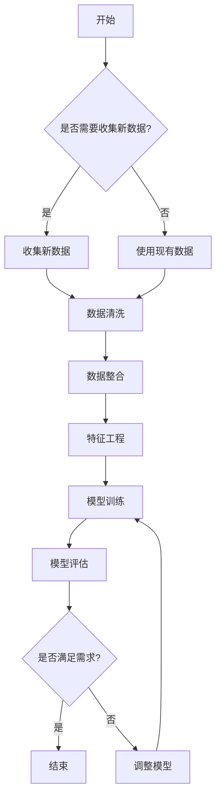
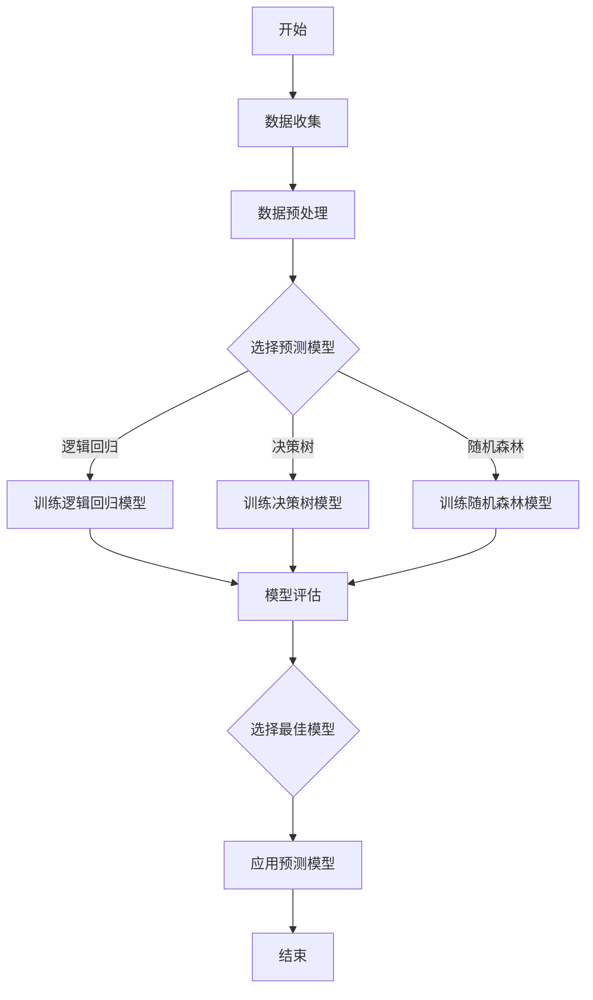

                 

### 文章标题：AI DMP 数据基建：数据模型与算法

> 关键词：AI DMP，数据管理平台，数据模型，算法，用户画像，行为预测，广告投放优化，数据治理

> 摘要：本文深入探讨了AI数据管理平台（AI DMP）的数据基建，包括数据模型与算法的应用。通过详细的分析和案例分享，揭示了AI DMP的核心概念、架构设计、用户画像构建、行为预测、广告投放优化、数据驱动决策以及数据治理的最佳实践，为读者提供了一个全面的技术视角。

### 第一部分：AI DMP数据基建概述

在数字化时代，数据已成为企业的宝贵资产，而AI数据管理平台（AI DMP）作为一种先进的工具，正在重塑数据管理和应用的方式。本部分将为您介绍AI DMP的基本概念、架构设计、数据挖掘与机器学习技术，以及实际应用案例。

#### 第1章：AI DMP数据基建：概念与架构

##### 1.1 AI DMP数据管理平台简介

**AI DMP数据管理平台的定义与重要性**

AI DMP（Data Management Platform）是一种集成了数据收集、存储、处理、分析和优化的综合解决方案。它帮助企业实现对多个数据源的整合和管理，并通过数据建模和算法分析，实现用户行为的深入理解和精准预测。

AI DMP在当今商业环境中具有重要性，主要体现在以下几个方面：

1. **数据整合**：AI DMP能够将来自不同渠道的数据（如网站点击数据、社交媒体行为、购买历史等）进行整合，为企业提供全局视角。
2. **用户洞察**：通过用户画像和行为预测，AI DMP帮助企业更好地理解用户，实现个性化营销和产品推荐。
3. **广告优化**：AI DMP能够优化广告投放策略，提高广告的点击率和转化率。
4. **业务决策**：基于数据驱动的决策支持，AI DMP帮助企业在竞争激烈的市场中做出更加精准和高效的决策。

**AI DMP与传统数据管理平台的区别**

传统数据管理平台（如客户关系管理（CRM）系统、企业资源规划（ERP）系统等）主要侧重于数据的存储和简单的分析。而AI DMP则在此基础上，融入了人工智能和机器学习技术，实现了更复杂和高级的数据处理和分析功能。

具体区别如下：

1. **数据处理能力**：AI DMP具备强大的数据处理能力，能够处理海量数据，并从中提取有价值的信息。
2. **分析深度**：AI DMP能够通过数据挖掘和机器学习技术，对数据进行深入分析和预测。
3. **应用范围**：AI DMP不仅适用于营销和广告领域，还可以应用于用户行为分析、业务优化等多个方面。

**AI DMP的发展历程**

AI DMP的发展历程可以追溯到大数据和人工智能技术的兴起。随着数据量的爆炸式增长和数据源的多样化，企业对数据管理和分析的需求不断提升。AI DMP作为一种新兴的工具，应运而生，并迅速在各个行业得到广泛应用。

发展历程主要包括以下几个阶段：

1. **初期探索**：企业开始意识到大数据和人工智能的价值，尝试将新技术应用于数据管理。
2. **平台建设**：企业开始构建AI DMP平台，整合多源数据，实现数据整合和分析。
3. **技术应用**：随着技术的不断进步，AI DMP的功能和性能不断提升，应用范围也不断扩大。

##### 1.2 数据建模基础

**数据建模的核心概念**

数据建模是将现实世界中的数据转化为计算机可以处理和理解的结构化数据的过程。它主要包括以下几个核心概念：

1. **实体**：实体是指现实世界中具有独立存在意义的事物，如用户、商品、订单等。
2. **属性**：属性是实体的特征，如用户的年龄、性别、购买历史等。
3. **关系**：关系是实体之间的联系，如用户与商品之间的关系、订单与商品之间的关系等。
4. **数据类型**：数据类型是指数据的分类，如整数、浮点数、字符串等。

**数据建模的方法与流程**

数据建模的方法主要包括以下几种：

1. **实体-关系模型（ER模型）**：ER模型是数据建模的一种经典方法，通过实体、属性和关系来描述数据结构。
2. **维度建模**：维度建模是一种针对多维数据集的建模方法，适用于数据仓库和数据分析。
3. **数据流模型**：数据流模型描述数据在系统中的流动和处理过程，适用于实时数据处理场景。

数据建模的流程主要包括以下几个步骤：

1. **需求分析**：确定数据建模的目标和需求，了解数据的来源、用途和关键指标。
2. **数据收集**：收集相关数据，确保数据的完整性、准确性和一致性。
3. **数据预处理**：对收集到的数据进行清洗、转换和整合，使其符合建模要求。
4. **数据建模**：根据需求和分析结果，设计数据模型，包括实体、属性和关系。
5. **模型验证**：验证数据模型的有效性和准确性，确保模型能够满足需求。

**数据建模的常见挑战与解决方案**

数据建模过程中可能会遇到以下挑战：

1. **数据质量问题**：数据质量差会影响数据建模的效果，需要通过数据清洗和预处理来提升数据质量。
2. **模型复杂性**：复杂的数据模型可能难以理解和维护，需要选择合适的方法和工具来简化模型。
3. **需求变更**：需求变更可能导致数据模型需要重新设计，需要建立灵活的模型设计机制来应对变更。

解决方案主要包括：

1. **数据质量管理**：建立数据质量管理体系，确保数据从源头上得到保证。
2. **模型简化**：通过简化模型结构和优化算法来降低模型复杂性。
3. **需求变更管理**：建立需求变更的流程和机制，确保模型设计能够灵活应对变更。

##### 1.3 AI DMP系统架构

**系统架构概述**

AI DMP系统架构通常包括以下几个核心模块：

1. **数据收集模块**：负责从各个数据源收集数据，包括网站点击数据、社交媒体行为、购买历史等。
2. **数据处理模块**：负责对收集到的数据进行清洗、转换和整合，使其符合建模要求。
3. **数据存储模块**：负责存储处理后的数据，包括关系数据库、数据仓库、NoSQL数据库等。
4. **数据模型模块**：负责构建用户画像、用户行为预测模型、广告投放优化模型等。
5. **数据分析与展示模块**：负责对数据进行分析和可视化，提供决策支持。

**数据处理模块**

数据处理模块是AI DMP系统架构的核心之一，其功能主要包括以下几个方面：

1. **数据收集与存储**：从各种数据源（如网站、社交媒体、第三方数据平台等）收集数据，并将其存储在数据仓库或NoSQL数据库中。
2. **数据清洗与转换**：对收集到的数据进行清洗、去重、格式转换等操作，使其符合建模要求。
3. **数据存储与索引**：将清洗和转换后的数据存储在数据仓库或NoSQL数据库中，并建立索引以提高查询效率。

**数据模型模块**

数据模型模块是AI DMP系统的核心组件，其功能主要包括以下几个方面：

1. **用户画像建模**：根据用户的基本信息、兴趣、行为等特征，构建用户画像模型，实现用户精细化管理。
2. **用户行为预测模型**：基于用户的历史行为数据，构建用户行为预测模型，实现用户行为的提前预测和洞察。
3. **广告投放优化模型**：根据用户画像和行为预测结果，构建广告投放优化模型，实现广告效果的优化和提升。

**数据挖掘与机器学习**

数据挖掘和机器学习是AI DMP的核心技术，其功能主要包括以下几个方面：

1. **数据挖掘**：通过挖掘大量数据，发现数据中的潜在模式和规律，为决策提供支持。
2. **机器学习**：利用机器学习算法，对数据进行训练和预测，实现智能化的数据分析和应用。

**数据挖掘的基本概念与步骤**

数据挖掘的基本概念包括：

1. **数据预处理**：对原始数据进行清洗、转换和整合，使其符合挖掘要求。
2. **数据挖掘算法**：选择合适的数据挖掘算法，对数据进行挖掘和分析。
3. **模型评估**：评估挖掘结果的有效性和准确性，调整算法和模型参数。

数据挖掘的基本步骤包括：

1. **问题定义**：明确数据挖掘的目标和问题。
2. **数据收集**：收集相关数据，确保数据的完整性和质量。
3. **数据预处理**：对数据进行清洗、转换和整合。
4. **模型选择**：选择合适的数据挖掘算法。
5. **模型训练**：使用训练数据对模型进行训练。
6. **模型评估**：评估模型的有效性和准确性。
7. **模型应用**：将模型应用于实际问题，实现数据驱动的决策支持。

**常见数据挖掘算法**

常见的数据挖掘算法包括：

1. **聚类算法**：将数据分为若干个类别，实现数据的分类和分析。
2. **分类算法**：将数据分为不同的类别，实现数据的分类和预测。
3. **关联规则挖掘**：发现数据之间的关联关系，实现数据的关联分析和应用。

**机器学习基础**

机器学习的基础包括：

1. **监督学习与无监督学习**：监督学习是对已有标签数据进行训练，无监督学习是对没有标签的数据进行训练。
2. **深度学习简介**：深度学习是机器学习的一种方法，通过多层神经网络实现复杂的数据建模和分析。

##### 1.4 AI DMP应用案例

**案例一：电商用户画像与个性化推荐**

电商行业是AI DMP的重要应用领域之一。通过构建用户画像和个性化推荐模型，电商企业可以更好地理解用户需求，提高用户体验和销售额。

1. **用户画像构建**：根据用户的基本信息、购买历史、浏览行为等数据，构建用户画像模型。
2. **个性化推荐**：根据用户画像和行为数据，推荐用户可能感兴趣的商品和活动，提高用户满意度和转化率。

**案例二：社交媒体广告投放优化**

社交媒体广告是企业推广产品和服务的重要手段。通过AI DMP，企业可以实现广告投放的精准化和优化。

1. **用户画像构建**：根据用户的社交行为、兴趣、职业等数据，构建用户画像模型。
2. **广告投放优化**：根据用户画像和行为数据，优化广告投放策略，提高广告的点击率和转化率。

**案例三：金融风控与信用评分**

金融行业是AI DMP的另一个重要应用领域。通过构建用户行为预测模型和信用评分模型，金融机构可以更好地识别风险和控制信用风险。

1. **用户行为预测**：根据用户的历史行为数据，预测用户的信用风险和还款意愿。
2. **信用评分**：根据用户行为预测结果，为用户提供个性化的信用评分和贷款方案。

### 第二部分：数据模型与算法

在AI DMP中，数据模型和算法是实现数据驱动的核心。本部分将详细介绍用户画像数据模型、用户行为预测算法、广告投放优化算法，以及数据驱动决策的方法和应用。

#### 第2章：用户画像数据模型

用户画像是一种描述用户特征和行为的模型，它有助于企业更好地理解用户，实现个性化营销和产品推荐。本节将介绍用户画像的基本概念、构建方法和应用场景。

##### 2.1 用户画像基本概念

**用户画像的定义**

用户画像（User Profile）是一种描述用户特征和行为的模型，它将用户的基本信息、兴趣、行为等数据整合起来，形成一个完整的用户视图。

**用户画像的分类**

用户画像可以分为以下几类：

1. **基础画像**：包括用户的基本信息，如年龄、性别、职业、地理位置等。
2. **兴趣画像**：包括用户的兴趣爱好、偏好、关注点等，如音乐、电影、书籍、体育等。
3. **行为画像**：包括用户的行为数据，如浏览记录、购买记录、互动记录等。

**用户画像的价值**

用户画像对企业的价值主要体现在以下几个方面：

1. **个性化营销**：通过用户画像，企业可以更好地了解用户需求，实现个性化营销，提高用户满意度和转化率。
2. **产品优化**：通过用户画像，企业可以了解用户的使用习惯和偏好，优化产品设计和功能，提升用户体验。
3. **风险控制**：通过用户画像，企业可以识别高风险用户，采取相应的风控措施，降低风险。

##### 2.2 用户画像构建方法

**数据来源与采集**

用户画像的数据来源主要包括以下几个方面：

1. **公开数据**：如人口统计数据、社交媒体公开信息等。
2. **企业自有数据**：如用户注册信息、购买记录、浏览行为等。
3. **第三方数据**：如第三方数据提供商的数据。

**数据处理与清洗**

在采集到用户数据后，需要对数据进行处理和清洗，以确保数据的质量和准确性。数据处理和清洗主要包括以下几个步骤：

1. **数据整合**：将来自不同渠道的数据进行整合，形成一个完整的用户视图。
2. **数据清洗**：去除重复数据、缺失数据和异常数据，确保数据的完整性和一致性。
3. **数据转换**：将数据转换为适合建模的格式，如将字符串转换为数值类型。

**特征工程**

特征工程是用户画像构建的关键步骤，它通过提取和选择有价值的特征，提高模型的准确性和鲁棒性。特征工程主要包括以下几个步骤：

1. **特征提取**：从原始数据中提取新的特征，如用户年龄的区间划分、购买频次的计算等。
2. **特征选择**：选择对模型性能有显著影响的关键特征，剔除无关或冗余的特征。

**用户画像构建流程**

用户画像的构建流程可以分为以下几个步骤：

1. **需求分析**：明确用户画像的目标和应用场景，确定需要采集和处理的数据。
2. **数据采集**：从各个数据源采集相关数据。
3. **数据处理**：对采集到的数据进行处理和清洗。
4. **特征工程**：提取和选择有价值的特征。
5. **模型训练**：使用训练数据对用户画像模型进行训练。
6. **模型评估**：评估模型的有效性和准确性。
7. **模型应用**：将训练好的模型应用于实际场景，实现用户画像的构建和应用。

##### 2.3 用户画像应用场景

**用户精准营销**

通过用户画像，企业可以了解用户的兴趣、需求和偏好，实现精准营销。例如，电商企业可以根据用户的浏览记录和购买历史，向用户推荐相关的商品和优惠活动，提高用户的购买意愿和转化率。

**产品个性化推荐**

用户画像有助于企业实现产品的个性化推荐。例如，音乐平台可以根据用户的听歌记录和喜好，向用户推荐相似的歌曲和歌手，提高用户的满意度。

**风险管理与欺诈检测**

用户画像可以用于风险管理和欺诈检测。例如，金融机构可以通过分析用户的交易行为和信用记录，识别高风险用户和潜在欺诈行为，采取相应的措施进行风险控制和防范。

##### 2.4 用户画像数据模型示例

下面是一个简单的用户画像数据模型示例：

```mermaid
classDiagram
  User -> Age: 年龄
  User -> Gender: 性别
  User -> Occupation: 职业
  User -> Location: 地理位置
  User -> Interests: 兴趣
  User -> Behavior: 行为
  User -> PurchaseHistory: 购买历史
  User -> Rating: 用户评分

  User : {
    姓名
    ID
  }

  Age : {
    值
    区间
  }

  Gender : {
    男性
    女性
    其他
  }

  Occupation : {
    学生
    工程师
    销售员
    教师
    其他
  }

  Location : {
    城市
    国家
    经纬度
  }

  Interests : {
    音乐
    电影
    阅读
    体育
    其他
  }

  Behavior : {
    浏览记录
    点击率
    购买记录
    互动记录
  }

  PurchaseHistory : {
    商品名称
    购买时间
    价格
  }

  Rating : {
    分数
    评论
  }
endclassDiagram
```

在这个示例中，用户画像数据模型包括用户的基本信息、兴趣、行为和购买历史等特征。通过这个模型，企业可以全面了解用户，实现个性化的服务和营销。

### 第3章：用户行为预测算法

用户行为预测是AI DMP的重要应用之一，它可以帮助企业更好地了解用户行为模式，预测用户未来的行为，从而优化营销策略和产品推荐。本节将介绍用户行为预测的基础、算法和应用。

##### 3.1 用户行为预测基础

**用户行为预测的定义**

用户行为预测（User Behavior Prediction）是指利用历史数据，通过数据挖掘和机器学习算法，预测用户未来的行为。用户行为预测的目标是识别用户的潜在需求和行为模式，为企业的决策提供支持。

**用户行为预测的目标**

用户行为预测的主要目标包括：

1. **用户流失预测**：预测哪些用户可能会流失，以便企业采取相应的挽留措施。
2. **用户留存预测**：预测哪些用户可能会持续使用产品或服务，以便企业制定长久的用户关系策略。
3. **用户转化预测**：预测哪些用户可能会进行购买或其他关键行为，以便企业优化营销策略。

**用户行为预测的挑战**

用户行为预测面临着以下挑战：

1. **数据复杂性**：用户行为数据通常具有高维度、高噪声和动态变化等特点，给数据建模和分析带来挑战。
2. **模型准确性**：用户行为预测的准确性直接影响企业的决策效果，需要选择合适的模型和算法。
3. **实时性**：用户行为预测需要快速响应用户的行为变化，实现实时预测和决策。

##### 3.2 用户行为预测算法

用户行为预测算法可以分为以下几类：

**基于统计学的预测方法**

基于统计学的预测方法主要包括以下几种：

1. **线性回归模型**：通过线性关系预测用户行为，适用于简单场景。
2. **逻辑回归模型**：通过概率模型预测用户行为，适用于二分类问题。

**基于机器学习的预测方法**

基于机器学习的预测方法主要包括以下几种：

1. **决策树与随机森林**：通过树结构模型预测用户行为，具有较好的解释性和泛化能力。
2. **支持向量机（SVM）**：通过核函数将数据映射到高维空间，实现非线性预测。
3. **深度学习模型**：通过多层神经网络，实现复杂的非线性预测。

**基于深度学习的预测方法**

基于深度学习的预测方法主要包括以下几种：

1. **循环神经网络（RNN）**：通过时间序列建模，预测用户连续行为。
2. **卷积神经网络（CNN）**：通过图像和文本特征提取，实现高维数据的预测。

**用户行为预测算法流程**

用户行为预测算法的基本流程包括以下几个步骤：

1. **数据预处理**：对用户行为数据进行分析和预处理，包括数据清洗、特征提取等。
2. **模型选择**：根据预测目标和数据特点，选择合适的预测模型。
3. **模型训练**：使用历史数据对模型进行训练，调整模型参数。
4. **模型评估**：评估模型的预测性能，包括准确率、召回率、F1值等。
5. **模型应用**：将训练好的模型应用于实际场景，实现用户行为预测。

##### 3.3 用户行为预测应用

**用户流失预测**

用户流失预测是用户行为预测的重要应用之一。通过预测哪些用户可能会流失，企业可以采取针对性的挽留措施，降低用户流失率。用户流失预测的主要步骤包括：

1. **数据收集**：收集用户的基本信息、行为数据等。
2. **特征工程**：提取有价值的特征，如用户活跃度、购买频次、互动行为等。
3. **模型选择**：选择合适的预测模型，如逻辑回归、决策树、随机森林等。
4. **模型训练**：使用历史数据对模型进行训练。
5. **模型评估**：评估模型性能，调整模型参数。
6. **模型应用**：将训练好的模型应用于实际场景，预测用户流失情况。

**用户留存预测**

用户留存预测是另一个重要的用户行为预测应用。通过预测哪些用户可能会持续使用产品或服务，企业可以制定长久的用户关系策略。用户留存预测的主要步骤包括：

1. **数据收集**：收集用户的基本信息、行为数据等。
2. **特征工程**：提取有价值的特征，如用户活跃度、购买频次、互动行为等。
3. **模型选择**：选择合适的预测模型，如逻辑回归、决策树、随机森林等。
4. **模型训练**：使用历史数据对模型进行训练。
5. **模型评估**：评估模型性能，调整模型参数。
6. **模型应用**：将训练好的模型应用于实际场景，预测用户留存情况。

**用户转化预测**

用户转化预测是用户行为预测的另一个重要应用。通过预测哪些用户可能会进行购买或其他关键行为，企业可以优化营销策略和资源分配。用户转化预测的主要步骤包括：

1. **数据收集**：收集用户的基本信息、行为数据等。
2. **特征工程**：提取有价值的特征，如用户活跃度、购买频次、互动行为等。
3. **模型选择**：选择合适的预测模型，如逻辑回归、决策树、随机森林等。
4. **模型训练**：使用历史数据对模型进行训练。
5. **模型评估**：评估模型性能，调整模型参数。
6. **模型应用**：将训练好的模型应用于实际场景，预测用户转化情况。

##### 3.4 用户行为预测算法示例

下面是一个简单的用户流失预测算法示例，使用Python和scikit-learn库实现。

```python
import numpy as np
import pandas as pd
from sklearn.model_selection import train_test_split
from sklearn.ensemble import RandomForestClassifier
from sklearn.metrics import accuracy_score, recall_score, precision_score

# 读取数据
data = pd.read_csv('user_data.csv')
X = data.drop(['label'], axis=1)
y = data['label']

# 数据预处理
X = X.fillna(X.mean())

# 划分训练集和测试集
X_train, X_test, y_train, y_test = train_test_split(X, y, test_size=0.3, random_state=42)

# 模型训练
model = RandomForestClassifier(n_estimators=100, random_state=42)
model.fit(X_train, y_train)

# 模型评估
y_pred = model.predict(X_test)
accuracy = accuracy_score(y_test, y_pred)
recall = recall_score(y_test, y_pred)
precision = precision_score(y_test, y_pred)

print('Accuracy:', accuracy)
print('Recall:', recall)
print('Precision:', precision)
```

在这个示例中，我们使用了随机森林算法进行用户流失预测。首先，我们读取用户数据，并进行数据预处理。然后，我们将数据划分为训练集和测试集，使用训练数据对模型进行训练，并使用测试数据评估模型性能。

### 第4章：广告投放优化算法

广告投放优化算法是AI DMP的核心功能之一，它通过用户画像和行为预测，实现广告投放的精准化和优化。本节将介绍广告投放优化算法的概述、响应模型、预算分配策略，以及广告投放优化的应用。

##### 4.1 广告投放优化概述

**广告投放优化的目标**

广告投放优化（Ad Placement Optimization）的目标是提高广告的投放效果，包括点击率（CTR）、转化率（CVR）和投资回报率（ROI）。具体目标如下：

1. **提高点击率**：通过优化广告内容和投放策略，提高用户对广告的点击率。
2. **提高转化率**：通过优化广告投放和用户互动，提高广告的转化率，实现销售目标。
3. **优化投资回报率**：通过数据驱动的决策，实现广告投放的精细化管理和资源优化。

**广告投放优化的挑战**

广告投放优化面临以下挑战：

1. **数据复杂性**：广告投放涉及大量的数据，包括用户行为数据、广告特征数据、市场数据等，数据的处理和分析复杂。
2. **实时性**：广告投放需要快速响应用户行为和市场变化，实现实时优化。
3. **模型准确性**：广告投放优化依赖于预测模型的准确性，模型选择和参数调整至关重要。

##### 4.2 广告投放优化算法

广告投放优化算法主要包括响应模型、预算分配策略和优化目标等。

**响应模型**

响应模型（Response Model）是广告投放优化的基础，它用于预测用户对广告的响应概率。常见的响应模型包括：

1. **点击率预测模型**：用于预测用户点击广告的概率，常用的算法包括逻辑回归、决策树、随机森林等。
2. **转化率预测模型**：用于预测用户点击广告后进行转化的概率，常用的算法包括逻辑回归、决策树、随机森林等。
3. **转化路径模型**：用于预测用户从广告点击到转化的整个路径和关键节点，常用的算法包括Markov模型、转换率模型等。

**预算分配策略**

预算分配策略（Budget Allocation Strategy）是广告投放优化的关键，它用于确定广告在不同渠道、不同时间段和不同用户群体上的投放预算。常见的预算分配策略包括：

1. **最大化点击率**：通过分配更多的预算给点击率较高的广告，提高整体点击率。
2. **最大化转化率**：通过分配更多的预算给转化率较高的广告，提高整体转化率。
3. **平衡点击率和转化率**：通过权衡点击率和转化率，实现广告效果的优化。

**优化目标**

广告投放优化需要确定一个优化目标，常见的优化目标包括：

1. **最大化点击率**：通过优化广告内容和投放策略，实现点击率的最大化。
2. **最大化转化率**：通过优化广告投放和用户互动，实现转化率的最大化。
3. **最大化投资回报率**：通过数据驱动的决策，实现广告投放的投资回报率最大化。

**优化算法**

广告投放优化算法主要包括以下几种：

1. **线性规划**：通过线性规划模型，确定广告在不同渠道和用户群体上的投放预算，实现优化目标。
2. **深度强化学习**：通过深度强化学习模型，实现广告投放的动态优化和实时调整。
3. **遗传算法**：通过遗传算法，实现广告投放的寻优和优化。

**广告投放优化流程**

广告投放优化的基本流程包括以下几个步骤：

1. **数据收集**：收集广告投放的相关数据，包括用户行为数据、广告特征数据、市场数据等。
2. **数据预处理**：对收集到的数据进行分析和预处理，包括数据清洗、特征提取等。
3. **模型训练**：使用预处理后的数据，对响应模型和预算分配策略进行训练。
4. **模型评估**：评估模型的预测性能和优化效果，包括准确率、召回率、F1值等。
5. **模型应用**：将训练好的模型应用于实际场景，实现广告投放的优化和调整。
6. **持续迭代**：根据实际投放效果，调整模型参数和优化策略，实现广告效果的持续提升。

##### 4.3 广告投放优化应用

**精准广告投放**

通过广告投放优化，企业可以实现精准广告投放，提高广告的点击率和转化率。例如，电商企业可以根据用户的浏览记录和购买历史，向用户推荐相关的商品和优惠活动，提高用户的购买意愿和转化率。

**广告预算分配优化**

通过广告投放优化，企业可以优化广告预算的分配，实现资源的最大化利用。例如，广告公司可以根据广告效果的预测，调整广告在不同媒体渠道、时间段和用户群体上的预算分配，实现广告效果的最大化。

**广告创意优化**

通过广告投放优化，企业可以优化广告创意，提高广告的吸引力和点击率。例如，广告公司可以根据用户的兴趣和行为，设计更具吸引力的广告内容和形式，提高用户的点击率和转化率。

##### 4.4 广告投放优化算法示例

下面是一个简单的广告投放优化算法示例，使用Python和scikit-learn库实现。

```python
import numpy as np
import pandas as pd
from sklearn.model_selection import train_test_split
from sklearn.ensemble import RandomForestClassifier
from sklearn.metrics import accuracy_score, recall_score, precision_score

# 读取数据
data = pd.read_csv('ad_data.csv')
X = data.drop(['label'], axis=1)
y = data['label']

# 数据预处理
X = X.fillna(X.mean())

# 划分训练集和测试集
X_train, X_test, y_train, y_test = train_test_split(X, y, test_size=0.3, random_state=42)

# 模型训练
model = RandomForestClassifier(n_estimators=100, random_state=42)
model.fit(X_train, y_train)

# 模型评估
y_pred = model.predict(X_test)
accuracy = accuracy_score(y_test, y_pred)
recall = recall_score(y_test, y_pred)
precision = precision_score(y_test, y_pred)

print('Accuracy:', accuracy)
print('Recall:', recall)
print('Precision:', precision)
```

在这个示例中，我们使用了随机森林算法进行广告投放优化。首先，我们读取广告投放数据，并进行数据预处理。然后，我们将数据划分为训练集和测试集，使用训练数据对模型进行训练，并使用测试数据评估模型性能。

### 第5章：数据驱动决策与策略

数据驱动决策（Data-driven Decision Making）是指基于数据分析和模型预测，做出决策和策略的一种方法。在AI DMP中，数据驱动决策是提高企业运营效率和竞争力的关键。本节将介绍数据驱动决策的基础、方法、应用和挑战。

##### 5.1 数据驱动决策基础

**数据驱动决策的定义**

数据驱动决策是指企业在决策过程中，以数据为基础，通过数据分析和模型预测，做出决策和策略的过程。数据驱动决策强调数据的收集、分析和应用，以实现更加科学和高效的决策。

**数据驱动决策的优势**

数据驱动决策相比传统的经验决策，具有以下优势：

1. **客观性**：数据驱动决策基于客观的数据和分析结果，减少了主观判断的影响，提高了决策的准确性。
2. **系统性**：数据驱动决策通过数据分析，将各种因素和变量纳入考虑，实现系统的、全面的决策。
3. **预见性**：数据驱动决策通过模型预测，可以提前预见未来的趋势和变化，为企业的长期发展提供支持。
4. **灵活性**：数据驱动决策可以实时调整和优化决策策略，适应市场和环境的变化。

**数据驱动决策的挑战**

数据驱动决策在实践过程中也面临以下挑战：

1. **数据质量**：数据质量是数据驱动决策的基础，数据质量差会导致决策失误。
2. **模型准确性**：模型准确性直接影响决策效果，需要选择合适的模型和算法。
3. **决策复杂性**：企业面临的问题复杂多变，数据驱动决策需要应对复杂的情况。
4. **数据隐私**：数据隐私和数据安全是数据驱动决策的重要问题，需要建立有效的数据保护机制。

##### 5.2 数据驱动决策方法

**数据分析与可视化**

数据分析与可视化是数据驱动决策的重要方法，它通过分析数据，发现数据中的规律和趋势，为决策提供支持。

1. **数据探索性分析**：通过描述性统计分析，了解数据的分布、相关性等特征。
2. **数据可视化**：通过图表和图形，直观展示数据中的规律和趋势。
3. **数据挖掘**：通过数据挖掘技术，发现数据中的潜在模式和规律。

**决策支持系统**

决策支持系统（Decision Support System，DSS）是一种辅助决策的系统，它通过数据分析和模型预测，为决策者提供支持。

1. **问题定义**：明确决策的目标和问题。
2. **数据收集**：收集相关的数据。
3. **数据预处理**：对数据进行清洗、转换和整合。
4. **模型构建**：选择合适的模型和算法，构建决策模型。
5. **模型评估**：评估模型的有效性和准确性。
6. **决策生成**：根据模型预测和数据分析结果，生成决策建议。

**预测建模**

预测建模是数据驱动决策的核心方法，它通过构建预测模型，预测未来的趋势和变化，为决策提供支持。

1. **问题定义**：明确预测的目标和问题。
2. **数据收集**：收集相关的数据。
3. **数据预处理**：对数据进行清洗、转换和整合。
4. **模型选择**：选择合适的模型和算法。
5. **模型训练**：使用训练数据对模型进行训练。
6. **模型评估**：评估模型的有效性和准确性。
7. **模型应用**：将训练好的模型应用于实际场景，实现预测和决策。

##### 5.3 数据驱动决策应用

**产品策略优化**

通过数据驱动决策，企业可以优化产品策略，提高产品的市场竞争力。

1. **市场调研**：通过数据分析，了解市场需求和用户偏好。
2. **产品定位**：根据市场调研结果，确定产品的市场定位和目标用户。
3. **产品开发**：根据用户需求和偏好，优化产品的功能和设计。
4. **产品推广**：通过数据分析和用户画像，制定有效的推广策略。

**市场营销策略优化**

通过数据驱动决策，企业可以优化市场营销策略，提高广告投放效果和营销ROI。

1. **广告投放优化**：通过预测模型，优化广告投放的时间和渠道。
2. **用户画像构建**：通过用户画像，了解用户的需求和行为，制定个性化的营销策略。
3. **营销活动设计**：根据用户画像和预测模型，设计有吸引力的营销活动。
4. **效果评估**：通过数据分析和用户反馈，评估营销活动的效果，进行持续优化。

**运营优化**

通过数据驱动决策，企业可以优化运营策略，提高运营效率和客户满意度。

1. **服务优化**：通过数据分析，了解用户的服务需求和痛点，优化服务流程和内容。
2. **库存管理**：通过数据分析，优化库存策略，减少库存成本和浪费。
3. **供应链管理**：通过数据分析，优化供应链流程和资源配置，提高供应链效率。
4. **客户关系管理**：通过用户画像和预测模型，优化客户关系管理策略，提高客户满意度。

##### 5.4 数据驱动决策挑战与解决方案

**数据质量**

数据质量是数据驱动决策的关键，数据质量差会导致决策失误。解决方案包括：

1. **数据质量管理**：建立数据质量管理体系，确保数据的完整性、准确性和一致性。
2. **数据清洗**：对数据进行清洗和预处理，去除错误和异常数据。
3. **数据验证**：对数据进行验证和检查，确保数据的质量和可靠性。

**模型准确性**

模型准确性直接影响决策效果，需要选择合适的模型和算法。解决方案包括：

1. **模型选择**：根据问题的特点和需求，选择合适的模型和算法。
2. **模型优化**：通过参数调整和算法改进，提高模型的准确性和泛化能力。
3. **模型评估**：使用验证数据和测试数据，对模型进行评估和验证，确保模型的准确性。

**决策复杂性**

企业面临的问题复杂多变，数据驱动决策需要应对复杂的情况。解决方案包括：

1. **决策支持系统**：建立决策支持系统，提供综合的数据分析和预测功能。
2. **多模型融合**：使用多个模型进行预测和决策，提高决策的准确性和鲁棒性。
3. **专家意见**：结合专家意见和数据分析结果，做出更加全面的决策。

**数据隐私**

数据隐私和数据安全是数据驱动决策的重要问题，需要建立有效的数据保护机制。解决方案包括：

1. **数据加密**：对敏感数据进行加密，保护数据的隐私和安全。
2. **数据脱敏**：对数据进行脱敏处理，降低数据泄露的风险。
3. **数据安全策略**：建立数据安全策略和流程，确保数据的安全性和完整性。

### 第6章：数据质量与数据治理

在数据驱动的时代，数据质量（Data Quality）和数据治理（Data Governance）成为企业成功的关键因素。本节将探讨数据质量的定义、关键因素、评估方法，以及数据治理的策略、流程和工具。

##### 6.1 数据质量基础

**数据质量的定义**

数据质量是指数据满足业务需求和用户需求的程度，包括数据的完整性、准确性、一致性、及时性和可靠性等。高质量的数据是企业进行有效决策和运营的基础。

**数据质量的关键因素**

数据质量的关键因素包括：

1. **完整性**：数据是否完整，是否包含了所有必要的字段和记录。
2. **准确性**：数据是否准确，反映了真实的情况。
3. **一致性**：数据在各个系统之间是否保持一致。
4. **及时性**：数据是否能够及时提供，满足业务需求。
5. **可靠性**：数据是否可靠，能够被信赖。

**数据质量评估方法**

数据质量评估方法主要包括以下几种：

1. **基于规则的评估**：通过预先定义的规则，检查数据的完整性、准确性和一致性。
2. **统计评估**：使用统计学方法，评估数据的分布、相关性等特征。
3. **用户反馈**：通过用户反馈，评估数据的实用性和可靠性。
4. **自动化评估**：使用自动化工具，对数据质量进行实时监控和评估。

##### 6.2 数据治理策略

**数据治理的定义**

数据治理是指企业通过制定和实施一系列政策和流程，确保数据质量、安全、合规和有效利用的过程。数据治理旨在建立数据管理的框架，规范数据的创建、存储、使用、共享和销毁。

**数据治理的流程与步骤**

数据治理的流程主要包括以下几个步骤：

1. **需求分析**：了解企业数据管理的需求和目标。
2. **政策制定**：制定数据管理的政策和流程，包括数据质量标准、安全策略、合规要求等。
3. **组织架构**：建立数据治理组织架构，明确职责和权限。
4. **工具和技术**：选择合适的数据治理工具和技术，支持数据管理流程。
5. **培训和宣传**：对员工进行数据治理的培训和宣传，提高数据管理的意识和能力。
6. **监控与改进**：建立数据质量的监控机制，持续改进数据管理流程。

**数据治理工具与技术**

数据治理工具和技术包括：

1. **数据质量管理工具**：用于监控、分析和改进数据质量。
2. **元数据管理工具**：用于管理数据定义、结构和关系。
3. **数据集成工具**：用于数据采集、转换和整合。
4. **数据安全工具**：用于数据加密、访问控制和日志审计。
5. **合规管理工具**：用于确保数据符合相关法规和标准。

##### 6.3 数据质量与数据治理应用

**数据质量优化实践**

数据质量优化实践主要包括以下几个步骤：

1. **数据审计**：对现有数据进行审计，识别数据质量问题。
2. **数据清洗**：对存在质量问题的数据进行清洗和修复。
3. **数据标准化**：对数据进行标准化处理，确保数据的一致性和可比较性。
4. **数据监控**：建立数据质量的监控机制，持续监控数据质量。

**数据隐私保护**

数据隐私保护是数据治理的重要组成部分，主要包括以下几个策略：

1. **数据加密**：对敏感数据采用加密技术，确保数据在传输和存储过程中的安全。
2. **访问控制**：实施严格的访问控制策略，确保只有授权人员可以访问敏感数据。
3. **数据脱敏**：对敏感数据进行脱敏处理，降低数据泄露的风险。
4. **隐私保护政策**：制定隐私保护政策，确保数据的合规使用和保密。

**数据合规管理**

数据合规管理是确保数据符合相关法规和标准的过程，主要包括以下几个步骤：

1. **合规评估**：评估数据管理流程和策略是否符合相关法规和标准。
2. **合规培训**：对员工进行合规培训，提高员工的合规意识和能力。
3. **合规审计**：对数据管理流程和策略进行审计，确保合规执行。
4. **合规报告**：定期向管理层和监管机构报告数据合规情况。

### 第7章：AI DMP数据基建最佳实践

在实施AI数据管理平台（AI DMP）的过程中，最佳实践能够帮助企业更高效地构建和优化数据基础设施，实现数据价值的最大化。本节将介绍AI DMP项目规划、系统实现、运营与优化等方面的最佳实践。

##### 7.1 AI DMP项目规划

**项目需求分析**

项目需求分析是AI DMP项目规划的第一步，其主要目标是明确项目的需求和目标。需求分析包括以下几个方面：

1. **业务目标**：确定AI DMP项目要实现的具体业务目标，如提升用户满意度、增加销售额、优化广告投放效果等。
2. **数据需求**：分析所需的数据类型、来源和数量，确保数据能够满足业务需求。
3. **功能需求**：明确AI DMP的功能模块，如数据收集、数据处理、用户画像构建、行为预测等。

**项目目标设定**

项目目标设定是确保项目顺利进行的关键。项目目标应具体、可衡量、可实现、相关性强和有时间限制（SMART原则）。

1. **具体性**：目标应明确具体，如提升广告点击率10%。
2. **可衡量性**：目标应具备可衡量性，如通过点击率指标来衡量广告投放效果。
3. **可实现性**：目标应具有可实现性，避免设定过高或不切实际的目标。
4. **相关性**：目标应与业务目标和用户需求相关，如提升用户体验。
5. **时间限制**：目标应设定明确的完成时间，如6个月内实现目标。

**项目资源规划**

项目资源规划是确保项目顺利执行的基础，包括人员、技术、设备和时间等资源的合理分配。

1. **人员配置**：根据项目需求，配置合适的技术团队和管理团队。
2. **技术选型**：选择合适的技术栈和工具，如数据存储、数据处理、机器学习框架等。
3. **设备资源**：确保项目所需的计算资源和存储资源充足。
4. **时间管理**：制定详细的项目计划和时间表，确保项目按时完成。

##### 7.2 AI DMP系统实现

**技术选型**

技术选型是AI DMP系统实现的关键步骤，需要根据项目需求和资源情况选择合适的技术栈和工具。

1. **数据存储**：选择适合的数据存储方案，如关系数据库、NoSQL数据库、数据仓库等。
2. **数据处理**：选择合适的数据处理工具，如Apache Spark、Flink、Hadoop等。
3. **机器学习框架**：选择适合的机器学习框架，如TensorFlow、PyTorch、Scikit-learn等。

**系统架构设计**

AI DMP的系统架构设计应考虑高可用性、可扩展性和安全性。

1. **数据处理模块**：设计数据处理模块，包括数据收集、数据清洗、数据存储和数据处理等。
2. **数据模型模块**：设计数据模型模块，包括用户画像建模、用户行为预测模型、广告投放优化模型等。
3. **数据分析和展示模块**：设计数据分析和展示模块，包括数据报表、可视化仪表盘等。

**数据流设计**

数据流设计是AI DMP系统实现的核心，它定义了数据从采集到分析的全过程。

1. **数据采集**：设计数据采集流程，包括数据来源、数据格式、数据传输等。
2. **数据处理**：设计数据处理流程，包括数据清洗、数据转换、数据存储等。
3. **数据分析**：设计数据分析流程，包括数据挖掘、机器学习、预测分析等。
4. **数据展示**：设计数据展示流程，包括数据报表、可视化仪表盘等。

##### 7.3 AI DMP运营与优化

**数据监控与报告**

数据监控与报告是AI DMP运营的核心，确保数据质量和系统稳定性。

1. **数据质量监控**：建立数据质量监控机制，实时监控数据质量，如数据完整性、准确性、一致性等。
2. **系统性能监控**：监控系统性能指标，如响应时间、吞吐量、资源利用率等。
3. **报告生成**：定期生成数据报告，包括数据质量报告、系统性能报告等，为决策提供支持。

**性能优化**

性能优化是提高AI DMP系统效率的关键，主要包括以下几个方面：

1. **算法优化**：通过算法优化，提高预测模型的准确性和效率。
2. **系统优化**：通过系统优化，提高数据处理和分析的效率，如分布式计算、缓存技术等。
3. **资源管理**：合理分配资源，确保系统在高峰期依然能够稳定运行。

**持续迭代与改进**

持续迭代与改进是AI DMP长期发展的关键，通过不断地优化和改进，提升系统的性能和用户体验。

1. **需求分析**：定期进行需求分析，了解用户需求和市场变化，为迭代提供方向。
2. **功能更新**：根据需求分析结果，定期更新和改进系统的功能。
3. **性能测试**：定期进行性能测试，确保系统在高负载下的稳定性和性能。
4. **用户反馈**：收集用户反馈，了解用户的使用体验和需求，为迭代提供参考。

### 第8章：未来展望与趋势

随着技术的不断进步，AI数据管理平台（AI DMP）在未来将迎来更多的发展机遇和挑战。本节将探讨AI DMP技术发展趋势、应用前景以及社会影响与伦理问题。

##### 8.1 AI DMP技术发展趋势

**大数据与云计算的结合**

大数据和云计算的结合是AI DMP技术发展的关键趋势。云计算提供了强大的计算资源和存储能力，使得AI DMP能够处理海量数据和复杂的计算任务。同时，大数据技术如Hadoop、Spark等，为AI DMP提供了高效的数据处理和分析工具。

**实时数据处理与智能分析**

实时数据处理和智能分析是AI DMP的未来发展方向。实时数据处理能够实时捕获用户行为和反馈，实现即时的决策和优化。智能分析则通过机器学习和深度学习技术，对实时数据进行分析和预测，提供更加精准和个性化的服务。

**自动化与智能化管理**

自动化和智能化管理是AI DMP的发展趋势。自动化技术如机器学习和深度学习，能够自动执行数据分析和决策过程，减少人工干预。智能化管理则通过智能化算法和模型，实现自我优化和自我调整，提高系统的效率和效果。

**多源数据融合**

随着数据源的不断增多，多源数据融合将成为AI DMP的重要趋势。AI DMP需要能够整合来自不同渠道的数据，如网站点击数据、社交媒体行为、地理位置数据等，提供更加全面和准确的用户画像和行为预测。

**隐私保护与数据安全**

随着数据隐私和数据安全问题的日益突出，隐私保护与数据安全将成为AI DMP的重要发展方向。AI DMP需要建立有效的数据保护机制，确保用户数据的隐私和安全。

##### 8.2 AI DMP应用前景

**跨行业应用**

AI DMP在未来的应用前景将涵盖多个行业，如电商、金融、医疗、零售、广告等。不同行业可以根据自身的特点和需求，利用AI DMP实现数据驱动的决策和优化。

**商业模式的创新**

AI DMP将推动商业模式的创新，为企业提供更加个性化和精准的服务。例如，电商企业可以通过AI DMP实现个性化推荐和精准营销，提高销售额和用户满意度。

**社会影响与伦理问题**

AI DMP的发展也将带来一系列社会影响和伦理问题。例如，用户隐私保护、数据滥用、算法偏见等。企业和政府需要建立有效的法规和机制，确保AI DMP的健康发展。

### 附录

#### 附录A：AI DMP开发工具与资源

**主流数据管理工具对比**

| 工具名称 | 主要功能 | 适用场景 | 优点 | 缺点 |
| :--: | :--: | :--: | :--: | :--: |
| Google BigQuery | 大规模数据存储和分析 | 数据仓库，大数据分析 | 强大的计算能力，易于使用 | 价格较高 |
| Amazon Redshift | 数据仓库和大数据分析 | 数据仓库，大数据分析 | 集成AWS服务，性能优秀 | 仅适用于AWS生态系统 |
| Apache Hive | 分布式数据仓库 | 数据仓库，大数据分析 | 开源，适用于Hadoop生态系统 | 性能不如专有数据库 |
| MongoDB | NoSQL数据库 | 高扩展性，灵活的数据模型 | 易于使用，高扩展性 | 数据安全性较低 |
| Cassandra | 分布式NoSQL数据库 | 实时数据处理，高可用性 | 高性能，分布式存储 | 需要特定的应用场景 |

**开源数据挖掘与机器学习库**

| 库名称 | 主要功能 | 适用场景 | 优点 | 缺点 |
| :--: | :--: | :--: | :--: | :--: |
| Scikit-learn | 机器学习算法库 | 数据挖掘，机器学习模型 | 易于使用，适用于多种算法 | 对大规模数据支持不足 |
| TensorFlow | 机器学习框架 | 深度学习，大规模数据处理 | 强大的功能，广泛的应用 | 学习曲线较陡 |
| PyTorch | 机器学习框架 | 深度学习，图像处理 | 易于使用，灵活 | 对大规模数据处理支持不足 |
| Apache Spark | 分布式数据处理框架 | 大规模数据处理，实时计算 | 高性能，易于扩展 | 需要特定环境配置 |

**在线数据科学平台**

| 平台名称 | 主要功能 | 适用场景 | 优点 | 缺点 |
| :--: | :--: | :--: | :--: | :--: |
| Google Colab | 云端计算环境 | 数据分析，机器学习实验 | 免费使用，易于分享 | 计算资源有限 |
| Jupyter Notebook | 交互式计算环境 | 数据分析，机器学习实验 | 易于使用，支持多种语言 | 缺乏分布式计算支持 |
| Azure Machine Learning | 云端机器学习平台 | 机器学习模型部署，自动化 | 集成Azure服务，强大的功能 | 价格较高 |

#### 附录B：参考文献与拓展阅读

1. **Mayer-Schönberger, V., & Cukier, K. (2013). 大数据时代：生活、工作与思维的大变革。浙江人民出版社。**
2. **Chen, H., Chiang, R. H. L., & Storey, V. C. (2012). Business Intelligence and Analytics: from Big Data to Big Impact. MIS Quarterly, 36(4), 1165-1188.**
3. **Zikopoulos, N., deRoos, A., & Deutsch, T. (2013). Understanding hadoop: A comprehensive guide to hadoop for every manager, developer, and power user. McGraw Hill Education.**
4. **Goodfellow, I., Bengio, Y., & Courville, A. (2016). Deep Learning. MIT Press.**
5. **Brynjolfsson, E., & McAfee, A. (2014). 第二机器时代：重新定义工作、企业、和整个世界。浙江人民出版社。**

#### 附录C：Mermaid 流程图示例

**用户画像构建流程**



**用户行为预测算法流程**



### 作者

**作者：AI天才研究院/AI Genius Institute & 禅与计算机程序设计艺术 /Zen And The Art of Computer Programming**

在这个充满挑战和机遇的数字化时代，AI DMP作为数据管理和分析的重要工具，正在重塑企业运营和决策的方式。本文通过对AI DMP数据模型与算法的深入探讨，揭示了其核心概念、架构设计、应用场景和最佳实践。希望本文能够为读者提供一个全面的技术视角，帮助企业在数据驱动的道路上取得成功。未来，随着技术的不断进步，AI DMP将继续发展和完善，为企业和社会带来更多价值。

