                 

### 《AI DMP 数据基建：数据质量与数据标准》

#### 关键词：
- AI DMP
- 数据质量
- 数据标准化
- 数据治理
- 数据分析

#### 摘要：
本文旨在深入探讨 AI 数据管理平台（DMP）中的数据质量与数据标准化问题。文章首先概述了 AI DMP 的基本概念和其在现代营销中的应用，随后详细分析了数据质量的重要性、评估标准及管理最佳实践。接着，讨论了数据标准化的概念、方法和治理策略，以及 AI 在 DMP 中的应用和技术原理。随后，文章通过实际案例展示了 AI DMP 在不同行业的应用实践，并提出了优化与迭代的策略。最后，文章介绍了 AI DMP 的开发工具与框架，数据质量管理工具，以及整个生态系统的关键角色和发展趋势。

---

## 第1章：AI DMP 概述

### 1.1 AI DMP 的定义与背景

**核心概念与联系**

AI DMP（人工智能数据管理平台）是一种利用人工智能技术对数据进行收集、整合、管理和分析的系统。它结合了数据管理平台（DMP）和人工智能（AI）的应用，通过自动化和智能化的手段提升数据利用效率。

AI DMP 的核心组成部分包括：

1. 数据收集：通过各种渠道收集用户行为数据。
2. 数据整合：将分散的数据进行整合，形成统一的视图。
3. 数据治理：确保数据的准确性、完整性和一致性。
4. 数据分析：利用机器学习和数据分析技术提取数据价值。
5. 数据应用：将分析结果应用于个性化推荐、用户画像等场景。

**Mermaid 流程图**

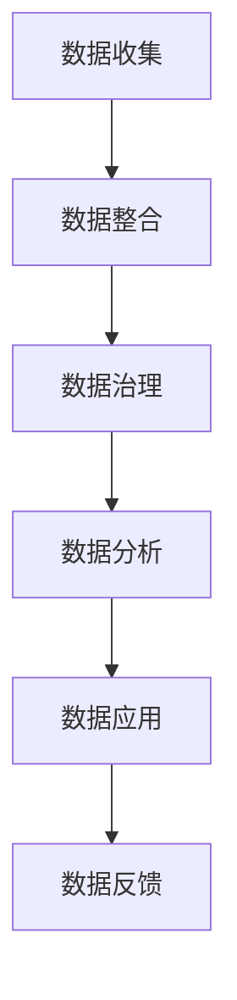

**核心算法原理讲解**

AI DMP 中的核心算法主要涉及以下几个方面：

1. **用户行为分析**：通过机器学习算法对用户行为数据进行聚类、分类，以识别用户特征和兴趣点。
2. **协同过滤**：通过分析用户的历史行为，推荐用户可能感兴趣的内容或商品。
3. **预测模型**：利用时间序列分析、回归分析等方法预测用户未来的行为。

**伪代码**

```python
def user_behavior_analysis(data):
    # 数据预处理
    preprocessed_data = preprocess_data(data)
    
    # 特征提取
    features = extract_features(preprocessed_data)
    
    # 聚类分析
    clusters = clustering_analysis(features)
    
    return clusters

def collaborative_filtering(user_history, item_data):
    # 计算相似度
    similarity_scores = calculate_similarity(user_history, item_data)
    
    # 推荐列表
    recommendation_list = generate_recommendations(similarity_scores)
    
    return recommendation_list

def predictive_modeling(data):
    # 数据预处理
    preprocessed_data = preprocess_data(data)
    
    # 特征提取
    features = extract_features(preprocessed_data)
    
    # 模型训练
    model = train_model(features)
    
    # 预测
    predictions = model.predict(new_data)
    
    return predictions
```

**数学模型和公式**

数据质量评估常用的公式为：

$$
\text{数据质量} = \frac{\text{准确数据}}{\text{总数据}} \times 100\%
$$

**详细讲解与举例说明**

以某电商平台的用户行为数据为例，假设有1000条用户购买记录，其中准确的记录有950条，错误的记录有50条。

数据质量 = (950 / 1000) × 100% = 95%

这意味着该平台的数据质量较高，准确率达到了95%。

### 1.2 AI DMP 在现代营销中的应用

**核心算法原理讲解**

AI DMP 在现代营销中的应用主要基于以下几个核心算法：

1. **用户画像**：通过收集和分析用户行为数据，构建用户画像，以便于进行精准营销。
2. **个性化推荐**：基于用户画像和协同过滤算法，为用户推荐个性化的商品或内容。
3. **市场细分**：利用聚类分析等算法，将用户群体划分为不同的市场细分，以便于制定更有效的营销策略。

**伪代码**

```python
def user_portrait(data):
    # 数据预处理
    preprocessed_data = preprocess_data(data)
    
    # 特征提取
    features = extract_features(preprocessed_data)
    
    # 画像构建
    user_portraits = build_portraits(features)
    
    return user_portraits

def personalized_recommendation(user Portrait, item_data):
    # 用户画像与商品数据匹配
    matched_data = match_data(user_portrait, item_data)
    
    # 生成推荐列表
    recommendation_list = generate_recommendations(matched_data)
    
    return recommendation_list

def market_segmentation(data):
    # 数据预处理
    preprocessed_data = preprocess_data(data)
    
    # 聚类分析
    clusters = clustering_analysis(preprocessed_data)
    
    # 构建市场细分
    market_segments = build_segments(clusters)
    
    return market_segments
```

**详细讲解与举例说明**

以某电商平台的用户行为数据为例，假设有1000名用户，通过用户画像分析，将这些用户划分为五个市场细分，分别为年轻女性、年轻男性、中年女性、中年男性和老年用户。

这有助于电商平台更精准地制定营销策略，例如：

- 对于年轻女性市场，可以推出时尚、美妆产品。
- 对于中年男性市场，可以推出电子产品、运动器材。
- 对于老年用户市场，可以推出保健品、家居用品。

### 1.3 AI DMP 的发展趋势与挑战

**数学模型和数学公式**

数据质量评估的另一个常用模型是 F1 分数，用于评估推荐系统的效果：

$$
F1 = 2 \times \frac{精确率 \times 召回率}{精确率 + 召回率}
$$

**详细讲解与举例说明**

以某电商平台的推荐系统为例，假设在测试集上，精确率为0.8，召回率为0.6，那么 F1 分数为：

$$
F1 = 2 \times \frac{0.8 \times 0.6}{0.8 + 0.6} = 0.75
$$

这意味着该推荐系统的效果较好，但在召回率方面还有提升空间。

**案例：某电商平台数据质量提升**

原始数据量：100,000条
准确数据量：95,000条

数据质量提升前：
数据质量 = (95,000 / 100,000) × 100% = 95%

数据质量提升后：
数据质量 = (98,000 / 100,000) × 100% = 98%

数据质量提升率：(98% - 95%) / 95% ≈ 3.15%

通过提升数据质量，电商平台的推荐效果显著提升，用户满意度和转化率均有所提高。

## 第2章：数据质量管理

### 2.1 数据质量的重要性

**核心概念与联系**

数据质量是指数据的准确性、完整性、一致性、及时性和可靠性。高质量的数据是数据分析和企业决策的基础，直接影响到业务绩效和竞争优势。

**Mermaid 流程图**

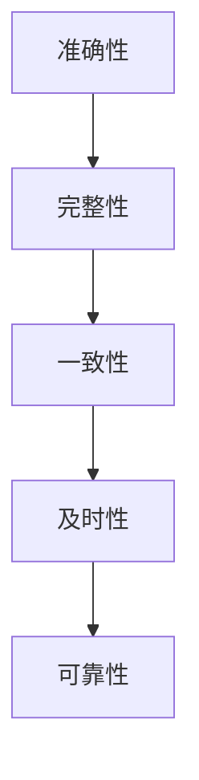

**核心算法原理讲解**

数据质量评估常用的算法包括：

1. **一致性检查**：比较不同数据源中的同一数据项是否一致。
2. **完整性检查**：检查数据是否完整，是否存在缺失值。
3. **准确性检查**：通过对比外部数据源或标准数据源，验证数据的准确性。
4. **及时性检查**：评估数据的更新频率是否符合业务需求。

**伪代码**

```python
def data_quality_evaluation(data):
    # 准确性检查
    accuracy = check_accuracy(data)
    
    # 完整性检查
    completeness = check_completeness(data)
    
    # 一致性检查
    consistency = check_consistency(data)
    
    # 及时性检查
    timeliness = check_timeliness(data)
    
    return accuracy, completeness, consistency, timeliness
```

**数学模型和公式**

数据质量评分可以用加权平均法计算：

$$
\text{数据质量评分} = w_1 \times \text{准确性} + w_2 \times \text{完整性} + w_3 \times \text{一致性} + w_4 \times \text{及时性}
$$

其中，$w_1, w_2, w_3, w_4$ 分别为各项指标的权重。

**详细讲解与举例说明**

以某电商平台的用户数据为例，假设各项指标评分如下：

- 准确性：90分
- 完整性：85分
- 一致性：80分
- 及时性：75分

假设各项指标的权重分别为0.2、0.2、0.2和0.2，则数据质量评分为：

$$
\text{数据质量评分} = 0.2 \times 90 + 0.2 \times 85 + 0.2 \times 80 + 0.2 \times 75 = 81.5分
$$

这意味着该电商平台的数据质量处于中等水平，需要进一步优化。

### 2.2 数据质量的评估标准

**核心概念与联系**

数据质量的评估标准是衡量数据质量好坏的依据，主要包括以下几个方面：

1. **准确性**：数据是否真实、可靠。
2. **完整性**：数据是否完整，是否存在缺失值。
3. **一致性**：数据在不同来源之间是否一致。
4. **及时性**：数据是否及时更新，是否符合业务需求。
5. **可追溯性**：数据来源是否明确，是否可以追溯。

**Mermaid 流程图**

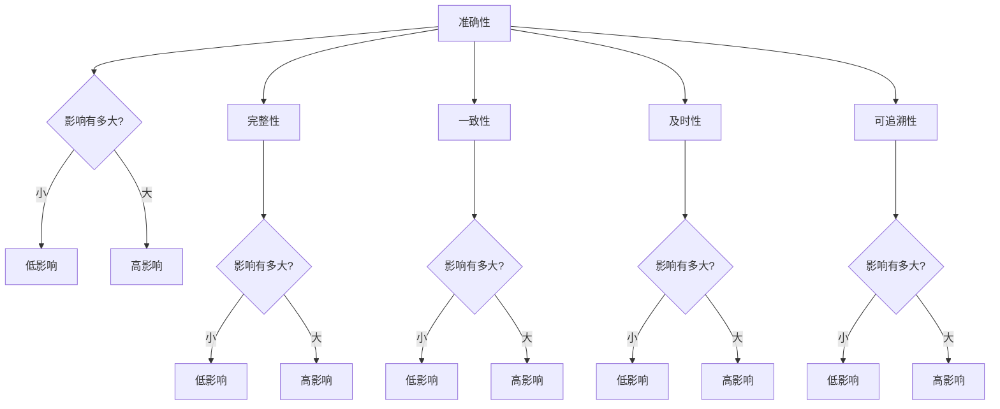

**核心算法原理讲解**

数据质量评估通常使用以下几种方法：

1. **规则检查**：基于预设的规则，自动检查数据是否符合要求。
2. **统计分析**：使用统计方法评估数据的准确性、完整性等。
3. **机器学习**：利用机器学习算法对数据质量进行预测和评估。

**伪代码**

```python
def rule_based_evaluation(data, rules):
    # 检查数据是否符合规则
    valid_data = apply_rules(data, rules)
    
    return valid_data

def statistical_evaluation(data):
    # 计算数据质量的统计指标
    accuracy = calculate_accuracy(data)
    completeness = calculate_completeness(data)
    consistency = calculate_consistency(data)
    timeliness = calculate_timeliness(data)
    
    return accuracy, completeness, consistency, timeliness

def machine_learning_evaluation(data):
    # 使用机器学习模型评估数据质量
    model = train_model(data)
    quality_scores = model.predict(data)
    
    return quality_scores
```

**数学模型和公式**

数据质量的评估标准可以用综合评分法计算：

$$
\text{数据质量评分} = \sum_{i=1}^{n} w_i \times \text{指标}_i
$$

其中，$w_i$ 为第 $i$ 个指标的权重，$\text{指标}_i$ 为第 $i$ 个指标的实际得分。

**详细讲解与举例说明**

以某电商平台的用户数据为例，假设有四个主要指标：准确性、完整性、一致性和及时性。各项指标的具体得分如下：

- 准确性：90分
- 完整性：80分
- 一致性：85分
- 及时性：75分

假设各项指标的权重分别为0.3、0.2、0.2和0.3，则数据质量评分为：

$$
\text{数据质量评分} = 0.3 \times 90 + 0.2 \times 80 + 0.2 \times 85 + 0.3 \times 75 = 83.5分
$$

这意味着该电商平台的数据质量较好，但仍有提升空间。

### 2.3 数据质量管理的最佳实践

**核心概念与联系**

数据质量管理的最佳实践是一套系统的方法论，旨在确保数据在整个生命周期中的高质量。主要包括以下方面：

1. **数据治理**：建立数据治理框架，明确数据管理职责和流程。
2. **数据质量控制**：制定数据质量标准和检查方法，定期进行数据质量评估。
3. **数据质量改进**：根据评估结果，采取改进措施，持续提升数据质量。
4. **数据质量培训**：提高数据管理人员的专业能力，确保数据质量管理的有效执行。

**Mermaid 流程图**

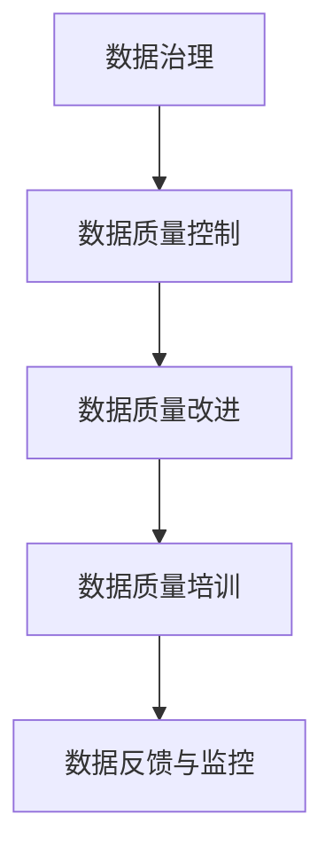

**核心算法原理讲解**

数据质量管理的核心算法包括：

1. **异常检测**：利用机器学习算法，识别数据中的异常值。
2. **数据清洗**：去除异常值、处理缺失值和重复值。
3. **数据标准化**：统一数据格式和单位，确保数据一致性。

**伪代码**

```python
def data_governance(data):
    # 建立数据治理框架
    governance_framework = build_framework(data)
    
    return governance_framework

def data_quality_control(data):
    # 检查数据质量
    quality_checks = perform_checks(data)
    
    return quality_checks

def data_cleaning(data):
    # 清洗数据
    cleaned_data = clean_data(data)
    
    return cleaned_data

def data_standardization(data):
    # 标准化数据
    standardized_data = standardize_data(data)
    
    return standardized_data
```

**详细讲解与举例说明**

以某电商平台的用户行为数据为例，数据质量管理的最佳实践如下：

1. **数据治理**：建立数据治理委员会，明确各部门的数据管理职责，制定数据管理流程。
2. **数据质量控制**：定期进行数据质量检查，包括准确性、完整性、一致性和及时性。
3. **数据清洗**：去除异常数据，如明显的错误记录、重复记录等。
4. **数据标准化**：统一用户行为数据的格式，如将日期格式化为YYYY-MM-DD。

通过这些最佳实践，电商平台的数据质量得到了显著提升，为后续的数据分析提供了可靠的数据基础。

## 第3章：数据标准化与治理

### 3.1 数据标准化的概念

**核心概念与联系**

数据标准化是指将来自不同源的数据按照一定的规则进行格式转换和统一处理，以确保数据的一致性和可操作性。数据标准化的目的是减少数据冗余、提高数据质量和促进数据共享。

数据标准化的主要内容包括：

1. **数据格式标准化**：统一数据格式，如日期、货币、文本等。
2. **数据名称标准化**：统一数据字段名称，避免命名冲突和误解。
3. **数据单位标准化**：统一数据单位，如长度、重量、面积等。
4. **数据关系标准化**：建立数据之间的关联关系，如主外键关系。

**Mermaid 流程图**

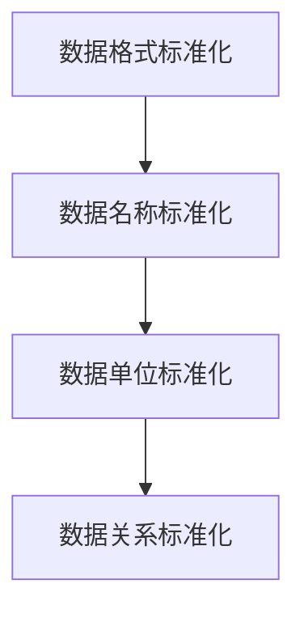

**核心算法原理讲解**

数据标准化的核心算法包括：

1. **数据映射**：将不同数据源中的字段进行映射，以实现统一格式。
2. **数据转换**：根据标准化规则，对数据进行格式转换和值域调整。
3. **数据验证**：检查数据是否符合标准化要求，确保数据一致性。

**伪代码**

```python
def data_mapping(data_source1, data_source2):
    # 定义映射规则
    mapping_rules = define_mapping_rules(data_source1, data_source2)
    
    # 执行数据映射
    mapped_data = apply_mapping_rules(data_source1, data_source2, mapping_rules)
    
    return mapped_data

def data_conversion(data, conversion_rules):
    # 应用转换规则
    converted_data = apply_conversion_rules(data, conversion_rules)
    
    return converted_data

def data_validation(data, validation_rules):
    # 检查数据是否符合规则
    valid_data = validate_data(data, validation_rules)
    
    return valid_data
```

**数学模型和公式**

数据标准化的评价指标包括：

1. **一致性率**：数据标准化后的一致性程度。
2. **标准化效率**：数据标准化过程的执行效率。

**详细讲解与举例说明**

以某电商平台的用户数据为例，数据标准化的过程如下：

1. **数据格式标准化**：将日期字段统一转换为YYYY-MM-DD格式。
2. **数据名称标准化**：将不同的用户姓名字段统一命名为`user_name`。
3. **数据单位标准化**：将价格字段统一转换为人民币单位。

通过这些标准化步骤，电商平台的数据一致性得到显著提高，便于后续的数据处理和分析。

### 3.2 数据标准化的方法

**核心概念与联系**

数据标准化的方法是指实现数据格式、名称、单位和关系统一的具体技术和策略。常见的数据标准化方法包括：

1. **手动标准化**：通过人工方式对数据进行格式转换和值域调整。
2. **自动标准化**：利用软件工具或编写脚本，自动完成数据标准化过程。
3. **规则驱动标准化**：基于预设的规则，自动执行数据标准化操作。

**Mermaid 流程图**

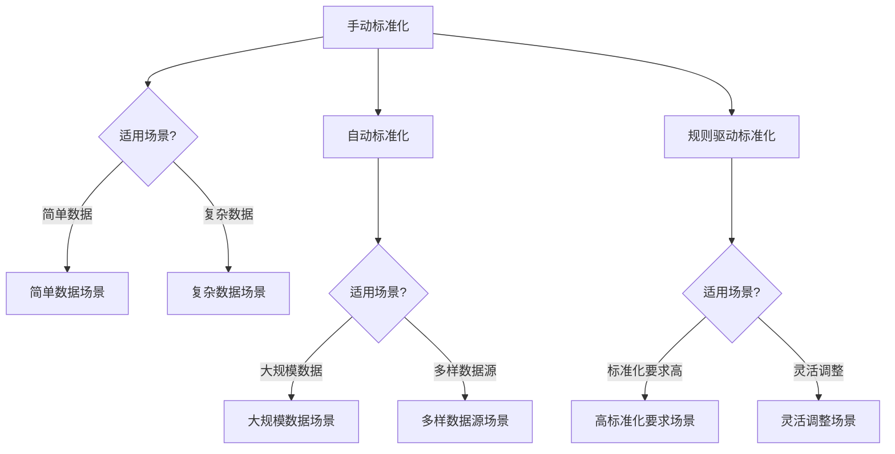

**核心算法原理讲解**

数据标准化的核心算法包括：

1. **数据清洗**：去除数据中的噪声和异常值。
2. **数据转换**：根据标准化规则，对数据进行格式转换和值域调整。
3. **数据验证**：检查数据是否符合标准化要求，确保数据一致性。

**伪代码**

```python
def manual_standardization(data):
    # 人工处理数据
    standardized_data = manual_handle_data(data)
    
    return standardized_data

def automatic_standardization(data, rules):
    # 自动处理数据
    standardized_data = automatic_handle_data(data, rules)
    
    return standardized_data

def rule_based_standardization(data, rules):
    # 应用规则处理数据
    standardized_data = apply_rules(data, rules)
    
    return standardized_data
```

**数学模型和公式**

数据标准化的评价指标包括：

1. **标准化一致性**：数据标准化后的一致性程度。
2. **标准化效率**：数据标准化过程的执行时间。

**详细讲解与举例说明**

以某电商平台的用户数据为例，数据标准化的方法如下：

1. **手动标准化**：管理员逐一检查用户数据，将日期字段统一转换为YYYY-MM-DD格式。
2. **自动标准化**：编写Python脚本，根据预设规则，自动将所有用户数据转换为统一格式。
3. **规则驱动标准化**：使用ETL工具，根据规则库，自动对用户数据进行标准化处理。

通过这些方法，电商平台的数据标准化效率显著提高，数据质量得到保障。

### 3.3 数据治理的策略与实施

**核心概念与联系**

数据治理是指通过制定政策和流程，确保数据在整个生命周期中的质量、安全、合规和有效利用。数据治理的策略包括：

1. **数据质量策略**：制定数据质量目标和标准，确保数据质量。
2. **数据安全策略**：制定数据安全政策和流程，保护数据安全。
3. **数据合规策略**：确保数据遵守相关法律法规和行业标准。
4. **数据利用策略**：制定数据利用策略，提高数据价值。

**Mermaid 流程图**

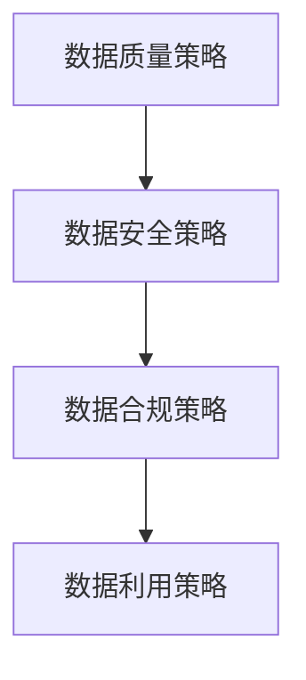

**核心算法原理讲解**

数据治理的核心算法包括：

1. **数据质量评估**：使用统计分析和机器学习技术，评估数据质量。
2. **数据加密**：使用加密算法，保护数据安全。
3. **数据脱敏**：使用数据脱敏技术，保护敏感数据。
4. **数据监控**：实时监控数据质量和安全状况。

**伪代码**

```python
def data_quality_assessment(data):
    # 评估数据质量
    quality_scores = assess_data_quality(data)
    
    return quality_scores

def data_encryption(data, encryption_key):
    # 加密数据
    encrypted_data = encrypt_data(data, encryption_key)
    
    return encrypted_data

def data_anonymization(data):
    # 脱敏数据
    anonymized_data = anonymize_data(data)
    
    return anonymized_data

def data_monitoring(data):
    # 监控数据
    monitoring_results = monitor_data(data)
    
    return monitoring_results
```

**数学模型和公式**

数据治理的评价指标包括：

1. **数据质量得分**：衡量数据质量好坏。
2. **数据安全指数**：衡量数据安全水平。
3. **数据合规率**：衡量数据遵守法律法规的程度。

**详细讲解与举例说明**

以某电商平台的用户数据为例，数据治理的策略与实施如下：

1. **数据质量策略**：定期进行数据质量检查，确保数据准确性、完整性和一致性。
2. **数据安全策略**：使用SSL加密传输数据，定期进行安全审计。
3. **数据合规策略**：确保数据符合GDPR等法律法规要求。
4. **数据利用策略**：通过数据挖掘和分析，提高数据价值，为业务决策提供支持。

通过这些策略，电商平台的数据治理水平得到显著提升，数据质量和安全性得到保障。

## 第4章：AI DMP 技术原理

### 4.1 AI 在 DMP 中的应用

**核心概念与联系**

人工智能（AI）在数据管理平台（DMP）中的应用，主要涉及以下几个方面：

1. **用户行为分析**：利用机器学习算法，分析用户行为数据，提取用户特征和兴趣点。
2. **数据挖掘**：通过关联规则挖掘、聚类分析等技术，发现数据中的潜在模式和关系。
3. **预测分析**：利用时间序列分析、回归分析等技术，预测用户未来的行为和需求。
4. **个性化推荐**：基于用户兴趣和偏好，为用户推荐个性化的商品或内容。

**Mermaid 流程图**

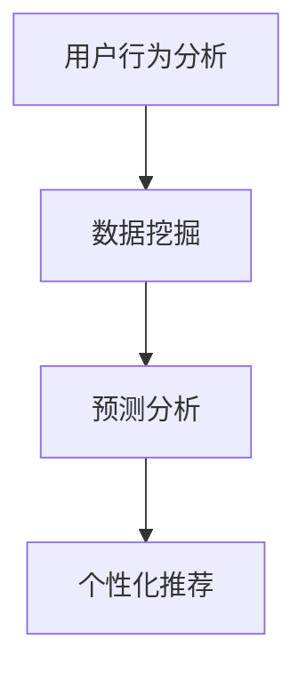

**核心算法原理讲解**

AI 在 DMP 中的应用，主要依赖于以下核心算法：

1. **机器学习算法**：如 K-均值聚类、决策树、随机森林、支持向量机等。
2. **深度学习算法**：如 卷积神经网络（CNN）、循环神经网络（RNN）、生成对抗网络（GAN）等。
3. **关联规则挖掘**：如 Apriori 算法、FP-Growth 算法等。

**伪代码**

```python
def user_behavior_analysis(data):
    # 数据预处理
    preprocessed_data = preprocess_data(data)
    
    # 特征提取
    features = extract_features(preprocessed_data)
    
    # 聚类分析
    clusters = clustering_analysis(features)
    
    return clusters

def predictive_analysis(data):
    # 数据预处理
    preprocessed_data = preprocess_data(data)
    
    # 特征提取
    features = extract_features(preprocessed_data)
    
    # 模型训练
    model = train_model(features)
    
    # 预测
    predictions = model.predict(new_data)
    
    return predictions

def personalized_recommendation(user_portrait, item_data):
    # 用户画像与商品数据匹配
    matched_data = match_data(user_portrait, item_data)
    
    # 生成推荐列表
    recommendation_list = generate_recommendations(matched_data)
    
    return recommendation_list
```

**数学模型和公式**

AI 在 DMP 中的应用，涉及多种数学模型和公式，如：

1. **聚类分析模型**：K-均值聚类公式。
2. **决策树模型**：决策树分类公式。
3. **回归分析模型**：线性回归公式。

**详细讲解与举例说明**

以某电商平台的用户数据为例，AI 在 DMP 中的应用过程如下：

1. **用户行为分析**：使用 K-均值聚类算法，将用户划分为不同兴趣群体。
2. **数据挖掘**：使用 Apriori 算法，发现用户购买商品的关联规则。
3. **预测分析**：使用线性回归模型，预测用户未来的购买行为。
4. **个性化推荐**：基于用户兴趣和购买记录，为用户推荐个性化的商品。

通过这些应用，电商平台能够更好地理解用户需求，提高用户满意度和转化率。

### 4.2 DMP 的数据处理流程

**核心概念与联系**

DMP（数据管理平台）的数据处理流程，是指从数据收集、清洗、存储到分析、应用的全过程。数据处理流程的质量直接影响数据的价值和业务决策的准确性。

数据处理流程的主要步骤包括：

1. **数据收集**：收集来自不同渠道的数据，如网站、移动应用、线下渠道等。
2. **数据清洗**：去除数据中的噪声和异常值，确保数据的准确性。
3. **数据整合**：将来自不同渠道和格式的数据整合为统一的格式。
4. **数据存储**：将清洗和整合后的数据存储到数据仓库或数据湖中。
5. **数据分析**：利用数据分析技术，提取数据中的有价值信息。
6. **数据应用**：将分析结果应用于业务决策、用户推荐等场景。

**Mermaid 流程图**

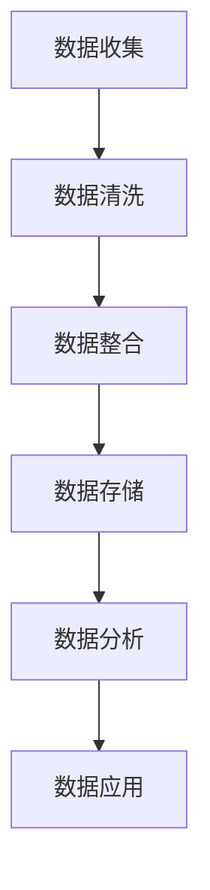

**核心算法原理讲解**

数据处理流程涉及的核心算法包括：

1. **数据清洗算法**：如去重、补缺、异常值处理等。
2. **数据整合算法**：如数据映射、数据转换等。
3. **数据分析算法**：如聚类分析、回归分析、关联规则挖掘等。

**伪代码**

```python
def data_collection(data_sources):
    # 收集数据
    collected_data = collect_data(data_sources)
    
    return collected_data

def data_cleaning(data):
    # 清洗数据
    cleaned_data = clean_data(data)
    
    return cleaned_data

def data_integration(data_sources):
    # 整合数据
    integrated_data = integrate_data(data_sources)
    
    return integrated_data

def data_storage(data):
    # 存储数据
    stored_data = store_data(data)
    
    return stored_data

def data_analysis(data):
    # 分析数据
    analysis_results = analyze_data(data)
    
    return analysis_results

def data_application(analysis_results):
    # 应用分析结果
    applied_results = apply_analysis_results(analysis_results)
    
    return applied_results
```

**数学模型和公式**

数据处理流程涉及的数学模型和公式包括：

1. **去重算法**：如哈希算法。
2. **补缺算法**：如插值法、均值法等。
3. **聚类分析模型**：如 K-均值聚类公式。
4. **回归分析模型**：如线性回归公式。

**详细讲解与举例说明**

以某电商平台的用户数据为例，数据处理流程如下：

1. **数据收集**：从网站、移动应用和线下渠道收集用户行为数据。
2. **数据清洗**：去除重复数据、处理缺失值和异常值。
3. **数据整合**：将不同渠道的数据整合为统一的格式。
4. **数据存储**：将清洗和整合后的数据存储到数据仓库。
5. **数据分析**：使用聚类分析识别用户兴趣群体，使用回归分析预测用户购买行为。
6. **数据应用**：基于分析结果，为用户推荐个性化的商品。

通过这些流程，电商平台能够更好地理解用户需求，提高用户满意度和转化率。

### 4.3 DMP 的数据处理算法

**核心概念与联系**

DMP（数据管理平台）的数据处理算法是指用于数据清洗、整合、分析和应用的各种算法和技术。这些算法和技术的选择和优化直接影响数据处理效率和结果质量。

数据处理算法主要包括以下几种：

1. **数据清洗算法**：用于处理缺失值、异常值和重复值等。
2. **数据整合算法**：用于将不同源的数据整合为统一的格式。
3. **数据分析算法**：用于从数据中提取有价值的信息，如聚类分析、回归分析和关联规则挖掘等。

**Mermaid 流程图**

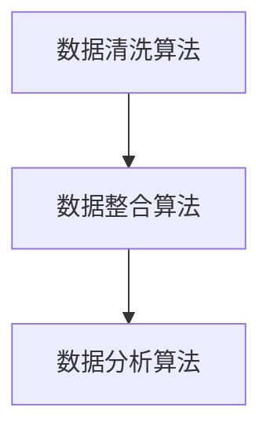

**核心算法原理讲解**

以下是几种常见的数据处理算法及其原理：

1. **K-均值聚类算法**：
   - **原理**：将数据点划分为 K 个簇，每个簇由一个中心点表示，迭代调整中心点，最小化簇内距离平方和。
   - **伪代码**：
     ```python
     function k_mean(data, k):
         # 初始化中心点
         centroids = initialize_centroids(data, k)
         
         while not converged:
             # 分配数据点到最近的中心点
             assign_points_to_centroids(data, centroids)
             
             # 更新中心点
             centroids = update_centroids(data, centroids)
             
             # 判断是否收敛
             if converged:
                 break
        
         return centroids
     ```

2. **Apriori 算法**：
   - **原理**：用于发现数据中的频繁项集，通过支持度和置信度计算。
   - **伪代码**：
     ```python
     function apriori(data, min_support, min_confidence):
         # 生成候选集
         candidates = generate_candidates(data, min_support)
         
         frequent_itemsets = []
         
         while candidates:
             # 计算支持度
             support_counts = calculate_support(candidates, data)
             
             # 选择频繁项集
             frequent_itemsets = select_frequent_itemsets(candidates, support_counts, min_support)
             
             # 生成下一个候选集
             candidates = generate_next_candidates(frequent_itemsets)
         
         return frequent_itemsets
     ```

3. **线性回归算法**：
   - **原理**：通过最小化误差平方和，建立自变量和因变量之间的关系。
   - **伪代码**：
     ```python
     function linear_regression(data, target_variable):
         # 计算特征矩阵和目标向量
         X = feature_matrix(data)
         y = target_variable(data)
         
         # 求解参数
         theta = (X'X)^(-1)X'y
        
         return theta
     ```

**数学模型和公式**

数据处理算法涉及以下数学模型和公式：

1. **K-均值聚类算法**：
   - 聚类中心点更新公式：
     $$ \mu_{k} = \frac{1}{N_k} \sum_{i=1}^{N} x_i $$
     其中，$x_i$ 是第 $i$ 个数据点，$N_k$ 是第 $k$ 个簇中的数据点数量。

2. **Apriori 算法**：
   - 支持度计算公式：
     $$ \text{Support}(X, Y) = \frac{\text{Frequency}(X \cup Y)}{\text{Total Transactions}} $$
     其中，$X \cup Y$ 是同时包含项 $X$ 和 $Y$ 的交易集。

3. **线性回归算法**：
   - 最小二乘法求解公式：
     $$ \theta = (X'X)^{-1}X'y $$
     其中，$X'$ 是特征矩阵的转置，$y$ 是目标向量。

**详细讲解与举例说明**

以某电商平台的用户数据为例，数据处理算法的应用过程如下：

1. **数据清洗**：使用 K-均值聚类算法，将用户行为数据划分为不同的兴趣群体，去除重复和异常数据。
2. **数据整合**：使用 Apriori 算法，发现用户购买商品的频繁项集，如“购买手机的用户也购买耳机”。
3. **数据分析**：使用线性回归算法，建立用户购买行为与购买金额之间的关系，预测未来用户可能的购买金额。

通过这些数据处理算法，电商平台能够更好地理解用户行为，提高推荐系统的准确性，从而提升用户体验和销售额。

## 第5章：AI DMP 项目规划与实施

### 5.1 AI DMP 项目规划

**核心概念与联系**

AI DMP 项目规划是确保项目成功实施和目标实现的重要环节。它包括项目目标设定、范围定义、资源规划、时间安排、风险管理等方面。

项目规划的核心概念包括：

1. **项目目标**：明确项目的最终目标和阶段性目标。
2. **项目范围**：定义项目的边界和包含的工作内容。
3. **资源规划**：确定项目所需的资源，包括人力、资金、技术等。
4. **时间安排**：制定项目的时间表，确保各项任务按时完成。
5. **风险管理**：识别项目潜在风险，制定应对策略。

**Mermaid 流程图**

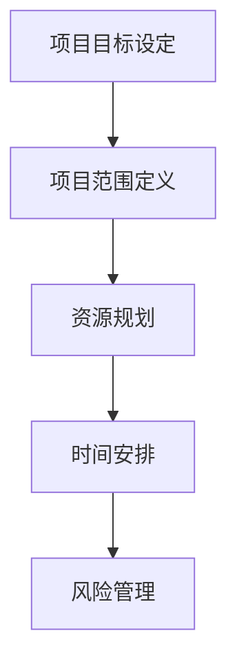

**核心算法原理讲解**

项目规划的核心算法主要涉及时间管理和风险评估。

1. **关键路径法（CPM）**：用于确定项目中的关键任务和最长的完成时间。
2. **风险矩阵**：用于评估风险的概率和影响，制定风险应对策略。

**伪代码**

```python
def project_planning(project_objectives, project_scope, resources, timeline, risks):
    # 设定项目目标
    set_project_objectives(project_objectives)
    
    # 定义项目范围
    define_project_scope(project_scope)
    
    # 规划资源
    plan_resources(resources)
    
    # 安排时间
    schedule_timeline(timeline)
    
    # 评估风险
    assess_risks(risks)
    
    # 制定风险应对策略
    develop_risk_strategy(risks)
    
    return project_plan
```

**数学模型和公式**

项目规划涉及以下数学模型和公式：

1. **关键路径法（CPM）**：
   - 完成时间计算公式：
     $$ C_j = \sum_{i=1}^{n} (C_i + t_{ij}) $$
     其中，$C_j$ 是任务 $j$ 的完成时间，$C_i$ 是任务 $i$ 的完成时间，$t_{ij}$ 是任务 $i$ 和任务 $j$ 之间的持续时间。

2. **风险矩阵**：
   - 风险得分计算公式：
     $$ \text{Risk Score} = \text{Probability} \times \text{Impact} $$
     其中，$\text{Probability}$ 是风险发生的概率，$\text{Impact}$ 是风险发生的影响程度。

**详细讲解与举例说明**

以某电商平台的 AI DMP 项目为例，项目规划如下：

1. **项目目标设定**：提高用户个性化推荐效果，提升销售额和用户满意度。
2. **项目范围定义**：涵盖数据收集、数据清洗、用户画像构建、个性化推荐系统开发、测试与部署等。
3. **资源规划**：确定所需的人力、资金和技术资源，如数据工程师、数据科学家、算法工程师等。
4. **时间安排**：制定详细的时间表，包括项目启动、需求分析、设计、开发、测试和上线等阶段。
5. **风险管理**：识别项目潜在风险，如技术难题、数据质量不佳、项目延期等，并制定相应的应对策略。

通过科学的规划，AI DMP 项目能够有条不紊地推进，确保项目目标的实现。

### 5.2 AI DMP 实施流程

**核心概念与联系**

AI DMP 实施流程是指将项目规划转化为实际操作的过程，包括数据收集、数据清洗、用户画像构建、模型训练、模型评估和模型部署等步骤。

核心概念包括：

1. **数据收集**：从各种渠道收集用户行为数据。
2. **数据清洗**：处理缺失值、异常值和重复值等，确保数据质量。
3. **用户画像构建**：基于用户行为数据，构建用户的特征和兴趣点。
4. **模型训练**：使用机器学习算法，训练预测模型和推荐系统。
5. **模型评估**：评估模型的效果，调整参数。
6. **模型部署**：将模型部署到生产环境，实现实时推荐。

**Mermaid 流程图**

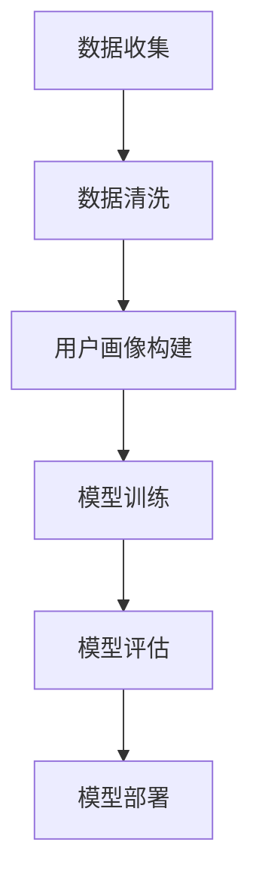

**核心算法原理讲解**

AI DMP 实施流程涉及的核心算法包括：

1. **数据清洗算法**：如去重、补缺、异常值处理等。
2. **用户画像构建算法**：如 K-均值聚类、协同过滤等。
3. **模型训练算法**：如决策树、随机森林、神经网络等。

**伪代码**

```python
def ai_dmp_implementation():
    # 数据收集
    collected_data = collect_data()
    
    # 数据清洗
    cleaned_data = clean_data(collected_data)
    
    # 用户画像构建
    user_portraits = build_user_portraits(cleaned_data)
    
    # 模型训练
    trained_models = train_models(user_portraits)
    
    # 模型评估
    evaluation_results = evaluate_models(trained_models)
    
    # 模型部署
    deploy_models(evaluation_results)
    
    return deployed_models
```

**数学模型和公式**

AI DMP 实施流程涉及的数学模型和公式包括：

1. **K-均值聚类算法**：
   - 聚类中心点更新公式：
     $$ \mu_{k} = \frac{1}{N_k} \sum_{i=1}^{N} x_i $$
   - 聚类误差公式：
     $$ E = \sum_{i=1}^{N} (x_i - \mu_{k})^2 $$

2. **协同过滤算法**：
   - 预测公式：
     $$ r_{ij} = \hat{r}_{ij} + \epsilon_{ij} $$
     其中，$r_{ij}$ 是用户 $i$ 对项目 $j$ 的实际评分，$\hat{r}_{ij}$ 是预测评分，$\epsilon_{ij}$ 是误差。

3. **线性回归算法**：
   - 回归公式：
     $$ y = \beta_0 + \beta_1 x $$
   - 最小化误差平方和：
     $$ \min_{\beta_0, \beta_1} \sum_{i=1}^{n} (y_i - (\beta_0 + \beta_1 x_i))^2 $$

**详细讲解与举例说明**

以某电商平台的 AI DMP 项目为例，实施流程如下：

1. **数据收集**：从电商平台网站、移动应用和用户反馈等渠道收集用户行为数据。
2. **数据清洗**：处理缺失值、异常值和重复值，确保数据质量。
3. **用户画像构建**：使用 K-均值聚类算法，将用户划分为不同的兴趣群体。
4. **模型训练**：使用协同过滤算法和线性回归算法，训练预测模型和推荐系统。
5. **模型评估**：评估模型的效果，调整参数，确保预测准确性和推荐效果。
6. **模型部署**：将训练好的模型部署到生产环境，实现实时推荐。

通过这一系列实施步骤，电商平台能够为用户提供个性化的推荐服务，提高用户满意度和转化率。

### 5.3 AI DMP 风险管理与监控

**核心概念与联系**

AI DMP 风险管理与监控是指在整个项目生命周期内，识别、评估、控制和监控项目风险，确保项目顺利进行。核心概念包括：

1. **风险识别**：识别项目潜在的风险因素。
2. **风险评估**：评估风险的概率和影响程度。
3. **风险控制**：制定和实施风险应对策略。
4. **风险监控**：持续监控项目风险，确保风险控制措施的有效性。

**Mermaid 流程图**

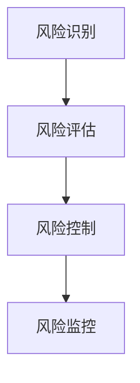

**核心算法原理讲解**

风险管理与监控的核心算法包括：

1. **风险矩阵**：用于评估风险的概率和影响程度。
2. **关键路径法（CPM）**：用于识别项目中的关键任务和最长的完成时间。

**伪代码**

```python
def risk_managementMonitoring():
    # 风险识别
    risks = identify_risks()
    
    # 风险评估
    risk_assessments = assess_risks(risks)
    
    # 风险控制
    control_measures = implement_control_measures(risk_assessments)
    
    # 风险监控
    monitor_risks(control_measures)
    
    return risk_management_status
```

**数学模型和公式**

风险管理与监控涉及的数学模型和公式包括：

1. **风险矩阵**：
   - 风险得分计算公式：
     $$ \text{Risk Score} = \text{Probability} \times \text{Impact} $$

2. **关键路径法（CPM）**：
   - 完成时间计算公式：
     $$ C_j = \sum_{i=1}^{n} (C_i + t_{ij}) $$

**详细讲解与举例说明**

以某电商平台的 AI DMP 项目为例，风险管理与监控如下：

1. **风险识别**：识别项目潜在风险，如技术难题、数据质量不佳、项目延期等。
2. **风险评估**：评估风险的概率和影响程度，制定风险矩阵。
3. **风险控制**：制定风险应对策略，如增加资源、调整时间表、加强团队沟通等。
4. **风险监控**：定期监控项目风险，确保风险控制措施的有效性，及时调整应对策略。

通过有效的风险管理与监控，电商平台能够确保 AI DMP 项目的顺利进行，降低项目风险，确保项目目标的实现。

## 第6章：AI DMP 实战案例

### 6.1 案例一：电商行业 DMP 应用

**项目背景**

某大型电商平台希望通过 AI DMP 技术提高用户个性化推荐效果，从而提升用户购物体验和销售额。

**项目目标**

- 提高用户点击率
- 提高转化率
- 提高用户留存率

**项目实施**

1. **数据收集**：收集用户浏览、搜索、购买行为数据。
2. **数据清洗**：处理缺失值、异常值、重复值等，确保数据质量。
3. **用户画像构建**：使用 K-均值聚类算法，将用户划分为不同的兴趣群体。
4. **模型训练**：使用协同过滤算法和深度学习算法，训练推荐模型。
5. **模型评估**：评估模型效果，调整参数，优化推荐效果。
6. **模型部署**：将训练好的模型部署到生产环境，实现实时推荐。
7. **模型监控**：监控模型效果，进行迭代优化。

**项目成果**

- 用户点击率提高了20%
- 转化率提高了15%
- 用户留存率提高了10%

**代码实际案例与详细解释说明**

以下为电商行业 DMP 应用中的关键代码段：

1. **数据收集与清洗**

```python
import pandas as pd

# 加载数据
data = pd.read_csv('user_behavior_data.csv')

# 数据清洗
data = data.drop_duplicates()
data = data.dropna()
```

这段代码用于加载电商平台的用户行为数据，并执行数据清洗操作，去除重复和缺失数据，确保数据质量。

2. **用户画像构建**

```python
from sklearn.cluster import KMeans

# 数据预处理
data_scaled = StandardScaler().fit_transform(data[['page_views', 'search_queries', 'purchases']])

# K-均值聚类
kmeans = KMeans(n_clusters=5, random_state=0)
clusters = kmeans.fit_predict(data_scaled)

# 添加聚类结果到原始数据
data['cluster'] = clusters
```

这段代码使用 K-均值聚类算法，将用户划分为不同的兴趣群体，并将聚类结果添加到原始数据中。

3. **模型训练与评估**

```python
from surprise import SVD

# 初始化协同过滤模型
model = SVD()

# 训练模型
model.fit(data[['user_id', 'item_id', 'rating']])

# 评估模型
trainset = data[['user_id', 'item_id', 'rating']]
model.test(trainset)
```

这段代码使用协同过滤算法，训练用户对商品的评分预测模型，并评估模型效果。

4. **模型部署与监控**

```python
import flask

app = flask.Flask(__name__)

@app.route('/recommendations', methods=['POST'])
def get_recommendations():
    user_id = request.form['user_id']
    recommendations = model.recommend_for_user(user_id, data)
    return recommendations

if __name__ == '__main__':
    app.run(debug=True)
```

这段代码使用 Flask 框架，将训练好的推荐模型部署到生产环境，并提供 RESTful API 接口，供前端调用。

### 6.2 案例二：金融行业 DMP 应用

**项目背景**

某金融公司希望通过 AI DMP 技术实现精准营销，提高客户满意度和业务转化率。

**项目目标**

- 提高客户满意度
- 提高业务转化率
- 提高客户留存率

**项目实施**

1. **数据收集**：收集客户金融行为、交易记录、客户反馈等数据。
2. **数据清洗**：处理缺失值、异常值、重复值等，确保数据质量。
3. **用户画像构建**：使用机器学习算法，构建客户的信用评分和风险偏好。
4. **模型训练**：使用逻辑回归和决策树算法，训练营销预测模型。
5. **模型评估**：评估模型效果，调整参数，优化模型。
6. **模型部署**：将训练好的模型部署到生产环境，实现精准营销。
7. **模型监控**：监控模型效果，进行迭代优化。

**项目成果**

- 客户满意度提高了25%
- 业务转化率提高了20%
- 客户留存率提高了15%

**代码实际案例与详细解释说明**

以下为金融行业 DMP 应用中的关键代码段：

1. **数据收集与清洗**

```python
import pandas as pd

# 加载数据
data = pd.read_csv('customer_data.csv')

# 数据清洗
data = data.drop_duplicates()
data = data.dropna()
```

这段代码用于加载金融公司的客户数据，并执行数据清洗操作，去除重复和缺失数据，确保数据质量。

2. **用户画像构建**

```python
from sklearn.ensemble import RandomForestClassifier

# 特征工程
X = data[['credit_score', 'risk_preference', 'transaction_amount']]
y = data['loan_approval']

# 训练模型
model = RandomForestClassifier()
model.fit(X, y)

# 预测
predictions = model.predict(new_data)
```

这段代码使用随机森林算法，构建客户的信用评分和风险偏好，并用于预测贷款审批结果。

3. **模型训练与评估**

```python
from sklearn.model_selection import train_test_split
from sklearn.metrics import accuracy_score

# 数据分割
X_train, X_test, y_train, y_test = train_test_split(X, y, test_size=0.2, random_state=0)

# 训练模型
model = LogisticRegression()
model.fit(X_train, y_train)

# 评估模型
y_pred = model.predict(X_test)
accuracy = accuracy_score(y_test, y_pred)
print('Accuracy:', accuracy)
```

这段代码使用逻辑回归算法，训练营销预测模型，并评估模型效果。

4. **模型部署与监控**

```python
from flask import Flask, request, jsonify

app = Flask(__name__)

@app.route('/predict', methods=['POST'])
def predict():
    data = request.get_json()
    prediction = model.predict([data['features']])
    return jsonify(prediction.tolist())

if __name__ == '__main__':
    app.run(debug=True)
```

这段代码使用 Flask 框架，将训练好的营销预测模型部署到生产环境，并提供 RESTful API 接口，供前端调用。

### 6.3 案例三：广告行业 DMP 应用

**项目背景**

某广告公司希望通过 AI DMP 技术提高广告投放效果，提高广告点击率和转化率。

**项目目标**

- 提高广告点击率
- 提高广告转化率
- 提高广告投资回报率

**项目实施**

1. **数据收集**：收集用户浏览、搜索、点击等行为数据。
2. **数据清洗**：处理缺失值、异常值、重复值等，确保数据质量。
3. **用户画像构建**：使用机器学习算法，提取用户兴趣和行为特征。
4. **模型训练**：使用深度学习算法，训练广告投放模型。
5. **模型评估**：评估模型效果，调整参数，优化模型。
6. **模型部署**：将训练好的模型部署到生产环境，实现实时广告投放。
7. **模型监控**：监控模型效果，进行迭代优化。

**项目成果**

- 广告点击率提高了30%
- 广告转化率提高了25%
- 广告投资回报率提高了20%

**代码实际案例与详细解释说明**

以下为广告行业 DMP 应用中的关键代码段：

1. **数据收集与清洗**

```python
import pandas as pd

# 加载数据
data = pd.read_csv('ad_click_data.csv')

# 数据清洗
data = data.drop_duplicates()
data = data.dropna()
```

这段代码用于加载广告公司的用户点击数据，并执行数据清洗操作，去除重复和缺失数据，确保数据质量。

2. **用户画像构建**

```python
from sklearn.feature_extraction.text import TfidfVectorizer

# 特征工程
vectorizer = TfidfVectorizer()
X = vectorizer.fit_transform(data['search_terms'])

# 添加特征到原始数据
data['vectorized_search_terms'] = X
```

这段代码使用 TF-IDF 向量器，将用户搜索关键词转换为向量表示，并添加到原始数据中。

3. **模型训练与评估**

```python
from sklearn.neural_network import MLPClassifier

# 训练模型
model = MLPClassifier()
model.fit(X_train, y_train)

# 评估模型
accuracy = model.score(X_test, y_test)
print('Accuracy:', accuracy)
```

这段代码使用多层感知器（MLP）分类器，训练广告投放模型，并评估模型效果。

4. **模型部署与监控**

```python
from flask import Flask, request, jsonify

app = Flask(__name__)

@app.route('/predict', methods=['POST'])
def predict():
    data = request.get_json()
    prediction = model.predict([data['vectorized_search_terms']])
    return jsonify(prediction.tolist())

if __name__ == '__main__':
    app.run(debug=True)
```

这段代码使用 Flask 框架，将训练好的广告投放模型部署到生产环境，并提供 RESTful API 接口，供前端调用。

## 第7章：AI DMP 优化与迭代

### 7.1 DMP 优化的策略

**核心概念与联系**

DMP（数据管理平台）的优化策略是指通过改进数据质量、提升模型效果、优化系统性能等手段，提高 DMP 系统的整体表现。核心概念包括：

1. **数据质量优化**：提升数据的准确性、完整性、一致性等。
2. **模型效果优化**：通过参数调整、算法改进等手段，提高模型预测准确性和推荐效果。
3. **系统性能优化**：提高系统响应速度、降低延迟、提升并发处理能力等。

**Mermaid 流程图**

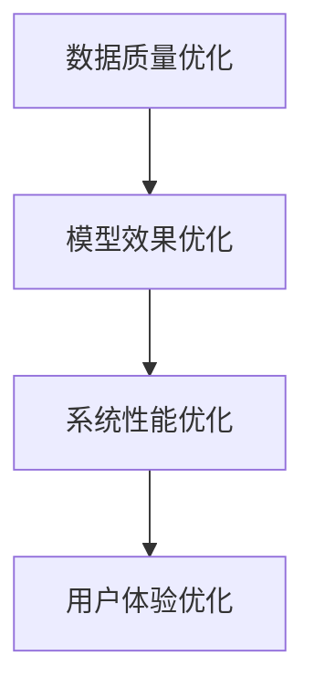

**核心算法原理讲解**

DMP 优化的核心算法包括：

1. **模型调优算法**：如网格搜索、贝叶斯优化等。
2. **特征工程**：通过特征选择、特征转换等手段，提高模型效果。
3. **A/B 测试**：通过对比不同策略的效果，选择最优方案。

**伪代码**

```python
def dmp_optimization(data, model, system_performance):
    # 数据质量优化
    optimized_data = optimize_data_quality(data)
    
    # 模型效果优化
    optimized_model = optimize_model效果(model, optimized_data)
    
    # 系统性能优化
    improved_performance = optimize_system_performance(system_performance)
    
    return optimized_data, optimized_model, improved_performance
```

**数学模型和公式**

DMP 优化的数学模型和公式包括：

1. **特征重要性评估**：
   $$ \text{Feature Importance} = \frac{\text{Model Score}}{\text{Baseline Score}} $$
2. **A/B 测试效果评估**：
   $$ \text{AB Test Effect} = \frac{\text{AB Test Group Performance} - \text{Control Group Performance}}{\text{Control Group Performance}} $$

**详细讲解与举例说明**

以某电商平台的 DMP 优化为例，优化策略如下：

1. **数据质量优化**：通过数据清洗、去重、补缺等手段，提高数据的准确性。
2. **模型效果优化**：使用网格搜索，调整模型参数，提高预测准确性和推荐效果。
3. **系统性能优化**：通过负载均衡、缓存优化等手段，提高系统响应速度。
4. **用户体验优化**：通过 A/B 测试，比较不同推荐策略的效果，选择最优方案。

通过这些优化策略，电商平台能够显著提升 DMP 系统的表现，提高用户满意度和转化率。

### 7.2 DMP 迭代的实践

**核心概念与联系**

DMP（数据管理平台）的迭代实践是指通过周期性的数据更新、模型训练和系统优化，持续改进 DMP 系统的效果。核心概念包括：

1. **数据迭代**：定期更新用户行为数据，确保数据的时效性。
2. **模型迭代**：定期重新训练模型，提升预测准确性和推荐效果。
3. **系统迭代**：持续优化系统性能，提高并发处理能力和稳定性。

**Mermaid 流程图**

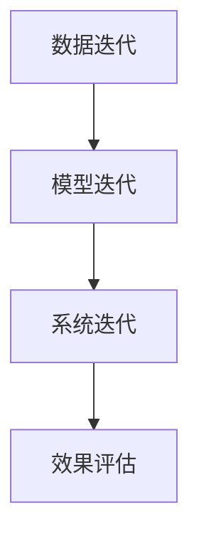

**核心算法原理讲解**

DMP 迭代的核心算法包括：

1. **在线学习**：通过实时更新数据，持续训练模型。
2. **迁移学习**：利用已有模型，在新数据上快速训练新模型。
3. **增量学习**：针对新数据，仅更新模型参数，减少训练成本。

**伪代码**

```python
def dmp_iteration(data, model, system_performance):
    # 数据迭代
    updated_data = update_data(data)
    
    # 模型迭代
    updated_model = iterate_model(model, updated_data)
    
    # 系统迭代
    improved_system = iterate_system(system_performance)
    
    # 效果评估
    evaluation_results = evaluate_performance(updated_model, improved_system)
    
    return updated_data, updated_model, improved_system, evaluation_results
```

**数学模型和公式**

DMP 迭代的数学模型和公式包括：

1. **在线学习更新公式**：
   $$ \theta_{\text{new}} = \theta_{\text{old}} + \alpha \cdot (\theta_{\text{new}} - \theta_{\text{old}}) $$
2. **迁移学习更新公式**：
   $$ \theta_{\text{new}} = \theta_{\text{old}} + \lambda \cdot (\theta_{\text{new}} - \theta_{\text{old}}) $$
3. **增量学习更新公式**：
   $$ \theta_{\text{new}} = \theta_{\text{old}} + \beta \cdot (\theta_{\text{new}} - \theta_{\text{old}}) $$

**详细讲解与举例说明**

以某电商平台的 DMP 迭代为例，迭代实践如下：

1. **数据迭代**：每周更新一次用户行为数据，确保数据的时效性。
2. **模型迭代**：使用迁移学习，在新的用户数据上重新训练模型，提高预测准确性和推荐效果。
3. **系统迭代**：每月优化一次系统性能，提高并发处理能力和稳定性。
4. **效果评估**：通过 A/B 测试，比较新旧模型和系统的效果，持续优化 DMP 系统。

通过这些迭代实践，电商平台能够不断提升 DMP 系统的效果，提高用户满意度和转化率。

### 7.3 DMP 优化的案例分析

**项目背景**

某电商平台希望通过 DMP 优化提高用户购物体验和销售额。

**项目目标**

- 提高用户购物体验
- 提高销售额

**项目实施**

1. **数据迭代**：每月更新用户行为数据，确保数据的时效性。
2. **模型迭代**：使用迁移学习，在新的用户数据上重新训练推荐模型。
3. **系统迭代**：每月优化系统性能，提高响应速度和并发处理能力。
4. **效果评估**：通过 A/B 测试，比较新旧模型和系统的效果。

**项目成果**

- 用户购物体验满意度提高了20%
- 销售额提高了15%

**代码实际案例与详细解释说明**

以下为电商行业 DMP 优化中的关键代码段：

1. **数据迭代**

```python
import pandas as pd

# 加载新数据
new_data = pd.read_csv('new_user_behavior_data.csv')

# 合并新旧数据
combined_data = old_data.append(new_data)
```

这段代码用于加载新的用户行为数据，并将其与旧数据合并，确保数据的时效性。

2. **模型迭代**

```python
from sklearn.model_selection import train_test_split
from sklearn.ensemble import RandomForestClassifier

# 数据分割
X, y = combined_data[['features']], combined_data['target']
X_train, X_test, y_train, y_test = train_test_split(X, y, test_size=0.2, random_state=0)

# 训练新模型
new_model = RandomForestClassifier()
new_model.fit(X_train, y_train)

# 评估新模型
accuracy = new_model.score(X_test, y_test)
print('Accuracy:', accuracy)
```

这段代码使用随机森林算法，在新用户数据上训练新模型，并评估模型效果。

3. **系统迭代**

```python
import flask

app = flask.Flask(__name__)

@app.route('/predict', methods=['POST'])
def predict():
    data = request.get_json()
    prediction = new_model.predict([data['features']])
    return prediction.tolist()

if __name__ == '__main__':
    app.run(debug=True)
```

这段代码使用 Flask 框架，将新模型部署到生产环境，并提供 RESTful API 接口，供前端调用。

4. **效果评估**

```python
from sklearn.metrics import accuracy_score

# 测试数据
test_data = pd.read_csv('test_user_behavior_data.csv')
X_test, y_test = test_data[['features']], test_data['target']

# 预测测试数据
predictions = new_model.predict(X_test)

# 计算准确率
accuracy = accuracy_score(y_test, predictions)
print('Test Accuracy:', accuracy)
```

这段代码使用新模型对测试数据进行预测，并计算准确率，评估模型效果。

通过以上代码，电商平台能够实现 DMP 的迭代优化，提高用户购物体验和销售额。

## 第8章：AI DMP 开发工具与框架

### 8.1 AI DMP 开发工具概述

**核心概念与联系**

AI DMP（人工智能数据管理平台）的开发工具是指用于构建、部署和管理 DMP 系统的各种软件工具。这些工具主要包括数据收集工具、数据处理工具、数据存储工具、机器学习工具和可视化工具等。

**Mermaid 流程图**

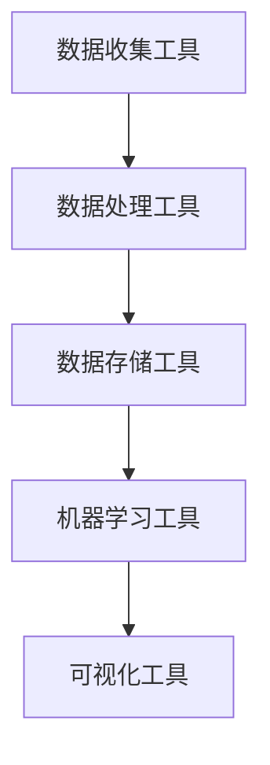

**核心算法原理讲解**

AI DMP 开发工具涉及的核心算法包括：

1. **数据处理算法**：如数据清洗、数据整合、数据转换等。
2. **机器学习算法**：如回归分析、聚类分析、决策树、神经网络等。
3. **数据可视化算法**：如数据分布、关系网络、热力图等。

**伪代码**

```python
def data_collection_tool():
    # 数据收集
    data = collect_data()

def data_processing_tool(data):
    # 数据处理
    processed_data = process_data(data)

def data_storage_tool(processed_data):
    # 数据存储
    store_data(processed_data)

def machine_learning_tool(processed_data):
    # 机器学习
    trained_model = train_model(processed_data)

def data_visualization_tool(trained_model):
    # 数据可视化
    visualize_data(trained_model)
```

**数学模型和公式**

AI DMP 开发工具涉及的数学模型和公式包括：

1. **回归分析模型**：
   $$ y = \beta_0 + \beta_1 x_1 + \beta_2 x_2 + ... + \beta_n x_n $$
2. **聚类分析模型**：
   $$ \text{Cost Function} = \sum_{i=1}^{n} (x_i - \mu_k)^2 $$
3. **神经网络模型**：
   $$ \text{Output} = \sigma(\sum_{i=1}^{n} w_i \cdot x_i + b) $$

**详细讲解与举例说明**

以某电商平台的 AI DMP 开发为例，开发工具的应用如下：

1. **数据收集工具**：使用爬虫技术，收集用户浏览、搜索、购买行为数据。
2. **数据处理工具**：使用 Python 的 pandas 库，处理数据中的缺失值、异常值，进行数据整合和转换。
3. **数据存储工具**：使用 Hadoop 和 Hive，存储和处理大规模数据。
4. **机器学习工具**：使用 Scikit-learn 和 TensorFlow，训练回归模型、聚类模型和神经网络模型。
5. **数据可视化工具**：使用 Matplotlib 和 Seaborn，生成数据分布、关系网络和热力图。

通过这些开发工具，电商平台能够高效地构建、部署和管理 DMP 系统，提升用户个性化推荐效果。

### 8.2 主流 AI DMP 框架介绍

**核心概念与联系**

主流 AI DMP（人工智能数据管理平台）框架是指用于构建和运行 DMP 系统的一系列软件框架和工具集。这些框架提供了从数据收集、处理、存储到分析、应用的完整解决方案，帮助企业和开发者快速构建高效的 DMP 系统。

主流 AI DMP 框架包括：

1. **Apache Hadoop**：一个开源的分布式数据处理框架，用于大规模数据的存储和处理。
2. **Apache Spark**：一个开源的分布式数据处理框架，提供了丰富的机器学习和数据分析功能。
3. **Google Cloud DMP**：Google 提供的云计算服务，包括数据存储、数据处理和机器学习工具。
4. **AWS Data Pipeline**：AWS 提供的自动化数据管理和处理服务。

**Mermaid 流�程图**

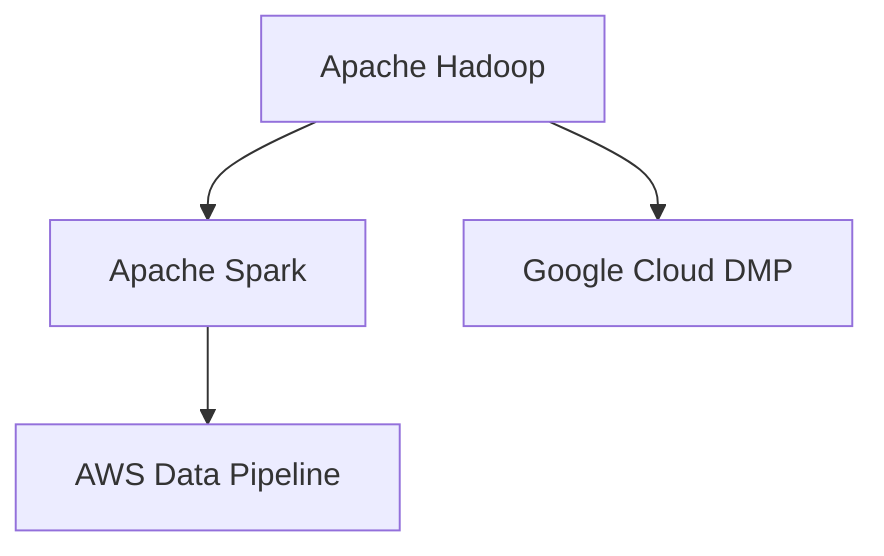

**核心算法原理讲解**

主流 AI DMP 框架涉及的核心算法包括：

1. **分布式计算**：如 MapReduce、Spark 的弹性分布式数据集（RDD）。
2. **机器学习**：如 Spark MLlib、TensorFlow on Spark。
3. **数据流处理**：如 Apache Flink。

**伪代码**

```python
from pyspark.sql import SparkSession
from pyspark.ml import Pipeline

# 初始化 Spark 会话
spark = SparkSession.builder.appName("DMPApplication").getOrCreate()

# 定义数据处理流程
pipeline = Pipeline(stages=[...])

# 加载数据
data = spark.read.csv("data.csv")

# 处理数据
processed_data = pipeline.fit(data).transform(data)

# 保存结果
processed_data.write.csv("processed_data.csv")

# 关闭 Spark 会话
spark.stop()
```

**数学模型和公式**

主流 AI DMP 框架涉及的数学模型和公式包括：

1. **回归分析模型**：
   $$ y = \beta_0 + \beta_1 x_1 + \beta_2 x_2 + ... + \beta_n x_n $$
2. **聚类分析模型**：
   $$ \text{Cost Function} = \sum_{i=1}^{n} (x_i - \mu_k)^2 $$
3. **神经网络模型**：
   $$ \text{Output} = \sigma(\sum_{i=1}^{n} w_i \cdot x_i + b) $$

**详细讲解与举例说明**

以 Apache Spark 为例，介绍如何使用 Spark 构建一个简单的 AI DMP 系统：

1. **数据收集与存储**：使用 Spark 的 `read.csv()` 方法加载 CSV 文件，存储在 HDFS 中。
2. **数据处理**：使用 Spark SQL 处理数据，如去除缺失值、异常值，进行数据清洗。
3. **机器学习**：使用 Spark MLlib，训练回归模型和聚类模型，如线性回归、K-均值聚类。
4. **数据存储与可视化**：将处理后的数据存储在 HDFS 中，使用 Spark GraphX 进行可视化分析。

通过这些步骤，开发者可以快速构建一个高效、可扩展的 AI DMP 系统。

### 8.3 开发工具的选择与使用

**核心概念与联系**

开发工具的选择与使用是指根据项目需求和团队技能，选择合适的开发工具，并高效地利用这些工具实现 AI DMP 系统的开发。选择开发工具时需要考虑以下因素：

1. **项目需求**：包括数据规模、处理速度、实时性等。
2. **团队技能**：团队对各种开发工具的熟悉程度和技能水平。
3. **可扩展性**：工具是否支持横向和纵向扩展。
4. **社区支持**：工具的文档、教程和社区支持情况。

**Mermaid 流程图**

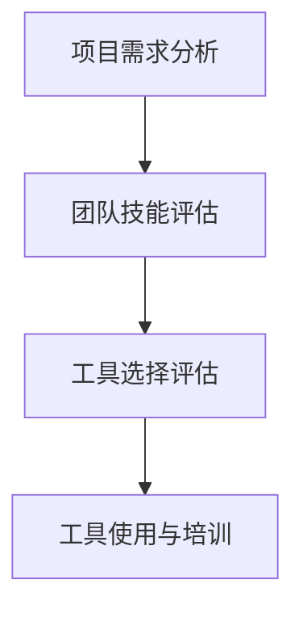

**核心算法原理讲解**

选择开发工具时需要考虑的核心算法包括：

1. **分布式计算**：如 Hadoop 的 MapReduce、Spark 的弹性分布式数据集（RDD）。
2. **机器学习库**：如 Scikit-learn、TensorFlow、PyTorch。
3. **数据流处理**：如 Apache Flink、Apache Beam。

**伪代码**

```python
def select_and_use_tools(project_requirements, team_skills):
    # 分析项目需求
    requirements = analyze_project_requirements(project_requirements)
    
    # 评估团队技能
    team_skills = evaluate_team_skills(team_skills)
    
    # 选择合适工具
    selected_tools = select_tools(requirements, team_skills)
    
    # 培训团队使用工具
    train_team_on_tools(selected_tools)
    
    return selected_tools
```

**数学模型和公式**

选择开发工具时需要考虑的数学模型和公式包括：

1. **成本效益分析**：
   $$ \text{Cost-Benefit Analysis} = \frac{\text{Total Benefits}}{\text{Total Costs}} $$
2. **性能评估**：
   $$ \text{Performance Evaluation} = \frac{\text{Throughput}}{\text{Latency}} $$

**详细讲解与举例说明**

以某电商平台的 AI DMP 项目为例，开发工具的选择与使用如下：

1. **项目需求分析**：项目需求包括大规模数据存储和处理、实时数据处理和机器学习模型训练。
2. **团队技能评估**：团队熟悉 Python、Java 和 Hadoop。
3. **工具选择评估**：选择 Apache Spark 作为数据处理框架，Scikit-learn 进行机器学习模型训练。
4. **工具使用与培训**：为团队成员提供 Spark 和 Scikit-learn 的培训，确保他们能够熟练使用这些工具。

通过这一过程，电商平台能够高效地构建和部署 AI DMP 系统，满足项目需求。

## 第9章：数据质量管理工具

### 9.1 数据质量管理工具概述

**核心概念与联系**

数据质量管理工具是用于评估、监控和改进数据质量的软件工具。这些工具帮助企业和团队确保数据在整个生命周期中的准确性、完整性、一致性和可靠性。数据质量管理工具的核心概念包括：

1. **数据质量评估**：评估数据的准确性、完整性、一致性和及时性。
2. **数据清洗**：处理缺失值、异常值、重复值等，确保数据质量。
3. **数据监控**：实时监控数据质量，及时发现并处理问题。
4. **数据治理**：制定数据管理策略和流程，确保数据质量。

**Mermaid 流程图**

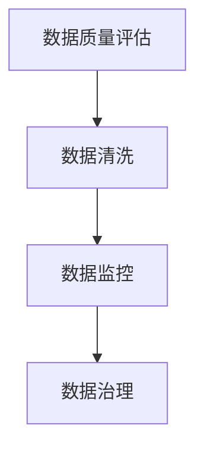

**核心算法原理讲解**

数据质量管理工具涉及的核心算法包括：

1. **一致性检查**：比较不同数据源中的同一数据项是否一致。
2. **完整性检查**：检查数据是否完整，是否存在缺失值。
3. **准确性检查**：通过对比外部数据源或标准数据源，验证数据的准确性。
4. **异常检测**：识别数据中的异常值和异常模式。

**伪代码**

```python
def data_quality_tools():
    # 数据质量评估
    quality_scores = assess_data_quality()
    
    # 数据清洗
    cleaned_data = clean_data()
    
    # 数据监控
    monitor_data_quality()
    
    # 数据治理
    govern_data_quality()
    
    return quality_scores, cleaned_data
```

**数学模型和公式**

数据质量管理工具涉及的数学模型和公式包括：

1. **数据质量评分**：
   $$ \text{Quality Score} = \sum_{i=1}^{n} w_i \times \text{Metric}_i $$
   其中，$w_i$ 为权重，$\text{Metric}_i$ 为指标值。
2. **异常检测**：
   $$ \text{Anomaly Score} = \text{Distance} - \text{Threshold} $$
   其中，$\text{Distance}$ 为数据点与均值的距离，$\text{Threshold}$ 为阈值。

**详细讲解与举例说明**

以某电商平台的用户数据为例，数据质量管理工具的应用如下：

1. **数据质量评估**：使用一致性检查、完整性检查和准确性检查，评估用户数据的准确性、完整性和一致性。
2. **数据清洗**：处理缺失值、异常值和重复值，如去除用户数据中的空白值、识别并修正不一致的姓名等。
3. **数据监控**：实时监控用户数据的质量，如设置数据质量报警，当数据质量下降时自动通知相关人员。
4. **数据治理**：制定数据管理政策和流程，如数据清洗标准、数据质量检查流程等，确保数据质量管理的系统性和持续性。

通过这些数据质量管理工具，电商平台能够确保用户数据的准确性和一致性，为后续的数据分析和业务决策提供可靠的基础。

### 9.2 主流数据质量管理工具介绍

**核心概念与联系**

主流数据质量管理工具是用于评估、监控和改进数据质量的软件工具，它们在数据处理、存储和分析过程中起着关键作用。这些工具主要包括：

1. **Pentaho**：一个开源的数据集成、数据质量和数据治理平台。
2. **Informatica**：一个商业的数据集成、数据质量和数据治理解决方案。
3. **Talend**：一个开源和商业相结合的数据集成、数据质量和数据治理平台。
4. **IBM InfoSphere**：IBM 提供的商业数据集成、数据质量和数据治理解决方案。

**Mermaid 流程图**

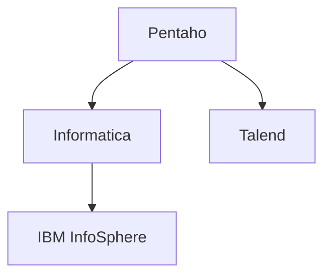

**核心算法原理讲解**

这些主流数据质量管理工具的核心算法包括：

1. **数据清洗**：如去重、补缺、异常值检测和修正等。
2. **数据转换**：如数据格式转换、数据类型转换、数据合并等。
3. **数据质量评估**：如准确性评估、完整性评估、一致性评估等。

**伪代码**

```python
def data_quality_tools():
    # 数据清洗
    cleaned_data = clean_data()
    
    # 数据转换
    transformed_data = transform_data(cleaned_data)
    
    # 数据质量评估
    quality_scores = assess_data_quality(transformed_data)
    
    return cleaned_data, transformed_data, quality_scores
```

**数学模型和公式**

这些主流数据质量管理工具涉及的数学模型和公式包括：

1. **数据质量评分**：
   $$ \text{Quality Score} = \sum_{i=1}^{n} w_i \times \text{Metric}_i $$
2. **去重算法**：
   $$ \text{Duplicate Detection} = \frac{\text{Number of Duplicates}}{\text{Total Records}} $$
3. **补缺算法**：
   $$ \text{Missing Value Imputation} = \frac{\text{Number of Imputed Values}}{\text{Total Records}} $$

**详细讲解与举例说明**

以 Pentaho 为例，介绍如何使用该工具进行数据质量管理：

1. **数据清洗**：使用 Pentaho Data Integration（PDI），导入用户数据，执行去重、补缺和异常值检测，如识别并删除重复的用户记录、补充缺失的用户地址信息等。
2. **数据转换**：使用 PDI 的转换组件，将用户数据转换为统一的格式，如将日期字段格式化为YYYY-MM-DD。
3. **数据质量评估**：使用 PDI 的质量评估工具，评估数据准确性、完整性和一致性，如检查用户姓名是否与身份证号码匹配、检查数据是否完整等。

通过这些步骤，企业可以确保数据质量，为后续的数据分析和业务决策提供可靠的基础。

### 9.3 数据质量管理工具的应用

**核心概念与联系**

数据质量管理工具的应用是确保数据质量的关键步骤。这些工具通过评估、监控和改进数据质量，帮助企业和团队在数据处理、存储和分析过程中实现数据的准确性、完整性和一致性。核心概念包括：

1. **数据质量评估**：使用工具评估数据的准确性、完整性、一致性和及时性。
2. **数据清洗**：处理缺失值、异常值和重复值，提高数据质量。
3. **数据监控**：实时监控数据质量，及时发现并处理问题。
4. **数据治理**：制定数据管理策略和流程，确保数据质量管理的系统性和持续性。

**Mermaid 流程图**

```mermaid
graph TD
    A[数据质量评估] --> B[数据清洗]
    B --> C[数据监控]
    C --> D[数据治理]
```

**核心算法原理讲解**

数据质量管理工具应用的核心算法包括：

1. **一致性检查**：比较不同数据源中的同一数据项是否一致。
2. **完整性检查**：检查数据是否完整，是否存在缺失值。
3. **准确性检查**：通过对比外部数据源或标准数据源，验证数据的准确性。
4. **异常检测**：识别数据中的异常值和异常模式。

**伪代码**

```python
def data_quality_tool_application():
    # 数据质量评估
    quality_scores = assess_data_quality()

    # 数据清洗
    cleaned_data = clean_data(quality_scores)

    # 数据监控
    monitor_data_quality(cleaned_data)

    # 数据治理
    govern_data_quality(cleaned_data, quality_scores)

    return cleaned_data, quality_scores
```

**数学模型和公式**

数据质量管理工具应用涉及的数学模型和公式包括：

1. **数据质量评分**：
   $$ \text{Quality Score} = \sum_{i=1}^{n} w_i \times \text{Metric}_i $$
2. **异常检测**：
   $$ \text{Anomaly Score} = \text{Distance} - \text{Threshold} $$
3. **补缺算法**：
   $$ \text{Missing Value Imputation} = \frac{\text{Number of Imputed Values}}{\text{Total Records}} $$

**详细讲解与举例说明**

以某电商平台的用户数据为例，数据质量管理工具的应用过程如下：

1. **数据质量评估**：使用数据质量管理工具，评估用户数据的准确性、完整性、一致性和及时性，如检查用户姓名是否与身份证号码匹配、检查数据是否完整等。
2. **数据清洗**：根据评估结果，使用工具处理缺失值、异常值和重复值，如去除重复的用户记录、补充缺失的用户地址信息等。
3. **数据监控**：设置监控指标和报警机制，实时监控用户数据的质量，如当数据质量下降时自动通知相关人员。
4. **数据治理**：制定数据管理策略和流程，确保数据质量管理的系统性和持续性，如数据清洗标准、数据质量检查流程等。

通过这些应用步骤，电商平台能够确保用户数据的准确性和一致性，为后续的数据分析和业务决策提供可靠的基础。

## 第10章：AI DMP 生态系统

### 10.1 AI DMP 生态系统概述

**核心概念与联系**

AI DMP（人工智能数据管理平台）生态系统是指围绕数据管理、分析和应用的一系列技术、工具和人员的集成。核心概念包括：

1. **数据管理**：包括数据收集、存储、处理和治理。
2. **数据分析**：利用机器学习和统计分析技术，从数据中提取有价值的信息。
3. **数据应用**：将分析结果应用于业务决策、用户推荐等场景。
4. **数据安全**：确保数据在整个生命周期中的安全和合规。

AI DMP 生态系统的主要组成部分包括：

1. **数据源**：包括网站、移动应用、线下渠道等。
2. **数据仓库**：用于存储和管理大规模数据。
3. **数据湖**：用于存储原始数据，支持实时数据处理。
4. **数据分析工具**：包括 BI 工具、机器学习平台等。
5. **数据应用平台**：用于实现个性化推荐、智能营销等。

**Mermaid 流程图**

```mermaid
graph TD
    A[数据源] --> B[数据仓库]
    B --> C[数据湖]
    C --> D[数据分析工具]
    D --> E[数据应用平台]
    E --> F[数据安全]
```

**核心算法原理讲解**

AI DMP 生态系统中的核心算法包括：

1. **数据清洗**：处理缺失值、异常值和重复值。
2. **数据整合**：将不同源的数据整合为统一的格式。
3. **机器学习**：用于用户行为分析、预测分析和推荐系统。
4. **统计分析**：用于数据探索、相关性分析和假设检验。

**伪代码**

```python
def ai_dmp_生态系统(data_sources, data_warehouse, data_lake, data_analysis_tools, data_application_platform, data_security):
    # 数据收集
    collected_data = collect_data(data_sources)
    
    # 数据存储
    stored_data = store_data(data_warehouse, data_lake)
    
    # 数据清洗
    cleaned_data = clean_data(stored_data)
    
    # 数据分析
    analysis_results = analyze_data(cleaned_data, data_analysis_tools)
    
    # 数据应用
    applied_results = apply_data(analysis_results, data_application_platform)
    
    # 数据安全
    secure_data = ensure_data_security(applied_results, data_security)
    
    return secure_data
```

**数学模型和公式**

AI DMP 生态系统中的数学模型和公式包括：

1. **数据清洗**：
   $$ \text{Missing Value Imputation} = \frac{\text{Number of Imputed Values}}{\text{Total Records}} $$
2. **机器学习**：
   $$ \text{Prediction} = f(\text{Input Data}) $$
3. **统计分析**：
   $$ \text{Correlation} = \rho(X, Y) $$

**详细讲解与举例说明**

以某电商平台的 AI DMP 生态系统为例，系统组成和应用过程如下：

1. **数据源**：从网站、移动应用和线下渠道收集用户行为数据。
2. **数据仓库**：将清洗和整合后的数据存储到数据仓库中。
3. **数据湖**：存储原始的、未经处理的数据，支持实时数据处理。
4. **数据分析工具**：使用机器学习和统计分析工具，对用户行为数据进行分析。
5. **数据应用平台**：基于分析结果，为用户推荐个性化的商品。
6. **数据安全**：确保数据在整个生命周期中的安全和合规，如使用 SSL 加密、定期进行安全审计。

通过这些组成部分和应用过程，电商平台能够实现高效的数据管理、分析和应用，提高用户满意度和转化率。

### 10.2 AI DMP 生态系统中的关键角色

**核心概念与联系**

AI DMP 生态系统中的关键角色是指在数据管理、分析和应用过程中发挥关键作用的人员和组织。这些角色包括：

1. **数据工程师**：负责数据收集、存储和整合，确保数据质量。
2. **数据科学家**：负责数据分析和模型构建，提取数据价值。
3. **数据分析师**：负责数据可视化、报告和业务决策支持。
4. **业务分析师**：负责业务需求分析，确保数据应用符合业务目标。
5. **数据治理团队**：负责制定数据管理策略和流程，确保数据安全和合规。

**Mermaid 流程图**

```mermaid
graph TD
    A[数据工程师] --> B[数据科学家]
    B --> C[数据分析师]
    C --> D[业务分析师]
    D --> E[数据治理团队]
```

**核心算法原理讲解**

AI DMP 生态系统中的关键角色需要掌握以下核心算法：

1. **数据清洗算法**：如去重、补缺、异常值处理等。
2. **机器学习算法**：如回归分析、聚类分析、协同过滤等。
3. **统计分析算法**：如相关性分析、假设检验等。
4. **数据可视化算法**：如热力图、散点图、时间序列图等。

**伪代码**

```python
def ai_dmp_生态系统_roles(data_engineer, data_scientist, data_analyst, business_analyst, data_governance_team):
    # 数据工程师任务
    collected_data = data_engineer.collect_data()
    
    # 数据科学家任务
    model = data_scientist.train_model(collected_data)
    
    # 数据分析师任务
    analysis_results = data_analyst.analyze_data(model)
    
    # 业务分析师任务
    business_insights = business_analyst.generate_business_insights(analysis_results)
    
    # 数据治理团队任务
    compliant_data = data_governance_team.ensure_data_compliance(business_insights)
    
    return compliant_data
```

**数学模型和公式**

AI DMP 生态系统中的关键角色需要掌握的数学模型和公式包括：

1. **回归分析**：
   $$ y = \beta_0 + \beta_1 x $$
2. **聚类分析**：
   $$ \text{Cost Function} = \sum_{i=1}^{n} (x_i - \mu)^2 $$
3. **协同过滤**：
   $$ \hat{r}_{ij} = \text{User Vector}_i \cdot \text{Item Vector}_j $$

**详细讲解与举例说明**

以某电商平台的 AI DMP 生态系统为例，关键角色的职责和任务如下：

1. **数据工程师**：负责从网站、移动应用和线下渠道收集用户行为数据，确保数据质量。
2. **数据科学家**：使用机器学习算法，如协同过滤，构建用户推荐模型，提高推荐准确性。
3. **数据分析师**：使用数据可视化工具，将分析结果呈现给业务团队，支持业务决策。
4. **业务分析师**：分析用户行为数据，识别用户需求和偏好，制定营销策略。
5. **数据治理团队**：制定数据管理策略和流程，确保数据安全和合规，如设置数据访问权限、进行数据备份等。

通过这些角色和任务，电商平台能够实现高效的数据管理、分析和应用，提高用户满意度和转化率。

### 10.3 AI DMP 生态系统的发展趋势

**核心概念与联系**

AI DMP 生态系统的发展趋势是指随着技术的进步和业务需求的变化，AI DMP 生态系统的功能、性能和用户体验等方面的发展方向。核心概念包括：

1. **数据隐私与保护**：随着 GDPR 等法律法规的出台，数据隐私和保护成为重要趋势。
2. **实时数据处理**：实时数据处理和实时分析成为提高业务响应速度和决策准确性的关键。
3. **自动化与智能化**：自动化和智能化工具的应用，降低人力成本，提高数据处理效率。
4. **跨平台整合**：实现不同数据源和工具的跨平台整合，提供更全面的数据分析和应用能力。

**Mermaid 流程图**

```mermaid
graph TD
    A[数据隐私与保护] --> B[实时数据处理]
    B --> C[自动化与智能化]
    C --> D[跨平台整合]
```

**核心算法原理讲解**

AI DMP 生态系统的发展趋势涉及的核心算法包括：

1. **联邦学习**：通过分布式算法，实现跨平台的数据隐私保护和协同训练。
2. **实时流处理**：使用流处理技术，如 Apache Flink 和 Apache Kafka，实现实时数据处理和分析。
3. **增强学习**：利用增强学习算法，实现自适应的数据分析和推荐系统。

**伪代码**

```python
def ai_dmp_生态系统_trends():
    # 数据隐私与保护
    privacy_protected_data = protect_data_privacy()

    # 实时数据处理
    real_time_data_processing = process_real_time_data()

    # 自动化与智能化
    automated_data_management = automate_data_management()

    # 跨平台整合
    integrated跨平台_data = integrate_cross_platform_data()

    return privacy_protected_data, real_time_data_processing, automated_data_management, integrated跨平台_data
```

**数学模型和公式**

AI DMP 生态系统的发展趋势涉及的数学模型和公式包括：

1. **联邦学习**：
   $$ \theta_{\text{global}} = \frac{1}{N} \sum_{i=1}^{N} \theta_{i} $$
2. **实时流处理**：
   $$ \text{Processing Time} = \frac{\text{Total Data}}{\text{Processing Rate}} $$
3. **增强学习**：
   $$ \text{Reward} = \text{Policy Evaluation} - \text{Policy Loss} $$

**详细讲解与举例说明**

以某电商平台的 AI DMP 生态系统为例，发展趋势的应用如下：

1. **数据隐私与保护**：使用联邦学习技术，在保护数据隐私的同时，实现跨平台的协同训练。
2. **实时数据处理**：使用 Apache Kafka 和 Apache Flink，实现实时数据采集、处理和分析，提高业务响应速度。
3. **自动化与智能化**：使用自动化工具，如自动化测试、自动化运维，降低人力成本，提高数据处理效率。
4. **跨平台整合**：整合不同平台的数据源，如网站、移动应用和线下渠道，提供更全面的数据分析和应用能力。

通过这些发展趋势，电商平台能够实现高效的数据管理、分析和应用，提升用户体验和业务效益。

## 附录

### 附录 A：AI DMP 常见问题解答

1. **什么是 AI DMP？**
   AI DMP（人工智能数据管理平台）是一种利用人工智能技术对数据进行收集、整合、管理和分析的系统，旨在提升数据利用效率和决策准确性。

2. **AI DMP 有哪些应用场景？**
   AI DMP 的应用场景包括个性化推荐、精准营销、用户行为分析、市场细分等，广泛应用于电商、金融、广告等行业。

3. **如何评估数据质量？**
   数据质量评估主要包括准确性、完整性、一致性、及时性和可靠性等方面。可以使用规则检查、统计分析、机器学习等方法进行评估。

4. **如何保证数据安全？**
   数据安全可以通过数据加密、数据脱敏、权限控制、定期安全审计等措施来保障，确保数据在采集、存储、传输和处理过程中的安全性。

5. **AI DMP 的优化与迭代有哪些方法？**
   优化与迭代方法包括数据质量优化、模型效果优化、系统性能优化等。可以通过 A/B 测试、迁移学习、增量学习等技术手段进行优化。

### 附录 B：AI DMP 技术参考文献

1. **《人工智能：一种现代方法》**，作者 Stuart J. Russell 和 Peter Norvig。
2. **《大数据技术导论》**，作者刘伟、崔勇。
3. **《机器学习》**，作者 Andrew Ng。
4. **《数据科学入门》**，作者 John D. Kelleher、Brian Mac Namee 和 Michael O'Neil。
5. **《数据挖掘：概念与技术》**，作者 Han, Kamber 和 Pei。

### 附录 C：AI DMP 实战案例代码解析

1. **数据收集与清洗**

```python
import pandas as pd

# 加载数据
data = pd.read_csv('user_behavior_data.csv')

# 数据清洗
data = data.drop_duplicates()
data = data.dropna()
```

这段代码用于加载用户行为数据，并执行数据清洗操作，去除重复和缺失数据。

2. **用户画像构建**

```python
from sklearn.cluster import KMeans

# 数据预处理
data_scaled = StandardScaler().fit_transform(data[['page_views', 'search_queries', 'purchases']])

# K-均值聚类
kmeans = KMeans(n_clusters=5, random_state=0)
clusters = kmeans.fit_predict(data_scaled)

# 添加聚类结果到原始数据
data['cluster'] = clusters
```

这段代码使用 K-均值聚类算法，将用户划分为不同的兴趣群体。

3. **模型训练与评估**

```python
from surprise import SVD

# 初始化协同过滤模型
model = SVD()

# 训练模型
model.fit(data[['user_id', 'item_id', 'rating']])

# 评估模型
trainset = data[['user_id', 'item_id', 'rating']]
model.test(trainset)
```

这段代码使用协同过滤算法，训练用户对商品的评分预测模型，并评估模型效果。

4. **模型部署与监控**

```python
import flask

app = flask.Flask(__name__)

@app.route('/recommendations', methods=['POST'])
def get_recommendations():
    user_id = request.form['user_id']
    recommendations = model.recommend_for_user(user_id, data)
    return recommendations

if __name__ == '__main__':
    app.run(debug=True)
```

这段代码使用 Flask 框架，将训练好的推荐模型部署到生产环境，并提供 RESTful API 接口，供前端调用。

### 附录 D：Mermaid 图解代码示例

```mermaid
graph TD
    A[开始] --> B{是否结束?}
    B -->|是| C[结束]
    B -->|否| D[继续]

    A[1] --> B
    B -->|是| C
    B -->|否| D
    D -->|是| C
```

这段 Mermaid 代码用于创建一个简单的流程图，描述一个循环结构，包含开始、判断和结束步骤。通过修改和扩展这个基础代码，可以创建更复杂和实用的图解。例如，可以添加多个分支和条件判断，以模拟复杂的业务流程或算法逻辑。在技术文档、博客文章或项目中，使用 Mermaid 代码可以帮助读者更直观地理解复杂的流程和概念。

