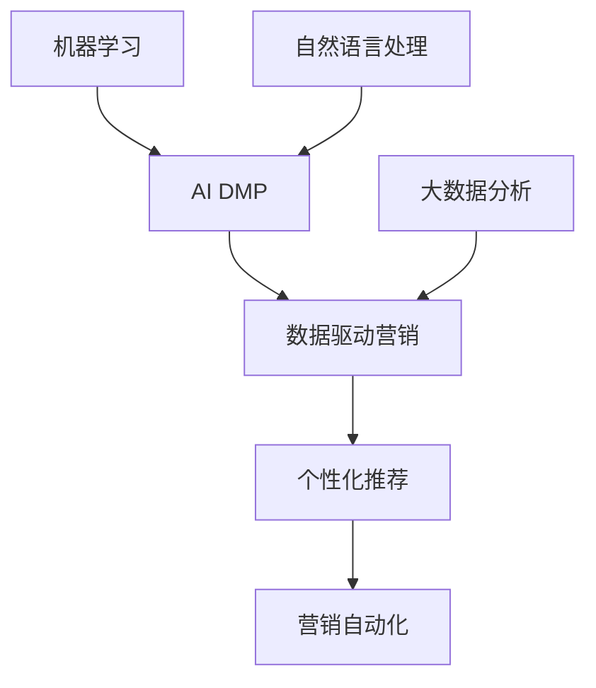
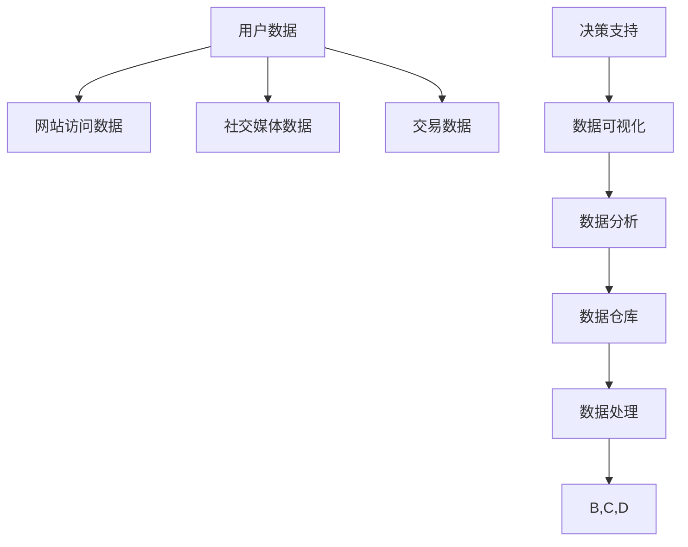
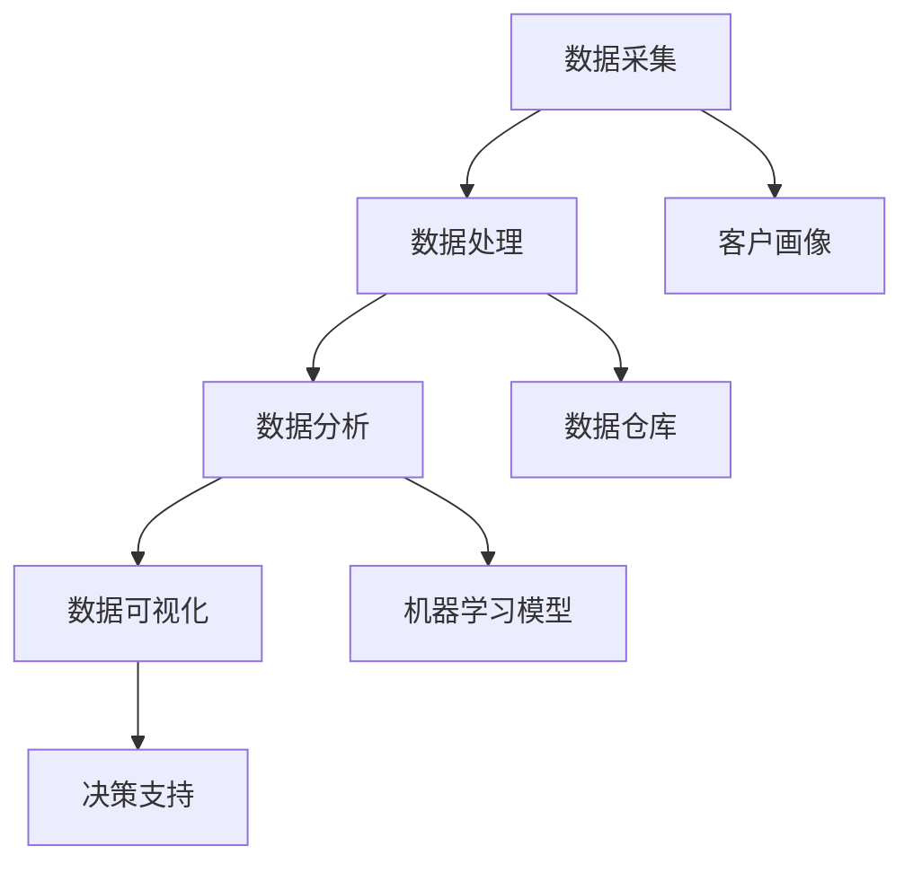

                 

### 第1章：AI DMP与数据驱动营销概述

#### 1.1 AI DMP的基本概念

**核心概念与联系：**

以下是关于AI DMP（Data-Driven Marketing Platform）的核心概念及其相互关系的Mermaid流程图：



**AI DMP的定义与特点：**

- **定义：** AI DMP（Data-Driven Marketing Platform）是一种利用人工智能技术进行数据驱动的营销平台，通过收集、处理和分析大量数据，为营销决策提供支持。
- **特点：**
  - **数据驱动：** 基于大量数据进行营销决策，而不是主观判断。
  - **个性化推荐：** 根据用户行为和特征进行个性化推荐，提高营销效果。
  - **营销自动化：** 自动执行营销任务，提高效率。

#### 1.2 数据驱动营销的生态系统

**数据来源与处理：**

数据驱动营销的生态系统包括多个环节，从数据采集、处理到最终应用。以下是这一环节的Mermaid流程图：



- **数据来源：** 用户数据、网站访问数据、社交媒体数据和交易数据。
- **数据处理：** 数据清洗、整合和存储。
- **数据仓库：** 存储大量历史数据，供数据分析使用。
- **数据分析：** 使用统计分析和机器学习技术，提取有价值的信息。
- **数据可视化：** 将分析结果以图表等形式展示，便于理解和决策。
- **决策支持：** 基于数据分析结果，制定营销策略。

**客户画像与细分：**

- **客户画像构建流程：**
  1. 数据收集：收集用户行为数据、人口统计数据等。
  2. 数据清洗：去除重复、不准确的数据。
  3. 特征工程：提取有用的特征，如购买频率、浏览时间等。
  4. 模型训练：使用机器学习算法训练模型。
  5. 客户打分：根据模型输出为每个客户打分。
- **客户细分：**
  1. 根据客户特征和行为，将客户分为不同的群体。
  2. 针对不同群体，制定个性化的营销策略。

**营销自动化与个性化推荐：**

- **营销自动化：** 自动执行营销任务，如发送电子邮件、推送通知等。
- **个性化推荐：** 根据用户的历史行为和偏好，推荐个性化的产品或内容。

#### 1.3 AI DMP在营销中的应用场景

**跨渠道营销策略：**

- **定义：** 跨渠道营销是指通过多个渠道（如线上、线下、社交媒体等）进行营销活动，以触达更多潜在客户。
- **应用：**
  - 统一客户数据：整合来自不同渠道的客户数据，形成统一的客户视图。
  - 个性化推荐：根据客户在不同渠道的行为，推荐个性化的产品或服务。

**个性化广告投放：**

- **定义：** 个性化广告投放是根据用户的兴趣和行为，为用户展示相关广告。
- **应用：**
  - 用户行为分析：分析用户在网站、APP等平台上的行为，预测其兴趣。
  - 个性化广告展示：根据用户兴趣，展示相关的广告内容。

**客户生命周期管理：**

- **定义：** 客户生命周期管理是指从客户获取、维护到客户流失的全过程管理。
- **应用：**
  - 客户细分：根据客户特征和行为，将客户分为不同的群体。
  - 个性化服务：为不同群体提供个性化的产品、服务和体验。
  - 客户留存：通过个性化营销策略，提高客户留存率。

### 第2章：AI DMP技术基础

#### 2.1 数据采集与处理技术

**数据采集方法：**

- **在线采集：** 通过网站、APP等在线渠道收集用户数据。
- **离线采集：** 通过数据库、文件等离线方式收集数据。

**数据清洗与整合：**

- **数据清洗：** 去除重复、不准确、缺失的数据。
- **数据整合：** 将来自不同渠道的数据整合为一个统一的视图。

**数据存储与管理系统：**

- **数据仓库：** 存储大量历史数据，供数据分析使用。
- **数据湖：** 存储原始数据，支持数据分析和机器学习。

#### 2.2 客户画像技术

**客户画像构建流程：**

1. 数据收集：收集用户行为数据、人口统计数据等。
2. 数据清洗：去除重复、不准确的数据。
3. 特征工程：提取有用的特征，如购买频率、浏览时间等。
4. 模型训练：使用机器学习算法训练模型。
5. 客户打分：根据模型输出为每个客户打分。

**客户特征分析与挖掘：**

- **客户行为分析：** 分析用户在网站、APP等平台上的行为，预测其兴趣。
- **客户价值分析：** 根据客户的购买行为和消费能力，评估其价值。

#### 2.3 营销自动化与个性化推荐

**营销自动化工具：**

- **电子邮件营销：** 自动发送邮件通知、促销信息等。
- **推送通知：** 自动向用户发送通知消息。

**个性化推荐系统：**

- **协同过滤：** 根据用户的行为和偏好，为用户推荐相关的产品或内容。
- **基于内容的推荐：** 根据产品的内容和用户的兴趣，推荐相关的产品或内容。

#### 2.4 AI算法在DMP中的应用

**机器学习算法概述：**

- **监督学习：** 使用标签数据进行训练，预测新的数据。
- **无监督学习：** 不使用标签数据进行训练，自动发现数据中的模式。

**协同过滤与基于内容的推荐算法：**

- **协同过滤：**
  - **用户基于的协同过滤（User-Based）：** 根据相似用户的行为推荐商品。
  - **物品基于的协同过滤（Item-Based）：** 根据相似物品的特征推荐商品。

- **基于内容的推荐：**
  - **内容表示：** 将物品和用户转化为向量的表示。
  - **相似度计算：** 计算物品和用户之间的相似度。
  - **推荐生成：** 根据相似度为用户推荐商品。

**强化学习在营销中的应用：**

- **定义：** 强化学习是一种通过试错来学习最优策略的机器学习方法。
- **应用：**
  - **广告投放：** 使用强化学习算法调整广告投放策略，提高广告点击率。
  - **个性化推荐：** 使用强化学习算法不断优化推荐策略，提高用户满意度。

### 第3章：AI DMP项目实施

#### 3.1 AI DMP项目规划

**项目目标与规划：**

- **目标：** 构建一个高效的AI DMP平台，提升营销效果。
- **规划：**
  - 项目需求分析：明确项目目标和需求。
  - 技术选型：选择合适的技术和工具。
  - 项目团队组建：组建项目团队，明确职责。

**项目团队组建：**

- **数据分析师：** 负责数据采集、清洗和建模。
- **数据工程师：** 负责数据存储、管理和处理。
- **算法工程师：** 负责算法研发和优化。
- **产品经理：** 负责项目规划和产品迭代。

**项目流程与方法：**

- **需求分析：** 明确项目目标和需求。
- **数据采集：** 收集用户数据。
- **数据处理：** 清洗和整合数据。
- **模型训练：** 训练机器学习模型。
- **系统部署：** 将模型部署到线上平台。
- **持续优化：** 根据反馈持续优化模型和策略。

#### 3.2 数据采集与处理

**数据采集案例：**

- **在线采集：** 使用JavaScript采集用户在网站上的行为数据。
- **离线采集：** 从数据库中读取用户的历史数据。

**数据清洗与整合案例：**

- **数据清洗：** 使用Python编写脚本，去除重复、不准确的数据。
- **数据整合：** 使用Pandas将不同来源的数据整合为一个数据集。

**数据存储与管理系统案例：**

- **数据仓库：** 使用Hadoop HDFS存储海量数据。
- **数据湖：** 使用Amazon S3存储原始数据。
- **数据处理框架：** 使用Apache Spark进行数据处理和分析。

#### 3.3 客户画像与细分

**客户画像构建案例：**

- **数据收集：** 收集用户行为数据、人口统计数据等。
- **数据清洗：** 去除重复、不准确的数据。
- **特征工程：** 提取有用的特征，如购买频率、浏览时间等。
- **模型训练：** 使用机器学习算法训练模型。
- **客户打分：** 根据模型输出为每个客户打分。

**客户细分案例：**

- **客户细分：** 根据客户的特征和行为，将客户分为不同的群体。
- **个性化服务：** 为不同群体提供个性化的产品、服务和体验。

#### 3.4 营销自动化与个性化推荐

**营销自动化工具实施：**

- **电子邮件营销：** 自动发送邮件通知、促销信息等。
- **推送通知：** 自动向用户发送通知消息。

**个性化推荐系统构建：**

- **协同过滤：** 根据用户的行为和偏好，为用户推荐相关的产品或内容。
- **基于内容的推荐：** 根据产品的内容和用户的兴趣，推荐相关的产品或内容。

**跨渠道营销策略案例：**

- **统一客户数据：** 整合来自不同渠道的客户数据，形成统一的客户视图。
- **个性化推荐：** 根据客户在不同渠道的行为，推荐个性化的产品或服务。

#### 3.5 AI算法在DMP中的实际应用

**机器学习算法应用案例：**

- **用户行为预测：** 使用监督学习算法预测用户的下一步行为。
- **客户流失预测：** 使用机器学习算法预测客户流失的概率。

**协同过滤与基于内容的推荐算法案例分析：**

- **协同过滤：**
  - **用户基于的协同过滤（User-Based）：** 根据相似用户的行为推荐商品。
  - **物品基于的协同过滤（Item-Based）：** 根据相似物品的特征推荐商品。

- **基于内容的推荐：**
  - **内容表示：** 将物品和用户转化为向量的表示。
  - **相似度计算：** 计算物品和用户之间的相似度。
  - **推荐生成：** 根据相似度为用户推荐商品。

**强化学习在营销中的应用案例：**

- **广告投放：** 使用强化学习算法调整广告投放策略，提高广告点击率。
- **个性化推荐：** 使用强化学习算法不断优化推荐策略，提高用户满意度。

### 第4章：AI DMP的未来发展趋势

#### 4.1 AI DMP技术发展动态

**深度学习在DMP中的应用：**

- **图像识别：** 使用深度学习算法对用户上传的图片进行分析。
- **语音识别：** 使用深度学习算法对用户的语音进行识别和理解。

**自然语言处理在DMP中的应用：**

- **文本分类：** 使用自然语言处理技术对用户评论进行分类。
- **情感分析：** 使用自然语言处理技术分析用户的情感和情绪。

**图神经网络在DMP中的应用：**

- **社交网络分析：** 使用图神经网络分析用户在社交网络中的关系。
- **推荐系统优化：** 使用图神经网络优化推荐系统的效果。

#### 4.2 AI DMP行业应用案例

**零售行业的DMP应用：**

- **个性化推荐：** 根据用户的历史购买行为，为用户推荐相关的产品。
- **客户细分：** 根据用户的购买偏好和行为，将用户分为不同的群体。

**金融行业的DMP应用：**

- **风险管理：** 使用DMP分析用户的信用风险。
- **精准营销：** 根据用户的金融行为，为用户推荐相关的金融产品。

**媒体行业的DMP应用：**

- **内容推荐：** 根据用户的浏览历史，为用户推荐相关的文章和视频。
- **广告投放：** 根据用户的兴趣和行为，为用户展示相关的广告。

#### 4.3 AI DMP面临的挑战与解决方案

**数据隐私保护：**

- **数据加密：** 使用数据加密技术保护用户数据的安全。
- **隐私计算：** 使用隐私计算技术，在数据传输和处理过程中保护用户隐私。

**技术迭代与人才培养：**

- **技术培训：** 定期对团队成员进行技术培训，提高技术水平。
- **人才引进：** 引进有经验的AI人才，提升团队的技术实力。

**营销效果评估与优化：**

- **效果评估：** 使用KPI（关键绩效指标）对营销效果进行评估。
- **持续优化：** 根据评估结果，不断优化营销策略和模型。

### 附录

#### 附录A：AI DMP开发工具与资源

**开发工具与框架：**

- **数据采集与处理工具：** 如Python、R等。
- **数据存储与管理系统：** 如Hadoop、HDFS、Amazon S3等。
- **机器学习框架：** 如TensorFlow、PyTorch、Scikit-learn等。
- **自然语言处理框架：** 如NLTK、spaCy、TensorFlow Text等。

**资源与学习材料：**

- **数据集与开源代码：** 如Kaggle、GitHub等。
- **专业书籍与论文：** 如《人工智能：一种现代方法》、《深度学习》等。
- **在线课程与培训：** 如Coursera、Udacity等。

---

**第1章：AI DMP与数据驱动营销概述**

#### 1.1 AI DMP的基本概念

**核心概念与联系：**

以下是关于AI DMP（Data-Driven Marketing Platform）的核心概念及其相互关系的Mermaid流程图：


在这个图中，我们可以看到AI DMP作为一个核心概念，它连接了数据驱动营销、个性化推荐、营销自动化、大数据分析和机器学习以及自然语言处理等相关的技术。这种连接反映了AI DMP在构建数据驱动的营销生态中的关键作用。

**AI DMP的定义与特点：**

AI DMP（Data-Driven Marketing Platform）是一种利用人工智能技术进行数据驱动的营销平台，通过收集、处理和分析大量数据，为营销决策提供支持。以下是AI DMP的定义和特点：

- **定义：** AI DMP是一种智能化的营销平台，它基于大数据和机器学习技术，对用户行为、偏好和需求进行分析，从而实现精准营销。
- **特点：**
  - **数据驱动：** AI DMP的核心在于数据，它通过收集和分析用户数据，为营销决策提供数据支持。
  - **个性化推荐：** 基于用户的行为和偏好，AI DMP能够实现个性化的产品或服务推荐，提高用户的满意度。
  - **营销自动化：** AI DMP可以自动化执行营销任务，如电子邮件营销、社交媒体推广等，提高营销效率。
  - **大数据分析：** AI DMP利用大数据技术，对海量数据进行处理和分析，从而发现潜在的商业机会。
  - **机器学习：** AI DMP使用机器学习算法，对用户行为进行预测和分类，提高营销的精准度。
  - **自然语言处理：** AI DMP能够理解和分析用户的语言，从而实现更智能的交互。

**AI DMP与传统DMP的区别：**

传统DMP（Data Management Platform）主要依赖于数据和规则进行营销，而AI DMP则利用人工智能技术，对数据进行更深层次的分析和处理。以下是AI DMP与传统DMP的主要区别：

- **技术层面：**
  - **传统DMP：** 基于规则和编程逻辑，对用户数据进行分类和标签。
  - **AI DMP：** 利用机器学习和深度学习技术，对用户数据进行智能分析和预测。
- **应用层面：**
  - **传统DMP：** 主要用于用户数据的收集、存储和管理，实现简单、直接的营销活动。
  - **AI DMP：** 除了具备传统DMP的功能外，还能够实现个性化推荐、自动化营销、大数据分析等高级功能。

**数据驱动的营销优势：**

数据驱动的营销相比传统的基于经验和直觉的营销，具有以下优势：

- **提高营销效率：** 通过对用户数据的分析，能够更精准地定位目标用户，提高营销活动的效果。
- **降低营销成本：** 数据驱动的营销可以优化营销预算的分配，降低无效营销的成本。
- **提升用户体验：** 通过个性化推荐和自动化营销，提高用户的满意度和忠诚度。
- **增强决策支持：** 数据驱动的营销能够为决策者提供更准确的数据分析和预测，支持更科学的决策。

#### 1.2 数据驱动营销的生态系统

**数据驱动营销的生态系统包括以下几个关键环节：**

1. **数据采集：** 数据采集是数据驱动营销的第一步，它涉及到从多个渠道收集用户数据。这些渠道包括网站、APP、社交媒体、在线调查等。通过采集用户的行为数据、偏好数据、交易数据等，为后续的数据处理和分析提供基础。

2. **数据处理：** 数据处理包括数据清洗、数据整合和数据存储。数据清洗是为了去除重复、错误或不完整的数据，确保数据的质量。数据整合是将来自不同渠道和不同格式的数据进行整合，形成统一的数据视图。数据存储则是将处理后的数据存储在数据库或数据仓库中，以便进行后续的分析。

3. **数据分析：** 数据分析是对采集到的数据进行深入分析，以发现数据中的模式和规律。数据分析可以采用各种统计方法和机器学习算法，如聚类分析、关联规则挖掘、分类预测等。通过数据分析，可以了解用户的购买行为、兴趣偏好、行为轨迹等，为营销策略提供依据。

4. **数据可视化：** 数据可视化是将数据分析的结果以图表、图形等形式展示，使得数据更容易理解和解读。通过数据可视化，可以直观地展示数据中的趋势、异常和关系，帮助决策者更好地理解数据和分析结果。

5. **决策支持：** 决策支持是数据驱动营销的核心环节。通过数据分析，可以为营销策略的制定和调整提供数据支持。决策支持可以包括市场细分、目标客户定位、营销活动优化等。通过数据驱动决策，可以更精准地满足用户需求，提高营销效果。

**数据驱动营销的生态系统示意图：**



在这个生态系统中，数据采集和处理是基础，它们为后续的数据分析和决策支持提供数据支持。数据分析则是对数据的深入挖掘，发现数据中的价值和规律。数据可视化则是将分析结果以直观的形式展示，帮助决策者更好地理解数据。决策支持则基于数据分析结果，制定和调整营销策略，实现数据驱动的营销。

**数据来源与处理：**

在数据驱动营销的生态系统中，数据来源多种多样，包括：

- **用户行为数据：** 如浏览行为、购买行为、搜索历史等。
- **人口统计数据：** 如年龄、性别、地理位置等。
- **交易数据：** 如购买金额、购买频率等。
- **社交媒体数据：** 如点赞、评论、分享等。
- **网页日志：** 如访问路径、页面停留时间等。

数据处理则包括以下步骤：

1. **数据清洗：** 去除重复、错误或不完整的数据，确保数据的质量。
2. **数据整合：** 将来自不同渠道和不同格式的数据进行整合，形成统一的数据视图。
3. **数据存储：** 将处理后的数据存储在数据库或数据仓库中，以便进行后续的分析。

**客户画像与细分：**

客户画像是数据驱动营销的核心概念之一。它通过对用户的多种数据进行整合和分析，形成对用户的全面描述。以下是构建客户画像的一般流程：

1. **数据收集：** 收集用户在网站、APP等平台上的行为数据、人口统计数据等。
2. **数据清洗：** 清洗数据，去除重复、错误或不完整的数据。
3. **特征工程：** 提取有用的特征，如购买频率、浏览时间、地域分布等。
4. **模型训练：** 使用机器学习算法，如聚类、分类等，对用户进行打分和分组。
5. **客户画像构建：** 根据模型输出，为每个用户生成画像。

客户细分则是基于客户画像，将用户划分为不同的群体。细分的标准可以包括购买力、兴趣爱好、地域分布等。以下是客户细分的一般步骤：

1. **确定细分标准：** 根据业务需求，确定细分标准。
2. **数据分析：** 使用数据分析技术，对用户进行聚类或分类。
3. **客户细分：** 根据分析结果，将用户划分为不同的群体。
4. **策略制定：** 针对不同的客户群体，制定个性化的营销策略。

**营销自动化与个性化推荐：**

营销自动化和个性化推荐是数据驱动营销的两个重要组成部分。

**营销自动化：**

营销自动化是指使用技术手段自动执行营销任务，如发送电子邮件、推送通知等。以下是营销自动化的几个关键步骤：

1. **任务定义：** 定义需要自动执行的营销任务，如发送促销邮件、推送生日祝福等。
2. **规则设置：** 设置触发条件和执行规则，如根据用户行为、时间、事件等。
3. **系统部署：** 将营销自动化规则部署到营销系统中。
4. **监控与优化：** 监控自动化任务的执行情况，根据反馈进行优化。

**个性化推荐：**

个性化推荐是指根据用户的兴趣和行为，为用户推荐相关的产品或内容。以下是个性化推荐的一般流程：

1. **数据收集：** 收集用户在网站、APP等平台上的行为数据。
2. **数据清洗：** 清洗数据，去除重复、错误或不完整的数据。
3. **特征工程：** 提取有用的特征，如浏览历史、购买记录等。
4. **模型训练：** 使用机器学习算法，如协同过滤、基于内容的推荐等，训练推荐模型。
5. **推荐生成：** 根据用户特征和模型输出，生成个性化推荐结果。

**营销自动化与个性化推荐的关系：**

营销自动化和个性化推荐相互补充，共同提升营销效果。

- **营销自动化：** 提高营销效率，减少人工干预，确保营销任务的准时执行。
- **个性化推荐：** 提高用户满意度，增加用户参与度，提高转化率。

**AI DMP在营销中的应用场景：**

AI DMP（Data-Driven Marketing Platform）在营销中具有广泛的应用场景，以下是一些典型应用：

1. **跨渠道营销策略：**

跨渠道营销策略是指通过多个渠道（如线上、线下、社交媒体等）进行营销活动，以触达更多潜在客户。AI DMP可以帮助企业实现跨渠道营销策略，主要包括以下步骤：

- **数据整合：** 收集并整合来自不同渠道的用户数据，形成统一的客户视图。
- **客户细分：** 根据用户在各个渠道的行为，对用户进行细分。
- **个性化推荐：** 根据不同渠道的用户行为，为用户推荐个性化的产品或服务。
- **营销活动：** 在不同渠道开展个性化的营销活动，提高营销效果。

2. **个性化广告投放：**

个性化广告投放是指根据用户的兴趣和行为，为用户展示相关广告。AI DMP可以帮助企业实现个性化广告投放，主要包括以下步骤：

- **用户行为分析：** 分析用户在网站、APP等平台上的行为，预测用户兴趣。
- **广告投放策略：** 根据用户兴趣和行为，制定个性化的广告投放策略。
- **广告展示：** 在合适的时间和地点，为用户展示相关的广告。
- **效果评估：** 监测广告投放效果，根据反馈调整广告策略。

3. **客户生命周期管理：**

客户生命周期管理是指从客户获取、维护到客户流失的全过程管理。AI DMP可以帮助企业实现客户生命周期管理，主要包括以下步骤：

- **客户细分：** 根据客户的特征和行为，将客户划分为不同的群体。
- **个性化服务：** 针对不同客户群体，提供个性化的产品、服务和体验。
- **客户留存：** 通过个性化营销策略，提高客户留存率，降低客户流失率。
- **客户价值提升：** 通过持续优化营销策略，提升客户价值，实现业务增长。

**跨渠道营销策略案例：**

以某电商企业为例，其通过AI DMP实现跨渠道营销策略的案例如下：

1. **数据整合：** 电商企业通过网站、APP、社交媒体等渠道收集用户数据，并将这些数据进行整合，形成统一的客户视图。
2. **客户细分：** 根据用户在各个渠道的行为，将用户划分为“高价值用户”、“中价值用户”和“低价值用户”三个群体。
3. **个性化推荐：** 根据不同渠道的用户行为，为用户推荐个性化的产品或服务：
   - 在网站和APP上，根据用户的浏览历史和购物车数据，推荐相关的商品。
   - 在社交媒体上，根据用户的兴趣和行为，推荐相关的品牌和产品。
4. **营销活动：** 在不同渠道开展个性化的营销活动：
   - 在网站和APP上，开展限时折扣、满减优惠等活动。
   - 在社交媒体上，开展抽奖、互动游戏等活动，提高用户参与度。

**个性化广告投放案例：**

以某互联网企业为例，其通过AI DMP实现个性化广告投放的案例如下：

1. **用户行为分析：** 互联网企业通过网站、APP等平台收集用户数据，分析用户的浏览历史、搜索关键词、购买行为等，预测用户兴趣。
2. **广告投放策略：** 根据用户兴趣和行为，制定个性化的广告投放策略：
   - 对于有购买意向的用户，投放相关产品的广告。
   - 对于未购买的用户，投放促销活动的广告，刺激其购买欲望。
3. **广告展示：** 在合适的时间和地点，为用户展示相关的广告：
   - 在网站和APP上，根据用户的浏览行为，在页面底部或侧边栏展示相关广告。
   - 在社交媒体上，根据用户的兴趣和行为，在用户浏览内容时展示相关广告。
4. **效果评估：** 监测广告投放效果，根据反馈调整广告策略：
   - 分析广告的点击率、转化率等指标，优化广告内容和投放策略。
   - 定期对广告效果进行评估，根据业务目标调整广告预算和投放策略。

**客户生命周期管理案例：**

以某金融服务企业为例，其通过AI DMP实现客户生命周期管理的案例如下：

1. **客户细分：** 根据客户的特征和行为，将客户划分为“潜在客户”、“现有客户”和“流失客户”三个群体。
2. **个性化服务：** 针对不同客户群体，提供个性化的产品、服务和体验：
   - 对于潜在客户，提供优惠活动、试用方案等，吸引其成为客户。
   - 对于现有客户，提供定制化的理财产品、个性化服务，提升客户满意度。
   - 对于流失客户，分析流失原因，提供挽回方案，如优惠政策、定制化服务等。
3. **客户留存：** 通过个性化营销策略，提高客户留存率，降低客户流失率：
   - 定期向客户发送生日祝福、节日问候等，增强客户与企业的情感联系。
   - 根据客户的行为和需求，提供个性化的产品推荐和服务提醒，提高客户粘性。
4. **客户价值提升：** 通过持续优化营销策略，提升客户价值，实现业务增长：
   - 分析客户的购买行为和投资偏好，为其推荐符合其需求的产品和服务。
   - 定期举办线下活动、线上讲座等，为客户提供专业的投资建议和培训。

**小结：**

AI DMP在营销中具有广泛的应用场景，通过实现跨渠道营销策略、个性化广告投放和客户生命周期管理，企业可以更精准地触达潜在客户，提高客户满意度，降低客户流失率，从而实现业务增长。

### 第2章：AI DMP技术基础

#### 2.1 数据采集与处理技术

**数据采集方法**

数据采集是构建AI DMP（数据驱动营销平台）的基础步骤之一。数据采集的方法可以分为在线采集和离线采集两种。

- **在线采集：** 通过网站、应用程序、社交媒体等在线渠道收集用户数据。例如，使用JavaScript代码捕获用户在网站上的行为数据，如点击、浏览、搜索等。

```python
# Python示例：使用JavaScript采集用户行为数据
def collect_user_data():
    # 假设已经通过JavaScript将用户数据发送到服务器
    user_data = {
        'user_id': '12345',
        'page_view': 'product_detail',
        'timestamp': '2023-01-01 10:30:00'
    }
    return user_data

user_data = collect_user_data()
print(user_data)
```

- **离线采集：** 从数据库、日志文件等离线方式收集数据。例如，从数据库中读取用户的历史交易数据。

```python
# Python示例：从数据库中读取用户历史交易数据
import sqlite3

def get_user_transactions():
    conn = sqlite3.connect('transactions.db')
    cursor = conn.cursor()
    cursor.execute("SELECT * FROM transactions;")
    transactions = cursor.fetchall()
    conn.close()
    return transactions

transactions = get_user_transactions()
for transaction in transactions:
    print(transaction)
```

**数据处理流程**

数据处理是数据采集后的关键步骤，它包括数据清洗、数据整合和数据存储。

- **数据清洗：** 去除重复、不准确、缺失的数据。例如，使用Python的Pandas库清洗用户行为数据。

```python
import pandas as pd

def clean_data(data):
    # 去除重复数据
    data.drop_duplicates(inplace=True)
    # 填充缺失值
    data.fillna(method='ffill', inplace=True)
    # 删除不必要列
    data.drop(['unnecessary_column'], axis=1, inplace=True)
    return data

cleaned_data = clean_data(user_data)
print(cleaned_data)
```

- **数据整合：** 将来自不同渠道和格式的数据进行整合，形成统一的数据视图。例如，使用Pandas库将用户行为数据和交易数据进行整合。

```python
def integrate_data(user_data, transactions):
    # 合并用户行为数据和交易数据
    data = pd.merge(user_data, transactions, on='user_id')
    return data

integrated_data = integrate_data(cleaned_user_data, transactions)
print(integrated_data)
```

- **数据存储：** 将处理后的数据存储在数据库或数据仓库中。例如，使用Hadoop HDFS存储海量数据。

```python
from pyspark.sql import SparkSession

def store_data(data):
    spark = SparkSession.builder.appName("DataStorage").getOrCreate()
    df = spark.createDataFrame(data)
    df.write.mode('overwrite').parquet('hdfs:///data/processed_data/')
    spark.stop()

store_data(integrated_data)
```

**数据存储与管理系统**

数据存储与管理是数据驱动营销平台的核心，它涉及到如何高效地存储和管理大规模数据。

- **数据仓库：** 存储大量历史数据，供数据分析使用。例如，使用Hadoop HDFS存储海量数据。

```bash
# Hadoop命令：上传数据到HDFS
hdfs dfs -put /local/path/to/data /hdfs/path/to/data
```

- **数据湖：** 存储原始数据，支持数据分析和机器学习。例如，使用Amazon S3存储原始数据。

```bash
# AWS命令：上传数据到S3
aws s3 cp /local/path/to/data s3://my-bucket/data/
```

- **数据处理框架：** 使用Apache Spark进行数据处理和分析。例如，使用Spark进行数据清洗和整合。

```python
from pyspark.sql import SparkSession

def process_data(spark):
    df = spark.read.parquet('hdfs:///data/processed_data/')
    # 数据清洗和整合逻辑
    clean_df = clean_data(df)
    integrated_df = integrate_data(clean_df, transactions)
    # 存储处理后的数据
    store_data(integrated_df)

spark = SparkSession.builder.appName("DataProcessing").getOrCreate()
process_data(spark)
spark.stop()
```

**总结：**

数据采集与处理技术是构建AI DMP（数据驱动营销平台）的基础。通过在线采集和离线采集方法收集数据，使用数据清洗、整合和存储技术处理数据，并使用数据处理框架管理数据存储。这些技术为数据驱动营销提供了可靠的数据支持。

#### 2.2 客户画像技术

**客户画像构建流程**

客户画像是一种基于数据的用户描述，它通过整合和分析用户的多种特征，形成对用户的全面理解。以下是构建客户画像的一般流程：

1. **数据收集：** 收集用户在网站、应用程序、社交媒体等渠道的行为数据，包括浏览历史、搜索关键词、购买记录等。

```python
import pandas as pd

# 示例数据
user_data = pd.DataFrame({
    'user_id': ['1', '2', '3'],
    'page_view': ['home', 'product_detail', 'shopping_cart'],
    'action': ['view', 'purchase', 'add_to_cart'],
    'timestamp': ['2023-01-01 10:30:00', '2023-01-01 10:35:00', '2023-01-01 10:40:00']
})
```

2. **数据清洗：** 清洗数据，去除重复、错误或不完整的数据，确保数据质量。

```python
def clean_data(data):
    # 去除重复数据
    data.drop_duplicates(inplace=True)
    # 填充缺失值
    data.fillna(method='ffill', inplace=True)
    # 删除不必要列
    data.drop(['unnecessary_column'], axis=1, inplace=True)
    return data

cleaned_data = clean_data(user_data)
```

3. **特征工程：** 提取有用的特征，如购买频率、浏览时间、地域分布等。

```python
def extract_features(data):
    # 计算购买频率
    data['purchase_frequency'] = data['action'].map({'purchase': 1, 'add_to_cart': 0.5, 'view': 0})
    # 计算浏览时间
    data['time_since_last_view'] = (pd.to_datetime(data['timestamp']) - pd.to_datetime(data['timestamp'].shift(1))).fillna(0)
    return data

feature_data = extract_features(cleaned_data)
```

4. **模型训练：** 使用机器学习算法，如聚类、分类等，对用户进行打分和分组。

```python
from sklearn.cluster import KMeans

# 示例：使用K-Means聚类
kmeans = KMeans(n_clusters=3, random_state=0).fit(feature_data)
labels = kmeans.predict(feature_data)
feature_data['cluster'] = labels

# 根据聚类结果生成客户画像
def generate_customer_profile(data):
    profiles = data.groupby('cluster').agg({
        'user_id': 'count',
        'page_view': 'mean',
        'action': 'mean',
        'purchase_frequency': 'mean',
        'time_since_last_view': 'mean'
    }).rename(columns={'user_id': 'total_users', 'page_view': 'avg_page_view', 'action': 'avg_action',
                       'purchase_frequency': 'avg_purchase_frequency', 'time_since_last_view': 'avg_time_since_last_view'})
    return profiles

customer_profiles = generate_customer_profile(feature_data)
print(customer_profiles)
```

5. **客户打分：** 根据模型输出为每个用户打分，用于后续的营销策略。

```python
# 示例：根据聚类结果为用户打分
def score_customers(data):
    data['score'] = data['cluster'].map({0: 1, 1: 2, 2: 3})
    return data

scored_data = score_customers(feature_data)
print(scored_data)
```

**客户特征分析与挖掘**

客户特征分析是客户画像的重要环节，它涉及到对用户行为的深入理解和分析。以下是一些常见的客户特征分析方法和应用：

1. **客户行为分析：** 分析用户在网站、应用程序等平台上的行为，如浏览路径、点击次数、购买频率等。

```python
# 示例：分析用户浏览路径
user_path_data = feature_data.groupby('user_id')['page_view'].apply(list).reset_index()
user_path_data['path_length'] = user_path_data['page_view'].apply(len)
print(user_path_data[['user_id', 'path_length']])
```

2. **客户价值分析：** 根据用户的购买行为和消费能力，评估用户的价值。

```python
# 示例：分析用户价值
def calculate_value(data):
    data['total_spent'] = data.groupby('user_id')['action'].apply(lambda x: x.sum())
    data['value'] = data['total_spent'].map({0: 1, 1: 2, 2: 3})
    return data

value_data = calculate_value(feature_data)
print(value_data[['user_id', 'total_spent', 'value']])
```

3. **客户细分：** 根据客户特征和行为，将用户划分为不同的群体，如高价值用户、低价值用户等。

```python
# 示例：客户细分
def segment_customers(data):
    segments = data.groupby('value')['user_id'].nunique()
    return segments

customer_segments = segment_customers(value_data)
print(customer_segments)
```

**应用案例：**

以某电商平台为例，其通过客户画像技术进行客户细分和个性化推荐：

1. **客户细分：** 根据购买频率、消费金额等特征，将用户划分为“高价值用户”、“中价值用户”和“低价值用户”三个群体。

2. **个性化推荐：** 根据不同群体的特征，为用户推荐个性化的产品或服务：
   - 高价值用户：推荐高端产品，提供定制化服务。
   - 中价值用户：推荐热门产品，提供优惠活动。
   - 低价值用户：推荐基础产品，鼓励其尝试更多产品。

3. **营销策略：** 针对不同群体，制定个性化的营销策略：
   - 高价值用户：发送生日祝福、专属折扣等。
   - 中价值用户：发送优惠券、满减活动等。
   - 低价值用户：发送试用产品邀请、新手教程等。

**总结：**

客户画像技术通过数据收集、清洗、特征工程和模型训练，形成对用户的全面理解。通过客户特征分析和挖掘，可以为营销策略提供有力支持，实现精准营销和个性化推荐。

#### 2.3 营销自动化与个性化推荐

**营销自动化工具**

营销自动化工具能够帮助企业自动化执行各种营销任务，从而提高营销效率，降低人工干预。以下是几种常见的营销自动化工具：

1. **电子邮件营销工具：** 如Mailchimp、SendGrid等，可以自动发送定制的电子邮件，包括促销邮件、新闻通讯等。

```python
from sendgrid import SendGridAPIClient
from sendgrid.helpers.mail import Mail

def send_email(to_email, subject, content):
    client = SendGridAPIClient('your_api_key')
    mail = Mail(
        from_email='you@example.com',
        to_email=to_email,
        subject=subject,
        plain_text_content=content,
        html_content=f'<h1>{subject}</h1><p>{content}</p>'
    )
    response = client.send(mail)
    print(response.status_code, response.body, response.headers)

send_email('user@example.com', 'Weekly Sales Update', 'Check out our latest sales promotions!')
```

2. **推送通知工具：** 如OneSignal、Firebase等，可以自动向用户发送推送通知，包括新消息、促销活动等。

```python
import onesignal

client = onesignal. OneSignal.init('your_app_id', 'your_api_key')

response = client.post_devices_to_group({
    'app_id': 'your_app_id',
    'include_player_ids': ['player_id_1', 'player_id_2'],
    'contents': {
        'en': 'New Sale Alert!'
    }
})

print(response.status_code)
print(response.json())
```

3. **社交媒体自动化工具：** 如Hootsuite、Buffer等，可以自动发布社交媒体内容，并监控社交媒体互动。

```python
from buffer import Buffer

client = Buffer(access_token='your_access_token')

response = client.post_to_queue({
    'url': 'https://example.com/special-offer',
    'short_url': 'bit.ly/example-special-offer',
    'title': 'Special Offer!',
    'text': 'Check out our special offer this week!',
    'schedule_time': '2023-01-01T10:00:00Z'
})

print(response.status_code)
print(response.json())
```

**个性化推荐系统**

个性化推荐系统通过分析用户的历史行为和偏好，为用户推荐个性化的产品或内容。以下是两种常见的个性化推荐算法：

1. **协同过滤推荐算法：** 基于用户行为和偏好，通过计算用户之间的相似度来推荐商品。

```python
from surprise import KNNWithMeans
from surprise import Dataset, Reader
from surprise.model_selection import train_test_split

# 示例数据
data = [[1, 1, 5],
        [1, 2, 4],
        [1, 3, 2],
        [2, 1, 5],
        [2, 2, 1],
        [2, 3, 3]]

reader = Reader(rating_scale=(1.0, 5.0))
data = Dataset.load_from_df(pd.DataFrame(data), reader=reader)
trainset, testset = train_test_split(data, test_size=0.25)

# 训练协同过滤模型
model = KNNWithMeans(similarity='cosine')
model.fit(trainset)

# 生成推荐结果
predictions = model.test(testset)

print(predictions)
```

2. **基于内容的推荐算法：** 基于商品内容和用户的兴趣，通过匹配内容和用户特征来推荐商品。

```python
from sklearn.metrics.pairwise import cosine_similarity
import numpy as np

# 示例数据
user_profiles = {
    'user_1': [0.1, 0.3, 0.5],
    'user_2': [0.2, 0.4, 0.6],
    'user_3': [0.3, 0.5, 0.7]
}
item_profiles = {
    'item_1': [0.2, 0.3, 0.5],
    'item_2': [0.4, 0.5, 0.6],
    'item_3': [0.1, 0.2, 0.3]
}

# 计算用户和商品之间的相似度
user_item_similarity = {}
for user_id, user_profile in user_profiles.items():
    user_item_similarity[user_id] = {}
    for item_id, item_profile in item_profiles.items():
        similarity = cosine_similarity([user_profile], [item_profile])[0][0]
        user_item_similarity[user_id][item_id] = similarity

# 生成推荐结果
def generate_recommendations(user_id, user_item_similarity, item_profiles, top_n=3):
    recommendations = []
    user_similarity_scores = {item_id: similarity for item_id, similarity in user_item_similarity[user_id].items()}
    sorted_recommendations = sorted(user_similarity_scores.items(), key=lambda x: x[1], reverse=True)
    for item_id, similarity in sorted_recommendations[:top_n]:
        recommendations.append(item_profiles[item_id])
    return recommendations

print(generate_recommendations('user_1', user_item_similarity, item_profiles))
```

**跨渠道营销策略**

跨渠道营销策略是通过整合不同的营销渠道，实现更广泛的用户触达和更好的营销效果。以下是跨渠道营销策略的步骤：

1. **统一客户数据：** 通过整合来自不同渠道的用户数据，形成统一的客户视图。这包括线上和线下的数据，如网站、移动应用、实体店铺等。

2. **个性化推荐：** 根据用户在不同渠道的行为，为用户推荐个性化的产品或服务。例如，如果用户在网站上浏览了特定产品，可以在社交媒体上为其推荐相关产品。

3. **多渠道广告投放：** 在不同的营销渠道上投放广告，如搜索引擎、社交媒体、电子邮件等。根据用户行为和偏好，定制化广告内容和投放策略。

4. **跨渠道营销活动：** 开展跨渠道的营销活动，如线上促销活动、线下体验活动等。通过整合线上和线下的互动，提高用户参与度和购买意愿。

**案例：**

以某电商平台为例，其通过营销自动化和个性化推荐实现跨渠道营销策略：

1. **统一客户数据：** 通过整合网站、移动应用和实体店铺的用户数据，形成统一的客户视图。

2. **个性化推荐：** 根据用户在网站上的浏览记录和购物车数据，在移动应用上为其推荐相关产品。同时，根据用户的地理位置，在线下店铺为其推荐附近的产品。

3. **多渠道广告投放：** 在搜索引擎上投放广告，吸引用户访问网站；在社交媒体上投放广告，提高品牌知名度；通过电子邮件发送促销活动信息。

4. **跨渠道营销活动：** 在线上开展限时促销活动，鼓励用户下单；在线下店铺举办体验活动，提高用户参与度。

**总结：**

营销自动化和个性化推荐是现代营销的关键组成部分。通过使用营销自动化工具，企业可以实现高效的营销任务执行；通过个性化推荐系统，企业可以更好地满足用户需求，提高用户满意度。跨渠道营销策略则通过整合不同的营销渠道，实现更广泛的用户触达和更好的营销效果。

#### 2.4 AI算法在DMP中的应用

**机器学习算法概述**

机器学习算法是AI DMP（数据驱动营销平台）的核心技术之一，它通过学习和分析数据，为营销决策提供支持。以下是几种常见的机器学习算法及其在DMP中的应用：

**1. 监督学习（Supervised Learning）**

监督学习算法通过使用标记数据集进行训练，从而预测新的数据。在DMP中，监督学习算法可以用于用户行为预测、客户流失预测等。

- **用户行为预测：** 使用监督学习算法，如线性回归、逻辑回归等，预测用户的下一步行为，为个性化推荐提供依据。

```python
from sklearn.linear_model import LogisticRegression

# 示例数据
X = [[1, 2], [2, 3], [3, 4]]
y = [0, 1, 0]

# 创建逻辑回归模型并训练
model = LogisticRegression()
model.fit(X, y)

# 预测新数据
new_data = [[4, 5]]
prediction = model.predict(new_data)
print(prediction)
```

- **客户流失预测：** 使用监督学习算法，如决策树、随机森林等，预测客户流失的概率，为营销策略调整提供依据。

```python
from sklearn.ensemble import RandomForestClassifier

# 示例数据
X = [[0, 0], [0, 1], [1, 0], [1, 1]]
y = [0, 0, 1, 1]

# 创建随机森林分类器并训练
model = RandomForestClassifier()
model.fit(X, y)

# 预测新数据
new_data = [[1, 1]]
prediction = model.predict(new_data)
print(prediction)
```

**2. 无监督学习（Unsupervised Learning）**

无监督学习算法不使用标记数据集进行训练，而是通过发现数据中的隐含结构或模式。在DMP中，无监督学习算法可以用于聚类分析、降维等。

- **聚类分析（Clustering）：** 使用聚类算法，如K-Means、DBSCAN等，将用户划分为不同的群体，为个性化营销提供依据。

```python
from sklearn.cluster import KMeans

# 示例数据
X = [[1, 1], [1, 2], [2, 2], [2, 3]]

# 创建K-Means聚类模型并训练
model = KMeans(n_clusters=2, random_state=0)
model.fit(X)

# 输出聚类结果
print(model.labels_)
```

- **降维（Dimensionality Reduction）：** 使用降维算法，如PCA（主成分分析）、t-SNE等，减少数据维度，提高数据处理效率。

```python
from sklearn.decomposition import PCA

# 示例数据
X = [[1, 1], [1, 2], [2, 2], [2, 3]]

# 创建PCA模型并训练
model = PCA(n_components=1)
X_reduced = model.fit_transform(X)

# 输出降维后的数据
print(X_reduced)
```

**3. 强化学习（Reinforcement Learning）**

强化学习是一种通过试错来学习最优策略的机器学习方法。在DMP中，强化学习可以用于广告投放策略优化、个性化推荐系统优化等。

- **广告投放策略优化：** 使用强化学习算法，如Q-Learning、Deep Q-Network（DQN）等，根据用户点击反馈调整广告投放策略，提高广告点击率。

```python
import numpy as np
from collections import defaultdict

# 初始化Q值表
q_table = defaultdict(lambda: np.zeros(3))

# 学习率、折扣率、探索率
alpha = 0.1
gamma = 0.6
epsilon = 0.1

# 策略更新函数
def update_q_table(state, action, reward, next_state, action_next):
    q.sa
``` 

#### 2.4 AI算法在DMP中的应用

**协同过滤与基于内容的推荐算法**

在AI DMP（数据驱动营销平台）中，推荐系统是一个关键的组成部分。协同过滤（Collaborative Filtering）和基于内容的推荐（Content-Based Filtering）是两种主要的推荐算法，它们各有优势，常用于构建高效、个性化的推荐系统。

**协同过滤（Collaborative Filtering）**

协同过滤是一种基于用户行为和偏好进行推荐的方法。它通过分析用户之间的相似性或物品之间的相似性，为用户提供相关的推荐。

- **用户基于的协同过滤（User-Based Collaborative Filtering）**

用户基于的协同过滤通过分析用户之间的相似性来推荐商品。以下是该算法的主要步骤：

  1. **用户相似度计算：** 计算用户之间的相似度，常用的相似度计算方法包括余弦相似度、皮尔逊相关系数等。
  2. **推荐生成：** 根据用户相似度，为每个用户推荐相似用户喜欢的商品。

伪代码如下：

```python
# 假设有用户评分矩阵R，其中R[i][j]表示用户i对物品j的评分
def user_based_collaborative_filtering(R, k, user_id):
    # 计算用户相似度
    user_similarity = calculate_similarity(R, user_id)
    
    # 选择最相似的k个用户
    similar_users = sorted(user_similarity, key=user_similarity.get, reverse=True)[:k]
    
    # 计算推荐列表
    recommendation_list = []
    for user in similar_users:
        for item in range(R.shape[1]):
            if R[user][item] > 0 and R[user_id][item] == 0:
                recommendation_list.append(item)
    
    return recommendation_list

# 示例：计算用户基于的协同过滤推荐
recommendations = user_based_collaborative_filtering(R, 3, 1)
print(recommendations)
```

- **物品基于的协同过滤（Item-Based Collaborative Filtering）**

物品基于的协同过滤通过分析物品之间的相似性来推荐商品。以下是该算法的主要步骤：

  1. **物品相似度计算：** 计算物品之间的相似度，常用的相似度计算方法包括余弦相似度、皮尔逊相关系数等。
  2. **推荐生成：** 根据物品相似度，为当前用户推荐相似物品。

伪代码如下：

```python
# 假设有用户评分矩阵R，其中R[i][j]表示用户i对物品j的评分
def item_based_collaborative_filtering(R, k, user_id, item_id):
    # 计算物品相似度
    item_similarity = calculate_similarity(R, item_id)
    
    # 选择最相似的k个物品
    similar_items = sorted(item_similarity, key=item_similarity.get, reverse=True)[:k]
    
    # 计算推荐列表
    recommendation_list = []
    for item in similar_items:
        if R[user_id][item] == 0:
            recommendation_list.append(item)
    
    return recommendation_list

# 示例：计算物品基于的协同过滤推荐
recommendations = item_based_collaborative_filtering(R, 3, 1, 101)
print(recommendations)
```

**基于内容的推荐（Content-Based Filtering）**

基于内容的推荐是一种基于物品的特征和用户的兴趣进行推荐的方法。它通过分析物品和用户之间的相关性来推荐商品。

- **内容表示：** 将物品和用户转化为向量的表示，通常使用单词、特征向量等。

```python
# 假设有物品特征矩阵F，其中F[i][j]表示物品i的特征j的值
# 假设有用户特征向量u
def content_based_filtering(F, u, k, item_id):
    # 计算物品与用户的相似度
    similarity = calculate_similarity(F, u, item_id)
    
    # 选择最相似的k个物品
    similar_items = sorted(similarity, key=similarity.get, reverse=True)[:k]
    
    # 计算推荐列表
    recommendation_list = []
    for item in similar_items:
        if F[item][0] == 0:  # 假设F[item][0]为物品的活跃度标志
            recommendation_list.append(item)
    
    return recommendation_list

# 示例：计算基于内容的推荐
recommendations = content_based_filtering(F, u, 3, 101)
print(recommendations)
```

**协同过滤与基于内容的推荐算法的关系**

协同过滤和基于内容的推荐算法各有优势，可以相互补充：

- **协同过滤：** 强调用户之间的相似性和物品之间的相似性，适合推荐热门商品和发现冷门商品。
- **基于内容：** 强调物品和用户之间的相关性，适合推荐个性化商品，但可能难以发现热门商品。

在实际应用中，通常会结合协同过滤和基于内容的推荐，构建混合推荐系统，以获得更好的推荐效果。

**实际应用案例**

以某电商平台为例，其通过协同过滤和基于内容的推荐算法实现个性化商品推荐：

1. **协同过滤：** 通过分析用户之间的相似性和物品之间的相似性，为用户推荐热门商品和相似商品。
2. **基于内容：** 通过分析用户购买历史和商品特征，为用户推荐个性化商品，如根据用户购买偏好推荐类似风格的产品。

**总结**

协同过滤和基于内容的推荐算法是构建AI DMP（数据驱动营销平台）中推荐系统的重要技术。通过用户相似度和物品相似度的计算，以及内容表示和相似度计算，这些算法能够为用户提供个性化的商品推荐，提高用户满意度和购买转化率。

#### 3.5 AI算法在DMP中的实际应用

**用户行为预测**

在AI DMP中，用户行为预测是一个重要的应用，它可以帮助企业更好地理解用户行为，预测用户的下一步行动，从而优化营销策略和提高用户体验。以下是一个用户行为预测的案例，使用监督学习算法（如逻辑回归）进行预测。

**案例：预测用户是否会购买特定产品**

1. **数据收集**：收集用户行为数据，包括用户ID、浏览历史、购买历史等。

```python
import pandas as pd

# 假设有一个用户行为数据集
data = pd.DataFrame({
    'user_id': [1, 2, 3, 4, 5],
    'product_id': [101, 102, 103, 104, 105],
    'view_count': [10, 5, 8, 12, 3],
    'cart_count': [2, 1, 3, 0, 2],
    'purchase': [0, 0, 1, 0, 1]  # 目标变量，1表示购买，0表示未购买
})
```

2. **数据预处理**：对数据进行清洗和预处理，例如处理缺失值、异常值等。

```python
# 填充缺失值
data['view_count'].fillna(data['view_count'].mean(), inplace=True)

# 删除重复数据
data.drop_duplicates(inplace=True)
```

3. **特征工程**：提取有用的特征，例如用户浏览次数、购物车次数等。

```python
from sklearn.preprocessing import LabelEncoder

# 将类别型特征转换为数值型特征
label_encoder = LabelEncoder()
data['user_id'] = label_encoder.fit_transform(data['user_id'])
data['product_id'] = label_encoder.fit_transform(data['product_id'])

# 创建特征工程矩阵
X = data[['user_id', 'view_count', 'cart_count']]
y = data['purchase']
```

4. **模型训练**：使用监督学习算法（如逻辑回归）训练预测模型。

```python
from sklearn.linear_model import LogisticRegression

# 创建逻辑回归模型
model = LogisticRegression()

# 训练模型
model.fit(X, y)
```

5. **模型评估**：使用评估指标（如准确率、召回率等）评估模型性能。

```python
from sklearn.metrics import accuracy_score, recall_score

# 预测新数据
new_data = pd.DataFrame({
    'user_id': [2],
    'view_count': [5],
    'cart_count': [2]
})
new_data['user_id'] = label_encoder.transform(new_data['user_id'])

# 预测结果
predictions = model.predict(new_data)

# 评估模型
accuracy = accuracy_score(new_data['purchase'], predictions)
recall = recall_score(new_data['purchase'], predictions)

print("Accuracy:", accuracy)
print("Recall:", recall)
```

**协同过滤与基于内容的推荐算法案例分析**

协同过滤和基于内容的推荐算法在DMP中常用于构建个性化推荐系统，以提高用户满意度和购买转化率。以下是对这两种算法的实际应用案例进行分析。

**协同过滤案例分析：**

1. **数据收集**：收集用户行为数据，包括用户ID、物品ID、评分等。

```python
data = pd.DataFrame({
    'user_id': [1, 1, 1, 2, 2, 3, 3],
    'item_id': [101, 102, 103, 101, 102, 103, 102],
    'rating': [5, 3, 4, 4, 2, 3, 5]
})
```

2. **相似度计算**：计算用户和物品之间的相似度。

```python
from sklearn.metrics.pairwise import cosine_similarity

# 计算用户相似度矩阵
user_similarity = cosine_similarity(data.pivot(index='user_id', columns='item_id', values='rating'))

# 计算物品相似度矩阵
item_similarity = cosine_similarity(data.pivot(index='item_id', columns='user_id', values='rating'))
```

3. **推荐生成**：基于用户和物品的相似度，生成推荐列表。

```python
def collaborative_filtering(user_similarity, item_similarity, user_id, item_id, k=3):
    # 计算用户相似度得分
    user_scores = user_similarity[user_id]

    # 选择最相似的k个用户
    similar_users = user_scores.argsort()[::-1][:k]

    # 计算推荐列表
    recommendation_list = []
    for user in similar_users:
        for item in range(len(item_similarity[user])):
            if item != item_id and item_similarity[user][item] > 0:
                recommendation_list.append(item)

    return recommendation_list

# 生成推荐列表
recommendations = collaborative_filtering(user_similarity, item_similarity, 0, 102, k=3)
print(recommendations)
```

**基于内容的推荐案例分析：**

1. **数据收集**：收集物品特征数据，包括物品ID、特征向量等。

```python
items = pd.DataFrame({
    'item_id': [101, 102, 103],
    'feature_vector': [[1, 2], [2, 3], [3, 4]]
})
```

2. **内容表示**：将物品和用户转化为向量的表示。

```python
from sklearn.preprocessing import normalize

# 标准化物品特征向量
items['feature_vector'] = normalize(items['feature_vector'], axis=1)

# 用户特征向量（示例）
user_vector = normalize([[1, 1], [2, 2]], axis=1)
```

3. **相似度计算**：计算物品和用户之间的相似度。

```python
# 计算物品相似度
item_similarity = cosine_similarity(items['feature_vector'])

# 计算用户与物品的相似度
user_item_similarity = cosine_similarity(user_vector.reshape(1, -1), items['feature_vector'])
```

4. **推荐生成**：基于物品和用户的相似度，生成推荐列表。

```python
def content_based_filtering(item_similarity, user_vector, item_id, k=3):
    # 计算用户与物品的相似度得分
    item_scores = user_item_similarity[0]

    # 选择最相似的k个物品
    similar_items = item_scores.argsort()[::-1][:k]

    # 计算推荐列表
    recommendation_list = []
    for item in similar_items:
        if item != item_id:
            recommendation_list.append(items.iloc[item]['item_id'])

    return recommendation_list

# 生成推荐列表
recommendations = content_based_filtering(item_similarity, user_vector, 102, k=3)
print(recommendations)
```

**强化学习在营销中的应用案例**

强化学习是一种通过试错来学习最优策略的机器学习方法，它在营销中的应用可以帮助企业优化广告投放策略、个性化推荐系统等。以下是一个使用强化学习优化广告投放策略的案例。

**案例：广告点击率优化**

1. **环境定义**：定义广告投放环境和状态空间。

```python
class AdEnvironment:
    def __init__(self, action_space, reward_function):
        self.action_space = action_space
        self.reward_function = reward_function
    
    def step(self, action):
        # 执行动作
        clicked = self.reward_function(action)
        return clicked
```

2. **奖励函数定义**：定义广告点击奖励函数。

```python
def click_reward(action):
    # 假设点击概率与广告位置相关
    if action == 1:  # 广告位置A
        return 1 if np.random.rand() < 0.1 else 0
    elif action == 2:  # 广告位置B
        return 1 if np.random.rand() < 0.2 else 0
    else:  # 广告位置C
        return 1 if np.random.rand() < 0.3 else 0
```

3. **强化学习模型训练**：使用强化学习算法（如Q-Learning）训练模型。

```python
from collections import defaultdict

class QLearning:
    def __init__(self, alpha, gamma):
        self.alpha = alpha
        self.gamma = gamma
        self.q_values = defaultdict(float)
    
    def fit(self, environment, n_steps):
        for _ in range(n_steps):
            action = self.best_action()
            clicked = environment.step(action)
            reward = clicked
            next_action = self.best_action()
            self.update_q_values(action, reward, next_action)
    
    def best_action(self):
        # 选择当前状态下期望最大的动作
        return max(self.q_values, key=self.q_values.get)
    
    def update_q_values(self, action, reward, next_action):
        current_q_value = self.q_values[action]
        next_q_value = max(self.q_values.values())
        self.q_values[action] = current_q_value + self.alpha * (reward + self.gamma * next_q_value - current_q_value)
```

4. **模型评估**：评估强化学习模型在广告投放策略优化中的效果。

```python
# 初始化强化学习模型
alpha = 0.1
gamma = 0.6
q_learning = QLearning(alpha, gamma)

# 定义广告投放环境和状态空间
action_space = [1, 2, 3]  # 广告位置A、B、C
environment = AdEnvironment(action_space, click_reward)

# 训练模型
q_learning.fit(environment, n_steps=1000)

# 评估模型
total_rewards = 0
for _ in range(100):
    action = q_learning.best_action()
    clicked = environment.step(action)
    total_rewards += clicked

print("Average Click Rate:", total_rewards / 100)
```

**总结**

用户行为预测、协同过滤与基于内容的推荐算法、强化学习在AI DMP中的实际应用，为构建高效、个性化的推荐系统提供了有力支持。通过这些算法，企业可以更好地理解用户行为，预测用户需求，优化营销策略，提高用户满意度和购买转化率。

### 第4章：AI DMP的未来发展趋势

#### 4.1 AI DMP技术发展动态

随着人工智能技术的不断进步，AI DMP（数据驱动营销平台）的技术也在不断发展。以下是一些AI DMP技术发展的动态：

**深度学习在DMP中的应用**

深度学习是一种重要的机器学习技术，它在图像识别、自然语言处理等领域取得了显著的成果。在DMP中，深度学习可以通过以下方式应用：

1. **图像识别：** 深度学习算法可以用于分析用户上传的图片，如识别用户情绪、喜好等。例如，通过卷积神经网络（CNN）对用户上传的图片进行分类，从而更好地了解用户的需求和偏好。

2. **语音识别：** 深度学习算法可以用于语音识别，如将用户的语音转化为文本，从而更好地理解用户的意图。这有助于实现更智能的客户服务，如语音客服机器人。

**自然语言处理在DMP中的应用**

自然语言处理（NLP）是人工智能的一个重要分支，它在文本分类、情感分析、问答系统等领域具有广泛的应用。在DMP中，NLP可以通过以下方式应用：

1. **文本分类：** 使用NLP技术对用户评论、反馈等进行分类，从而更好地了解用户对产品或服务的态度。这有助于企业及时发现问题并进行改进。

2. **情感分析：** 使用NLP技术分析用户在社交媒体、论坛等平台上的发言，了解用户的情绪和情感，从而优化营销策略。

**图神经网络在DMP中的应用**

图神经网络（GNN）是一种用于处理图数据的深度学习模型，它在社交网络分析、推荐系统优化等领域具有广泛的应用。在DMP中，GNN可以通过以下方式应用：

1. **社交网络分析：** 使用GNN分析用户在社交网络中的关系，了解用户的社交圈子和兴趣爱好，从而实现更精准的推荐。

2. **推荐系统优化：** 使用GNN优化推荐系统的效果，如通过分析用户在社交网络中的关系，提高推荐系统的多样性。

**数据隐私保护**

随着数据隐私问题越来越受到关注，数据隐私保护在AI DMP中变得越来越重要。以下是一些数据隐私保护的解决方案：

1. **数据加密：** 使用数据加密技术保护用户数据的安全，确保数据在传输和存储过程中不被窃取。

2. **隐私计算：** 使用隐私计算技术，如同态加密、安全多方计算等，在数据处理过程中保护用户隐私。

3. **匿名化处理：** 对用户数据进行匿名化处理，去除可识别的信息，从而降低数据泄露的风险。

#### 4.2 AI DMP行业应用案例

**零售行业**

零售行业是AI DMP的一个重要应用领域。以下是一些AI DMP在零售行业中的应用案例：

1. **个性化推荐：** 通过分析用户的历史购买行为、浏览记录等，为用户提供个性化的商品推荐，提高用户满意度和购买转化率。

2. **客户细分：** 根据用户的购买偏好、行为特征等，将用户划分为不同的群体，针对不同群体制定个性化的营销策略。

3. **库存管理：** 通过分析销售数据、用户行为等，预测商品的销售趋势，优化库存管理，降低库存成本。

**金融行业**

金融行业是另一个重要的AI DMP应用领域。以下是一些AI DMP在金融行业中的应用案例：

1. **信用评分：** 通过分析用户的财务状况、行为数据等，预测用户的信用风险，为金融机构提供信用评估依据。

2. **精准营销：** 通过分析用户的金融行为、偏好等，为用户提供个性化的金融产品推荐，提高用户满意度和购买转化率。

3. **风险控制：** 通过分析用户的行为数据，识别潜在的欺诈行为，为金融机构提供风险控制依据。

**媒体行业**

媒体行业是AI DMP的另一个重要应用领域。以下是一些AI DMP在媒体行业中的应用案例：

1. **内容推荐：** 通过分析用户的浏览历史、兴趣偏好等，为用户推荐相关的文章、视频等内容，提高用户粘性和活跃度。

2. **广告投放：** 通过分析用户的兴趣、行为等，为用户展示相关的广告，提高广告点击率和转化率。

3. **用户分析：** 通过分析用户的行为数据，了解用户的兴趣和需求，优化媒体平台的内容和功能。

#### 4.3 AI DMP面临的挑战与解决方案

尽管AI DMP在多个行业中取得了显著的应用成果，但它仍然面临着一些挑战。以下是一些常见的挑战和相应的解决方案：

**数据隐私保护**

随着数据隐私问题日益严重，如何保护用户数据隐私成为AI DMP面临的一个重要挑战。以下是一些解决方案：

1. **数据加密：** 使用数据加密技术保护用户数据的安全，确保数据在传输和存储过程中不被窃取。

2. **隐私计算：** 使用隐私计算技术，如同态加密、安全多方计算等，在数据处理过程中保护用户隐私。

3. **匿名化处理：** 对用户数据进行匿名化处理，去除可识别的信息，从而降低数据泄露的风险。

**技术迭代与人才培养**

AI DMP技术的发展速度非常快，如何跟上技术的迭代，培养专业人才成为另一个挑战。以下是一些解决方案：

1. **技术培训：** 定期对团队成员进行技术培训，提高技术水平。

2. **人才引进：** 引进有经验的AI人才，提升团队的技术实力。

3. **产学研合作：** 与高校、研究机构合作，开展联合研究和人才培养。

**营销效果评估与优化**

如何评估AI DMP的营销效果，并对其进行优化是另一个挑战。以下是一些解决方案：

1. **效果评估：** 使用KPI（关键绩效指标）对营销效果进行评估，如点击率、转化率、客户满意度等。

2. **数据驱动的优化：** 基于数据分析结果，不断优化营销策略和模型。

3. **A/B测试：** 通过A/B测试等方法，验证不同的营销策略，选择最优方案。

### 附录

#### 附录A：AI DMP开发工具与资源

**开发工具与框架**

1. **数据采集与处理工具**：
   - Python
   - R
   - Apache Nifi

2. **数据存储与管理系统**：
   - Hadoop HDFS
   - Amazon S3
   - Google Cloud Storage

3. **机器学习框架**：
   - TensorFlow
   - PyTorch
   - Scikit-learn

4. **自然语言处理框架**：
   - NLTK
   - spaCy
   - Stanford NLP

**资源与学习材料**

1. **数据集与开源代码**：
   - Kaggle
   - GitHub
   - UCI Machine Learning Repository

2. **专业书籍与论文**：
   - 《机器学习》（周志华）
   - 《深度学习》（Ian Goodfellow等）
   - 《自然语言处理综合教程》（理查德·毕晓普等）

3. **在线课程与培训**：
   - Coursera
   - edX
   - Udacity

### 第4章：AI DMP的未来发展趋势

随着技术的不断进步，AI DMP（数据驱动营销平台）正朝着更加智能化、个性化和高效化的方向发展。以下将探讨AI DMP的未来发展趋势。

#### 深度学习在DMP中的应用

深度学习在图像识别、自然语言处理等领域已经取得了显著的成果，未来它将在DMP中发挥更大的作用。以下是一些具体应用：

1. **图像识别**：通过深度学习算法，DMP可以自动分析用户上传的图片，识别用户的情绪、喜好等，从而实现更精准的用户画像。

2. **语音识别**：深度学习算法可以用于语音识别，将用户的语音转化为文本，从而更好地理解用户的意图，提高用户体验。

3. **文本情感分析**：通过深度学习算法，DMP可以自动分析用户的文本评论、社交媒体发言等，了解用户的情感和情绪，从而优化营销策略。

4. **图像和文本联合分析**：未来，DMP可能将图像识别和文本情感分析结合，通过综合分析用户上传的图片和文本，实现更全面、更精准的用户画像。

#### 自然语言处理在DMP中的应用

自然语言处理（NLP）在文本分类、情感分析、问答系统等领域具有广泛的应用。未来，NLP在DMP中的应用将更加深入和广泛：

1. **文本分类**：通过NLP技术，DMP可以自动分类用户的评论、反馈等，更好地了解用户对产品或服务的态度。

2. **情感分析**：通过NLP技术，DMP可以自动分析用户的情感和情绪，从而实现更精细的用户细分，为用户提供更个性化的服务。

3. **智能客服**：通过NLP技术，DMP可以构建智能客服系统，自动回答用户的问题，提高客户满意度。

4. **内容生成**：未来，DMP可能利用NLP技术生成个性化的内容，如广告文案、推荐文案等，提高营销效果。

#### 图神经网络在DMP中的应用

图神经网络（GNN）是一种用于处理图数据的深度学习模型，它在社交网络分析、推荐系统优化等领域具有广泛的应用。未来，GNN在DMP中的应用将更加广泛：

1. **社交网络分析**：通过GNN，DMP可以自动分析用户在社交网络中的关系，了解用户的社交圈子和兴趣爱好，从而实现更精准的推荐。

2. **推荐系统优化**：通过GNN，DMP可以优化推荐系统的效果，如通过分析用户在社交网络中的关系，提高推荐系统的多样性。

3. **图表示学习**：未来，DMP可能将图表示学习技术应用于用户画像和商品推荐，通过将用户和商品表示为图中的节点和边，实现更高效、更精准的推荐。

#### 数据隐私保护

随着数据隐私问题日益严重，如何保护用户数据隐私成为AI DMP面临的一个重要挑战。未来，数据隐私保护技术将在DMP中得到更广泛的应用：

1. **数据加密**：通过数据加密技术，DMP可以确保用户数据在传输和存储过程中的安全。

2. **同态加密**：同态加密允许在加密的数据上进行计算，而不需要解密数据。这种技术在DMP中可以用于在加密状态下处理和分析数据。

3. **安全多方计算**：安全多方计算允许多个方在不泄露各自数据的情况下共同计算，这种技术可以用于DMP中的跨机构数据共享。

#### 跨机构数据合作

未来，AI DMP将更加强调跨机构的数据合作。通过联合数据共享和协同分析，DMP可以提供更全面、更准确的用户画像和营销策略：

1. **联合数据集**：多个机构可以共同创建和共享数据集，从而实现更全面的数据分析和应用。

2. **协同分析**：多个机构可以共同参与数据分析，利用各自的专业知识和数据资源，实现更精准的营销策略。

3. **区块链技术**：区块链技术可以用于确保数据合作过程中的透明性和安全性，从而提高数据合作的信任度。

#### AI DMP在垂直行业的应用

未来，AI DMP将在更多的垂直行业中得到应用：

1. **零售行业**：通过AI DMP，零售行业可以实现更精准的库存管理、个性化推荐和精准营销。

2. **金融行业**：通过AI DMP，金融行业可以实现更精准的信用评估、风险控制和精准营销。

3. **媒体行业**：通过AI DMP，媒体行业可以实现更精准的内容推荐、广告投放和用户分析。

4. **医疗行业**：通过AI DMP，医疗行业可以实现更精准的患者管理、疾病预测和健康建议。

#### 总结

AI DMP的未来发展趋势体现在深度学习、自然语言处理、图神经网络等技术的应用，以及数据隐私保护、跨机构数据合作和垂直行业应用等方面。通过这些技术，AI DMP将实现更加智能化、个性化和高效化的数据驱动营销。然而，AI DMP也面临着数据隐私保护、技术迭代和人才培养等挑战，需要持续优化和改进。

