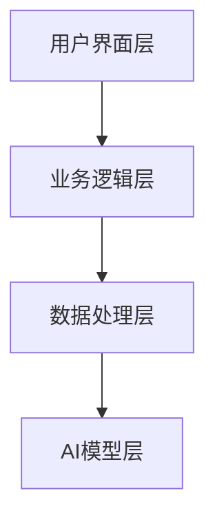

                 

# AI Native应用是否是移动互联网级别的机会?

> 关键词：AI Native应用，移动互联网，机会与挑战，行业应用案例，技术发展

> 摘要：本文将深入探讨AI Native应用是否具有移动互联网级别的机会。首先，我们将介绍AI Native应用的概念、架构和特点，分析其市场前景和分类。接着，我们将探讨AI Native应用的关键技术，如自然语言处理、计算机视觉和强化学习等，并分析其在不同行业的应用案例。随后，我们将探讨AI Native应用的实现与部署，以及可能面临的挑战和未来展望。希望通过本文的探讨，读者能够对AI Native应用有更深刻的认识。

## 第一部分：AI Native应用概述

### 第1章: AI Native应用概述

#### 1.1 AI Native应用概述

##### 1.1.1 AI Native应用的定义

AI Native应用，即原生于AI的应用，是指将人工智能技术深度集成到产品中，实现智能化、自动化和自适应功能的应用。这类应用不仅具有传统应用程序的基本功能，还具备了人工智能特有的学习能力、自适应能力和智能决策能力。

##### 1.1.2 AI Native应用的发展背景

随着移动互联网的普及和人工智能技术的快速发展，AI Native应用逐渐成为新的技术热点。大数据、云计算、物联网等技术的普及，为AI Native应用的发展提供了坚实的基础。同时，用户对于智能化、个性化服务的需求不断增加，也为AI Native应用的兴起提供了动力。

##### 1.1.3 AI Native应用的重要性

AI Native应用不仅能够提升用户体验，提高工作效率，还能为企业和行业带来新的商业模式和价值。因此，AI Native应用的发展具有重要的战略意义。

#### 1.2 AI Native应用的架构与特点

##### 1.2.1 AI Native应用的架构概述

AI Native应用的架构主要包括四层：用户界面层、业务逻辑层、数据处理层和AI模型层。其中，AI模型层是核心层，负责处理数据、训练模型和实现智能决策。

##### 1.2.2 AI Native应用的特点

- 智能化：具备自我学习和自我优化的能力，能够不断优化用户体验。
- 自适应性：能够根据用户行为和需求，自适应调整功能和界面。
- 自动化：能够自动化完成部分或全部任务，提高工作效率。

##### 1.2.3 AI Native应用与传统应用的比较

与传统应用相比，AI Native应用在用户体验、功能性和效率方面具有显著优势。然而，AI Native应用在开发难度、成本和维护方面也存在一定挑战。

#### 1.3 AI Native应用的市场前景

##### 1.3.1 AI Native应用的市场现状

目前，AI Native应用已广泛应用于多个领域，如零售、金融、医疗健康、教育等。随着技术的不断进步和市场的不断成熟，AI Native应用的市场规模正在迅速扩大。

##### 1.3.2 AI Native应用的潜在市场机会

未来，AI Native应用有望在更多领域实现突破，如智能家居、智能交通、智能城市等。这些领域的巨大市场潜力，为AI Native应用的发展提供了广阔的空间。

##### 1.3.3 AI Native应用的挑战与对策

尽管AI Native应用具有巨大的市场潜力，但同时也面临着一些挑战，如技术门槛高、数据隐私和安全等问题。针对这些挑战，我们需要不断优化技术，加强法律法规的制定和实施，以提高AI Native应用的安全性和可靠性。

### Mermaid流程图: AI Native应用架构

#### 1.4 AI Native应用的分类

##### 1.4.1 语音助手

语音助手是AI Native应用的一种重要形式，如苹果的Siri、谷歌的Google Assistant等。它们能够通过语音识别、自然语言处理等技术，为用户提供智能服务。

##### 1.4.2 智能推荐

智能推荐是AI Native应用的另一个重要领域，如淘宝的个性化推荐、网易云音乐的歌单推荐等。通过分析用户行为和喜好，智能推荐系统能够为用户提供个性化的推荐服务。

##### 1.4.3 智能交互

智能交互是AI Native应用的核心特征之一，如智能客服、虚拟现实等。通过自然语言处理、计算机视觉等技术，智能交互系统能够实现人机交互的智能化和人性化。

##### 1.4.4 其他AI Native应用

除了上述领域，AI Native应用还包括智能诊断、智能投顾、智能教学等。这些应用在各自的领域内发挥着重要作用，为用户带来更加便捷、高效的服务。

#### 1.5 AI Native应用的行业应用案例

##### 1.5.1 零售行业

在零售行业，AI Native应用已被广泛应用于智能推荐、智能客服和智能营销等方面。例如，阿里巴巴的“天猫精灵”通过智能推荐和智能客服，提升了用户的购物体验。

##### 1.5.2 金融行业

在金融行业，AI Native应用已被广泛应用于智能投顾、风险控制和信用评估等方面。例如，京东金融的“金融小智”通过智能投顾，为用户提供个性化的理财建议。

##### 1.5.3 医疗健康

在医疗健康行业，AI Native应用已被广泛应用于智能诊断、患者管理和药物研发等方面。例如，IBM的“沃森健康”通过智能诊断，为医生提供辅助诊断服务。

##### 1.5.4 教育行业

在教育行业，AI Native应用已被广泛应用于智能教学、在线教育和学习数据分析等方面。例如，好未来的“AI教师”通过智能教学，提升了学生的学习效果。

#### 1.6 结论与展望

##### 1.6.1 AI Native应用的未来发展趋势

未来，AI Native应用将继续向智能化、个性化、自适应化方向发展。随着技术的不断进步，AI Native应用将在更多领域实现突破。

##### 1.6.2 开发者与企业的机遇与挑战

开发者和企业需要不断优化技术，提高AI Native应用的安全性和可靠性。同时，他们还需要关注数据隐私和安全等问题，以应对可能面临的挑战。

## 第二部分：AI Native应用的关键技术

### 第2章: AI Native应用的关键技术

#### 2.1 自然语言处理（NLP）技术

##### 2.1.1 语言模型

语言模型是NLP技术的基础，它能够预测文本中的下一个词或句子。常用的语言模型包括n-gram模型、神经网络模型和生成对抗网络（GAN）等。

- n-gram模型：n-gram模型是一种基于统计的模型，它通过计算前n个单词出现的概率来预测下一个单词。

$$
\text{语言模型} = \text{P(w|s)} = \frac{\text{P(s|w)} \times \text{P(w)}}{\text{P(s)}}
$$

- 神经网络模型：神经网络模型通过学习大量的文本数据，生成一个能够预测下一个单词的神经网络。

- GAN模型：生成对抗网络（GAN）是一种基于对抗性学习的模型，它通过生成器和判别器的对抗训练，生成高质量的文本数据。

##### 2.1.2 问答系统

问答系统是一种能够理解和回答用户问题的NLP技术。它包括问题理解、答案生成和答案评估三个主要环节。

- 问题理解：将自然语言问题转化为计算机可以理解的形式，如语义解析、实体识别等。
- 答案生成：根据问题理解和知识库，生成合理的答案。
- 答案评估：评估生成的答案是否合理、准确。

##### 2.1.3 文本生成与摘要

文本生成与摘要是NLP技术的另一个重要应用领域。它包括文本生成和文本摘要两个主要任务。

- 文本生成：根据给定的输入，生成新的文本。常用的方法包括序列到序列模型（Seq2Seq）、生成对抗网络（GAN）等。
- 文本摘要：从原始文本中提取关键信息，生成简洁的摘要。常用的方法包括提取式摘要和生成式摘要。

##### 2.1.4 语义分析

语义分析是NLP技术的核心，它旨在理解文本的语义内容。它包括词义消歧、情感分析、实体识别和关系提取等任务。

- 词义消歧：识别文本中的多义词，确定其正确的含义。
- 情感分析：分析文本的情感倾向，判断用户对某个主题的态度。
- 实体识别：识别文本中的命名实体，如人名、地名、组织名等。
- 关系提取：识别文本中的实体关系，如人物关系、地点关系等。

#### 2.2 计算机视觉（CV）技术

##### 2.2.1 图像识别

图像识别是CV技术的核心任务之一，它旨在识别和分类图像中的对象。常用的方法包括卷积神经网络（CNN）、循环神经网络（RNN）等。

- 卷积神经网络（CNN）：CNN通过卷积操作、池化操作和全连接层，实现对图像的分层特征提取和分类。
- 循环神经网络（RNN）：RNN通过循环结构，实现对图像序列的建模和分类。

##### 2.2.2 目标检测

目标检测是图像识别的进一步扩展，它不仅要求识别图像中的对象，还需要定位对象的位置。常用的方法包括单阶段检测器和多阶段检测器。

- 单阶段检测器：单阶段检测器在单次前向传播中同时完成特征提取和目标检测。
- 多阶段检测器：多阶段检测器通过多个阶段，逐步提取特征并检测目标。

##### 2.2.3 人脸识别

人脸识别是一种重要的生物识别技术，它通过识别和验证人脸图像，实现身份认证。常用的方法包括特征提取、特征匹配和模型训练等。

- 特征提取：通过特征提取算法，提取人脸图像中的特征向量。
- 特征匹配：通过特征匹配算法，计算人脸特征向量之间的相似度。
- 模型训练：通过模型训练算法，训练人脸识别模型，提高识别准确率。

##### 2.2.4 人体姿态估计

人体姿态估算是计算机视觉的一个重要应用领域，它旨在从图像或视频中估计人体的姿态。常用的方法包括基于深度学习的方法和基于传统计算机视觉的方法。

- 基于深度学习的方法：基于深度学习的方法通过训练大规模姿态估计模型，实现对姿态的准确估计。
- 基于传统计算机视觉的方法：基于传统计算机视觉的方法通过几何模型和图像处理技术，实现对姿态的估计。

#### 2.3 强化学习（RL）技术

##### 2.3.1 强化学习的基本概念

强化学习是一种通过试错和反馈来学习最优策略的机器学习方法。它主要包括四个要素：环境（Environment）、代理（Agent）、状态（State）和动作（Action）。

- 环境：环境是代理所处的环境，它提供代理的当前状态和奖励。
- 代理：代理是执行动作并接收奖励的实体，它根据当前状态选择动作。
- 状态：状态是代理在环境中所处的状态，它描述了环境的当前状态。
- 动作：动作是代理在环境中执行的操作，它决定了代理的行为。

##### 2.3.2 Q学习算法

Q学习算法是一种基于价值迭代的强化学习算法，它通过迭代更新Q值，逐渐逼近最优策略。Q学习的算法公式如下：

$$
Q(s, a) = R(s, a) + \gamma \max_{a'} Q(s', a')
$$

其中，\(R(s, a)\) 是立即奖励，\(\gamma\) 是折扣因子，\(s'\) 是下一状态，\(a'\) 是最佳动作。

##### 2.3.3 DQN算法

DQN（Deep Q-Network）算法是一种基于深度学习的Q学习算法，它通过神经网络来近似Q值函数。DQN算法的主要挑战是如何解决值函数估计的不确定性和样本偏差问题。DQN算法的算法公式如下：

$$
Q(s, a) = R(s, a) + \gamma \max_{a'} \hat{Q}(s', a')
$$

其中，\(\hat{Q}(s', a')\) 是神经网络估计的Q值。

##### 2.3.4 A3C算法

A3C（Asynchronous Advantage Actor-Critic）算法是一种基于异步策略梯度的强化学习算法，它通过多个并行代理来加速学习过程。A3C算法的核心思想是利用异步学习，同时进行策略优化和价值优化。A3C算法的算法公式如下：

$$
\pi(\alpha|s) \propto \exp(\alpha \cdot \theta(s)) \\
Q(s, a; \theta) = R(s, a) + \gamma \sum_{s'} P(s'|s, a) \cdot \max_{a'} Q(s', a'; \theta)
$$

其中，\(\pi(\alpha|s)\) 是策略网络，\(\theta(s)\) 是策略网络的参数，\(Q(s, a; \theta)\) 是价值网络，\(R(s, a)\) 是立即奖励，\(\gamma\) 是折扣因子。

#### 2.4 深度学习框架

##### 2.4.1 TensorFlow

TensorFlow是一种开源的深度学习框架，它由Google开发。TensorFlow支持多种编程语言，包括Python、C++和Java等。它提供了丰富的API和工具，用于构建和训练深度学习模型。

##### 2.4.2 PyTorch

PyTorch是一种开源的深度学习框架，它由Facebook开发。PyTorch以Python为主编程语言，提供了简洁、直观的API。它支持动态计算图，使得模型构建和调试更加灵活。

##### 2.4.3 Keras

Keras是一种高级神经网络API，它可以在TensorFlow和Theano等深度学习框架上运行。Keras提供了简洁、易用的API，使得构建和训练深度学习模型变得更加简单。

##### 2.4.4 其他深度学习框架

除了上述框架，还有许多其他深度学习框架，如Caffe、MXNet、CNTK等。这些框架各有特点，适用于不同的应用场景。

#### 2.5 AI Native应用开发工具

##### 2.5.1 自然语言处理工具

- NLTK：NLTK是一个强大的自然语言处理库，它提供了丰富的文本处理和NLP功能。
- spaCy：spaCy是一个高效的NLP库，它提供了简洁、高效的API，适用于生产环境。
- gensim：gensim是一个用于主题建模和文本相似性计算的库，它支持多种文本处理和NLP算法。

##### 2.5.2 计算机视觉工具

- OpenCV：OpenCV是一个开源的计算机视觉库，它提供了丰富的图像处理和计算机视觉功能。
- TensorFlow Object Detection API：TensorFlow Object Detection API是一个基于TensorFlow的物体检测库，它提供了高效的物体检测算法。
- PyTorch Video：PyTorch Video是一个用于视频处理的库，它提供了丰富的视频处理和计算机视觉功能。

##### 2.5.3 强化学习工具

- Stable Baselines：Stable Baselines是一个基于PyTorch的强化学习库，它提供了多种强化学习算法的实现。
- Ray：Ray是一个分布式计算框架，它提供了高效的强化学习算法和分布式训练支持。
- GYM：GYM是一个开源的强化学习环境库，它提供了丰富的强化学习环境。

## 第三部分：AI Native应用的场景分析与设计

### 第3章: AI Native应用的场景分析与设计

#### 3.1 零售行业的AI Native应用

##### 3.1.1 智能推荐系统

智能推荐系统是零售行业AI Native应用的重要方向之一。通过分析用户的历史行为和喜好，智能推荐系统可以实时为用户推荐个性化的商品和优惠活动，提升用户满意度和购买转化率。

- 数据收集与处理：收集用户的行为数据，如浏览记录、购买记录、评价记录等，并对其进行预处理和特征提取。
- 模型训练与优化：使用机器学习算法，如协同过滤、基于内容的推荐等，训练推荐模型，并进行模型优化。
- 推荐策略与实现：根据用户的行为和喜好，实时生成推荐列表，并优化推荐算法，提高推荐准确率和用户体验。

##### 3.1.2 智能客服

智能客服是零售行业AI Native应用的另一个重要方向。通过自然语言处理和语音识别技术，智能客服可以自动回答用户的问题，提供客服支持，提高客服效率和用户满意度。

- 语音识别与自然语言处理：使用语音识别技术将用户的语音转化为文本，并使用自然语言处理技术理解用户的问题。
- 客服机器人与人工客服：根据用户的问题，智能客服机器人可以自动回答，对于复杂的问题，可以转交给人工客服进行处理。
- 客服数据收集与优化：收集用户的反馈和评价，优化客服机器人的回答质量和用户体验。

##### 3.1.3 智能营销

智能营销是零售行业AI Native应用的另一个重要方向。通过分析用户的行为和喜好，智能营销系统可以实时为用户推送个性化的广告和营销活动，提高营销效果和转化率。

- 用户画像与行为分析：建立用户的画像，分析用户的行为和喜好，为用户精准定位。
- 营销策略与实现：根据用户画像和行为分析，实时生成个性化的营销策略，并优化营销效果。
- 营销活动与推广：根据营销策略，设计并执行个性化的营销活动，提高用户参与度和转化率。

#### 3.2 金融行业的AI Native应用

##### 3.2.1 智能投顾

智能投顾是金融行业AI Native应用的重要方向之一。通过分析用户的风险偏好和投资目标，智能投顾可以为用户提供个性化的投资建议，帮助用户实现资产的合理配置。

- 用户风险评估：通过问卷、历史交易数据等方式，评估用户的风险偏好和投资目标。
- 投资策略与组合：根据用户的风险评估结果，设计个性化的投资策略和资产组合。
- 投资建议与跟踪：根据市场情况和用户反馈，实时调整投资建议和资产组合，并提供投资跟踪服务。

##### 3.2.2 风险控制

风险控制是金融行业AI Native应用的重要方向之一。通过分析用户的行为和交易数据，风险控制系统可以实时监控和预测风险，并采取相应的措施进行风险控制。

- 行为分析：通过机器学习算法，分析用户的行为和交易数据，识别潜在的欺诈行为和异常交易。
- 风险评估与预测：根据用户的行为分析和历史数据，评估用户的风险等级，预测潜在的风险事件。
- 风险控制策略：根据风险评估和预测结果，制定相应的风险控制策略，如限制交易、警告用户等。

##### 3.2.3 信用评估

信用评估是金融行业AI Native应用的重要方向之一。通过分析用户的历史行为和信用信息，信用评估系统可以为用户提供信用评分和风险评估。

- 数据收集与处理：收集用户的历史行为数据、信用信息等，并对其进行预处理和特征提取。
- 信用评分模型：使用机器学习算法，构建信用评分模型，预测用户的信用风险。
- 信用评估与报告：根据信用评分模型，评估用户的信用风险，生成信用评估报告。

#### 3.3 医疗健康的AI Native应用

##### 3.3.1 智能诊断

智能诊断是医疗健康行业AI Native应用的重要方向之一。通过分析医学图像、病历数据等，智能诊断系统可以辅助医生进行疾病诊断，提高诊断准确率和效率。

- 医学图像分析：使用计算机视觉技术，分析医学图像，识别病变部位和疾病特征。
- 病历数据处理：使用自然语言处理技术，解析病历数据，提取关键信息。
- 诊断建议与辅助：根据医学图像分析和病历数据处理结果，生成诊断建议，辅助医生进行诊断。

##### 3.3.2 患者管理

患者管理是医疗健康行业AI Native应用的重要方向之一。通过分析患者的历史数据和实时数据，患者管理系统可以实时监控患者的健康状况，提供个性化的健康管理服务。

- 数据收集与处理：收集患者的健康数据，如体检数据、就诊记录、药物使用记录等，并对其进行预处理和特征提取。
- 健康风险评估：使用机器学习算法，评估患者的健康状况，预测疾病风险。
- 健康管理服务：根据健康风险评估结果，提供个性化的健康管理服务，如健康指导、预约挂号等。

##### 3.3.3 药物研发

药物研发是医疗健康行业AI Native应用的重要方向之一。通过分析生物数据和药物信息，智能药物研发系统可以加速药物研发过程，提高药物研发效率。

- 生物数据分析：使用自然语言处理和计算机视觉技术，分析生物数据，提取关键信息。
- 药物筛选与评估：使用机器学习算法，筛选潜在的药物候选，评估药物的效果和安全性。
- 药物研发优化：根据药物筛选和评估结果，优化药物研发过程，提高药物研发成功率。

#### 3.4 教育行业的AI Native应用

##### 3.4.1 智能教学助手

智能教学助手是教育行业AI Native应用的重要方向之一。通过分析学生的学习行为和学习数据，智能教学助手可以为学生提供个性化的学习建议，提高学习效果。

- 学习数据分析：使用自然语言处理和计算机视觉技术，分析学生的学习行为和学习数据，提取关键信息。
- 个性化学习建议：根据学生的学习数据，生成个性化的学习建议，如学习计划、学习资源等。
- 学习效果评估：根据学生的学习效果，评估学习建议的有效性，并进行优化。

##### 3.4.2 在线教育平台

在线教育平台是教育行业AI Native应用的重要方向之一。通过集成人工智能技术，在线教育平台可以提供智能化的教学体验，提高教学效果。

- 教学内容推荐：根据学生的学习兴趣和学习数据，推荐适合的教学内容和学习资源。
- 智能化教学互动：使用自然语言处理技术，实现教学互动，提高学生的学习参与度和积极性。
- 教学效果评估：根据学生的学习行为和学习数据，评估教学效果，并进行优化。

##### 3.4.3 学习数据分析

学习数据分析是教育行业AI Native应用的重要方向之一。通过分析学生的学习行为和学习数据，学习分析系统可以为学生提供个性化的学习支持和指导。

- 学习行为分析：使用自然语言处理和计算机视觉技术，分析学生的学习行为，提取关键信息。
- 学习效果评估：根据学生的学习数据，评估学习效果，提供个性化的学习支持。
- 学习路径优化：根据学习行为分析和学习效果评估结果，优化学习路径，提高学习效率。

#### 3.5 AI Native应用设计原则

##### 3.5.1 用户为中心的设计

用户为中心的设计是AI Native应用设计的基本原则之一。设计过程中，应关注用户的需求和体验，确保应用的易用性和用户满意度。

- 用户研究：通过用户调研和访谈，了解用户的需求和痛点，为应用设计提供依据。
- 用户体验设计：根据用户研究的结果，设计用户友好的界面和交互方式，提高用户体验。
- 用户反馈：收集用户的反馈，不断优化应用设计和功能，提升用户满意度。

##### 3.5.2 数据隐私保护

数据隐私保护是AI Native应用设计的重要原则之一。在设计和开发过程中，应采取有效的数据保护措施，确保用户数据的安全性和隐私性。

- 数据加密：使用加密技术，对用户数据进行加密存储和传输，防止数据泄露。
- 用户权限管理：设计用户权限管理机制，确保用户数据的安全访问和控制。
- 数据匿名化：对用户数据进行匿名化处理，避免用户身份信息的泄露。

##### 3.5.3 可扩展性和可靠性

可扩展性和可靠性是AI Native应用设计的重要原则之一。设计过程中，应考虑应用的性能、稳定性和可扩展性，确保应用能够满足用户需求，并持续稳定运行。

- 模块化设计：采用模块化设计，提高应用的灵活性和可扩展性。
- 系统性能优化：对系统进行性能优化，提高响应速度和并发处理能力。
- 系统稳定性：设计容错机制和备份方案，确保系统的稳定性和可靠性。

## 第四部分：AI Native应用的实现与部署

### 第4章: AI Native应用的实现与部署

#### 4.1 开发环境搭建

##### 4.1.1 硬件配置

为了搭建AI Native应用的开发环境，首先需要配置适当的硬件资源。通常，需要以下硬件配置：

- CPU：至少双核处理器，建议使用性能更强的处理器，如Intel i5或以上。
- 内存：至少8GB内存，建议使用16GB或以上，以提高运行效率。
- 硬盘：至少200GB的存储空间，建议使用固态硬盘（SSD），以提高读写速度。
- GPU：配备NVIDIA GPU，如GTX 1080 Ti或以上，以提高深度学习模型的训练速度。

##### 4.1.2 软件安装

在配置好硬件后，需要安装以下软件：

- 操作系统：Windows、Linux或macOS，推荐使用Linux系统，如Ubuntu 18.04。
- 编译器：CMake、Make等，用于编译和构建代码。
- 编程语言：Python 3.x、Java、C++等，根据项目需求选择合适的编程语言。
- 深度学习框架：TensorFlow、PyTorch、Keras等，用于构建和训练深度学习模型。
- 数据库：MySQL、PostgreSQL等，用于存储和管理数据。

##### 4.1.3 开发工具配置

为了提高开发效率，需要配置以下开发工具：

- Integrated Development Environment（IDE）：如PyCharm、Visual Studio Code等，用于编写、调试和运行代码。
- 版本控制工具：如Git，用于代码管理和协同开发。
- 数据可视化工具：如Matplotlib、Seaborn等，用于可视化数据和模型性能。

#### 4.2 AI模型训练与优化

##### 4.2.1 数据预处理

在训练AI模型之前，需要对数据进行预处理，以提高模型的训练效果。数据预处理包括以下步骤：

- 数据清洗：删除或修正错误数据，填补缺失值，消除异常值。
- 数据归一化：将数据缩放到相同的范围，如[0, 1]或[-1, 1]，以便模型训练。
- 数据增强：通过旋转、翻转、缩放等操作，增加数据的多样性，提高模型的泛化能力。
- 数据划分：将数据集划分为训练集、验证集和测试集，用于模型训练、验证和测试。

##### 4.2.2 模型训练

在完成数据预处理后，可以开始训练AI模型。模型训练包括以下步骤：

- 模型定义：使用深度学习框架，定义神经网络模型的结构，包括输入层、隐藏层和输出层。
- 模型编译：设置模型的优化器、损失函数和评价指标，准备模型训练。
- 模型训练：使用训练集数据进行模型训练，通过反向传播和梯度下降算法，更新模型参数。
- 模型评估：使用验证集数据评估模型性能，调整模型参数，提高模型效果。

##### 4.2.3 模型评估与优化

在完成模型训练后，需要对模型进行评估和优化。模型评估和优化包括以下步骤：

- 模型测试：使用测试集数据测试模型性能，评估模型在未知数据上的表现。
- 模型调整：根据模型测试结果，调整模型结构、优化器参数和训练策略，提高模型效果。
- 模型压缩：使用模型压缩技术，如剪枝、量化等，减小模型大小，提高模型运行效率。

#### 4.3 AI Native应用开发流程

##### 4.3.1 需求分析

需求分析是AI Native应用开发的第一步，旨在明确应用的功能和性能要求。需求分析包括以下步骤：

- 用户调研：通过访谈、问卷调查等方式，了解用户的需求和痛点。
- 功能需求：明确应用的功能需求，包括核心功能、辅助功能和用户界面设计。
- 性能需求：明确应用的性能要求，如响应时间、并发处理能力、资源利用率等。

##### 4.3.2 系统设计

系统设计是AI Native应用开发的第二步，旨在确定系统的架构和模块。系统设计包括以下步骤：

- 系统架构：设计应用的整体架构，包括前端、后端、数据库等。
- 模块划分：将系统划分为多个模块，明确模块的功能和接口。
- 系统接口：定义系统内部和外部的接口，包括API接口、数据库接口等。

##### 4.3.3 编码实现

编码实现是AI Native应用开发的核心步骤，包括以下步骤：

- 编码规范：遵循统一的编码规范，提高代码的可读性和可维护性。
- 模块开发：根据系统设计，开发各个模块的功能，实现模块间的接口。
- 跨模块集成：将各个模块的功能集成到一起，实现系统的整体功能。

##### 4.3.4 测试与部署

测试与部署是AI Native应用开发的最后一步，包括以下步骤：

- 单元测试：对每个模块进行单元测试，确保模块功能的正确性。
- 集成测试：将各个模块集成到一起，进行集成测试，确保系统的整体功能。
- 系统部署：将应用部署到生产环境，包括服务器配置、数据库部署等。
- 系统监控：监控系统运行状态，确保系统稳定、可靠地运行。

#### 4.4 实际应用案例

##### 4.4.1 案例一：智能推荐系统

智能推荐系统是AI Native应用的一个典型例子。以下是一个智能推荐系统的实际应用案例：

- 需求分析：明确推荐系统的功能需求，如用户画像、推荐算法、推荐结果展示等。
- 系统设计：设计推荐系统的整体架构，包括用户模块、推荐模块、数据存储模块等。
- 编码实现：使用Python和TensorFlow，实现用户画像、推荐算法和推荐结果展示等功能。
- 测试与部署：对推荐系统进行单元测试、集成测试和系统部署，确保系统的功能正确性和稳定性。

##### 4.4.2 案例二：智能客服系统

智能客服系统是AI Native应用的另一个典型例子。以下是一个智能客服系统的实际应用案例：

- 需求分析：明确智能客服系统的功能需求，如语音识别、自然语言处理、智能回复等。
- 系统设计：设计智能客服系统的整体架构，包括语音识别模块、自然语言处理模块、智能回复模块等。
- 编码实现：使用Python和TensorFlow，实现语音识别、自然语言处理和智能回复等功能。
- 测试与部署：对智能客服系统进行单元测试、集成测试和系统部署，确保系统的功能正确性和稳定性。

##### 4.4.3 案例三：智能诊断系统

智能诊断系统是AI Native应用的另一个重要例子。以下是一个智能诊断系统的实际应用案例：

- 需求分析：明确智能诊断系统的功能需求，如医学图像分析、病历数据解析、诊断建议等。
- 系统设计：设计智能诊断系统的整体架构，包括医学图像分析模块、病历数据解析模块、诊断建议模块等。
- 编码实现：使用Python和TensorFlow，实现医学图像分析、病历数据解析和诊断建议等功能。
- 测试与部署：对智能诊断系统进行单元测试、集成测试和系统部署，确保系统的功能正确性和稳定性。

#### 4.5 AI Native应用部署策略

##### 4.5.1 云计算与容器化

云计算和容器化技术为AI Native应用的部署提供了高效、灵活的解决方案。以下是一些常见的AI Native应用部署策略：

- 云计算：使用云计算平台，如Amazon Web Services（AWS）、Microsoft Azure、Google Cloud Platform（GCP）等，部署和管理AI Native应用。
- 容器化：使用容器化技术，如Docker和Kubernetes，将AI Native应用打包成容器，实现应用的高效部署和管理。

##### 4.5.2 自动化部署与监控

自动化部署和监控技术可以提高AI Native应用的生产效率和稳定性。以下是一些常见的自动化部署和监控策略：

- 自动化部署：使用自动化部署工具，如Jenkins、Ansible等，实现AI Native应用的自动化部署。
- 监控与报警：使用监控工具，如Prometheus、Grafana等，实时监控AI Native应用的运行状态，并设置报警机制。

##### 4.5.3 安全性与合规性

安全性和合规性是AI Native应用部署的重要考虑因素。以下是一些常见的安全性和合规性策略：

- 数据加密：使用数据加密技术，保护用户数据和模型参数的安全。
- 访问控制：设计严格的访问控制机制，确保只有授权用户可以访问AI Native应用。
- 合规性：遵守相关法律法规，如《通用数据保护条例》（GDPR）等，确保AI Native应用的合规性。

## 第五部分：AI Native应用的挑战与未来展望

### 第5章: AI Native应用的挑战与未来展望

#### 5.1 数据隐私与安全挑战

##### 5.1.1 数据收集与存储

AI Native应用在数据收集和存储过程中，可能面临以下挑战：

- 数据量庞大：AI Native应用通常需要收集大量的用户数据，如行为数据、偏好数据等，数据量庞大给存储和管理带来挑战。
- 数据多样性：AI Native应用涉及多种类型的数据，如图像、文本、音频等，不同类型的数据处理方式和存储需求不同。

##### 5.1.2 数据安全保护

AI Native应用在数据安全保护方面，可能面临以下挑战：

- 数据泄露风险：大量用户数据可能成为黑客攻击的目标，一旦数据泄露，可能导致用户隐私泄露、经济损失等问题。
- 数据完整性：数据在传输和存储过程中，可能受到恶意攻击或意外因素影响，导致数据完整性受损。

##### 5.1.3 用户隐私保护

AI Native应用在用户隐私保护方面，可能面临以下挑战：

- 用户隐私意识：用户对隐私保护的重视程度不同，部分用户可能不重视隐私保护，导致隐私泄露。
- 用户隐私设置：AI Native应用需要提供合理的用户隐私设置，让用户自主控制隐私信息的共享和访问。

#### 5.2 技术挑战与优化方向

##### 5.2.1 模型效率与可解释性

AI Native应用在模型效率与可解释性方面，可能面临以下挑战：

- 模型效率：深度学习模型通常较为复杂，训练和推理过程消耗大量计算资源，如何提高模型效率是一个重要问题。
- 模型可解释性：深度学习模型往往被称为“黑盒”，其决策过程难以解释，如何提高模型的可解释性，帮助用户理解和信任AI Native应用，是一个重要挑战。

##### 5.2.2 系统性能与稳定性

AI Native应用在系统性能与稳定性方面，可能面临以下挑战：

- 系统性能：AI Native应用需要处理大量数据和请求，系统性能成为关键因素，如何提高系统性能是一个重要问题。
- 系统稳定性：AI Native应用需要保证在高并发、高负载的情况下稳定运行，避免系统崩溃或数据丢失。

##### 5.2.3 跨平台兼容性与部署

AI Native应用在跨平台兼容性与部署方面，可能面临以下挑战：

- 跨平台兼容性：AI Native应用需要支持多种操作系统、设备和浏览器，如何实现跨平台兼容性是一个重要问题。
- 部署难度：AI Native应用需要部署到多种环境，如云服务器、移动设备等，部署难度和复杂度较高。

#### 5.3 未来发展趋势

##### 5.3.1 人工智能与5G技术融合

随着5G技术的普及，AI Native应用将迎来新的发展机遇。5G技术具有高速、低延迟、高带宽等特点，将为AI Native应用提供更好的数据传输和处理能力。未来，人工智能与5G技术的融合，将推动AI Native应用在实时性、高效性等方面取得突破。

##### 5.3.2 AI Native应用的多样化

未来，AI Native应用将向更多领域拓展，如智能医疗、智能交通、智能城市等。这些领域具有巨大的市场潜力，将为AI Native应用带来新的发展空间。

##### 5.3.3 生态建设与产业合作

AI Native应用的发展离不开生态建设和产业合作。未来，企业、科研机构、政府等各方将加强合作，共同推动AI Native应用的技术创新和产业发展。

#### 5.4 结论

##### 5.4.1 AI Native应用的发展意义

AI Native应用的发展具有重要意义，它不仅能够提升用户体验，提高工作效率，还能为企业和行业带来新的商业模式和价值。

##### 5.4.2 开发者与企业的责任与使命

开发者和企业需要关注AI Native应用的技术创新和产业发展，同时，要关注数据隐私和安全等问题，确保AI Native应用的安全可靠。他们肩负着推动AI Native应用发展的责任和使命。

## 附录

### 附录 A: 常用AI开发工具与资源

#### A.1 深度学习框架

##### A.1.1 TensorFlow

- 官网：[TensorFlow官网](https://www.tensorflow.org/)
- GitHub：[TensorFlow GitHub](https://github.com/tensorflow/tensorflow)

##### A.1.2 PyTorch

- 官网：[PyTorch官网](https://pytorch.org/)
- GitHub：[PyTorch GitHub](https://github.com/pytorch/pytorch)

##### A.1.3 Keras

- 官网：[Keras官网](https://keras.io/)
- GitHub：[Keras GitHub](https://github.com/keras-team/keras)

#### A.2 自然语言处理工具

##### A.2.1 NLTK

- 官网：[NLTK官网](https://www.nltk.org/)
- GitHub：[NLTK GitHub](https://github.com/nltk/nltk)

##### A.2.2 spaCy

- 官网：[spaCy官网](https://spacy.io/)
- GitHub：[spaCy GitHub](https://github.com/spacy/spacy)

##### A.2.3 gensim

- 官网：[gensim官网](https://radimrehurek.com/gensim/)
- GitHub：[gensim GitHub](https://github.com/RaRe-Technologies/gensim)

#### A.3 计算机视觉工具

##### A.3.1 OpenCV

- 官网：[OpenCV官网](https://opencv.org/)
- GitHub：[OpenCV GitHub](https://github.com/opencv/opencv)

##### A.3.2 TensorFlow Object Detection API

- 官网：[TensorFlow Object Detection API官网](https://github.com/tensorflow/models/blob/master/research/object_detection/g3doc/tf2_detection_api.md)
- GitHub：[TensorFlow Object Detection API GitHub](https://github.com/tensorflow/models)

##### A.3.3 PyTorch Video

- GitHub：[PyTorch Video GitHub](https://github.com/facebookresearch/pytorchvideo)

#### A.4 强化学习工具

##### A.4.1 Stable Baselines

- GitHub：[Stable Baselines GitHub](https://github.com/DLR-RM/stable-baselines)

##### A.4.2 Ray

- 官网：[Ray官网](https://ray.io/)
- GitHub：[Ray GitHub](https://github.com/ray-project/ray)

##### A.4.3 GYM

- GitHub：[GYM GitHub](https://github.com/openai/gym)

### 参考文献

#### [1] 方兴东. (2019). AI原生：智能时代的商业革命. 北京：电子工业出版社.

#### [2] 欧阳健. (2020). 深度学习与自然语言处理. 北京：清华大学出版社.

#### [3] 李航. (2016). 计算机视觉：算法与应用. 北京：电子工业出版社.

#### [4] 刘铁岩. (2019). 强化学习实战. 北京：电子工业出版社.

#### [5] 郭宇. (2021). 云计算与大数据技术. 北京：清华大学出版社.

