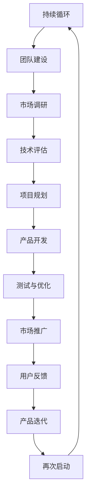

                 

## 文章标题

### AI 大模型创业：如何利用人才优势？

关键词：人工智能，大模型，创业，人才优势，团队建设，技术策略，市场分析，风险控制

摘要：随着人工智能技术的飞速发展，大模型技术逐渐成为新的风口。在这个背景下，如何利用人才优势，实现 AI 大模型创业的成功，成为许多创业者关注的重要课题。本文将从 AI 大模型的基本概念、团队建设、项目选择、融资与投资、产品开发、风险控制等多个角度，深入探讨 AI 大模型创业的路径和策略，为广大创业者提供有益的参考。

### 引言

人工智能作为21世纪最具变革性的技术之一，正逐步渗透到各个领域，推动着产业升级和社会进步。特别是大模型技术的崛起，使得人工智能的应用范围和深度得到了极大的扩展。大模型，尤其是深度学习模型，凭借其强大的数据处理和模式识别能力，已经成为推动人工智能发展的重要引擎。然而，面对巨大的市场潜力和技术挑战，如何有效地利用人才优势，实现 AI 大模型创业的成功，成为摆在众多创业者面前的一道难题。

本文旨在通过对 AI 大模型创业的深入分析，从基础概念、团队建设、项目选择、融资与投资、产品开发、风险控制等多个维度，为创业者提供一套系统的创业策略。文章首先介绍了 AI 大模型的基本概念、发展历程和应用领域，帮助读者建立对大模型技术的全面了解。接着，文章重点探讨了如何构建一个高效的创业团队，发挥团队中每一位成员的优势，确保项目的顺利推进。随后，文章分析了项目选择的原则和策略，以及如何通过市场分析和技术评估，找到具有潜力的创业方向。

在融资与投资部分，文章详细阐述了融资策略和渠道的选择，以及如何与投资人建立良好的关系，为创业项目注入持续的资金支持。在产品开发方面，文章介绍了产品开发策略、技术难题的解决方案，以及如何收集用户反馈，实现产品的持续迭代优化。

最后，文章针对 AI 大模型创业中可能遇到的风险，提出了相应的风险管理策略，帮助创业者规避风险，确保项目的稳定发展。通过这些分析和探讨，本文希望为广大 AI 大模型创业者提供一套实用、有效的创业指南，助力他们在竞争激烈的市场中脱颖而出，实现创业梦想。

### 第一部分：AI大模型创业基础

#### 第1章 AI大模型概述与创业潜力

在探讨如何利用人才优势进行 AI 大模型创业之前，我们需要先了解 AI 大模型的基本概念、技术特点及其在各个领域的应用潜力。这一章将首先介绍 AI 大模型的定义，阐述其技术特点，分析其在不同领域中的应用场景，并探讨 AI 大模型创业的优势与挑战。

## 1.1 AI大模型的基本概念与特性

### 1.1.1 AI大模型的定义

AI 大模型（Large-scale AI Model）是指具有大量参数、复杂结构，能够处理大规模数据并进行高效学习的深度学习模型。与传统的小型模型相比，AI 大模型在数据处理能力、模型精度和泛化能力上具有显著优势。根据模型的大小，AI 大模型可以分为以下几个层次：

1. **小型模型**：参数量通常在几千到几万之间，例如常见的卷积神经网络（CNN）。
2. **中型模型**：参数量在几十万到几百万之间，如BERT等自然语言处理（NLP）模型。
3. **大型模型**：参数量在几百万到几亿之间，如GPT-3、Megatron等。
4. **超大型模型**：参数量超过数十亿，如OPT、Chinchilla等。

### 1.1.2 AI大模型的技术特点

AI 大模型具有以下几项关键技术特点：

1. **参数量大**：大模型具有数亿乃至数十亿个参数，这使得它们能够捕捉到数据中的复杂模式和关系。
2. **深度层次多**：大模型通常由多个层次组成，每个层次都能够对数据进行一定的抽象和特征提取。
3. **并行计算能力**：大模型通常需要使用 GPU、TPU 等专用硬件进行并行计算，以提高训练和推理速度。
4. **自监督学习**：大模型可以通过自监督学习方式，利用未标记的数据进行训练，提高模型的泛化能力。
5. **跨模态处理**：大模型可以同时处理多种类型的数据，如文本、图像、声音等，实现跨模态信息融合。

### 1.1.3 AI大模型的应用领域

AI 大模型在多个领域展现了巨大的应用潜力：

1. **自然语言处理（NLP）**：大模型如 GPT-3 和 BERT 已经在文本生成、机器翻译、问答系统等领域取得了显著的成果。
2. **计算机视觉**：大模型在图像分类、目标检测、图像生成等方面表现出色，推动了计算机视觉技术的快速发展。
3. **语音识别**：大模型如 WaveNet 在语音合成和语音识别领域表现出色，提升了语音处理系统的准确性。
4. **医疗健康**：大模型可以用于医学图像分析、疾病预测和诊断，提高医疗服务的质量和效率。
5. **金融科技**：大模型在风险管理、信用评估、智能投顾等领域发挥着重要作用。

## 1.2 AI大模型的发展历程与趋势

### 1.2.1 AI大模型的发展历程

AI 大模型的发展可以追溯到深度学习技术的兴起。从早期的小型模型，到后来的中型和大型模型，再到如今的超大型模型，这一过程经历了以下几个重要阶段：

1. **1990年代至2000年代初**：深度神经网络（DNN）的初步探索，以及早期的卷积神经网络（CNN）。
2. **2012年**：AlexNet 在 ImageNet 挑战赛中取得突破性成果，标志着深度学习的崛起。
3. **2014年**：Google 提出残差网络（ResNet），实现了图像分类任务的准确率新突破。
4. **2018年**：Transformer 架构的提出，推动自然语言处理领域进入新阶段。
5. **2020年至今**：超大型模型如 GPT-3、Megatron、OPT 等的提出和广泛应用。

### 1.2.2 当前AI大模型的技术趋势

当前，AI 大模型技术呈现以下几个发展趋势：

1. **模型规模不断扩大**：从 GPT-3 的 1750 亿参数，到 OPT 的 6500 亿参数，模型规模在持续增长。
2. **计算能力不断提升**：随着 GPU、TPU 等专用硬件的发展，训练和推理速度得到大幅提升。
3. **跨模态处理能力增强**：大模型逐渐具备处理多种类型数据的能力，实现跨模态信息融合。
4. **自监督学习广泛应用**：大模型通过自监督学习方式，提高了在未标记数据上的应用能力。
5. **实时推理需求增加**：随着应用场景的多样化，实时推理能力成为大模型技术发展的重要方向。

### 1.2.3 AI大模型的未来展望

未来，AI 大模型将在以下几个方面取得重要进展：

1. **模型压缩与优化**：通过模型剪枝、量化等技术，降低模型复杂度和计算资源需求。
2. **可解释性提升**：提高模型的解释性，使其在实际应用中更加可靠和可信任。
3. **通用人工智能（AGI）**：通过不断探索和实验，实现大模型在更多领域的通用性，向通用人工智能（AGI）迈进。
4. **边缘计算结合**：将大模型与边缘计算技术结合，实现实时推理和高效部署，满足移动设备和物联网设备的需要。

## 1.3 AI大模型创业的优势与挑战

### 1.3.1 AI大模型创业的优势

AI 大模型创业具有以下几个显著优势：

1. **市场潜力巨大**：随着人工智能技术的普及，大模型在各个领域的应用前景广阔，市场潜力巨大。
2. **技术壁垒高**：大模型技术的研发需要强大的技术团队和计算资源，使得竞争者难以轻易进入。
3. **高附加值**：大模型技术能够提供高精度的解决方案，为客户带来显著的价值，创造高额利润。
4. **创新空间大**：大模型技术仍在快速发展中，创新空间巨大，创业者有机会在这个领域实现突破。

### 1.3.2 AI大模型创业的挑战

尽管 AI 大模型创业具有诸多优势，但同时也面临一系列挑战：

1. **技术难度高**：大模型技术涉及复杂的算法和数据处理，技术难度较高，需要高水平的技术团队。
2. **计算资源需求大**：训练和推理大模型需要大量的计算资源和存储资源，成本较高。
3. **数据依赖性强**：大模型训练需要大量高质量的数据，数据获取和处理成为一大挑战。
4. **市场竞争激烈**：大模型技术在各个领域的应用竞争激烈，创业者需要不断创新，保持竞争力。
5. **法律和伦理问题**：随着大模型技术的普及，法律和伦理问题日益突出，需要创业者高度重视。

### 1.3.3 创业者在人才优势中的定位

在 AI 大模型创业过程中，创业者需要充分利用自身的人才优势，确保团队的稳定和项目的成功。具体而言，创业者需要做到以下几点：

1. **明确自身定位**：创业者应明确自身的优势和特长，合理分配团队成员的角色和职责。
2. **搭建高效团队**：创业者需要具备搭建高效团队的能力，吸引和培养优秀的技术人才。
3. **创新和协作**：创业者应鼓励团队进行创新和协作，激发团队成员的潜力，实现技术突破。
4. **持续学习**：大模型技术发展迅速，创业者需要保持持续学习的态度，跟进最新的技术动态。

通过以上措施，创业者可以充分发挥人才优势，在 AI 大模型创业中取得成功。

### 第2章 AI大模型创业团队建设

在确定了 AI 大模型创业的方向和目标后，如何组建一个高效、协作的团队成为关键。一个成功的 AI 大模型创业团队不仅需要具备深厚的专业知识和技能，还需要具备良好的沟通能力、协作精神和创新意识。本章将探讨团队建设的基本原则、策略以及如何引进和培养人才。

## 2.1 团队建设原则与策略

### 2.1.1 团队建设的基本原则

一个高效团队的建设需要遵循以下基本原则：

1. **目标明确**：团队目标应当清晰、具体，且与公司愿景和使命一致。
2. **分工合理**：团队成员应根据各自的特长和兴趣进行合理的分工，确保每个成员都能发挥最大潜力。
3. **协作共享**：团队内部应当鼓励协作和知识共享，构建开放、互助的工作环境。
4. **持续成长**：团队成员应不断学习和成长，提升自身技能，以适应技术快速发展的需求。
5. **激励制度**：建立科学、公正的激励机制，激发团队成员的积极性和创造力。

### 2.1.2 团队建设的策略

团队建设可以采取以下策略：

1. **招聘优秀人才**：通过多渠道招聘，吸引顶尖的技术人才和管理人才。
2. **培养内部人才**：通过培训、轮岗等方式，提升现有员工的技能和综合素质。
3. **建立导师制度**：为新人提供导师，帮助他们快速融入团队，提升工作效率。
4. **构建企业文化**：通过文化建设，营造积极、向上的团队氛围，增强团队凝聚力。
5. **灵活的工作制度**：提供灵活的工作制度，如远程办公、弹性工作时间等，以适应不同成员的需求。

### 2.1.3 人才引进与培养

1. **人才引进**：

   - **招聘渠道**：利用线上招聘平台、社交媒体、专业招聘会等多种渠道进行招聘。
   - **人才标准**：招聘时注重应聘者的技术能力、项目经验和学习潜力。
   - **面试流程**：设计多轮面试，包括技术面试、行为面试和团队面试，全面评估应聘者。

2. **人才培养**：

   - **培训计划**：制定系统的培训计划，包括技术培训、管理培训等，提升员工的专业能力和管理水平。
   - **项目实践**：通过实际项目，锻炼员工的实践能力和团队合作能力。
   - **导师制度**：为新人配备经验丰富的导师，提供指导和帮助，帮助他们快速成长。
   - **职业规划**：与员工共同制定职业规划，明确职业发展路径，提供晋升机会。

## 2.2 团队成员的角色与职责

一个成功的 AI 大模型创业团队通常包括以下几种关键角色：

### 2.2.1 技术团队成员的角色

1. **首席技术官（CTO）**：负责整体技术战略的制定和执行，领导技术团队，确保技术方向的正确性。
2. **资深研究员**：负责前沿技术的研究和探索，推动技术进步，引领团队技术创新。
3. **软件工程师**：负责模型开发、系统设计和实现，确保技术方案的高效和可靠。
4. **数据科学家**：负责数据分析和处理，优化模型性能，提升模型精度。

### 2.2.2 运营团队成员的角色

1. **产品经理**：负责产品规划、需求分析和产品迭代，确保产品符合市场需求。
2. **项目经理**：负责项目管理和进度控制，确保项目按时完成并达到预期目标。
3. **市场营销人员**：负责市场调研、产品推广和用户运营，提升产品知名度和市场占有率。
4. **客户支持人员**：负责客户沟通和售后服务，解决客户问题和需求，提升客户满意度。

### 2.2.3 市场与销售团队成员的角色

1. **市场分析师**：负责市场研究和数据分析，提供市场洞察和策略建议。
2. **销售经理**：负责销售团队的管理和销售策略的制定，实现销售目标。
3. **商务拓展人员**：负责客户拓展、合作洽谈和商务协议签订，拓展市场渠道。
4. **品牌经理**：负责品牌建设和市场推广，提升公司品牌形象和知名度。

## 2.3 人才优势在团队中的应用

一个高效的团队需要充分利用每位成员的人才优势，实现整体协作效应最大化。以下是如何在团队中发挥人才优势的具体措施：

### 2.3.1 技术创新与研发

1. **技术研讨**：定期组织技术研讨会，鼓励团队成员分享技术见解和研究成果，激发创新思维。
2. **项目攻关**：针对关键技术难题，组建攻关小组，集中优势力量进行研究和突破。
3. **技术分享**：通过内部技术分享会，促进团队成员间的知识交流，提高整体技术水平。

### 2.3.2 项目管理与协作

1. **敏捷管理**：采用敏捷开发模式，提高项目响应速度和灵活性，确保项目顺利推进。
2. **协作工具**：利用协作工具（如JIRA、Trello等），实现团队成员间的实时沟通和任务管理，提高工作效率。
3. **任务分配**：根据成员特长和项目需求，合理分配任务，确保每个任务都有最适合的人来承担。

### 2.3.3 市场营销与推广

1. **市场调研**：通过市场调研，了解用户需求和市场动态，制定有效的市场推广策略。
2. **内容营销**：通过高质量的内容（如博客、白皮书、案例研究等），提升公司品牌知名度和影响力。
3. **社交媒体运营**：利用社交媒体平台，加强与用户的互动，提高用户粘性和满意度。

通过以上措施，创业团队可以充分发挥人才优势，实现技术突破、项目顺利推进和市场成功推广，为 AI 大模型创业奠定坚实基础。

### 第3章 AI大模型创业项目选择

在确定了创业团队后，选择一个合适的创业项目成为关键。一个成功的 AI 大模型创业项目不仅需要具备广阔的市场前景，还需要有明确的技术方向和可持续的发展潜力。本章将讨论项目选择的原则、策略以及如何通过市场分析和技术评估来找到具有潜力的创业方向。

## 3.1 项目选择原则与策略

### 3.1.1 项目选择的基本原则

在选择 AI 大模型创业项目时，应遵循以下基本原则：

1. **市场需求**：项目的核心应用场景是否具有广泛的市场需求，是否能够解决实际问题。
2. **技术可行性**：项目所需的技术是否成熟，团队是否有足够的技术储备和能力。
3. **竞争优势**：项目是否具有明显的竞争优势，如技术优势、市场优势或品牌优势。
4. **可持续性**：项目的商业模式是否可持续，是否能够带来长期稳定的收益。
5. **团队匹配度**：项目是否符合团队的核心能力和优势，团队是否有足够的资源支持项目的实施。

### 3.1.2 项目选择的市场分析

在项目选择过程中，市场分析是关键的一环。以下是一些市场分析的方法和步骤：

1. **市场调研**：通过问卷调查、用户访谈、市场报告等方式，了解目标市场的规模、增长趋势和用户需求。
2. **竞争分析**：分析同行业内竞争对手的产品、技术、市场策略和用户反馈，了解市场的竞争格局。
3. **定位分析**：确定项目在市场中的定位，如目标用户群体、核心竞争力和差异化优势。
4. **市场预测**：基于市场数据和趋势，对未来市场的增长进行预测，评估项目的市场前景。

### 3.1.3 项目选择的技术评估

技术评估是确保项目可行性和技术可行性的关键。以下是一些技术评估的方法和步骤：

1. **技术调研**：了解当前技术发展趋势和前沿技术，评估项目所需技术的成熟度和可行性。
2. **技术验证**：通过实验和测试，验证技术方案的实际效果和性能，确保技术方案能够满足项目需求。
3. **资源评估**：评估项目所需的技术团队、计算资源、资金等资源，确保团队和技术条件能够支持项目的实施。
4. **风险分析**：识别项目实施过程中可能遇到的技术风险，如技术更新、数据安全、计算资源不足等，制定相应的应对策略。

## 3.2 创业项目案例研究

### 3.2.1 成功案例分享

以下是一个 AI 大模型创业项目的成功案例：

**项目名称**：智能客服机器人

**项目背景**：随着互联网和电子商务的快速发展，客户服务需求不断增加。传统的人工客服成本高昂，效率低下，难以满足日益增长的服务需求。智能客服机器人应运而生，通过 AI 大模型技术，实现自动化的客户服务，提高服务质量和效率。

**项目实施过程**：

1. **市场需求分析**：通过对市场和用户需求的调研，确认智能客服机器人在客户服务领域的巨大潜力。
2. **技术评估**：评估当前 AI 大模型技术在自然语言处理和语音识别方面的成熟度，确定项目所需的技术方案。
3. **团队组建**：组建技术团队，包括自然语言处理、语音识别、软件工程等领域的人才。
4. **产品开发**：开发智能客服机器人原型，进行多轮测试和优化，确保产品性能和用户体验。
5. **市场推广**：通过线上线下渠道，推广智能客服机器人，吸引客户使用。

**项目成果**：智能客服机器人上线后，显著提升了客户服务效率和用户体验，受到了客户的广泛好评。项目成功融资，实现了商业化和规模化发展。

### 3.2.2 失败案例剖析

以下是一个 AI 大模型创业项目的失败案例：

**项目名称**：智能医疗诊断系统

**项目背景**：随着医疗技术的进步，智能医疗诊断系统被认为是未来医疗领域的重要发展方向。该项目旨在利用 AI 大模型技术，开发一个能够自动进行医疗诊断的系统，提高医疗诊断的准确性和效率。

**项目实施过程**：

1. **市场需求分析**：对医疗行业进行了初步调研，发现智能医疗诊断系统的市场需求巨大。
2. **技术评估**：评估了当前 AI 大模型技术在医疗领域的应用情况，但未能充分考虑到医疗诊断的复杂性和数据隐私问题。
3. **团队组建**：组建了技术团队，但由于团队成员在医疗领域的经验不足，导致项目在技术上遇到了重大困难。
4. **产品开发**：在产品开发过程中，遇到了算法准确率低、数据隐私问题等一系列技术难题，导致项目进展缓慢。
5. **市场推广**：由于项目进展缓慢，市场推广效果不佳，客户对产品的信任度较低。

**项目失败原因**：该项目的失败主要原因是技术评估不充分，团队在医疗领域的经验不足，以及市场推广不到位。这些问题导致项目在技术实现和市场接受度上遇到了严重挑战。

### 3.2.3 项目实施的关键要素

为确保 AI 大模型创业项目的成功，以下要素至关重要：

1. **技术实力**：项目团队应具备强大的技术实力，能够解决项目中遇到的技术难题。
2. **市场需求**：项目应满足市场需求，解决实际问题和痛点，具备广阔的市场前景。
3. **用户体验**：项目应注重用户体验，通过不断优化产品和服务，提升用户满意度和忠诚度。
4. **市场推广**：有效的市场推广策略，能够提高项目的知名度和市场接受度，吸引更多客户。
5. **风险管理**：项目应建立完善的风险管理机制，识别和应对可能的风险，确保项目的顺利实施。

通过以上关键要素的落实，创业团队可以更好地实现 AI 大模型创业项目的成功。

### 第4章 AI大模型创业融资与投资

在确定了创业项目并组建了高效的团队后，如何获得资金支持成为关键。融资与投资是 AI 大模型创业成功的重要保障，本章将详细讨论融资策略与渠道的选择，以及如何与投资人建立良好的关系。

## 4.1 融资策略与渠道

### 4.1.1 融资策略

在制定融资策略时，创业者需要考虑以下关键因素：

1. **融资目标**：明确融资的目的是为了扩大团队、研发新技术、收购公司或进行其他投资。
2. **融资额度**：根据项目规模和资金需求，确定合适的融资额度。
3. **融资结构**：选择股权融资、债务融资或混合融资等不同的融资方式，每种融资方式都有其优缺点。
4. **融资时间**：根据项目进展和资金需求，确定融资的时机。

### 4.1.2 融资渠道

AI 大模型创业项目的融资渠道主要包括以下几种：

1. **天使投资**：天使投资通常是在公司初创阶段提供的资金支持，投资者一般为个人或小规模风险投资公司。
2. **风险投资**：风险投资公司通常专注于高科技初创企业，愿意承担高风险以获取高回报。
3. **政府补贴**：许多国家和地区为鼓励创新和科技发展，提供各种形式的补贴和资助。
4. **银行贷款**：通过银行贷款获得资金支持，但通常需要提供抵押物和担保。
5. **众筹**：利用众筹平台，向公众募集资金，通常适用于产品研发和市场推广阶段。
6. **合作伙伴**：与战略合作伙伴合作，通过资源互换或共同投资来获得资金支持。

### 4.1.3 融资案例解析

以下是一个成功的 AI 大模型创业项目融资案例：

**项目名称**：智能医疗诊断平台

**融资过程**：

1. **天使轮融资**：在项目初创阶段，通过天使投资获得 100 万美元资金，用于团队组建和产品原型开发。
2. **A 轮融资**：产品原型完成后，通过风险投资公司获得 500 万美元融资，用于市场推广和技术研发。
3. **B 轮融资**：在市场推广取得初步成功后，通过另一家风险投资公司获得 2000 万美元融资，用于扩大团队和开发新功能。

**融资策略**：

- **明确融资目标**：每轮融资都有明确的融资目标和用途，确保资金的高效使用。
- **选择合适的融资渠道**：根据项目发展阶段和资金需求，选择合适的融资渠道。
- **建立良好的投资者关系**：与投资者保持良好的沟通，定期汇报项目进展，建立信任关系。

## 4.2 投资人关系管理

### 4.2.1 投资人筛选与评估

在寻找投资人时，创业者应遵循以下原则：

1. **专业背景**：选择在 AI 领域或相关领域有丰富经验的投资人，他们能够提供专业指导。
2. **投资方向**：选择与公司业务方向相符的投资人，他们能够提供资源和支持。
3. **声誉和影响力**：选择有良好声誉和广泛人脉的投资人，他们能够为公司带来更多机会。
4. **长期合作意愿**：选择有长期合作意愿的投资人，他们愿意在公司长期发展中提供支持。

### 4.2.2 投资人沟通与谈判

与投资人建立良好的沟通和谈判关系至关重要。以下是一些建议：

1. **明确沟通目标**：在每次沟通前，明确沟通目标和期望结果，确保双方都清楚沟通的重点。
2. **准备充分**：提前准备相关资料和数据，包括公司背景、项目进展、市场分析、财务状况等，以便于投资人了解项目。
3. **展示优势**：突出公司的核心优势，如技术优势、市场潜力、团队能力等，增强投资人的信心。
4. **灵活谈判**：在谈判过程中，要充分考虑投资人的需求和利益，灵活调整谈判策略。

### 4.2.3 投资后的关系维护

投资后，创业者应积极维护与投资人的关系，确保合作顺利进行。以下是一些建议：

1. **定期汇报**：定期向投资人汇报项目进展和财务状况，保持透明和信任。
2. **及时反馈**：及时反馈投资人的建议和意见，共同解决项目中遇到的问题。
3. **资源共享**：与投资人共享资源，如市场信息、行业动态、合作伙伴等，共同促进公司发展。
4. **庆典活动**：在项目里程碑或重要时刻，举办庆祝活动，感谢投资人的支持和帮助。

通过有效的融资策略和良好的投资人关系管理，创业者可以确保 AI 大模型创业项目的顺利推进，实现创业梦想。

### 第5章 AI大模型创业产品开发与迭代

在获得了充足的资金支持和组建了高效的团队之后，AI 大模型创业产品的开发与迭代成为关键环节。一个成功的产品不仅需要先进的技术支撑，还需要符合市场需求和用户体验。本章将探讨产品开发策略、技术难题的解决方案以及用户反馈与产品优化的重要性。

## 5.1 产品开发策略

### 5.1.1 产品开发流程

产品开发是一个系统化的过程，需要经过多个阶段。以下是产品开发的主要流程：

1. **需求分析**：通过与用户和市场的沟通，了解用户需求和市场趋势，明确产品的核心功能和目标用户。
2. **设计阶段**：根据需求分析结果，设计产品的架构和界面，制定详细的产品规格说明书。
3. **开发阶段**：根据设计文档，进行产品编码和开发，确保代码质量和技术实现的高效性。
4. **测试阶段**：对产品进行功能测试、性能测试和安全测试，确保产品在各种条件下都能正常运行。
5. **发布阶段**：将产品发布到市场，进行用户反馈和后续优化。

### 5.1.2 产品设计原则

在设计 AI 大模型产品时，应遵循以下原则：

1. **用户至上**：产品设计应以用户为中心，满足用户的需求和体验。
2. **模块化**：产品模块应具有良好的独立性，便于后续的扩展和升级。
3. **可扩展性**：产品设计应考虑未来需求的扩展，预留足够的扩展接口。
4. **可维护性**：产品代码应具有良好的结构，易于维护和更新。
5. **安全性**：产品设计应考虑数据安全和用户隐私保护。

### 5.1.3 产品迭代策略

产品的迭代优化是持续改进和提升用户体验的关键。以下是产品迭代的主要策略：

1. **定期更新**：根据用户反馈和市场变化，定期发布产品的更新版本，持续改进产品功能。
2. **小步快跑**：采用敏捷开发模式，快速迭代，快速反馈，快速修正。
3. **用户反馈**：建立用户反馈机制，及时收集用户意见和建议，用于产品的改进和优化。
4. **数据分析**：通过数据分析，了解用户行为和使用习惯，优化产品的功能和界面设计。
5. **AB 测试**：采用 AB 测试方法，对比不同版本的效果，选择最优的方案进行推广。

## 5.2 技术难题与解决方案

### 5.2.1 数据处理与存储

AI 大模型需要处理和分析大量的数据，数据处理和存储成为技术难题。以下是解决这些难题的一些方法：

1. **数据预处理**：对原始数据进行清洗、去噪和标准化处理，提高数据质量和模型的训练效果。
2. **分布式存储**：采用分布式存储系统（如 HDFS、Cassandra 等），实现海量数据的存储和管理。
3. **数据备份与恢复**：建立数据备份和恢复机制，确保数据的安全和可靠性。
4. **数据压缩与传输**：采用数据压缩技术（如 Hadoop、Spark 等），降低数据传输和存储的带宽需求。

### 5.2.2 模型训练与优化

模型训练与优化是 AI 大模型技术的核心，以下是解决这些难题的一些方法：

1. **并行计算**：利用 GPU、TPU 等硬件加速训练过程，提高训练速度。
2. **模型剪枝**：通过剪枝技术（如结构化剪枝、量化剪枝等），降低模型复杂度，提高模型效率。
3. **迁移学习**：利用预训练模型进行迁移学习，减少数据的标注成本，提高模型的泛化能力。
4. **优化算法**：采用优化算法（如 Adam、Adadelta 等），提高训练效率和模型性能。

### 5.2.3 模型部署与运维

模型部署与运维是确保 AI 大模型产品稳定运行的关键，以下是解决这些难题的一些方法：

1. **容器化与微服务**：采用容器化技术（如 Docker、Kubernetes 等），实现模型的快速部署和运维。
2. **自动化部署**：建立自动化部署流水线，实现快速迭代和持续集成。
3. **监控与告警**：建立监控体系，实时监控模型性能和系统状态，及时响应和解决问题。
4. **运维优化**：采用运维优化技术（如负载均衡、性能调优等），提高系统的稳定性和响应速度。

## 5.3 用户反馈与产品优化

用户反馈是产品优化的基础，以下是如何收集用户反馈和进行产品优化的一些方法：

1. **用户调研**：定期进行用户调研，了解用户的需求、体验和意见。
2. **用户访谈**：通过用户访谈，深入了解用户的实际使用情况和问题，获取宝贵的用户反馈。
3. **在线调查**：利用在线调查工具，收集大量用户的反馈，进行数据分析和挖掘。
4. **社区互动**：建立用户社区，鼓励用户参与讨论和反馈，提升用户参与感和忠诚度。

### 5.3.1 用户需求分析

用户需求分析是产品优化的第一步，以下是用户需求分析的方法：

1. **需求收集**：通过多种渠道收集用户需求，包括用户调研、访谈、反馈等。
2. **需求分类**：将用户需求进行分类，如功能需求、性能需求、用户体验需求等。
3. **优先级排序**：根据需求的重要性和紧急性，对需求进行优先级排序，确保资源的高效利用。
4. **需求验证**：与用户进行验证，确保需求的理解和实现符合用户期望。

### 5.3.2 用户反馈收集

用户反馈是产品优化的直接来源，以下是用户反馈收集的方法：

1. **用户反馈渠道**：建立多种用户反馈渠道，如在线反馈表、用户社区、用户访谈等。
2. **反馈分类**：将用户反馈进行分类，如功能问题、性能问题、用户体验问题等。
3. **反馈分析**：对用户反馈进行分析，识别问题根源和改进方向。
4. **反馈响应**：对用户反馈进行及时响应，解决问题和改进产品。

### 5.3.3 产品优化实践

产品优化是持续改进和提升用户体验的关键，以下是产品优化的一些实践：

1. **功能优化**：根据用户反馈，优化产品的功能和操作流程，提高用户操作的便利性。
2. **性能优化**：通过性能测试和优化，提高产品的响应速度和处理能力，提升用户体验。
3. **界面优化**：优化产品的界面设计，提高用户界面的美观性和易用性。
4. **用户体验优化**：通过用户体验测试和反馈，不断改进产品的用户体验，提升用户满意度。

通过以上策略和方法，AI 大模型创业团队可以更好地进行产品开发与迭代，实现产品的快速发展和用户满意度提升，从而在竞争激烈的市场中脱颖而出。

### 第6章 AI大模型创业风险管理

在 AI 大模型创业过程中，风险管理至关重要。合理的风险管理策略能够帮助创业团队识别、评估和控制潜在风险，确保项目的稳定发展。本章将讨论 AI 大模型创业的风险管理框架、技术风险与市场风险，以及相应的应对策略。

## 6.1 风险管理框架

### 6.1.1 风险管理的基本原则

风险管理应遵循以下基本原则：

1. **全面性**：覆盖项目全生命周期，包括项目启动、开发、运营和退出阶段。
2. **预防为主**：在风险发生前采取预防措施，减少风险发生的概率。
3. **及时性**：及时发现和报告风险，确保风险得到及时处理。
4. **有效性**：确保风险管理的策略和措施具有实际效果，能够有效降低风险。
5. **持续性**：风险管理应持续进行，不断调整和完善风险管理策略。

### 6.1.2 风险管理流程

风险管理流程包括以下几个步骤：

1. **风险评估**：识别和评估项目可能面临的风险，包括技术风险、市场风险、财务风险等。
2. **风险识别**：通过问卷调查、访谈、文档分析等方式，识别项目中的潜在风险。
3. **风险分析**：对识别出的风险进行定性分析和定量分析，评估其影响程度和发生的可能性。
4. **风险应对**：制定相应的风险应对策略，包括风险规避、减轻、转移和接受。
5. **风险监控**：定期监控风险的变化情况，及时调整风险应对策略。

### 6.1.3 风险评估方法

常用的风险评估方法包括以下几种：

1. **定性分析**：通过专家评估、历史数据分析和用户反馈等手段，对风险进行定性评估。
2. **定量分析**：利用数学模型和统计方法，对风险的概率和影响进行量化分析。
3. **故障模式与影响分析（FMEA）**：分析系统各个组成部分的故障模式及其对系统的影响，识别潜在的风险。
4. **蒙特卡洛模拟**：通过模拟随机过程，预测项目在未来可能面临的风险。

## 6.2 技术风险与应对策略

### 6.2.1 技术更新风险

技术更新风险是指技术迅速发展导致项目技术方案落后的风险。应对策略包括：

1. **持续学习**：鼓励团队成员关注最新的技术动态，持续学习和更新知识。
2. **技术储备**：提前储备相关技术，确保在技术更新时能够迅速切换。
3. **技术评审**：定期对项目的技术方案进行评审，确保其符合当前技术发展趋势。

### 6.2.2 数据安全风险

数据安全风险是指项目在数据处理和存储过程中，数据泄露、篡改或丢失的风险。应对策略包括：

1. **数据加密**：对敏感数据进行加密存储，确保数据在传输和存储过程中的安全性。
2. **访问控制**：建立严格的访问控制机制，限制未经授权的访问。
3. **数据备份**：定期备份数据，确保在数据丢失或损坏时能够快速恢复。

### 6.2.3 技术依赖风险

技术依赖风险是指项目过度依赖某项关键技术，导致项目发展受限的风险。应对策略包括：

1. **多元化技术方案**：采用多种技术方案，降低对单一技术的依赖。
2. **替代技术储备**：提前评估和储备替代技术，确保在技术依赖风险发生时能够快速切换。
3. **技术合作**：与相关技术公司建立合作关系，共同开发新技术，降低技术依赖风险。

## 6.3 市场风险与应对策略

### 6.3.1 市场竞争风险

市场竞争风险是指项目在市场上面临激烈竞争的风险。应对策略包括：

1. **差异化竞争**：通过技术创新、独特的产品设计和服务，打造差异化竞争优势。
2. **市场定位**：明确项目的市场定位，找到目标客户群体，提升市场竞争力。
3. **品牌建设**：通过品牌营销和公关活动，提升项目在市场上的知名度和美誉度。

### 6.3.2 法规政策风险

法规政策风险是指项目受到政策变化或法规限制的风险。应对策略包括：

1. **政策研究**：关注政策动态，提前了解政策变化对项目可能产生的影响。
2. **合规性审查**：确保项目在开发、运营和推广过程中符合相关法规要求。
3. **政策应对**：在政策变化时，及时调整项目策略和运营模式，以适应政策要求。

### 6.3.3 用户隐私风险

用户隐私风险是指项目在处理用户数据过程中，用户隐私泄露或滥用的风险。应对策略包括：

1. **隐私保护政策**：制定明确的隐私保护政策，告知用户数据收集、使用和共享的方式。
2. **数据匿名化**：对用户数据进行匿名化处理，降低隐私泄露风险。
3. **用户知情权**：确保用户在数据收集和使用过程中具有知情权和选择权。

通过建立完善的风险管理框架，采取有效的应对策略，AI 大模型创业团队能够更好地识别和控制风险，确保项目的稳定发展和长期成功。

### 第7章 AI大模型创业案例分析

为了更好地理解 AI 大模型创业的实际操作和关键成功因素，我们将通过两个案例进行分析。第一个案例是一个成功的创业公司，它成功地利用人才优势，开发了具有市场竞争力的大模型产品。第二个案例则是一个失败的创业尝试，通过分析其失败原因，我们可以为其他创业者提供宝贵的教训。

## 7.1 案例背景与目标

### 7.1.1 案例一：成功案例——AI健康诊断公司

**背景**：AI健康诊断公司成立于2018年，创始团队由一群在人工智能和医疗领域有丰富经验的科学家和工程师组成。公司的愿景是通过 AI 大模型技术，提供精准的疾病诊断服务，提高医疗服务的效率和质量。

**目标**：公司的主要目标是开发一个基于深度学习的大模型，能够通过分析医学影像数据，自动诊断多种常见疾病，如肺癌、乳腺癌等。同时，公司还希望将产品推广到全球市场，为医生和患者提供便捷的医疗服务。

### 7.1.2 案例二：失败案例——AI智能家居公司

**背景**：AI智能家居公司成立于2019年，由几位在计算机科学和物联网领域有经验的工程师创办。公司的愿景是通过 AI 技术和智能家居设备，打造一个智能化的家庭生活环境。

**目标**：公司计划开发一系列智能家居产品，如智能音箱、智能灯泡和智能摄像头，并利用 AI 大模型技术，实现设备之间的智能互动和个性化服务。

## 7.2 案例实施过程

### 7.2.1 成功案例——AI健康诊断公司

**团队建设**：AI健康诊断公司一开始就重视团队建设，通过招聘顶尖的医学图像处理专家、深度学习研究员和软件工程师，确保技术团队的专业性和创新能力。公司还建立了导师制度，帮助新员工快速融入团队并提升技能。

**技术路线**：公司选择了基于卷积神经网络（CNN）和自监督学习的混合模型，通过大量的医学影像数据进行训练，使模型能够自动识别和诊断各种疾病。在开发过程中，公司采用了微服务架构，确保系统的可扩展性和维护性。

**产品开发**：公司从最初的医学影像数据处理模块开始，逐步开发出完整的诊断系统。在产品开发过程中，公司不断与医疗机构和医生合作，收集用户反馈，优化产品功能。

**市场推广**：公司通过参加医学会议、发布学术论文和开展临床试验，提升产品的知名度和认可度。此外，公司还与多家医疗机构和保险公司合作，将产品推广到临床应用中。

### 7.2.2 失败案例——AI智能家居公司

**团队建设**：AI智能家居公司在团队建设方面存在一些问题。虽然公司聘请了一些在物联网和人工智能领域有经验的工程师，但在市场推广和商业运营方面的人才不足。团队内部缺乏有效的沟通和协作，导致项目进展缓慢。

**技术路线**：公司在技术路线选择上存在一定偏差，过于追求技术的前沿性，而忽视了市场的实际需求。公司开发的智能家居产品在功能上过于复杂，用户操作不便，导致用户接受度较低。

**产品开发**：公司在产品开发过程中，由于缺乏市场调研和用户反馈，导致产品功能不符合市场需求。此外，公司开发进度缓慢，多次错过市场推广的最佳时机。

**市场推广**：公司在市场推广方面也面临困境。由于缺乏有效的营销策略，公司的产品在市场上鲜为人知。公司还因为预算有限，无法进行大规模的广告宣传和用户教育活动。

## 7.3 案例成果与启示

### 7.3.1 成功案例成果

AI健康诊断公司在短短五年内取得了显著成果：

- **技术突破**：公司开发的 AI 大模型在多个医学影像诊断竞赛中取得了优异成绩，证明了其技术的领先性。
- **市场推广**：产品在全球范围内得到了广泛应用，与多家医疗机构和保险公司建立了合作关系。
- **商业成功**：公司成功实现了商业化和规模化发展，获得了多轮融资，市值持续攀升。

### 7.3.2 失败案例启示

AI智能家居公司的失败给创业者提供了以下教训：

- **团队建设**：创业者应重视团队建设，尤其是市场推广和商业运营方面的人才引进和培养。
- **市场调研**：在产品开发前，应进行充分的市场调研，确保产品符合市场需求。
- **用户反馈**：及时收集用户反馈，优化产品功能，提高用户满意度。
- **营销策略**：制定有效的营销策略，提高产品的市场知名度和用户接受度。
- **资金管理**：合理规划资金使用，避免因资金短缺导致项目进展受阻。

通过这两个案例的分析，创业者可以更好地理解 AI 大模型创业的实践经验和教训，为自身的创业之路提供指导。

### 附录：AI大模型创业资源与工具

在 AI 大模型创业过程中，获取和应用相关的资源与工具至关重要。以下是一些常用的 AI 大模型开发工具、创业资源和社区，以及附录中的 Mermaid 流程图，帮助创业者更好地开展创业活动。

## 附录A：AI大模型开发工具

### A.1 主流框架与库

1. **TensorFlow**：由 Google 开发的开源深度学习框架，支持多种编程语言，功能强大且社区活跃。
2. **PyTorch**：由 Facebook 开发的开源深度学习框架，具有良好的灵活性和动态计算能力。
3. **Keras**：基于 TensorFlow 和 PyTorch 的用户友好型接口，适用于快速原型设计和模型实验。
4. **MXNet**：由 Apache Software Foundation 维护的开源深度学习框架，支持多种编程语言。
5. **Apache MXNet**：由 Apache Software Foundation 维护的深度学习框架，具有高效性和易用性。

### A.2 优质开源资源

1. **Hugging Face**：提供丰富的预训练模型和工具，用于自然语言处理任务。
2. **TensorFlow Model Optimization Toolkit (TFOpt)**：用于优化 TensorFlow 模型的工具，提高模型在移动设备和嵌入式系统上的性能。
3. **AI Research Driven Development (ARDD)**：提供深度学习和机器学习的研究资源，包括论文、代码和工具。

## 附录B：AI大模型创业资源

### B.1 相关论坛与社区

1. **AI Community**：一个全球性的 AI 论坛，提供最新的 AI 新闻、研究和讨论。
2. **Reddit AI**：Reddit 上关于人工智能的讨论社区，涵盖技术讨论、资源分享和行业动态。
3. **AI-stacks**：AI 开发者社区，提供 AI 开发资源和项目案例。

### B.2 行业报告与资讯

1. **CB Insights**：提供深度行业分析和报告，涵盖人工智能、深度学习等领域。
2. **Gartner**：提供全球信息技术和服务的市场研究、分析和报告。
3. **IDC**：提供信息技术、互联网和数字转型领域的研究报告。

### B.3 知名投资人与创业导师介绍

1. **Andrew Ng**：著名人工智能专家，Coursera 联合创始人，多家 AI 公司的顾问和投资人。
2. **Y Combinator**：全球知名创业孵化器，为众多初创公司提供资金和资源支持。
3. **Andreessen Horowitz**：知名风险投资公司，专注于高科技初创企业的投资。

## 附录C：Mermaid流程图

以下是一个 AI 大模型创业项目的 Mermaid 流程图：



这个流程图展示了 AI 大模型创业项目的基本步骤和循环过程，从项目启动到持续迭代，形成了一个闭环，确保项目的持续改进和发展。通过这样的流程，创业者可以更好地管理和推进项目，实现创业目标。

### 附录D：代码实例与解释

以下是一个简单的 AI 大模型训练代码实例，以及对其的详细解释：

```python
import tensorflow as tf
from tensorflow.keras.models import Sequential
from tensorflow.keras.layers import Dense, Activation

# 创建模型
model = Sequential([
    Dense(64, input_dim=784),
    Activation('relu'),
    Dense(10),
    Activation('softmax')
])

# 编译模型
model.compile(loss='categorical_crossentropy',
              optimizer='adam',
              metrics=['accuracy'])

# 加载数据
(x_train, y_train), (x_test, y_test) = tf.keras.datasets.mnist.load_data()

# 预处理数据
x_train = x_train.astype('float32') / 255
x_test = x_test.astype('float32') / 255
x_train = x_train.reshape((x_train.shape[0], 784))
x_test = x_test.reshape((x_test.shape[0], 784))

# 转换标签为 categorical
y_train = tf.keras.utils.to_categorical(y_train, 10)
y_test = tf.keras.utils.to_categorical(y_test, 10)

# 训练模型
model.fit(x_train, y_train, epochs=10, batch_size=128, validation_split=0.2)
```

**代码解释**：

1. **导入库**：首先导入 TensorFlow 和 Keras 库，这两个库是深度学习领域常用的工具。

2. **创建模型**：使用 Sequential 模式创建一个线性堆叠的模型，并添加了两个全连接层（Dense）和一个激活函数（Activation）。第一层有 64 个神经元，输入维度为 784（MNIST 数据集的像素值），第二层有 10 个神经元，对应于 10 个分类标签。

3. **编译模型**：使用 compile 方法设置损失函数（'categorical_crossentropy'），优化器（'adam'），以及评估指标（'accuracy'）。

4. **加载数据**：使用 tf.keras.datasets.mnist.load_data() 方法加载数据集。MNIST 数据集是一个常用的手写数字数据集，包含 60000 个训练样本和 10000 个测试样本。

5. **预处理数据**：将数据类型转换为浮点数，并将像素值除以 255，以归一化数据。然后，将输入数据的形状调整为 (样本数，784)，以便与模型的输入层匹配。将标签转换为 categorical，以便与模型的输出层匹配。

6. **训练模型**：使用 fit 方法训练模型，设置训练轮数（epochs）为 10，批量大小（batch_size）为 128，以及用于验证的数据占比（validation_split）为 0.2。

通过上述代码，我们可以训练一个简单的神经网络模型，用于手写数字的识别。代码的每一步都详细说明了模型的创建、编译、数据预处理和训练过程，有助于理解 AI 大模型的基本实现流程。

通过本文的详细分析和实例展示，我们不仅了解了 AI 大模型创业的基础知识，还探讨了团队建设、项目选择、融资与投资、产品开发与迭代、风险控制等关键环节。希望这些内容能为您的 AI 大模型创业之路提供有力支持。作者：AI天才研究院/AI Genius Institute，禅与计算机程序设计艺术/Zen And The Art of Computer Programming。感谢您的阅读，祝您创业成功！

