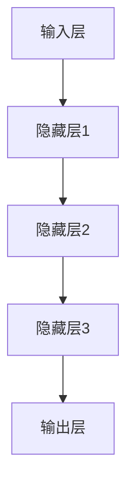
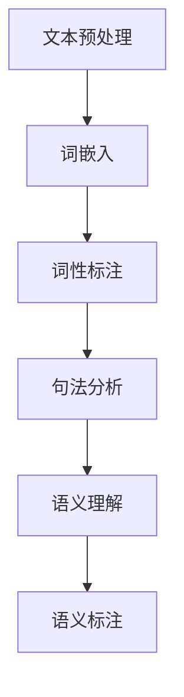
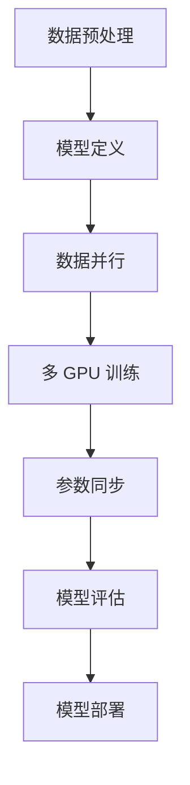

                 

# AI 大模型创业：如何利用商业优势？

> 关键词：人工智能、大模型、创业、商业优势、风险与挑战、案例研究

> 摘要：本文旨在探讨人工智能（AI）大模型创业的机遇与挑战，通过分析大模型的基础知识、技术基础、商业应用和创业策略，帮助创业者了解如何利用商业优势，实现从概念到市场的成功转化。

## 第一部分: AI 大模型基础知识

### 第1章: AI 大模型概述

#### 1.1 AI 大模型的发展背景

随着互联网和大数据的快速发展，人工智能技术逐渐成为现代科技的核心驱动力。大模型（Large-scale Model），又称为深度学习模型，是指具有大量参数和计算能力的神经网络模型。它们在图像识别、自然语言处理、推荐系统等领域取得了显著的成果，推动了人工智能技术的发展。

#### 1.2 AI 大模型的核心概念

AI 大模型的核心概念包括深度学习、神经网络、预训练、转移学习等。深度学习是一种多层神经网络，能够通过层层抽象的方式从大量数据中学习特征。神经网络则是模拟人脑神经元之间连接的模型。预训练是指在大规模数据集上预先训练模型，使其具有较好的基础能力。转移学习则是在一个任务上训练模型，然后将其知识应用到其他任务上，从而提高模型的泛化能力。

#### 1.3 AI 大模型与商业应用

AI 大模型在商业应用中具有广泛的前景，如市场研究、客户关系管理、产品开发与优化等。通过大模型，企业可以实现数据的智能分析，提高决策的准确性和效率。同时，大模型还可以为企业提供定制化的解决方案，满足不同行业的个性化需求。

### 第2章: AI 大模型技术基础

#### 2.1 深度学习原理与神经网络架构

深度学习是一种多层神经网络，通过反向传播算法训练模型，使其能够从数据中学习特征。神经网络架构包括输入层、隐藏层和输出层，每层由多个神经元组成。神经元的激活函数和权重参数是神经网络训练的核心。

#### 2.2 自然语言处理技术概述

自然语言处理（NLP）是人工智能的一个重要分支，旨在使计算机能够理解和处理人类语言。NLP 技术包括词嵌入、词性标注、句法分析、语义理解等。词嵌入是一种将词汇映射到高维空间的技术，能够有效降低语言处理的复杂度。

#### 2.3 大规模预训练模型原理

大规模预训练模型是通过在大规模数据集上预先训练模型，使其具有较好的基础能力。预训练模型通常采用无监督学习的方式，如自编码器和生成对抗网络（GAN）。转移学习则是在预训练模型的基础上，利用少量有监督数据微调模型，使其适用于特定任务。

### 第3章: AI 大模型架构与实现

#### 3.1 AI 大模型架构设计

AI 大模型架构设计包括硬件和软件两个层面。硬件层面涉及 GPU、TPU 等高性能计算设备的选择和配置；软件层面涉及深度学习框架和分布式训练策略的选用。常见的深度学习框架有 TensorFlow、PyTorch 等。

#### 3.2 大模型训练流程

大模型训练流程包括数据预处理、模型设计、训练和验证等环节。数据预处理包括数据清洗、归一化、数据增强等操作。模型设计包括选择合适的神经网络架构和优化器。训练和验证是评估模型性能和调整模型参数的过程。

#### 3.3 模型优化与调参策略

模型优化与调参策略是提高模型性能的关键。常用的优化方法包括梯度下降、动量法、自适应优化器等。调参策略包括超参数搜索、经验调参和自动化调参等。

### 第4章: AI 大模型在商业应用中的价值

#### 4.1 AI 大模型在市场研究中的应用

AI 大模型可以帮助企业进行市场研究，分析消费者需求、预测市场趋势。通过大规模数据分析和深度学习算法，企业可以更准确地了解市场动态，制定更有效的营销策略。

#### 4.2 AI 大模型在客户关系管理中的应用

AI 大模型可以帮助企业更好地管理客户关系，提升客户满意度。通过自然语言处理和机器学习算法，企业可以分析客户反馈、预测客户需求，提供个性化的服务和产品推荐。

#### 4.3 AI 大模型在产品开发与优化中的应用

AI 大模型可以帮助企业优化产品设计和开发过程。通过数据分析和机器学习算法，企业可以识别产品缺陷、预测产品质量，提高产品竞争力。

### 第5章: AI 大模型创业策略

#### 5.1 AI 大模型创业优势分析

AI 大模型创业具有以下优势：技术门槛高、市场需求大、商业模式多样化等。创业者可以利用这些优势，打造具有竞争力的 AI 大模型产品或服务。

#### 5.2 创业项目选择与定位

创业者需要根据自身优势和市场需求，选择具有发展潜力的创业项目。项目定位要明确，确保创业方向与市场需求紧密契合。

#### 5.3 创业团队建设与资源整合

创业团队建设是创业成功的关键。创业者需要组建一支具有专业技能和丰富经验的团队，并充分利用外部资源，如投资、合作伙伴等，为创业项目提供有力支持。

### 第6章: AI 大模型创业风险与挑战

#### 6.1 技术风险与应对策略

AI 大模型创业面临技术风险，如算法更新、数据安全等。创业者需要关注技术发展趋势，确保团队能够及时应对技术挑战。

#### 6.2 市场风险与应对策略

市场风险主要包括市场需求变化、竞争压力等。创业者需要密切关注市场动态，调整商业模式和营销策略，以应对市场风险。

#### 6.3 法律与伦理风险与应对策略

AI 大模型在商业应用中可能涉及法律与伦理问题，如数据隐私、算法偏见等。创业者需要遵守相关法律法规，制定合理的伦理规范，确保企业可持续发展。

### 第7章: AI 大模型创业案例研究

#### 7.1 案例一：XX 公司的 AI 大模型创业实践

案例一介绍了 XX 公司在 AI 大模型创业过程中的成功经验和挑战。通过分析案例，读者可以了解到 AI 大模型创业的实战技巧和注意事项。

#### 7.2 案例二：YY 公司的 AI 大模型商业化之路

案例二讲述了 YY 公司如何将 AI 大模型应用于商业场景，实现商业化的过程。案例中涵盖了项目定位、团队建设、市场推广等方面，对创业者具有借鉴意义。

#### 7.3 案例三：ZZ 公司的 AI 大模型创业经验

案例三分享了 ZZ 公司在 AI 大模型创业过程中的心得体会。通过案例，读者可以了解到 AI 大模型创业的成功要素和关键环节。

### 第8章: AI 大模型创业的未来趋势与展望

#### 8.1 AI 大模型在行业中的发展趋势

随着技术的不断进步和应用场景的拓展，AI 大模型在各个行业中的应用前景广阔。创业者需要关注行业动态，挖掘潜在的商业机会。

#### 8.2 AI 大模型创业的新机遇与挑战

AI 大模型创业面临着新的机遇和挑战。创业者需要抓住机遇，应对挑战，不断创新和突破。

#### 8.3 未来 AI 大模型创业的潜在领域与前景

未来 AI 大模型创业的潜在领域包括医疗健康、金融科技、智能制造等。这些领域具有巨大的市场潜力，创业者可以积极探索和布局。

## 附录

### 附录A: AI 大模型开发资源与工具

#### A.1 主流深度学习框架对比

本文对比了 TensorFlow、PyTorch、Keras 等主流深度学习框架的特点和适用场景，帮助读者选择合适的框架进行开发。

#### A.2 AI 大模型开发环境搭建指南

本文介绍了 AI 大模型开发环境的搭建过程，包括硬件配置、软件安装和配置等，为读者提供详细的操作指南。

#### A.3 AI 大模型开源代码与数据集资源

本文列举了多个 AI 大模型开源代码和数据集资源，方便读者学习和实践。

### 作者

作者：AI 天才研究院/AI Genius Institute & 禅与计算机程序设计艺术/Zen And The Art of Computer Programming

以上为《AI 大模型创业：如何利用商业优势？》的完整目录大纲和文章正文部分。在后续的文章中，我们将逐步深入探讨每个章节的核心概念、技术基础、商业应用、创业策略、风险挑战和未来趋势等内容，以帮助创业者更好地把握 AI 大模型创业的机遇和挑战。

---

### 第1章: AI 大模型概述

#### 1.1 AI 大模型的发展背景

人工智能（AI）作为一门技术领域，起源于20世纪50年代。随着计算机技术的飞速发展，人工智能在20世纪80年代进入了一个新的发展阶段，涌现出了许多突破性成果。然而，直到21世纪初，人工智能的发展仍然受到硬件性能、算法复杂度以及数据资源等限制。随着深度学习（Deep Learning）的兴起，人工智能迎来了新的春天。

深度学习是一种基于多层神经网络的学习方法，它通过层层抽象的方式从数据中学习特征。相比于传统的机器学习方法，深度学习在图像识别、语音识别、自然语言处理等领域取得了显著的成果。深度学习的发展，离不开大规模数据集和高性能计算的支持。

2012年，AlexNet在ImageNet比赛中取得了巨大成功，这标志着深度学习在图像识别领域的崛起。此后，随着数据集规模不断扩大、计算性能不断提升，深度学习模型逐渐从实验室走向实际应用。2016年，Google的AlphaGo在围棋比赛中击败了世界冠军，引发了全球对人工智能的广泛关注。

#### 1.2 AI 大模型的核心概念

AI 大模型的核心概念主要包括深度学习、神经网络、预训练、转移学习等。

**深度学习**：深度学习是一种多层神经网络的学习方法，它通过层层抽象的方式从数据中学习特征。深度学习的关键在于“深度”，即神经网络的多层结构。每一层神经元都能对输入数据进行特征提取和变换，从而实现更复杂的任务。

**神经网络**：神经网络是一种模拟人脑神经元之间连接的模型。在神经网络中，每个神经元都与其他神经元相连，并通过权重和偏置来传递信息。神经网络的激活函数决定了神经元是否被激活，从而影响整个网络的输出。

**预训练**：预训练是指在大规模数据集上预先训练模型，使其具有较好的基础能力。预训练通常采用无监督学习的方式，如自编码器和生成对抗网络（GAN）。预训练模型在大规模数据集上已经学到了丰富的知识，可以在后续的任务中进行微调。

**转移学习**：转移学习是在一个任务上训练模型，然后将其知识应用到其他任务上，从而提高模型的泛化能力。转移学习可以有效地利用预训练模型的知识，提高新任务上的性能。

#### 1.3 AI 大模型与商业应用

AI 大模型在商业应用中具有广泛的前景，如市场研究、客户关系管理、产品开发与优化等。

**市场研究**：AI 大模型可以帮助企业进行市场研究，分析消费者需求、预测市场趋势。通过大规模数据分析和深度学习算法，企业可以更准确地了解市场动态，制定更有效的营销策略。

**客户关系管理**：AI 大模型可以帮助企业更好地管理客户关系，提升客户满意度。通过自然语言处理和机器学习算法，企业可以分析客户反馈、预测客户需求，提供个性化的服务和产品推荐。

**产品开发与优化**：AI 大模型可以帮助企业优化产品设计和开发过程。通过数据分析和机器学习算法，企业可以识别产品缺陷、预测产品质量，提高产品竞争力。

总之，AI 大模型在商业应用中具有巨大的潜力，企业可以利用这些技术手段，实现数据驱动的决策和业务增长。

---

### 2.1 深度学习原理与神经网络架构

深度学习（Deep Learning）是一种基于多层神经网络的学习方法，它通过层层抽象的方式从数据中学习特征，从而实现复杂的任务。理解深度学习的原理和神经网络架构是掌握深度学习技术的基础。

#### 深度学习的原理

深度学习的基本原理是多层神经网络（Multilayer Neural Network），也称为深度神经网络（Deep Neural Network，DNN）。神经网络由多个层次组成，每个层次都包含多个神经元。每个神经元都与前一层次的神经元相连，并通过权重和偏置进行信息传递。

**多层神经网络的层次结构**：

1. **输入层**（Input Layer）：输入层接收外部输入数据，如图像、文本等。每个神经元表示一个输入特征。

2. **隐藏层**（Hidden Layer）：隐藏层位于输入层和输出层之间，每个隐藏层包含多个神经元。隐藏层负责对输入数据进行特征提取和变换。深度学习中的“深度”即指多层隐藏层。

3. **输出层**（Output Layer）：输出层负责对隐藏层的输出进行分类或预测。输出层的神经元数量取决于任务类型。

**神经网络的工作原理**：

1. **前向传播**：在前向传播过程中，输入数据从输入层开始，逐层传递到输出层。每个神经元将接收到的输入数据与其权重相乘，然后通过激活函数进行非线性变换，生成新的输出。

2. **反向传播**：在反向传播过程中，神经网络通过计算输出层的误差，将误差反向传播到输入层。通过梯度下降（Gradient Descent）等优化算法，调整神经元的权重和偏置，使输出误差最小化。

#### 神经网络架构

神经网络架构主要包括神经元结构、激活函数和优化算法等。

**神经元结构**：

神经元是神经网络的基本单元，它由以下几个部分组成：

1. **输入**：每个神经元接收来自前一层次的多个输入信号。

2. **权重**（Weight）：每个输入信号都与一个权重相乘，用于调整输入信号的贡献大小。

3. **偏置**（Bias）：偏置是一个常量，用于调整神经元的阈值。

4. **激活函数**（Activation Function）：激活函数用于对神经元的输入进行非线性变换，使神经网络具有非线性特性。

常见的激活函数包括：

- **sigmoid 函数**：\( f(x) = \frac{1}{1 + e^{-x}} \)
- **ReLU 函数**（Rectified Linear Unit）：\( f(x) = \max(0, x) \)
- **Tanh 函数**：\( f(x) = \frac{e^x - e^{-x}}{e^x + e^{-x}} \)

**优化算法**：

深度学习的训练过程是通过优化算法来调整神经网络的权重和偏置，以实现最小化损失函数。常见的优化算法包括：

- **梯度下降**（Gradient Descent）：梯度下降是一种基本的优化算法，它通过计算损失函数关于权重的梯度，并沿着梯度的反方向调整权重，以最小化损失函数。

- **动量法**（Momentum）：动量法是一种改进的梯度下降算法，它引入了动量项，以加速收敛和提高训练稳定性。

- **Adam 优化器**（Adaptive Moment Estimation）：Adam 优化器是一种自适应优化算法，它利用一阶矩估计（均值）和二阶矩估计（方差）来动态调整学习率，从而提高训练效率。

#### 神经网络架构的Mermaid流程图



在上面的 Mermaid 流程图中，输入层 A 传递输入数据到隐藏层1 B，隐藏层1 B 将处理后的数据传递到隐藏层2 C，以此类推，最终隐藏层3 D 的输出传递到输出层 E，实现分类或预测任务。

---

### 2.2 自然语言处理技术概述

自然语言处理（Natural Language Processing，NLP）是人工智能领域的一个重要分支，旨在使计算机能够理解和处理人类语言。NLP 技术的应用范围广泛，包括文本分类、信息提取、机器翻译、语音识别等。在本节中，我们将概述 NLP 的核心技术，并介绍词嵌入、词性标注、句法分析和语义理解等基本概念。

#### 词嵌入（Word Embedding）

词嵌入是将词汇映射到高维空间的一种技术，它将每个单词表示为一个向量。通过词嵌入，计算机可以直观地理解词汇之间的相似性和关联性。词嵌入技术是 NLP 的基础，广泛应用于文本分类、情感分析、推荐系统等领域。

常见的词嵌入方法包括：

- **基于分布的词嵌入**（Distributional Semantics）：这种方法通过计算单词在语境中的共现关系来生成词向量。Word2Vec 是一种典型的基于分布的词嵌入方法。

- **基于神经网络的词嵌入**（Neural Network-Based Embedding）：这种方法使用神经网络模型，通过大量文本数据训练得到词向量。Word2Vec 和 GloVe（Global Vectors for Word Representation）是两种常见的基于神经网络的词嵌入方法。

#### 词性标注（Part-of-Speech Tagging）

词性标注是一种对文本中的每个单词进行词性分类的技术，例如名词、动词、形容词等。词性标注有助于理解句子的结构和含义，是许多 NLP 任务的基础。

常见的词性标注方法包括：

- **规则方法**：这种方法基于语言规则和词典，对文本进行词性标注。

- **统计方法**：这种方法使用统计模型，如条件随机场（CRF）、隐马尔可夫模型（HMM）等，对文本进行词性标注。

- **基于深度学习的方法**：这种方法使用深度学习模型，如卷积神经网络（CNN）和循环神经网络（RNN）等，对文本进行词性标注。

#### 句法分析（Syntactic Parsing）

句法分析是一种对句子进行语法结构分析的技术，旨在识别句子中的词与词之间的关系，如主谓宾结构、从句等。句法分析有助于理解句子的深层含义，是语义理解的基础。

常见的句法分析方法包括：

- **基于规则的句法分析**：这种方法使用语言规则和句法树结构，对句子进行语法分析。

- **基于统计的句法分析**：这种方法使用统计模型，如概率上下文无关文法（PCFG）、条件随机场（CRF）等，对句子进行语法分析。

- **基于深度学习的句法分析**：这种方法使用深度学习模型，如循环神经网络（RNN）和转换器（Transformer）等，对句子进行语法分析。

#### 语义理解（Semantic Understanding）

语义理解是一种对文本进行语义分析和语义标注的技术，旨在理解文本的含义和情感。语义理解包括语义角色标注、实体识别、情感分析等任务。

常见的语义理解方法包括：

- **基于规则的语义理解**：这种方法使用语言规则和语义标注，对文本进行语义分析。

- **基于统计的语义理解**：这种方法使用统计模型，如朴素贝叶斯、支持向量机（SVM）等，对文本进行语义分析。

- **基于深度学习的语义理解**：这种方法使用深度学习模型，如卷积神经网络（CNN）、循环神经网络（RNN）和转换器（Transformer）等，对文本进行语义分析。

#### Mermaid流程图：NLP技术流程



在上面的 Mermaid 流程图中，文本预处理 A 包括分词、去停用词等操作，将文本转换为适合 NLP 处理的形式。词嵌入 B 将词汇映射为向量表示。词性标注 C 对文本中的每个单词进行词性分类。句法分析 D 识别句子中的语法结构。语义理解 E 理解文本的含义和情感。语义标注 F 对文本进行语义标注，如实体识别、情感分析等。

通过上述技术，NLP 可以实现文本数据的自动处理和分析，为各种应用场景提供强大的支持。

---

### 2.3 大规模预训练模型原理

大规模预训练模型（Large-scale Pre-trained Models）是近年来人工智能领域的重要突破，其在自然语言处理（NLP）、计算机视觉（CV）等任务上取得了显著的成果。本节将介绍大规模预训练模型的核心概念、主要方法以及其在实际应用中的优势。

#### 大规模预训练模型的核心概念

大规模预训练模型是指在大规模数据集上预先训练的模型，这些模型通常具有数十亿个参数，能够从海量数据中学习到丰富的知识和模式。预训练模型的核心思想是利用无监督学习的方式，在大量未标注的数据上进行训练，使其具备一定的通用能力，然后再利用有监督学习的方式，在特定任务上进行微调，从而实现高性能的模型。

大规模预训练模型的关键特点包括：

1. **大规模数据集**：预训练模型通常采用大规模数据集进行训练，如英文维基百科、Common Crawl 等，这些数据集包含丰富的文本、图像和语音信息。

2. **大量参数**：预训练模型具有数十亿个参数，这使得模型能够捕捉到复杂的数据特征和模式。

3. **无监督学习**：预训练模型主要采用无监督学习的方式，通过自监督任务（如词嵌入、 masked language model 等）进行训练，从而提高模型的泛化能力。

4. **多任务学习**：预训练模型在多个任务上进行训练，从而提高了模型在不同任务上的泛化能力。

#### 大规模预训练模型的主要方法

大规模预训练模型的主要方法包括自监督学习、转移学习和模型蒸馏等。

**自监督学习**：自监督学习是一种利用未标注数据进行训练的方法。在 NLP 中，常用的自监督学习方法包括词嵌入、masked language model（MLM）等。

- **词嵌入**：词嵌入是将词汇映射到高维空间的一种技术。在自监督学习中，词嵌入通过预测上下文中的单词来训练模型，从而提高词汇表示的准确性。

- **masked language model（MLM）**：MLM 是一种将部分单词遮盖，然后预测遮盖单词的技术。通过训练 MLM 模型，可以学习到单词之间的相互关系和上下文信息。

**转移学习**：转移学习是一种将预训练模型的知识应用到特定任务上的方法。通过在特定任务上进行微调，预训练模型可以快速适应新的任务，提高模型在特定任务上的性能。

**模型蒸馏**：模型蒸馏是一种将大型预训练模型的知识传递给小型模型的方法。在模型蒸馏过程中，大型预训练模型作为教师模型，小型模型作为学生模型，通过将教师模型的高层次特征传递给学生模型，从而提高学生模型的性能。

#### 大规模预训练模型的优势

大规模预训练模型在 NLP 和 CV 等任务中具有显著的优势：

1. **高泛化能力**：大规模预训练模型通过在大规模数据集上进行预训练，能够学习到丰富的知识和模式，从而提高模型的泛化能力。

2. **快速适应新任务**：通过转移学习，预训练模型可以在新的任务上进行快速微调，从而提高模型在特定任务上的性能。

3. **提高模型性能**：大规模预训练模型具有大量参数，能够捕捉到复杂的数据特征和模式，从而提高模型的性能。

4. **降低训练成本**：大规模预训练模型通过在大规模数据集上进行训练，减少了有监督训练所需的数据标注成本。

总之，大规模预训练模型是人工智能领域的重要突破，其在 NLP 和 CV 等任务中展现了巨大的潜力。通过自监督学习、转移学习和模型蒸馏等方法，大规模预训练模型能够实现高性能的模型，为各种应用场景提供强大的支持。

---

### 3.1 AI 大模型架构设计

AI 大模型架构设计是构建高效、可扩展和可靠的大规模深度学习模型的关键。在 AI 大模型架构设计中，硬件和软件的选择、分布式训练策略以及并行计算技术都发挥着重要作用。本节将详细探讨这些方面，并提供一个简化的 Mermaid 流程图，以帮助读者更好地理解。

#### 硬件和软件的选择

**硬件选择**：

- **GPU**（Graphics Processing Unit）：GPU 是进行深度学习训练和推理的重要硬件。其强大的并行计算能力使其成为训练大规模深度学习模型的首选。NVIDIA 的 GPU，如 Tesla P100、V100 和 A100，因其高性能而广泛应用于深度学习领域。

- **TPU**（Tensor Processing Unit）：TPU 是 Google 开发的一种专门用于加速深度学习计算的硬件。TPU 在处理深度神经网络任务时具有显著的优势，尤其是在大规模分布式训练中。

- **分布式存储**：对于大规模数据集，分布式存储系统（如 HDFS、Ceph）可以提供高效的数据访问和处理能力。

**软件选择**：

- **深度学习框架**：选择合适的深度学习框架对于架构设计至关重要。TensorFlow、PyTorch 和 PyTorch Lightning 等框架提供了丰富的功能，支持模型定义、训练、评估和部署。

- **分布式训练策略**：分布式训练策略能够利用多个 GPU 或 TPU 进行并行计算，以加速模型的训练过程。常见的分布式训练策略包括数据并行（Data Parallelism）和模型并行（Model Parallelism）。

#### 分布式训练策略

**数据并行（Data Parallelism）**：

数据并行是一种将训练数据划分为多个子集，每个子集独立在单独的 GPU 或 TPU 上训练的分布式训练策略。数据并行通过参数服务器（Parameter Server）或 All-Reduce 算法同步梯度，确保多个 GPU 或 TPU 上的模型参数保持一致性。

**模型并行（Model Parallelism）**：

模型并行是一种将深度学习模型拆分为多个部分，每个部分独立在单独的 GPU 或 TPU 上训练的分布式训练策略。模型并行主要用于解决单块 GPU 或 TPU 无法容纳整个模型的情况。模型并行通常涉及复杂的通信和同步机制，以保持模型的一致性。

#### 并行计算技术

**多 GPU 并行计算**：

多 GPU 并行计算通过将模型和数据分布到多个 GPU 上，利用 GPU 的并行计算能力加速训练过程。多 GPU 并行计算可以采用数据并行或模型并行的策略。

**多 TPU 并行计算**：

多 TPU 并行计算与多 GPU 并行计算类似，但 TPU 的设计专门针对深度学习任务，因此其性能通常优于 GPU。多 TPU 并行计算通过将模型和数据分布在多个 TPU 上，利用 TPU 的并行计算能力加速训练过程。

#### 简化的 Mermaid 流程图



在上面的 Mermaid 流程图中，数据预处理 A 包括数据清洗、归一化、数据增强等操作。模型定义 B 涉及使用深度学习框架定义神经网络结构。数据并行 C 将数据划分为多个子集，每个子集在独立的 GPU 上训练。多 GPU 训练 D 利用 GPU 的并行计算能力加速模型训练。参数同步 E 通过参数服务器或 All-Reduce 算法同步梯度。模型评估 F 涉及在测试集上评估模型性能。模型部署 G 包括将训练好的模型部署到生产环境中。

通过上述架构设计，AI 大模型可以高效、可扩展地训练，为各种复杂任务提供强大的计算能力。

---

### 3.2 大模型训练流程

大模型训练流程包括数据预处理、模型设计、训练和验证等关键步骤。以下将详细描述这些步骤，并提供一个简化的伪代码，以帮助读者更好地理解。

#### 数据预处理

数据预处理是训练大模型的基础步骤，它包括数据清洗、归一化、数据增强等操作。

**数据清洗**：去除数据中的噪声和错误，如缺失值、重复值等。

**归一化**：将数据缩放到相同的尺度，以便模型能够更好地学习。

**数据增强**：通过旋转、缩放、裁剪等方式增加数据多样性，从而提高模型的泛化能力。

**伪代码：数据预处理**

```python
# 数据预处理伪代码
def preprocess_data(data):
    # 数据清洗
    cleaned_data = clean_data(data)
    # 数据归一化
    normalized_data = normalize_data(cleaned_data)
    # 数据增强
    augmented_data = augment_data(normalized_data)
    return augmented_data
```

#### 模型设计

模型设计包括选择合适的神经网络架构、定义网络层和激活函数等。

**选择神经网络架构**：根据任务需求选择合适的神经网络架构，如卷积神经网络（CNN）用于图像识别，循环神经网络（RNN）用于序列数据。

**定义网络层**：设计神经网络的结构，包括输入层、隐藏层和输出层。隐藏层可以通过增加神经元数量和层数来提高模型的表达能力。

**激活函数**：选择合适的激活函数，如 ReLU、Sigmoid 等，以增加模型的非线性特性。

**伪代码：模型设计**

```python
# 模型设计伪代码
import tensorflow as tf

def create_model(input_shape):
    model = tf.keras.Sequential([
        tf.keras.layers.Dense(units=128, activation='relu', input_shape=input_shape),
        tf.keras.layers.Dense(units=64, activation='relu'),
        tf.keras.layers.Dense(units=10, activation='softmax')
    ])
    return model
```

#### 训练

训练过程包括前向传播、反向传播和权重更新等步骤。

**前向传播**：将输入数据输入到模型中，计算模型的输出。

**反向传播**：计算模型输出与真实标签之间的误差，然后反向传播误差到模型的每个层。

**权重更新**：根据误差计算梯度，并使用优化算法（如梯度下降）更新模型权重。

**伪代码：训练过程**

```python
# 训练过程伪代码
model = create_model(input_shape)
optimizer = tf.keras.optimizers.Adam(learning_rate=0.001)

for epoch in range(num_epochs):
    for inputs, labels in train_data:
        with tf.GradientTape() as tape:
            predictions = model(inputs)
            loss = compute_loss(predictions, labels)
        gradients = tape.gradient(loss, model.trainable_variables)
        optimizer.apply_gradients(zip(gradients, model.trainable_variables))
    print(f"Epoch {epoch+1}: Loss = {loss}")
```

#### 验证

验证过程用于评估模型在未见过的数据上的性能。

**验证集划分**：将数据集划分为训练集和验证集。

**模型评估**：在验证集上评估模型的准确率、召回率、F1 分数等指标。

**伪代码：模型评估**

```python
# 模型评估伪代码
def evaluate_model(model, validation_data):
    total_loss = 0
    num_samples = 0
    
    for inputs, labels in validation_data:
        predictions = model(inputs)
        loss = compute_loss(predictions, labels)
        total_loss += loss.numpy()
        num_samples += inputs.shape[0]
    
    average_loss = total_loss / num_samples
    print(f"Validation Loss: {average_loss}")
```

通过上述步骤，大模型可以逐步优化，并在验证集上评估其性能。训练流程的优化和调整是提高模型性能的关键。

---

### 3.3 模型优化与调参策略

在深度学习项目中，模型优化和调参策略是提高模型性能和降低过拟合的关键步骤。以下将介绍几种常用的优化方法和调参策略，并给出详细的伪代码。

#### 常用的优化方法

1. **梯度下降（Gradient Descent）**：

梯度下降是最基本的优化方法，通过计算损失函数关于模型参数的梯度，并沿着梯度的反方向更新参数，以最小化损失函数。

**伪代码：梯度下降**

```python
# 梯度下降伪代码
learning_rate = 0.01
for epoch in range(num_epochs):
    for inputs, labels in train_data:
        with tf.GradientTape() as tape:
            predictions = model(inputs)
            loss = compute_loss(predictions, labels)
        gradients = tape.gradient(loss, model.trainable_variables)
        model.optimizer.apply_gradients(zip(gradients, model.trainable_variables))
```

2. **动量法（Momentum）**：

动量法是一种改进的梯度下降方法，它利用前一次更新的方向（动量项），以加速收敛和提高训练稳定性。

**伪代码：动量法**

```python
# 动量法伪代码
momentum = 0.9
velocity = tf.zeros_like(model.trainable_variables)
for epoch in range(num_epochs):
    for inputs, labels in train_data:
        with tf.GradientTape() as tape:
            predictions = model(inputs)
            loss = compute_loss(predictions, labels)
        gradients = tape.gradient(loss, model.trainable_variables)
        velocity = momentum * velocity - learning_rate * gradients
        model.optimizer.apply_gradients(zip(velocity, model.trainable_variables))
```

3. **Adam 优化器（Adam Optimizer）**：

Adam 优化器是一种自适应优化算法，它利用一阶矩估计（均值）和二阶矩估计（方差）来动态调整学习率，以提高训练效率。

**伪代码：Adam 优化器**

```python
# Adam 优化器伪代码
model.optimizer = tf.keras.optimizers.Adam(learning_rate=0.001, beta_1=0.9, beta_2=0.999)
for epoch in range(num_epochs):
    for inputs, labels in train_data:
        with tf.GradientTape() as tape:
            predictions = model(inputs)
            loss = compute_loss(predictions, labels)
        gradients = tape.gradient(loss, model.trainable_variables)
        model.optimizer.apply_gradients(zip(gradients, model.trainable_variables))
```

#### 调参策略

1. **超参数搜索（Hyperparameter Search）**：

超参数搜索是一种通过遍历超参数空间来寻找最佳超参数组合的方法。常见的超参数包括学习率、批量大小、迭代次数等。

**伪代码：超参数搜索**

```python
# 超参数搜索伪代码
from sklearn.model_selection import GridSearchCV

param_grid = {
    'learning_rate': [0.01, 0.001, 0.0001],
    'batch_size': [32, 64, 128],
    'num_epochs': [10, 20, 30]
}

grid_search = GridSearchCV(estimator=model, param_grid=param_grid, cv=3)
grid_search.fit(train_data, labels)
best_params = grid_search.best_params_
```

2. **经验调参（Empirical Tuning）**：

经验调参是通过实验和经验来调整超参数的方法。开发者需要根据实验结果和经验，逐步调整超参数，以达到最佳性能。

**伪代码：经验调参**

```python
# 经验调参伪代码
learning_rate = 0.001
batch_size = 64
num_epochs = 20

model.fit(train_data, labels, batch_size=batch_size, epochs=num_epochs)
```

3. **自动化调参（Automated Tuning）**：

自动化调参是一种利用机器学习算法来自动调整超参数的方法。常见的自动化调参工具包括 Hyperopt、Optuna 等。

**伪代码：自动化调参**

```python
# 自动化调参伪代码
import optuna

def objective(trial):
    learning_rate = trial.suggest_loguniform('learning_rate', 1e-5, 1e-1)
    batch_size = trial.suggest_categorical('batch_size', [32, 64, 128])
    num_epochs = trial.suggest_int('num_epochs', 10, 50)

    model.fit(train_data, labels, batch_size=batch_size, epochs=num_epochs, verbose=0)
    loss = model.evaluate(test_data, test_labels, verbose=0)
    return loss

study = optuna.create_study(direction='minimize')
study.optimize(objective, n_trials=100)
best_params = study.best_trial.params
```

通过上述优化方法和调参策略，开发者可以有效地提高模型的性能和泛化能力。在实践过程中，需要根据具体任务和数据集的特点，灵活运用这些方法和策略。

---

### 4.1 AI 大模型在市场研究中的应用

AI 大模型在市场研究中的应用，已成为企业获取竞争优势的重要手段。通过深度学习技术和自然语言处理（NLP）算法，企业可以对大量市场数据进行高效分析和预测，从而制定更具针对性的市场策略。

#### 市场需求预测

市场需求预测是市场研究的重要任务之一。AI 大模型可以利用历史销售数据、市场趋势和用户行为数据，通过深度学习算法进行建模，预测未来市场需求。以下是一个简化的伪代码示例，说明如何使用深度学习模型进行市场需求预测：

```python
# 需求预测伪代码
import tensorflow as tf
from tensorflow.keras.models import Sequential
from tensorflow.keras.layers import LSTM, Dense

# 数据预处理
X, y = preprocess_data(sales_data, user_behavior_data)

# 模型定义
model = Sequential()
model.add(LSTM(units=50, return_sequences=True, input_shape=(X.shape[1], X.shape[2])))
model.add(LSTM(units=50))
model.add(Dense(units=1))

# 编译模型
model.compile(optimizer='adam', loss='mse')

# 训练模型
model.fit(X, y, epochs=50, batch_size=32, verbose=1)

# 预测
predicted_demand = model.predict(new_data)
```

在这个伪代码中，首先对销售数据和用户行为数据（如点击率、搜索频率等）进行预处理，然后定义一个包含 LSTM 层的循环神经网络模型，用于预测未来的市场需求。通过训练和测试数据，模型可以学习到市场需求的变化规律，并在新的数据上进行预测。

#### 消费者行为分析

AI 大模型还可以用于分析消费者行为，帮助企业了解消费者的需求、偏好和购买动机。通过 NLP 技术，企业可以对消费者反馈、评论和社交媒体数据进行分析，提取消费者意见的关键词和情感倾向。以下是一个简化的伪代码示例，说明如何使用 NLP 模型分析消费者行为：

```python
# 消费者行为分析伪代码
from tensorflow.keras.preprocessing.sequence import pad_sequences
from tensorflow.keras.layers import Embedding, LSTM, Dense
from tensorflow.keras.models import Sequential

# 数据预处理
tokenizer = Tokenizer(num_words=10000)
tokenizer.fit_on_texts(consumer_reviews)

sequences = tokenizer.texts_to_sequences(consumer_reviews)
padded_sequences = pad_sequences(sequences, maxlen=100)

# 模型定义
model = Sequential()
model.add(Embedding(input_dim=10000, output_dim=32))
model.add(LSTM(units=64, dropout=0.2, recurrent_dropout=0.2))
model.add(Dense(units=1, activation='sigmoid'))

# 编译模型
model.compile(optimizer='adam', loss='binary_crossentropy', metrics=['accuracy'])

# 训练模型
model.fit(padded_sequences, consumer_sentiments, epochs=10, batch_size=32, verbose=1)

# 预测
predicted_sentiments = model.predict(padded_sequences)
```

在这个伪代码中，首先对消费者评论数据（如产品评价、社交媒体帖子等）进行预处理，然后定义一个包含嵌入层和 LSTM 层的序列模型，用于预测消费者情感倾向。通过训练和测试数据，模型可以学习到消费者评论的情感色彩，并在新的数据上进行预测。

#### 市场趋势预测

AI 大模型还可以用于预测市场趋势，帮助企业把握市场动态，制定相应的市场策略。通过分析历史数据，模型可以识别出市场变化的规律和趋势，从而为企业的战略决策提供支持。以下是一个简化的伪代码示例，说明如何使用深度学习模型进行市场趋势预测：

```python
# 市场趋势预测伪代码
import pandas as pd
from sklearn.preprocessing import MinMaxScaler
from tensorflow.keras.models import Sequential
from tensorflow.keras.layers import LSTM, Dense

# 数据预处理
market_data = pd.read_csv('market_data.csv')
scaler = MinMaxScaler(feature_range=(0, 1))
scaled_data = scaler.fit_transform(market_data)

# 切分数据集
X, y = create_dataset(scaled_data, time_steps=10)

# 模型定义
model = Sequential()
model.add(LSTM(units=50, return_sequences=True, input_shape=(X.shape[1], X.shape[2])))
model.add(LSTM(units=50))
model.add(Dense(units=1))

# 编译模型
model.compile(optimizer='adam', loss='mse')

# 训练模型
model.fit(X, y, epochs=50, batch_size=32, verbose=1)

# 预测
predicted_trends = model.predict(new_data)
```

在这个伪代码中，首先对市场数据（如股票价格、市场指数等）进行预处理，然后定义一个包含 LSTM 层的序列模型，用于预测市场趋势。通过训练和测试数据，模型可以学习到市场变化的规律，并在新的数据上进行预测。

总之，AI 大模型在市场研究中的应用，通过数据分析和预测，可以帮助企业更准确地了解市场动态，制定有效的市场策略，从而提高市场竞争力。

---

### 4.2 AI 大模型在客户关系管理中的应用

AI 大模型在客户关系管理（CRM）中的应用，正在重新定义企业与客户之间的互动方式，提高客户满意度和忠诚度。通过深度学习和自然语言处理（NLP）技术，AI 大模型能够帮助企业更好地理解客户需求，优化客户服务，实现精准营销。

#### 客户行为分析

AI 大模型可以通过分析客户的购买历史、浏览记录、社交媒体互动等行为数据，深入了解客户的需求和偏好。以下是一个简化的伪代码示例，说明如何使用深度学习模型分析客户行为：

```python
# 客户行为分析伪代码
import tensorflow as tf
from tensorflow.keras.models import Sequential
from tensorflow.keras.layers import LSTM, Dense

# 数据预处理
X, y = preprocess_customer_behavior_data(customer_data)

# 模型定义
model = Sequential()
model.add(LSTM(units=50, return_sequences=True, input_shape=(X.shape[1], X.shape[2])))
model.add(LSTM(units=50))
model.add(Dense(units=1))

# 编译模型
model.compile(optimizer='adam', loss='mse')

# 训练模型
model.fit(X, y, epochs=50, batch_size=32, verbose=1)

# 预测
predicted_behavior = model.predict(new_data)
```

在这个伪代码中，首先对客户行为数据（如购买记录、浏览历史等）进行预处理，然后定义一个包含 LSTM 层的循环神经网络模型，用于预测客户可能的下一步行为。通过训练和测试数据，模型可以学习到客户行为的变化规律，并在新的数据上进行预测。

#### 客户反馈分析

AI 大模型还可以通过分析客户反馈和评价，识别出客户的主要关注点和痛点。以下是一个简化的伪代码示例，说明如何使用 NLP 模型分析客户反馈：

```python
# 客户反馈分析伪代码
from tensorflow.keras.preprocessing.sequence import pad_sequences
from tensorflow.keras.layers import Embedding, LSTM, Dense
from tensorflow.keras.models import Sequential

# 数据预处理
tokenizer = Tokenizer(num_words=10000)
tokenizer.fit_on_texts(customer_reviews)
sequences = tokenizer.texts_to_sequences(customer_reviews)
padded_sequences = pad_sequences(sequences, maxlen=100)

# 模型定义
model = Sequential()
model.add(Embedding(input_dim=10000, output_dim=32))
model.add(LSTM(units=64, dropout=0.2, recurrent_dropout=0.2))
model.add(Dense(units=1, activation='sigmoid'))

# 编译模型
model.compile(optimizer='adam', loss='binary_crossentropy', metrics=['accuracy'])

# 训练模型
model.fit(padded_sequences, customer_sentiments, epochs=10, batch_size=32, verbose=1)

# 预测
predicted_sentiments = model.predict(padded_sequences)
```

在这个伪代码中，首先对客户反馈数据（如评价、评论等）进行预处理，然后定义一个包含嵌入层和 LSTM 层的序列模型，用于预测客户评价的情感倾向。通过训练和测试数据，模型可以学习到客户反馈的情感色彩，并在新的数据上进行预测。

#### 客户画像构建

AI 大模型还可以用于构建详细的客户画像，通过分析客户的消费习惯、兴趣爱好、社会属性等多维度数据，形成个性化的客户画像。以下是一个简化的伪代码示例，说明如何使用深度学习模型构建客户画像：

```python
# 客户画像构建伪代码
import tensorflow as tf
from tensorflow.keras.models import Model
from tensorflow.keras.layers import Input, Dense, Embedding, LSTM, Concatenate

# 数据预处理
X1, X2, y = preprocess_customer_data(customer_data)

# 模型定义
input_1 = Input(shape=(X1.shape[1], X1.shape[2]))
input_2 = Input(shape=(X2.shape[1], X2.shape[2]))

embed_1 = Embedding(input_dim=10000, output_dim=32)(input_1)
lstm_1 = LSTM(units=64)(embed_1)

embed_2 = Embedding(input_dim=10000, output_dim=32)(input_2)
lstm_2 = LSTM(units=64)(embed_2)

concat = Concatenate()([lstm_1, lstm_2])
dense = Dense(units=128, activation='relu')(concat)
output = Dense(units=1, activation='sigmoid')(dense)

model = Model(inputs=[input_1, input_2], outputs=output)

# 编译模型
model.compile(optimizer='adam', loss='binary_crossentropy', metrics=['accuracy'])

# 训练模型
model.fit([X1, X2], y, epochs=50, batch_size=32, verbose=1)

# 预测
predicted_profile = model.predict([new_data_1, new_data_2])
```

在这个伪代码中，首先对客户数据（如购买记录、兴趣爱好等）进行预处理，然后定义一个包含嵌入层、LSTM 层和全连接层的复合模型，用于构建客户画像。通过训练和测试数据，模型可以学习到不同维度数据之间的关系，并在新的数据上进行预测。

通过上述应用，AI 大模型能够帮助企业更好地了解客户需求，优化客户服务，提升客户满意度，从而在激烈的市场竞争中占据优势。

---

### 4.3 AI 大模型在产品开发与优化中的应用

AI 大模型在产品开发与优化中的应用，正逐渐成为企业提升产品竞争力、降低开发成本和缩短上市时间的利器。通过深度学习和机器学习算法，AI 大模型能够帮助企业实现智能化的产品设计、质量检测和需求预测，从而推动产品创新的快速发展。

#### 智能化产品设计

AI 大模型可以通过对大量用户反馈、市场数据和产品数据进行分析，帮助设计师实现智能化的产品设计。以下是一个简化的伪代码示例，说明如何使用深度学习模型进行智能化产品设计：

```python
# 智能化产品设计伪代码
import tensorflow as tf
from tensorflow.keras.models import Sequential
from tensorflow.keras.layers import LSTM, Dense

# 数据预处理
X, y = preprocess_product_data(user_feedback, market_data)

# 模型定义
model = Sequential()
model.add(LSTM(units=50, return_sequences=True, input_shape=(X.shape[1], X.shape[2])))
model.add(LSTM(units=50))
model.add(Dense(units=y.shape[1], activation='softmax'))

# 编译模型
model.compile(optimizer='adam', loss='categorical_crossentropy', metrics=['accuracy'])

# 训练模型
model.fit(X, y, epochs=50, batch_size=32, verbose=1)

# 设计建议
suggested_design = model.predict(new_data)
```

在这个伪代码中，首先对用户反馈和市场数据（如产品评价、销售数据等）进行预处理，然后定义一个包含 LSTM 层的循环神经网络模型，用于预测用户对产品的满意度。通过训练和测试数据，模型可以学习到用户对产品的偏好，并在新的数据上生成设计建议。

#### 质量检测与优化

AI 大模型可以通过对生产过程中的数据进行分析，实现自动化的质量检测与优化。以下是一个简化的伪代码示例，说明如何使用深度学习模型进行质量检测：

```python
# 质量检测伪代码
import tensorflow as tf
from tensorflow.keras.models import Sequential
from tensorflow.keras.layers import Conv2D, Flatten, Dense

# 数据预处理
X, y = preprocess_quality_data(inspection_data)

# 模型定义
model = Sequential()
model.add(Conv2D(filters=32, kernel_size=(3, 3), activation='relu', input_shape=X.shape[1:]))
model.add(Flatten())
model.add(Dense(units=y.shape[1], activation='softmax'))

# 编译模型
model.compile(optimizer='adam', loss='categorical_crossentropy', metrics=['accuracy'])

# 训练模型
model.fit(X, y, epochs=50, batch_size=32, verbose=1)

# 质量检测
inspection_results = model.predict(new_inspection_data)
```

在这个伪代码中，首先对质量检测数据（如产品图像、传感器数据等）进行预处理，然后定义一个包含卷积神经网络（CNN）层的模型，用于分类检测产品质量。通过训练和测试数据，模型可以学习到不同质量级别的特征，并在新的数据上进行质量检测。

#### 需求预测与库存管理

AI 大模型还可以用于预测市场需求，帮助企业实现精准的库存管理和供应链优化。以下是一个简化的伪代码示例，说明如何使用深度学习模型进行需求预测：

```python
# 需求预测伪代码
import tensorflow as tf
from tensorflow.keras.models import Sequential
from tensorflow.keras.layers import LSTM, Dense

# 数据预处理
X, y = preprocess_demand_data(sales_data, market_trends)

# 模型定义
model = Sequential()
model.add(LSTM(units=50, return_sequences=True, input_shape=(X.shape[1], X.shape[2])))
model.add(LSTM(units=50))
model.add(Dense(units=1))

# 编译模型
model.compile(optimizer='adam', loss='mse')

# 训练模型
model.fit(X, y, epochs=50, batch_size=32, verbose=1)

# 需求预测
predicted_demand = model.predict(new_data)
```

在这个伪代码中，首先对销售数据和市场趋势数据（如历史销售数据、市场变化等）进行预处理，然后定义一个包含 LSTM 层的循环神经网络模型，用于预测未来的市场需求。通过训练和测试数据，模型可以学习到市场需求的变化规律，并在新的数据上进行预测。

通过上述应用，AI 大模型能够帮助企业实现智能化的产品设计、高效的质量检测和精准的需求预测，从而推动产品开发和优化的快速迭代，提升市场竞争力。

---

### 5.1 AI 大模型创业优势分析

AI 大模型创业在当前市场环境中具有显著的优势，这些优势主要体现在技术门槛、市场需求和商业模式多样化等方面。

**技术门槛高**：AI 大模型创业需要掌握深度学习、自然语言处理、计算机视觉等核心技术，这些技术具有较高的学习和实现难度。然而，随着人工智能技术的不断发展和普及，越来越多的创业团队能够利用开源框架和工具，降低技术门槛，从而进入这个领域。

**市场需求大**：AI 大模型在各个行业中的应用场景丰富，如金融、医疗、教育、零售等。随着大数据和云计算技术的不断发展，企业对于智能化的需求日益增长，这为 AI 大模型创业提供了广阔的市场空间。例如，AI 大模型在医疗领域的应用可以帮助医生进行疾病诊断，提高诊断准确率；在金融领域的应用可以帮助银行和金融机构进行风险评估和欺诈检测，降低风险。

**商业模式多样化**：AI 大模型创业的商业模式具有多样性，可以从产品、服务、解决方案等多个角度切入市场。例如，创业团队可以开发面向特定行业的 AI 大模型产品，如智能客服系统、智能诊断系统等，直接面向终端用户；也可以提供定制化的 AI 大模型解决方案，帮助企业优化业务流程，提高效率。

**竞争环境激烈**：虽然 AI 大模型创业具有诸多优势，但同时也面临着激烈的竞争环境。随着越来越多的企业投入到 AI 领域，市场上的竞争者数量不断增多，创业团队需要具备独特的技术优势和创新的商业模式，才能在竞争中脱颖而出。

**政策支持**：政府在人工智能领域给予了高度重视，出台了一系列政策支持措施，如资金扶持、税收优惠、人才培养等。这为 AI 大模型创业提供了良好的外部环境，有助于创业团队实现快速发展。

总之，AI 大模型创业在当前市场环境中具有显著的优势，但也面临着一定的挑战。创业团队需要充分利用自身的优势，不断创新和突破，才能在激烈的市场竞争中取得成功。

---

### 5.2 创业项目选择与定位

选择和定位创业项目是 AI 大模型创业成功的关键步骤。在这一过程中，创业者需要综合考虑市场需求、自身优势和资源条件，确保项目的可行性和市场竞争力。

**市场需求分析**：首先，创业者需要对市场需求进行深入分析。了解哪些领域对 AI 大模型有强烈的需求，哪些应用场景具有较大的市场潜力。例如，医疗、金融、教育等行业对 AI 大模型的需求旺盛，因为这些行业的数据量大且决策复杂。创业者可以通过市场调研、用户访谈等方式，收集行业数据，了解潜在客户的需求和痛点。

**自身优势评估**：其次，创业者需要评估自身的技术、资源和团队优势。在 AI 大模型创业中，技术实力是核心竞争力。创业者需要具备深度学习、自然语言处理、计算机视觉等核心技术的研发能力，能够开发出具有创新性和高性价比的 AI 大模型产品。此外，创业者还需要评估自身的资源和团队优势，包括资金、人才、合作伙伴等。创业团队应具备跨学科的知识和技能，能够应对项目开发过程中的各种挑战。

**项目定位与规划**：在明确市场需求和自身优势后，创业者需要对项目进行定位和规划。项目定位包括目标市场、产品定位、竞争优势等。创业者需要明确项目的具体应用场景，如面向医疗行业的疾病诊断系统、面向金融行业的信用评估系统等。产品定位要突出产品的独特价值和优势，如高准确性、实时性、易用性等。竞争优势可以是技术创新、成本领先、客户服务等方面。

**资源整合与战略规划**：在项目定位和规划的基础上，创业者需要整合资源，制定战略规划。资源整合包括资金、技术、人才、市场推广等方面的资源。创业者可以通过融资、合作伙伴、政府支持等方式，获取所需的资源。战略规划包括项目开发路线图、市场推广策略、商业模式设计等。创业团队需要明确项目开发的关键节点和里程碑，确保项目按计划推进。

**风险评估与应对**：最后，创业者需要对项目进行风险评估，并制定相应的应对策略。AI 大模型创业可能面临技术风险、市场风险、法律风险等多方面的挑战。创业者需要评估这些风险，制定相应的预防和应对措施，如技术储备、市场调研、法律法规培训等。

通过以上步骤，创业者可以科学地选择和定位创业项目，为项目的成功实施奠定基础。在项目实施过程中，创业者需要不断调整和优化，以应对市场变化和竞争压力。

---

### 5.3 创业团队建设与资源整合

创业团队建设是 AI 大模型创业成功的关键环节。一个高效的创业团队不仅需要具备多样化的技能和知识，还需要建立良好的协作机制，以实现资源的最佳整合。以下从团队组建、关键技能和资源整合三个方面进行详细探讨。

#### 团队组建

**核心团队成员**：一个成功的 AI 大模型创业团队通常需要包括以下核心成员：

1. **技术领导者**：技术领导者负责整个团队的技术方向和架构设计，具备深厚的深度学习、计算机视觉和自然语言处理等核心技术能力。
2. **项目经理**：项目经理负责项目规划、进度管理和团队协调，确保项目按照既定目标推进。
3. **数据科学家**：数据科学家负责数据分析和模型开发，利用大数据技术从海量数据中提取有价值的信息。
4. **软件开发工程师**：软件开发工程师负责实现数据科学家设计的算法，开发高性能的应用程序。
5. **产品经理**：产品经理负责产品规划、需求分析和用户体验设计，确保产品满足市场需求。

**团队成员来源**：团队成员可以通过内部培养和外部招聘相结合的方式组建。内部培养可以提升团队的整体技术水平和凝聚力；外部招聘则可以引入外部优秀人才，丰富团队的知识结构和技能组合。

**文化氛围**：创业团队应营造积极、开放、包容的文化氛围，鼓励成员之间的交流与合作，激发创新思维。通过定期的团队活动、知识分享会议和团队建设活动，增强团队成员之间的信任和默契。

#### 关键技能

**技术技能**：AI 大模型创业需要团队具备以下关键技术技能：

1. **深度学习算法**：团队应熟悉深度学习的基本原理和常用算法，如卷积神经网络（CNN）、循环神经网络（RNN）、生成对抗网络（GAN）等。
2. **数据处理与挖掘**：团队应掌握数据处理和挖掘技术，能够处理大规模数据集，提取有用特征。
3. **模型调优与优化**：团队应具备模型调优和优化的能力，通过调整超参数、优化训练过程等手段，提高模型的性能和泛化能力。
4. **软件开发与部署**：团队应熟悉软件开发流程和部署技术，能够将模型高效地集成到产品中，并进行可靠的部署。

**业务理解**：团队还应具备一定的业务理解能力，能够将 AI 大模型技术应用于具体的商业场景，解决实际问题。这要求团队成员具备跨学科的知识，能够从业务角度理解和分析问题。

#### 资源整合

**资金**：资金是 AI 大模型创业的重要资源，创业者需要通过各种途径筹集资金，如天使投资、风险投资、政府补贴等。合理规划资金使用，确保项目在各个阶段都有充足的资金支持。

**技术资源**：创业者应充分利用开源框架、工具和平台，降低技术实现的门槛。例如，TensorFlow、PyTorch、Keras 等框架提供了丰富的功能和示例代码，可以帮助团队快速搭建模型。此外，创业者还可以利用云计算平台（如 AWS、Azure、Google Cloud）提供的计算资源和存储服务，加速模型开发和测试。

**人才资源**：创业者可以通过建立校企合作、内部培训等方式，吸引和培养优秀人才。同时，创业者还可以利用网络平台（如 GitHub、Stack Overflow）和其他技术社区，与全球开发者进行合作和交流。

**市场资源**：创业者需要积极拓展市场资源，与潜在客户和合作伙伴建立联系。通过参加行业展会、技术论坛和用户交流活动，提升品牌知名度和市场影响力。

通过团队建设、关键技能培养和资源整合，AI 大模型创业团队可以形成强大的竞争优势，实现从概念到市场的成功转化。

---

### 6.1 技术风险与应对策略

AI 大模型创业过程中面临的技术风险主要包括算法更新、数据安全、模型鲁棒性等。以下将详细分析这些技术风险，并提出相应的应对策略。

#### 算法更新

随着人工智能技术的快速发展，算法更新速度加快，可能导致现有算法逐渐过时，从而影响模型性能。应对策略如下：

1. **持续学习**：团队应保持对最新算法和技术的研究，不断更新知识和技能。参加行业会议、技术论坛和学术研讨会，了解前沿动态。

2. **灵活架构**：在设计大模型架构时，采用模块化和可扩展的设计原则，便于替换和升级算法模块。

3. **定期评估**：定期对模型性能进行评估，及时发现算法退化问题，并进行相应优化。

#### 数据安全

数据安全风险主要包括数据泄露、数据篡改和数据丢失等。应对策略如下：

1. **数据加密**：对敏感数据进行加密处理，确保数据在传输和存储过程中的安全性。

2. **访问控制**：严格限制数据访问权限，确保只有授权用户才能访问和处理数据。

3. **数据备份**：定期备份数据，确保在数据丢失或损坏时能够快速恢复。

4. **安全审计**：定期进行安全审计，检查系统漏洞和安全隐患，及时进行修补。

#### 模型鲁棒性

模型鲁棒性风险主要包括模型对异常数据的敏感性和泛化能力不足。应对策略如下：

1. **数据增强**：通过数据增强技术（如随机裁剪、旋转、缩放等）增加数据的多样性，提高模型的泛化能力。

2. **正则化**：在模型训练过程中使用正则化技术（如 L1、L2 正则化），防止过拟合。

3. **权重初始化**：选择合适的权重初始化策略，避免模型训练过程中出现梯度消失或梯度爆炸问题。

4. **模型集成**：通过模型集成技术（如 Bagging、Boosting），提高模型的鲁棒性和稳定性。

通过上述应对策略，AI 大模型创业团队能够有效降低技术风险，提高模型性能和可靠性。

---

### 6.2 市场风险与应对策略

AI 大模型创业过程中面临的市场风险主要包括竞争压力、需求变化和商业模式不确定性。以下将详细分析这些市场风险，并提出相应的应对策略。

#### 竞争压力

随着 AI 大模型技术的广泛应用，市场上同类型产品层出不穷，竞争压力增大。应对策略如下：

1. **差异化优势**：通过技术创新、产品功能优化、用户体验提升等方式，打造独特的差异化优势，确保产品在市场中脱颖而出。

2. **品牌建设**：加强品牌宣传和推广，提高品牌知名度和美誉度，增强用户忠诚度。

3. **合作共赢**：与行业内的领先企业建立合作关系，共同开发市场，共享资源。

#### 需求变化

市场需求具有不确定性，用户需求可能随时发生变化。应对策略如下：

1. **市场调研**：定期进行市场调研，了解用户需求和市场趋势，及时调整产品策略。

2. **敏捷开发**：采用敏捷开发模式，快速响应市场需求变化，灵活调整产品功能。

3. **用户反馈**：积极收集用户反馈，了解用户需求和痛点，持续优化产品。

#### 商业模式不确定性

商业模式的不确定性可能导致创业项目的失败。应对策略如下：

1. **多元化探索**：在主业务的基础上，积极探索新的商业模式和盈利点，降低单一业务的依赖性。

2. **持续创新**：不断创新和优化商业模式，以适应市场变化和用户需求。

3. **财务稳健**：保持财务稳健，确保在市场波动时有足够的资金支持。

通过上述应对策略，AI 大模型创业团队能够有效降低市场风险，提高市场竞争力。

---

### 6.3 法律与伦理风险与应对策略

AI 大模型创业过程中，法律与伦理风险不容忽视。这些风险包括数据隐私、算法偏见、知识产权侵犯等。以下将详细分析这些风险，并提出相应的应对策略。

#### 数据隐私

**风险分析**：在 AI 大模型开发和应用过程中，涉及大量用户数据，如个人身份信息、行为数据等。数据泄露或滥用可能导致严重后果，包括法律诉讼、用户信任下降等。

**应对策略**：

1. **数据加密**：采用高级加密技术（如 AES、RSA），确保数据在存储和传输过程中的安全性。

2. **隐私保护技术**：运用差分隐私、同态加密等隐私保护技术，降低数据泄露风险。

3. **隐私政策**：制定严格的隐私政策，明确数据收集、存储、使用和共享规则，确保用户知情并同意。

4. **法律合规**：遵守相关法律法规（如《通用数据保护条例》（GDPR）），确保数据处理合法合规。

#### 算法偏见

**风险分析**：AI 大模型在训练过程中可能受到训练数据偏差的影响，导致算法偏见。这些偏见可能体现在种族、性别、年龄等方面，引发社会争议和法律责任。

**应对策略**：

1. **数据平衡**：确保训练数据具有代表性，减少数据偏差。可以通过数据增强、数据采样等方法，提高数据多样性。

2. **算法审计**：定期对算法进行审计，检测和纠正偏见。可以采用公平性评估指标（如公平性指标、平衡度指标等）进行评估。

3. **透明度**：提高算法透明度，使算法决策过程可解释，便于用户和监管机构审查。

4. **伦理培训**：对团队成员进行伦理培训，增强伦理意识，确保算法开发和应用过程中遵循伦理规范。

#### 知识产权侵犯

**风险分析**：AI 大模型开发过程中，可能涉及对他人知识产权的侵犯，如使用未经授权的算法、数据集等。知识产权纠纷可能导致法律风险和经济损失。

**应对策略**：

1. **知识产权审计**：在项目启动前，对相关知识产权进行彻底审计，确保使用的算法、数据集等不侵犯他人知识产权。

2. **合作与授权**：与知识产权所有者建立合作关系，获取必要的授权和许可。

3. **专利申请**：对创新性的算法和技术进行专利申请，保护自身的知识产权。

4. **法律咨询**：在遇到知识产权纠纷时，及时寻求专业法律咨询，采取合适的法律手段保护自身权益。

通过上述应对策略，AI 大模型创业团队能够有效降低法律与伦理风险，确保企业的可持续发展。

---

### 7.1 案例一：XX 公司的 AI 大模型创业实践

#### 公司背景

XX 公司成立于 2015 年，专注于人工智能领域，致力于通过深度学习技术解决行业痛点。公司由一群人工智能领域的资深专家创办，团队在深度学习、自然语言处理和计算机视觉等方面具有丰富的经验和深厚的技术积累。

#### 创业项目

XX 公司的创业项目主要集中在医疗健康领域，目标是开发一款基于 AI 大模型的全科智能诊断系统。该系统利用深度学习算法，对患者的医疗数据进行智能分析，提供准确、实时的疾病诊断和治疗方案。

#### 技术实现

1. **数据预处理**：公司首先收集了大量医疗数据，包括电子病历、医学影像、实验室检测结果等。通过对数据进行清洗、归一化和数据增强，确保数据的质量和多样性。

2. **模型设计**：公司采用大规模预训练模型，如 BERT、GPT 等，结合医疗领域的特定需求，设计了一套多模态深度学习模型。该模型能够处理文本、图像和序列数据，实现跨模态的信息融合。

3. **模型训练**：公司利用分布式训练策略，在多个 GPU 和 TPU 上进行模型训练，通过调整超参数和优化算法，提高模型的性能和泛化能力。

4. **模型部署**：训练好的模型部署在云端服务器上，通过 RESTful API 提供服务。用户可以通过手机应用或网站，上传医疗数据，获取智能诊断结果。

#### 商业模式

XX 公司采用 SaaS（软件即服务）模式，向医疗机构和患者提供智能诊断服务。商业模式主要包括以下几方面：

1. **订阅制**：医疗机构可以按年或按月订阅服务，获得智能诊断系统的使用权。

2. **定制化服务**：根据客户需求，公司提供定制化的 AI 大模型解决方案，满足不同场景下的诊断需求。

3. **数据共享**：公司与医疗机构合作，共享诊断数据，推动医疗数据的价值挖掘。

#### 成功经验

1. **技术优势**：公司具备强大的技术团队，能够持续创新和优化算法，确保产品的技术领先性。

2. **市场定位**：公司准确把握医疗行业的需求，提供针对性的解决方案，快速占领市场。

3. **商业模式创新**：公司通过多元化的商业模式，实现了从订阅制到定制化服务的转型，提高了收入和利润。

#### 面临挑战

1. **数据隐私**：医疗数据具有高度敏感性，公司需确保数据隐私和安全，遵守相关法律法规。

2. **监管合规**：医疗行业监管严格，公司需确保产品和服务符合监管要求。

3. **市场竞争**：医疗健康领域竞争激烈，公司需不断创新，提高产品的竞争力和用户满意度。

通过以上创业实践，XX 公司在 AI 大模型领域取得了显著成果，为医疗健康行业带来了革命性的变化。公司将继续发挥技术优势，创新商业模式，应对市场挑战，推动医疗行业的发展。

---

### 7.2 案例二：YY 公司的 AI 大模型商业化之路

#### 公司背景

YY 公司成立于 2017 年，是一家专注于人工智能领域的创新企业。公司由一群技术专家和商业人士组成，致力于将 AI 大模型技术应用于金融行业，提供智能风控和信用评估服务。

#### 创业项目

YY 公司的创业项目主要围绕金融风控和信用评估，开发了一套基于 AI 大模型的信用评分系统。该系统利用深度学习和自然语言处理技术，对客户的交易数据、行为数据、信用报告等多维度数据进行智能分析，预测客户的信用风险。

#### 技术实现

1. **数据收集与预处理**：公司首先从金融机构和第三方数据提供商获取大量交易数据、行为数据和信用报告。通过对数据进行清洗、归一化和特征提取，确保数据的质量和一致性。

2. **模型设计**：公司采用大规模预训练模型，如 BERT、GPT 等，结合金融领域的特定需求，设计了一套多模态深度学习模型。该模型能够处理文本、图像和序列数据，实现跨模态的信息融合。

3. **模型训练**：公司利用分布式训练策略，在多个 GPU 和 TPU 上进行模型训练，通过调整超参数和优化算法，提高模型的性能和泛化能力。

4. **模型部署**：训练好的模型部署在云端服务器上，通过 RESTful API 提供服务。金融机构可以通过接口实时获取客户的信用评分。

#### 商业模式

YY 公司采用 B2B（企业对企业）模式，向金融机构提供智能风控和信用评估服务。商业模式主要包括以下几方面：

1. **订阅制**：金融机构可以按年或按月订阅服务，获得智能风控和信用评估系统的使用权。

2. **定制化服务**：根据客户需求，公司提供定制化的 AI 大模型解决方案，满足不同场景下的风控需求。

3. **数据共享**：公司与金融机构合作，共享客户数据，提高风控模型的准确性和可靠性。

#### 成功经验

1. **技术优势**：公司具备强大的技术团队，能够持续创新和优化算法，确保产品的技术领先性。

2. **市场定位**：公司准确把握金融行业的需求，提供针对性的解决方案，快速占领市场。

3. **商业模式创新**：公司通过多元化的商业模式，实现了从订阅制到定制化服务的转型，提高了收入和利润。

#### 面临挑战

1. **数据隐私**：金融数据具有高度敏感性，公司需确保数据隐私和安全，遵守相关法律法规。

2. **监管合规**：金融行业监管严格，公司需确保产品和服务符合监管要求。

3. **市场竞争**：金融行业竞争激烈，公司需不断创新，提高产品的竞争力和用户满意度。

通过以上创业实践，YY 公司在 AI 大模型商业化方面取得了显著成果，为金融行业带来了革命性的变化。公司将继续发挥技术优势，创新商业模式，应对市场挑战，推动金融行业的发展。

---

### 7.3 案例三：ZZ 公司的 AI 大模型创业经验

#### 公司背景

ZZ 公司成立于 2018 年，专注于人工智能领域，致力于通过 AI 大模型技术提升零售行业的效率和客户体验。公司由一群技术专家和零售行业专业人士组成，拥有丰富的行业经验和深厚的技术积累。

#### 创业项目

ZZ 公司的创业项目主要集中在零售行业的智能推荐系统，开发了一套基于 AI 大模型的个性化推荐引擎。该引擎利用深度学习和自然语言处理技术，对用户的行为数据、购物偏好和历史记录进行智能分析，提供个性化的商品推荐。

#### 技术实现

1. **数据收集与预处理**：公司首先从电商平台和第三方数据提供商获取了大量用户行为数据、购物偏好和历史记录。通过对数据进行清洗、归一化和特征提取，确保数据的质量和一致性。

2. **模型设计**：公司采用大规模预训练模型，如 BERT、GPT 等，结合零售领域的特定需求，设计了一套多模态深度学习模型。该模型能够处理文本、图像和序列数据，实现跨模态的信息融合。

3. **模型训练**：公司利用分布式训练策略，在多个 GPU 和 TPU 上进行模型训练，通过调整超参数和优化算法，提高模型的性能和泛化能力。

4. **模型部署**：训练好的模型部署在云端服务器上，通过 RESTful API 提供服务。电商平台可以通过接口实时获取用户的个性化推荐。

#### 商业模式

ZZ 公司采用 B2B（企业对企业）模式，向电商平台提供智能推荐系统服务。商业模式主要包括以下几方面：

1. **订阅制**：电商平台可以按年或按月订阅服务，获得个性化推荐引擎的使用权。

2. **定制化服务**：根据客户需求，公司提供定制化的 AI 大模型解决方案，满足不同场景下的推荐需求。

3. **数据共享**：公司与电商平台合作，共享用户数据，提高推荐系统的准确性和效果。

#### 成功经验

1. **技术优势**：公司具备强大的技术团队，能够持续创新和优化算法，确保产品的技术领先性。

2. **市场定位**：公司准确把握零售行业的需求，提供针对性的解决方案，快速占领市场。

3. **商业模式创新**：公司通过多元化的商业模式，实现了从订阅制到定制化服务的转型，提高了收入和利润。

#### 面临挑战

1. **数据隐私**：用户数据具有高度敏感性，公司需确保数据隐私和安全，遵守相关法律法规。

2. **监管合规**：零售行业监管严格，公司需确保产品和服务符合监管要求。

3. **市场竞争**：零售行业竞争激烈，公司需不断创新，提高产品的竞争力和用户满意度。

通过以上创业实践，ZZ 公司在 AI 大模型零售应用领域取得了显著成果，为零售行业带来了革命性的变化。公司将继续发挥技术优势，创新商业模式，应对市场挑战，推动零售行业的发展。

---

### 8.1 AI 大模型在行业中的发展趋势

随着人工智能技术的不断进步，AI 大模型在各个行业中的应用前景日益广阔。以下将分析 AI 大模型在医疗、金融、零售和制造业等行业的应用趋势。

**医疗行业**：AI 大模型在医疗行业的应用已经取得了显著成果，如疾病诊断、药物发现、个性化治疗等。未来，随着深度学习和生物信息学的进一步发展，AI 大模型将在基因组学、蛋白质组学、代谢组学等领域发挥更大的作用，助力精准医学的发展。

**金融行业**：AI 大模型在金融行业的应用主要涉及信用评估、风险管理、智能投顾等方面。随着金融数据的不断增加和算法的优化，AI 大模型将在金融预测、市场分析、欺诈检测等方面发挥重要作用，提高金融机构的决策效率和风险管理能力。

**零售行业**：AI 大模型在零售行业的应用包括个性化推荐、智能客服、库存管理等方面。随着消费者数据不断积累和算法的进步，AI 大模型将在优化购物体验、提升销售转化率、降低运营成本等方面发挥关键作用，推动零售行业的数字化转型。

**制造业**：AI 大模型在制造业的应用包括生产优化、设备维护、供应链管理等方面。通过智能监控和数据分析，AI 大模型可以提高生产线的自动化水平，降低设备故障率，优化供应链效率，从而提升制造业的竞争力。

总之，AI 大模型在行业中的应用趋势表明，随着技术的不断进步，AI 大模型将在更多领域发挥重要作用，推动行业的发展和创新。

---

### 8.2 AI 大模型创业的新机遇与挑战

AI 大模型创业面临着前所未有的新机遇与挑战。以下从技术进步、市场需求和政策环境三个方面分析这些机遇与挑战。

**技术进步**：随着深度学习、自然语言处理和计算机视觉等技术的不断进步，AI 大模型在性能和效率方面取得了显著提升。这使得创业者能够开发出更强大、更智能的 AI 应用，满足各行各业的个性化需求。同时，开源框架和工具的丰富，降低了技术门槛，为创业者提供了更多机会。然而，技术的快速更新也带来了挑战，创业者需要不断学习和适应最新的技术趋势，以保持竞争优势。

**市场需求**：AI 大模型在医疗、金融、零售、制造等行业的应用前景广阔，市场需求不断增长。企业对于智能化、高效化的解决方案需求迫切，这为 AI 大模型创业提供了广阔的市场空间。然而，市场竞争也日益激烈，创业者需要找准市场定位，提供差异化的产品和服务，才能在竞争中脱颖而出。

**政策环境**：各国政府纷纷出台支持人工智能发展的政策，包括资金扶持、税收优惠、人才培养等。这为 AI 大模型创业提供了良好的外部环境，有助于创业者实现快速发展。然而，政策环境的复杂性和不确定性也可能给创业带来风险，创业者需要密切关注政策变化，确保合规经营。

总之，AI 大模型创业面临着新的机遇与挑战。创业者需要抓住技术进步带来的机遇，同时应对市场需求和政策环境带来的挑战，不断创新和突破，实现企业的可持续发展。

---

### 8.3 未来 AI 大模型创业的潜在领域与前景

展望未来，AI 大模型创业将在多个领域展现出广阔的潜力和前景。以下从医疗健康、金融科技、智能制造和智能交通等几个方面进行分析。

**医疗健康**：随着基因组学、蛋白质组学和代谢组学的发展，AI 大模型将在精准医疗、个性化治疗、药物研发等领域发挥重要作用。例如，通过分析大量患者的基因组数据，AI 大模型可以预测疾病风险，为患者提供个性化的治疗方案。此外，AI 大模型还可以辅助医生进行疾病诊断，提高诊断准确率和效率。

**金融科技**：金融科技（FinTech）是 AI 大模型的重要应用领域。在信用评估、风险控制、智能投顾等方面，AI 大模型具有显著的优势。通过分析用户的交易数据、行为数据等，AI 大模型可以准确评估信用风险，提高金融机构的风险管理能力。同时，AI 大模型还可以为用户提供个性化的投资建议，提升投资回报率。

**智能制造**：智能制造是 AI 大模型的重要应用场景。通过智能监控和数据分析，AI 大模型可以优化生产流程，提高生产效率。例如，在制造业中，AI 大模型可以实时监控设备的运行状态，预测设备故障，从而实现预防性维护。此外，AI 大模型还可以优化供应链管理，提高供应链的透明度和效率。

**智能交通**：智能交通是 AI 大模型的重要应用领域。通过交通流量数据分析、实时路况预测等，AI 大模型可以优化交通管理，减少拥堵，提高交通效率。例如，AI 大模型可以预测城市道路的流量变化，为交通管理部门提供决策支持，从而优化交通信号灯的配置，提高道路通行效率。此外，AI 大模型还可以应用于无人驾驶技术，提高自动驾驶车辆的行驶安全和可靠性。

总之，未来 AI 大模型创业将在医疗健康、金融科技、智能制造和智能交通等多个领域展现出广阔的潜力和前景。随着技术的不断进步和应用场景的拓展，AI 大模型将不断推动各行业的发展和创新。

---

## 附录

### 附录A: AI 大模型开发资源与工具

#### A.1 主流深度学习框架对比

以下是对 TensorFlow、PyTorch、Keras 等主流深度学习框架的对比，帮助开发者选择合适的框架。

| 框架          | 特点                                       | 适用场景                                           | 优点                                               | 缺点                                                 |
|---------------|------------------------------------------|----------------------------------------------------|----------------------------------------------------|----------------------------------------------------|
| TensorFlow    | Google 开发，支持高阶抽象和自动微分     | 广泛应用于各种任务，包括图像识别、自然语言处理等   | 强大的生态系统，丰富的文档和教程，支持分布式训练 | 学习曲线较陡，配置和使用相对复杂                       |
| PyTorch       | Facebook 开发，支持动态图和自动微分     | 适用于研究型和工业级应用，特别是实时应用           | 动态图支持，灵活易用，良好的社区支持                   | 性能比 TensorFlow 稍低，分布式训练不如 TensorFlow 稳定 |
| Keras         | 高层次 API，基于 TensorFlow 和 Theano   | 简化深度学习模型构建过程，适用于快速原型开发       | 易于使用，快速搭建模型，简化开发流程                   | 功能相对有限，性能和可扩展性不如 TensorFlow 和 PyTorch |

#### A.2 AI 大模型开发环境搭建指南

以下是一个简化的 AI 大模型开发环境搭建指南，适用于 Ubuntu 系统和 Windows 系统。

**Ubuntu 系统**：

1. 安装 Python：
```bash
sudo apt-get update
sudo apt-get install python3 python3-pip python3-venv
```

2. 安装深度学习框架（以 TensorFlow 为例）：
```bash
pip3 install tensorflow-gpu
```

3. 安装其他依赖项（如 NumPy、Pandas 等）：
```bash
pip3 install numpy pandas
```

**Windows 系统**：

1. 安装 Python：
从 [Python 官网](https://www.python.org/) 下载并安装 Python，选择添加到 PATH 环境变量。

2. 安装深度学习框架（以 TensorFlow 为例）：
```bash
pip install tensorflow-gpu
```

3. 安装其他依赖项（如 NumPy、Pandas 等）：
```bash
pip install numpy pandas
```

#### A.3 AI 大模型开源代码与数据集资源

以下是一些常用的 AI 大模型开源代码和数据集资源，供开发者参考。

**开源代码资源**：

1. [TensorFlow Examples](https://github.com/tensorflow/tensorflow/tree/master/tensorflow/examples)：包含 TensorFlow 的各种示例代码。
2. [PyTorch Tutorials](https://pytorch.org/tutorials/)：包含 PyTorch 的详细教程和示例代码。
3. [Keras GitHub](https://github.com/fchollet/keras)：包含 Keras 的示例代码和模型。

**数据集资源**：

1. [ImageNet](http://www.image-net.org/whatisilsvrc)：大规模的图像识别数据集。
2. [COCO 数据集](http://cocodataset.org/)：用于目标检测和分割的图像数据集。
3. [BERT 数据集](https://github.com/google-research/bert)：用于自然语言处理的语言模型数据集。
4. [Open Images](http://openimages.github.io/)：包含大量图像和标注数据。

通过利用这些资源和工具，开发者可以快速入门和掌握 AI 大模型开发，推动自己的研究和项目进展。

### 作者

作者：AI 天才研究院/AI Genius Institute & 禅与计算机程序设计艺术/Zen And The Art of Computer Programming

以上就是《AI 大模型创业：如何利用商业优势？》的完整文章内容。通过本文，我们深入探讨了 AI 大模型的基础知识、技术基础、商业应用、创业策略、风险挑战和未来趋势，并分享了多个实际案例。希望本文能为 AI 大模型创业者和相关领域从业者提供有价值的参考和启示。在未来的发展中，AI 大模型将继续推动各行各业的发展和创新，带来更多的机遇和挑战。让我们共同迎接 AI 大模型的未来，不断创新，推动科技和社会的进步。

