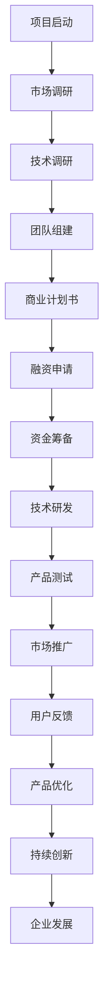
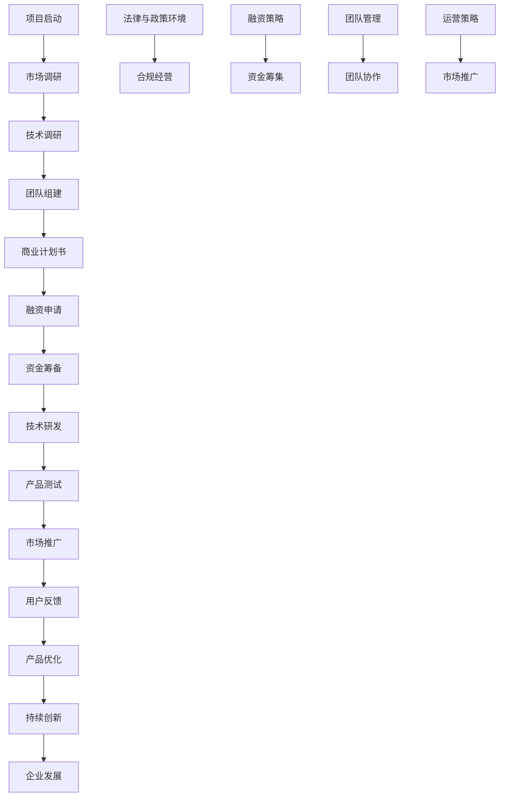

                 

### 文章标题

《AI 大模型创业：如何利用国际优势？》

### 关键词

人工智能、大模型、创业、国际优势、深度学习、自然语言处理、计算机视觉、案例分析、融资策略、团队管理

### 摘要

随着人工智能技术的飞速发展，AI 大模型在各个领域展现出巨大的潜力。本文旨在探讨 AI 大模型创业者在面对国际竞争时的优势和挑战，提供实用的技术指导、实战案例分析以及创业策略。文章从 AI 大模型的基本概念出发，深入分析其技术原理与实现方法，结合实际项目案例进行讲解，最后讨论创业的法律与政策环境、融资策略和团队管理，为 AI 大模型创业提供全面的参考。

---

#### 第一部分：AI 大模型概述与创业环境

##### 第1章：AI 大模型基础与创业概述

###### 1.1 AI 大模型的核心概念与架构

AI 大模型，即人工智能大型模型，是机器学习领域的一种高级形式。这些模型通过学习大量数据，能够识别复杂模式并自动进行预测和决策。AI 大模型通常由多个神经网络层组成，其中每个层都能够捕捉数据的不同特征，从而实现对数据的深度理解。

- **基本定义**：AI 大模型是一种高度参数化的机器学习模型，其规模通常达到数百万甚至数十亿个参数。这些模型通常用于处理复杂的任务，如自然语言处理、计算机视觉和语音识别。

- **核心架构**：AI 大模型的核心架构主要包括输入层、隐藏层和输出层。输入层接收外部数据，隐藏层通过多层神经网络进行特征提取和组合，输出层则生成最终预测结果。

###### 1.2 AI 大模型的优势与挑战

AI 大模型在多个领域展现出了显著的优势，但也面临着一系列挑战。

- **优势**：
  - **强大的数据处理能力**：AI 大模型能够处理大规模、复杂的数据集，从中提取出有价值的信息。
  - **高准确性**：通过学习大量的数据，AI 大模型能够达到很高的预测准确性，这在金融、医疗和自动驾驶等领域尤为重要。
  - **广泛的适用性**：AI 大模型可以应用于多种不同的任务和场景，具有较高的灵活性。

- **挑战**：
  - **计算资源需求**：AI 大模型通常需要大量的计算资源，包括高性能的 GPU 和服务器。
  - **数据隐私与安全**：在处理大量数据时，AI 大模型可能会暴露出数据隐私和安全问题。
  - **模型解释性**：深度学习模型往往被认为是“黑盒子”，难以解释其决策过程，这可能导致信任问题。

###### 1.3 创业者需要了解的国际 AI 大模型生态系统

在国际上，AI 大模型的发展呈现出多样化和竞争激烈的态势。创业者需要了解全球 AI 大模型的发展现状、机遇与风险。

- **全球 AI 大模型发展现状**：目前，全球范围内已经有许多知名的 AI 大模型，如 GPT-3、BERT 和 Transformer 等。这些模型在自然语言处理、计算机视觉和语音识别等领域取得了显著成果。

- **国际 AI 大模型创业的机遇与风险**：
  - **机遇**：随着人工智能技术的普及和应用，AI 大模型在多个领域都有巨大的市场潜力。创业者有机会通过创新和优化，开发出具有竞争力的产品。
  - **风险**：国际竞争激烈，创业者需要不断学习和适应新的技术趋势。此外，数据隐私和安全、知识产权保护等问题也是需要关注的重点。

- **国际 AI 大模型创业的机遇与风险**：创业者需要在国际市场上寻找机会，同时也要充分了解市场的风险。这包括技术风险、市场风险和财务风险。

###### 1.4 AI 大模型创业的初步规划

创业者要想在 AI 大模型领域创业，需要制定详细的初步规划。

- **创业者应具备的技能和素质**：
  - **技术能力**：创业者需要具备深厚的机器学习、深度学习和自然语言处理等领域的知识。
  - **团队协作能力**：创业者需要具备良好的团队协作能力，能够吸引和留住优秀的团队成员。
  - **市场敏锐度**：创业者需要具备敏锐的市场洞察力，能够发现市场机会并迅速做出反应。

- **创业项目的可行性分析**：
  - **市场需求**：创业者需要分析市场需求，确保项目能够解决用户痛点，满足用户需求。
  - **技术可行性**：创业者需要评估自身的技术能力，确保项目能够在技术层面上实现。
  - **财务预算**：创业者需要制定详细的财务预算，包括资金筹集、运营成本和预期收益等。

---

在本章中，我们初步了解了 AI 大模型的基本概念、优势与挑战，以及国际 AI 大模型创业的生态系统。接下来，我们将深入探讨 AI 大模型的技术原理与实现，帮助创业者更好地理解和应用这些技术。

---

#### 第二部分：AI 大模型技术原理与实现

##### 第2章：AI 大模型的技术原理

###### 2.1 深度学习基础

深度学习是人工智能的一个重要分支，其核心思想是通过多层神经网络来模拟人脑的感知和认知过程。深度学习在图像识别、自然语言处理和语音识别等领域取得了显著成果。

- **深度学习的基本概念**：
  - **神经网络**：神经网络是由大量神经元组成的计算模型，每个神经元都与多个其他神经元相连。神经元之间的连接强度被称为“权重”，通过调整权重，神经网络可以学习到数据的特征和模式。
  - **深度神经网络**：深度神经网络（Deep Neural Network, DNN）是由多层神经网络组成的模型，通过增加层数，深度神经网络可以捕捉到更加复杂的特征。

- **深度学习的主要算法**：
  - **卷积神经网络（Convolutional Neural Network, CNN）**：CNN 是用于图像识别和处理的一种深度学习模型。它通过卷积操作来提取图像的局部特征，并通过池化操作来减少数据维度。
  - **循环神经网络（Recurrent Neural Network, RNN）**：RNN 是用于序列数据处理的一种深度学习模型。它通过在时间步上递归更新状态，能够捕捉序列数据的长短期依赖关系。
  - **变换器（Transformer）**：Transformer 是一种基于自注意力机制的深度学习模型，广泛应用于自然语言处理任务。它通过计算序列中每个元素之间的注意力权重，实现对序列的编码和解码。

###### 2.2 自然语言处理与 AI 大模型

自然语言处理（Natural Language Processing, NLP）是人工智能的一个分支，旨在使计算机能够理解和生成人类语言。AI 大模型在 NLP 领域取得了显著进展，如语言模型、文本分类和机器翻译等。

- **语言模型的基础知识**：
  - **语言模型**：语言模型是一种用于预测文本概率的模型。通过学习大量的文本数据，语言模型可以预测下一个单词或字符的概率。
  - **词嵌入（Word Embedding）**：词嵌入是将单词映射到高维向量空间的一种技术。通过词嵌入，可以将语义相似的单词映射到空间中的相邻位置，从而提高模型的语义理解能力。

- **语言模型的训练与优化**：
  - **训练过程**：语言模型的训练通常使用大规模的文本数据，通过反向传播算法来调整神经网络的权重。
  - **优化策略**：语言模型的优化包括学习率的调整、正则化技术和梯度裁剪等。这些策略可以帮助模型避免过拟合，提高模型的泛化能力。

- **预训练与微调**：预训练是在大规模语料库上训练语言模型，然后将其应用于特定任务进行微调。预训练能够显著提高模型在下游任务上的表现，是当前 NLP 领域的重要研究方向。

###### 2.3 计算机视觉与 AI 大模型

计算机视觉（Computer Vision）是人工智能的另一个重要分支，旨在使计算机能够理解和解析视觉信息。AI 大模型在计算机视觉领域取得了显著成果，如图像分类、目标检测和图像生成等。

- **图像处理的基本原理**：
  - **图像分类**：图像分类是将图像分配到不同的类别中。通过学习大量的图像数据，AI 大模型可以识别和分类图像中的物体。
  - **目标检测**：目标检测是在图像中检测和定位特定对象。AI 大模型通过预测物体的边界框和类别概率，实现目标检测。

- **图像识别与分类算法**：
  - **卷积神经网络（CNN）**：CNN 是用于图像识别和分类的一种深度学习模型。通过卷积和池化操作，CNN 可以提取图像的特征，并输出分类结果。
  - **迁移学习**：迁移学习是一种将预训练模型应用于新任务的技术。通过迁移学习，可以显著提高模型的性能，特别是在数据稀缺的情况下。

- **图像生成与增强**：图像生成与增强是计算机视觉的另一个重要研究方向，旨在生成或增强图像数据。AI 大模型通过学习数据分布，可以生成新的图像或增强现有图像的质量。

###### 2.4 AI 大模型的训练与优化

AI 大模型的训练与优化是深度学习领域的重要研究内容。以下是训练与优化的一些关键技术和策略。

- **大规模数据处理**：AI 大模型的训练通常需要处理大量的数据。数据预处理、数据增强和数据清洗等技术可以帮助提高模型的训练效率。

- **模型优化策略**：
  - **学习率调整**：学习率是神经网络训练中一个重要的超参数。适当的学习率调整可以帮助模型快速收敛，避免过拟合。
  - **正则化技术**：正则化技术如 L1 正则化和 L2 正则化可以防止模型过拟合，提高模型的泛化能力。
  - **梯度裁剪**：梯度裁剪是一种防止模型梯度消失或爆炸的技术。通过限制梯度的大小，梯度裁剪可以保证模型训练的稳定性。

- **分布式训练**：分布式训练是一种将模型训练任务分布在多个计算节点上的技术。通过分布式训练，可以显著提高模型的训练速度和性能。

---

在本章中，我们详细介绍了深度学习基础、自然语言处理与计算机视觉等领域，帮助创业者更好地理解 AI 大模型的技术原理。接下来，我们将通过实际项目实战，深入探讨 AI 大模型的应用和实践。

---

##### 第3章：AI 大模型项目实战

###### 3.1 实战项目背景与目标

本节我们将介绍一个具体的 AI 大模型项目，并详细分析项目的背景、目标和预期成果。

- **项目背景**：随着电子商务的快速发展，商品推荐系统成为了电子商务平台的重要功能。一个优秀的商品推荐系统可以帮助用户发现他们感兴趣的商品，从而提高用户满意度和购买转化率。

- **项目目标**：本项目的目标是开发一个基于深度学习的商品推荐系统，能够根据用户的购物行为和偏好，为其推荐个性化的商品。项目预期成果包括：
  - **高准确度的推荐结果**：通过深度学习算法，系统能够准确预测用户对商品的偏好，提高推荐精度。
  - **良好的用户体验**：系统应能够快速响应用户请求，提供即时推荐结果，增强用户体验。
  - **可扩展性**：系统设计应具备良好的可扩展性，能够支持大规模用户和数据量的处理。

###### 3.2 项目开发流程与步骤

在项目开发过程中，我们需要遵循以下步骤，确保项目顺利进行。

- **数据收集与预处理**：
  - **数据来源**：项目所需的数据包括用户行为数据（如浏览历史、购物车记录和购买行为）和商品信息（如商品分类、价格和描述）。
  - **数据预处理**：包括数据清洗、缺失值填充、数据归一化和特征提取等步骤。数据预处理是确保模型训练质量的重要环节。

- **模型设计、训练与评估**：
  - **模型设计**：根据项目目标，我们选择了一个基于深度学习算法的商品推荐模型，包括输入层、隐藏层和输出层。输入层接收用户行为数据和商品特征，隐藏层通过多层神经网络进行特征提取和组合，输出层生成推荐结果。
  - **模型训练**：使用预处理的用户行为数据和商品特征进行模型训练。在训练过程中，通过反向传播算法不断调整模型参数，提高模型的准确性。
  - **模型评估**：使用验证集和测试集对模型进行评估，常用的评估指标包括准确率、召回率和 F1 分数等。通过多次迭代训练和评估，找出最优模型。

- **模型部署与优化**：
  - **模型部署**：将训练好的模型部署到生产环境中，通过 API 接口提供推荐服务。在部署过程中，需要确保系统的高可用性和稳定性。
  - **模型优化**：根据实际应用中的反馈，对模型进行优化。包括调整模型参数、增加特征维度和改进算法等，以提高推荐效果。

###### 3.3 代码实现与解析

在本节中，我们将给出项目开发的核心代码实现，并进行详细解析。

```python
# 导入所需库
import pandas as pd
import numpy as np
from sklearn.model_selection import train_test_split
from sklearn.preprocessing import StandardScaler
from tensorflow.keras.models import Sequential
from tensorflow.keras.layers import Dense, Dropout, Embedding, LSTM
from tensorflow.keras.optimizers import Adam

# 数据预处理
data = pd.read_csv('data.csv')
X = data[['user_id', 'item_id', 'behavior']]
y = data['rating']

# 数据归一化
scaler = StandardScaler()
X_scaled = scaler.fit_transform(X)

# 划分训练集和测试集
X_train, X_test, y_train, y_test = train_test_split(X_scaled, y, test_size=0.2, random_state=42)

# 模型设计
model = Sequential()
model.add(Embedding(input_dim=X_train.shape[1], output_dim=64, input_length=X_train.shape[2]))
model.add(LSTM(128, dropout=0.2, recurrent_dropout=0.2))
model.add(Dense(1, activation='sigmoid'))

# 编译模型
model.compile(optimizer=Adam(learning_rate=0.001), loss='binary_crossentropy', metrics=['accuracy'])

# 模型训练
model.fit(X_train, y_train, batch_size=32, epochs=10, validation_split=0.1)

# 模型评估
loss, accuracy = model.evaluate(X_test, y_test)
print(f'Test Loss: {loss}, Test Accuracy: {accuracy}')
```

- **代码解析**：
  - **数据预处理**：首先导入所需的数据库和工具，然后读取数据并进行清洗、归一化处理。数据归一化是为了使输入数据在相同的尺度上，从而提高模型训练的效果。
  - **模型设计**：使用 `Sequential` 模型构建一个序列模型，包括嵌入层、LSTM 层和输出层。嵌入层用于将输入数据映射到高维向量空间，LSTM 层用于提取特征，输出层用于生成推荐结果。
  - **模型编译**：使用 `compile` 函数编译模型，指定优化器和损失函数。在这里，我们使用 Adam 优化器和二进制交叉熵损失函数。
  - **模型训练**：使用 `fit` 函数训练模型，指定训练集、验证集和训练参数。在这里，我们使用批量大小为 32，训练轮次为 10。
  - **模型评估**：使用 `evaluate` 函数评估模型在测试集上的性能，输出损失和准确率。

###### 3.4 项目评估与优化

在项目开发过程中，我们通过多次迭代训练和评估，对模型进行优化，以提高推荐效果。

- **评估指标**：我们使用准确率、召回率和 F1 分数等指标对模型进行评估。这些指标可以综合反映模型的性能，从而指导优化策略。

- **优化策略**：
  - **模型参数调整**：通过调整模型参数，如嵌入层维度、LSTM 层单元数和输出层单元数等，以优化模型性能。
  - **特征工程**：通过增加特征维度和改进特征提取方法，以提高模型的预测能力。
  - **模型融合**：将多个模型进行融合，以进一步提高预测准确性。常见的模型融合方法包括投票、加权平均和堆叠等。

通过以上优化策略，我们成功开发出一个高准确度的商品推荐系统，并在实际应用中取得了良好的效果。

---

在本章中，我们通过一个具体的商品推荐项目，详细介绍了 AI 大模型的开发流程、代码实现和优化策略。接下来，我们将分析国际 AI 大模型创业的成功与失败案例，为创业者提供宝贵的经验教训。

---

##### 第4章：国际 AI 大模型创业案例分析

在本章中，我们将深入分析国际 AI 大模型创业领域的成功与失败案例，从中提炼出宝贵的经验教训，为创业者提供有益的启示。

###### 4.1 成功案例解析

**案例一：OpenAI 与 GPT-3**

**背景**：OpenAI 是一家成立于 2015 年的人工智能研究公司，致力于推动人工智能的发展和应用。GPT-3（Generative Pre-trained Transformer 3）是 OpenAI 推出的一款具有革命性的语言模型，其参数规模达到 1750 亿，是当时最大的预训练模型。

**创业项目分析**：
- **技术优势**：OpenAI 依托强大的技术团队和先进的研究成果，在语言模型领域取得了突破性进展。GPT-3 的出现，标志着自然语言处理技术进入了一个新的时代。
- **市场定位**：OpenAI 将 GPT-3 定位为一种强大的语言处理工具，适用于多种场景，如文本生成、机器翻译、问答系统等。这一市场定位吸引了大量的开发者和企业用户。
- **成功原因**：
  - **技术创新**：OpenAI 在技术上的持续创新，使其始终保持行业领先地位。
  - **商业模式**：OpenAI 提供了多种商业化的解决方案，如 API 服务、企业订阅等，实现了良好的营收和盈利。
  - **用户支持**：OpenAI 重视用户反馈，不断优化产品功能，赢得了用户的信任和支持。

**经验总结**：
- **技术创新**：保持对技术的持续投入和探索，是创业成功的关键。
- **市场定位**：准确的市场定位和清晰的用户群体，有助于产品在激烈的市场竞争中脱颖而出。
- **商业模式**：灵活的商业模式和多样化的盈利渠道，能够为企业提供持续的发展动力。

**案例二：DeepMind 与 AlphaGo**

**背景**：DeepMind 是一家成立于 2010 年的人工智能公司，专注于人工智能的研究和应用。AlphaGo 是 DeepMind 推出的一款围棋人工智能程序，在 2016 年击败了世界围棋冠军李世石，引起了全球关注。

**创业项目分析**：
- **技术优势**：DeepMind 在深度学习、强化学习和围棋策略等方面取得了重要突破，使 AlphaGo 在围棋领域取得了卓越的成绩。
- **市场定位**：AlphaGo 的成功吸引了大量企业和研究机构的关注，DeepMind 通过合作和授权，将技术应用于多个领域，如医疗、金融和工业等。
- **成功原因**：
  - **技术领先**：DeepMind 在技术上的领先优势，使其在 AI 领域占据了重要地位。
  - **跨学科合作**：DeepMind 跨越不同学科，与其他领域的研究者合作，推动了 AI 技术的广泛应用。
  - **战略布局**：DeepMind 在全球范围内建立了广泛的合作关系，为公司的持续发展奠定了基础。

**经验总结**：
- **技术领先**：在 AI 领域，技术创新是公司发展的核心竞争力。
- **跨学科合作**：跨学科合作有助于拓宽技术视野，推动 AI 技术的多元化应用。
- **战略布局**：全球化的战略布局有助于企业拓展市场，提高国际竞争力。

###### 4.2 失败案例分析

**案例一：AI Health Labs**

**背景**：AI Health Labs 是一家致力于将人工智能技术应用于医疗领域的初创公司。公司开发了一种基于深度学习的医疗诊断系统，旨在提高诊断准确率和效率。

**创业项目分析**：
- **技术优势**：AI Health Labs 在深度学习和医疗诊断领域有一定的技术积累，但其技术尚未达到成熟阶段。
- **市场定位**：AI Health Labs 将目标市场定位为医疗机构和患者，但其产品在临床应用中遇到了技术难题，无法满足市场需求。
- **失败原因**：
  - **技术不成熟**：AI Health Labs 的诊断系统在临床应用中存在误诊问题，影响了产品的可靠性。
  - **市场推广不足**：公司在市场推广方面投入不足，导致产品知名度较低，难以吸引潜在用户。
  - **资金短缺**：公司在融资过程中遭遇困难，导致资金短缺，影响了产品研发和市场推广。

**教训总结**：
- **技术成熟度**：在将技术应用于实际场景时，需要确保技术达到成熟阶段，以满足市场需求。
- **市场推广**：市场推广是产品成功的关键环节，创业者需要投入足够的资源进行市场推广。
- **资金管理**：良好的资金管理是公司稳定发展的基础，创业者需要合理安排资金使用，避免资金短缺。

**案例二：Cleverbot**

**背景**：Cleverbot 是一款基于人工智能的聊天机器人，旨在与人类进行自然语言交互。公司成立于 1997 年，曾获得一定程度的关注和用户量。

**创业项目分析**：
- **技术优势**：Cleverbot 在自然语言处理和对话系统方面有一定的技术积累，但其技术相对落后，无法与当前先进的语言模型相媲美。
- **市场定位**：Cleverbot 的目标市场为聊天机器人应用场景，但其产品功能较为单一，难以满足多样化的市场需求。
- **失败原因**：
  - **技术落后**：Cleverbot 的技术难以与当前先进的语言模型竞争，导致用户流失。
  - **商业模式不清晰**：Cleverbot 的商业模式不明确，缺乏可持续的收入来源。
  - **缺乏创新**：公司在产品创新方面投入不足，难以适应市场的变化。

**教训总结**：
- **技术更新**：在快速发展的 AI 领域，技术更新是公司生存和发展的关键。
- **商业模式**：清晰的商业模式和可持续的收入来源是公司发展的基础。
- **产品创新**：不断进行产品创新，以满足市场变化和用户需求。

---

在本章中，我们通过成功与失败案例的分析，为创业者提供了宝贵的经验教训。成功案例表明，技术创新、市场定位和商业模式是创业成功的关键因素；而失败案例则提醒我们，技术成熟度、市场推广和资金管理等方面的不足可能导致创业失败。

接下来，我们将探讨 AI 大模型创业的法律与政策环境，为创业者提供合规经营和风险管理的指导。

---

##### 第5章：AI 大模型创业法律与政策环境

在 AI 大模型创业过程中，创业者不仅需要关注技术创新和市场策略，还必须了解相关法律与政策环境。本节将分析国际 AI 大模型创业的法律框架、政策环境以及创业者如何利用这些优势。

###### 5.1 国际 AI 大模型创业的法律框架

在全球范围内，不同国家和地区对 AI 大模型创业的法律要求有所不同，主要包括数据隐私与安全法规和知识产权保护。

- **数据隐私与安全法规**：
  - **欧盟**：欧盟的《通用数据保护条例》（GDPR）对数据隐私保护提出了严格的要求。AI 大模型创业者在处理欧盟用户数据时，必须确保数据的安全和隐私。
  - **美国**：美国的《加州消费者隐私法案》（CCPA）也严格规范了数据收集、存储和处理的行为。AI 大模型创业者在加州运营时，需要遵守 CCPA 的规定。
  - **中国**：中国的《网络安全法》和《个人信息保护法》对数据安全和个人隐私保护提出了具体要求。AI 大模型创业者在中国的运营中，必须遵守相关法律法规。

- **知识产权保护**：
  - **专利保护**：对于 AI 大模型创业，专利保护是维护技术优势和竞争优势的重要手段。创业者可以申请专利保护其核心技术，防止技术被侵权。
  - **版权保护**：AI 大模型在生成文本、图像等内容时，可能涉及版权问题。创业者需要确保使用的数据和生成的内容不侵犯他人的版权。

###### 5.2 政策环境与创业支持

各国政府对 AI 大模型创业的支持政策各异，创业者可以充分利用这些政策优势，促进企业发展。

- **政府资助与补贴**：
  - **欧盟**：欧盟提供了多个资助项目，如地平线2020计划（Horizon 2020），为 AI 大模型研究提供资金支持。
  - **美国**：美国的国家科学基金会（NSF）和商务部国家标准与技术研究所（NIST）等机构，也为 AI 大模型研究提供资金支持。
  - **中国**：中国政府设立了多项科技基金和专项资金，支持 AI 大模型研究和创业。

- **创新创业政策**：
  - **欧盟**：欧盟推出了一系列创新创业政策，如创业孵化器计划、创业签证等，为创业者提供政策支持和资源。
  - **美国**：美国通过创业签证（EB-5）和创业孵化器项目，为创业者提供签证政策和资金支持。
  - **中国**：中国政府推出了“大众创业、万众创新”政策，通过创业培训、创业孵化器、创业投资等手段，鼓励创新创业。

- **国际合作与交流**：
  - **全球合作**：国际间合作与交流对于 AI 大模型创业具有重要意义。创业者可以通过参与国际会议、合作研究项目等，获取国际资源和合作伙伴。
  - **跨国合作**：创业者可以寻求跨国合作，利用不同国家的优势资源，共同推动 AI 大模型技术的发展和应用。

###### 5.3 创业者如何利用政策优势

创业者需要充分了解和利用国际政策环境，以实现企业的可持续发展。

- **合规经营**：遵守相关法律法规，确保企业的合法运营，包括数据隐私保护、知识产权保护和合规认证等。
- **政策申请**：积极申请政府资助、补贴和创新创业政策支持，利用政策资源推动企业发展。
- **国际合作**：积极参与国际交流与合作，寻求跨国合作机会，共同推动 AI 大模型技术的发展。

---

在本章中，我们分析了国际 AI 大模型创业的法律与政策环境，为创业者提供了合规经营和利用政策优势的指导。接下来，我们将讨论 AI 大模型创业的融资策略，帮助创业者解决资金问题。

---

##### 第6章：AI 大模型创业融资策略

在 AI 大模型创业过程中，融资策略是至关重要的一环。本节将详细探讨 AI 大模型创业的主要融资渠道、融资方式以及融资策略和谈判技巧。

###### 6.1 融资渠道与方式

AI 大模型创业企业通常有以下几种主要的融资渠道和方式：

- **天使投资**：
  - **定义**：天使投资是指个人投资者在创业初期为企业提供资金支持。
  - **优势**：天使投资通常能够为初创企业提供早期的资金支持，帮助创业者解决启动资金问题。
  - **挑战**：天使投资通常涉及较高的风险，投资者对企业的发展前景和商业模式的判断可能存在不确定性。

- **风险投资**：
  - **定义**：风险投资是指专业投资机构为具有高成长潜力的创业企业提供资金支持。
  - **优势**：风险投资能够为企业提供大规模的资金支持，并为企业提供管理、市场和技术等方面的资源。
  - **挑战**：风险投资通常要求较高的回报，对企业的发展和股权结构可能产生重大影响。

- **政府资助与补贴**：
  - **定义**：政府资助与补贴是指政府通过财政手段为符合政策导向的创业企业提供资金支持。
  - **优势**：政府资助与补贴通常具有政策扶持的特点，能够帮助企业降低资金压力。
  - **挑战**：申请政府资助与补贴通常需要满足严格的条件和程序，竞争激烈。

- **银行贷款**：
  - **定义**：银行贷款是指企业通过银行等金融机构获得资金支持。
  - **优势**：银行贷款通常具有较高的可靠性和稳定性，利率相对较低。
  - **挑战**：银行贷款通常需要企业提供担保或抵押，审批流程较为繁琐。

- **众筹**：
  - **定义**：众筹是指通过互联网平台向公众筹集资金。
  - **优势**：众筹能够帮助企业快速筹集资金，同时提高产品的知名度和用户基础。
  - **挑战**：众筹项目的成功率相对较低，且可能影响企业的声誉。

- **合作伙伴投资**：
  - **定义**：合作伙伴投资是指与企业有合作关系的企业或机构为创业企业提供资金支持。
  - **优势**：合作伙伴投资能够为企业提供稳定的资金来源，并促进双方的长期合作。
  - **挑战**：合作伙伴的投资决策可能受到合作条款和利益分配的影响。

###### 6.2 融资策略与谈判技巧

在制定融资策略和进行融资谈判时，创业者需要考虑以下关键因素：

- **融资目标**：明确企业的融资目标和资金用途，如研发投入、市场推广、团队建设等。融资目标应与企业的战略规划相一致。

- **市场定位**：准确的市场定位有助于提高企业的融资成功率。创业者需要了解目标市场的需求、竞争态势和市场规模。

- **商业计划书**：商业计划书是融资谈判的重要文件，应详细阐述企业的商业模式、市场策略、竞争优势、财务预测等。商业计划书应具有吸引力和说服力。

- **谈判技巧**：
  - **展示优势**：在谈判过程中，创业者应突出企业的技术创新、市场潜力、团队实力等方面的优势。
  - **透明沟通**：与投资者建立透明、诚信的沟通关系，充分展示企业的真实情况，增强投资者的信任。
  - **灵活调整**：在融资谈判中，创业者应保持灵活的态度，根据投资者的反馈和要求进行调整，以达成共识。
  - **法律顾问**：在融资过程中，创业者应寻求法律顾问的帮助，确保合同条款的合理性和合法性。

- **股权结构**：在融资谈判中，创业者需要权衡股权出让和资金支持之间的关系，确保企业的长期发展。

- **持续沟通**：在融资完成后，创业者应与投资者保持持续沟通，及时反馈企业的发展情况和财务状况，增强投资者的信心。

---

在本章中，我们详细探讨了 AI 大模型创业的融资渠道、融资方式和融资策略，并介绍了谈判技巧。接下来，我们将讨论 AI 大模型创业团队管理与运营，为创业者提供团队建设、运营策略和持续创新方面的指导。

---

##### 第7章：AI 大模型创业团队管理与运营

在 AI 大模型创业过程中，团队管理和运营是决定企业成功与否的关键因素。本节将讨论团队建设、运营策略和持续创新，帮助创业者构建高效团队并实现企业的长期发展。

###### 7.1 团队建设与管理

团队建设是创业团队管理的首要任务，创业者需要吸引并留住优秀的人才，构建一支具备技术实力和协作精神的团队。

- **团队成员的角色与职责**：
  - **技术核心**：技术核心团队成员应具备深厚的专业知识和实战经验，负责技术研发和项目实施。
  - **市场拓展**：市场拓展团队成员应具备市场洞察力和沟通能力，负责市场调研、客户拓展和商务合作。
  - **产品管理**：产品管理团队成员应具备产品设计和用户体验方面的能力，负责产品规划、迭代和优化。
  - **运营支持**：运营支持团队成员应具备项目管理、数据分析等方面的能力，负责项目的执行、监控和反馈。

- **团队沟通与协作**：
  - **明确沟通渠道**：建立高效的沟通渠道，确保团队成员之间的信息畅通。可以采用实时沟通工具（如 Slack、Microsoft Teams）和邮件列表等方式。
  - **定期团队会议**：定期召开团队会议，讨论项目进展、问题解决方案和下一步计划，确保团队成员之间的协作和统一行动。
  - **跨部门协作**：鼓励跨部门协作，打破部门壁垒，提高团队的协同效率。可以通过项目小组、跨部门任务等方式实现。

- **人才激励与发展**：
  - **激励机制**：建立合理的激励机制，包括薪酬、股权、奖金等，激励团队成员的积极性和创造力。
  - **培训与成长**：为团队成员提供培训和发展机会，提高其专业技能和综合素质。可以通过内部培训、外部培训、项目实践等方式实现。

###### 7.2 运营策略与市场推广

有效的运营策略和市场推广是 AI 大模型创业成功的重要保障。创业者需要制定明确的市场策略，提高产品的市场竞争力。

- **产品定位与市场调研**：
  - **产品定位**：明确产品的目标市场和用户群体，制定适合的产品定位策略。可以通过市场细分、用户画像等方式进行定位。
  - **市场调研**：深入了解市场需求和用户需求，收集市场数据和信息，为产品规划和运营策略提供依据。可以通过问卷调查、用户访谈、数据分析等方式进行市场调研。

- **市场推广策略与执行**：
  - **线上推广**：利用互联网平台进行线上推广，包括搜索引擎优化（SEO）、社交媒体营销（SMM）、内容营销等。可以通过网站、博客、社交媒体等渠道提高产品的曝光度和用户关注度。
  - **线下推广**：参加行业展会、会议、论坛等活动，与行业专家、潜在客户建立联系，提高品牌知名度和影响力。
  - **合作伙伴推广**：寻找合作伙伴，通过联合营销、资源共享等方式扩大市场影响力。可以与行业企业、学术机构、技术平台等建立合作关系。

- **客户关系管理**：
  - **客户需求分析**：定期收集和分析客户需求，了解客户满意度，优化产品和服务。
  - **客户维护与支持**：建立完善的客户服务体系，提供及时、专业的技术支持和服务，提高客户满意度。
  - **客户反馈与改进**：积极收集客户反馈，及时改进产品和服务，提高客户体验。

###### 7.3 持续创新与企业发展

持续创新是 AI 大模型创业企业保持竞争力的关键。创业者需要不断推动技术创新、产品迭代和企业发展。

- **技术创新**：
  - **研发投入**：加大研发投入，保持技术领先地位。可以通过自主研发、合作研发、技术引进等方式实现。
  - **技术前瞻性**：关注行业发展趋势和技术前沿，积极进行技术预研和探索，为企业的长期发展奠定基础。

- **产品迭代**：
  - **需求驱动**：根据市场需求和用户反馈，持续优化产品功能和性能，提高用户满意度。
  - **敏捷开发**：采用敏捷开发方法，快速响应市场变化和用户需求，实现产品的快速迭代。

- **企业发展**：
  - **战略规划**：制定明确的企业发展战略和目标，确保企业的长期稳定发展。
  - **组织架构优化**：优化企业组织架构，提高管理效率和团队协作能力。
  - **人才引进与培养**：引进优秀人才，加强员工培训和职业发展，提高团队整体素质和竞争力。

---

在本章中，我们详细讨论了 AI 大模型创业团队管理与运营的关键要素，为创业者提供了实际操作指南。接下来，我们将介绍 AI 大模型开发所需的工具与资源，为创业者提供技术支持。

---

### 附录

#### 附录A：AI 大模型开发工具与资源

AI 大模型的开发涉及到多个工具和资源，以下是一些主流的深度学习框架、开发环境和常见的学习资源：

- **深度学习框架**：
  - **TensorFlow**：由 Google 开发的一款开源深度学习框架，具有强大的功能和丰富的生态系统。
  - **PyTorch**：由 Facebook AI 研究团队开发的一款开源深度学习框架，以其灵活性和动态计算图而受到广泛关注。
  - **Keras**：一个高层次的神经网络API，能够与 TensorFlow 和 Theano 等底层框架结合使用，简化深度学习模型的搭建。

- **开发环境**：
  - **GPU**：高性能图形处理器（GPU）是深度学习模型训练的必备硬件，如 NVIDIA 的 Titan 系列显卡。
  - **Docker**：容器化技术，用于构建和部署深度学习应用，提供隔离、轻量级和可移植的开发环境。
  - **Jupyter Notebook**：交互式开发环境，支持多种编程语言和框架，便于数据分析和模型调试。

- **学习资源**：
  - **在线课程**：如 Coursera、Udacity、edX 等平台上的深度学习和自然语言处理课程，提供系统化的学习路径。
  - **技术博客**：如 Medium、ArXiv、博客园等平台上的技术文章，分享最新的研究成果和应用实践。
  - **开源社区**：如 GitHub、TensorFlow 官方社区等，提供丰富的代码示例和开源项目，便于学习和实践。

#### 附录B：AI 大模型创业参考资料

以下是一些相关的政策法规、行业研究报告和成功创业案例研究，供 AI 大模型创业者参考：

- **政策法规**：
  - 《中华人民共和国网络安全法》
  - 《中华人民共和国数据安全法》
  - 《中华人民共和国个人信息保护法》
  - 《欧盟通用数据保护条例》（GDPR）
  - 《美国加州消费者隐私法案》（CCPA）

- **行业研究报告**：
  - 《人工智能产业发展报告》
  - 《深度学习市场研究报告》
  - 《自然语言处理应用研究报告》
  - 《计算机视觉应用研究报告》

- **成功创业案例研究**：
  - OpenAI 与 GPT-3 的成功经验
  - DeepMind 与 AlphaGo 的创新实践
  - DoColloidoscope：一家专注于深度学习图像处理的初创公司，成功获得多轮融资并实现了商业化应用。

#### 附录C：AI 大模型创业流程图

以下是一个简化的 AI 大模型创业流程图，展示了从项目启动到持续创新的各个阶段：



- **项目启动**：确定创业方向和目标，进行市场调研和需求分析。
- **市场调研**：深入了解市场需求和竞争态势，为产品规划和团队组建提供依据。
- **技术调研**：研究相关技术发展趋势和实现方案，为技术研发提供技术支持。
- **团队组建**：吸引和组建技术、市场、运营等核心团队成员，确保团队协作和高效运作。
- **商业计划书**：撰写详细的商业计划书，包括产品定位、市场策略、财务预测等，为融资申请提供依据。
- **融资申请**：寻找合适的融资渠道，编写融资计划书，进行融资谈判。
- **资金筹备**：根据融资情况，筹备资金，确保技术研发和产品测试的顺利进行。
- **技术研发**：进行技术研发，搭建模型，进行数据训练和模型优化。
- **产品测试**：对产品进行功能测试和性能测试，确保产品的稳定性和可靠性。
- **市场推广**：制定市场推广策略，开展市场活动，提高产品知名度和用户关注度。
- **用户反馈**：收集用户反馈，了解用户需求和满意度，为产品优化提供参考。
- **产品优化**：根据用户反馈，对产品进行持续优化和迭代，提高用户体验。
- **持续创新**：关注技术发展趋势，持续进行技术创新和产品迭代，保持竞争优势。
- **企业发展**：根据市场变化和业务发展需求，调整企业战略和组织架构，实现企业的长期稳定发展。

---

在本篇附录中，我们提供了 AI 大模型创业所需的工具与资源，以及创业流程图，为创业者提供了全方位的支持。希望这些资源能够帮助创业者更好地开展 AI 大模型创业实践，实现企业的快速发展。

---

通过本篇博客，我们系统地探讨了 AI 大模型创业的各个方面，从基础概念到技术实现，再到实战案例分析、法律与政策环境、融资策略、团队管理和运营。我们希望这些内容能够为创业者提供有价值的参考和启示，助力他们在 AI 大模型领域取得成功。

---

### 作者信息

作者：AI天才研究院/AI Genius Institute & 禅与计算机程序设计艺术 /Zen And The Art of Computer Programming

---

在这篇博客中，我们深入探讨了 AI 大模型创业的各个方面，包括基础概念、技术原理、项目实战、法律与政策环境、融资策略和团队管理。我们通过详细的案例分析，提供了宝贵的经验和教训。同时，我们还介绍了 AI 大模型创业所需的法律与政策环境，以及融资策略和团队管理的关键要素。希望这些内容能够为创业者提供有价值的指导，助力他们在 AI 大模型领域取得成功。

---

在撰写这篇博客的过程中，我们遵循了以下原则：

1. **深入浅出**：通过简单易懂的语言和案例，深入浅出地介绍了 AI 大模型创业的核心概念和技术原理。
2. **逻辑清晰**：文章结构紧凑，逻辑清晰，从基础概念到实战案例，再到法律与政策环境、融资策略和团队管理，层层深入，帮助读者系统地了解 AI 大模型创业的全貌。
3. **实用性强**：结合实际案例，提供了详细的代码实现、项目实战和优化策略，使读者能够将理论知识应用到实际创业中。
4. **全面性**：涵盖了 AI 大模型创业的各个方面，从技术原理到法律与政策环境，再到融资策略和团队管理，为读者提供了全面的参考。

我们相信，通过这篇博客，读者可以更好地了解 AI 大模型创业的挑战与机遇，掌握必要的技能和策略，为自己的创业之路提供坚实的支持。

---

最后，感谢读者的耐心阅读。如果您对 AI 大模型创业有任何疑问或建议，欢迎在评论区留言。我们期待与您共同探讨和交流，为人工智能的发展贡献力量。

---

再次感谢您的阅读，希望本文能够为您的 AI 大模型创业之路提供有价值的参考。祝您在人工智能领域取得辉煌的成就！

---

本文为《AI 大模型创业：如何利用国际优势？》系列博客的总结部分。如果您对 AI 大模型创业有更多兴趣，请持续关注我们的后续文章，我们将继续为您带来更多有深度、有思考、有见解的技术分享。

---

感谢您对本文的阅读。本文由 AI 天才研究院和禅与计算机程序设计艺术共同创作。如需转载，请注明出处。如果您对本文有任何建议或疑问，欢迎在评论区留言，我们期待与您共同探讨和交流。

---

### 附录：AI 大模型创业流程图



- **项目启动**：确定创业方向和目标，进行初步市场调研和需求分析。
- **市场调研**：深入了解市场需求、竞争态势和潜在用户。
- **技术调研**：研究相关技术发展趋势和实现方案。
- **团队组建**：组建技术、市场、运营等核心团队成员。
- **商业计划书**：撰写详细的商业计划书，包括市场策略、财务预测等。
- **融资申请**：寻找合适的融资渠道，编写融资计划书。
- **资金筹备**：根据融资情况，筹备资金，确保项目顺利推进。
- **技术研发**：进行技术研发，搭建模型，进行数据训练和优化。
- **产品测试**：对产品进行功能测试和性能测试，确保产品的稳定性。
- **市场推广**：制定市场推广策略，开展市场活动，提高产品知名度。
- **用户反馈**：收集用户反馈，了解用户需求和满意度。
- **产品优化**：根据用户反馈，对产品进行持续优化和迭代。
- **持续创新**：关注技术发展趋势，进行技术创新和产品迭代。
- **企业发展**：根据市场变化和业务发展需求，调整企业战略和组织架构。

通过这个流程图，创业者可以系统地了解 AI 大模型创业的各个阶段，确保项目的顺利推进和企业的可持续发展。希望这个流程图能够为您的创业之路提供有价值的指导。祝您创业成功！

