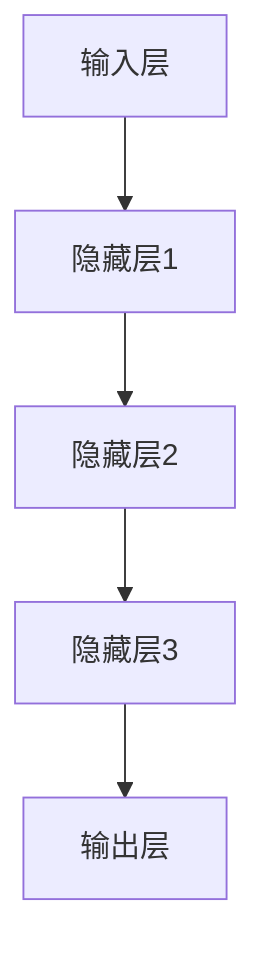
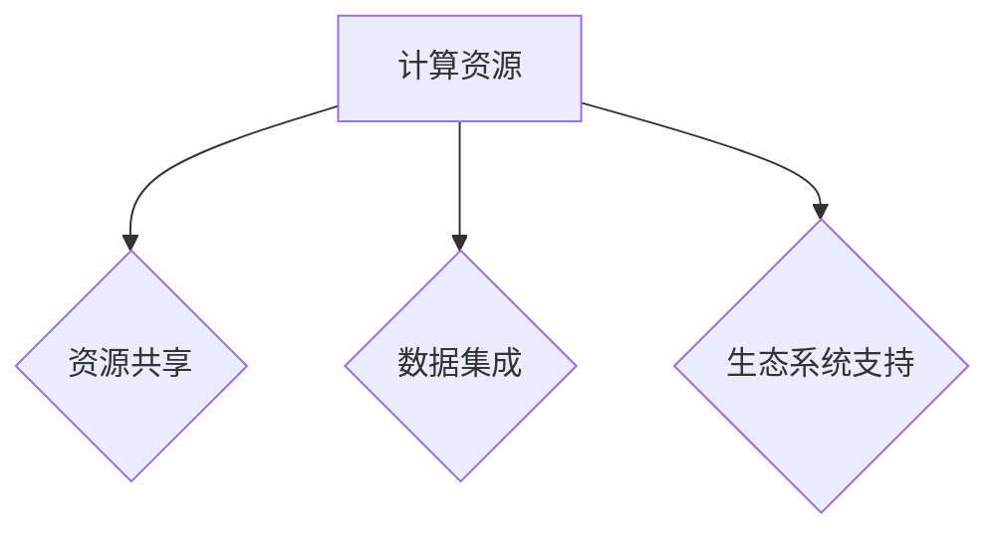
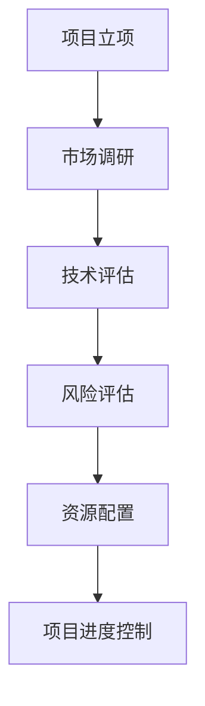
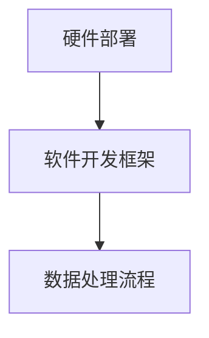
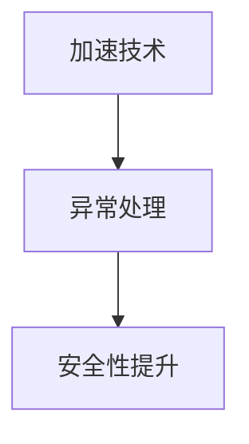
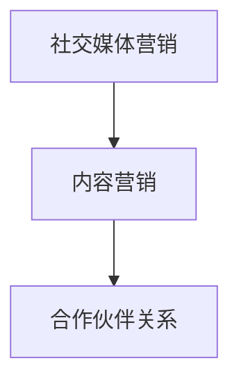
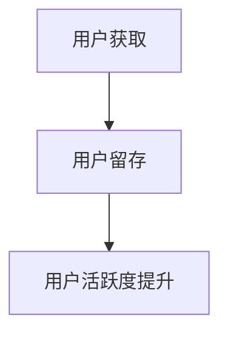
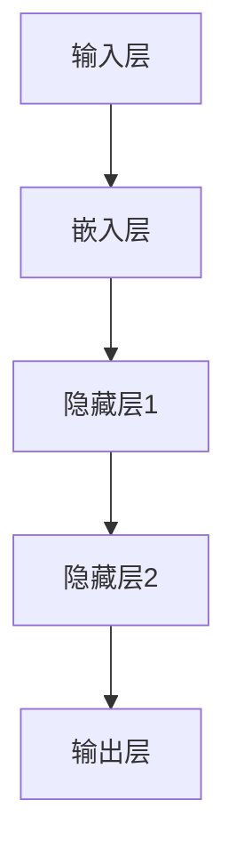

                 

# 文章标题: AI大模型创业：如何利用平台优势？

> 关键词：AI大模型、平台优势、创业、技术基础、实战案例、未来趋势

> 摘要：本文将深入探讨AI大模型创业领域的机遇与挑战，分析如何充分利用平台优势进行创新。通过技术基础讲解、实战案例分析以及未来趋势展望，为创业者和投资者提供有价值的参考。

----------------------------------------------------------------

### 第一部分：AI大模型创业概述

#### 1.1 AI大模型创业背景与意义

##### 1.1.1 AI大模型的发展历程

AI大模型的发展可以追溯到20世纪80年代末90年代初，当时神经网络技术开始受到关注。早期的大模型如Neural Network Language Model（NNLM）和Deep Belief Network（DBN）奠定了基础。然而，由于计算资源和数据限制，这些模型并未得到广泛应用。

随着计算能力的提升和大数据的兴起，2012年AlexNet在ImageNet竞赛中取得突破性成果，标志着深度学习的崛起。此后，大规模预训练模型如GPT、BERT、BERT-GPT等相继出现，推动了AI大模型的研究与应用。

##### 1.1.2 AI大模型在商业领域的应用前景

AI大模型在商业领域具有广泛的应用前景。首先，它们能够提高数据处理和分析效率，为企业提供智能决策支持。例如，在金融领域，大模型可用于风险评估、市场预测等；在医疗领域，大模型能够辅助诊断、疾病预测等。其次，AI大模型能够提升用户体验，如智能客服、个性化推荐等。此外，大模型在自动化、智能交通等领域也具有巨大的潜力。

##### 1.1.3 创业者为何选择AI大模型作为创业方向

选择AI大模型作为创业方向的原因主要有以下几点：

1. 技术前沿：AI大模型是当前人工智能领域的热点，具有广阔的发展空间。
2. 应用广泛：AI大模型在多个领域具有应用潜力，为创业项目提供了多样化的选择。
3. 商业价值：AI大模型能够为企业带来显著的商业价值，有助于提升竞争力。
4. 政策支持：各国政府纷纷出台政策支持人工智能发展，为创业者提供了良好的外部环境。

#### 1.2 平台优势与AI大模型创业

##### 1.2.1 平台优势的概述

平台优势是指通过构建和维护一个高效、稳定、可扩展的平台，为创业者提供全方位的支持，包括计算资源、数据资源、开发工具、生态系统等。平台优势的核心在于资源共享、协同创新和快速迭代。

##### 1.2.2 平台优势在AI大模型创业中的应用

平台优势在AI大模型创业中的应用主要体现在以下几个方面：

1. 资源共享：平台为创业者提供了丰富的计算资源和数据资源，降低了创业门槛。
2. 技术支持：平台提供了完善的开发工具和生态系统，助力创业者快速开发和应用AI大模型。
3. 协同创新：平台促进了创业者之间的交流与合作，共同推动AI大模型的发展。
4. 快速迭代：平台支持快速部署和更新，使创业者能够迅速响应市场需求。

##### 1.2.3 平台优势与创业成功的关系

平台优势对创业成功具有重要影响。一方面，平台提供了资源和支持，降低了创业风险；另一方面，平台优势有助于创业者抓住市场机遇，实现快速发展。因此，充分利用平台优势是AI大模型创业成功的关键因素之一。

----------------------------------------------------------------

### 第二部分：AI大模型技术基础

#### 2.1 AI大模型的核心技术

##### 2.1.1 大模型的基本原理

大模型是指具有数十亿到数万亿参数的深度学习模型。其基本原理是通过大量数据进行训练，从而学习到复杂的数据分布和规律。

1. **定义**：大模型是指具有数十亿到数万亿参数的深度学习模型。
2. **特点**：
   - **参数规模大**：能够捕捉到更复杂的数据特征。
   - **计算需求高**：需要强大的计算资源和优化算法。
   - **数据处理能力强**：能够处理海量数据，适用于各种应用场景。

##### 2.1.2 大模型的架构

大模型的架构通常包括以下几个层次：

1. **输入层**：接收外部输入数据，如文本、图像等。
2. **隐藏层**：通过多层神经网络对输入数据进行处理，提取特征。
3. **输出层**：根据训练数据生成预测结果或决策。

以下是神经网络架构的Mermaid流程图：

##### 2.1.3 大模型的应用领域

大模型在多个领域具有广泛应用，主要包括：

1. **自然语言处理**：如文本生成、机器翻译、情感分析等。
2. **计算机视觉**：如图像分类、目标检测、人脸识别等。
3. **语音识别**：如语音合成、语音识别、语音翻译等。
4. **推荐系统**：如商品推荐、内容推荐等。

##### 2.2 平台开发工具与平台优势

##### 2.2.1 开发工具概述

目前，主流的深度学习框架包括TensorFlow、PyTorch和其他一些开源项目。以下是这些工具的概述：

1. **TensorFlow**：由谷歌开发，具有丰富的API和生态系统，适用于各种应用场景。
2. **PyTorch**：由Facebook开发，以动态计算图著称，易于调试和部署。
3. **其他主流工具**：如Keras、MXNet等，各具特色。

##### 2.2.2 平台优势分析

平台优势主要体现在以下几个方面：

1. **资源共享**：平台为创业者提供了丰富的计算资源和数据资源，降低了创业成本。
2. **数据集成**：平台支持多种数据格式和来源的集成，提高了数据处理效率。
3. **生态系统支持**：平台拥有完善的开发工具和生态系统，助力创业者快速开发和应用大模型。

----------------------------------------------------------------

### 第三部分：AI大模型创业实战

#### 3.1 AI大模型创业项目规划

##### 3.1.1 项目规划流程

AI大模型创业项目规划主要包括以下几个步骤：

1. **项目立项**：明确项目目标、市场定位和商业模式。
2. **市场调研**：分析市场需求、竞争格局和潜在客户。
3. **技术评估**：评估所选技术方案的技术可行性、性能和成本。
4. **风险评估**：分析项目风险，制定风险应对策略。
5. **资源配置**：确定项目所需的人力、物力和财力资源。
6. **项目进度控制**：制定项目进度计划，确保项目按期完成。

以下是项目规划流程的Mermaid流程图：

##### 3.1.2 项目规划要点

在项目规划过程中，需要关注以下要点：

1. **风险评估**：识别潜在风险，制定应对策略，确保项目顺利进行。
2. **资源配置**：合理分配资源，确保项目所需的人力、物力和财力充足。
3. **项目进度控制**：制定详细的进度计划，确保项目按期完成。

#### 3.2 平台搭建与优化

##### 3.2.1 平台架构设计

AI大模型平台的架构设计主要包括以下几个方面：

1. **硬件部署**：选择合适的硬件设备，如GPU、CPU、存储设备等。
2. **软件开发框架**：选择适合大模型训练和部署的软件开发框架，如TensorFlow、PyTorch等。
3. **数据处理流程**：设计数据处理流程，包括数据采集、清洗、预处理等。

以下是平台架构设计的Mermaid流程图：

##### 3.2.2 平台性能优化

平台性能优化主要包括以下几个方面：

1. **加速技术**：利用GPU、TPU等硬件加速计算。
2. **异常处理**：设计异常处理机制，确保系统稳定运行。
3. **安全性提升**：加强数据安全和系统安全，防止数据泄露和系统攻击。

以下是平台性能优化的Mermaid流程图：

#### 3.3 项目推广与运营

##### 3.3.1 市场推广策略

市场推广策略主要包括以下几个方面：

1. **社交媒体营销**：利用微博、微信公众号、知乎等社交媒体平台进行宣传。
2. **内容营销**：通过博客、技术文章、案例分享等吸引潜在客户。
3. **合作伙伴关系**：与相关行业的企业建立合作关系，共同推广项目。

以下是市场推广策略的Mermaid流程图：

##### 3.3.2 用户运营

用户运营主要包括以下几个方面：

1. **用户获取**：通过各种渠道吸引潜在用户，如线上广告、线下活动等。
2. **用户留存**：通过提供优质服务、优化用户体验等方式提高用户留存率。
3. **用户活跃度提升**：通过活动激励、社群运营等方式提高用户活跃度。

以下是用户运营的Mermaid流程图：

#### 3.4 成功案例分析

##### 3.4.1 案例一：OpenAI的GPT-3

GPT-3是OpenAI推出的一款大规模预训练语言模型，具有以下技术特点：

1. **参数规模大**：GPT-3拥有1750亿个参数，是当前最大的语言模型。
2. **性能卓越**：GPT-3在多个自然语言处理任务上取得了优异的成绩。
3. **应用广泛**：GPT-3被广泛应用于文本生成、机器翻译、对话系统等领域。

以下是GPT-3的架构图：

##### 3.4.2 案例二：谷歌的BERT

BERT是谷歌推出的一款预训练语言模型，具有以下技术特点：

1. **双向训练**：BERT采用双向训练方式，能够更好地理解上下文信息。
2. **性能优秀**：BERT在多个自然语言处理任务上取得了优异的成绩。
3. **应用广泛**：BERT被广泛应用于文本分类、问答系统、文本生成等领域。

以下是BERT的架构图：

----------------------------------------------------------------

### 第四部分：AI大模型创业的未来趋势

#### 4.1 AI大模型创业的未来方向

##### 4.1.1 产业应用拓展

AI大模型在产业应用方面具有广阔的前景。未来，AI大模型将在更多领域得到应用，如智能制造、智慧医疗、智能交通、金融科技等。以下是一些具体方向：

1. **智能制造**：AI大模型可以用于生产线的智能监控、故障预测、设备维护等。
2. **智慧医疗**：AI大模型可以用于疾病诊断、病情预测、个性化治疗方案设计等。
3. **智能交通**：AI大模型可以用于交通流量预测、交通信号控制、智能导航等。
4. **金融科技**：AI大模型可以用于风险控制、欺诈检测、信用评估等。

##### 4.1.2 技术创新展望

未来，AI大模型的技术创新将继续推动领域的发展。以下是一些可能的创新方向：

1. **大模型架构优化**：研究更高效、更稳定的大模型架构，提高训练效率和性能。
2. **跨领域技术融合**：将AI大模型与其他技术如大数据、云计算、物联网等相结合，实现更广泛的应用。
3. **可解释性增强**：研究可解释性的方法，提高AI大模型的可解释性和可信度。

##### 4.1.3 政策与法规影响

政策与法规对AI大模型创业具有重要影响。未来，各国政府将继续出台相关政策，推动人工智能的发展。以下是一些可能的影响：

1. **数据隐私保护**：加强对数据隐私的保护，规范数据收集、存储和使用。
2. **算法公平性监管**：加强对算法公平性的监管，确保AI大模型的应用不会歧视特定群体。
3. **知识产权保护**：加强对知识产权的保护，鼓励技术创新和产业发展。

#### 4.2 AI大模型创业者的成功要素

##### 4.2.1 创新能力

创新能力是AI大模型创业者成功的关键因素之一。创业者需要具备以下能力：

1. **技术创新**：不断探索和研究新技术，提高模型性能和效率。
2. **商业模式创新**：探索新的商业模式，实现商业价值最大化。
3. **应用创新**：将AI大模型应用于新的领域和场景，推动产业升级。

##### 4.2.2 团队建设

团队建设是AI大模型创业者成功的重要保障。创业者需要关注以下几个方面：

1. **团队成员选拔**：选拔具有专业技能和团队合作精神的人才。
2. **团队协作与激励机制**：建立良好的团队协作机制，激发团队成员的积极性和创造力。
3. **人才培养与激励**：提供培训和发展机会，激励团队成员不断提升自身能力。

##### 4.2.3 资源整合

资源整合能力是AI大模型创业者成功的关键因素之一。创业者需要具备以下能力：

1. **资金筹集**：通过多种途径筹集资金，确保项目顺利进行。
2. **人才引进**：吸引和引进优秀人才，提升团队整体实力。
3. **合作伙伴关系建立**：与相关行业的企业建立合作关系，共同推进项目发展。

----------------------------------------------------------------

### 附录

#### 附录A：AI大模型创业资源汇总

##### A.1 学术研究资源

AI大模型领域的学术研究资源丰富，主要包括以下内容：

1. **主要研究机构**：
   - OpenAI
   - Google Brain
   - Microsoft Research
   - Facebook AI Research

2. **学术期刊与会议**：
   - Neural Information Processing Systems (NIPS)
   - Conference on Computer Vision and Pattern Recognition (CVPR)
   - International Conference on Machine Learning (ICML)

##### A.2 开发工具与平台

AI大模型开发工具和平台主要包括以下内容：

1. **主流深度学习框架**：
   - TensorFlow
   - PyTorch
   - Keras
   - MXNet

2. **开源项目与社区**：
   - GitHub
   - AI Stack Overflow
   - Kaggle

##### A.3 政策法规指南

AI大模型领域的政策法规指南主要包括以下内容：

1. **国家政策**：
   - 中国：人工智能发展规划（2016-2020年）
   - 美国：美国人工智能倡议（AI Initiative）
   - 欧洲：人工智能伦理准则（AI Ethics Guidelines）

2. **地方政策**：
   - 各省市出台的关于人工智能发展的专项政策

3. **国际法规与标准**：
   - 国际标准化组织（ISO）相关标准
   - 国际电信联盟（ITU）相关标准

----------------------------------------------------------------

### 作者

作者：AI天才研究院/AI Genius Institute & 禅与计算机程序设计艺术 /Zen And The Art of Computer Programming

---

本文以深入浅出的方式，对AI大模型创业领域进行了全面的探讨。通过对AI大模型技术基础、创业实战和未来趋势的讲解，为创业者和投资者提供了有价值的参考。希望本文能够为AI大模型创业之路提供一些启示和帮助。在未来的发展中，AI大模型将继续引领科技前沿，为各行各业带来巨大的变革和创新。让我们共同期待AI大模型创业的辉煌未来！

