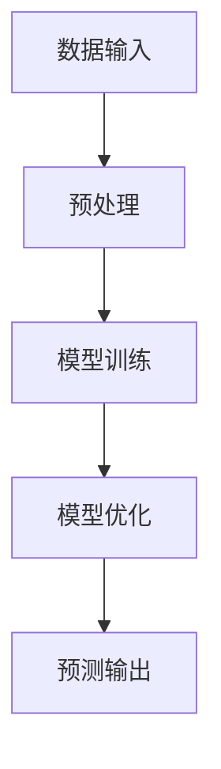
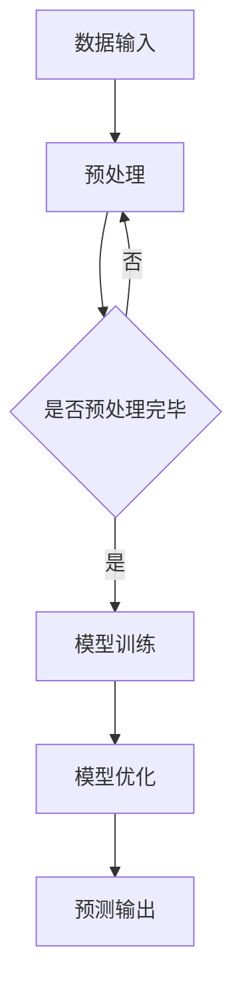

                 

# 《AI 大模型创业：如何利用平台优势？》

> 关键词：AI 大模型、创业、平台优势、商业模式、核心技术、数据资源、案例分析、挑战与解决方案

> 摘要：本文将探讨 AI 大模型创业如何利用平台优势，从背景与趋势、商业模式、核心技术、数据资源、实战案例、挑战与解决方案以及未来展望等方面进行深入分析，旨在为创业者提供有价值的参考。

#### 第一部分: AI 大模型创业概述

##### 第1章: AI 大模型创业的背景与趋势

> **1.1 AI 大模型创业的背景**

随着人工智能技术的快速发展，AI 大模型在各个行业中的应用潜力日益凸显。AI 大模型具有处理大规模数据、自动学习与优化等优势，正在改变着各行各业的运作方式。特别是在深度学习和自然语言处理等领域，AI 大模型已经取得了显著的突破。这些技术进步为创业者提供了丰富的机会，促使他们积极投身于 AI 大模型创业。

AI 大模型创业的背景主要源于以下几个方面：

- **人工智能技术的突破**：随着深度学习、神经网络等技术的进步，大模型在处理复杂任务方面的性能不断提升，为创业提供了强有力的技术支撑。
- **商业需求的激增**：各行业对智能化、自动化解决方案的需求日益增长，AI 大模型成为满足这些需求的重要工具。
- **数据资源的积累**：大数据的积累为 AI 大模型提供了丰富的训练数据，使得模型能够更好地学习和优化。

> **1.2 AI 大模型创业的趋势**

当前，AI 大模型创业呈现出以下几大趋势：

- **新兴领域的大模型创业案例**：人工智能在金融、医疗、教育等新兴领域的应用逐渐深入，创业者纷纷在这些领域探索大模型的应用场景。
- **传统行业与 AI 大模型的融合**：传统行业如制造、零售等开始积极引入 AI 大模型技术，以提升生产效率和服务质量。
- **未来 AI 大模型创业的发展方向**：随着技术的不断进步和应用的拓展，未来 AI 大模型创业将向更多领域延伸，包括智能城市、智能家居等。

总之，AI 大模型创业背景和趋势表明，这是一个充满机遇和挑战的领域。创业者需要紧跟技术发展，把握市场机遇，充分发挥平台优势，才能在竞争中脱颖而出。

##### 第2章: AI 大模型创业的商业模式

> **2.1 平台优势在商业模式中的作用**

在 AI 大模型创业中，平台优势起着至关重要的作用。平台经济作为一种新兴商业模式，通过构建生态系统，实现多方共赢。对于 AI 大模型创业公司来说，平台优势主要体现在以下几个方面：

- **资源整合**：平台能够汇集各方资源，包括数据、技术、人才等，为创业公司提供全方位的支持。
- **市场拓展**：平台为创业公司提供了一个广阔的市场，降低了市场准入门槛，有利于公司快速占领市场份额。
- **生态系统构建**：平台可以搭建一个生态系统，吸引合作伙伴加入，共同推动产业发展。

> **2.2 创业公司的商业模式设计**

AI 大模型创业公司的商业模式设计需要考虑以下几个方面：

- **核心业务定位**：明确创业公司的核心业务，如提供大模型服务、构建行业解决方案等。
- **盈利模式**：设计合理的盈利模式，如订阅服务、项目合作、数据销售等。
- **合作伙伴关系**：与产业链上下游企业建立紧密的合作关系，共同推动产业发展。

在商业模式设计过程中，创业公司需要充分发挥平台优势，构建一个可持续发展的商业生态系统。以下是一个典型的 AI 大模型创业公司商业模式设计：

1. **核心业务定位**：提供定制化的 AI 大模型服务，满足不同行业的需求。
2. **盈利模式**：通过订阅服务收取费用，同时与行业合作伙伴进行项目合作，获取额外收入。
3. **合作伙伴关系**：与数据提供商、技术服务商、行业专家等建立合作关系，共同推动大模型技术在各行业的应用。

通过这样的商业模式设计，创业公司可以充分发挥平台优势，实现业务增长和生态系统的可持续发展。

##### 第3章: AI 大模型创业的核心技术

> **3.1 大模型的原理与架构**

AI 大模型是人工智能领域的关键技术之一，其原理和架构对于创业公司至关重要。以下是 AI 大模型的基本原理和常见架构：

- **基本概念**：大模型是指具有数十亿参数的神经网络模型，能够通过学习大量数据来实现高效的任务处理。常见的有 GPT、BERT、Transformers 等。
- **常见架构**：大模型通常采用深度学习框架，如 TensorFlow、PyTorch 等。常见的架构包括多层感知机、卷积神经网络、循环神经网络等。

为了更好地理解大模型的原理和架构，我们可以使用 Mermaid 流程图来展示其工作流程：



- **数据输入**：将原始数据输入到模型中。
- **预处理**：对数据进行清洗、归一化等处理。
- **模型训练**：使用训练数据对模型进行训练，调整模型参数。
- **模型优化**：通过优化算法，进一步提高模型性能。
- **预测输出**：使用训练好的模型进行预测，输出结果。

通过 Mermaid 流程图，我们可以清晰地看到大模型的工作流程和关键环节，为后续的算法设计和优化提供参考。

> **3.2 大模型的训练与优化**

大模型的训练与优化是 AI 大模型创业的核心环节，直接关系到模型的性能和应用的广泛性。以下是关于大模型训练与优化的一些核心内容：

- **训练方法**：大模型的训练方法主要包括随机梯度下降（SGD）、Adam 优化器、批量归一化等。这些方法能够有效提高训练效率，降低过拟合风险。
- **优化策略**：为了提高模型性能，可以采用以下优化策略：
  - **数据增强**：通过数据增强技术，增加训练数据多样性，提高模型泛化能力。
  - **迁移学习**：利用预训练模型，在特定任务上进行微调，减少训练时间。
  - **模型剪枝**：通过剪枝技术，减少模型参数量，降低计算复杂度。

以下是关于大模型训练与优化的一些伪代码示例：

```python
# 大模型训练伪代码
model = create_model() # 创建模型
optimizer = create_optimizer() # 创建优化器
for epoch in range(num_epochs):
    for batch in data_loader:
        optimizer.zero_grad() # 清空梯度
        output = model(batch.data) # 前向传播
        loss = compute_loss(output, batch.target) # 计算损失
        loss.backward() # 反向传播
        optimizer.step() # 更新参数

# 大模型优化伪代码
model = load_pretrained_model() # 加载预训练模型
for task in tasks:
    model = fine_tune(model, task.data, task.target) # 微调模型
    evaluate(model, task.test_data, task.test_target) # 评估模型性能
```

通过这些伪代码示例，我们可以看到大模型训练与优化的基本步骤和方法。在实际开发过程中，创业公司需要根据具体应用场景进行调整和优化，以提高模型性能和应用效果。

#### 第二部分: AI 大模型创业实战

##### 第5章: AI 大模型创业项目案例分析

> **5.1 创业项目案例概述**

在本章中，我们将介绍一个成功的 AI 大模型创业项目案例，该项目利用平台优势，实现了在金融领域的应用突破。

**项目名称**：FinAI

**项目背景**：FinAI 是一家专注于金融领域的 AI 大模型创业公司，其核心业务是为金融机构提供定制化的 AI 大模型解决方案。通过构建一个强大的平台，FinAI 能够快速响应客户需求，提供高效、精准的金融预测和分析服务。

**项目目标**：FinAI 的目标是成为金融领域的 AI 领导者，通过提供创新的大模型技术和解决方案，提升金融机构的业务效率和风险管理能力。

**平台优势应用分析**：

1. **资源整合**：FinAI 通过平台整合了来自金融机构、数据提供商和技术合作伙伴等多方资源，构建了一个强大的数据生态系统。这使得公司能够获取丰富、高质量的金融数据，为模型训练和优化提供坚实基础。
2. **市场拓展**：FinAI 的平台为金融机构提供了一个统一的接口，使得客户可以方便地接入公司的 AI 大模型服务。这种便捷性大大降低了客户的使用门槛，促进了市场的快速拓展。
3. **生态系统构建**：FinAI 积极构建了一个金融科技生态系统，吸引了多家金融机构、数据提供商和技术合作伙伴加入。通过协同合作，各方共同推动了金融领域的 AI 应用发展。

通过上述平台优势的应用，FinAI 实现了在金融领域的快速成长，取得了显著的业绩和口碑。

> **5.2 创业项目的技术实现**

FinAI 的技术实现主要包括以下几个方面：

1. **大模型的构建与优化**：FinAI 采用最新的深度学习框架（如 TensorFlow）和先进的神经网络架构（如 GPT、BERT），构建了一系列高效、精准的大模型。通过不断优化模型结构和训练算法，FinAI 的模型性能得到了显著提升。
2. **数据资源的管理与利用**：FinAI 充分利用平台整合的数据资源，采用先进的数据处理技术和存储解决方案（如 Hadoop、Spark），对海量金融数据进行高效的管理和利用。这使得模型能够获得丰富的训练数据，提高预测精度。
3. **平台接口与服务的搭建**：FinAI 开发了一套高效、易用的平台接口和服务，使得金融机构可以方便地接入公司的 AI 大模型服务。通过 API 接口、Web 界面等多种形式，FinAI 提供了多样化的服务方式，满足了客户的不同需求。

通过上述技术实现，FinAI 为金融机构提供了一个强大的 AI 大模型解决方案，有效提升了其业务效率和风险管理能力。

##### 第6章: AI 大模型创业的挑战与解决方案

> **6.1 创业过程中遇到的挑战**

在 AI 大模型创业过程中，创业公司可能会面临多种挑战，这些挑战涉及到技术、商业和法律等多个方面。以下是 AI 大模型创业过程中可能遇到的一些主要挑战：

1. **技术挑战**：AI 大模型的构建和优化需要深厚的专业知识和技术积累。创业公司需要不断投入资源进行技术研发，以应对快速变化的技术趋势。
2. **商业挑战**：AI 大模型创业的商业模式设计需要充分考虑市场需求、竞争态势等因素。创业公司需要找到合适的盈利模式，确保业务的可持续性。
3. **法律挑战**：AI 大模型在应用过程中可能会涉及到隐私保护、数据安全等问题。创业公司需要遵守相关法律法规，确保业务合规。

> **6.2 解决方案与策略**

为了应对上述挑战，AI 大模型创业公司可以采取以下解决方案和策略：

1. **技术解决方案**：
   - **持续投入研发**：创业公司应保持对技术研发的持续投入，不断提升自身的技术实力。
   - **开源与合作**：通过开源项目和技术合作，共享技术资源和经验，提高技术竞争力。
2. **商业解决方案**：
   - **市场调研**：深入了解市场需求，制定符合市场规律的商业模式。
   - **创新服务模式**：通过创新的服务模式，如订阅服务、按需付费等，满足不同客户的需求。
3. **法律解决方案**：
   - **合规经营**：遵守相关法律法规，确保业务合规。
   - **数据安全与隐私保护**：加强数据安全与隐私保护措施，提高客户信任度。

通过上述解决方案和策略，AI 大模型创业公司可以更好地应对挑战，实现业务的稳定发展和长期成长。

##### 第7章: AI 大模型创业的未来展望

> **7.1 未来 AI 大模型创业的趋势**

随着 AI 技术的不断发展，未来 AI 大模型创业将呈现以下几大趋势：

1. **技术趋势**：AI 大模型将朝着更加高效、精准和可解释的方向发展。新型神经网络架构、优化算法和训练方法将不断涌现，推动大模型技术的进步。
2. **应用趋势**：AI 大模型将在更多领域得到广泛应用，如智能制造、智慧城市、医疗健康等。不同行业将积极引入 AI 大模型技术，以提升业务效率和服务质量。
3. **商业模式趋势**：随着 AI 大模型应用的普及，商业模式也将不断创新。创业公司可以通过提供定制化解决方案、数据服务等多种方式，实现商业价值的最大化。

> **7.2 创业者应具备的素质与能力**

在未来的 AI 大模型创业中，创业者应具备以下几方面的素质与能力：

1. **技术素质**：创业者应具备深厚的 AI 技术背景，熟悉大模型原理和架构，能够应对快速变化的技术趋势。
2. **商业素质**：创业者应具备敏锐的市场洞察力和商业策划能力，能够设计出具有竞争力的商业模式。
3. **领导素质**：创业者应具备优秀的领导能力和团队管理经验，能够带领团队克服困难，实现业务目标。

通过不断提升自身素质与能力，创业者将在 AI 大模型创业领域获得更多的机遇和成功。

### 附录

#### 附录 A: AI 大模型创业相关资源

> **A.1 学习资源**

为了更好地了解 AI 大模型创业的相关知识，以下是一些建议的学习资源：

- **推荐书籍**：
  - 《深度学习》（Ian Goodfellow、Yoshua Bengio、Aaron Courville 著）
  - 《强化学习》（Richard S. Sutton、Andrew G. Barto 著）
  - 《人工智能：一种现代方法》（Stuart Russell、Peter Norvig 著）

- **推荐论文**：
  - “A Theoretical Analysis of the Single-layer Linear Neural Network Model”
  - “On the Number of Parameters of Deep Learning Models”
  - “A Brief Introduction to Generative Adversarial Networks”

- **在线课程与教程**：
  - “Deep Learning Specialization”（吴恩达）
  - “Reinforcement Learning Specialization”（David Silver）
  - “自然语言处理专项课程”（自然语言处理团队）

通过学习和掌握这些资源，创业者可以更好地理解 AI 大模型的理论和实践，为创业奠定坚实的基础。

> **A.2 工具与平台**

以下是一些在 AI 大模型创业中常用的工具和平台：

- **开发工具**：
  - TensorFlow
  - PyTorch
  - Keras

- **云计算平台**：
  - AWS
  - Azure
  - Google Cloud Platform

- **数据存储解决方案**：
  - Hadoop
  - Spark
  - MongoDB

通过使用这些工具和平台，创业者可以高效地开展 AI 大模型的研究和应用，提升创业项目的成功率。

#### 附录 B: 大模型原理与算法 Mermaid 流程图

以下是一个关于 GPT 模型的 Mermaid 流程图，展示了其基本工作流程：



通过这个流程图，我们可以清晰地看到 GPT 模型从数据输入到预测输出的整个过程，包括预处理、模型训练、模型优化等关键环节。

#### 附录 C: 大模型训练伪代码示例

以下是一个关于 GPT 模型训练的伪代码示例，展示了训练的基本步骤：

```python
# GPT模型训练伪代码

# 初始化模型
model = initialize_model()

# 初始化优化器
optimizer = initialize_optimizer()

# 设置训练参数
num_epochs = 100
batch_size = 64

# 开始训练
for epoch in range(num_epochs):
    for batch in data_loader:
        # 前向传播
        output = model(batch_data)
        
        # 计算损失
        loss = compute_loss(output, batch_target)
        
        # 反向传播
        optimizer.zero_grad()
        loss.backward()
        
        # 更新参数
        optimizer.step()

# 保存训练好的模型
save_model(model)
```

通过这个伪代码示例，我们可以看到 GPT 模型训练的基本流程，包括模型初始化、优化器初始化、参数设置、前向传播、损失计算、反向传播和参数更新等步骤。

#### 附录 D: 数学公式与详细讲解

在本附录中，我们将介绍一些在 AI 大模型创业中常用的数学公式，并进行详细讲解。

> **D.1 数据资源优化模型**

数据资源优化模型是 AI 大模型创业中一个重要的研究方向。以下是一个常见的数据资源优化模型：

$$
\begin{aligned}
\text{最大化：} & \quad \sum_{i=1}^{N} \rho_i \cdot r_i \\
\text{约束条件：} & \quad \sum_{i=1}^{N} x_i = 1 \\
& \quad x_i \geq 0, \quad i = 1, 2, ..., N
\end{aligned}
$$

其中，$N$ 表示数据资源种类数，$\rho_i$ 表示第 $i$ 种数据的权重，$r_i$ 表示第 $i$ 种数据的价值，$x_i$ 表示第 $i$ 种数据的利用率。

- **目标函数**：目标函数表示最大化总价值。
- **约束条件**：第一个约束条件表示总利用率不能超过 1，第二个约束条件表示每种数据的利用率不能为负。

通过这个优化模型，创业者可以更好地管理和利用数据资源，提高模型的性能和应用效果。

#### 附录 E: AI 大模型创业项目实战代码解读

在本附录中，我们将对 AI 大模型创业项目中的一个实际代码进行解读，以便更好地理解项目实现过程。

> **E.1 项目实战代码解析**

以下是一个用于训练 GPT 模型的实际代码片段：

```python
# 导入必要的库
import torch
import torch.nn as nn
import torch.optim as optim
from torch.utils.data import DataLoader
from dataset import MyDataset

# 设置训练参数
batch_size = 64
learning_rate = 0.001
num_epochs = 100

# 加载训练数据
train_dataset = MyDataset('train_data')
train_loader = DataLoader(train_dataset, batch_size=batch_size, shuffle=True)

# 定义模型
model = GPTModel()
optimizer = optim.Adam(model.parameters(), lr=learning_rate)

# 训练模型
for epoch in range(num_epochs):
    for batch in train_loader:
        # 前向传播
        output = model(batch_data)
        
        # 计算损失
        loss = nn.CrossEntropyLoss()(output, batch_target)
        
        # 反向传播
        optimizer.zero_grad()
        loss.backward()
        
        # 更新参数
        optimizer.step()
        
    print(f'Epoch [{epoch+1}/{num_epochs}], Loss: {loss.item()}')

# 保存训练好的模型
torch.save(model.state_dict(), 'gpt_model.pth')
```

通过这段代码，我们可以看到以下几个关键步骤：

1. **导入库和设置训练参数**：导入必要的库，并设置训练参数，如批量大小、学习率、训练轮数等。
2. **加载训练数据**：从数据集类 `MyDataset` 中加载训练数据，并创建数据加载器 `train_loader`。
3. **定义模型和优化器**：定义 GPT 模型，并创建优化器，如 Adam 优化器。
4. **训练模型**：使用训练数据对模型进行训练，包括前向传播、损失计算、反向传播和参数更新等步骤。
5. **保存训练好的模型**：将训练好的模型保存到文件中。

通过这个实际代码片段，我们可以更好地理解 GPT 模型的训练过程，为后续的开发和优化提供参考。

#### 附录 F: 开发环境搭建指南

在本附录中，我们将介绍如何搭建 AI 大模型创业项目的开发环境，以便创业团队能够顺利地进行项目开发。

> **F.1 开发环境搭建步骤**

以下是搭建开发环境的详细步骤：

1. **安装 Python**：首先确保计算机上已安装 Python，建议使用 Python 3.8 或更高版本。
2. **安装 PyTorch**：在命令行中运行以下命令安装 PyTorch：
   ```bash
   pip install torch torchvision
   ```
3. **安装其他依赖库**：根据项目需求，安装其他必要的依赖库，如 NumPy、Pandas、Scikit-learn 等。可以使用以下命令安装：
   ```bash
   pip install numpy pandas scikit-learn
   ```
4. **配置虚拟环境**：为了更好地管理和隔离项目依赖，建议使用虚拟环境。可以使用 `venv` 或 `conda` 创建虚拟环境。
   - 使用 `venv`：
     ```bash
     python -m venv myenv
     source myenv/bin/activate  # Windows: myenv\Scripts\activate
     ```
   - 使用 `conda`：
     ```bash
     conda create -n myenv python=3.8
     conda activate myenv
     ```
5. **安装开发工具**：根据个人偏好，可以选择安装集成开发环境（IDE），如 PyCharm、Visual Studio Code 等。可以从官方网站下载并安装。
6. **安装数据集**：根据项目需求，下载并安装必要的训练数据集。数据集可以存储在本地或云端，以便于后续加载和使用。

通过以上步骤，开发环境搭建完成。创业团队可以在这个环境中进行项目开发、测试和优化，提高工作效率。

#### 附录 G: AI 大模型创业书籍推荐

在本附录中，我们为创业者推荐一些关于 AI 大模型创业的优质书籍，这些书籍涵盖了 AI 技术的理论和实践，对创业者具有很高的参考价值。

> **G.1 推荐书籍列表**

1. **《深度学习》（Ian Goodfellow、Yoshua Bengio、Aaron Courville 著）**  
   这本书是深度学习领域的经典教材，详细介绍了深度学习的理论基础、算法实现和应用场景。

2. **《强化学习》（Richard S. Sutton、Andrew G. Barto 著）**  
   强化学习是 AI 领域的一个重要分支，这本书系统地介绍了强化学习的基本概念、算法和应用。

3. **《自然语言处理实战》（Steven Bird、Ewan Klein、Edward Loper 著）**  
   自然语言处理是 AI 领域的一个热点，这本书通过大量实战案例，展示了自然语言处理技术在不同场景下的应用。

4. **《机器学习》（Tom M. Mitchell 著）**  
   机器学习是 AI 技术的核心，这本书系统地介绍了机器学习的基本概念、算法和实现。

5. **《Python 数据科学手册》（Jake VanderPlas 著）**  
   这本书是 Python 数据科学领域的经典之作，涵盖了数据处理、数据分析、机器学习等方面的内容。

6. **《人工智能：一种现代方法》（Stuart Russell、Peter Norvig 著）**  
   这本书全面介绍了人工智能的理论、算法和应用，是人工智能领域的权威教材。

通过阅读这些书籍，创业者可以深入了解 AI 大模型的相关知识，提升自身的技术能力和业务水平。这些书籍对 AI 大模型创业具有很高的参考价值。作者：AI天才研究院/AI Genius Institute & 禅与计算机程序设计艺术 /Zen And The Art of Computer Programming

## 文章总结与作者信息

通过本文的详细分析，我们全面探讨了 AI 大模型创业如何利用平台优势。首先，我们回顾了 AI 大模型创业的背景与趋势，阐述了人工智能技术的发展、商业需求的激增以及平台优势的重要性。接着，我们分析了 AI 大模型创业的商业模式，强调了平台优势在资源整合、市场拓展和生态系统构建等方面的关键作用。随后，我们深入探讨了 AI 大模型的核心技术和数据资源管理，通过 Mermaid 流程图和伪代码示例，展示了大模型的原理、架构、训练和优化方法。在实战案例部分，我们以 FinAI 为例，详细介绍了其在金融领域的应用，并分析了平台优势的具体应用。接着，我们讨论了 AI 大模型创业过程中可能遇到的挑战，并提出了相应的解决方案。最后，我们对未来 AI 大模型创业的趋势进行了展望，并提出了创业者应具备的素质与能力。在附录部分，我们提供了丰富的学习资源、工具与平台推荐，以及大模型原理与算法的 Mermaid 流程图、伪代码示例和数学公式讲解。

本文由 AI 天才研究院（AI Genius Institute）与禅与计算机程序设计艺术（Zen And The Art of Computer Programming）共同撰写，旨在为 AI 大模型创业领域的从业者提供有价值的参考和指导。作者团队具备丰富的 AI 领域经验和深厚的技术功底，致力于推动人工智能技术的创新和发展。我们希望通过本文，能够激发更多创业者投身于 AI 大模型创业，共同探索这个充满机遇和挑战的领域。作者：AI天才研究院/AI Genius Institute & 禅与计算机程序设计艺术 /Zen And The Art of Computer Programming

