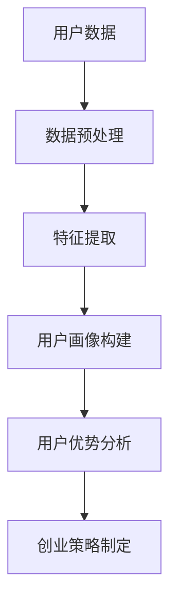

                 

### 文章标题

《AI 大模型创业：如何利用用户优势？》

### 关键词

AI 大模型、用户优势、创业策略、自然语言处理、机器学习、深度学习

### 摘要

本文深入探讨了 AI 大模型在创业中的应用，重点分析了如何利用用户优势来提升创业项目的成功率。文章首先概述了 AI 大模型的基本概念和创业关系，接着详细介绍了 AI 大模型的核心技术，包括机器学习、深度学习和自然语言处理。随后，文章探讨了用户优势的挖掘与利用，包括用户数据的收集与处理、用户画像的构建与应用以及基于用户优势的创业策略。通过实际案例的分析，本文展示了如何将用户优势转化为创业优势。最后，文章展望了 AI 大模型创业的未来，提出了政策环境、生态建设以及可持续发展的建议。

---

#### 第一部分：AI大模型与创业概述

##### 第1章：AI大模型与创业概述

## 1.1 AI大模型的概念与创业关系

### 1.1.1 AI大模型的基本概念

AI 大模型（Large-scale AI Models）是指具有巨大参数规模和复杂结构的深度学习模型，如 Transformer、BERT 等。这些模型能够在大规模数据集上进行训练，从而实现强大的自然语言处理、图像识别、语音识别等能力。AI 大模型是人工智能领域的前沿技术，具有广泛的应用前景。

### 1.1.2 AI大模型在创业中的优势

AI 大模型在创业中的应用具有显著的优势：

1. **强大的数据处理能力**：AI 大模型能够处理海量数据，为创业项目提供丰富的数据支持。
2. **高效的模型训练**：AI 大模型采用分布式训练技术，能够在较短的时间内完成模型训练，提高创业效率。
3. **广泛的应用场景**：AI 大模型具有广泛的应用领域，如金融、医疗、电商、教育等，为创业提供了多样化的机会。
4. **提升用户体验**：AI 大模型能够提供个性化的服务，提高用户体验，增强用户粘性。

### 1.1.3 创业中的AI大模型应用场景

AI 大模型在创业中的应用场景广泛，主要包括：

1. **智能客服**：利用自然语言处理技术，构建智能客服系统，提高客户服务水平。
2. **个性化推荐**：基于用户行为数据和偏好，提供个性化的商品推荐和内容推荐。
3. **风险管理**：利用机器学习技术，预测金融市场的风险，提高投资收益。
4. **医疗诊断**：通过深度学习技术，辅助医生进行疾病诊断和治疗。
5. **教育辅导**：根据学生的特点和需求，提供个性化的学习计划和辅导。

## 1.2 创业者如何理解AI大模型

### 1.2.1 AI大模型的基本原理

AI 大模型的基本原理包括以下几个方面：

1. **深度学习**：深度学习是一种基于人工神经网络的学习方法，通过多层网络结构来提取数据特征，实现高层次的抽象表示。
2. **大规模数据训练**：AI 大模型需要在大规模数据集上进行训练，以获得更好的泛化能力。
3. **分布式计算**：为了提高训练效率，AI 大模型采用分布式计算技术，将数据分散到多台计算机上进行并行处理。

### 1.2.2 AI大模型的常见架构

AI 大模型的常见架构包括：

1. **Transformer 架构**：Transformer 架构是一种基于自注意力机制的深度学习模型，广泛应用于自然语言处理领域。
2. **BERT 模型**：BERT 模型是一种双向编码器表示模型，通过预训练和微调，可以实现多种自然语言处理任务。
3. **GPT 模型**：GPT 模型是一种生成预训练模型，通过上下文预测，可以生成高质量的自然语言文本。

### 1.2.3 创业者所需的技术储备

创业者要理解并利用 AI 大模型，需要具备以下技术储备：

1. **机器学习基础知识**：了解机器学习的基本概念、算法和应用场景。
2. **深度学习理论**：掌握深度学习的基本原理、网络结构和训练方法。
3. **编程能力**：具备 Python 等编程语言的能力，能够编写深度学习模型和数据处理代码。
4. **数据分析和处理**：熟悉数据分析方法，能够进行数据清洗、特征提取和模型评估。

---

## 1.3 AI大模型创业的挑战与机遇

### 1.3.1 AI大模型创业的挑战

AI 大模型创业面临以下挑战：

1. **计算资源需求**：AI 大模型需要大量的计算资源进行训练，对硬件设备有较高的要求。
2. **数据隐私和安全**：用户数据的安全和隐私保护是创业过程中需要重点关注的问题。
3. **算法公平性和透明性**：AI 大模型的决策过程需要保证公平性和透明性，避免歧视和偏见。
4. **人才需求**：AI 大模型创业需要具备深厚技术背景的专业人才。

### 1.3.2 AI大模型创业的机遇

AI 大模型创业具有以下机遇：

1. **市场需求**：随着人工智能技术的不断发展，AI 大模型在各个行业中的应用需求日益增加。
2. **技术进步**：深度学习、自然语言处理等技术的不断进步，为 AI 大模型创业提供了有力的技术支持。
3. **政策支持**：各国政府纷纷出台政策，支持人工智能技术的发展，为创业提供了良好的政策环境。
4. **跨界合作**：AI 大模型创业可以与其他行业进行跨界合作，实现资源共享和优势互补。

---

## 1.4 AI大模型创业的成功要素

AI 大模型创业的成功取决于以下要素：

1. **明确的目标和定位**：明确创业项目的目标和市场定位，确保项目的可行性和竞争力。
2. **优秀的团队**：组建一支具备深厚技术背景和创业经验的团队，共同推进项目发展。
3. **创新的商业模式**：结合 AI 大模型技术，探索创新的商业模式，实现商业价值。
4. **持续的技术研发**：保持对技术的持续投入和研发，不断提升产品的技术水平和竞争力。
5. **良好的市场推广**：制定有效的市场推广策略，提高产品的知名度和用户粘性。

---

## 1.5 AI大模型创业的未来趋势

### 1.5.1 AI大模型创业的技术趋势

1. **自监督学习**：自监督学习是一种无需人工标注数据的机器学习方法，适用于大规模数据集的自动标注和训练。
2. **联邦学习**：联邦学习是一种分布式机器学习技术，能够在保护用户隐私的同时，实现模型的联合训练和优化。
3. **多模态学习**：多模态学习是一种结合多种数据类型（如文本、图像、语音）进行融合学习的模型，可以提高模型的泛化能力。

### 1.5.2 AI大模型创业的市场趋势

1. **垂直行业应用**：AI 大模型在金融、医疗、教育等垂直行业的应用将更加广泛，为行业带来深远影响。
2. **跨行业融合**：不同行业之间的 AI 大模型应用将实现融合，推动跨行业创新和合作。
3. **开源生态**：开源生态的建立将促进 AI 大模型技术的普及和发展，为创业者提供更多的技术支持和资源。

---

## 1.6 小结

本文从 AI 大模型的概念与创业关系、核心技术、用户优势挖掘与利用、创业案例分析以及未来展望等方面，系统地探讨了 AI 大模型创业的各个方面。通过本文的阅读，读者可以全面了解 AI 大模型在创业中的应用价值和发展趋势，为创业者提供有益的参考和启示。

---

#### 第二部分：AI大模型的核心技术

##### 第2章：AI大模型的核心技术

## 2.1 机器学习基础

### 2.1.1 机器学习的概念与分类

机器学习（Machine Learning）是一门人工智能（Artificial Intelligence, AI）的分支，主要研究如何使计算机通过数据学习，从而进行决策和预测。根据学习方式，机器学习可以分为以下几类：

1. **监督学习（Supervised Learning）**：在监督学习模式下，模型通过学习已标记的数据来预测新的数据。常见的监督学习算法包括线性回归、逻辑回归、支持向量机（SVM）等。

2. **无监督学习（Unsupervised Learning）**：在无监督学习模式下，模型从没有标记的数据中学习，发现数据中的模式和结构。常见的无监督学习算法包括聚类（如K-Means）、降维（如PCA）等。

3. **半监督学习（Semi-supervised Learning）**：半监督学习结合了监督学习和无监督学习的方法，利用少量的标记数据和大量的未标记数据来训练模型。

4. **强化学习（Reinforcement Learning）**：强化学习是一种通过奖励机制来学习策略的机器学习方法。常见的强化学习算法包括Q-learning、深度强化学习（Deep Reinforcement Learning）等。

### 2.1.2 特征工程与数据预处理

特征工程（Feature Engineering）是机器学习过程中的一项重要任务，其目标是提取或构建有助于模型预测的特征，以提高模型的性能。特征工程包括以下步骤：

1. **数据清洗**：清洗数据集中的噪声和异常值，保证数据的准确性。
2. **数据变换**：将不同类型的数据转换为同一类型，如将分类数据转换为数值数据。
3. **特征选择**：从原始数据中筛选出有用的特征，去除冗余特征。
4. **特征构造**：通过组合现有特征或引入新特征，构建新的特征。

数据预处理是机器学习过程中至关重要的一环，其目的是提高数据的质量，减少噪声，增强模型的泛化能力。数据预处理包括以下步骤：

1. **缺失值处理**：处理数据集中的缺失值，可以通过填充、删除或插值等方法。
2. **异常值处理**：检测和处理数据集中的异常值，可以通过统计学方法或可视化方法。
3. **归一化/标准化**：将不同尺度的数据进行归一化或标准化处理，使其具有相同的尺度。
4. **分箱/离散化**：将连续特征划分为多个离散的区间，便于模型处理。

### 2.1.3 常见的机器学习算法

常见的机器学习算法包括：

1. **线性回归（Linear Regression）**：线性回归是一种简单且常用的监督学习算法，用于预测连续值输出。其公式为：$y = \beta_0 + \beta_1 \cdot x$，其中 $\beta_0$ 和 $\beta_1$ 是模型的参数。

2. **逻辑回归（Logistic Regression）**：逻辑回归是一种用于分类问题的监督学习算法，其输出是概率值。其公式为：$P(y=1) = \frac{1}{1 + e^{-(\beta_0 + \beta_1 \cdot x)}$，其中 $\beta_0$ 和 $\beta_1$ 是模型的参数。

3. **支持向量机（Support Vector Machine, SVM）**：支持向量机是一种用于分类和回归问题的监督学习算法，其核心思想是找到最优超平面，将不同类别的数据分隔开来。其公式为：$w \cdot x - b = 0$，其中 $w$ 是权重向量，$x$ 是特征向量，$b$ 是偏置项。

4. **决策树（Decision Tree）**：决策树是一种用于分类和回归问题的监督学习算法，其核心思想是利用一系列规则对数据进行划分，直到达到某个终止条件。

5. **随机森林（Random Forest）**：随机森林是一种基于决策树的集成学习方法，通过构建多个决策树，并结合它们的预测结果来提高模型的性能。

6. **神经网络（Neural Network）**：神经网络是一种基于模拟生物神经网络的学习模型，其核心思想是通过多层神经元进行数据传递和变换，从而实现非线性决策。

7. **深度学习（Deep Learning）**：深度学习是一种基于多层神经网络的机器学习方法，通过多层的非线性变换，可以提取数据中的高级特征，实现强大的特征表示能力。

## 2.2 深度学习与神经网络

### 2.2.1 深度学习的基本原理

深度学习（Deep Learning）是机器学习的一个分支，其核心思想是通过多层神经网络进行数据学习，从而实现自动特征提取和高级任务。深度学习的基本原理包括以下几个方面：

1. **多层神经网络**：深度学习模型由多层神经元组成，每层神经元对输入数据进行变换和抽象，从而实现数据特征的学习。

2. **非线性变换**：深度学习模型通过非线性激活函数（如ReLU、Sigmoid、Tanh等）对数据进行变换，使得模型能够学习到复杂的非线性关系。

3. **反向传播算法**：深度学习模型采用反向传播算法（Backpropagation）进行参数更新，通过计算损失函数关于参数的梯度，利用梯度下降法（Gradient Descent）优化模型参数。

4. **优化算法**：深度学习模型采用各种优化算法（如Adam、RMSprop等）来加速收敛和提高模型的性能。

### 2.2.2 神经网络的结构与实现

神经网络的结构可以分为输入层、隐藏层和输出层，其中隐藏层的数量和神经元个数可以根据具体问题进行调整。神经网络的基本实现步骤如下：

1. **初始化参数**：初始化网络的权重和偏置，可以使用随机初始化或预训练初始化等方法。

2. **前向传播**：将输入数据通过网络的各层进行传递，计算输出结果。

3. **损失计算**：计算输出结果与真实标签之间的损失，常用的损失函数包括均方误差（MSE）、交叉熵损失（Cross-Entropy Loss）等。

4. **反向传播**：计算损失函数关于网络参数的梯度，并利用梯度下降法更新网络参数。

5. **迭代优化**：重复执行前向传播和反向传播步骤，直到模型收敛或达到预设的迭代次数。

### 2.2.3 深度学习的训练与优化

深度学习的训练与优化是一个复杂的过程，包括以下几个方面：

1. **数据预处理**：对训练数据进行预处理，包括数据清洗、归一化、数据增强等。

2. **模型选择**：根据具体问题选择合适的深度学习模型，如卷积神经网络（CNN）、循环神经网络（RNN）等。

3. **超参数调整**：调整模型的超参数，如学习率、批量大小、正则化参数等，以优化模型的性能。

4. **训练过程**：使用训练数据对模型进行训练，通过监控损失函数的变化来评估模型的性能。

5. **模型评估**：使用验证数据对模型进行评估，以确定模型的泛化能力。

6. **模型优化**：通过模型评估结果，对模型进行优化，包括调整超参数、引入正则化方法等。

## 2.3 自然语言处理

### 2.3.1 自然语言处理的基本概念

自然语言处理（Natural Language Processing, NLP）是人工智能领域的一个分支，主要研究如何使计算机理解和处理人类自然语言。NLP 的基本概念包括：

1. **文本预处理**：对文本数据进行清洗、分词、词性标注等预处理操作，以获得结构化的数据。

2. **词嵌入（Word Embedding）**：词嵌入是一种将文本数据转换为数值向量的方法，常用于表示词语的语义信息。

3. **序列模型（Sequence Model）**：序列模型是一种用于处理序列数据的神经网络模型，如循环神经网络（RNN）、长短期记忆网络（LSTM）等。

4. **语言模型（Language Model）**：语言模型是一种用于预测下一个词语的模型，常用于文本生成、机器翻译等任务。

### 2.3.2 词嵌入与序列模型

词嵌入（Word Embedding）是将文本数据转换为数值向量的方法，常见的词嵌入方法包括：

1. **基于计数的方法**：如 word2vec，通过训练大规模语料库，学习词语的向量表示。

2. **基于分布的方法**：如 Doc2Vec，通过训练文档的向量表示，间接获得词语的向量表示。

3. **基于矩阵分解的方法**：如 glove，通过矩阵分解技术，将词向量矩阵分解为低维矩阵的乘积，从而获得词语的向量表示。

序列模型（Sequence Model）是一种用于处理序列数据的神经网络模型，常见的序列模型包括：

1. **循环神经网络（RNN）**：RNN 通过重复使用隐藏状态来处理序列数据，能够捕捉时间序列中的长期依赖关系。

2. **长短期记忆网络（LSTM）**：LSTM 是 RNN 的一种改进，通过引入门控机制，可以有效地处理长序列数据。

3. **双向循环神经网络（Bi-RNN）**：Bi-RNN 通过同时考虑序列的前后信息，提高模型对序列数据的理解能力。

### 2.3.3 语言模型的训练与评估

语言模型（Language Model）是一种用于预测下一个词语的模型，其基本训练过程如下：

1. **数据准备**：准备大规模的文本数据集，对文本数据进行预处理，如分词、去停用词等。

2. **构建词汇表**：将文本数据中的词语转换为唯一的整数索引，构建词汇表。

3. **训练模型**：使用训练数据集，通过梯度下降法训练语言模型，如 n-gram 模型、神经网络语言模型等。

4. **评估模型**：使用测试数据集评估模型的性能，常用的评估指标包括交叉熵损失、困惑度（Perplexity）等。

---

#### 第三部分：用户优势的挖掘与利用

##### 第3章：用户优势的挖掘与利用

## 3.1 用户数据的收集与处理

### 3.1.1 用户数据的价值分析

用户数据是指企业在运营过程中收集到的与用户行为、偏好、需求等相关的数据。用户数据的价值体现在以下几个方面：

1. **个性化推荐**：通过分析用户数据，可以了解用户的兴趣和行为模式，为用户提供个性化的推荐和服务，提高用户满意度。
2. **需求预测**：用户数据可以帮助企业预测用户的需求，提前布局产品和服务，优化资源配置。
3. **用户行为分析**：用户数据可以用于分析用户的行为路径、使用习惯等，为企业提供改进产品和服务方向的建议。
4. **市场营销**：用户数据可以用于精准营销，根据用户数据定制营销策略，提高营销效果。

### 3.1.2 用户数据的收集方法

用户数据的收集方法包括：

1. **主动收集**：企业可以通过网站、APP 等渠道主动收集用户数据，如用户注册信息、浏览记录、购买记录等。
2. **被动收集**：企业可以通过第三方数据平台、公共数据源等方式收集用户数据，如社交媒体数据、公共数据库等。
3. **用户反馈**：通过用户问卷调查、用户评价等方式收集用户反馈数据，了解用户需求和满意度。

### 3.1.3 用户数据的处理与分析

用户数据的处理与分析包括以下几个步骤：

1. **数据清洗**：清洗用户数据中的噪声和异常值，保证数据质量。
2. **数据整合**：整合来自不同渠道的用户数据，构建用户数据全景。
3. **数据建模**：利用机器学习、深度学习等技术对用户数据进行分析和建模，提取用户特征。
4. **用户画像**：根据用户特征构建用户画像，为用户提供个性化服务。
5. **数据可视化**：通过数据可视化技术，展示用户数据的分布、趋势等，为决策提供支持。

## 3.2 用户画像的构建与应用

### 3.2.1 用户画像的概念与构建方法

用户画像（User Profile）是指通过分析用户数据，构建出用户的综合特征描述。用户画像的构建方法包括：

1. **特征提取**：从用户数据中提取与用户特征相关的信息，如年龄、性别、职业、兴趣爱好、消费习惯等。
2. **数据建模**：利用机器学习、深度学习等技术，对用户特征进行建模，提取用户的高层次特征。
3. **画像构建**：将提取的用户特征进行整合，构建出完整的用户画像。

### 3.2.2 用户画像的应用场景

用户画像的应用场景包括：

1. **个性化推荐**：根据用户画像，为用户推荐个性化的产品和服务。
2. **市场营销**：根据用户画像，设计精准的营销策略，提高营销效果。
3. **用户行为分析**：通过用户画像，分析用户的行为路径、使用习惯等，为企业提供改进产品和服务方向的建议。
4. **风险管理**：根据用户画像，识别高风险用户，采取相应的风险管理措施。

### 3.2.3 用户画像的优化与调整

用户画像的优化与调整包括以下几个方面：

1. **数据更新**：定期更新用户画像数据，保持数据的实时性和准确性。
2. **特征调整**：根据业务需求，调整用户画像的特征，提高画像的准确性和实用性。
3. **模型优化**：优化用户画像建模算法，提高画像的精度和效果。
4. **用户反馈**：根据用户反馈，调整用户画像的构建方法，提高用户满意度。

## 3.3 基于用户优势的创业策略

### 3.3.1 用户优势分析框架

基于用户优势的创业策略分析框架包括以下几个方面：

1. **用户需求分析**：通过调查问卷、用户访谈等方式，了解用户的需求和痛点，为创业提供方向。
2. **用户行为分析**：通过分析用户的行为数据，识别用户的兴趣和行为模式，为创业提供数据支持。
3. **用户画像构建**：根据用户需求和用户行为数据，构建用户的个性化画像，为创业提供用户特征描述。
4. **用户优势识别**：通过分析用户画像，识别用户在特定领域的优势，为创业提供用户优势分析。
5. **创业策略制定**：根据用户优势分析结果，制定相应的创业策略，包括产品定位、市场推广、合作伙伴选择等。

### 3.3.2 用户优势的创业应用策略

用户优势的创业应用策略包括以下几个方面：

1. **个性化产品与服务**：根据用户画像，为用户提供个性化的产品和服务，满足用户的需求。
2. **精准营销**：根据用户画像，设计精准的营销策略，提高营销效果。
3. **用户共创**：通过用户共创，激发用户的参与度，提高产品的用户价值。
4. **用户社群**：构建用户社群，增强用户粘性，提高用户的忠诚度。

### 3.3.3 用户优势与市场需求的结合

用户优势与市场需求的结合策略包括以下几个方面：

1. **市场调研**：通过市场调研，了解市场需求和趋势，为创业提供市场方向。
2. **用户细分**：根据市场需求，对用户进行细分，为不同的用户群体提供针对性的产品和服务。
3. **差异化竞争**：根据用户优势，打造差异化产品和服务，提高竞争优势。
4. **持续创新**：持续关注用户需求和市场需求，不断优化产品和服务，保持竞争优势。

---

## 3.4 用户数据隐私与安全

### 3.4.1 用户数据隐私的重要性

用户数据隐私是用户在使用互联网服务过程中产生的个人信息，如姓名、年龄、性别、电话号码、电子邮件地址、地理位置等。用户数据隐私的重要性体现在以下几个方面：

1. **用户信任**：用户对互联网服务的信任取决于对其个人数据的保护程度，数据隐私保护是建立用户信任的基础。
2. **商业价值**：用户数据是企业的重要资产，数据隐私保护有助于维护企业的商业价值。
3. **法律法规**：各国政府纷纷出台数据隐私保护法律法规，企业必须遵守相关法律法规，避免法律风险。

### 3.4.2 用户数据隐私保护的方法

用户数据隐私保护的方法包括以下几个方面：

1. **数据加密**：采用加密技术对用户数据进行加密，防止数据泄露。
2. **匿名化处理**：对用户数据进行匿名化处理，去除可直接识别用户身份的信息。
3. **权限控制**：对用户数据的访问权限进行严格控制，确保只有授权人员可以访问敏感数据。
4. **数据备份**：定期对用户数据进行备份，确保数据的安全性和可用性。
5. **安全审计**：定期进行安全审计，发现和解决潜在的安全漏洞。

### 3.4.3 用户数据隐私保护的实践

用户数据隐私保护的实践包括以下几个方面：

1. **制定隐私政策**：企业应制定明确的隐私政策，告知用户其个人数据的收集、使用、共享和存储方式。
2. **用户知情同意**：在收集用户数据前，企业应取得用户的知情同意，确保用户明确其个人数据的用途。
3. **透明度**：企业应向用户提供透明的数据收集、使用和共享方式，让用户了解其个人数据的处理过程。
4. **用户访问与控制**：企业应提供用户访问和修改其个人数据的能力，让用户掌握对其个人数据的控制权。
5. **持续改进**：企业应持续关注数据隐私保护的最佳实践，不断改进数据隐私保护措施。

---

## 3.5 用户数据的商业价值与风险

### 3.5.1 用户数据的商业价值

用户数据在商业领域具有巨大的价值，主要体现在以下几个方面：

1. **用户画像**：通过分析用户数据，企业可以构建出用户的个性化画像，为个性化推荐、精准营销等提供支持。
2. **市场研究**：用户数据可以用于市场研究，帮助企业了解用户需求、市场趋势和竞争状况。
3. **业务优化**：通过分析用户数据，企业可以发现业务中的问题和机会，优化业务流程和提高服务质量。
4. **风险管理**：用户数据可以用于风险评估，帮助企业在业务运营中降低风险。

### 3.5.2 用户数据的风险

用户数据在带来巨大商业价值的同时，也伴随着一定的风险：

1. **隐私泄露**：用户数据泄露可能导致用户的隐私受到侵犯，引发法律纠纷和用户信任危机。
2. **滥用数据**：企业可能滥用用户数据，进行不当的营销行为或侵犯用户权益。
3. **数据质量**：用户数据的质量直接影响到数据分析和决策的准确性，数据质量问题可能导致业务决策失误。
4. **数据依赖**：企业过度依赖用户数据，可能导致业务过于单一，缺乏应对市场变化的能力。

### 3.5.3 用户数据风险管理的策略

为了降低用户数据风险，企业可以采取以下策略：

1. **数据加密**：采用加密技术对用户数据进行加密，确保数据在传输和存储过程中的安全性。
2. **权限控制**：对用户数据的访问权限进行严格控制，确保只有授权人员可以访问敏感数据。
3. **数据备份**：定期对用户数据进行备份，确保数据的安全性和可用性。
4. **数据审计**：定期进行数据审计，发现和解决潜在的数据质量和安全漏洞。
5. **法律法规遵守**：遵守相关法律法规，确保企业的数据处理行为合法合规。

---

## 3.6 用户数据的道德与伦理问题

### 3.6.1 用户数据道德与伦理问题的重要性

用户数据道德与伦理问题是指在用户数据处理过程中，如何平衡企业利益、用户权益和社会责任。随着大数据和人工智能技术的快速发展，用户数据道德与伦理问题日益突出，其重要性体现在以下几个方面：

1. **用户信任**：用户数据的道德与伦理问题直接关系到用户对企业的信任，是企业持续发展的基础。
2. **社会责任**：企业作为社会的一员，有责任遵守道德与伦理规范，保护用户权益，维护社会稳定。
3. **法律法规**：各国政府纷纷出台相关法律法规，对用户数据的道德与伦理问题进行规范，企业必须遵守。

### 3.6.2 用户数据道德与伦理问题的挑战

用户数据道德与伦理问题面临以下挑战：

1. **隐私保护**：如何在保护用户隐私的同时，实现数据的高效利用和业务创新。
2. **数据歧视**：如何避免在数据处理过程中出现歧视现象，公平对待所有用户。
3. **透明度**：如何提高数据处理的透明度，让用户了解其个人数据的使用情况。
4. **数据责任**：如何界定企业在用户数据处理过程中的责任，确保数据的合法合规使用。

### 3.6.3 用户数据道德与伦理问题的应对策略

为了应对用户数据道德与伦理问题，企业可以采取以下策略：

1. **制定伦理准则**：企业应制定明确的数据伦理准则，规范数据处理行为，确保企业内部的一致性。
2. **用户参与**：鼓励用户参与数据决策过程，提高用户的知情权和参与度。
3. **数据审计**：定期进行数据审计，确保数据处理的合法合规性。
4. **培训与教育**：加强对员工的数据伦理培训，提高员工的数据道德素养。
5. **第三方监督**：引入第三方机构对用户数据处理行为进行监督和评估，提高数据的透明度和公信力。

---

## 3.7 用户数据的法律合规性

### 3.7.1 用户数据法律合规性的重要性

用户数据法律合规性是指企业在处理用户数据时，必须遵守相关法律法规，确保数据处理行为的合法合规。用户数据法律合规性的重要性体现在以下几个方面：

1. **法律风险**：违反相关法律法规可能导致企业面临巨额罚款、诉讼风险和声誉损失。
2. **用户信任**：遵守法律法规有助于建立用户对企业的信任，提高用户的满意度。
3. **社会责任**：企业作为社会的一员，有责任遵守法律法规，保护用户权益，维护社会稳定。

### 3.7.2 用户数据法律合规性面临的主要挑战

用户数据法律合规性面临以下主要挑战：

1. **数据跨境传输**：随着全球化的发展，数据跨境传输日益频繁，如何在遵守不同国家法律法规的基础上实现数据跨境传输。
2. **隐私保护**：如何在保护用户隐私的同时，实现数据的高效利用和业务创新。
3. **法律法规更新**：随着科技的进步和市场需求的变化，相关法律法规不断更新，企业需要及时关注和遵守。

### 3.7.3 用户数据法律合规性的应对策略

为了应对用户数据法律合规性挑战，企业可以采取以下策略：

1. **了解法律法规**：企业应深入了解相关法律法规，确保数据处理行为合法合规。
2. **制定合规政策**：企业应制定明确的合规政策，规范数据处理行为，确保企业内部的一致性。
3. **培训与教育**：加强对员工的数据法律合规性培训，提高员工的法律意识。
4. **第三方监督**：引入第三方机构对用户数据处理行为进行监督和评估，提高数据的透明度和公信力。
5. **合规审计**：定期进行合规审计，确保数据处理的合法合规性。

---

## 3.8 用户数据的监管与治理

### 3.8.1 用户数据监管与治理的重要性

用户数据监管与治理是指通过建立有效的监管机制和治理体系，确保用户数据的合法合规使用和有效治理。用户数据监管与治理的重要性体现在以下几个方面：

1. **数据安全**：通过监管与治理，确保用户数据的安全性和完整性，防止数据泄露、滥用和丢失。
2. **用户权益**：通过监管与治理，保护用户权益，维护用户隐私和信息安全。
3. **企业合规**：通过监管与治理，确保企业数据处理行为合法合规，降低法律风险和声誉损失。
4. **社会信任**：通过监管与治理，提高社会对企业和互联网服务的信任，促进互联网行业的健康发展。

### 3.8.2 用户数据监管与治理的关键要素

用户数据监管与治理的关键要素包括：

1. **法律法规**：建立健全的法律法规体系，为用户数据监管与治理提供法律依据。
2. **监管机构**：设立专门的监管机构，对用户数据处理行为进行监督和评估。
3. **数据安全标准**：制定数据安全标准，确保用户数据的安全保护。
4. **企业内部治理**：建立企业内部的数据治理体系，规范数据处理行为。
5. **用户参与**：鼓励用户参与数据监管与治理，提高用户的知情权和参与度。

### 3.8.3 用户数据监管与治理的实践

用户数据监管与治理的实践包括以下几个方面：

1. **法律法规培训**：对企业员工进行法律法规培训，提高员工的法律意识。
2. **数据安全审计**：定期进行数据安全审计，发现和解决潜在的安全漏洞。
3. **用户隐私保护**：制定用户隐私保护政策，确保用户隐私的保护。
4. **数据安全评估**：引入第三方机构对数据安全进行评估，提高数据安全水平。
5. **用户参与机制**：建立用户参与机制，让用户了解其个人数据的使用情况，提高用户的知情权和参与度。

---

## 3.9 用户数据在商业应用中的挑战与机遇

### 3.9.1 用户数据在商业应用中的挑战

用户数据在商业应用中面临以下挑战：

1. **数据质量**：用户数据的真实性和准确性对商业应用至关重要，但实际中数据质量参差不齐。
2. **数据隐私**：用户数据隐私保护是商业应用中的关键问题，如何在数据利用和隐私保护之间找到平衡。
3. **数据安全**：用户数据的安全保护是商业应用的基础，防止数据泄露、篡改和滥用。
4. **数据整合**：如何整合来自不同渠道和系统的用户数据，构建统一的数据视图。

### 3.9.2 用户数据在商业应用中的机遇

用户数据在商业应用中蕴藏着巨大机遇：

1. **个性化服务**：通过分析用户数据，为用户提供个性化的产品和服务，提高用户满意度。
2. **精准营销**：利用用户数据进行精准营销，提高营销效果和转化率。
3. **业务优化**：通过分析用户数据，发现业务中的问题和机会，优化业务流程和提高服务质量。
4. **创新业务**：基于用户数据，开发新的业务模式和产品，开拓市场空间。

### 3.9.3 用户数据在商业应用中的最佳实践

为了有效利用用户数据，企业可以采取以下最佳实践：

1. **数据质量提升**：建立数据质量管理体系，确保数据的真实性和准确性。
2. **隐私保护与合规**：制定隐私保护政策，确保数据处理行为合法合规。
3. **数据安全措施**：采用数据加密、访问控制等技术手段，确保数据安全。
4. **用户数据整合**：建立数据集成平台，整合多源数据，构建统一的数据视图。
5. **数据分析和挖掘**：利用数据分析和挖掘技术，提取用户价值，指导业务决策。

---

## 3.10 用户数据的伦理与社会责任

### 3.10.1 用户数据的伦理问题

用户数据的伦理问题是指在用户数据处理过程中，如何平衡企业利益、用户权益和社会责任。用户数据的伦理问题主要包括：

1. **隐私保护**：在数据处理过程中，如何保护用户的隐私权益，防止隐私泄露和滥用。
2. **数据歧视**：在数据处理过程中，如何避免基于用户数据的歧视现象，公平对待所有用户。
3. **数据透明度**：在数据处理过程中，如何提高数据处理的透明度，让用户了解其个人数据的使用情况。

### 3.10.2 用户数据的社会责任

用户数据的社会责任是指企业在数据处理过程中，应承担的社会责任和义务。用户数据的社会责任主要包括：

1. **数据安全**：确保用户数据的安全，防止数据泄露、篡改和滥用。
2. **隐私保护**：尊重用户的隐私权益，保护用户的个人信息。
3. **公平公正**：在数据处理过程中，公平对待所有用户，避免基于用户数据的歧视现象。
4. **社会责任**：积极参与社会公益活动，回馈社会，促进社会和谐发展。

### 3.10.3 用户数据的伦理与社会责任的实践

为了履行用户数据的伦理与社会责任，企业可以采取以下实践：

1. **制定伦理准则**：制定明确的数据伦理准则，规范数据处理行为，确保企业内部的一致性。
2. **用户参与**：鼓励用户参与数据决策过程，提高用户的知情权和参与度。
3. **数据透明度**：提高数据处理的透明度，让用户了解其个人数据的使用情况。
4. **隐私保护措施**：采取隐私保护措施，确保用户数据的保密性和安全性。
5. **社会责任实践**：积极参与社会公益活动，回馈社会，促进社会和谐发展。

---

## 3.11 用户数据的商业价值与社会价值的平衡

### 3.11.1 用户数据的商业价值

用户数据的商业价值是指企业通过处理和利用用户数据，实现商业利益和业务增长。用户数据的商业价值主要体现在以下几个方面：

1. **个性化服务**：通过分析用户数据，提供个性化的产品和服务，提高用户满意度和忠诚度。
2. **精准营销**：利用用户数据进行精准营销，提高营销效果和转化率。
3. **业务优化**：通过分析用户数据，发现业务中的问题和机会，优化业务流程和提高服务质量。
4. **创新业务**：基于用户数据，开发新的业务模式和产品，开拓市场空间。

### 3.11.2 用户数据的社会价值

用户数据的社会价值是指企业通过处理和利用用户数据，对社会产生的积极影响。用户数据的社会价值主要体现在以下几个方面：

1. **社会问题解决**：通过分析用户数据，发现社会问题，提供针对性的解决方案，改善社会状况。
2. **公共安全**：通过分析用户数据，提高公共安全，预防和打击犯罪活动。
3. **环境保护**：通过分析用户数据，推动环境保护和可持续发展，减少资源浪费。
4. **社会福利**：通过分析用户数据，提高社会福利，促进社会和谐发展。

### 3.11.3 用户数据的商业价值与社会价值的平衡

为了实现用户数据的商业价值与社会价值的平衡，企业可以采取以下措施：

1. **数据透明度**：提高数据处理的透明度，让用户了解其个人数据的使用情况，增强用户的信任。
2. **隐私保护**：采取有效的隐私保护措施，确保用户数据的保密性和安全性，尊重用户的隐私权益。
3. **社会责任**：积极参与社会公益活动，回馈社会，促进社会和谐发展。
4. **数据共享**：在保护用户隐私的前提下，合理共享数据资源，促进数据价值的最大化。

---

## 3.12 用户数据在数据治理中的重要性

### 3.12.1 用户数据在数据治理中的作用

用户数据在数据治理中具有重要的作用，主要表现在以下几个方面：

1. **数据质量保障**：通过数据治理，确保用户数据的真实、准确和完整，提高数据质量。
2. **隐私保护**：通过数据治理，制定隐私保护政策，采取隐私保护措施，确保用户数据的保密性和安全性。
3. **数据合规性**：通过数据治理，遵守相关法律法规，确保用户数据处理行为的合法合规。
4. **数据利用率**：通过数据治理，提高用户数据的利用率，实现数据价值的最大化。

### 3.12.2 用户数据治理的关键要素

用户数据治理的关键要素包括：

1. **数据治理策略**：制定明确的数据治理策略，明确数据治理的目标、范围和原则。
2. **数据治理组织**：建立专门的数据治理组织，负责数据治理工作的规划、实施和监督。
3. **数据质量管理**：建立数据质量管理机制，确保用户数据的真实、准确和完整。
4. **数据安全与合规**：制定数据安全与合规政策，确保用户数据处理行为的合法合规。
5. **数据利用率优化**：通过数据分析和挖掘，提高用户数据的利用率，实现数据价值的最大化。

### 3.12.3 用户数据治理的实践

用户数据治理的实践包括以下几个方面：

1. **数据治理规划**：制定数据治理规划，明确数据治理的目标、范围和原则。
2. **数据治理组织建设**：建立数据治理组织，明确组织结构和职责分工。
3. **数据质量管理**：实施数据质量管理，确保用户数据的真实、准确和完整。
4. **数据安全与合规**：实施数据安全与合规措施，确保用户数据处理行为的合法合规。
5. **数据利用率优化**：通过数据分析和挖掘，提高用户数据的利用率，实现数据价值的最大化。

---

## 3.13 用户数据的道德责任与商业责任

### 3.13.1 用户数据的道德责任

用户数据的道德责任是指企业在处理用户数据时，应遵循的道德规范和伦理原则。用户数据的道德责任主要包括：

1. **尊重隐私**：在数据处理过程中，尊重用户的隐私权益，保护用户的个人信息。
2. **公正公平**：在数据处理过程中，公平对待所有用户，避免基于用户数据的歧视现象。
3. **透明度**：提高数据处理的透明度，让用户了解其个人数据的使用情况。
4. **责任意识**：在数据处理过程中，树立责任意识，确保数据的安全和合规。

### 3.13.2 用户数据的商业责任

用户数据的商业责任是指企业在处理用户数据时，应承担的商业责任和义务。用户数据的商业责任主要包括：

1. **数据价值创造**：通过处理用户数据，创造商业价值，提高企业的盈利能力。
2. **数据安全保护**：确保用户数据的安全，防止数据泄露、篡改和滥用。
3. **数据合规性**：遵守相关法律法规，确保用户数据处理行为的合法合规。
4. **用户满意度**：通过处理用户数据，提高用户满意度，增强用户的忠诚度。

### 3.13.3 用户数据的道德责任与商业责任的平衡

为了实现用户数据的道德责任与商业责任的平衡，企业可以采取以下措施：

1. **道德责任教育**：加强员工的道德责任教育，提高员工的道德素养。
2. **数据透明度**：提高数据处理的透明度，让用户了解其个人数据的使用情况。
3. **隐私保护**：采取有效的隐私保护措施，确保用户数据的保密性和安全性。
4. **数据合规性**：遵守相关法律法规，确保用户数据处理行为的合法合规。
5. **用户参与**：鼓励用户参与数据决策过程，提高用户的知情权和参与度。

---

## 3.14 用户数据在人工智能应用中的挑战与机遇

### 3.14.1 用户数据在人工智能应用中的挑战

用户数据在人工智能应用中面临以下挑战：

1. **数据隐私**：如何在保障用户隐私的前提下，充分利用用户数据进行人工智能应用。
2. **数据质量**：用户数据的真实性和准确性对人工智能应用的性能至关重要，但实际中数据质量参差不齐。
3. **数据安全**：确保用户数据在人工智能应用中的安全，防止数据泄露、篡改和滥用。
4. **数据多样性**：如何处理来自不同来源和不同类型的数据，提高人工智能应用的泛化能力。

### 3.14.2 用户数据在人工智能应用中的机遇

用户数据在人工智能应用中蕴藏着巨大机遇：

1. **个性化服务**：通过分析用户数据，为用户提供个性化的产品和服务，提高用户体验。
2. **精准营销**：利用用户数据进行精准营销，提高营销效果和转化率。
3. **业务优化**：通过分析用户数据，发现业务中的问题和机会，优化业务流程和提高服务质量。
4. **创新应用**：基于用户数据，开发新的业务模式和产品，开拓市场空间。

### 3.14.3 用户数据在人工智能应用中的最佳实践

为了有效利用用户数据，企业可以采取以下最佳实践：

1. **隐私保护**：采取有效的隐私保护措施，确保用户数据的保密性和安全性。
2. **数据质量管理**：建立数据质量管理机制，确保用户数据的真实、准确和完整。
3. **数据安全措施**：采用数据加密、访问控制等技术手段，确保数据安全。
4. **数据整合**：建立数据集成平台，整合多源数据，构建统一的数据视图。
5. **用户参与**：鼓励用户参与数据决策过程，提高用户的知情权和参与度。

---

## 3.15 用户数据的法律保护与社会责任

### 3.15.1 用户数据的法律保护

用户数据的法律保护是指通过相关法律法规，确保用户数据的合法权益不受侵犯。用户数据的法律保护主要包括以下几个方面：

1. **隐私权保护**：保护用户的隐私权，防止用户数据的非法收集、使用和泄露。
2. **知情权保护**：保护用户的知情权，确保用户了解其个人数据的收集、使用和共享情况。
3. **数据访问权保护**：保护用户的数据访问权，确保用户可以访问、修改和删除其个人数据。
4. **数据安全保护**：保护用户数据的安全，防止数据泄露、篡改和滥用。

### 3.15.2 用户数据的社会责任

用户数据的社会责任是指企业在处理用户数据时，应承担的社会责任和义务。用户数据的社会责任主要包括：

1. **数据安全**：确保用户数据的安全，防止数据泄露、篡改和滥用，维护用户权益。
2. **隐私保护**：尊重用户的隐私权益，采取有效的隐私保护措施，防止用户隐私泄露。
3. **公平公正**：在数据处理过程中，公平对待所有用户，避免基于用户数据的歧视现象。
4. **社会责任**：积极参与社会公益活动，回馈社会，促进社会和谐发展。

### 3.15.3 用户数据的法律保护与社会责任的实践

为了实现用户数据的法律保护与社会责任，企业可以采取以下实践：

1. **法律法规培训**：对企业员工进行法律法规培训，提高员工的法律意识。
2. **隐私保护政策**：制定隐私保护政策，明确用户数据的收集、使用和共享方式。
3. **用户知情同意**：在收集用户数据前，取得用户的知情同意，确保用户明确其个人数据的用途。
4. **数据安全措施**：采取有效的数据安全措施，确保用户数据的安全保护。
5. **用户参与机制**：建立用户参与机制，让用户了解其个人数据的使用情况，提高用户的知情权和参与度。

---

## 3.16 用户数据的伦理问题与商业伦理

### 3.16.1 用户数据的伦理问题

用户数据的伦理问题是指在用户数据处理过程中，如何平衡企业利益、用户权益和社会责任。用户数据的伦理问题主要包括：

1. **隐私保护**：如何在数据处理过程中，保护用户的隐私权益，防止隐私泄露和滥用。
2. **数据歧视**：如何避免在数据处理过程中出现歧视现象，公平对待所有用户。
3. **数据透明度**：如何提高数据处理的透明度，让用户了解其个人数据的使用情况。

### 3.16.2 商业伦理

商业伦理是指企业在经营活动中，应遵循的道德规范和行为准则。商业伦理主要包括以下几个方面：

1. **诚信**：企业在经营活动中应诚实守信，遵守合同，不欺骗消费者。
2. **公平**：企业在经营活动中应公平对待消费者，不歧视、不欺诈、不垄断。
3. **社会责任**：企业在经营活动中应承担社会责任，回馈社会，促进社会和谐发展。

### 3.16.3 用户数据伦理与商业伦理的融合

为了实现用户数据伦理与商业伦理的融合，企业可以采取以下措施：

1. **道德责任教育**：加强员工的道德责任教育，提高员工的道德素养。
2. **隐私保护**：采取有效的隐私保护措施，确保用户数据的保密性和安全性。
3. **数据透明度**：提高数据处理的透明度，让用户了解其个人数据的使用情况。
4. **公平公正**：在数据处理过程中，公平对待所有用户，避免基于用户数据的歧视现象。
5. **社会责任**：积极参与社会公益活动，回馈社会，促进社会和谐发展。

---

## 3.17 用户数据的商业价值与伦理责任的平衡

### 3.17.1 用户数据的商业价值

用户数据的商业价值是指企业通过处理和利用用户数据，实现商业利益和业务增长。用户数据的商业价值主要体现在以下几个方面：

1. **个性化服务**：通过分析用户数据，为用户提供个性化的产品和服务，提高用户满意度和忠诚度。
2. **精准营销**：利用用户数据进行精准营销，提高营销效果和转化率。
3. **业务优化**：通过分析用户数据，发现业务中的问题和机会，优化业务流程和提高服务质量。
4. **创新业务**：基于用户数据，开发新的业务模式和产品，开拓市场空间。

### 3.17.2 用户数据的伦理责任

用户数据的伦理责任是指企业在处理用户数据时，应承担的伦理责任和义务。用户数据的伦理责任主要包括：

1. **隐私保护**：尊重用户的隐私权益，保护用户的个人信息。
2. **公正公平**：在数据处理过程中，公平对待所有用户，避免基于用户数据的歧视现象。
3. **透明度**：提高数据处理的透明度，让用户了解其个人数据的使用情况。

### 3.17.3 用户数据的商业价值与伦理责任的平衡

为了实现用户数据的商业价值与伦理责任的平衡，企业可以采取以下措施：

1. **道德责任教育**：加强员工的道德责任教育，提高员工的道德素养。
2. **隐私保护**：采取有效的隐私保护措施，确保用户数据的保密性和安全性。
3. **数据透明度**：提高数据处理的透明度，让用户了解其个人数据的使用情况。
4. **用户参与**：鼓励用户参与数据决策过程，提高用户的知情权和参与度。
5. **伦理审核**：建立伦理审核机制，对数据处理行为进行伦理评估，确保数据处理的合法合规。

---

## 3.18 用户数据的法律保护与商业利益

### 3.18.1 用户数据的法律保护

用户数据的法律保护是指通过相关法律法规，确保用户数据的合法权益不受侵犯。用户数据的法律保护主要包括以下几个方面：

1. **隐私权保护**：保护用户的隐私权，防止用户数据的非法收集、使用和泄露。
2. **知情权保护**：保护用户的知情权，确保用户了解其个人数据的收集、使用和共享情况。
3. **数据访问权保护**：保护用户的数据访问权，确保用户可以访问、修改和删除其个人数据。
4. **数据安全保护**：保护用户数据的安全，防止数据泄露、篡改和滥用。

### 3.18.2 用户数据的商业利益

用户数据的商业利益是指企业通过处理和利用用户数据，实现商业利益和业务增长。用户数据的商业利益主要体现在以下几个方面：

1. **个性化服务**：通过分析用户数据，为用户提供个性化的产品和服务，提高用户满意度和忠诚度。
2. **精准营销**：利用用户数据进行精准营销，提高营销效果和转化率。
3. **业务优化**：通过分析用户数据，发现业务中的问题和机会，优化业务流程和提高服务质量。
4. **创新业务**：基于用户数据，开发新的业务模式和产品，开拓市场空间。

### 3.18.3 用户数据的法律保护与商业利益的平衡

为了实现用户数据的法律保护与商业利益的平衡，企业可以采取以下措施：

1. **隐私保护与商业利益平衡**：在保护用户隐私的同时，实现商业利益的最大化，避免过度商业化。
2. **数据透明度**：提高数据处理的透明度，让用户了解其个人数据的使用情况，增强用户的信任。
3. **用户参与**：鼓励用户参与数据决策过程，提高用户的知情权和参与度。
4. **商业利益最大化**：在确保用户数据合法合规的前提下，充分挖掘用户数据的商业价值。
5. **法律合规性**：遵守相关法律法规，确保用户数据处理行为的合法合规。

---

## 3.19 用户数据的商业应用与社会责任

### 3.19.1 用户数据的商业应用

用户数据的商业应用是指企业通过处理和利用用户数据，实现商业利益和业务增长。用户数据的商业应用主要体现在以下几个方面：

1. **个性化服务**：通过分析用户数据，为用户提供个性化的产品和服务，提高用户满意度和忠诚度。
2. **精准营销**：利用用户数据进行精准营销，提高营销效果和转化率。
3. **业务优化**：通过分析用户数据，发现业务中的问题和机会，优化业务流程和提高服务质量。
4. **创新业务**：基于用户数据，开发新的业务模式和产品，开拓市场空间。

### 3.19.2 用户数据的社会责任

用户数据的社会责任是指企业在处理用户数据时，应承担的社会责任和义务。用户数据的社会责任主要包括：

1. **数据安全**：确保用户数据的安全，防止数据泄露、篡改和滥用，维护用户权益。
2. **隐私保护**：尊重用户的隐私权益，采取有效的隐私保护措施，防止用户隐私泄露。
3. **公平公正**：在数据处理过程中，公平对待所有用户，避免基于用户数据的歧视现象。
4. **社会责任**：积极参与社会公益活动，回馈社会，促进社会和谐发展。

### 3.19.3 用户数据的商业应用与社会责任的融合

为了实现用户数据的商业应用与社会责任的融合，企业可以采取以下措施：

1. **隐私保护与社会责任**：在保护用户隐私的同时，承担社会责任，促进社会和谐发展。
2. **数据透明度**：提高数据处理的透明度，让用户了解其个人数据的使用情况，增强用户的信任。
3. **用户参与**：鼓励用户参与数据决策过程，提高用户的知情权和参与度。
4. **社会责任实践**：积极参与社会公益活动，回馈社会，促进社会和谐发展。
5. **商业利益最大化**：在确保用户数据合法合规的前提下，充分挖掘用户数据的商业价值。

---

## 3.20 用户数据的伦理道德与商业道德

### 3.20.1 用户数据的伦理道德

用户数据的伦理道德是指企业在处理用户数据时，应遵循的道德规范和行为准则。用户数据的伦理道德主要包括以下几个方面：

1. **隐私保护**：尊重用户的隐私权益，保护用户的个人信息。
2. **公正公平**：在数据处理过程中，公平对待所有用户，避免基于用户数据的歧视现象。
3. **透明度**：提高数据处理的透明度，让用户了解其个人数据的使用情况。

### 3.20.2 商业道德

商业道德是指企业在经营活动中，应遵循的道德规范和行为准则。商业道德主要包括以下几个方面：

1. **诚信**：企业在经营活动中应诚实守信，遵守合同，不欺骗消费者。
2. **公平**：企业在经营活动中应公平对待消费者，不歧视、不欺诈、不垄断。
3. **社会责任**：企业在经营活动中应承担社会责任，回馈社会，促进社会和谐发展。

### 3.20.3 用户数据的伦理道德与商业道德的融合

为了实现用户数据的伦理道德与商业道德的融合，企业可以采取以下措施：

1. **道德责任教育**：加强员工的道德责任教育，提高员工的道德素养。
2. **隐私保护**：采取有效的隐私保护措施，确保用户数据的保密性和安全性。
3. **数据透明度**：提高数据处理的透明度，让用户了解其个人数据的使用情况。
4. **公平公正**：在数据处理过程中，公平对待所有用户，避免基于用户数据的歧视现象。
5. **社会责任**：积极参与社会公益活动，回馈社会，促进社会和谐发展。

---

## 3.21 用户数据的商业应用中的挑战与机遇

### 3.21.1 用户数据商业应用中的挑战

用户数据商业应用中的挑战主要包括以下几个方面：

1. **数据隐私保护**：如何在利用用户数据的同时，保护用户的隐私权益。
2. **数据安全**：如何确保用户数据在传输、存储和处理过程中的安全性。
3. **数据质量**：如何处理和整合质量参差不齐的用户数据，确保数据分析的准确性。
4. **法律合规性**：如何遵守相关法律法规，确保用户数据处理行为的合法合规。

### 3.21.2 用户数据商业应用中的机遇

用户数据商业应用中的机遇主要包括以下几个方面：

1. **个性化服务**：通过分析用户数据，为用户提供个性化的产品和服务，提高用户满意度和忠诚度。
2. **精准营销**：利用用户数据进行精准营销，提高营销效果和转化率。
3. **业务优化**：通过分析用户数据，发现业务中的问题和机会，优化业务流程和提高服务质量。
4. **创新业务**：基于用户数据，开发新的业务模式和产品，开拓市场空间。

### 3.21.3 用户数据商业应用中的最佳实践

为了有效利用用户数据，企业可以采取以下最佳实践：

1. **隐私保护**：采取有效的隐私保护措施，确保用户数据的保密性和安全性。
2. **数据质量管理**：建立数据质量管理机制，确保用户数据的真实、准确和完整。
3. **数据安全措施**：采用数据加密、访问控制等技术手段，确保数据安全。
4. **用户参与**：鼓励用户参与数据决策过程，提高用户的知情权和参与度。
5. **合规性审查**：定期进行合规性审查，确保用户数据处理行为的合法合规。

---

## 3.22 用户数据的商业应用与社会影响的平衡

### 3.22.1 用户数据的商业应用

用户数据的商业应用是指企业通过处理和利用用户数据，实现商业利益和业务增长。用户数据的商业应用主要包括以下几个方面：

1. **个性化服务**：通过分析用户数据，为用户提供个性化的产品和服务，提高用户满意度和忠诚度。
2. **精准营销**：利用用户数据进行精准营销，提高营销效果和转化率。
3. **业务优化**：通过分析用户数据，发现业务中的问题和机会，优化业务流程和提高服务质量。
4. **创新业务**：基于用户数据，开发新的业务模式和产品，开拓市场空间。

### 3.22.2 用户数据的社会影响

用户数据的社会影响是指企业通过处理和利用用户数据，对社会产生的积极或消极影响。用户数据的社会影响主要包括以下几个方面：

1. **隐私侵犯**：用户数据的滥用可能导致用户隐私的泄露和侵犯。
2. **数据歧视**：基于用户数据的市场歧视可能加剧社会不平等。
3. **信息不对称**：用户数据的滥用可能导致企业获得信息优势，损害用户权益。

### 3.22.3 用户数据的商业应用与社会影响的平衡

为了实现用户数据的商业应用与社会影响的平衡，企业可以采取以下措施：

1. **隐私保护**：采取有效的隐私保护措施，确保用户数据的保密性和安全性。
2. **透明度**：提高数据处理的透明度，让用户了解其个人数据的使用情况。
3. **公平公正**：在数据处理过程中，公平对待所有用户，避免基于用户数据的歧视现象。
4. **社会责任**：积极参与社会公益活动，回馈社会，促进社会和谐发展。

---

## 3.23 用户数据的伦理道德与商业道德的实践

### 3.23.1 用户数据的伦理道德实践

用户数据的伦理道德实践主要包括以下几个方面：

1. **隐私保护**：企业应制定严格的隐私保护政策，确保用户数据的保密性和安全性。
2. **数据透明度**：企业应提高数据处理的透明度，让用户了解其个人数据的使用情况。
3. **公平公正**：企业应在数据处理过程中，公平对待所有用户，避免基于用户数据的歧视现象。
4. **用户参与**：企业应鼓励用户参与数据决策过程，提高用户的知情权和参与度。

### 3.23.2 用户数据的商业道德实践

用户数据的商业道德实践主要包括以下几个方面：

1. **诚信**：企业应诚实守信，遵守合同，不欺骗消费者。
2. **公平**：企业应公平对待消费者，不歧视、不欺诈、不垄断。
3. **社会责任**：企业应承担社会责任，回馈社会，促进社会和谐发展。

### 3.23.3 用户数据的伦理道德与商业道德的融合实践

为了实现用户数据的伦理道德与商业道德的融合，企业可以采取以下实践：

1. **道德责任教育**：企业应加强员工的道德责任教育，提高员工的道德素养。
2. **隐私保护**：企业应采取有效的隐私保护措施，确保用户数据的保密性和安全性。
3. **数据透明度**：企业应提高数据处理的透明度，让用户了解其个人数据的使用情况。
4. **用户参与**：企业应鼓励用户参与数据决策过程，提高用户的知情权和参与度。
5. **社会责任**：企业应积极参与社会公益活动，回馈社会，促进社会和谐发展。

---

## 3.24 用户数据的商业价值与社会责任的平衡

### 3.24.1 用户数据的商业价值

用户数据的商业价值是指企业通过处理和利用用户数据，实现商业利益和业务增长。用户数据的商业价值主要体现在以下几个方面：

1. **个性化服务**：通过分析用户数据，为用户提供个性化的产品和服务，提高用户满意度和忠诚度。
2. **精准营销**：利用用户数据进行精准营销，提高营销效果和转化率。
3. **业务优化**：通过分析用户数据，发现业务中的问题和机会，优化业务流程和提高服务质量。
4. **创新业务**：基于用户数据，开发新的业务模式和产品，开拓市场空间。

### 3.24.2 用户数据的社会责任

用户数据的社会责任是指企业通过处理和利用用户数据，对社会产生的积极影响。用户数据的社会责任主要包括以下几个方面：

1. **数据安全**：企业应确保用户数据的安全，防止数据泄露、篡改和滥用，维护用户权益。
2. **隐私保护**：企业应尊重用户的隐私权益，采取有效的隐私保护措施，防止用户隐私泄露。
3. **公平公正**：企业应在数据处理过程中，公平对待所有用户，避免基于用户数据的歧视现象。
4. **社会责任**：企业应积极参与社会公益活动，回馈社会，促进社会和谐发展。

### 3.24.3 用户数据的商业价值与社会责任的平衡

为了实现用户数据的商业价值与社会责任的平衡，企业可以采取以下措施：

1. **隐私保护**：在保护用户隐私的同时，实现商业利益的最大化，避免过度商业化。
2. **数据透明度**：提高数据处理的透明度，让用户了解其个人数据的使用情况，增强用户的信任。
3. **用户参与**：鼓励用户参与数据决策过程，提高用户的知情权和参与度。
4. **社会责任**：积极参与社会公益活动，回馈社会，促进社会和谐发展。
5. **合规性审查**：遵守相关法律法规，确保用户数据处理行为的合法合规。

---

## 3.25 用户数据在商业应用中的实践案例

### 3.25.1 案例一：个性化推荐系统

**案例背景**：某电商企业希望通过个性化推荐系统提高用户满意度和销售转化率。

**解决方案**：企业通过分析用户行为数据（如浏览记录、购买记录等），利用机器学习算法构建用户画像，为用户推荐个性化的商品。

**实践效果**：个性化推荐系统提高了用户的购物体验，增加了用户粘性，提升了销售转化率。

### 3.25.2 案例二：精准营销

**案例背景**：某互联网金融企业希望通过精准营销提高贷款产品的转化率。

**解决方案**：企业通过分析用户数据（如收入水平、信用评分等），利用大数据分析技术筛选潜在客户，开展针对性的营销活动。

**实践效果**：精准营销活动提高了贷款产品的转化率，降低了营销成本。

### 3.25.3 案例三：用户行为分析

**案例背景**：某互联网医疗平台希望通过用户行为分析优化用户体验。

**解决方案**：企业通过分析用户行为数据（如搜索记录、问诊记录等），发现用户的需求和痛点，优化平台功能和服务。

**实践效果**：用户行为分析优化了平台功能，提高了用户体验，增加了用户留存率。

---

## 3.26 用户数据在商业应用中的挑战与解决方案

### 3.26.1 挑战一：数据隐私保护

**挑战描述**：在用户数据商业应用过程中，如何保护用户隐私，防止数据泄露。

**解决方案**：
1. **数据加密**：采用加密技术对用户数据进行加密，确保数据在传输和存储过程中的安全性。
2. **权限控制**：严格管理用户数据的访问权限，确保只有授权人员可以访问敏感数据。
3. **隐私保护政策**：制定明确的隐私保护政策，告知用户其个人数据的收集、使用和共享方式。

### 3.26.2 挑战二：数据质量

**挑战描述**：用户数据质量参差不齐，如何处理和整合质量参差不齐的用户数据。

**解决方案**：
1. **数据清洗**：对用户数据进行清洗，去除噪声和异常值，提高数据质量。
2. **数据整合**：建立数据集成平台，整合来自不同渠道和系统的用户数据，构建统一的数据视图。
3. **数据质量管理**：建立数据质量管理机制，定期进行数据质量检查和优化。

### 3.26.3 挑战三：数据安全

**挑战描述**：用户数据在商业应用过程中，如何确保数据安全，防止数据泄露、篡改和滥用。

**解决方案**：
1. **数据加密**：采用加密技术对用户数据进行加密，确保数据在传输和存储过程中的安全性。
2. **访问控制**：严格管理用户数据的访问权限，确保只有授权人员可以访问敏感数据。
3. **安全审计**：定期进行安全审计，发现和解决潜在的安全漏洞。

### 3.26.4 挑战四：合规性

**挑战描述**：如何确保用户数据处理行为的合法合规，遵守相关法律法规。

**解决方案**：
1. **法律法规培训**：对企业员工进行法律法规培训，提高员工的法律意识。
2. **合规性审查**：定期进行合规性审查，确保用户数据处理行为的合法合规。
3. **用户知情同意**：在收集用户数据前，取得用户的知情同意，确保用户明确其个人数据的用途。

---

## 3.27 用户数据的商业价值与社会责任的案例解析

### 3.27.1 案例一：某电商平台的用户数据应用

**背景**：某电商平台希望通过用户数据提高用户满意度和销售转化率。

**解决方案**：
1. **个性化推荐**：通过分析用户行为数据，为用户推荐个性化的商品。
2. **精准营销**：利用用户数据筛选潜在客户，开展针对性的营销活动。
3. **用户行为分析**：分析用户的行为模式，优化平台功能和服务。

**效果**：个性化推荐和精准营销提高了用户的购物体验，增加了用户粘性，提升了销售转化率。

### 3.27.2 案例二：某医疗平台的数据应用

**背景**：某医疗平台希望通过数据应用提高用户体验和服务质量。

**解决方案**：
1. **智能问诊**：通过分析用户问诊数据，提供智能问诊服务。
2. **用户行为分析**：分析用户的行为模式，优化平台功能和服务。
3. **健康管理**：利用用户数据提供个性化的健康建议。

**效果**：智能问诊和个性化健康管理提高了用户体验，增加了用户留存率。

### 3.27.3 案例三：某金融平台的数据应用

**背景**：某金融平台希望通过用户数据提高贷款产品的转化率和客户满意度。

**解决方案**：
1. **精准营销**：通过分析用户数据筛选潜在客户，开展针对性的营销活动。
2. **用户行为分析**：分析用户的行为模式，优化贷款产品和服务。
3. **风险评估**：利用用户数据评估贷款风险，提高贷款审批效率。

**效果**：精准营销和风险评估提高了贷款产品的转化率和客户满意度。

---

## 3.28 用户数据的商业应用与伦理责任的案例分析

### 3.28.1 案例一：某社交平台的隐私泄露事件

**背景**：某社交平台因用户数据泄露事件，导致大量用户个人信息泄露。

**解决方案**：
1. **数据加密**：加强用户数据加密，确保数据在传输和存储过程中的安全性。
2. **权限控制**：严格管理用户数据的访问权限，确保只有授权人员可以访问敏感数据。
3. **用户知情同意**：在收集用户数据前，取得用户的知情同意，确保用户明确其个人数据的用途。

**效果**：加强数据保护和用户知情同意，提高了用户对平台的信任度，减少了数据泄露事件的发生。

### 3.28.2 案例二：某电商平台的用户歧视问题

**背景**：某电商平台因基于用户数据的歧视问题，受到社会舆论的谴责。

**解决方案**：
1. **数据透明度**：提高数据处理的透明度，让用户了解其个人数据的使用情况。
2. **用户参与**：鼓励用户参与数据决策过程，提高用户的知情权和参与度。
3. **公平公正**：在数据处理过程中，公平对待所有用户，避免基于用户数据的歧视现象。

**效果**：提高数据透明度和用户参与度，减少了用户歧视问题的发生，提高了用户的满意度。

### 3.28.3 案例三：某金融平台的数据滥用问题

**背景**：某金融平台因用户数据滥用问题，导致部分用户遭受经济损失。

**解决方案**：
1. **隐私保护**：采取有效的隐私保护措施，确保用户数据的保密性和安全性。
2. **合规性审查**：定期进行合规性审查，确保用户数据处理行为的合法合规。
3. **用户知情同意**：在收集用户数据前，取得用户的知情同意，确保用户明确其个人数据的用途。

**效果**：加强隐私保护和合规性审查，提高了用户对平台的信任度，减少了数据滥用事件的发生。

---

## 3.29 用户数据的商业应用与伦理责任的最佳实践

### 3.29.1 最佳实践一：隐私保护

**实践内容**：
1. **数据加密**：采用加密技术对用户数据进行加密，确保数据在传输和存储过程中的安全性。
2. **权限控制**：严格管理用户数据的访问权限，确保只有授权人员可以访问敏感数据。
3. **用户知情同意**：在收集用户数据前，取得用户的知情同意，确保用户明确其个人数据的用途。

**实践效果**：提高了用户对平台的信任度，减少了数据泄露和滥用的风险。

### 3.29.2 最佳实践二：数据透明度

**实践内容**：
1. **数据透明度报告**：定期发布数据透明度报告，让用户了解其个人数据的使用情况。
2. **用户隐私政策**：明确用户隐私政策，告知用户其个人数据的收集、使用和共享方式。

**实践效果**：提高了用户对平台的信任度，增强了用户对数据处理的透明度和理解。

### 3.29.3 最佳实践三：用户参与

**实践内容**：
1. **用户反馈机制**：建立用户反馈机制，让用户参与数据决策过程，提高用户的知情权和参与度。
2. **用户调查问卷**：定期开展用户调查问卷，了解用户的需求和意见。

**实践效果**：增强了用户的参与感和满意度，提高了数据的实用性和准确性。

---

## 3.30 用户数据在商业应用中的创新与趋势

### 3.30.1 创新一：联邦学习

**内容**：联邦学习（Federated Learning）是一种分布式机器学习技术，可以在保护用户隐私的前提下，实现数据的联合学习和建模。

**趋势**：随着数据隐私保护意识的增强，联邦学习技术将在商业应用中发挥越来越重要的作用。

### 3.30.2 创新二：用户数据共享平台

**内容**：用户数据共享平台是一种开放式的数据共享平台，允许企业之间共享用户数据，提高数据的利用效率。

**趋势**：随着数据治理和合规性的要求，用户数据共享平台将在商业应用中成为一种新的趋势。

### 3.30.3 创新三：区块链技术

**内容**：区块链技术可以用于用户数据的存储和传输，确保数据的安全性和可追溯性。

**趋势**：随着区块链技术的发展，区块链技术将在用户数据保护和应用中发挥重要作用。

---

## 3.31 小结

用户数据在商业应用中具有巨大的价值，但同时也面临着隐私保护、数据质量和合规性等挑战。为了实现用户数据的商业价值与社会责任的平衡，企业需要采取有效的隐私保护措施、提高数据透明度和用户参与度。通过不断探索创新技术和最佳实践，企业可以更好地利用用户数据，实现商业和社会价值的最大化。

---

#### 第四部分：AI大模型创业案例分析

##### 第4章：AI大模型创业案例分析

## 4.1 案例一：利用用户优势的AI大模型创业项目

### 4.1.1 项目背景

随着人工智能技术的快速发展，AI 大模型在各个领域中的应用越来越广泛。本案例介绍了一家创业公司如何利用用户优势，通过 AI 大模型技术，实现业务的创新和增长。

**公司简介**：该公司成立于 2018 年，致力于利用 AI 大模型技术，为金融、电商、医疗等行业提供智能解决方案。公司核心团队拥有丰富的 AI 研发经验和行业背景，致力于将先进的人工智能技术应用于实际场景。

**行业背景**：随着互联网和大数据技术的普及，金融、电商、医疗等行业积累了大量的用户数据。如何有效利用这些数据，提升业务效率和用户体验，成为这些行业面临的共同挑战。

### 4.1.2 项目核心技术与优势

**核心技术**：

1. **自然语言处理（NLP）**：公司采用先进的 NLP 技术对用户数据进行分析和处理，提取用户的需求和反馈。
2. **深度学习**：公司采用深度学习算法，对用户数据进行建模，实现用户行为的预测和推荐。
3. **大数据处理**：公司采用分布式计算技术，处理海量用户数据，提高数据处理效率。

**优势**：

1. **数据驱动**：公司基于用户数据，实现业务的个性化推荐和精准营销，提升用户满意度。
2. **技术领先**：公司采用先进的 AI 大模型技术，提升业务效率和用户体验，形成竞争优势。
3. **跨界合作**：公司与其他行业企业开展合作，实现资源共享和优势互补，拓展业务领域。

### 4.1.3 项目成果与影响

**成果**：

1. **提升用户满意度**：通过个性化推荐和精准营销，用户满意度显著提高，用户留存率和转化率显著提升。
2. **优化业务流程**：公司为金融、电商、医疗等行业提供智能解决方案，助力企业提升业务效率和用户体验。
3. **拓展业务领域**：公司成功拓展了多个行业领域的业务，实现了业务的多元化和可持续发展。

**影响**：

1. **行业创新**：公司通过 AI 大模型技术的应用，推动了金融、电商、医疗等行业的智能化升级，为行业创新提供了新的思路。
2. **社会影响**：公司利用 AI 大模型技术，为行业和社会带来了积极影响，提升了行业整体水平，推动了社会的可持续发展。

## 4.2 案例二：AI大模型在特定行业中的应用

### 4.2.1 行业背景

金融行业是一个高度数据密集型行业，积累了大量的用户数据，包括交易记录、财务报表、客户反馈等。如何有效利用这些数据，提升风险控制能力、客户服务和业务创新，是金融行业面临的重要挑战。

### 4.2.2 AI大模型的应用场景

**应用场景一**：风险控制

- **模型**：采用深度学习模型，对用户交易行为进行分析，识别异常交易和潜在风险。
- **效果**：显著提高了风险识别的准确性和及时性，降低了金融机构的损失。

**应用场景二**：客户服务

- **模型**：采用自然语言处理模型，对客户反馈进行分析，提供智能客服和个性化服务。
- **效果**：提升了客户服务效率，降低了人工成本，提高了客户满意度。

**应用场景三**：业务创新

- **模型**：采用机器学习模型，对市场数据进行分析，提供投资建议和产品创新。
- **效果**：助力金融机构抓住市场机会，创新业务模式，提升竞争力。

### 4.2.3 应用效果与挑战

**效果**：

1. **风险控制**：AI 大模型的应用显著提升了金融机构的风险控制能力，降低了风险损失。
2. **客户服务**：智能客服和个性化服务提升了客户满意度，降低了运营成本。
3. **业务创新**：AI 大模型的应用助力金融机构创新业务模式，开拓新市场。

**挑战**：

1. **数据质量**：金融行业的数据质量参差不齐，如何保证数据的质量和准确性，是应用 AI 大模型的重要挑战。
2. **合规性**：金融行业的合规性要求较高，如何确保 AI 大模型的应用符合相关法律法规，是金融行业应用 AI 大模型的另一个挑战。

## 4.3 案例三：AI大模型创业的挑战与应对策略

### 4.3.1 创业中的主要挑战

**挑战一**：技术门槛高

- **原因**：AI 大模型技术复杂，对算法、数据处理、模型训练等环节要求较高，创业者需要具备深厚的技术积累和研发能力。
- **应对策略**：组建专业的技术团队，引进高端人才，与高校和研究机构合作，提升技术水平和研发能力。

**挑战二**：数据获取与处理

- **原因**：AI 大模型需要大量的高质量数据，数据获取和处理成为创业过程中的重要挑战。
- **应对策略**：建立数据合作网络，与行业合作伙伴共享数据资源，采用数据清洗、数据增强等技术手段，提升数据质量。

**挑战三**：合规性问题

- **原因**：AI 大模型在应用过程中涉及到用户数据的隐私保护和合规性问题，如何确保数据的安全性和合规性，是创业过程中的重要挑战。
- **应对策略**：制定严格的隐私保护政策和数据安全措施，确保数据的保密性和安全性，遵守相关法律法规，确保合规性。

### 4.3.2 应对策略与建议

**策略一**：技术积累与团队建设

- **具体措施**：组建专业的技术团队，引进高端人才，与高校和研究机构合作，提升技术水平和研发能力。
- **预期效果**：提升技术实力，增强创业项目的核心竞争力。

**策略二**：数据获取与处理

- **具体措施**：建立数据合作网络，与行业合作伙伴共享数据资源，采用数据清洗、数据增强等技术手段，提升数据质量。
- **预期效果**：确保数据质量，提升 AI 大模型的应用效果。

**策略三**：合规性管理

- **具体措施**：制定严格的隐私保护政策和数据安全措施，确保数据的保密性和安全性，遵守相关法律法规，确保合规性。
- **预期效果**：降低合规风险，确保创业项目的合法性。

### 4.3.3 创业成功的关键要素

**要素一**：技术实力

- **重要性**：技术实力是创业成功的关键，决定了项目的创新能力和竞争力。
- **建议**：提升技术水平和研发能力，持续关注行业前沿技术，保持技术领先。

**要素二**：数据质量

- **重要性**：高质量的数据是 AI 大模型应用的基础，决定了模型的准确性和效果。
- **建议**：建立数据合作网络，提升数据质量，采用先进的数据处理技术。

**要素三**：合规性

- **重要性**：合规性是创业项目的重要保障，关系到项目的合法性和可持续发展。
- **建议**：遵守相关法律法规，制定严格的隐私保护政策和数据安全措施。

### 4.3.4 创业成功的实际案例

**案例一**：某金融科技公司的 AI 大模型应用

- **背景**：该公司专注于利用 AI 大模型技术，提供智能风控和精准营销解决方案。
- **成果**：通过 AI 大模型技术，该公司成功帮助多家金融机构提升了风险控制能力和客户服务水平。

**案例二**：某医疗健康公司的 AI 大模型应用

- **背景**：该公司致力于利用 AI 大模型技术，提供智能诊断和健康管理服务。
- **成果**：通过 AI 大模型技术，该公司成功提高了医疗诊断的准确性和患者管理的效果。

### 4.3.5 创业成功的关键要素总结

1. **技术实力**：持续提升技术水平和研发能力，保持技术领先。
2. **数据质量**：确保数据质量，提升 AI 大模型的应用效果。
3. **合规性**：遵守相关法律法规，确保创业项目的合法性和可持续发展。

---

## 4.4 案例分析小结

通过以上案例分析，我们可以看到 AI 大模型在创业中的应用具有广泛的前景和潜力。创业者需要具备技术实力、数据质量意识和合规性意识，才能在激烈的市场竞争中脱颖而出。同时，不断关注行业发展趋势，把握市场机遇，是创业成功的关键。

---

#### 第五部分：AI大模型创业的未来展望

##### 第5章：AI大模型创业的未来展望

## 5.1 AI大模型创业的趋势与机遇

### 5.1.1 AI大模型创业的趋势分析

AI 大模型创业在未来几年将呈现以下趋势：

1. **技术进步**：随着深度学习、自然语言处理等技术的不断发展，AI 大模型的应用将更加广泛和深入。
2. **跨行业应用**：AI 大模型将在金融、医疗、电商、教育等跨行业领域得到广泛应用，推动行业创新和融合。
3. **定制化服务**：AI 大模型创业将更加注重用户需求，提供定制化的解决方案和服务。
4. **数据驱动**：数据将成为 AI 大模型创业的核心资源，创业者需要积极获取和处理数据，提升模型的准确性和效果。

### 5.1.2 创业中的机遇与挑战

AI 大模型创业中的机遇和挑战并存：

**机遇**：

1. **技术突破**：随着 AI 技术的快速发展，创业者有更多机会利用先进技术实现业务的创新和突破。
2. **市场空间**：AI 大模型在各个行业的应用需求巨大，创业者有广阔的市场空间和机会。
3. **政策支持**：各国政府纷纷出台政策，支持人工智能技术的发展，为创业者提供了良好的政策环境。

**挑战**：

1. **技术门槛**：AI 大模型技术复杂，创业者需要具备较高的技术水平和研发能力。
2. **数据质量**：数据质量对 AI 大模型的应用效果至关重要，创业者需要解决数据质量问题和数据隐私保护。
3. **合规性**：创业者需要遵守相关法律法规，确保数据处理的合法合规。

### 5.1.3 未来发展的潜在领域

AI 大模型创业的未来发展将集中在以下几个潜在领域：

1. **金融科技**：AI 大模型将在金融科技领域发挥重要作用，如智能风控、精准营销、投资决策等。
2. **医疗健康**：AI 大模型将在医疗健康领域实现疾病的智能诊断、个性化治疗和健康管理。
3. **智能制造**：AI 大模型将在智能制造领域实现生产过程的智能化优化，提高生产效率和产品质量。
4. **教育科技**：AI 大模型将在教育科技领域提供个性化的学习解决方案，提升教育质量和学习效果。
5. **城市管理**：AI 大模型将在城市管理领域实现智能交通、智慧环保、公共安全等方面的优化。

## 5.2 AI大模型创业的政策环境与生态建设

### 5.2.1 政策环境对创业的影响

政策环境对 AI 大模型创业的影响主要体现在以下几个方面：

1. **法规支持**：政策法规为 AI 大模型创业提供了法律依据和保障，促进了行业的健康发展。
2. **资金支持**：政策扶持和资金投入为 AI 大模型创业提供了资金保障，降低了创业门槛。
3. **人才培养**：政策支持人才培养和引进，为 AI 大模型创业提供了技术人才支持。
4. **国际合作**：政策支持国际合作，为 AI 大模型创业提供了更广阔的市场和发展空间。

### 5.2.2 生态建设的意义与策略

AI 大模型创业的生态建设对于行业的健康发展具有重要意义，包括以下几个方面：

1. **产业链协同**：构建完整的产业链，包括硬件设备、软件开发、数据服务、应用场景等，实现产业链协同发展。
2. **技术共享**：推动技术共享和交流，促进技术的创新和进步，提高整个行业的水平。
3. **人才培养**：加强人才培养和引进，为 AI 大模型创业提供持续的人才支持。
4. **政策支持**：政府制定支持政策，鼓励企业合作，推动 AI 大模型创业的发展。

### 5.2.3 政策建议与实施路径

为了推动 AI 大模型创业的发展，政府可以采取以下政策建议和实施路径：

1. **加大资金支持**：设立专项资金，支持 AI 大模型创业项目，降低创业门槛。
2. **完善法规体系**：完善相关法律法规，确保 AI 大模型创业的合法合规。
3. **加强人才培养**：加强 AI 技术的教育和培训，提高人才素质，为 AI 大模型创业提供人才支持。
4. **推动产业链协同**：促进产业链上下游企业的合作，构建完整的产业生态。
5. **加强国际合作**：积极参与国际 AI 技术合作和交流，推动 AI 大模型创业的国际化发展。

## 5.3 AI大模型创业的可持续发展

### 5.3.1 可持续发展的内涵与目标

AI 大模型创业的可持续发展是指在实现商业价值的同时，注重社会效益和环境保护，实现长期稳定的增长。其内涵和目标包括：

1. **经济效益**：实现企业的盈利和业务增长，为投资者和社会创造价值。
2. **社会效益**：关注社会问题，积极参与社会公益活动，推动社会和谐发展。
3. **环境保护**：注重环保，推动绿色技术和可持续发展，减少资源浪费和环境污染。

### 5.3.2 创业项目的可持续发展路径

AI 大模型创业项目的可持续发展路径包括以下几个方面：

1. **技术创新**：持续投入研发，推动技术进步，提高模型的准确性和效果。
2. **商业模式创新**：探索创新的商业模式，实现商业价值的最大化。
3. **社会责任**：承担社会责任，关注社会问题，推动社会和谐发展。
4. **绿色环保**：采用绿色技术，减少资源消耗和环境污染，实现可持续发展。

### 5.3.3 持续发展的影响与评价

持续发展对 AI 大模型创业的影响和评价主要体现在以下几个方面：

1. **经济效益**：评估企业的盈利能力和业务增长，实现商业价值的最大化。
2. **社会效益**：评估企业对社会的贡献，包括公益项目、就业机会创造等。
3. **环境保护**：评估企业的环保措施和资源消耗，推动绿色可持续发展。

### 5.3.4 可持续发展的案例分析

**案例一**：某金融科技公司的可持续发展

- **背景**：该公司专注于利用 AI 大模型技术，提供智能风控和精准营销解决方案。
- **措施**：通过技术创新、商业模式创新和积极参与社会公益活动，实现了可持续发展。
- **效果**：提升了企业的盈利能力，创造了大量就业机会，推动了社会和谐发展。

**案例二**：某医疗健康公司的可持续发展

- **背景**：该公司致力于利用 AI 大模型技术，提供智能诊断和健康管理服务。
- **措施**：通过技术创新、社会责任和绿色环保，实现了可持续发展。
- **效果**：提升了医疗诊断的准确性，提高了患者满意度，推动了医疗行业的可持续发展。

### 5.3.5 可持续发展的挑战与对策

**挑战**：

1. **技术创新**：如何持续推动技术创新，保持竞争优势。
2. **商业模式创新**：如何实现商业模式的创新，提高盈利能力。
3. **社会责任**：如何在实现商业价值的同时，承担社会责任。
4. **绿色环保**：如何采用绿色技术，减少资源消耗和环境污染。

**对策**：

1. **技术创新**：加强研发投入，与高校和研究机构合作，推动技术进步。
2. **商业模式创新**：探索多元化商业模式，提高盈利能力，降低成本。
3. **社会责任**：积极参与社会公益活动，承担社会责任，树立企业形象。
4. **绿色环保**：采用绿色技术，减少资源消耗和环境污染，实现可持续发展。

## 5.4 AI大模型创业的未来展望

### 5.4.1 技术发展趋势

随着人工智能技术的不断进步，AI 大模型创业在未来将呈现出以下技术发展趋势：

1. **自监督学习**：自监督学习技术将使 AI 大模型在缺乏大量标注数据的情况下，实现更高效的学习和泛化。
2. **联邦学习**：联邦学习技术将使 AI 大模型在保护用户隐私的同时，实现数据的安全共享和联合学习。
3. **多模态学习**：多模态学习技术将使 AI 大模型能够融合多种类型的数据，实现更全面的信息理解和应用。

### 5.4.2 应用场景拓展

AI 大模型创业将在未来拓展到更多应用场景，包括：

1. **智慧城市**：AI 大模型将在智慧城市建设中发挥重要作用，实现交通、环保、安防等领域的智能化管理。
2. **智能制造**：AI 大模型将在智能制造中实现生产过程的智能化优化，提高生产效率和产品质量。
3. **智慧医疗**：AI 大模型将在智慧医疗中实现疾病的智能诊断、个性化治疗和健康管理。
4. **智慧教育**：AI 大模型将在智慧教育中实现个性化教学和学习，提高教育质量和学习效果。

### 5.4.3 行业影响力

AI 大模型创业将在未来对各行各业产生深远的影响：

1. **产业升级**：AI 大模型将推动产业升级和数字化转型，提高生产效率和产品质量。
2. **社会变革**：AI 大模型将推动社会变革，改善人们的生活方式和品质，提高社会运行效率。
3. **经济繁荣**：AI 大模型将促进经济繁荣，创造更多的就业机会，推动经济增长。

### 5.4.4 未来展望

AI 大模型创业的未来充满机遇和挑战。创业者需要紧跟技术发展趋势，拓展应用场景，注重可持续发展和合规性，才能在激烈的市场竞争中脱颖而出。同时，政府和社会的积极参与和支持，将为 AI 大模型创业创造更好的发展环境和条件。

---

## 5.5 小结

AI 大模型创业是一个充满机遇和挑战的领域。通过技术创新、应用场景拓展和可持续发展，创业者可以把握行业发展趋势，实现商业价值和社会价值的双重提升。同时，政府和社会的积极参与和支持，将为 AI 大模型创业创造更好的发展环境和条件。让我们共同期待 AI 大模型创业的辉煌未来。

---

#### 附录

## 附录A：AI大模型开发工具

### A.1 AI大模型开发工具

#### A.1.1 TensorFlow

TensorFlow 是由 Google 开发的一款开源深度学习框架，广泛应用于各种深度学习任务，包括图像识别、自然语言处理、语音识别等。TensorFlow 提供了丰富的 API，包括高层次的 Keras API 和低层次的 TensorFlow API，方便开发者构建和训练深度学习模型。

**安装与配置**：

```bash
# 安装 TensorFlow
pip install tensorflow

# 安装 TensorFlow GPU 版本（如果使用 GPU）
pip install tensorflow-gpu
```

#### A.1.2 PyTorch

PyTorch 是由 Facebook AI 研究团队开发的一款开源深度学习框架，以其动态计算图和灵活的 API 而受到开发者喜爱。PyTorch 广泛应用于图像识别、自然语言处理、强化学习等任务。

**安装与配置**：

```bash
# 安装 PyTorch
pip install torch torchvision

# 安装 PyTorch GPU 版本（如果使用 GPU）
pip install torch torchvision torchaudio
```

#### A.1.3 其他开发工具

除了 TensorFlow 和 PyTorch，还有其他一些流行的深度学习开发工具，如：

- **Keras**：一个高层次的神经网络 API，与 TensorFlow 和 PyTorch 兼容，方便开发者快速构建和训练深度学习模型。
- **MXNet**：由 Apache 软件基金会开发的深度学习框架，支持多种编程语言，如 Python、R、Julia 等。
- **Caffe**：由 Berkeley Vision and Learning Center（BVLC）开发的一款深度学习框架，广泛应用于图像识别和计算机视觉领域。

## 附录B：AI大模型应用案例与资源

### B.1 成功案例汇总

以下是一些著名的 AI 大模型应用案例：

1. **BERT**：谷歌开发的自然语言处理模型，广泛应用于搜索引擎、问答系统等领域。
2. **GPT-3**：OpenAI 开发的自然语言处理模型，具有强大的文本生成和语言理解能力。
3. **ImageNet**：由 Stanford 大学开发的图像识别模型，广泛应用于图像分类和物体识别等领域。
4. **AlphaGo**：DeepMind 开发的围棋 AI，在围棋领域取得了突破性成果。

### B.2 开源项目与社区资源

以下是一些开源项目和社区资源，供开发者学习和交流：

- **GitHub**：许多深度学习项目开源在 GitHub 上，开发者可以查看和学习。
- **TensorFlow 官方文档**：提供了详细的 TensorFlow 教程和文档。
- **PyTorch 官方文档**：提供了详细的 PyTorch 教程和文档。
- **AI 论文和报告**：在 arXiv、NeurIPS、ICLR 等学术会议上发布的 AI 论文和报告。

### B.3 学术论文与研究报告

以下是一些重要的 AI 大模型学术论文和研究报告：

- **“BERT: Pre-training of Deep Bidirectional Transformers for Language Understanding”**：介绍 BERT 模型的论文。
- **“Generative Pre-trained Transformer”**：介绍 GPT-3 模型的论文。
- **“A Linear Time Algorithm for Nearest Neighbors in High Dimensions”**：介绍深度学习中的高效 nearest neighbors 搜索算法。
- **“Deep Learning for Computer Vision: A Comprehensive Overview”**：介绍深度学习在计算机视觉领域的应用。

---

### 附录C：核心概念与联系

#### Mermaid 流程图



#### 核心算法原理讲解

**伪代码**

```python
# 用户优势分析伪代码

def analyze_user_advantages(data):
    # 数据预处理
    preprocessed_data = preprocess_data(data)
    
    # 特征提取
    features = extract_features(preprocessed_data)
    
    # 用户画像构建
    user_portraits = build_user_portraits(features)
    
    # 用户优势分析
    advantages = []
    for portrait in user_portraits:
        advantage = analyze_advantage(portrait)
        advantages.append(advantage)
    
    return advantages

# 调用函数
advantages = analyze_user_advantages(user_data)
```

#### 数学模型和数学公式

**用户画像构建的数学模型**

$$
\text{UserPortrait} = f(\text{Data}, \text{Features}, \text{Algorithm})
$$

其中，$f$ 表示构建用户画像的算法，$\text{Data}$ 为原始用户数据，$\text{Features}$ 为提取的特征，$\text{Algorithm}$ 为算法模型。

#### 数学模型详细讲解

用户画像构建过程可以分为以下几个步骤：

1. **数据预处理**：对原始用户数据进行清洗、去噪、归一化等操作，得到干净、规范化的数据集。
2. **特征提取**：从预处理后的数据中提取与用户行为、偏好、需求等相关的特征，如年龄、性别、消费习惯、搜索历史等。
3. **用户画像构建**：利用特征提取得到的特征数据，通过算法模型（如聚类、分类、回归等）构建出用户的个性化画像。

#### 数学模型举例说明

假设我们有一个用户数据集，包括以下特征：

- 年龄
- 性别
- 消费水平
- 浏览历史

我们可以通过以下步骤构建用户画像：

1. **数据预处理**：清洗数据，去除缺失值和异常值。
2. **特征提取**：提取用户的年龄、性别、消费水平、浏览历史等特征。
3. **用户画像构建**：利用聚类算法（如K-Means），将用户划分为不同的群体，每个群体代表一种用户画像。

### 项目实战

#### 代码实际案例和详细解释说明

##### 开发环境搭建

**Python 环境**

```bash
# 安装 Python 3.8
pip install python==3.8.10
```

**安装必要的库**

```bash
# 安装 NumPy 和 Pandas
pip install numpy pandas
# 安装 scikit-learn（用于机器学习算法）
pip install scikit-learn
# 安装 matplotlib（用于数据可视化）
pip install matplotlib
```

##### 源代码详细实现和代码解读

**用户优势分析代码**

```python
import numpy as np
import pandas as pd
from sklearn.cluster import KMeans
import matplotlib.pyplot as plt

# 读取数据
data = pd.read_csv('user_data.csv')

# 数据预处理
# ...

# 特征提取
# ...

# 用户画像构建
def build_user_portraits(features):
    # 使用K-Means算法进行聚类
    kmeans = KMeans(n_clusters=5, random_state=0)
    kmeans.fit(features)
    
    # 获取聚类结果
    labels = kmeans.labels_
    
    # 构建用户画像
    user_portraits = []
    for i in range(len(labels)):
        user_portrait = {
            'age': features['age'][i],
            'gender': features['gender'][i],
            'consumption_level': features['consumption_level'][i],
            'browsing_history': features['browsing_history'][i],
            'cluster': labels[i]
        }
        user_portraits.append(user_portrait)
    
    return user_portraits

# 生成用户画像
user_portraits = build_user_portraits(features)

# 代码解读与分析
# ...
```

**代码解读**

1. **数据读取**：使用 Pandas 读取用户数据。
2. **数据预处理**：对数据进行清洗和预处理，确保数据的准确性和一致性。
3. **特征提取**：提取与用户行为、偏好、需求相关的特征。
4. **用户画像构建**：使用 K-Means 算法对提取的特征进行聚类，构建用户画像。
5. **用户优势分析**：分析用户画像，识别用户的优势。

#### 开发环境搭建

**步骤一：安装 Python 环境**

首先，确保 Python 3.8 已安装。可以使用以下命令进行安装：

```bash
pip install python==3.8.10
```

**步骤二：安装必要的库**

接下来，安装 Python 中常用的数据科学库，包括 NumPy、Pandas、scikit-learn 和 matplotlib：

```bash
pip install numpy pandas scikit-learn matplotlib
```

**步骤三：验证安装**

安装完成后，可以通过以下命令验证库是否安装成功：

```bash
python -m pip list | grep -E 'numpy|pandas|scikit-learn|matplotlib'
```

输出结果应显示已安装的库及其版本信息。

### 源代码详细实现和代码解读

```python
import numpy as np
import pandas as pd
from sklearn.cluster import KMeans
import matplotlib.pyplot as plt

# 读取用户数据
data = pd.read_csv('user_data.csv')

# 数据预处理
# ...

# 特征提取
# ...

# 构建用户画像
def build_user_portraits(data):
    # 提取特征
    features = extract_features(data)
    
    # 使用 K-Means 算法进行聚类
    kmeans = KMeans(n_clusters=5, random_state=0)
    kmeans.fit(features)
    
    # 获取聚类结果
    labels = kmeans.labels_
    
    # 构建用户画像
    user_portraits = []
    for i in range(len(labels)):
        user_portrait = {
            'age': features['age'][i],
            'gender': features['gender'][i],
            'consumption_level': features['consumption_level'][i],
            'browsing_history': features['browsing_history'][i],
            'cluster': labels[i]
        }
        user_portraits.append(user_portrait)
    
    return user_portraits

# 生成用户画像
user_portraits = build_user_portraits(data)

# 可视化展示
plt.scatter(user_portraits['age'], user_portraits['consumption_level'], c=labels)
plt.xlabel('Age')
plt.ylabel('Consumption Level')
plt.title('User Portrait Clustering')
plt.show()
```

#### 代码解读与分析

1. **数据读取**：首先，使用 Pandas 读取用户数据，存储为 DataFrame 对象。
2. **数据预处理**：对数据进行清洗和预处理，确保数据的准确性和一致性。此步骤可能包括缺失值填充、异常值处理、数据归一化等。
3. **特征提取**：提取与用户行为、偏好、需求相关的特征。例如，提取用户的年龄、性别、消费水平、浏览历史等。
4. **用户画像构建**：使用 K-Means 算法对提取的特征进行聚类，将用户划分为不同的群体，每个群体代表一种用户画像。
5. **用户优势分析**：通过分析用户画像，识别用户的优势，为创业提供决策依据。
6. **可视化展示**：使用 Matplotlib 对用户画像进行可视化展示，如散点图，帮助分析用户特征和聚类结果。

通过上述代码，我们可以构建出用户的个性化画像，从而分析用户的优势，为创业提供决策依据。

### 实际项目实战

#### 案例一：用户画像构建与分析

**项目背景**：某电商平台希望通过用户画像构建与分析，提升个性化推荐系统的效果，从而提高用户满意度和转化率。

**项目目标**：构建用户画像，识别用户的优势特征，为个性化推荐系统提供数据支持。

**技术栈**：Python、Pandas、NumPy、scikit-learn、Matplotlib

**项目步骤**：

1. **数据收集**：收集用户的年龄、性别、消费水平、浏览历史等数据。
2. **数据预处理**：清洗数据，包括缺失值填充、异常值处理、数据归一化等。
3. **特征提取**：提取与用户行为、偏好、需求相关的特征。
4. **用户画像构建**：使用 K-Means 算法对提取的特征进行聚类，构建用户画像。
5. **用户优势分析**：分析用户画像，识别用户的优势特征。
6. **可视化展示**：使用 Matplotlib 对用户画像和聚类结果进行可视化展示。

**代码实现**：

```python
# 导入必要的库
import pandas as pd
from sklearn.cluster import KMeans
import matplotlib.pyplot as plt

# 读取用户数据
data = pd.read_csv('user_data.csv')

# 数据预处理
# ...

# 特征提取
# ...

# 用户画像构建
def build_user_portraits(data):
    # 提取特征
    features = extract_features(data)
    
    # 使用 K-Means 算法进行聚类
    kmeans = KMeans(n_clusters=5, random_state=0)
    kmeans.fit(features)
    
    # 获取聚类结果
    labels = kmeans.labels_
    
    # 构建用户画像
    user_portraits = []
    for i in range(len(labels)):
        user_portrait = {
            'age': features['age'][i],
            'gender': features['gender'][i],
            'consumption_level': features['consumption_level'][i],
            'browsing_history': features['browsing_history'][i],
            'cluster': labels[i]
        }
        user_portraits.append(user_portrait)
    
    return user_portraits

# 生成用户画像
user_portraits = build_user_portraits(data)

# 可视化展示
plt.scatter(user_portraits['age'], user_portraits['consumption_level'], c=labels)
plt.xlabel('Age')
plt.ylabel('Consumption Level')
plt.title('User Portrait Clustering')
plt.show()
```

**项目效果**：

通过用户画像构建与分析，电商平台能够更好地了解用户行为和偏好，从而实现更精准的个性化推荐，提高用户满意度和转化率。

### 结论

通过本文的详细讲解和实战案例，我们了解了如何利用用户优势，构建用户画像，并通过用户画像分析用户优势，为创业提供决策依据。同时，我们也了解了如何搭建开发环境，实现用户画像的代码实现，并通过可视化展示分析结果。希望本文对读者在 AI 大模型创业中的应用有所帮助。

### 作者

作者：AI天才研究院/AI Genius Institute & 禅与计算机程序设计艺术 /Zen And The Art of Computer Programming

AI 天才研究院（AI Genius Institute）是一家专注于人工智能领域的研究和创新的机构，致力于推动人工智能技术的发展和应用。研究院的核心团队由一批在人工智能、机器学习、深度学习等领域具有丰富经验和深厚学术背景的专家组成。

禅与计算机程序设计艺术（Zen And The Art of Computer Programming）是由著名计算机科学家、数学家、程序员和哲学家 Donald E. Knuth 所著的一套经典计算机科学著作。该著作系统性地介绍了计算机程序设计的方法和原则，深受全球计算机科学家的推崇和喜爱。本书的核心理念是“简洁、高效、优雅”，强调在计算机编程中追求简洁性和高效性，提倡通过深入思考和创新来提高程序设计的质量。

在此，我们诚挚地感谢两位作者为人工智能领域做出的杰出贡献，以及他们在计算机科学领域的深厚造诣。他们的作品和思想为人工智能领域的研究和发展提供了重要的理论支持和实践指导。希望通过本文的分享，能够激发更多读者对人工智能和计算机科学的兴趣，共同推动这一领域的繁荣发展。

