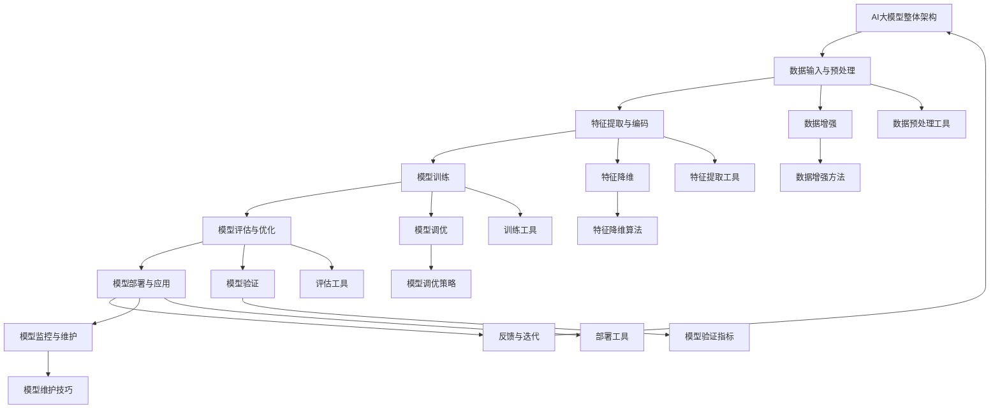

                 

# AI 大模型创业：如何利用社会优势？

> 关键词：人工智能，大模型，创业，社会优势，商业模式，项目孵化，团队建设

> 摘要：本文将深入探讨AI大模型创业的各个方面，包括AI大模型的基本概念、架构、数学基础、实践方法、安全与伦理问题、商业模式分析、项目孵化与创业策略，以及企业运营与增长。通过对AI大模型的核心概念与架构的详细阐述，并结合具体案例，为创业者提供切实可行的创业指导。

## 第一部分: AI大模型概述

### 第1章: AI大模型基础

#### 1.1 AI大模型简介

##### 1.1.1 AI大模型的基本概念

AI大模型是指那些具有海量参数和强大计算能力的神经网络模型，它们能够处理大规模的数据集，并从中学习复杂的模式和知识。这些模型通常需要大量的计算资源、存储空间和训练时间来训练和优化。

##### 1.1.2 AI大模型与传统AI的区别

传统AI模型，如决策树、支持向量机等，通常参数较少，能够处理的样本数据量有限。而AI大模型则具备以下特点：

1. 海量参数：大模型具有数百万甚至数十亿的参数。
2. 强大计算能力：大模型通常需要高性能的计算机集群进行训练。
3. 自适应学习能力：大模型能够自动调整参数，以适应不同的任务和数据集。
4. 通用性：大模型可以应用于多种不同领域的任务。

##### 1.1.3 AI大模型的发展历程

AI大模型的发展历程可以追溯到20世纪80年代的深度学习研究。早期的工作主要集中在简单的神经网络模型，如感知机和多层感知机。随着计算能力的提升和大数据技术的发展，深度学习在21世纪初开始迅速崛起，并逐渐成为AI领域的核心技术。近年来，AI大模型如GPT、BERT等取得了显著的突破，使得AI在自然语言处理、计算机视觉、语音识别等领域取得了前所未有的进展。

### 1.2 AI大模型的架构

##### 1.2.1 神经网络结构

神经网络是AI大模型的基础，其结构由大量的神经元组成。每个神经元接收多个输入信号，通过加权求和并应用非线性激活函数，产生输出信号。神经网络可以分为以下几个层次：

1. 输入层：接收外部输入信号。
2. 隐藏层：用于提取输入数据的特征。
3. 输出层：产生最终的输出结果。

##### 1.2.2 预训练与微调

预训练是指在大量未标注的数据上进行模型的训练，以使模型获得基本的特征提取能力。微调是在预训练模型的基础上，使用有标注的数据集对模型进行细粒度的调整，以适应特定的任务。

##### 1.2.3 模型压缩与优化

为了降低模型的计算复杂度和存储需求，需要对大模型进行压缩和优化。常见的模型压缩方法包括剪枝、量化、蒸馏等。优化方法包括梯度下降算法及其变种，如随机梯度下降（SGD）、Adam等。

### 1.3 AI大模型的应用场景

##### 1.3.1 自然语言处理

自然语言处理（NLP）是AI大模型的重要应用领域。例如，GPT和BERT等大模型在机器翻译、文本生成、问答系统等方面取得了显著的成果。

##### 1.3.2 计算机视觉

计算机视觉（CV）领域的大模型如ResNet和VGG等，在图像分类、目标检测、人脸识别等方面表现出色。

##### 1.3.3 语音识别

语音识别（ASR）领域的大模型如WaveNet和DeepSpeech等，实现了高准确率的语音识别。

## 第2章: AI大模型的数学基础

### 2.1 线性代数

##### 2.1.1 矩阵与向量

矩阵和向量是线性代数的基本概念。矩阵是一个由数字组成的矩形数组，而向量是一个由数字组成的列向量。在AI大模型中，矩阵和向量用于表示数据、权重和激活函数等。

##### 2.1.2 线性方程组

线性方程组是描述线性关系的数学模型。在AI大模型中，线性方程组用于求解参数和损失函数。

##### 2.1.3 特征值与特征向量

特征值和特征向量是矩阵的属性，用于描述矩阵的稳定性和可分解性。在AI大模型中，特征值和特征向量用于特征提取和降维。

### 2.2 概率论与统计

##### 2.2.1 概率分布

概率分布是描述随机变量取值的概率分布函数。在AI大模型中，概率分布用于生成数据、评估模型和优化算法。

##### 2.2.2 随机变量

随机变量是描述不确定事件的结果。在AI大模型中，随机变量用于表示输入数据、模型输出和损失函数。

##### 2.2.3 最大似然估计与最小二乘法

最大似然估计和最小二乘法是用于估计模型参数的常用方法。在AI大模型中，这些方法用于优化模型和评估模型性能。

### 2.3 优化算法

##### 2.3.1 梯度下降算法

梯度下降算法是用于求解优化问题的基本方法。在AI大模型中，梯度下降算法用于优化模型的损失函数。

##### 2.3.2 随机梯度下降

随机梯度下降是梯度下降算法的一种变种，它通过随机抽样样本来优化模型。在AI大模型中，随机梯度下降用于提高训练效率。

##### 2.3.3 动量与自适应优化算法

动量法和自适应优化算法是梯度下降算法的改进版本，它们通过引入历史梯度信息和自适应调整学习率来优化模型。在AI大模型中，这些算法用于提高模型的收敛速度和稳定性。

## 第二部分: AI大模型实践

### 第3章: AI大模型开发环境搭建

#### 3.1 环境配置

##### 3.1.1 操作系统安装

安装Linux操作系统，如Ubuntu或CentOS，以支持高性能计算。

##### 3.1.2 编译器安装

安装C++编译器，如GCC或Clang，以支持深度学习框架的编译。

##### 3.1.3 数据库安装

安装NoSQL数据库，如MongoDB，以存储和管理大规模数据集。

#### 3.2 开发工具与框架

##### 3.2.1 TensorFlow

安装TensorFlow框架，以支持深度学习模型的训练和部署。

##### 3.2.2 PyTorch

安装PyTorch框架，以支持动态图模型的训练和推理。

##### 3.2.3 其他常用工具

安装Python、NumPy、Pandas等常用工具，以支持数据预处理和模型训练。

### 第4章: AI大模型项目实战

#### 4.1 项目概述

##### 4.1.1 项目背景

介绍项目的背景和目标，如自然语言处理、计算机视觉或语音识别等领域的应用。

##### 4.1.2 项目目标

明确项目的目标和预期效果，如实现特定任务的准确率、响应速度等。

#### 4.2 数据准备

##### 4.2.1 数据采集

采集与项目目标相关的数据集，如文本、图像或语音数据。

##### 4.2.2 数据预处理

对采集到的数据集进行清洗、归一化和特征提取等预处理操作。

#### 4.3 模型设计与实现

##### 4.3.1 模型结构设计

设计模型的架构，包括输入层、隐藏层和输出层等。

##### 4.3.2 代码实现

实现模型的结构和训练过程，使用Python代码和深度学习框架完成。

#### 4.4 模型训练与优化

##### 4.4.1 训练流程

设置训练参数，如学习率、批次大小和迭代次数等，进行模型训练。

##### 4.4.2 模型优化策略

根据训练结果，调整模型结构、超参数和优化算法，以提高模型性能。

#### 4.5 模型部署与评估

##### 4.5.1 模型部署

将训练好的模型部署到生产环境中，以供实际应用。

##### 4.5.2 评估指标

使用评估指标，如准确率、召回率、F1分数等，对模型性能进行评估。

## 第5章: AI大模型安全与伦理

### 5.1 模型安全性

##### 5.1.1 模型攻击与防御

介绍常见的模型攻击方法，如对抗攻击和注入攻击，以及相应的防御策略。

##### 5.1.2 数据隐私保护

确保训练数据和用户数据的安全，防止数据泄露和滥用。

### 5.2 模型伦理问题

##### 5.2.1 AI伦理的基本原则

阐述AI伦理的基本原则，如公平性、透明性和责任性。

##### 5.2.2 模型偏见与歧视

分析模型可能存在的偏见和歧视问题，并探讨解决方案。

##### 5.2.3 社会影响与责任

讨论AI大模型对社会的影响和责任，以及如何平衡技术创新和社会责任。

## 第6章: AI大模型商业化

### 6.1 商业模式分析

##### 6.1.1 AI大模型的市场机会

分析AI大模型在各个领域的市场机会和潜在客户。

##### 6.1.2 常见商业模式

探讨常见的商业模式，如产品销售、服务订阅和数据共享等。

### 6.2 项目孵化与创业

##### 6.2.1 项目策划与执行

介绍项目孵化的过程，包括市场调研、团队组建和资源筹集等。

##### 6.2.2 创业路径与策略

分析创业路径和策略，如产品定位、市场推广和合作伙伴关系等。

### 6.3 企业运营与增长

##### 6.3.1 企业发展战略

制定企业发展战略，包括产品规划、市场拓展和人才引进等。

##### 6.3.2 团队建设与管理

建设高效团队，包括招聘、培训和激励机制等。

## 第三部分: 案例研究

### 第7章: 案例研究

#### 7.1 案例一：OpenAI与GPT-3

##### 7.1.1 案例背景

介绍OpenAI的背景和GPT-3的发展历程。

##### 7.1.2 模型结构与原理

详细解释GPT-3的模型结构和原理。

##### 7.1.3 模型应用场景与效果

探讨GPT-3在不同领域的应用场景和效果。

#### 7.2 案例二：谷歌云AI服务

##### 7.2.1 案例背景

介绍谷歌云AI服务的背景和产品线。

##### 7.2.2 产品与服务介绍

详细介绍谷歌云AI服务的产品和服务。

##### 7.2.3 案例效果与影响

分析谷歌云AI服务对行业的影响和效果。

## 附录

### 附录A: 资源与工具

#### 附录A.1 资源列表

列出相关的学术论文、技术博客和其他资源。

#### 附录A.2 工具列表

列出常用的深度学习框架、数据预处理工具和其他开发工具。

### 附录B: 数学公式

#### 附录B.1 线性代数

列出线性代数相关的数学公式和解释。

#### 附录B.2 概率论与统计

列出概率论与统计相关的数学公式和解释。

##### B.2.4 条件概率与贝叶斯网络

$$
P(A|B) = \frac{P(B|A)P(A)}{P(B)}
$$

条件概率表示在事件B发生的条件下，事件A发生的概率。贝叶斯网络是一种图形模型，用于表示多个随机变量之间的条件依赖关系。

### 附录C: AI大模型核心概念与架构 Mermaid 流程图

本文详细介绍了AI大模型创业的各个方面，从基础概念到实践方法，再到安全与伦理问题，以及商业模式分析和项目孵化与创业策略。通过具体的案例研究，为创业者提供了切实可行的指导。希望本文能为广大创业者提供有益的参考。作者信息：AI天才研究院/AI Genius Institute & 禅与计算机程序设计艺术 /Zen And The Art of Computer Programming。

