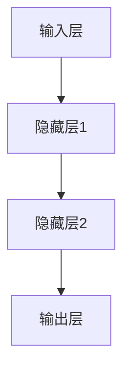
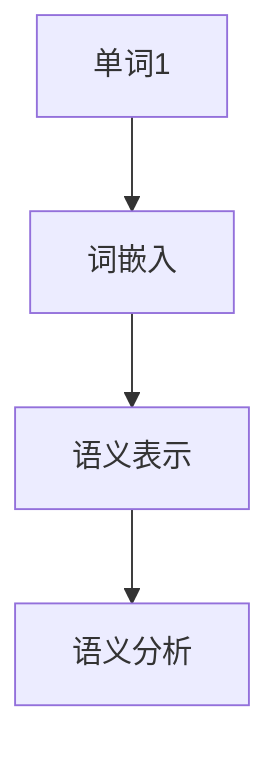
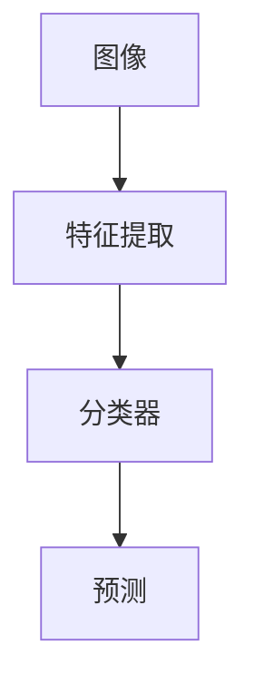

                 

# AI大模型创业：如何利用竞争优势？

> 关键词：AI大模型、创业、竞争优势、市场调研、技术研发、风险管理

> 摘要：本文旨在探讨AI大模型创业过程中的竞争优势策略。通过对AI大模型的基本概念、核心技术、产业现状和趋势的介绍，结合创业实战经验，分析如何构建竞争优势，以及如何通过市场细分、产品定位和国际化战略等手段实现创业成功。

---

## 第一部分：AI大模型基础

### 第1章：AI大模型概述

#### 1.1 AI大模型的定义与特点

AI大模型是指拥有大规模参数、能够处理大量数据并进行复杂决策的深度学习模型。其特点包括：

1. **大规模参数**：拥有数十亿乃至数千亿个参数。
2. **强大计算能力**：依赖高性能计算硬件，如GPU和TPU。
3. **广泛适用性**：可以应用于自然语言处理、计算机视觉、语音识别等领域。

#### 1.2 AI大模型的发展历程

AI大模型的发展历程可以追溯到20世纪80年代，随着计算能力的提升和算法的改进，AI大模型逐渐走向成熟。以下是几个关键里程碑：

1. **1986年**：LeCun等人提出卷积神经网络（CNN），用于图像识别。
2. **2012年**：AlexNet在ImageNet竞赛中取得突破性成绩。
3. **2016年**：Google的TensorFlow框架发布，推动AI大模型的发展。
4. **2018年**：GPT-3发布，标志着自然语言处理领域的重要进展。

#### 1.3 AI大模型的应用领域

AI大模型在各个领域展现出广泛的应用前景，主要包括：

1. **金融**：用于风险管理、信用评估、欺诈检测等。
2. **医疗健康**：用于疾病诊断、药物研发、医疗资源分配等。
3. **教育**：用于智能教育、个性化学习、考试评估等。
4. **自动驾驶**：用于环境感知、路径规划、驾驶决策等。

### 第2章：AI大模型核心技术

#### 2.1 深度学习基础

##### 2.1.1 神经网络

神经网络是深度学习的基础，由大量简单单元（神经元）组成。每个神经元接收多个输入信号，通过加权求和后，通过激活函数输出结果。



##### 2.1.2 优化算法

优化算法用于调整神经网络中的权重和偏置，以最小化损失函数。常用的优化算法包括梯度下降、随机梯度下降、Adam等。

```python
# 梯度下降伪代码
def gradient_descent(parameters, learning_rate, epochs):
    for epoch in range(epochs):
        gradients = compute_gradients(parameters)
        update_parameters(parameters, gradients, learning_rate)
    return parameters
```

##### 2.2 自然语言处理

自然语言处理（NLP）是AI大模型的重要应用领域。其主要技术包括词嵌入、序列处理、语义理解等。

###### 2.2.1 词嵌入

词嵌入将单词映射为向量，以表示单词的语义信息。常用的词嵌入方法包括Word2Vec、GloVe等。

###### 2.2.2 语义理解

语义理解涉及对文本中单词、短语和句子的语义进行理解和分析。常用的方法包括BERT、GPT等。

###### 2.2.3 语义理解

语义理解涉及对文本中单词、短语和句子的语义进行理解和分析。常用的方法包括BERT、GPT等。



##### 2.3 计算机视觉

计算机视觉是AI大模型在图像和视频处理领域的重要应用。其主要技术包括图像分类、目标检测、图像分割等。



### 第3章：AI大模型产业现状与趋势

#### 3.1 国内外AI大模型发展现状

国内AI大模型发展迅速，阿里巴巴、腾讯、百度等企业在AI大模型研发和应用方面取得显著成果。国外AI大模型发展较早，Google、Facebook、微软等企业处于领先地位。

#### 3.2 AI大模型行业趋势分析

AI大模型行业趋势主要包括：

1. **计算能力提升**：随着硬件技术的进步，计算能力不断提升，为AI大模型的研究和应用提供有力支持。
2. **开源生态发展**：越来越多的开源框架和工具推出，降低了AI大模型研发门槛，促进了行业的快速发展。
3. **应用场景拓展**：AI大模型在金融、医疗、教育、自动驾驶等领域的应用不断拓展，市场前景广阔。

#### 3.3 AI大模型创业机遇与挑战

AI大模型创业机遇主要包括：

1. **市场潜力**：AI大模型在各个领域的应用前景广阔，市场潜力巨大。
2. **技术创新**：AI大模型技术不断发展，为创业公司提供创新机会。

AI大模型创业挑战主要包括：

1. **技术门槛**：AI大模型研发需要强大的技术团队和资金支持，对创业公司提出较高要求。
2. **市场竞争**：国内外巨头企业在AI大模型领域竞争激烈，创业公司需要找准市场定位。

## 第二部分：创业实战

### 第4章：创业准备

#### 4.1 创业团队构建

##### 4.1.1 团队成员角色与职责

创业团队通常包括以下成员及其职责：

1. **创始人**：负责整体战略规划、团队管理和资源整合。
2. **技术总监**：负责技术研发方向、团队建设和技术储备。
3. **产品经理**：负责产品规划、市场需求分析和用户体验设计。
4. **市场经理**：负责市场调研、推广策略和品牌建设。
5. **数据科学家**：负责数据分析和模型研发。

##### 4.1.2 团队合作与沟通

良好的团队合作和沟通对创业成功至关重要。以下是一些关键点：

1. **明确目标**：确保团队成员对项目目标有清晰认识。
2. **分工明确**：明确团队成员的职责和任务。
3. **定期沟通**：定期召开会议，确保团队成员之间的信息畅通。
4. **鼓励创新**：鼓励团队成员提出创新想法，促进团队协作。

#### 4.2 市场调研

##### 4.2.1 市场需求分析

市场需求分析是创业准备的重要环节。以下是一些关键点：

1. **目标市场**：明确目标市场和潜在用户。
2. **需求调研**：通过问卷调查、用户访谈等方式了解用户需求。
3. **竞争分析**：分析竞争对手的产品特点、优势和劣势。
4. **市场趋势**：关注市场发展趋势和潜在机会。

##### 4.2.2 竞争对手分析

竞争对手分析有助于了解市场格局和自身定位。以下是一些关键点：

1. **产品特点**：分析竞争对手产品的特点、优势和创新点。
2. **市场份额**：了解竞争对手的市场份额和地位。
3. **商业模式**：分析竞争对手的商业模式、收入来源和盈利能力。
4. **竞争优势**：找出竞争对手的竞争优势和劣势。

##### 4.3 商业模式设计

##### 4.3.1 收入模式

创业公司的收入模式通常包括以下几种：

1. **产品销售**：通过销售自主研发的AI大模型产品获得收入。
2. **服务订阅**：提供AI大模型相关的咨询服务，通过订阅模式获得收入。
3. **广告收入**：通过为合作伙伴提供广告位或推广服务获得收入。
4. **数据交易**：提供数据交易服务，通过数据交易获得收入。

##### 4.3.2 成本控制

创业公司在资源有限的情况下，需要严格控制成本。以下是一些关键点：

1. **合理预算**：制定详细的预算计划，确保资金合理使用。
2. **优化运营**：通过提高运营效率、降低人力成本等方式减少开支。
3. **合作伙伴**：与合作伙伴建立长期合作关系，降低采购成本。
4. **风险管理**：对潜在风险进行评估和防范，降低风险成本。

### 第5章：AI大模型应用场景探索

#### 5.1 金融行业应用

##### 5.1.1 信用评估

AI大模型在信用评估领域具有显著优势，可以通过分析用户的历史数据、行为特征等信息，预测用户的信用风险。以下是一些关键点：

1. **数据收集**：收集用户的历史交易数据、信用记录等信息。
2. **特征提取**：提取与信用风险相关的特征，如还款能力、还款意愿等。
3. **模型训练**：使用深度学习算法训练信用评估模型。
4. **风险预测**：利用训练好的模型预测用户的信用风险。

##### 5.1.2 风险管理

AI大模型在风险管理领域具有广泛的应用前景，可以用于预测市场风险、信用风险、操作风险等。以下是一些关键点：

1. **数据收集**：收集金融市场数据、信用数据、操作数据等。
2. **特征提取**：提取与风险相关的特征，如市场波动、违约率等。
3. **模型训练**：使用深度学习算法训练风险预测模型。
4. **风险预警**：利用训练好的模型实时监测市场风险。

#### 5.2 医疗健康领域应用

##### 5.2.1 疾病诊断

AI大模型在疾病诊断领域具有很高的准确性，可以通过分析医学图像、病例数据等信息，辅助医生进行疾病诊断。以下是一些关键点：

1. **数据收集**：收集医学图像、病例数据、基因数据等。
2. **特征提取**：提取与疾病相关的特征，如病灶区域、病理特征等。
3. **模型训练**：使用深度学习算法训练疾病诊断模型。
4. **诊断辅助**：利用训练好的模型辅助医生进行疾病诊断。

##### 5.2.2 医疗资源分配

AI大模型在医疗资源分配领域可以优化医疗资源的利用效率，提高医疗服务质量。以下是一些关键点：

1. **数据收集**：收集医院就诊数据、住院数据、医生排班数据等。
2. **特征提取**：提取与医疗资源分配相关的特征，如就诊高峰期、医生专业技能等。
3. **模型训练**：使用深度学习算法训练医疗资源分配模型。
4. **资源优化**：利用训练好的模型优化医疗资源的分配。

#### 5.3 教育行业应用

##### 5.3.1 智能教育

AI大模型在智能教育领域可以为学生提供个性化的学习服务，提高学习效果。以下是一些关键点：

1. **数据收集**：收集学生学习数据、学习进度、考试成绩等。
2. **特征提取**：提取与学生学习相关的特征，如学习习惯、知识掌握程度等。
3. **模型训练**：使用深度学习算法训练智能教育模型。
4. **个性化推荐**：利用训练好的模型为学生提供个性化的学习推荐。

##### 5.3.2 考试评估

AI大模型在考试评估领域可以为学生提供公正、客观的考试评估服务，提高考试公平性。以下是一些关键点：

1. **数据收集**：收集学生考试数据、试卷评分标准等。
2. **特征提取**：提取与考试评估相关的特征，如答案正确率、解题思路等。
3. **模型训练**：使用深度学习算法训练考试评估模型。
4. **考试评分**：利用训练好的模型对学生的考试表现进行评估。

### 第6章：AI大模型创业实战

#### 6.1 项目策划与启动

##### 6.1.1 项目立项

项目立项是创业的第一步，需要明确项目目标、预算、时间表等关键信息。以下是一些关键点：

1. **项目目标**：明确项目的核心目标和预期成果。
2. **预算规划**：制定详细的预算计划，包括研发费用、运营费用等。
3. **时间表**：制定项目的时间表，包括关键节点、任务分配等。

##### 6.1.2 初创公司运营

初创公司运营包括团队管理、资源整合、市场拓展等关键环节。以下是一些关键点：

1. **团队管理**：建立高效的团队管理机制，确保团队协作顺畅。
2. **资源整合**：整合公司内外部资源，提高资源利用效率。
3. **市场拓展**：积极开展市场拓展活动，扩大市场份额。

#### 6.2 技术研发

##### 6.2.1 模型开发

模型开发是AI大模型创业的核心环节，需要关注以下关键点：

1. **数据收集**：收集大量的训练数据，确保模型训练质量。
2. **特征提取**：提取与业务相关的特征，提高模型准确性。
3. **模型训练**：使用深度学习算法训练模型，优化模型性能。

##### 6.2.2 模型优化

模型优化是提高模型性能的重要手段，需要关注以下关键点：

1. **超参数调优**：调整模型的超参数，提高模型性能。
2. **模型融合**：将多个模型融合，提高模型鲁棒性。
3. **模型压缩**：使用模型压缩技术，降低模型计算复杂度。

#### 6.3 产品推广

##### 6.3.1 市场推广策略

市场推广策略是扩大产品影响力的关键，需要关注以下关键点：

1. **品牌建设**：建立品牌形象，提高品牌知名度。
2. **内容营销**：通过高质量的内容吸引潜在客户。
3. **线上线下活动**：开展线上线下活动，提高用户参与度。

##### 6.3.2 用户反馈与迭代

用户反馈与迭代是产品优化的重要环节，需要关注以下关键点：

1. **用户调研**：定期进行用户调研，了解用户需求和意见。
2. **问题排查**：及时排查用户反馈的问题，确保产品稳定性。
3. **功能迭代**：根据用户反馈和市场需求，不断优化产品功能。

### 第7章：创业成功案例解析

#### 7.1 成功案例介绍

创业成功案例包括：

1. **谷歌**：谷歌通过自主研发的深度学习技术，成功推出GPT-3等AI大模型，成为AI领域的领军企业。
2. **亚马逊**：亚马逊通过AI大模型优化供应链管理，提高运营效率，实现了持续增长。

#### 7.2 成功因素分析

成功因素包括：

1. **技术创新**：不断推动技术创新，保持行业领先地位。
2. **市场洞察**：准确把握市场发展趋势，抢占市场先机。
3. **团队协作**：建立高效的团队协作机制，确保项目顺利推进。

#### 7.3 启示与建议

创业启示包括：

1. **聚焦核心竞争力**：专注于自身核心优势，形成竞争优势。
2. **灵活调整策略**：根据市场变化，及时调整创业策略。
3. **持续创新**：保持创新意识，不断推出具有竞争力的产品。

## 第三部分：竞争优势策略

### 第8章：竞争优势理论

#### 8.1 竞争优势的定义与分类

竞争优势是指企业在市场竞争中相对于竞争对手所具有的持续竞争优势。竞争优势可分为以下几种类型：

1. **成本领先**：通过降低成本，实现产品的低价优势。
2. **差异化**：通过产品或服务的独特性，实现差异化竞争优势。
3. **集中化**：专注于特定的市场细分领域，实现集中化竞争优势。

#### 8.2 竞争优势分析工具

竞争优势分析工具包括SWOT分析、五力分析模型等，以下是一些关键点：

1. **SWOT分析**：分析企业的优势、劣势、机会和威胁，制定相应的战略。
2. **五力分析模型**：分析行业内的竞争强度、供应商谈判能力、客户谈判能力等，评估企业的市场地位。

#### 8.3 竞争优势的构建策略

竞争优势的构建策略包括：

1. **技术创新**：持续推动技术创新，保持行业领先地位。
2. **品牌建设**：建立强大的品牌形象，提高品牌知名度。
3. **渠道拓展**：通过多元化的渠道，扩大市场覆盖范围。

### 第9章：市场竞争策略

#### 9.1 市场细分策略

市场细分策略是将市场划分为不同的子市场，以满足不同客户群体的需求。以下是一些关键点：

1. **地理细分**：根据地理位置划分市场。
2. **人口细分**：根据人口特征划分市场。
3. **行为细分**：根据客户行为特征划分市场。
4. **心理细分**：根据客户心理特征划分市场。

#### 9.2 产品定位策略

产品定位策略是将产品在客户心目中树立特定的形象，以赢得市场份额。以下是一些关键点：

1. **高端定位**：将产品定位为高端，吸引追求品质的消费者。
2. **大众定位**：将产品定位为大众化，满足广泛消费者的需求。
3. **专业定位**：将产品定位为专业领域，满足特定群体的需求。

#### 9.3 品牌建设策略

品牌建设策略是提升品牌知名度和美誉度，以下是一些关键点：

1. **品牌塑造**：通过品牌形象、品牌传播等方式塑造品牌。
2. **口碑营销**：通过用户口碑传播，提高品牌知名度。
3. **公关活动**：通过公关活动，提升品牌形象。

### 第10章：国际化战略

#### 10.1 国际化战略的定义与意义

国际化战略是指企业将业务扩展到国际市场，以获取更大的市场份额和利润。国际化战略的意义包括：

1. **扩大市场份额**：通过国际化，企业可以拓展海外市场，实现市场份额的扩大。
2. **降低经营风险**：通过国际化，企业可以分散市场风险，降低经营风险。
3. **提升品牌影响力**：通过国际化，企业可以提升品牌在国际市场的知名度和影响力。

#### 10.2 国际化市场调研

国际化市场调研是制定国际化战略的基础，以下是一些关键点：

1. **目标市场选择**：根据企业的目标，选择合适的国际市场。
2. **竞争分析**：分析目标市场的竞争对手和市场格局。
3. **消费者需求**：了解目标市场的消费者需求和文化特点。

#### 10.3 国际化营销策略

国际化营销策略是企业在国际市场开展营销活动的关键，以下是一些关键点：

1. **本地化策略**：根据目标市场的文化、法律和消费者习惯，制定本地化营销策略。
2. **国际传播**：通过国际传播手段，提高品牌在国际市场的知名度和影响力。
3. **全球合作**：与全球合作伙伴建立合作关系，共同开拓国际市场。

### 第11章：风险管理

#### 11.1 风险识别与评估

风险识别与评估是风险管理的重要环节，以下是一些关键点：

1. **风险识别**：识别可能影响企业发展的各种风险，如市场风险、技术风险、财务风险等。
2. **风险评估**：评估风险的严重程度和可能性，制定相应的风险管理策略。

#### 11.2 风险应对策略

风险应对策略包括以下几种：

1. **风险规避**：通过避免参与高风险业务，降低风险暴露。
2. **风险减轻**：通过采取预防措施，降低风险发生的概率或损失程度。
3. **风险转移**：通过购买保险、签订风险合同等方式，将风险转移给第三方。

#### 11.3 风险管理案例解析

以下是一个风险管理案例：

1. **案例背景**：某创业公司计划进入国际市场，但面临汇率波动、政治风险等风险。
2. **风险识别**：识别出汇率波动、政治风险等潜在风险。
3. **风险评估**：评估汇率波动风险对公司的潜在影响，制定相应的应对策略。
4. **风险应对**：通过签订外汇风险管理合同、分散投资等方式降低风险。

## 附录

### 附录A：AI大模型开发工具与资源

#### A.1 主流深度学习框架对比

以下是对几种主流深度学习框架的简要对比：

| 框架           | 特点                           | 应用场景                   |
|----------------|--------------------------------|----------------------------|
| TensorFlow     | 开源、灵活、适用于大规模模型 | 自然语言处理、计算机视觉等 |
| PyTorch        | 灵活、易于使用、动态计算图    | 图像识别、语音识别等       |
| Keras          | 高层抽象、易于使用             | 快速原型开发、应用部署     |
| MXNet          | 并行计算、优化性能             | 自动驾驶、金融应用等       |

#### A.2 开发工具与环境配置

以下是一些常用的开发工具和环境配置：

1. **Python**：作为深度学习的主要编程语言，Python具有丰富的库和框架支持。
2. **Jupyter Notebook**：用于交互式开发和实验。
3. **GPU环境**：配置NVIDIA GPU驱动和CUDA，以利用GPU加速深度学习计算。
4. **Docker**：用于容器化部署，便于环境管理和迁移。

#### A.3 开发资源推荐

以下是一些推荐的开发资源和学习资料：

1. **书籍**：
   - 《深度学习》（Goodfellow, Bengio, Courville）
   - 《Python深度学习》（François Chollet）
2. **在线课程**：
   - Coursera的《深度学习》课程（由Andrew Ng教授）
   - Udacity的《深度学习工程师纳米学位》
3. **社区和论坛**：
   - Stack Overflow
   - GitHub
   - AI Stack Exchange

---

作者：AI天才研究院/AI Genius Institute & 禅与计算机程序设计艺术 /Zen And The Art of Computer Programming

