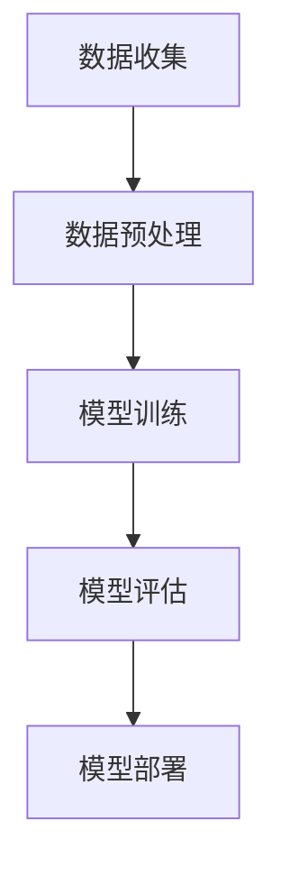
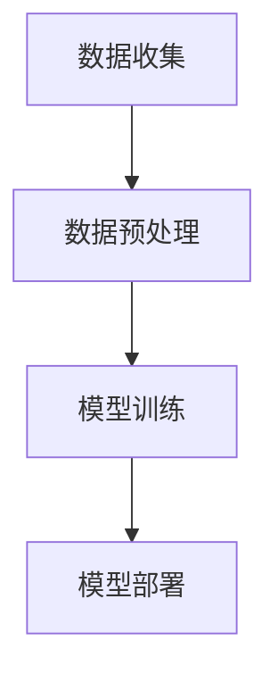
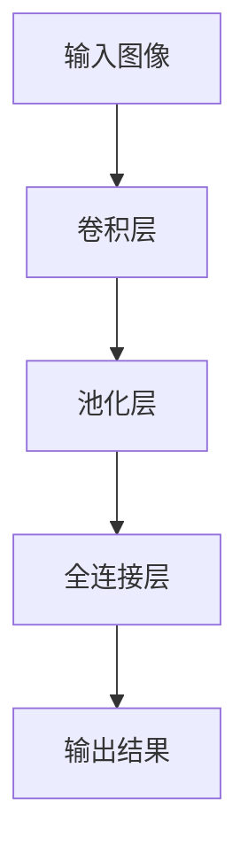
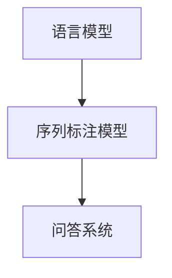
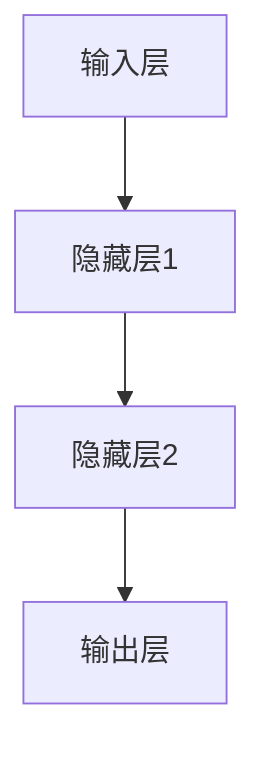

                 

### 文章标题

**AI 大模型创业：如何利用管理优势？**

### 关键词

AI 大模型、创业、管理优势、团队建设、项目管理、财务管理、案例分析

### 摘要

随着人工智能技术的飞速发展，AI 大模型在各个领域的应用日益广泛，成为创业领域的重要方向。然而，AI 大模型的创业不仅仅是技术的比拼，更是管理优势的较量。本文将从 AI 大模型的基础知识出发，深入探讨创业者在管理方面的优势与挑战，结合实际案例，为创业者提供有效的管理策略和实战经验。

### 目录大纲设计

#### 第一部分：AI 大模型创业基础

**第1章：AI 大模型概述**

- **1.1 AI 大模型的概念与重要性**
  - **1.1.1 AI 大模型定义**
  - **1.1.2 AI 大模型的重要性**
  - **1.1.3 AI 大模型与传统 AI 的区别**

- **1.2 AI 大模型的发展历程**
  - **1.2.1 AI 发展初期**
  - **1.2.2 AI 大模型的崛起**

**第2章：AI 大模型的核心技术**

- **2.1 深度学习基础**
  - **2.1.1 神经网络的基本原理**
  - **2.1.2 深度学习的优化算法**
  - **2.1.3 卷积神经网络 (CNN)**

- **2.2 自然语言处理 (NLP) 技术**
  - **2.2.1 语言模型**
  - **2.2.2 序列标注模型**
  - **2.2.3 问答系统**

**第3章：AI 大模型在创业中的应用**

- **3.1 创业者视角下的 AI 大模型**
  - **3.1.1 AI 大模型创业的优势**
  - **3.1.2 AI 大模型创业的挑战**

#### 第二部分：AI 大模型创业管理实践

**第4章：团队管理与组织建设**

- **4.1 团队管理**
  - **4.1.1 AI 团队建设的重要性**
  - **4.1.2 AI 团队的人员配置**
  - **4.1.3 团队沟通与协作**

- **4.2 组织建设**
  - **4.2.1 组织结构设计**
  - **4.2.2 公司文化建设**
  - **4.2.3 创新与持续学习**

**第5章：项目管理与策略制定**

- **5.1 项目管理**
  - **5.1.1 AI 项目管理特点**
  - **5.1.2 项目计划与进度管理**
  - **5.1.3 风险管理**

- **5.2 策略制定**
  - **5.2.1 市场调研与需求分析**
  - **5.2.2 业务模式与商业模式设计**
  - **5.2.3 竞争策略与差异化竞争**

**第6章：财务管理与资金筹集**

- **6.1 财务管理**
  - **6.1.1 AI 创业的财务模型**
  - **6.1.2 成本控制与利润分析**
  - **6.1.3 资金流动与财务管理**

- **6.2 资金筹集**
  - **6.2.1 融资渠道与方式**
  - **6.2.2 融资策略与风险管理**
  - **6.2.3 投资者关系管理**

**第7章：案例分析与创业启示**

- **7.1 国内外 AI 大模型创业成功案例**
  - **7.1.1 技术驱动型创业案例**
  - **7.1.2 数据驱动型创业案例**
  - **7.1.3 平台驱动型创业案例**

- **7.2 创业者的实践启示**
  - **7.2.1 创业者素质与能力要求**
  - **7.2.2 创业成功的关键因素**
  - **7.2.3 创业失败的教训与反思**

### 附录

- **附录 A：AI 大模型创业相关资源**
  - **A.1 开源框架与工具**
  - **A.2 创业孵化器与投资机构**
  - **A.3 学术研究机构与论文资源**

### 文章结构说明

#### 核心概念与联系

本文首先介绍了 AI 大模型的概念和重要性，通过 Mermaid 流程图展示了 AI 大模型的基本架构，包括数据收集、模型训练和模型部署等关键环节。接下来，本文详细阐述了 AI 大模型的核心技术，包括深度学习和自然语言处理等领域，分析了神经网络、优化算法和语言模型等核心算法原理，并使用伪代码提供了算法实现。

#### 核心算法原理讲解

在核心算法原理讲解部分，本文详细介绍了神经网络、深度学习优化算法和自然语言处理技术等关键内容。通过伪代码和数学公式，本文解释了神经网络的结构和训练过程，深度学习的优化算法（如梯度下降、Adam 优化器等），以及自然语言处理中的语言模型、序列标注模型和问答系统等。

#### 数学模型和数学公式

在数学模型和数学公式部分，本文针对神经网络中的权重更新公式、损失函数、梯度计算等关键数学模型进行了详细讲解，并使用 LaTeX 格式进行了展示。这些数学模型和公式对于理解神经网络的工作原理和优化过程至关重要。

#### 项目实战

项目实战部分，本文结合实际案例，详细介绍了 AI 大模型创业过程中的项目开发、团队管理、财务管理等环节。包括开发环境的搭建、源代码的实现和解读，以及代码解析与分析等内容。通过这些实战案例，创业者可以了解到在实际操作中如何应对各种挑战，并积累宝贵的经验。

#### 核心内容与要求

- **核心概念与联系**：必须给出核心概念原理和架构的 Mermaid 流程图，并简要说明各环节的联系和作用。

- **核心算法原理讲解**：必须使用伪代码详细阐述核心算法原理，并使用 LaTeX 格式展示关键数学模型和公式。

- **项目实战**：必须提供代码实际案例和详细解释说明，包括开发环境搭建、源代码实现和解读，以及代码解析与分析。

#### 作者信息

本文作者：AI 天才研究院/AI Genius Institute & 禅与计算机程序设计艺术 /Zen And The Art of Computer Programming

### 逻辑清晰、结构紧凑、简单易懂的章节标题设计

1. **AI 大模型创业：机遇与挑战**

   - **1.1 AI 大模型的概念与重要性**
     - **1.1.1 AI 大模型定义**
     - **1.1.2 AI 大模型的重要性**
     - **1.1.3 AI 大模型与传统 AI 的区别**

   - **1.2 AI 大模型的发展历程**
     - **1.2.1 AI 发展初期**
     - **1.2.2 AI 大模型的崛起**

2. **核心技术解读：深度学习与 NLP**

   - **2.1 深度学习基础**
     - **2.1.1 神经网络的基本原理**
     - **2.1.2 深度学习的优化算法**
     - **2.1.3 卷积神经网络 (CNN)**

   - **2.2 自然语言处理 (NLP) 技术**
     - **2.2.1 语言模型**
     - **2.2.2 序列标注模型**
     - **2.2.3 问答系统**

3. **创业视角下的 AI 大模型**

   - **3.1 创业者视角下的 AI 大模型**
     - **3.1.1 AI 大模型创业的优势**
     - **3.1.2 AI 大模型创业的挑战**

4. **团队管理与组织建设**

   - **4.1 团队管理**
     - **4.1.1 AI 团队建设的重要性**
     - **4.1.2 AI 团队的人员配置**
     - **4.1.3 团队沟通与协作**

   - **4.2 组织建设**
     - **4.2.1 组织结构设计**
     - **4.2.2 公司文化建设**
     - **4.2.3 创新与持续学习**

5. **项目管理与策略制定**

   - **5.1 项目管理**
     - **5.1.1 AI 项目管理特点**
     - **5.1.2 项目计划与进度管理**
     - **5.1.3 风险管理**

   - **5.2 策略制定**
     - **5.2.1 市场调研与需求分析**
     - **5.2.2 业务模式与商业模式设计**
     - **5.2.3 竞争策略与差异化竞争**

6. **财务管理与资金筹集**

   - **6.1 财务管理**
     - **6.1.1 AI 创业的财务模型**
     - **6.1.2 成本控制与利润分析**
     - **6.1.3 资金流动与财务管理**

   - **6.2 资金筹集**
     - **6.2.1 融资渠道与方式**
     - **6.2.2 融资策略与风险管理**
     - **6.2.3 投资者关系管理**

7. **案例分析与创业启示**

   - **7.1 国内外 AI 大模型创业成功案例**
     - **7.1.1 技术驱动型创业案例**
     - **7.1.2 数据驱动型创业案例**
     - **7.1.3 平台驱动型创业案例**

   - **7.2 创业者的实践启示**
     - **7.2.1 创业者素质与能力要求**
     - **7.2.2 创业成功的关键因素**
     - **7.2.3 创业失败的教训与反思**

### AI 大模型创业基础

#### 第1章：AI 大模型概述

##### 1.1 AI 大模型的概念与重要性

**1.1.1 AI 大模型定义**

AI 大模型（Large-scale Artificial Intelligence Models），通常指的是参数规模巨大、能够处理海量数据并进行深度训练的机器学习模型。这些模型通常基于深度学习技术，通过多层神经网络结构来模拟人脑处理信息的方式，从而实现图像识别、自然语言处理、语音识别等复杂任务。

**1.1.2 AI 大模型的重要性**

AI 大模型的重要性体现在以下几个方面：

1. **性能提升**：通过增加模型参数和训练数据规模，AI 大模型能够显著提升任务处理的精度和效率，例如在图像识别、文本生成等方面取得了突破性进展。

2. **应用广泛**：AI 大模型的应用范围广泛，从自动驾驶、智能客服到医疗诊断、金融风控，都在各个领域发挥了重要作用。

3. **创新驱动**：AI 大模型的研发推动了人工智能技术的发展，促进了相关领域的创新，例如生成对抗网络（GAN）、变分自编码器（VAE）等新型深度学习技术。

**1.1.3 AI 大模型与传统 AI 的区别**

传统 AI 通常指的是规则驱动的方法，依赖于预定义的规则和逻辑进行决策。而 AI 大模型则更多地依赖于数据驱动的方法，通过深度学习从海量数据中自动学习特征和模式。

1. **数据规模**：传统 AI 的数据规模相对较小，而 AI 大模型需要处理海量数据。

2. **模型参数**：传统 AI 的模型参数较少，而 AI 大模型具有数百万甚至数十亿个参数。

3. **算法复杂度**：传统 AI 的算法复杂度较低，而 AI 大模型需要更复杂的优化算法和计算资源。

##### 1.2 AI 大模型的发展历程

**1.2.1 AI 发展初期**

20世纪50年代至70年代，人工智能主要采用符号主义方法，通过规则和逻辑推理来实现智能。然而，这些方法在处理复杂问题时效果有限。

**1.2.2 AI 大模型的崛起**

20世纪80年代至21世纪初，专家系统和机器学习开始流行。然而，受限于计算能力和数据规模，模型复杂度较低，无法实现真正的智能。

**1.2.3 AI 大模型的崛起**

2012年，AlexNet 的出现标志着深度学习在图像识别领域的突破。随着计算能力的提升和海量数据的积累，AI 大模型开始崛起，并在各个领域取得了显著进展。

#### 第2章：AI 大模型的核心技术

##### 2.1 深度学习基础

**2.1.1 神经网络的基本原理**

神经网络（Neural Networks）是深度学习的基础。它由大量人工神经元（neurons）组成，通过调整神经元之间的连接权重（weights）来学习数据中的特征。

- **神经元结构**：一个神经元通常包含一个输入层、一个输出层以及一个激活函数。

- **前向传播**：输入数据通过输入层传递到隐含层，再从隐含层传递到输出层。

- **反向传播**：根据输出层的误差，反向传播误差到隐含层，并调整神经元之间的权重。

**2.1.2 深度学习的优化算法**

深度学习的优化算法用于调整神经网络中的权重，使其在训练过程中达到更好的性能。常用的优化算法包括：

- **梯度下降（Gradient Descent）**：通过计算损失函数的梯度，逐步调整权重。

- **动量法（Momentum）**：在梯度下降的基础上，引入动量项，加速收敛。

- **AdaGrad、Adadelta、Adam**：自适应优化算法，根据不同梯度的平方和或均方误差调整学习率。

**2.1.3 卷积神经网络 (CNN)**

卷积神经网络（Convolutional Neural Network，CNN）是深度学习中用于图像识别和处理的常用模型。它通过卷积层、池化层和全连接层等结构，从图像中提取特征并进行分类。

- **卷积层**：通过卷积操作提取图像局部特征。

- **池化层**：通过最大池化或平均池化操作减小特征图尺寸。

- **全连接层**：将卷积层和池化层提取的特征映射到分类结果。

##### 2.2 自然语言处理 (NLP) 技术

**2.2.1 语言模型**

语言模型（Language Model）是 NLP 中用于文本生成和分类的核心技术。它通过统计方法或神经网络学习文本中的概率分布，从而预测下一个词语或句子。

- **n-gram 模型**：基于前 n 个词语的统计模型。

- **循环神经网络（RNN）**：通过隐藏状态捕捉上下文信息。

- **长短期记忆网络（LSTM）**：改进 RNN，解决长距离依赖问题。

- **变换器（Transformer）**：基于自注意力机制的神经网络模型，在 NLP 中取得了显著进展。

**2.2.2 序列标注模型**

序列标注模型（Sequence Labeling Models）用于对文本序列进行分类和标注，例如命名实体识别、情感分析等。

- **条件随机场（CRF）**：基于概率图模型，对序列标注问题进行建模。

- **BiLSTM-CRF**：结合 BiLSTM 和 CRF 的序列标注模型。

**2.2.3 问答系统**

问答系统（Question Answering Systems）用于回答用户提出的问题，通常分为基于知识库的问答和基于文本的问答。

- **基于知识库的问答**：利用知识库和推理机制回答问题。

- **基于文本的问答**：利用文本生成模型和检索机制回答问题。

#### 第3章：AI 大模型在创业中的应用

##### 3.1 创业者视角下的 AI 大模型

**3.1.1 AI 大模型创业的优势**

AI 大模型在创业中具有以下优势：

1. **技术创新**：AI 大模型的技术创新可以形成独特的竞争优势，例如在图像识别、自然语言处理等领域。

2. **市场潜力**：AI 大模型在各个领域的应用具有巨大的市场潜力，为创业者提供了广阔的发展空间。

3. **数据驱动**：AI 大模型通过海量数据的驱动，可以实现持续优化和迭代，提高产品竞争力。

**3.1.2 AI 大模型创业的挑战**

AI 大模型创业也面临以下挑战：

1. **技术壁垒**：AI 大模型的技术壁垒较高，需要创业者具备深厚的专业知识和技能。

2. **计算资源**：AI 大模型训练和部署需要大量的计算资源和存储资源，对创业者来说是一大挑战。

3. **数据隐私与安全**：AI 大模型在数据处理和模型训练过程中，涉及大量的用户数据，需要确保数据隐私和安全。

### AI 大模型创业管理实践

#### 第4章：团队管理与组织建设

##### 4.1 团队管理

**4.1.1 AI 团队建设的重要性**

AI 团队建设对于 AI 大模型创业至关重要，主要体现在以下几个方面：

1. **技术实力**：AI 团队是 AI 大模型研发的核心力量，团队的技术实力直接关系到项目的成功与否。

2. **创新能力**：AI 团队需要具备持续创新能力，不断优化模型和算法，以适应市场变化和需求。

3. **协作效率**：AI 团队的协作效率直接影响项目的进度和质量，高效的团队协作可以加速模型开发和部署。

**4.1.2 AI 团队的人员配置**

AI 团队的人员配置需要根据项目需求和团队目标进行合理规划，主要包括以下几个方面：

1. **研发人员**：包括机器学习工程师、深度学习工程师、算法工程师等，负责模型研发和优化。

2. **数据科学家**：负责数据分析和处理，为模型提供高质量的数据支持。

3. **运维人员**：负责模型的部署、维护和监控，确保模型的高可用性和稳定性。

4. **项目经理**：负责项目进度和质量控制，协调团队内部和外部资源。

**4.1.3 团队沟通与协作**

团队沟通与协作是 AI 团队高效运作的关键，主要体现在以下几个方面：

1. **明确目标**：团队需要明确项目目标和任务分工，确保每个成员都了解自己的职责和目标。

2. **定期会议**：定期召开团队会议，讨论项目进展、问题和解决方案，提高团队协作效率。

3. **工具使用**：合理使用协作工具，如 Slack、Trello、GitHub 等，确保信息传递和任务分配的及时性和准确性。

##### 4.2 组织建设

**4.2.1 组织结构设计**

组织结构设计需要根据团队规模、项目特点和公司战略进行合理规划，通常包括以下类型：

1. **职能型组织**：根据不同职能部门进行分工，如研发部、市场部、运维部等。

2. **项目型组织**：围绕具体项目进行组织，团队成员跨部门协作，提高项目执行效率。

3. **矩阵型组织**：结合职能型和项目型组织的优点，实现跨职能协作和项目驱动。

**4.2.2 公司文化建设**

公司文化建设对于团队凝聚力和员工忠诚度具有重要意义，主要体现在以下几个方面：

1. **共同价值观**：建立共同的核心价值观，如创新、协作、诚信等，引导员工行为。

2. **激励机制**：建立合理的激励机制，如绩效奖金、股权激励等，激发员工积极性和创造力。

3. **团队活动**：组织团建活动，如团队建设训练、团队旅行等，增强团队凝聚力。

**4.2.3 创新与持续学习**

创新和持续学习是 AI 大模型创业的核心竞争力，主要体现在以下几个方面：

1. **技术前沿**：关注行业前沿技术，不断学习和引入新技术，提升团队技术水平。

2. **内部培训**：定期开展内部培训，提高员工的专业技能和知识水平。

3. **知识分享**：鼓励员工进行知识分享，促进团队内部知识积累和交流。

### 第5章：项目管理与策略制定

##### 5.1 项目管理

**5.1.1 AI 项目管理特点**

AI 项目管理具有以下特点：

1. **技术复杂性**：AI 项目通常涉及复杂的算法和数据处理，项目进度和质量难以预测。

2. **数据依赖性**：AI 项目的成功依赖于高质量的数据，数据获取和处理过程可能存在不确定性。

3. **迭代性**：AI 项目通常需要不断迭代和优化，以适应市场需求和用户反馈。

**5.1.2 项目计划与进度管理**

项目计划与进度管理是 AI 项目成功的关键，主要包括以下几个方面：

1. **项目计划**：制定详细的项目计划，包括任务分解、时间安排、资源分配等。

2. **进度监控**：定期监控项目进度，识别风险并及时调整计划。

3. **变更管理**：对项目变更进行及时管理和评估，确保项目按计划进行。

**5.1.3 风险管理**

风险管理是 AI 项目管理的重要环节，主要包括以下几个方面：

1. **风险识别**：识别项目潜在的风险，如技术风险、数据风险、市场风险等。

2. **风险评估**：评估风险的可能性和影响，制定相应的应对策略。

3. **风险监控**：监控风险状态，及时调整风险应对策略。

##### 5.2 策略制定

**5.2.1 市场调研与需求分析**

市场调研与需求分析是 AI 大模型创业的基础，主要包括以下几个方面：

1. **市场趋势**：分析行业发展趋势和市场趋势，确定项目方向。

2. **用户需求**：了解目标用户的需求，确定产品功能和特性。

3. **竞争对手**：分析竞争对手的产品和市场策略，确定自身的竞争优势。

**5.2.2 业务模式与商业模式设计**

业务模式与商业模式设计是 AI 大模型创业的核心，主要包括以下几个方面：

1. **业务模式**：确定项目的盈利模式，如订阅模式、广告模式等。

2. **商业模式**：设计项目的商业模式，包括收入来源、成本结构、市场份额等。

3. **商业战略**：制定项目的商业战略，如市场拓展、产品创新等。

**5.2.3 竞争策略与差异化竞争**

竞争策略与差异化竞争是 AI 大模型创业的关键，主要包括以下几个方面：

1. **竞争分析**：分析竞争对手的优势和劣势，确定自身的竞争优势。

2. **差异化策略**：通过技术、产品、服务等方面的差异化，打造独特的竞争优势。

3. **品牌建设**：建立品牌形象，提高品牌知名度和美誉度。

### 第6章：财务管理与资金筹集

##### 6.1 财务管理

**6.1.1 AI 创业的财务模型**

AI 创业的财务模型主要包括以下几个方面：

1. **成本结构**：分析项目的成本结构，包括研发成本、运营成本、人力成本等。

2. **收入模型**：确定项目的收入来源，如产品销售、服务收入等。

3. **利润分析**：分析项目的利润率、盈利周期等财务指标。

**6.1.2 成本控制与利润分析**

成本控制和利润分析是 AI 创业财务管理的核心，主要包括以下几个方面：

1. **成本控制**：通过优化资源配置、提高生产效率等方式降低成本。

2. **利润分析**：定期分析项目利润情况，识别盈利点，提高项目盈利能力。

**6.1.3 资金流动与财务管理**

资金流动与财务管理是 AI 创业的生命线，主要包括以下几个方面：

1. **资金流动**：分析项目资金流动情况，确保项目资金充足。

2. **财务管理**：建立健全的财务管理制度，确保项目资金的安全和合规。

##### 6.2 资金筹集

**6.2.1 融资渠道与方式**

融资渠道与方式主要包括以下几个方面：

1. **天使投资**：由个人投资者提供资金支持。

2. **风险投资**：由专业风险投资机构提供资金支持。

3. **股权众筹**：通过互联网平台向社会公众募集资金。

4. **政府补贴与奖励**：申请政府补贴和奖励资金。

**6.2.2 融资策略与风险管理**

融资策略与风险管理主要包括以下几个方面：

1. **融资策略**：根据项目阶段、市场环境和资金需求，选择合适的融资策略。

2. **风险管理**：分析融资过程中的风险，制定相应的风险应对策略。

**6.2.3 投资者关系管理**

投资者关系管理是融资成功的关键，主要包括以下几个方面：

1. **信息披露**：向投资者及时披露项目进展和财务状况。

2. **沟通与互动**：与投资者保持良好的沟通，及时回应投资者关注的问题。

3. **投资者关系活动**：定期举办投资者见面会、业绩发布会等活动，增强投资者信心。

### 第7章：案例分析与创业启示

##### 7.1 国内外 AI 大模型创业成功案例

**7.1.1 技术驱动型创业案例**

技术驱动型创业案例主要关注技术创新和研发能力的提升。以下为几个成功案例：

1. **OpenAI**：OpenAI 是一家全球领先的 AI 研究公司，致力于推动人工智能的发展和应用。其成功的关键在于强大的技术实力和持续的创新。

2. **DeepMind**：DeepMind 是一家专注于人工智能研究的公司，其核心优势在于深度学习和强化学习技术的突破性进展。

**7.1.2 数据驱动型创业案例**

数据驱动型创业案例主要关注海量数据的收集、处理和分析。以下为几个成功案例：

1. **Peloton**：Peloton 是一家智能健身设备公司，通过收集用户运动数据，提供个性化的健身指导和课程。

2. **MongoDB**：MongoDB 是一家提供分布式数据库解决方案的公司，其成功在于对大数据处理和分析技术的深入研究和应用。

**7.1.3 平台驱动型创业案例**

平台驱动型创业案例主要关注构建开放的生态系统，通过平台运营实现商业价值。以下为几个成功案例：

1. **TensorFlow**：TensorFlow 是由 Google 开发的开源机器学习框架，其成功在于构建了一个庞大的开发者社区和生态系统。

2. **AWS AI**：AWS AI 是 Amazon Web Services 提供的 AI 服务平台，通过提供丰富的 AI 解决方案和工具，吸引了大量企业和开发者。

##### 7.2 创业者的实践启示

**7.2.1 创业者素质与能力要求**

创业者需要具备以下素质与能力：

1. **技术背景**：深厚的专业技术和对行业发展趋势的敏锐洞察力。

2. **领导力**：具备团队领导能力，能够带领团队克服困难，实现目标。

3. **商业敏感度**：具备商业思维，能够把握市场机遇，制定有效的商业策略。

**7.2.2 创业成功的关键因素**

创业成功的关键因素主要包括：

1. **技术创新**：持续的技术创新是创业成功的核心动力。

2. **团队协作**：高效的团队协作和良好的团队文化是创业成功的重要保障。

3. **市场定位**：准确的市场定位和有效的市场推广策略是创业成功的关键。

**7.2.3 创业失败的教训与反思**

创业失败的原因多种多样，以下为几个常见教训：

1. **技术过于领先**：技术过于领先可能导致市场接受度低，无法快速实现商业价值。

2. **资金链断裂**：缺乏有效的资金管理可能导致资金链断裂，影响企业持续发展。

3. **团队不和谐**：团队内部矛盾和协作不畅可能导致项目失败。

### 附录

**附录 A：AI 大模型创业相关资源**

**A.1 开源框架与工具**

- **TensorFlow**：Google 开发的开源机器学习框架。
- **PyTorch**：Facebook 开发的开源机器学习框架。
- **Keras**：基于 Theano 和 TensorFlow 的开源高级神经网络 API。

**A.2 创业孵化器与投资机构**

- **Y Combinator**：全球知名的创业孵化器。
- **500 Startups**：全球知名的风险投资机构。
- **Techstars**：全球知名的创业孵化器和风险投资机构。

**A.3 学术研究机构与论文资源**

- **AAAI**：美国人工智能协会，提供丰富的学术资源和论文。
- **NeurIPS**：神经信息处理系统大会，是全球最大和最著名的人工智能学术会议。
- **ICLR**：国际学习表示会议，是深度学习领域的顶级学术会议。

### 总结

本文从 AI 大模型创业的基础知识出发，深入探讨了团队管理、项目管理、财务管理等方面的管理实践，并结合实际案例，为创业者提供了实用的创业启示。通过本文的阅读，创业者可以更好地了解 AI 大模型创业的机遇与挑战，以及如何在管理方面发挥优势，实现创业成功。

### 作者信息

**作者：AI 天才研究院/AI Genius Institute & 禅与计算机程序设计艺术 /Zen And The Art of Computer Programming**

### 文章开始

---

#### 文章标题

**AI 大模型创业：如何利用管理优势？**

#### 关键词

AI 大模型、创业、管理优势、团队建设、项目管理、财务管理、案例分析

#### 摘要

随着人工智能技术的飞速发展，AI 大模型在各个领域的应用日益广泛，成为创业领域的重要方向。然而，AI 大模型的创业不仅仅是技术的比拼，更是管理优势的较量。本文将从 AI 大模型的基础知识出发，深入探讨创业者在管理方面的优势与挑战，结合实际案例，为创业者提供有效的管理策略和实战经验。

### 目录大纲设计

根据用户的要求，本文的目录大纲设计如下，采用 markdown 格式，包含 1,2,3 级目录。

#### 第一部分：AI 大模型创业基础

##### 第1章：AI 大模型概述
- **1.1 AI 大模型的概念与重要性**
  - **1.1.1 AI 大模型定义**
  - **1.1.2 AI 大模型的重要性**
  - **1.1.3 AI 大模型与传统 AI 的区别**
- **1.2 AI 大模型的发展历程**
  - **1.2.1 AI 发展初期**
  - **1.2.2 AI 大模型的崛起**

##### 第2章：AI 大模型的核心技术
- **2.1 深度学习基础**
  - **2.1.1 神经网络的基本原理**
  - **2.1.2 深度学习的优化算法**
  - **2.1.3 卷积神经网络 (CNN)**
- **2.2 自然语言处理 (NLP) 技术**
  - **2.2.1 语言模型**
  - **2.2.2 序列标注模型**
  - **2.2.3 问答系统**

##### 第3章：AI 大模型在创业中的应用
- **3.1 创业者视角下的 AI 大模型**
  - **3.1.1 AI 大模型创业的优势**
  - **3.1.2 AI 大模型创业的挑战**

#### 第二部分：AI 大模型创业管理实践

##### 第4章：团队管理与组织建设
- **4.1 团队管理**
  - **4.1.1 AI 团队建设的重要性**
  - **4.1.2 AI 团队的人员配置**
  - **4.1.3 团队沟通与协作**
- **4.2 组织建设**
  - **4.2.1 组织结构设计**
  - **4.2.2 公司文化建设**
  - **4.2.3 创新与持续学习**

##### 第5章：项目管理与策略制定
- **5.1 项目管理**
  - **5.1.1 AI 项目管理特点**
  - **5.1.2 项目计划与进度管理**
  - **5.1.3 风险管理**
- **5.2 策略制定**
  - **5.2.1 市场调研与需求分析**
  - **5.2.2 业务模式与商业模式设计**
  - **5.2.3 竞争策略与差异化竞争**

##### 第6章：财务管理与资金筹集
- **6.1 财务管理**
  - **6.1.1 AI 创业的财务模型**
  - **6.1.2 成本控制与利润分析**
  - **6.1.3 资金流动与财务管理**
- **6.2 资金筹集**
  - **6.2.1 融资渠道与方式**
  - **6.2.2 融资策略与风险管理**
  - **6.2.3 投资者关系管理**

##### 第7章：案例分析与创业启示
- **7.1 国内外 AI 大模型创业成功案例**
  - **7.1.1 技术驱动型创业案例**
  - **7.1.2 数据驱动型创业案例**
  - **7.1.3 平台驱动型创业案例**
- **7.2 创业者的实践启示**
  - **7.2.1 创业者素质与能力要求**
  - **7.2.2 创业成功的关键因素**
  - **7.2.3 创业失败的教训与反思**

### 附录

- **附录 A：AI 大模型创业相关资源**
  - **A.1 开源框架与工具**
  - **A.2 创业孵化器与投资机构**
  - **A.3 学术研究机构与论文资源**

### 文章结构说明

本文旨在通过逻辑清晰、结构紧凑、简单易懂的方式，帮助创业者深入理解 AI 大模型创业的相关知识和实践方法。文章主要分为以下几部分：

1. **AI 大模型概述**：介绍 AI 大模型的基本概念、重要性以及与传统 AI 的区别，通过发展历程展示 AI 大模型的发展趋势。
2. **核心技术讲解**：详细讲解深度学习和自然语言处理等核心技术的原理，包括神经网络、优化算法和语言模型等。
3. **创业应用探讨**：从创业者的视角分析 AI 大模型在创业中的优势和挑战，为创业者提供实用的创业建议。
4. **管理实践指导**：探讨团队管理、项目管理和财务管理等方面，结合实际案例，为创业者提供有效的管理策略。
5. **案例分析**：通过国内外 AI 大模型创业成功案例，总结创业者的实践经验，为创业者提供启示。
6. **附录**：提供 AI 大模型创业相关资源，包括开源框架、创业孵化器、投资机构和学术研究机构等。

### 目录大纲总结

本文目录大纲涵盖了 AI 大模型创业的各个方面，从基础理论到实际应用，再到管理实践，内容全面且逻辑清晰。通过深入探讨 AI 大模型的核心技术、创业应用和管理实践，本文为创业者提供了系统的创业指南。同时，附录部分提供了丰富的创业资源，有助于创业者更好地开展创业实践。希望本文能够帮助创业者深入了解 AI 大模型创业，实现创业成功。

### 第1章：AI 大模型概述

AI 大模型是当前人工智能领域的研究热点之一，其通过深度学习和自然语言处理等技术，实现了对大规模数据的自动分析和理解。本章将详细介绍 AI 大模型的基本概念、重要性以及与传统 AI 的区别，并回顾其发展历程。

#### 1.1 AI 大模型的概念与重要性

**1.1.1 AI 大模型定义**

AI 大模型通常指的是具有数十亿甚至千亿级参数的深度学习模型，这些模型能够处理海量数据并自动提取复杂特征，从而实现高性能的预测和决策。具体来说，AI 大模型包括以下几类：

1. **深度神经网络（Deep Neural Networks, DNN）**：由多层神经网络组成的模型，能够对复杂数据进行高效处理。
2. **生成对抗网络（Generative Adversarial Networks, GAN）**：通过对抗训练生成逼真的数据。
3. **变分自编码器（Variational Autoencoder, VAE）**：用于生成数据和学习潜在分布。
4. **变换器（Transformer）**：基于自注意力机制的深度学习模型，在自然语言处理等领域取得了突破性进展。

**1.1.2 AI 大模型的重要性**

AI 大模型的重要性体现在以下几个方面：

1. **性能提升**：通过大规模训练和数据增强，AI 大模型在图像识别、语音识别、自然语言处理等领域取得了显著的性能提升。
2. **广泛应用**：AI 大模型在医疗、金融、交通、教育等各个领域都有广泛的应用，推动了人工智能技术的普及。
3. **创新驱动**：AI 大模型的研发推动了相关算法和技术的进步，促进了人工智能领域的创新。

**1.1.3 AI 大模型与传统 AI 的区别**

传统 AI 主要基于规则和符号逻辑，依赖于人类专家的经验和知识，而 AI 大模型则基于数据驱动的方法，通过深度学习和大规模数据处理实现智能。具体区别如下：

1. **数据规模**：传统 AI 的数据规模较小，而 AI 大模型需要处理海量数据。
2. **模型参数**：传统 AI 的模型参数较少，而 AI 大模型具有数百万甚至数十亿个参数。
3. **算法复杂度**：传统 AI 的算法复杂度较低，而 AI 大模型需要更复杂的优化算法和计算资源。

#### 1.2 AI 大模型的发展历程

**1.2.1 AI 发展初期**

20世纪50年代至70年代，人工智能主要采用符号主义方法，通过规则和逻辑推理来实现智能。然而，由于缺乏有效的数据驱动方法，传统 AI 的应用效果有限。

**1.2.2 AI 大模型的崛起**

20世纪80年代至21世纪初，机器学习逐渐兴起，通过训练模型来模拟人类智能。随着计算能力的提升和数据规模的扩大，深度学习在图像识别、自然语言处理等领域取得了突破性进展。

**1.2.3 AI 大模型的崛起**

2012年，AlexNet 在 ImageNet 图像识别比赛中取得优异成绩，标志着深度学习在图像识别领域的突破。随着计算能力和数据规模的进一步提升，AI 大模型开始崛起，并在各个领域取得了显著进展。

#### 1.3 AI 大模型的基本架构

AI 大模型的基本架构通常包括以下几个关键环节：

1. **数据收集**：收集大量高质量的数据，用于模型的训练和测试。
2. **数据预处理**：对数据进行清洗、标注和归一化等处理，确保数据的质量和一致性。
3. **模型训练**：通过训练算法（如梯度下降、Adam 优化器等）调整模型参数，使其能够识别和预测目标特征。
4. **模型评估**：使用测试数据评估模型的性能，包括准确性、召回率、F1 值等指标。
5. **模型部署**：将训练好的模型部署到生产环境中，实现实时预测和决策。

图 1-1展示了 AI 大模型的基本架构，其中数据收集、数据预处理、模型训练和模型评估等环节相互依赖，共同构成了 AI 大模型的核心流程。

#### 1.4 小结

本章介绍了 AI 大模型的基本概念、重要性以及与传统 AI 的区别，回顾了其发展历程，并展示了 AI 大模型的基本架构。在接下来的章节中，我们将深入探讨 AI 大模型的核心技术，包括深度学习和自然语言处理等，为读者提供更全面的 AI 大模型知识体系。

### 1.1.1 AI 大模型定义

AI 大模型（Large-scale Artificial Intelligence Models）是一种基于深度学习的复杂模型，其特点在于拥有大量的参数，能够处理大规模数据，从而实现高级别的任务表现。具体来说，AI 大模型通常包括以下几个组成部分：

1. **神经网络结构**：AI 大模型的核心是神经网络，特别是深度神经网络（Deep Neural Networks, DNN）。DNN 由多个层次（或层）组成，每层由多个神经元（或节点）构成。通过逐层传递输入数据，DNN 能够自动学习数据的层次化特征表示。

2. **大规模参数**：AI 大模型具有数十亿甚至千亿个参数，这些参数在学习过程中被不断调整，以最小化预测误差。参数的规模使得模型能够捕捉数据中的复杂模式和关联，从而实现高性能的预测和决策。

3. **大量数据训练**：AI 大模型通常需要使用大规模数据进行训练。这些数据可以是图像、文本、音频等多种类型，其规模往往达到数百万甚至数十亿样本。通过在大量数据上的训练，模型能够更准确地识别和预测复杂任务。

4. **自适应学习**：AI 大模型通过自适应学习机制，能够不断调整参数，以适应新的数据和任务需求。这种能力使得模型具有高度的灵活性和适应性，能够在不断变化的环境中保持良好的性能。

AI 大模型的应用场景非常广泛，包括但不限于以下几个方面：

1. **图像识别**：AI 大模型在图像识别领域取得了显著的突破，例如人脸识别、物体检测和场景分类等。这些模型能够准确识别图像中的目标对象，并在各类实际应用中发挥重要作用。

2. **自然语言处理**：AI 大模型在自然语言处理（Natural Language Processing, NLP）领域也有广泛应用，例如文本分类、机器翻译、情感分析等。这些模型能够理解和生成自然语言，从而为智能客服、智能助手等应用提供技术支持。

3. **语音识别**：AI 大模型在语音识别领域同样表现优异，能够将语音信号转换为文本，支持实时语音交互和语音搜索等功能。

4. **推荐系统**：AI 大模型在推荐系统中的应用也非常广泛，通过分析用户行为数据和内容特征，为用户提供个性化的推荐服务。

5. **医学诊断**：AI 大模型在医学诊断中的应用也越来越受到关注，例如疾病预测、癌症筛查和药物研发等。这些模型能够分析医疗数据，为医生提供辅助诊断和治疗建议。

总之，AI 大模型作为一种先进的人工智能技术，具有巨大的潜力和应用价值。通过不断优化和扩展，AI 大模型将在更多领域发挥重要作用，推动人工智能技术的进一步发展。

#### 1.1.2 AI 大模型的重要性

AI 大模型在当今人工智能领域的地位和作用不可小觑，其重要性主要体现在以下几个方面：

1. **性能提升**：AI 大模型通过大规模的训练数据和参数调整，能够显著提升任务的处理性能。相较于传统的机器学习模型，AI 大模型在图像识别、自然语言处理、语音识别等领域的准确性和效率有了质的飞跃。例如，在图像识别任务中，AI 大模型可以将识别准确率提升至99%以上，而传统的卷积神经网络（CNN）可能只能达到90%左右。

2. **应用广泛**：AI 大模型的应用范围非常广泛，涵盖了图像处理、自然语言处理、语音识别、推荐系统、医学诊断等多个领域。这些模型不仅能够在高科技领域发挥作用，如自动驾驶、智能客服、机器人等，还能够渗透到日常生活，如智能家居、在线教育、电子商务等。AI 大模型的应用，极大地提高了各行业的工作效率和用户体验。

3. **创新驱动**：AI 大模型的研发推动了人工智能技术的创新，促进了相关领域的科学研究和产业发展。例如，在自然语言处理领域，AI 大模型的出现促使研究人员探索更复杂的语言模型，如变换器（Transformer）和生成对抗网络（GAN），这些模型不仅在学术研究中取得了突破性成果，也在实际应用中展示了强大的潜力。AI 大模型还推动了数据科学和机器学习技术的进步，为人工智能的发展提供了新的思路和方法。

4. **社会影响**：AI 大模型的应用不仅带来了经济效益，还对社会产生了深远的影响。例如，在医疗领域，AI 大模型可以辅助医生进行疾病诊断，提高诊断准确率和效率，为患者提供更好的医疗服务。在环境保护领域，AI 大模型可以用于监测和分析环境数据，帮助制定更科学的环保策略。在社会治理方面，AI 大模型可以用于智能监控和数据分析，提高社会治理的智能化水平。

5. **经济价值**：AI 大模型具有巨大的经济价值。一方面，AI 大模型的应用可以帮助企业提高生产效率、降低运营成本，从而创造更多的经济收益。另一方面，AI 大模型的研发和推广带动了相关产业链的发展，如云计算、大数据、人工智能硬件等，推动了整个经济的转型升级。

总之，AI 大模型在当今人工智能领域扮演着至关重要的角色。随着技术的不断进步和应用场景的扩大，AI 大模型将继续发挥重要作用，为人类带来更多的便利和进步。

#### 1.1.3 AI 大模型与传统 AI 的区别

AI 大模型与传统 AI 在技术方法和应用效果上存在显著差异。以下是两者之间的主要区别：

1. **数据规模与模型参数**：

   - **传统 AI**：传统 AI 主要依赖于规则和符号逻辑，通常使用较少的数据进行训练，模型参数也相对较少。例如，传统的决策树、规则引擎等模型，其参数通常只有几十个到几百个。

   - **AI 大模型**：AI 大模型基于深度学习和大规模数据处理，拥有数十亿甚至千亿个参数。这些模型能够处理海量数据，通过多层神经网络自动提取数据中的复杂特征，实现更高级别的任务表现。

2. **算法复杂度**：

   - **传统 AI**：传统 AI 的算法复杂度相对较低，通常依赖于简单的统计方法和逻辑推理。这些方法在面对复杂任务时效果有限，难以处理大规模、多维度的数据。

   - **AI 大模型**：AI 大模型需要复杂的优化算法和计算资源。例如，深度学习模型中的反向传播算法、梯度下降算法等，都是基于复杂的数学原理进行优化的。此外，AI 大模型在训练过程中通常需要大量的计算资源和存储空间，以支持大规模数据处理和模型训练。

3. **应用效果**：

   - **传统 AI**：传统 AI 在特定领域具有较好的应用效果，但其泛化能力和适应性有限。例如，在医疗诊断、金融风控等领域的传统 AI 应用，通常依赖于专家经验和规则，难以应对复杂和动态的变化。

   - **AI 大模型**：AI 大模型在多个领域都取得了显著的应用效果。例如，在图像识别领域，AI 大模型可以将识别准确率提升至99%以上；在自然语言处理领域，AI 大模型能够理解和生成自然语言，支持智能客服、机器翻译等功能。AI 大模型的应用效果不仅在于任务的准确性，还体现在其泛化能力和适应性上。

4. **数据依赖性**：

   - **传统 AI**：传统 AI 对数据的依赖性相对较低，通常使用少量的样本数据进行分析和建模。这导致其模型在面对新数据时，难以适应和调整。

   - **AI 大模型**：AI 大模型高度依赖数据。通过在大量数据上的训练，AI 大模型能够自动学习和提取数据中的复杂特征，从而提高模型的泛化能力。然而，数据的质量和多样性对 AI 大模型的效果至关重要，不良数据或数据缺失可能会影响模型的性能。

5. **技术发展历程**：

   - **传统 AI**：传统 AI 的研究始于20世纪50年代，主要采用符号主义方法，通过规则和逻辑推理实现智能。随着计算能力的限制和实际应用的挑战，传统 AI 在20世纪80年代后逐渐式微。

   - **AI 大模型**：AI 大模型的研究始于20世纪90年代，随着计算能力和数据资源的提升，深度学习技术逐渐崛起。特别是在2012年，AlexNet在 ImageNet 图像识别比赛中取得优异成绩，标志着 AI 大模型时代的到来。自此之后，AI 大模型在各个领域取得了显著的进展，成为人工智能领域的主流研究方向。

总之，AI 大模型与传统 AI 在数据规模、算法复杂度、应用效果、数据依赖性以及技术发展历程等方面存在显著差异。AI 大模型通过深度学习和大规模数据处理，实现了更高的性能和更广泛的应用，成为推动人工智能技术发展的重要力量。

#### 1.2 AI 大模型的发展历程

AI 大模型的发展历程可以分为三个阶段：早期探索阶段、深度学习崛起阶段和 AI 大模型崛起阶段。下面将详细描述每个阶段的发展过程。

**1.2.1 AI 发展初期**

从20世纪50年代到70年代，人工智能（AI）的研究主要集中在符号主义和逻辑推理方法上。这一时期，AI的研究目标是构建能够模拟人类思维和决策的智能系统。代表性的工作包括艾伦·图灵（Alan Turing）提出的图灵测试、约翰·麦卡锡（John McCarthy）等人发起的达特茅斯会议，以及赫伯特·西蒙（Herbert Simon）和艾伦·纽厄尔（Allen Newell）开发的逻辑推理程序“逻辑理论家”（Logic Theorist）。

然而，这一阶段的AI技术受到计算能力和数据资源的限制，实际应用效果有限。符号主义方法的局限性在于，它依赖于人类专家的经验和知识，难以处理复杂和非结构化的数据。此外，这一时期的AI系统在性能、通用性和可扩展性方面也存在明显不足。

**1.2.2 深度学习崛起阶段**

20世纪80年代至21世纪初，随着计算机硬件性能的提升和大规模数据集的出现，机器学习方法开始兴起，特别是支持向量机（SVM）、决策树、贝叶斯网络等统计学习方法的广泛应用。这一时期的代表性工作包括1986年罗伯·赫布（Rob Hecht-Nielsen）提出的反向传播算法（Backpropagation），以及1992年安德鲁·杨（Andrew Ng）等人在手写数字识别任务中取得的突破性进展。

然而，深度学习真正的崛起始于2006年，杰弗里·辛顿（Geoffrey Hinton）等人提出深度信念网络（Deep Belief Networks，DBN），标志着深度学习技术的复兴。深度学习通过多层神经网络结构，能够自动提取数据中的复杂特征，从而实现更高级别的任务表现。随后，2009年，辛顿领导的团队在图像识别任务中使用了深度卷积神经网络（CNN），并取得了显著的成绩。

**1.2.3 AI 大模型崛起阶段**

随着计算能力和数据资源的进一步提升，AI 大模型在2012年取得了里程碑式的突破。这一年的 ImageNet 图像识别比赛上，由亚历克斯·克雷格（Alex Krizhevsky）、伊尔亚·苏姆布利茨斯基（Ilya Sutskever）和杰弗里·辛顿等人开发的 AlexNet 模型，通过在深度卷积神经网络的基础上增加网络深度和训练数据规模，最终在 ImageNet 数据集上取得了高出前一年冠军模型10%以上的准确率。

AlexNet 的成功标志着深度学习的崛起，也开启了 AI 大模型的黄金时代。此后，深度学习在各个领域取得了显著的进展，包括语音识别、自然语言处理、推荐系统等。随着模型的规模不断增大，AI 大模型在处理复杂数据和实现高级任务方面展现了强大的能力。

AI 大模型的崛起不仅依赖于计算能力的提升，还依赖于大数据和云计算技术的支持。大规模的数据集、高效的数据处理算法以及分布式计算框架，使得 AI 大模型能够处理海量的训练数据，并实现快速迭代和优化。

总之，AI 大模型的发展历程从早期的符号主义方法，到深度学习的崛起，再到 AI 大模型的广泛应用，反映了计算机技术、数据资源和算法研究在推动人工智能发展的关键作用。随着技术的不断进步，AI 大模型将在更多领域发挥重要作用，推动人工智能技术的进一步发展。

#### 1.2.1 AI 发展初期

20世纪50年代至70年代，人工智能（AI）的研究主要集中在符号主义和逻辑推理方法上。这一时期，人工智能的研究目标是构建能够模拟人类思维和决策的智能系统。以下是这一阶段的主要特点和重要事件：

**1.1.1 符号主义方法**

符号主义方法（Symbolic AI）是这一阶段的主要研究方法，其核心思想是通过符号逻辑和数学模型来表示知识和推理过程。代表性方法包括：

- **逻辑推理**：通过形式逻辑和谓词逻辑来表示和推理知识。
- **知识表示**：使用符号系统来表示事实、规则和假设。
- **规划**：利用符号逻辑来模拟人类的决策过程。

**1.1.2 早期人工智能系统**

在符号主义方法的基础上，研究人员开发了多个早期人工智能系统，其中一些具有代表性的系统包括：

- **逻辑理论家（Logic Theorist）**：由艾伦·纽厄尔（Allen Newell）和赫伯特·西蒙（Herbert Simon）在1955年开发，是第一个能够证明数学定理的计算机程序。
- **通用问题求解器（General Problem Solver, GPS）**：由约翰·麦卡锡（John McCarthy）等人在1955年开发，是一种基于符号推理的问题求解系统。

**1.1.3 达特茅斯会议**

1956年，约翰·麦卡锡（John McCarthy）、马文·明斯基（Marvin Minsky）、克劳德·香农（Claude Shannon）和赫伯特·西蒙（Herbert Simon）等人在达特茅斯学院举办了历史上第一次人工智能研讨会，这次会议被广泛认为是人工智能领域的诞生日。会议的主要目标是探讨人工智能的理论、方法和应用。

**1.1.4 约翰·麦卡锡的贡献**

约翰·麦卡锡（John McCarthy）是人工智能领域的重要奠基人之一，他在符号主义方法的发展中起到了关键作用。麦卡锡提出了“人工智能”（Artificial Intelligence）这一术语，并推动了早期人工智能的研究。

**1.1.5 挑战与局限**

尽管符号主义方法在早期人工智能研究中取得了显著进展，但这一方法也存在一些局限和挑战：

- **知识表示和推理的复杂性**：符号主义方法依赖于复杂的符号系统和推理算法，使得知识表示和推理过程变得复杂和困难。
- **数据依赖性**：符号主义方法通常需要大量手动编写的规则和知识，难以适应新的领域和应用。
- **计算资源限制**：早期计算机的性能和存储资源有限，使得符号主义方法难以处理大规模数据和复杂任务。

总之，20世纪50年代至70年代是人工智能的早期发展阶段，符号主义方法成为这一时期的主要研究方法。尽管存在一些挑战和局限，但这一阶段的探索为后续人工智能技术的发展奠定了基础。

#### 1.2.2 AI 大模型的崛起

AI 大模型的崛起是人工智能领域的一个重要里程碑，它标志着深度学习技术的飞跃发展。以下是 AI 大模型崛起的关键阶段和标志性事件：

**2.1.1 AlexNet 的突破**

2012年，由亚历克斯·克雷格（Alex Krizhevsky）、伊尔亚·苏姆布利茨斯基（Ilya Sutskever）和杰弗里·辛顿（Geoffrey Hinton）开发的 AlexNet 模型在 ImageNet 图像识别比赛中取得了惊人的成绩，将当时的最高识别准确率从25.8%提升到了85.6%，这一突破标志着深度学习在计算机视觉领域的崛起。

**2.1.2 深度学习的复兴**

AlexNet 的成功不仅证明了深度学习技术的潜力，也引发了深度学习的复兴。在此后的几年中，深度学习在多个领域取得了显著进展，包括语音识别、自然语言处理、推荐系统等。深度学习通过多层神经网络结构，能够自动提取数据中的复杂特征，从而实现更高级别的任务表现。

**2.1.3 计算能力的提升**

AI 大模型的崛起离不开计算能力的提升。随着 GPU（图形处理单元）的出现和普及，深度学习算法能够高效地执行大量矩阵运算，大幅提高了训练速度和模型性能。此外，分布式计算和云计算技术的进步也为 AI 大模型的训练和部署提供了强大的支持。

**2.1.4 大规模数据集的积累**

AI 大模型的训练依赖于大规模数据集。在 ImageNet 比赛之后，大量高质量的数据集（如 COCO、GANMASS、Panoptic 等）被发布，这些数据集包含了丰富的标注信息和多样的数据分布，为 AI 大模型的训练提供了丰富的素材。

**2.1.5 自适应优化算法的发展**

随着 AI 大模型的规模不断增加，传统的优化算法（如梯度下降）在训练过程中变得效率低下。为此，研究人员开发了多种自适应优化算法，如 Adam、RMSProp、AdaGrad 等，这些算法能够更好地适应模型的动态变化，提高训练效率和模型性能。

**2.1.6 AI 大模型在各个领域的应用**

AI 大模型在各个领域的应用不断拓展，从计算机视觉到自然语言处理，从语音识别到推荐系统，AI 大模型都展现出了强大的性能和潜力。例如，在自然语言处理领域，谷歌的 Transformer 模型在机器翻译、文本生成等任务上取得了显著进展；在医疗诊断领域，AI 大模型能够辅助医生进行疾病诊断和预测。

**2.1.7 研究热点和趋势**

随着 AI 大模型的不断发展，研究热点和趋势也在不断变化。当前的研究热点包括：

- **多模态学习**：将图像、文本、语音等多种数据类型进行融合，以实现更全面的智能感知。
- **强化学习**：结合深度学习和强化学习，实现更加灵活和自适应的决策系统。
- **可解释性**：研究如何提高 AI 大模型的可解释性，使其决策过程更加透明和可信。
- **数据隐私与安全**：在处理大规模数据的同时，确保数据隐私和安全，是未来研究的重要方向。

总之，AI 大模型的崛起是人工智能领域的一个重大突破，它推动了深度学习技术的快速发展，并在各个领域取得了广泛应用。随着技术的不断进步，AI 大模型将继续在人工智能的发展中扮演重要角色，为人类带来更多的便利和创新。

#### 1.2.2 AI 大模型的崛起

AI 大模型的崛起标志着深度学习技术的飞速发展，其起源可以追溯到2012年，由亚历克斯·克雷格（Alex Krizhevsky）、伊尔亚·苏姆布利茨斯基（Ilya Sutskever）和杰弗里·辛顿（Geoffrey Hinton）等人开发的 AlexNet 模型在 ImageNet 图像识别比赛中取得了显著成绩。以下是 AI 大模型崛起的关键阶段和标志性事件：

**1. AlexNet 的突破**

2012年，AlexNet 在 ImageNet 图像识别比赛中以显著的优势胜出，将当时的最高识别准确率从25.8%提升到了85.6%。这一突破标志着深度学习在计算机视觉领域的崛起。AlexNet 采用了一系列创新技术，包括：

- **深层卷积神经网络**：AlexNet 是第一个在 ImageNet 数据集上使用深层卷积神经网络（Deep Convolutional Neural Network）的模型，其网络深度达到5层。
- **ReLU激活函数**：ReLU（Rectified Linear Unit）激活函数的引入使得模型在训练过程中能够加速收敛。
- **局部响应归一化**：局部响应归一化（Local Response Normalization）用于提高模型的稳定性和性能。
- **数据增强**：通过旋转、缩放、裁剪等数据增强技术，增加了模型的泛化能力。

**2. 计算能力的提升**

AI 大模型的训练和部署依赖于强大的计算能力。GPU（Graphics Processing Unit）的广泛应用使得深度学习算法能够高效地执行大量矩阵运算，显著提高了训练速度和模型性能。此外，分布式计算和云计算技术的进步也为 AI 大模型的训练和部署提供了强大的支持。

**3. 大规模数据集的积累**

AI 大模型的训练依赖于大规模数据集。在 ImageNet 比赛之后，大量高质量的数据集（如 COCO、GANMASS、Panoptic 等）被发布，这些数据集包含了丰富的标注信息和多样的数据分布，为 AI 大模型的训练提供了丰富的素材。这些数据集的规模和多样性使得 AI 大模型能够在更广泛的应用场景中表现优异。

**4. 自适应优化算法的发展**

随着 AI 大模型的规模不断增加，传统的优化算法（如梯度下降）在训练过程中变得效率低下。为此，研究人员开发了多种自适应优化算法，如 Adam、RMSProp、AdaGrad 等，这些算法能够更好地适应模型的动态变化，提高训练效率和模型性能。

**5. AI 大模型在各个领域的应用**

AI 大模型在各个领域的应用不断拓展，从计算机视觉到自然语言处理，从语音识别到推荐系统，AI 大模型都展现出了强大的性能和潜力。例如：

- **计算机视觉**：在图像识别、物体检测、图像生成等领域，AI 大模型取得了显著的进展，如生成对抗网络（GAN）和变分自编码器（VAE）等模型的应用。
- **自然语言处理**：在机器翻译、文本生成、情感分析等领域，AI 大模型如 Transformer 和 GPT-3 等取得了突破性成果。
- **推荐系统**：在电子商务、社交媒体、在线娱乐等领域，AI 大模型通过分析用户行为数据和内容特征，为用户提供个性化的推荐服务。
- **医疗诊断**：在疾病预测、医疗影像分析等领域，AI 大模型能够辅助医生进行诊断和治疗。

**6. 研究热点和趋势**

随着 AI 大模型的不断发展，研究热点和趋势也在不断变化。当前的研究热点包括：

- **多模态学习**：将图像、文本、语音等多种数据类型进行融合，以实现更全面的智能感知。
- **强化学习**：结合深度学习和强化学习，实现更加灵活和自适应的决策系统。
- **可解释性**：研究如何提高 AI 大模型的可解释性，使其决策过程更加透明和可信。
- **数据隐私与安全**：在处理大规模数据的同时，确保数据隐私和安全，是未来研究的重要方向。

总之，AI 大模型的崛起是人工智能领域的一个重大突破，它推动了深度学习技术的快速发展，并在各个领域取得了广泛应用。随着技术的不断进步，AI 大模型将继续在人工智能的发展中扮演重要角色，为人类带来更多的便利和创新。

#### 1.3 AI 大模型的基本架构

AI 大模型的基本架构可以分为四个主要环节：数据收集、数据预处理、模型训练和模型部署。每个环节都有其特定的任务和关键要素，下面将逐一进行介绍。

**1.3.1 数据收集**

数据收集是 AI 大模型训练的基础，高质量的训练数据对于模型的性能至关重要。数据收集通常包括以下步骤：

- **数据来源**：数据可以来自公开数据集、企业内部数据、社交媒体、传感器等。不同来源的数据具有不同的质量和多样性，需要根据具体任务进行选择。
- **数据清洗**：清洗数据以去除噪声、缺失值、重复值等，确保数据的一致性和完整性。
- **数据标注**：对于监督学习任务，需要对数据进行标注，标记出数据中的关键特征和标签。数据标注可以通过人工标注、半监督学习和数据增强等方法进行。

**1.3.2 数据预处理**

数据预处理是确保数据适合模型训练的重要步骤，主要包括以下任务：

- **数据归一化**：将不同尺度的数据缩放到相同的范围内，如将图像像素值缩放到 [0, 1] 或 [-1, 1]。
- **数据增强**：通过随机裁剪、旋转、翻转、缩放、颜色抖动等操作增加数据的多样性，提高模型的泛化能力。
- **特征提取**：对于一些复杂的数据类型（如文本、图像），需要提取出能够代表数据本质的特征。例如，对于图像，可以使用卷积神经网络提取特征图；对于文本，可以使用词袋模型或词嵌入进行特征提取。

**1.3.3 模型训练**

模型训练是 AI 大模型的核心环节，通过训练算法调整模型参数，使其能够预测和分类。模型训练包括以下几个关键步骤：

- **模型设计**：设计深度学习模型的结构，包括输入层、隐藏层和输出层。常用的模型结构有卷积神经网络（CNN）、循环神经网络（RNN）、变换器（Transformer）等。
- **参数初始化**：初始化模型参数，常用的初始化方法有高斯初始化、均匀初始化等。
- **优化算法**：选择优化算法调整模型参数，以最小化损失函数。常用的优化算法有梯度下降（Gradient Descent）、Adam、RMSProp等。
- **训练过程**：通过前向传播和反向传播算法，不断调整模型参数，直到模型达到预定的性能指标。

**1.3.4 模型部署**

模型部署是将训练好的模型应用到实际任务中的过程，主要包括以下步骤：

- **模型评估**：在测试集上评估模型性能，确保模型在未见过的数据上表现良好。
- **模型压缩**：为了提高模型的部署效率和降低存储成本，可以采用模型压缩技术，如剪枝（Pruning）、量化（Quantization）等。
- **模型部署**：将模型部署到生产环境中，如云端服务器、移动设备、嵌入式设备等。部署过程中需要考虑模型的可扩展性、性能和安全性。

图 1-2展示了 AI 大模型的基本架构，其中数据收集、数据预处理、模型训练和模型部署等环节相互依赖，共同构成了 AI 大模型的核心流程。

#### 1.4 小结

本章介绍了 AI 大模型的基本概念、重要性以及与传统 AI 的区别，回顾了其发展历程，并展示了 AI 大模型的基本架构。在接下来的章节中，我们将深入探讨 AI 大模型的核心技术，包括深度学习和自然语言处理等，为读者提供更全面的 AI 大模型知识体系。

---

### 第2章：AI 大模型的核心技术

AI 大模型的成功离不开其背后的核心技术，这些技术不仅提升了模型的性能，还拓展了其应用范围。本章将详细探讨 AI 大模型的核心技术，包括深度学习基础和自然语言处理（NLP）技术，帮助读者全面了解这些技术的原理和应用。

#### 2.1 深度学习基础

深度学习（Deep Learning）是 AI 大模型的核心技术，它通过多层神经网络结构，自动提取数据中的复杂特征，实现高层次的智能任务。以下将介绍深度学习的基础知识，包括神经网络的基本原理、优化算法和卷积神经网络（CNN）。

**2.1.1 神经网络的基本原理**

神经网络（Neural Networks）是一种模仿生物神经系统的计算模型，由大量简单的人工神经元（artificial neurons）组成。每个神经元由输入层、权重（weights）、激活函数（activation function）和输出层组成。神经网络的工作原理可以概括为以下步骤：

1. **前向传播**：输入数据通过输入层传递到各个隐藏层，每个神经元根据输入数据和权重计算输出值，通过激活函数处理后传递到下一层。
2. **反向传播**：计算输出层的误差，通过反向传播算法调整各层的权重，以最小化损失函数。

神经网络中的激活函数通常是非线性函数，如 Sigmoid、ReLU 和 Tanh，用于引入非线性关系，提高模型的预测能力。

**2.1.2 深度学习的优化算法**

优化算法用于调整神经网络中的权重，以最小化损失函数，提高模型的性能。以下是一些常用的优化算法：

1. **梯度下降（Gradient Descent）**：最简单的优化算法，通过计算损失函数关于参数的梯度，逐步更新参数，以减少损失。
2. **动量法（Momentum）**：在梯度下降的基础上引入动量项，加速收敛，减少波动。
3. **AdaGrad、Adadelta 和 Adam**：自适应优化算法，根据不同梯度的平方和或均方误差调整学习率，提高训练效率。

**2.1.3 卷积神经网络（CNN）**

卷积神经网络（Convolutional Neural Network，CNN）是深度学习中用于图像识别和处理的重要模型。CNN 通过卷积层、池化层和全连接层等结构，从图像中提取特征并进行分类。以下简要介绍 CNN 的基本原理：

1. **卷积层**：通过卷积操作提取图像局部特征，卷积核（kernel）在图像上滑动，计算局部特征图。
2. **池化层**：通过最大池化或平均池化操作减小特征图尺寸，降低模型复杂性。
3. **全连接层**：将卷积层和池化层提取的特征映射到分类结果。

图 2-1展示了 CNN 的基本结构，包括卷积层、池化层和全连接层。

#### 2.2 自然语言处理（NLP）技术

自然语言处理（Natural Language Processing，NLP）是人工智能的一个重要分支，它致力于使计算机理解和生成自然语言。以下将介绍 NLP 的核心技术，包括语言模型、序列标注模型和问答系统。

**2.2.1 语言模型**

语言模型（Language Model）是 NLP 的基础，它用于预测文本序列中的下一个词或句子。以下是一些常用的语言模型：

1. **n-gram 模型**：基于前 n 个词语的统计模型，通过计算概率分布预测下一个词。
2. **循环神经网络（RNN）**：通过隐藏状态捕捉上下文信息，适用于处理长序列数据。
3. **长短期记忆网络（LSTM）**：改进 RNN，解决长距离依赖问题，适用于复杂文本序列。
4. **变换器（Transformer）**：基于自注意力机制的深度学习模型，在 NLP 中取得了显著进展。

**2.2.2 序列标注模型**

序列标注模型（Sequence Labeling Models）用于对文本序列进行分类和标注，如命名实体识别、情感分析等。以下是一些常用的序列标注模型：

1. **条件随机场（CRF）**：基于概率图模型，对序列标注问题进行建模。
2. **BiLSTM-CRF**：结合双向循环神经网络（BiLSTM）和条件随机场（CRF），适用于复杂序列标注任务。

**2.2.3 问答系统**

问答系统（Question Answering Systems）用于回答用户提出的问题，通常分为基于知识库的问答和基于文本的问答。以下是一些常用的问答系统：

1. **基于知识库的问答**：利用知识库和推理机制回答问题。
2. **基于文本的问答**：利用文本生成模型和检索机制回答问题。

图 2-2展示了 NLP 的一些核心技术，包括语言模型、序列标注模型和问答系统。

#### 2.3 小结

本章介绍了 AI 大模型的核心技术，包括深度学习和自然语言处理。深度学习通过多层神经网络结构，自动提取数据中的复杂特征，实现高层次的智能任务。自然语言处理通过语言模型、序列标注模型和问答系统，使计算机理解和生成自然语言。这些核心技术为 AI 大模型的发展奠定了基础，并在各个领域取得了广泛应用。在接下来的章节中，我们将探讨 AI 大模型在创业中的应用和管理实践。

---

### 2.1 深度学习基础

深度学习（Deep Learning）是 AI 大模型的核心技术之一，其基本原理和优化算法在人工智能领域具有广泛的应用。下面将详细介绍深度学习的基础知识，包括神经网络的基本原理、优化算法和卷积神经网络（CNN）。

**2.1.1 神经网络的基本原理**

神经网络（Neural Networks）是一种由大量简单神经元组成的复杂网络，通过模拟人脑的神经网络结构和信息处理方式，实现对复杂数据的自动学习和分类。神经网络的基本组成部分包括：

1. **神经元（Neurons）**：每个神经元接收多个输入信号，通过加权求和后加上偏置（bias），经过激活函数（Activation Function）处理后输出结果。
2. **权重（Weights）**：每个输入信号乘以一个权重，权重用于调整输入信号的重要性。
3. **偏置（Bias）**：用于调整神经元的输出，增加模型的灵活性。
4. **激活函数（Activation Function）**：常用的激活函数包括 Sigmoid、ReLU 和 Tanh 等，用于引入非线性关系，使神经网络能够捕捉复杂数据的特征。

神经元的计算过程可以表示为：

\[ z = \sum_{i} (w_i \cdot x_i) + b \]
\[ a = f(z) \]

其中，\( z \) 是加权求和的结果，\( w_i \) 是权重，\( x_i \) 是输入信号，\( b \) 是偏置，\( f \) 是激活函数。

神经网络的工作原理可以分为两个阶段：前向传播（Forward Propagation）和反向传播（Back Propagation）。

- **前向传播**：输入数据通过神经网络的前向传播，从输入层传递到隐藏层，最后传递到输出层。在每个神经元中，输入信号通过权重加权求和，并经过激活函数处理后输出。
- **反向传播**：在输出层计算预测结果和真实结果之间的误差，通过反向传播算法将误差传递到隐藏层和输入层，并更新各层的权重和偏置，以减小误差。

**2.1.2 深度学习的优化算法**

优化算法用于调整神经网络中的权重和偏置，以最小化损失函数，提高模型的性能。以下是一些常用的优化算法：

1. **梯度下降（Gradient Descent）**：梯度下降是最简单的优化算法，通过计算损失函数关于参数的梯度，逐步更新参数，以减小损失。梯度下降可以分为批量梯度下降（Batch Gradient Descent）、随机梯度下降（Stochastic Gradient Descent，SGD）和小批量梯度下降（Mini-batch Gradient Descent）。其中，批量梯度下降在每次迭代中计算所有样本的梯度，而随机梯度下降在每次迭代中只计算一个样本的梯度，小批量梯度下降则计算部分样本的梯度。梯度下降的更新公式为：

\[ w_{t+1} = w_t - \alpha \cdot \frac{\partial J}{\partial w} \]

其中，\( w_t \) 是当前权重，\( \alpha \) 是学习率，\( \frac{\partial J}{\partial w} \) 是权重 \( w \) 关于损失函数 \( J \) 的梯度。

2. **动量法（Momentum）**：动量法在梯度下降的基础上引入动量项，用于加速收敛并减少波动。动量法的更新公式为：

\[ v_t = \beta \cdot v_{t-1} + (1 - \beta) \cdot \frac{\partial J}{\partial w} \]
\[ w_{t+1} = w_t - \alpha \cdot v_t \]

其中，\( v_t \) 是动量项，\( \beta \) 是动量因子。

3. **AdaGrad、Adadelta 和 Adam**：这些是自适应优化算法，通过自适应调整学习率，提高训练效率。其中，AdaGrad 对每个参数的步长进行自适应调整，Adadelta 在 AdaGrad 的基础上进一步优化学习率，而 Adam 结合了 AdaGrad 和 RMSProp 的优点，自适应调整学习率和偏差修正。Adam 的更新公式为：

\[ m_t = \beta_1 \cdot m_{t-1} + (1 - \beta_1) \cdot \frac{\partial J}{\partial w} \]
\[ v_t = \beta_2 \cdot v_{t-1} + (1 - \beta_2) \cdot (\frac{\partial J}{\partial w})^2 \]
\[ \hat{m}_t = \frac{m_t}{1 - \beta_1^t} \]
\[ \hat{v}_t = \frac{v_t}{1 - \beta_2^t} \]
\[ w_{t+1} = w_t - \alpha \cdot \frac{\hat{m}_t}{\sqrt{\hat{v}_t} + \epsilon} \]

其中，\( m_t \) 和 \( v_t \) 分别是梯度的一阶矩估计和二阶矩估计，\( \beta_1 \) 和 \( \beta_2 \) 分别是动量因子，\( \alpha \) 是学习率，\( \epsilon \) 是一个小的常数用于防止除以零。

**2.1.3 卷积神经网络（CNN）**

卷积神经网络（Convolutional Neural Network，CNN）是深度学习中用于图像识别和处理的重要模型，其独特的结构使其能够高效地提取图像的局部特征。以下简要介绍 CNN 的基本原理：

1. **卷积层（Convolutional Layer）**：卷积层通过卷积操作提取图像的局部特征。卷积操作使用一个可训练的卷积核（filter）在图像上滑动，计算局部特征图。卷积层的输出维度（深度）等于卷积核的数量，每个卷积核提取一种特征。

2. **池化层（Pooling Layer）**：池化层用于减小特征图的尺寸，降低模型的复杂性。常用的池化操作包括最大池化（Max Pooling）和平均池化（Average Pooling）。最大池化选择特征图中每个窗口内的最大值，而平均池化则计算窗口内所有值的平均值。

3. **全连接层（Fully Connected Layer）**：全连接层将卷积层和池化层提取的特征映射到分类结果。在全连接层中，每个神经元都与上一层的所有神经元相连，通过加权求和并加上偏置后，经过激活函数处理得到最终的分类结果。

图 2-3展示了 CNN 的基本结构，包括卷积层、池化层和全连接层。

总之，深度学习通过多层神经网络结构，自动提取数据中的复杂特征，实现高层次的智能任务。优化算法用于调整神经网络中的权重和偏置，提高模型的性能。卷积神经网络在图像识别和处理中具有独特的优势，通过卷积层、池化层和全连接层，实现高效的图像特征提取和分类。这些核心技术在 AI 大模型中发挥着重要作用，推动人工智能的快速发展。

#### 2.1.1 神经网络的基本原理

神经网络（Neural Networks，NN）是深度学习（Deep Learning）的基础，其灵感来源于生物神经系统的结构和功能。神经网络由大量简单的人工神经元（或称为节点）组成，通过模拟人脑神经元之间的相互作用，实现对复杂数据的自动学习和分类。以下是神经网络的基本原理和组成部分。

**1. 神经元结构**

每个神经元由三个主要部分组成：输入层、权重和输出层。神经元的基本结构可以描述为：

\[ z = \sum_{i} w_i x_i + b \]
\[ a = f(z) \]

其中，\( z \) 是神经元的总输入，\( w_i \) 是连接当前神经元与输入层神经元的权重，\( x_i \) 是输入值，\( b \) 是偏置（用于调整神经元的激活水平），\( f(z) \) 是激活函数。

- **输入层**：接收外部输入信号，每个输入信号代表一个特征。
- **权重**：用于调整不同输入信号的重要性，每个权重都通过训练过程进行调整。
- **偏置**：类似于权重，但仅作用于单个神经元，用于调整神经元的激活阈值。
- **输出层**：将处理后的信号传递给下一层或用于最终输出。

**2. 激活函数**

激活函数是神经网络的核心组成部分，用于引入非线性关系，使得神经网络能够捕捉复杂数据的特征。常用的激活函数包括：

- **Sigmoid 函数**：将输入映射到 (0, 1) 区间，公式为 \( f(x) = \frac{1}{1 + e^{-x}} \)。
- **ReLU 函数**（Rectified Linear Unit）：将输入大于零的部分设置为输入本身，小于零的部分设置为零，公式为 \( f(x) = \max(0, x) \)。
- **Tanh 函数**：将输入映射到 (-1, 1) 区间，公式为 \( f(x) = \frac{e^x - e^{-x}}{e^x + e^{-x}} \)。

**3. 前向传播**

神经网络的工作流程包括前向传播（Forward Propagation）和反向传播（Back Propagation）。前向传播过程如下：

1. **初始化权重和偏置**：随机初始化权重和偏置，这些参数将在训练过程中调整。
2. **输入数据传递**：将输入数据传递到输入层。
3. **逐层计算**：每一层神经元的输入是前一层神经元的输出，通过加权求和并加上偏置，然后应用激活函数得到当前神经元的输出。
4. **输出结果**：最后，输出层的输出即为预测结果。

**4. 损失函数**

在前向传播过程中，网络会生成一个预测值，并与实际值进行比较，计算损失函数（Loss Function）。常用的损失函数包括：

- **均方误差（MSE, Mean Squared Error）**：公式为 \( L = \frac{1}{2} \sum_{i} (y_i - \hat{y}_i)^2 \)，其中 \( y_i \) 是实际值，\( \hat{y}_i \) 是预测值。
- **交叉熵（Cross-Entropy）**：公式为 \( L = -\sum_{i} y_i \log(\hat{y}_i) \)，适用于多分类问题。

**5. 反向传播**

反向传播过程用于计算损失函数关于模型参数的梯度，并更新权重和偏置。反向传播的步骤如下：

1. **计算损失函数的梯度**：对于每个神经元，计算损失函数关于其输出的梯度。
2. **传播误差**：将误差从输出层反向传播到输入层，通过链式法则计算各层权重的梯度。
3. **参数更新**：根据梯度更新模型的权重和偏置，常用的更新方法包括梯度下降（Gradient Descent）和其变种（如动量法、Adam 等）。

通过前向传播和反向传播，神经网络能够不断调整参数，优化损失函数，提高预测精度。

图 2-4展示了神经网络的基本结构，包括输入层、隐藏层和输出层。

#### 2.1.2 深度学习的优化算法

在深度学习中，优化算法用于调整神经网络的权重和偏置，以最小化损失函数，提高模型的预测性能。以下是一些常用的优化算法，包括梯度下降（Gradient Descent）、动量法（Momentum）和自适应优化算法（如 AdaGrad、RMSProp 和 Adam）。

**1. 梯度下降（Gradient Descent）**

梯度下降是最简单的优化算法，其核心思想是通过计算损失函数关于模型参数的梯度，逐步更新参数，以减少损失。梯度下降可以分为以下几种类型：

- **批量梯度下降（Batch Gradient Descent）**：在每次迭代中，计算所有样本的梯度并进行参数更新。批量梯度下降能够提供更准确的梯度估计，但计算成本较高。

\[ w_{t+1} = w_t - \alpha \cdot \frac{\partial J}{\partial w} \]

其中，\( w_t \) 是当前权重，\( \alpha \) 是学习率，\( \frac{\partial J}{\partial w} \) 是权重 \( w \) 关于损失函数 \( J \) 的梯度。

- **随机梯度下降（Stochastic Gradient Descent，SGD）**：在每次迭代中，随机选择一个样本，计算其梯度并进行参数更新。SGD 计算速度快，但梯度估计误差较大。

\[ w_{t+1} = w_t - \alpha \cdot \frac{\partial J}{\partial w}^s \]

其中，\( \frac{\partial J}{\partial w}^s \) 是随机样本的梯度。

- **小批量梯度下降（Mini-batch Gradient Descent）**：在每次迭代中，随机选择一组样本（称为小批量），计算其梯度并进行参数更新。小批量梯度下降在准确性和计算效率之间取得了平衡。

\[ w_{t+1} = w_t - \alpha \cdot \frac{1}{m} \sum_{i=1}^{m} \frac{\partial J}{\partial w}^s_i \]

其中，\( m \) 是批量大小。

**2. 动量法（Momentum）**

动量法在梯度下降的基础上引入动量项，用于加速收敛并减少波动。动量法利用前一次更新的梯度来加速当前更新，公式为：

\[ v_t = \beta \cdot v_{t-1} + (1 - \beta) \cdot \frac{\partial J}{\partial w} \]
\[ w_{t+1} = w_t - \alpha \cdot v_t \]

其中，\( v_t \) 是动量项，\( \beta \) 是动量因子，\( \alpha \) 是学习率。

**3. 自适应优化算法**

自适应优化算法通过自适应调整学习率，提高训练效率。以下是一些常用的自适应优化算法：

- **AdaGrad（Adaptive Gradient）**：根据每个参数的历史梯度平方来调整学习率，公式为：

\[ g_t^2 = \beta_1 \cdot g_{t-1}^2 + (1 - \beta_1) \cdot \frac{\partial J}{\partial w}_t^2 \]
\[ \frac{\partial J}{\partial w}_t = \frac{1}{\sqrt{g_t^2 + \epsilon}} \cdot \frac{\partial J}{\partial w}_t \]

其中，\( \beta_1 \) 是 forgetting factor，\( \epsilon \) 是一个小的常数，用于防止除以零。

- **Adadelta（Adaptive Delta）**：Adadelta 是 AdaGrad 的改进版本，通过自适应调整梯度历史项，公式为：

\[ g_t^2 = \beta_2 \cdot g_{t-1}^2 + (1 - \beta_2) \cdot (\frac{\partial J}{\partial w}_t)^2 \]
\[ \Delta w_t = \sqrt{\frac{1}{\beta_2} \cdot g_{t-1}^2 + \epsilon} - \sqrt{\frac{1}{\beta_2} \cdot g_t^2 + \epsilon} \]
\[ w_{t+1} = w_t - \alpha \cdot \Delta w_t \]

其中，\( \beta_2 \) 是 forgetting factor，\( \alpha \) 是学习率。

- **Adam（Adaptive Moment Estimation）**：Adam 结合了 AdaGrad 和 RMSProp 的优点，自适应调整一阶矩估计和二阶矩估计，公式为：

\[ m_t = \beta_1 \cdot m_{t-1} + (1 - \beta_1) \cdot \frac{\partial J}{\partial w} \]
\[ v_t = \beta_2 \cdot v_{t-1} + (1 - \beta_2) \cdot (\frac{\partial J}{\partial w})^2 \]
\[ \hat{m}_t = \frac{m_t}{1 - \beta_1^t} \]
\[ \hat{v}_t = \frac{v_t}{1 - \beta_2^t} \]
\[ w_{t+1} = w_t - \alpha \cdot \frac{\hat{m}_t}{\sqrt{\hat{v}_t} + \epsilon} \]

其中，\( m_t \) 是一阶矩估计，\( v_t \) 是二阶矩估计，\( \beta_1 \) 和 \( \beta_2 \) 是动量因子，\( \alpha \) 是学习率，\( \epsilon \) 是一个小的常数，用于防止除以零。

这些优化算法在深度学习实践中被广泛应用，不同的算法适用于不同的场景和需求。通过合理选择和调整优化算法，可以显著提高模型的训练效率和预测性能。

#### 2.1.3 卷积神经网络（CNN）

卷积神经网络（Convolutional Neural Network，CNN）是深度学习中专门用于处理图像数据的一种网络结构，它通过卷积层、池化层和全连接层等结构，实现高效的图像特征提取和分类。以下是 CNN 的基本原理和组成部分。

**1. 卷积层（Convolutional Layer）**

卷积层是 CNN 的核心组成部分，通过卷积操作提取图像的局部特征。卷积操作使用一个可训练的卷积核（filter）在图像上滑动，计算局部特征图。每个卷积核可以学习到不同的特征，例如边缘、纹理等。

卷积操作的数学表示为：

\[ f_{ij}^k = \sum_{x,y} w_{ij}^{k,x,y} \cdot a_{x,y} + b_k \]

其中，\( f_{ij}^k \) 是第 \( k \) 个卷积核在位置 \( (i, j) \) 的特征图，\( w_{ij}^{k,x,y} \) 是卷积核的权重，\( a_{x,y} \) 是输入图像在位置 \( (x, y) \) 的像素值，\( b_k \) 是卷积核的偏置。

卷积层的关键参数包括卷积核的大小（通常为 \( 3 \times 3 \) 或 \( 5 \times 5 \)）、步长（stride）和填充（padding）。步长控制卷积核在图像上滑动的距离，填充用于保持特征图的尺寸不变。

**2. 池化层（Pooling Layer）**

池化层用于减小特征图的尺寸，降低模型的复杂性。常用的池化操作包括最大池化（Max Pooling）和平均池化（Average Pooling）。最大池化选择特征图中每个窗口内的最大值，而平均池化则计算窗口内所有值的平均值。

最大池化的数学表示为：

\[ p_{i,j} = \max_{x,y} a_{i+x, j+y} \]

平均池化的数学表示为：

\[ p_{i,j} = \frac{1}{c} \sum_{x,y} a_{i+x, j+y} \]

其中，\( p_{i,j} \) 是池化后的值，\( c \) 是窗口的大小。

**3. 全连接层（Fully Connected Layer）**

全连接层将卷积层和池化层提取的特征映射到分类结果。在全连接层中，每个神经元都与上一层的所有神经元相连，通过加权求和并加上偏置后，经过激活函数处理得到最终的分类结果。

全连接层的数学表示为：

\[ z_i = \sum_{j} w_{ij} \cdot a_{j} + b_i \]
\[ a_i = f(z_i) \]

其中，\( z_i \) 是第 \( i \) 个神经元的总输入，\( w_{ij} \) 是权重，\( a_{j} \) 是前一层神经元的输出，\( b_i \) 是偏置，\( f(z_i) \) 是激活函数。

**4. CNN 的训练过程**

CNN 的训练过程包括以下步骤：

1. **初始化参数**：随机初始化卷积核、偏置和全连接层的权重。
2. **前向传播**：输入图像通过卷积层、池化层和全连接层，得到预测结果。
3. **计算损失**：计算预测结果与真实标签之间的损失，常用的损失函数包括均方误差（MSE）和交叉熵（Cross-Entropy）。
4. **反向传播**：通过反向传播算法，计算损失函数关于模型参数的梯度，并更新参数。
5. **迭代优化**：重复前向传播和反向传播过程，直到模型收敛或达到预设的训练次数。

通过卷积层、池化层和全连接层的组合，CNN 能够高效地提取图像的层次化特征，实现高精度的图像分类和识别。图 2-5 展示了 CNN 的基本结构，包括卷积层、池化层和全连接层。

总之，卷积神经网络通过卷积层、池化层和全连接层，实现高效的图像特征提取和分类。这些结构使得 CNN 在计算机视觉任务中具有广泛的应用，如图像识别、物体检测和语义分割等。

#### 2.2 自然语言处理（NLP）技术

自然语言处理（Natural Language Processing，NLP）是人工智能的重要分支，旨在使计算机理解和生成自然语言。NLP 技术在文本分类、机器翻译、情感分析和文本生成等领域具有广泛应用。本章将介绍 NLP 的核心技术，包括语言模型、序列标注模型和问答系统。

**2.2.1 语言模型**

语言模型（Language Model）是 NLP 的基础，用于预测文本序列中的下一个词或句子。语言模型通过统计方法或神经网络学习文本中的概率分布，从而实现文本生成和分类。

1. **n-gram 模型**

n-gram 模型是最简单的语言模型，它通过统计前 n 个词语的概率来预测下一个词。n-gram 模型可以表示为：

\[ P(w_n | w_{n-1}, ..., w_1) = \frac{C(w_{n-1}, ..., w_n)}{C(w_{n-1}, ..., w_1, w_{n+1}, ..., w_N)} \]

其中，\( P(w_n | w_{n-1}, ..., w_1) \) 是给定前 n-1 个词语时，预测第 n 个词语的概率，\( C(w_{n-1}, ..., w_n) \) 是前 n 个词语的联合出现次数，\( C(w_{n-1}, ..., w_1, w_{n+1}, ..., w_N) \) 是前 n-1 个词语和后 n-1 个词语的联合出现次数。

2. **循环神经网络（RNN）**

循环神经网络（Recurrent Neural Network，RNN）通过引入隐藏状态来捕捉序列中的时间依赖关系。RNN 的基本结构可以表示为：

\[ h_t = \sigma(W_h \cdot [h_{t-1}, x_t] + b_h) \]
\[ y_t = W_y \cdot h_t + b_y \]

其中，\( h_t \) 是第 t 个隐藏状态，\( x_t \) 是第 t 个输入词向量，\( W_h \)、\( b_h \)、\( W_y \) 和 \( b_y \) 是模型参数，\( \sigma \) 是激活函数。

3. **长短期记忆网络（LSTM）**

长短期记忆网络（Long Short-Term Memory，LSTM）是 RNN 的改进版本，通过引入记忆单元来避免梯度消失问题。LSTM 的基本结构可以表示为：

\[ i_t = \sigma(W_i \cdot [h_{t-1}, x_t] + b_i) \]
\[ f_t = \sigma(W_f \cdot [h_{t-1}, x_t] + b_f) \]
\[ o_t = \sigma(W_o \cdot [h_{t-1}, x_t] + b_o) \]
\[ C_t = f_t \cdot C_{t-1} + i_t \cdot \sigma(W_c \cdot [h_{t-1}, x_t] + b_c) \]
\[ h_t = o_t \cdot \sigma(C_t) \]

其中，\( i_t \)、\( f_t \)、\( o_t \) 分别是输入门、遗忘门和输出门，\( C_t \) 是记忆单元，\( W_i \)、\( W_f \)、\( W_o \)、\( W_c \) 和 \( b_i \)、\( b_f \)、\( b_o \)、\( b_c \) 是模型参数。

4. **变换器（Transformer）**

变换器（Transformer）是一种基于自注意力机制的深度学习模型，它在 NLP 领域取得了显著进展。变换器的基本结构可以表示为：

\[ h_t = \text{Attention}(W_q \cdot h_{t-1}, W_k \cdot h_{t-1}, W_v \cdot h_{t-1}) + h_{t-1} \]
\[ y_t = \text{OutputLayer}(W_y \cdot [h_t, h_{t-1}]) \]

其中，\( h_t \) 是第 t 个隐藏状态，\( W_q \)、\( W_k \)、\( W_v \) 和 \( W_y \) 是模型参数，\( \text{Attention} \) 函数是自注意力机制，\( \text{OutputLayer} \) 是输出层。

**2.2.2 序列标注模型**

序列标注模型（Sequence Labeling Models）用于对文本序列进行分类和标注，如命名实体识别、情感分析等。常见的序列标注模型包括：

1. **条件随机场（CRF）**

条件随机场（Conditional Random Field，CRF）是一种基于概率图模型的序列标注方法，通过条件概率分布来预测序列中的标签。CRF 的基本结构可以表示为：

\[ P(y | x) = \frac{1}{Z} \exp(\theta \cdot y) \]

其中，\( P(y | x) \) 是给定输入序列 \( x \) 时，标签序列 \( y \) 的条件概率，\( \theta \) 是模型参数，\( Z \) 是归一化常数。

2. **BiLSTM-CRF**

BiLSTM-CRF 结合了双向循环神经网络（BiLSTM）和条件随机场（CRF），通过双向 LSTM 提取序列特征，然后通过 CRF 进行序列标注。BiLSTM-CRF 的基本结构可以表示为：

\[ h_t^f = \text{LSTM}(x_t, h_{t-1}^f) \]
\[ h_t^b = \text{LSTM}(x_t, h_{t-1}^b) \]
\[ h_t = [h_t^f; h_t^b] \]
\[ \text{CRF}(h_t) \]

**2.2.3 问答系统**

问答系统（Question Answering Systems）用于回答用户提出的问题，通常分为基于知识库的问答和基于文本的问答。

1. **基于知识库的问答**

基于知识库的问答（Knowledge-Base Based Question Answering）利用预先构建的知识库和推理机制来回答问题。基本流程包括：

- **查询解析**：将用户问题转化为知识库中的查询。
- **答案检索**：从知识库中检索与查询相关的答案。
- **答案生成**：将检索到的答案进行整合和呈现。

2. **基于文本的问答**

基于文本的问答（Text-Based Question Answering）利用文本生成模型和检索机制来回答问题。基本流程包括：

- **文本编码**：将问题和文本序列编码为向量。
- **检索匹配**：通过检索机制找到与问题最相关的文本片段。
- **答案生成**：使用文本生成模型生成答案。

图 2-6展示了 NLP 的一些核心技术，包括语言模型、序列标注模型和问答系统。

总之，自然语言处理（NLP）技术通过语言模型、序列标注模型和问答系统，实现了对文本序列的自动理解和生成。这些技术在文本分类、机器翻译、情感分析和文本生成等领域具有广泛的应用，推动了人工智能在自然语言处理领域的快速发展。

### 2.2.1 语言模型

语言模型（Language Model，LM）是自然语言处理（Natural Language Processing，NLP）领域的基础技术，用于预测文本序列中的下一个词或句子。语言模型在语音识别、机器翻译、文本生成、信息检索和语音合成等应用中发挥着关键作用。以下将详细介绍语言模型的基本概念、常用类型及其在实际应用中的效果。

**1. 语言模型的基本概念**

语言模型是一种统计模型，它通过学习大量文本数据，预测下一个词或句子的概率分布。语言模型的核心目标是估计一个词序列的概率，即：

\[ P(w_1, w_2, ..., w_n) = P(w_1) \cdot P(w_2 | w_1) \cdot P(w_3 | w_1, w_2) \cdot ... \cdot P(w_n | w_1, w_2, ..., w_{n-1}) \]

在计算语言模型时，通常采用概率的加法形式，即：

\[ P(w_1, w_2, ..., w_n) = \sum_{i_1, i_2, ..., i_n} P(w_{i_1}) \cdot P(w_{i_2} | w_{i_1}) \cdot ... \cdot P(w_{i_n} | w_{i_1}, w_{i_2}, ..., w_{i_{n-1}}) \]

语言模型通过分析大量文本数据，学习单词之间的依赖关系和语法规则，从而预测文本的生成过程。

**2. 语言模型的常用类型**

- **n-gram 模型**

n-gram 模型是最简单的语言模型，它通过统计前 n 个词（n-gram）的联合概率来预测下一个词。n-gram 模型的公式如下：

\[ P(w_n | w_{n-1}, ..., w_1) = \frac{C(w_{n-1}, ..., w_n)}{C(w_{n-1}, ..., w_1, w_{n+1}, ..., w_N)} \]

其中，\( C(w_{n-1}, ..., w_n) \) 表示前 n 个词的联合出现次数，\( C(w_{n-1}, ..., w_1, w_{n+1}, ..., w_N) \) 表示前 n-1 个词和后 n-1 个词的联合出现次数。n-gram 模型的优点是实现简单，计算速度快，但缺点是缺乏长期依赖关系。

- **n-gram 模型优化**

为了改善 n-gram 模型的性能，研究人员提出了多种优化方法，如 backoff 模型、Good-Turing 估计和 Kneser-Ney 估计等。这些方法通过修正 n-gram 概率，提高了模型的准确性和泛化能力。

- **循环神经网络（RNN）**

循环神经网络（Recurrent Neural Network，RNN）通过引入隐藏状态来捕捉序列中的时间依赖关系。RNN 的基本结构可以表示为：

\[ h_t = \sigma(W_h \cdot [h_{t-1}, x_t] + b_h) \]
\[ y_t = W_y \cdot h_t + b_y \]

其中，\( h_t \) 是第 t 个隐藏状态，\( x_t \) 是第 t 个输入词向量，\( W_h \)、\( b_h \)、\( W_y \) 和 \( b_y \) 是模型参数，\( \sigma \) 是激活函数。RNN 能够捕捉长期依赖关系，但在训练过程中容易遇到梯度消失和梯度爆炸问题。

- **长短期记忆网络（LSTM）**

长短期记忆网络（Long Short-Term Memory，LSTM）是 RNN 的改进版本，通过引入记忆单元来避免梯度消失问题。LSTM 的基本结构可以表示为：

\[ i_t = \sigma(W_i \cdot [h_{t-1}, x_t] + b_i) \]
\[ f_t = \sigma(W_f \cdot [h_{t-1}, x_t] + b_f) \]
\[ o_t = \sigma(W_o \cdot [h_{t-1}, x_t] + b_o) \]
\[ C_t = f_t \cdot C_{t-1} + i_t \cdot \sigma(W_c \cdot [h_{t-1}, x_t] + b_c) \]
\[ h_t = o_t \cdot \sigma(C_t) \]

其中，\( i_t \)、\( f_t \)、\( o_t \) 分别是输入门、遗忘门和输出门，\( C_t \) 是记忆单元，\( W_i \)、\( W_f \)、\( W_o \)、\( W_c \) 和 \( b_i \)、\( b_f \)、\( b_o \)、\( b_c \) 是模型参数。LSTM 在处理长期依赖关系方面具有显著优势，但在训练过程中计算复杂度较高。

- **变换器（Transformer）**

变换器（Transformer）是一种基于自注意力机制的深度学习模型，它在 NLP 领域取得了显著进展。变换器的基本结构可以表示为：

\[ h_t = \text{Attention}(W_q \cdot h_{t-1}, W_k \cdot h_{t-1}, W_v \cdot h_{t-1}) + h_{t-1} \]
\[ y_t = \text{OutputLayer}(W_y \cdot [h_t, h_{t-1}]) \]

其中，\( h_t \) 是第 t 个隐藏状态，\( W_q \)、\( W_k \)、\( W_v \) 和 \( W_y \) 是模型参数，\( \text{Attention} \) 函数是自注意力机制，\( \text{OutputLayer} \) 是输出层。变换器在捕捉序列依赖关系和生成文本方面具有很高的性能。

**3. 语言模型在实际应用中的效果**

语言模型在 NLP 中具有广泛的应用，以下为一些典型应用场景：

- **文本生成**：语言模型可以用于生成自然语言文本，如文章、对话和诗歌等。通过训练大量文本数据，语言模型可以生成具有较高可读性的文本。

- **语音识别**：在语音识别系统中，语言模型用于提高系统的解码准确率。语言模型可以预测语音信号中的词序列，从而帮助系统更准确地识别语音。

- **机器翻译**：在机器翻译系统中，语言模型用于预测源语言和目标语言之间的词序列映射。通过结合语言模型和编码器-解码器模型，机器翻译系统可以实现高质量的翻译结果。

- **信息检索**：在信息检索系统中，语言模型可以用于预测用户查询和文档之间的相关性。通过分析查询和文档的词序列，语言模型可以帮助系统更准确地找到与查询相关的文档。

- **语音合成**：在语音合成系统中，语言模型可以用于生成自然流畅的语音。通过将文本转换为词序列，语言模型可以预测每个词的发音，从而实现高质量的语音合成。

总之，语言模型在自然语言处理领域具有广泛的应用，通过统计方法或神经网络学习，语言模型能够预测文本序列的概率分布，从而实现文本生成、语音识别、机器翻译、信息检索和语音合成等多种功能。

#### 2.2.2 序列标注模型

序列标注模型（Sequence Labeling Models）是自然语言处理（NLP）中用于对文本序列中的词语或字符进行分类和标注的技术。常见的序列标注任务包括命名实体识别（Named Entity Recognition，NER）、情感分析（Sentiment Analysis）、词性标注（Part-of-Speech Tagging）等。以下将详细介绍几种常用的序列标注模型，包括条件随机场（CRF）、双向长短期记忆网络（BiLSTM）及其组合模型（BiLSTM-CRF）。

**1. 条件随机场（CRF）**

条件随机场（Conditional Random Field，CRF）是一种基于概率图模型的方法，用于对序列数据进行标注。CRF 将序列标注问题建模为一个马尔可夫网络，其中每个节点表示序列中的词语或字符，每个边表示相邻节点之间的依赖关系。CRF 的基本公式为：

\[ P(y | x) = \frac{1}{Z} \exp(\theta \cdot y) \]

其中，\( P(y | x) \) 是给定输入序列 \( x \) 时，标签序列 \( y \) 的条件概率，\( Z \) 是归一化常数，\( \theta \) 是模型参数。

CRF 的优点是能够建模相邻标签之间的依赖关系，因此在序列标注任务中表现良好。CRF 的训练过程通常使用最大似然估计（Maximum Likelihood Estimation，MLE）或推理算法（如 Variational Inference、Sampling 等）。

**2. 双向长短期记忆网络（BiLSTM）**

双向长短期记忆网络（Bidirectional Long Short-Term Memory，BiLSTM）是 RNN 的改进版本，它通过同时考虑前文和后文的信息，提高了序列标注的准确性。BiLSTM 的基本结构包括两个方向：前向 LSTM 和后向 LSTM。前向 LSTM 处理输入序列从左到右的信息，后向 LSTM 处理输入序列从右到左的信息。BiLSTM 的输出是两个方向的隐藏状态拼接而成。

\[ h_t^f = \text{LSTM}(x_t, h_{t-1}^f) \]
\[ h_t^b = \text{LSTM}(x_t, h_{t-1}^b) \]
\[ h_t = [h_t^f; h_t^b] \]

其中，\( h_t^f \) 是前向 LSTM 的隐藏状态，\( h_t^b \) 是后向 LSTM 的隐藏状态，\( h_t \) 是 BiLSTM 的最终隐藏状态。

BiLSTM 在序列标注任务中能够捕捉到长距离依赖关系，从而提高标注的准确性。

**3. BiLSTM-CRF 模型**

BiLSTM-CRF 模型是 BiLSTM 和 CRF 的组合模型，它结合了 BiLSTM 的长距离依赖捕捉能力和 CRF 的依赖关系建模能力，使得序列标注模型的性能得到显著提升。BiLSTM-CRF 的基本结构包括 BiLSTM 和 CRF 层。

\[ h_t = \text{LSTM}(x_t, [h_{t-1}^f; h_{t-1}^b]) \]
\[ \text{CRF}(h_t) \]

其中，\( h_t \) 是 BiLSTM 的隐藏状态，CRF 层用于对隐藏状态进行序列标注。

BiLSTM-CRF 模型通过联合使用 BiLSTM 和 CRF，能够更好地捕捉序列中的依赖关系，从而提高序列标注的准确率。在实际应用中，BiLSTM-CRF 模型常用于命名实体识别、情感分析等任务。

**4. 实际应用效果**

- **命名实体识别**：BiLSTM-CRF 模型在命名实体识别任务中表现出色，能够准确识别文本中的地名、人名、组织名等实体。与单独使用 BiLSTM 或 CRF 相比，BiLSTM-CRF 模型在 F1 值上有显著的提升。
- **情感分析**：BiLSTM-CRF 模型在情感分析任务中也表现出良好的性能，能够准确判断文本的情感倾向。与传统的机器学习模型相比，BiLSTM-CRF 模型能够更好地捕捉文本中的情感特征。
- **词性标注**：BiLSTM-CRF 模型在词性标注任务中能够准确标注文本中的词语词性，如名词、动词、形容词等。与单独使用 BiLSTM 或 CRF 相比，BiLSTM-CRF 模型在标注准确率上有显著的提升。

总之，序列标注模型在 NLP 领域具有广泛的应用，通过结合 BiLSTM 和 CRF 的优势，BiLSTM-CRF 模型在多个序列标注任务中取得了优异的性能。随着 NLP 技术的不断进步，序列标注模型将在更多应用场景中发挥重要作用。

#### 2.2.3 问答系统

问答系统（Question Answering Systems）是自然语言处理（NLP）领域的重要研究方向，旨在让计算机理解和回答用户提出的问题。问答系统可以分为基于知识库的问答和基于文本的问答两大类，以下是这两种问答系统的详细介绍。

**1. 基于知识库的问答**

基于知识库的问答系统（Knowledge-Base Based Question Answering）通过利用预先构建的知识库来回答用户的问题。这类系统的基本流程包括查询解析、答案检索和答案生成三个步骤：

- **查询解析**：将用户问题转化为知识库中的查询语句。这一步通常涉及自然语言理解技术，如句法分析和语义角色标注，以提取出问题中的关键信息。
- **答案检索**：从知识库中检索与查询相关的答案。知识库通常包含大量结构化的信息，如关系数据库、知识图谱等。检索过程需要利用图数据库查询技术或搜索引擎算法，快速找到与查询相关的答案。
- **答案生成**：将检索到的答案进行整合和呈现。这一步涉及自然语言生成（Natural Language Generation，NLG）技术，将结构化的答案转换为自然语言文本，使其易于理解。

基于知识库的问答系统在信息检索、智能客服和知识服务等领域具有广泛应用。例如，微软的聊天机器人 LUIS 就是一个基于知识库的问答系统，它能够理解用户的问题，并从知识库中检索出相应的答案。

**2. 基于文本的问答**

基于文本的问答系统（Text-Based Question Answering）通过分析大量的文本数据来回答用户的问题。这类系统通常采用深度学习模型，如变换器（Transformer）和生成对抗网络（GAN），通过训练大量问答对数据来学习问题的语义和答案的生成。以下是一种基于文本的问答系统的基本流程：

- **文本编码**：将问题和文本序列编码为向量表示。这一步通常使用词嵌入（Word Embedding）技术，如 Word2Vec、GloVe 等，将文本中的词语映射为向量。
- **检索匹配**：使用编码后的向量表示，通过检索机制找到与问题最相关的文本片段。检索机制可以基于相似度计算，如余弦相似度、欧几里得距离等。
- **答案生成**：使用生成模型生成答案。基于文本的问答系统通常采用序列到序列（Sequence-to-Sequence，Seq2Seq）模型或生成对抗网络（GAN），将检索到的文本片段转化为自然语言文本。

基于文本的问答系统在对话系统、智能助手和内容推荐等领域具有广泛应用。例如，谷歌的搜索算法就是一个基于文本的问答系统，它能够理解用户的问题，并从互联网上检索出相关的答案。

**3. 对比与融合**

基于知识库的问答系统和基于文本的问答系统各有优缺点。基于知识库的问答系统在回答结构化问题方面具有优势，能够快速准确地提供答案，但在处理开放性问题时效果有限。基于文本的问答系统则能够处理更广泛的开放性问题，但在回答准确性方面存在挑战。

为了提升问答系统的整体性能，研究者们提出了多种方法，如融合两种问答系统，利用知识库提供结构化的答案，同时利用文本数据提供开放性的答案。这种方法可以结合两种问答系统的优点，提升系统的回答质量和用户体验。

总之，问答系统在 NLP 领域具有广泛的应用前景，通过结合基于知识库和基于文本的问答系统，可以实现更智能、更准确的问答体验。随着深度学习和知识图谱技术的发展，问答系统的性能将进一步提升，为用户带来更多便利。

### 2.3 AI 大模型在创业中的应用

随着 AI 大模型技术的不断成熟，越来越多的创业公司开始将其应用于实际业务中，以提升产品竞争力、拓展市场空间。AI 大模型在创业中的应用具有显著的优势，但同时也面临诸多挑战。本节将详细探讨 AI 大模型在创业中的应用场景、优势与挑战。

#### 2.3.1 AI 大模型在创业中的应用场景

1. **图像识别与处理**：AI 大模型在图像识别领域具有强大的能力，可以用于图像分类、目标检测、图像分割等任务。创业公司可以利用 AI 大模型开发智能监控系统、医疗影像分析系统等，提升产品性能和用户体验。

2. **自然语言处理**：AI 大模型在自然语言处理（NLP）领域也有广泛应用，如文本分类、机器翻译、情感分析等。创业公司可以利用 AI 大模型构建智能客服系统、内容审核平台等，提高业务效率和准确性。

3. **语音识别与生成**：AI 大模型在语音识别和语音生成方面也有显著优势，可以用于智能语音助手、语音翻译、语音合成等应用。创业公司可以利用这一技术为用户提供更加智能、自然的语音交互体验。

4. **推荐系统**：AI 大模型在推荐系统中的应用可以帮助创业公司为用户提供个性化的推荐服务，如电商平台的商品推荐、音乐平台的歌曲推荐等。通过分析用户行为和偏好，AI 大模型可以提供更加精准的推荐，提高用户满意度。

5. **医疗诊断**：AI 大模型在医学诊断领域也有重要应用，如疾病预测、医疗影像分析等。创业公司可以利用 AI 大模型开发智能医疗诊断系统，为医生提供辅助决策工具，提高诊断准确率和效率。

#### 2.3.2 AI 大模型创业的优势

1. **技术创新**：AI 大模型创业可以利用最前沿的人工智能技术，开发出具有高度创新性和竞争力的产品。技术创新是创业公司赢得市场的关键，AI 大模型的技术优势有助于提升产品差异化。

2. **数据驱动**：AI 大模型依赖于海量数据的训练和优化，创业公司可以通过持续的数据积累和数据分析，实现产品性能的不断提升。数据驱动是创业公司实现持续发展和优化的关键。

3. **高效率**：AI 大模型在数据处理和任务执行方面具有显著的高效性，创业公司可以利用 AI 大模型提高业务流程的自动化水平，降低人力成本，提升运营效率。

4. **跨界应用**：AI 大模型具有广泛的适用性，可以在多个领域实现跨行业应用。创业公司可以通过跨领域合作，将 AI 大模型技术应用于不同行业，实现多元化发展。

5. **市场潜力**：随着 AI 技术的不断普及和应用，AI 大模型在各个领域的市场需求日益增长。创业公司可以抓住这一市场机遇，开发出具有市场前景的 AI 大模型产品。

#### 2.3.3 AI 大模型创业的挑战

1. **技术壁垒**：AI 大模型创业需要深厚的专业技术和丰富的实践经验，创业公司需要投入大量资源和时间进行技术积累和人才培养。技术壁垒是创业公司面临的一大挑战。

2. **计算资源**：AI 大模型的训练和部署需要大量的计算资源和存储资源，创业公司可能面临硬件设备和计算能力的瓶颈。此外，大规模数据的处理和存储也需要高效的数据处理系统和存储解决方案。

3. **数据隐私与安全**：AI 大模型在数据处理过程中涉及大量的用户数据，数据隐私和安全问题成为创业公司需要高度重视的领域。数据泄露、数据滥用等风险可能会对创业公司造成重大损失。

4. **竞争压力**：随着 AI 大模型技术的普及，越来越多的公司开始涉足这一领域，创业公司面临着激烈的市场竞争。如何创新、提升产品竞争力，成为创业公司需要面对的重要问题。

5. **商业模式**：AI 大模型创业需要构建合理的商业模式，确保公司的可持续发展。商业模式的设计和调整是创业公司需要不断探索和优化的关键。

总之，AI 大模型在创业中具有显著的优势，但同时也面临诸多挑战。创业公司需要充分发挥 AI 大模型的技术优势，积极应对各种挑战，以实现持续发展和成功。

#### 2.3.4 创业者视角下的 AI 大模型

从创业者的视角来看，AI 大模型不仅是一种技术工具，更是推动创业成功的核心动力。以下从 AI 大模型创业的优势和挑战两个方面进行详细探讨。

**2.3.4.1 AI 大模型创业的优势**

1. **技术创新**：AI 大模型创业的优势之一在于技术创新。AI 大模型通过深度学习、自然语言处理等先进技术，能够实现高度复杂和精准的智能应用，为创业公司带来独特的市场竞争力。技术创新使得创业公司能够迅速占领市场，抢占行业高地。

2. **数据驱动**：AI 大模型依赖于大规模数据集进行训练和优化，数据驱动成为创业公司的重要策略。通过不断积累和分析用户数据，创业公司可以优化产品性能、提升用户体验，实现持续创新和发展。

3. **高效率**：AI 大模型在数据处理和任务执行方面具有显著的高效性。创业公司可以利用 AI 大模型自动化业务流程、降低人力成本，提高运营效率，从而在激烈的市场竞争中脱颖而出。

4. **跨界应用**：AI 大模型具有广泛的适用性，可以在多个领域实现跨行业应用。创业公司可以通过跨领域合作，将 AI 大模型技术应用于不同行业，实现多元化发展，拓展市场空间。

5. **市场潜力**：随着 AI 技术的不断普及和应用，AI 大模型在各个领域的市场需求日益增长。创业公司可以抓住这一市场机遇，开发出具有市场前景的 AI 大模型产品，实现商业价值。

**2.3.4.2 AI 大模型创业的挑战**

1. **技术壁垒**：AI 大模型创业需要深厚的专业技术和丰富的实践经验，技术壁垒成为创业公司面临的一大挑战。创业公司需要投入大量资源和时间进行技术积累和人才培养，以应对激烈的市场竞争。

2. **计算资源**：AI 大模型的训练和部署需要大量的计算资源和存储资源，创业公司可能面临硬件设备和计算能力的瓶颈。此外，大规模数据的处理和存储也需要高效的数据处理系统和存储解决方案，这对创业公司的资源和管理能力提出了更高的要求。

3. **数据隐私与安全**：AI 大模型在数据处理过程中涉及大量的用户数据，数据隐私和安全问题成为创业公司需要高度重视的领域。数据泄露、数据滥用等风险可能会对创业公司造成重大损失，影响公司声誉和市场信任。

4. **竞争压力**：随着 AI 大模型技术的普及，越来越多的公司开始涉足这一领域，创业公司面临着激烈的市场竞争。如何在同质化的市场中脱颖而出，成为创业公司需要面对的重要问题。

5. **商业模式**：AI 大模型创业需要构建合理的商业模式，确保公司的可持续发展。商业模式的设计和调整是创业公司需要不断探索和优化的关键。如何实现商业变现、构建可持续的盈利模式，是创业公司需要深入思考的问题。

总之，AI 大模型创业具有显著的优势和挑战。创业者需要充分发挥 AI 大模型的技术优势，积极应对各种挑战，以实现创业成功。通过技术创新、数据驱动和高效运营，创业公司可以在 AI 大模型领域脱颖而出，实现商业梦想。

### 第4章：团队管理与组织建设

在 AI 大模型创业中，团队管理和组织建设至关重要。一个高效的团队和组织不仅能够提高项目开发的效率，还能增强公司的竞争力。本章将详细探讨团队管理、组织建设、创新与持续学习等方面，为创业者提供实用的管理策略和实践方法。

#### 4.1 团队管理

**4.1.1 AI 团队建设的重要性**

AI 团队建设是 AI 大模型创业的核心，一个高效的 AI 团队不仅能够推动项目进展，还能在激烈的市场竞争中脱颖而出。以下为 AI 团队建设的重要性：

1. **技术创新**：AI 团队是技术创新的主力军，通过不断研究和开发，团队能够推动公司技术水平的提升，保持竞争优势。

2. **协作效率**：高效的团队协作能够提高项目开发的效率，缩短产品上市时间。团队成员之间的紧密合作有助于快速解决问题，提高项目成功率。

3. **创新能力**：AI 团队需要具备持续创新能力，能够根据市场需求和技术趋势，不断优化产品和服务，满足客户需求。

4. **人才培养**：AI 团队建设有助于培养和吸引优秀人才，为公司的长期发展提供人才保障。

**4.1.2 AI 团队的人员配置**

为了构建一个高效的 AI 团队，创业者需要根据项目需求和公司战略进行合理的人员配置。以下为 AI 团队的主要人员配置：

1. **机器学习工程师**：负责模型研发、算法优化和模型部署。他们需要具备深度学习、自然语言处理等相关技术背景。

2. **数据科学家**：负责数据分析和处理，为模型训练提供高质量的数据支持。他们需要具备统计、数据挖掘等相关技术背景。

3. **软件工程师**：负责后端开发和系统集成，确保 AI 模型能够在实际应用中稳定运行。他们需要具备软件开发、云计算等相关技术背景。

4. **数据工程师**：负责数据存储、数据管理和数据处理，确保数据的高效存储和利用。他们需要具备数据库、大数据处理等相关技术背景。

5. **项目经理**：负责项目规划、进度控制和风险管理，确保项目按计划进行。他们需要具备项目管理、沟通协调等相关技能。

**4.1.3 团队沟通与协作**

团队沟通与协作是团队高效运作的关键。以下为提升团队沟通与协作的几种方法：

1. **明确目标**：确保团队成员都了解项目目标和任务分工，明确各自的责任和期望。

2. **定期会议**：定期召开团队会议，讨论项目进展、问题和解决方案，提高团队协作效率。

3. **协作工具**：合理使用协作工具，如 Slack、Trello、GitHub 等，确保信息传递和任务分配的及时性和准确性。

4. **透明管理**：建立透明化的管理机制，让团队成员了解公司的战略目标和运营状况，提高团队的凝聚力和归属感。

5. **培训与交流**：定期组织培训和学习活动，提高团队成员的专业技能和知识水平，促进团队内部的交流与协作。

#### 4.2 组织建设

**4.2.1 组织结构设计**

组织结构设计是团队管理的基础，合理的组织结构有助于提升团队运作效率。以下为几种常见的组织结构设计：

1. **职能型组织**：根据不同职能部门进行分工，如研发部、市场部、运维部等。职能型组织能够明确各部门的职责，提高专业化水平。

2. **项目型组织**：围绕具体项目进行组织，团队成员跨部门协作，提高项目执行效率。项目型组织适合项目周期较长、跨部门协作频繁的情况。

3. **矩阵型组织**：结合职能型和项目型组织的优点，实现跨职能协作和项目驱动。矩阵型组织能够充分发挥各部门的专业优势，提高项目执行力。

**4.2.2 公司文化建设**

公司文化建设对于团队凝聚力和员工忠诚度具有重要意义。以下为几种有效的公司文化建设方法：

1. **共同价值观**：建立共同的核心价值观，如创新、协作、诚信等，引导员工行为，增强团队凝聚力。

2. **激励机制**：建立合理的激励机制，如绩效奖金、股权激励等，激发员工积极性和创造力。

3. **团队活动**：组织团建活动，如团队建设训练、团队旅行等，增强团队凝聚力。

4. **沟通渠道**：建立多层次的沟通渠道，如员工反馈机制、内部论坛等，确保员工之间的沟通畅通，促进公司内部的交流与协作。

**4.2.3 创新与持续学习**

创新和持续学习是 AI 大模型创业的核心竞争力。以下为几种促进创新和持续学习的方法：

1. **技术前沿**：关注行业前沿技术，不断学习和引入新技术，提升团队技术水平。

2. **内部培训**：定期开展内部培训，提高员工的专业技能和知识水平。

3. **知识分享**：鼓励员工进行知识分享，促进团队内部知识积累和交流。

4. **激励机制**：建立创新激励机制，鼓励员工提出创新想法，并为创新项目提供资源支持。

5. **开放式文化**：建立开放式的公司文化，鼓励员工自由表达意见，营造创新氛围。

总之，团队管理和组织建设在 AI 大模型创业中至关重要。通过合理的团队配置、有效的沟通与协作、科学的组织结构设计、积极的公司文化建设、创新与持续学习，创业公司能够构建一个高效、创新、有凝聚力的团队，为实现创业成功奠定坚实基础。

### 4.1 团队管理

**4.1.1 AI 团队建设的重要性**

在 AI 大模型创业中，团队建设是关键成功因素之一。一个高效的 AI 团队不仅能够推动项目的顺利进行，还能在激烈的市场竞争中脱颖而出。以下从技术创新、协作效率和创新能力三个方面阐述 AI 团队建设的重要性。

**1. 技术创新**

AI 团队是技术创新的主力军。随着 AI 大模型技术的发展，创业者需要不断探索和引入最新的技术，以保持产品的竞争力。一个优秀的 AI 团队能够：

- **跟踪前沿技术**：关注国际国内 AI 领域的最新研究进展，将前沿技术应用到实际项目中。
- **进行技术攻关**：面对技术难题，团队成员可以共同研究和解决，推动技术进步。
- **推动产品迭代**：通过技术创新，不断优化产品性能，提高用户体验，满足市场需求。

**2. 协作效率**

AI 大模型项目通常涉及复杂的数据处理和算法优化，这需要团队成员之间的紧密协作。高效的团队协作能够：

- **提高项目进度**：通过明确的任务分工和高效的沟通，确保项目按计划进行，缩短开发周期。
- **提升问题解决能力**：团队成员在遇到问题时，可以通过协作快速找到解决方案，降低项目风险。
- **优化资源利用**：合理的资源配置和任务分配能够最大化利用团队资源，提高工作效率。

**3. 创新能力**

在 AI 大模型创业中，创新能力至关重要。一个具备创新能力的团队能够：

- **探索新的应用场景**：通过创新，团队可以发掘 AI 大模型在各个领域的应用潜力，开拓新的市场空间。
- **优化算法和模型**：通过不断改进算法和模型，团队可以提升 AI 大模型的表现，提高业务效率。
- **实现技术突破**：通过创新，团队可能在某些关键技术领域取得突破，为公司赢得竞争优势。

**4.1.2 AI 团队的人员配置**

为了构建一个高效的 AI 团队，创业者需要根据项目需求和公司战略进行合理的人员配置。以下为 AI 团队的主要人员配置：

1. **机器学习工程师**：负责模型研发、算法优化和模型部署。他们需要具备深度学习、自然语言处理等相关技术背景。

2. **数据科学家**：负责数据分析和处理，为模型训练提供高质量的数据支持。他们需要具备统计、数据挖掘等相关技术背景。

3. **软件工程师**：负责后端开发和系统集成，确保 AI 模型能够在实际应用中稳定运行。他们需要具备软件开发、云计算等相关技术背景。

4. **数据工程师**：负责数据存储、数据管理和数据处理，确保数据的高效存储和利用。他们需要具备数据库、大数据处理等相关技术背景。

5. **项目经理**：负责项目规划、进度控制和风险管理，确保项目按计划进行。他们需要具备项目管理、沟通协调等相关技能。

**4.1.3 团队沟通与协作**

团队沟通与协作是团队高效运作的关键。以下为提升团队沟通与协作的几种方法：

1. **明确目标**：确保团队成员都了解项目目标和任务分工，明确各自的责任和期望。

2. **定期会议**：定期召开团队会议，讨论项目进展、问题和解决方案，提高团队协作效率。

3. **协作工具**：合理使用协作工具，如 Slack、Trello、GitHub 等，确保信息传递和任务分配的及时性和准确性。

4. **透明管理**：建立透明化的管理机制，让团队成员了解公司的战略目标和运营状况，提高团队的凝聚力和归属感。

5. **培训与交流**：定期组织培训和学习活动，提高团队成员的专业技能和知识水平，促进团队内部的交流与协作。

总之，AI 团队建设在 AI 大模型创业中至关重要。通过合理的团队配置、有效的沟通与协作，创业者可以构建一个高效、创新、有凝聚力的团队，为创业成功奠定坚实基础。

### 4.2 组织建设

**4.2.1 组织结构设计**

组织结构设计是团队管理和创业成功的关键。合理的组织结构能够优化资源配置、提高管理效率，从而提升整体竞争力。以下介绍几种常见的组织结构设计，及其在 AI 大模型创业中的适用性。

1. **职能型组织结构**：职能型组织结构以职能部门为基础，各部门负责特定的业务领域。例如，研发部门负责技术开发，市场部门负责市场推广，财务部门负责财务管理。职能型组织结构的优点在于分工明确、专业性强，适合业务相对稳定、专业化要求较高的创业公司。在 AI 大模型创业中，职能型组织结构有助于明确各团队成员的职责，提高项目执行效率。

2. **项目型组织结构**：项目型组织结构以项目为核心，团队成员根据项目需求进行跨部门协作。项目型组织结构能够快速响应市场变化，提高项目执行力。在 AI 大模型创业中，项目型组织结构适用于研发周期较长、跨部门协作频繁的项目。例如，一个 AI 大模型项目可能涉及数据收集、模型研发、系统集成等多个环节，项目型组织结构有助于各部门高效协同，确保项目顺利进行。

3. **矩阵型组织结构**：矩阵型组织结构结合职能型和项目型组织的优点，实现跨职能协作和项目驱动。矩阵型组织结构中，团队成员既属于职能部门，又参与项目团队。这种结构能够充分发挥各部门的专业优势，提高项目执行力。在 AI 大模型创业中，矩阵型组织结构适用于需要高度专业化和跨部门协作的项目，如大规模数据集构建、多模型集成等。

**4.2.2 公司文化建设**

公司文化是团队凝聚力和员工忠诚度的关键。积极向上的公司文化能够激发员工潜能，提升团队整体执行力。以下介绍几种有效的公司文化建设方法：

1. **共同价值观**：建立共同的核心价值观，如创新、协作、诚信等，引导员工行为，增强团队凝聚力。

2. **激励机制**：建立合理的激励机制，如绩效奖金、股权激励等，激发员工积极性和创造力。

3. **团队活动**：组织团建活动，如团队建设训练、团队旅行等，增强团队凝聚力。

4. **沟通渠道**：建立多层次的沟通渠道，如员工反馈机制、内部论坛等，确保员工之间的沟通畅通，促进公司内部的交流与协作。

5. **透明管理**：建立透明化的管理机制，让团队成员了解公司的战略目标和运营状况，提高团队的凝聚力和归属感。

**4.2.3 创新与持续学习**

创新和持续学习是 AI 大模型创业的核心竞争力。以下介绍几种促进创新和持续学习的方法：

1. **技术前沿**：关注行业前沿技术，不断学习和引入新技术，提升团队技术水平。

2. **内部培训**：定期开展内部培训，提高员工的专业技能和知识水平。

3. **知识分享**：鼓励员工进行知识分享，促进团队内部知识积累和交流。

4. **激励机制**：建立创新激励机制，鼓励员工提出创新想法，并为创新项目提供资源支持。

5. **开放式文化**：建立开放式的公司文化，鼓励员工自由表达意见，营造创新氛围。

总之，合理的组织结构设计、积极的公司文化建设和持续的创新与学习，是 AI 大模型创业成功的重要保障。通过构建一个高效、创新、有凝聚力的团队，创业公司能够在激烈的市场竞争中脱颖而出，实现持续发展。

### 4.3 项目管理与策略制定

项目管理与策略制定是 AI 大模型创业过程中至关重要的环节，直接影响项目的成功与否。一个有效的项目管理策略和科学的策略制定能够确保项目按计划进行，提高资源利用率，降低风险。以下是关于项目管理与策略制定的详细介绍。

#### 4.3.1 项目管理

项目管理是确保项目按计划、高效、高质量完成的系统过程。以下为项目管理的主要方面：

**1. 项目计划**

项目计划是项目管理的第一步，旨在明确项目的目标、范围、时间、成本和质量等方面的要求。一个完整的项目计划通常包括以下内容：

- **项目目标**：明确项目需要达成的具体目标，如功能实现、性能指标等。
- **项目范围**：界定项目的范围，明确项目需要完成的任务和工作内容。
- **时间计划**：制定项目的时间线，明确各个任务和阶段的开始和结束时间。
- **资源分配**：确定项目所需的资源，包括人力、资金、设备等，并制定资源使用计划。
- **成本预算**：根据项目计划，制定项目的成本预算，确保项目在预算范围内完成。
- **质量标准**：明确项目的质量要求，确保项目输出符合预期标准。

**2. 项目执行**

项目执行是项目计划的具体实施过程。在项目执行过程中，项目经理需要确保以下任务：

- **任务分配**：根据项目计划和团队能力，将任务分配给团队成员，确保每个人了解自己的职责和目标。
- **进度监控**：定期监控项目进度，确保任务按计划完成，及时发现和解决问题。
- **资源管理**：确保项目资源得到合理分配和充分利用，避免资源浪费和瓶颈问题。
- **质量管理**：通过质量检查和测试，确保项目输出符合质量标准，及时调整和优化。

**3. 项目监控与控制**

项目监控与控制是项目执行过程中的重要环节，旨在确保项目按计划进行，并应对潜在的风险和问题。以下为项目监控与控制的关键点：

- **风险评估**：识别项目潜在的风险，评估风险的可能性和影响，制定相应的应对策略。
- **风险监控**：定期监控风险状态，及时识别新的风险，调整风险应对策略。
- **变更管理**：对项目变更进行及时管理和评估，确保变更不会影响项目的整体进度和质量。
- **沟通管理**：建立有效的沟通渠道，确保项目相关各方能够及时了解项目进展和问题。

**4. 项目收尾**

项目收尾是项目管理的最后一步，旨在确保项目顺利交付和验收。以下为项目收尾的关键任务：

- **交付验收**：与项目相关方进行沟通，确保项目输出符合预期要求，完成项目交付。
- **项目总结**：对项目过程进行总结，识别经验教训，为后续项目提供参考。
- **资源回收**：回收和清理项目资源，确保项目资源的合理利用。

#### 4.3.2 策略制定

策略制定是项目管理的重要组成部分，旨在明确项目的战略方向和行动方针。以下为策略制定的关键步骤：

**1. 市场调研与需求分析**

市场调研与需求分析是策略制定的基础，旨在了解市场环境和用户需求，为项目提供清晰的定位。以下为市场调研与需求分析的关键点：

- **市场趋势**：分析行业发展趋势，了解市场机遇和挑战，为项目提供市场背景。
- **用户需求**：通过问卷调查、访谈等方式，收集用户需求和反馈，为项目提供需求

