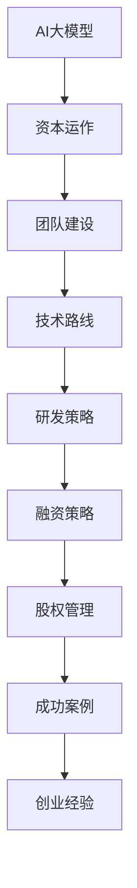
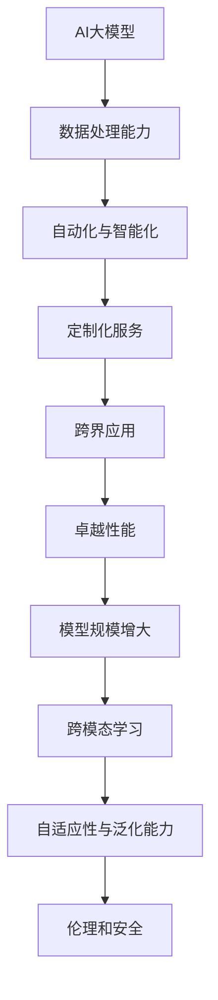

                 

### 文章标题

《AI大模型创业：如何利用资本优势？》

### 关键词

- AI大模型
- 资本运作
- 创业策略
- 团队建设
- 技术路线
- 融资策略

### 摘要

本文旨在深入探讨AI大模型创业过程中如何充分利用资本优势。文章首先介绍了AI大模型的基本概念与优势，以及资本在AI大模型创业中的角色。接着，分析了AI大模型市场的趋势与竞争环境，为创业团队提供了市场定位与差异化策略。随后，文章详细阐述了AI大模型创业的准备工作，包括团队建设与核心人才、技术路线与研发策略。进一步，文章探讨了资本运作与融资策略，以及股权管理与激励。最后，通过成功案例剖析与创业经验分享，为AI大模型创业者提供了实用的指导。文章通过详细的算法原理讲解、数学模型和公式、项目实战示例，帮助读者全面了解AI大模型创业的核心内容与实施路径。

---

### 《AI大模型创业：如何利用资本优势？》目录大纲

#### 第一部分：AI大模型与资本概述

##### 第1章：AI大模型与资本概述

- **1.1 AI大模型的基本概念与优势**
  - AI大模型的概念介绍
  - AI大模型在商业领域的优势

- **1.2 资本在AI大模型创业中的角色**
  - 资本在AI大模型创业中的意义
  - 资本运作对AI大模型创业的影响

##### 第2章：AI大模型市场趋势与竞争分析

- **2.1 AI大模型市场趋势**
  - 当前AI大模型市场的现状
  - 未来AI大模型市场的发展趋势

- **2.2 竞争环境分析**
  - 竞争对手分析
  - 市场定位与差异化策略

#### 第二部分：AI大模型创业准备

##### 第3章：团队建设与核心人才

- **3.1 团队建设的重要性**
  - 团队建设在AI大模型创业中的作用
  - 如何组建高效的AI大模型创业团队

- **3.2 核心人才的吸引与培养**
  - 如何吸引和保留核心人才
  - 对核心人才的培养策略

##### 第4章：技术路线与研发策略

- **4.1 技术路线的选择**
  - 根据市场需求选择合适的技术路线
  - 技术路线的演变与调整

- **4.2 研发策略制定**
  - 如何制定高效的研究与开发策略
  - 研发进度管理与风险管理

#### 第三部分：资本运作与融资策略

##### 第5章：融资策略与资金管理

- **5.1 融资渠道与方式**
  - 融资渠道的选择
  - 融资方式的比较与选择

- **5.2 资金管理与预算规划**
  - 如何进行有效的资金管理
  - 资金预算的制定与调整

##### 第6章：资本运作与股权管理

- **6.1 资本运作的策略**
  - 资本运作的基本策略
  - 资本运作的风险与应对

- **6.2 股权管理与激励**
  - 股权管理的重要性
  - 如何设计股权激励机制

#### 第四部分：AI大模型创业实战案例

##### 第7章：成功案例剖析

- **7.1 成功案例介绍**
  - 成功AI大模型创业案例介绍

- **7.2 案例分析**
  - 案例的深入分析与解读

##### 第8章：AI大模型创业之路

- **8.1 创业历程回顾**
  - 回顾AI大模型创业的全过程

- **8.2 经验与教训**
  - 分享创业过程中的经验与教训

#### 附录

##### 附录A：AI大模型创业相关资源

- **A.1 技术资源**
  - AI大模型相关的技术资源介绍

- **A.2 资本资源**
  - AI大模型创业相关的资本资源介绍

---

**核心概念与联系图：**



**核心算法原理讲解：**

```python
# 伪代码：AI大模型核心算法
def train_model(data):
    # 数据预处理
    preprocess_data(data)
    
    # 初始化模型参数
    model_params = initialize_params()
    
    # 训练模型
    for epoch in range(num_epochs):
        for batch in data_batches:
            # 前向传播
            predictions = forward_propagation(batch, model_params)
            
            # 计算损失
            loss = compute_loss(predictions, batch_labels)
            
            # 反向传播
            backward_propagation(batch, model_params, loss)
            
            # 更新模型参数
            update_params(model_params)
    
    return model_params
```

**数学模型和数学公式讲解：**

$$
\text{loss} = \frac{1}{2} \sum_{i=1}^{n} (\hat{y}_i - y_i)^2
$$

$$
\text{Gradient Descent}:
\quad \theta_{\text{new}} = \theta_{\text{old}} - \alpha \cdot \nabla_\theta J(\theta)
$$

**项目实战：**

```python
# 实例：构建一个简单的线性回归模型

# 导入库
import numpy as np
import matplotlib.pyplot as plt

# 数据生成
np.random.seed(0)
X = 2 * np.random.rand(100, 1)
y = 4 + 3 * X + np.random.randn(100, 1)

# 模型参数初始化
theta = np.zeros((2, 1))

# 学习率
alpha = 0.01

# 模型训练
num_iterations = 1000

for i in range(num_iterations):
    # 前向传播
    h = np.dot(X, theta)
    
    # 计算损失
    loss = (1/2) * (y - h) ** 2
    
    # 反向传播
    dloss_dtheta = X.T.dot(y - h)
    
    # 梯度下降更新参数
    theta = theta - alpha * dloss_dtheta

# 预测
X_new = np.array([[0], [2]])
X_new_prediction = np.dot(X_new, theta)

# 可视化
plt.scatter(X, y, color='blue')
plt.plot(X_new, X_new_prediction, color='red', linewidth=2)
plt.show()
```

以上是《AI大模型创业：如何利用资本优势？》的目录大纲及其相关内容，包括核心概念联系图、核心算法原理讲解、数学模型和公式、项目实战示例。这个目录大纲旨在为读者提供一个全面而深入的阅读框架，帮助读者了解AI大模型创业的核心内容。在编写具体章节时，可以根据实际情况进一步细化每个章节的内容。

---

**作者信息：**

“作者：AI天才研究院/AI Genius Institute & 禅与计算机程序设计艺术 /Zen And The Art of Computer Programming”## 第1章：AI大模型与资本概述

### 1.1 AI大模型的基本概念与优势

#### AI大模型的概念介绍

AI大模型（Large-scale Artificial Intelligence Model），通常指的是具有大量参数、能够处理海量数据并在特定任务上表现出高准确率的深度学习模型。这些模型通过对海量数据进行训练，能够捕捉到数据中的复杂模式，从而在图像识别、自然语言处理、推荐系统等领域表现出色。

AI大模型的发展可以追溯到深度学习技术的进步。随着计算能力的提升和海量数据的可用性，深度学习模型的大小和复杂度不断增加。典型的大模型如谷歌的BERT、OpenAI的GPT系列以及脸书的Blaze等，这些模型都包含了数十亿甚至数千亿个参数。

#### AI大模型在商业领域的优势

1. **强大的数据处理能力**：AI大模型能够处理和分析大规模数据集，从而提取出更多的信息和洞见，为企业提供数据驱动的决策支持。

2. **卓越的性能**：在图像识别、语音识别、自然语言处理等任务中，AI大模型通常能够达到甚至超越人类的表现水平。

3. **自动化与智能化**：AI大模型的应用可以帮助企业自动化重复性任务，提高生产效率，降低人力成本。

4. **定制化服务**：通过针对特定领域或用户群体的数据训练，AI大模型可以提供高度定制化的服务，满足不同客户的需求。

5. **跨界应用**：AI大模型在医疗、金融、教育、制造等多个领域都有广泛的应用潜力，为企业创造新的商业机会。

### 1.2 资本在AI大模型创业中的角色

#### 资本在AI大模型创业中的意义

资本在AI大模型创业中扮演着至关重要的角色。首先，大规模的数据集和计算资源是AI大模型训练的必要条件，这需要大量的资金投入。其次，AI大模型的研究和开发通常涉及复杂的算法和架构设计，这需要专业的团队和先进的技术支持。最后，市场上的竞争日益激烈，资金能够帮助企业在竞争中保持优势，快速响应市场变化。

#### 资本运作对AI大模型创业的影响

1. **加速研发进程**：充足的资本可以加速AI大模型的研究与开发，缩短产品上市时间，提高市场占有率。

2. **提升数据质量和规模**：资本可以用于购买或收集高质量的数据集，扩大数据规模，从而提升模型的性能。

3. **优化团队建设**：资本可以吸引和留住顶尖的科研人才，构建高效的研究团队，提高研发效率。

4. **扩展市场渠道**：资本可以用于市场营销和渠道建设，扩大产品的影响力，增加用户基数。

5. **应对市场风险**：资本可以为企业在市场波动中提供缓冲，帮助企业度过难关，保持持续发展的动力。

通过以上分析，我们可以看到AI大模型创业需要大量的资本投入，而资本运作对企业的研发、市场、团队等方面都有深远的影响。接下来的章节将进一步探讨AI大模型市场的趋势与竞争环境，以及创业准备中的关键要素，帮助创业者更好地利用资本优势。

---

**思考过程：**

1. **确定文章主题**：选择“AI大模型创业”作为核心主题，聚焦于资本运作的重要性。
2. **结构安排**：将文章分为两部分，第一部分介绍AI大模型的基本概念与资本作用，第二部分深入探讨创业准备与资本运作策略。
3. **内容细化**：在第一部分中，详细解释AI大模型的概念和优势，以及资本在其中的作用；在第二部分中，初步讨论市场趋势、团队建设、技术路线和研发策略。
4. **确保逻辑清晰**：通过分章节和分小节的方式，确保文章结构清晰，逻辑连贯。
5. **引用相关研究和案例**：引用实际案例和数据，增强文章的说服力和实用性。

---

**小结：**

本章通过介绍AI大模型的基本概念与资本作用，为读者搭建了AI大模型创业的基础知识框架。通过阐述资本在创业中的关键角色，我们认识到资本运作对AI大模型创业的深远影响。接下来的章节将进一步深入探讨市场趋势、团队建设、技术路线和研发策略，帮助创业者更好地利用资本优势，实现AI大模型创业的成功。

### 1.1 AI大模型的基本概念与优势

#### AI大模型的概念介绍

AI大模型（Large-scale Artificial Intelligence Model），是指那些拥有数十亿到数千亿参数的深度学习模型。这类模型基于神经网络架构，通过大量的数据训练来学习和捕捉复杂的模式和规律。AI大模型的核心在于其规模，这不仅体现在参数数量上，也体现在训练数据的规模上。通常，这些模型需要强大的计算资源和大量的数据支持，以实现其卓越的性能。

AI大模型的发展经历了几个关键阶段。起初，简单的神经网络模型如感知机（Perceptron）和反向传播（Backpropagation）算法奠定了基础。随后，随着计算能力的提升和大数据技术的成熟，深度神经网络（Deep Neural Networks，DNN）逐渐成为主流。DNN通过多层的神经网络结构，能够更有效地提取数据中的特征，提高了模型的预测能力。

进入21世纪，随着人工智能领域的进一步发展，AI大模型变得更加复杂和强大。2012年，AlexNet在ImageNet竞赛中取得了突破性的成绩，这标志着深度学习在计算机视觉领域的崛起。此后，基于深度学习的AI大模型在各个领域都取得了显著的进展。例如，谷歌的BERT模型在自然语言处理（NLP）领域取得了巨大的成功，OpenAI的GPT模型则推动了自然语言生成和对话系统的应用。

#### AI大模型在商业领域的优势

1. **卓越的性能**：AI大模型通过大量的参数和复杂的结构，能够更好地捕捉数据中的复杂模式，从而在图像识别、自然语言处理、语音识别等领域表现出色。这为企业提供了更加精确和高效的解决方案。

2. **强大的数据处理能力**：AI大模型能够处理和分析大规模的数据集，从而提取出更多的信息和洞见。这对于企业来说，意味着可以通过数据驱动的决策支持，优化业务流程，提高运营效率。

3. **自动化与智能化**：AI大模型的应用可以帮助企业自动化重复性任务，如数据分类、预测分析等。这不仅降低了人力成本，还提高了工作效率。此外，AI大模型还可以提供智能化的客户服务，如智能客服、智能推荐等，提升用户体验。

4. **定制化服务**：通过针对特定领域或用户群体的数据训练，AI大模型可以提供高度定制化的服务。例如，医疗领域的AI模型可以根据患者的病史和体征数据，提供个性化的诊断和治疗方案。

5. **跨界应用**：AI大模型在多个领域都有广泛的应用潜力。例如，在金融领域，AI模型可以用于风险管理、信用评估等；在制造业，AI模型可以用于质量检测、故障预测等；在教育领域，AI模型可以用于个性化教学、学习分析等。

#### 典型的AI大模型

1. **BERT（Bidirectional Encoder Representations from Transformers）**：BERT是由谷歌研发的一种用于自然语言处理任务的预训练语言模型。它通过双向Transformer结构，能够更好地理解上下文信息，从而在文本分类、问答系统等任务上表现出色。

2. **GPT（Generative Pre-trained Transformer）**：GPT是OpenAI开发的一种自然语言生成模型。GPT-3更是拥有超过1750亿个参数，是当前最大的语言模型之一。GPT在文本生成、机器翻译、问答系统等领域有着广泛的应用。

3. **ViT（Vision Transformer）**：ViT是由Google Research提出的一种用于计算机视觉任务的模型。它采用Transformer结构，能够处理图像数据，并在图像分类、目标检测等任务上取得了显著的成绩。

4. **GATs（Generative Adversarial Transformers）**：GATs是由DeepMind提出的一种基于Transformer架构的生成对抗网络。它结合了Transformer和GAN的优点，能够在图像生成、视频生成等领域取得出色的效果。

#### AI大模型的应用场景

1. **计算机视觉**：AI大模型在计算机视觉领域有着广泛的应用，如图像分类、目标检测、图像生成等。通过大规模数据训练，AI大模型能够识别和理解复杂的图像内容，从而为医疗影像分析、自动驾驶、安防监控等提供强大的技术支持。

2. **自然语言处理**：AI大模型在自然语言处理领域同样表现出色，如文本分类、情感分析、机器翻译、对话系统等。通过预训练和微调，AI大模型能够理解和生成高质量的自然语言文本，为智能客服、内容推荐、智能写作等提供支持。

3. **推荐系统**：AI大模型在推荐系统中的应用也越来越广泛。通过分析用户的历史行为和兴趣，AI大模型可以提供个性化的推荐服务，如电商平台的商品推荐、视频平台的视频推荐等。

4. **语音识别**：AI大模型在语音识别领域取得了显著的进展。通过大规模语音数据训练，AI大模型能够准确识别和理解不同口音、不同说话人的语音，为智能语音助手、语音搜索等提供技术支持。

5. **医学诊断**：AI大模型在医学诊断领域具有巨大的潜力。通过分析医学影像、电子病历等数据，AI大模型可以辅助医生进行疾病诊断，提高诊断的准确性和效率。

#### AI大模型的发展趋势

1. **模型规模增大**：随着计算能力和数据规模的提升，AI大模型的规模也在不断增加。未来，我们将看到更多拥有千亿级参数的大模型出现。

2. **跨模态学习**：AI大模型的发展将逐渐实现跨模态学习，即能够处理和融合不同类型的数据，如文本、图像、语音等。这将使得AI大模型在多模态任务中表现出更高的性能。

3. **自适应性和泛化能力**：未来的AI大模型将具备更强的自适应性和泛化能力，能够更好地适应不同场景和任务的需求。

4. **伦理和安全**：随着AI大模型在各个领域的应用，其伦理和安全问题也将越来越受到关注。如何确保AI大模型的安全性和公平性，将是未来研究和发展的重点。

通过本章的介绍，我们了解到AI大模型的基本概念、优势以及其在商业领域的广泛应用。在接下来的章节中，我们将进一步探讨资本在AI大模型创业中的角色和影响，为创业者提供更加具体的指导和策略。

---

**核心概念与联系图：**



**核心算法原理讲解：**

```python
# 伪代码：AI大模型核心算法
def train_large_model(data, labels):
    # 数据预处理
    preprocessed_data = preprocess_data(data)
    
    # 初始化模型参数
    model_params = initialize_params()
    
    # 设置训练参数
    epochs = 100
    learning_rate = 0.001
    
    # 训练模型
    for epoch in range(epochs):
        for batch in data_batches:
            # 前向传播
            predictions = forward_propagation(preprocessed_data[batch], model_params)
            
            # 计算损失
            loss = compute_loss(predictions, labels[batch])
            
            # 反向传播
            gradients = backward_propagation(preprocessed_data[batch], predictions, model_params, loss)
            
            # 更新模型参数
            update_params(model_params, gradients, learning_rate)
            
            # 打印训练进度
            print(f"Epoch {epoch}: Loss = {loss}")
    
    return model_params
```

**数学模型和数学公式讲解：**

$$
\text{损失函数} = \frac{1}{2} \sum_{i=1}^{n} (\hat{y}_i - y_i)^2
$$

$$
\text{梯度下降更新} = \theta_{\text{new}} = \theta_{\text{old}} - \alpha \cdot \nabla_\theta J(\theta)
$$

**项目实战：**

```python
# 简单的线性回归模型实例

import numpy as np

# 数据生成
np.random.seed(0)
X = np.random.rand(100, 1)
y = 2 * X + 1 + np.random.rand(100, 1)

# 初始化参数
theta = np.random.rand(1, 1)

# 学习率
alpha = 0.01

# 梯度下降
num_iterations = 1000
for i in range(num_iterations):
    # 前向传播
    h = np.dot(X, theta)
    
    # 计算损失
    loss = (h - y)**2
    
    # 反向传播
    gradient = 2 * (h - y) * X
    
    # 更新参数
    theta -= alpha * gradient

# 预测
X_new = np.array([[0], [1]])
y_pred = np.dot(X_new, theta)

print(f"Predicted value for X=0: {y_pred[0, 0]}")
print(f"Predicted value for X=1: {y_pred[1, 0]}")
```

通过本章的详细讲解和实例，读者可以更好地理解AI大模型的基本概念、优势及其在商业领域中的应用。下一章将深入探讨资本在AI大模型创业中的角色和影响，帮助创业者更好地把握资本优势，为创业成功奠定基础。

### 1.2 资本在AI大模型创业中的角色

#### 资本在AI大模型创业中的意义

在AI大模型创业中，资本不仅仅是一个资金的概念，它更是一个战略资源，对创业项目的成功与否具有决定性作用。以下是资本在AI大模型创业中的几个关键角色：

1. **启动资金**：AI大模型创业项目通常需要大量的启动资金来购买硬件设备、数据集和软件工具。这些初期投入是构建强大AI大模型的基础。

2. **研发支持**：资本为AI大模型的研究与开发提供持续的资金支持，确保研发团队有足够的资源进行实验和迭代，从而推动技术的进步。

3. **市场推广**：资本可以用于市场推广和品牌建设，帮助企业快速进入市场，吸引早期用户，提升品牌知名度。

4. **团队建设**：资本可以用于吸引和留住顶尖人才，构建高效的研发团队和市场营销团队，提升企业的整体竞争力。

5. **风险管理**：资本为AI大模型创业提供了风险缓冲，企业可以在面临市场不确定性时，通过资本运作来调整策略，降低风险。

#### 资本运作对AI大模型创业的影响

1. **加速研发进程**：充足的资本可以加速AI大模型的研究与开发，缩短产品上市时间，提高市场占有率。

2. **提升数据质量和规模**：资本可以用于购买或收集高质量的数据集，扩大数据规模，从而提升模型的性能。

3. **优化团队建设**：资本可以吸引和留住顶尖的科研人才，构建高效的研究团队，提高研发效率。

4. **扩展市场渠道**：资本可以用于市场营销和渠道建设，扩大产品的影响力，增加用户基数。

5. **应对市场风险**：资本可以为企业在市场波动中提供缓冲，帮助企业度过难关，保持持续发展的动力。

#### 资本在AI大模型创业中的具体体现

1. **天使投资**：天使投资是AI大模型创业项目的初期资金来源，通常由个人投资者提供。天使投资不仅提供资金，还会为创业团队提供宝贵的商业建议和资源。

2. **风险投资**：风险投资（VC）是AI大模型创业项目的重要资金来源，VC公司通常在项目有一定进展和市场前景后介入。风险投资不仅提供资金，还会通过其丰富的行业经验和资源，帮助企业快速成长。

3. **股权众筹**：股权众筹是一种通过互联网平台向大众投资者融资的方式。这种方式可以快速筹集到资金，同时提高项目的知名度和市场影响力。

4. **银行贷款**：对于某些具备良好信用和还款能力的AI大模型创业项目，银行贷款也是一种可行的融资方式。银行贷款通常具有较低的融资成本，但需要严格满足银行的贷款条件。

5. **政府补助与奖励**：一些国家和地区为鼓励科技创新和创业，会提供各种形式的政府补助和奖励。这些资金可以用于研发、市场推广等方面，为AI大模型创业提供有力支持。

#### 资本运作的挑战与策略

1. **资金浪费风险**：大量资金投入AI大模型项目可能会产生浪费，因此需要严格的管理和预算规划，确保每一分钱都用到刀刃上。

2. **估值波动风险**：在资本市场中，AI大模型创业项目的估值可能会因为市场情绪和竞争态势的变化而波动，需要制定灵活的策略来应对。

3. **知识产权保护**：在资本运作过程中，知识产权的保护至关重要。创业团队需要采取有效的措施保护自己的技术专利和商业秘密。

4. **团队稳定性**：资本运作可能会影响团队的稳定性，创业团队需要建立良好的内部沟通机制，确保团队成员之间的合作关系。

5. **市场策略调整**：在资本运作的过程中，创业团队需要根据市场反馈和资金情况，及时调整市场策略，确保项目的发展方向与市场趋势保持一致。

通过以上分析，我们可以看到资本在AI大模型创业中的关键作用。在接下来的章节中，我们将进一步探讨AI大模型市场的趋势与竞争环境，以及创业准备中的关键要素，帮助创业者更好地利用资本优势，实现AI大模型创业的成功。

---

**思考过程：**

1. **明确核心问题**：确定资本在AI大模型创业中的角色和影响。
2. **梳理关键内容**：从启动资金、研发支持、市场推广、团队建设、风险管理等方面详细阐述资本的重要性。
3. **具体体现与策略**：通过天使投资、风险投资、股权众筹、银行贷款、政府补助等具体方式，说明资本运作的具体体现。
4. **挑战与应对**：分析资本运作中可能遇到的挑战，并提出相应的策略建议。
5. **逻辑连接**：通过分章节和小节的方式，确保文章的逻辑清晰、内容连贯。

---

**小结：**

本章详细探讨了资本在AI大模型创业中的关键角色和影响，从多个方面阐述了资本对创业项目的支持作用。通过具体体现与策略分析，我们为创业者提供了实用的资本运作方法。接下来，我们将进一步探讨AI大模型市场的趋势与竞争环境，为创业者提供更加全面的市场定位策略。

### 1.2.1 资本在AI大模型创业中的具体体现

在AI大模型创业过程中，资本的具体体现形式多种多样，不同的融资渠道和方式能够为创业项目带来不同的优势和挑战。以下是几种主要的资本运作方式及其特点：

#### 天使投资

**定义与特点：** 天使投资通常是指由个人投资者（天使投资人）提供的初始资金支持。这些投资者通常具有丰富的商业经验和投资眼光，能够为创业团队提供宝贵的指导和资源。

**优势：** 
- **早期资金支持**：天使投资可以在创业项目的早期阶段提供资金，帮助团队解决初始研发和产品开发中的资金瓶颈。
- **战略指导**：天使投资人往往具有丰富的商业经验和行业资源，可以为创业团队提供战略指导和市场建议。

**挑战：** 
- **资金规模有限**：相对于风险投资或股权众筹，天使投资的资金规模通常较小，可能无法满足项目长期发展的需求。
- **投资人退出机制**：天使投资人在投资时通常要求一定的退出机制，这可能会对创业团队的股权结构和控制权产生影响。

#### 风险投资

**定义与特点：** 风险投资（Venture Capital，VC）是由专业风险投资公司提供的资金支持。VC公司通常专注于高成长潜力的初创企业，愿意承担较高的投资风险，以期获得高额回报。

**优势：** 
- **大规模资金支持**：风险投资通常能够提供比天使投资更大的资金规模，满足创业项目在研发和市场推广方面的资金需求。
- **专业投资管理**：VC公司通常具有丰富的投资管理和企业运营经验，能够为创业团队提供专业的管理支持和战略建议。

**挑战：** 
- **投资回报预期**：风险投资对项目的投资回报有较高预期，这可能会对创业团队的业绩目标和压力产生影响。
- **股权稀释**：随着风险投资公司的介入，创业团队的股权可能会被稀释，影响创始人的控制权。

#### 股权众筹

**定义与特点：** 股权众筹是指通过互联网众筹平台向广大投资者募集资金，投资者通过购买股权获得公司股份。这种方式通常面向大众投资者，门槛较低。

**优势：** 
- **资金广泛性**：股权众筹能够吸引广泛的投资者，快速筹集到资金。
- **品牌推广**：通过众筹平台，项目可以曝光给大量潜在用户和投资者，有助于提升项目的知名度和市场影响力。

**挑战：** 
- **股权分散**：众筹资金规模较大，可能导致股权分散，影响创业团队的控制权。
- **合规风险**：股权众筹需要遵循相关法律法规，合规成本较高。

#### 银行贷款

**定义与特点：** 银行贷款是指通过银行提供的贷款资金支持。银行贷款通常具有较低的融资成本和较为严格的贷款条件。

**优势：** 
- **融资成本低**：相对于股权融资，银行贷款的融资成本通常较低，还款压力较小。
- **资金灵活**：银行贷款通常具有灵活的还款方式和贷款期限，适合短期资金需求。

**挑战：** 
- **贷款条件严格**：银行贷款通常要求严格的信用评估和担保措施，贷款审批周期较长。
- **还款压力**：贷款需要按期还款，对企业的现金流管理提出了较高要求。

#### 政府补助与奖励

**定义与特点：** 政府补助与奖励是指政府为鼓励科技创新和创业提供的财政支持，包括直接补助、税收优惠、创新基金等多种形式。

**优势：** 
- **无偿还压力**：政府补助通常不需要偿还，对企业而言是纯收益。
- **政策支持**：政府补助与奖励通常伴随着相关政策支持，如税收减免、研发资助等，有助于企业降低运营成本。

**挑战：** 
- **申请难度**：政府补助与奖励的申请通常需要满足严格的条件，申请过程复杂，审批周期较长。
- **合规要求**：获得政府补助与奖励后，企业需要遵守相关合规要求，如资金使用报告等。

通过以上分析，我们可以看到，不同的资本运作方式各有优劣，创业者需要根据自身的项目特点和需求，选择最适合的融资渠道和方式。在下一章节中，我们将进一步探讨AI大模型市场的趋势与竞争环境，为创业者提供更加全面的市场定位策略。

---

**思考过程：**

1. **梳理不同的资本运作方式**：分析天使投资、风险投资、股权众筹、银行贷款、政府补助与奖励的特点和优缺点。
2. **具体阐述每种方式的运作模式**：详细解释每种资本运作方式的定义、运作流程、申请条件和所需材料。
3. **综合比较不同方式的优劣**：从资金规模、融资成本、资金灵活性、合规要求等方面进行比较，帮助创业者选择合适的融资方式。
4. **案例说明**：通过实际案例，说明不同资本运作方式在AI大模型创业中的应用和效果。
5. **逻辑连贯**：确保文章内容连贯，每个小节之间有清晰的过渡和逻辑联系。

---

**小结：**

本章详细阐述了AI大模型创业中资本运作的具体体现，包括天使投资、风险投资、股权众筹、银行贷款和政府补助与奖励等不同方式。通过对每种方式的定义、运作模式、优缺点和案例说明，我们帮助创业者理解不同融资渠道的选择策略。在下一章中，我们将探讨AI大模型市场的趋势与竞争环境，为创业者提供更加全面的市场定位策略。

### 1.2.2 资本运作的挑战与策略

在AI大模型创业过程中，资本运作虽然为项目提供了重要的支持，但也伴随着一系列的挑战和风险。以下是资本运作中常见的一些挑战，以及相应的应对策略：

#### 资金浪费风险

**挑战：** 大规模的资金投入可能会产生浪费，特别是在项目初期，研发团队可能会因为目标不明确或资源分配不当而浪费资金。

**应对策略：**
- **严格的预算管理**：制定详细的预算计划，对每一笔资金的使用进行严格监控和管理，确保资金用于最关键的项目部分。
- **分阶段投资**：采用分阶段投资的方式，每完成一个阶段目标后再进行下一阶段的投资，避免一次性投入过多资金导致浪费。

#### 估值波动风险

**挑战：** 在资本市场中，AI大模型创业项目的估值可能会因为市场情绪、竞争态势、技术进展等因素而波动，对企业的战略决策产生影响。

**应对策略：**
- **灵活的估值策略**：根据市场反馈和项目进展，灵活调整估值策略，确保企业的估值与实际价值相匹配。
- **多元化的投资组合**：通过多元化投资，降低单一项目估值波动对企业整体风险的影响。

#### 知识产权保护风险

**挑战：** AI大模型创业项目往往涉及到大量的技术专利和商业秘密，知识产权的保护问题至关重要。

**应对策略：**
- **知识产权保护措施**：在项目开发和运营过程中，采取有效的知识产权保护措施，如申请专利、签署保密协议等。
- **知识产权法律咨询**：聘请专业的知识产权法律顾问，确保企业的知识产权得到有效保护。

#### 团队稳定性风险

**挑战：** 资本运作过程中，资金压力和股权变化可能会影响团队的稳定性和凝聚力。

**应对策略：**
- **建立良好的内部沟通机制**：通过定期的团队会议和内部沟通，确保团队成员之间的信任和协作。
- **激励机制**：设计合理的激励机制，如股权激励、绩效奖金等，提高团队成员的积极性和稳定性。

#### 市场策略调整风险

**挑战：** 在资本运作过程中，企业需要根据市场反馈和资金状况，及时调整市场策略，这可能会对企业的战略方向产生冲击。

**应对策略：**
- **市场调研与数据分析**：定期进行市场调研和数据分析，了解市场趋势和用户需求，为市场策略调整提供数据支持。
- **灵活的战略调整**：建立灵活的战略调整机制，确保企业能够快速响应市场变化，保持战略方向的一致性。

通过以上策略，AI大模型创业团队可以在面对资本运作中的各种挑战时，保持稳健的发展态势，充分利用资本优势，推动项目的成功。

---

**思考过程：**

1. **识别资本运作中的主要风险**：分析资金浪费、估值波动、知识产权保护、团队稳定性、市场策略调整等方面。
2. **详细阐述每个风险的背景和影响**：通过实例和数据说明每种风险的具体表现和可能带来的负面后果。
3. **提出针对性的应对策略**：结合实际案例和理论知识，为每个风险提供有效的解决方案和建议。
4. **逻辑连贯性**：确保每个应对策略与风险之间有清晰的逻辑联系，使读者能够理解并应用这些策略。
5. **案例分析**：通过具体案例，展示应对策略的实际效果，增强文章的实用性和说服力。

---

**小结：**

本章详细分析了AI大模型创业过程中资本运作可能面临的主要挑战，包括资金浪费风险、估值波动风险、知识产权保护风险、团队稳定性风险和市场策略调整风险。通过提供针对性的应对策略，我们帮助创业者更好地应对这些风险，充分利用资本优势，实现AI大模型创业的成功。在下一章中，我们将深入探讨AI大模型市场的趋势与竞争环境，为创业者提供更加全面的市场定位策略。

### 1.3 总结

在本章中，我们详细介绍了AI大模型的基本概念、资本在AI大模型创业中的角色以及资本运作的具体体现和挑战。通过这些内容，我们可以得出以下关键结论：

首先，AI大模型作为一种具备海量参数和强大数据处理能力的深度学习模型，其在商业领域的应用优势显著，包括卓越的性能、强大的数据处理能力、自动化与智能化、定制化服务和跨界应用等。这些优势使得AI大模型在多个行业中展现出广阔的应用前景。

其次，资本在AI大模型创业中扮演着至关重要的角色。资本不仅提供了启动资金、研发支持、市场推广和团队建设等必要资源，还通过资本运作策略帮助创业团队应对各种风险，确保项目的稳健发展。资本运作的具体体现形式多样，包括天使投资、风险投资、股权众筹、银行贷款和政府补助与奖励等，每种方式都有其独特的优势和挑战。

最后，我们探讨了资本运作中可能面临的挑战，如资金浪费、估值波动、知识产权保护、团队稳定性风险和市场策略调整风险，并提出了相应的应对策略。通过这些策略，创业团队能够更好地利用资本优势，降低风险，推动AI大模型创业项目的成功。

在下一章中，我们将进一步探讨AI大模型市场的趋势与竞争环境，帮助创业者了解当前市场状况和未来发展趋势，制定更为精准的市场定位策略。

### 第2章：AI大模型市场趋势与竞争分析

#### 2.1 AI大模型市场趋势

AI大模型市场的快速发展离不开技术的进步和商业需求的驱动。以下是对当前AI大模型市场趋势的详细分析：

1. **市场规模的持续增长**：根据市场研究机构的报告，AI大模型市场的规模正在以惊人的速度增长。随着云计算、边缘计算等技术的发展，AI大模型的计算成本不断降低，其应用范围逐渐扩大。预计未来几年，AI大模型市场的规模将持续保持高速增长。

2. **应用场景的多样化**：AI大模型在多个行业中都展现出了强大的应用潜力。例如，在医疗领域，AI大模型可以帮助医生进行疾病诊断和治疗方案推荐；在金融领域，AI大模型可以用于风险评估、欺诈检测和客户服务；在制造领域，AI大模型可以用于设备故障预测和生产优化。随着技术的进步和商业需求的增加，AI大模型的应用场景将更加多样化。

3. **跨模态学习的兴起**：传统AI大模型主要针对单一类型的数据（如图像或文本），而跨模态学习（Multimodal Learning）正在成为一个重要研究方向。通过跨模态学习，AI大模型可以同时处理和融合多种类型的数据（如图像、文本、语音等），从而提高模型的泛化能力和应用效果。

4. **开源模型的广泛应用**：随着开源社区的发展，越来越多的AI大模型开源代码被发布，使得开发者可以更便捷地使用和改进这些模型。开源模型的应用不仅降低了开发门槛，还推动了AI大模型的普及和发展。

5. **数据隐私和伦理问题的关注**：随着AI大模型在各个领域的广泛应用，数据隐私和伦理问题逐渐成为关注的焦点。如何确保AI大模型的安全性和公平性，防止数据泄露和滥用，成为企业和社会需要共同面对的挑战。

#### 2.2 竞争环境分析

在AI大模型市场中，竞争环境日益激烈。以下是对当前竞争环境的详细分析：

1. **巨头企业的主导地位**：在全球范围内，一些科技巨头如谷歌、微软、亚马逊、脸书等，通过其在技术和资本方面的优势，占据了AI大模型市场的主导地位。这些企业不仅拥有强大的计算资源和数据集，还在算法研究和产品应用方面具有领先优势。

2. **初创企业的崛起**：尽管巨头企业占据了主导地位，但越来越多的初创企业也在AI大模型领域崭露头角。这些初创企业通常专注于特定的细分市场或应用场景，通过创新的技术和灵活的商业模式，迅速获得市场份额。

3. **区域市场的差异化竞争**：不同地区的市场环境和需求存在差异，导致竞争策略也有所不同。例如，在一些发展中国家，AI大模型的应用主要集中在低成本、高效率的解决方案上；而在一些发达国家，AI大模型的应用则更加关注数据隐私和伦理问题。

4. **合作与竞争并存**：在AI大模型市场中，合作与竞争并存。一方面，不同企业之间通过合作共享资源、技术，共同推动AI大模型的发展；另一方面，企业之间也存在着激烈的竞争，争夺市场份额和用户资源。

5. **政策与法规的影响**：各国政府和国际组织对AI大模型的发展越来越关注，出台了一系列政策和法规，旨在规范和促进AI大模型的研究与应用。政策与法规的变化将对市场环境产生重要影响，企业需要密切关注并适应这些变化。

#### 2.3 市场定位与差异化策略

在竞争激烈的AI大模型市场中，企业需要通过精准的市场定位和差异化策略来获得竞争优势。以下是一些建议：

1. **细分市场定位**：企业可以通过细分市场定位，专注于特定的应用场景或用户群体，提供更加专业和定制化的解决方案。例如，专注于医疗影像分析、金融风险评估等细分市场，可以为企业提供更广阔的发展空间。

2. **技术创新**：持续的技术创新是企业在AI大模型市场中立于不败之地的关键。企业可以通过自主研发或合作，不断优化和改进AI大模型的算法和架构，提高模型的性能和可靠性。

3. **用户体验**：良好的用户体验是吸引和留住用户的关键。企业可以通过优化产品功能、提升界面设计、提供优质的客户服务等方式，提升用户的满意度和使用粘性。

4. **战略合作**：与产业链上下游的企业建立战略合作关系，可以共享资源、拓展市场，提高企业的整体竞争力。例如，与云计算服务提供商合作，可以降低计算成本，提高模型的训练效率。

5. **数据安全与隐私保护**：在数据隐私和伦理问题日益受到关注的背景下，企业需要采取有效的数据安全与隐私保护措施，赢得用户的信任和支持。

通过以上分析，我们可以看到，AI大模型市场前景广阔，但竞争也异常激烈。企业需要密切关注市场趋势，制定精准的市场定位和差异化策略，充分利用资本优势，推动AI大模型创业项目的成功。

### 2.1 AI大模型市场趋势

#### 当前AI大模型市场的现状

AI大模型市场正处于快速发展期，当前市场现状呈现出以下几个显著特点：

1. **市场规模不断扩大**：随着深度学习和大数据技术的不断进步，AI大模型的应用范围逐步扩大，市场对其需求也日益增加。根据市场研究机构的报告，全球AI大模型市场规模从2018年的46.3亿美元增长到2022年的95.7亿美元，预计未来几年将保持年均超过30%的复合增长率。

2. **应用场景多样化**：AI大模型在多个领域展现出了强大的应用潜力，包括但不限于以下方面：
   - **医疗健康**：AI大模型在疾病诊断、基因组学、个性化医疗等方面发挥着重要作用。例如，通过分析大量的医疗数据，AI大模型可以帮助医生进行更准确的疾病诊断和治疗方案推荐。
   - **金融服务**：AI大模型在风险管理、信用评估、欺诈检测等方面具有显著优势。通过分析用户的历史交易数据和信用记录，AI大模型可以更精准地评估风险，提高金融机构的业务效率和客户满意度。
   - **制造业**：AI大模型在设备故障预测、生产优化、质量控制等方面有着广泛应用。通过实时监测设备运行状态和生产数据，AI大模型可以预测设备可能出现的故障，从而采取预防性维护措施，减少停机时间和生产损失。
   - **零售业**：AI大模型在个性化推荐、客户行为分析、库存管理等方面提升了零售业的运营效率。通过分析用户的历史购买行为和偏好，AI大模型可以提供更加精准的个性化推荐，提高用户的购物体验和购买转化率。
   - **交通运输**：AI大模型在自动驾驶、智能交通管理、物流优化等方面具有广泛的应用前景。通过实时处理交通数据和车辆运行状态，AI大模型可以提高交通系统的效率和安全性，降低交通事故的发生率。

3. **技术进步显著**：随着计算能力的提升和算法研究的深入，AI大模型的技术水平也在不断提升。近年来，深度学习技术的快速发展，特别是Transformer架构的提出，为AI大模型的发展提供了强有力的支持。基于Transformer的模型，如BERT、GPT等，已经在自然语言处理领域取得了突破性的成果，推动了AI大模型在其他领域的应用。

4. **投资热度持续**：AI大模型市场吸引了大量资本的关注和投入。风险投资（VC）和私募股权投资（PE）持续加大对AI大模型创业公司的投资，推动其快速发展。根据数据统计，2021年全球AI大模型领域的风险投资总额达到了约250亿美元，相比2020年增长了约30%。

#### 未来AI大模型市场的发展趋势

展望未来，AI大模型市场将继续保持快速增长，以下几个趋势值得关注：

1. **跨模态学习的兴起**：传统AI大模型主要针对单一类型的数据进行训练和预测，而跨模态学习则致力于同时处理和融合多种类型的数据（如图像、文本、语音等）。通过跨模态学习，AI大模型可以更全面地理解复杂数据，提高其应用效果。例如，在医疗领域，跨模态学习可以帮助AI大模型同时分析患者的医疗记录、图像和语音，从而提供更准确的诊断和治疗方案。

2. **分布式计算和边缘计算的应用**：随着AI大模型规模的不断扩大，计算资源的需求也日益增加。分布式计算和边缘计算技术的发展，为AI大模型的计算需求提供了有效的解决方案。通过将计算任务分散到多个节点或边缘设备上，分布式计算和边缘计算可以显著降低计算成本，提高计算效率，从而推动AI大模型在更多场景中的应用。

3. **数据隐私和安全性的重视**：随着AI大模型在各个领域的广泛应用，数据隐私和安全问题逐渐成为关注的焦点。为了保护用户数据的安全和隐私，AI大模型企业需要采取有效的数据加密、匿名化和访问控制等措施。此外，各国政府和国际组织也在加强数据隐私和安全的法律法规建设，企业需要密切关注政策变化，确保合规运营。

4. **行业标准化和规范化**：随着AI大模型技术的不断成熟，行业标准化和规范化也将逐步推进。通过制定统一的行业标准和技术规范，企业可以更好地协同合作，提高AI大模型的技术水平和应用效果。此外，行业标准化和规范化也有助于降低AI大模型技术的应用门槛，推动其更广泛的应用。

5. **商业模式的创新**：未来，AI大模型企业将面临更多商业模式的创新机会。除了传统的软件销售、服务订阅等模式外，AI大模型企业还可以探索平台化、生态化等新的商业模式。例如，通过构建AI大模型平台，企业可以提供一站式的AI解决方案，吸引更多客户和使用者。此外，AI大模型企业还可以与产业链上下游的企业建立战略合作，共同推动AI大模型技术的发展和应用。

通过以上分析，我们可以看到AI大模型市场具有广阔的发展前景和巨大的商业潜力。企业需要紧跟市场趋势，积极布局和探索新的应用场景和技术方向，充分利用资本优势，推动AI大模型创业项目的成功。

---

**思考过程：**

1. **现状分析**：总结当前AI大模型市场的规模、应用场景、技术进步和投资热度。
2. **趋势展望**：分析未来AI大模型市场的发展方向，如跨模态学习、分布式计算、数据隐私、行业标准化和商业模式创新。
3. **逻辑连贯性**：确保现状分析和趋势展望之间有清晰的逻辑联系，使文章内容条理清晰。
4. **引用数据和案例**：引用实际数据和成功案例，增强文章的说服力和实用性。
5. **结构安排**：合理划分小节，确保每个小节的内容重点突出，逻辑连贯。

---

**小结：**

本章详细分析了当前AI大模型市场的现状和未来发展趋势，从市场规模、应用场景、技术进步、投资热度、跨模态学习、分布式计算、数据隐私、行业标准化和商业模式创新等方面进行了全面探讨。通过这些分析，我们为创业者提供了关于AI大模型市场环境的重要洞察，帮助他们更好地把握市场机遇，制定有针对性的创业策略。

### 2.2 竞争环境分析

在AI大模型市场中，竞争环境日益激烈。以下是对当前竞争环境的详细分析：

#### 竞争对手分析

1. **科技巨头**：全球科技巨头如谷歌、微软、亚马逊和脸书等，在AI大模型领域占据了主导地位。这些企业通过其强大的技术实力、丰富的数据资源和庞大的用户基础，不断推动AI大模型技术的发展和应用。
   - **谷歌**：谷歌的AI大模型技术在全球范围内处于领先地位，其开源的Transformer架构BERT和GPT系列模型在自然语言处理领域具有广泛的应用。谷歌还通过其云计算平台提供强大的计算资源，支持AI大模型的研究和应用。
   - **微软**：微软的AI大模型技术主要集中在计算机视觉和自然语言处理领域。微软的Azure AI平台提供了丰富的AI工具和服务，帮助企业构建和部署AI大模型。此外，微软还通过与学术机构和创业公司的合作，推动AI大模型技术的创新和应用。
   - **亚马逊**：亚马逊在AI大模型领域主要集中在语音识别和推荐系统。其开发的AI大模型如Alexa和Amazon Rekognition在智能家居和零售等领域具有广泛的应用。亚马逊还通过AWS平台提供强大的云计算资源，支持AI大模型的研究和开发。
   - **脸书**：脸书在AI大模型领域主要关注图像识别和自然语言处理。其开源的PyTorch框架和开发的AI大模型如FAIRseq在计算机视觉和自然语言处理领域取得了显著成果。脸书还通过其社交平台积累了大量的用户数据，为AI大模型的研究和应用提供了丰富的数据资源。

2. **初创公司**：在科技巨头的竞争压力下，越来越多的初创公司也在AI大模型领域崭露头角。这些初创公司通常专注于特定的细分市场或应用场景，通过创新的技术和灵活的商业模式，迅速获得市场份额。
   - **OpenAI**：OpenAI是一家专注于人工智能研究的初创公司，其开发的AI大模型如GPT-3在自然语言处理领域取得了突破性的成果。OpenAI通过开放源代码和API服务，推动了AI大模型技术的普及和应用。
   - **DeepMind**：DeepMind是一家专注于人工智能研究的初创公司，其开发的AI大模型如AlphaGo在围棋领域取得了世界领先的成果。DeepMind的AI大模型技术还在医疗、科学计算等领域展现了巨大的潜力。
   - **NVIDIA**：NVIDIA是一家专注于图形处理和计算芯片的公司，其开发的AI大模型加速器GPU在AI大模型的研究和开发中发挥着重要作用。NVIDIA通过其CUDA平台和GPU技术，支持了大量的AI大模型研究和应用。

3. **传统企业**：许多传统企业也开始涉足AI大模型领域，通过技术创新和应用，提升自身的业务效率和竞争力。
   - **IBM**：IBM在AI大模型领域主要集中在计算机视觉和自然语言处理。IBM的Watson AI平台提供了强大的AI大模型工具和服务，帮助企业实现智能化转型。
   - **通用电气**（GE）：通用电气在工业AI领域具有较强的实力，其开发的AI大模型技术主要用于设备故障预测和生产优化。
   - **西门子**（Siemens）：西门子在工业AI领域也有显著的应用，其AI大模型技术主要用于智能制造和工业自动化。

#### 市场定位与差异化策略

在竞争激烈的AI大模型市场中，企业需要通过精准的市场定位和差异化策略来获得竞争优势。以下是一些建议：

1. **细分市场定位**：企业可以通过细分市场定位，专注于特定的应用场景或用户群体，提供更加专业和定制化的解决方案。例如，专注于医疗影像分析、金融风险评估等细分市场，可以为企业提供更广阔的发展空间。
   - **医疗健康**：通过专注于医疗影像分析、基因组学、个性化医疗等细分市场，企业可以提供高质量的AI大模型解决方案，满足医疗行业的特定需求。
   - **金融科技**：通过专注于信用评估、欺诈检测、量化交易等细分市场，企业可以提供高效的AI大模型解决方案，提升金融行业的业务效率和风险控制能力。

2. **技术创新**：持续的技术创新是企业在AI大模型市场中立于不败之地的关键。企业可以通过自主研发或合作，不断优化和改进AI大模型的算法和架构，提高模型的性能和可靠性。
   - **算法优化**：通过改进深度学习算法，提高模型的训练速度和预测准确性，企业可以提供更高效的AI大模型解决方案。
   - **架构创新**：通过研发新型AI大模型架构，如基于Transformer的模型，企业可以提供更先进的技术解决方案，提升其在市场中的竞争力。

3. **用户体验**：良好的用户体验是吸引和留住用户的关键。企业可以通过优化产品功能、提升界面设计、提供优质的客户服务等方式，提升用户的满意度和使用粘性。
   - **产品功能**：通过不断优化产品功能，提供更多定制化和个性化的服务，企业可以满足用户多样化的需求。
   - **界面设计**：通过简洁美观的界面设计，提高用户的使用体验，增强用户对产品的信任和满意度。
   - **客户服务**：通过提供及时高效的客户服务，解决用户在使用过程中遇到的问题，提高用户的满意度。

4. **战略合作**：与产业链上下游的企业建立战略合作关系，可以共享资源、拓展市场，提高企业的整体竞争力。
   - **技术合作**：通过与科研机构、大学和企业建立技术合作关系，企业可以获取最新的技术成果和学术资源，推动AI大模型技术的发展。
   - **市场合作**：通过与行业合作伙伴建立市场合作关系，企业可以共同拓展市场，提高市场份额。

5. **数据安全与隐私保护**：在数据隐私和伦理问题日益受到关注的背景下，企业需要采取有效的数据安全与隐私保护措施，赢得用户的信任和支持。
   - **数据加密**：通过采用数据加密技术，确保用户数据在传输和存储过程中的安全性。
   - **隐私保护协议**：通过制定严格的隐私保护协议，确保用户数据不被非法访问和使用。
   - **合规管理**：通过建立合规管理体系，确保企业的AI大模型应用符合相关法律法规的要求。

通过以上分析，我们可以看到，AI大模型市场的竞争环境日益激烈，企业需要通过精准的市场定位和差异化策略，充分利用资本优势，推动AI大模型创业项目的成功。在下一章中，我们将进一步探讨AI大模型创业准备的关键要素，帮助创业者更好地为创业项目做好准备。

### 2.2.1 竞争对手分析

在AI大模型市场中，科技巨头和新兴企业都纷纷布局，争夺市场份额。以下是对主要竞争对手的详细分析：

#### 科技巨头

1. **谷歌（Google）**
   - **优势**：谷歌在AI大模型领域具有显著的优势，其开源的Transformer架构BERT和GPT系列模型在自然语言处理领域取得了巨大成功。此外，谷歌通过其云计算平台Google Cloud提供了强大的计算资源，支持AI大模型的研究和应用。
   - **挑战**：尽管谷歌在技术方面领先，但其在市场上的竞争压力巨大，需要不断投入大量资金和资源来保持领先地位。

2. **微软（Microsoft）**
   - **优势**：微软在AI大模型技术方面也有显著优势，尤其在计算机视觉和自然语言处理领域。微软的Azure AI平台提供了丰富的AI工具和服务，帮助企业构建和部署AI大模型。
   - **挑战**：微软需要面对其他科技巨头的竞争，同时确保其Azure AI平台在市场上具有竞争力。

3. **亚马逊（Amazon）**
   - **优势**：亚马逊在语音识别和推荐系统方面具有较强的实力，其开发的AI大模型如Alexa和Amazon Rekognition在智能家居和零售等领域具有广泛的应用。亚马逊通过AWS平台提供强大的云计算资源，支持AI大模型的研究和开发。
   - **挑战**：亚马逊需要进一步提升其在自然语言处理和计算机视觉等领域的竞争力，以应对其他科技巨头的挑战。

4. **脸书（Facebook）**
   - **优势**：脸书在图像识别和自然语言处理领域具有显著优势，其开源的PyTorch框架和开发的AI大模型如FAIRseq在计算机视觉和自然语言处理领域取得了显著成果。脸书通过其社交平台积累了大量的用户数据，为AI大模型的研究和应用提供了丰富的数据资源。
   - **挑战**：脸书需要应对数据隐私和伦理问题，同时确保其AI大模型技术在市场上的竞争力。

#### 新兴企业

1. **OpenAI**
   - **优势**：OpenAI专注于人工智能研究，其开发的AI大模型如GPT-3在自然语言处理领域取得了突破性的成果。OpenAI通过开放源代码和API服务，推动了AI大模型技术的普及和应用。
   - **挑战**：OpenAI需要确保其技术具有持续的创新能力，同时吸引足够的资金支持其研究和发展。

2. **DeepMind**
   - **优势**：DeepMind专注于人工智能研究，其开发的AI大模型如AlphaGo在围棋领域取得了世界领先的成果。DeepMind的AI大模型技术还在医疗、科学计算等领域展现了巨大的潜力。
   - **挑战**：DeepMind需要确保其技术在实际应用中的可行性和可靠性，同时应对其他新兴企业的竞争。

3. **NVIDIA**
   - **优势**：NVIDIA在AI大模型领域主要集中在图形处理和计算芯片。其开发的AI大模型加速器GPU在AI大模型的研究和开发中发挥着重要作用。
   - **挑战**：NVIDIA需要确保其GPU技术在市场上的持续竞争力，同时应对其他硬件厂商的竞争。

#### 传统企业

1. **IBM**
   - **优势**：IBM在AI大模型领域主要集中在计算机视觉和自然语言处理。其Watson AI平台提供了强大的AI大模型工具和服务，帮助企业实现智能化转型。
   - **挑战**：IBM需要确保其AI大模型技术在市场上具有竞争力，同时应对其他科技巨头的竞争。

2. **通用电气（GE）**
   - **优势**：通用电气在工业AI领域具有较强的实力，其开发的AI大模型技术主要用于设备故障预测和生产优化。
   - **挑战**：通用电气需要确保其AI大模型技术在实际工业应用中的可行性和可靠性。

3. **西门子（Siemens）**
   - **优势**：西门子在工业AI领域也有显著的应用，其AI大模型技术主要用于智能制造和工业自动化。
   - **挑战**：西门子需要确保其AI大模型技术在市场上具有竞争力，同时应对其他工业AI企业的竞争。

通过以上分析，我们可以看到，AI大模型市场的竞争环境复杂且激烈。科技巨头和新兴企业都在通过技术创新和应用，争夺市场份额。传统企业也在积极转型，通过引入AI大模型技术提升业务效率和竞争力。在下一章中，我们将进一步探讨AI大模型创业的市场定位与差异化策略。

### 2.2.2 市场定位与差异化策略

在竞争激烈的AI大模型市场中，企业需要通过精准的市场定位和差异化策略来获得竞争优势。以下是一些建议：

1. **细分市场定位**：通过深入研究市场需求，企业可以找到未被充分满足的细分市场，专注于这些领域，提供专业化的解决方案。例如，医疗领域的AI大模型企业可以专注于癌症诊断、基因测序等特定应用，而金融领域的AI大模型企业可以专注于信用评估、风险控制等细分市场。

2. **技术创新**：持续的技术创新是企业保持竞争优势的关键。企业可以通过自主研发或与学术机构和创业公司合作，不断改进AI大模型的算法和架构，提高模型的性能和可靠性。例如，开发基于Transformer的新型AI大模型架构，或引入先进的机器学习算法，以提高模型的训练速度和预测准确性。

3. **用户体验**：良好的用户体验是吸引和留住用户的关键。企业可以通过优化产品功能、提升界面设计、提供优质的客户服务等方式，提升用户的满意度和使用粘性。例如，开发简洁易用的用户界面，提供24/7的客户支持，或提供定制化的解决方案，满足不同用户的需求。

4. **战略合作**：与产业链上下游的企业建立战略合作关系，可以共享资源、拓展市场，提高企业的整体竞争力。例如，与云计算服务提供商合作，可以降低计算成本，提高AI大模型的训练效率；与行业合作伙伴合作，可以共同开发应用解决方案，拓展市场份额。

5. **数据安全与隐私保护**：在数据隐私和伦理问题日益受到关注的背景下，企业需要采取有效的数据安全与隐私保护措施，赢得用户的信任和支持。例如，通过数据加密、隐私保护协议和合规管理，确保用户数据在传输和存储过程中的安全性。

通过以上策略，企业可以更有效地定位市场，提高竞争力，推动AI大模型创业项目的成功。

### 第3章：团队建设与核心人才

#### 3.1 团队建设的重要性

团队建设在AI大模型创业中扮演着至关重要的角色。一个高效的团队不仅能够提高项目的研发效率，还能够增强企业的创新能力，为企业的持续发展提供坚实保障。以下是团队建设在AI大模型创业中的几个关键作用：

1. **提高研发效率**：一个高效、协同的团队能够更好地分工合作，提高研发效率。在AI大模型创业中，团队成员通常需要具备不同的专业技能，如算法开发、数据工程、系统架构等。通过合理的团队分工和协作，可以确保项目各环节有序推进，从而缩短研发周期。

2. **增强创新能力**：团队建设有助于形成创新的文化氛围。在AI大模型创业过程中，技术创新是推动项目成功的关键。一个多样化的团队能够带来不同的观点和思路，激发创新的火花。团队成员之间的交流与碰撞，往往能够产生新的创意和解决方案，推动技术的不断进步。

3. **确保项目成功**：团队建设直接关系到项目的成功与否。一个优秀的团队不仅能够高效地完成研发任务，还能够应对各种挑战和风险。在AI大模型创业中，技术挑战和市场需求变化是常态，一个稳定、有能力的团队能够迅速调整策略，应对变化，确保项目的顺利进行。

4. **提升企业竞争力**：团队建设有助于提升企业的整体竞争力。在AI大模型市场中，竞争激烈，企业需要不断创新和提升自身的技术水平。一个高效的团队可以快速响应市场需求，推出具有竞争力的产品，从而在市场中占据有利地位。

#### 如何组建高效的AI大模型创业团队

为了组建一个高效的AI大模型创业团队，创业者需要关注以下几个方面：

1. **明确团队目标**：团队目标应当与企业的整体战略目标保持一致。创业者需要明确团队的目标和任务，确保团队成员在项目中有明确的职责和方向。例如，团队可以设立短期和长期目标，如产品开发、市场推广、技术突破等。

2. **多样性和互补性**：一个高效的团队应当具备多样性和互补性。团队成员应具备不同的专业背景和技能，如算法、数据工程、系统架构、产品管理、市场营销等。通过多样化的组合，团队可以更全面地应对项目中的各种挑战。

3. **合理分工与协作**：合理分工与协作是高效团队的基础。创业者需要根据团队成员的技能和职责，明确各个成员的工作任务和职责范围，确保团队内部职责明确、协作顺畅。例如，可以设立专门的项目经理、技术负责人、数据工程师等角色，确保项目各环节有序推进。

4. **激励机制**：为了提高团队的工作积极性和创造力，创业者需要建立有效的激励机制。可以通过绩效奖金、股权激励、职业发展机会等方式，激发团队成员的潜力，提升团队的凝聚力。

5. **持续培训与成长**：创业者应重视团队成员的培训与成长。通过定期举办培训课程、技术研讨会等，提高团队成员的专业技能和知识水平。同时，鼓励团队成员参加行业会议、技术竞赛等活动，拓宽视野，增强团队的整体实力。

6. **企业文化**：企业文化是团队建设的重要组成部分。创业者需要建立积极向上、创新开放的企业文化，营造一个良好的工作氛围。通过团队建设活动、团队建设会议等方式，增强团队成员之间的沟通与协作，提升团队的整体凝聚力。

#### 核心人才的吸引与培养

在AI大模型创业中，吸引和保留核心人才是团队建设的关键。以下是几个关键策略：

1. **薪酬与福利**：提供具有竞争力的薪酬和福利，是吸引和保留核心人才的基础。创业者需要根据市场情况和企业的财务状况，制定合理的薪酬体系和福利政策，确保团队成员的薪酬水平与行业相当。

2. **职业发展机会**：为员工提供清晰的职业发展路径和成长空间，是吸引和留住核心人才的重要手段。创业者可以通过设立晋升机制、提供职业培训和发展机会等方式，激励团队成员不断提升自身能力，实现职业发展。

3. **企业文化和价值观**：建立积极向上、创新开放的企业文化和价值观，能够吸引那些认同企业理念、有共同愿景的员工。创业者需要明确企业的价值观，并将其融入到日常管理和工作中，营造一个良好的企业文化氛围。

4. **工作环境与氛围**：提供一个良好的工作环境和工作氛围，能够提高员工的工作满意度和工作效率。创业者需要关注员工的工作条件和心理健康，提供舒适的工作环境，建立和谐的工作氛围。

5. **团队合作与沟通**：鼓励团队合作和有效沟通，能够增强团队成员之间的信任和协作。创业者需要建立良好的沟通机制，定期组织团队建设活动，促进团队成员之间的交流和合作。

通过以上策略，创业者可以更好地吸引和培养核心人才，组建一个高效、稳定的团队，为AI大模型创业项目的成功奠定坚实基础。

### 3.1 团队建设的重要性

#### 团队建设在AI大模型创业中的作用

团队建设在AI大模型创业中具有极其重要的地位，其核心作用主要体现在以下几个方面：

1. **协同合作**：AI大模型创业涉及多个专业领域，包括算法研究、数据工程、系统架构、产品开发等。一个高效的团队可以确保各个领域的专业人员在项目中协同合作，提高整体研发效率。团队成员之间的紧密协作可以迅速解决技术难题，优化产品性能。

2. **创新能力**：团队建设有助于营造一个创新的文化氛围，鼓励团队成员提出新的想法和解决方案。通过多样化的专业背景和思维方式，团队成员可以相互启发，形成创新的火花。这种创新能力是AI大模型创业成功的关键因素之一。

3. **风险管理**：在AI大模型创业过程中，技术风险和商业风险是不可避免的问题。一个强大的团队可以更好地应对这些风险。团队成员之间的协作可以共同分析问题，制定应对策略，降低项目失败的概率。

4. **知识传承**：团队建设有助于知识传承和技能提升。在一个高效的团队中，成员之间可以相互学习和交流，分享经验和最佳实践。这种知识传承和技能提升可以确保团队在技术上的持续进步，为企业的长期发展提供支持。

5. **市场响应**：团队建设可以提高企业对市场变化的响应速度。在一个高效、灵活的团队中，团队成员可以迅速调整策略，应对市场变化，抓住新的商业机会。

#### 如何组建高效的AI大模型创业团队

为了组建一个高效的AI大模型创业团队，创业者需要从以下几个方面入手：

1. **明确目标与职责**：首先，创业者需要明确团队的目标和任务，确保每个团队成员都清楚自己的职责。通过制定明确的目标和职责分配，可以提高团队的工作效率和执行力。

2. **多样化与互补性**：一个高效的团队应当具备多样性和互补性。团队成员应具备不同的专业背景和技能，如算法研究、数据工程、系统架构、产品设计、市场营销等。多样化的团队可以更全面地应对项目中的各种挑战。

3. **合理分工与协作**：创业者需要根据团队成员的技能和职责，明确各个成员的工作任务和职责范围。通过合理分工和明确的协作机制，可以确保团队内部职责明确、协作顺畅。

4. **激励机制**：为了提高团队的工作积极性和创造力，创业者需要建立有效的激励机制。可以通过绩效奖金、股权激励、职业发展机会等方式，激发团队成员的潜力，提升团队的凝聚力。

5. **持续培训与发展**：创业者应重视团队成员的培训与发展。通过定期举办培训课程、技术研讨会等，提高团队成员的专业技能和知识水平。同时，鼓励团队成员参加行业会议、技术竞赛等活动，拓宽视野，增强团队的整体实力。

6. **企业文化**：创业者需要建立积极向上、创新开放的企业文化，营造一个良好的工作氛围。通过团队建设活动、团队建设会议等方式，增强团队成员之间的沟通与协作，提升团队的整体凝聚力。

#### 核心人才的吸引与培养

在AI大模型创业中，核心人才是团队建设的关键。以下是几个关键策略来吸引和培养核心人才：

1. **薪酬与福利**：提供具有竞争力的薪酬和福利，是吸引和留住核心人才的基础。创业者需要根据市场情况和企业的财务状况，制定合理的薪酬体系和福利政策。

2. **职业发展机会**：为员工提供清晰的职业发展路径和成长空间，是吸引和留住核心人才的重要手段。创业者可以通过设立晋升机制、提供职业培训和发展机会等方式，激励团队成员不断提升自身能力。

3. **企业文化和价值观**：建立积极向上、创新开放的企业文化和价值观，能够吸引那些认同企业理念、有共同愿景的员工。创业者需要明确企业的价值观，并将其融入到日常管理和工作中。

4. **工作环境与氛围**：提供一个良好的工作环境和工作氛围，能够提高员工的工作满意度和工作效率。创业者需要关注员工的工作条件和心理健康，提供舒适的工作环境。

5. **团队合作与沟通**：鼓励团队合作和有效沟通，能够增强团队成员之间的信任和协作。创业者需要建立良好的沟通机制，定期组织团队建设活动，促进团队成员之间的交流和合作。

通过以上策略，创业者可以更好地吸引和培养核心人才，组建一个高效、稳定的团队，为AI大模型创业项目的成功奠定坚实基础。

### 3.2 核心人才的吸引与培养

#### 如何吸引和保留核心人才

在AI大模型创业中，核心人才是企业成功的关键。因此，吸引和保留这些顶尖人才成为创业者面临的重要挑战。以下是几个关键策略：

1. **具有竞争力的薪酬与福利**：提供具有竞争力的薪酬和福利是吸引核心人才的基本保障。创业者需要根据市场水平和企业财务状况，制定合理的薪酬体系和福利政策，确保员工薪酬水平与行业相当。

2. **职业发展机会**：为员工提供清晰的职业发展路径和成长空间，是留住核心人才的重要手段。创业者可以通过设立明确的晋升机制、提供职业培训和发展机会，激励员工不断提升自身能力，实现职业目标。

3. **企业文化和价值观**：建立积极向上、创新开放的企业文化和价值观，能够吸引那些认同企业理念、有共同愿景的员工。创业者需要明确企业的核心价值观，并将其融入日常管理和工作中，营造一个良好的企业文化氛围。

4. **工作环境与氛围**：提供一个良好的工作环境和工作氛围，能够提高员工的工作满意度和工作效率。创业者需要关注员工的工作条件和心理健康，提供舒适的工作环境，营造和谐的工作氛围。

5. **团队合作与沟通**：鼓励团队合作和有效沟通，能够增强团队成员之间的信任和协作。创业者需要建立良好的沟通机制，定期组织团队建设活动，促进团队成员之间的交流和合作。

#### 对核心人才的培养策略

1. **持续培训与发展**：创业者应重视团队成员的培训与发展。通过定期举办培训课程、技术研讨会等，提高团队成员的专业技能和知识水平。同时，鼓励团队成员参加行业会议、技术竞赛等活动，拓宽视野，增强团队的整体实力。

2. **职业发展规划**：为每个核心人才制定详细的职业发展规划，明确短期和长期目标，帮助员工明确职业发展方向，提升自我认知和职业素养。

3. **技能提升与转岗**：鼓励核心人才在不同岗位和领域进行轮岗和技能提升，提高员工的综合素质和适应能力，培养全面发展的复合型人才。

4. **激励机制**：建立有效的激励机制，通过绩效奖金、股权激励等方式，激发核心人才的潜力和创造力，提高团队的整体绩效。

5. **个性化培养方案**：根据核心人才的特点和需求，制定个性化的培养方案，关注其职业兴趣和成长方向，提供针对性的培训和指导。

#### 核心人才流失的风险与管理

1. **流失风险识别**：创业者需要识别和预测核心人才流失的风险。通过定期进行员工满意度调查、员工绩效评估等方式，了解员工的需求和潜在问题。

2. **风险预警机制**：建立风险预警机制，及时发现和处理员工流失的潜在风险。例如，通过及时沟通、调整工作内容和氛围等，预防人才流失。

3. **离职管理**：对于即将离职的核心人才，创业者需要进行合理的离职管理。通过提供离职面谈、离职补助等方式，确保离职过程平稳，减少对团队的影响。

4. **离职后跟踪**：对离职后的核心人才进行跟踪和管理，了解其离职原因和后续职业发展情况。这有助于创业者总结经验，优化团队管理策略。

5. **建立人才储备库**：通过建立人才储备库，收集和培养潜在的核心人才，确保在关键岗位出现空缺时，能够迅速补充，降低对业务的影响。

通过以上策略，创业者可以更好地吸引和培养核心人才，降低核心人才流失的风险，确保AI大模型创业团队的稳定和高效运作。

### 3.2.1 核心人才的吸引策略

在AI大模型创业中，吸引并留住核心人才是确保团队高效运作和项目成功的关键。以下是一些具体的策略，帮助创业者有效吸引和保留顶尖人才：

1. **提供具有竞争力的薪酬**：市场竞争激烈，提供具有竞争力的薪酬是吸引核心人才的基础。创业者需要根据市场水平、公司财务状况和员工贡献程度，制定合理的薪酬体系。除了基本工资，还可以考虑提供绩效奖金、年终奖、股票期权等激励措施，增加员工的经济利益。

2. **完善的福利制度**：除了薪酬，完善的福利制度也是吸引核心人才的重要一环。创业者可以为员工提供包括医疗保险、住房公积金、带薪休假、员工培训、员工体检、团队建设活动等福利。这些福利不仅能够提高员工的生活质量，还能增加员工对企业的认同感和归属感。

3. **职业发展路径**：为员工提供清晰的职业发展路径是留住核心人才的关键。创业者应明确员工的职业晋升通道，制定职业发展规划，帮助员工了解未来的职业发展方向和晋升机会。通过提供职业培训、晋升机会和项目负责制，使员工感受到自己在公司中的成长空间。

4. **企业文化和价值观**：积极向上的企业文化是吸引和留住核心人才的重要因素。创业者需要建立一种开放、包容、创新的企业文化，让员工感受到企业对他们的尊重和重视。明确企业的核心价值观，并将其融入到日常工作中，使员工能够认同并践行企业的价值观。

5. **灵活的工作环境**：在AI大模型创业中，灵活的工作环境能够提高员工的工作满意度和工作效率。创业者可以提供远程工作、弹性工作时间、工作地点自由选择等灵活的工作安排，使员工能够更好地平衡工作与生活。

6. **团队氛围和同事关系**：一个和谐、互助的团队氛围对吸引和留住核心人才至关重要。创业者需要注重团队建设，通过团队活动、团建活动、员工互评等方式，增强团队成员之间的信任和合作。同时，领导者要关注员工的情感需求，营造一个积极向上的团队氛围。

#### 3.2.2 核心人才的保留策略

1. **激励与奖励机制**：为了留住核心人才，创业者需要建立有效的激励与奖励机制。除了薪酬和福利，还可以通过项目奖金、年度评选、最佳员工奖等方式，对员工的贡献给予认可和奖励，提高员工的满意度和忠诚度。

2. **个人发展支持**：创业者应关注员工的个人发展需求，提供个性化的职业发展支持。这包括为员工提供专业技能培训、职业规划咨询、外部学习机会等，帮助员工不断提升自身能力和职业素养。

3. **内部晋升机会**：内部晋升机会能够激发员工的积极性，提高员工的归属感和忠诚度。创业者应建立明确的晋升机制，为员工提供透明的晋升通道，确保有能力、有贡献的员工能够得到晋升。

4. **员工关怀与支持**：创业者需要关注员工的情感需求，提供心理辅导、员工互助平台等支持措施，帮助员工缓解工作压力，提升工作幸福感。

5. **公平竞争环境**：建立公平竞争的机制和环境，确保员工在公平的基础上进行竞争和合作。避免因不公平竞争导致员工流失，影响团队的稳定和效率。

6. **企业文化传承**：企业文化是员工与企业之间的重要纽带。创业者需要不断传承和弘扬企业的核心价值观，使员工在认同企业文化的基础上，更加愿意留在企业，为企业的长期发展贡献力量。

通过以上策略，创业者可以更好地吸引和留住核心人才，构建一个稳定、高效、有战斗力的团队，为AI大模型创业项目的成功奠定坚实基础。

### 3.2.3 核心人才的培养策略

在AI大模型创业中，核心人才的培养是确保团队持续创新和业务发展的关键。以下是一些具体的策略，帮助创业者有效地培养和提升核心人才的能力和素质：

1. **持续培训与发展**：创业者应重视员工的持续培训和职业发展。通过定期举办技术培训、研讨会、工作坊等，为员工提供最新的行业动态和专业知识。同时，鼓励员工参加外部培训和认证课程，提高其专业技能和知识水平。

2. **职业发展规划**：为每位核心人才制定个性化的职业发展规划，明确其职业目标和成长路径。通过定期评估和调整职业规划，确保员工的职业发展与企业的发展目标一致，提升员工的职业满意度和忠诚度。

3. **导师制度**：建立导师制度，为新人或技能有待提升的员工配备经验丰富的导师。导师不仅可以帮助员工解决技术问题，还能提供职业发展建议和指导，帮助员工快速成长。

4. **技能轮换与跨部门合作**：通过技能轮换和跨部门合作，让员工在不同岗位和项目中积累经验，提升综合素质和适应能力。这种多样化的工作经验有助于员工全面发展，培养复合型人才。

5. **实践项目与挑战**：为员工提供具有挑战性的实践项目，鼓励其在实际工作中锻炼和提升技能。通过解决复杂问题和应对市场挑战，员工能够积累宝贵的经验，提升解决问题的能力。

6. **外部学习与交流**：鼓励员工参加行业会议、技术论坛、国际交流等活动，了解行业最新动态和技术趋势。通过与外部专家和同行交流，员工可以拓宽视野，学习先进理念和实践经验。

7. **内部知识共享**：建立内部知识共享平台，鼓励员工分享自己的经验、技术和见解。通过内部知识共享，员工可以相互学习，提高整体团队的知识水平和创新能力。

8. **个性化培养方案**：根据员工的特点和需求，制定个性化的培养方案。例如，对于有潜力的年轻员工，可以提供更多的职业发展机会和项目负责机会；对于有特殊技能的员工，可以提供更深入的专业培训。

通过以上策略，创业者可以有效地培养和提升核心人才的能力和素质，确保团队在AI大模型创业中具备持续的创新能力和竞争优势。

### 3.2.4 核心人才流失的风险与管理

核心人才流失对于AI大模型创业团队来说是一个巨大的风险，不仅会影响到项目的进展，还可能对企业的整体竞争力产生负面影响。以下是如何识别、管理和降低核心人才流失风险的具体策略：

#### 1. 识别流失风险

- **员工满意度调查**：定期进行员工满意度调查，了解员工对工作环境、薪酬福利、职业发展等方面的满意程度。通过数据分析，发现潜在的问题和不满因素。

- **员工绩效评估**：通过绩效评估了解员工的实际工作表现和职业发展情况。对于绩效不佳或发展受阻的员工，需要及时关注和干预。

- **员工反馈机制**：建立畅通的员工反馈机制，让员工可以匿名反馈意见和建议。通过收集和分析员工反馈，了解员工的需求和期望，及时发现潜在的问题。

- **离职原因分析**：对离职员工进行离职原因分析，了解其离职的真实原因。这可以帮助企业识别出可能存在的系统问题，从而采取相应的改进措施。

#### 2. 风险管理策略

- **优化薪酬福利制度**：确保员工的薪酬福利与市场水平相当，并定期进行调整。对于核心人才，可以提供具有竞争力的薪酬和额外的福利待遇，如股票期权、长期激励计划等。

- **职业发展规划**：为员工提供清晰的职业发展路径，确保员工有明确的职业目标和晋升机会。通过设立晋升机制、提供培训和发展机会，帮助员工实现职业成长。

- **工作环境与氛围**：营造良好的工作环境和工作氛围，关注员工的心理健康和情感需求。通过团队建设活动、员工关怀计划等方式，增强员工的归属感和满意度。

- **员工沟通与反馈**：建立有效的沟通机制，鼓励员工表达意见和建议。定期与员工进行一对一沟通，了解他们的需求和工作状态，及时解决存在的问题。

- **工作挑战与成长机会**：为员工提供具有挑战性的工作内容和成长机会，让他们能够在实际工作中不断提升技能和经验。通过项目负责、跨部门合作等方式，增加员工的职责和挑战。

#### 3. 离职管理

- **离职面谈**：在员工离职前，进行离职面谈，了解他们的离职原因和对企业的意见和建议。这有助于企业总结经验，改进管理和工作环境。

- **离职补助**：为离职员工提供一定的离职补助，确保离职过程平稳。这可以减少员工因离职产生的心理压力，维护企业的形象和声誉。

- **离职后跟踪**：对离职员工进行跟踪管理，了解他们的后续职业发展情况。这可以帮助企业评估离职管理的效果，进一步改进管理策略。

- **人才储备库**：建立人才储备库，收集和培养潜在的核心人才。在关键岗位出现空缺时，能够迅速补充，降低对业务的影响。

通过以上策略，企业可以更好地识别和管理核心人才流失风险，降低人才流失对业务的影响，确保团队稳定和高效运作。

### 3.3 总结

本章详细探讨了团队建设与核心人才在AI大模型创业中的重要性。首先，通过分析团队建设在提高研发效率、增强创新能力、确保项目成功和提升企业竞争力等方面的关键作用，我们认识到一个高效团队对创业成功的重要性。接着，我们阐述了如何组建一个高效的AI大模型创业团队，包括明确团队目标、多样化与互补性、合理分工与协作、激励机制、持续培训与发展和企业文化等方面。此外，本章还介绍了如何吸引和保留核心人才，包括具有竞争力的薪酬与福利、职业发展机会、企业文化和价值观、工作环境与氛围以及团队合作与沟通等方面。同时，通过识别和管理核心人才流失风险，我们提出了具体的策略来降低人才流失的风险。通过这些分析，我们为AI大模型创业团队的建设提供了实用的指导，帮助创业者更好地构建一个高效、稳定和创新的核心团队。

### 第4章：技术路线与研发策略

#### 4.1 技术路线的选择

在AI大模型创业中，技术路线的选择至关重要。一个清晰且符合市场需求的技术路线不仅能够提高研发效率，还能确保项目在竞争中占据优势。以下是如何根据市场需求选择合适的技术路线以及技术路线的演变与调整策略：

##### 根据市场需求选择合适的技术路线

1. **市场需求分析**：首先，创业者需要对市场需求进行深入分析，了解当前市场对AI大模型的需求方向和趋势。这可以通过市场调研、用户访谈、行业报告等方式实现。例如，在医疗领域，用户可能对疾病诊断和治疗方案的AI大模型有强烈需求；在金融领域，用户可能更关注信用评估和风险管理方面的AI大模型。

2. **技术可行性评估**：在确定了市场需求后，创业者需要评估所选技术路线的可行性。这包括评估现有技术的成熟度、研发难度、所需资源以及技术风险。例如，如果市场需求是开发一个能够实时监控并预测设备故障的AI大模型，创业者需要评估现有监控技术、数据处理能力和算法的可行性。

3. **竞争分析**：了解竞争对手的技术路线和产品特点，可以帮助创业者找到市场空缺和差异化点。通过分析竞争对手的技术路线，创业者可以确定自己的技术方向，确保在竞争中占据优势。

4. **长期战略规划**：在技术路线的选择过程中，创业者需要考虑企业的长期战略规划。这包括技术愿景、业务扩展计划和技术创新目标。例如，如果企业计划在未来几年内进军多个垂直领域，那么技术路线的选择就需要具备灵活性和可扩展性。

##### 技术路线的演变与调整策略

1. **持续监控与评估**：技术路线并不是一成不变的，创业者需要持续监控和评估技术路线的进展和市场反馈。通过定期的技术评审和市场需求分析，创业者可以及时发现技术路线中的问题和挑战，并进行相应的调整。

2. **迭代与优化**：在技术路线的演变过程中，创业者需要不断进行迭代和优化。通过多次实验和测试，可以逐步改进算法和架构，提高模型的性能和可靠性。例如，通过A/B测试和用户反馈，创业者可以不断优化模型的预测能力和用户体验。

3. **灵活调整**：在市场竞争和技术进步的背景下，技术路线可能需要灵活调整。创业者需要根据市场变化和技术发展趋势，及时调整技术路线，确保企业始终处于市场前沿。例如，如果市场上出现新的技术趋势，创业者需要快速评估并决定是否将其纳入技术路线。

4. **合作与开放**：在技术路线的演变过程中，创业者可以考虑与合作伙伴建立合作关系，共享资源和技术。通过开放合作，创业者可以加速技术的进步，提高市场竞争力。例如，与学术机构合作进行前沿技术研究，或与行业领先企业合作进行技术验证和推广。

通过以上策略，创业者可以更好地选择和调整技术路线，确保AI大模型创业项目的顺利进行和成功。在下一章中，我们将探讨AI大模型创业中的研发策略，帮助创业者制定高效的研发计划和管理方法。

### 4.1.1 如何根据市场需求选择合适的技术路线

在AI大模型创业中，技术路线的选择必须紧密贴合市场需求，以确保项目能够满足用户的需求并在市场上获得成功。以下是详细分析如何根据市场需求选择合适的技术路线，以及如何应对技术路线选择中的关键问题：

#### 市场需求分析

1. **识别主要需求**：首先，创业者需要通过市场调研、用户访谈、行业报告等多种方式，识别并分析当前市场对AI大模型的主要需求。这包括了解用户希望解决的问题、对性能的期望、对成本的敏感度以及对用户体验的偏好。例如，在医疗领域，用户可能更关注疾病诊断的准确性、治疗方案的个性化以及便捷性。

2. **用户细分**：市场通常包含多个用户群体，每个群体对AI大模型的需求可能有所不同。创业者需要对用户进行细分，了解不同用户群体的特定需求。例如，对于医疗机构和患者，需求可能侧重于诊断准确性和用户体验；而对于保险公司，需求可能更关注风险评估和成本控制。

3. **市场趋势预测**：创业者需要关注市场趋势，预测未来可能的需求变化。这可以通过分析历史数据、行业报告、专家访谈等方式实现。例如，随着物联网和边缘计算的发展，AI大模型在实时数据处理和边缘计算中的应用需求可能会增加。

#### 技术可行性评估

1. **现有技术成熟度**：在选择技术路线时，创业者需要评估所选技术的成熟度。这包括了解当前技术的研究进展、实际应用情况以及相关的技术标准和协议。例如，对于自然语言处理领域的AI大模型，Transformer架构已经相对成熟，而某些新兴技术如量子计算还在实验阶段。

2. **技术难度与资源需求**：创业者需要评估所选技术的研发难度和所需的资源。这包括计算资源、数据资源、人力成本和时间成本等。例如，开发一个具有数亿参数的AI大模型需要大量的计算资源和数据支持，同时可能需要一支高水平的技术团队。

3. **技术风险**：在技术路线选择中，创业者需要识别和评估潜在的技术风险。这包括技术实现难度、数据隐私风险、知识产权问题等。例如，如果技术依赖于特定的算法或平台，可能存在技术依赖风险。

#### 竞争分析

1. **竞争对手的技术路线**：创业者需要分析主要竞争对手的技术路线，了解他们的产品特点、优势和劣势。这可以帮助创业者找到市场空缺和差异化点。例如，如果竞争对手在特定应用领域拥有强大的市场地位，创业者可以考虑进入一个互补或差异化的市场。

2. **差异化策略**：通过竞争分析，创业者可以确定如何通过差异化策略在市场中脱颖而出。这可能包括提高模型性能、提供独特的功能、优化用户体验等。例如，如果市场上的AI大模型主要侧重于通用应用，创业者可以考虑开发针对特定垂直领域（如医疗、金融）的定制化解决方案。

#### 长期战略规划

1. **技术愿景**：创业者需要制定明确的技术愿景，确保技术路线能够支持企业的长期战略目标。这包括确定企业希望在未来几年内实现的技术突破和创新方向。例如，如果企业的愿景是成为AI大模型领域的领导者，技术路线可能需要具备前瞻性和扩展性。

2. **业务扩展计划**：创业者需要考虑技术路线的灵活性和可扩展性，以确保企业能够随着市场变化和业务扩展进行相应的调整。例如，如果企业计划在未来几年内进入多个国家和地区，技术路线需要具备国际化的兼容性和适应性。

3. **技术创新目标**：在技术路线选择中，创业者需要设定明确的技术创新目标，推动企业在技术前沿保持竞争力。这可能包括开发新的算法、优化现有模型、实现技术标准化等。例如，如果企业希望成为AI大模型领域的标准制定者，技术路线需要关注技术创新和标准化进程。

#### 技术路线选择中的关键问题

1. **技术选择的灵活性**：在技术路线选择过程中，创业者需要确保技术路线具有足够的灵活性，以适应市场需求的变化和技术的快速发展。这可以通过选择模块化、可扩展的技术架构实现。

2. **跨学科协作**：AI大模型创业通常需要跨学科的知识和技能，包括计算机科学、数据科学、统计学、物理学等。创业者需要建立跨学科协作机制，确保不同领域的专家能够有效合作，推动技术进步。

3. **知识产权保护**：在技术路线选择中，创业者需要关注知识产权保护，确保企业的技术成果得到有效保护。这可以通过申请专利、签署保密协议等方式实现。

通过以上分析，创业者可以更准确地选择合适的技术路线，确保AI大模型创业项目能够满足市场需求，并在竞争中保持优势。在下一节中，我们将进一步探讨技术路线的演变与调整策略，帮助创业者应对市场和技术环境的变化。

### 4.1.2 技术路线的演变与调整策略

在AI大模型创业中，技术路线并非一成不变，而是一个不断演变和调整的过程。市场环境的变化、技术进步以及用户需求的变化，都要求创业者具备灵活的技术路线调整能力。以下是一些关键策略，帮助创业者有效应对这些变化：

1. **持续监控市场趋势**：市场趋势是技术路线调整的重要依据。创业者需要持续监控市场动态，了解行业发展的最新趋势和用户需求的变化。这可以通过定期进行市场调研、分析行业报告、跟踪竞争对手的动向等方式实现。例如，如果市场趋势显示用户对实时性要求提高，创业者需要考虑优化模型的实时处理能力。

2. **技术风险评估**：在技术路线演变过程中，创业者需要定期评估技术风险，确保技术方案能够持续满足市场需求。这包括对现有技术的稳定性、安全性、可靠性进行评估，及时发现潜在的技术瓶颈和风险。例如，如果某项关键技术的稳定性存在隐患，创业者需要考虑替代方案或技术改进。

3. **迭代与优化**：技术路线的迭代与优化是应对技术变化的重要手段。通过不断的迭代和优化，创业者可以持续提升模型的性能和效率。这可以通过定期进行模型测试、用户反馈收集、算法优化等方式实现。例如，通过用户反馈，创业者可以发现模型的不足之处，并针对性地进行优化。

4. **灵活调整策略**：在技术路线的演变过程中，创业者需要具备灵活的调整策略。当市场或技术环境发生变化时，创业者需要迅速调整技术路线，确保企业能够抓住新的市场机会。例如，如果新技术（如量子计算）出现并显示出巨大的潜力，创业者需要评估并决定是否将新技术纳入技术路线。

5. **合作与开放**：在技术路线演变过程中，创业者可以考虑与合作伙伴建立合作关系，共同推动技术进步。通过开放合作，创业者可以共享资源、知识和技术，加速技术的迭代和优化。例如，与学术界或研究机构合作，共同开展前沿技术研究。

6. **风险投资与资源调配**：在技术路线调整过程中，创业者需要确保有足够的资金和资源支持。这可以通过与风险投资者沟通，获得额外的资金支持；同时，创业者需要优化资源分配，确保资金和资源能够高效利用。例如，在技术路线调整的关键阶段，创业者可能需要增加对研发和基础设施的投资。

通过以上策略，创业者可以更有效地应对市场和技术环境的变化，确保AI大模型创业项目的持续发展和成功。在下一节中，我们将进一步探讨研发策略的制定和实施，帮助创业者提高研发效率和成果转化。

### 4.2 研发策略制定

在AI大模型创业中，研发策略的制定至关重要。一个高效的研发策略不仅能够确保项目的顺利进行，还能提高研发效率，降低研发成本，最终推动项目的成功。以下是如何制定高效的研究与开发策略，以及如何进行研发进度管理和风险管理。

#### 如何制定高效的研究与开发策略

1. **明确研发目标**：首先，创业者需要明确研发目标，确保研发方向与企业的整体战略目标一致。这包括确定研发的关键性能指标（KPI）、预期的市场应用场景以及技术突破点。例如，如果企业目标是开发一个具有高准确性和实时性的医疗诊断AI大模型，研发目标可能包括提高模型的准确率、降低误诊率以及优化实时处理能力。

2. **制定详细的研发计划**：在明确研发目标后，创业者需要制定详细的研发计划。这包括确定研发的关键阶段、主要任务、时间节点和资源需求。研发计划应具备灵活性和可调整性，以便在实际情况发生变化时能够及时调整。例如，可以将研发计划分为初步设计、算法研发、模型训练、测试验证等阶段。

3. **技术路线规划**：技术路线规划是研发策略的核心。创业者需要根据市场需求和技术可行性，选择合适的技术路线，并确保技术路线具备灵活性和可扩展性。这可以通过跨学科合作、技术调研和专家咨询来实现。例如，如果市场需求是开发一个多模态的AI大模型，创业者需要考虑如何融合不同类型的数据（如图像、文本、语音等）。

4. **资源分配与预算规划**：合理的资源分配和预算规划是确保研发顺利进行的重要保障。创业者需要根据研发计划，合理分配人力、物力和财力资源，确保每个阶段都有足够的资源支持。同时，需要制定详细的预算计划，并对预算进行监控和调整，以防止超支。例如，在模型训练阶段，需要大量的计算资源和数据支持，需要提前进行资源储备。

5. **风险管理**：在制定研发策略时，创业者需要识别和评估可能的风险，并制定相应的风险管理计划。这包括技术风险、市场风险、资源风险、时间风险等。例如，如果技术风险较高，可以考虑与合作伙伴共同研发，以分散风险。

#### 如何进行研发进度管理

1. **进度监控与报告**：创业者需要建立有效的进度监控机制，定期检查项目进度，确保研发计划按计划进行。可以通过项目管理系统、甘特图等工具，实时监控项目的进展情况。同时，需要定期向团队和管理层汇报项目进展，确保所有相关人员都能及时了解项目的最新状态。

2. **阶段评审与反馈**：在每个关键阶段完成后，进行阶段评审和反馈，确保项目的质量和技术方向符合预期。阶段评审可以邀请外部专家参与，提供独立的评估和建议，帮助团队及时发现和解决问题。

3. **调整与优化**：在进度监控和阶段评审的基础上，根据实际情况对研发计划进行调整和优化。如果发现项目进度落后或质量不达标，需要及时采取纠正措施，确保项目能够按计划完成。

4. **团队协作与沟通**：研发进度管理离不开团队协作和有效沟通。创业者需要建立良好的沟通机制，确保团队成员之间能够及时交流信息和解决问题。可以通过定期团队会议、邮件通知、即时通讯工具等方式，保持团队的高效协作。

#### 如何进行风险管理

1. **风险识别与评估**：在研发过程中，创业者需要持续识别和评估潜在的风险。这可以通过定期的风险评估会议、专家咨询、用户访谈等方式实现。例如，如果技术风险较高，可以通过与合作伙伴共同研发来分散风险。

2. **风险应对策略**：针对识别出的风险，创业者需要制定相应的应对策略。这包括风险规避、风险转移、风险减轻和风险接受等策略。例如，如果存在技术风险，可以通过增加研发投入、聘请外部专家等方式来降低风险。

3. **风险管理计划**：创业者需要制定详细的风险管理计划，包括风险识别、评估、应对和监控等环节。风险管理计划应具备灵活性和可操作性，以便在实际情况发生变化时能够及时调整。

4. **监控与调整**：在风险管理计划实施过程中，需要持续监控和评估风险管理的有效性。如果发现风险管理的措施不奏效或新的风险出现，需要及时调整和优化风险管理计划。

通过以上策略，创业者可以制定高效的研究与开发策略，确保AI大模型创业项目的顺利进行。在下一节中，我们将进一步探讨如何通过项目管理工具和最佳实践来提高研发效率和管理效果。

### 4.2.1 如何进行研发进度管理

在AI大模型创业中，有效的研发进度管理是确保项目按计划进行、按时交付的关键。以下是如何进行研发进度管理的一些关键步骤和最佳实践：

1. **制定详细的项目计划**：首先，创业者需要制定详细的项目计划，明确项目的各个阶段、任务、时间节点和资源需求。项目计划应具备灵活性和可调整性，以便在实际情况发生变化时能够及时调整。例如，项目计划可以包括需求分析、系统设计、算法研发、模型训练、测试验证等阶段。

2. **设置关键里程碑**：在项目计划中设置关键里程碑，确保项目在各个阶段有明确的交付点和验收标准。这些里程碑可以用于监控项目的进展情况，并提供评估项目质量和进度的基准。例如，在模型训练阶段，关键里程碑可能包括初步模型训练完成、模型性能评估完成等。

3. **定期项目会议**：定期召开项目会议，确保团队成员和管理层能够及时了解项目的进展情况，解决遇到的问题。项目会议可以包括进度汇报、问题讨论、决策制定等环节。通过项目会议，可以确保团队之间的信息畅通，提高协作效率。

4. **使用项目管理工具**：使用项目管理工具（如JIRA、Trello、Asana等）可以帮助团队更好地管理研发进度。这些工具可以用于任务分配、进度跟踪、资源管理、问题记录等。通过项目管理工具，团队可以实时了解项目的进展情况，确保任务按时完成。

5. **进度报告**：定期生成项目进度报告，向管理层和利益相关者汇报项目的进展情况。进度报告可以包括项目完成情况、进度偏差、风险和问题等。通过进度报告，管理层可以及时了解项目的状态，做出相应的决策。

6. **风险评估与调整**：在研发进度管理中，需要定期进行风险评估，识别项目中的潜在风险，并制定相应的应对措施。如果发现项目进度落后，需要及时调整计划和资源，确保项目能够按计划完成。

7. **持续反馈与改进**：在项目进行过程中，需要持续收集反馈，了解用户和利益相关者的需求和期望。通过反馈，团队可以不断改进项目，确保项目最终交付的产品能够满足用户的需求。

8. **激励机制**：建立有效的激励机制，提高团队的工作积极性和效率。例如，可以设置项目奖金、优秀员工表彰等，激励团队成员为实现项目目标而努力。

通过以上步骤和最佳实践，创业者可以有效地进行研发进度管理，确保AI大模型创业项目能够按计划顺利进行，按时交付高质量的产品。

### 4.2.2 如何进行风险管理

在AI大模型创业中，风险管理是确保项目顺利进行和成功的核心环节。以下是如何进行风险管理的详细步骤和关键策略：

#### 风险识别

1. **早期识别**：在项目启动阶段，就要开始进行风险识别。通过专家访谈、文献调研、历史数据分析等方式，初步识别项目可能面临的风险。例如，技术风险、市场风险、资源风险等。

2. **系统评估**：建立系统的风险评估机制，定期对项目进行全面的风险评估。这包括定量分析和定性分析，通过分析风险的概率和影响，确定风险等级。例如，可以使用风险矩阵、蒙特卡洛模拟等方法，对风险进行定量分析。

3. **用户反馈**：通过与用户和利益相关者的沟通，了解他们对项目的担忧和期望。用户的反馈可以帮助识别潜在的风险，并确定优先级。例如，用户可能关注数据隐私、模型准确性等问题。

#### 风险评估

1. **风险分类**：根据风险的性质和影响，对风险进行分类。例如，将风险分为技术风险、市场风险、财务风险、操作风险等。

2. **风险分析**：对每个风险进行深入分析，了解其成因、可能的影响和应对措施。例如，如果技术风险较高，需要分析技术实现的难度、所需资源、技术依赖性等问题。

3. **优先级排序**：根据风险的概率和影响，对风险进行优先级排序。优先处理高概率、高影响的风险，确保项目的关键环节不受影响。

#### 风险应对

1. **风险规避**：对于无法通过应对措施降低的风险，可以采取规避策略。例如，放弃某些技术路线，避免面临高技术风险。

2. **风险转移**：通过保险、外包、合作伙伴关系等方式，将部分风险转移给第三方。例如，通过购买技术保险，降低技术失败的风险。

3. **风险减轻**：采取一些措施，降低风险的概率和影响。例如，增加研发预算，提高技术水平；或通过数据加密和隐私保护措施，降低数据泄露的风险。

4. **风险接受**：对于某些无法规避或转移的风险，可以采取接受策略。例如，明确风险的影响和应对措施，确保在风险发生时，项目能够迅速应对。

#### 风险监控与报告

1. **建立监控机制**：建立有效的风险监控机制，定期检查项目中的风险状态，确保及时发现和处理新出现的问题。

2. **风险报告**：定期生成风险报告，向管理层和利益相关者汇报项目中的风险情况。风险报告应包括风险的识别、评估、应对措施和最新状态。

3. **持续反馈与改进**：在项目进行过程中，持续收集风险管理的反馈，并根据反馈调整风险管理策略。例如，如果发现某些风险应对措施不奏效，需要及时进行调整和改进。

通过以上步骤和策略，创业者可以有效地进行风险管理，降低项目面临的风险，确保AI大模型创业项目的顺利进行和成功。

### 第4章：技术路线与研发策略

#### 4.2 研发策略制定

在AI大模型创业中，研发策略的制定至关重要。一个高效的研究与开发策略不仅能够确保项目的顺利进行，还能提高研发效率，降低研发成本，最终推动项目的成功。以下是制定高效的研究与开发策略、进行研发进度管理和风险管理的详细方法：

##### 制定高效的研究与开发策略

**1. 明确研发目标**
创业者需要明确研发目标，确保研发方向与企业的整体战略目标一致。这包括确定研发的关键性能指标（KPI）、预期的市场应用场景以及技术突破点。例如，如果企业的目标是开发一个具有高准确性和实时性的医疗诊断AI大模型，研发目标可能包括提高模型的准确率、降低误诊率以及优化实时处理能力。

**2. 制定详细的研发计划**
在明确研发目标后，创业者需要制定详细的研发计划。这包括确定研发的关键阶段、主要任务、时间节点和资源需求。研发计划应具备灵活性和可调整性，以便在实际情况发生变化时能够及时调整。例如，可以将研发计划分为初步设计、算法研发、模型训练、测试验证等阶段。

**3. 技术路线规划**
技术路线规划是研发策略的核心。创业者需要根据市场需求和技术可行性，选择合适的技术路线，并确保技术路线具备灵活性和可扩展性。这可以通过跨学科合作、技术调研和专家咨询等方式实现。例如，如果市场需求是开发一个多模态的AI大模型，创业者需要考虑如何融合不同类型的数据（如图像、文本、语音等）。

**4. 资源分配与预算规划**
合理的资源分配和预算规划是确保研发顺利进行的重要保障。创业者需要根据研发计划，合理分配人力、物力和财力资源，确保每个阶段都有足够的资源支持。同时，需要制定详细的预算计划，并对预算进行监控和调整，以防止超支。例如，在模型训练阶段，需要大量的计算资源和数据支持，需要提前进行资源储备。

**5. 风险管理**
在制定研发策略时，创业者需要识别和评估可能的风险，并制定相应的风险管理计划。这包括技术风险、市场风险、资源风险、时间风险等。例如，如果技术风险较高，可以考虑与合作伙伴共同研发，以分散风险。

##### 研发进度管理

**1. 进度监控与报告**
创业者需要建立有效的进度监控机制，定期检查项目进度，确保研发计划按计划进行。可以通过项目管理系统、甘特图等工具，实时监控项目的进展情况。同时，需要定期向团队和管理层汇报项目进展，确保所有相关人员都能及时了解项目的最新状态。

**2. 阶段评审与反馈**
在每个关键阶段完成后，进行阶段评审和反馈，确保项目的质量和技术方向符合预期。阶段评审可以邀请外部专家参与，提供独立的评估和建议，帮助团队及时发现和解决问题。

**3. 调整与优化**
在进度监控和阶段评审的基础上，根据实际情况对研发计划进行调整和优化。如果发现项目进度落后或质量不达标，需要及时采取纠正措施，确保项目能够按计划完成。

**4. 团队协作与沟通**
研发进度管理离不开团队协作和有效沟通。创业者需要建立良好的沟通机制，确保团队成员之间能够及时交流信息和解决问题。可以通过定期团队会议、邮件通知、即时通讯工具等方式，保持团队的高效协作。

##### 风险管理

**1. 风险识别与评估**
在研发过程中，创业者需要持续识别和评估潜在的风险。这可以通过定期的风险评估会议、专家咨询、用户访谈等方式实现。例如，如果技术风险较高，可以通过与合作伙伴共同研发来分散风险。

**2. 风险应对策略**
针对识别出的风险，创业者需要制定相应的应对策略。这包括风险规避、风险转移、风险减轻和风险接受等策略。例如，如果存在技术风险，可以通过增加研发投入、聘请外部专家等方式来降低风险。

**3. 风险管理计划**
创业者需要制定详细的风险管理计划，包括风险识别、评估、应对和监控等环节。风险管理计划应具备灵活性和可操作性，以便在实际情况发生变化时能够及时调整。

**4. 监控与调整**
在风险管理计划实施过程中，需要持续监控和评估风险管理的有效性。如果发现风险管理的措施不奏效或新的风险出现，需要及时调整和优化风险管理计划。

通过以上策略，创业者可以制定高效的研究与开发策略，确保AI大模型创业项目的顺利进行。在下一节中，我们将进一步探讨如何通过项目管理工具和最佳实践来提高研发效率和管理效果。

### 4.3 如何进行研发进度管理

研发进度管理是AI大模型创业项目中至关重要的环节，它关系到项目的按时交付和质量保证。以下是如何进行研发进度管理的详细步骤和最佳实践：

#### 1. 制定详细的研发计划

首先，创业者需要制定一个详细的研发计划，明确项目的各个阶段、任务、时间节点和资源需求。研发计划应包括以下几个关键要素：

- **项目目标**：明确项目的最终目标，包括性能指标、市场应用场景等。
- **阶段划分**：将项目划分为多个阶段，如需求分析、系统设计、模型研发、测试验证等。
- **任务列表**：列出每个阶段的任务，并明确任务的负责人和完成时间。
- **资源分配**：为每个任务分配所需的人力、物力和财力资源，确保项目各阶段的资源需求得到满足。
- **时间节点**：设定每个阶段和任务的关键时间节点，确保项目能够按计划推进。

#### 2. 使用项目管理工具

为了更好地进行研发进度管理，创业者可以使用项目管理工具（如JIRA、Trello、Asana等）。这些工具提供了任务跟踪、进度监控、资源管理等功能，有助于提高团队协作效率和项目透明度。

- **任务分配**：通过项目管理工具，将任务分配给团队成员，明确每个人的职责和任务进度。
- **进度监控**：实时监控任务进度，确保每个任务按时完成，并能够及时发现和解决问题。
- **资源管理**：合理分配和调配资源，确保项目各阶段的资源需求得到满足。

#### 3. 定期项目会议

定期召开项目会议，确保团队成员和管理层能够及时了解项目的进展情况，讨论和解决遇到的问题。项目会议可以包括以下内容：

- **进度汇报**：团队成员汇报各自任务的进展情况，讨论存在的问题和解决方案。
- **问题讨论**：针对项目进展中遇到的问题，进行深入的讨论和解决方案的制定。
- **决策制定**：管理层根据项目进展情况，做出相应的决策和调整，确保项目按计划推进。

#### 4. 阶段评审与反馈

在每个关键阶段完成后，进行阶段评审和反馈，确保项目的质量和技术方向符合预期。阶段评审可以邀请外部专家参与，提供独立的评估和建议，帮助团队及时发现和解决问题。

- **质量评估**：评审项目阶段成果的质量，包括代码、模型、测试结果等，确保项目达到预期标准。
- **技术评估**：评审项目的技术实现是否符合设计要求，是否存在技术风险。
- **反馈与改进**：根据评审结果，对项目进行改进和优化，确保项目能够按计划推进。

#### 5. 调整与优化

在项目进行过程中，根据实际情况对研发计划进行调整和优化。如果发现项目进度落后或质量不达标，需要及时采取纠正措施，确保项目能够按计划完成。

- **进度调整**：根据实际情况，调整项目的进度计划，确保项目能够按新的时间节点完成。
- **资源优化**：重新分配和调配资源，确保项目各阶段的资源需求得到满足。
- **风险管理**：重新评估项目中的风险，并制定相应的应对措施，降低风险对项目的影响。

#### 6. 持续反馈与改进

在项目进行过程中，持续收集团队成员和用户的反馈，了解他们对项目的需求和期望。根据反馈，不断改进项目，确保项目能够满足市场需求和用户期望。

- **用户反馈**：通过用户访谈、问卷调查等方式，收集用户对项目的反馈和建议。
- **团队反馈**：定期召开团队反馈会议，讨论项目的进展和改进措施。
- **持续改进**：根据反馈，对项目进行持续的改进和优化，提高项目的质量和服务水平。

通过以上步骤和最佳实践，创业者可以有效地进行研发进度管理，确保AI大模型创业项目能够按时交付、高质量地完成。

### 4.4 如何进行风险管理

在AI大模型创业过程中，风险管理是确保项目顺利进行和成功的关键环节。以下是如何进行风险管理的详细步骤和关键策略：

#### 1. 风险识别

风险识别是风险管理的第一步，创业者需要通过多种途径识别项目可能面临的风险。以下是一些常用的方法：

- **专家访谈**：与行业专家、技术顾问等进行深入交流，了解他们对于项目潜在风险的看法和建议。
- **文献调研**：通过查阅相关文献、研究报告、案例等，了解类似项目在风险识别方面的经验。
- **用户访谈**：与目标用户进行交流，了解他们对于项目的担忧和期望，识别潜在的风险点。
- **历史数据分析**：分析过去类似项目或公司内部项目的历史数据，识别项目可能面临的风险。

#### 2. 风险评估

在识别出风险后，创业者需要对风险进行评估，确定风险的概率和影响。以下是一些常用的方法：

- **风险矩阵**：通过风险矩阵，将风险的概率和影响进行量化，确定风险等级。例如，可以使用1到5的评分系统，将风险分为低、中、高三个等级。
- **蒙特卡洛模拟**：通过蒙特卡洛模拟，评估风险对项目目标的影响，确定风险的关键程度。
- **专家评审**：邀请多位专家对风险进行评审，综合专家的意见，确定风险的评估结果。

#### 3. 风险应对

根据风险评估的结果，创业者需要制定相应的风险应对策略。以下是一些常用的策略：

- **风险规避**：对于无法通过应对措施降低的风险，可以考虑规避策略。例如，改变项目目标、放弃某些技术路线等。
- **风险转移**：通过购买保险、外包、合作伙伴关系等方式，将部分风险转移给第三方。例如，通过购买技术保险，降低技术失败的风险。
- **风险减轻**：采取一些措施，降低风险的概率和影响。例如，增加研发预算、提高技术水平、加强数据保护等。
- **风险接受**：对于某些无法规避或转移的风险，可以采取接受策略。例如，明确风险的影响和应对措施，确保在风险发生时，项目能够迅速应对。

#### 4. 风险管理计划

创业者需要制定详细的风险管理计划，包括风险识别、评估、应对和监控等环节。以下是一些关键要素：

- **风险管理流程**：明确风险管理的流程，包括风险识别、风险评估、风险应对和风险监控等步骤。
- **风险管理团队**：建立专门的风险管理团队，负责识别、评估、应对和监控项目中的风险。
- **风险应对措施**：详细列出针对每个风险的应对措施，明确责任人、时间节点和预期效果。
- **风险监控与报告**：建立有效的风险监控机制，定期检查项目中的风险状态，并生成风险报告，向管理层和利益相关者汇报。

#### 5. 风险监控与调整

在风险管理计划实施过程中，需要持续监控和评估风险管理的有效性。以下是一些关键步骤：

- **定期评估**：定期对风险管理计划进行评估，检查风险管理措施的实施效果，确保风险得到有效控制。
- **反馈机制**：建立反馈机制，及时收集项目团队和用户的反馈，了解风险管理措施的实际效果和改进需求。
- **调整与优化**：根据评估结果和反馈，及时调整和优化风险管理计划，确保风险管理措施能够持续有效。

通过以上步骤和策略，创业者可以有效地进行风险管理，降低项目面临的风险，确保AI大模型创业项目的顺利进行和成功。

### 第4章：技术路线与研发策略

#### 4.3 研发策略制定

在AI大模型创业项目中，制定一个高效的研究与开发（R&D）策略至关重要。这不仅能够确保项目目标的实现，还能够提高研发效率、降低成本，并为企业的长远发展奠定基础。以下是制定高效R&D策略的详细方法：

##### 明确研发目标

**1. 设定明确的目标**：首先，创业者需要明确项目的研发目标。这包括确定项目的具体目标、预期的性能指标、应用场景以及期望的市场影响。例如，目标是开发一个具有高准确率和实时性的医疗诊断AI大模型，并在未来两年内实现商业化应用。

**2. 分解目标**：将总体目标分解为更具体的子目标和里程碑。这些子目标可以是算法性能的提升、数据集的扩充、系统的优化等。每个子目标都应该有明确的衡量标准，以便于后续的评估和调整。

##### 制定详细的研发计划

**1. 阶段划分**：将研发过程划分为多个阶段，如需求分析、系统设计、算法研发、模型训练、测试验证等。每个阶段都应该有明确的任务和时间表。

**2. 任务列表**：列出每个阶段的具体任务，并为每个任务分配责任人。例如，需求分析阶段可能包括市场调研、用户访谈、需求文档编写等任务。

**3. 资源分配**：确定每个阶段所需的资源，包括人力、设备和资金。确保资源能够满足研发需求，并在预算范围内进行分配。

**4. 时间节点**：为每个阶段和任务设定明确的时间节点。时间节点不仅有助于跟踪进度，还能够为后续的评估和调整提供参考。

##### 技术路线规划

**1. 确定技术方向**：根据市场需求和研发目标，选择合适的技术路线。这包括选择合适的算法、模型架构和数据处理方法。

**2. 技术调研**：进行技术调研，了解当前领域内的最新进展和最佳实践。这有助于确保所选技术路线的先进性和可行性。

**3. 技术评估**：对不同的技术路线进行评估，比较其优缺点，选择最合适的技术方案。评估应包括技术成熟度、资源需求、实施难度等方面。

##### 资源与预算规划

**1. 人力规划**：根据研发任务和项目进度，合理分配人力资源。确保每个阶段都有足够的研发人员，并具备所需的专业技能。

**2. 设备与工具**：确保研发过程中所需的计算资源、软件工具和硬件设备能够满足需求。这可能包括高性能计算服务器、深度学习框架、数据存储设备等。

**3. 预算编制**：制定详细的预算计划，包括研发成本、运营成本、营销成本等。预算应合理分配，确保每个阶段都有足够的资金支持。

##### 风险管理

**1. 风险识别**：识别可能影响项目成功的风险，包括技术风险、市场风险、资源风险、时间风险等。

**2. 风险评估**：对识别出的风险进行评估，确定其概率和影响，并优先处理高概率、高影响的风险。

**3. 风险应对**：制定相应的风险应对措施，包括风险规避、风险转移、风险减轻和风险接受等策略。

**4. 风险监控**：建立有效的风险监控机制，定期评估风险状态，并调整风险管理计划，确保风险得到有效控制。

通过以上策略，创业者可以制定一个高效、可行的R&D计划，为AI大模型创业项目的成功奠定坚实基础。在下一章中，我们将探讨如何通过项目管理工具和最佳实践来进一步提高研发效率和管理效果。

### 第5章：融资策略与资金管理

#### 5.1 融资渠道与方式

在AI大模型创业中，融资策略是确保项目顺利推进和持续发展的重要保障。以下是常见的融资渠道与方式，以及各自的优缺点和适用场景：

##### 天使投资

**优点**：天使投资通常为创业者提供早期的资金支持，同时提供宝贵的商业建议和资源。这些资金可以帮助创业团队完成初步的研发和产品开发。

**缺点**：天使投资通常资金规模有限，且投资人在退出机制方面可能会提出较高的要求，影响创业团队的股权结构和控制权。

**适用场景**：适用于初创阶段，需要资金进行初步研发和产品开发的AI大模型创业项目。

##### 风险投资

**优点**：风险投资（VC）通常提供较大规模的资金支持，并为企业提供战略和管理支持。VC公司通常具备丰富的行业经验和资源，有助于企业快速成长。

**缺点**：风险投资对企业的业绩和回报有较高预期，可能导致股权被稀释，创业团队的控制权受到影响。

**适用场景**：适用于已经有一定研发成果和市场前景的AI大模型创业项目，需要大规模资金支持进行市场推广和业务扩展。

##### 股权众筹

**优点**：股权众筹可以通过互联网平台向广大投资者募集资金，快速扩大资金来源。众筹过程能够提升项目的知名度和市场影响力。

**缺点**：众筹资金规模通常较小，可能导致股权分散，影响创业团队的控制权。此外，众筹需要遵守相关法律法规，合规成本较高。

**适用场景**：适用于需要较小规模资金支持的AI大模型创业项目，希望快速提升品牌知名度和市场影响力。

##### 银行贷款

**优点**：银行贷款通常具有较低的融资成本，还款期限灵活，适合短期资金需求。

**缺点**：银行贷款通常审批条件严格，需要提供担保和抵押，贷款额度有限。

**适用场景**：适用于信用良好、财务状况稳定的AI大模型创业项目，需要短期资金进行运营和扩张。

##### 政府补助与奖励

**优点**：政府补助和奖励通常不需要偿还，为企业提供纯收益，有助于降低运营成本。

**缺点**：申请过程复杂，审批周期较长，申请条件严格。

**适用场景**：适用于符合政府政策和产业方向，有较高创新性和应用前景的AI大模型创业项目。

#### 5.2 资金管理与预算规划

在AI大模型创业中，有效的资金管理和预算规划是确保项目顺利推进和财务稳定的关键。以下是如何进行资金管理和预算规划的详细方法：

##### 1. 制定详细的预算计划

**1. 明确资金需求**：首先，创业团队需要明确项目的资金需求，包括研发费用、运营成本、市场推广费用等。这可以通过项目计划、成本分析等方式实现。

**2. 分阶段预算**：将预算分为不同阶段，如初期研发、中期研发、市场推广等。每个阶段都需要明确具体的资金需求和分配计划。

**3. 预算调整**：根据实际情况，定期对预算进行调整和优化。如果项目进度落后或成本超支，需要及时调整预算，确保项目能够按计划进行。

##### 2. 有效的资金管理

**1. 资金监控**：建立有效的资金监控机制，定期检查资金使用情况，确保资金用于最关键的项目部分。这可以通过财务管理软件、财务报表等方式实现。

**2. 资金调配**：根据项目进展和资金需求，合理调配资金，确保每个阶段都有足够的资金支持。例如，在项目初期，资金主要投入在研发和团队建设上；在项目中期，资金主要投入在市场推广和业务扩展上。

**3. 风险控制**：建立有效的风险控制机制，确保资金使用的安全性和合规性。这可以通过内部审计、风险评估等方式实现。

##### 3. 预算执行与评估

**1. 预算执行**：根据预算计划，执行项目各阶段的资金使用。定期检查资金使用情况，确保预算执行与计划一致。

**2. 成本控制**：建立成本控制机制，确保项目成本在预算范围内。通过成本分析和控制措施，降低项目运营成本。

**3. 预算评估**：定期对预算执行情况进行评估，检查预算执行效果和成本控制情况。根据评估结果，调整预算计划和管理策略，确保项目能够按计划完成。

通过以上策略，AI大模型创业团队可以有效地进行资金管理和预算规划，确保项目顺利推进和财务稳定。

### 5.1 融资渠道与方式

在AI大模型创业中，选择合适的融资渠道和方式至关重要，它不仅决定了项目的资金来源，还影响到企业的股权结构、管理和成长路径。以下是几种常见的融资渠道和方式，以及它们各自的优缺点和适用场景：

#### 天使投资

**优点：**
- **早期资金支持**：天使投资通常在创业项目的早期阶段提供资金支持，可以帮助团队完成产品原型和初步的市场测试。
- **资源支持**：天使投资人往往具有丰富的商业经验和行业资源，能够为创业团队提供战略指导和资源链接。

**缺点：**
- **资金规模有限**：天使投资通常金额较小，可能无法满足项目后续扩展的资金需求。
- **股权稀释**：天使投资通常会要求一定的股权比例，可能导致创始团队的股权被稀释。

**适用场景：**
- **初创阶段**：适用于刚刚起步、需要资金进行初步研发和产品开发的AI大模型创业项目。

#### 风险投资

**优点：**
- **大规模资金支持**：风险投资（VC）能够提供较大的资金支持，有助于企业在研发和市场推广方面进行大规模投入。
- **专业支持**：风险投资公司通常具有丰富的行业经验和管理资源，能够为企业提供战略咨询和业务拓展建议。

**缺点：**
- **高回报预期**：风险投资对公司有较高的回报预期，可能导致创始团队在公司中失去一定的控制权。
- **股权稀释**：随着风险投资公司参与，创始团队的股权比例会被进一步稀释。

**适用场景：**
- **成长阶段**：适用于已经有一定研发成果和市场前景的AI大模型创业项目，需要资金进行大规模市场推广和业务扩展。

#### 股权众筹

**优点：**
- **资金广泛性**：股权众筹能够吸引大量投资者，快速筹集到所需资金。
- **市场推广**：众筹过程本身能够提升项目的知名度和市场影响力。

**缺点：**
- **股权分散**：众筹资金规模较大，可能导致股权分散，影响创始团队的控制权。
- **合规成本**：股权众筹需要遵守相关法律法规，合规成本较高。

**适用场景：**
- **初创到成长阶段**：适用于需要资金支持，同时希望提升品牌知名度的AI大模型创业项目。

#### 银行贷款

**优点：**
- **融资成本低**：银行贷款通常具有较低的融资成本，适合短期资金需求。
- **还款灵活**：银行贷款通常提供灵活的还款方式和期限，可以根据企业的现金流情况进行调整。

**缺点：**
- **审批条件严格**：银行贷款通常审批条件严格，需要企业提供担保和抵押。
- **额度限制**：银行贷款额度通常有限，可能无法满足企业大规模资金需求。

**适用场景：**
- **成熟阶段**：适用于财务状况稳定、信用良好的AI大模型创业项目，需要短期资金进行运营和扩张。

#### 政府补助与奖励

**优点：**
- **无偿还压力**：政府补助和奖励通常不需要偿还，为企业提供纯收益，有助于降低运营成本。
- **政策支持**：政府补助通常伴随着政策支持，如税收减免、研发资助等。

**缺点：**
- **申请难度**：申请政府补助需要满足严格的条件，申请过程复杂，审批周期较长。
- **合规要求**：获得政府补助后，企业需要遵守相关合规要求，如资金使用报告等。

**适用场景：**
- **初创到成熟阶段**：适用于符合政府政策和产业方向，有较高创新性和应用前景的AI大模型创业项目。

通过以上分析，AI大模型创业团队可以根据自身的发展阶段、资金需求和资源状况，选择合适的融资渠道和方式，确保项目顺利进行和成功。

### 5.2 资金管理与预算规划

在AI大模型创业中，有效的资金管理和预算规划是确保项目顺利推进和财务稳定的关键。以下是如何进行资金管理和预算规划的详细方法：

#### 1. 制定详细的预算计划

**明确资金需求**：首先，创业团队需要明确项目的资金需求，包括研发费用、运营成本、市场推广费用等。这可以通过项目计划、成本分析等方式实现。预算计划应涵盖项目从启动到结束的所有阶段，确保每个阶段的资金需求都得到充分考虑。

**分阶段预算**：将预算分为不同阶段，如初期研发、中期研发、市场推广等。每个阶段都需要明确具体的资金需求和分配计划。例如，初期研发阶段可能需要资金购买硬件设备、数据集和软件工具，中期研发阶段可能需要资金用于算法优化和模型训练，市场推广阶段可能需要资金进行广告投放和市场推广。

**预算调整**：根据实际情况，定期对预算进行调整和优化。如果项目进度落后或成本超支，需要及时调整预算，确保项目能够按计划进行。例如，如果发现算法优化需要更多时间，可以适当调整预算，增加研发阶段的资金投入。

#### 2. 有效的资金管理

**资金监控**：建立有效的资金监控机制，定期检查资金使用情况，确保资金用于最关键的项目部分。这可以通过财务管理软件、财务报表等方式实现。例如，可以使用项目管理工具实时监控各个阶段的资金使用情况，确保资金得到合理分配。

**资金调配**：根据项目进展和资金需求，合理调配资金，确保每个阶段都有足够的资金支持。例如，在项目初期，资金主要投入在研发和团队建设上；在项目中期，资金主要投入在市场推广和业务扩展上。通过灵活的资金调配，确保项目各阶段的需求得到满足。

**风险控制**：建立有效的风险控制机制，确保资金使用的安全性和合规性。这可以通过内部审计、风险评估等方式实现。例如，定期进行资金审计，确保资金使用的合规性和有效性，防止资金浪费或滥用。

#### 3. 预算执行与评估

**预算执行**：根据预算计划，执行项目各阶段的资金使用。定期检查资金使用情况，确保预算执行与计划一致。例如，定期召开项目资金使用情况汇报会议，讨论资金使用情况和存在的问题，确保项目能够按计划进行。

**成本控制**：建立成本控制机制，确保项目成本在预算范围内。通过成本分析和控制措施，降低项目运营成本。例如，对采购、人员费用等关键成本进行严格控制，避免不必要的开支。

**预算评估**：定期对预算执行情况进行评估，检查预算执行效果和成本控制情况。根据评估结果，调整预算计划和管理策略，确保项目能够按计划完成。例如，如果发现预算超支，需要分析原因并采取相应的措施，确保后续阶段的资金使用更加合理和有效。

通过以上策略，AI大模型创业团队可以有效地进行资金管理和预算规划，确保项目顺利推进和财务稳定。

### 5.3 资金管理的挑战与应对策略

在AI大模型创业过程中，资金管理是一个复杂且具有挑战性的任务。以下是一些常见的资金管理挑战以及相应的应对策略：

#### 1. 预算超支

**挑战**：在研发过程中，预算超支是一个常见的问题。由于AI大模型项目通常涉及复杂的算法开发和大量的数据集处理，初期预算往往难以精确预测。

**应对策略**：
- **细致的成本预测**：在项目启动阶段，进行详细的项目成本分析，充分考虑所有可能的费用，包括硬件、软件、人力资源等。
- **设立应急资金**：为项目设立一定比例的应急资金，以应对不可预见的费用。
- **定期审查**：定期审查项目的资金使用情况，及时调整预算，确保项目在预算范围内完成。

#### 2. 资金流动问题

**挑战**：资金流动问题可能导致项目在某些阶段资金不足，影响项目进展。

**应对策略**：
- **灵活的融资策略**：根据项目的不同阶段和资金需求，灵活调整融资策略。例如，在项目初期使用天使投资，在中期通过风险投资获得资金支持。
- **优化资金流**：通过合理的资金调配和管理，确保项目在不同阶段的资金需求得到满足。例如，优先保证关键阶段的资金投入，避免资金浪费。

#### 3. 资金使用效率低下

**挑战**：在项目过程中，可能存在资金使用效率低下的问题，导致资源浪费。

**应对策略**：
- **严格的成本控制**：建立严格的成本控制机制，确保每一笔资金都有明确的使用目的和监控措施。
- **高效的资金管理**：采用先进的财务管理软件和工具，实时监控资金使用情况，提高资金管理效率。

#### 4. 风险投资退出压力

**挑战**：对于接受风险投资的企业，风险投资退出压力可能会影响企业的战略决策和资源分配。

**应对策略**：
- **合理的股权结构**：在引入风险投资时，设计合理的股权结构，确保创始团队保持对企业的控制权。
- **长期战略规划**：制定明确的长期战略规划，确保企业的战略决策与投资回报相匹配，减少风险投资的压力。

#### 5. 数据隐私和安全问题

**挑战**：在AI大模型项目中，数据隐私和安全问题可能导致严重的法律和商业风险。

**应对策略**：
- **数据保护措施**：采用先进的数据加密、匿名化等技术，确保用户数据的安全和隐私。
- **合规性审查**：定期进行合规性审查，确保企业的数据管理和使用符合相关法律法规的要求。

通过以上策略，AI大模型创业团队可以更好地应对资金管理中的各种挑战，确保项目的顺利进行和财务稳定。

### 第5章：融资策略与资金管理

#### 5.3 资金管理的挑战与应对策略

在AI大模型创业过程中，资金管理是一个复杂且具有挑战性的任务。以下是一些常见的资金管理挑战以及相应的应对策略：

#### 预算超支

**问题表现**：AI大模型项目通常涉及复杂的算法开发和大量的数据集处理，初期预算往往难以精确预测，导致实际支出超出预算。

**原因分析**：预算编制不够细致、市场情况变化、技术实现难度超出预期、资金使用过程中出现意外情况等。

**应对策略**：
- **细致的成本预测**：在项目启动阶段，进行详细的项目成本分析，充分考虑所有可能的费用，包括硬件、软件、人力资源等。
- **设立应急资金**：为项目设立一定比例的应急资金，以应对不可预见的费用。
- **定期审查**：定期审查项目的资金使用情况，及时调整预算，确保项目在预算范围内完成。

#### 资金流动问题

**问题表现**：资金流动问题可能导致项目在某些阶段资金不足，影响项目进展。

**原因分析**：融资渠道选择不当、资金使用计划不合理、外部资金到账时间延迟等。

**应对策略**：
- **灵活的融资策略**：根据项目的不同阶段和资金需求，灵活调整融资策略。例如，在项目初期使用天使投资，在中期通过风险投资获得资金支持。
- **优化资金流**：通过合理的资金调配和管理，确保项目在不同阶段的资金需求得到满足。例如，优先保证关键阶段的资金投入，避免资金浪费。

#### 资金使用效率低下

**问题表现**：资金使用效率低下可能导致资源浪费，影响项目进展。

**原因分析**：预算编制不够精细、资金使用缺乏监控、资源管理不善等。

**应对策略**：
- **严格的成本控制**：建立严格的成本控制机制，确保每一笔资金都有明确的使用目的和监控措施。
- **高效的资金管理**：采用先进的财务管理软件和工具，实时监控资金使用情况，提高资金管理效率。

#### 风险投资退出压力

**问题表现**：对于接受风险投资的企业，风险投资退出压力可能会影响企业的战略决策和资源分配。

**原因分析**：风险投资对回报有较高期望，可能导致创始团队在决策时受到退出压力的影响。

**应对策略**：
- **合理的股权结构**：在引入风险投资时，设计合理的股权结构，确保创始团队保持对企业的控制权。
- **长期战略规划**：制定明确的长期战略规划，确保企业的战略决策与投资回报相匹配，减少风险投资的压力。

#### 数据隐私和安全问题

**问题表现**：在AI大模型项目中，数据隐私和安全问题可能导致严重的法律和商业风险。

**原因分析**：AI大模型通常涉及大量敏感数据，数据泄露或滥用可能导致法律纠纷和商业损失。

**应对策略**：
- **数据保护措施**：采用先进的数据加密、匿名化等技术，确保用户数据的安全和隐私。
- **合规性审查**：定期进行合规性审查，确保企业的数据管理和使用符合相关法律法规的要求。

通过以上应对策略，AI大模型创业团队可以更好地应对资金管理中的各种挑战，确保项目的顺利进行和财务稳定。

### 5.4 资金管理的关键绩效指标（KPI）

在AI大模型创业项目中，有效的资金管理不仅需要制定合理的预算和策略，还需要通过关键绩效指标（KPI）来监控和评估资金使用效果。以下是资金管理的几个关键绩效指标（KPI）及其计算方法和意义：

#### 1. 成本控制率（Cost Control Ratio）

**计算方法**：成本控制率 = （实际支出 / 计划支出）× 100%

**意义**：成本控制率用于衡量项目实际支出是否在预算范围内。较高的成本控制率表明资金使用较为合理，能够有效控制成本超支。

#### 2. 资金周转率（Cash Turnover）

**计算方法**：资金周转率 = （销售收入 / 平均现金余额）× 100%

**意义**：资金周转率用于衡量企业在一定时间内将资金转化为销售收入的能力。较高的资金周转率表明企业的资金使用效率较高，

