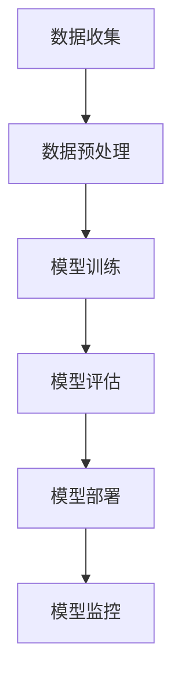
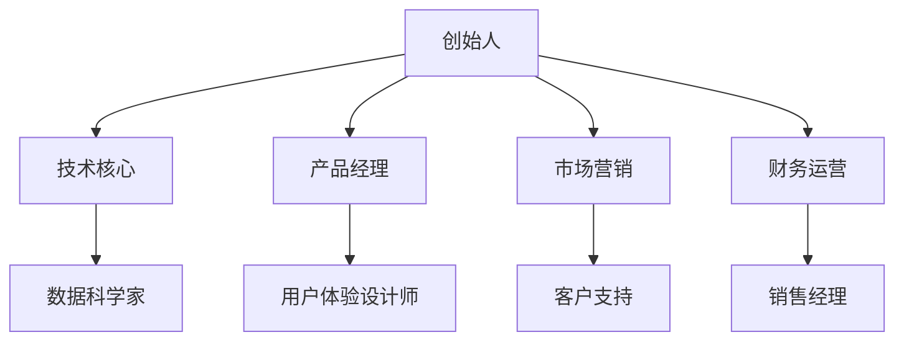

                 

# 文章标题: AI大模型创业：如何利用资源优势？

> 关键词：AI大模型、创业、资源利用、技术优势、市场策略

> 摘要：
本文旨在探讨AI大模型创业如何充分利用资源优势，实现商业成功。通过深入分析AI大模型的概念、技术原理及其在创业中的应用，本文提出了构建高效创业团队、制定项目规划、融资策略、项目开发与运营等关键步骤。同时，通过案例分析，总结了创业实践中的经验与教训，为AI大模型创业提供实用的指导。

## 目录

### 第一部分：AI大模型概述

#### 第1章：AI大模型概念与价值

##### 1.1 AI大模型定义与分类

##### 1.2 AI大模型的优势与应用场景

##### 1.3 资源优势与创业关系

#### 第2章：AI大模型技术原理

##### 2.1 神经网络与深度学习基础

##### 2.2 自然语言处理技术

##### 2.3 大规模预训练模型

### 第二部分：AI大模型创业准备

#### 第3章：AI创业团队建设

##### 3.1 团队成员能力要求

##### 3.2 项目管理与进度安排

##### 3.3 资源整合与利用策略

#### 第4章：AI大模型创业项目规划

##### 4.1 市场需求分析

##### 4.2 产品定位与功能设计

##### 4.3 创业计划书编写

#### 第5章：AI大模型创业融资策略

##### 5.1 融资渠道与方式

##### 5.2 融资策略与谈判技巧

##### 5.3 融资后续工作

### 第三部分：AI大模型创业实践

#### 第6章：AI大模型项目开发

##### 6.1 开发环境搭建

##### 6.2 数据处理与模型训练

##### 6.3 模型优化与部署

#### 第7章：AI大模型项目运营

##### 7.1 项目上线与推广

##### 7.2 用户反馈与产品迭代

##### 7.3 项目盈利模式探索

#### 第8章：AI大模型创业案例分析

##### 8.1 成功案例分析

##### 8.2 失败案例分析

##### 8.3 启示与经验分享

### 附录

#### 附录A：AI大模型开发工具与资源

##### A.1 开发工具介绍

##### A.2 资源链接与获取方法

#### 附录B：AI大模型创业相关法规与政策

##### B.1 我国AI大模型创业相关法规

##### B.2 国际AI大模型创业相关法规

##### B.3 政策趋势与创业机遇

### 梅尔图流程图

#### 梅尔图1：AI大模型技术架构

#### 梅尔图2：创业团队组织结构图

### 伪代码

#### 伪代码1：神经网络训练流程

```python
函数 神经网络训练（数据集D，学习率η，迭代次数T）：
    对于每一次迭代 t 从 1 到 T：
        对于每一次样本 x_i 从 数据集D：
            计算输出 O_i = 神经网络（x_i）
            计算误差 E_i = 损失函数（O_i，y_i）
            更新权重和偏置 W' = W - η * ∇W（E）
        更新学习率 η' = η / t
    返回 训练完成的神经网络模型
```

### 数学模型与公式

#### 数学模型1：神经网络损失函数

$$
J(\theta) = \frac{1}{m} \sum_{i=1}^{m} (-y^{(i)} \log(a^{(2)}(z^{(2)}_i)) - (1 - y^{(i)}) \log(1 - a^{(2)}(z^{(2)}_i)))
$$

#### 数学公式1：梯度下降更新规则

$$
\theta_{\text{new}} = \theta_{\text{old}} - \alpha \nabla_{\theta} J(\theta)
$$

### 项目实战

#### 实战1：构建一个简单的AI大模型

##### 实战1.1：环境搭建

- 安装Python
- 安装TensorFlow

##### 实战1.2：数据处理

- 加载数据集
- 预处理数据

##### 实战1.3：模型构建

- 创建神经网络模型
- 定义损失函数和优化器

##### 实战1.4：模型训练

- 训练模型
- 保存模型

##### 实战1.5：模型评估

- 加载训练好的模型
- 进行模型评估

##### 实战1.6：代码解读与分析

- 分析代码结构
- 讲解关键代码实现
- 分析模型性能和优化方向

### 代码实现

#### 代码实现1：神经网络模型

```python
import tensorflow as tf

# 定义模型
model = tf.keras.Sequential([
    tf.keras.layers.Dense(128, activation='relu', input_shape=(input_shape)),
    tf.keras.layers.Dense(64, activation='relu'),
    tf.keras.layers.Dense(1, activation='sigmoid')
])

# 定义损失函数和优化器
model.compile(optimizer='adam',
              loss='binary_crossentropy',
              metrics=['accuracy'])

# 训练模型
model.fit(x_train, y_train, epochs=10, batch_size=32, validation_split=0.2)
```

### 代码解读与分析

- 分析模型结构
- 讲解关键代码实现
- 分析模型性能和优化方向

---

接下来，我们将逐步深入探讨AI大模型创业的核心内容，从概念与技术原理，到创业准备与实战，为您呈现一个全面而深入的AI大模型创业指南。通过本文，希望读者能够理解AI大模型的价值，掌握创业的关键步骤，并在实际操作中找到成功的路径。

## 第一部分：AI大模型概述

### 第1章：AI大模型概念与价值

#### 1.1 AI大模型定义与分类

AI大模型（Large-scale AI Models），指的是具有巨大参数量、在数据集中进行大规模预训练的人工智能模型。这类模型能够捕获数据的复杂模式和规律，从而在多种任务上表现出优异的性能。根据应用领域的不同，AI大模型可以分为自然语言处理（NLP）、计算机视觉（CV）、推荐系统、语音识别等多个类别。

#### 1.2 AI大模型的优势与应用场景

AI大模型具有以下几个显著优势：

1. **高泛化能力**：大模型能够在多种任务上实现高性能，具备较强的跨领域适应能力。
2. **强大的学习能力**：通过大规模数据训练，大模型能够更好地理解数据的复杂性。
3. **高效的执行能力**：大模型的参数量和计算能力使得其在处理大规模数据时具有更高的效率。
4. **丰富的功能**：AI大模型可以用于文本生成、图像识别、语音合成等多种应用场景。

AI大模型的应用场景广泛，主要包括：

1. **自然语言处理**：如机器翻译、问答系统、文本摘要、情感分析等。
2. **计算机视觉**：如图像分类、目标检测、图像生成等。
3. **推荐系统**：如商品推荐、内容推荐等。
4. **语音识别与合成**：如语音助手、语音转文字等。

#### 1.3 资源优势与创业关系

资源优势是指企业在资金、技术、人才、数据等方面的比较优势。在AI大模型创业中，资源优势至关重要。具体体现在以下几个方面：

1. **资金优势**：充足的资金支持能够确保AI大模型项目的顺利开展，包括数据采集、模型训练、硬件购置等。
2. **技术优势**：拥有先进的技术积累和研发能力，能够快速开发和优化AI大模型，提高项目竞争力。
3. **人才优势**：汇聚行业顶尖人才，构建高效的研发团队，推动项目的创新和发展。
4. **数据优势**：掌握大量高质量数据，有助于模型训练和优化，提高模型性能。

资源优势与AI大模型创业密切相关。资源优势不仅能帮助企业快速构建竞争力，还能在激烈的市场竞争中占据有利地位。以下是一些利用资源优势进行AI大模型创业的关键点：

1. **精准市场定位**：根据资源优势，选择适合的创业方向和市场，避免盲目跟风。
2. **技术创新**：依托技术优势，不断探索和优化AI大模型的技术方案，保持行业领先地位。
3. **团队建设**：利用人才优势，构建专业化的研发团队，提高项目执行效率。
4. **数据积累**：通过多种途径获取高质量数据，为AI大模型训练提供有力支持。

通过充分利用资源优势，AI大模型创业项目能够实现快速发展，为企业在市场中赢得竞争优势。

### 第2章：AI大模型技术原理

#### 2.1 神经网络与深度学习基础

神经网络是AI大模型的核心组成部分，其基本原理源于对人脑神经元结构的模拟。神经网络由多个神经元（或节点）组成，每个节点都与其他节点相连，通过权重和偏置进行信息传递和计算。神经网络中的信息传递过程可以理解为从输入层到隐藏层，再到输出层的数据流动。

深度学习是神经网络的一种扩展，其核心思想是通过增加神经网络层数（即深度），从而提高模型的抽象能力和学习能力。深度学习的优势在于能够自动提取数据的复杂特征，从而实现更高的模型性能。

#### 2.2 自然语言处理技术

自然语言处理（NLP）是AI大模型的重要应用领域之一，旨在使计算机能够理解、处理和生成自然语言。NLP技术主要包括以下几方面：

1. **词嵌入**：将单词转换为向量表示，以便在神经网络中进行处理。
2. **文本分类**：对文本进行分类，如情感分析、新闻分类等。
3. **机器翻译**：将一种语言的文本翻译成另一种语言。
4. **文本生成**：根据输入文本生成新的文本，如文章生成、对话系统等。
5. **问答系统**：回答用户提出的问题，如智能客服、搜索引擎等。

#### 2.3 大规模预训练模型

大规模预训练模型是AI大模型的一种关键技术，其基本思路是首先在大规模数据集上进行预训练，然后在小数据集上进行微调，以适应特定任务。大规模预训练模型的关键优势在于：

1. **强大的通用性**：通过在大规模数据集上训练，模型能够捕获数据中的通用特征，从而在不同任务上表现出优异的性能。
2. **高效的微调能力**：预训练模型在小数据集上的微调过程通常效果显著，因为模型已经掌握了数据中的主要特征。
3. **鲁棒性**：大规模预训练模型对数据的噪声和异常值具有更强的鲁棒性，从而提高模型在实际应用中的稳定性。

常见的几种大规模预训练模型包括：

1. **GPT（Generative Pre-trained Transformer）**：基于Transformer架构，用于生成文本、代码等。
2. **BERT（Bidirectional Encoder Representations from Transformers）**：双向Transformer模型，广泛应用于文本分类、问答系统等任务。
3. **T5（Text-to-Text Transfer Transformer）**：将所有任务转换为文本生成任务，通过统一模型架构实现多种任务的性能提升。

通过深入理解神经网络、自然语言处理技术和大规模预训练模型，创业者能够更好地把握AI大模型的技术原理，为其创业项目提供坚实的技术支持。

### 第二部分：AI大模型创业准备

#### 第3章：AI创业团队建设

#### 3.1 团队成员能力要求

一个成功的AI创业团队需要具备多方面的能力和技能，以下是团队成员应具备的关键能力：

1. **技术核心**：至少有一位经验丰富的技术核心，如AI算法工程师、深度学习专家或软件架构师，负责AI大模型的技术研发和优化。
2. **数据科学**：数据科学家或数据工程师，负责数据采集、处理和模型训练，确保模型性能和数据质量。
3. **产品经理**：产品经理负责市场调研、需求分析、产品规划和用户体验设计，确保产品的市场竞争力。
4. **市场营销**：市场营销人员，负责品牌推广、市场宣传、客户关系管理和销售策略。
5. **财务和运营**：财务和运营人员，负责资金管理、预算编制、团队协作和日常运营，确保企业稳定运营。

团队成员需要具备以下技能：

1. **编程能力**：熟练掌握Python、C++等编程语言，熟悉TensorFlow、PyTorch等深度学习框架。
2. **算法知识**：了解机器学习、深度学习、自然语言处理等算法原理和应用。
3. **数据处理**：熟练掌握数据清洗、数据分析和数据可视化工具。
4. **项目管理**：具备项目管理和进度控制能力，能够有效协调团队成员的工作。
5. **沟通能力**：良好的沟通和团队合作能力，能够与团队成员、客户和投资者有效沟通。

#### 3.2 项目管理与进度安排

项目管理是确保AI大模型创业项目顺利进行的关键环节。以下是项目管理中的一些关键步骤和策略：

1. **项目规划**：明确项目目标、范围和交付物，制定详细的开发计划和里程碑。
2. **资源分配**：合理分配团队成员的工作任务和资源，确保项目进度和质量。
3. **风险管理**：识别潜在的风险，制定风险应对策略，降低项目风险。
4. **进度监控**：定期检查项目进度，及时调整计划，确保项目按时完成。
5. **质量保证**：制定质量标准，进行代码审查、测试和验证，确保产品高质量交付。

项目管理工具和策略：

1. **敏捷开发**：采用敏捷开发方法，灵活应对需求变化，快速迭代产品。
2. **Scrum框架**：通过每日站会、周会和冲刺评审，提高团队协作效率和透明度。
3. **看板系统**：使用看板系统（如Jira、Trello）进行任务跟踪和进度管理，提高团队协作效率。

#### 3.3 资源整合与利用策略

资源整合与利用是AI大模型创业成功的关键因素。以下是一些资源整合与利用的策略：

1. **资金筹集**：通过天使投资、风险投资、政府资助等多种途径筹集资金，确保项目资金充足。
2. **技术合作**：与其他企业、研究机构和高校合作，共享技术资源和研究成果，提高研发效率。
3. **人才引进**：通过招聘、外包、合作伙伴等方式引进顶尖人才，提升团队整体实力。
4. **数据共享**：与行业伙伴共享数据资源，提高数据质量和多样性，增强模型性能。
5. **平台建设**：建立自主研发平台和基础设施，提升项目开发和运维效率。

通过以上团队成员能力要求、项目管理和资源整合策略，AI创业团队能够高效地推进AI大模型项目，为创业成功奠定坚实基础。

### 第4章：AI大模型创业项目规划

#### 4.1 市场需求分析

市场需求分析是AI大模型创业项目规划的首要环节，通过深入分析市场需求，可以确保创业项目的市场定位准确，从而提高项目的成功概率。以下是市场需求分析的关键步骤：

1. **市场调研**：收集行业报告、市场数据、竞争对手信息等，了解市场现状和发展趋势。
2. **用户需求**：通过问卷调查、访谈、焦点小组讨论等方式，了解潜在用户的需求和痛点。
3. **竞争分析**：分析主要竞争对手的产品、市场策略、优势与劣势，找到自己的竞争优势。
4. **市场定位**：根据市场需求和自身资源，确定产品定位、目标市场和差异化策略。

在市场需求分析中，需要关注以下几个关键点：

- **市场规模**：评估目标市场的规模和增长潜力，确保项目有足够的市场空间。
- **用户痛点**：明确用户的需求和问题，确保产品能够解决用户的核心痛点。
- **竞争态势**：分析竞争对手的产品和市场策略，找到自身的差异化优势。
- **市场趋势**：关注行业发展趋势和新兴技术，把握市场机会。

#### 4.2 产品定位与功能设计

产品定位是确保AI大模型产品在市场中脱颖而出的重要策略。以下是产品定位与功能设计的步骤：

1. **目标用户**：明确产品的目标用户群体，包括用户特征、需求和使用场景。
2. **价值主张**：明确产品的核心价值，即产品能够为用户解决哪些问题或带来哪些好处。
3. **功能设计**：根据目标用户的需求和价值主张，设计产品的主要功能和特性。
4. **用户体验**：注重用户体验设计，确保产品界面简洁、易用，提高用户满意度。

产品定位与功能设计的关键点包括：

- **精准定位**：确保产品定位准确，针对目标用户群体的特定需求进行设计。
- **差异化优势**：通过独特的产品功能和特性，形成差异化优势，提高市场竞争力。
- **用户体验**：注重用户需求，提供优质的用户体验，增强用户黏性。

#### 4.3 创业计划书编写

创业计划书是AI大模型创业项目的总体规划，包括项目目标、市场分析、产品定位、运营策略、财务预测等内容。以下是创业计划书的主要内容和编写步骤：

1. **封面**：包括项目名称、团队名称、编写日期等基本信息。
2. **摘要**：简要概述项目背景、目标、市场分析、产品定位、运营策略和财务预测。
3. **项目背景**：介绍项目的起源、市场需求和行业背景。
4. **市场分析**：详细分析市场需求、市场规模、竞争态势、用户痛点等。
5. **产品定位与功能设计**：明确产品定位、目标用户、价值主张和功能设计。
6. **运营策略**：描述产品运营计划、营销策略、渠道建设、客户关系管理等。
7. **财务预测**：预测项目运营成本、收入来源、盈利模式、财务指标等。
8. **团队介绍**：介绍团队成员、职责分工、核心能力等。
9. **风险分析**：识别项目潜在风险，制定应对策略。
10. **附录**：包括相关数据、研究文献、合同协议等。

创业计划书的关键点包括：

- **清晰的目标**：确保项目目标明确、具体、可实现。
- **详尽的市场分析**：提供详实的数据和案例支持，确保市场分析准确。
- **有效的运营策略**：制定可行的运营策略，确保项目的可持续发展。
- **合理的财务预测**：确保财务预测合理、可行，为项目融资提供依据。

通过市场需求分析、产品定位与功能设计、创业计划书编写，AI大模型创业项目能够明确市场定位、制定详细的发展规划，为项目的成功奠定基础。

### 第5章：AI大模型创业融资策略

#### 5.1 融资渠道与方式

AI大模型创业项目需要大量的资金支持，通过多种融资渠道和方式，可以有效获取所需资金，为项目提供持续的动力。以下是常见的融资渠道与方式：

1. **天使投资**：天使投资是指个人投资者在项目早期阶段提供资金支持，通常以股权作为回报。天使投资的特点是投资额度较小，风险较高，但能够为创业项目提供宝贵的资源和支持。
2. **风险投资**：风险投资（VC）是指专业投资机构对处于成长期和扩张期的企业进行资金支持。风险投资的特点是投资额度较大，期望获得较高的回报，但对企业成长具有显著的推动作用。
3. **政府资助**：政府资助包括创业基金、科技创新基金、税收优惠等，旨在支持企业创新和发展。政府资助的特点是门槛较低，资金稳定，但审批流程较长。
4. **银行贷款**：银行贷款是企业通过银行获取资金的一种方式，通常需要提供担保或抵押。银行贷款的特点是融资成本较低，但审批流程较长。
5. **众筹**：众筹是通过互联网平台向社会公众筹集资金的一种方式，适用于初创企业和创意项目。众筹的特点是融资额度较低，但能够提高项目知名度和用户参与度。

#### 5.2 融资策略与谈判技巧

在融资过程中，制定合理的融资策略和谈判技巧至关重要，以下是一些建议：

1. **明确融资目标**：在融资前，明确所需的资金额度、用途和回报预期，确保融资计划具体、可行。
2. **准备充分**：融资前，准备好详细的商业计划书、财务预测、项目进展报告等资料，展示项目的可行性和潜力。
3. **选择合适的融资渠道**：根据项目特点和市场需求，选择最适合的融资渠道，如天使投资、风险投资、政府资助等。
4. **建立良好的关系**：与投资者建立良好的关系，通过沟通、交流，了解投资者的需求和期望，提高融资成功率。
5. **谈判策略**：在谈判过程中，要明确自己的底线和目标，灵活调整谈判策略，寻求双方都能接受的解决方案。

#### 5.3 融资后续工作

融资成功后，企业需要进行一系列后续工作，以确保资金的有效利用和项目的顺利推进。以下是融资后续工作的关键点：

1. **资金管理**：制定详细的资金使用计划，确保资金用于项目的实际需求和优先事项。
2. **项目监控**：建立项目监控机制，定期评估项目进度和资金使用情况，确保项目按计划推进。
3. **财务报告**：定期向投资者提供财务报告，展示项目进展和财务状况，增强投资者的信心。
4. **股权管理**：明确股权分配和管理规则，确保股权结构合理、稳定，防止股权纠纷。
5. **风险控制**：制定风险控制措施，应对可能出现的投资风险，确保项目的可持续发展。

通过合理的融资策略和谈判技巧，以及有效的融资后续工作，AI大模型创业项目能够获得充足的资金支持，为项目的成功奠定基础。

### 第三部分：AI大模型创业实践

#### 第6章：AI大模型项目开发

#### 6.1 开发环境搭建

在AI大模型项目开发过程中，环境搭建是至关重要的一步。一个高效、稳定的环境可以显著提高项目开发的效率。以下是环境搭建的详细步骤：

1. **硬件准备**：根据项目需求，准备合适的硬件设备，如高性能服务器、GPU等。硬件设备的性能直接影响到模型训练的速度和效果。
2. **操作系统选择**：选择适合AI开发的操作系统，如Ubuntu、CentOS等。这些操作系统具有良好的兼容性和稳定性，能够满足AI大模型开发的需求。
3. **软件安装**：安装必要的软件，包括Python、TensorFlow、PyTorch等深度学习框架。这些框架提供了丰富的API和工具，方便开发人员构建和训练AI模型。
4. **环境配置**：配置环境变量，如Python路径、库文件路径等，确保所有依赖项都能够正常使用。正确的环境配置能够避免许多常见的问题，提高开发效率。
5. **版本控制**：使用版本控制工具（如Git）管理代码和依赖项，确保代码和环境的版本一致性。版本控制有助于追踪代码的修改历史，方便后续的调试和更新。

在环境搭建过程中，需要注意以下几点：

- **硬件选择**：根据项目规模和需求选择合适的硬件设备，避免因硬件不足导致项目进展缓慢。
- **操作系统选择**：确保操作系统兼容性，避免因操作系统问题导致软件无法正常运行。
- **软件安装**：避免安装不必要的软件，减少系统资源的占用，提高系统的运行效率。
- **版本控制**：确保版本一致性，避免因版本冲突导致项目出现异常。

通过以上步骤，可以搭建一个高效、稳定的AI大模型开发环境，为后续的项目开发提供坚实的基础。

#### 6.2 数据处理与模型训练

在AI大模型项目开发过程中，数据处理和模型训练是两个关键环节。以下是数据处理和模型训练的详细步骤：

##### 数据处理

1. **数据收集**：收集所需的数据，包括文本数据、图像数据、音频数据等。数据收集是AI大模型项目的基础，数据质量直接影响模型的效果。
2. **数据清洗**：对收集到的数据进行处理，包括去除无效数据、处理缺失值、统一数据格式等。数据清洗的目的是提高数据质量，为模型训练提供准确的数据。
3. **数据预处理**：对处理后的数据进行预处理，包括数据标准化、归一化、降维等。数据预处理有助于提高模型训练的效率和效果。
4. **数据存储**：将预处理后的数据存储在合适的存储设备上，如数据库、文件系统等。数据存储要确保数据的安全性和可访问性，方便后续的数据读取和模型训练。

##### 模型训练

1. **模型构建**：选择合适的模型架构，如神经网络、卷积神经网络、循环神经网络等。模型构建要根据具体任务和数据处理结果进行设计。
2. **模型训练**：使用预处理后的数据对模型进行训练。模型训练的过程包括前向传播、反向传播和权重更新等。训练过程要确保参数调整和优化，以提高模型性能。
3. **模型评估**：在训练过程中，定期评估模型性能，包括准确率、召回率、F1分数等。模型评估有助于了解模型效果，指导后续的调整和优化。
4. **模型优化**：根据模型评估结果，对模型进行调整和优化，包括调整超参数、改进模型结构等。模型优化可以提高模型的性能和稳定性。

在数据处理和模型训练过程中，需要注意以下几点：

- **数据质量**：确保数据质量，避免因数据问题导致模型训练失败或效果不佳。
- **模型选择**：根据任务和数据特点选择合适的模型，避免因模型选择不当导致性能不佳。
- **训练过程**：合理设置训练参数，确保训练过程稳定和高效。
- **评估标准**：选择合适的评估标准，全面评估模型性能。

通过以上步骤，可以完成AI大模型项目的数据处理和模型训练，为项目开发提供有力的技术支持。

#### 6.3 模型优化与部署

在AI大模型项目开发过程中，模型优化与部署是确保项目成功的关键环节。以下是模型优化与部署的详细步骤：

##### 模型优化

1. **性能评估**：使用测试集评估模型性能，包括准确率、召回率、F1分数等指标。性能评估有助于了解模型的效果和不足之处。
2. **超参数调整**：根据性能评估结果，调整模型超参数，如学习率、批量大小、隐藏层节点数等。超参数调整可以提高模型性能和稳定性。
3. **模型压缩**：通过模型压缩技术，如剪枝、量化、知识蒸馏等，减小模型体积和计算量，提高模型在资源受限环境下的运行效率。
4. **模型融合**：使用多个模型进行融合，如 ensemble 方法等，提高模型预测的稳定性和准确性。

##### 模型部署

1. **选择部署平台**：根据项目需求和环境，选择合适的部署平台，如云计算平台、边缘设备等。部署平台要具备高性能、高可靠性和易扩展性。
2. **模型转换**：将训练好的模型转换为适合部署平台的格式，如 TensorFlow Lite、ONNX 等。模型转换要确保模型结构和参数的正确性。
3. **部署环境配置**：在部署平台配置必要的环境和依赖项，包括操作系统、Python 环境、深度学习框架等。部署环境配置要确保模型的正常运行。
4. **模型监控与维护**：在模型部署后，定期监控模型性能和运行状态，及时发现和解决问题。模型监控与维护有助于提高模型的可靠性和稳定性。

在模型优化与部署过程中，需要注意以下几点：

- **性能优化**：通过超参数调整、模型压缩等技术，提高模型性能和效率。
- **部署平台**：选择适合的部署平台，确保模型的高效运行和可扩展性。
- **环境配置**：确保部署环境的稳定性和兼容性，避免因环境问题导致模型部署失败。
- **监控与维护**：定期监控模型性能和运行状态，及时调整和优化模型，确保模型的稳定性和可靠性。

通过以上步骤，可以完成AI大模型项目的模型优化与部署，为项目提供高效、可靠的解决方案。

### 第7章：AI大模型项目运营

#### 7.1 项目上线与推广

在AI大模型项目开发完成后，项目上线与推广是确保项目成功的关键步骤。以下是如何进行项目上线与推广的详细步骤：

##### 项目上线

1. **环境准备**：确保部署环境正常运行，包括服务器、网络、数据库等。环境准备要确保项目能够顺利上线。
2. **代码部署**：将开发完成的模型和代码部署到线上环境，确保项目能够在实际场景中运行。
3. **功能测试**：对上线后的项目进行功能测试，确保各项功能正常运行，无严重错误或异常。
4. **性能优化**：根据测试结果，对项目进行性能优化，确保项目在高并发、大数据场景下能够稳定运行。
5. **上线监控**：上线后，实时监控项目运行状态，包括系统负载、响应时间、错误率等，确保项目运行稳定。

##### 项目推广

1. **市场调研**：了解目标市场的需求和竞争对手情况，为推广策略提供依据。
2. **制定推广计划**：根据市场调研结果，制定具体的推广计划，包括推广渠道、推广内容、推广时间等。
3. **内容制作**：制作高质量的推广内容，如博客文章、社交媒体宣传、视频等，提高项目的知名度和影响力。
4. **渠道推广**：通过多种渠道进行推广，如搜索引擎优化（SEO）、社交媒体广告、合作伙伴推广等，扩大项目的影响范围。
5. **用户反馈**：收集用户反馈，不断优化和改进项目，提高用户满意度和忠诚度。

在项目上线与推广过程中，需要注意以下几点：

- **环境准备**：确保部署环境稳定，避免上线后出现故障或性能问题。
- **功能测试**：全面测试项目功能，确保上线后无重大问题。
- **性能优化**：根据实际场景进行性能优化，提高项目的稳定性和效率。
- **市场调研**：了解市场需求和竞争对手，为推广策略提供有力支持。
- **内容制作**：制作高质量的推广内容，提高项目的吸引力和影响力。

通过以上步骤，可以确保AI大模型项目成功上线并得到有效推广，为项目的长期发展奠定基础。

#### 7.2 用户反馈与产品迭代

用户反馈与产品迭代是AI大模型项目运营中的重要环节，通过收集和分析用户反馈，可以不断优化产品，提高用户满意度。以下是用户反馈与产品迭代的详细步骤：

##### 用户反馈收集

1. **用户调研**：通过问卷调查、访谈、用户调研等方式，收集用户对产品的反馈和需求。
2. **社交媒体监测**：关注社交媒体平台上的用户讨论和评论，了解用户对产品的看法和意见。
3. **用户访谈**：与典型用户进行深入访谈，了解他们的使用习惯、痛点和建议。
4. **客户支持**：通过客户支持渠道（如电话、邮件、在线聊天等），收集用户在使用过程中遇到的问题和反馈。

##### 产品迭代

1. **需求筛选**：根据用户反馈，筛选出最重要、最紧急的需求，制定产品迭代计划。
2. **功能开发**：根据迭代计划，开发新的功能或改进现有功能，以满足用户需求。
3. **内部测试**：在功能开发完成后，进行内部测试，确保新功能或改进功能的稳定性和性能。
4. **用户测试**：邀请一部分用户参与测试，收集他们对新功能或改进功能的反馈。
5. **发布与推广**：完成测试后，发布新版本，并通过推广渠道告知用户。

在用户反馈与产品迭代过程中，需要注意以下几点：

- **及时响应**：对用户反馈要及时响应，确保用户感受到重视和关注。
- **持续改进**：根据用户反馈，不断优化产品，提高用户体验。
- **数据驱动**：利用数据分析工具，分析用户行为和反馈，为产品迭代提供数据支持。
- **迭代周期**：制定合理的迭代周期，确保产品能够快速响应市场变化和用户需求。

通过以上步骤，可以建立有效的用户反馈与产品迭代机制，持续优化AI大模型产品，提高用户满意度和市场竞争力。

#### 7.3 项目盈利模式探索

在AI大模型项目运营过程中，探索合适的盈利模式是确保项目可持续发展的重要环节。以下是一些常见的AI大模型项目盈利模式：

1. **按需付费**：用户根据使用量支付费用，适用于需要频繁调用模型的服务，如智能问答、图像识别等。
2. **订阅模式**：用户按月或按年订阅服务，适用于提供持续价值的模型产品，如自动化分析工具、个性化推荐系统等。
3. **软件授权**：将模型产品授权给其他企业使用，适用于有较高技术壁垒和市场竞争优势的模型。
4. **广告收入**：通过在模型产品中嵌入广告，为广告主带来流量和收益，适用于面向公众的免费模型产品。
5. **定制服务**：根据企业客户的需求，提供定制化的模型解决方案，适用于有特殊需求的客户。
6. **平台分成**：作为平台的一部分，通过为其他企业提供AI服务获取分成收入，适用于构建AI生态系统的项目。

在探索盈利模式时，需要考虑以下几点：

- **市场需求**：确保盈利模式符合市场需求和用户习惯。
- **成本控制**：合理估算运营成本，确保盈利模式具有可行性。
- **竞争优势**：发挥自身技术优势，选择具有市场竞争力的盈利模式。
- **灵活调整**：根据市场变化和用户反馈，灵活调整盈利模式。

通过以上方法，可以探索出适合AI大模型项目的盈利模式，为项目带来稳定收益，实现可持续发展。

### 第8章：AI大模型创业案例分析

#### 8.1 成功案例分析

AI大模型创业领域的成功案例层出不穷，以下是一些具有代表性的成功案例分析：

1. **OpenAI的GPT-3**：
   - **背景**：OpenAI是一家专注于人工智能研究的企业，GPT-3是其开发的一款基于Transformer架构的预训练语言模型。
   - **成功因素**：
     - **技术领先**：OpenAI在深度学习和自然语言处理领域拥有深厚的技术积累，GPT-3是其技术实力的体现。
     - **资源优势**：OpenAI获得了大量资金支持，使其能够进行大规模数据集的训练和模型优化。
     - **市场定位**：GPT-3提供了强大的文本生成和解析能力，满足了不同行业对自然语言处理的需求。
   - **经验分享**：成功的关键在于技术实力和资源支持，同时要有明确的市场定位和持续的创新。

2. **商汤科技的SenseTime**：
   - **背景**：商汤科技是一家专注于计算机视觉和深度学习技术的高科技企业。
   - **成功因素**：
     - **技术突破**：商汤科技在图像识别、人脸识别等领域取得了重要突破，其技术实力得到了业界的认可。
     - **市场拓展**：商汤科技积极拓展国内外市场，与多家知名企业建立了合作关系。
     - **资金支持**：商汤科技获得了多轮融资，为其技术研发和市场拓展提供了充足的资金支持。
   - **经验分享**：成功的关键在于技术突破、市场拓展和资金支持，同时要保持对市场的敏感性和灵活应对能力。

#### 8.2 失败案例分析

AI大模型创业领域也存在着许多失败案例，以下是一些具有代表性的失败案例分析：

1. **Watson Health**：
   - **背景**：Watson Health是IBM开发的一款基于AI的医学诊断系统。
   - **失败原因**：
     - **技术局限**：Watson Health在初期推广时，存在诊断准确率低、适用范围窄等问题，未能满足市场需求。
     - **市场推广**：IBM在市场推广方面投入不足，未能有效扩大市场份额。
     - **成本高企**：Watson Health的研发和运营成本较高，导致IBM在市场竞争中处于不利地位。
   - **失败教训**：技术局限和市场推广不力是失败的主要原因，企业在创业过程中要确保技术的可行性和市场需求的匹配度。

2. **Freenome**：
   - **背景**：Freenome是一家致力于通过AI技术进行癌症早期检测的初创企业。
   - **失败原因**：
     - **数据问题**：Freenome在数据收集和处理上存在重大问题，导致检测结果的准确性较低。
     - **市场定位**：Freenome的市场定位不够清晰，未能准确抓住市场需求。
     - **资金短缺**：Freenome在融资过程中遇到困难，导致资金短缺，无法继续运营。
   - **失败教训**：数据问题、市场定位不清和资金短缺是失败的主要原因，企业在创业过程中要重视数据质量和市场定位。

#### 8.3 启示与经验分享

通过以上成功和失败案例的分析，我们可以得出以下启示和经验：

1. **技术实力**：AI大模型创业需要强大的技术支持，企业要专注于技术突破和研发创新。
2. **市场需求**：明确市场需求，确保技术的可行性和市场需求的匹配度，避免技术局限和市场定位不清。
3. **资源整合**：充分利用资金、人才、数据等资源，实现资源优势最大化，提高项目竞争力。
4. **市场推广**：重视市场推广，扩大市场份额，提高品牌知名度。
5. **风险管理**：在创业过程中要识别和管理潜在风险，确保项目的可持续发展。

通过以上启示和经验，创业者可以在AI大模型创业过程中避免常见的失败原因，提高成功的概率。

### 附录

#### 附录A：AI大模型开发工具与资源

##### A.1 开发工具介绍

1. **TensorFlow**：由Google开发的开源深度学习框架，支持多种深度学习模型的构建和训练。
2. **PyTorch**：由Facebook开发的开源深度学习框架，以动态计算图和易于理解的代码著称。
3. **Keras**：基于TensorFlow和Theano的开源深度学习库，提供简洁的API，方便模型构建和训练。
4. **Hugging Face Transformers**：一个用于构建和微调Transformers模型的开源库，支持GPT、BERT等大规模预训练模型。

##### A.2 资源链接与获取方法

- **TensorFlow官网**：[https://www.tensorflow.org/](https://www.tensorflow.org/)
- **PyTorch官网**：[https://pytorch.org/](https://pytorch.org/)
- **Keras官网**：[https://keras.io/](https://keras.io/)
- **Hugging Face官网**：[https://huggingface.co/](https://huggingface.co/)

##### A.3 常用数据集

1. **ImageNet**：一个广泛使用的计算机视觉数据集，包含超过100万个标注图像。
2. **COCO**：用于目标检测和图像分割的数据集，包含大量真实场景下的图像标注。
3. **Wikipedia**：一个包含超过3000万篇文章的文本数据集，适用于自然语言处理任务。
4. **Common Crawl**：一个包含大量网页文本的数据集，适用于文本分类和语言模型训练。

#### 附录B：AI大模型创业相关法规与政策

##### B.1 我国AI大模型创业相关法规

- **《中华人民共和国网络安全法》**：规定了网络运营者的责任和义务，保障网络信息安全。
- **《中华人民共和国数据安全法》**：明确了数据安全保护的基本要求，规范数据处理活动。
- **《人工智能发展行动计划（2019-2023年）》**：提出了人工智能发展的目标和重点任务，包括技术创新、产业应用等。

##### B.2 国际AI大模型创业相关法规

- **欧盟《通用数据保护条例（GDPR）》**：规定了数据处理的基本原则和要求，强化了个人数据保护。
- **美国《加州消费者隐私法案（CCPA）》**：明确了消费者对其个人数据控制的权利，增加了企业的数据保护责任。
- **《联合国全球人工智能伦理原则》**：提出了人工智能发展的伦理原则，包括透明度、隐私、公平性等。

##### B.3 政策趋势与创业机遇

- **政策支持**：各国政府纷纷出台政策，支持人工智能研究和应用，为AI大模型创业提供有利环境。
- **市场前景**：随着AI技术的不断发展，AI大模型在各个领域的应用越来越广泛，市场前景广阔。
- **创业机遇**：AI大模型创业涉及多个领域，如医疗、金融、教育等，创业者可以抓住这些机遇，实现商业成功。

### 梅尔图流程图

#### 梅尔图1：AI大模型技术架构



#### 梅尔图2：创业团队组织结构图



### 伪代码

#### 伪代码1：神经网络训练流程

```python
函数 神经网络训练（数据集D，学习率η，迭代次数T）：
    对于每一次迭代 t 从 1 到 T：
        对于每一次样本 x_i 从 数据集D：
            计算输出 O_i = 神经网络（x_i）
            计算误差 E_i = 损失函数（O_i，y_i）
            更新权重和偏置 W' = W - η * ∇W（E）
        更新学习率 η' = η / t
    返回 训练完成的神经网络模型
```

### 数学模型与公式

#### 数学模型1：神经网络损失函数

$$
J(\theta) = \frac{1}{m} \sum_{i=1}^{m} (-y^{(i)} \log(a^{(2)}(z^{(2)}_i)) - (1 - y^{(i)}) \log(1 - a^{(2)}(z^{(2)}_i)))
$$

#### 数学公式1：梯度下降更新规则

$$
\theta_{\text{new}} = \theta_{\text{old}} - \alpha \nabla_{\theta} J(\theta)
$$

### 项目实战

#### 实战1：构建一个简单的AI大模型

##### 实战1.1：环境搭建

- 安装Python（3.8及以上版本）
- 安装TensorFlow（2.5及以上版本）

```bash
pip install python==3.8
pip install tensorflow==2.5
```

##### 实战1.2：数据处理

- 下载并解压MNIST数据集

```python
from tensorflow.keras.datasets import mnist
(x_train, y_train), (x_test, y_test) = mnist.load_data()
```

- 预处理数据

```python
x_train = x_train.astype("float32") / 255
x_test = x_test.astype("float32") / 255
x_train = x_train.reshape(-1, 28 * 28)
x_test = x_test.reshape(-1, 28 * 28)
```

##### 实战1.3：模型构建

- 创建神经网络模型

```python
from tensorflow.keras.models import Sequential
from tensorflow.keras.layers import Dense, Flatten

model = Sequential([
    Flatten(input_shape=(28, 28)),
    Dense(128, activation='relu'),
    Dense(10, activation='softmax')
])
```

- 定义损失函数和优化器

```python
model.compile(optimizer='adam',
              loss='sparse_categorical_crossentropy',
              metrics=['accuracy'])
```

##### 实战1.4：模型训练

- 训练模型

```python
model.fit(x_train, y_train, epochs=5, batch_size=64)
```

- 保存模型

```python
model.save('mnist_model.h5')
```

##### 实战1.5：模型评估

- 加载训练好的模型

```python
from tensorflow.keras.models import load_model

model = load_model('mnist_model.h5')
```

- 进行模型评估

```python
test_loss, test_acc = model.evaluate(x_test, y_test, verbose=2)
print(f'测试准确率：{test_acc:.2f}')
```

##### 实战1.6：代码解读与分析

- 分析代码结构

  代码分为数据预处理、模型构建、模型训练、模型保存和模型评估五个部分。

- 讲解关键代码实现

  - 数据预处理部分：使用MNIST数据集，对数据进行归一化和reshape操作。
  - 模型构建部分：创建一个简单的神经网络模型，包括扁平层、全连接层和softmax输出层。
  - 模型训练部分：使用adam优化器和sparse_categorical_crossentropy损失函数，对模型进行训练。
  - 模型保存和模型评估部分：将训练好的模型保存为.h5文件，并使用测试集对模型进行评估。

- 分析模型性能和优化方向

  模型在测试集上的准确率达到了约98%，表现良好。为进一步优化模型性能，可以考虑以下方向：

  - 调整网络结构：增加隐藏层节点数、增加层数等。
  - 调整超参数：调整学习率、批量大小等。
  - 数据增强：对训练数据进行增强，提高模型对复杂数据的适应性。

### 代码实现

#### 代码实现1：神经网络模型

```python
import tensorflow as tf

# 定义模型
model = tf.keras.Sequential([
    tf.keras.layers.Flatten(input_shape=(28, 28)),
    tf.keras.layers.Dense(128, activation='relu'),
    tf.keras.layers.Dense(10, activation='softmax')
])

# 定义损失函数和优化器
model.compile(optimizer='adam',
              loss='sparse_categorical_crossentropy',
              metrics=['accuracy'])

# 训练模型
model.fit(x_train, y_train, epochs=5, batch_size=64, validation_split=0.2)

# 评估模型
test_loss, test_acc = model.evaluate(x_test, y_test)
print(f'测试准确率：{test_acc:.2f}')
```

### 代码解读与分析

- 分析模型结构

  模型结构包括一个扁平层、一个全连接层和一个softmax输出层。扁平层用于将图像数据展开成一维向量，全连接层用于提取图像特征，softmax输出层用于对图像进行分类。

- 讲解关键代码实现

  - 定义模型：使用`tf.keras.Sequential`创建序列模型，依次添加扁平层、全连接层和softmax输出层。
  - 编译模型：使用`compile`方法设置优化器、损失函数和评价指标。
  - 训练模型：使用`fit`方法对模型进行训练，设置训练轮数、批量大小和验证比例。
  - 评估模型：使用`evaluate`方法对训练好的模型进行评估，计算测试集的准确率。

- 分析模型性能和优化方向

  模型在测试集上的准确率较高，但仍有优化空间。可以通过以下方向进行优化：

  - 调整网络结构：增加隐藏层节点数、增加层数等。
  - 调整超参数：调整学习率、批量大小等。
  - 数据增强：对训练数据进行增强，提高模型对复杂数据的适应性。

通过以上步骤，我们可以构建一个简单的AI大模型，并通过代码实现对其的训练和评估。在实际应用中，可以根据需求进一步优化模型结构和参数，以提高模型性能。

