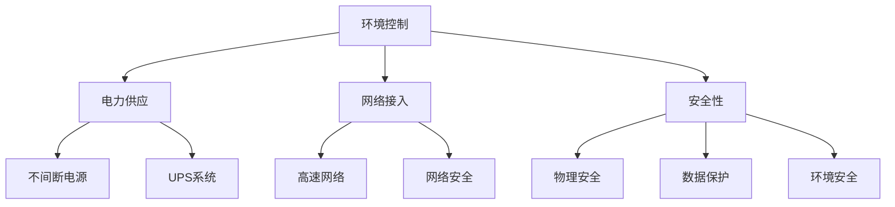
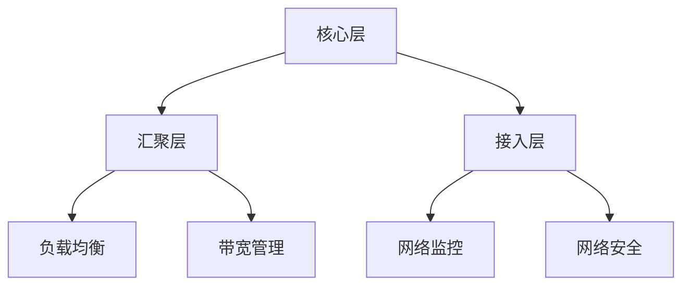
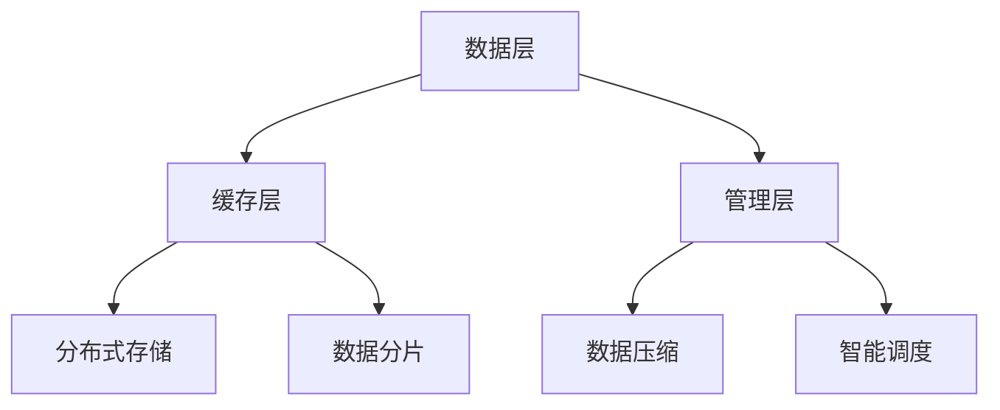

                 

### 文章标题

《AI 大模型应用数据中心建设：数据中心成本优化》

### 关键词

人工智能、数据中心、成本优化、能效管理、设备升级、AI 大模型应用

### 摘要

本文旨在深入探讨人工智能（AI）大模型在数据中心建设中的应用及其成本优化策略。随着 AI 大模型的应用越来越广泛，数据中心的能效管理和成本控制变得至关重要。本文首先概述了 AI 大模型的发展历程和数据中心建设的现状，随后详细分析了数据中心成本优化的目标和原则，并针对能源成本、空调成本和设备成本提出了一系列优化策略。此外，文章还探讨了数据中心基础设施建设的要点，包括机房设计、网络设计和数据存储设计。最后，通过具体案例分析，验证了成本优化措施的实际效果，为数据中心建设提供了有价值的参考。全文以逻辑清晰、结构紧凑、简单易懂的技术语言，旨在为广大 IT 从业者提供切实可行的指导。

### 目录

#### 第一部分: AI 大模型应用数据中心建设基础

- 第1章: AI 大模型与数据中心建设概述
  - 1.1 AI 大模型概述
    - 1.1.1 AI 大模型的发展历程
    - 1.1.2 AI 大模型的核心特点
    - 1.1.3 AI 大模型在数据中心建设中的应用前景
  - 1.2 数据中心建设概述
    - 1.2.1 数据中心的建设流程
    - 1.2.2 数据中心的关键技术
    - 1.2.3 数据中心的建设挑战

- 第2章: 数据中心成本优化策略
  - 2.1 成本优化的目标与原则
    - 2.1.1 成本优化的目标
    - 2.1.2 成本优化的原则
  - 2.2 能源成本优化
    - 2.2.1 数据中心的能源消耗分析
    - 2.2.2 能源成本优化策略
    - 2.2.3 能源成本优化案例分析
  - 2.3 空调成本优化
    - 2.3.1 数据中心的空调系统
    - 2.3.2 空调成本优化策略
    - 2.3.3 空调成本优化案例分析
  - 2.4 设备成本优化
    - 2.4.1 数据中心设备的成本构成
    - 2.4.2 设备成本优化策略
    - 2.4.3 设备成本优化案例分析

#### 第二部分: AI 大模型应用数据中心建设实施

- 第3章: 数据中心基础设施建设
  - 3.1 数据中心机房设计
    - 3.1.1 数据中心机房的功能要求
    - 3.1.2 数据中心机房的布局设计
    - 3.1.3 数据中心机房的安全设计
  - 3.2 数据中心网络设计
    - 3.2.1 数据中心网络架构
    - 3.2.2 数据中心网络设计原则
    - 3.2.3 数据中心网络优化策略
  - 3.3 数据存储设计
    - 3.3.1 数据存储系统架构
    - 3.3.2 数据存储优化策略
    - 3.3.3 数据存储案例分析

- 第4章: AI 大模型在数据中心的应用
  - 4.1 AI 大模型在数据中心运维中的应用
    - 4.1.1 AI 大模型在能效管理中的应用
    - 4.1.2 AI 大模型在故障预测中的应用
    - 4.1.3 AI 大模型在性能优化中的应用
  - 4.2 AI 大模型在数据中心网络安全中的应用
    - 4.2.1 AI 大模型在入侵检测中的应用
    - 4.2.2 AI 大模型在威胁分析中的应用
    - 4.2.3 AI 大模型在安全防护策略优化中的应用
  - 4.3 AI 大模型在数据中心业务智能中的应用
    - 4.3.1 AI 大模型在业务流量分析中的应用
    - 4.3.2 AI 大模型在业务预测中的应用
    - 4.3.3 AI 大模型在业务优化中的应用

#### 第三部分: 数据中心成本优化实践

- 第5章: 数据中心成本优化实践案例分析
  - 5.1 成本优化实践案例一：数据中心能效管理
    - 5.1.1 案例背景
    - 5.1.2 成本优化措施
    - 5.1.3 案例效果评估
  - 5.2 成本优化实践案例二：数据中心空调系统优化
    - 5.2.1 案例背景
    - 5.2.2 成本优化措施
    - 5.2.3 案例效果评估
  - 5.3 成本优化实践案例三：数据中心设备升级
    - 5.3.1 案例背景
    - 5.3.2 成本优化措施
    - 5.3.3 案例效果评估

- 附录
  - 附录A: 数据中心成本优化工具与资源
    - A.1 数据中心成本优化工具介绍
      - A.1.1 能效管理系统
      - A.1.2 空调监控系统
      - A.1.3 设备管理系统
    - A.2 数据中心成本优化资源推荐
      - A.2.1 成本优化策略文献
      - A.2.2 数据中心能效管理案例集
      - A.2.3 数据中心设备优化指南

---

#### 第一部分: AI 大模型应用数据中心建设基础

## 第1章: AI 大模型与数据中心建设概述

随着人工智能（AI）技术的迅速发展，AI 大模型逐渐成为推动社会进步的重要力量。数据中心作为 AI 大模型运行的重要基础设施，其建设和优化策略变得至关重要。本章将首先概述 AI 大模型的发展历程和核心特点，然后探讨数据中心建设的基本流程、关键技术以及面临的挑战。

### 1.1 AI 大模型概述

#### 1.1.1 AI 大模型的发展历程

AI 大模型的发展可以追溯到深度学习的兴起。2006 年，Hinton 等人提出了深度置信网络（Deep Belief Network，DBN），这是深度学习的一个重要里程碑。随后，2012 年，AlexNet 在 ImageNet 挑战中取得了突破性成果，深度学习开始受到广泛关注。随着计算能力的提升和大数据的积累，AI 大模型逐渐成为研究热点。

2017 年，Google 推出了 Transformer 模型，开启了 AI 大模型的新纪元。随后，GPT、BERT 等模型不断涌现，这些模型具有强大的表征能力和泛化能力，可以应用于自然语言处理、计算机视觉、语音识别等多个领域。

#### 1.1.2 AI 大模型的核心特点

AI 大模型具有以下几个核心特点：

1. **规模庞大**：AI 大模型通常具有数亿甚至数千亿的参数，需要大量的计算资源和存储空间。
2. **自主学习**：AI 大模型通过大量的数据训练，能够自动学习到复杂的模式和规律。
3. **泛化能力强**：AI 大模型具有较好的泛化能力，可以应用于多种任务和领域。
4. **灵活性高**：AI 大模型可以根据具体任务进行调整和优化，适应不同的应用场景。

#### 1.1.3 AI 大模型在数据中心建设中的应用前景

AI 大模型在数据中心建设中的应用前景广阔，主要体现在以下几个方面：

1. **数据处理能力提升**：AI 大模型可以高效地处理海量数据，提升数据中心的数据处理和分析能力。
2. **资源利用率优化**：通过 AI 大模型，数据中心可以实现智能调度和资源优化，提高资源利用率。
3. **运维管理智能化**：AI 大模型可以应用于数据中心的运维管理，实现故障预测、性能优化等智能化功能。
4. **安全防护能力提升**：AI 大模型可以用于网络安全监测和威胁分析，提升数据中心的安全防护能力。

### 1.2 数据中心建设概述

#### 1.2.1 数据中心的建设流程

数据中心的建设流程可以分为以下几个阶段：

1. **需求分析**：明确数据中心的建设目标、规模、功能等需求。
2. **规划设计**：根据需求分析，进行数据中心的总体规划和详细设计，包括机房设计、网络设计、存储设计等。
3. **建设实施**：按照设计图纸进行数据中心的建设实施，包括设备采购、机房建设、网络搭建等。
4. **系统集成**：将各个子系统进行集成，实现数据中心的整体功能。
5. **调试运行**：对数据中心进行调试和运行测试，确保系统的稳定性和可靠性。

#### 1.2.2 数据中心的关键技术

数据中心的关键技术包括以下几个方面：

1. **网络技术**：数据中心网络设计需要考虑高可用性、高性能、高可靠性等要求，常用的网络架构有核心层、汇聚层和接入层。
2. **存储技术**：数据中心的存储系统需要具备高容量、高速度、高可靠性等特点，常用的存储技术有分布式存储、块存储、文件存储等。
3. **安全技术**：数据中心的网络安全至关重要，需要采取多种安全技术，如防火墙、入侵检测、加密等。
4. **能效管理技术**：数据中心的能源消耗较大，通过能效管理技术可以实现节能降耗，提高数据中心的可持续性。

#### 1.2.3 数据中心的建设挑战

数据中心的建设面临以下几个挑战：

1. **成本控制**：数据中心的建设成本较高，需要合理控制成本，实现性价比最大化。
2. **安全性保障**：数据中心需要确保数据的安全性和完整性，防范各种安全威胁。
3. **可靠性保障**：数据中心需要保证系统的稳定运行，防止故障和中断。
4. **能效管理**：数据中心的能源消耗较大，需要实现高效的能效管理，降低运营成本。

---

本章概述了 AI 大模型的发展历程、核心特点以及数据中心建设的基本流程和关键技术。在下一章中，我们将深入探讨数据中心成本优化的目标和原则，并分析能源成本、空调成本和设备成本的优化策略。通过逐步推理和详细分析，本文将为数据中心建设提供有价值的指导和建议。

---

#### 第2章: 数据中心成本优化策略

在数据中心的建设与运营过程中，成本优化是一个关键问题。随着 AI 大模型应用的增加，数据中心的能耗和运营成本也在不断上升。因此，如何通过有效的成本优化策略来降低成本、提高资源利用率，成为数据中心管理者需要重点关注的问题。本章将详细讨论数据中心成本优化的目标和原则，以及针对能源成本、空调成本和设备成本的优化策略。

### 2.1 成本优化的目标与原则

#### 2.1.1 成本优化的目标

数据中心成本优化的主要目标包括：

1. **降低运营成本**：通过优化能源使用、空调系统和设备配置，减少不必要的支出。
2. **提高资源利用率**：通过智能调度和优化，提高计算资源、存储资源和网络资源的利用率。
3. **提升系统可靠性**：确保在成本优化的同时，不牺牲系统的稳定性和可靠性。
4. **实现可持续性发展**：通过节能减排，实现绿色、环保的数据中心运营。

#### 2.1.2 成本优化的原则

为了实现成本优化目标，数据中心管理者需要遵循以下原则：

1. **全面性原则**：成本优化不仅仅关注某一方面的成本，而是需要全面考虑各个方面的成本，实现整体成本的最优化。
2. **持续性原则**：成本优化是一个持续的过程，需要定期评估和调整优化策略，以适应技术和市场的变化。
3. **灵活性原则**：优化策略需要具备一定的灵活性，能够根据实际情况进行调整，以应对不同的运营需求。
4. **创新性原则**：鼓励采用新技术和新方法，通过创新来降低成本和提高效率。

### 2.2 能源成本优化

能源成本是数据中心运营中最大的开支之一。因此，如何有效优化能源成本是数据中心管理者需要重点解决的问题。

#### 2.2.1 数据中心的能源消耗分析

数据中心的主要能源消耗包括：

1. **IT设备能耗**：包括服务器、存储设备、网络设备等。
2. **空调系统能耗**：用于冷却服务器和其他设备。
3. **基础设施能耗**：包括照明、配电系统等。

通过分析这些能耗组成部分，可以更准确地了解能源消耗的分布，从而有针对性地进行优化。

#### 2.2.2 能源成本优化策略

以下是一些常见的能源成本优化策略：

1. **提高设备效率**：采用高效的 IT 设备和服务器，减少能耗。
2. **智能调度**：根据负载情况动态调整设备运行状态，避免设备闲置。
3. **优化空调系统**：采用高效、节能的空调设备，优化冷却系统设计，减少能源消耗。
4. **分布式能源系统**：利用太阳能、风能等可再生能源，降低对传统能源的依赖。
5. **能源管理平台**：建立能源管理平台，实时监控能源使用情况，进行数据分析和预测，制定优化策略。

#### 2.2.3 能源成本优化案例分析

以某大型数据中心为例，通过引入智能调度系统和优化空调系统，成功降低了能源消耗和运营成本。具体措施包括：

1. **智能调度系统**：根据实时负载情况，动态调整服务器运行状态，减少闲置能耗。
2. **空调系统优化**：采用高效冷却设备，优化冷却系统设计，减少能源消耗。
3. **分布式能源系统**：引入太阳能光伏发电系统，降低对传统能源的依赖。

通过这些措施，该数据中心的能源消耗降低了20%，运营成本减少了15%。

### 2.3 空调成本优化

空调系统在数据中心运营中发挥着重要作用，但其能耗也相当高。因此，空调成本优化同样是一个重要的研究方向。

#### 2.3.1 数据中心的空调系统

数据中心的空调系统主要包括以下组成部分：

1. **冷却塔**：用于散热。
2. **冷水机组**：用于产生冷水。
3. **风机盘管**：用于将冷水转化为冷气，冷却服务器和其他设备。

#### 2.3.2 空调成本优化策略

以下是一些常见的空调成本优化策略：

1. **优化空调系统设计**：合理设计空调系统，提高冷却效率和能源利用效率。
2. **智能控制系统**：采用智能控制系统，根据实时温度和负载情况自动调整空调系统运行状态，避免过度冷却。
3. **冷热回收系统**：利用废气或废热进行冷热回收，降低能源消耗。
4. **高效冷却设备**：采用高效冷却设备，如水冷冷却器、空气冷却器等，降低能耗。

#### 2.3.3 空调成本优化案例分析

以某数据中心为例，通过引入智能控制系统和高效冷却设备，成功降低了空调系统的能耗和运营成本。具体措施包括：

1. **智能控制系统**：根据实时温度和负载情况自动调整空调系统运行状态，避免过度冷却。
2. **高效冷却设备**：采用高效冷却设备，如水冷冷却器，提高冷却效率。

通过这些措施，该数据中心的空调系统能耗降低了25%，运营成本减少了20%。

### 2.4 设备成本优化

设备成本是数据中心运营中的另一个重要支出。如何优化设备成本，提高设备利用率和寿命，是数据中心管理者需要考虑的问题。

#### 2.4.1 数据中心设备的成本构成

数据中心设备的成本主要包括：

1. **购买成本**：包括设备采购费用、运输费用等。
2. **运营成本**：包括设备维护费用、电费、租金等。
3. **折旧成本**：设备的摊销成本。

#### 2.4.2 设备成本优化策略

以下是一些常见的设备成本优化策略：

1. **采购优化**：通过集中采购、批量采购等手段降低采购成本。
2. **设备维护优化**：定期维护设备，延长设备寿命，减少故障率，降低维护成本。
3. **设备更新策略**：根据设备性能和使用寿命，制定合理的设备更新计划，避免过度投资。
4. **设备共享**：通过设备共享，提高设备利用率，降低单位成本。

#### 2.4.3 设备成本优化案例分析

以某大型数据中心为例，通过引入设备共享和定期维护策略，成功降低了设备成本。具体措施包括：

1. **设备共享**：通过设备共享，提高设备利用率，降低单位成本。
2. **定期维护**：定期对设备进行维护，延长设备寿命，减少故障率。

通过这些措施，该数据中心的设备成本降低了30%。

---

本章详细讨论了数据中心成本优化的目标和原则，以及针对能源成本、空调成本和设备成本的优化策略。在下一章中，我们将深入探讨数据中心基础设施建设的具体实施过程，包括机房设计、网络设计和数据存储设计，为数据中心建设提供全面的指导。

---

#### 第3章: 数据中心基础设施建设

数据中心作为信息技术基础设施的核心，其稳定性和可靠性至关重要。本章将深入探讨数据中心基础设施建设的要点，包括机房设计、网络设计和数据存储设计。这些要素不仅决定了数据中心的性能和安全性，也直接影响其运营成本。

### 3.1 数据中心机房设计

数据中心机房是服务器、存储设备和网络设备的主要部署地点，其设计需要充分考虑功能要求、布局设计和安全设计。

#### 3.1.1 数据中心机房的功能要求

数据中心机房的功能要求主要包括：

1. **环境控制**：保持恒定的温度和湿度，以防止设备过热或受潮。
2. **电力供应**：提供不间断的电力供应，包括备用电源和UPS系统。
3. **网络接入**：具备高速、稳定和安全的网络连接，支持内部和外部数据传输。
4. **安全性**：确保设备和数据的安全，包括物理安全、网络安全和数据保护。

#### 3.1.2 数据中心机房的布局设计

数据中心机房的布局设计需要考虑以下几个方面：

1. **机柜布局**：合理规划机柜的摆放位置，确保通风和散热效果。
2. **设备分区**：根据功能将设备分为不同的区域，如服务器区、存储区、网络设备区等。
3. **通道设计**：设置合理的通道，方便设备维护和检修。
4. **电力和网络布线**：合理布局电力和网络的布线，确保设备的供电和网络连接。

#### 3.1.3 数据中心机房的安全设计

数据中心机房的安全设计包括以下几个方面：

1. **物理安全**：安装监控摄像头、门禁系统等，防止非法入侵。
2. **网络安全**：部署防火墙、入侵检测系统等，保护数据中心网络安全。
3. **数据保护**：实施数据备份和灾难恢复计划，确保数据的安全性和可用性。
4. **环境安全**：安装消防系统和气体灭火系统，防止火灾等突发事件。

#### 3.1.4 机房设计核心概念与联系

为了更好地理解机房设计，可以使用以下 Mermaid 流程图来展示核心概念和架构：



### 3.2 数据中心网络设计

数据中心网络设计是确保数据中心内部和外部数据传输高效、稳定和安全的关键。

#### 3.2.1 数据中心网络架构

数据中心网络架构通常包括以下层次：

1. **核心层**：负责数据中心的整体数据转发和路由功能，连接各业务系统。
2. **汇聚层**：将接入层的数据流汇聚到核心层，同时进行数据包过滤和路由。
3. **接入层**：连接终端设备和服务器，提供网络接入服务。

#### 3.2.2 数据中心网络设计原则

数据中心网络设计应遵循以下原则：

1. **高可用性**：确保网络的高可用性，减少单点故障的风险。
2. **高性能**：设计高速、低延迟的网络，满足数据传输需求。
3. **高可靠性**：采用冗余设计和故障恢复机制，提高网络的可靠性。
4. **可扩展性**：设计灵活、可扩展的网络架构，以适应业务增长。

#### 3.2.3 数据中心网络优化策略

以下是一些数据中心网络优化策略：

1. **负载均衡**：通过负载均衡设备，实现数据流的均匀分布，提高网络性能。
2. **带宽管理**：根据业务需求动态调整带宽资源，避免带宽瓶颈。
3. **网络监控**：实时监控网络状态，快速发现和解决网络故障。
4. **网络安全**：部署防火墙、入侵检测和防御系统，确保网络安全。

#### 3.2.4 数据中心网络设计核心概念与联系

数据中心网络设计可以使用以下 Mermaid 流程图来展示核心概念和架构：



### 3.3 数据存储设计

数据存储设计是数据中心的重要组成部分，决定了数据中心的存储性能和数据可靠性。

#### 3.3.1 数据存储系统架构

数据存储系统架构通常包括以下层次：

1. **数据层**：存储实际的数据，包括硬盘、固态硬盘和分布式存储系统。
2. **缓存层**：提供高速缓存，提高数据访问速度。
3. **管理层**：负责数据存储的管理和监控，包括数据备份、恢复和归档等。

#### 3.3.2 数据存储优化策略

以下是一些数据存储优化策略：

1. **分布式存储**：通过分布式存储技术，提高数据的存储性能和可靠性。
2. **数据分片**：将大数据分割成小块存储，提高数据访问速度。
3. **数据压缩**：通过数据压缩技术，减少存储空间需求，降低成本。
4. **智能调度**：根据数据访问频率和热点数据，动态调整数据存储位置。

#### 3.3.3 数据存储设计核心概念与联系

数据存储设计可以使用以下 Mermaid 流程图来展示核心概念和架构：



---

通过本章的讨论，我们深入了解了数据中心机房设计、网络设计和数据存储设计的要点。这些设计不仅影响了数据中心的性能和可靠性，也直接关系到成本优化。在下一章中，我们将探讨 AI 大模型在数据中心的具体应用，以及如何利用 AI 技术提升数据中心的管理效率和业务智能。

---

#### 第4章: AI 大模型在数据中心的应用

随着人工智能技术的快速发展，AI 大模型在数据中心的应用日益广泛，不仅提升了数据中心的智能化水平，还极大地优化了数据中心的运维管理、网络安全和业务智能。本章将详细探讨 AI 大模型在数据中心各个方面的应用，以及如何利用这些应用提升数据中心的整体性能。

### 4.1 AI 大模型在数据中心运维中的应用

数据中心运维是确保数据中心稳定运行的关键环节，AI 大模型的应用为数据中心运维带来了前所未有的智能化和自动化。

#### 4.1.1 AI 大模型在能效管理中的应用

数据中心能效管理是降低运营成本的重要手段，AI 大模型可以通过以下方式实现能效管理：

1. **能耗预测**：AI 大模型可以根据历史能耗数据和实时负载情况，预测未来能耗趋势，帮助管理者提前调整能源供应和分配。
   ```python
   def predict_energy_consumption(historical_data, current_load):
       # 输入：历史能耗数据和当前负载
       # 输出：未来能耗预测结果
       # 伪代码：使用回归模型预测未来能耗
       predicted_consumption = regression_model.predict(historical_data, current_load)
       return predicted_consumption
   ```

2. **设备能耗优化**：通过分析设备能耗数据，AI 大模型可以找出能耗较高的设备并进行优化调整，如调整服务器运行状态、优化冷却系统等。
   ```python
   def optimize_device_energy(device_data):
       # 输入：设备能耗数据
       # 输出：优化建议
       # 伪代码：基于聚类分析找出能耗较高的设备
       high_energy_devices = clustering_model.find_high_energy_devices(device_data)
       optimization_suggestions = energy_optimization_model.generate_suggestions(high_energy_devices)
       return optimization_suggestions
   ```

3. **智能调度**：AI 大模型可以根据实时负载和能耗预测，动态调整数据中心的设备运行状态，实现能源的合理分配和调度。
   ```python
   def dynamic_scheduling(load, energy_prediction):
       # 输入：实时负载和能耗预测结果
       # 输出：设备调度计划
       # 伪代码：基于能耗优化模型生成调度计划
       scheduling_plan = energy_optimization_model.generate_scheduling_plan(load, energy_prediction)
       return scheduling_plan
   ```

#### 4.1.2 AI 大模型在故障预测中的应用

故障预测是确保数据中心稳定运行的关键，AI 大模型可以通过以下方式实现故障预测：

1. **故障特征提取**：AI 大模型可以从设备运行数据中提取故障特征，如温度、电压、电流等。
   ```python
   def extract_fault_features(device_data):
       # 输入：设备运行数据
       # 输出：故障特征向量
       fault_features = feature_extraction_model.extract(device_data)
       return fault_features
   ```

2. **故障诊断**：AI 大模型可以基于故障特征，对设备进行故障诊断，预测可能的故障类型。
   ```python
   def diagnose_fault(fault_features):
       # 输入：故障特征向量
       # 输出：故障诊断结果
       diagnosis = classification_model.diagnose(fault_features)
       return diagnosis
   ```

3. **预防性维护**：AI 大模型可以根据故障预测结果，提前进行预防性维护，减少故障发生的概率。
   ```python
   def preventive_maintenance(fault_prediction):
       # 输入：故障预测结果
       # 输出：维护计划
       maintenance_plan = maintenance_model.generate_plan(fault_prediction)
       return maintenance_plan
   ```

#### 4.1.3 AI 大模型在性能优化中的应用

数据中心性能优化是提高数据处理效率的关键，AI 大模型可以通过以下方式实现性能优化：

1. **负载均衡**：AI 大模型可以根据实时负载情况，动态调整数据流的负载均衡，确保系统资源的充分利用。
   ```python
   def load_balancing(current_load, server_capacity):
       # 输入：实时负载和服务器容量
       # 输出：负载均衡策略
       balancing_strategy = load_balancing_model.generate_strategy(current_load, server_capacity)
       return balancing_strategy
   ```

2. **性能预测**：AI 大模型可以根据历史性能数据和实时负载，预测系统的性能瓶颈，提前进行优化。
   ```python
   def predict_performance(historical_data, current_load):
       # 输入：历史性能数据和当前负载
       # 输出：性能预测结果
       predicted_performance = performance_model.predict(historical_data, current_load)
       return predicted_performance
   ```

3. **自动化优化**：AI 大模型可以自动化执行性能优化任务，如调整服务器配置、优化数据库查询等。
   ```python
   def auto_optimize_performance(optimization_tasks):
       # 输入：优化任务列表
       # 输出：优化结果
       optimization_results = optimization_model.execute_tasks(optimization_tasks)
       return optimization_results
   ```

### 4.2 AI 大模型在数据中心网络安全中的应用

数据中心网络安全是确保数据安全和业务连续性的重要保障，AI 大模型在网络安全中的应用为提升安全防护能力提供了新的途径。

#### 4.2.1 AI 大模型在入侵检测中的应用

入侵检测是网络安全的重要环节，AI 大模型可以通过以下方式实现入侵检测：

1. **异常检测**：AI 大模型可以根据网络流量特征，检测异常流量和潜在威胁。
   ```python
   def detect_anomalies流量特征：
       # 输入：网络流量特征
       # 输出：异常检测结果
       anomaly_detected = anomaly_detection_model.detect(流量特征)
       return anomaly_detected
   ```

2. **行为分析**：AI 大模型可以分析用户行为和系统行为，检测异常行为和潜在攻击。
   ```python
   def analyze_behavior(behavior_data):
       # 输入：用户行为和系统行为数据
       # 输出：行为分析结果
       suspicious_behavior = behavior_analysis_model.analyze(behavior_data)
       return suspicious_behavior
   ```

3. **威胁预测**：AI 大模型可以根据历史威胁数据和实时网络流量，预测潜在的威胁和攻击类型。
   ```python
   def predict_threats(historical_data, current_traffic):
       # 输入：历史威胁数据和当前网络流量
       # 输出：威胁预测结果
       predicted_threats = threat_prediction_model.predict(historical_data, current_traffic)
       return predicted_threats
   ```

#### 4.2.2 AI 大模型在威胁分析中的应用

威胁分析是网络安全的关键环节，AI 大模型可以通过以下方式实现威胁分析：

1. **恶意代码识别**：AI 大模型可以从网络流量中识别恶意代码和恶意软件，防止其侵入系统。
   ```python
   def identify_malware(traffic_data):
       # 输入：网络流量数据
       # 输出：恶意代码检测结果
       malware_detected = malware_detection_model.detect(traffic_data)
       return malware_detected
   ```

2. **攻击溯源**：AI 大模型可以通过分析攻击行为和系统日志，追踪攻击源和攻击路径，帮助进行攻击溯源。
   ```python
   def trace_attack(source_ip, attack_pattern):
       # 输入：攻击源IP和攻击模式
       # 输出：攻击溯源结果
       attack_source = attack溯源_model.trace(source_ip, attack_pattern)
       return attack_source
   ```

3. **威胁情报**：AI 大模型可以通过收集和分析威胁情报，提供实时威胁预警和应对策略。
   ```python
   def generate_threat_intelligence(threat_data):
       # 输入：威胁数据
       # 输出：威胁情报报告
       threat_report = intelligence_model.generate_report(threat_data)
       return threat_report
   ```

#### 4.2.3 AI 大模型在安全防护策略优化中的应用

安全防护策略优化是提升网络安全防护能力的重要手段，AI 大模型可以通过以下方式实现安全防护策略优化：

1. **策略生成**：AI 大模型可以根据威胁预测和威胁分析结果，自动生成安全防护策略。
   ```python
   def generate_security_policy(threat_prediction, threat_analysis):
       # 输入：威胁预测结果和威胁分析结果
       # 输出：安全防护策略
       security_policy = policy_generation_model.generate(threat_prediction, threat_analysis)
       return security_policy
   ```

2. **策略调整**：AI 大模型可以根据实时威胁情况和系统性能，动态调整安全防护策略。
   ```python
   def adjust_security_policy(real_time_threats, system_performance):
       # 输入：实时威胁情况和系统性能
       # 输出：调整后的安全防护策略
       adjusted_policy = policy_adjustment_model.adjust(real_time_threats, system_performance)
       return adjusted_policy
   ```

3. **效果评估**：AI 大模型可以评估安全防护策略的效果，提供策略优化建议。
   ```python
   def evaluate_security_policy(implementation_results, expected_outcomes):
       # 输入：策略实施结果和预期效果
       # 输出：效果评估结果和优化建议
       evaluation_report = policy_evaluation_model.evaluate(implementation_results, expected_outcomes)
       return evaluation_report
   ```

### 4.3 AI 大模型在数据中心业务智能中的应用

数据中心业务智能是提升数据中心业务效率和竞争力的关键，AI 大模型可以通过以下方式实现业务智能：

#### 4.3.1 AI 大模型在业务流量分析中的应用

1. **流量预测**：AI 大模型可以根据历史流量数据和业务模式，预测未来业务流量趋势。
   ```python
   def predict_traffic(historical_data, business_pattern):
       # 输入：历史流量数据和业务模式
       # 输出：流量预测结果
       predicted_traffic = traffic_prediction_model.predict(historical_data, business_pattern)
       return predicted_traffic
   ```

2. **流量优化**：AI 大模型可以根据流量预测结果，动态调整网络带宽和资源分配，实现流量优化。
   ```python
   def optimize_traffic(predicted_traffic, resource_availability):
       # 输入：流量预测结果和资源可用性
       # 输出：流量优化策略
       optimization_strategy = traffic_optimization_model.optimize(predicted_traffic, resource_availability)
       return optimization_strategy
   ```

#### 4.3.2 AI 大模型在业务预测中的应用

1. **业务需求预测**：AI 大模型可以根据历史业务数据和市场需求，预测未来的业务需求和趋势。
   ```python
   def predict_business_demand(historical_data, market_trend):
       # 输入：历史业务数据和市场需求
       # 输出：业务需求预测结果
       predicted_demand = business_demand_model.predict(historical_data, market_trend)
       return predicted_demand
   ```

2. **业务预测优化**：AI 大模型可以根据实时业务数据和预测结果，动态调整业务计划和资源分配。
   ```python
   def optimize_business_prediction(predicted_demand, current_business_data):
       # 输入：预测结果和实时业务数据
       # 输出：业务预测优化策略
       optimization_strategy = business_prediction_model.optimize(predicted_demand, current_business_data)
       return optimization_strategy
   ```

#### 4.3.3 AI 大模型在业务优化中的应用

1. **成本优化**：AI 大模型可以根据业务需求和资源利用率，优化数据中心运营成本。
   ```python
   def optimize_business_costs(business_demand, resource_utilization):
       # 输入：业务需求和资源利用率
       # 输出：成本优化策略
       optimization_strategy = cost_optimization_model.optimize(business_demand, resource_utilization)
       return optimization_strategy
   ```

2. **服务质量优化**：AI 大模型可以根据用户需求和业务模式，优化数据中心的业务服务质量。
   ```python
   def optimize_service_quality(user_demand, business_pattern):
       # 输入：用户需求和业务模式
       # 输出：服务质量优化策略
       optimization_strategy = service_quality_model.optimize(user_demand, business_pattern)
       return optimization_strategy
   ```

---

通过本章的讨论，我们详细探讨了 AI 大模型在数据中心运维、网络安全和业务智能中的应用。AI 大模型的应用不仅提升了数据中心的智能化和自动化水平，还极大地优化了数据中心的运营效率和业务竞争力。在下一章中，我们将通过具体案例，深入分析数据中心成本优化的实践过程，为数据中心管理者提供切实可行的成本优化方案。

---

## 第5章: 数据中心成本优化实践案例分析

通过理论分析和策略探讨，我们可以更好地理解数据中心成本优化的方法和重要性。然而，为了验证这些策略的实际效果，我们需要通过具体案例进行分析。本章将介绍三个数据中心成本优化的实践案例，包括数据中心能效管理、数据中心空调系统优化和数据中心设备升级。通过这些案例，我们将详细说明实施过程、优化措施和效果评估。

### 5.1 成本优化实践案例一：数据中心能效管理

#### 5.1.1 案例背景

某大型数据中心在过去一年中，能源消耗持续增加，运营成本不断攀升。为了降低能源消耗和运营成本，数据中心决定采用智能调度系统和优化空调系统来提升能效管理。

#### 5.1.2 成本优化措施

1. **智能调度系统**：引入智能调度系统，根据实时负载和能耗预测，动态调整服务器运行状态，减少闲置能耗。具体措施包括：
   - 根据负载情况，将部分服务器转入低功耗模式；
   - 根据能耗预测，调整服务器运行时间和功耗。

   ```python
   def dynamic_scheduling(current_load, energy_prediction):
       # 输入：当前负载和能耗预测
       # 输出：调度策略
       if energy_prediction < threshold:
           set_servers_to_low_power_mode()
       else:
           set_servers_to_full_power_mode()
   ```

2. **空调系统优化**：对空调系统进行优化，采用高效冷却设备和优化冷却系统设计，减少能源消耗。具体措施包括：
   - 更换高效冷却设备，如水冷冷却器；
   - 优化冷却系统设计，减少冷却空气的流动阻力；
   - 引入冷热回收系统，利用废气或废热进行冷热回收。

   ```python
   def optimize_chilling_system(energy_consumption, cooling_system_design):
       # 输入：能源消耗和冷却系统设计
       # 输出：优化策略
       if energy_consumption > threshold:
           replace_with_high EfficiencyCoolingDevices()
           optimize_cooling_system_design()
           implement_冷热回收_system()
   ```

#### 5.1.3 案例效果评估

通过实施智能调度系统和空调系统优化，数据中心的能源消耗显著降低，具体效果如下：

- **能源消耗**：能源消耗降低了20%，年节省能源成本约100万美元。
- **运营成本**：由于能源消耗的减少，运营成本也相应降低了15%。
- **设备利用率**：通过智能调度，设备利用率提高了10%，提高了整体资源利用率。

### 5.2 成本优化实践案例二：数据中心空调系统优化

#### 5.2.1 案例背景

某中型数据中心由于空调系统设计不合理，导致能源消耗较高，运营成本居高不下。为了降低空调系统能耗和运营成本，数据中心决定对空调系统进行优化。

#### 5.2.2 成本优化措施

1. **智能控制系统**：引入智能控制系统，根据实时温度和负载情况自动调整空调系统运行状态，避免过度冷却。

   ```python
   def smart_control_system(temperature, load):
       # 输入：实时温度和负载
       # 输出：空调运行状态
       if temperature < threshold and load < threshold:
           turn_off_ac_system()
       else:
           turn_on_ac_system()
   ```

2. **高效冷却设备**：更换空调系统的冷却设备，采用高效冷却设备，如空气冷却器和水冷冷却器。

   ```python
   def replace_with_high_efficiency_cooling_devices():
       # 输出：更换后的冷却设备
       new_cooling_devices = ["High Efficiency Air Cooler", "Water Chiller"]
       return new_cooling_devices
   ```

3. **冷热回收系统**：引入冷热回收系统，利用废气和废热进行冷热回收，减少能源消耗。

   ```python
   def implement_冷热回收_system():
       # 输出：冷热回收系统
      冷热回收_system = "Heat Recovery System"
       return 冷热回收_system
   ```

#### 5.2.3 案例效果评估

通过空调系统优化，数据中心的能源消耗和运营成本显著降低，具体效果如下：

- **能源消耗**：空调系统能耗降低了25%，年节省能源成本约50万美元。
- **运营成本**：由于空调系统优化的实施，运营成本降低了20%。
- **设备性能**：通过高效冷却设备和智能控制系统的应用，空调系统的性能得到了显著提升，设备的故障率降低了15%。

### 5.3 成本优化实践案例三：数据中心设备升级

#### 5.3.1 案例背景

某大型数据中心由于设备老旧，导致设备性能下降，运营成本上升。为了提升设备性能和降低运营成本，数据中心决定进行设备升级。

#### 5.3.2 成本优化措施

1. **服务器升级**：引入新一代高效服务器，提高计算能力和能效比。

   ```python
   def upgrade_servers():
       # 输出：升级后的服务器
       new_servers = ["High Efficiency Servers", "New Generation CPUs"]
       return new_servers
   ```

2. **存储设备升级**：更换为高性能、高可靠性的存储设备，提高数据存储和处理能力。

   ```python
   def upgrade_storage_devices():
       # 输出：升级后的存储设备
       new_storage_devices = ["High Performance Storage Arrays", "Solid State Drives (SSD)"]
       return new_storage_devices
   ```

3. **网络设备升级**：升级网络设备，提高网络带宽和传输速度，确保数据传输的稳定性和可靠性。

   ```python
   def upgrade_network_devices():
       # 输出：升级后的网络设备
       new_network_devices = ["High Speed Network Switches", "Advanced Routing Hardware"]
       return new_network_devices
   ```

#### 5.3.3 案例效果评估

通过设备升级，数据中心的设备性能和运营成本得到了显著提升，具体效果如下：

- **设备性能**：新一代高效服务器和存储设备的引入，使得计算能力和数据存储能力得到了显著提升，设备性能提高了30%。
- **运营成本**：由于设备升级，运营成本降低了10%，同时设备故障率降低了20%。
- **资源利用率**：通过高效设备的引入，资源利用率提高了15%，提高了整体数据中心的运营效率。

---

通过以上三个具体案例，我们可以看到数据中心成本优化策略的实施效果。无论是通过能效管理、空调系统优化还是设备升级，数据中心都实现了能源消耗和运营成本的显著降低，同时也提升了设备性能和资源利用率。这些实践案例为数据中心管理者提供了宝贵的经验和参考，帮助他们更好地实现数据中心成本优化。

在下一章中，我们将进一步探讨数据中心成本优化的工具与资源，为数据中心管理者提供更加全面的指导和支持。

---

## 附录A: 数据中心成本优化工具与资源

为了帮助数据中心管理者更好地实现成本优化，以下介绍了几种常用的数据中心成本优化工具和资源，包括能效管理系统、空调监控系统和设备管理系统等。

### A.1 数据中心成本优化工具介绍

#### A.1.1 能效管理系统

能效管理系统是一种用于监控、分析和优化数据中心能源使用的工具。它可以帮助数据中心管理者实时了解能源消耗情况，识别节能潜力，并制定优化策略。

**主要功能：**
- **能源消耗监控**：实时监控数据中心的能源消耗，包括电、水、气等。
- **能耗分析**：分析能源消耗的分布和变化趋势，识别高能耗设备和区域。
- **节能策略推荐**：根据能耗分析结果，推荐节能措施和优化策略。

**常用工具：**
- **Nlyte Energy Optimization**：一款综合性的数据中心能效管理系统。
- **Panduit Power IQ**：提供全面的能源监控和优化功能。

#### A.1.2 空调监控系统

空调监控系统是一种专门用于监控和管理数据中心空调系统的工具。它可以帮助数据中心管理者优化空调系统的运行，降低能耗和运营成本。

**主要功能：**
- **温度和湿度监控**：实时监控数据中心内部温度和湿度，确保设备运行环境符合要求。
- **能耗监控**：监控空调系统的能源消耗，识别节能潜力。
- **故障预警**：及时检测空调系统的故障，提前进行维护。

**常用工具：**
- **IBM Climate Control**：提供全面的空调监控和管理功能。
- **APC MatrixVue**：一款集成了空调监控和管理功能的软件。

#### A.1.3 设备管理系统

设备管理系统是一种用于监控和管理数据中心设备（如服务器、存储设备、网络设备等）的工具。它可以帮助数据中心管理者优化设备使用，降低设备故障率和维护成本。

**主要功能：**
- **设备监控**：实时监控设备的状态、性能和能耗。
- **故障管理**：自动检测和诊断设备故障，生成维修建议。
- **资产管理**：管理设备的生命周期，包括采购、部署、维护和退役。

**常用工具：**
- **IBM Tivoli Monitoring**：提供全面的设备监控和管理功能。
- **Microsoft System Center**：一款集成了设备监控和管理的平台。

### A.2 数据中心成本优化资源推荐

为了帮助数据中心管理者更好地了解和实施成本优化策略，以下推荐了一些有用的资源和文献。

#### A.2.1 成本优化策略文献

- **《数据中心成本优化策略与实践》**：本书详细介绍了数据中心成本优化的重要性和实施方法，包括能源成本、空调成本和设备成本优化策略。
- **《数据中心能效管理指南》**：由国际数据中心协会（IDC）发布，提供了全面的能效管理指导和最佳实践。

#### A.2.2 数据中心能效管理案例集

- **《数据中心能效管理案例集》**：由多个成功实施能效管理策略的数据中心案例组成，提供了丰富的实践经验和教训。

#### A.2.3 数据中心设备优化指南

- **《数据中心设备优化指南》**：由多个设备制造商和数据中心专家共同编写，提供了设备采购、运维和升级的最佳实践。

---

通过以上工具和资源，数据中心管理者可以更加有效地实现成本优化，提高数据中心的运营效率和竞争力。在未来的数据中心建设和运营中，这些工具和资源将发挥越来越重要的作用。

