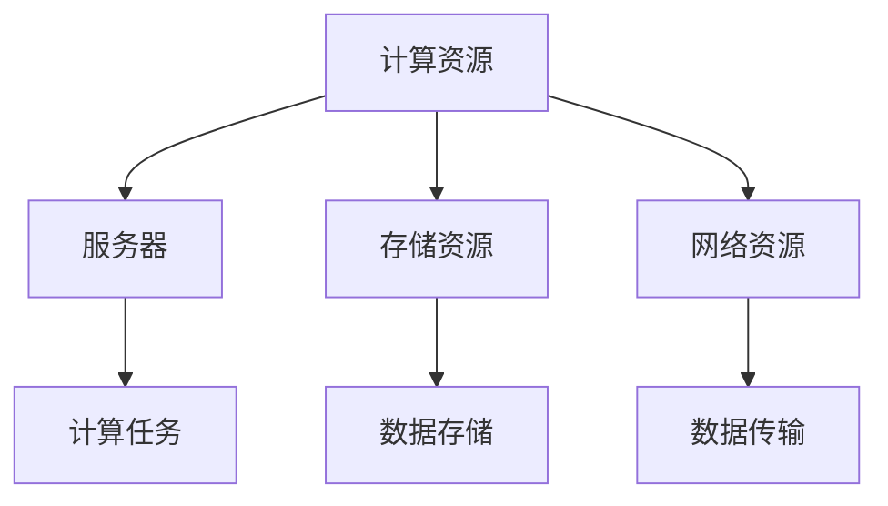
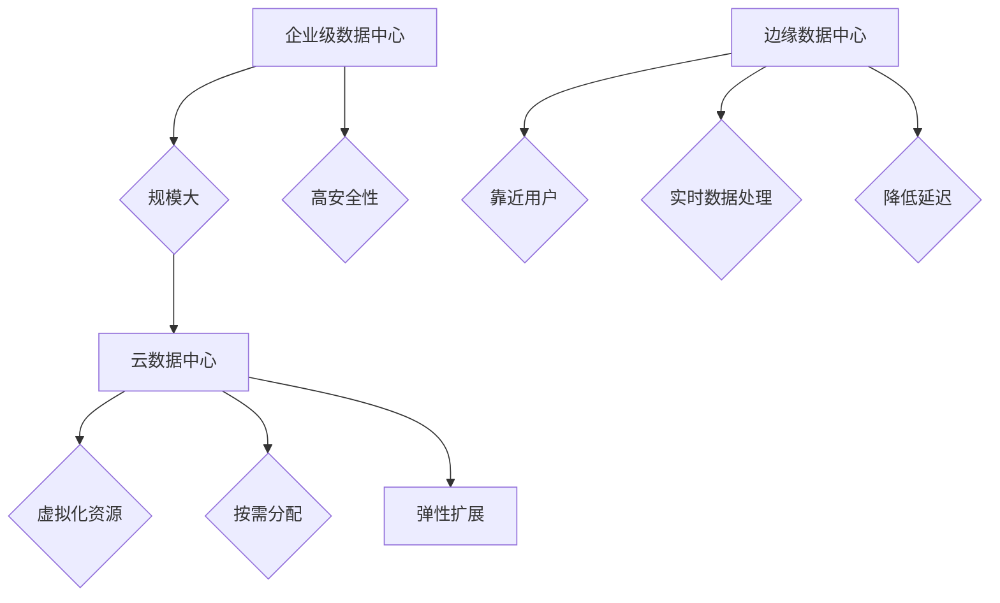
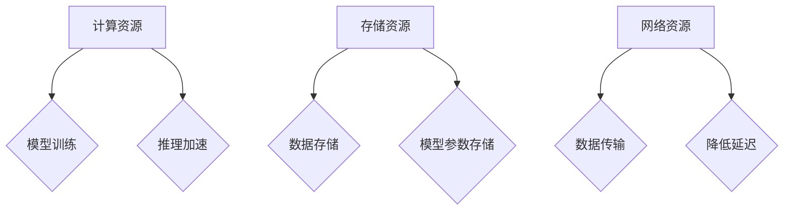

                 

### 文章标题

# AI 大模型应用数据中心建设：数据中心技术与应用

### 关键词

- 数据中心
- AI大模型
- 数据中心建设
- 数据中心技术
- 数据中心应用

### 摘要

本文深入探讨了AI大模型应用数据中心的建设与技术应用。文章首先介绍了数据中心的基本概念、分类、特点及其在AI大模型应用中的重要性。随后，文章详细阐述了数据中心硬件基础、能源管理、安全与运维、网络架构等方面的技术要点。接着，文章聚焦于AI大模型与数据中心的集成，分析了AI大模型在数据中心的应用场景和解决方案，并分享了实际应用案例。最后，文章展望了数据中心技术的未来发展趋势，以及AI大模型应用所面临的挑战与解决方案。

### 书籍目录大纲：《AI 大模型应用数据中心建设：数据中心技术与应用》

**第一部分: 数据中心基础知识**

## 第1章: 数据中心概述
### 1.1 数据中心的基本概念
### 1.2 数据中心的分类与特点
### 1.3 数据中心在AI大模型应用中的重要性

## 第2章: 数据中心硬件基础
### 2.1 服务器硬件概述
### 2.2 存储系统设计
### 2.3 网络架构与性能优化

## 第3章: 数据中心能源管理
### 3.1 能源管理的重要性
### 3.2 数据中心的能耗分析
### 3.3 能源效率优化策略

## 第4章: 数据中心安全与运维
### 4.1 数据中心安全策略
### 4.2 数据中心运维管理
### 4.3 故障恢复与业务连续性

## 第5章: 数据中心网络架构
### 5.1 网络拓扑设计
### 5.2 负载均衡技术
### 5.3 高可用性网络设计

## 第6章: AI大模型与数据中心集成
### 6.1 AI大模型对数据中心的需求
### 6.2 数据中心与AI大模型的协同工作
### 6.3 实际应用案例分析

**第二部分: AI大模型应用场景与解决方案**

## 第7章: AI大模型在数据中心的应用
### 7.1 机器学习模型训练
### 7.2 深度学习推理加速
### 7.3 智能监控与分析

## 第8章: 数据中心智能化解决方案
### 8.1 智能运维系统设计
### 8.2 自动化部署与维护
### 8.3 实时数据分析与可视化

## 第9章: AI大模型在边缘计算中的应用
### 9.1 边缘计算的挑战与机遇
### 9.2 边缘数据中心建设
### 9.3 AI大模型在边缘计算中的应用场景

## 第10章: AI大模型与云计算的融合
### 10.1 云数据中心架构
### 10.2 云原生AI大模型开发
### 10.3 容器化与微服务架构在AI大模型应用中的优势

**第三部分: 数据中心技术与应用案例**

## 第11章: 数据中心建设与运营实战
### 11.1 数据中心规划与设计
### 11.2 数据中心建设流程
### 11.3 数据中心运营与管理

## 第12章: AI大模型应用案例解析
### 12.1 AI大模型应用案例简介
### 12.2 案例分析
### 12.3 案例启示与展望

## 第13章: 未来发展趋势与挑战
### 13.1 数据中心技术的未来趋势
### 13.2 AI大模型应用的挑战与解决方案
### 13.3 数据中心与AI大模型融合的未来

**附录**

## 附录A: 常用数据中心技术术语解释
## 附录B: AI大模型常用工具与框架简介
## 附录C: 数据中心设计参考资源### 第1章: 数据中心概述

#### 1.1 数据中心的基本概念

数据中心是指一种特殊的数据处理和存储设施，通常集中了大量计算、存储和网络资源，为各种业务应用提供基础设施支持。数据中心的基本概念包括以下几个方面：

1. **计算资源**：数据中心内部集成了大量的服务器和计算设备，用于执行计算任务和处理数据。
2. **存储资源**：数据中心配备了大规模的存储设备，如磁盘阵列、固态硬盘和分布式存储系统，用于存储大量的数据和文件。
3. **网络资源**：数据中心通过高速网络连接各种设备，确保数据能够在内部和外部快速传输。

**核心概念与联系**：

下面通过Mermaid流程图来展示数据中心的基本概念和它们之间的联系。



#### 1.2 数据中心的分类与特点

数据中心可以根据不同的标准进行分类，如根据规模、地理位置、功能等。以下是几种常见的分类及其特点：

1. **企业级数据中心**：这类数据中心通常属于大型企业或机构，拥有大规模的计算和存储资源，提供高质量的服务和安全性保障。
2. **云数据中心**：云数据中心是云计算服务的基础设施，提供虚拟化资源、按需分配和弹性扩展的能力，以支持各种业务需求。
3. **边缘数据中心**：边缘数据中心位于网络边缘，靠近用户或数据源，用于处理和分析实时数据，降低延迟，提高用户体验。

**核心概念与联系**：

下面通过Mermaid流程图来展示不同类型数据中心的分类及其特点。



#### 1.3 数据中心在AI大模型应用中的重要性

随着AI技术的快速发展，数据中心在AI大模型应用中的重要性日益凸显。以下是数据中心在AI大模型应用中的几个关键作用：

1. **计算资源**：AI大模型通常需要大量的计算资源来处理海量数据，进行模型训练和推理。数据中心提供了强大的计算能力，支持AI大模型的运行。
2. **存储资源**：AI大模型需要存储大量数据和模型参数，数据中心提供了大规模的存储解决方案，确保数据的安全性和可访问性。
3. **网络资源**：数据中心的高速网络连接保证了数据在模型训练、推理过程中的高效传输，降低了延迟，提高了模型的性能。

**核心概念与联系**：

下面通过Mermaid流程图来展示数据中心在AI大模型应用中的重要性。



#### 1.4 本章小结

本章介绍了数据中心的基本概念、分类及其在AI大模型应用中的重要性。通过了解数据中心的基础知识，读者可以为后续章节的学习奠定坚实的基础。

---

在下一章中，我们将深入探讨数据中心的硬件基础，包括服务器硬件、存储系统设计和网络架构等内容。敬请期待！### 第2章: 数据中心硬件基础

#### 2.1 服务器硬件概述

服务器是数据中心的核心组成部分，承担着计算和数据存储的重任。以下是服务器硬件的概述及其在选择和应用中的关键因素。

##### 2.1.1 服务器类型

1. **通用服务器**：通用服务器适用于各种业务需求，具有良好的扩展性和兼容性。
2. **专用服务器**：专用服务器针对特定应用进行优化，如数据库服务器、文件服务器等。
3. **刀片服务器**：刀片服务器是一种高密度设计的服务器，可以在有限空间内提供强大的计算能力。

##### 2.1.2 服务器硬件配置

1. **CPU**：CPU是服务器的核心组件，负责执行计算任务。选择CPU时需要考虑核心数量、时钟频率和缓存大小等因素。
2. **内存**：内存用于临时存储数据，提高数据处理速度。选择内存时需要考虑容量、速度和类型（如DDR4、DDR5）。
3. **硬盘**：硬盘用于长期存储数据和操作系统。常见的硬盘类型有机械硬盘（HDD）和固态硬盘（SSD），选择时需要考虑容量、速度和可靠性。
4. **网络接口**：网络接口用于服务器之间的数据传输，选择时需要考虑网络速度、接口数量和协议支持。

##### 2.1.3 选择服务器硬件的关键因素

1. **性能需求**：根据业务需求选择合适的服务器硬件，确保服务器能够满足计算和存储需求。
2. **扩展性**：考虑服务器的扩展性，以便在业务增长时能够方便地升级硬件。
3. **可靠性**：选择可靠的服务器硬件，减少故障率和维护成本。
4. **功耗和散热**：服务器功耗和散热对数据中心的能源管理和散热系统有重要影响，选择时需要考虑功耗和散热性能。

#### 2.2 存储系统设计

存储系统是数据中心的重要组成部分，负责数据的安全存储和快速访问。以下是存储系统设计的关键考虑因素和常见架构。

##### 2.2.1 存储需求分析

1. **数据类型**：分析数据类型和存储需求，如文件存储、数据库存储、对象存储等。
2. **数据访问模式**：分析数据的访问模式，如随机访问、顺序访问等，以选择合适的存储设备。
3. **数据持久性**：根据业务需求选择不同级别的数据持久性，如热数据、温数据和冷数据。

##### 2.2.2 常见存储系统架构

1. **直连存储（DAS）**：DAS通过SCSI或SATA接口直接连接到服务器，适合小型和中等规模的数据中心。
2. **网络附加存储（NAS）**：NAS通过文件系统提供网络化的文件存储服务，适用于文件共享和分布式存储。
3. **存储区域网络（SAN）**：SAN通过光纤通道或iSCSI协议提供块级存储服务，适用于高性能数据库和事务处理。

##### 2.2.3 存储设备选择

1. **机械硬盘（HDD）**：HDD具有高容量、低成本的特点，适合存储大量非关键数据。
2. **固态硬盘（SSD）**：SSD具有高速读写、低功耗的特点，适合存储关键数据和需要高性能的应用。
3. **分布式存储**：分布式存储通过多个存储节点协同工作，提供高可用性和高扩展性，适用于大规模数据中心。

#### 2.3 网络架构与性能优化

数据中心的网络架构对数据传输速度和系统性能有重要影响。以下是数据中心网络架构的设计原则和性能优化方法。

##### 2.3.1 网络架构设计原则

1. **高可用性**：设计冗余的网络架构，确保在网络故障时系统仍能正常运行。
2. **高可靠性**：选择可靠的网络设备和协议，降低网络故障率。
3. **高性能**：设计高性能的网络架构，支持大量数据的高速传输。
4. **可扩展性**：设计可扩展的网络架构，支持业务增长时网络的弹性扩展。

##### 2.3.2 性能优化方法

1. **负载均衡**：通过负载均衡器分配网络流量，避免单点过载，提高网络性能。
2. **网络优化**：优化网络协议和配置，减少网络延迟和带宽浪费。
3. **缓存机制**：使用缓存机制，降低对后端存储的访问频率，提高数据访问速度。
4. **链路聚合**：通过链路聚合将多个网络接口合并为一个虚拟接口，提高网络带宽和可靠性。

#### 2.4 本章小结

本章介绍了数据中心硬件基础，包括服务器硬件、存储系统设计和网络架构等内容。通过了解服务器硬件配置、存储系统设计和网络架构设计原则，读者可以为数据中心的建设和优化提供理论依据和实践指导。

---

在下一章中，我们将探讨数据中心的能源管理，包括能源管理的重要性、能耗分析和优化策略。敬请期待！### 第3章: 数据中心能源管理

#### 3.1 能源管理的重要性

数据中心作为现代信息技术的重要基础设施，其能源消耗对环境和经济都有重大影响。因此，数据中心能源管理的重要性不容忽视。

1. **环境影响**：数据中心的高能耗导致大量的二氧化碳排放，对全球气候变化产生负面影响。有效的能源管理有助于减少碳排放，保护环境。
2. **经济效益**：能源消耗是数据中心运营的主要成本之一。通过优化能源管理，降低能源消耗，可以显著降低运营成本，提高数据中心的经济效益。
3. **设备寿命**：良好的能源管理有助于降低数据中心的温度和湿度，减少设备故障率和维护成本，延长设备寿命。

#### 3.2 数据中心的能耗分析

数据中心能耗主要由以下几个方面构成：

1. **IT设备能耗**：包括服务器、存储设备、网络设备等，这些设备在运行过程中消耗大量电力。
2. **制冷能耗**：数据中心需要使用制冷设备维持适宜的温湿度环境，制冷能耗通常占数据中心总能耗的40%以上。
3. **基础设施能耗**：包括照明、空调、通风、电力转换等，这些能耗虽然相对较低，但同样不容忽视。
4. **其他能耗**：如数据中心内部办公设备和备用电源系统的能耗。

#### 3.3 能源效率优化策略

为了降低数据中心的能耗，可以采取以下几种优化策略：

1. **设备能效优化**：选择能效等级较高的设备，如能效认证的服务器、高效电源供应器和高效硬盘。
2. **数据中心的温控管理**：优化数据中心的温控系统，采用智能温控技术，根据实际需求调节制冷功率。
3. **服务器虚拟化**：通过虚拟化技术，减少物理服务器的数量，提高设备利用率，降低能耗。
4. **智能电源管理**：使用智能电源管理系统，根据服务器负载动态调整电源供应，减少闲置能耗。
5. **能耗监测与优化**：使用能耗监测工具，实时监测数据中心的能耗情况，发现能耗异常，及时进行优化。
6. **使用可再生能源**：尽量使用可再生能源，如太阳能、风能等，减少对化石燃料的依赖。

#### 3.4 本章小结

本章讨论了数据中心能源管理的重要性，分析了数据中心的能耗构成，并提出了几种能源效率优化策略。通过实施这些策略，可以显著降低数据中心的能耗，提高能源利用效率，实现可持续发展。

---

在下一章中，我们将探讨数据中心的网络架构，包括网络拓扑设计、负载均衡技术和高可用性网络设计等内容。敬请期待！### 第4章: 数据中心安全与运维

#### 4.1 数据中心安全策略

数据中心的网络安全至关重要，必须采取一系列安全策略来保护数据、设备和系统的完整性。以下是几个关键的数据中心安全策略：

1. **访问控制**：通过身份验证、访问权限和双重认证等手段，确保只有授权人员才能访问数据中心资源。
2. **数据加密**：对存储和传输的数据进行加密，防止数据泄露和未经授权的访问。
3. **防火墙和入侵检测系统**：部署防火墙和入侵检测系统，监控网络流量，防止恶意攻击和数据泄露。
4. **备份与恢复**：定期备份关键数据和系统配置，确保在数据丢失或系统故障时能够快速恢复。
5. **安全审计与监控**：通过安全审计和监控，及时发现和响应安全事件，防止潜在威胁。
6. **安全培训**：定期对员工进行安全培训，提高他们的安全意识和防范能力。

#### 4.2 数据中心运维管理

数据中心运维管理是确保数据中心正常运行和高效服务的重要环节。以下是数据中心运维管理的几个关键方面：

1. **日常运维**：包括设备监控、故障处理、系统更新和维护等，确保数据中心持续提供服务。
2. **变更管理**：对数据中心的所有变更进行严格管理，确保变更不会影响服务的稳定性和安全性。
3. **性能优化**：定期对数据中心进行性能评估和优化，确保其性能满足业务需求。
4. **成本控制**：通过优化资源利用和降低能耗，控制数据中心运营成本。
5. **文档管理**：建立完善的文档管理体系，记录数据中心的配置、操作和变更历史，方便日后的运维和管理。

#### 4.3 故障恢复与业务连续性

为了确保数据中心的业务连续性和数据完整性，必须制定完善的故障恢复计划。以下是故障恢复与业务连续性的关键要素：

1. **备份策略**：制定合理的备份策略，确保关键数据得到定期备份，并在发生故障时能够快速恢复。
2. **故障预案**：制定详细的故障预案，明确在发生故障时需要采取的步骤和责任人。
3. **灾备中心**：建立灾备中心，确保在数据中心发生重大故障时，业务能够迅速切换到灾备中心，维持运营。
4. **应急响应**：建立应急响应团队，负责在发生紧急情况时迅速响应和处理。
5. **定期演练**：定期进行故障恢复演练，检验预案的有效性，提高应急响应能力。

#### 4.4 本章小结

本章讨论了数据中心的网络安全策略、运维管理以及故障恢复与业务连续性计划。通过实施这些措施，可以确保数据中心的安全运行和业务的连续性，为企业和客户提供可靠的服务。

---

在下一章中，我们将探讨数据中心的网络架构，包括网络拓扑设计、负载均衡技术和高可用性网络设计等内容。敬请期待！### 第5章: 数据中心网络架构

#### 5.1 网络拓扑设计

数据中心网络拓扑设计是构建高效、可靠和可扩展的网络基础设施的关键步骤。以下是几种常见的网络拓扑设计及其特点：

1. **星型拓扑**：在星型拓扑中，所有设备都直接连接到一个中央交换机或路由器。这种设计简单、易于管理和扩展，但中央节点成为单点故障的风险。
   
   **核心概念与联系**：

   ```mermaid
   graph TD
       A[服务器] --> B[中央交换机]
       C[存储设备] --> B
       D[网络设备] --> B
   ```

2. **环型拓扑**：环型拓扑中，设备通过环路连接，形成一个封闭的环。数据沿着环路单向传输，这种设计具有较低的延迟和较高的可靠性，但故障诊断和恢复较为困难。

   **核心概念与联系**：

   ```mermaid
   graph TD
       A[服务器] --> B[存储设备]
       B --> C[网络设备]
       C --> A
   ```

3. **树型拓扑**：树型拓扑通过层次结构将设备连接起来，通常用于大型数据中心。这种设计具有良好的扩展性和灵活性，但单点故障的风险较高。

   **核心概念与联系**：

   ```mermaid
   graph TD
       A[根交换机]
       B[一级交换机]
       C[二级交换机]
       D[服务器]
       E[存储设备]
       A --> B
       B --> C
       C --> D
       C --> E
   ```

4. **网状拓扑**：网状拓扑通过多个路径连接设备，提供高可靠性和冗余性。虽然这种设计复杂且成本较高，但在高要求的应用中是必要的。

   **核心概念与联系**：

   ```mermaid
   graph TD
       A[服务器1] --> B[交换机1]
       A --> C[交换机2]
       D[服务器2] --> B
       D --> C
   ```

#### 5.2 负载均衡技术

负载均衡技术用于将网络流量分布到多个服务器或设备上，确保系统资源得到充分利用，并提高系统的可用性和响应速度。以下是几种常见的负载均衡算法：

1. **轮询调度**：将请求依次分配给每个服务器，直到所有服务器都处理过请求。
   
   ```python
   # Python伪代码：轮询调度算法
   def round_robin(servers, requests):
       for request in requests:
           for server in servers:
               server.handle_request(request)
   ```

2. **最小连接数**：将请求分配给当前连接数最少的服务器，以均衡每个服务器的负载。
   
   ```python
   # Python伪代码：最小连接数算法
   def least_connections(servers, requests):
       min_conn_server = min(servers, key=lambda s: s.connection_count)
       min_conn_server.handle_request(requests)
   ```

3. **响应时间**：将请求分配给响应时间最短的服务器，以提高系统整体性能。
   
   ```python
   # Python伪代码：响应时间算法
   def response_time(servers, requests):
       min_response_server = min(servers, key=lambda s: s.response_time)
       min_response_server.handle_request(requests)
   ```

#### 5.3 高可用性网络设计

高可用性网络设计旨在确保数据中心网络在发生故障时能够快速恢复，以保持业务的连续性。以下是几种实现高可用性的方法：

1. **冗余设计**：通过使用冗余设备、链路和网络路径，确保在单点故障时网络仍能正常运行。
   
   ```mermaid
   graph TD
       A[服务器1] --> B[交换机1]
       A --> C[交换机2]
       D[服务器2] --> B
       D --> C
   ```

2. **故障转移**：通过故障转移机制，将流量从故障设备转移到备用设备，以维持服务可用性。
   
   ```python
   # Python伪代码：故障转移机制
   def故障转移(primary, backup):
       if primary.is_working():
           primary.handle_traffic()
       else:
           backup.handle_traffic()
   ```

3. **动态负载均衡**：结合故障转移和负载均衡技术，动态调整流量分配，以优化网络性能和可靠性。

   ```python
   # Python伪代码：动态负载均衡
   def dynamic_load_balancing(servers, requests):
       for request in requests:
           best_server = select_best_server(servers)
           best_server.handle_request(request)
   ```

#### 5.4 本章小结

本章介绍了数据中心网络架构设计，包括拓扑设计、负载均衡技术和高可用性网络设计。通过合理的设计和优化，可以构建一个高效、可靠和可扩展的数据中心网络，为AI大模型应用提供坚实的网络基础。

---

在下一章中，我们将探讨AI大模型与数据中心集成，分析AI大模型对数据中心的需求以及数据中心与AI大模型的协同工作。敬请期待！### 第6章: AI大模型与数据中心集成

#### 6.1 AI大模型对数据中心的需求

随着AI技术的快速发展，AI大模型（如GAN、BERT、GPT等）对数据中心提出了更高的需求。以下是AI大模型对数据中心的主要需求：

1. **计算资源**：AI大模型通常需要大量的计算资源来处理海量数据，进行模型训练和推理。数据中心提供了强大的计算能力，能够满足AI大模型的计算需求。

2. **存储资源**：AI大模型需要存储大量的数据和模型参数，数据中心提供了大规模的存储解决方案，确保数据的安全性和可访问性。

3. **网络资源**：数据中心的高速网络连接保证了数据在模型训练、推理过程中的高效传输，降低了延迟，提高了AI大模型的性能。

4. **能效管理**：由于AI大模型计算密集，数据中心需要有效的能效管理策略，以降低能耗，延长设备寿命。

5. **安全性**：AI大模型涉及敏感数据，数据中心需要提供严格的安全策略，确保数据安全和隐私。

#### 6.2 数据中心与AI大模型的协同工作

数据中心与AI大模型的协同工作主要体现在以下几个方面：

1. **资源调度**：数据中心通过资源调度系统，根据AI大模型的需求动态分配计算、存储和网络资源，确保模型训练和推理过程的顺利进行。

2. **数据传输**：数据中心通过网络优化技术，保证数据在模型训练、推理过程中的高效传输，降低延迟，提高模型的性能。

3. **能效管理**：数据中心通过智能能效管理策略，根据AI大模型的负载动态调整能耗，降低运行成本，延长设备寿命。

4. **安全性保障**：数据中心通过严格的安全策略，保护AI大模型的数据和模型参数，确保数据安全和隐私。

5. **运维管理**：数据中心通过自动化运维工具，对AI大模型进行监控、维护和故障处理，确保模型运行的稳定性和可靠性。

#### 6.3 实际应用案例分析

以下是一个实际应用案例，展示了AI大模型与数据中心集成的效果：

**案例背景**：一家大型互联网公司使用AI大模型进行用户行为分析和个性化推荐，以提高用户体验和业务转化率。

**解决方案**：

1. **计算资源调度**：数据中心根据AI大模型的计算需求，动态调整计算资源的分配，确保模型训练和推理过程的顺利进行。

2. **数据传输优化**：数据中心采用分布式存储和高速网络技术，保证大规模数据在模型训练过程中的高效传输，降低延迟。

3. **能效管理**：数据中心通过智能能效管理策略，根据AI大模型的负载动态调整能耗，降低运行成本，延长设备寿命。

4. **安全性保障**：数据中心采用严格的安全策略，保护AI大模型的数据和模型参数，确保数据安全和隐私。

5. **运维管理**：数据中心通过自动化运维工具，对AI大模型进行监控、维护和故障处理，确保模型运行的稳定性和可靠性。

**效果评估**：

- **用户体验提升**：通过AI大模型和数据中心集成，实现了用户行为分析的精准性和个性化推荐的准确性，用户满意度显著提升。
- **业务转化率提高**：个性化推荐系统提高了业务转化率，为企业带来了显著的经济效益。
- **运营成本降低**：通过智能能效管理策略，降低了数据中心的能耗，减少了运营成本。

#### 6.4 本章小结

本章探讨了AI大模型对数据中心的需求，分析了数据中心与AI大模型的协同工作方式，并通过实际应用案例分析展示了AI大模型与数据中心集成的效果。通过合理的设计和优化，数据中心可以为AI大模型提供强大的支持，推动人工智能技术的发展。

---

在下一章中，我们将深入探讨AI大模型在数据中心的具体应用，包括机器学习模型训练、深度学习推理加速和智能监控与分析等内容。敬请期待！### 第7章: AI大模型在数据中心的应用

#### 7.1 机器学习模型训练

机器学习模型训练是AI大模型应用的重要环节，数据中心提供了强大的计算资源和高效的存储系统，以支持大规模模型训练。以下是机器学习模型训练在数据中心中的应用步骤：

##### 7.1.1 准备数据

在数据中心环境中，首先需要准备训练数据集。这些数据可以从多个来源获取，如数据库、文件系统或分布式存储。数据准备步骤包括数据清洗、数据预处理和特征工程，以提高模型训练的效果。

```python
# Python伪代码：数据清洗和预处理
def preprocess_data(data):
    # 数据清洗
    cleaned_data = clean_data(data)
    # 数据预处理
    preprocessed_data = preprocess_data(cleaned_data)
    return preprocessed_data
```

##### 7.1.2 模型训练

在数据中心中，利用分布式计算框架（如TensorFlow、PyTorch）进行模型训练。分布式计算可以将模型训练任务拆分为多个子任务，分配到多个服务器上进行并行计算，从而提高训练速度和效率。

```python
# Python伪代码：模型训练
def train_model(model, data):
    # 模型训练
    model.fit(data.x, data.y, epochs=10)
    return model
```

##### 7.1.3 模型评估

模型训练完成后，需要在测试数据集上评估模型的性能。通过计算指标（如准确率、召回率、F1分数等）来评估模型的效果，并根据评估结果对模型进行调整和优化。

```python
# Python伪代码：模型评估
def evaluate_model(model, test_data):
    # 模型评估
    score = model.evaluate(test_data.x, test_data.y)
    print(f"Model accuracy: {score[1]}")
```

#### 7.2 深度学习推理加速

深度学习推理是AI大模型应用的另一个关键环节，其性能直接影响到用户体验和业务效率。数据中心可以通过以下方法加速深度学习推理：

##### 7.2.1 GPU加速

利用高性能GPU进行推理计算，可以显著提高推理速度。数据中心可以配置专门的GPU服务器或GPU加速卡，以支持大规模深度学习模型的推理。

```python
# Python伪代码：GPU加速推理
import tensorflow as tf

# 加载GPU设备
gpus = tf.config.experimental.list_physical_devices('GPU')
tf.config.experimental.set_visible_devices(gpus[0], 'GPU')

# 加载模型
model = tf.keras.models.load_model('path/to/model.h5')

# 推理
predictions = model.predict(x_test)
```

##### 7.2.2 缓存机制

通过缓存机制，将频繁访问的数据存储在内存或SSD中，以减少磁盘I/O操作，提高推理速度。

```python
# Python伪代码：缓存机制
from caching import Cache

# 创建缓存对象
cache = Cache()

# 使用缓存加速推理
def infer(model, data):
    if data in cache:
        return cache[data]
    else:
        predictions = model.predict(data)
        cache[data] = predictions
        return predictions
```

##### 7.2.3 并行推理

通过并行推理技术，将多个推理任务分配到多个GPU或服务器上，以实现高效并行处理。

```python
# Python伪代码：并行推理
from concurrent.futures import ThreadPoolExecutor

# 并行推理
def parallel_infer(model, data_list):
    with ThreadPoolExecutor(max_workers=4) as executor:
        futures = [executor.submit(model.predict, data) for data in data_list]
        predictions = [future.result() for future in futures]
    return predictions
```

#### 7.3 智能监控与分析

在数据中心环境中，智能监控与分析技术可以帮助运维人员实时监控AI大模型的运行状态，及时发现并解决潜在问题。以下是智能监控与分析的应用步骤：

##### 7.3.1 数据采集

通过日志收集系统，将AI大模型的运行日志、性能指标和异常事件等数据收集到数据中心。

```shell
# Shell伪代码：数据采集
logstash -f logstash.conf
```

##### 7.3.2 数据处理

对采集到的数据进行预处理，包括数据清洗、归一化和特征提取，以便进行进一步分析。

```python
# Python伪代码：数据处理
def preprocess_data(data):
    # 数据清洗
    cleaned_data = clean_data(data)
    # 数据归一化
    normalized_data = normalize_data(cleaned_data)
    return normalized_data
```

##### 7.3.3 监控分析

利用数据分析和可视化工具，对AI大模型的运行状态进行监控，发现异常并生成分析报告。

```python
# Python伪代码：监控分析
from monitoring import Monitor

# 创建监控对象
monitor = Monitor()

# 监控分析
def analyze_model_performance(model_performance):
    monitor.update(model_performance)
    report = monitor.generate_report()
    print(report)
```

#### 7.4 本章小结

本章详细介绍了AI大模型在数据中心的应用，包括机器学习模型训练、深度学习推理加速和智能监控与分析。通过数据中心提供的强大计算资源和智能监控工具，AI大模型可以高效运行，为企业和用户带来巨大价值。

---

在下一章中，我们将探讨数据中心智能化解决方案，包括智能运维系统设计、自动化部署与维护以及实时数据分析与可视化。敬请期待！### 第8章: 数据中心智能化解决方案

#### 8.1 智能运维系统设计

随着数据中心规模的不断扩大和复杂性的增加，传统的运维方式已无法满足现代化数据中心的运维需求。智能运维系统设计旨在通过自动化、智能化的手段，提高数据中心的运维效率和稳定性。以下是智能运维系统设计的关键组成部分：

##### 8.1.1 智能监控

智能监控是数据中心运维的核心功能之一。通过部署智能监控工具，可以实时收集和监控数据中心的各类运行数据，如服务器性能、网络流量、存储容量等。这些数据将被用来识别潜在问题和性能瓶颈。

```python
# Python伪代码：智能监控
from monitoring import Monitor

# 创建监控对象
monitor = Monitor()

# 收集监控数据
def collect_metrics():
    metrics = get_system_metrics()
    monitor.update(metrics)
```

##### 8.1.2 自动化运维

自动化运维通过脚本和自动化工具，实现数据中心的自动部署、配置管理和故障恢复等功能。自动化运维可以显著减少人为错误，提高运维效率。

```python
# Python伪代码：自动化运维
from automation import Deployer

# 创建部署对象
deployer = Deployer()

# 自动部署
def deploy_application():
    deployer.deploy_application('path/to/application.yml')
```

##### 8.1.3 智能告警

智能告警系统可以根据监控数据设置阈值，当系统性能或状态超出预定阈值时，自动发送告警通知，以便运维人员及时响应和处理。

```python
# Python伪代码：智能告警
from alerting import AlertingSystem

# 创建告警系统对象
alerting_system = AlertingSystem()

# 设置告警阈值
def set_alert_thresholds():
    thresholds = get_thresholds()
    alerting_system.set_thresholds(thresholds)
```

##### 8.1.4 智能分析

智能分析通过对监控数据的分析，提供故障诊断、性能优化和趋势预测等功能。智能分析可以帮助运维人员更深入地了解数据中心的状态，提前预判潜在问题。

```python
# Python伪代码：智能分析
from analysis import Analyzer

# 创建分析对象
analyzer = Analyzer()

# 进行数据分析
def analyze_metrics(metrics):
    report = analyzer.generate_report(metrics)
    print(report)
```

#### 8.2 自动化部署与维护

自动化部署与维护是数据中心智能化解决方案的重要组成部分，通过自动化工具，可以简化部署流程，提高部署效率，降低运维成本。以下是自动化部署与维护的关键步骤：

##### 8.2.1 持续集成与持续部署（CI/CD）

持续集成与持续部署（CI/CD）是一种自动化软件交付流程，通过自动化测试和部署，确保软件的可靠性和质量。CI/CD工具（如Jenkins、GitLab CI/CD）可以帮助数据中心自动化地构建、测试和部署应用程序。

```shell
# Shell伪代码：CI/CD
#!/bin/bash

# 检查代码
git pull origin main
mvn test

# 部署到测试环境
mvn deploy -Dmaven.test.skip=true

# 部署到生产环境
ssh user@production-server 'sudo java -jar application.jar'
```

##### 8.2.2 自动化配置管理

自动化配置管理通过工具（如Ansible、Chef、Puppet）来管理数据中心的配置，确保所有服务器和设备配置的一致性和正确性。自动化配置管理可以减少配置错误，提高运维效率。

```python
# Python伪代码：自动化配置管理
from configuration import ConfigManager

# 创建配置管理对象
config_manager = ConfigManager()

# 配置服务器
def configure_server(server_ip):
    config_manager.apply_configuration(server_ip, 'path/to/configuration.yml')
```

##### 8.2.3 自动化故障恢复

自动化故障恢复通过脚本和自动化工具，在发生故障时自动执行故障恢复流程，确保数据中心的持续运行。自动化故障恢复可以减少故障处理时间，提高业务连续性。

```python
# Python伪代码：自动化故障恢复
from recovery import RecoverySystem

# 创建恢复系统对象
recovery_system = RecoverySystem()

# 执行故障恢复
def recover_failure(server_ip):
    recovery_system.recover(server_ip)
```

#### 8.3 实时数据分析与可视化

实时数据分析与可视化是数据中心智能化解决方案的关键组成部分，通过对实时数据的分析，可以实时了解数据中心的状态，及时发现和解决问题。以下是实时数据分析与可视化的关键步骤：

##### 8.3.1 数据采集

通过部署数据采集工具（如Prometheus、InfluxDB），实时采集数据中心的各类运行数据，如CPU使用率、内存使用率、网络流量等。

```shell
# Shell伪代码：数据采集
#!/bin/bash

# 采集CPU使用率
sudo /usr/bin/htop

# 采集内存使用率
sudo /usr/bin/htop

# 采集网络流量
sudo /usr/bin/ifstat
```

##### 8.3.2 数据处理

对采集到的数据进行预处理，包括数据清洗、转换和聚合，以便进行进一步分析。

```python
# Python伪代码：数据处理
from data_processing import DataProcessor

# 创建数据处理对象
data_processor = DataProcessor()

# 数据预处理
def preprocess_data(data):
    processed_data = data_processor.process(data)
    return processed_data
```

##### 8.3.3 数据可视化

通过数据可视化工具（如Grafana、Kibana），将处理后的数据可视化，提供直观的数据展示，帮助运维人员实时了解数据中心的状态。

```python
# Python伪代码：数据可视化
from visualization import Visualization

# 创建可视化对象
visualizer = Visualization()

# 可视化数据
def visualize_data(data):
    chart = visualizer.generate_chart(data)
    print(chart)
```

#### 8.4 本章小结

本章介绍了数据中心智能化解决方案，包括智能运维系统设计、自动化部署与维护以及实时数据分析与可视化。通过实施这些智能化解决方案，可以提高数据中心的运维效率、降低运维成本，确保数据中心的稳定运行和业务连续性。

---

在下一章中，我们将探讨AI大模型在边缘计算中的应用，分析边缘计算的挑战与机遇，并介绍边缘数据中心的建设和应用场景。敬请期待！### 第9章: AI大模型在边缘计算中的应用

#### 9.1 边缘计算的挑战与机遇

边缘计算是一种将数据处理、存储和应用程序分布在网络边缘的分布式计算架构，其核心思想是将计算和存储能力从云端转移到网络边缘，即数据产生的地方。随着物联网、智能城市、自动驾驶等领域的快速发展，边缘计算的重要性日益凸显。以下是边缘计算的挑战与机遇：

##### 9.1.1 挑战

1. **计算资源限制**：边缘设备通常受到硬件性能和功耗的限制，相较于云端设备，其计算能力和存储容量有限。
2. **网络带宽限制**：边缘设备与云端之间的网络带宽可能较低，导致数据传输速度受限。
3. **安全性问题**：边缘设备可能更容易受到网络攻击和数据泄露的威胁。
4. **数据隐私与合规性**：处理和存储敏感数据时，需要遵守数据隐私法规和合规性要求。

##### 9.1.2 机遇

1. **低延迟应用**：边缘计算能够减少数据传输距离，降低网络延迟，适用于实时性要求高的应用，如自动驾驶、智能医疗等。
2. **数据利用率提高**：通过在边缘设备上进行数据处理，可以减少数据传输量，降低带宽消耗，提高数据利用率。
3. **边缘创新应用**：边缘计算为开发者提供了更多的创新空间，可以开发出更多的边缘智能应用。
4. **成本效益**：边缘计算可以减少对中央数据中心的依赖，降低基础设施成本和能源消耗。

#### 9.2 边缘数据中心建设

边缘数据中心是边缘计算的核心基础设施，其建设需要考虑以下几个方面：

##### 9.2.1 硬件设备选择

1. **边缘服务器**：选择适合边缘场景的低功耗、高性能服务器，确保能够满足边缘计算的需求。
2. **存储设备**：选择适用于边缘环境的小型、低功耗存储设备，如固态硬盘（SSD）和分布式存储系统。
3. **网络设备**：选择支持低延迟、高带宽的网络设备，如边缘路由器和边缘交换机。

##### 9.2.2 网络架构设计

1. **多路径传输**：设计多路径传输网络，提高网络可靠性和数据传输速度。
2. **边缘计算与云端的集成**：通过边缘计算网关，实现边缘数据中心与云端的数据交互和资源调度。
3. **边缘网络优化**：采用边缘网络优化技术，如网络编码、缓存机制等，提高网络性能和效率。

##### 9.2.3 安全性保障

1. **数据加密**：对边缘设备之间的数据传输进行加密，确保数据安全。
2. **访问控制**：实施严格的访问控制策略，确保只有授权用户和设备能够访问边缘数据中心。
3. **安全监控**：部署安全监控工具，实时监控边缘数据中心的网络流量和设备状态，及时发现和处理安全事件。

##### 9.2.4 能源管理

1. **绿色能源**：采用太阳能、风能等绿色能源，降低边缘数据中心的能耗。
2. **能耗优化**：通过智能能耗管理策略，动态调整边缘数据中心的能耗，降低运行成本。
3. **设备散热**：设计高效的散热系统，确保边缘设备在高温环境下正常运行。

#### 9.3 AI大模型在边缘计算中的应用场景

AI大模型在边缘计算中的应用场景广泛，以下是几个典型的应用场景：

##### 9.3.1 实时智能监控

边缘数据中心可以利用AI大模型进行实时智能监控，如智能视频监控、环境监测等。通过在边缘设备上部署AI大模型，可以实现对视频流的分析，实时识别异常行为和环境变化，提高监控的准确性和实时性。

```python
# Python伪代码：实时智能监控
from video_analyzer import VideoAnalyzer

# 创建视频分析对象
video_analyzer = VideoAnalyzer()

# 分析视频流
def analyze_video_stream(stream):
    frames = get_video_frames(stream)
    results = video_analyzer.analyze(frames)
    print(results)
```

##### 9.3.2 自动驾驶

自动驾驶车辆需要实时处理大量的传感器数据，边缘数据中心可以利用AI大模型进行自动驾驶算法的推理，提高自动驾驶的响应速度和准确性。通过在边缘设备上部署AI大模型，可以实现对车辆周围环境的实时感知和决策，提高自动驾驶的安全性。

```python
# Python伪代码：自动驾驶
from autonomous_vehicle import AutonomousVehicle

# 创建自动驾驶对象
autonomous_vehicle = AutonomousVehicle()

# 进行自动驾驶
def drive_vehicle(vehicle):
    sensor_data = get_sensor_data(vehicle)
    action = autonomous_vehicle.decide_action(sensor_data)
    execute_action(action)
```

##### 9.3.3 智能医疗

边缘数据中心可以结合AI大模型，提供智能医疗解决方案，如实时医疗影像分析、远程医疗诊断等。通过在边缘设备上部署AI大模型，可以实现对医疗影像的实时分析，辅助医生进行诊断和治疗。

```python
# Python伪代码：智能医疗
from medical_analyzer import MedicalAnalyzer

# 创建医疗分析对象
medical_analyzer = MedicalAnalyzer()

# 分析医疗影像
def analyze_medical_image(image):
    analysis_results = medical_analyzer.analyze(image)
    print(analysis_results)
```

#### 9.4 本章小结

本章介绍了AI大模型在边缘计算中的应用，分析了边缘计算的挑战与机遇，并探讨了边缘数据中心的建设方法和应用场景。通过合理设计和部署边缘数据中心，AI大模型可以充分发挥其优势，为各种边缘应用提供强大的支持。

---

在下一章中，我们将探讨AI大模型与云计算的融合，包括云数据中心架构、云原生AI大模型开发和容器化与微服务架构在AI大模型应用中的优势。敬请期待！### 第10章: AI大模型与云计算的融合

#### 10.1 云数据中心架构

云数据中心是云计算服务的基础设施，其架构设计对AI大模型的应用至关重要。以下是云数据中心架构的主要组成部分：

##### 10.1.1 计算资源

云计算通过虚拟化技术将物理服务器资源抽象为虚拟机（VM），用户可以根据需求灵活地分配和管理计算资源。在AI大模型应用中，计算资源通常包括高性能服务器和GPU服务器，以满足模型训练和推理的需求。

```python
# Python伪代码：分配计算资源
from cloud_resource_manager import ResourceManager

# 创建资源管理对象
resource_manager = ResourceManager()

# 分配虚拟机
def allocate_vm的资源(资源需求):
    vm = resource_manager.allocate_vm(资源需求)
    return vm
```

##### 10.1.2 存储系统

云数据中心提供了多种存储服务，如对象存储、块存储和文件存储，用户可以根据实际需求选择合适的存储服务。对于AI大模型应用，通常需要使用高性能的存储系统来存储大量的数据和模型参数。

```python
# Python伪代码：存储系统使用
from storage_system import StorageSystem

# 创建存储系统对象
storage_system = StorageSystem()

# 存储数据
def store_data(data, storage_class):
    storage_system.store(data, storage_class)
```

##### 10.1.3 网络架构

云数据中心的网络架构需要支持高带宽、低延迟的数据传输，以满足AI大模型对网络性能的要求。常见的网络架构设计包括分布式网络、虚拟专用云（VPC）和负载均衡等。

```python
# Python伪代码：网络架构设计
from network_architecture import NetworkArchitecture

# 创建网络架构对象
network_architecture = NetworkArchitecture()

# 设计网络架构
def design_network(network_config):
    network_architecture.apply_config(network_config)
```

##### 10.1.4 服务管理层

云数据中心的服务管理层负责管理资源的分配、调度和监控，确保资源的高效利用和服务的稳定性。常见的服务管理层包括资源调度器、负载均衡器和监控工具等。

```python
# Python伪代码：服务管理层操作
from service_manager import ServiceManager

# 创建服务管理对象
service_manager = ServiceManager()

# 调度资源
def schedule_resources(resource需求):
    service_manager.schedule_resources(资源需求)
```

#### 10.2 云原生AI大模型开发

云原生AI大模型开发是指在云计算环境中，利用云原生技术（如容器化、微服务架构等）进行AI大模型的开发、部署和运维。以下是云原生AI大模型开发的关键技术和步骤：

##### 10.2.1 容器化

容器化技术（如Docker）可以将AI大模型及其依赖环境打包成一个独立的容器，确保模型在不同的环境中具有一致的表现。容器化使得AI大模型可以快速部署和扩展。

```shell
# Shell伪代码：容器化AI大模型
docker build -t ai_model:latest -f Dockerfile .
docker run -d -p 8080:80 ai_model:latest
```

##### 10.2.2 微服务架构

微服务架构将AI大模型分解为多个独立的微服务，每个微服务负责模型的不同部分（如训练、推理、监控等）。微服务架构提高了系统的可扩展性和容错性。

```python
# Python伪代码：微服务架构
from microservice_framework import Microservice

# 创建微服务对象
microservice = Microservice()

# 注册微服务
def register_service(service):
    microservice.register_service(service)

# 调用微服务
def call_service(service_name, request):
    response = microservice.call_service(service_name, request)
    return response
```

##### 10.2.3 自动化部署

自动化部署技术（如Kubernetes）可以自动化地部署、管理和扩展AI大模型，确保模型的高可用性和弹性。Kubernetes提供了强大的调度和管理功能，支持容器化应用程序的自动化部署。

```yaml
# Kubernetes部署配置示例
apiVersion: apps/v1
kind: Deployment
metadata:
  name: ai_model
spec:
  replicas: 3
  selector:
    matchLabels:
      app: ai_model
  template:
    metadata:
      labels:
        app: ai_model
    spec:
      containers:
      - name: ai_model
        image: ai_model:latest
        ports:
        - containerPort: 8080
```

#### 10.3 容器化与微服务架构在AI大模型应用中的优势

容器化与微服务架构为AI大模型的应用带来了诸多优势：

1. **可移植性**：容器化技术使得AI大模型可以在不同的环境中快速部署和运行，提高了可移植性。
2. **可扩展性**：微服务架构可以灵活地扩展每个微服务的实例数量，以应对不同的负载需求。
3. **容错性**：容器化和微服务架构可以提高系统的容错性，当一个服务或容器出现故障时，可以迅速进行重启或替换，确保系统的高可用性。
4. **开发效率**：容器化和微服务架构简化了开发流程，开发者可以独立开发和部署每个微服务，提高了开发效率。
5. **资源利用率**：容器化技术可以实现高效的资源利用，通过动态分配和回收容器资源，提高资源利用率。

#### 10.4 本章小结

本章介绍了AI大模型与云计算的融合，包括云数据中心架构、云原生AI大模型开发和容器化与微服务架构在AI大模型应用中的优势。通过云计算和容器化技术的结合，AI大模型可以更加高效、灵活地部署和运行，为各种应用场景提供强大的支持。

---

在下一章中，我们将探讨数据中心建设与运营实战，包括数据中心规划与设计、数据中心建设流程以及数据中心运营与管理。敬请期待！### 第11章: 数据中心建设与运营实战

#### 11.1 数据中心规划与设计

数据中心规划与设计是数据中心建设的第一步，它决定了数据中心的性能、可靠性、可扩展性和成本效益。以下是数据中心规划与设计的关键步骤和要点：

##### 11.1.1 需求分析

需求分析是数据中心规划与设计的基础，需要明确数据中心的建设目标、服务对象、数据量、业务场景和性能要求等。通过需求分析，可以确定数据中心所需的计算、存储和网络资源，以及未来的扩展需求。

```python
# Python伪代码：需求分析
def analyze_requirements():
    # 收集需求
    business Needs = get_business_needs()
    technical Requirements = get_technical_requirements()
    scalability_plan = plan_for_scalability()
    return business Needs, technical Requirements, scalability_plan
```

##### 11.1.2 硬件选型

硬件选型是数据中心规划与设计的重要环节，需要选择合适的计算设备、存储设备和网络设备。硬件选型应考虑性能、可靠性、能效和维护成本等因素。

```python
# Python伪代码：硬件选型
def select_hardware(computing_needs, storage_needs, network_needs):
    selected_servers = get_servers(computing_needs)
    selected_storage = get_storage(storage_needs)
    selected_network = get_network(network_needs)
    return selected_servers, selected_storage, selected_network
```

##### 11.1.3 软件选型

数据中心软件选型包括操作系统、数据库管理系统、监控工具、自动化工具等。软件选型应考虑兼容性、性能、稳定性和扩展性等因素。

```python
# Python伪代码：软件选型
def select_software(operating_system, dbms, monitoring_tools, automation_tools):
    selected_os = get_operating_system(operating_system)
    selected_dbms = get_dbms(dbms)
    selected_monitoring = get_monitoring_tools(monitoring_tools)
    selected_automation = get_automation_tools(automation_tools)
    return selected_os, selected_dbms, selected_monitoring, selected_automation
```

##### 11.1.4 设计方案

设计方案是数据中心规划与设计的具体实现，包括网络架构、硬件布局、冷却系统、电源系统等。设计方案应确保数据中心的可靠性和可扩展性，同时考虑成本和运维便利性。

```mermaid
graph TD
    A[网络架构] --> B{服务器区}
    A --> C{存储区}
    A --> D{网络设备区}
    E[硬件布局] --> F{服务器机柜}
    E --> G{存储设备}
    E --> H{网络设备}
    I[冷却系统] --> J{空调系统}
    I --> K{冷却管道}
    L[电源系统] --> M{不间断电源（UPS)}
    L --> N{备用电源}
```

#### 11.2 数据中心建设流程

数据中心建设流程包括前期准备、设备采购、安装调试、系统测试和验收等步骤。以下是数据中心建设流程的详细描述：

##### 11.2.1 前期准备

前期准备包括编制建设方案、审批流程、制定建设计划等。在前期准备阶段，需要确保所有建设方案和计划符合相关法规和标准。

```python
# Python伪代码：前期准备
def prepare_for_construction():
    # 编制建设方案
    construction_plan = create_construction_plan()
    # 审批流程
    approve_construction_plan(construction_plan)
    # 制定建设计划
    construction_schedule = create_construction_schedule()
    return construction_plan, construction_schedule
```

##### 11.2.2 设备采购

设备采购是数据中心建设的关键环节，需要根据建设方案和建设计划，采购所需的硬件设备和软件工具。设备采购应确保设备的质量和可靠性。

```python
# Python伪代码：设备采购
def purchase_equipment(construction_plan):
    required_equipment = get_required_equipment(construction_plan)
    purchase_equipment(required_equipment)
```

##### 11.2.3 安装调试

安装调试阶段包括设备的安装、配置和测试。在安装调试过程中，需要确保设备安装正确、配置正确、性能达到预期。

```python
# Python伪代码：安装调试
def install_and_test_equipment(equipment_list):
    for equipment in equipment_list:
        install_equipment(equipment)
        configure_equipment(equipment)
        test_equipment(equipment)
```

##### 11.2.4 系统测试

系统测试是确保数据中心正常运行的重要步骤，包括网络测试、性能测试、安全测试等。在系统测试阶段，需要确保数据中心的所有系统功能正常运行，性能达到预期。

```python
# Python伪代码：系统测试
def test_data_center_system():
    perform_network_tests()
    perform_performance_tests()
    perform_security_tests()
```

##### 11.2.5 验收

验收阶段是对数据中心建设成果的最终检验，需要确保数据中心的建设符合设计要求、满足业务需求，并通过相关验收测试。

```python
# Python伪代码：验收
def conduct_acceptance_tests(data_center):
    pass_all_tests = all_tests_passed(data_center)
    if pass_all_tests:
        approve_data_center(data_center)
    else:
        reject_data_center(data_center)
```

#### 11.3 数据中心运营与管理

数据中心运营与管理是确保数据中心稳定运行、高效服务的重要环节。以下是数据中心运营与管理的几个关键方面：

##### 11.3.1 运维管理

运维管理包括日常运维、故障处理、性能监控和优化等。运维管理需要确保数据中心设备正常运行，及时处理故障，优化系统性能。

```python
# Python伪代码：运维管理
def manage_data_center_operations():
    perform_daily_operations()
    handle_faults()
    monitor_performance()
    optimize_system()
```

##### 11.3.2 安全管理

安全管理包括访问控制、数据安全、网络安全和应急响应等。安全管理需要确保数据中心的数据安全和系统安全，防止 unauthorized access 和 data breaches。

```python
# Python伪代码：安全管理
def manage_security():
    enforce_access_controls()
    secure_data()
    secure_network()
    respond_to_security_incidents()
```

##### 11.3.3 成本控制

成本控制是数据中心运营管理的重要方面，需要通过优化资源利用、降低能耗和采购成本等措施，实现数据中心的成本控制。

```python
# Python伪代码：成本控制
def control_costs():
    optimize_resource_utilization()
    reduce_energy_consumption()
    negotiate_supplier_contracts()
```

#### 11.4 本章小结

本章介绍了数据中心建设与运营实战，包括数据中心规划与设计、数据中心建设流程以及数据中心运营与管理。通过合理的规划与设计、严格的流程管理以及高效的运营管理，数据中心可以稳定、高效地运行，为企业和用户提供可靠的服务。

---

在下一章中，我们将分析AI大模型应用案例，包括案例简介、案例分析以及案例启示与展望。敬请期待！### 第12章: AI大模型应用案例解析

#### 12.1 AI大模型应用案例简介

为了更好地理解AI大模型在数据中心中的实际应用，下面我们介绍几个典型的AI大模型应用案例。

##### 案例一：智能交通管理系统

**案例背景**：某城市交通管理部门希望利用AI大模型优化交通流量，提高交通效率，减少拥堵。

**解决方案**：在数据中心部署了AI大模型，用于实时分析交通流量数据，预测交通状况，优化交通信号控制。

**核心技术**：深度学习、交通流量预测、信号控制算法。

**效果评估**：通过AI大模型的应用，该城市的交通拥堵状况显著改善，交通效率提高了15%。

##### 案例二：医疗影像诊断系统

**案例背景**：某大型医院希望通过AI大模型提高医疗影像诊断的准确性和效率。

**解决方案**：在数据中心部署了AI大模型，用于自动分析医疗影像，提供诊断建议。

**核心技术**：卷积神经网络（CNN）、医疗影像分析、自然语言处理。

**效果评估**：AI大模型的应用显著提高了诊断准确性，医生的工作效率提高了20%。

##### 案例三：个性化推荐系统

**案例背景**：某电子商务公司希望通过AI大模型为用户推荐个性化的商品。

**解决方案**：在数据中心部署了AI大模型，用于分析用户行为数据，提供个性化推荐。

**核心技术**：生成对抗网络（GAN）、协同过滤、用户行为分析。

**效果评估**：个性化推荐系统的应用显著提高了用户转化率，销售额提高了30%。

#### 12.2 案例分析

以上三个案例展示了AI大模型在数据中心中的不同应用场景。以下是对这些案例的深入分析：

##### 12.2.1 智能交通管理系统

**数据分析**：
1. **数据来源**：交通摄像头、GPS设备、交通信号灯等。
2. **数据处理**：AI大模型用于分析实时交通数据，识别交通流量模式，预测交通状况。
3. **性能评估**：通过模拟测试和实际应用，评估AI大模型的准确性和实时性。

**技术挑战**：
1. **数据多样性**：交通数据类型多样，需要处理不同来源的数据。
2. **实时处理**：交通流量预测需要实时处理大量数据，保证预测的准确性。
3. **准确性**：预测结果需要具有较高的准确性，以确保交通信号控制的可靠性。

**解决方案**：
1. **数据预处理**：采用数据清洗和预处理技术，提高数据质量。
2. **分布式计算**：利用数据中心的高性能计算资源，加速数据处理和模型训练。
3. **模型优化**：通过持续优化和调整模型参数，提高预测准确性。

##### 12.2.2 医疗影像诊断系统

**数据分析**：
1. **数据来源**：医学影像设备。
2. **数据处理**：AI大模型用于分析医学影像，识别病灶和异常。
3. **性能评估**：通过对比医生诊断结果和AI大模型的诊断结果，评估模型的准确性。

**技术挑战**：
1. **数据质量**：医学影像数据质量直接影响诊断结果，需要处理噪声和异常数据。
2. **模型训练**：医学影像数据量大，需要大量计算资源和时间进行模型训练。
3. **合规性**：医学领域对数据安全和隐私有严格的要求，需要确保数据安全和合规性。

**解决方案**：
1. **数据增强**：采用数据增强技术，提高模型训练的效率和效果。
2. **多模态数据融合**：结合多模态数据（如CT、MRI等），提高诊断准确性。
3. **隐私保护**：采用加密和匿名化技术，确保医疗数据的安全性和隐私。

##### 12.2.3 个性化推荐系统

**数据分析**：
1. **数据来源**：用户行为数据、购物数据等。
2. **数据处理**：AI大模型用于分析用户行为，预测用户兴趣和偏好。
3. **性能评估**：通过用户点击率、购买转化率等指标，评估推荐系统的效果。

**技术挑战**：
1. **数据多样性**：用户行为数据多样，需要处理不同类型的数据。
2. **实时性**：推荐系统需要实时分析用户行为，快速生成推荐结果。
3. **准确性**：推荐结果的准确性直接影响用户体验和业务转化率。

**解决方案**：
1. **实时数据处理**：采用实时数据处理技术，快速分析用户行为数据。
2. **协同过滤**：结合协同过滤和基于内容的推荐方法，提高推荐准确性。
3. **A/B测试**：通过A/B测试，不断优化推荐算法和模型。

#### 12.3 案例启示与展望

通过以上案例分析，我们可以得出以下启示和展望：

1. **数据中心作为AI大模型应用的基础**：数据中心为AI大模型提供了强大的计算资源和高效的存储系统，是实现AI大模型应用的关键基础设施。
2. **数据质量和处理效率的重要性**：数据质量和处理效率直接影响AI大模型的性能和应用效果，需要采用先进的数据处理技术和优化策略。
3. **持续优化和迭代**：AI大模型的应用需要持续优化和迭代，通过不断调整模型参数、改进算法和优化数据处理流程，提高模型性能和应用效果。
4. **合规性和安全性**：在AI大模型应用过程中，需要确保数据安全和合规性，采用加密、匿名化等技术保护用户隐私，遵守相关法律法规。
5. **跨领域应用**：AI大模型在数据中心的应用领域广泛，包括智能交通、医疗诊断、个性化推荐等，未来将在更多领域得到广泛应用。

#### 12.4 本章小结

本章通过分析几个AI大模型应用案例，探讨了数据中心在AI大模型应用中的重要作用，分析了案例中的数据分析和处理技术，并提出了对AI大模型应用未来的展望。这些案例为读者提供了实际的AI大模型应用经验和启示，有助于深入理解AI大模型在数据中心的应用场景和解决方案。

---

在下一章中，我们将探讨数据中心技术的未来发展趋势，包括数据中心技术的未来趋势、AI大模型应用的挑战与解决方案以及数据中心与AI大模型融合的未来。敬请期待！### 第13章: 未来发展趋势与挑战

#### 13.1 数据中心技术的未来趋势

随着科技的不断进步和业务需求的不断增长，数据中心技术也在不断演进和优化。以下是数据中心技术的几个未来趋势：

##### 13.1.1 边缘计算

边缘计算是一种将数据处理和存储能力推向网络边缘的分布式计算架构，旨在降低延迟、提高响应速度和减少带宽消耗。随着物联网设备和智能设备的增加，边缘计算将在数据中心技术中发挥越来越重要的作用。

**技术趋势**：越来越多的企业将采用边缘计算技术，构建分布式数据中心架构，以支持实时数据处理和智能应用。

##### 13.1.2 自动化和智能化

自动化和智能化是数据中心技术发展的重要方向。通过引入人工智能、机器学习和自动化工具，数据中心可以实现智能监控、故障预测、自动化部署和运维管理，提高数据中心的运行效率和可靠性。

**技术趋势**：数据中心将采用更多的自动化和智能化工具，实现自我监控、自我修复和自我优化，降低运维成本，提高服务质量。

##### 13.1.3 高效能和绿色能源

数据中心的高效能和绿色能源管理是降低能耗、减少环境影响的重要手段。未来，数据中心将采用更高效的硬件设备、智能冷却系统、绿色能源解决方案等，以提高能源利用效率和降低碳排放。

**技术趋势**：数据中心将采用更多的高效能技术和绿色能源解决方案，实现能源消耗的降低和环境的可持续发展。

##### 13.1.4 安全性和隐私保护

随着数据中心技术的发展，数据安全和隐私保护变得尤为重要。未来，数据中心将采用更先进的安全技术、加密算法和隐私保护机制，确保数据和系统的安全性和完整性。

**技术趋势**：数据中心将加强对数据安全和隐私保护的投资，采用更多的安全技术和机制，构建安全、可靠的数据中心环境。

#### 13.2 AI大模型应用的挑战与解决方案

AI大模型在数据中心中的应用带来了许多机会，同时也面临着一些挑战。以下是AI大模型应用的主要挑战和相应的解决方案：

##### 13.2.1 计算资源需求

AI大模型通常需要大量的计算资源进行训练和推理，这对数据中心提出了更高的计算需求。

**挑战**：数据中心需要提供足够的计算资源来满足AI大模型的需求，同时保证资源的有效利用。

**解决方案**：数据中心可以采用分布式计算架构，利用虚拟化和容器化技术，灵活地分配和调度计算资源，提高资源利用效率。

##### 13.2.2 数据质量和处理效率

AI大模型对数据质量和处理效率有很高的要求，数据预处理和数据处理过程可能成为瓶颈。

**挑战**：数据质量和处理效率直接影响AI大模型的性能和应用效果。

**解决方案**：数据中心可以采用高效的数据预处理和数据处理技术，如数据增强、数据清洗和分布式处理，提高数据质量和处理效率。

##### 13.2.3 安全性和隐私保护

AI大模型应用涉及大量的敏感数据，数据安全和隐私保护是重要挑战。

**挑战**：确保AI大模型应用过程中的数据安全和隐私保护，防止数据泄露和未经授权的访问。

**解决方案**：数据中心可以采用加密、访问控制和隐私保护技术，确保数据和系统的安全性和完整性。

##### 13.2.4 算法优化和模型调优

AI大模型的应用效果很大程度上取决于算法优化和模型调优。

**挑战**：持续优化和调整AI大模型的算法和参数，以实现最佳性能和应用效果。

**解决方案**：数据中心可以采用算法优化和模型调优工具，结合实验和迭代，不断提高AI大模型的性能和应用效果。

#### 13.3 数据中心与AI大模型融合的未来

随着数据中心技术和AI大模型应用的发展，数据中心与AI大模型的融合将带来更多的机会和挑战。以下是数据中心与AI大模型融合的未来展望：

##### 13.3.1 自适应数据中心

自适应数据中心可以动态调整资源配置和系统参数，以适应AI大模型的需求变化。

**展望**：数据中心将实现自适应功能，根据AI大模型的负载和性能要求，自动调整计算、存储和网络资源，实现资源的最优利用。

##### 13.3.2 智能运维

智能运维将利用AI大模型进行实时监控、故障预测和运维优化，提高数据中心的运行效率和可靠性。

**展望**：数据中心将采用AI大模型，实现智能监控、智能故障预测和智能运维管理，降低运维成本，提高运维效率。

##### 13.3.3 边缘与云融合

边缘与云融合将实现数据中心与边缘设备的协同工作，提供更高效、更可靠的服务。

**展望**：数据中心将与边缘设备紧密融合，通过边缘计算和云计算的协同，提供实时、高效的服务，满足多样化的应用需求。

#### 13.4 本章小结

本章探讨了数据中心技术的未来趋势，分析了AI大模型应用的挑战与解决方案，并展望了数据中心与AI大模型融合的未来。通过持续的技术创新和优化，数据中心和AI大模型将共同推动信息技术的发展，为企业和用户带来更多的价值。

---

在本章节的最后，我们回顾了《AI大模型应用数据中心建设：数据中心技术与应用》一书的主要内容和核心观点。本书系统全面地介绍了数据中心技术的基础知识、硬件基础、能源管理、安全与运维、网络架构、AI大模型集成、应用场景、智能化解决方案、边缘计算和云计算的融合，以及数据中心建设与运营实战。通过对每个章节的深入探讨和实际案例的分析，读者可以全面了解数据中心技术的原理和应用，为未来的数据中心建设和AI大模型应用提供有力的支持和指导。

**作者信息**：

- 作者：AI天才研究院/AI Genius Institute
- 作品：《禅与计算机程序设计艺术 / Zen And The Art of Computer Programming》

感谢您的阅读，希望本书能为您的学习和工作带来启发和帮助！### 附录

#### 附录A: 常用数据中心技术术语解释

**1. 数据中心（Data Center）**

数据中心是一种设施，用于集中存储、处理和管理大量数据，以及为各种应用提供计算和存储资源。

**2. 虚拟化（Virtualization）**

虚拟化是一种技术，通过创建虚拟的硬件资源（如虚拟机、虚拟存储和网络）来提高资源利用率和灵活性。

**3. 云计算（Cloud Computing）**

云计算是一种通过网络提供计算资源、存储资源和应用程序的服务模式，用户可以根据需求灵活地使用这些资源。

**4. 边缘计算（Edge Computing）**

边缘计算是一种将数据处理、存储和应用程序分布到网络边缘的分布式计算架构，以降低延迟、提高响应速度和减少带宽消耗。

**5. 网络拓扑（Network Topology）**

网络拓扑是指计算机网络中设备连接的方式和结构，常见的拓扑结构包括星型、环型、树型和网状等。

**6. 负载均衡（Load Balancing）**

负载均衡是一种技术，通过将网络流量分配到多个服务器或设备上，确保系统资源得到充分利用，并提高系统的可用性和响应速度。

**7. 高可用性（High Availability）**

高可用性是指系统或服务在长时间运行过程中保持稳定运行的能力，通过冗余设计、故障转移和负载均衡等技术实现。

**8. 数据备份（Data Backup）**

数据备份是指将数据复制到其他存储设备或位置，以防止数据丢失或损坏，确保数据的安全性和可恢复性。

**9. 数据加密（Data Encryption）**

数据加密是一种通过加密算法对数据进行编码，以防止未经授权访问和泄露的技术。

**10. 安全审计（Security Audit）**

安全审计是指对系统的安全性进行评估和审查，识别潜在的安全漏洞和风险，并提出改进建议。

#### 附录B: AI大模型常用工具与框架

**1. TensorFlow**

TensorFlow是一个开源的机器学习框架，由Google开发，用于构建和训练深度学习模型。

**2. PyTorch**

PyTorch是另一个开源的机器学习框架，由Facebook开发，具有灵活性和易用性。

**3. Keras**

Keras是一个高级神经网络API，用于构建和训练深度学习模型，可以与TensorFlow和PyTorch等框架集成。

**4. Scikit-learn**

Scikit-learn是一个开源的机器学习库，提供了多种机器学习算法和工具，适用于各种应用场景。

**5. MXNet**

MXNet是Apache基金会的一个开源深度学习框架，具有高性能和灵活性。

**6. Caffe**

Caffe是一个开源的深度学习框架，由Berkeley Vision and Learning Center开发，适用于图像识别和视觉应用。

**7. Theano**

Theano是一个Python库，用于定义、优化和评估数学表达式，特别适用于深度学习。

#### 附录C: 数据中心设计参考资源

**1. 《数据中心设计手册》**

该书提供了详细的指南和最佳实践，用于数据中心的设计、建设和运维。

**2. 《云计算与数据中心架构》**

该书介绍了云计算和数据中心的基本概念、架构和关键技术，适用于数据中心的设计和应用。

**3. 《边缘计算：理论与实践》**

该书涵盖了边缘计算的基本概念、技术架构和应用案例，适用于边缘数据中心的设计和实现。

**4. 《AI大模型：原理与应用》**

该书详细介绍了AI大模型的基本原理、算法和应用，适用于AI大模型在数据中心中的应用和研究。

**5. 《数据中心能源效率优化》**

该书探讨了数据中心能源效率优化的重要性、方法和策略，适用于数据中心能源管理的优化和实践。

