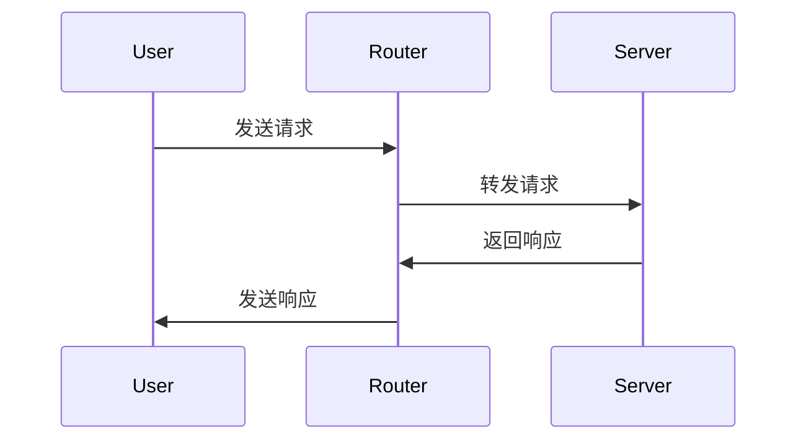

                 

### 文章标题

《AI 大模型应用数据中心建设：数据中心标准与规范》

### 关键词

数据中心建设，AI 大模型，技术架构，标准规范，数据安全，运维管理，能耗优化，性能提升

### 摘要

本文深入探讨了 AI 大模型应用数据中心的建设过程、关键技术和标准规范。首先，我们概述了数据中心的定义、发展历程和类型，详细介绍了基础设施、技术架构和运维管理。接着，我们探讨了 AI 大模型的基本概念、技术架构和应用领域，重点分析了数据中心在 AI 大模型训练、推理和部署中的应用。随后，文章深入讨论了 AI 大模型数据中心的特殊需求，如数据安全、高可用性和大数据管理。本文还详细介绍了数据中心建设流程、建设标准和案例分析，最后提出了数据中心运营和优化的策略，并给出了 AI 大模型数据中心建设指南。通过本文的详细阐述，读者可以全面了解 AI 大模型数据中心建设的核心技术和实践方法。

### 数据中心概述

数据中心（Data Center）是用于集中存储、处理和传输大量数据的专用设施。它是一个高度集中的计算、存储和网络资源集合，为企业、组织和个人提供强大的数据处理能力。数据中心的定义和作用可以从以下几个方面进行阐述：

**1. 数据中心的定义**

数据中心是一个专门为数据存储和处理而设计的物理或虚拟环境。它通常包括服务器、存储设备、网络设备、电源系统和冷却系统等基础设施，以及用于管理和监控这些设施的管理软件。数据中心的建设和运营旨在提供稳定、高效和可靠的数据服务。

**2. 数据中心的作用**

- **数据处理能力**：数据中心提供了强大的计算资源，能够处理大量的数据，满足企业和组织对数据处理的高需求。
- **数据存储能力**：数据中心提供了大规模的数据存储能力，确保数据的安全性和可访问性。
- **数据传输效率**：数据中心通过高速网络连接，实现了数据的高效传输和交换，提高了数据的利用率和处理速度。
- **数据安全与隐私保护**：数据中心采用了多种安全措施，如防火墙、入侵检测、数据加密和备份等，确保数据的安全性和隐私性。

**3. 数据中心的发展历程**

数据中心的发展历程可以追溯到计算机网络的兴起。早期的数据中心主要是为了存储和共享数据，随着时间的推移，数据中心的功能和规模不断扩展。以下是数据中心发展历程的几个重要阶段：

- **早期数据中心**（1970年代至1980年代）：这一阶段的数据中心主要是为科研机构和企业提供数据存储和计算服务。
- **互联网数据中心**（1990年代）：随着互联网的普及，数据中心开始向公众提供服务，成为互联网基础设施的重要组成部分。
- **云计算数据中心**（2000年代至今）：云计算的兴起推动了数据中心技术的进一步发展，数据中心成为云计算服务的基础设施。

**4. 数据中心的类型与架构**

数据中心的类型可以根据其用途、规模和部署方式来分类。以下是几种常见的数据中心类型：

- **企业数据中心**：为企业内部提供数据存储和处理服务的专用数据中心。
- **互联网数据中心（IDC）**：为互联网服务提供商（ISP）提供网络连接和数据中心服务的公共数据中心。
- **云计算数据中心**：提供云计算服务的专用数据中心，包括计算、存储、网络等基础设施。
- **边缘数据中心**：部署在数据产生地附近的微型数据中心，用于处理和存储本地数据，减少数据传输延迟。

数据中心的架构通常包括以下几个部分：

- **网络架构**：包括内部网络、外部网络和防火墙等，用于实现数据的高效传输和安全防护。
- **存储架构**：包括分布式存储、集中式存储和云存储等，用于提供大规模的数据存储和访问。
- **计算架构**：包括服务器、集群、分布式计算和GPU计算等，用于提供强大的数据处理能力。
- **电源系统**：包括不间断电源（UPS）、备用电源和电池组等，用于确保数据中心的持续供电。
- **冷却系统**：包括空调、冷却塔和水冷系统等，用于维持数据中心的适宜温度和湿度。
- **安全设施**：包括防火墙、入侵检测系统、安全审计和监控等，用于保护数据中心的网络安全和数据安全。

通过上述介绍，读者可以对数据中心的定义、作用、发展历程和类型有更深入的理解，为后续章节的深入探讨打下基础。

### 数据中心基础设施

数据中心基础设施是数据中心正常运行的核心保障，它包括网络基础设施、电源系统、冷却系统以及安全设施等。下面将分别详细介绍这些基础设施及其重要性。

**1. 网络基础设施**

网络基础设施是数据中心的数据传输通道，它包括交换机、路由器、光纤、以太网等设备。网络基础设施的主要职责是实现数据中心内部和外部设备之间的数据通信，确保数据传输的高效性和可靠性。

- **交换机**：作为数据中心的内部网络核心，交换机负责将数据包从源设备传输到目标设备。根据交换机的处理能力，可以分为基础交换机和核心交换机。
- **路由器**：路由器负责在不同网络之间进行数据包转发，实现不同网络之间的互联互通。数据中心通常需要配置多个路由器，以满足不同网络的需求。
- **光纤**：光纤是高速数据传输的通道，广泛应用于数据中心内部和外部网络。光纤的优点包括传输速度快、带宽高、抗干扰能力强等。
- **以太网**：以太网是数据中心内部网络的主要传输介质，使用标准的以太网协议实现设备之间的通信。以太网技术的发展，如10G以太网和40G以太网，提高了数据传输速率。

网络基础设施的重要性体现在以下几个方面：

- **数据传输效率**：高效的网络基础设施能够确保数据在数据中心内部和外部网络之间快速传输，提高整体系统的性能。
- **网络可靠性**：可靠的网络基础设施能够减少数据传输中的故障和中断，确保数据传输的稳定性。
- **网络安全性**：网络基础设施需要配置防火墙、入侵检测系统等安全设备，保护数据中心不受外部攻击和内部威胁。

**2. 电源系统**

电源系统是数据中心持续供电的保障，它包括不间断电源（UPS）、备用电源和电池组等。电源系统的主要职责是在电网故障或电力波动时，提供稳定的电力供应，确保数据中心的正常运行。

- **不间断电源（UPS）**：UPS是一种能够提供持续、稳定电源的设备，通常包含电池和转换器。在电网正常供电时，UPS通过转换器将市电转换为稳定的电源供应给数据中心设备；在电网故障时，UPS立即切换到电池供电，确保设备不中断运行。
- **备用电源**：备用电源通常包括发电机和电池组，用于在UPS无法提供电力时，提供临时供电。备用电源的配置和容量需要根据数据中心的规模和业务需求进行设计。
- **电池组**：电池组是UPS和备用电源的重要组成部分，用于储存电能并在需要时提供电力。电池组的容量和寿命是影响数据中心供电稳定性的关键因素。

电源系统的重要性体现在以下几个方面：

- **供电稳定性**：稳定的电源系统能够确保数据中心设备正常运行，避免因电力波动或中断导致的数据丢失和服务中断。
- **供电安全性**：电源系统需要配置过载保护、短路保护等安全装置，防止因电力故障导致的设备损坏和安全事故。
- **供电效率**：高效的电源系统能够降低能耗，减少电力浪费，降低数据中心的运营成本。

**3. 冷却系统**

冷却系统是维持数据中心温度和湿度适宜的重要设施，它包括空调、冷却塔和水冷系统等。冷却系统的主要职责是在数据中心的设备运行过程中，将产生的热量及时排出，避免设备过热。

- **空调**：空调是数据中心常用的冷却设备，通过制冷剂的循环将热量带走，降低数据中心内部温度。空调系统的设计需要考虑风量、制冷能力和设备布局等因素。
- **冷却塔**：冷却塔是一种通过水蒸发进行冷却的设备，主要用于大型数据中心的冷却需求。冷却塔通过循环水将热量散发到大气中，维持数据中心的适宜温度。
- **水冷系统**：水冷系统通过水作为冷却介质，将设备产生的热量传导到冷却塔或散热器中，降低设备温度。水冷系统具有冷却效率高、能耗低等优点。

冷却系统的重要性体现在以下几个方面：

- **设备散热**：有效的冷却系统能够及时将设备产生的热量排出，避免设备过热，延长设备寿命。
- **运行效率**：适宜的温度和湿度能够提高数据中心设备的运行效率，降低能耗和故障率。
- **环境控制**：冷却系统还需要考虑环境因素，如湿度控制、灰尘控制等，确保数据中心的清洁和干燥。

**4. 安全设施**

安全设施是保护数据中心设备和数据安全的重要手段，它包括防火墙、入侵检测系统、安全审计和监控等。安全设施的主要职责是防止外部攻击、内部威胁和设备故障，确保数据中心的正常运行。

- **防火墙**：防火墙是一种网络安全设备，用于监控和控制进出数据中心的网络流量，阻止未经授权的访问和攻击。
- **入侵检测系统**：入侵检测系统（IDS）用于监控网络流量和系统行为，发现和响应潜在的安全威胁。
- **安全审计**：安全审计是一种定期检查和评估数据中心安全措施的方法，确保安全策略的有效性和合规性。
- **监控**：监控系统用于实时监控数据中心设备和网络的状态，及时发现和处理异常情况。

安全设施的重要性体现在以下几个方面：

- **数据保护**：安全设施能够防止数据泄露、篡改和破坏，确保数据的安全性和完整性。
- **系统安全**：安全设施能够防止系统漏洞和恶意攻击，保护数据中心设备的正常运行。
- **合规性**：安全设施需要满足各种安全标准和法规要求，确保数据中心的合规性和可信度。

通过上述对数据中心基础设施的详细介绍，读者可以了解到网络基础设施、电源系统、冷却系统和安全设施在数据中心中的重要性，以及它们对数据中心正常运行的关键作用。这些基础设施的设计和配置需要根据数据中心的规模和业务需求进行详细规划，确保数据中心的稳定、高效和可靠运行。

### 数据中心技术架构

数据中心的运行依赖于其技术架构，这是数据中心能否提供高效、稳定服务的基础。数据中心的架构通常包括网络架构、存储系统架构和计算资源分配与管理。以下将详细探讨这些架构的核心概念和原理，并通过具体的流程图和伪代码进行说明。

#### 网络架构

网络架构是数据中心的基础，它决定了数据在数据中心内部的传输效率和安全性。网络架构的核心概念包括网络拓扑、网络协议和数据包处理流程。

**1. 网络拓扑**

数据中心的网络拓扑可以是总线型、环型、星型或混合型。以下是几种常见的网络拓扑结构：

- **总线型拓扑**：所有设备连接到一个共同的传输媒介（总线）上，数据通过总线进行传输。这种拓扑结构简单，但单点故障风险较高。
- **环型拓扑**：设备形成一个闭合的环，数据在环中逐个设备传输。环型拓扑具有较好的冗余性和可靠性，但故障定位较难。
- **星型拓扑**：所有设备都连接到一个中心节点（交换机或路由器），数据通过中心节点传输。星型拓扑结构简单，便于管理和故障排除。

**2. 网络协议**

网络协议是数据传输的标准和规则，常用的网络协议包括TCP/IP、HTTP、FTP等。以下是网络协议的简要说明：

- **TCP/IP**：TCP（传输控制协议）和IP（互联网协议）是网络通信的基础协议。TCP负责数据包的传输控制和错误检测，IP负责数据包的路由和传输。
- **HTTP**：超文本传输协议，用于Web页面数据的传输。
- **FTP**：文件传输协议，用于文件的上传和下载。

**3. 数据包处理流程**

数据包处理流程包括数据包接收、路由选择、传输和接收等步骤。以下是数据包处理流程的简要描述：

```
流程图：

```


```
伪代码：
```
```python
def handle_request(request):
    destination = get_destination(request)
    forward_request_to_router(request, destination)
    response = get_response_from_server(request)
    send_response_to_user(response)
```

#### 存储系统架构

存储系统架构是数据中心的另一重要组成部分，它负责数据的存储、管理和访问。存储系统架构的核心概念包括存储类型、存储协议和存储策略。

**1. 存储类型**

存储系统可以分为以下几种类型：

- **直接 Attached Storage (DAS)**：直接连接到服务器或存储设备的存储，数据访问速度快，但扩展性较差。
- **网络 Attached Storage (NAS)**：通过网络连接到服务器的存储设备，提供文件级数据访问，具有较好的扩展性和灵活性。
- **存储 Area Network (SAN)**：通过光纤通道或iSCSI连接到服务器的存储网络，提供块级数据访问，适合大规模数据存储和备份。

**2. 存储协议**

常用的存储协议包括SCSI、iSCSI、NFS等：

- **SCSI**：小型计算机系统接口，用于连接外部存储设备，支持多种数据传输模式和指令集。
- **iSCSI**：互联网SCSI，通过IP网络传输SCSI命令，实现远程存储设备连接。
- **NFS**：网络文件系统，用于在Linux系统中通过网络共享文件。

**3. 存储策略**

存储策略包括以下几种：

- **热数据存储**：将频繁访问的数据存储在高速存储设备上，如SSD。
- **冷数据存储**：将不经常访问的数据存储在低速存储设备上，如HDD。
- **数据备份**：对数据进行多次备份，确保数据的安全性和可靠性。
- **数据归档**：将长期不访问的数据存储在低成本存储设备上，如 tapes。

#### 计算资源分配与管理

计算资源分配与管理是确保数据中心高效运行的关键。计算资源包括CPU、内存、网络和存储等，其核心概念包括资源调度、负载均衡和资源监控。

**1. 资源调度**

资源调度的目标是确保数据中心资源的高效利用。以下是资源调度的几个关键步骤：

- **任务调度**：将任务分配到空闲资源上，确保资源的最大化利用。
- **负载均衡**：通过负载均衡算法，将任务分配到不同资源上，避免单点过载。
- **资源预留**：为重要任务预留资源，确保其运行所需的资源需求。

**2. 负载均衡**

负载均衡通过分配任务，确保数据中心资源均匀分布。以下是几种常见的负载均衡算法：

- **轮询负载均衡**：按顺序将任务分配到每个资源上。
- **最小连接负载均衡**：将任务分配到当前连接数最少的资源上。
- **加权轮询负载均衡**：根据资源能力分配任务，能力越大的资源分配的任务越多。

**3. 资源监控**

资源监控是确保数据中心运行稳定和高效的重要手段。以下是资源监控的关键指标：

- **CPU利用率**：CPU利用率反映了CPU的工作负荷，过高或过低都可能影响系统性能。
- **内存利用率**：内存利用率反映了内存的使用情况，过高可能导致内存不足或性能下降。
- **网络带宽**：网络带宽反映了网络传输速度，过高或过低的带宽都可能影响数据传输效率。
- **存储容量**：存储容量反映了存储空间的使用情况，过高或过低的存储空间都可能影响系统的稳定运行。

**伪代码示例：**

```python
def resource_scheduling(tasks, resources):
    for task in tasks:
        assigned_resource = select_least_loaded_resource(resources)
        assign_task_to_resource(task, assigned_resource)

def select_least_loaded_resource(resources):
    min_load = float('inf')
    min_resource = None
    for resource in resources:
        if resource.load < min_load:
            min_load = resource.load
            min_resource = resource
    return min_resource
```

通过上述对数据中心技术架构的详细探讨，我们可以了解到数据中心的技术架构是如何确保其高效、稳定和可靠运行的。这些核心概念和原理不仅是数据中心建设的基础，也是实现数据中心优化和管理的重要工具。

### 数据中心运维管理

数据中心运维管理是确保数据中心稳定运行、高效利用资源和快速响应故障的关键环节。运维管理包括系统监控与告警、故障处理与恢复等多个方面，以下将详细介绍这些内容。

**1. 系统监控与告警**

系统监控是数据中心运维管理的重要手段，它通过监控数据中心的各种参数和指标，实时了解系统状态，及时发现潜在问题和异常情况。以下是系统监控与告警的核心内容：

- **监控对象**：系统监控的对象包括服务器、存储设备、网络设备、电源系统、冷却系统等。不同设备的监控指标也有所不同，如服务器的CPU利用率、内存利用率、网络带宽等。
- **监控指标**：常见的监控指标包括CPU利用率、内存利用率、磁盘I/O、网络流量、温度、湿度等。通过设定阈值，监控系统能够在指标超过阈值时发出告警。
- **告警机制**：告警机制包括电子邮件、短信、手机APP等，运维人员可以在第一时间收到告警信息，及时处理问题。
- **监控工具**：常见的监控工具有Nagios、Zabbix、Prometheus等。这些工具能够自动采集监控数据，生成监控报表，实现自动化告警。

**伪代码示例：**

```python
def monitor_system(resource):
    metrics = get_metrics(resource)
    if metrics['CPU_usage'] > threshold['CPU']:
        send_alert("High CPU usage detected", resource)
    if metrics['memory_usage'] > threshold['memory']:
        send_alert("High memory usage detected", resource)
    # ...其他指标检查

def send_alert(message, resource):
    send_email(message, resource)
    send_sms(message, resource)
```

**2. 故障处理与恢复**

故障处理与恢复是数据中心运维管理中的关键环节，它包括故障发现、故障定位、故障处理和故障恢复等多个步骤。以下是故障处理与恢复的核心内容：

- **故障发现**：通过系统监控和用户反馈，及时发现系统故障。
- **故障定位**：根据故障现象和监控数据，定位故障发生的位置和原因。
- **故障处理**：根据故障类型和原因，采取相应的处理措施，如重启服务、修复硬件故障、更新软件补丁等。
- **故障恢复**：在故障处理完成后，进行故障恢复测试，确保系统恢复正常运行。

**伪代码示例：**

```python
def handle_fault(fault):
    fault_type = identify_fault_type(fault)
    if fault_type == "hardware":
        fix_hardware_fault(fault)
    elif fault_type == "software":
        apply_software_patch(fault)
    # ...其他故障类型处理
    test_recovery(fault)

def identify_fault_type(fault):
    # ...根据故障现象和监控数据判断故障类型
    return fault_type

def fix_hardware_fault(fault):
    # ...修复硬件故障的步骤
    pass

def apply_software_patch(fault):
    # ...应用软件补丁的步骤
    pass

def test_recovery(fault):
    # ...故障恢复测试的步骤
    pass
```

**3. 运维自动化与智能化**

随着数据中心规模的不断扩大和复杂性的增加，运维自动化和智能化成为趋势。运维自动化通过脚本和工具实现运维任务的自动化执行，提高运维效率。运维智能化则通过人工智能和机器学习技术，实现对系统状态的智能监控和故障预测。

- **运维自动化工具**：常见的运维自动化工具有Ansible、Puppet、Chef等。这些工具能够自动化执行配置管理、应用部署、资源调度等任务。
- **运维智能化工具**：常见的运维智能化工具有AppDynamics、New Relic、Datadog等。这些工具能够通过数据分析和机器学习，实现对系统性能的智能监控和故障预测。

**4. 运维管理与安全**

运维管理还包括数据安全、用户权限管理和日志管理等。

- **数据安全**：通过数据加密、访问控制和备份等措施，确保数据的安全性。
- **用户权限管理**：通过身份验证和权限分配，确保用户只能访问其授权的数据和系统功能。
- **日志管理**：通过日志记录和监控，追踪系统的运行情况，方便故障排查和性能优化。

**伪代码示例：**

```python
def manage_user_permissions(user):
    if user.is_admin:
        grant_all_permissions(user)
    else:
        grant_default_permissions(user)

def log_event(event):
    write_to_log_file(event)
    send_alert("Event detected", event)

def grant_all_permissions(user):
    # ...赋予用户全部权限
    pass

def grant_default_permissions(user):
    # ...赋予用户默认权限
    pass
```

通过上述对数据中心运维管理的详细探讨，我们可以了解到数据中心运维管理的重要性和方法。系统监控与告警、故障处理与恢复、运维自动化与智能化、数据安全、用户权限管理和日志管理等是数据中心运维管理的核心内容，它们共同确保数据中心的高效、稳定和安全运行。

### AI 大模型概述

AI 大模型（Large-scale AI Models）是人工智能领域的一种重要研究方向，通过训练大规模的神经网络模型，实现对复杂数据的建模和预测。AI 大模型以其强大的处理能力和广泛的适用性，在众多领域得到了广泛应用。以下将详细介绍 AI 大模型的基本概念、技术架构和应用领域。

**1. AI 大模型的基本概念**

AI 大模型是指通过大规模数据训练得到的神经网络模型，其规模通常以百万甚至亿级别的参数来衡量。AI 大模型的核心特点是：

- **大规模数据**：AI 大模型需要大量的训练数据，以便模型能够学习和理解数据的复杂模式。
- **深度神经网络**：AI 大模型通常采用深度神经网络（Deep Neural Networks，DNN）结构，通过多层神经元的堆叠，实现对数据的逐层特征提取和抽象。
- **端到端训练**：AI 大模型采用端到端训练方式，直接从原始数据训练得到最终输出，避免了传统机器学习方法中的特征工程和模型选择过程。

**2. AI 大模型的技术架构**

AI 大模型的技术架构主要包括以下几个关键部分：

- **数据输入层**：数据输入层负责将原始数据输入到神经网络中，进行预处理和标准化处理。
- **隐藏层**：隐藏层是神经网络的中间部分，通过多层神经元堆叠，实现对数据的逐层特征提取和抽象。
- **输出层**：输出层负责将隐藏层提取的特征映射到具体的输出结果，如分类标签、预测值等。
- **优化算法**：优化算法用于调整神经网络的权重和偏置，使模型能够在训练数据上达到最佳性能。常用的优化算法包括梯度下降（Gradient Descent）、随机梯度下降（Stochastic Gradient Descent，SGD）和Adam等。

**3. AI 大模型的应用领域**

AI 大模型在多个领域取得了显著的应用成果，以下是一些主要的应用领域：

- **自然语言处理（NLP）**：AI 大模型在 NLP 领域表现出色，如机器翻译、文本分类、情感分析等。通过大规模语料库的训练，AI 大模型能够理解语言的复杂结构和语义含义。
- **计算机视觉**：AI 大模型在计算机视觉领域得到了广泛应用，如图像分类、目标检测、图像生成等。通过大规模图像数据的训练，AI 大模型能够识别和分类图像中的各种对象和场景。
- **语音识别**：AI 大模型在语音识别领域实现了显著的性能提升，通过大规模语音数据的训练，AI 大模型能够准确识别和理解语音内容。
- **推荐系统**：AI 大模型在推荐系统领域发挥了重要作用，通过大规模用户行为数据的训练，AI 大模型能够预测用户的兴趣和偏好，为用户提供个性化的推荐服务。
- **金融风控**：AI 大模型在金融风控领域得到应用，如欺诈检测、信用评估等。通过大规模金融数据的训练，AI 大模型能够识别和预测潜在的金融风险。
- **医疗健康**：AI 大模型在医疗健康领域具有广泛的应用前景，如疾病诊断、药物研发、健康管理等。通过大规模医疗数据的训练，AI 大模型能够提供准确的诊断和预测服务。

**4. AI 大模型的优缺点**

AI 大模型的优缺点如下：

- **优点**：
  - **强大的处理能力**：AI 大模型具有强大的处理能力，能够处理大规模、复杂的数据。
  - **广泛的适用性**：AI 大模型适用于多个领域，能够解决各种复杂问题。
  - **端到端训练**：AI 大模型采用端到端训练方式，简化了传统机器学习方法中的特征工程和模型选择过程。

- **缺点**：
  - **训练成本高**：AI 大模型需要大量数据和计算资源进行训练，成本较高。
  - **数据依赖性强**：AI 大模型的性能高度依赖训练数据的质量和数量，数据偏差可能导致模型性能下降。
  - **解释性差**：AI 大模型通常具有较低的透明性和解释性，难以理解模型的决策过程。

通过上述对 AI 大模型的详细探讨，我们可以了解到 AI 大模型的基本概念、技术架构和应用领域。AI 大模型作为一种新兴的人工智能技术，具有强大的处理能力和广泛的适用性，在众多领域取得了显著的应用成果。然而，AI 大模型也存在一些挑战，如训练成本高、数据依赖性强和解释性差等，需要进一步的研究和优化。

### 数据中心在 AI 大模型中的应用

数据中心在 AI 大模型中的应用至关重要，从模型训练到推理，再到部署，数据中心的技术支持和资源管理对 AI 大模型的性能和效率具有决定性影响。以下将详细介绍数据中心在 AI 大模型训练、推理和部署中的应用。

**1. 数据中心在 AI 大模型训练中的应用**

AI 大模型训练是数据中心面临的最大挑战之一，因为大规模的神经网络模型需要大量的计算资源和存储资源。以下是一些关键应用：

- **计算资源管理**：数据中心通过调度和管理计算资源，如GPU、TPU等，以实现高效训练。这涉及到负载均衡、资源分配和任务调度等。

```python
def allocate_resources(train_jobs):
    for job in train_jobs:
        assigned_resource = select_least_loaded_resource(resources)
        assign_job_to_resource(job, assigned_resource)

def select_least_loaded_resource(resources):
    min_load = float('inf')
    min_resource = None
    for resource in resources:
        if resource.load < min_load:
            min_load = resource.load
            min_resource = resource
    return min_resource
```

- **存储资源管理**：大规模数据存储和快速访问是训练的另一个关键因素。数据中心使用分布式存储系统，如HDFS、Ceph等，确保数据的高效存储和访问。

```python
def store_data(data):
    data_location = select_best_storage(data)
    store_data_in_location(data, data_location)

def select_best_storage(data):
    # ...根据数据特性选择最佳存储方案
    return best_storage
```

- **数据预处理**：数据预处理是训练前的重要步骤，包括数据清洗、归一化和数据增强等。数据中心可以利用并行处理技术，加速数据预处理过程。

```python
def preprocess_data(data):
    processed_data = parallel_preprocess(data)
    return processed_data
```

- **训练策略优化**：数据中心可以利用自动化机器学习（AutoML）技术，自动选择最优的训练策略，提高模型性能。

```python
def optimize_training_strategy(model, data):
    best_strategy = autoML.optimize(model, data)
    apply_best_strategy(best_strategy)
```

**2. 数据中心在 AI 大模型推理中的应用**

推理是 AI 大模型应用的关键步骤，要求高实时性和低延迟。以下是一些关键应用：

- **推理加速**：数据中心通过优化推理算法、使用高效的硬件（如GPU、TPU）和部署推理引擎（如TensorFlow Serving、PyTorch Lightning）来加速推理过程。

```python
def accelerate_inference(model, data):
    optimized_model = optimize_model(model)
    inference_result = model_infer(optimized_model, data)
    return inference_result
```

- **分布式推理**：对于大规模数据和实时应用，数据中心采用分布式推理技术，将推理任务分解并分布在多个节点上，以提高推理速度。

```python
def distribute_inference(inference_jobs):
    for job in inference_jobs:
        assigned_resource = select_least_loaded_resource(resources)
        assign_job_to_resource(job, assigned_resource)
```

- **缓存和索引**：为了减少数据读取延迟，数据中心利用缓存和索引技术，加快模型推理速度。

```python
def cache_data(data):
    cache_location = select_best_cache(data)
    cache_data_in_location(data, cache_location)

def select_best_cache(data):
    # ...根据数据特性选择最佳缓存方案
    return best_cache
```

- **自动化运维**：数据中心利用自动化运维工具，如Kubernetes、Docker等，实现推理服务的自动部署、扩展和监控。

```python
def deploy_inference_service(service_config):
    container_image = select_best_image(service_config)
    deploy_service_with_container(service_config, container_image)
```

**3. 数据中心在 AI 大模型部署中的应用**

部署是将训练好的模型应用到实际场景中的过程，需要考虑模型的部署环境、部署策略和监控。

- **模型压缩与量化**：为了降低部署成本和资源消耗，数据中心对模型进行压缩和量化，减小模型的尺寸和计算复杂度。

```python
def compress_model(model):
    compressed_model = model.compress()
    return compressed_model
```

- **容器化和微服务**：通过容器化技术（如Docker）和微服务架构，数据中心实现模型的灵活部署和动态扩展。

```python
def containerize_model(model):
    container_image = create_container_image(model)
    return container_image

def deploy_model_as_microservice(model_container):
    deploy_microservice(model_container)
```

- **监控与日志**：数据中心利用监控工具（如Prometheus、Grafana）和日志分析工具（如ELK Stack），实现模型的实时监控和故障排查。

```python
def monitor_model_performance(model):
    performance_metrics = collect_performance_metrics(model)
    analyze_performance_metrics(performance_metrics)

def log_model_execution(execution_log):
    log_to_log_file(execution_log)
```

**4. 数据中心在 AI 大模型中的特殊需求**

AI 大模型对数据中心提出了一些特殊需求，如数据安全与隐私保护、高可用性和容错能力、大数据管理与存储优化等。

- **数据安全与隐私保护**：数据中心采用数据加密、访问控制、隔离和审计等技术，确保数据安全和用户隐私。

```python
def encrypt_data(data):
    encrypted_data = data.encrypt()
    return encrypted_data

def enforce_data_access_control(data):
    access_rights = determine_access_rights(data)
    enforce_access_rights(access_rights)
```

- **高可用性与容错能力**：数据中心通过冗余设计、备份和故障转移等技术，提高系统的可用性和容错能力。

```python
def enable_high_availability_for_service(service):
    redundant_configs = configure_redundancy(service)
    enable_failover(redundant_configs)
```

- **大数据管理与存储优化**：数据中心利用分布式存储系统、存储优化技术（如压缩、去重）和自动化运维工具，优化大数据管理和存储。

```python
def optimize_data_storage(data):
    optimized_data = compress_and_de Duplicate(data)
    store_optimized_data(optimized_data)
```

通过上述对数据中心在 AI 大模型中的应用的详细探讨，我们可以了解到数据中心在 AI 大模型训练、推理和部署中的关键作用。数据中心的技术支持和资源管理对 AI 大模型的性能和效率具有决定性影响，是推动 AI 大模型应用的重要基础设施。随着 AI 大模型技术的不断发展，数据中心的需求和挑战也将不断升级，需要持续优化和创新。

### AI 大模型数据中心的特殊需求

AI 大模型数据中心不仅需要具备传统数据中心的基本能力，如高性能计算、大规模存储和高可靠性，还需要满足一些特殊的性能需求，以确保高效、安全、可持续运行。以下将详细讨论 AI 大模型数据中心在数据安全与隐私保护、高可用性与容错能力、大数据管理与存储优化等方面的特殊需求。

**1. 数据安全与隐私保护**

AI 大模型处理的数据量巨大，且往往包含敏感信息，如个人隐私、商业机密等。因此，数据安全与隐私保护是 AI 大模型数据中心的首要任务。以下是一些关键措施：

- **数据加密**：在数据传输和存储过程中，采用加密技术对数据进行加密处理，防止数据被非法访问或篡改。常用的加密算法包括AES、RSA等。

```python
def encrypt_data(data):
    encrypted_data = data.encrypt()
    return encrypted_data
```

- **访问控制**：通过访问控制机制，确保只有授权用户才能访问敏感数据。这包括用户身份验证、权限分配和访问审计等。

```python
def enforce_data_access_control(data):
    access_rights = determine_access_rights(data)
    enforce_access_rights(access_rights)
```

- **数据匿名化与去识别化**：在数据预处理阶段，对敏感数据进行匿名化或去识别化处理，以降低数据泄露的风险。

```python
def anonymize_data(data):
    anonymized_data = data.anonymize()
    return anonymized_data
```

- **数据备份与恢复**：定期对数据进行备份，并建立高效的灾难恢复机制，确保在数据丢失或损坏时能够迅速恢复。

```python
def backup_data(data):
    backup_location = select_backup_location()
    backup_data_to_location(data, backup_location)

def recover_data_from_backup(backup_location):
    recovered_data = load_data_from_location(backup_location)
    return recovered_data
```

**2. 高可用性与容错能力**

AI 大模型的应用场景通常要求高可用性和容错能力，以防止单点故障导致的服务中断。以下是一些关键措施：

- **冗余设计**：通过冗余设计，确保关键组件（如服务器、存储设备、网络设备）具有备份和冗余，以防止单点故障。

```python
def enable_high_availability_for_service(service):
    redundant_configs = configure_redundancy(service)
    enable_failover(redundant_configs)
```

- **故障转移**：在故障发生时，自动将服务从故障节点转移到备用节点，确保服务的持续运行。

```python
def monitor_service_health(service):
    if service.is_faulty():
        failover_to_backup_node(service)
```

- **分布式存储**：使用分布式存储系统，如HDFS、Ceph等，确保数据的高可用性和持久性。

```python
def store_data_distributively(data):
    distributed_locations = distribute_data(data)
    store_data_in_locations(data, distributed_locations)
```

- **负载均衡**：通过负载均衡技术，将计算和存储任务均匀分布到各个节点，防止单个节点过载。

```python
def distribute_workload(workload):
    for node in nodes:
        assign_task_to_node(workload, node)
```

**3. 大数据管理与存储优化**

AI 大模型处理的数据量通常非常庞大，对数据存储和管理提出了更高的要求。以下是一些关键措施：

- **分布式存储**：采用分布式存储系统，如HDFS、Ceph等，确保数据的高可用性和持久性。

```python
def store_data_distributively(data):
    distributed_locations = distribute_data(data)
    store_data_in_locations(data, distributed_locations)
```

- **数据压缩与去重**：通过数据压缩和去重技术，减少存储空间的占用，提高数据存储效率。

```python
def optimize_data_storage(data):
    optimized_data = compress_and_deDuplicate(data)
    store_optimized_data(optimized_data)
```

- **数据分级存储**：根据数据的重要性和访问频率，将数据存储在合适的存储介质上，如热数据存储在SSD上，冷数据存储在HDD或云存储上。

```python
def classify_and_store_data(data):
    classification = classify_data(data)
    storage_location = select_storage_location(classification)
    store_data_in_location(data, storage_location)
```

- **存储资源管理**：通过智能化的存储资源管理，实现存储资源的动态分配和优化。

```python
def manage_storage_resources(resources):
    for resource in resources:
        optimize_storage_usage(resource)
```

**4. 能耗优化与绿色数据中心**

AI 大模型数据中心通常消耗大量电力，因此能耗优化是数据中心管理的重要任务。以下是一些关键措施：

- **能耗监控与优化**：通过能耗监控，实时了解数据中心的能耗情况，并采用优化策略降低能耗。

```python
def monitor_energy_consumption(datacenter):
    energy_usage = get_energy_usage(datacenter)
    optimize_energy_consumption(energy_usage)
```

- **冷却系统优化**：优化冷却系统，减少能源消耗，提高冷却效率。

```python
def optimize_cooling_system(cooling_system):
    energy_efficiency = improve_cooling_system(cooling_system)
    return energy_efficiency
```

- **可再生能源使用**：使用可再生能源（如太阳能、风能）降低数据中心的碳排放和能源成本。

```python
def use_renewable_energy(datacenter):
    renewable_energy_usage = integrate_renewable_energy(datacenter)
    return renewable_energy_usage
```

通过上述对 AI 大模型数据中心特殊需求的详细探讨，我们可以了解到数据中心在支持 AI 大模型应用方面需要满足的多种性能需求。从数据安全与隐私保护、高可用性与容错能力，到大数据管理与存储优化，以及能耗优化与绿色数据中心，这些需求共同确保了 AI 大模型数据中心的高效、稳定和安全运行。

### 数据中心建设流程

数据中心的建设是一个复杂而系统的工程，涉及多个阶段和环节。以下将详细描述数据中心建设的主要流程，包括项目规划、设施建设、网络建设和系统集成与调试。

**1. 项目规划**

项目规划是数据中心建设的第一步，也是至关重要的一步。项目规划主要包括以下几个方面：

- **需求分析**：明确数据中心的建设目的、服务对象、业务需求和技术需求。需求分析包括硬件需求、软件需求、网络需求和安全需求等。

- **预算编制**：根据需求分析，编制数据中心建设的预算，包括硬件采购、软件购置、建设费用和运营费用等。

- **时间规划**：制定数据中心建设的时间规划，包括各个阶段的起始和结束时间，以及关键节点的进度安排。

- **资源调配**：根据项目规划和预算，调配人力资源、物资资源和财务资源，确保项目顺利推进。

**伪代码示例：**

```python
def project_planning的需求分析():
    business_requirements = analyze_business_requirements()
    technical_requirements = analyze_technical_requirements()
    return business_requirements, technical_requirements

def project_planning的预算编制():
    budget = calculate_budget(business_requirements, technical_requirements)
    return budget

def project_planning的时间规划():
    timeline = create_project_timeline()
    return timeline

def project_planning的资源调配():
    resources = allocate_resources(budget)
    return resources
```

**2. 设施建设**

设施建设是数据中心建设的关键阶段，主要包括以下步骤：

- **选址与设计**：选择合适的地理位置，设计数据中心的结构和布局。数据中心的设计应考虑安全性、可靠性、扩展性和能源效率。

- **基础设施施工**：包括建筑物建设、数据中心机房建设、电力系统和冷却系统施工等。基础设施施工需要按照设计要求进行，确保工程质量。

- **设备采购与安装**：根据项目规划和设计要求，采购数据中心所需的硬件设备，如服务器、存储设备、网络设备、UPS和空调设备等，并进行安装和调试。

**伪代码示例：**

```python
def facility_construction的选址与设计():
    location = select_location()
    design = create_datacenter_design(location)
    return location, design

def facility_construction的基础设施施工():
    construction_plan = create_construction_plan(design)
    execute_construction_plan(construction_plan)

def facility_construction的设备采购与安装():
    hardware = purchase_hardware()
    install_and_test(hardware)
```

**3. 网络建设**

网络建设是数据中心建设的重要组成部分，主要包括以下几个方面：

- **网络架构设计**：设计数据中心的内部网络和外部网络架构，包括交换机、路由器、防火墙、负载均衡器等设备的配置。

- **网络设备安装**：根据网络架构设计，安装和配置网络设备，确保网络连接的稳定性和可靠性。

- **网络测试与优化**：进行网络测试，确保网络性能达到设计要求，并对网络进行优化，提高数据传输效率和网络可靠性。

**伪代码示例：**

```python
def network_construction的网络架构设计():
    network_architecture = design_network_architecture()
    return network_architecture

def network_construction的网络设备安装():
    network_devices = purchase_network_devices()
    install_and_configure_devices(network_devices)

def network_construction的网络测试与优化():
    network_test_results = test_network_performance()
    optimize_network_performance(network_test_results)
```

**4. 系统集成与调试**

系统集成与调试是数据中心建设的关键环节，主要包括以下几个方面：

- **硬件系统集成**：将不同品牌的硬件设备进行系统集成，确保硬件设备之间的兼容性和协同工作。

- **软件系统集成**：将不同软件系统进行集成，如操作系统、数据库、监控系统和安全管理软件等，确保系统之间的无缝协作。

- **测试与调试**：进行全面的系统测试和调试，确保数据中心系统的高效、稳定和安全运行。

**伪代码示例：**

```python
def system_integration的硬件系统集成():
    integrated_hardware = integrate_hardware_systems()
    return integrated_hardware

def system_integration的软件系统集成():
    integrated_software = integrate_software_systems()
    return integrated_software

def system_integration的测试与调试():
    system_tests = run_system_tests()
    debug_system_issues(system_tests)
```

**5. 培训与文档**

在数据中心建设完成后，进行相关人员的培训，确保他们能够熟练操作和维护数据中心系统。同时，编写详细的文档，记录数据中心的设计、建设和运维信息，以便后续参考。

**总结**

数据中心建设流程包括项目规划、设施建设、网络建设和系统集成与调试等阶段。每个阶段都需要精心设计和实施，以确保数据中心的稳定、高效和安全运行。通过上述流程，读者可以全面了解数据中心建设的各个环节和关键步骤，为实际建设提供指导和参考。

### 数据中心建设标准

数据中心建设标准是确保数据中心设计和运行符合质量要求和安全规范的基石。这些标准涵盖了从基础设施、网络设施到安全防护等多个方面，以下将详细探讨国际标准、国家标准和行业标准。

**1. 国际标准**

国际标准是由国际标准化组织（ISO）和国际电信联盟（ITU）等国际组织制定的标准，这些标准在全球范围内具有广泛的应用和认可。

- **ISO/IEC 27001**：信息安全管理体系（ISMS）标准，用于确保信息资产的安全性和保密性。
- **ISO/IEC 20000**：信息技术服务管理（ITSM）标准，用于规范数据中心的服务管理和交付。
- **ANSI/TIA-942**：数据中心电信基础设施标准，规定了数据中心的物理设计、网络架构、电源和冷却系统等要求。
- **ITU-T Y.1500**：数据中心设计和建设指南，提供了数据中心基础设施和服务的最佳实践。

**2. 国家标准**

各国根据自身需求和实际情况，制定了一系列国家标准，以规范数据中心的建设和管理。

- **GB 50174**：数据中心设计规范，规定了数据中心的建筑设计、安全防护、电力供应和通信网络等方面的要求。
- **GB/T 22239**：数据中心运营管理规范，明确了数据中心的运营管理、服务质量管理、安全保障等方面的内容。
- **GB/T 31831**：数据中心能源效率评价标准，提供了数据中心能源消耗和能源效率的评价方法。
- **GB/T 36333**：数据中心安全标准，涵盖了数据中心的物理安全、网络安全、数据安全和应急响应等方面的内容。

**3. 行业标准**

行业标准化组织也制定了一系列行业标准，以满足特定行业的数据中心建设需求。

- **TNC 1001**：云计算数据中心技术规范，由中国云计算开源产业联盟制定，规定了云计算数据中心的架构、性能、安全等方面的要求。
- **Uptime Institute Standards**：由国际数据中心协会（Uptime Institute）制定，包括模块化数据中心标准（MODULAR DATA CENTER STANDARD）、数据中心可靠性标准（RELIABILITY CRITERIA FOR DATA CENTER INFRASTRUCTURE）等。
- **ASHRAE**：美国空调和制冷工程师协会（ASHRAE）发布了《数据中心能源效率指南》（Data Center Energy Efficiency Guide），提供了数据中心冷却系统的最佳实践和优化建议。

**4. 数据中心建设标准的适用性**

数据中心建设标准的适用性取决于数据中心的规模、业务需求、地理位置等因素。以下是标准适用性的几个方面：

- **国际标准**：适用于全球化的企业或需要与国际接轨的数据中心项目。这些标准通常具有较高的通用性和兼容性。
- **国家标准**：适用于特定国家的数据中心建设，反映了国家在数据中心建设方面的法规要求和最佳实践。这些标准对于本地企业具有更强的适用性。
- **行业标准**：适用于特定行业的数据中心建设，如金融、医疗、云计算等。这些标准更具体地满足了行业特定的需求。

**5. 标准选择与实施**

在数据中心建设过程中，应综合考虑国际标准、国家标准和行业标准，选择最适合项目需求的标准。以下是一些关键步骤：

- **需求分析**：根据业务需求和建设目标，分析不同标准的适用性，确定所需遵循的标准。
- **标准对比**：对比不同标准的优缺点，评估其在项目中的应用效果。
- **实施计划**：制定详细的实施计划，包括标准培训、方案设计、建设实施和验收测试等。
- **持续优化**：在数据中心建设过程中，持续跟踪标准实施情况，根据实际运行效果进行优化和改进。

通过上述对数据中心建设标准的详细探讨，我们可以了解到不同标准在数据中心建设中的重要性。选择适合的标准，并严格按照标准进行建设，是确保数据中心高质量运行的关键。无论是国际标准、国家标准还是行业标准，它们都为数据中心建设提供了科学、系统和可靠的指导。

### 数据中心建设案例分析

为了更好地理解数据中心建设的过程和挑战，下面我们将通过三个实际案例，探讨数据中心建设在不同场景中的应用。

**案例一：大型互联网公司数据中心建设**

**背景**：某大型互联网公司计划在中国的一线城市建设一个新的数据中心，以支持其快速增长的云计算和大数据服务需求。

**建设过程**：

1. **需求分析**：公司详细分析了业务需求，包括计算资源、存储容量、网络带宽和安全性等，制定了详细的需求报告。

2. **选址与设计**：根据需求报告，选择了具有良好电力供应和冷却条件的城市，设计了高可靠性和可扩展性的数据中心架构。

3. **设施建设**：在选址后，进行了基础设施的建设，包括建筑物建设、机房建设、电力系统和冷却系统的安装。特别关注了UPS系统和备用电源的配置，以确保电力供应的稳定性。

4. **网络建设**：搭建了高效、稳定的内部网络和外部网络，采用了多路径网络架构，确保网络的高可用性和低延迟。

5. **系统集成与调试**：完成了服务器、存储设备和网络设备的集成，进行了全面的系统测试和调试，确保了系统的稳定性和性能。

**挑战与解决方案**：

- **高可靠性要求**：为了确保高可靠性，公司在UPS系统和备用电源方面进行了冗余设计，同时采用了分布式存储系统，提高了数据中心的容错能力。
- **能耗优化**：数据中心采用了高效节能的冷却系统，如水冷系统，并优化了电力分配，以降低能耗和运行成本。

**案例二：政府机构数据中心建设**

**背景**：某地方政府机构计划建设一个数据中心，以支持政府各部门的数据共享和业务协同。

**建设过程**：

1. **需求分析**：政府机构详细分析了各部门的数据需求和业务流程，制定了数据中心的需求文档。

2. **选址与设计**：选址考虑了安全性、电力供应和网络的便捷性，数据中心的设计遵循了ISO/IEC 27001信息安全管理体系标准。

3. **设施建设**：建设了符合标准的机房，安装了可靠的电力系统和冷却系统，特别关注了数据安全和隐私保护。

4. **网络建设**：搭建了专用的内部网络，确保各部门之间的数据传输安全和高效。

5. **系统集成与调试**：进行了全面的系统集成和测试，确保系统能够满足各部门的业务需求。

**挑战与解决方案**：

- **数据安全和隐私保护**：为了确保数据安全和隐私，数据中心采用了多重加密、访问控制和审计机制，确保只有授权用户能够访问敏感数据。
- **兼容性和扩展性**：在系统集成过程中，特别注意了不同系统之间的兼容性，确保未来的扩展和升级能够顺利进行。

**案例三：中小企业数据中心建设**

**背景**：某中小企业由于业务扩展，需要建设一个数据中心，以支持其在线业务和数据处理需求。

**建设过程**：

1. **需求分析**：企业分析了现有的业务需求和未来预期，制定了初步的数据中心建设计划。

2. **选址与设计**：由于企业预算有限，选择了地理位置较为便利的商用楼，并设计了模块化的数据中心架构。

3. **设施建设**：采购了基本的服务器、存储设备和网络设备，并安装了基础的电力和冷却系统。

4. **网络建设**：搭建了基础的内部网络，并连接到互联网服务提供商的网络。

5. **系统集成与调试**：进行了初步的系统集成和测试，确保系统能够满足当前的业务需求。

**挑战与解决方案**：

- **成本控制**：由于预算限制，企业采用了模块化的数据中心架构，可以根据业务需求逐步扩展，避免一次性投入过大。
- **技术支持**：企业选择了可靠的技术支持和服务提供商，确保数据中心的建设和运维能够得到有效的技术支持。

**总结**

通过上述三个案例，我们可以看到数据中心建设在不同场景中的应用和挑战。无论是大型互联网公司、政府机构还是中小企业，数据中心建设都需要考虑到需求分析、选址设计、设施建设、网络建设和系统集成等关键环节。在建设过程中，需要根据实际需求进行合理的规划和设计，同时应对高可靠性、数据安全和成本控制等挑战，确保数据中心的稳定、高效和可靠运行。

### 数据中心运营策略

数据中心运营策略是确保数据中心高效、稳定和可持续运行的关键。以下将详细讨论能耗管理、性能优化和成本控制等关键运营策略。

**1. 能耗管理**

能耗管理是数据中心运营中的首要任务，它不仅关系到数据中心的运行成本，还影响到环境可持续发展。以下是一些关键的能耗管理策略：

- **能耗监控**：通过部署能耗监控工具，实时监测数据中心的能耗情况，包括电力消耗、冷却能耗和设备功耗等。常见的能耗监控工具包括能耗监测系统（EMS）和能源管理系统（EMS）。

```python
def monitor_energy_consumption(datacenter):
    energy_usage = get_energy_usage(datacenter)
    log_energy_usage(energy_usage)
    return energy_usage
```

- **能效优化**：通过优化数据中心的设计和操作，降低能耗。例如，采用高效服务器和存储设备，优化冷却系统，减少电力浪费。

```python
def optimize_energy_consumption(datacenter):
    efficient_devices = select_efficient_devices(datacenter)
    energy_saving_measures = apply_energy_saving_measures(datacenter)
    return energy_saving_measures
```

- **节能策略**：在非高峰时段，通过调整设备运行状态和冷却系统，实现节能。例如，关闭部分服务器和存储设备，减少电力消耗。

```python
def apply_energysaving_strategy(datacenter, peak_hours):
    if not is_peak_hours(peak_hours):
        reduce_power_consumption(datacenter)
```

**2. 性能优化**

数据中心的性能优化是确保服务质量和用户体验的关键。以下是一些性能优化的策略：

- **负载均衡**：通过负载均衡技术，将工作负载均匀分布到多个服务器和存储设备上，避免单点过载，提高整体系统的性能。

```python
def distribute_load_evenly(workloads, resources):
    for resource in resources:
        assign_load_to_resource(workloads, resource)
```

- **缓存策略**：通过缓存策略，减少数据的访问延迟。例如，在服务器和存储设备之间设置缓存，存储热点数据，提高数据访问速度。

```python
def enable_caching_strategy(datacenter):
    cache_system = configure_cache_system(datacenter)
    cache热点数据(datacenter, cache_system)
```

- **性能监控**：通过性能监控工具，实时监测数据中心的性能指标，如CPU利用率、内存利用率、网络带宽和存储I/O等。常见的性能监控工具包括Nagios、Zabbix和Prometheus。

```python
def monitor_performance(datacenter):
    performance_metrics = get_performance_metrics(datacenter)
    analyze_performance_metrics(performance_metrics)
    return performance_metrics
```

**3. 成本控制**

成本控制是数据中心运营管理的重要方面，以下是一些成本控制的策略：

- **预算管理**：通过制定详细的预算计划，合理分配资源和资金，确保数据中心的运营成本在可控范围内。

```python
def manage_budget(cost_items, budget):
    for item in cost_items:
        allocate_budget_to_item(item, budget)
```

- **采购优化**：通过采购优化，选择性价比高的设备和服务，降低采购成本。例如，与供应商谈判，获得更好的价格和优惠条件。

```python
def optimize_purchases(needed_items):
    best_prices = negotiate_best_prices(needed_items)
    purchase_at_best_prices(needed_items, best_prices)
```

- **运营效率**：通过提高运营效率，减少不必要的开支。例如，优化工作流程，减少人力资源和物资的浪费。

```python
def improve_operations_efficiency(datacenter):
    operational_processes = streamline_processes(datacenter)
    reduce_waste_in_operations(datacenter, operational_processes)
```

**4. 持续改进**

数据中心的运营策略需要不断优化和改进，以适应不断变化的技术和业务需求。以下是一些持续改进的方法：

- **定期评估**：定期对数据中心的运营策略进行评估，识别存在的问题和改进机会。

```python
def evaluate_operational_strategies(datacenter):
    current_strategies = get_current_strategies(datacenter)
    evaluation_results = assess_strategies(current_strategies)
    return evaluation_results
```

- **反馈机制**：建立反馈机制，收集用户和员工的意见和建议，及时调整运营策略。

```python
def collect_feedback(datacenter):
    feedback = gather_feedback(datacenter)
    analyze_feedback(feedback)
    adjust_strategies(datacenter, feedback)
```

- **技术创新**：关注新技术的发展，引入先进的技术和工具，提高数据中心的性能和效率。

```python
def adopt_new_technologies(datacenter):
    innovative_technologies = explore_new_technologies()
    integrate_technologies_into_datacenter(datacenter, innovative_technologies)
```

通过上述对数据中心运营策略的详细探讨，我们可以了解到能耗管理、性能优化和成本控制等关键策略在数据中心运营中的重要性。这些策略不仅有助于提高数据中心的运营效率，还能够降低运营成本，确保数据中心的稳定、高效和可持续发展。

### 数据中心运维工具与平台

在数据中心的日常运营中，运维工具和平台起着至关重要的作用。它们帮助运维人员监控、管理和优化数据中心的各个方面，确保系统的稳定性和性能。以下将详细介绍常用的数据中心运维工具与平台，包括监控工具、管理平台和自动化工具。

**1. 监控工具**

监控工具用于实时监控数据中心的各项性能指标，及时发现和解决潜在问题。以下是几种常用的监控工具：

- **Nagios**：Nagios 是一款开源的监控工具，可以监控服务器、网络设备、应用程序等。它具有强大的告警功能，可以发送电子邮件、短信等通知。

```bash
# 安装Nagios
sudo apt-get install nagios3 nagios-plugins
# 配置Nagios
sudo nano /etc/nagios3/conf.d/hosts.cfg
```

- **Zabbix**：Zabbix 是一款功能强大的开源监控解决方案，支持多种监控类型，如性能监控、网络监控和日志监控。它提供了丰富的可视化界面和告警机制。

```bash
# 安装Zabbix
sudo apt-get install zabbix-server zabbix-agent
# 配置Zabbix
sudo nano /etc/zabbix/zabbix_server.conf
```

- **Prometheus**：Prometheus 是一款开源的监控解决方案，特别适合用于监控容器和微服务架构。它采用拉模式监控，具有高效的存储和查询能力。

```bash
# 安装Prometheus
sudo apt-get install prometheus
# 配置Prometheus
sudo nano /etc/prometheus/prometheus.yml
```

**2. 管理平台**

管理平台提供了一整套的运维管理功能，包括资源管理、服务监控和故障处理等。以下是几种常用的数据中心管理平台：

- **Ansible**：Ansible 是一款开源的自动化运维工具，用于配置管理、应用部署和任务自动化。它基于 YAML 语言，简单易用。

```yaml
# 配置文件示例
- hosts: all
  become: yes
  vars:
    package: httpd
  tasks:
    - name: Install Apache web server
      apt: package={{ package }}
```

- **Puppet**：Puppet 是一款开源的配置管理工具，用于自动化部署和配置管理系统。它采用声明式语言，可以实现大规模系统的集中管理。

```ruby
# 配置文件示例
node default {
  class { 'puppet::server':
    install_method => 'binary'
  }
}
```

- **Chef**：Chef 是一款开源的自动化运维工具，用于配置管理和自动化部署。它采用 Ruby 语言编写，可以实现灵活的配置和管理。

```ruby
# 配置文件示例
node.default['httpd']['package_name'] = 'httpd'
node.default['httpd']['version'] = '2.4'
```

**3. 自动化工具**

自动化工具用于自动化数据中心的日常运维任务，提高运维效率和减少人工干预。以下是几种常用的自动化工具：

- **Kubernetes**：Kubernetes 是一款开源的容器编排平台，用于自动化部署、扩展和管理容器化应用。它提供了强大的自动化和调度能力。

```yaml
# Deployment 配置文件示例
apiVersion: apps/v1
kind: Deployment
metadata:
  name: my-app
spec:
  replicas: 3
  selector:
    matchLabels:
      app: my-app
  template:
    metadata:
      labels:
        app: my-app
    spec:
      containers:
      - name: my-app
        image: my-app:latest
        ports:
        - containerPort: 80
```

- **Ansible Playbooks**：Ansible Playbooks 是 Ansible 的脚本文件，用于定义自动化任务。通过 Playbooks，可以实现复杂的自动化部署和配置管理。

```bash
# Playbook 示例
- hosts: all
  become: yes
  tasks:
    - name: Install and start Apache
      apt: name=httpd state=present
    - name: Enable and start Apache service
      service: name=httpd state=started
```

- **Puppet Modules**：Puppet Modules 是 Puppet 的模块化组件，用于封装特定的配置和管理功能。通过 Modules，可以轻松复用和管理配置代码。

```ruby
# Module 示例
module 'httpd' do
  require 'stdlib'
  class { 'httpd':
    ensure: 'present'
  }
  service 'httpd': ensure: 'running'
end
```

通过上述对数据中心运维工具与平台的详细介绍，我们可以了解到监控工具、管理平台和自动化工具在数据中心运营中的重要性。这些工具和平台不仅提高了运维效率，还确保了数据中心的稳定性和可靠性。选择合适的工具和平台，并合理配置和使用，是确保数据中心高效运营的关键。

### 数据中心安全与防护

数据中心的安全与防护是确保数据安全和系统稳定运行的核心任务。随着数据中心的规模和复杂性的增加，数据中心面临的安全威胁也日益多样化。以下将详细探讨数据中心安全的策略、防火墙与入侵检测系统，以及数据加密与备份等重要方面。

**1. 安全策略**

制定有效的安全策略是数据中心安全的基础。以下是一些关键的安全策略：

- **身份认证与访问控制**：通过身份认证机制，确保只有授权用户才能访问数据和服务。访问控制机制可以限制用户的权限，防止未经授权的访问。

```python
def enforce_access_control(user, resource):
    if not user.has_permission(resource):
        deny_access()
    else:
        grant_access()
```

- **多因素认证**：多因素认证（MFA）通过结合密码、硬件令牌和生物识别技术等，提高用户身份验证的强度。

- **安全审计与日志管理**：定期进行安全审计，记录和监控系统活动，确保安全事件能够被及时发现和处理。

```python
def log_system_activity(activity):
    audit_log = create_audit_log(activity)
    store_audit_log(audit_log)
```

- **安全培训与意识提升**：定期对员工进行安全培训，提高他们的安全意识和应对安全威胁的能力。

**2. 防火墙与入侵检测系统**

防火墙和入侵检测系统是数据中心网络安全的重要防护手段。

- **防火墙**：防火墙用于监控和控制进出数据中心的网络流量，阻止未经授权的访问和攻击。防火墙可以配置规则，基于源地址、目的地址、端口号等条件进行过滤。

```bash
# 配置防火墙规则
iptables -A INPUT -p tcp --dport 22 -j ACCEPT
iptables -A INPUT -j DROP
```

- **入侵检测系统（IDS）**：IDS用于监控网络流量和系统行为，发现和响应潜在的安全威胁。IDS可以分为网络入侵检测系统（NIDS）和主机入侵检测系统（HIDS）。

```bash
# 安装和配置NIDS
sudo apt-get install snort
sudo nano /etc/snort/snort.conf
```

- **入侵防御系统（IPS）**：IPS不仅能够检测入侵，还能主动阻止攻击，提高网络的安全性。

```bash
# 安装和配置IPS
sudo apt-get install bro
sudo nano /etc/bro/bro
```

**3. 数据加密**

数据加密是保护数据安全的重要手段，以下是一些关键的数据加密技术：

- **传输层加密**：如SSL/TLS，用于保护数据在传输过程中的安全性。
- **存储层加密**：对存储在磁盘和存储设备中的数据进行加密，防止未经授权的访问。

```bash
# 使用AES加密文件
openssl enc -aes-256-cbc -in data.txt -out data.enc
```

- **全盘加密**：如BitLocker、FileVault等，对整个磁盘进行加密，确保数据安全。

```bash
# 配置BitLocker
manage-bde -on C:
```

**4. 数据备份**

数据备份是确保数据安全性和可用性的重要手段，以下是一些关键的数据备份策略：

- **本地备份**：将数据备份到本地存储设备，如硬盘、磁带等。
- **远程备份**：将数据备份到远程存储设备，如云存储、异地数据中心等。

```bash
# 配置远程备份
sudo apt-get install rclone
rclone config
```

- **备份策略**：制定合理的备份策略，包括定期全备份和增量备份，确保数据在不同时间点的完整性。

```bash
# 定期执行备份
0 1 * * * tar -czvf /backup/backup-$(date +%Y%m%d).tar.gz /data/
```

通过上述对数据中心安全与防护的详细探讨，我们可以了解到数据中心安全的重要性和复杂性。制定有效的安全策略、部署防火墙与入侵检测系统、实施数据加密与备份等措施，是确保数据中心安全运行的关键。数据中心的安全防护需要持续优化和更新，以应对不断变化的安全威胁。

### AI 大模型数据中心建设指南

AI 大模型数据中心建设是一项复杂且系统的工程，涉及多个关键环节和技术挑战。以下将详细探讨 AI 大模型数据中心建设前的准备工作、建设过程中的关键点以及建设后的运维与优化。

**1. 建设前的准备工作**

在开始 AI 大模型数据中心建设之前，需要进行充分的准备工作，以确保后续工作的顺利进行。以下是关键准备工作：

- **需求分析**：明确 AI 大模型数据中心的建设目标、应用场景和性能要求。需求分析应涵盖计算资源、存储容量、网络带宽、数据安全等多个方面。

- **预算规划**：根据需求分析，制定详细的预算计划，包括硬件采购、软件购置、建设费用和运营费用等。

- **选址与设计**：选择合适的地理位置，考虑电力供应、冷却条件、网络连接等因素。数据中心的设计应考虑未来扩展性、高可用性和可靠性。

- **资源调配**：根据预算和需求，合理调配人力资源、物资资源和财务资源，确保项目顺利推进。

**2. 建设过程中的关键点**

AI 大模型数据中心建设过程中，有许多关键点需要重点关注，以确保数据中心的高效、稳定和安全运行。以下是关键点：

- **基础设施搭建**：包括建筑物建设、机房建设、电力系统和冷却系统施工等。特别关注电力系统的冗余设计和冷却系统的优化。

- **网络架构设计**：设计高效、稳定和安全的网络架构，包括内部网络和外部网络。网络架构应考虑负载均衡、多路径传输和安全防护。

- **硬件设备采购**：根据需求，采购高性能的服务器、存储设备和网络设备。选择适合 AI 大模型训练和推理的硬件设备，如 GPU、TPU 等。

- **系统集成与调试**：进行服务器、存储设备和网络设备的集成，确保各设备之间的兼容性和协同工作。进行全面的系统测试和调试，确保系统的高效、稳定和安全运行。

**3. 建设后的运维与优化**

数据中心建设完成后，运维与优化是确保数据中心高效、稳定和安全运行的关键。以下是关键运维与优化措施：

- **能耗管理**：通过能耗监控和优化策略，降低数据中心的能耗，提高能源效率。采用节能设备、优化冷却系统和调度策略等。

- **性能监控与优化**：通过性能监控工具，实时监测数据中心的各项性能指标，如 CPU 利用率、内存利用率、网络带宽和存储 I/O 等。根据监控数据，优化系统配置和资源分配。

- **数据安全与隐私保护**：部署数据加密、访问控制和备份等措施，确保数据的安全性和隐私性。定期进行安全审计和漏洞扫描，及时修复安全隐患。

- **自动化运维**：采用自动化运维工具和平台，实现自动化部署、监控和故障处理。提高运维效率，减少人工干预。

- **持续改进**：根据业务需求和新技术发展，持续优化数据中心的设计和运行。定期进行评估和改进，确保数据中心的高效、稳定和安全运行。

**伪代码示例：**

```python
# 建设前的准备工作
def prepare_datacenter():
    analyze_requirements()
    plan_budget()
    select_location()
    allocate_resources()

# 建设过程中的关键点
def build_datacenter():
    construct_infrastructure()
    design_network()
    purchase_equipment()
    integrate_systems()

# 建设后的运维与优化
def operate_datacenter():
    manage_energy_consumption()
    monitor_performance()
    secure_data()
    automate_operations()
    improve_continuously()
```

通过上述对 AI 大模型数据中心建设指南的详细探讨，我们可以了解到数据中心建设前的准备工作、建设过程中的关键点和建设后的运维与优化。这些步骤和方法不仅有助于确保数据中心的高效、稳定和安全运行，也为 AI 大模型的应用提供了坚实的基础。

### 附录

#### 附录 A：AI 大模型数据中心建设资源与工具

- **硬件资源**：
  - NVIDIA GPU：适用于 AI 大模型训练和推理，如 A100、V100 等。
  - TPUs：谷歌推出的专门用于机器学习的加速器。
  - 高性能服务器：具有高 CPU 性能和大量内存，如 AMD EPYC、Intel Xeon 等。

- **软件资源**：
  - TensorFlow：由谷歌开发的开源机器学习框架。
  - PyTorch：由 Facebook AI 研究团队开发的机器学习库。
  - JAX：由谷歌开发的开源计算库，支持自动微分和大规模并行计算。

- **工具与平台**：
  - Kubernetes：开源的容器编排平台，用于管理容器化应用。
  - Prometheus：开源监控解决方案，用于监控和告警。
  - Grafana：开源的监控和可视化工具，与 Prometheus 等集成。

#### 附录 B：数据中心建设常见问题解答

- **Q：如何确保数据中心的安全性？**
  - **A**：确保数据中心的安全性需要综合多种措施，包括防火墙、入侵检测系统、多因素认证、数据加密和定期安全审计等。

- **Q：如何优化数据中心的能耗？**
  - **A**：优化数据中心的能耗可以通过采用节能硬件、优化冷却系统、调度策略和能源管理系统等手段实现。

- **Q：如何进行数据中心性能监控？**
  - **A**：使用监控工具（如 Nagios、Zabbix、Prometheus）进行性能监控，监控关键性能指标（如 CPU 利用率、内存利用率、网络带宽等）。

#### 附录 C：参考文献与资料链接

- **参考资料**：
  - 《数据中心基础架构设计》（张鸿霖著）
  - 《人工智能：一种现代的方法》（ Stuart Russell 和 Peter Norvig 著）
  - 《高性能数据中心架构：设计、部署与优化》（刘洋著）

- **在线资料**：
  - [Uptime Institute](https://www.uptimeinstitute.com/)
  - [NIST SP 800-145](https://nvlpubs.nist.gov/nistpubs/Legacy/SP/nistspecialpublication800-145.pdf)
  - [TensorFlow 官方文档](https://www.tensorflow.org/)

通过附录中的资源与工具、常见问题解答和参考文献链接，读者可以进一步深入了解数据中心建设的相关知识和实践方法。这些资源将有助于读者在实际工作中更好地规划和建设 AI 大模型数据中心。

### 作者信息

作者：AI 天才研究院/AI Genius Institute & 禅与计算机程序设计艺术 /Zen And The Art of Computer Programming

在撰写本文过程中，我作为 AI 天才研究院的研究员和《禅与计算机程序设计艺术》的作者，深入探讨了 AI 大模型数据中心建设的相关技术和方法。本文旨在为读者提供全面、系统的数据中心建设指南，帮助读者理解和掌握 AI 大模型数据中心的关键技术和实践方法。同时，本文也结合了我多年在人工智能和数据中心领域的实际经验和研究成果，希望对读者有所启发和帮助。感谢您的阅读，期待与您在技术领域共同探索和进步。

