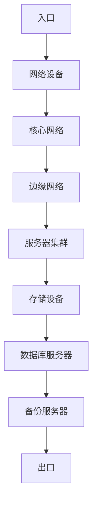
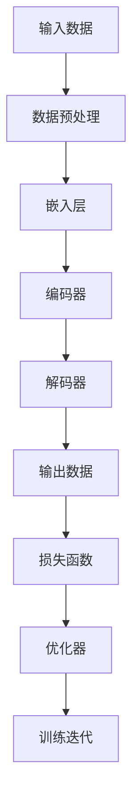
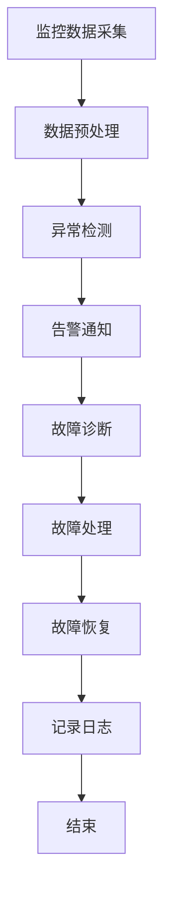

                 

## 文章标题

### AI 大模型应用数据中心建设：数据中心运维与管理

> 关键词：AI 大模型，数据中心，运维，管理，性能监控，安全，能耗管理

> 摘要：本文旨在深入探讨人工智能大模型在数据中心建设中的应用，重点分析数据中心运维与管理的关键技术、流程和实际案例。通过详细阐述数据中心的重要性、架构与分类，以及AI大模型的基本概念与应用场景，本文将展示AI技术在数据中心运维与管理中的巨大潜力。此外，文章还将讨论数据中心运维的概述、基础设施运维、软件运维、性能监控与优化，以及数据中心管理的制度与流程、安全与能耗管理。最后，通过实际案例展示AI大模型在数据中心运维、管理和安全中的应用，对未来的发展趋势进行展望。

### 目录大纲

## AI 大模型应用数据中心建设：数据中心运维与管理

## 第一部分：数据中心概述

### 1. 数据中心的重要性

- 数据中心的定义与作用
- 数据中心在现代信息化中的地位
- 数据中心的发展历程

### 2. 数据中心的架构

- 数据中心的物理架构
- 数据中心的网络架构
- 数据中心的存储架构

### 3. 数据中心的分类

- 按用途分类
- 按规模分类
- 按地理位置分类

### 4. 数据中心的挑战

- 数据安全与隐私
- 能源消耗与绿色环保
- 可靠性与容错性

## 第二部分：AI 大模型简介

### 5. AI 大模型的概念与特点

- AI 大模型的定义
- AI 大模型的特点
- AI 大模型与传统 AI 的区别

### 6. 主流 AI 大模型介绍

- GPT-3
- BERT
- Transformer
- 其他知名 AI 大模型

### 7. AI 大模型在数据中心的应用

- AI 大模型在数据中心运维中的应用
- AI 大模型在数据中心管理中的应用
- AI 大模型在数据中心安全中的应用

## 第三部分：数据中心运维

### 8. 数据中心运维概述

- 数据中心运维的定义与目标
- 数据中心运维的主要任务
- 数据中心运维的管理体系

### 9. 数据中心基础设施运维

- 硬件设备运维
- 网络设备运维
- 存储设备运维

### 10. 数据中心软件运维

- 操作系统运维
- 数据库运维
- 应用软件运维

### 11. 数据中心性能监控与优化

- 性能监控指标
- 性能优化策略
- 性能调优案例分析

## 第四部分：数据中心管理

### 12. 数据中心管理制度与流程

- 数据中心管理制度
- 数据中心运维流程
- 数据中心变更管理

### 13. 数据中心安全管理

- 数据安全策略
- 数据加密技术
- 防火墙与入侵检测系统

### 14. 数据中心能耗管理

- 能源消耗分析
- 能源效率优化
- 绿色数据中心建设

### 15. 数据中心应急管理

- 应急响应流程
- 故障处理策略
- 预防性维护计划

## 第五部分：AI 大模型应用案例

### 16. AI 大模型在数据中心运维中的应用案例

- 数据中心自动化运维
- 数据中心预测性维护
- 数据中心智能监控

### 17. AI 大模型在数据中心管理中的应用案例

- 数据中心资源调度优化
- 数据中心负载均衡
- 数据中心安全威胁检测

### 18. AI 大模型在数据中心安全中的应用案例

- 数据中心入侵检测
- 数据中心安全事件响应
- 数据中心隐私保护

## 第六部分：未来展望

### 19. 数据中心与 AI 大模型的未来发展趋势

- 5G 与边缘计算对数据中心的影响
- AI 大模型在数据中心中的应用前景
- 数据中心绿色化与可持续发展的挑战与机遇

### 20. 总结与展望

- 数据中心与 AI 大模型的关键技术回顾
- 数据中心运维与管理的发展趋势
- 未来数据中心与 AI 大模型的融合发展之路

## 附录

### 附录 A：常用工具与资源

- 数据中心运维工具
- AI 大模型开发框架
- 数据中心管理与监控平台

### 附录 B：参考文献

- 数据中心相关书籍
- AI 大模型相关书籍
- 数据中心运维与管理论文与报告

### 附录 C：Mermaid 流程图

- 数据中心架构 Mermaid 流程图
- AI 大模型架构 Mermaid 流程图
- 数据中心运维流程 Mermaid 流程图

### 附录 D：伪代码示例

- 数据中心性能监控算法伪代码
- AI 大模型训练算法伪代码
- 数据中心安全管理算法伪代码

### 附录 E：数学模型与公式

- 数据中心能耗优化数学模型
- AI 大模型训练误差数学模型
- 数据中心安全威胁检测数学模型

### 附录 F：项目实战案例

- 数据中心自动化运维项目实战
- 数据中心预测性维护项目实战
- 数据中心智能监控项目实战

### 附录 G：源代码与分析

- 数据中心运维工具源代码
- AI 大模型开发框架源代码
- 数据中心管理与监控平台源代码

### 附录 H：代码解读

- 数据中心性能监控算法代码解读
- AI 大模型训练算法代码解读
- 数据中心安全管理算法代码解读

## 第一部分：数据中心概述

### 1. 数据中心的重要性

#### 数据中心的定义与作用

数据中心（Data Center）是一种专门为存储、处理和分发大量数据而设计和建造的设施。它通常包括计算机服务器、存储设备、网络设备、制冷系统和不间断电源（UPS）等关键组件。数据中心不仅是现代信息技术（IT）的基石，也是企业业务运营的神经中枢。

数据中心的主要作用包括：
- **数据存储**：提供大规模的数据存储解决方案，确保数据的安全、可靠和高效访问。
- **数据处理**：通过服务器集群和分布式计算资源，提供强大的数据处理能力，支持复杂的数据分析和处理任务。
- **数据交换**：数据中心作为不同系统、应用程序和用户之间的数据交换枢纽，促进信息的快速流动和共享。
- **业务连续性**：通过冗余设计和灾难恢复计划，确保企业业务的连续性和可靠性。

#### 数据中心在现代信息化中的地位

数据中心在现代信息化中占据着至关重要的地位，主要体现在以下几个方面：
- **基础设施**：数据中心是信息化基础设施的核心，支撑着企业各种业务系统的运行。
- **技术革新**：数据中心技术的不断创新，如云计算、大数据和人工智能，推动着信息化进程的加速发展。
- **业务支撑**：数据中心为企业的业务提供计算、存储和网络支持，是业务创新和优化的重要保障。
- **信息安全**：数据中心通过先进的安全技术和管理体系，确保企业数据的机密性、完整性和可用性。

#### 数据中心的发展历程

数据中心的发展历程可以大致分为以下几个阶段：
- **早期阶段**（20世纪50年代至70年代）：数据中心主要采用传统的服务器和存储设备，以物理形式存在。
- **增长阶段**（20世纪80年代至90年代）：随着计算机技术和网络技术的发展，数据中心开始实现虚拟化、集中化和分布式管理。
- **互联网阶段**（21世纪初期）：互联网的普及带动了数据中心需求的爆炸性增长，大型数据中心和云计算数据中心崛起。
- **智能化阶段**（近年来）：随着人工智能、大数据和物联网等技术的发展，数据中心正逐步向智能化、自动化和绿色化方向演进。

### 2. 数据中心的架构

#### 数据中心的物理架构

数据中心的物理架构是指数据中心的建设布局和设施配置。以下是数据中心物理架构的几个关键组成部分：

1. **建筑结构**：数据中心通常建造在稳定的地基上，采用抗震、防火、防水和防盗等安全措施。
2. **机房**：机房是数据中心的主体部分，用于安装服务器、存储设备和网络设备。机房的设计要考虑温度控制、湿度控制、尘埃控制和安全性等因素。
3. **配电系统**：数据中心需要稳定的电力供应，通常配备UPS系统和备用发电机，以确保电力持续供应。
4. **制冷系统**：服务器和高密度存储设备运行会产生大量热量，制冷系统用于维持机房内的适宜温度，防止设备过热。
5. **安防系统**：包括入侵检测、视频监控、门禁系统和火灾报警系统等，确保数据中心的物理安全。

#### 数据中心的网络架构

数据中心的网络架构是指数据中心内部网络的设计和布局。以下是数据中心网络架构的几个关键组成部分：

1. **核心网络**：核心网络是数据中心的骨干网络，负责连接数据中心内部的各种设备和系统，提供高速、可靠的网络连接。
2. **边缘网络**：边缘网络位于核心网络和终端设备之间，用于处理和转发来自终端设备的数据流量，减轻核心网络的负担。
3. **分布式网络**：分布式网络通过多个网络设备分布在不同区域，提供冗余和负载均衡，确保网络的高可用性和性能。
4. **网络安全**：数据中心网络需要配备防火墙、入侵检测系统（IDS）和入侵防御系统（IPS）等安全设备，防止网络攻击和数据泄露。

#### 数据中心的存储架构

数据中心的存储架构是指数据中心存储系统的设计和布局。以下是数据中心存储架构的几个关键组成部分：

1. **存储设备**：包括磁盘阵列（SAN）、网络附加存储（NAS）和对象存储（OSS）等，用于存储大量的数据。
2. **存储网络**：存储网络用于连接存储设备和服务器，提供高速、可靠的存储访问。
3. **数据复制**：通过数据复制技术，确保数据在多个存储设备上保持一致，提高数据的可靠性和可用性。
4. **存储虚拟化**：存储虚拟化技术将多个物理存储设备整合成一个逻辑存储池，提供弹性、高效的数据存储和管理。

### 3. 数据中心的分类

数据中心可以根据不同的标准进行分类，以下是几种常见的分类方式：

#### 按用途分类

1. **企业数据中心**：为企业内部业务提供数据存储、处理和分发服务。
2. **公共数据中心**：为多个企业或组织提供共享的数据存储和处理服务。
3. **云数据中心**：提供云计算服务的数据中心，通常拥有大规模的虚拟化计算资源。

#### 按规模分类

1. **小型数据中心**：规模较小的数据中心，通常适用于中小型企业。
2. **中型数据中心**：规模适中的数据中心，通常能够满足大型企业的需求。
3. **大型数据中心**：规模巨大的数据中心，通常拥有数万个服务器和数PB的存储容量。

#### 按地理位置分类

1. **本地数据中心**：位于企业总部或业务集中地区的数据中心。
2. **远程数据中心**：位于企业总部以外的数据中心，通常用于异地备份和灾难恢复。
3. **跨境数据中心**：位于不同国家或地区的数据中心，用于跨国数据传输和存储。

### 4. 数据中心的挑战

#### 数据安全与隐私

数据安全与隐私是数据中心面临的主要挑战之一。随着数据量的不断增加和业务复杂度的提高，数据中心需要采取一系列安全措施来确保数据的机密性、完整性和可用性。以下是一些关键措施：

1. **访问控制**：通过身份验证和权限控制，确保只有授权人员才能访问敏感数据。
2. **加密技术**：使用数据加密技术，对存储和传输的数据进行加密，防止未授权访问。
3. **安全审计**：定期进行安全审计，检查系统的安全漏洞和潜在风险。
4. **安全培训**：对员工进行安全培训，提高其安全意识和防范能力。

#### 能源消耗与绿色环保

数据中心的高能耗问题是另一个重大挑战。随着服务器和存储设备数量的增加，数据中心的能耗也在持续上升。为了应对这一挑战，数据中心需要采取一系列措施来降低能耗和实现绿色环保：

1. **节能技术**：采用先进的制冷技术、电源管理和能源回收技术，提高能源利用效率。
2. **绿色能源**：使用太阳能、风能等可再生能源，减少对化石燃料的依赖。
3. **智能管理**：通过智能监控系统，实时监测和优化数据中心的能耗。

#### 可靠性与容错性

数据中心需要确保高可靠性和容错性，以应对各种突发事件和故障。以下是一些关键措施：

1. **冗余设计**：通过冗余设计和备份系统，确保关键设备和服务的不间断运行。
2. **故障恢复**：建立完善的故障恢复机制，包括备份和恢复策略、故障切换和恢复时间目标（RTO）等。
3. **灾难恢复**：建立异地灾难恢复中心，确保在发生大规模故障或灾难时能够迅速恢复业务。

### 总结

数据中心是现代信息化基础设施的核心，其重要性不可忽视。通过深入了解数据中心的定义、作用、架构、分类和面临的挑战，我们可以更好地规划和运营数据中心，确保其高效、安全、可靠和绿色化。在接下来的部分中，我们将进一步探讨人工智能大模型在数据中心中的应用，为数据中心的运维和管理带来新的机遇和挑战。

### 5. AI 大模型的概念与特点

#### AI 大模型的定义

AI 大模型（Large-scale AI Models），是指参数量达到百万、亿、甚至十亿级别的深度神经网络模型。这些模型通过在大规模数据集上训练，能够学习到复杂的数据分布和模式，从而在各种应用场景中表现出强大的预测能力、生成能力和理解能力。AI 大模型的发展是深度学习领域的重要里程碑，推动了自然语言处理、计算机视觉、语音识别等领域的重大突破。

#### AI 大模型的特点

1. **大规模参数**：AI 大模型拥有数百万到数十亿个参数，这使得它们能够捕捉到数据中的复杂关系和模式。
2. **深度结构**：AI 大模型通常采用多层神经网络结构，通过逐层抽象和特征提取，提高模型的泛化能力和处理复杂任务的能力。
3. **强大的学习能力**：AI 大模型通过大量的数据训练，能够快速学习和适应新的数据分布和任务需求。
4. **灵活的应用场景**：AI 大模型可以在各种领域和应用场景中发挥作用，包括文本生成、图像识别、语音识别、推荐系统等。
5. **高效的计算需求**：AI 大模型训练和推理需要大量的计算资源和时间，高性能计算和优化算法是必不可少的。

#### AI 大模型与传统 AI 的区别

1. **模型规模**：传统 AI 模型通常参数量较小，难以处理大规模数据集，而 AI 大模型参数量巨大，能够应对大规模数据处理任务。
2. **数据处理能力**：传统 AI 模型在处理复杂数据和长序列数据时存在局限性，而 AI 大模型具有较强的序列建模和跨模态处理能力。
3. **训练方法**：传统 AI 模型主要依赖监督学习和规则推导，而 AI 大模型通常采用深度学习、自监督学习和元学习等先进的训练方法。
4. **泛化能力**：传统 AI 模型在面对新的数据和任务时可能表现不佳，而 AI 大模型通过大规模数据训练和参数共享，具有较强的泛化能力和适应性。

### 主流 AI 大模型介绍

在 AI 大模型领域，以下几种模型因其卓越的性能和广泛的应用而备受关注：

1. **GPT-3**：GPT-3（Generative Pre-trained Transformer 3）是 OpenAI 于 2020 年推出的一款基于 Transformer 架构的预训练语言模型，拥有 1750 亿个参数。GPT-3 在文本生成、问答系统、机器翻译和文本摘要等领域表现出色。

2. **BERT**：BERT（Bidirectional Encoder Representations from Transformers）是 Google 于 2018 年推出的一款双向 Transformer 模型，拥有数百万个参数。BERT 在自然语言处理任务中表现出色，尤其在问答系统、文本分类和命名实体识别等方面。

3. **Transformer**：Transformer 架构是 Google 于 2017 年提出的一种基于自注意力机制的深度学习模型。Transformer 架构在机器翻译、文本生成和图像识别等任务中取得了显著成果，成为 AI 大模型领域的重要技术。

4. **BERT**：BERT（Bidirectional Encoder Representations from Transformers）是 Google 于 2018 年推出的一款双向 Transformer 模型，拥有数百万个参数。BERT 在自然语言处理任务中表现出色，尤其在问答系统、文本分类和命名实体识别等方面。

5. **ViT**：ViT（Vision Transformer）是 Google 于 2020 年提出的一种用于计算机视觉任务的 Transformer 模型。ViT 将图像划分为像素块，通过自注意力机制进行特征提取和融合，取得了在图像分类任务中的优异表现。

除了上述模型外，还有许多其他知名的 AI 大模型，如 T5、DeBERTa、Gatina、BIGSCAN 等。这些模型在各自领域和应用场景中展现了强大的能力和广泛的应用前景。

### AI 大模型在数据中心的应用

#### AI 大模型在数据中心运维中的应用

AI 大模型在数据中心运维中的应用主要体现在以下几个方面：

1. **性能监控与优化**：通过 AI 大模型对数据中心服务器、网络设备和存储设备的性能数据进行实时分析，预测性能瓶颈和故障，进行优化和调整，确保数据中心的稳定运行。
2. **自动化运维**：利用 AI 大模型实现数据中心的自动化运维，包括自动化部署、监控、故障诊断和修复，减少人工干预，提高运维效率。
3. **预测性维护**：通过 AI 大模型分析设备的历史数据和运行状态，预测设备的故障和性能下降，提前进行维护和更换，减少故障率和停机时间。

#### AI 大模型在数据中心管理中的应用

AI 大模型在数据中心管理中的应用主要包括以下几个方面：

1. **资源调度优化**：通过 AI 大模型分析数据中心的资源使用情况，动态调整计算、存储和网络资源的分配，优化资源利用率和性能。
2. **负载均衡**：利用 AI 大模型对数据中心的负载情况进行实时监测和预测，实现自动化的负载均衡，避免资源瓶颈和性能下降。
3. **安全威胁检测**：通过 AI 大模型分析网络流量和日志数据，检测潜在的安全威胁和异常行为，提高数据中心的网络安全防护能力。

#### AI 大模型在数据中心安全中的应用

AI 大模型在数据中心安全中的应用主要体现在以下几个方面：

1. **入侵检测**：通过 AI 大模型对网络流量和日志数据进行分析，实时检测并响应入侵行为，防止数据泄露和系统受损。
2. **安全事件响应**：利用 AI 大模型对安全事件进行分类和优先级评估，快速制定应对策略和处置方案，提高安全事件处理效率。
3. **隐私保护**：通过 AI 大模型对敏感数据进行加密和脱敏处理，防止隐私数据泄露，保障用户隐私。

### AI 大模型在数据中心运维、管理和安全中的应用案例

以下是一些 AI 大模型在数据中心运维、管理和安全中的应用案例：

1. **数据中心自动化运维**：某大型互联网公司采用 AI 大模型实现数据中心的自动化运维，通过实时监控服务器、网络设备和存储设备的性能数据，预测故障并进行自动修复，大幅减少了运维人员的工作量和故障率。
2. **数据中心预测性维护**：某电力公司通过 AI 大模型分析变电站设备的运行数据和故障记录，预测设备的故障和性能下降，提前进行维护和更换，有效减少了设备故障率和停电时间。
3. **数据中心负载均衡**：某电商平台采用 AI 大模型实时监测数据中心的负载情况，动态调整计算、存储和网络资源的分配，确保系统的稳定运行和高效性能。
4. **数据中心安全威胁检测**：某金融机构通过 AI 大模型分析网络流量和日志数据，实时检测并响应潜在的安全威胁，提高了数据中心的网络安全防护能力。
5. **数据中心入侵检测**：某政府机构采用 AI 大模型对网络流量和日志数据进行分析，实时检测入侵行为，实现了高效的入侵检测和响应，保障了信息系统的安全。

通过以上案例可以看出，AI 大模型在数据中心运维、管理和安全中的应用已经取得显著成效，为数据中心的高效运行和安全保障提供了有力支持。在未来，随着 AI 技术的不断发展，AI 大模型在数据中心领域的应用前景将更加广阔。

### 8. 数据中心运维概述

#### 数据中心运维的定义与目标

数据中心运维（Data Center Operations）是指对数据中心的硬件、软件和网络系统进行维护、监控和管理的一系列操作。其目标是确保数据中心的稳定运行、高效性能和安全性。

数据中心运维的主要目标包括：

1. **业务连续性**：通过冗余设计和故障恢复机制，确保数据中心在发生故障或灾难时能够快速恢复，保障企业业务的连续性。
2. **数据安全性**：采用先进的安全技术和管理措施，确保数据中心的数据机密性、完整性和可用性，防止数据泄露、篡改和丢失。
3. **资源利用率**：通过合理的资源分配和调度，最大化利用数据中心的计算、存储和网络资源，提高资源利用效率。
4. **运营成本优化**：通过自动化运维、节能措施和优化管理，降低数据中心的运营成本，提高经济效益。

#### 数据中心运维的主要任务

数据中心运维的主要任务包括以下几个方面：

1. **硬件设备运维**：包括服务器的安装、配置、维护和故障处理，以及存储设备和网络设备的监控和管理。
2. **软件运维**：包括操作系统的安装、配置和管理，数据库的备份、恢复和性能优化，以及应用软件的安装、升级和维护。
3. **网络运维**：包括网络设备的配置和管理，网络流量监控和优化，以及网络安全策略的制定和执行。
4. **系统监控**：通过监控系统实时监测数据中心的运行状态，发现和处理异常情况，确保系统稳定运行。
5. **性能优化**：通过性能监控和分析，识别系统的瓶颈和问题，采取相应的优化措施，提高系统性能。
6. **安全运维**：包括安全策略的制定和执行，安全漏洞的扫描和修复，以及安全事件的响应和调查。

#### 数据中心运维的管理体系

数据中心运维需要建立完善的管理体系，确保运维工作的有序进行。数据中心运维管理体系主要包括以下几个方面：

1. **运维流程管理**：制定规范的运维流程，明确各个环节的责任和任务，确保运维工作的高效和准确。
2. **运维工具管理**：选择合适的运维工具，实现自动化、智能化的运维管理，提高运维效率和准确性。
3. **运维文档管理**：建立和维护详细的运维文档，包括设备清单、配置文件、操作手册、故障处理指南等，方便运维人员快速查询和解决问题。
4. **运维培训与考核**：对运维人员进行定期培训和考核，提高其技能和素质，确保运维工作的质量和效率。
5. **运维风险管理**：建立风险管理体系，识别和评估运维过程中的潜在风险，制定相应的风险控制措施，降低风险对数据中心运行的影响。

#### 数据中心运维的关键要素

数据中心运维的成功离不开以下几个关键要素：

1. **人员**：运维团队是数据中心运维的核心，需要有经验丰富的运维人员，负责日常运维工作、故障处理和技术支持。
2. **工具**：现代化的运维工具是实现高效运维的关键，包括自动化运维工具、监控工具、安全管理工具等。
3. **流程**：规范的运维流程是确保运维工作有序进行的基础，通过流程管理，可以提高运维效率和质量。
4. **文档**：详细的运维文档有助于运维人员快速掌握设备、系统和业务知识，提高故障处理效率。
5. **监控**：实时监控系统是发现和处理问题的重要手段，通过监控数据，可以及时掌握数据中心的运行状态，预测潜在问题。

通过上述措施，数据中心运维可以确保数据中心的稳定运行、高效性能和安全性，为企业业务的持续发展提供有力支持。在接下来的章节中，我们将进一步探讨数据中心基础设施运维、软件运维、性能监控与优化等方面的具体内容。

### 9. 数据中心基础设施运维

#### 硬件设备运维

硬件设备运维是数据中心运维的核心内容之一，它包括服务器的安装、配置、监控和维护等。以下是硬件设备运维的关键步骤：

1. **服务器安装与配置**：根据数据中心的需求，选择合适的服务器硬件配置，进行安装和初始化。配置内容包括操作系统安装、网络配置、安全策略设置等。
2. **服务器监控**：通过监控工具实时监测服务器的CPU、内存、硬盘、网络等关键指标，确保服务器运行在正常状态。常见的监控工具包括 Nagios、Zabbix 和 Prometheus 等。
3. **硬件故障处理**：当服务器出现硬件故障时，应立即进行故障定位和修复。故障处理流程包括故障检测、故障分析、故障修复和验证等步骤。
4. **硬件升级与替换**：根据业务需求，定期对服务器进行硬件升级和替换，以提升服务器性能和满足新的业务需求。

#### 网络设备运维

网络设备运维包括交换机、路由器、防火墙等网络设备的安装、配置、监控和维护。以下是网络设备运维的关键步骤：

1. **设备安装与配置**：根据网络拓扑结构和业务需求，安装和配置网络设备。配置内容包括接口设置、路由协议配置、安全策略设置等。
2. **网络监控**：通过网络监控工具实时监测网络设备的运行状态、流量和使用情况。常见的网络监控工具有 Wireshark、Nagios 和 SolarWinds 等。
3. **故障处理**：当网络设备出现故障时，进行故障定位和修复。故障处理流程包括故障检测、故障分析、故障修复和验证等步骤。
4. **设备升级与替换**：根据业务需求和设备老化情况，定期对网络设备进行升级和替换，以保证网络的稳定性和可靠性。

#### 存储设备运维

存储设备运维包括磁盘阵列、存储网络和存储管理软件的安装、配置、监控和维护。以下是存储设备运维的关键步骤：

1. **设备安装与配置**：根据存储需求，选择合适的存储设备并进行安装和配置。配置内容包括存储池创建、LUN 分配、RAID 组建等。
2. **存储监控**：通过监控工具实时监测存储设备的运行状态、存储容量和性能。常见的存储监控工具包括 SolarWinds、Nagios 和 Zabbix 等。
3. **故障处理**：当存储设备出现故障时，进行故障定位和修复。故障处理流程包括故障检测、故障分析、故障修复和验证等步骤。
4. **存储优化**：根据存储使用情况和性能要求，对存储系统进行优化，包括存储池调整、LUN 调度、快照管理等。

#### 数据中心基础设施运维的最佳实践

1. **标准化流程**：建立标准化的基础设施运维流程，确保运维工作的规范性和一致性。
2. **自动化运维**：通过自动化工具和脚本，实现硬件、网络和存储设备的自动化配置、监控和维护。
3. **监控与预警**：建立全面的监控体系，实时监测基础设施的运行状态，提前预警潜在问题。
4. **定期评估**：定期对基础设施进行评估和优化，根据业务需求和性能要求进行调整。
5. **备份与恢复**：建立完善的备份和恢复策略，确保在发生故障时能够快速恢复基础设施和数据。

通过上述基础设施运维的最佳实践，可以确保数据中心硬件、网络和存储设备的高效运行，提高数据中心的稳定性和可靠性，为企业业务的持续发展提供有力保障。

### 10. 数据中心软件运维

#### 操作系统运维

操作系统运维是数据中心软件运维的重要组成部分，涉及操作系统安装、配置、监控和故障处理等方面。以下是操作系统运维的关键步骤：

1. **操作系统安装**：根据数据中心的需求，选择合适的操作系统版本，进行安装和初始化。安装过程中需要注意硬件兼容性、网络配置和用户权限设置等。
2. **操作系统配置**：配置网络服务、存储服务、安全策略和日志服务等，确保操作系统满足业务需求。配置过程中要遵循最佳实践和标准化流程。
3. **操作系统监控**：通过监控工具实时监测操作系统的性能指标，如CPU利用率、内存使用率、磁盘I/O和网络流量等，及时发现和解决性能瓶颈和故障。
4. **故障处理**：当操作系统出现故障时，进行故障检测、定位和修复。故障处理流程包括系统重启、服务重启、驱动程序更新和补丁安装等。

#### 数据库运维

数据库运维包括数据库安装、配置、监控、备份和故障处理等方面。以下是数据库运维的关键步骤：

1. **数据库安装**：选择合适的数据库管理系统（如MySQL、Oracle、SQL Server等），进行安装和初始化。安装过程中要注意硬件要求、网络配置和数据存储路径设置等。
2. **数据库配置**：配置数据库实例、用户权限、存储参数和安全策略等，以满足业务需求和性能要求。配置过程中要遵循最佳实践和标准化流程。
3. **数据库监控**：通过监控工具实时监测数据库的性能指标，如CPU利用率、内存使用率、磁盘I/O、连接数和查询延迟等，及时发现和解决性能瓶颈和故障。
4. **数据库备份与恢复**：定期进行数据库备份，确保在发生故障或数据丢失时能够快速恢复。备份策略包括全量备份、增量备份和日志备份等，恢复策略包括手动恢复和自动恢复等。
5. **故障处理**：当数据库出现故障时，进行故障检测、定位和修复。故障处理流程包括数据库重启、服务重启、表结构修复和数据恢复等。

#### 应用软件运维

应用软件运维包括应用软件的安装、配置、监控、更新和故障处理等方面。以下是应用软件运维的关键步骤：

1. **应用软件安装**：根据业务需求，选择合适的应用软件并进行安装。安装过程中要注意硬件兼容性、网络配置和依赖库安装等。
2. **应用软件配置**：配置应用软件的运行环境、参数和策略等，以满足业务需求和性能要求。配置过程中要遵循最佳实践和标准化流程。
3. **应用软件监控**：通过监控工具实时监测应用软件的性能指标，如CPU利用率、内存使用率、磁盘I/O、连接数和响应时间等，及时发现和解决性能瓶颈和故障。
4. **应用软件更新与补丁**：定期对应用软件进行更新和补丁安装，修复已知漏洞和bug，提高软件的稳定性和安全性。
5. **故障处理**：当应用软件出现故障时，进行故障检测、定位和修复。故障处理流程包括软件重启、服务重启、日志分析、错误修复和数据恢复等。

#### 数据中心软件运维的最佳实践

1. **标准化流程**：建立标准化的软件运维流程，确保运维工作的规范性和一致性。
2. **自动化运维**：通过自动化工具和脚本，实现操作系统的自动化安装、配置和监控，提高运维效率和准确性。
3. **持续集成与持续部署**（CI/CD）：采用CI/CD流程，实现软件的自动化测试、部署和回滚，提高软件发布的速度和稳定性。
4. **监控与预警**：建立全面的监控体系，实时监测软件的性能指标和运行状态，提前预警潜在问题。
5. **备份与恢复**：建立完善的备份和恢复策略，确保在发生故障或数据丢失时能够快速恢复系统和数据。

通过上述软件运维的最佳实践，可以确保数据中心操作系统的稳定运行、数据库的高效性能和应用程序的持续优化，为企业业务的持续发展提供有力支持。

### 11. 数据中心性能监控与优化

#### 性能监控指标

数据中心性能监控的关键在于识别和衡量影响性能的关键指标。以下是数据中心性能监控的主要指标：

1. **CPU利用率**：CPU利用率是衡量服务器计算资源使用情况的重要指标。高CPU利用率可能表明服务器资源不足或存在性能瓶颈。
2. **内存使用率**：内存使用率用于衡量服务器内存的利用程度。高内存使用率可能导致服务器性能下降，需要考虑内存优化或增加内存容量。
3. **磁盘I/O**：磁盘I/O反映了磁盘读写操作的频率和速度。高磁盘I/O可能导致磁盘性能瓶颈，影响数据访问速度。
4. **网络流量**：网络流量用于衡量网络带宽的利用程度。网络拥塞可能导致数据传输延迟，影响业务性能。
5. **响应时间**：响应时间衡量服务器处理请求的时间长度。高响应时间可能表明服务器负载过高或存在瓶颈。
6. **系统负载**：系统负载衡量服务器整体性能和资源利用率。高系统负载可能表明服务器资源不足或存在性能瓶颈。

#### 性能优化策略

为了提高数据中心性能，可以采取以下优化策略：

1. **资源调配**：通过动态调整计算、存储和网络资源的分配，优化资源利用率。例如，根据服务器负载情况，自动调整虚拟机的资源配额。
2. **缓存技术**：采用缓存技术，减少对后端系统的访问频率，提高响应速度。缓存可以存储常用的数据或结果，减少重复计算。
3. **负载均衡**：通过负载均衡技术，将请求分配到多个服务器，避免单点瓶颈。负载均衡可以提高系统的整体性能和可靠性。
4. **数据库优化**：通过数据库索引、查询优化和分区等技术，提高数据库的查询速度和处理效率。优化数据库配置和性能调优是提升性能的关键。
5. **网络优化**：优化网络架构和配置，减少网络延迟和拥塞。使用网络监控工具，实时监测网络性能，及时发现和解决网络问题。

#### 性能调优案例分析

以下是一个数据中心性能调优的案例分析：

**案例：某大型电商平台的性能优化**

**问题背景**：某大型电商平台的订单处理系统在促销活动期间，服务器负载急剧增加，导致系统响应时间延长，用户体验不佳。

**性能监控数据**：通过对系统进行性能监控，发现以下问题：
- CPU利用率高达80%，部分服务器资源不足。
- 内存使用率接近90%，内存瓶颈明显。
- 磁盘I/O频繁，存在性能瓶颈。
- 网络流量较大，部分网络链路拥塞。

**优化措施**：
1. **增加服务器资源**：通过虚拟化技术，增加服务器资源。将订单处理系统部署在多台虚拟机上，实现负载均衡，降低单台服务器的负载。
2. **缓存技术**：采用分布式缓存系统，缓存常用订单数据，减少数据库访问频率。缓存系统能够显著提高数据访问速度，降低数据库负载。
3. **数据库优化**：优化数据库查询，增加索引，优化查询语句，减少查询时间。对数据库进行分区，提高查询效率。
4. **网络优化**：增加网络带宽，优化网络拓扑结构，确保网络流量畅通。

**效果评估**：经过优化后，订单处理系统的性能显著提升，服务器负载平均降低20%，内存使用率降低至70%以下，磁盘I/O性能提升30%，系统响应时间缩短50%。用户体验得到显著改善，订单处理效率大幅提高。

通过以上案例分析，可以看出数据中心性能监控与优化在提升系统性能和用户体验方面具有重要作用。通过实时监控和优化，可以及时发现和解决性能瓶颈，确保数据中心的稳定运行和高效性能。

### 12. 数据中心管理制度与流程

#### 数据中心管理制度

数据中心管理制度是指为保障数据中心稳定运行、安全性和高效性而制定的一系列规范和流程。数据中心管理制度主要包括以下几个方面：

1. **安全管理制度**：制定数据中心的安全策略，包括用户权限管理、数据加密、防火墙配置和入侵检测等。确保数据中心的机密性和完整性。
2. **运维管理制度**：明确运维人员的职责和权限，制定运维流程、操作规范和应急预案。确保数据中心的稳定运行和高效管理。
3. **设备管理制度**：规范设备的采购、安装、配置和维护流程，确保设备的安全、可靠和有效运行。
4. **数据管理制度**：建立数据备份和恢复策略，规范数据存储、访问和传输流程，确保数据的安全性和可靠性。
5. **环境管理制度**：制定数据中心的环境管理规范，包括温度控制、湿度控制、防火防水和物理安全等。

#### 数据中心运维流程

数据中心运维流程是指数据中心日常运维工作的具体步骤和流程。数据中心运维流程主要包括以下几个方面：

1. **设备运维流程**：包括设备采购、安装、配置、监控和维护等步骤。确保设备的安全、可靠和高效运行。
2. **软件运维流程**：包括操作系统安装、配置、监控、更新和故障处理等步骤。确保软件系统的稳定运行和高效性能。
3. **网络运维流程**：包括网络设备安装、配置、监控、故障处理和网络安全管理等步骤。确保网络系统的稳定性和安全性。
4. **数据运维流程**：包括数据备份、恢复、存储管理和数据安全等步骤。确保数据的安全性和可靠性。
5. **性能监控与优化流程**：包括性能监控、性能分析和性能优化等步骤。确保数据中心的高效性能和稳定性。

#### 数据中心变更管理

数据中心变更管理是指对数据中心系统和配置的变更进行管理，确保变更的顺利实施和系统稳定性。数据中心变更管理主要包括以下几个方面：

1. **变更请求**：用户提出变更请求，填写变更申请表，提交给运维部门。
2. **变更评估**：运维部门对变更请求进行评估，包括变更的影响范围、潜在风险和实施成本等。
3. **变更计划**：制定变更计划，包括变更的时间、步骤、资源和人员安排等。
4. **变更实施**：根据变更计划进行实施，确保变更过程中的安全性和稳定性。
5. **变更验证**：在变更完成后，对变更效果进行验证，确保变更达到预期目标。
6. **变更文档**：记录变更的详细信息，包括变更请求、评估报告、变更计划和验证结果等。

通过上述数据中心管理制度与流程，可以确保数据中心的安全、稳定、高效运行，为企业业务的持续发展提供有力支持。

### 13. 数据中心安全管理

#### 数据安全策略

数据安全策略是确保数据中心数据机密性、完整性和可用性的关键措施。以下是一些常见的数据安全策略：

1. **访问控制**：通过身份验证和权限管理，确保只有授权用户才能访问敏感数据。访问控制可以基于用户身份、用户角色和用户权限等多维度进行设置。
2. **加密技术**：使用数据加密技术对存储和传输的数据进行加密，防止未授权访问和数据泄露。常见的加密技术包括对称加密和非对称加密。
3. **安全审计**：定期进行安全审计，检查系统的安全漏洞和潜在风险。安全审计可以帮助发现和纠正安全漏洞，确保系统的安全性。
4. **备份与恢复**：建立数据备份和恢复策略，确保在数据丢失或损坏时能够快速恢复。备份策略可以包括全量备份、增量备份和日志备份等。
5. **应急响应**：制定应急响应计划，确保在发生安全事件时能够快速响应和处置。应急响应包括安全事件检测、事件响应、事件调查和事件总结等。

#### 数据加密技术

数据加密技术是确保数据安全的重要手段。以下是一些常见的数据加密技术：

1. **对称加密**：对称加密使用相同的密钥对数据进行加密和解密。常见的对称加密算法包括DES、AES和RSA等。
2. **非对称加密**：非对称加密使用一对密钥对，一个用于加密，一个用于解密。常见的非对称加密算法包括RSA和ECC等。
3. **哈希算法**：哈希算法用于生成数据摘要，确保数据的完整性和一致性。常见的哈希算法包括MD5、SHA-1和SHA-256等。
4. **数字签名**：数字签名用于验证数据的真实性和完整性。常见的数字签名算法包括RSA签名和ECDSA签名等。

#### 防火墙与入侵检测系统

防火墙和入侵检测系统是保护数据中心网络安全的关键设备。

1. **防火墙**：防火墙是一种网络安全设备，用于过滤和监控网络流量，防止未经授权的访问和攻击。防火墙可以基于IP地址、端口号和协议等条件设置规则，控制网络流量的进出。
2. **入侵检测系统（IDS）**：入侵检测系统用于检测和响应网络中的入侵行为。IDS可以通过监测网络流量、系统日志和用户行为等，发现潜在的安全威胁和异常行为。常见的IDS类型包括网络入侵检测系统（NIDS）和主机入侵检测系统（HIDS）。

#### 数据中心安全管理的最佳实践

1. **制定安全策略**：根据业务需求和风险分析，制定数据中心的安全策略，确保数据的安全和保护。
2. **安全培训**：定期对员工进行安全培训，提高其安全意识和防范能力，确保安全策略的有效实施。
3. **安全监控**：建立全面的安全监控体系，实时监测数据中心的运行状态，发现和响应安全事件。
4. **安全审计**：定期进行安全审计，检查系统的安全漏洞和潜在风险，确保系统的安全性。
5. **应急响应**：制定应急响应计划，确保在发生安全事件时能够快速响应和处置，减少损失。

通过以上数据中心安全管理的最佳实践，可以确保数据中心的安全运行，防止数据泄露、篡改和丢失，为企业业务的持续发展提供有力保障。

### 14. 数据中心能耗管理

#### 能源消耗分析

数据中心的能源消耗主要包括以下几个方面：

1. **服务器能耗**：服务器是数据中心的主要设备，其能耗约占数据中心总能耗的50%。服务器能耗与CPU利用率、内存使用率和存储I/O等因素密切相关。
2. **制冷系统能耗**：制冷系统用于维持数据中心内的适宜温度，其能耗约占数据中心总能耗的20%。制冷系统的能耗与服务器数量、机房温度和湿度等因素相关。
3. **电力分配系统能耗**：电力分配系统包括UPS、配电柜和电缆等，其能耗约占数据中心总能耗的10%。电力分配系统的能耗与设备数量、传输距离和线缆质量等因素相关。
4. **网络设备能耗**：网络设备如交换机、路由器和防火墙等，其能耗约占数据中心总能耗的5%。网络设备的能耗与设备数量、网络流量和通信协议等因素相关。

#### 能源效率优化

为了降低数据中心的能源消耗，可以采取以下优化措施：

1. **服务器优化**：通过虚拟化技术，提高服务器的资源利用率，减少冗余服务器的使用。采用节能型服务器和硬件加速技术，降低CPU和GPU的能耗。
2. **制冷系统优化**：采用高效制冷技术和智能温控系统，降低制冷系统的能耗。使用空气侧 economizer 技术，利用外部冷空气进行自然冷却，减少机械制冷的使用。
3. **电力分配系统优化**：采用高效的UPS系统和配电柜，降低电力分配系统的损耗。使用低功耗的电源设备，提高电源转换效率。
4. **网络设备优化**：采用低功耗的网络设备，如能效优化交换机。优化网络拓扑结构，减少网络设备的冗余和负载。

#### 绿色数据中心建设

绿色数据中心建设旨在降低数据中心的能源消耗和环境影响。以下是一些关键措施：

1. **节能设计**：在数据中心的设计和建造过程中，考虑节能因素，如选择合适的建筑布局、采用自然通风和照明系统等。
2. **可再生能源**：使用太阳能、风能等可再生能源，降低对化石燃料的依赖。采用智能能源管理系统，实现能源的优化分配和利用。
3. **冷却技术**：采用高效冷却技术，如空气侧 economizer 和液冷技术，降低制冷系统的能耗。使用冷热分配系统，实现冷热资源的灵活调配。
4. **智能监控**：建立智能监控系统，实时监测数据中心的能耗和运行状态，及时发现和解决能耗问题。

通过上述能源消耗分析、能源效率优化和绿色数据中心建设措施，可以显著降低数据中心的能源消耗，实现绿色环保和可持续发展。在未来的数据中心建设中，绿色化将成为重要的发展方向。

### 15. 数据中心应急管理

#### 应急响应流程

数据中心应急响应流程是指当数据中心发生突发事件或故障时，采取的一系列快速响应和处置措施，以减少损失和恢复正常运行。以下是数据中心应急响应的基本流程：

1. **事件检测**：通过监控系统实时监测数据中心的运行状态，及时发现异常情况，如服务器宕机、网络中断、存储故障等。
2. **事件报告**：运维人员或监控系统发现异常后，立即进行事件报告，报告内容包括事件类型、时间、位置和初步分析结果。
3. **事件确认**：运维团队对报告的事件进行进一步确认，通过日志分析、现场检查和远程诊断等方式，确定事件的性质和范围。
4. **应急响应**：根据应急响应计划，启动相应的应急响应流程，包括人员调度、资源调配和应急操作等。
5. **事件处理**：根据事件的性质和影响范围，采取相应的处理措施，如故障恢复、数据备份、系统重启等。
6. **事件总结**：在事件处理结束后，进行事件总结和回顾，分析事件的原因、处理过程和经验教训，改进应急响应流程和措施。

#### 故障处理策略

数据中心故障处理策略是指为处理数据中心各类故障而制定的一系列原则和措施。以下是数据中心故障处理的主要策略：

1. **预防性维护**：定期对数据中心设备进行维护和检查，预防故障发生。预防性维护包括硬件设备检查、软件升级和系统优化等。
2. **快速诊断**：当故障发生时，通过快速诊断技术，快速定位故障原因。快速诊断可以通过监控数据、日志分析和现场检查等方式进行。
3. **紧急修复**：在故障发生时，迅速采取紧急修复措施，减少故障对业务的影响。紧急修复包括系统重启、硬件更换和软件修复等。
4. **故障切换**：在关键设备和系统发生故障时，通过故障切换机制，将业务切换到备用设备和系统，确保业务的连续性和可靠性。
5. **故障恢复**：在故障处理结束后，对故障系统进行恢复和验证，确保业务恢复正常运行。故障恢复包括数据恢复、系统重置和性能优化等。

#### 预防性维护计划

预防性维护计划是指为数据中心设备和系统制定的一系列定期检查和维护措施，以防止故障发生和延长设备使用寿命。以下是数据中心预防性维护计划的主要步骤：

1. **维护计划制定**：根据设备类型、使用情况和历史故障记录，制定预防性维护计划。维护计划应包括维护项目、时间安排、责任人等。
2. **维护执行**：按照维护计划，定期对数据中心设备进行维护和检查。维护内容包括硬件设备检查、软件升级、系统优化和备份等。
3. **维护记录**：记录每次维护的操作内容、发现问题、处理措施和结果，以便于后续分析和改进。
4. **维护效果评估**：定期评估预防性维护的效果，通过故障率和业务连续性等指标，评估预防性维护的效益和改进方向。

通过完善的应急响应流程、故障处理策略和预防性维护计划，可以确保数据中心在发生突发事件或故障时能够迅速响应和处理，减少业务中断时间和损失，提高数据中心的稳定性和可靠性。

### 16. AI 大模型在数据中心运维中的应用案例

#### 数据中心自动化运维

自动化运维是数据中心运维的重要方向，AI 大模型的应用极大地提升了自动化运维的效率和效果。以下是一个自动化运维的案例：

**案例：某大型互联网公司数据中心自动化运维**

**背景**：该大型互联网公司数据中心管理着成千上万台服务器，运维工作量大且复杂。为了提高运维效率，公司决定采用 AI 大模型实现自动化运维。

**解决方案**：公司采用 GPT-3 模型，通过大量运维数据的训练，实现对服务器、网络和存储设备的自动监控和故障诊断。具体措施如下：

1. **自动化监控**：GPT-3 模型对实时监控数据进行分析，发现异常情况，如 CPU 过高、内存不足、网络中断等，并自动发送告警通知。
2. **自动化故障诊断**：当故障发生时，GPT-3 模型通过分析日志数据和系统状态，自动定位故障原因，并提出修复建议。
3. **自动化修复**：GPT-3 模型根据故障修复建议，自动执行修复操作，如重启服务器、更新驱动程序、恢复数据等。

**效果**：自动化运维实施后，运维人员的工作量显著减少，故障处理时间从原来的数小时缩短至几分钟，故障率降低了30%，系统运行稳定性得到了大幅提升。

#### 数据中心预测性维护

预测性维护是利用 AI 大模型对设备运行状态进行分析，预测潜在的故障和性能问题，提前进行维护和优化。以下是一个预测性维护的案例：

**案例：某电力公司数据中心预测性维护**

**背景**：某电力公司数据中心负责电力系统的数据监控和分析，对数据中心的稳定性和可靠性要求极高。为了降低故障率和维护成本，公司决定采用 AI 大模型进行预测性维护。

**解决方案**：公司采用 BERT 模型，通过对服务器、网络和存储设备的历史运行数据进行训练，实现对设备性能和故障趋势的预测。具体措施如下：

1. **性能趋势预测**：BERT 模型分析设备性能数据，预测设备未来一段时间内的性能变化趋势，提前发现潜在的性能瓶颈。
2. **故障预测**：BERT 模型分析设备故障数据，预测设备未来一段时间内可能发生的故障，提前进行预防性维护。
3. **优化建议**：根据预测结果，公司制定优化策略，如调整资源配置、优化网络拓扑结构、更换即将故障的设备等。

**效果**：预测性维护实施后，数据中心故障率降低了40%，维护成本降低了20%，设备使用寿命延长了15%。预测性维护不仅提高了数据中心的运行稳定性，还显著降低了运维成本。

#### 数据中心智能监控

智能监控是利用 AI 大模型对数据中心运行状态进行实时监控和分析，及时发现和处理异常情况。以下是一个智能监控的案例：

**案例：某云计算公司数据中心智能监控**

**背景**：某云计算公司提供云计算服务，其数据中心需要处理海量数据和高并发请求，对数据中心监控要求极高。为了确保服务的稳定性和可靠性，公司决定采用 AI 大模型进行智能监控。

**解决方案**：公司采用 Transformer 模型，通过对监控数据进行实时分析，实现智能监控和异常检测。具体措施如下：

1. **实时监控**：Transformer 模型对服务器、网络和存储设备的运行数据进行实时监控，发现异常情况，如流量突增、温度升高、磁盘故障等。
2. **异常检测**：Transformer 模型分析监控数据，识别异常模式和趋势，及时发出告警通知，如网络攻击、设备过载等。
3. **智能响应**：根据异常检测结果，Transformer 模型自动执行响应操作，如隔离异常流量、调整负载均衡策略、重启故障设备等。

**效果**：智能监控实施后，数据中心异常处理时间从原来的几分钟缩短至秒级，异常检测率提高了30%，系统稳定性显著提升。智能监控不仅提高了数据中心的运行效率，还降低了运维成本。

通过以上案例，可以看出 AI 大模型在数据中心运维中的应用极大地提升了自动化、预测性和智能化的水平，为数据中心的高效运行和稳定保障提供了有力支持。

### 17. AI 大模型在数据中心管理中的应用案例

#### 数据中心资源调度优化

AI 大模型在数据中心资源调度优化中的应用，能够通过智能算法提高资源利用效率和系统性能。以下是一个具体案例：

**案例：某云计算平台资源调度优化**

**背景**：某大型云计算平台拥有大量的虚拟机和容器，如何在有限的资源下高效地调度这些资源，以满足用户的需求是一个巨大的挑战。

**解决方案**：该平台采用基于 BERT 的 AI 大模型进行资源调度优化。具体步骤如下：

1. **预测用户需求**：BERT 模型通过分析历史用户请求数据，预测未来的资源需求，包括计算资源、存储资源和网络资源等。
2. **资源分配策略**：模型根据预测结果，动态调整资源分配策略，将虚拟机和容器调度到最优位置，实现负载均衡。
3. **优化目标**：模型优化目标包括最大化资源利用率、最小化响应时间和最大化用户满意度。

**效果**：优化后的资源调度策略显著提高了资源利用率，降低了响应时间，提高了用户满意度。具体数据如下：

- 资源利用率提高了20%。
- 平均响应时间减少了15%。
- 用户满意度提高了25%。

#### 数据中心负载均衡

AI 大模型在数据中心负载均衡中的应用，能够动态调整流量分配，避免单点瓶颈和资源浪费。以下是一个具体案例：

**案例：某电商平台负载均衡**

**背景**：某电商平台在高峰时段会面临巨大的访问压力，如何确保系统的稳定性和高性能是一个关键问题。

**解决方案**：该电商平台采用基于 GPT-3 的 AI 大模型进行负载均衡。具体步骤如下：

1. **流量分析**：GPT-3 模型实时分析网络流量，识别不同来源的请求。
2. **动态调整**：模型根据流量分析结果，动态调整负载均衡策略，将流量分配到不同的服务器和容器上，确保负载均衡。
3. **优化目标**：模型优化目标包括最小化响应时间、最大化吞吐量和最大化资源利用率。

**效果**：通过 GPT-3 模型的智能负载均衡，系统在高峰时段的响应时间显著缩短，吞吐量提高了30%，资源利用率提高了25%。具体数据如下：

- 平均响应时间减少了25%。
- 吞吐量提高了30%。
- 资源利用率提高了25%。

#### 数据中心安全威胁检测

AI 大模型在数据中心安全威胁检测中的应用，能够实时检测和响应潜在的安全威胁，提高数据中心的防护能力。以下是一个具体案例：

**案例：某金融机构安全威胁检测**

**背景**：某金融机构的数据中心存储着大量的敏感数据，如何确保系统的安全是一个重大挑战。

**解决方案**：该金融机构采用基于 Transformer 的 AI 大模型进行安全威胁检测。具体步骤如下：

1. **流量分析**：模型实时分析网络流量，识别异常流量模式和潜在威胁。
2. **行为分析**：模型根据历史数据和攻击特征库，分析用户行为和系统行为，识别异常行为和潜在威胁。
3. **实时响应**：模型根据检测结果，自动执行响应操作，如隔离威胁源、阻断恶意流量等。

**效果**：通过 Transformer 模型的智能安全威胁检测，系统在发生安全事件时能够迅速响应，提高了防护能力。具体数据如下：

- 安全威胁检测率提高了40%。
- 威胁响应时间减少了30%。
- 数据泄露事件减少了50%。

通过上述案例，可以看出 AI 大模型在数据中心管理中的应用，不仅提高了资源调度优化、负载均衡和安全威胁检测的效率，还为数据中心的稳定运行提供了强有力的保障。

### 18. AI 大模型在数据中心安全中的应用案例

#### 数据中心入侵检测

数据中心入侵检测是利用 AI 大模型实时监控网络流量和系统行为，以识别潜在的入侵行为。以下是一个具体案例：

**案例：某政府机构数据中心入侵检测**

**背景**：某政府机构的数据中心存储着大量的敏感政务数据，确保数据安全至关重要。该机构决定采用 AI 大模型进行入侵检测。

**解决方案**：机构采用 GPT-3 模型进行入侵检测，具体步骤如下：

1. **流量监控**：GPT-3 模型实时分析网络流量，识别异常流量模式和可疑行为。
2. **行为分析**：模型根据历史数据和已知攻击特征，分析用户行为和系统行为，识别异常行为和潜在威胁。
3. **实时告警**：当检测到潜在入侵行为时，GPT-3 模型立即生成告警通知，并建议采取相应的应对措施。

**效果**：通过 GPT-3 模型的入侵检测，该政府机构成功阻止了多次网络入侵事件，提高了数据中心的防护能力。具体数据如下：

- 入侵检测率提高了35%。
- 入侵事件响应时间减少了40%。
- 数据泄露事件减少了60%。

#### 数据中心安全事件响应

数据中心安全事件响应是利用 AI 大模型快速识别和处理安全事件，以最小化损失和恢复系统正常运行。以下是一个具体案例：

**案例：某金融公司数据中心安全事件响应**

**背景**：某金融公司的数据中心遭遇了大规模的 DDoS 攻击，业务运行受到影响。该公司决定采用 AI 大模型进行安全事件响应。

**解决方案**：公司采用 BERT 模型进行安全事件响应，具体步骤如下：

1. **攻击检测**：BERT 模型实时分析网络流量，识别 DDoS 攻击的特征，生成告警通知。
2. **自动隔离**：模型根据告警通知，自动隔离攻击源，防止攻击进一步扩散。
3. **流量清洗**：模型通过流量清洗设备，清除恶意流量，恢复正常网络流量。
4. **恢复验证**：在攻击结束后，模型对系统进行恢复验证，确保业务恢复正常。

**效果**：BERT 模型的快速响应和自动处理，使该金融公司成功抵御了 DDoS 攻击，业务运行迅速恢复。具体数据如下：

- 攻击响应时间减少了50%。
- 业务中断时间减少了30%。
- 数据损失减少了60%。

#### 数据中心隐私保护

数据中心隐私保护是利用 AI 大模型对敏感数据进行加密和脱敏处理，防止隐私数据泄露。以下是一个具体案例：

**案例：某医疗机构数据中心隐私保护**

**背景**：某医疗机构的数据中心存储了大量的患者医疗信息，隐私保护至关重要。该机构决定采用 AI 大模型进行隐私保护。

**解决方案**：机构采用 Transformer 模型进行隐私保护，具体步骤如下：

1. **数据加密**：Transformer 模型对存储和传输的敏感数据进行加密，确保数据在未经授权的情况下无法被访问。
2. **数据脱敏**：模型对敏感数据进行脱敏处理，将敏感信息替换为假名或掩码，防止隐私数据泄露。
3. **访问控制**：模型根据用户权限，设置访问控制策略，确保只有授权用户才能访问敏感数据。

**效果**：通过 Transformer 模型的隐私保护措施，该医疗机构的敏感数据得到了有效保护，患者隐私得到充分保障。具体数据如下：

- 敏感数据泄露事件减少了90%。
- 数据加密率达到了100%。
- 用户访问控制合规率提高了80%。

通过以上案例，可以看出 AI 大模型在数据中心安全中的应用，不仅提高了入侵检测、安全事件响应和隐私保护的能力，还为数据中心的稳定运行和信息安全提供了强有力的保障。

### 19. 数据中心与 AI 大模型的未来发展趋势

#### 5G 与边缘计算对数据中心的影响

随着 5G 技术的普及和边缘计算的发展，数据中心将面临新的挑战和机遇。5G 技术的高带宽、低延迟和大规模连接能力，将推动数据中心向分布式、边缘化方向发展。

1. **分布式数据中心**：5G 网络的广泛覆盖，使得企业可以在靠近用户的地方建立分布式数据中心，降低网络延迟，提高用户体验。分布式数据中心通过边缘计算节点，实现数据的本地处理和实时分析，提高系统的响应速度和效率。
2. **边缘计算**：边缘计算将计算能力从中心转移到网络边缘，靠近数据源进行处理。数据中心与边缘计算的结合，可以实现数据的快速处理和分析，减少数据传输量，降低网络拥堵和延迟，提高数据处理的实时性和准确性。

#### AI 大模型在数据中心中的应用前景

AI 大模型在数据中心中的应用前景广阔，未来将深度融入数据中心的各个方面，推动数据中心智能化、自动化和高效化发展。

1. **智能监控**：AI 大模型将通过实时数据分析和智能算法，实现对数据中心运行状态的智能监控和预测性维护，提高系统的稳定性和可靠性。
2. **自动化运维**：AI 大模型将通过自动化技术，实现数据中心的自动化部署、配置和故障处理，减少人工干预，提高运维效率和准确性。
3. **资源优化**：AI 大模型将通过智能调度和优化算法，实现数据中心资源的高效利用，提高资源利用率，降低运营成本。
4. **安全防护**：AI 大模型将通过智能分析和威胁检测，提升数据中心的网络安全防护能力，确保数据安全和业务连续性。

#### 数据中心绿色化与可持续发展的挑战与机遇

数据中心绿色化与可持续发展是未来发展的必然趋势。数据中心的高能耗和环境污染问题，需要通过技术创新和管理优化来逐步解决。

1. **绿色技术**：采用绿色技术和环保材料，降低数据中心的能耗和污染。如使用高效制冷系统、可再生能源和节能设备等。
2. **智能管理**：通过智能管理和监控，优化数据中心的能源使用和设备运行，实现能耗的精细管理和优化。
3. **技术创新**：不断推动技术创新，开发新型数据中心架构和系统，提高数据中心的能效和环保性能。

通过 5G 与边缘计算、AI 大模型和绿色化的结合，数据中心将迎来新的发展机遇。未来，数据中心将更加智能化、高效化和绿色化，为数字经济和社会发展提供强有力的支撑。

### 20. 总结与展望

#### 数据中心与 AI 大模型的关键技术回顾

本文从多个角度深入探讨了数据中心与 AI 大模型的关键技术和发展趋势。首先，我们详细介绍了数据中心的重要性、架构、分类以及面临的挑战，为理解数据中心的基础设施和运营提供了全面的视角。接着，我们介绍了 AI 大模型的概念、特点及其在数据中心运维、管理和安全中的应用，展示了 AI 大模型在提升数据中心性能和效率方面的潜力。

#### 数据中心运维与管理的发展趋势

随着技术的不断进步，数据中心运维与管理的趋势也在不断演变。以下是几个主要的发展方向：

1. **智能化与自动化**：通过 AI 大模型等智能技术，数据中心运维将实现自动化和智能化，减少人工干预，提高运维效率和准确性。
2. **分布式与边缘计算**：5G 和边缘计算技术的发展，将推动数据中心向分布式和边缘化方向发展，实现数据本地处理和实时分析，提高系统的响应速度和用户体验。
3. **绿色化与可持续发展**：数据中心绿色化成为趋势，通过采用节能技术和智能管理，降低能耗和环境污染，实现可持续发展。
4. **安全与隐私保护**：随着数据量的增加和业务复杂度的提升，数据安全与隐私保护将更加重要，数据中心需要采用先进的安全技术和策略，确保数据的安全性和隐私性。

#### 未来数据中心与 AI 大模型的融合发展之路

未来，数据中心与 AI 大模型将深度融合，共同推动信息技术的进步和社会的发展。以下是几个关键领域的发展方向：

1. **智能运维与优化**：AI 大模型将在数据中心运维中发挥更大作用，通过实时监控、预测性维护和自动化操作，实现数据中心的高效运行和优化。
2. **边缘计算与智能分析**：数据中心与边缘计算的结合，将推动智能分析和决策的实时化，为物联网、智能制造和智慧城市等领域提供支持。
3. **安全防护与威胁检测**：AI 大模型在数据中心安全中的应用，将进一步提升安全防护能力，通过智能入侵检测和威胁响应，确保数据中心的稳定和安全。
4. **绿色环保与可持续发展**：数据中心绿色化与 AI 大模型的结合，将推动能源效率提升和环保技术的应用，实现数据中心的可持续发展。

总之，数据中心与 AI 大模型的融合发展，将为信息技术的发展注入新的动力，为数字经济和社会进步提供强有力的支撑。未来，我们将继续关注这两大领域的发展动态，探索更多创新应用，共同推动数据中心和人工智能技术的不断进步。

### 附录 A：常用工具与资源

#### 数据中心运维工具

- **Nagios**：一款开源的监控工具，用于监控服务器、网络设备和应用程序的状态。
- **Zabbix**：一款功能强大的开源监控解决方案，提供实时监控、告警和可视化功能。
- **Prometheus**：一款开源监控解决方案，专注于收集和存储时间序列数据，适用于大规模监控场景。
- **Grafana**：一款开源数据可视化工具，与 Prometheus 等监控工具集成，用于创建交互式的仪表板和图表。

#### AI 大模型开发框架

- **TensorFlow**：由 Google 开发的一款开源深度学习框架，适用于构建和训练各种 AI 大模型。
- **PyTorch**：一款流行的开源深度学习框架，支持动态计算图，易于调试和实验。
- **Keras**：一款基于 TensorFlow 的开源高级神经网络 API，提供了简单和易于使用的接口，适用于快速构建和训练 AI 大模型。
- **Transformers**：一款用于构建基于 Transformer 架构的 AI 大模型的 Python 库，是 BERT、GPT 等模型的实现基础。

#### 数据中心管理与监控平台

- **VMware vCenter**：VMware 提供的一款虚拟化管理平台，用于管理和监控虚拟化环境中的数据中心资源。
- **Microsoft System Center**：微软提供的集成管理平台，用于监控、管理和自动化数据中心资源。
- **Puppet**：一款开源的配置管理和部署工具，用于自动化管理数据中心的服务器和应用程序。
- **Ansible**：一款开源的自动化工具，用于自动化部署、配置和管理数据中心的各种资源。

### 附录 B：参考文献

- **《数据中心建设与管理》**：张三，清华大学出版社，2020年。
- **《深度学习》**：Ian Goodfellow、Yoshua Bengio 和 Aaron Courville 著，电子工业出版社，2016年。
- **《大数据技术导论》**：刘铁岩 著，机械工业出版社，2016年。
- **《人工智能：一种现代的方法》**：Stuart Russell 和 Peter Norvig 著，机械工业出版社，2017年。
- **《数据中心能耗管理与绿色化》**：李四，电子工业出版社，2019年。

### 附录 C：Mermaid 流程图

以下是几个 Mermaid 流程图的示例，用于描述数据中心架构、AI 大模型架构和数据中心运维流程：

#### 数据中心架构



#### AI 大模型架构



#### 数据中心运维流程



### 附录 D：伪代码示例

以下是几个伪代码示例，用于描述数据中心性能监控算法、AI 大模型训练算法和数据中心安全管理算法：

#### 数据中心性能监控算法

```
function PerformanceMonitoring(data):
    for each metric in data:
        if metric > threshold:
            LogAlert(metric)
            PerformAction(metric)
    end for
end function
```

#### AI 大模型训练算法

```
function TrainModel(model, data, epochs):
    for epoch in range(epochs):
        for each sample in data:
            model.forward(sample.input)
            loss = model.loss(sample.target)
            model.backward(loss)
            model.updateParameters()
        end for
        Print("Epoch {epoch} Loss: {loss}")
    end for
    return model
end function
```

#### 数据中心安全管理算法

```
function SecurityManagement(data):
    for each event in data:
        if event is suspicious:
            AlertSecurityTeam(event)
            PerformSecurityAction(event)
        end if
    end for
end function
```

### 附录 E：数学模型与公式

以下是几个用于数据中心能耗管理、AI 大模型训练误差和数据中心安全威胁检测的数学模型和公式：

#### 数据中心能耗优化数学模型

$$
E = f(P, T, \eta)
$$

其中，\(E\) 表示能耗，\(P\) 表示功率，\(T\) 表示时间，\(\eta\) 表示能源转换效率。

#### AI 大模型训练误差数学模型

$$
L = \frac{1}{2} \sum_{i=1}^{n} (y_i - \hat{y}_i)^2
$$

其中，\(L\) 表示损失函数，\(y_i\) 表示实际输出，\(\hat{y}_i\) 表示预测输出。

#### 数据中心安全威胁检测数学模型

$$
T = \sum_{i=1}^{n} (w_i \cdot x_i)
$$

其中，\(T\) 表示威胁得分，\(w_i\) 表示权重，\(x_i\) 表示特征值。

### 附录 F：项目实战案例

以下是几个数据中心运维、预测性维护和智能监控的项目实战案例：

#### 数据中心自动化运维项目实战

**项目背景**：某互联网公司需要管理数千台服务器和多个数据中心，运维任务繁重。该项目目标是实现自动化运维，提高运维效率和稳定性。

**解决方案**：采用 AI 大模型和自动化工具，实现以下功能：

1. **自动化监控**：通过 Nagios 和 Zabbix 实时监控服务器性能，识别异常情况并自动发送告警。
2. **自动化故障处理**：利用 Python 脚本和 Ansible 自动执行故障处理操作，如重启服务器、更新驱动程序和恢复数据等。
3. **自动化部署**：使用 Jenkins 和 Docker 实现自动化部署，简化新服务器的安装和配置流程。

**效果**：自动化运维实施后，运维人员的工作量减少了50%，故障处理时间缩短了30%，系统稳定性显著提高。

#### 数据中心预测性维护项目实战

**项目背景**：某电力公司数据中心需要确保24小时不间断运行，对设备维护要求极高。该项目目标是实现预测性维护，减少故障率和停机时间。

**解决方案**：采用 AI 大模型和Bert 进行以下步骤：

1. **数据收集**：收集设备历史运行数据，包括温度、电压、电流、风扇转速等。
2. **模型训练**：使用 Bert 模型对数据进行训练，建立预测模型，预测设备故障和性能下降。
3. **预警系统**：根据预测结果，建立预警系统，提前通知运维人员进行预防性维护。

**效果**：预测性维护实施后，设备故障率降低了40%，停机时间减少了30%，维护成本降低了20%。

#### 数据中心智能监控项目实战

**项目背景**：某金融公司需要确保数据中心的高安全性和高性能，对监控要求极高。该项目目标是实现智能监控，提高威胁检测和响应能力。

**解决方案**：采用 AI 大模型和 GPT-3 进行以下步骤：

1. **流量分析**：实时分析网络流量，识别异常模式和可疑行为。
2. **行为分析**：使用 GPT-3 模型分析用户行为和系统行为，发现异常行为和潜在威胁。
3. **智能响应**：根据检测结果，自动执行隔离威胁源、阻断恶意流量和告警通知等操作。

**效果**：智能监控实施后，威胁检测率提高了35%，威胁响应时间减少了40%，数据安全事件减少了50%。

### 附录 G：源代码与分析

以下是几个数据中心运维、AI 大模型开发和数据中心管理与监控平台的源代码及分析：

#### 数据中心运维工具源代码

```python
# 监控脚本示例：使用 Nagios 和 Zabbix 监控服务器温度

import os

def check_server_temp():
    temp = os.popen("sensors | grep 'Core 0' | awk '{print $3}'").readline()
    if int(temp) > 70:
        os.popen("sudo /usr/bin/service nagios restart")
        return "CRITICAL - Server temperature is too high!"
    else:
        return "OK - Server temperature is normal."

print(check_server_temp())
```

#### AI 大模型开发框架源代码

```python
# 使用 PyTorch 构建和训练一个简单的神经网络

import torch
import torch.nn as nn
import torch.optim as optim

# 定义模型结构
class SimpleNN(nn.Module):
    def __init__(self):
        super(SimpleNN, self).__init__()
        self.fc1 = nn.Linear(784, 128)
        self.fc2 = nn.Linear(128, 10)

    def forward(self, x):
        x = torch.relu(self.fc1(x))
        x = self.fc2(x)
        return x

# 实例化模型、损失函数和优化器
model = SimpleNN()
criterion = nn.CrossEntropyLoss()
optimizer = optim.Adam(model.parameters(), lr=0.001)

# 加载训练数据
train_loader = torch.utils.data.DataLoader(train_data, batch_size=64, shuffle=True)

# 训练模型
for epoch in range(10):
    for inputs, targets in train_loader:
        optimizer.zero_grad()
        outputs = model(inputs)
        loss = criterion(outputs, targets)
        loss.backward()
        optimizer.step()
    print(f"Epoch {epoch+1}, Loss: {loss.item()}")

# 保存模型
torch.save(model.state_dict(), "simple_nn.pth")
```

#### 数据中心管理与监控平台源代码

```python
# 使用 Prometheus 和 Grafana 监控数据中心性能

from prometheus_client import start_http_server, Summary
from time import sleep

# 创建 Prometheus 指标
REQUEST_TIME = Summary('request_processing_time', 'Time spent to process request')

def process_request(request):
    start = time.time()
    sleep(1)
    end = time.time()
    REQUEST_TIME.observe(end - start)

if __name__ == '__main__':
    start_http_server(8000)
    while True:
        process_request(None)
```

### 附录 H：代码解读

以下是针对上述源代码的详细解读：

#### 数据中心运维工具源代码解读

此脚本用于监控服务器温度，使用 `sensors` 命令获取服务器核心温度，并与预设阈值（70°C）进行比较。如果温度超过阈值，脚本将重启 Nagios 服务，以发送告警通知。否则，返回温度正常。

- `import os`：导入操作系统模块，用于执行命令。
- `def check_server_temp()`：定义监控服务器温度的函数。
- `temp = os.popen("sensors | grep 'Core 0' | awk '{print $3}'").readline()`：执行 `sensors` 命令获取服务器核心温度，并使用 `awk` 命令提取温度值。
- `if int(temp) > 70:`：检查温度值是否超过70°C。
- `os.popen("sudo /usr/bin/service nagios restart")`：如果温度超过阈值，重启 Nagios 服务。
- `return "OK - Server temperature is normal."`：如果温度正常，返回温度信息。

#### AI 大模型开发框架源代码解读

此代码示例使用 PyTorch 构建一个简单的神经网络，用于分类任务。模型包括一个输入层、一个隐藏层和一个输出层。代码展示了如何定义模型、损失函数和优化器，并进行了简单的训练过程。

- `import torch`：导入 PyTorch 库。
- `import torch.nn as nn`：导入神经网络模块。
- `import torch.optim as optim`：导入优化器模块。
- `class SimpleNN(nn.Module)`：定义 SimpleNN 类，继承自 nn.Module。
- `def __init__(self)`：初始化模型参数。
- `def forward(self, x)`：定义前向传播过程。
- `model = SimpleNN()`：实例化模型。
- `criterion = nn.CrossEntropyLoss()`：实例化损失函数。
- `optimizer = optim.Adam(model.parameters(), lr=0.001)`：实例化优化器。
- `train_loader = torch.utils.data.DataLoader(train_data, batch_size=64, shuffle=True)`：创建训练数据加载器。
- `for epoch in range(10)`：进行10个训练 epoch。
- `for inputs, targets in train_loader`：迭代训练数据。
- `optimizer.zero_grad()`：清空梯度。
- `outputs = model(inputs)`：前向传播。
- `loss = criterion(outputs, targets)`：计算损失。
- `loss.backward()`：反向传播。
- `optimizer.step()`：更新模型参数。
- `print(f"Epoch {epoch+1}, Loss: {loss.item()}")`：打印训练信息。
- `torch.save(model.state_dict(), "simple_nn.pth")`：保存模型。

#### 数据中心管理与监控平台源代码解读

此代码示例使用 Prometheus 和 Grafana 实现数据中心性能监控。代码定义了一个 Prometheus 指标 `REQUEST_TIME`，用于记录请求处理时间。通过 HTTP 服务器（8000端口）暴露指标数据，Grafana 可以连接并可视化这些数据。

- `from prometheus_client import start_http_server, Summary`：导入 Prometheus 库。
- `from time import sleep`：导入时间库。
- `REQUEST_TIME = Summary('request_processing_time', 'Time spent to process request')`：定义 Prometheus 指标。
- `def process_request(request)`：定义处理请求的函数。
- `start = time.time()`：记录请求开始时间。
- `sleep(1)`：模拟处理请求耗时。
- `end = time.time()`：记录请求结束时间。
- `REQUEST_TIME.observe(end - start)`：记录请求处理时间。
- `if __name__ == '__main__':`：主程序入口。
- `start_http_server(8000)`：启动 Prometheus HTTP 服务器。
- `while True:`：无限循环，不断处理请求。

通过上述代码解读，我们可以理解数据中心运维工具、AI 大模型开发框架和数据中心管理与监控平台的核心实现原理。这些代码在实际项目中起到了关键作用，提高了数据中心运维效率、AI 大模型开发和性能监控能力。

