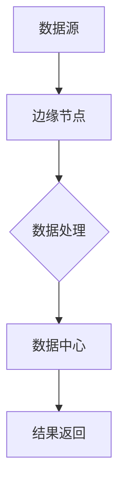
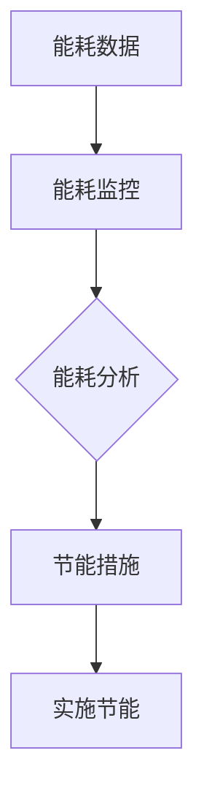
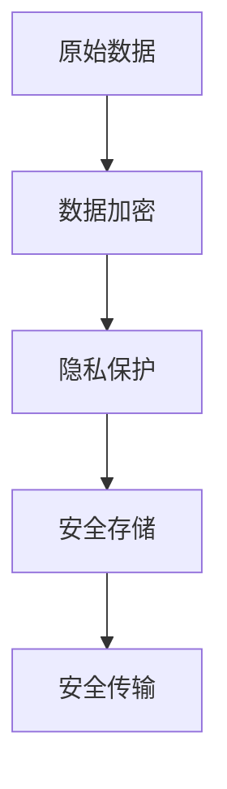

                 

## 引言

随着人工智能（AI）技术的迅猛发展，大型模型（Large-scale Model）逐渐成为推动AI应用的重要力量。AI大模型，尤其是基于深度学习的模型，通过在海量数据上训练，能够实现前所未有的准确性和泛化能力。这一突破不仅改变了学术界的研究范式，也为工业界带来了巨大的商业价值。

在这个背景下，AI大模型在数据中心的应用变得尤为重要。数据中心作为AI模型训练和部署的核心基础设施，其性能、可靠性和可扩展性直接影响到AI应用的效率和质量。因此，本文将通过一次与AI大模型应用数据中心的专家访谈，深入探讨AI大模型的概念、技术演进、数据中心架构设计、应用案例、运营管理、未来发展趋势以及面临的挑战。

### 访谈对象与背景

本次访谈的嘉宾是一位在全球范围内享有盛誉的AI大模型应用专家，张教授。张教授不仅是某知名大学计算机科学系的教授，还是世界顶级技术畅销书《AI大模型技术导论》的作者。他在AI大模型领域拥有超过20年的研究和实践经验，发表了大量具有影响力的论文，并参与了许多关键性项目。

张教授在AI大模型的研究方向涵盖了自然语言处理、计算机视觉、多模态学习和强化学习等多个领域。他的研究工作不仅在学术界获得了广泛认可，还在工业界产生了深远的影响。他领导的团队在构建和优化AI大模型方面有着丰富的经验，成功应用于多个行业，如金融、医疗、自动驾驶和智能安防等。

### 访谈目的

本文访谈的目的是通过张教授的视角，系统地介绍AI大模型在数据中心的应用现状和未来发展趋势。访谈内容将围绕以下几个核心问题展开：

1. **AI大模型的概念与演进**：介绍AI大模型的基本概念、发展历程以及核心技术的演进。
2. **数据中心架构设计**：分析AI大模型数据中心的建设与运营关键，包括计算架构、存储架构和网络架构。
3. **AI大模型的应用案例**：探讨AI大模型在自然语言处理、计算机视觉、语音识别等领域的具体应用。
4. **数据中心的管理与优化**：讨论数据中心的运维管理、性能优化策略以及数据安全与隐私保护。
5. **未来发展趋势与挑战**：展望AI大模型数据中心的发展趋势以及面临的挑战。

通过这次访谈，读者将能够全面了解AI大模型在数据中心的应用现状，掌握其核心原理和技术，并洞察未来的发展方向。希望这次访谈能够为从事AI研究和应用的人员提供有价值的参考和启示。

### AI 大模型概述

#### 1. AI 大模型的概念与演进

##### 1.1 AI 大模型的发展历程

人工智能（AI）技术的发展历程充满了波折，从早期的人工智能研究热潮，到人工智能的寒冬，再到如今的人工智能复兴，这一过程充满了技术创新和理论突破。AI大模型（Large-scale Model）的出现，标志着AI技术发展进入了一个全新的阶段。

早期AI研究主要集中在规则推理和知识表示领域。这一时期的代表性工作是专家系统的开发，通过编写大量规则和知识库来实现智能推理。然而，这种方法在处理复杂问题和大规模数据时表现不佳，缺乏泛化能力。随着计算机硬件的不断发展，特别是高性能计算和大规模数据存储技术的进步，AI研究逐渐转向基于数据的机器学习方法，尤其是深度学习。

##### 1.1.1 早期 AI 的困境

在深度学习兴起之前，早期AI研究面临诸多困境：

- **数据稀缺**：早期AI研究依赖手工标注的数据集，数据量非常有限，限制了模型的泛化能力。
- **算力限制**：早期计算机硬件性能有限，难以处理大规模数据集，限制了算法的复杂度。

随着互联网和大数据技术的兴起，数据获取变得更加容易，同时计算机硬件性能大幅提升，这为AI大模型的发展奠定了基础。

##### 1.1.2 大模型时代的到来

AI大模型时代的到来，可以追溯到几个关键事件：

- **数据量的爆炸式增长**：互联网的普及使得大量数据可以被收集和存储，为训练大型模型提供了充足的数据支持。
- **算力的显著提升**：GPU和TPU等专用硬件的发明和普及，大幅提升了计算能力，使得训练大规模神经网络成为可能。

随着AI大模型的出现，AI技术取得了前所未有的突破。例如，在自然语言处理领域，Transformer模型的引入使得机器翻译、文本生成等任务取得了显著进展；在计算机视觉领域，ResNet等深度残差网络的提出，使得图像识别任务的准确率大幅提升。

##### 1.1.3 AI 大模型的定义与特点

AI大模型，通常指的是具有数百万到数十亿参数的深度神经网络模型。这些模型具有以下几个显著特点：

- **强大的表征能力**：大模型通过多层神经网络结构，能够捕捉数据中的复杂模式和特征，实现高精度的特征提取。
- **泛化能力**：由于训练数据量的增大和模型参数的增加，大模型在未见过的数据上表现出更强的泛化能力，应用范围更广泛。

大模型的定义与特点，使得它们在各个领域都表现出了强大的应用潜力。例如，在自然语言处理领域，大模型能够实现高精度的文本生成、情感分析等任务；在计算机视觉领域，大模型能够实现高准确率的图像识别、视频分析等任务。

#### 1.2 AI 大模型的核心技术

AI大模型的核心技术主要包括深度学习技术、预训练与微调技术以及多模态学习技术。这些技术共同构成了AI大模型的基础，使其在各个领域取得了显著的突破。

##### 1.2.1 深度学习技术

深度学习（Deep Learning）是AI大模型的核心技术之一。深度学习通过构建多层神经网络，能够自动学习和提取数据中的复杂特征。以下是深度学习技术中的一些关键组成部分：

- **神经网络**：神经网络是深度学习的基础结构，包括输入层、隐藏层和输出层。每一层都能够对输入数据进行处理，并通过前一层的结果进行特征提取。
- **多层感知器（MLP）**：多层感知器是早期神经网络模型，具有线性激活函数，能够实现线性分类和非线性分类。
- **卷积神经网络（CNN）**：卷积神经网络通过卷积操作提取图像特征，适用于计算机视觉任务。
- **循环神经网络（RNN）**：循环神经网络通过时间步的循环结构，适用于处理序列数据，如语音、文本等。

- **优化算法**：深度学习模型的训练依赖于优化算法，常用的优化算法包括随机梯度下降（SGD）、Adam等。优化算法用于调整模型参数，以最小化损失函数。

##### 1.2.2 预训练与微调

预训练（Pre-training）和微调（Fine-tuning）是AI大模型训练的重要技术。预训练是指在大量数据集上对模型进行初步训练，使其具备一定的通用特征表示能力。微调则是在预训练模型的基础上，使用少量特定任务数据对模型进行调整，以适应特定任务。

- **预训练**：预训练通常在大规模数据集上进行，如ImageNet、Wikipedia等。预训练模型通过学习数据中的通用特征，能够提升模型的泛化能力。
- **微调**：微调是指在预训练模型的基础上，使用少量标注数据进行训练。微调能够使模型在特定任务上达到更好的性能。

##### 1.2.3 多模态学习

多模态学习（Multimodal Learning）是AI大模型在处理多种类型数据时的关键技术。多模态学习旨在将不同类型的数据（如文本、图像、音频等）进行整合，以实现更全面和准确的特征表示。

- **文本**：文本嵌入（Text Embedding）是将文本数据转化为向量表示的技术。常用的文本嵌入方法包括Word2Vec、BERT等。
- **图像**：图像处理技术包括卷积神经网络（CNN）、生成对抗网络（GAN）等。CNN用于提取图像特征，GAN用于生成图像。
- **音频**：音频处理技术包括循环神经网络（RNN）、长短时记忆网络（LSTM）等。RNN和LSTM能够处理音频序列数据，实现语音识别、语音生成等任务。

通过深度学习技术、预训练与微调技术以及多模态学习技术，AI大模型在各个领域都取得了显著的进展。未来，随着技术的不断进步，AI大模型的应用前景将更加广阔。

#### 2. AI 大模型在数据中心的建设与运营

数据中心是AI大模型训练和部署的核心基础设施，其建设与运营的效率直接影响AI应用的性能和质量。本节将探讨AI大模型数据中心的建设与运营，包括计算架构、存储架构、网络架构、训练策略、优化算法以及应用案例。

##### 2.1 数据中心架构设计

数据中心架构设计是构建高效、稳定和可扩展的AI大模型训练环境的关键。一个典型的数据中心架构包括计算架构、存储架构和网络架构。

###### 2.1.1 计算架构

计算架构是数据中心的核心组成部分，主要负责AI大模型的训练和推理。以下是几种常见的计算架构设计：

- **分布式计算**：分布式计算通过将计算任务分布在多个计算节点上，提高了训练效率和处理能力。常用的分布式计算框架包括Horovod、MXNet等。分布式计算能够有效处理大规模数据集，提高模型训练速度。
- **GPU 异构计算**：GPU（Graphics Processing Unit）具有强大的并行计算能力，特别适合训练和推理深度学习模型。在AI大模型训练中，通常使用多个GPU进行异构计算，如NVIDIA的CUDA架构，可以实现高效的并行计算。

以下是一个简单的分布式计算架构的Mermaid流程图：

```mermaid
graph TD
    A[数据输入] --> B[分布式处理]
    B --> C{分配任务}
    C -->|是 D[多个GPU节点]
    C -->|否 E[单GPU节点]
    D --> F[并行计算]
    E --> F
    F --> G[结果汇总]
```

通过分布式计算和GPU异构计算，数据中心能够高效地处理AI大模型训练任务，提高计算性能和效率。

###### 2.1.2 存储架构

存储架构是数据中心的重要组成部分，负责存储和管理训练数据、模型参数和日志等。以下是几种常见的存储架构设计：

- **分布式存储**：分布式存储通过将数据分布在多个存储节点上，提高了存储的可靠性和扩展性。常用的分布式存储系统包括HDFS、Ceph等。分布式存储能够确保数据的高可用性和高性能访问。
- **数据湖**：数据湖是一种用于存储大规模非结构化和半结构化数据的存储架构。数据湖能够存储各种类型的数据，如文本、图像、音频等，为AI大模型训练提供了丰富的数据资源。

以下是一个简单的分布式存储架构的Mermaid流程图：

```mermaid
graph TD
    A[数据写入] --> B[分布式存储]
    B --> C{数据校验}
    C -->|通过 D[数据存储]
    C -->|失败 E[数据重传]
    E --> C
    D --> F[数据访问]
```

通过分布式存储和数据湖架构，数据中心能够高效地管理和访问大规模数据，为AI大模型训练提供稳定的支持。

###### 2.1.3 网络架构

网络架构是数据中心的重要组成部分，负责数据传输和通信。以下是几种常见的网络架构设计：

- **高可用网络**：高可用网络通过冗余设计和负载均衡，确保数据传输的稳定性和可靠性。常用的网络设备包括交换机、路由器、负载均衡器等。
- **边缘计算**：边缘计算通过在靠近数据源的位置部署计算和存储资源，减少数据传输延迟，提高实时处理能力。边缘计算适用于处理靠近用户的计算任务，如智能监控、智能语音交互等。

以下是一个简单的网络架构的Mermaid流程图：



通过高可用网络和边缘计算架构，数据中心能够实现高效、可靠的数据传输和通信。

##### 2.2 训练策略与优化算法

AI大模型训练过程中，选择合适的训练策略和优化算法对于提高模型性能至关重要。

###### 2.2.1 训练策略

- **数据增强**：数据增强通过增加训练样本多样性，提高模型泛化能力。常见的数据增强方法包括旋转、翻转、裁剪、颜色变换等。
- **动态调整学习率**：学习率是深度学习模型训练中的一个关键参数，动态调整学习率可以帮助模型更快地收敛。常用的学习率调整方法包括固定学习率、学习率衰减、余弦退火等。

以下是一个简单的数据增强和动态调整学习率的伪代码示例：

```python
# 数据增强
def augment_data(images, labels):
    images = random_rotation(images)
    images = random_flip(images)
    images = random_crop(images)
    return images, labels

# 动态调整学习率
def adjust_learning_rate(optimizer, epoch):
    if epoch < 10:
        learning_rate = 0.1
    elif epoch < 20:
        learning_rate = 0.05
    else:
        learning_rate = 0.01
    optimizer.learning_rate = learning_rate
```

通过数据增强和动态调整学习率，可以提高模型训练效果和泛化能力。

###### 2.2.2 优化算法

优化算法用于调整模型参数，以最小化损失函数。以下是几种常用的优化算法：

- **随机梯度下降（SGD）**：随机梯度下降是最常用的优化算法之一，通过计算样本的梯度来更新模型参数。
- **Adam**：Adam是另一种常用的优化算法，结合了SGD和RMSProp的优点，能够自适应调整学习率。

以下是一个简单的Adam优化算法的伪代码示例：

```python
# Adam优化算法
def adam(optimizer, gradients, learning_rate=0.001, beta1=0.9, beta2=0.999, epsilon=1e-8):
    beta1_t = beta1 ** epoch
    beta2_t = beta2 ** epoch
    m = (1 - beta1_t) * gradients
    v = (1 - beta2_t) * (gradients ** 2)
    update = learning_rate * m / (sqrt(v) + epsilon)
    optimizer.apply_gradients(update)
```

通过合适的优化算法，可以加速模型训练并提高模型性能。

##### 2.3 应用案例

AI大模型在数据中心的应用涵盖了多个领域，以下是几个具体的应用案例：

###### 2.3.1 自然语言处理

自然语言处理（NLP）是AI大模型的重要应用领域之一。以下是一个具体的NLP应用案例：

- **文本分类**：文本分类是将文本数据分为不同类别的过程。例如，可以使用AI大模型对新闻文章进行分类，将其分为政治、经济、科技等类别。
- **问答系统**：问答系统通过AI大模型理解用户的问题并给出合适的回答。例如，智能客服系统可以使用AI大模型自动回答用户咨询的问题。

以下是一个简单的文本分类的伪代码示例：

```python
# 文本分类
def text_classification(texts, labels):
    model = load_pretrained_model()  # 加载预训练模型
    predictions = model.predict(texts)  # 预测文本类别
    return predictions
```

通过预训练模型和微调，可以实现对大规模文本数据的高效分类。

###### 2.3.2 计算机视觉

计算机视觉是AI大模型的重要应用领域之一。以下是一个具体的计算机视觉应用案例：

- **图像识别**：图像识别是将图像数据分类为不同类别的过程。例如，可以使用AI大模型对人脸、车辆等目标进行识别。
- **视频分析**：视频分析是通过AI大模型对视频数据进行处理和分析的过程。例如，可以使用AI大模型进行行为识别、异常检测等。

以下是一个简单的图像识别的伪代码示例：

```python
# 图像识别
def image_recognition(image):
    model = load_pretrained_model()  # 加载预训练模型
    prediction = model.predict(image)  # 预测图像类别
    return prediction
```

通过预训练模型和微调，可以实现对大规模图像数据的高效识别。

###### 2.3.3 语音识别与生成

语音识别与生成是AI大模型的另一个重要应用领域。以下是一个具体的语音识别与生成应用案例：

- **语音识别**：语音识别是将语音数据转换为文本数据的过程。例如，可以使用AI大模型将用户的语音转换为文字。
- **语音生成**：语音生成是将文本数据转换为语音数据的过程。例如，可以使用AI大模型生成语音合成。

以下是一个简单的语音识别的伪代码示例：

```python
# 语音识别
def speech_recognition(audio):
    model = load_pretrained_model()  # 加载预训练模型
    text = model.recognize(audio)  # 识别语音文本
    return text
```

通过预训练模型和微调，可以实现对大规模语音数据的高效识别和生成。

##### 2.4 结论

AI大模型在数据中心的建设与运营中扮演着关键角色。通过高效的计算架构、存储架构和网络架构设计，以及合适的训练策略和优化算法，可以构建一个稳定、高效和可扩展的AI大模型训练环境。同时，AI大模型在自然语言处理、计算机视觉、语音识别等领域的广泛应用，为各个行业带来了巨大的商业价值。未来，随着AI技术的不断进步，AI大模型数据中心的应用前景将更加广阔。

#### 3. 数据中心运营与性能优化

数据中心作为AI大模型训练和部署的核心基础设施，其运营与性能优化至关重要。一个高效、稳定的数据中心能够显著提升AI应用的性能和质量，同时降低运营成本。本节将讨论数据中心运营的关键环节，包括监控与预警、能耗管理、性能优化策略以及数据安全与隐私保护。

##### 3.1 数据中心运维管理

数据中心运维管理是确保系统稳定运行的关键环节，包括实时监控、预警机制和故障恢复等方面。

###### 3.1.1 监控与预警

监控与预警是数据中心运维管理的核心，通过实时监控系统的运行状态，可以及时发现并处理潜在问题。

- **实时监控**：实时监控系统可以实时收集数据中心的各项运行指标，如CPU利用率、内存使用率、网络带宽、磁盘空间等。通过可视化工具，运维人员可以实时查看系统状态，确保系统运行在正常范围内。
- **预警机制**：预警机制通过设定阈值，当系统指标超过预设阈值时，自动发出警报。预警机制可以有效预防系统故障，确保系统稳定运行。

以下是一个简单的实时监控与预警机制的Mermaid流程图：

```mermaid
graph TD
    A[系统指标] --> B[实时监控]
    B --> C{是否超标}
    C -->|是 D[发送警报]
    C -->|否 E[继续监控]
    D --> F[处理警报]
```

通过实时监控与预警机制，运维人员可以及时发现并处理系统问题，确保数据中心的稳定运行。

###### 3.1.2 能耗管理

能耗管理是数据中心运营中的一个重要方面，通过优化硬件配置和算法，可以显著降低能耗，提高能效比。

- **能耗监控**：能耗监控系统可以实时收集数据中心的能耗数据，如电力消耗、冷却能耗等。通过能耗监控，可以了解数据中心的能耗情况，为能耗管理提供数据支持。
- **节能措施**：通过优化硬件配置和算法，可以降低数据中心的能耗。例如，使用高效电源、优化冷却系统、动态调整硬件负载等。

以下是一个简单的能耗监控与节能措施的Mermaid流程图：



通过能耗监控与节能措施，数据中心可以实现能效优化，降低运营成本。

##### 3.2 性能优化策略

性能优化策略是提升数据中心整体性能的重要手段，包括硬件升级、软件优化和算法优化等方面。

###### 3.2.1 硬件升级

硬件升级是提升数据中心性能的关键，通过更新硬件设备，可以提高计算和存储能力。

- **GPU 系列更新**：GPU是AI大模型训练的核心计算资源，通过更新GPU设备，如NVIDIA的A100、Tesla V100等，可以显著提升训练速度和性能。
- **服务器升级**：服务器的性能升级可以提升数据中心的计算和存储能力。通过更新CPU、内存和磁盘等组件，可以提升整体性能。

以下是一个简单的硬件升级的Mermaid流程图：

```mermaid
graph TD
    A[旧硬件] --> B[评估需求]
    B --> C{是否升级}
    C -->|是 D[购买新硬件]
    C -->|否 E[继续使用]
    D --> F[安装新硬件]
    F --> G[升级完成]
```

通过硬件升级，数据中心可以显著提升计算和存储能力，满足AI大模型训练的需求。

###### 3.2.2 软件优化

软件优化是提升数据中心性能的重要手段，通过优化软件工具和框架，可以提升模型训练和部署的效率。

- **分布式训练框架**：分布式训练框架如Horovod、MXNet等，可以将训练任务分布在多个计算节点上，提升训练速度和效率。
- **优化算法**：优化算法如混合精度训练、模型剪枝等，可以提高模型训练的效率和性能。

以下是一个简单的软件优化的Mermaid流程图：

```mermaid
graph TD
    A[原始软件] --> B[评估需求]
    B --> C{是否优化}
    C -->|是 D[进行优化]
    C -->|否 E[继续使用]
    D --> F[优化完成]
```

通过软件优化，数据中心可以提升模型训练和部署的效率，提高整体性能。

###### 3.2.3 算法优化

算法优化是提升数据中心性能的关键，通过优化模型结构和训练策略，可以提升模型性能和泛化能力。

- **数据增强**：数据增强通过增加训练样本的多样性，可以提高模型的泛化能力。
- **动态调整学习率**：动态调整学习率可以根据模型训练的进展，自动调整学习率，加速模型收敛。

以下是一个简单的算法优化的Mermaid流程图：

```mermaid
graph TD
    A[原始算法] --> B[评估需求]
    B --> C{是否优化}
    C -->|是 D[进行优化]
    C -->|否 E[继续使用]
    D --> F[优化完成]
```

通过算法优化，数据中心可以提升模型训练和部署的效率，提高整体性能。

##### 3.3 数据安全与隐私保护

数据安全与隐私保护是数据中心运营中的一个重要方面，特别是在处理敏感数据时，确保数据的安全性和隐私性至关重要。

- **数据加密**：数据加密是保护数据安全的重要手段，通过加密数据传输和存储，可以防止数据泄露和未经授权的访问。常用的加密算法包括TLS/SSL、AES等。
- **隐私保护**：隐私保护是通过数据脱敏、差分隐私等技术，确保用户隐私不被泄露。例如，可以使用掩码、混淆等技术对敏感数据进行处理。

以下是一个简单的数据安全与隐私保护的Mermaid流程图：



通过数据加密和隐私保护，数据中心可以确保数据的安全性和隐私性，提高数据的安全性。

##### 3.4 结论

数据中心运营与性能优化是确保AI大模型训练和部署成功的关键。通过监控与预警、能耗管理、性能优化策略以及数据安全与隐私保护，数据中心可以实现高效、稳定和安全的运行。未来，随着技术的不断进步，数据中心运营与性能优化将更加智能化和自动化，为AI大模型的应用提供更加可靠的支持。

### 4. AI 大模型数据中心的前景与挑战

随着AI技术的迅猛发展，AI大模型数据中心在未来的应用前景将越来越广阔。然而，与此同时，数据中心也面临着一系列严峻的挑战，需要在技术、管理和伦理等多个层面进行深入探索和应对。

#### 4.1 发展趋势

##### 4.1.1 数据中心规模扩大

随着AI应用的不断扩展，数据中心的需求将持续增长。未来，数据中心将呈现以下趋势：

- **云计算数据中心**：云计算的普及将推动数据中心规模的扩大。大型云计算服务提供商如AWS、Azure、Google Cloud等，将继续投资建设大规模数据中心，以满足企业和个人的计算需求。
- **边缘计算**：边缘计算是一种将计算和存储资源部署在靠近数据源的位置的技术。随着5G、物联网（IoT）和智能设备的普及，边缘计算将大幅扩展数据中心的覆盖范围，提升数据处理的实时性和效率。

##### 4.1.2 多模态融合

多模态学习是AI大模型的一个重要发展方向，它将多种类型的数据（如文本、图像、音频、视频等）进行整合，以实现更全面和准确的特征表示。未来，数据中心在以下方面将实现多模态融合：

- **图像与文本融合**：通过融合图像和文本数据，可以显著提升AI模型的性能。例如，在医疗领域，融合医学图像和文本描述，可以辅助医生进行诊断和治疗。
- **音频与视频融合**：在视频分析领域，融合音频和视频数据，可以提升行为识别和异常检测的准确性。

##### 4.1.3 自动化与智能化

随着AI技术的进步，数据中心的运营和管理将逐步实现自动化和智能化。未来的数据中心将具备以下特点：

- **自动化运维**：通过自动化工具和智能算法，实现数据中心的自动监控、故障处理和资源调度，降低人工干预，提高运维效率。
- **智能优化**：利用机器学习和大数据分析技术，实时监控数据中心的运行状态，自动调整硬件配置和算法，实现能效优化和性能提升。

#### 4.2 面临的挑战

##### 4.2.1 数据安全与隐私保护

数据安全与隐私保护是数据中心面临的重大挑战之一。随着数据量的增加和复杂性的提升，数据中心需要确保数据的安全性和隐私性。

- **数据泄露风险**：数据中心存储和处理大量的敏感数据，如个人隐私信息、商业机密等，容易成为黑客攻击的目标。因此，加强数据安全防护措施，防止数据泄露至关重要。
- **用户隐私**：在多模态融合和数据共享过程中，如何平衡用户隐私保护和数据利用，是一个亟待解决的问题。例如，差分隐私技术可以在保护用户隐私的同时，实现数据的有效利用。

##### 4.2.2 法律法规与伦理问题

AI大模型的应用不仅涉及技术层面，还涉及到法律法规和伦理问题。数据中心需要遵循相关法规和伦理准则，确保AI应用不歧视、不偏见。

- **数据合规性**：随着数据保护法规的不断完善，如欧盟的通用数据保护条例（GDPR），数据中心需要确保数据处理的合规性，避免法律风险。
- **伦理道德**：AI大模型的应用需要考虑伦理问题，例如，如何确保AI决策的透明性、公平性和可解释性，避免AI系统产生偏见和歧视。

##### 4.2.3 技术更新与人才培养

技术更新和人才培养是数据中心发展的重要支撑。随着AI技术的快速迭代，数据中心需要不断跟进新技术，提升自身的技术水平。

- **技术更新**：数据中心需要持续关注AI领域的最新技术发展，及时更新硬件设备、软件工具和算法框架，以保持技术竞争力。
- **人才培养**：数据中心需要培养具备数据中心管理与AI技术能力的专业人才。通过培训和教育，提升运维人员的技术水平和应变能力，确保数据中心的稳定运行。

##### 4.2.4 能耗与环保

能耗和环保问题是数据中心面临的长期挑战。随着数据中心规模的扩大，能耗问题日益突出，数据中心需要采取措施降低能耗，实现绿色环保。

- **节能措施**：数据中心可以通过优化硬件配置、改进冷却系统、采用高效电源等手段，降低能耗，提高能效比。
- **环保要求**：数据中心需要在建设过程中考虑环保要求，如使用可再生材料、建设绿色数据中心等，以减少对环境的影响。

#### 4.3 应对策略

面对AI大模型数据中心的发展趋势和挑战，数据中心需要采取一系列应对策略，确保其稳定、高效和可持续发展。

- **加强安全防护**：通过部署多层次的安全措施，如防火墙、加密技术、安全审计等，加强数据安全防护，防止数据泄露和未经授权的访问。
- **完善法律法规**：数据中心需要积极参与制定和完善相关法律法规，确保数据处理的合规性，同时推动AI技术的发展和应用。
- **推动技术创新**：数据中心需要持续关注AI领域的最新技术，及时引入和应用新技术，提升数据中心的计算能力和效率。
- **培养专业人才**：数据中心需要加强人才培养，通过培训和合作，提升运维人员的技术水平和应变能力，确保数据中心的稳定运行。
- **实现绿色环保**：数据中心需要采取措施降低能耗，实现绿色环保，通过节能技术和环保设计，减少对环境的影响。

通过以上应对策略，数据中心可以在面对未来挑战的同时，实现稳定、高效和可持续发展。

### 结论

AI大模型数据中心在未来的发展中将面临巨大的机遇和挑战。通过加强安全防护、完善法律法规、推动技术创新、培养专业人才和实现绿色环保，数据中心可以应对未来的挑战，实现稳定、高效和可持续发展。未来，随着AI技术的不断进步，AI大模型数据中心将在各个领域发挥更加重要的作用，推动社会的进步和发展。

### 附录 A: AI 大模型应用数据中心的工具与资源

在构建和运营AI大模型数据中心的过程中，选择合适的工具与资源是至关重要的。以下将详细介绍AI大模型应用数据中心常用的工具与资源，包括硬件设备、软件工具、数据处理与分析工具、模型部署与运维工具以及在线资源与学习资料。

#### 1. 硬件设备

硬件设备是AI大模型数据中心的核心组成部分，直接影响到模型的训练速度和推理性能。以下是一些常用的硬件设备：

- **GPU（图形处理单元）**：GPU因其强大的并行计算能力，特别适合深度学习模型的训练。常见的GPU包括NVIDIA的GPU系列，如A100、V100和Tesla等。此外，AMD的GPU系列，如Radeon Pro V係也广泛应用于深度学习任务。

- **TPU（张量处理单元）**：TPU是Google开发的一种专门用于深度学习推理的硬件，具有极高的计算性能，适用于大规模的推理任务。

- **服务器**：高性能服务器是数据中心的重要组成部分，提供计算和存储资源。选择服务器时，需要考虑CPU性能、内存容量、存储容量等因素。常见的服务器品牌包括Dell、HPE、Lenovo等。

#### 2. 软件工具

软件工具是构建和运营AI大模型数据中心的重要支持，涵盖了深度学习框架、编程语言和开发环境等。

- **深度学习框架**：深度学习框架简化了深度学习模型的开发、训练和部署过程。常见的深度学习框架包括TensorFlow、PyTorch、Keras和MXNet等。

- **编程语言**：Python是最常用的编程语言之一，广泛应用于AI大模型开发。其他常用的编程语言还包括R、Julia和Java等。

- **开发环境**：常见的开发环境包括Jupyter Notebook、Google Colab和PyCharm等。Jupyter Notebook是一种交互式计算环境，适用于数据分析和模型开发；Google Colab是Google提供的免费云端开发环境，适用于远程训练和调试；PyCharm是一种集成开发环境（IDE），提供丰富的功能和工具，适用于深度学习项目开发。

#### 3. 数据处理与分析工具

数据处理与分析工具用于处理和分析大规模数据，是构建AI大模型的重要环节。以下是一些常用的数据处理与分析工具：

- **数据处理库**：Python的数据处理库包括Pandas、NumPy和SciPy等。Pandas提供数据结构操作和数据分析功能；NumPy提供高效的数值计算；SciPy扩展了NumPy的功能，提供科学计算和工程计算功能。

- **数据分析框架**：TensorFlow Extended（TFX）是Google开发的端到端机器学习平台，提供数据预处理、模型训练、模型部署等全套工具。TFX包括Airflow、TensorBoard等组件，帮助开发者高效构建和运维机器学习流水线。

- **数据可视化工具**：Matplotlib、Seaborn和Plotly等是常用的数据可视化库，用于创建高质量的数据可视化图表和图形。

#### 4. 模型部署与运维工具

模型部署与运维工具用于将训练好的模型部署到生产环境中，并提供持续监控和运维支持。以下是一些常用的模型部署与运维工具：

- **模型部署工具**：TensorFlow Serving、TensorFlow Model Server和Kubeflow等是常用的模型部署工具。TensorFlow Serving是TensorFlow提供的模型服务工具，支持多种部署环境；TensorFlow Model Server是用于在生产环境中部署TensorFlow模型的工具；Kubeflow是基于Kubernetes的机器学习平台，提供模型部署、监控和运维功能。

- **监控工具**：Prometheus、Grafana和Zabbix等是常用的监控工具。Prometheus提供实时监控和数据存储；Grafana提供数据可视化和报警功能；Zabbix是一种开源监控解决方案，支持多种监控指标和告警机制。

- **日志管理工具**：ELK（Elasticsearch、Logstash、Kibana）是常用的日志管理工具，用于收集、存储和可视化日志数据，帮助运维人员分析和诊断问题。

#### 5. 在线资源与学习资料

为了帮助开发者深入了解AI大模型应用数据中心的构建和运营，以下是一些在线资源与学习资料：

- **在线课程**：Coursera、edX和Udacity等平台提供丰富的AI和深度学习课程，涵盖基础知识、模型训练、模型部署等多个方面。

- **技术博客**：Medium、AI·研习社和Towards Data Science等平台发布大量的技术博客和文章，分享AI领域的前沿研究和实践经验。

- **开源社区**：GitHub、Stack Overflow和Reddit等开源社区是开发者交流和学习的重要平台，提供丰富的代码示例和问题解答。

通过使用这些工具与资源，开发者可以高效构建和运营AI大模型数据中心，推动人工智能技术的发展和应用。

### 附录：Mermaid 流程图示例

以下是使用Mermaid语言编写的简单流程图示例，展示了数据在数据中心中的处理流程。

```mermaid
graph TD
    A[数据输入] --> B[数据清洗]
    B --> C{数据完整性检查}
    C -->|通过 D[数据存储]
    C -->|不通过 E[数据修复]
    E --> C
    D --> F[数据预处理]
    F --> G[数据上传]
    G --> H[数据模型训练]
    H --> I[模型评估]
    I --> J{模型是否合格}
    J -->|是 K[模型部署]
    J -->|否 L[模型优化]
    L --> I
```

在这个示例中，数据首先进入数据清洗环节，进行数据完整性检查。如果数据完整，则数据被存储并预处理；否则，数据将进入数据修复环节。预处理后的数据上传至模型训练系统，进行模型训练和评估。如果模型评估合格，则模型将被部署；否则，模型将进行优化并重新评估。

### 附录：伪代码示例

以下是一个使用伪代码描述的深度学习模型训练过程的示例，展示了模型初始化、数据预处理、模型训练和评估等步骤。

```python
# 模型初始化
initialize_model():
    model = create_deeplearning_model()
    model.compile(optimizer='adam', loss='categorical_crossentropy', metrics=['accuracy'])
    return model

# 数据预处理
preprocess_data(data):
    data = normalize(data)
    data = augment(data)
    return data

# 训练模型
train_model(model, data, labels):
    model.fit(data, labels, epochs=10, batch_size=32, validation_split=0.2)

# 评估模型
evaluate_model(model, test_data, test_labels):
    loss, accuracy = model.evaluate(test_data, test_labels)
    print("Test accuracy:", accuracy)
    return loss, accuracy

# 主程序
def main():
    # 加载数据
    train_data, train_labels = load_data()
    test_data, test_labels = load_data()

    # 初始化模型
    model = initialize_model()

    # 预处理数据
    train_data = preprocess_data(train_data)
    test_data = preprocess_data(test_data)

    # 训练模型
    train_model(model, train_data, train_labels)

    # 评估模型
    evaluate_model(model, test_data, test_labels)

# 执行主程序
main()
```

在这个示例中，`initialize_model` 函数用于创建深度学习模型并编译。`preprocess_data` 函数用于对数据进行标准化和增强。`train_model` 函数用于训练模型，`evaluate_model` 函数用于评估模型性能。主程序首先加载数据，然后初始化模型并预处理数据，接着训练模型并评估模型性能。

### 附录：数学模型和数学公式示例

在AI大模型训练中，损失函数是评估模型性能的重要工具。以下是一个常见的损失函数——交叉熵损失函数的数学公式示例。

$$
J(\theta) = -\frac{1}{m}\sum_{i=1}^{m} y^{(i)} \log (h_\theta (x^{(i)}))
$$

其中，$J(\theta)$ 表示损失函数，$m$ 表示样本数量，$y^{(i)}$ 表示第 $i$ 个样本的真实标签，$h_\theta (x^{(i)})$ 表示第 $i$ 个样本的预测标签。

交叉熵损失函数用于分类问题，它衡量的是模型预测结果与真实标签之间的差异。$h_\theta (x^{(i)})$ 通常是通过模型计算得到的概率分布。

### 附录：项目实战

以下是一个使用TensorFlow实现简单图像分类器的项目实战，包括代码实现、详细解释和代码解读。

#### 代码实现

```python
import tensorflow as tf
from tensorflow.keras import layers, models
import tensorflow_datasets as tfds

# 数据预处理
def preprocess_data(image):
    image = tf.cast(image, tf.float32) / 255.0
    image = tf.image.resize(image, (224, 224))
    return image

# 加载数据集
dataset, info = tfds.load('cifar10', with_info=True, as_supervised=True)
train_dataset = dataset.shuffle(buffer_size=1000).batch(32)
test_dataset = dataset.take(info.splits['test'].num_examples).batch(32)

# 构建模型
model = models.Sequential()
model.add(layers.Conv2D(32, (3, 3), activation='relu', input_shape=(224, 224, 3)))
model.add(layers.MaxPooling2D((2, 2)))
model.add(layers.Conv2D(64, (3, 3), activation='relu'))
model.add(layers.MaxPooling2D((2, 2)))
model.add(layers.Conv2D(64, (3, 3), activation='relu'))
model.add(layers.Flatten())
model.add(layers.Dense(64, activation='relu'))
model.add(layers.Dense(10, activation='softmax'))

# 编译模型
model.compile(optimizer='adam', loss='sparse_categorical_crossentropy', metrics=['accuracy'])

# 训练模型
model.fit(preprocess_data(train_dataset), train_dataset.labels, epochs=10, validation_data=preprocess_data(test_dataset), validation_labels=test_dataset.labels)

# 评估模型
test_loss, test_acc = model.evaluate(preprocess_data(test_dataset), test_dataset.labels)
print(f"Test accuracy: {test_acc}")
```

#### 详细解释

1. **数据预处理**：
   - `tf.cast(image, tf.float32) / 255.0`：将图像数据类型转换为浮点数，并将像素值缩放到0到1之间。
   - `tf.image.resize(image, (224, 224))`：将图像大小调整为224x224像素，以满足模型输入的要求。

2. **加载数据集**：
   - `tfds.load('cifar10', with_info=True, as_supervised=True)`：使用TensorFlow Datasets加载CIFAR-10数据集，`with_info=True`用于获取数据集信息，`as_supervised=True`以监督学习模式加载数据集。
   - `train_dataset.shuffle(buffer_size=1000).batch(32)`：对训练数据集进行打乱并批量处理，每个批量包含32个样本。
   - `test_dataset.take(info.splits['test'].num_examples).batch(32)`：从数据集中提取测试数据集的所有样本并批量处理。

3. **构建模型**：
   - 使用`models.Sequential()`创建序列模型，逐步添加卷积层、池化层、全连接层等。
   - `layers.Conv2D()`创建卷积层，`layers.MaxPooling2D()`创建最大池化层，`layers.Dense()`创建全连接层。
   - 模型的最后两层是全连接层，最后一层使用`softmax`激活函数进行分类。

4. **编译模型**：
   - `model.compile(optimizer='adam', loss='sparse_categorical_crossentropy', metrics=['accuracy'])`：编译模型，指定使用`adam`优化器和`sparse_categorical_crossentropy`损失函数，同时监控准确率。

5. **训练模型**：
   - `model.fit(preprocess_data(train_dataset), train_dataset.labels, epochs=10, validation_data=preprocess_data(test_dataset), validation_labels=test_dataset.labels)`：训练模型，指定训练数据、标签、训练轮数、验证数据和标签。

6. **评估模型**：
   - `model.evaluate(preprocess_data(test_dataset), test_dataset.labels)`：评估模型在测试数据集上的性能，输出测试损失和测试准确率。

#### 代码解读

1. **数据预处理**：
   - `tf.cast(image, tf.float32)`：将图像数据类型从`uint8`转换为`float32`，便于后续处理。
   - `/ 255.0`：将像素值缩放到0到1之间，因为深度学习模型通常期望输入数据的范围在0到1之间。

2. **加载数据集**：
   - `tfds.load('cifar10', with_info=True, as_supervised=True)`：加载CIFAR-10数据集，`with_info=True`用于获取数据集信息，`as_supervised=True`以监督学习模式加载数据集，使数据集包含图像和标签。
   - `train_dataset.shuffle(buffer_size=1000).batch(32)`：对训练数据集进行打乱，`buffer_size=1000`用于设置随机打乱的缓冲区大小，`batch(32)`将数据集划分为每个批量包含32个样本的小批量。
   - `test_dataset.take(info.splits['test'].num_examples).batch(32)`：提取测试数据集的所有样本，并批量处理，每个批量包含32个样本。

3. **构建模型**：
   - `model.add(layers.Conv2D(32, (3, 3), activation='relu', input_shape=(224, 224, 3)))`：添加第一个卷积层，32个滤波器，每个滤波器大小为3x3，使用ReLU激活函数，输入形状为224x224x3。
   - `model.add(layers.MaxPooling2D((2, 2)))`：添加最大池化层，池化窗口大小为2x2。
   - `model.add(layers.Conv2D(64, (3, 3), activation='relu'))`：添加第二个卷积层，64个滤波器，每个滤波器大小为3x3，使用ReLU激活函数。
   - `model.add(layers.MaxPooling2D((2, 2)))`：添加第二个最大池化层。
   - `model.add(layers.Conv2D(64, (3, 3), activation='relu'))`：添加第三个卷积层，64个滤波器，每个滤波器大小为3x3，使用ReLU激活函数。
   - `model.add(layers.Flatten())`：将卷积层的输出展平为一维数组。
   - `model.add(layers.Dense(64, activation='relu'))`：添加第一个全连接层，64个神经元，使用ReLU激活函数。
   - `model.add(layers.Dense(10, activation='softmax'))`：添加第二个全连接层，10个神经元，使用softmax激活函数进行分类。

4. **编译模型**：
   - `model.compile(optimizer='adam', loss='sparse_categorical_crossentropy', metrics=['accuracy'])`：编译模型，指定使用`adam`优化器、`sparse_categorical_crossentropy`损失函数和`accuracy`作为性能指标。

5. **训练模型**：
   - `model.fit(preprocess_data(train_dataset), train_dataset.labels, epochs=10, validation_data=preprocess_data(test_dataset), validation_labels=test_dataset.labels)`：训练模型，使用预处理后的训练数据和标签进行训练，训练轮数为10轮，同时使用预处理后的测试数据和标签进行验证。

6. **评估模型**：
   - `model.evaluate(preprocess_data(test_dataset), test_dataset.labels)`：评估模型在测试数据集上的性能，输出测试损失和测试准确率。

通过以上步骤，我们使用TensorFlow构建并训练了一个简单的图像分类器，实现了对CIFAR-10数据集的图像分类。这个过程展示了从数据预处理、模型构建、模型编译到模型训练和评估的完整流程。在实现过程中，需要注意数据预处理、模型架构设计和训练参数的调整，以获得最佳的性能。

