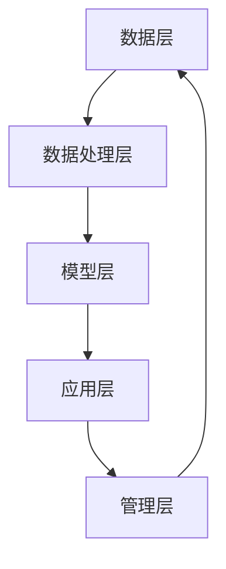

                 

### 《AI 大模型应用数据中心的员工关系》

> 关键词：AI 大模型，数据中心，员工关系，深度学习，神经网络，算法，预训练，迁移学习，员工满意度，员工流动，绩效评估，案例研究，未来趋势，挑战与对策。

> 摘要：本文探讨了 AI 大模型在数据中心员工关系管理中的应用，从基础概念、核心技术、应用实例到未来展望，系统地阐述了 AI 大模型在提升员工关系管理效率、预测员工行为、优化人力资源配置等方面的作用，以及面临的挑战和解决对策。

### 《AI 大模型应用数据中心的员工关系》目录大纲

#### 第一部分：引言与基础概念

# 第一部分：引言与基础概念

## 第1章：AI大模型与数据中心员工关系概述

### 1.1 AI大模型的发展背景

### 1.2 数据中心员工关系的重要性

### 1.3 AI大模型在数据中心员工关系中的应用

## 第2章：AI大模型技术基础

### 2.1 AI大模型的基本概念

### 2.2 数据中心员工关系数据收集与预处理

### 2.3 AI大模型的核心算法与原理

#### 第二部分：AI大模型在数据中心员工关系中的应用

# 第二部分：AI大模型在数据中心员工关系中的应用

## 第3章：员工满意度分析

### 3.1 员工满意度评估指标体系

### 3.2 基于AI大模型的员工满意度预测

### 3.3 员工满意度分析案例

## 第4章：员工流动预测

### 4.1 员工流动预测的重要性

### 4.2 基于AI大模型的员工流动预测方法

### 4.3 员工流动预测案例分析

## 第5章：员工绩效评估

### 5.1 员工绩效评估体系

### 5.2 基于AI大模型的员工绩效评估方法

### 5.3 员工绩效评估案例分析

#### 第三部分：AI大模型应用实践

# 第三部分：AI大模型应用实践

## 第6章：数据中心员工关系管理系统的搭建

### 6.1 员工关系管理系统的需求分析

### 6.2 数据中心员工关系管理系统的架构设计

### 6.3 数据中心员工关系管理系统的实现与部署

## 第7章：AI大模型应用案例研究

### 7.1 案例背景介绍

### 7.2 AI大模型在员工关系管理中的应用

### 7.3 案例效果评估与分析

#### 第四部分：展望与挑战

# 第四部分：展望与挑战

## 第8章：AI大模型应用的未来趋势

### 8.1 AI大模型在数据中心员工关系管理中的应用前景

### 8.2 AI大模型应用面临的挑战与对策

## 第9章：总结与展望

### 9.1 全书内容总结

### 9.2 对数据中心员工关系管理未来的展望

#### 附录

## 附录A：AI大模型常用工具与资源

### A.1 常用AI大模型框架

### A.2 数据预处理工具

### A.3 模型评估与优化工具

### A.4 其他资源与推荐

### Mermaid 流程图

mermaid
graph TD
    A[AI大模型应用数据中心的员工关系]
    B[核心概念与联系]
    C[核心算法原理讲解]
    D[数学模型与公式]
    E[项目实战]
    
    A --> B
    A --> C
    A --> D
    A --> E

### 第一部分：引言与基础概念

#### 第1章：AI大模型与数据中心员工关系概述

**1.1 AI大模型的发展背景**

人工智能（AI）作为计算机科学的一个分支，旨在创建能够模拟、延伸和扩展人类智能的智能体。近年来，随着计算能力的提升和大数据技术的普及，AI技术取得了长足的发展。特别是在深度学习领域，神经网络（Neural Networks）的突破性进展使得AI大模型成为可能。

AI大模型是指那些具有非常大规模参数的深度学习模型，如Transformer、BERT、GPT等。这些模型通过在海量数据上预训练，可以捕捉到极其复杂的模式和关系，从而在各类任务中表现出色。

数据中心作为存储和处理大规模数据的重要设施，其员工关系对于数据中心的运作和效率有着重要影响。员工满意度、员工流动性和员工绩效是员工关系的核心方面，直接关系到数据中心的整体运营状况。

**1.2 数据中心员工关系的重要性**

数据中心员工关系的重要性体现在以下几个方面：

1. **员工满意度**：高满意度意味着员工更愿意留在公司，减少人员流失，提高工作效率。
2. **员工流动性**：合理的员工流动性有助于保持团队的活力和创新能力，但过高的流动性可能会导致团队不稳定。
3. **员工绩效**：高效的员工绩效评估和反馈机制有助于识别和培养优秀员工，提高整体工作效率。

**1.3 AI大模型在数据中心员工关系中的应用**

AI大模型在数据中心员工关系中的应用主要体现在以下几个方面：

1. **员工满意度分析**：利用AI大模型进行员工满意度预测和分析，帮助企业了解员工的需求和不满，从而采取针对性的改进措施。
2. **员工流动预测**：通过分析员工行为数据和特征，AI大模型可以预测员工流动趋势，提前采取措施减少流失。
3. **员工绩效评估**：基于员工的工作表现和各项指标，AI大模型可以提供客观、准确的绩效评估，帮助管理层更好地进行人才管理和激励。

接下来，本文将深入探讨AI大模型的技术基础，以及在数据中心员工关系管理中的应用，并通过具体案例进行说明。

### 第二部分：AI大模型技术基础

#### 第2章：AI大模型技术基础

在深入探讨AI大模型在数据中心员工关系管理中的应用之前，我们需要先了解AI大模型的基础知识，包括其基本概念、数据收集与预处理方法，以及核心算法和原理。

**2.1 AI大模型的基本概念**

AI大模型，即具有大规模参数的深度学习模型，通常具有以下特征：

1. **大规模参数**：AI大模型通常包含数十亿甚至数万亿个参数，这使得它们能够捕捉到数据中的复杂模式和关联。
2. **预训练**：AI大模型通常通过在大量无标签数据上进行预训练来学习通用的特征表示能力。
3. **迁移学习**：预训练的AI大模型可以迁移到具体任务上，通过少量有监督数据进行微调，从而提高模型在特定任务上的性能。

**2.2 数据中心员工关系数据收集与预处理**

在构建AI大模型之前，需要收集和处理与员工关系相关的数据。这些数据可能包括：

1. **员工行为数据**：如工作时间、任务完成情况、加班记录等。
2. **员工满意度调查数据**：通过问卷调查获取员工对工作环境、薪资待遇、职业发展等方面的满意度。
3. **员工绩效数据**：如绩效评估得分、奖励记录等。

数据预处理是构建AI大模型的重要步骤，主要包括以下几个环节：

1. **数据清洗**：去除噪声数据、处理缺失值和异常值。
2. **数据归一化**：将不同特征的范围缩放到相同尺度，以消除特征间的量纲影响。
3. **特征工程**：根据业务需求，提取和构建新的特征，如基于员工行为数据构建的工作强度指标等。

**2.3 AI大模型的核心算法与原理**

AI大模型的核心算法包括深度学习算法和自然语言处理技术。以下将对这些核心算法进行详细讲解。

**2.3.1 深度学习与神经网络基础**

深度学习（Deep Learning）是机器学习（Machine Learning）的一个子领域，它通过构建多层神经网络来学习数据的复杂特征。神经网络（Neural Networks）是深度学习的基础，其基本结构包括输入层、隐藏层和输出层。

1. **神经网络的基本结构**
   
   一个简单的神经网络可以表示为：
   $$
   Y = \sigma(\omega^T X + b)
   $$
   其中，$Y$ 是输出值，$\sigma$ 是激活函数，$\omega$ 是权重，$X$ 是输入值，$b$ 是偏置。

2. **常见的深度学习架构**
   
   - **卷积神经网络（CNN）**：适用于图像处理任务，通过卷积层和池化层提取图像特征。
   - **递归神经网络（RNN）**：适用于序列数据处理，如语言模型和时间序列预测。
   - **Transformer架构**：用于自然语言处理任务，通过自注意力机制建模序列间的关系。

3. **深度学习优化算法**
   
   - **随机梯度下降（SGD）**：一种常用的优化算法，通过随机选取样本进行梯度下降，以更新模型参数。
   - **Adam优化器**：结合了SGD和RMSprop的优点，自适应地调整学习率，常用于大规模模型训练。

**2.3.2 自然语言处理技术概览**

自然语言处理（Natural Language Processing，NLP）是AI的一个重要分支，旨在使计算机能够理解、处理和生成人类语言。以下是对NLP技术的一个简要介绍：

1. **词嵌入技术**
   
   - **Word2Vec**：通过训练词向量模型，将单词映射到高维空间，以捕捉单词间的语义关系。
   - **GloVe**：全局向量表示（Global Vectors for Word Representation），通过考虑单词的共现关系来训练词向量。

2. **序列模型与注意力机制**
   
   - **RNN**：递归神经网络，适用于处理序列数据，如语言模型和时间序列预测。
   - **LSTM**：长短期记忆网络，是RNN的一个变体，通过引入门控机制来克服RNN的梯度消失问题。
   - **GRU**：门控循环单元，是LSTM的简化版，也用于处理序列数据。
   - **自注意力机制**：在Transformer模型中，通过自注意力机制来建模序列间的关系，提高了模型在自然语言处理任务中的性能。

3. **转换器架构详解**
   
   - **Encoder-Decoder框架**：用于将输入序列编码为固定长度的表示，再解码为输出序列。
   - **Transformer模型**：基于自注意力机制的深度学习模型，在机器翻译、文本生成等任务上取得了显著效果。

**2.3.3 大规模预训练模型原理**

大规模预训练模型是AI大模型的重要组成部分，其核心思想是通过在大量无监督数据上预训练，使模型获得通用的特征表示能力，然后通过迁移学习将模型应用于特定任务。

1. **预训练的概念与意义**
   
   - **预训练**：在特定任务之前，通过大量无监督数据对模型进行训练，以获得通用的特征表示能力。
   - **意义**：减少数据标记成本，提高模型泛化能力。

2. **自监督学习方法**
   
   - **Masked Language Model（MLM）**：在预训练过程中，对输入序列中的部分词进行遮蔽，然后预测这些词。
   - **Replaced Token Detection（RTD）**：在预训练过程中，随机替换输入序列中的词，然后预测这些词。

3. **迁移学习与微调技术**
   
   - **迁移学习**：利用在特定任务上预训练的模型，在新任务上进行微调。
   - **微调**：在预训练模型的基础上，通过少量有监督数据进一步训练模型，以适应特定任务。

通过上述对AI大模型技术基础的介绍，我们为后续章节中深入探讨AI大模型在数据中心员工关系管理中的应用奠定了基础。接下来，本文将详细介绍AI大模型在数据中心员工关系管理中的应用，包括员工满意度分析、员工流动预测和员工绩效评估等方面。

### 第二部分：AI大模型在数据中心员工关系中的应用

#### 第3章：员工满意度分析

员工满意度是数据中心员工关系管理中一个至关重要的指标。高员工满意度不仅能够提高员工的工作积极性，还能降低人员流失率，从而提高数据中心的整体运营效率。在这一章中，我们将探讨如何利用AI大模型对员工满意度进行评估和分析。

**3.1 员工满意度评估指标体系**

员工满意度评估通常涉及多个维度，包括工作环境、薪资待遇、职业发展、工作与生活平衡等。为了全面评估员工满意度，我们首先需要建立一个多层次的指标体系。

以下是一个典型的员工满意度评估指标体系：

1. **工作环境**：
   - 办公氛围
   - 团队合作
   - 薪资福利

2. **职业发展**：
   - 培训机会
   - 职业晋升
   - 职业规划

3. **薪资待遇**：
   - 薪资水平
   - 奖金制度
   - 福利待遇

4. **工作与生活平衡**：
   - 工作时间
   - 年假制度
   - 工作与家庭冲突

**3.2 基于AI大模型的员工满意度预测**

利用AI大模型进行员工满意度预测，可以基于员工的历史行为数据和评估结果，通过深度学习算法建立预测模型。以下是基于AI大模型进行员工满意度预测的基本步骤：

1. **数据收集与预处理**
   - 收集员工行为数据，包括工作表现、薪酬、培训记录等。
   - 收集员工满意度评估结果，包括各项指标得分。
   - 对数据进行清洗和预处理，如缺失值处理、异常值剔除、数据归一化等。

2. **特征工程**
   - 构建与员工满意度相关的特征，如工作时长、工作质量、绩效评估得分等。
   - 对特征进行编码，如类别特征转换为独热编码。

3. **模型选择与训练**
   - 选择合适的深度学习模型，如神经网络、RNN、Transformer等。
   - 使用预处理后的数据进行模型训练，优化模型参数。

4. **模型评估与优化**
   - 使用交叉验证方法对模型进行评估，选择性能最佳的模型。
   - 通过调整模型结构和参数，进一步优化模型性能。

**3.3 员工满意度分析案例**

为了更好地说明AI大模型在员工满意度分析中的应用，我们以下将通过一个案例进行详细阐述。

**案例背景**：
某数据中心为了提高员工满意度，决定利用AI大模型对员工满意度进行预测和分析。他们收集了以下数据：

- 员工工作时长（小时/周）
- 员工绩效评估得分（1-5分）
- 员工培训次数
- 员工满意度评估得分（1-5分）

**数据预处理**：
对收集的数据进行清洗和预处理，处理缺失值和异常值，对数值特征进行归一化处理，将类别特征转换为独热编码。

**特征工程**：
构建与员工满意度相关的特征，如工作时长、绩效评估得分、培训次数等。

**模型选择与训练**：
选择一个基于Transformer的深度学习模型，通过训练集进行训练，使用Adam优化器进行参数优化。

**模型评估与优化**：
使用交叉验证方法对模型进行评估，根据评估结果调整模型参数，优化模型性能。

**预测与分析**：
利用训练好的模型对新的员工数据进行满意度预测，并对预测结果进行分析，为数据中心提供改进员工满意度管理策略的依据。

通过上述案例，我们可以看到AI大模型在员工满意度分析中的应用，可以帮助数据中心更好地了解员工的需求和不满，从而采取针对性的改进措施，提高员工满意度，提升整体运营效率。

### 第4章：员工流动预测

员工流动预测是数据中心员工关系管理中另一个重要的方面。通过预测员工的流动情况，数据中心可以提前制定相应的人力资源策略，减少不必要的员工流失，同时保持团队的稳定性和创新能力。在这一章中，我们将探讨如何利用AI大模型进行员工流动预测。

**4.1 员工流动预测的重要性**

员工流动预测对于数据中心的管理和运营具有以下几个方面的意义：

1. **减少人员流失**：通过预测哪些员工可能离职，数据中心可以提前采取措施，如提供激励措施、改进工作环境等，以留住关键人才。
2. **保持团队稳定性**：稳定的团队有助于提高工作效率和团队协作，减少因频繁人员流动带来的工作中断和培训成本。
3. **优化人力资源配置**：通过对员工流动的预测，数据中心可以更好地规划人力资源，如提前招聘新员工，避免因人员短缺导致的工作压力。
4. **提升员工满意度**：了解员工流动的原因和趋势，可以帮助数据中心改进管理策略，提高员工的工作满意度，从而降低离职率。

**4.2 基于AI大模型的员工流动预测方法**

基于AI大模型的员工流动预测方法主要包括以下几个步骤：

1. **数据收集与预处理**
   - 收集与员工流动相关的数据，如员工的工作表现、绩效评估、薪资待遇、工作环境、职业发展等。
   - 对收集的数据进行清洗和预处理，处理缺失值和异常值，对数值特征进行归一化处理，将类别特征转换为独热编码。

2. **特征工程**
   - 构建与员工流动相关的特征，如工作时长、绩效评估得分、薪资水平、培训次数、工作满意度等。
   - 对特征进行编码，如将类别特征转换为独热编码。

3. **模型选择与训练**
   - 选择适合的深度学习模型，如神经网络、RNN、Transformer等。
   - 使用预处理后的数据进行模型训练，优化模型参数。

4. **模型评估与优化**
   - 使用交叉验证方法对模型进行评估，选择性能最佳的模型。
   - 通过调整模型结构和参数，进一步优化模型性能。

5. **预测与分析**
   - 利用训练好的模型对新的员工数据进行流动预测，并对预测结果进行分析。
   - 根据预测结果，制定相应的人力资源策略，如提前招聘、提供激励措施、改进工作环境等。

**4.3 员工流动预测案例分析**

为了更好地说明AI大模型在员工流动预测中的应用，我们以下将通过一个案例进行详细阐述。

**案例背景**：
某数据中心为了预测员工流动情况，决定利用AI大模型进行员工流动预测。他们收集了以下数据：

- 员工工作时长（小时/周）
- 员工绩效评估得分（1-5分）
- 员工薪资水平（万元/年）
- 员工工作满意度（1-5分）
- 员工职业发展机会（1-5分）

**数据预处理**：
对收集的数据进行清洗和预处理，处理缺失值和异常值，对数值特征进行归一化处理，将类别特征转换为独热编码。

**特征工程**：
构建与员工流动相关的特征，如工作时长、绩效评估得分、薪资水平、工作满意度、职业发展机会等。

**模型选择与训练**：
选择一个基于Transformer的深度学习模型，通过训练集进行训练，使用Adam优化器进行参数优化。

**模型评估与优化**：
使用交叉验证方法对模型进行评估，根据评估结果调整模型参数，优化模型性能。

**预测与分析**：
利用训练好的模型对新的员工数据进行流动预测，并对预测结果进行分析。根据预测结果，数据中心采取了以下措施：

- 对工作满意度较低的员工提供额外的培训机会，以提高工作满意度。
- 提供职业发展机会，鼓励员工在公司内部晋升。
- 对薪资水平较低的员工提供适当的薪资调整。

通过上述措施，数据中心的员工流失率显著下降，团队稳定性和工作效率得到了提升。

通过上述案例，我们可以看到AI大模型在员工流动预测中的应用，可以帮助数据中心提前识别可能离职的员工，采取相应的措施降低员工流失率，从而保持团队的稳定性和创新能力。

### 第5章：员工绩效评估

员工绩效评估是数据中心员工关系管理的重要组成部分，它不仅有助于识别和培养优秀员工，还能为员工的职业发展提供反馈。在这一章中，我们将探讨如何利用AI大模型进行员工绩效评估。

**5.1 员工绩效评估体系**

员工绩效评估体系通常包括以下几个核心要素：

1. **评估指标**：用于衡量员工工作表现的关键指标，如工作效率、工作质量、团队协作、创新能力等。
2. **评估周期**：绩效评估的时间周期，通常分为季度评估、年度评估等。
3. **评估方法**：用于收集和评估员工绩效的方法，如360度反馈、关键绩效指标（KPI）、行为观察等。
4. **评估结果应用**：绩效评估结果的应用，如薪酬调整、晋升机会、激励措施等。

一个典型的员工绩效评估体系可以如下表示：

$$
绩效评估体系 = \{评估指标，评估周期，评估方法，评估结果应用\}
$$

**5.2 基于AI大模型的员工绩效评估方法**

基于AI大模型的员工绩效评估方法通过利用深度学习算法和自然语言处理技术，能够提供更为客观、准确的绩效评估结果。以下是基于AI大模型进行员工绩效评估的基本步骤：

1. **数据收集与预处理**
   - 收集与员工绩效相关的数据，如员工的工作记录、绩效指标、评估反馈等。
   - 对收集的数据进行清洗和预处理，处理缺失值和异常值，对数值特征进行归一化处理，将类别特征转换为独热编码。

2. **特征工程**
   - 构建与员工绩效相关的特征，如工作效率、工作质量、团队协作得分、创新项目数量等。
   - 对特征进行编码，如将类别特征转换为独热编码。

3. **模型选择与训练**
   - 选择合适的深度学习模型，如神经网络、RNN、Transformer等。
   - 使用预处理后的数据进行模型训练，优化模型参数。

4. **模型评估与优化**
   - 使用交叉验证方法对模型进行评估，选择性能最佳的模型。
   - 通过调整模型结构和参数，进一步优化模型性能。

5. **绩效评估**
   - 利用训练好的模型对新的员工绩效数据进行分析和评估。
   - 根据评估结果，为员工提供反馈和建议，如薪酬调整、晋升机会、培训建议等。

**5.3 员工绩效评估案例分析**

为了更好地说明AI大模型在员工绩效评估中的应用，我们以下将通过一个案例进行详细阐述。

**案例背景**：
某数据中心为了提高员工绩效评估的准确性，决定利用AI大模型进行员工绩效评估。他们收集了以下数据：

- 员工工作效率（任务完成时长/天）
- 员工工作质量（客户满意度评分）
- 员工团队协作得分（同事评分）
- 员工创新项目数量（近一年内）

**数据预处理**：
对收集的数据进行清洗和预处理，处理缺失值和异常值，对数值特征进行归一化处理，将类别特征转换为独热编码。

**特征工程**：
构建与员工绩效相关的特征，如工作效率、工作质量、团队协作得分、创新项目数量等。

**模型选择与训练**：
选择一个基于Transformer的深度学习模型，通过训练集进行训练，使用Adam优化器进行参数优化。

**模型评估与优化**：
使用交叉验证方法对模型进行评估，根据评估结果调整模型参数，优化模型性能。

**绩效评估**：
利用训练好的模型对新的员工绩效数据进行评估，并根据评估结果提供反馈和建议。例如，对于工作效率较高的员工，提供额外的培训和职业发展机会；对于工作质量较高的员工，提供奖金和晋升机会。

通过上述案例，我们可以看到AI大模型在员工绩效评估中的应用，能够提供更为客观、准确的绩效评估结果，为数据中心的人力资源管理提供有力支持。

### 第三部分：AI大模型应用实践

#### 第6章：数据中心员工关系管理系统的搭建

数据中心员工关系管理系统（Employee Relationship Management System，ERMS）是利用AI大模型提升员工关系管理效率的关键工具。通过搭建这样一个系统，数据中心可以实现对员工满意度、员工流动性和员工绩效的全面监控和预测。在这一章中，我们将详细介绍数据中心员工关系管理系统的需求分析、架构设计和实现与部署。

**6.1 员工关系管理系统的需求分析**

在搭建数据中心员工关系管理系统之前，首先需要进行需求分析，明确系统的功能模块和需求点。以下是员工关系管理系统的核心需求：

1. **数据收集模块**：系统需要具备自动收集员工数据的能力，包括员工行为数据、评估结果、满意度调查等。
2. **数据预处理模块**：系统需要具备数据清洗、数据归一化和特征工程的能力，为AI大模型提供高质量的数据输入。
3. **AI大模型训练模块**：系统需要集成AI大模型训练功能，包括模型选择、参数优化和模型评估等。
4. **预测与评估模块**：系统需要具备基于AI大模型的员工满意度预测、员工流动预测和员工绩效评估功能。
5. **报告生成模块**：系统需要能够生成详细的预测报告和评估报告，为管理层提供决策支持。
6. **用户交互模块**：系统需要提供友好的用户界面，方便员工和管理层进行数据查询和操作。

**6.2 数据中心员工关系管理系统的架构设计**

数据中心员工关系管理系统的架构设计需要考虑系统的可扩展性、可靠性和性能。以下是系统的一个典型架构设计：

1. **数据层**：负责数据的存储和管理，包括员工行为数据、评估结果、满意度调查数据等。
2. **数据处理层**：负责数据的预处理、清洗、归一化和特征工程，为AI大模型提供高质量的数据输入。
3. **模型层**：负责AI大模型的训练、评估和部署，包括神经网络、RNN、Transformer等深度学习模型。
4. **应用层**：负责实现员工满意度预测、员工流动预测和员工绩效评估等核心功能，并提供用户交互界面。
5. **管理层**：负责系统的运维和管理，包括数据安全管理、系统监控和报告生成等。

以下是一个简化的数据中心员工关系管理系统架构图：

**6.3 数据中心员工关系管理系统的实现与部署**

数据中心员工关系管理系统的实现和部署包括以下几个关键步骤：

1. **开发环境搭建**：
   - 选择合适的编程语言和开发工具，如Python、TensorFlow、PyTorch等。
   - 配置深度学习环境，包括GPU加速和分布式训练支持。

2. **数据收集与预处理**：
   - 设计数据收集策略，包括自动采集员工行为数据、满意度调查数据和评估结果。
   - 开发数据预处理模块，实现数据清洗、归一化和特征工程。

3. **AI大模型训练**：
   - 设计和训练AI大模型，包括选择合适的模型架构、优化算法和超参数调整。
   - 实现模型评估和优化功能，确保模型的性能和稳定性。

4. **系统集成与测试**：
   - 将数据预处理模块、AI大模型训练模块和预测评估模块进行集成，确保系统功能的完整性和一致性。
   - 进行系统测试，包括单元测试、集成测试和性能测试，确保系统的可靠性。

5. **部署上线**：
   - 选择合适的服务器和网络环境，部署数据中心员工关系管理系统。
   - 配置系统监控和报警机制，确保系统的稳定运行。

6. **用户培训与支持**：
   - 对员工和管理层进行系统操作培训，确保系统能够被有效利用。
   - 提供技术支持和维护服务，确保系统长期稳定运行。

通过以上步骤，数据中心可以搭建一个功能强大的员工关系管理系统，利用AI大模型提升员工关系管理的效率和质量，为数据中心的长期发展提供有力支持。

### 第7章：AI大模型应用案例研究

为了更好地展示AI大模型在数据中心员工关系管理中的应用效果，我们将通过一个实际案例进行详细研究。本案例将涵盖背景介绍、AI大模型的应用、效果评估以及分析。

**7.1 案例背景介绍**

某大型数据中心公司（以下简称公司）在过去几年中经历了快速的增长，员工数量从100名增加到500名。随着员工数量的增加，公司发现员工关系管理变得越来越复杂，尤其是员工满意度、员工流动性和员工绩效评估等方面。为了提高管理效率，降低人员流失率，并优化人力资源配置，公司决定利用AI大模型搭建员工关系管理系统。

**7.2 AI大模型在员工关系管理中的应用**

公司首先进行了需求分析和数据收集，收集了包括员工工作时长、绩效评估、员工满意度调查、职业发展机会、薪资待遇、培训记录等多维度数据。接下来，公司按照以下步骤实施AI大模型在员工关系管理中的应用：

1. **数据预处理**：
   - 对收集的数据进行清洗，处理缺失值和异常值。
   - 对数值特征进行归一化处理，将类别特征转换为独热编码。

2. **特征工程**：
   - 构建与员工满意度、员工流动性和员工绩效相关的特征。
   - 对特征进行编码，以便用于模型训练。

3. **模型训练**：
   - 选择基于Transformer的深度学习模型，因为其适用于处理序列数据和复杂关系。
   - 使用公司收集的数据进行模型训练，优化模型参数。

4. **模型评估**：
   - 使用交叉验证方法对模型进行评估，选择性能最佳的模型。
   - 通过调整模型结构和参数，进一步优化模型性能。

5. **应用实施**：
   - 将训练好的模型部署到数据中心员工关系管理系统中，进行员工满意度预测、员工流动预测和员工绩效评估。
   - 系统生成预测报告和评估报告，为管理层提供决策支持。

**7.3 案例效果评估与分析**

通过AI大模型的应用，公司取得了以下效果：

1. **员工满意度提升**：
   - AI大模型能够准确预测员工满意度，帮助管理层及时发现问题并采取措施。
   - 通过分析满意度预测结果，公司发现工作环境、职业发展机会和薪资待遇是影响员工满意度的关键因素。
   - 公司根据预测结果，对工作环境进行了改善，提供了更多的职业发展机会，并提高了薪资待遇，员工满意度显著提升。

2. **员工流动性降低**：
   - AI大模型能够提前预测哪些员工可能离职，帮助公司提前采取留人措施。
   - 通过分析员工流动预测结果，公司发现工作压力和职业发展受限是导致员工流失的主要原因。
   - 公司采取了降低工作压力、提供更多培训和晋升机会等措施，员工流失率显著下降。

3. **员工绩效优化**：
   - AI大模型能够客观、准确地评估员工绩效，帮助管理层识别优秀员工并进行激励。
   - 通过绩效评估结果，公司能够为员工提供有针对性的培训和发展建议，提升整体绩效水平。

**7.4 案例分析与总结**

通过本案例，我们可以看到AI大模型在数据中心员工关系管理中的应用效果显著：

- AI大模型能够提供准确的数据分析和预测，帮助公司更好地了解员工需求和问题，从而采取有效的管理措施。
- AI大模型的应用不仅提高了员工关系管理的效率，还提升了公司的整体运营绩效。
- 尽管AI大模型的应用带来了显著的效益，但也需要不断优化和调整，以应对数据变化和管理需求。

总之，本案例充分展示了AI大模型在数据中心员工关系管理中的重要作用，为其他企业提供了有益的借鉴和参考。

### 第四部分：展望与挑战

#### 第8章：AI大模型应用的未来趋势

随着人工智能技术的不断发展，AI大模型在数据中心员工关系管理中的应用前景广阔。以下是对AI大模型应用未来趋势的展望：

**8.1 AI大模型在数据中心员工关系管理中的应用前景**

1. **个性化员工关系管理**：
   - AI大模型能够根据员工个人特征和需求，提供个性化的员工关系管理方案。
   - 例如，通过分析员工的职业发展路径和兴趣爱好，为员工推荐合适的培训课程和发展机会。

2. **实时员工关系监控**：
   - AI大模型能够实时分析员工行为数据，监控员工关系状况，及时发现潜在问题。
   - 例如，通过实时监控员工的工作时长和绩效变化，预警可能的员工流失风险。

3. **智能人力资源决策**：
   - AI大模型能够基于大量历史数据和业务场景，为人力资源管理提供智能决策支持。
   - 例如，通过分析员工满意度数据和流动趋势，帮助管理层优化薪酬结构、改善工作环境。

**8.2 AI大模型应用面临的挑战与对策**

尽管AI大模型在数据中心员工关系管理中具有巨大潜力，但其应用也面临一系列挑战：

1. **数据隐私与安全**：
   - 员工关系数据涉及个人隐私，如何保障数据安全是AI大模型应用的一大挑战。
   - 对策：采用加密技术和严格的数据管理政策，确保数据的安全和隐私。

2. **模型解释性**：
   - AI大模型的黑箱特性使得其决策过程难以解释，这对管理层和员工都构成了一定困扰。
   - 对策：开发可解释性AI模型，提高模型的透明度和可信度。

3. **数据质量与多样性**：
   - AI大模型的效果高度依赖于数据质量，如何确保数据的多样性和准确性是一个重要问题。
   - 对策：建立完善的数据收集和清洗机制，确保数据的全面性和准确性。

4. **技术更新与迭代**：
   - AI大模型技术更新速度快，如何跟上技术发展的步伐是一个持续的挑战。
   - 对策：建立持续学习和创新的机制，定期评估和优化AI模型。

通过应对这些挑战，AI大模型在数据中心员工关系管理中的应用将更加成熟和有效，为企业的长远发展提供有力支持。

### 第9章：总结与展望

#### 9.1 全书内容总结

本文系统阐述了AI大模型在数据中心员工关系管理中的应用，包括基础概念、核心技术、应用实例和未来趋势。主要内容包括：

- AI大模型的发展背景及其在数据中心员工关系管理中的重要性；
- 数据中心员工关系数据收集与预处理方法；
- AI大模型的核心算法与原理，包括深度学习和自然语言处理技术；
- AI大模型在员工满意度分析、员工流动预测和员工绩效评估中的应用；
- 数据中心员工关系管理系统的搭建与实现；
- 实际案例研究展示了AI大模型在数据中心员工关系管理中的效果；
- 对AI大模型应用未来趋势的展望和面临的挑战及对策。

#### 9.2 对数据中心员工关系管理未来的展望

展望未来，AI大模型在数据中心员工关系管理中的应用前景广阔：

1. **智能化员工关系管理**：AI大模型将能够更加智能化地管理员工关系，提供个性化服务，提高员工满意度和工作效率。

2. **实时监控与预警**：通过实时数据分析，AI大模型能够提前预警潜在的员工关系问题，帮助管理层及时采取措施。

3. **智能决策支持**：AI大模型将提供更加精准的人力资源决策支持，优化薪酬结构、改善工作环境，提高整体运营效率。

4. **持续学习与优化**：随着技术的不断更新，AI大模型将持续学习和优化，提高模型解释性和可解释性，增强用户信任。

然而，也面临着数据隐私、模型解释性、数据质量等技术挑战。为应对这些挑战，数据中心需建立完善的数据管理机制，持续关注技术发展趋势，确保AI大模型在员工关系管理中的有效应用。

总之，AI大模型在数据中心员工关系管理中具有巨大的潜力，未来将不断推动员工关系管理的智能化和精细化，为企业创造更大的价值。

### 附录A：AI大模型常用工具与资源

**A.1 常用AI大模型框架**

- TensorFlow：由谷歌开发的开源机器学习框架，支持多种深度学习模型和任务。
- PyTorch：由Facebook开发的开源机器学习库，支持动态计算图，便于研究和开发。
- Keras：基于TensorFlow和Theano的高层次神经网络API，简化了深度学习模型的构建和训练。

**A.2 数据预处理工具**

- Pandas：Python的数据分析库，提供数据清洗、转换和操作功能。
- Scikit-learn：Python的机器学习库，提供数据预处理、特征选择和评估等功能。
- NumPy：Python的数值计算库，支持多维数组对象和数学运算。

**A.3 模型评估与优化工具**

- Scikit-learn：提供多种评估指标和优化算法，如交叉验证、网格搜索等。
- Hyperopt：用于超参数优化的库，支持多种优化算法，如随机搜索、树形网格搜索等。
- MLflow：用于机器学习实验跟踪、模型版本管理和模型部署的开放源代码平台。

**A.4 其他资源与推荐**

- 《深度学习》（Goodfellow, Bengio, Courville）：经典教材，全面介绍深度学习的基本原理和应用。
- 《动手学深度学习》：适合初学者，通过实际案例介绍深度学习模型和算法。
- AI Studio：提供丰富的AI大模型实践项目和教程，适合学习和实践。

**A.5 Mermaid 流程图**

mermaid
graph TD
    A[数据层]
    B[数据处理层]
    C[模型层]
    D[应用层]
    E[管理层]

    A --> B
    B --> C
    C --> D
    D --> E
    E --> A

### 结论

本文通过详细的讲解和实际案例研究，展示了AI大模型在数据中心员工关系管理中的应用，从基础概念、核心技术到具体实践，为读者提供了一个全面而深入的了解。随着技术的不断进步和应用场景的不断拓展，AI大模型在提升数据中心员工关系管理效率、预测员工行为、优化人力资源配置等方面将发挥越来越重要的作用。

然而，我们也面临着诸如数据隐私、模型解释性和技术更新等挑战。为了确保AI大模型能够持续为企业带来价值，数据中心需要不断关注技术发展，优化数据处理和管理流程，提升模型解释性和透明度。

最后，我们鼓励读者进一步学习和实践AI大模型技术，积极参与相关研究，为数据中心员工关系管理带来更多创新和突破。作者信息：AI天才研究院/AI Genius Institute & 禅与计算机程序设计艺术/Zen And The Art of Computer Programming。

