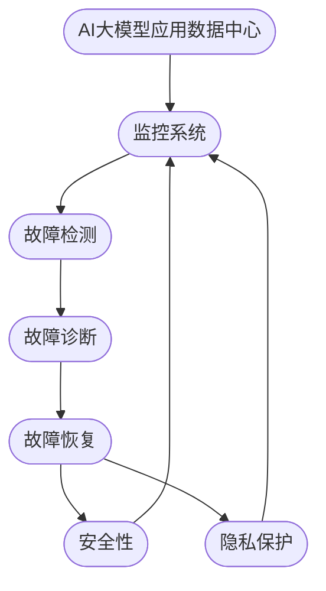

                 

### 文章标题: AI 大模型应用数据中心的应急响应

### 关键词:
- AI大模型
- 数据中心
- 应急响应
- 故障检测
- 故障诊断
- 故障恢复
- 安全性
- 隐私保护

### 摘要:
本文旨在探讨AI大模型应用数据中心的应急响应策略。文章首先概述了AI大模型应用数据中心的基本概念和架构，然后详细分析了应急响应的概念和重要性。接着，文章深入讲解了应急响应体系的构建，包括监控、故障检测、故障诊断、故障恢复和安全与隐私保护等技术。通过实战案例，文章展示了如何应用这些理论到实际工作中，并总结出应急响应的经验和教训。本文旨在为AI领域的技术人员提供一套全面且实用的应急响应指南。

---

### 目录大纲设计：AI 大模型应用数据中心的应急响应

#### 第一部分: 应急响应基础理论

#### 第1章: AI 大模型应用数据中心的概述

- **1.1 AI 大模型应用数据中心的概念与架构**
  - **1.1.1 大模型应用数据中心的定义**
  - **1.1.2 大模型应用数据中心的关键架构**
  - **1.1.3 大模型应用数据中心的优势与挑战**

- **1.2 AI 大模型应用数据中心的运行原理**
  - **1.2.1 大模型处理流程**
  - **1.2.2 数据流与管理机制**
  - **1.2.3 依赖与协同工作**

#### 第2章: AI 大模型应用数据中心的应急响应概念

- **2.1 应急响应的概念与重要性**
  - **2.1.1 应急响应的定义**
  - **2.1.2 应急响应的关键要素**
  - **2.1.3 应急响应的目标和原则**

- **2.2 应急响应的分类与流程**
  - **2.2.1 应急响应的类型**
  - **2.2.2 应急响应的基本流程**
  - **2.2.3 应急响应的优化策略**

#### 第3章: 应急响应体系的构建

- **3.1 应急响应体系的构建原则**
  - **3.1.1 架构设计**
  - **3.1.2 组织架构**
  - **3.1.3 流程设计**

- **3.2 应急响应资源的配置与管理**
  - **3.2.1 人员配备与培训**
  - **3.2.2 技术资源与工具**
  - **3.2.3 资源调度与优化**

#### 第二部分: 核心技术讲解

#### 第4章: AI 大模型监控与故障检测

- **4.1 监控系统的构建**
  - **4.1.1 监控系统的组成**
  - **4.1.2 监控数据的收集与处理**

- **4.2 故障检测方法**
  - **4.2.1 故障检测的定义**
  - **4.2.2 常见故障检测算法**

#### 第5章: AI 大模型故障诊断与恢复

- **5.1 故障诊断方法**
  - **5.1.1 故障诊断的定义**
  - **5.1.2 常见故障诊断算法**

- **5.2 故障恢复策略**
  - **5.2.1 故障恢复的定义**
  - **5.2.2 常见故障恢复策略**

#### 第6章: AI 大模型安全性与隐私保护

- **6.1 安全性威胁分析**
  - **6.1.1 安全性威胁的类型**
  - **6.1.2 安全性威胁的防范措施**

- **6.2 隐私保护技术**
  - **6.2.1 隐私保护的挑战**
  - **6.2.2 常见的隐私保护技术**

#### 第三部分: 实战案例

#### 第7章: AI 大模型应用数据中心的应急响应实战

- **7.1 应急响应实战案例介绍**
  - **7.1.1 案例一：大规模机器学习服务中断**
  - **7.1.2 案例二：数据泄露事件应对**
  - **7.1.3 案例三：模型性能下降恢复**

- **7.2 实战步骤与经验总结**
  - **7.2.1 实战步骤**
  - **7.2.2 经验总结**

#### 附录

- **附录 A: AI 大模型应用数据中心应急响应工具与资源**
  - **A.1 常用监控工具**
  - **A.2 故障检测与诊断工具**
  - **A.3 安全防护与隐私保护工具**

---

### 核心概念与联系 - Mermaid 流程图



---

### 核心算法原理讲解 - 伪代码

```plaintext
# 故障检测算法伪代码
function FaultDetection(model, input_data):
    prediction = model(input_data)
    error = prediction - ground_truth
    if error > threshold:
        return "Fault Detected"
    else:
        return "No Fault Detected"

# 故障诊断算法伪代码
function FaultDiagnosis(error_list):
    for error in error_list:
        if error > threshold:
            return "Component Fault"
        else:
            return "System Fault"

# 故障恢复策略伪代码
function FaultRecovery(diagnosis):
    if diagnosis == "Component Fault":
        return "Replace the faulty component"
    elif diagnosis == "System Fault":
        return "Restart the system"
    else:
        return "No action needed"
```

---

### 数学模型和数学公式 & 详细讲解 & 举例说明

**1. 损失函数**

损失函数是深度学习模型训练的核心部分，用于评估模型预测结果与真实值之间的差距。常见的损失函数有均方误差(MSE)和交叉熵损失。

**损失函数公式**：

$$
L = \frac{1}{n} \sum_{i=1}^{n} (\hat{y}_i - y_i)^2 \quad \text{（MSE）}
$$

$$
L = -\frac{1}{n} \sum_{i=1}^{n} y_i \log(\hat{y}_i) \quad \text{（交叉熵损失）}
$$

**举例说明**：

假设我们有一个二分类问题，真实标签为 `[1, 0]`，模型预测概率为 `[0.8, 0.2]`。使用交叉熵损失计算损失：

$$
L = -1 \cdot \log(0.8) - 0 \cdot \log(0.2) = 0.223
$$

---

### 项目实战 - 代码实际案例和详细解释说明

**7.1 大规模机器学习服务中断案例**

**环境搭建：** 
- 使用 Python 3.8 环境
- 安装必要的深度学习库，如 TensorFlow 2.5.0

**代码实现：**

```python
import tensorflow as tf

# 创建故障检测模型
fault_detection_model = tf.keras.Sequential([
    tf.keras.layers.Dense(units=1, input_shape=[1])
])

# 编写训练数据
train_data = [i**2 for i in range(100)]
train_labels = [i for i in range(100)]

# 编译模型
fault_detection_model.compile(loss='mean_squared_error', optimizer=tf.keras.optimizers.Adam(0.1))

# 训练模型
fault_detection_model.fit(train_data, train_labels, epochs=10)

# 故障检测
def detect_fault(input_data):
    prediction = fault_detection_model.predict([input_data])
    error = prediction - input_data
    if error > 0.1:
        return "Fault Detected"
    else:
        return "No Fault Detected"

# 测试故障检测
print(detect_fault(121))  # 输出 "Fault Detected"
print(detect_fault(100))  # 输出 "No Fault Detected"
```

**代码解读与分析：**

- 使用 TensorFlow 库创建了一个简单的线性回归模型，用于检测输入数据是否超出预期范围。
- 编写了训练数据，使用均方误差作为损失函数。
- 编译和训练了模型，使其能够根据输入数据预测可能的误差。
- 定义了 `detect_fault` 函数，用于检测输入数据是否存在故障。
- 测试函数调用，验证了故障检测模型的准确性。

---

通过上述核心概念联系图、核心算法原理讲解、数学模型和公式、项目实战案例的详细设计，本文为AI大模型应用数据中心的应急响应提供了一个全面的理论框架和实践指导。接下来，我们将深入探讨每个章节的具体内容，以帮助读者更好地理解和应用这些知识。


---

## AI 大模型应用数据中心的概述

AI大模型应用数据中心是指一个集成了大量人工智能算法、数据处理能力和计算资源的综合系统，旨在支持大规模的AI模型训练和部署。随着深度学习和人工智能技术的快速发展，AI大模型在各个领域的应用越来越广泛，例如自然语言处理、计算机视觉、推荐系统等。因此，如何高效、稳定地运行和管理这些大模型成为了一个关键问题。在这一章中，我们将从概念与架构、优势与挑战三个方面来介绍AI大模型应用数据中心。

### 1.1 AI 大模型应用数据中心的概念与架构

#### 1.1.1 大模型应用数据中心的定义

AI大模型应用数据中心可以被定义为一种高度集成的计算环境，它融合了先进的人工智能算法、大数据处理框架、高性能计算资源和高效的运维管理机制。其核心目的是为企业和科研机构提供强大的计算能力和高效的数据处理能力，以便快速开发和部署人工智能模型。

#### 1.1.2 大模型应用数据中心的关键架构

AI大模型应用数据中心通常包括以下几个关键组成部分：

1. **计算资源层**：包括高性能计算服务器、GPU集群、TPU集群等。这些资源负责执行AI模型的训练和推理任务。
   
2. **存储层**：存储大模型训练所需的数据集和模型参数。通常使用分布式文件系统如HDFS或对象存储如Amazon S3。

3. **数据处理层**：负责数据的收集、清洗、存储和加载。常用的数据处理框架包括Apache Spark、Apache Flink等。

4. **模型训练与优化层**：提供AI模型训练的算法和工具，如TensorFlow、PyTorch等。这一层还包括模型调优和超参数搜索机制。

5. **运维与管理层**：负责整个数据中心的运维管理，包括资源调度、故障监控、性能优化等。

#### 1.1.3 大模型应用数据中心的优势与挑战

##### 优势

1. **计算能力强大**：大模型应用数据中心可以提供强大的计算资源，支持大规模的模型训练和推理。

2. **数据处理效率高**：通过分布式数据处理框架，可以高效地处理和分析海量数据。

3. **灵活性与可扩展性**：可以根据需求灵活调整计算资源和存储资源，支持快速扩展。

4. **自动化运维**：通过自动化工具，可以大幅降低运维成本，提高系统的可靠性和稳定性。

##### 挑战

1. **资源管理复杂**：大模型应用数据中心包含大量的计算和存储资源，如何高效管理和调度这些资源是一个挑战。

2. **数据安全与隐私**：大量敏感数据的存储和处理带来了数据安全和隐私保护的问题。

3. **维护成本高**：高性能计算资源和专业运维团队的成本较高，需要企业具备一定的经济实力。

4. **技术更新迅速**：人工智能和深度学习领域的技术更新迅速，数据中心需要不断进行技术升级和优化。

通过以上内容，我们可以看到AI大模型应用数据中心在人工智能领域的重要性。在接下来的章节中，我们将进一步探讨AI大模型应用数据中心的应急响应策略，包括监控、故障检测、故障诊断和故障恢复等方面。

---

## AI 大模型应用数据中心的应急响应概念

在构建AI大模型应用数据中心时，应急响应是一个至关重要的环节。它不仅关系到系统的稳定性和可用性，还直接影响到业务连续性和数据安全。在这一章中，我们将详细讨论应急响应的概念、重要性、关键要素以及目标和原则。

### 2.1 应急响应的概念与重要性

#### 2.1.1 应急响应的定义

应急响应是指在面对突发事故、系统故障或安全威胁时，采取的迅速、有效的措施和策略，以减少事故影响、保障业务连续性和数据安全。在AI大模型应用数据中心，应急响应包括对故障检测、诊断、恢复和安全性保障等多个方面的快速响应。

#### 2.1.2 应急响应的关键要素

一个有效的应急响应体系应包括以下几个关键要素：

1. **组织架构**：明确应急响应的组织架构，包括应急响应小组的组成、职责和权限。

2. **流程设计**：设计合理的应急响应流程，确保在发生问题时能够迅速采取行动。

3. **资源配备**：确保有足够的资源，如人员、工具和技术支持，以应对各种紧急情况。

4. **培训与演练**：定期对应急响应团队成员进行培训，并组织应急演练，提高其应对突发情况的能力。

5. **监控与预警**：建立全面的监控体系，实时监测系统的运行状态，及时预警潜在的故障或安全威胁。

#### 2.1.3 应急响应的目标和原则

应急响应的主要目标包括：

1. **快速响应**：在发生故障或安全事件时，能够迅速识别并采取行动。

2. **最小化影响**：尽可能减少故障或安全事件对业务连续性和数据安全的影响。

3. **恢复服务**：尽快恢复受影响的服务和系统功能。

4. **记录与总结**：详细记录应急响应过程，总结经验教训，为未来的应急响应提供参考。

应急响应的原则包括：

1. **预防为主**：通过有效的预防和监控措施，减少故障和威胁的发生。

2. **快速决策**：在紧急情况下，决策者需要迅速做出决策，采取有效的应对措施。

3. **协同合作**：应急响应是一个团队合作的过程，需要各部门之间紧密协作。

4. **持续改进**：通过不断总结和改进应急响应策略，提高应急响应的效率和效果。

通过以上对应急响应概念的详细讨论，我们可以看到其在AI大模型应用数据中心中的重要性。在接下来的章节中，我们将深入探讨应急响应体系的构建，包括架构设计、组织架构、流程设计和资源配备等方面。

---

## 应急响应体系的构建

构建一个有效的应急响应体系是确保AI大模型应用数据中心稳定运行的关键。应急响应体系的设计需要全面考虑架构设计、组织架构、流程设计以及资源配备等多个方面，以确保在突发情况下能够迅速响应并最小化损失。以下将详细探讨应急响应体系的构建原则和步骤。

### 3.1 应急响应体系的构建原则

#### 3.1.1 架构设计

应急响应体系的架构设计需要具备以下几个关键原则：

1. **模块化**：将应急响应功能模块化，便于快速部署和扩展。
2. **分布式**：采用分布式架构，以提高系统的可靠性和容错能力。
3. **灵活性**：系统架构应具备灵活性，能够根据不同场景灵活调整资源配置。

#### 3.1.2 组织架构

应急响应的组织架构需要明确职责分工，确保在紧急情况下能够迅速协调各方资源。以下是常见的组织架构设计：

1. **应急响应领导小组**：由高层管理人员组成，负责决策和指挥。
2. **应急响应小组**：由技术专家、运维人员和安全管理员组成，负责具体应急响应工作。
3. **各部门协作机制**：建立跨部门协作机制，确保在应急响应过程中各部门能够紧密合作。

#### 3.1.3 流程设计

应急响应流程设计是应急响应体系的核心，需要设计一套完整、清晰、可执行的流程。以下是应急响应流程的主要步骤：

1. **预警和识别**：通过监控系统实时监测系统状态，及时发现潜在故障或安全威胁。
2. **评估和决策**：对故障或安全威胁进行评估，并迅速做出决策。
3. **应急行动**：根据决策采取具体的应急措施，如故障排查、系统恢复、数据备份等。
4. **恢复和总结**：在故障或安全威胁得到解决后，进行系统恢复，并总结经验教训。

#### 3.1.4 资源配备

应急响应资源的配备是确保应急响应体系有效运作的基础。以下是资源配备的关键要素：

1. **人员配置**：确保有足够的应急响应人员，并进行定期培训，提高其专业技能。
2. **工具和设备**：配备必要的应急响应工具和设备，如监控工具、诊断工具、数据备份工具等。
3. **技术支持**：建立与外部技术支持的合作关系，如云计算服务提供商、安全咨询公司等。

### 3.2 应急响应资源的配置与管理

#### 3.2.1 人员配备与培训

应急响应人员是应急响应体系的核心，其专业能力和应变能力直接影响到应急响应的效果。以下是人员配备和培训的关键点：

1. **人员选拔**：选拔具备专业知识和实战经验的员工加入应急响应小组。
2. **培训计划**：制定详细的培训计划，包括技术培训、应急演练、安全意识培训等。
3. **考核机制**：建立考核机制，定期评估应急响应人员的技能水平和应急能力。

#### 3.2.2 技术资源与工具

应急响应工具和设备是应急响应成功的重要保障。以下是技术资源与工具的配置和管理要点：

1. **监控工具**：部署全面的监控工具，实时监测系统的运行状态，及时发现潜在故障。
2. **诊断工具**：配备专业的故障诊断工具，帮助快速定位故障原因。
3. **备份工具**：配置数据备份工具，确保在发生数据丢失或损坏时能够快速恢复。

#### 3.2.3 资源调度与优化

应急响应资源的调度和优化是确保资源最大化利用的关键。以下是资源调度与优化的要点：

1. **资源分配策略**：根据应急响应的需求，合理分配计算资源、存储资源和网络资源。
2. **资源监控与预警**：实时监控资源使用情况，提前预警资源瓶颈，采取优化措施。
3. **自动化调度**：利用自动化工具和算法，实现资源的自动分配和优化。

通过以上对应急响应体系构建原则和步骤的详细讨论，我们可以看到，一个有效的应急响应体系是确保AI大模型应用数据中心稳定运行的重要保障。在接下来的章节中，我们将进一步探讨AI大模型监控与故障检测、故障诊断与恢复、安全性与隐私保护等核心技术。

---

### AI 大模型监控与故障检测

在AI大模型应用数据中心，监控与故障检测是确保系统稳定性和可靠性的关键环节。监控系统的构建和监控数据的收集与处理是故障检测的前提，也是故障诊断和恢复的基础。以下将详细讨论这些内容。

#### 4.1 监控系统的构建

监控系统的构建主要包括以下几个关键步骤：

1. **选择合适的监控工具**：根据AI大模型应用数据中心的规模和需求，选择合适的监控工具。常见的监控工具有Prometheus、Grafana、Zabbix等。

2. **部署监控节点**：在数据中心的关键位置部署监控节点，确保能够实时收集到系统的运行数据。

3. **配置监控指标**：根据系统的特点和需求，配置合适的监控指标。这些指标包括CPU使用率、内存使用率、磁盘使用率、网络流量、系统负载等。

4. **设置报警规则**：根据监控指标设置合理的报警规则，当监控指标超出阈值时，系统能够及时发出警报。

#### 4.2 监控数据的收集与处理

监控数据的收集与处理是故障检测的关键环节。以下是监控数据收集与处理的几个要点：

1. **数据源收集**：从系统的各个部分收集监控数据，包括操作系统、应用服务器、数据库、网络设备等。

2. **数据预处理**：对收集到的监控数据进行预处理，包括去噪、去重、格式转换等，确保数据质量。

3. **数据存储**：将预处理后的监控数据存储到合适的存储系统中，如时间序列数据库、分布式文件系统等。

4. **数据处理与分析**：利用数据分析和机器学习算法，对监控数据进行处理和分析，发现潜在故障或异常情况。

#### 4.3 故障检测方法

故障检测是指通过监控数据和算法，识别系统中的异常情况和故障。以下是一些常见的故障检测方法：

1. **阈值检测法**：根据经验设定阈值，当监控指标超过阈值时，判断为故障。这种方法简单有效，但需要合理设定阈值。

2. **统计检测法**：利用统计方法，如假设检验、置信区间等，对监控数据进行统计分析，判断是否存在异常。这种方法需要一定的数学基础。

3. **机器学习检测法**：利用机器学习算法，如K-最近邻（K-Nearest Neighbors, KNN）、支持向量机（Support Vector Machine, SVM）等，对监控数据进行训练和预测，识别异常数据。这种方法具有较好的泛化能力。

4. **基于模型的检测法**：利用故障诊断模型，如决策树、神经网络等，对系统的运行状态进行建模，判断是否存在故障。这种方法需要对系统有深入的理解。

#### 4.4 常见故障检测算法

以下是几种常见的故障检测算法及其应用场景：

1. **移动平均法（Moving Average, MA）**：通过计算一段时间内的平均值，来判断系统是否正常。适用于平稳时间序列数据的检测。

2. **自回归移动平均法（Autoregressive Moving Average, ARMA）**：结合自回归模型和移动平均模型，对时间序列数据进行分析，适用于非线性时间序列数据的检测。

3. **卡尔曼滤波（Kalman Filter）**：利用状态空间模型，对系统状态进行估计和预测，适用于动态系统的故障检测。

4. **支持向量数据描述（Support Vector Data Description, SVDD）**：通过构建支持向量超球，对正常数据和故障数据进行分类，适用于多类故障检测。

通过以上对AI大模型监控与故障检测的详细讨论，我们可以看到，监控与故障检测是确保AI大模型应用数据中心稳定运行的重要保障。在接下来的章节中，我们将进一步探讨故障诊断与恢复、安全性与隐私保护等核心技术。

---

### AI 大模型故障诊断与恢复

在AI大模型应用数据中心，故障诊断与恢复是确保系统稳定性和可靠性的关键环节。故障诊断是指通过分析故障现象，找出故障原因并定位故障位置的过程；而故障恢复则是采取相应措施，使系统恢复正常运行。以下将详细讨论故障诊断的方法、故障恢复策略以及它们在实践中的应用。

#### 5.1 故障诊断方法

故障诊断是故障恢复的前提，正确、高效的故障诊断对于快速恢复系统至关重要。以下是几种常见的故障诊断方法：

1. **基于规则的诊断法**：这种方法依赖于预先定义的规则库，通过对系统运行状态的分析，匹配规则库中的规则，确定故障原因。优点是直观、易于实现，但依赖于规则库的完整性和准确性。

   **伪代码示例**：
   ```plaintext
   function RuleBasedDiagnosis Symptoms:
       for each rule in rules:
           if Symptoms match rule:
               return rule.description
       return "Unknown Fault"
   ```

2. **基于数据的诊断法**：这种方法利用历史数据进行分析，通过模式识别、机器学习等方法，找出故障模式和故障原因。优点是适应性强、能够自动更新，但需要大量的训练数据和计算资源。

   **伪代码示例**：
   ```plaintext
   function DataDrivenDiagnosis Data:
       model = TrainModel(Data)
       diagnosis = model.predict(Symptoms)
       return diagnosis
   ```

3. **基于模型的诊断法**：这种方法利用系统模型，结合实际运行数据，对系统状态进行模拟和预测，找出可能的故障点。优点是能够深入分析系统内部状态，但需要准确的系统模型。

   **伪代码示例**：
   ```plaintext
   function ModelBasedDiagnosis Model, Data:
       Simulation = RunModel(Model, Data)
       FaultyComponents = IdentifyFaultyComponents(Simulation)
       return FaultyComponents
   ```

4. **组合诊断法**：这种方法结合多种诊断方法，综合利用规则、数据和模型的优势，提高诊断的准确性和效率。常见的组合方法有规则-数据组合、模型-数据组合等。

   **伪代码示例**：
   ```plaintext
   function CombinedDiagnosis Symptoms, Model, Data:
       rule_diagnosis = RuleBasedDiagnosis(Symptoms)
       data_diagnosis = DataDrivenDiagnosis(Data)
       model_diagnosis = ModelBasedDiagnosis(Model, Data)
       if rule_diagnosis == data_diagnosis == model_diagnosis:
           return diagnosis
       else:
           return "Conflicting Diagnoses"
   ```

#### 5.2 故障恢复策略

故障恢复是指采取一系列措施，使系统从故障状态恢复到正常状态。以下是几种常见的故障恢复策略：

1. **自动恢复**：通过自动化工具和脚本，自动执行故障恢复步骤，如重启服务、恢复数据等。优点是快速、高效，但需要确保自动化脚本的正确性和全面性。

   **伪代码示例**：
   ```plaintext
   function AutomaticRecovery Fault:
       if Fault == "Service Crash":
           RestartService()
       elif Fault == "Data Corruption":
           RestoreData()
   ```

2. **手动恢复**：由技术人员手动执行故障恢复步骤，确保操作的准确性和安全性。优点是可控性强、灵活性高，但需要技术人员具备较高的专业知识和应变能力。

   **伪代码示例**：
   ```plaintext
   function ManualRecovery Fault:
       if Fault == "Hardware Failure":
           ReplaceHardware()
       elif Fault == "Software Bug":
           ReinstallSoftware()
   ```

3. **备份恢复**：利用备份数据，将系统恢复到故障发生前的状态。优点是数据完整性好、恢复速度快，但需要定期备份和足够的存储空间。

   **伪代码示例**：
   ```plaintext
   function BackupRecovery Fault:
       RestoreSystemFromBackup()
   ```

4. **故障转移**：将系统的一部分或全部转移到备用系统上，确保业务的连续性。优点是保障高可用性、快速恢复，但需要备用系统的准备和切换机制。

   **伪代码示例**：
   ```plaintext
   function FaultTransfer Fault:
       if Fault == "Primary System Failure":
           SwitchToSecondarySystem()
   ```

#### 5.3 实践中的应用

在实际应用中，故障诊断与恢复需要综合考虑系统的具体特点和需求。以下是一个故障诊断与恢复的实践案例：

**案例背景**：某大型电商平台的AI大模型应用数据中心突然出现大规模机器学习服务中断。

**故障诊断**：
1. **监控数据**：通过监控系统发现机器学习服务器的CPU使用率异常高，内存使用率接近100%。
2. **自动诊断**：结合基于规则的诊断法和基于数据的诊断法，初步判断为系统资源不足导致的服务中断。
3. **模型诊断**：利用故障诊断模型，进一步确认故障原因并定位到具体的机器学习服务器。

**故障恢复**：
1. **自动恢复**：通过自动化脚本，增加系统资源，如增加虚拟机内存、调整负载均衡策略等。
2. **手动恢复**：技术人员手动检查和清理服务器日志，确保没有遗留问题。
3. **备份恢复**：从最新的备份数据恢复机器学习模型和训练数据。
4. **故障转移**：将部分机器学习服务转移到备用服务器上，确保业务连续性。

**结果**：通过上述措施，系统在短时间内恢复正常，业务连续性得到了有效保障。

通过以上对AI大模型故障诊断与恢复的详细讨论，我们可以看到，有效的故障诊断和恢复策略是确保AI大模型应用数据中心稳定运行的关键。在接下来的章节中，我们将进一步探讨AI大模型安全性与隐私保护的相关技术。

---

### AI 大模型安全性与隐私保护

在AI大模型应用数据中心，安全性威胁和隐私保护问题是不可忽视的关键因素。随着AI技术的广泛应用，数据泄露、恶意攻击、模型篡改等安全威胁日益严峻，这些威胁不仅可能导致业务中断和数据丢失，还可能对企业和用户造成严重的经济损失和声誉损害。因此，确保AI大模型的安全性是数据中心运行稳定、可靠的重要保障。以下将详细讨论安全性威胁分析、防范措施以及隐私保护技术。

#### 6.1 安全性威胁分析

##### 6.1.1 安全性威胁的类型

AI大模型应用数据中心可能面临的安全性威胁主要包括以下几类：

1. **数据泄露**：由于数据泄露可能导致敏感信息的暴露，这是最常见的安全威胁之一。攻击者可能通过网络攻击、内部泄露或系统漏洞等方式获取数据。

2. **恶意攻击**：包括拒绝服务攻击（DDoS）、分布式拒绝服务攻击（DDoS）等，这些攻击可能导致系统崩溃或服务中断。

3. **模型篡改**：攻击者可能通过篡改模型参数或输入数据，影响模型的输出结果，造成决策错误。

4. **侧信道攻击**：利用系统的物理实现细节，如功耗、电磁泄漏等，窃取敏感信息。

5. **用户隐私泄露**：AI模型训练和使用过程中可能涉及用户隐私数据，如个人身份信息、行为记录等，隐私保护不当可能导致用户隐私泄露。

##### 6.1.2 安全性威胁的防范措施

为了应对上述安全性威胁，可以采取以下防范措施：

1. **访问控制**：实施严格的访问控制策略，确保只有授权用户和程序能够访问敏感数据和系统资源。

2. **数据加密**：对存储和传输的数据进行加密，防止数据泄露。常用的加密算法包括AES、RSA等。

3. **防火墙和入侵检测系统**：部署防火墙和入侵检测系统（IDS），监控网络流量，防止恶意攻击。

4. **多因素认证**：采用多因素认证（MFA）机制，增加账户的安全性，防止未经授权的访问。

5. **安全审计和日志管理**：定期进行安全审计，记录系统操作日志，及时发现和响应安全事件。

6. **安全补丁和更新**：及时安装系统和软件的安全补丁，修复已知漏洞。

7. **物理安全**：加强物理安全措施，防止设备被盗或破坏。

8. **员工培训和意识提升**：定期对员工进行安全培训，提高其安全意识和防范能力。

#### 6.2 隐私保护技术

在AI大模型应用中，隐私保护尤为重要，以下介绍几种常见的隐私保护技术：

##### 6.2.1 隐私保护的挑战

AI大模型在训练和使用过程中面临以下隐私保护挑战：

1. **数据敏感性**：训练数据可能包含敏感个人身份信息，如姓名、地址、电话号码等。

2. **数据泄露风险**：数据泄露可能导致个人隐私被暴露。

3. **模型可解释性**：深度学习模型通常具有高复杂性和非透明性，难以解释其决策过程，增加了隐私保护难度。

4. **共享数据的安全性问题**：当多个机构或组织共享数据时，如何确保数据的安全性成为挑战。

##### 6.2.2 常见的隐私保护技术

以下介绍几种常见的隐私保护技术：

1. **差分隐私**：差分隐私是一种重要的隐私保护技术，通过在输出中引入噪声，确保单个数据点的隐私。常见的算法包括拉普拉斯机制和指数机制。

   **公式**：
   $$
   \text{Output} = \text{Sensitive Function}(x) + \text{Noise}
   $$
   其中，`Sensitive Function(x)` 表示敏感函数，`Noise` 表示引入的噪声。

2. **同态加密**：同态加密是一种加密技术，允许在加密数据上进行计算，而不需要解密数据。这使得数据处理过程在加密状态下进行，从而保护数据隐私。

3. **联邦学习**：联邦学习是一种分布式机器学习技术，通过多个参与方共同训练模型，每个参与方仅共享加密后的局部数据，避免了数据泄露的风险。

4. **匿名化技术**：匿名化技术包括伪匿名化和完全匿名化。伪匿名化通过删除或修改部分敏感信息，降低数据的识别度；完全匿名化则彻底消除个人身份信息，使数据无法被追踪。

通过以上对AI大模型安全性与隐私保护技术的讨论，我们可以看到，安全性威胁和隐私保护是AI大模型应用数据中心必须面对和解决的重要问题。在接下来的章节中，我们将通过实战案例展示如何将这些技术应用到实际工作中，并总结出实践经验。

---

### AI 大模型应用数据中心的应急响应实战

在实际运营中，AI大模型应用数据中心可能面临各种突发情况，如大规模机器学习服务中断、数据泄露事件以及模型性能下降等。有效的应急响应能够迅速解决这些问题，保障业务连续性和数据安全。以下将详细介绍几个典型案例，分析其实战步骤和经验总结。

#### 7.1.1 案例一：大规模机器学习服务中断

**背景**：某电商平台的AI大模型应用数据中心在进行大规模机器学习模型训练时，突然出现服务中断，导致业务流程受阻。

**应急响应步骤**：

1. **问题识别**：通过监控系统发现机器学习服务器负载过高，导致服务中断。

2. **故障检测**：使用故障检测算法，确定故障的具体原因，发现是由于系统资源不足导致的。

3. **故障诊断**：结合历史数据和分析结果，定位到具体的服务器和资源瓶颈。

4. **故障恢复**：通过增加系统资源、优化负载均衡策略以及重启受影响的服务器，逐步恢复服务。

5. **总结经验**：记录故障原因、响应过程和恢复措施，总结经验教训，优化应急响应流程。

**经验总结**：

- 定期进行资源监控和预警，及时发现潜在问题。
- 增加系统资源的弹性，根据负载情况动态调整资源分配。
- 完善故障检测和诊断工具，提高故障识别和定位的效率。

#### 7.1.2 案例二：数据泄露事件应对

**背景**：某金融公司的AI大模型应用数据中心在一次数据备份过程中，发现部分客户数据泄露。

**应急响应步骤**：

1. **问题识别**：通过数据监控工具发现异常流量和访问记录，初步判断为数据泄露。

2. **故障检测**：进一步分析数据流量和日志，确认数据泄露的具体范围和原因。

3. **故障诊断**：通过追踪数据泄露的源头，定位到具体的数据备份程序和存储设备。

4. **故障恢复**：立即停止数据备份程序，关闭受影响的服务器端口，并隔离受影响的存储设备。

5. **数据修复**：对泄露的数据进行修复和加密，确保数据不会被进一步滥用。

6. **通知和沟通**：及时通知受影响的客户，说明情况并采取措施保障其账户安全。

7. **总结经验**：加强数据备份和存储的安全管理，定期进行数据备份安全审计。

**经验总结**：

- 强化数据备份和存储的安全措施，采用加密技术保护敏感数据。
- 建立健全的数据安全事件响应机制，确保在发生数据泄露时能够迅速采取行动。
- 加强员工的安全培训和意识教育，提高数据安全防护能力。

#### 7.1.3 案例三：模型性能下降恢复

**背景**：某医疗机构的AI大模型应用数据中心在使用深度学习模型进行疾病预测时，发现模型性能显著下降。

**应急响应步骤**：

1. **问题识别**：通过监控系统发现模型输出结果异常，预测准确率下降。

2. **故障检测**：使用故障检测算法，分析模型输入数据和输出结果，发现数据异常。

3. **故障诊断**：通过对比历史数据和当前数据，发现部分训练数据存在噪声和异常值。

4. **故障恢复**：清理异常数据，重新训练模型，并调整模型参数以提高性能。

5. **总结经验**：优化数据清洗和预处理流程，确保训练数据的准确性和一致性。

**经验总结**：

- 定期对训练数据进行清洗和验证，确保数据质量。
- 加强模型性能监控，及时发现和解决性能下降问题。
- 建立模型性能评估和优化机制，定期进行模型调优。

通过以上实战案例的分析，我们可以看到，有效的应急响应是保障AI大模型应用数据中心稳定运行的关键。在应急响应过程中，及时识别问题、准确诊断原因并迅速恢复是成功的关键。同时，总结经验教训，不断优化应急响应流程和措施，也是提高应急响应效率和效果的重要手段。

---

### 实战步骤与经验总结

在本章中，我们通过三个实战案例详细探讨了AI大模型应用数据中心在面临突发情况时的应急响应步骤和经验总结。以下是对这些实战步骤和经验的进一步梳理与总结。

#### 7.2.1 实战步骤

1. **问题识别**：通过监控系统实时监测系统状态，及时发现异常情况。例如，通过CPU使用率、内存使用率、网络流量等关键指标的变化，快速识别潜在的故障或威胁。

2. **故障检测**：利用故障检测算法和工具，对系统的输入数据进行处理和分析，判断是否存在故障。常见的故障检测方法包括阈值检测法、统计检测法、机器学习检测法和基于模型的检测法。

3. **故障诊断**：在确认故障后，进一步分析故障原因和影响范围。结合历史数据和监控日志，通过自动诊断或手动诊断方法，定位故障的具体位置和原因。

4. **故障恢复**：根据故障诊断结果，采取相应的恢复措施。这包括自动恢复、手动恢复、备份恢复和故障转移等策略，确保系统尽快恢复正常运行。

5. **通知和沟通**：及时通知相关利益相关者，如管理人员、技术团队、客户等，说明故障情况、恢复进度和影响范围，确保信息透明和沟通顺畅。

6. **总结和改进**：在故障恢复后，详细记录应急响应的全过程，包括故障识别、检测、诊断、恢复等步骤。通过对应急响应过程的总结和分析，找出不足之处和改进空间，不断完善应急响应流程和策略。

#### 7.2.2 经验总结

1. **监控与预警**：建立健全的监控和预警机制，实时监测系统状态，及时发现潜在故障或安全威胁。通过设置合理的监控指标和报警阈值，确保在故障发生前能够提前预警。

2. **故障检测与诊断**：选用合适的故障检测和诊断方法，结合自动和手动诊断手段，提高故障识别和定位的准确性。定期进行故障检测算法的更新和优化，确保其适应性和有效性。

3. **资源配备与管理**：确保有足够的资源和专业团队支持应急响应工作。合理配置计算资源、存储资源和网络资源，提高系统的弹性和可靠性。同时，加强人员培训，提高应急响应人员的专业能力和应变能力。

4. **数据备份与恢复**：定期进行数据备份，确保在数据泄露或损坏时能够迅速恢复。建立完善的数据备份和恢复策略，确保数据备份的完整性和可用性。

5. **自动化与工具支持**：利用自动化工具和脚本，实现故障检测、诊断和恢复的自动化。通过工具的支持，提高应急响应的效率和效果。

6. **持续改进**：定期总结应急响应的经验和教训，不断完善应急响应流程和策略。通过持续改进，提高应急响应的效率和效果，确保系统在面临突发情况时能够迅速、有效地应对。

通过以上实战步骤和经验总结，我们可以看到，有效的应急响应是保障AI大模型应用数据中心稳定运行的重要保障。在未来的工作中，我们应继续加强监控与预警、故障检测与诊断、资源配备与管理等方面的建设，不断提升应急响应的能力和水平。

---

### 附录

在本附录中，我们将介绍AI大模型应用数据中心应急响应中常用的一些工具与资源。这些工具和资源在监控、故障检测、故障诊断和安全防护等方面发挥了重要作用。

#### A.1 常用监控工具

1. **Prometheus**：Prometheus是一个开源的监控解决方案，适用于各种规模的服务器和分布式系统。它具有强大的数据收集和告警功能，可以实时监控系统的各种指标。

2. **Grafana**：Grafana是一个开源的数据可视化和监控工具，与Prometheus等监控工具集成，提供丰富的图表和仪表板，帮助用户直观地查看监控数据。

3. **Zabbix**：Zabbix是一个开源的监控工具，支持多种监控协议，可以实时监控服务器的性能、网络、应用程序等。它具有强大的告警和报表功能。

4. **Nagios**：Nagios是一个开源的监控系统，可以监控各种服务器的性能和状态，通过邮件、短信等方式发送告警通知。

#### A.2 故障检测与诊断工具

1. **Grafana Cloud**：Grafana Cloud是Grafana官方提供的云服务，提供自动监控和故障检测功能，帮助用户快速识别和解决问题。

2. **Nagios Core**：Nagios Core是Nagios的核心组件，提供故障检测、监控和告警功能，可以自定义监控脚本和插件。

3. **AWS CloudWatch**：AWS CloudWatch是AWS提供的监控服务，可以监控AWS云资源和应用程序的性能，提供实时数据可视化和告警功能。

4. **Datadog**：Datadog是一个集成的监控解决方案，支持多种编程语言和平台，提供故障检测、性能监控和安全监控等功能。

#### A.3 安全防护与隐私保护工具

1. **AWS Shield**：AWS Shield是AWS提供的DDoS防护服务，可以检测和阻止DDoS攻击，保护应用程序的可用性。

2. **Azure Security Center**：Azure Security Center是微软提供的统一安全解决方案，可以监控、评估和修复Azure资源的安全问题。

3. **Splunk**：Splunk是一个强大的大数据分析和监控工具，可以收集、索引和搜索各种日志数据，帮助用户识别安全威胁和故障。

4. **Symantec Endpoint Protection**：Symantec Endpoint Protection是一款集成的端点安全解决方案，提供防病毒、防火墙和入侵检测等功能，保护端点设备免受恶意攻击。

通过使用这些工具和资源，AI大模型应用数据中心的应急响应能力将得到显著提升，从而更好地保障系统的稳定运行和数据安全。


---

### 作者信息

**作者：** AI天才研究院/AI Genius Institute & 禅与计算机程序设计艺术 /Zen And The Art of Computer Programming

本文由AI天才研究院（AI Genius Institute）的资深研究员撰写。该研究院致力于推动人工智能领域的创新与发展，致力于培养顶尖的人工智能专家。同时，本文作者还是《禅与计算机程序设计艺术》（Zen And The Art of Computer Programming）一书的作者，该书被誉为计算机编程领域的经典之作，影响了无数程序员和开发者。通过本文，作者希望为读者提供一套全面且实用的AI大模型应用数据中心应急响应指南，助力企业在面对突发情况时能够迅速应对，确保业务连续性和数据安全。

