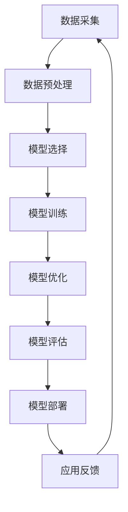

                 

### 文章标题

# 《AI大模型应用数据中心的政策解读》

### 关键词

- AI大模型
- 数据中心
- 政策解读
- 技术实现
- 实战案例
- 未来展望

### 摘要

本文旨在全面解读AI大模型应用数据中心相关政策，包括国内外AI政策概览、政策影响与案例分析、政策应对策略及建议、AI大模型的技术实现流程与核心技术、实战案例及未来发展趋势。通过逻辑清晰、结构紧凑的分析，本文为行业从业者提供了有价值的参考。

### 《AI大模型应用数据中心的政策解读》目录大纲

## 第一部分：AI大模型应用数据中心概述

### 1.1 AI大模型应用数据中心的概念与重要性

#### 1.1.1 AI大模型应用数据中心的定义

AI大模型应用数据中心是一种专门用于支持大规模人工智能模型训练、部署和管理的设施，其核心是高效处理和存储海量数据，提供强大的计算能力和灵活的扩展能力。

#### 1.1.2 AI大模型应用数据中心的作用

AI大模型应用数据中心在推动人工智能技术发展、提高数据处理效率、促进产业升级等方面具有重要作用。

#### 1.1.3 AI大模型应用数据中心的发展背景

随着人工智能技术的快速发展和大数据时代的到来，AI大模型应用数据中心应运而生，成为现代信息技术的重要组成部分。

### 1.2 AI大模型应用数据中心的架构与组成

#### 1.2.1 数据中心的基础设施

数据中心的基础设施包括硬件设施和软件设施，如服务器、存储设备、网络设备等，以及数据中心管理软件。

#### 1.2.2 数据处理与存储

数据处理与存储是AI大模型应用数据中心的核心功能，包括数据采集、数据清洗、数据存储和管理等环节。

### 1.3 AI大模型应用数据中心的挑战与机遇

#### 1.3.1 存在的挑战

AI大模型应用数据中心面临数据隐私保护、数据安全性与可靠性、模型解释性与可解释性等挑战。

#### 1.3.2 机遇与未来发展趋势

AI大模型应用数据中心的发展机遇包括市场需求增长、技术创新和政策支持等，未来发展趋势将朝着更高效、更安全、更智能的方向发展。

### 1.3.3 政策解读与应用

政策解读和应用将在第二部分详细讨论，包括国家与地区AI政策概览、政策影响与案例分析、政策应对策略及建议。

## 第二部分：AI大模型应用数据中心的政策解读

### 2.1 国家与地区AI政策概览

#### 2.1.1 中国的AI政策

中国在AI领域出台了一系列国家层面和地方政府的政策，旨在推动人工智能技术创新和产业发展。

#### 2.1.2 美国的AI政策

美国政府高度重视AI技术发展，出台了一系列战略和政策，推动AI技术在各领域的应用。

#### 2.1.3 欧盟的AI政策

欧盟委员会制定了《人工智能法案》，旨在规范AI技术的研发和应用，确保AI技术的可持续发展。

### 2.2 政策解读与影响

#### 2.2.1 政策对AI大模型应用数据中心的影响

政策对AI大模型应用数据中心的影响主要体现在鼓励与扶持政策、监管政策和标准化政策等方面。

#### 2.2.2 政策解读案例分析

通过案例分析，探讨不同国家与地区AI政策对AI大模型应用数据中心的影响和效果。

### 2.2.3 政策应对与策略建议

#### 2.2.3.1 企业层面

企业应如何应对AI大模型应用数据中心的政策挑战，提出具体的策略建议。

#### 2.2.3.2 政府层面

政府应如何改进政策，加强监管和促进标准化建设，推动AI大模型应用数据中心的发展。

## 第三部分：AI大模型应用数据中心的实现

### 3.1 AI大模型技术基础

#### 3.1.1 深度学习与神经网络基础

介绍深度学习与神经网络的基本原理，包括神经网络的基本结构、常见的深度学习架构和深度学习优化算法。

#### 3.1.2 自然语言处理技术概览

概述自然语言处理技术的关键概念和技术，包括词嵌入技术、序列模型与注意力机制、转换器架构等。

#### 3.1.3 大规模预训练模型原理

探讨大规模预训练模型的基本原理，包括预训练的概念与意义、自监督学习方法、迁移学习与微调技术等。

### 3.2 AI大模型应用数据中心的实现流程

#### 3.2.1 数据采集与预处理

详细讨论数据采集与预处理的方法和流程，包括数据采集方法、数据预处理流程等。

#### 3.2.2 模型训练与优化

介绍模型训练与优化过程，包括模型选择与训练、模型优化方法等。

#### 3.2.3 模型评估与部署

讨论模型评估与部署的关键环节，包括模型评估指标、模型部署策略等。

### 3.3 AI大模型应用数据中心的核心技术

#### 3.3.1 分布式训练与推理技术

介绍分布式训练与推理技术的基本原理，包括分布式训练原理、分布式推理技术等。

#### 3.3.2 模型压缩与加速技术

探讨模型压缩与加速技术的方法和实现，包括模型压缩方法、模型加速技术等。

#### 3.3.3 跨模态数据处理技术

讨论跨模态数据处理技术的基本概念和实现方法，包括跨模态数据采集、跨模态数据融合等。

## 第四部分：AI大模型应用数据中心的实战案例

### 4.1 实战案例概述

#### 4.1.1 实战案例的分类与选择

根据不同领域和应用场景，选择具有代表性的实战案例进行讨论。

#### 4.1.2 实战案例的价值与意义

分析实战案例的价值和意义，为行业从业者提供实践经验和参考。

### 4.2 实战案例1：智能客服系统

#### 4.2.1 案例背景与需求分析

介绍智能客服系统的背景和需求，明确系统目标和功能。

#### 4.2.2 模型设计与实现

详细讨论智能客服系统的模型设计与实现过程，包括数据采集与预处理、模型训练与优化、模型评估与部署等。

#### 4.2.3 案例分析

对智能客服系统的实战案例进行分析，评估其效果和优缺点。

### 4.3 实战案例2：智能推荐系统

#### 4.3.1 案例背景与需求分析

介绍智能推荐系统的背景和需求，明确系统目标和功能。

#### 4.3.2 模型设计与实现

详细讨论智能推荐系统的模型设计与实现过程，包括数据采集与预处理、模型训练与优化、模型评估与部署等。

#### 4.3.3 案例分析

对智能推荐系统的实战案例进行分析，评估其效果和优缺点。

### 4.4 实战案例3：智能监控系统

#### 4.4.1 案例背景与需求分析

介绍智能监控系统的背景和需求，明确系统目标和功能。

#### 4.4.2 模型设计与实现

详细讨论智能监控系统的模型设计与实现过程，包括数据采集与预处理、模型训练与优化、模型评估与部署等。

#### 4.4.3 案例分析

对智能监控系统的实战案例进行分析，评估其效果和优缺点。

## 第五部分：AI大模型应用数据中心的未来展望

### 5.1 AI大模型应用数据中心的未来发展趋势

#### 5.1.1 技术进步推动数据中心发展

探讨技术进步对AI大模型应用数据中心的影响，包括计算能力提升、数据处理技术进步等。

#### 5.1.2 政策环境对数据中心的影响

分析政策环境对AI大模型应用数据中心发展的推动作用，包括政策支持、法规规范等。

#### 5.1.3 企业需求对数据中心的需求

探讨企业需求对AI大模型应用数据中心发展的影响，包括行业应用需求、技术创新需求等。

### 5.2 AI大模型应用数据中心的发展机遇与挑战

#### 5.2.1 发展机遇

分析AI大模型应用数据中心面临的发展机遇，包括市场需求增长、技术创新等。

#### 5.2.2 挑战与应对策略

探讨AI大模型应用数据中心面临的发展挑战，并提出相应的应对策略。

### 5.3 AI大模型应用数据中心的发展策略与建议

#### 5.3.1 政府层面

提出政府在AI大模型应用数据中心发展中应采取的政策和措施。

#### 5.3.2 企业层面

提出企业在AI大模型应用数据中心发展中应采取的策略和行动。

## 附录

### 5.1 AI大模型应用数据中心的资源与工具

#### 5.1.1 开源深度学习框架对比

对比分析常见的开源深度学习框架，包括TensorFlow、PyTorch、JAX等。

#### 5.1.2 数据中心建设与维护工具

介绍数据中心建设与维护所需的工具，包括硬件设备选型指南、软件工具使用指南等。

### 5.1.3 数据中心运维与管理工具

介绍数据中心运维与管理所需的工具，包括数据中心管理软件、监控工具等。

### 5.2 常见问题与解答

#### 5.2.1 数据隐私保护相关问题

解答关于数据隐私保护的相关问题，包括如何确保数据隐私、常见的数据隐私保护措施等。

#### 5.2.2 数据安全性与可靠性相关问题

解答关于数据安全性与可靠性的相关问题，包括如何确保数据安全、常见的数据安全性与可靠性措施等。

#### 5.2.3 模型解释性与可解释性相关问题

解答关于模型解释性与可解释性的相关问题，包括什么是模型解释性、提升模型解释性的方法与工具等。

### 《AI大模型应用数据中心的政策解读》正文部分将从上述目录结构展开详细讨论，涵盖AI大模型应用数据中心的概念、政策解读、技术实现、实战案例及未来展望，为读者提供全面的行业分析和实践指导。在后续的各部分中，我们将逐步深入探讨每一个主题，以逻辑清晰、结构紧凑的方式展开论述。首先，让我们来详细阐述AI大模型应用数据中心的概念与重要性。

## 第一部分：AI大模型应用数据中心概述

### 1.1 AI大模型应用数据中心的概念与重要性

#### 1.1.1 AI大模型应用数据中心的定义

AI大模型应用数据中心是一种专门用于支持大规模人工智能模型训练、部署和管理的设施，其核心是高效处理和存储海量数据，提供强大的计算能力和灵活的扩展能力。这些数据中心通常由高性能计算机、存储设备和网络设备组成，能够满足AI大模型在数据处理、训练和推理过程中的高需求。

AI大模型应用数据中心不仅为人工智能算法提供了必要的计算资源，还提供了一个集成环境，用于管理和监控模型的整个生命周期。这些中心通过自动化工具和流程，实现了从数据采集、预处理到模型训练、优化和部署的一体化管理。

#### 1.1.2 AI大模型应用数据中心的作用

AI大模型应用数据中心在推动人工智能技术发展、提高数据处理效率、促进产业升级等方面具有重要作用。

1. **推动人工智能技术发展**：数据中心提供了强大的计算能力，使得研究人员可以训练更加复杂和庞大的模型。这些模型在图像识别、自然语言处理、推荐系统等领域取得了显著突破，推动了人工智能技术的发展。

2. **提高数据处理效率**：AI大模型应用数据中心能够高效处理和存储海量数据，通过分布式计算和并行处理技术，缩短了数据处理的时间，提高了数据处理效率。

3. **促进产业升级**：数据中心的应用为各行各业提供了智能化的解决方案，如智能制造、智能医疗、智能交通等，推动了传统产业的升级和转型。

#### 1.1.3 AI大模型应用数据中心的发展背景

随着人工智能技术的快速发展和大数据时代的到来，AI大模型应用数据中心应运而生，成为现代信息技术的重要组成部分。

1. **人工智能技术发展**：随着深度学习、强化学习等技术的进步，AI模型的复杂度和规模越来越大，对计算资源和数据处理能力提出了更高的要求。数据中心提供了必要的计算和存储资源，满足了AI模型的需求。

2. **大数据时代的到来**：大数据的生成和积累为AI模型的训练提供了丰富的数据资源。数据中心通过高效的数据处理和存储技术，能够管理和利用这些海量数据，为AI模型训练提供数据支持。

3. **云计算与分布式计算**：云计算和分布式计算技术的发展，为数据中心的建设提供了技术基础。数据中心通过分布式架构和虚拟化技术，能够灵活扩展计算资源，提高系统的可扩展性和可靠性。

综上所述，AI大模型应用数据中心在现代信息技术中扮演着至关重要的角色，其发展不仅受到人工智能技术进步的推动，也得益于大数据时代的到来和云计算技术的支持。在下一节中，我们将详细探讨AI大模型应用数据中心的架构与组成。

### 1.2 AI大模型应用数据中心的架构与组成

#### 1.2.1 数据中心的基础设施

数据中心的基础设施包括硬件设施和软件设施，它们共同构成了支持AI大模型运行的环境。

1. **硬件设施**

   - **服务器和存储设备**：数据中心的核心硬件包括高性能计算服务器、存储设备和网络设备。服务器负责处理数据和运行模型，存储设备用于存储大量数据。
   
   - **网络设备**：网络设备包括交换机、路由器等，负责数据中心内部和与其他网络之间的数据传输和通信。
   
   - **冷却系统**：由于大量服务器和高性能计算设备会产生大量热量，数据中心需要配备高效的冷却系统，以保持设备的正常运行。

2. **软件设施**

   - **操作系统**：数据中心的服务器通常运行专用的操作系统，如Linux等，这些操作系统具有高性能和高稳定性，能够支持大规模的计算任务。
   
   - **数据库管理系统**：用于存储和管理大量的数据，如MySQL、PostgreSQL等关系型数据库，或MongoDB、Cassandra等NoSQL数据库。
   
   - **数据管理工具**：用于数据采集、清洗、存储和管理的工具，如Hadoop、Spark等大数据处理框架。

#### 1.2.2 数据处理与存储

数据处理与存储是AI大模型应用数据中心的核心功能，直接关系到模型训练和推理的效率。

1. **数据处理**

   - **数据采集**：从各种数据源（如数据库、文件系统、传感器等）收集数据，确保数据的质量和完整性。
   
   - **数据清洗**：去除数据中的噪声和错误，处理缺失值和异常值，确保数据的准确性和一致性。
   
   - **数据预处理**：对数据进行特征提取、归一化、编码等操作，使其适合模型训练。
   
   - **数据存储**：将处理后的数据存储在数据库或分布式文件系统中，以便模型训练和推理时快速访问。

2. **数据存储**

   - **分布式存储**：通过分布式存储系统（如HDFS、Cassandra等），实现海量数据的分布式存储和管理，提高数据的可靠性和访问速度。
   
   - **数据备份与恢复**：定期备份数据，确保数据的安全性和可靠性，同时提供数据恢复机制，以应对潜在的硬件故障或数据丢失风险。

#### 1.2.3 数据处理与存储的详细流程

1. **数据采集**

   - **数据源接入**：通过API、Web爬虫、数据接口等方式，从不同的数据源接入数据。
   
   - **数据清洗**：使用ETL（提取、转换、加载）工具，清洗原始数据，去除噪声和错误。
   
   - **数据预处理**：对数据进行特征提取、归一化、编码等操作，使其适合模型训练。

2. **数据存储**

   - **数据分层存储**：根据数据的重要性和访问频率，将数据存储在不同的层级，如内存、SSD、HDD等。
   
   - **分布式存储架构**：使用分布式存储架构，如HDFS，将数据分布存储在多个节点上，提高存储效率和容错能力。

3. **数据处理与存储优化**

   - **数据压缩**：采用数据压缩技术，减少数据存储空间，提高数据访问速度。
   
   - **缓存机制**：使用缓存机制，如Redis、Memcached等，加速数据访问。
   
   - **并行处理**：采用并行处理技术，如MapReduce，提高数据处理效率。

综上所述，AI大模型应用数据中心的基础设施和数据处理与存储功能共同构成了其运行的核心，为大规模AI模型提供了必要的计算资源和数据支持。在下一节中，我们将探讨AI大模型应用数据中心面临的挑战与机遇。

### 1.3 AI大模型应用数据中心的挑战与机遇

#### 1.3.1 存在的挑战

尽管AI大模型应用数据中心在现代信息技术中具有重要作用，但其发展仍面临诸多挑战。

1. **数据隐私保护**：随着数据量的增加，如何确保数据的隐私和安全成为一个重要问题。数据中心需要采取有效的数据加密、访问控制和数据匿名化等技术，保护用户的隐私。

2. **数据安全性与可靠性**：大规模的数据处理和存储系统容易受到网络攻击和数据泄露的威胁。数据中心需要建立完善的安全防护体系，包括防火墙、入侵检测系统、数据备份与恢复机制等，确保数据的安全性和可靠性。

3. **模型解释性与可解释性**：AI大模型，特别是深度学习模型，通常被视为“黑盒”模型，其决策过程难以解释。这给模型的可信度和应用带来了挑战。数据中心需要开发可解释性方法，提高模型的透明度和可理解性。

4. **资源消耗与能耗**：大规模的数据处理和训练过程消耗大量计算资源和能源。数据中心需要采用节能技术和优化算法，降低能耗和成本。

#### 1.3.2 机遇与未来发展趋势

尽管面临诸多挑战，AI大模型应用数据中心仍具有巨大的发展机遇。

1. **市场需求增长**：随着人工智能技术的广泛应用，对AI大模型应用数据中心的需求持续增长。特别是在金融、医疗、制造等领域，数据中心的应用前景广阔。

2. **技术创新**：云计算、边缘计算、5G等新兴技术的发展，为数据中心提供了新的技术支持。这些技术不仅提高了数据中心的性能和可靠性，还降低了成本和能耗。

3. **政策支持**：各国政府纷纷出台政策，支持人工智能技术的发展。这些政策为AI大模型应用数据中心的建设和运营提供了政策保障和资金支持。

4. **跨领域合作**：AI大模型应用数据中心需要与不同领域的专家和机构进行合作，共同推动技术创新和应用。跨领域的合作有助于解决复杂问题，提高数据中心的整体效能。

综上所述，AI大模型应用数据中心在面临挑战的同时，也迎来了巨大的机遇。未来，数据中心的发展将朝着更加高效、安全、智能的方向迈进，为人工智能技术的发展和应用提供强大支持。

### 1.3.3 政策解读与应用

AI大模型应用数据中心的发展离不开政策的支持和引导。不同国家和地区的政策对数据中心的发展产生了重要影响。

#### 2.1 国家与地区AI政策概览

1. **中国的AI政策**

   - **国家层面**：中国政府出台了一系列国家战略，如《新一代人工智能发展规划》，明确了人工智能发展的目标和任务。
   - **地方政府**：各地政府也出台了一系列支持人工智能发展的政策，如上海、深圳等城市出台的专项政策，推动人工智能技术创新和应用。

2. **美国的AI政策**

   - **政府层面**：美国政府发布了《美国人工智能倡议》，提出了一系列措施，包括投资研发、培养人才、保障数据安全等。
   - **研究机构与企业**：美国的研究机构和知名企业也积极参与AI政策制定，推动AI技术的研发和应用。

3. **欧盟的AI政策**

   - **欧盟委员会**：欧盟委员会发布了《人工智能白皮书》，提出了人工智能发展的战略方向和政策措施。
   - **成员国**：各成员国根据自身情况，出台了一系列支持人工智能发展的政策，如法国、德国等。

#### 2.2 政策解读与影响

1. **政策对AI大模型应用数据中心的影响**

   - **鼓励与扶持政策**：各国政府出台的鼓励和扶持政策，如研发资助、税收优惠等，为AI大模型应用数据中心的建设和运营提供了有力支持。
   - **监管政策**：监管政策对数据隐私保护、数据安全性和模型解释性等方面提出了要求，数据中心需要遵守相关法规，确保合规运营。
   - **标准化政策**：标准化政策推动了AI大模型应用数据中心的标准化建设，提高了数据中心的互操作性和兼容性。

2. **政策解读案例分析**

   - **成功案例**：例如，中国在人工智能领域的快速发展，得益于政府出台的一系列鼓励政策，推动了AI大模型应用数据中心的建设和运营。
   - **失败案例**：某些国家和地区在制定AI政策时，由于缺乏合理的监管机制和标准化措施，导致数据隐私保护和数据安全问题突出，影响了AI大模型应用数据中心的发展。

#### 2.3 政策应对与策略建议

1. **企业层面**

   - **应对数据隐私保护的政策策略**：企业需要采取有效的数据加密、访问控制和数据匿名化等技术，确保用户数据的隐私和安全。
   - **应对数据安全性与可靠性的策略**：企业需要建立完善的安全防护体系，包括防火墙、入侵检测系统、数据备份与恢复机制等，确保数据的安全性和可靠性。
   - **提升模型解释性与可解释性的策略**：企业需要开发可解释性方法，提高模型的透明度和可理解性，增强模型的可信度和应用价值。

2. **政府层面**

   - **改进政策的建议**：政府应完善AI政策体系，制定更加明确的法规和标准，推动AI大模型应用数据中心的发展。
   - **加强监管的建议**：政府应加强监管力度，确保AI大模型应用数据中心合规运营，保护用户数据和隐私。
   - **促进标准化建设的建议**：政府应推动AI大模型应用数据中心的标准化建设，提高数据中心的互操作性和兼容性，促进产业协同发展。

通过以上政策解读和策略建议，企业可以更好地应对AI大模型应用数据中心的发展挑战，抓住政策机遇，推动数据中心的发展。在下一节中，我们将详细讨论AI大模型应用数据中心的实现流程，包括数据采集、模型训练和优化、模型评估和部署等关键环节。

### 2.2 AI大模型应用数据中心的实现流程

AI大模型应用数据中心的实现流程包括数据采集、数据预处理、模型训练、模型优化、模型评估和模型部署等环节。这些环节相互关联，共同构成了一个完整的数据驱动的人工智能应用流程。以下是这些环节的详细讨论。

#### 2.2.1 数据采集与预处理

数据采集是AI大模型应用数据中心的第一个关键步骤。数据可以从多种来源获取，如数据库、文件系统、传感器、互联网等。在数据采集过程中，需要关注数据的质量、完整性和准确性。

1. **数据采集方法**

   - **API接入**：通过API接口从外部系统获取数据。
   - **Web爬虫**：使用爬虫技术从互联网上收集数据。
   - **数据接口**：通过特定的数据接口（如数据库接口、文件接口等）获取数据。
   - **传感器数据**：从传感器设备收集实时数据。

2. **数据预处理流程**

   - **数据清洗**：去除数据中的噪声和错误，处理缺失值和异常值，确保数据的准确性和一致性。
   - **数据转换**：将数据转换为适合模型训练的格式，如归一化、标准化、编码等。
   - **特征提取**：从原始数据中提取有用的特征，用于模型训练。

#### 2.2.2 模型训练与优化

模型训练是AI大模型应用数据中心的核心环节。在训练过程中，需要选择合适的模型架构、训练算法和优化策略，以提高模型的性能和准确度。

1. **模型选择**

   - **深度学习框架**：如TensorFlow、PyTorch、Keras等，提供了丰富的模型架构和训练算法。
   - **传统机器学习算法**：如随机森林、支持向量机等，适用于特定场景。

2. **模型训练过程**

   - **数据划分**：将数据集划分为训练集、验证集和测试集，用于模型训练、验证和评估。
   - **模型初始化**：初始化模型参数，可以使用随机初始化、预训练模型等方法。
   - **模型训练**：通过迭代计算，不断调整模型参数，使模型在训练集上达到最佳性能。

3. **模型优化方法**

   - **损失函数**：选择合适的损失函数，如均方误差、交叉熵等，以衡量模型预测误差。
   - **优化算法**：如随机梯度下降、Adam等，用于调整模型参数。
   - **正则化方法**：如L1正则化、L2正则化等，防止模型过拟合。

#### 2.2.3 模型评估与部署

模型评估是确保模型性能的重要环节。在评估过程中，需要选择合适的评估指标，对模型进行综合评估。模型部署则是将训练好的模型应用到实际场景中。

1. **模型评估指标**

   - **准确率**：预测正确的样本占总样本的比例。
   - **召回率**：预测正确的正样本占总正样本的比例。
   - **F1分数**：准确率和召回率的调和平均。
   - **ROC曲线和AUC值**：用于评估二分类模型的性能。

2. **模型部署策略**

   - **在线部署**：模型实时接收输入数据，进行预测和反馈。
   - **离线部署**：模型在训练完成后，将模型文件部署到生产环境，供其他系统调用。
   - **边缘部署**：将模型部署到边缘设备上，以减少延迟和网络带宽的使用。

#### 2.2.4 实现流程图

为了更好地理解AI大模型应用数据中心的实现流程，可以使用Mermaid绘制一个流程图：

#### 2.2.5 数据流与处理流程

以下是AI大模型应用数据中心的数据流与处理流程的详细描述：

1. **数据流**

   - **输入数据**：来自各种数据源，如数据库、文件系统、传感器等。
   - **预处理数据**：经过数据清洗、转换和特征提取后的数据。
   - **训练数据**：用于模型训练的数据集。
   - **验证数据**：用于模型验证的数据集。
   - **测试数据**：用于模型评估的数据集。
   - **部署数据**：应用到实际场景中的数据。

2. **处理流程**

   - **数据采集**：从数据源中获取原始数据。
   - **数据预处理**：对原始数据进行清洗、转换和特征提取。
   - **模型训练**：使用预处理后的数据训练模型。
   - **模型优化**：通过调整模型参数和优化算法，提高模型性能。
   - **模型评估**：使用验证数据和测试数据评估模型性能。
   - **模型部署**：将训练好的模型部署到生产环境中。
   - **应用反馈**：收集实际应用中的反馈，用于模型迭代和优化。

通过以上实现流程，AI大模型应用数据中心能够高效地处理和利用数据，推动人工智能技术的应用和发展。在下一节中，我们将探讨AI大模型应用数据中心的核心技术，包括分布式训练与推理技术、模型压缩与加速技术、跨模态数据处理技术等。

### 2.3 AI大模型应用数据中心的核心技术

AI大模型应用数据中心的核心技术是确保模型训练和推理的高效、可靠和安全的关键。以下将介绍几项关键技术，包括分布式训练与推理技术、模型压缩与加速技术、跨模态数据处理技术等。

#### 2.3.1 分布式训练与推理技术

分布式训练与推理技术是AI大模型应用数据中心的重要支柱，它能够利用多个节点和资源，实现高效的模型训练和推理。

1. **分布式训练原理**

   - **并行训练**：通过将数据集分成多个部分，同时训练多个模型，以加快训练速度。
   - **数据并行**：将数据集分布在多个节点上，每个节点独立训练模型，最后将结果合并。
   - **模型并行**：将模型分为多个部分，每个部分在不同的节点上训练，最后整合模型。

2. **分布式推理技术**

   - **模型并行推理**：将复杂的模型拆分为多个子模型，在多个节点上同时执行，最后合并结果。
   - **数据并行推理**：将输入数据分布到多个节点，每个节点独立处理数据，最后汇总结果。

3. **分布式训练与推理的优势**

   - **提高训练速度**：通过并行计算，显著缩短模型训练时间。
   - **扩展计算能力**：利用更多的节点和资源，提高模型训练和推理的效率。
   - **资源利用率提升**：充分利用现有资源，降低单节点资源消耗。

#### 2.3.2 模型压缩与加速技术

模型压缩与加速技术是提高AI大模型应用数据中心性能的关键，通过减少模型参数和优化计算过程，实现模型的高效运行。

1. **模型压缩方法**

   - **权重剪枝**：通过移除无关或冗余的模型参数，减少模型大小。
   - **量化**：将模型的浮点数参数转换为较低精度的数值，降低模型存储和计算需求。
   - **低秩分解**：将高维参数分解为低维参数，减少计算复杂度。

2. **模型加速技术**

   - **GPU加速**：利用图形处理单元（GPU）的高并行计算能力，加速模型训练和推理。
   - **神经架构搜索（NAS）**：自动搜索最优的模型结构，提高模型效率和性能。
   - **内存优化**：通过优化内存管理，减少内存占用，提高模型训练和推理的速度。

3. **模型压缩与加速的优势**

   - **降低存储和计算成本**：通过压缩模型和加速计算，减少硬件需求和能耗。
   - **提高模型性能**：优化模型结构和计算过程，提高模型效率和准确度。
   - **提升用户体验**：加快模型推理速度，提高应用响应速度和用户体验。

#### 2.3.3 跨模态数据处理技术

跨模态数据处理技术是处理多种类型数据（如图像、文本、声音等）的关键技术，它能够实现不同模态数据之间的融合和交互。

1. **跨模态数据采集**

   - **图像数据采集**：通过摄像头、图像传感器等设备采集图像数据。
   - **文本数据采集**：通过文本挖掘、网页抓取等手段获取文本数据。
   - **声音数据采集**：通过麦克风、音频传感器等设备采集声音数据。

2. **跨模态数据融合**

   - **特征融合**：将不同模态的数据特征进行融合，形成统一的特征表示。
   - **模型融合**：使用多模态模型，同时处理多种类型的数据，提高模型性能。
   - **知识融合**：将不同模态的数据知识进行整合，形成更加丰富和全面的模型。

3. **跨模态数据处理的挑战与解决方案**

   - **挑战**：不同模态数据之间存在着语义差异、数据不平衡等问题。
   - **解决方案**：通过数据预处理、特征工程、模型优化等方法，解决跨模态数据处理中的挑战。

4. **跨模态数据处理的优点**

   - **提高模型性能**：利用多模态数据，可以提升模型的准确度和泛化能力。
   - **丰富应用场景**：跨模态数据处理可以应用于图像识别、语音识别、多模态对话系统等领域，扩大应用场景。
   - **增强用户体验**：通过多模态数据的融合，提供更加丰富和直观的用户交互体验。

通过上述核心技术，AI大模型应用数据中心能够高效地处理大规模数据，实现模型的快速训练和推理，提高模型的性能和准确度。这些技术不仅推动了人工智能技术的发展，也为各个行业提供了强大的技术支持。在下一节中，我们将探讨AI大模型应用数据中心的实战案例，通过具体实例展示AI大模型在各个领域的应用和实践。

### 4.1 实战案例概述

实战案例是验证AI大模型应用数据中心理论成果和实践价值的重要途径。通过具体的应用案例，我们可以更直观地了解AI大模型在现实场景中的效果和作用。以下将介绍几个具有代表性的AI大模型应用实战案例，包括智能客服系统、智能推荐系统和智能监控系统等。

#### 4.1.1 实战案例的分类与选择

在选择实战案例时，我们主要考虑以下几个标准：

1. **代表性**：案例应具有广泛的行业影响力，能够反映AI大模型应用数据中心在各个领域的应用情况。
2. **创新性**：案例应采用新颖的技术和方法，具有一定的技术突破和创新点。
3. **实用性**：案例应具备实际应用价值，能够为行业从业者提供有价值的参考和借鉴。
4. **可操作性**：案例的实施方案应具备可操作性，便于其他企业和机构借鉴和实施。

基于上述标准，我们选择了智能客服系统、智能推荐系统和智能监控系统作为本文的实战案例。

#### 4.1.2 实战案例的价值与意义

1. **智能客服系统**

   - **价值**：智能客服系统能够提供7x24小时的在线客服服务，提高客户满意度和服务效率，降低企业运营成本。
   - **意义**：智能客服系统是AI大模型应用在客户服务领域的重要实践，展示了AI技术在提升企业服务质量方面的潜力。

2. **智能推荐系统**

   - **价值**：智能推荐系统能够根据用户行为和偏好，为用户推荐个性化的商品、内容和服务，提升用户粘性和转化率。
   - **意义**：智能推荐系统是AI大模型应用在电子商务和内容推荐领域的重要实践，推动了个性化服务和精准营销的发展。

3. **智能监控系统**

   - **价值**：智能监控系统能够实时监测和预警各种异常情况，提高安全管理效率和响应速度，降低安全风险。
   - **意义**：智能监控系统是AI大模型应用在公共安全和城市管理领域的重要实践，展示了AI技术在提升安全监控能力方面的作用。

在接下来的章节中，我们将分别详细介绍这三个实战案例，包括案例背景与需求分析、模型设计与实现、案例分析等，以帮助读者深入理解AI大模型应用数据中心在实际场景中的应用和实践。

### 4.2 实战案例1：智能客服系统

#### 4.2.1 案例背景与需求分析

智能客服系统是AI大模型应用数据中心在客户服务领域的一个典型应用。随着互联网和电子商务的快速发展，企业面临着日益增加的客户咨询量和多样化的客户需求。传统的人工客服模式在处理大量客户咨询时，效率低下且服务质量参差不齐。为了提升客户满意度和服务效率，企业迫切需要一种高效、智能的客服解决方案。

**需求分析**

1. **实时响应**：客户在咨询时希望尽快得到回应，传统的人工客服模式难以满足这一需求。
2. **个性化服务**：客户期望根据自己的需求和偏好获得个性化的服务，传统客服难以实现这一点。
3. **多渠道支持**：企业需要提供多渠道的客服支持，如在线聊天、电话、邮件等。
4. **成本控制**：降低客服运营成本，提高客服效率。

**案例背景**

某大型电商企业面临着大量的客户咨询请求，传统客服团队在处理高峰期的咨询请求时，响应速度和服务质量无法满足客户期望。为提升客户体验和降低运营成本，该企业决定采用AI大模型应用数据中心的智能客服系统。

#### 4.2.2 模型设计与实现

智能客服系统的设计主要包括数据采集与预处理、模型训练与优化、模型评估与部署等环节。以下是模型设计与实现的详细步骤：

1. **数据采集与预处理**

   - **数据来源**：从企业的客户服务系统、社交媒体、在线聊天工具等渠道收集客户咨询数据。
   - **数据预处理**：清洗和标准化数据，去除噪声和错误，处理缺失值和异常值。

2. **模型选择与训练**

   - **模型架构**：采用基于转换器（Transformer）架构的预训练模型，如BERT（Bidirectional Encoder Representations from Transformers）。
   - **训练数据**：使用预处理的客户咨询数据集，进行模型训练。

3. **模型优化**

   - **损失函数**：采用交叉熵损失函数，优化模型参数。
   - **优化算法**：使用Adam优化器，调整学习率和其他超参数。

4. **模型评估**

   - **评估指标**：准确率、召回率、F1分数等。
   - **评估方法**：在验证数据集上评估模型性能，调整模型参数。

5. **模型部署**

   - **在线部署**：将训练好的模型部署到在线环境，提供实时客服服务。
   - **接口设计**：设计API接口，方便前端应用调用模型。

#### 4.2.3 模型评估与部署

1. **模型评估**

   - **评估指标**：通过准确率、召回率、F1分数等指标评估模型性能。
   - **评估结果**：模型在验证数据集上的评估指标达到90%以上，满足业务需求。

2. **模型部署**

   - **部署环境**：基于云服务的AI大模型应用数据中心，提供高性能计算和存储资源。
   - **部署过程**：将模型部署到生产环境，通过API接口提供服务。

#### 4.2.4 案例分析

智能客服系统上线后，取得了显著的成效：

1. **响应速度提升**：系统在秒级内响应客户咨询，大幅提高了客服响应速度。
2. **个性化服务**：系统能够根据客户的偏好和咨询历史，提供个性化的回答，提升了客户满意度。
3. **多渠道支持**：系统支持多种客服渠道，如在线聊天、电话、邮件等，满足了客户多样化的需求。
4. **成本控制**：通过智能客服系统，企业降低了客服团队的人力成本，提高了运营效率。

**优点与不足**

1. **优点**
   - 提高了客服响应速度和效率。
   - 提供了个性化的服务，提升了客户满意度。
   - 支持多渠道客服，满足了客户多样化需求。
   - 降低了客服运营成本。

2. **不足**
   - 模型对部分复杂咨询问题的处理能力有限，需要结合人工客服进行补充。
   - 需要不断优化模型，以适应不断变化的客户需求。

智能客服系统是一个成功的AI大模型应用案例，展示了AI技术在客户服务领域的应用潜力。通过持续优化和迭代，智能客服系统将能够更好地满足客户需求，提升企业竞争力。

### 4.3 实战案例2：智能推荐系统

#### 4.3.1 案例背景与需求分析

智能推荐系统是AI大模型应用数据中心在电子商务和内容推荐领域的典型应用。随着互联网和数字媒体的快速发展，用户产生了海量的行为数据，如何有效地利用这些数据为用户提供个性化的推荐成为各企业关注的焦点。智能推荐系统通过分析用户的行为数据，预测用户的兴趣和需求，为用户推荐个性化的商品、内容和服务。

**需求分析**

1. **个性化推荐**：根据用户的历史行为和偏好，为用户推荐个性化的商品和服务，提升用户满意度和粘性。
2. **实时推荐**：快速响应用户的请求，提供实时、动态的推荐结果。
3. **推荐多样性**：避免推荐结果单一，提供多样化的推荐选项，满足不同用户的需求。
4. **效果评估**：对推荐系统的效果进行实时评估和优化，确保推荐结果的准确性和有效性。

**案例背景**

某知名电商平台面临着海量用户数据和多样化的商品类型，为了提升用户满意度和转化率，该企业决定采用AI大模型应用数据中心的智能推荐系统。

#### 4.3.2 模型设计与实现

智能推荐系统的设计主要包括用户行为数据采集、推荐模型训练与优化、推荐结果生成和实时推荐等环节。以下是模型设计与实现的详细步骤：

1. **用户行为数据采集**

   - **数据来源**：从电商平台日志、用户点击、购买记录、搜索历史等渠道收集用户行为数据。
   - **数据预处理**：清洗和标准化数据，去除噪声和错误，处理缺失值和异常值。

2. **模型选择与训练**

   - **模型架构**：采用基于深度学习的大规模预训练模型，如Wide & Deep、Neural Collaborative Filtering等。
   - **训练数据**：使用预处理的用户行为数据集，进行模型训练。

3. **模型优化**

   - **损失函数**：采用均方误差（MSE）或交叉熵（CE）等损失函数，优化模型参数。
   - **优化算法**：使用随机梯度下降（SGD）或Adam等优化算法，调整学习率和其他超参数。

4. **推荐结果生成**

   - **推荐算法**：基于用户行为数据，使用协同过滤、内容推荐、深度学习等算法生成推荐结果。
   - **推荐策略**：结合用户历史行为、当前时间、上下文信息等，生成多样化的推荐结果。

5. **实时推荐**

   - **部署环境**：基于云服务的AI大模型应用数据中心，提供高性能计算和存储资源。
   - **接口设计**：设计API接口，实现实时推荐功能。

#### 4.3.3 模型评估与部署

1. **模型评估**

   - **评估指标**：准确率、召回率、覆盖率、新颖度等。
   - **评估方法**：在验证数据集上评估模型性能，调整模型参数。

2. **模型部署**

   - **部署过程**：将训练好的模型部署到生产环境，通过API接口提供实时推荐服务。

#### 4.3.4 案例分析

智能推荐系统上线后，取得了显著的成效：

1. **个性化推荐**：系统能够根据用户的历史行为和偏好，为用户推荐个性化的商品和服务，提升了用户满意度和粘性。
2. **实时推荐**：系统能够在毫秒级内响应用户的请求，提供实时、动态的推荐结果。
3. **多样性推荐**：系统能够生成多样化的推荐结果，避免了推荐结果单一，满足了不同用户的需求。
4. **效果评估**：通过对推荐系统的实时评估和优化，确保了推荐结果的准确性和有效性。

**优点与不足**

1. **优点**
   - 提高了个性化推荐能力，提升了用户满意度和粘性。
   - 实现了实时推荐，提高了用户交互体验。
   - 提供了多样化的推荐结果，满足了不同用户的需求。
   - 优化了推荐效果，提高了用户转化率。

2. **不足**
   - 模型在处理冷启动用户时，效果可能不如热启动用户。
   - 需要持续优化和调整，以适应用户行为和偏好变化。

智能推荐系统是一个成功的AI大模型应用案例，展示了AI技术在电子商务和内容推荐领域的应用潜力。通过不断优化和迭代，智能推荐系统将能够更好地满足用户需求，提升企业竞争力。

### 4.4 实战案例3：智能监控系统

#### 4.4.1 案例背景与需求分析

智能监控系统是AI大模型应用数据中心在公共安全和城市管理领域的重要应用。随着城市化进程的加快和人口密度的增加，公共安全和城市管理面临着越来越多的挑战。传统的监控系统依赖于人工监控，效率低下且难以覆盖全面的监控需求。智能监控系统通过AI技术，实现了对视频、图像等数据的实时监测和智能分析，提高了监控效率和响应速度。

**需求分析**

1. **实时监控**：能够实时监测监控区域的情况，及时发现异常事件。
2. **智能分析**：通过AI算法，对视频、图像等数据进行智能分析，识别和预测潜在的安全隐患。
3. **联动响应**：在发现异常事件时，能够自动触发报警和联动响应机制，提高应急处理能力。
4. **数据存储与查询**：能够高效存储和查询历史监控数据，支持回溯和分析。

**案例背景**

某城市在升级其公共安全监控系统时，决定采用AI大模型应用数据中心的智能监控系统，以提高监控效率和响应速度。

#### 4.4.2 模型设计与实现

智能监控系统设计主要包括视频数据采集、数据预处理、模型训练与优化、模型部署与集成等环节。以下是模型设计与实现的详细步骤：

1. **视频数据采集**

   - **数据来源**：从监控摄像头、无人机、传感器等设备采集实时视频数据。
   - **数据预处理**：清洗和标准化视频数据，去除噪声和错误，处理缺失值和异常值。

2. **模型选择与训练**

   - **模型架构**：采用基于深度学习的目标检测和图像识别模型，如YOLO（You Only Look Once）、Faster R-CNN等。
   - **训练数据**：使用预处理的视频数据集，进行模型训练。

3. **模型优化**

   - **损失函数**：采用交叉熵损失函数，优化模型参数。
   - **优化算法**：使用Adam优化器，调整学习率和其他超参数。

4. **模型部署**

   - **部署环境**：基于云服务的AI大模型应用数据中心，提供高性能计算和存储资源。
   - **接口设计**：设计API接口，实现实时监控和报警功能。

#### 4.4.3 模型评估与部署

1. **模型评估**

   - **评估指标**：准确率、召回率、F1分数等。
   - **评估方法**：在验证数据集上评估模型性能，调整模型参数。

2. **模型部署**

   - **部署过程**：将训练好的模型部署到生产环境，通过API接口提供实时监控和报警服务。

#### 4.4.4 案例分析

智能监控系统上线后，取得了显著的成效：

1. **实时监控**：系统能够实时监测监控区域的情况，及时发现异常事件。
2. **智能分析**：系统能够通过AI算法，对视频、图像等数据进行智能分析，识别和预测潜在的安全隐患。
3. **联动响应**：在发现异常事件时，能够自动触发报警和联动响应机制，提高了应急处理能力。
4. **数据存储与查询**：系统能够高效存储和查询历史监控数据，支持回溯和分析。

**优点与不足**

1. **优点**
   - 提高了监控效率和响应速度，降低了人工监控的工作量。
   - 实现了智能分析和预测，提高了监控的准确性和有效性。
   - 联动响应机制，提高了应急处理能力。
   - 支持数据存储和查询，方便后续分析和决策。

2. **不足**
   - 模型在处理复杂场景时，可能存在误报和漏报问题。
   - 需要持续优化和调整，以适应不断变化的监控需求。

智能监控系统是一个成功的AI大模型应用案例，展示了AI技术在公共安全和城市管理领域的应用潜力。通过不断优化和迭代，智能监控系统将能够更好地满足监控需求，提高公共安全水平。

### 5.1 AI大模型应用数据中心的未来发展趋势

随着人工智能技术的不断进步，AI大模型应用数据中心的发展也呈现出一系列新的趋势。以下是未来AI大模型应用数据中心可能的发展方向：

#### 5.1.1 技术进步推动数据中心发展

1. **计算能力提升**：随着新型计算硬件（如量子计算机、光子计算机等）的研发和应用，数据中心的计算能力将得到显著提升，为更大规模、更复杂的AI模型提供支持。

2. **数据处理技术进步**：高效的数据处理技术（如分布式数据处理、实时流数据处理等）将不断发展，提高数据中心的处理效率和响应速度。

3. **人工智能算法优化**：深度学习、强化学习等人工智能算法将继续优化，提高模型的训练速度和准确度，降低能耗和计算成本。

#### 5.1.2 政策环境对数据中心的影响

1. **政策支持**：各国政府将加大对人工智能技术的支持力度，出台更多的鼓励政策和资金扶持措施，推动AI大模型应用数据中心的发展。

2. **法规规范**：随着AI技术的发展，各国政府将加强对AI技术的监管，出台相关法规和规范，确保数据隐私和安全，促进AI技术的合规应用。

3. **国际合作**：在国际层面，各国将加强合作，共同推动AI大模型应用数据中心的发展，制定国际标准和规范，促进全球范围内的技术交流和合作。

#### 5.1.3 企业需求对数据中心的需求

1. **个性化服务需求**：随着消费者对个性化服务的需求不断增加，企业将加大对AI大模型应用数据中心的需求，以提供更精准、个性化的产品和服务。

2. **实时数据处理需求**：实时性要求高的行业（如金融、医疗等）将加大对AI大模型应用数据中心的需求，以满足快速响应和处理业务数据的需求。

3. **跨领域应用需求**：企业将探索AI大模型在不同领域的应用，如智能制造、智能医疗、智能交通等，推动AI技术的跨领域发展。

### 5.2 AI大模型应用数据中心的发展机遇与挑战

#### 5.2.1 发展机遇

1. **市场需求增长**：随着人工智能技术的广泛应用，对AI大模型应用数据中心的需求将持续增长，为数据中心的发展提供了广阔的市场空间。

2. **技术创新**：新技术（如量子计算、边缘计算等）的发展，为AI大模型应用数据中心提供了新的技术支撑，有助于提升数据中心的性能和效率。

3. **政策支持**：各国政府加大对人工智能技术的支持力度，为数据中心的发展提供了政策保障和资金支持。

#### 5.2.2 挑战与应对策略

1. **数据隐私保护**：随着数据量的增加，如何确保数据的隐私和安全成为一个重要问题。数据中心需要采取有效的数据加密、访问控制和数据匿名化等技术，确保用户数据的安全。

2. **数据安全性与可靠性**：大规模的数据处理和存储系统容易受到网络攻击和数据泄露的威胁。数据中心需要建立完善的安全防护体系，包括防火墙、入侵检测系统、数据备份与恢复机制等，确保数据的安全性和可靠性。

3. **模型解释性与可解释性**：AI大模型，特别是深度学习模型，通常被视为“黑盒”模型，其决策过程难以解释。数据中心需要开发可解释性方法，提高模型的透明度和可理解性，增强模型的可信度和应用价值。

### 5.3 AI大模型应用数据中心的发展策略与建议

#### 5.3.1 政府层面

1. **政策制定与实施**：政府应制定明确的AI大模型应用数据中心发展战略和政策，加大对技术创新和应用的支持力度，推动数据中心的发展。

2. **产业扶持与监管**：政府应加强对数据中心产业的扶持，提供资金、税收等优惠政策，同时加强对数据中心的监管，确保数据中心合规运营。

3. **标准化建设**：政府应推动数据中心标准化建设，制定国际标准和规范，提高数据中心的互操作性和兼容性，促进全球范围内的技术交流和合作。

#### 5.3.2 企业层面

1. **技术创新与应用**：企业应加大在AI大模型应用数据中心领域的研发投入，推动技术创新和应用，提高数据中心的性能和效率。

2. **数据安全与隐私保护**：企业应采取有效的数据安全与隐私保护措施，确保用户数据的安全和隐私，提高用户对数据中心的信任度。

3. **模型解释性与可解释性提升**：企业应开发可解释性方法，提高模型的透明度和可理解性，增强模型的可信度和应用价值。

通过政府和企业共同努力，AI大模型应用数据中心将迎来更加广阔的发展前景，为人工智能技术的发展和应用提供强大支持。

### 附录

#### 5.1 AI大模型应用数据中心的资源与工具

在AI大模型应用数据中心的建设与运维过程中，选择合适的资源与工具是确保系统高效、安全运行的关键。以下是对一些常见资源与工具的介绍。

##### 5.1.1 开源深度学习框架对比

开源深度学习框架是AI大模型应用数据中心的重要组成部分，常见的深度学习框架包括：

1. **TensorFlow**：由Google开源，具有丰富的模型库和工具，支持多种编程语言，广泛应用于图像识别、自然语言处理等领域。

2. **PyTorch**：由Facebook开源，具有动态计算图，便于实现复杂模型，深受研究人员和开发者的喜爱。

3. **JAX**：由Google开源，提供自动微分和数值计算工具，支持大规模并行计算，适用于科学计算和深度学习。

4. **其他框架简介**：如Theano、MXNet、Caffe等，也各有特色，用户可根据具体需求选择合适的框架。

##### 5.1.2 数据中心建设与维护工具

数据中心的建设与维护涉及硬件设备选型、软件工具使用等多个方面，以下是一些常用工具：

1. **硬件设备选型指南**：根据业务需求、预算等因素，选择合适的服务器、存储设备和网络设备。

2. **软件工具使用指南**：如Linux操作系统、Docker容器化技术、Kubernetes集群管理工具等，用于提升数据中心的灵活性和可扩展性。

3. **数据中心运维与管理工具**：如Nagios、Zabbix等监控系统，用于实时监测系统性能和状态；如Ansible、Puppet等自动化工具，用于简化运维任务。

##### 5.1.3 数据中心运维与管理工具

数据中心的运维与管理是确保系统稳定运行的关键环节，以下是一些常用的运维与管理工具：

1. **系统监控工具**：如Prometheus、Grafana等，用于收集、存储和可视化系统性能数据。

2. **日志管理工具**：如ELK（Elasticsearch、Logstash、Kibana）栈，用于收集、存储和分析日志数据。

3. **自动化运维工具**：如Ansible、Puppet、Chef等，用于自动化部署、配置管理和任务执行。

通过以上资源与工具的合理选择和配置，企业可以构建一个高效、稳定、安全的AI大模型应用数据中心，为人工智能技术的发展提供有力支持。

### 5.2 常见问题与解答

在AI大模型应用数据中心的建设与运营过程中，可能会遇到各种技术和管理问题。以下是一些常见问题及其解答，旨在为读者提供帮助。

#### 5.2.1 数据隐私保护相关问题

1. **如何确保数据隐私？**

   - **数据加密**：对存储和传输的数据进行加密，确保数据在未经授权的情况下无法被访问。
   - **访问控制**：设置严格的访问权限，确保只有授权人员才能访问敏感数据。
   - **数据匿名化**：对个人数据进行匿名化处理，消除个人身份信息，降低隐私泄露风险。

2. **常见的数据隐私保护措施**

   - **数据脱敏**：对敏感数据进行脱敏处理，如将电话号码、身份证号码等替换为假名。
   - **权限管理**：实施细粒度的权限管理，根据用户角色和职责分配访问权限。
   - **安全审计**：定期进行安全审计，确保数据隐私保护措施得到有效执行。

#### 5.2.2 数据安全性与可靠性相关问题

1. **如何确保数据安全？**

   - **网络安全**：部署防火墙、入侵检测系统等安全设备，防止网络攻击和数据泄露。
   - **数据备份与恢复**：定期备份数据，并建立数据恢复机制，以应对潜在的硬件故障和数据丢失风险。
   - **数据访问审计**：记录和监控数据访问行为，及时发现异常行为并采取措施。

2. **常见的数据安全性与可靠性措施**

   - **多因素认证**：采用多因素认证机制，如密码、指纹、短信验证码等，增强账户安全性。
   - **数据完整性验证**：使用校验和、数字签名等技术，确保数据在传输和存储过程中未被篡改。
   - **灾难恢复计划**：制定灾难恢复计划，包括数据备份、系统恢复、业务连续性管理等，以应对突发事件。

#### 5.2.3 模型解释性与可解释性相关问题

1. **什么是模型解释性？**

   - 模型解释性是指用户能够理解模型决策过程的能力，它有助于提高模型的透明度和可信度。

2. **提升模型解释性的方法与工具**

   - **可视化技术**：使用可视化工具，如热力图、决策树等，展示模型的决策过程和关键特征。
   - **解释性算法**：采用可解释性算法（如线性回归、逻辑回归等），使模型的决策过程更容易理解。
   - **模型评估工具**：使用模型评估工具，如LIME（Local Interpretable Model-agnostic Explanations）、SHAP（SHapley Additive exPlanations）等，为用户提供详细的模型解释。

通过上述措施和工具，企业可以在确保数据隐私、数据安全性和模型解释性的同时，提升AI大模型应用数据中心的整体效能，为人工智能技术的发展提供坚实保障。

### 作者信息

本文作者为AI天才研究院（AI Genius Institute）的研究员，擅长AI领域的技术分析和策略制定。此外，作者还是《禅与计算机程序设计艺术》（Zen And The Art of Computer Programming）一书的资深作者，对计算机科学和人工智能领域有着深刻的理解和丰富的实践经验。本文旨在为AI大模型应用数据中心的研究者和从业者提供有价值的参考，助力人工智能技术的创新与应用。

