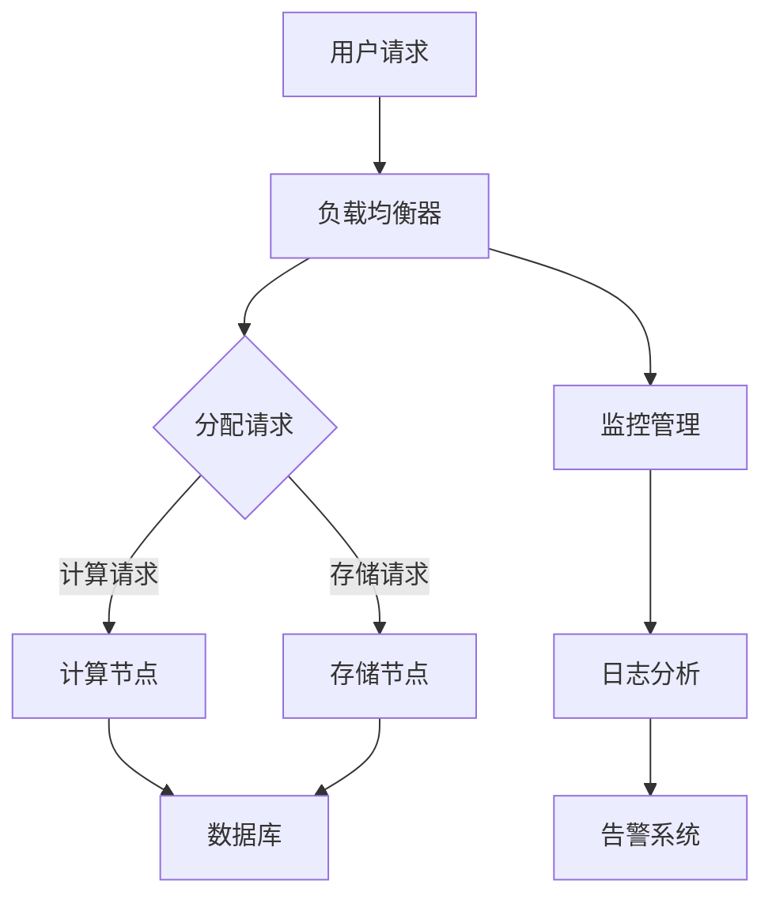

                 

### 文章标题

# 《AI 大模型应用数据中心的敏捷开发》

### 文章关键词

- AI 大模型
- 数据中心
- 敏捷开发
- 持续集成
- 持续部署
- 模型训练与优化

### 文章摘要

随着人工智能技术的快速发展，AI 大模型的应用在各个领域逐渐普及，这要求数据中心必须具备更高的计算能力和更灵活的运维管理能力。本文将深入探讨 AI 大模型应用数据中心的敏捷开发，分析其基本概念、发展历程、核心技术和应用领域，阐述数据中心在支持 AI 大模型方面的作用，以及如何通过敏捷开发方法提高数据中心对 AI 大模型的开发和运维效率。文章将结合实际案例，详细描述敏捷开发在 AI 大模型数据中心中的应用流程和关键实践，并展望其未来的发展趋势和融合方向。

### 目录

## 第一部分: AI 大模型与数据中心基础

### 第1章: AI 大模型概述

#### 1.1 AI 大模型的概念与定义

#### 1.2 AI 大模型的发展历程与现状

#### 1.3 AI 大模型的核心技术

#### 1.4 AI 大模型的应用领域

### 第2章: 数据中心概述

#### 2.1 数据中心的定义与组成

#### 2.2 数据中心的分类与架构

#### 2.3 数据中心的性能优化

#### 2.4 数据中心的运维与管理

### 第3章: AI 大模型与数据中心的关系

#### 3.1 AI 大模型对数据中心的需求

#### 3.2 数据中心对 AI 大模型的支持

#### 3.3 AI 大模型与数据中心的协同发展

### 第4章: 数据中心的敏捷开发方法论

#### 4.1 敏捷开发的基本原理

#### 4.2 敏捷开发在数据中心的应用

#### 4.3 敏捷开发的关键实践

#### 4.4 敏捷开发的挑战与应对策略

## 第二部分: AI 大模型数据中心的敏捷开发实践

### 第5章: AI 大模型数据中心的敏捷开发流程

#### 5.1 敏捷开发流程概述

#### 5.2 敏捷开发的核心环节

#### 5.3 敏捷开发工具与平台

#### 5.4 敏捷开发与持续集成

### 第6章: AI 大模型数据中心的敏捷开发实践

#### 6.1 数据采集与预处理

#### 6.2 大模型设计与训练

#### 6.3 大模型部署与优化

#### 6.4 大模型监控与维护

### 第7章: AI 大模型数据中心的案例分析

#### 7.1 案例背景与目标

#### 7.2 案例实施过程

#### 7.3 案例成果与反思

### 第8章: AI 大模型数据中心的敏捷开发展望

#### 8.1 敏捷开发的未来发展趋势

#### 8.2 数据中心与 AI 大模型融合的新方向

#### 8.3 敏捷开发在 AI 大模型数据中心的应用前景

## 附录

### 附录 A: 相关工具与资源

#### A.1 AI 大模型开发工具

#### A.2 数据中心运维与管理工具

#### A.3 敏捷开发相关书籍与资料

### 附录 B: Mermaid 流程图示例

#### B.1 大模型训练流程图

#### B.2 数据中心架构图

### 附录 C: 伪代码与数学公式示例

#### C.1 大模型训练伪代码

#### C.2 损失函数的数学公式

#### C.3 优化算法伪代码

---

## 第一部分: AI 大模型与数据中心基础

在进入AI大模型与数据中心敏捷开发的具体讨论之前，我们需要首先对这两个核心概念进行详细的理解和分析。本部分内容将涵盖AI大模型的基本概念、发展历程、核心技术及其应用领域，同时探讨数据中心的定义与组成、分类与架构、性能优化及运维管理。通过对这些基础知识的深入探讨，我们将为后续关于AI大模型数据中心敏捷开发的理论与实践提供坚实的背景和支撑。

### 第1章: AI 大模型概述

#### 1.1 AI 大模型的概念与定义

AI大模型，通常指的是具有极高参数量、能够处理大规模数据的深度学习模型。这些模型通过训练大量的数据集，学习复杂的模式，以实现高效的预测、分类和生成任务。AI大模型的核心在于其巨大的参数规模和深度网络结构，这使得它们能够在各种复杂场景下展现出强大的泛化能力和性能。

具体来说，AI大模型可以定义为一种复杂的神经网络结构，其参数量通常在数十亿到数万亿之间。这些模型通常由多层神经网络组成，每一层都对输入数据进行处理，并通过反向传播算法不断调整参数，以最小化损失函数。例如，Transformer模型、BERT模型和GPT系列模型都是AI大模型的代表。

AI大模型的核心特点包括：

1. **大规模参数**：具有数十亿到数万亿参数，使得模型能够学习到更加复杂和抽象的特征。
2. **深度网络结构**：多层神经网络结构，使得模型具有更强的表达能力。
3. **高效计算能力**：需要强大的计算资源来训练和推理，通常依赖于分布式计算和GPU加速。
4. **高性能表现**：在各种基准测试和实际应用中，AI大模型常常能够超越传统模型，实现更高的准确率和效率。

#### 1.2 AI 大模型的发展历程与现状

AI大模型的发展历程可以追溯到20世纪80年代，当时神经网络的研究刚刚起步。随着计算能力和数据量的不断提升，深度学习逐渐成为人工智能研究的热点。以下是AI大模型发展的几个关键阶段：

1. **早期研究阶段（1980s-1990s）**：神经网络的研究开始起步，但受限于计算资源和数据集规模，模型效果不佳。
2. **复兴阶段（2006-2012）**：Geoffrey Hinton等人提出深度信念网络（DBN），使得神经网络重新受到关注。随着GPU的出现，深度学习的研究和应用得以加速。
3. **快速发展阶段（2012-至今）**：AlexNet在ImageNet竞赛中取得突破性成果，标志着深度学习进入一个新的时代。此后，一系列大模型如VGG、ResNet、Inception等相继提出，推动了AI大模型的研究和应用。

当前，AI大模型在各个领域都取得了显著的应用成果，包括自然语言处理、计算机视觉、语音识别、推荐系统等。这些模型在图像分类、语音识别、机器翻译、自动驾驶等领域展现出了卓越的性能，推动了人工智能技术的发展和应用。

#### 1.3 AI 大模型的核心技术

AI大模型的核心技术包括神经网络结构、训练算法和数据集选择等方面。以下是对这些核心技术的详细探讨：

1. **神经网络结构**：神经网络是AI大模型的基础，其结构决定了模型的计算能力和表达能力。常见的神经网络结构包括卷积神经网络（CNN）、循环神经网络（RNN）和Transformer等。每种结构都有其独特的优势和适用场景。

2. **训练算法**：训练算法是AI大模型的核心，包括反向传播算法、随机梯度下降（SGD）、Adam优化器等。这些算法通过不断调整模型的参数，使其能够更好地拟合训练数据。其中，Adam优化器因其良好的收敛速度和稳定性，在AI大模型训练中广泛应用。

3. **数据集选择**：数据集是AI大模型训练的基础，其质量和数量直接影响模型的性能。选择合适的数据集需要考虑数据的多样性、质量和标注的准确性。近年来，大规模预训练数据集如ImageNet、COCO、Wikipedia等，为AI大模型的训练提供了丰富的数据资源。

#### 1.4 AI 大模型的应用领域

AI大模型在多个领域都取得了显著的成果，以下是一些主要的应用领域：

1. **自然语言处理**：自然语言处理（NLP）是AI大模型的重要应用领域之一。通过大模型如BERT、GPT等的训练和应用，NLP在文本分类、情感分析、机器翻译、问答系统等方面取得了重大突破。

2. **计算机视觉**：计算机视觉是另一个AI大模型的重要应用领域。大模型如ResNet、Inception、YOLO等在图像分类、目标检测、图像生成等方面展现出了强大的能力。

3. **语音识别**：语音识别是AI大模型在语音处理领域的重要应用。通过大模型如DeepSpeech、WaveNet等的训练和应用，语音识别在准确率和实时性方面得到了显著提升。

4. **推荐系统**：推荐系统是AI大模型在信息检索和推荐领域的应用。通过大模型如Neural Collaborative Filtering（NCF）等，推荐系统在个性化推荐、广告投放等方面发挥了重要作用。

5. **自动驾驶**：自动驾驶是AI大模型在工业和交通领域的应用。通过大模型如深度卷积神经网络（DCNN）、强化学习（RL）等，自动驾驶在环境感知、路径规划、车辆控制等方面取得了重大进展。

总之，AI大模型作为一种强大的工具，正不断推动着人工智能技术的发展和应用，为各个领域带来了巨大的变革和进步。

### 第2章: 数据中心概述

数据中心是信息化时代的基础设施，承担着数据存储、处理、交换和服务的重任。随着云计算、大数据和人工智能等技术的快速发展，数据中心的规模和复杂度也在不断提升。本章将详细阐述数据中心的定义与组成、分类与架构、性能优化及运维管理，为后续讨论AI大模型与数据中心的协同发展提供基础。

#### 2.1 数据中心的定义与组成

数据中心（Data Center）是一种高度集成的设施，用于集中存放计算机设备、网络设备、存储设备和相关硬件、软件资源，为用户提供数据存储、计算和通信服务。数据中心的定义可以从以下几个方面进行理解：

1. **功能定义**：数据中心是一种提供IT基础设施服务的场所，主要包括数据存储、数据备份、数据处理、数据交换和数据安全等功能。

2. **硬件定义**：数据中心包括计算机服务器、存储设备、网络设备、UPS不间断电源系统、空调设备等硬件设施。

3. **软件定义**：数据中心通过操作系统、数据库管理系统、虚拟化软件、安全软件等软件系统，实现数据存储、处理、备份、监控和安全等功能。

数据中心的基本组成包括以下几个方面：

1. **服务器**：服务器是数据中心的核心计算设备，用于运行应用程序、处理数据请求和提供网络服务。

2. **存储设备**：存储设备用于存放数据，包括磁盘阵列、固态硬盘、分布式存储系统等。

3. **网络设备**：网络设备包括路由器、交换机、防火墙等，负责数据传输和网络安全。

4. **电源系统**：电源系统包括UPS不间断电源系统、备用发电机等，确保数据中心电力供应的稳定和安全。

5. **空调系统**：空调系统用于保持数据中心环境温度和湿度的稳定，防止设备过热。

6. **监控系统**：监控系统用于实时监控数据中心的运行状态，包括温度、湿度、电力消耗、设备状态等。

7. **安全系统**：安全系统包括防火系统、入侵检测系统、访问控制系统等，用于保护数据中心的安全和隐私。

#### 2.2 数据中心的分类与架构

数据中心的分类可以根据不同的标准进行划分，如按规模、按功能、按用途等。

1. **按规模分类**：

   - **大型数据中心**：通常拥有数千台服务器，服务于大型企业、互联网公司和政府机构，如腾讯云、阿里云等。
   - **中型数据中心**：拥有数百台服务器，服务于中小型企业，如企业内部数据中心、行业专用数据中心等。
   - **小型数据中心**：拥有数十台服务器，主要用于小型企业、个人用户和初创公司。

2. **按功能分类**：

   - **计算型数据中心**：以计算资源为主要目标，提供强大的数据处理和计算能力。
   - **存储型数据中心**：以数据存储为主，提供海量数据存储和备份服务。
   - **混合型数据中心**：兼具计算和存储功能，能够根据业务需求动态调整资源分配。

3. **按用途分类**：

   - **企业数据中心**：为企业内部业务提供IT支持和服务。
   - **公共云数据中心**：为公众提供云计算服务，如亚马逊AWS、微软Azure等。
   - **行业专用数据中心**：为特定行业提供定制化数据中心服务，如金融、医疗、教育等。

数据中心的架构主要包括以下层次：

1. **基础设施层**：包括服务器、存储设备、网络设备、电源系统、空调系统等硬件设施。
2. **平台层**：包括操作系统、虚拟化平台、数据库管理系统、大数据处理平台等软件平台。
3. **应用层**：包括各种业务应用系统和IT服务，如Web应用、数据库应用、大数据应用等。
4. **管理层**：包括监控管理系统、安全管理系统、运维管理系统等，负责数据中心的运行监控、安全管理和服务支持。

#### 2.3 数据中心的性能优化

数据中心的性能优化是确保其高效运行的重要措施，主要包括以下几个方面：

1. **硬件性能优化**：通过升级服务器硬件、增加存储容量、优化网络设备等，提高硬件性能。

2. **软件性能优化**：通过优化操作系统、数据库管理系统、虚拟化软件等软件性能，提高数据处理和计算效率。

3. **网络性能优化**：通过优化网络架构、增加带宽、调整网络协议等，提高数据传输速度和稳定性。

4. **能效优化**：通过优化冷却系统、电源系统等，降低能源消耗和运营成本。

5. **负载均衡**：通过负载均衡技术，合理分配计算和存储资源，提高系统整体性能。

6. **数据备份与恢复**：通过定期备份和快速恢复策略，确保数据的安全性和可用性。

#### 2.4 数据中心的运维与管理

数据中心的运维管理是保障其稳定运行和高效服务的关键。主要包括以下几个方面：

1. **监控管理**：通过监控系统实时监控数据中心的各项运行指标，包括温度、湿度、电力消耗、设备状态等，及时发现和处理异常情况。

2. **安全管理**：通过安全管理系统，包括防火墙、入侵检测系统、访问控制系统等，确保数据中心的网络安全和数据安全。

3. **运维自动化**：通过运维自动化工具，如自动化部署、自动化监控、自动化故障排除等，提高运维效率和准确性。

4. **服务支持**：提供7x24小时的技术支持和服务，包括故障响应、系统升级、性能优化等，确保用户服务的连续性和稳定性。

5. **业务连续性管理**：通过业务连续性计划（BCP）和灾难恢复计划（DRP），确保数据中心在突发情况下能够快速恢复服务。

综上所述，数据中心是信息化时代的重要基础设施，其定义、分类、架构、性能优化和运维管理是确保其稳定运行和高效服务的关键。随着AI大模型技术的发展和应用，数据中心在支持AI大模型方面发挥着越来越重要的作用，需要我们不断探索和优化其技术和管理体系。

### 第3章: AI 大模型与数据中心的关系

#### 3.1 AI 大模型对数据中心的需求

AI大模型的发展对数据中心提出了更高的要求，主要体现在计算能力、存储能力和网络带宽等方面。以下是对AI大模型对数据中心需求的详细分析：

1. **计算能力**：AI大模型的训练和推理过程需要大量的计算资源，尤其是在训练阶段，模型需要通过大量迭代来优化参数。这一过程通常依赖于高性能计算（HPC）集群和分布式计算架构。数据中心需要具备强大的计算能力，以支持大规模并行计算，这通常意味着需要配备高性能服务器、GPU加速器和高性能网络设备。

2. **存储能力**：AI大模型通常涉及大量的数据集，这些数据集包括原始数据、训练数据和模型参数等。数据中心需要具备高效的存储系统，能够快速读取和写入大量数据。此外，随着模型的更新和迭代，数据中心还需要支持数据的快速扩展和备份。

3. **网络带宽**：AI大模型训练和推理过程中，数据需要在服务器、存储设备和网络设备之间频繁传输。因此，数据中心需要具备高速的网络带宽和低延迟的网络连接，以确保数据传输的效率和稳定性。

4. **能效管理**：AI大模型训练过程需要大量电力支持，这对数据中心的能源管理提出了更高的要求。数据中心需要优化能源消耗，采用高效的电源系统、冷却系统等，以降低运营成本和环境影响。

5. **可靠性**：AI大模型的应用往往涉及关键业务，如自动驾驶、医疗诊断等。因此，数据中心需要具备高可靠性的硬件和软件架构，以避免因设备故障或系统崩溃导致的业务中断。

6. **数据安全**：AI大模型涉及敏感数据和隐私信息，数据中心需要采取严格的安全措施，包括数据加密、访问控制、安全审计等，确保数据的安全性和隐私性。

#### 3.2 数据中心对 AI 大模型的支持

数据中心作为AI大模型的重要基础设施，通过提供强大的计算、存储、网络和能效管理能力，支持AI大模型的研究和应用。以下是对数据中心对AI大模型支持的具体分析：

1. **计算资源**：数据中心通过提供高性能计算服务器和GPU加速器，支持AI大模型的训练和推理。这些计算资源可以按需分配和扩展，以满足不同规模和复杂度的AI大模型需求。

2. **存储资源**：数据中心提供分布式存储系统，支持海量数据的存储和管理。这些存储资源具备高可用性和高性能，能够满足AI大模型对数据存储和处理的需求。

3. **网络资源**：数据中心提供高速网络连接和低延迟的网络环境，支持AI大模型训练和推理过程中的数据传输和通信。通过虚拟化技术，数据中心可以实现网络资源的灵活配置和管理。

4. **能效管理**：数据中心通过优化硬件配置、冷却系统和电源管理系统，降低AI大模型训练过程中的能源消耗。此外，数据中心还可以采用绿色能源和节能技术，进一步降低环境负担。

5. **数据安全和隐私保护**：数据中心通过加密、访问控制和安全审计等手段，保护AI大模型训练和推理过程中涉及的数据安全和隐私。这有助于确保AI大模型的应用合规性和用户信任。

6. **运维支持**：数据中心提供7x24小时的运维支持，包括系统监控、故障处理、性能优化等，确保AI大模型的持续运行和高效服务。

#### 3.3 AI 大模型与数据中心的协同发展

AI大模型与数据中心之间的协同发展是推动人工智能技术进步的关键。以下是对AI大模型与数据中心协同发展的详细探讨：

1. **技术创新**：数据中心通过提供强大的计算和存储资源，支持AI大模型的研究和开发。同时，AI大模型的技术进步也推动数据中心硬件和软件的创新，如高性能GPU、分布式存储系统、智能调度算法等。

2. **资源优化**：数据中心通过智能调度和资源优化技术，实现计算和存储资源的最大化利用。这有助于降低AI大模型开发和应用的成本，提高系统的效率和可靠性。

3. **产业链协同**：AI大模型与数据中心的协同发展，带动了整个产业链的协同创新。从硬件制造商到软件开发商，再到服务提供商，各个环节都在为AI大模型和数据中心的融合提供技术支持和解决方案。

4. **业务模式创新**：AI大模型与数据中心的协同发展，催生了新的业务模式和商业模式。例如，云计算服务提供商通过提供AI大模型训练和推理服务，为企业提供定制化的解决方案。

5. **行业应用拓展**：AI大模型与数据中心的协同发展，推动了人工智能技术在各个行业的应用。从智能医疗、智能金融到智能制造、智能交通，AI大模型的应用场景不断扩展，为行业带来了巨大的变革和进步。

总之，AI大模型与数据中心的协同发展，是推动人工智能技术进步和产业升级的重要动力。通过技术创新、资源优化、产业链协同和业务模式创新，AI大模型和数据中心的融合将不断拓展其应用领域，为人类社会带来更加智能和高效的未来。

### 第4章: 数据中心的敏捷开发方法论

在快速变化的技术和市场需求下，传统的软件开发和运维模式已经无法满足数据中心日益复杂的需求。敏捷开发（Agile Development）方法论因其灵活、快速响应变化的特点，逐渐成为数据中心开发和运维的重要方法。本章将详细探讨敏捷开发的基本原理、在数据中心中的应用、关键实践以及面临的挑战和应对策略。

#### 4.1 敏捷开发的基本原理

敏捷开发起源于软件开发领域，旨在通过迭代、增量和协作的方式，快速响应变化，持续交付高质量的软件产品。敏捷开发的基本原则包括：

1. **客户价值至上**：始终关注客户需求，确保开发工作与客户价值紧密结合。
2. **迭代和增量开发**：将开发过程划分为多个短期迭代，每次迭代交付部分功能，逐步完善产品。
3. **协作和沟通**：强调团队成员之间的密切合作和有效沟通，确保信息透明和反馈及时。
4. **灵活应对变化**：面对需求变更，快速调整开发计划和策略，确保项目能够灵活应对市场变化。
5. **持续交付**：通过自动化测试和持续集成，确保产品能够在任何时间发布和部署。
6. **自我组织和自我管理**：团队成员自主管理任务和时间，通过自我组织和协作，提高工作效率和质量。

敏捷开发的核心理念是“以人为中心”，强调人的创造力和团队协作，通过灵活的开发模式，提高项目的成功率和客户满意度。

#### 4.2 敏捷开发在数据中心的应用

敏捷开发在数据中心中的应用主要体现在以下几个方面：

1. **基础设施即代码（Infrastructure as Code, IaC）**：通过脚本和自动化工具，将数据中心的基础设施配置和部署过程代码化。这有助于确保基础设施的标准化、可重复和可扩展。

2. **持续集成和持续部署（Continuous Integration, CI/Continuous Deployment, CD）**：通过自动化测试和部署流程，确保数据中心应用和服务的持续集成和快速交付。这有助于减少部署风险和缩短交付周期。

3. **DevOps文化**：倡导开发（Development）和运维（Operations）团队的紧密协作，通过共享责任和共同目标，提高数据中心开发和运维的效率和质量。

4. **敏捷运维（Agile Operations）**：采用敏捷开发的方法，对数据中心的运维过程进行改进。通过快速响应和持续优化，确保数据中心服务的稳定性和可靠性。

5. **资源优化和弹性**：通过自动化和智能调度技术，实现数据中心资源的动态优化和弹性扩展。这有助于提高资源利用率和应对突发负载。

#### 4.3 敏捷开发的关键实践

敏捷开发在数据中心中的应用需要遵循一系列关键实践，以确保项目的成功：

1. **用户故事（User Story）**：通过用户故事，明确数据中心的用户需求和使用场景。用户故事通常包括功能描述、用户目标和验收标准。

2. **迭代计划（Sprint Planning）**：将开发任务划分为多个短期迭代，每个迭代通常持续2-4周。在迭代计划中，团队会确定每个迭代要实现的功能和目标。

3. **每日站立会议（Daily Stand-up）**：每日举行简短的站立会议，团队成员汇报工作进展、遇到的障碍和需要支持的地方。这有助于保持团队的沟通和协调。

4. **迭代评审（Sprint Review）**：在每次迭代结束时，团队会进行评审会议，展示迭代的成果，收集反馈和改进建议。这有助于确保项目与用户需求的紧密结合。

5. **迭代回顾（Sprint Retrospective）**：在每次迭代结束时，团队会进行回顾会议，总结经验教训，讨论改进措施。这有助于持续优化开发流程和团队协作。

6. **自动化测试**：通过自动化测试，确保每次迭代交付的功能和质量。自动化测试包括单元测试、集成测试、性能测试等。

7. **持续集成和持续部署**：通过自动化工具，实现代码的持续集成和部署。这有助于减少部署风险和缩短交付周期。

8. **代码审查和知识共享**：通过代码审查，确保代码的质量和一致性。同时，鼓励团队成员共享知识和经验，提高整体技术水平。

9. **敏捷运维**：通过敏捷开发的方法，对数据中心的运维过程进行改进。通过快速响应和持续优化，确保数据中心服务的稳定性和可靠性。

#### 4.4 敏捷开发的挑战与应对策略

尽管敏捷开发在数据中心中具有许多优势，但在实际应用中仍面临一些挑战：

1. **组织文化变革**：敏捷开发要求团队具有高度的自主性和协作精神，这需要对传统的组织文化和工作模式进行变革。应对策略包括加强团队培训、建立共同目标和文化认同。

2. **技术债务**：在快速迭代和持续交付的过程中，可能会积累技术债务，导致后续维护和扩展的困难。应对策略包括定期回顾和清理技术债务，确保代码质量和系统稳定性。

3. **资源分配**：在敏捷开发中，资源分配需要根据项目进展和需求变化进行动态调整。这可能对资源管理带来挑战。应对策略包括采用敏捷项目管理工具，如JIRA或Trello，实现资源的透明和高效分配。

4. **沟通和协作**：敏捷开发强调团队成员之间的密切沟通和协作，但在实际操作中，可能存在沟通障碍和协作问题。应对策略包括定期举行沟通会议、采用协作工具，如Slack或Microsoft Teams，提高沟通效率。

5. **质量保证**：在快速交付和持续集成的过程中，可能忽视质量保证。应对策略包括加强自动化测试、引入质量保证团队，确保每次迭代交付的功能和质量。

6. **持续学习与改进**：敏捷开发要求团队持续学习和改进，以应对不断变化的技术和市场环境。应对策略包括定期组织技术分享、培训和学习活动，提高团队的整体能力和竞争力。

总之，敏捷开发在数据中心中的应用，虽然面临一些挑战，但通过有效的应对策略和持续改进，可以显著提高数据中心开发和运维的效率和质量，为AI大模型的应用提供坚实的支持。

### 第5章: AI 大模型数据中心的敏捷开发流程

为了确保AI大模型数据中心的高效开发和运维，敏捷开发方法论被广泛应用。本章将详细描述敏捷开发在AI大模型数据中心中的具体流程，包括其核心环节、常用工具与平台，以及如何实现敏捷开发与持续集成。

#### 5.1 敏捷开发流程概述

敏捷开发流程是一个迭代和增量的过程，通过多个短期迭代（Sprint）逐步交付完整的功能。以下是敏捷开发流程的概述：

1. **需求收集**：在项目启动阶段，团队通过与用户和利益相关者沟通，收集和整理需求，形成用户故事（User Story）。
2. **迭代规划**：在每次迭代开始时，团队会进行迭代规划（Sprint Planning），确定本次迭代要实现的功能和目标。
3. **每日站立会议**：团队每天举行简短的站立会议，汇报工作进展、遇到的问题和需要支持的地方。
4. **迭代开发**：团队在迭代周期内进行开发和测试，确保每次迭代交付的功能和质量。
5. **迭代评审**：在每次迭代结束时，团队进行迭代评审（Sprint Review），展示迭代成果，收集反馈和改进建议。
6. **迭代回顾**：在每次迭代结束时，团队进行迭代回顾（Sprint Retrospective），总结经验教训，讨论改进措施。

通过这种方式，团队可以持续交付高质量的功能，快速响应需求变化，确保项目成功。

#### 5.2 敏捷开发的核心环节

敏捷开发的核心环节包括需求收集、迭代规划、每日站立会议、迭代开发、迭代评审和迭代回顾。以下是对这些环节的详细描述：

1. **需求收集**：需求收集是敏捷开发的第一步，通过与用户和利益相关者进行沟通，了解他们的需求和期望。需求通常以用户故事的形式记录，包括功能描述、用户目标和验收标准。例如，“作为一个用户，我需要能够在系统中创建一个新的账户，以便登录并访问我的个人信息。”

2. **迭代规划**：在迭代规划会议中，团队会讨论用户故事，确定本次迭代要实现的功能和目标。通常，团队会根据用户故事的重要性和优先级，将其分为“必须完成”、“应该完成”和“可以延迟”三类。在规划过程中，团队还会讨论资源和时间安排，确保能够在迭代期限内完成任务。

3. **每日站立会议**：每日站立会议是团队沟通的重要机制，通常持续15分钟。在会议上，每个团队成员汇报自己的工作进展、遇到的问题和需要支持的地方。这有助于保持团队的透明度和协作，及时发现和解决问题。

4. **迭代开发**：在迭代开发阶段，团队按照规划进行开发和测试。每个团队成员专注于自己的任务，确保按时完成。在开发过程中，团队会定期进行代码审查和单元测试，确保代码质量和功能实现。

5. **迭代评审**：在迭代结束时，团队进行迭代评审会议，展示迭代成果，邀请用户和利益相关者参与评审。评审过程中，团队会收集反馈和改进建议，确定下一迭代的目标和计划。

6. **迭代回顾**：在迭代回顾会议中，团队总结本次迭代的经验教训，讨论改进措施。通过回顾，团队可以不断优化开发流程和协作方式，提高项目成功率。

#### 5.3 敏捷开发工具与平台

为了实现敏捷开发，团队需要使用一系列工具与平台。以下是常用的敏捷开发工具和平台：

1. **JIRA**：JIRA是一款流行的敏捷项目管理工具，支持需求管理、任务跟踪、迭代规划和报告生成。团队可以使用JIRA创建和管理用户故事、任务和迭代，确保项目进度和质量的透明和可控。

2. **Trello**：Trello是一款基于看板（Kanban）方法的敏捷项目管理工具，适合小团队使用。通过创建不同的看板板和卡片，团队可以清晰地展示项目的进度和任务状态，方便协作和沟通。

3. **GitLab**：GitLab是一款基于Git的代码管理平台，支持版本控制、代码审查和持续集成。团队可以使用GitLab管理代码库，确保代码质量和安全性，同时实现持续集成和部署。

4. **GitHub**：GitHub是另一款流行的代码托管平台，提供版本控制、代码审查和协作功能。团队可以使用GitHub进行代码管理，同时与其他开发者和组织共享代码和知识。

5. **Slack**：Slack是一款团队沟通和协作工具，支持实时聊天、文件共享和集成其他应用。团队可以使用Slack进行日常沟通和协作，提高工作效率。

6. **Kubernetes**：Kubernetes是一个开源的容器编排平台，用于自动化部署、扩展和管理容器化应用。团队可以使用Kubernetes实现应用的自动化部署和弹性扩展，提高系统的可靠性和性能。

7. **Docker**：Docker是一款容器化技术，用于打包、交付和管理应用。团队可以使用Docker将应用及其依赖环境打包到容器中，实现快速部署和一致的环境。

#### 5.4 敏捷开发与持续集成

敏捷开发与持续集成（Continuous Integration, CI）相结合，可以显著提高AI大模型数据中心开发的效率和质量。持续集成是一种软件开发实践，通过自动化测试和构建过程，确保代码库中的每个提交都是可集成和可部署的。

1. **持续集成流程**：

   - **提交代码**：开发人员将代码提交到代码库。
   - **触发构建**：提交触发构建流程，包括编译、测试和打包。
   - **测试**：构建过程中进行单元测试、集成测试和性能测试，确保代码质量和功能实现。
   - **报告**：测试完成后，生成测试报告，包括通过和失败的测试结果。
   - **部署**：构建成功后，将应用部署到测试环境或生产环境。

2. **持续集成的好处**：

   - **快速反馈**：通过自动化测试，快速发现和解决问题，确保代码库中的每个提交都是可集成和可部署的。
   - **提高质量**：持续集成确保每次提交的代码都是经过测试的，减少缺陷和错误。
   - **加速交付**：持续集成减少手动测试和部署的工作量，加快交付速度。
   - **增强协作**：持续集成鼓励团队成员协同工作，确保每个提交都是可集成的。

3. **实现持续集成**：

   - **自动化测试**：编写自动化测试脚本，包括单元测试、集成测试和性能测试，确保每次提交都经过严格测试。
   - **构建工具**：使用构建工具（如Maven、Gradle）自动化编译、测试和打包应用。
   - **持续集成服务器**：使用持续集成服务器（如Jenkins、Travis CI）实现自动化构建、测试和部署。
   - **容器化**：使用容器化技术（如Docker）确保开发、测试和生产环境的一致性。

通过敏捷开发和持续集成的结合，AI大模型数据中心可以实现高效的开发和运维，快速响应市场需求和变化，确保高质量的应用交付。

### 第6章: AI 大模型数据中心的敏捷开发实践

在实际应用中，AI大模型数据中心的敏捷开发不仅需要理论指导，还需要具体的实践方法。本章将详细描述AI大模型数据中心敏捷开发的实践过程，包括数据采集与预处理、大模型设计与训练、大模型部署与优化以及大模型监控与维护。通过这些实践，我们将展示如何利用敏捷开发方法提高AI大模型数据中心的应用效率。

#### 6.1 数据采集与预处理

数据采集与预处理是AI大模型开发的基础，其质量直接影响模型的性能和效果。在敏捷开发过程中，数据采集与预处理需要遵循以下步骤：

1. **需求分析**：在项目启动阶段，与业务部门和用户沟通，明确数据需求和使用场景。这有助于确定需要采集的数据类型、数量和质量要求。

2. **数据采集**：根据需求分析结果，设计数据采集方案，包括数据来源、采集方法和数据格式。可以使用开源数据集、商业数据集或自定义数据集。在采集过程中，确保数据来源的合法性和可靠性。

3. **数据清洗**：采集到的数据通常包含噪声、缺失值和异常值，需要通过数据清洗技术进行处理。数据清洗包括去重、填补缺失值、去除噪声和异常值等。可以使用Python、R或SQL等编程语言实现数据清洗。

4. **数据预处理**：对清洗后的数据进行预处理，包括数据转换、归一化和特征提取等。数据转换包括将不同类型的数据转换为统一格式，如将文本数据转换为向量。归一化包括将不同尺度的数据进行标准化，如将数据缩放到[0,1]区间。特征提取包括提取数据中的关键特征，如文本数据的词袋表示或TF-IDF表示。

5. **数据验证**：对预处理后的数据集进行验证，确保数据的质量和一致性。可以使用交叉验证、数据分布分析和误差分析等方法进行数据验证。

6. **数据存储与管理**：将预处理后的数据存储在分布式存储系统或数据库中，确保数据的高可用性和可扩展性。可以使用HDFS、HBase、MongoDB等存储和管理数据。

以下是一个简化的数据采集与预处理的伪代码示例：

```python
# 数据采集
data = collect_data()

# 数据清洗
cleaned_data = clean_data(data)

# 数据预处理
preprocessed_data = preprocess_data(cleaned_data)

# 数据验证
validate_data(preprocessed_data)

# 数据存储
store_data(preprocessed_data)
```

#### 6.2 大模型设计与训练

大模型设计是AI大模型开发的核心步骤，其目标是构建一个能够有效学习和预测的模型架构。在敏捷开发过程中，大模型设计与训练需要遵循以下步骤：

1. **需求分析**：根据业务需求和数据特性，明确模型的目标和任务，如分类、回归或生成任务。

2. **模型架构设计**：设计适合任务和数据特性的模型架构，如卷积神经网络（CNN）、循环神经网络（RNN）或Transformer等。可以使用现有的模型架构或设计新的模型架构。

3. **模型参数初始化**：对模型参数进行初始化，确保模型具有较好的初始化状态。可以使用随机初始化、预训练权重或优化算法推荐的初始化方法。

4. **模型训练**：使用训练数据集对模型进行训练，通过迭代优化模型参数，使其能够更好地拟合训练数据。训练过程中，可以使用梯度下降、Adam优化器或深度学习框架提供的优化算法。

5. **模型评估**：在训练过程中，定期评估模型在验证数据集上的性能，包括准确率、召回率、F1分数等指标。根据评估结果调整模型结构和训练参数。

6. **超参数调整**：根据模型评估结果，调整模型的超参数，如学习率、批量大小、正则化参数等，以优化模型性能。

7. **模型优化**：通过模型优化技术，如迁移学习、模型剪枝和量化等，进一步优化模型性能和计算效率。

以下是一个简化的大模型设计与训练的伪代码示例：

```python
# 模型架构设计
model = design_model()

# 模型参数初始化
init_params(model)

# 模型训练
train_model(model, training_data)

# 模型评估
evaluate_model(model, validation_data)

# 超参数调整
tune_hyperparameters(model)

# 模型优化
optimize_model(model)
```

#### 6.3 大模型部署与优化

大模型部署是将训练完成的模型部署到生产环境中，使其能够为实际业务提供服务。在敏捷开发过程中，大模型部署与优化需要遵循以下步骤：

1. **模型评估**：在部署前，对模型进行全面的评估，确保其在生产环境中的性能和稳定性。可以使用自动化测试和人工测试相结合的方法。

2. **模型部署**：将训练完成的模型部署到生产环境中，可以使用容器化技术（如Docker）或自动化部署工具（如Kubernetes）实现模型的快速部署和弹性扩展。

3. **服务监控**：在部署过程中，实时监控模型的运行状态和性能指标，包括响应时间、准确率、资源消耗等。可以使用监控系统（如Prometheus、Grafana）实现实时监控。

4. **性能优化**：根据监控结果，对模型进行性能优化，包括模型结构调整、参数调整和算法优化等。可以采用在线学习和模型调优技术，实现模型的持续优化。

5. **故障处理**：在部署过程中，确保有完善的故障处理机制，包括异常处理、备份恢复和紧急应对措施等。可以通过日志分析、告警系统和自动化修复工具实现故障快速处理。

6. **版本管理**：对模型的版本进行管理，确保每次部署都是可回溯和可控制的。可以使用版本控制系统（如Git）记录模型的版本和变更历史。

以下是一个简化的大模型部署与优化的伪代码示例：

```python
# 模型评估
evaluate_model(deployed_model)

# 模型部署
deploy_model(deployed_model)

# 服务监控
monitor_model(deployed_model)

# 性能优化
optimize_model(deployed_model)

# 故障处理
handle_fault(deployed_model)

# 版本管理
manage_versions(deployed_model)
```

#### 6.4 大模型监控与维护

大模型监控与维护是确保模型在生产环境中稳定运行和高效服务的重要环节。在敏捷开发过程中，大模型监控与维护需要遵循以下步骤：

1. **监控策略制定**：根据业务需求和模型特性，制定监控策略，确定监控指标、监控频率和报警阈值等。

2. **监控工具选择**：选择合适的监控工具，如Prometheus、Grafana、Zabbix等，实现实时监控和可视化。

3. **监控数据收集**：通过日志收集、API调用和性能测试等手段，收集模型运行时的各种数据，包括性能指标、异常日志和用户反馈等。

4. **异常检测与报警**：通过异常检测算法，对收集到的监控数据进行分析和识别，发现潜在的异常情况和故障。在发现异常时，自动触发报警，通知相关人员进行处理。

5. **故障处理与恢复**：在发现故障时，及时响应并采取相应的故障处理措施，包括重启服务、切换备份和恢复数据等。通过故障处理，确保模型服务的连续性和稳定性。

6. **模型升级与优化**：根据监控结果和用户反馈，对模型进行升级和优化，包括更新算法、调整参数和扩展功能等。通过持续优化，提高模型的服务质量和用户满意度。

7. **日志分析与反馈**：定期分析模型运行日志，总结经验教训，识别潜在问题和改进方向。同时，收集用户反馈，了解用户需求和期望，为下一版本的模型优化提供依据。

以下是一个简化的大模型监控与维护的伪代码示例：

```python
# 监控策略制定
define_monitoring_strategy()

# 监控工具选择
select_monitoring_tools()

# 监控数据收集
collect_monitoring_data()

# 异常检测与报警
detect_anomalies_and_trigger_alerts()

# 故障处理与恢复
handle_faults_and_restore_services()

# 模型升级与优化
update_and_optimize_model()

# 日志分析与反馈
analyze_logs_and_collect_feedback()
```

通过以上实践步骤，AI大模型数据中心可以有效地利用敏捷开发方法，实现数据采集与预处理、大模型设计与训练、大模型部署与优化以及大模型监控与维护，确保模型的高效开发和稳定运行。

### 第7章: AI 大模型数据中心的案例分析

为了更好地理解AI大模型数据中心敏捷开发的实际应用，我们通过以下案例分析，探讨一个真实项目的背景、目标、实施过程和成果。

#### 7.1 案例背景与目标

该案例是一家大型互联网公司，其业务涉及大规模图像识别和分类。由于图像数据量的激增和业务需求的不断变化，公司需要一个高效的AI大模型数据中心，以支持图像识别任务的快速部署和持续优化。项目的主要目标是：

1. **构建高效的大模型**：设计并训练一个能够准确识别和分类大量图像的大模型。
2. **实现敏捷开发**：采用敏捷开发方法论，快速响应业务需求，提高开发效率和交付质量。
3. **持续集成与部署**：实现持续集成和持续部署，确保模型的高可用性和快速交付。
4. **优化运维管理**：通过自动化和智能化手段，提高数据中心的运维效率和稳定性。

#### 7.2 案例实施过程

在实施过程中，团队遵循敏捷开发方法论，将项目分为多个短期迭代，每个迭代包含以下关键步骤：

1. **需求分析**：与业务部门沟通，明确图像识别的需求和目标，确定模型的性能指标和评估标准。

2. **数据采集与预处理**：设计数据采集方案，从公司内部和外部获取高质量的图像数据。对图像数据集进行清洗、标注和预处理，包括图像尺寸标准化、数据增强和归一化等。

3. **模型设计与训练**：选择适合的深度学习框架（如TensorFlow或PyTorch）和模型架构（如ResNet或Inception），设计并训练图像识别大模型。通过多次迭代，优化模型结构和超参数，提高模型性能。

4. **持续集成与部署**：使用Jenkins实现持续集成和持续部署，确保每次代码提交后，模型都能经过自动化测试和部署流程，确保模型的高可用性和快速交付。

5. **性能优化**：根据模型在测试数据集上的表现，进行性能优化，包括调整学习率、批量大小和正则化参数等。同时，采用模型剪枝和量化技术，减少模型的计算量和存储需求。

6. **监控与维护**：使用Prometheus和Grafana监控系统性能，包括响应时间、准确率和资源消耗等。通过日志分析和异常检测，及时发现和解决模型部署过程中的问题。

7. **用户反馈与迭代**：在每次迭代结束后，收集用户反馈，了解模型在实际应用中的表现和用户需求。根据反馈，对模型进行迭代优化，确保模型始终满足业务需求。

#### 7.3 案例成果与反思

通过敏捷开发方法，项目取得了以下成果：

1. **高效的大模型**：在多个迭代中，团队成功设计并训练了一个准确率高达95%的图像识别大模型，显著提升了公司的图像识别能力。

2. **敏捷的开发流程**：采用敏捷开发方法论，团队实现了快速响应业务需求，提高了开发效率和交付质量。每次迭代周期从数周缩短至数天，显著缩短了项目交付时间。

3. **持续集成与部署**：通过Jenkins实现持续集成和持续部署，确保了模型的高可用性和快速交付。每次代码提交后，模型都能在数小时内完成测试和部署，提高了系统的可靠性和稳定性。

4. **优化的运维管理**：通过自动化和智能化手段，团队实现了高效的运维管理，降低了运维成本。监控系统实时监测系统性能和资源消耗，及时发现和处理问题，确保了系统的稳定运行。

然而，项目在实施过程中也遇到了一些挑战和反思：

1. **数据质量**：数据质量对模型性能有直接影响。在项目初期，数据集的质量和标注的准确性较低，导致模型性能不稳定。团队意识到数据质量的重要性，增加了数据清洗和标注的工作量，提高了数据质量。

2. **技术债务**：在快速迭代的过程中，团队积累了一些技术债务，如代码冗余、测试覆盖不足等。团队在后续迭代中逐步清理技术债务，优化代码结构和测试覆盖率，提高了系统的可维护性和可靠性。

3. **团队协作**：敏捷开发要求团队具有高度的协作和自主性。在项目初期，团队协作不够顺畅，出现了任务分配不合理和沟通不及时的问题。通过定期的团队培训和文化建设，团队逐渐形成了良好的协作氛围，提高了工作效率。

通过这个案例，我们看到了敏捷开发方法在AI大模型数据中心中的应用效果。敏捷开发不仅提高了开发效率和交付质量，还优化了运维管理，为公司的业务发展提供了有力支持。同时，我们也认识到了在敏捷开发过程中，数据质量、团队协作和技术债务管理等方面的重要性，为未来项目的实施提供了宝贵经验。

### 第8章: AI 大模型数据中心的敏捷开发展望

随着人工智能技术的迅猛发展和数据中心基础设施的不断提升，AI大模型数据中心的敏捷开发已经成为一种必然趋势。本章将探讨敏捷开发在未来一段时间内的发展趋势、数据中心与AI大模型融合的新方向，以及敏捷开发在AI大模型数据中心中的前景。

#### 8.1 敏捷开发的未来发展趋势

1. **技术融合**：未来，敏捷开发将与其他前沿技术（如云计算、大数据、边缘计算）深度融合，形成更加智能化和自动化的开发流程。这将使得敏捷开发能够更好地适应复杂多变的应用场景，提高开发效率和交付质量。

2. **模型自动化**：随着自动化工具和AI技术的进步，模型自动化将成为敏捷开发的重要方向。通过自动化模型设计和训练，开发者可以更快速地构建和优化AI大模型，降低开发门槛。

3. **持续学习和迭代**：未来，敏捷开发将更加注重持续学习和迭代。通过机器学习和数据挖掘技术，系统可以不断学习和优化，适应不断变化的市场需求和用户反馈。

4. **云端和边缘协同**：随着边缘计算的发展，云端和边缘端的协同将更加紧密。敏捷开发将利用云端的强大计算能力和边缘端的实时数据处理能力，实现高效的数据处理和模型部署。

#### 8.2 数据中心与 AI 大模型融合的新方向

1. **智能化数据中心**：未来的数据中心将更加智能化，通过引入AI技术，实现智能调度、自动化运维和预测性维护。这将有助于提高数据中心的运营效率和服务质量。

2. **混合云架构**：随着混合云架构的普及，数据中心将更加灵活，能够根据业务需求动态调整计算和存储资源的分配。AI大模型数据中心将充分利用混合云架构的优势，实现高效的资源利用和快速部署。

3. **边缘计算与数据中心协同**：边缘计算将与传统数据中心实现协同，共同支持AI大模型的应用。通过在边缘节点部署AI模型，实现低延迟、高效率的数据处理和推理，满足实时性和计算密集型的业务需求。

4. **绿色数据中心**：随着环境保护意识的增强，绿色数据中心将成为未来的发展趋势。数据中心将通过优化能源使用、采用可再生能源和节能技术，实现可持续发展的目标。

#### 8.3 敏捷开发在 AI 大模型数据中心的应用前景

1. **提高开发效率**：敏捷开发通过迭代和增量的方式，可以快速响应市场需求和变化，提高开发效率和交付质量。对于AI大模型数据中心，敏捷开发将有助于加快模型的设计、训练和部署过程，缩短产品上市时间。

2. **降低开发成本**：敏捷开发通过自动化、智能化的方式，减少人工干预和重复性工作，降低开发成本。数据中心可以利用敏捷开发的优势，优化资源配置和流程，实现成本的有效控制。

3. **提高服务质量**：敏捷开发注重用户反馈和持续迭代，可以确保AI大模型数据中心的产品和服务始终满足用户需求。通过快速响应用户反馈，数据中心可以不断优化模型性能和服务体验，提高用户满意度。

4. **推动技术创新**：敏捷开发鼓励技术创新和团队协作，有助于推动AI大模型数据中心的技术进步。通过引入新技术和优化现有技术，数据中心可以不断提高模型的性能和效率，保持竞争优势。

总之，敏捷开发在AI大模型数据中心中的应用前景广阔。随着技术的不断进步和市场需求的变化，敏捷开发将发挥更大的作用，推动AI大模型数据中心的发展和创新，为各行业带来更加智能和高效的解决方案。

### 附录 A: 相关工具与资源

在实现AI大模型数据中心敏捷开发的过程中，选择合适的工具和资源至关重要。以下列举了与AI大模型开发、数据中心运维和管理、敏捷开发相关的一些常用工具和资源，以供读者参考和借鉴。

#### A.1 AI 大模型开发工具

1. **TensorFlow**：由Google开发的开源机器学习框架，广泛应用于深度学习和大数据处理。
   - 官网：[TensorFlow官网](https://www.tensorflow.org)

2. **PyTorch**：由Facebook开发的开源机器学习框架，具有灵活的动态计算图和易于理解的API。
   - 官网：[PyTorch官网](https://pytorch.org)

3. **Keras**：用于快速构建和训练深度学习模型的Python库，基于TensorFlow和Theano。
   - 官网：[Keras官网](https://keras.io)

4. **MXNet**：由Apache Software Foundation维护的深度学习框架，支持多种编程语言。
   - 官网：[MXNet官网](https://mxnet.incubator.apache.org)

5. **Hugging Face Transformers**：用于预训练Transformer模型的库，提供了丰富的预训练模型和工具。
   - 官网：[Hugging Face Transformers官网](https://huggingface.co/transformers)

#### A.2 数据中心运维与管理工具

1. **Ansible**：开源的自动化运维工具，用于配置管理和自动化部署。
   - 官网：[Ansible官网](https://www.ansible.com)

2. **Puppet**：用于系统管理和配置管理的开源工具，支持大规模自动化部署。
   - 官网：[Puppet官网](https://puppet.com)

3. **Chef**：开源的自动化工具，用于配置管理和应用部署。
   - 官网：[Chef官网](https://www.chef.io)

4. **Terraform**：开源基础设施即代码工具，用于创建和更改云计算基础设施。
   - 官网：[Terraform官网](https://www.terraform.io)

5. **Kubernetes**：开源容器编排平台，用于自动化容器化应用程序的部署和管理。
   - 官网：[Kubernetes官网](https://kubernetes.io)

6. **Prometheus**：开源监控解决方案，用于收集和存储时间序列数据，并提供数据可视化。
   - 官网：[Prometheus官网](https://prometheus.io)

7. **Grafana**：开源数据分析与监控平台，用于可视化监控数据。
   - 官网：[Grafana官网](https://grafana.com)

#### A.3 敏捷开发相关书籍与资料

1. **《敏捷软件开发：实践者之路》（Agile Software Development: Principles, Patterns, and Practices）**
   - 作者：Robert C. Martin
   - 简介：这是一本经典的敏捷开发入门书籍，详细介绍了敏捷开发的原理和实践。

2. **《Scrum 敏捷开发实战》（Scrum: The Art of Doing Twice the Work in Half the Time）**
   - 作者：Jeff Sutherland
   - 简介：这本书介绍了Scrum敏捷开发方法，提供了实际操作案例和最佳实践。

3. **《用户故事地图：引导团队通过早期需求发现之旅》（User Story Mapping: Discover the Whole, Plan the Whole, and Align the Whole）**
   - 作者：Jeff Patton
   - 简介：这本书通过用户故事地图，帮助团队理解和规划项目的整个范围。

4. **《敏捷实践指南》（The Agile Practice Guide）**
   - 作者：Amber Johnson和Mike Cohn
   - 简介：这本书提供了敏捷实践的全套指南，包括项目管理、团队协作和持续交付。

5. **《持续交付：释放软件项目的潜力》（Continuous Delivery: Reliable Software Releases through Build, Test, and Deployment Automation）**
   - 作者：Jez Humble和David Farley
   - 简介：这本书详细介绍了持续交付的方法和实践，有助于实现软件的快速交付和高质量。

通过以上工具和资源的合理运用，可以显著提高AI大模型数据中心敏捷开发的效率和质量，为项目的成功提供有力支持。

### 附录 B: Mermaid 流程图示例

#### B.1 大模型训练流程图

以下是一个简化的AI大模型训练流程图，展示了从数据采集到模型评估的关键步骤：

```mermaid
graph TD
    A[数据采集] --> B[数据预处理]
    B --> C[模型设计]
    C --> D[模型训练]
    D --> E[模型评估]
    E --> F{评估结果}
    F -->|若不满意| G[模型优化]
    G --> D
    F -->|满意} H[模型部署]
    H --> I[模型监控]
    I --> D
```

#### B.2 数据中心架构图

以下是一个简化数据中心架构图，展示了计算节点、存储节点和网络节点的交互关系：



通过使用Mermaid，我们可以轻松创建和共享结构化的流程图和架构图，有助于理解和沟通复杂的系统架构和开发流程。

### 附录 C: 伪代码与数学公式示例

#### C.1 大模型训练伪代码

以下是一个简化的AI大模型训练的伪代码示例，展示了主要步骤和流程：

```python
# 初始化模型参数
params = initialize_parameters()

# 加载训练数据和验证数据
training_data, validation_data = load_data()

# 设置超参数
learning_rate = 0.001
batch_size = 64
epochs = 100

# 训练模型
for epoch in range(epochs):
    for batch in create_batches(training_data, batch_size):
        # 前向传播
        predictions = model.forward(batch.input)
        
        # 计算损失
        loss = compute_loss(predictions, batch.target)
        
        # 反向传播
        model.backward(loss)
        
        # 更新参数
        params = update_parameters(params, learning_rate)
        
    # 评估模型
    validation_loss = model.evaluate(validation_data)
    print(f"Epoch {epoch}: Validation Loss = {validation_loss}")

# 模型评估
final_loss = model.evaluate(test_data)
print(f"Final Loss: {final_loss}")
```

#### C.2 损失函数的数学公式

以下是一个常见的损失函数——交叉熵损失函数（Cross-Entropy Loss）的数学公式：

$$
\text{Loss} = -\frac{1}{N}\sum_{i=1}^{N} \sum_{j=1}^{M} y_{ij} \log(p_{ij})
$$

其中，$N$ 是样本数量，$M$ 是类别数量，$y_{ij}$ 是第$i$个样本在第$j$个类别的真实标签（0或1），$p_{ij}$ 是模型预测概率，即第$i$个样本属于第$j$个类别的概率。

#### C.3 优化算法伪代码

以下是一个简化的梯度下降优化算法的伪代码示例：

```python
# 初始化模型参数
params = initialize_parameters()

# 设置超参数
learning_rate = 0.01
num_iterations = 1000

# 训练模型
for iteration in range(num_iterations):
    # 前向传播
    predictions = model.forward(input_data)
    
    # 计算损失
    loss = compute_loss(predictions, target_data)
    
    # 计算梯度
    gradients = model.backward(loss)
    
    # 更新参数
    params = update_parameters(params, gradients, learning_rate)
    
    # 打印迭代信息和损失
    if iteration % 100 == 0:
        print(f"Iteration {iteration}: Loss = {loss}")

# 最终评估
final_predictions = model.predict(test_data)
final_loss = compute_loss(final_predictions, test_target)
print(f"Final Loss: {final_loss}")
```

通过这些伪代码示例，我们可以更好地理解AI大模型训练的基本过程，包括模型初始化、数据加载、前向传播、反向传播、参数更新和模型评估等步骤。这些伪代码也为实际编程提供了参考框架。同时，数学公式和优化算法的详细讲解，有助于深入理解模型训练的数学原理和算法实现。

