                 

### 文章标题

《AI大模型应用数据中心的数据处理平台》

### 关键词

AI大模型、数据处理平台、数据中心、深度学习、自然语言处理、大数据处理框架

### 摘要

本文深入探讨AI大模型应用数据中心的数据处理平台，系统性地阐述了AI大模型的基本概念、数据处理平台核心组件及数据处理技术。通过详细分析深度学习、自然语言处理和大数据处理框架，本文旨在为读者提供一个全面、易懂的数据处理平台实战指南，从而更好地理解和应用AI大模型。

## 《AI大模型应用数据中心的数据处理平台》目录大纲

### 第一部分：AI大模型概述与数据处理基础

#### 第1章：AI大模型概述

##### 1.1 AI大模型的基本概念

##### 1.2 AI大模型的发展历程

##### 1.3 AI大模型在数据中心的应用前景

#### 第2章：数据处理平台核心组件

##### 2.1 数据存储与管理

##### 2.2 数据处理框架与工具

##### 2.3 数据清洗与预处理

### 第二部分：AI大模型数据处理技术

#### 第3章：深度学习在数据处理中的应用

##### 3.1 深度学习基础理论

##### 3.2 神经网络在数据处理中的应用

##### 3.3 卷积神经网络在图像数据处理中的应用

#### 第4章：自然语言处理在数据处理中的应用

##### 4.1 自然语言处理基础

##### 4.2 语音识别在数据处理中的应用

##### 4.3 机器翻译在数据处理中的应用

#### 第5章：大数据处理框架与应用

##### 5.1 Hadoop与MapReduce

##### 5.2 Spark与数据处理

##### 5.3 Flink与实时数据处理

### 第三部分：AI大模型数据处理实战

#### 第6章：数据处理平台搭建实战

##### 6.1 数据处理平台架构设计

##### 6.2 数据处理平台搭建步骤

##### 6.3 数据处理平台性能优化

#### 第7章：AI大模型数据处理案例

##### 7.1 案例一：图像识别数据处理

##### 7.2 案例二：语音识别数据处理

##### 7.3 案例三：文本分类与处理

#### 第8章：数据处理平台的发展趋势与挑战

##### 8.1 数据处理平台技术发展趋势

##### 8.2 数据处理平台面临的挑战与解决方案

##### 8.3 数据处理平台未来发展方向

### 附录

#### 附录A：常用数据处理工具与框架

##### A.1 数据存储与管理工具

##### A.2 数据处理框架与工具

##### A.3 数据清洗与预处理工具

#### 附录B：常见问题与解决方案

##### B.1 数据处理常见问题

##### B.2 数据处理平台搭建常见问题

##### B.3 AI大模型数据处理常见问题

### 第一部分：AI大模型概述与数据处理基础

#### 第1章：AI大模型概述

##### 1.1 AI大模型的基本概念

AI大模型（Large-scale AI Models）是指那些具有巨大参数量、能够在大量数据上进行训练和优化的深度学习模型。这些模型通常包括大规模的神经网络结构，如Transformer、BERT、GPT等。与传统的机器学习模型相比，AI大模型具有更高的精度和更强的泛化能力。

**核心概念与联系**：

1. **神经网络（Neural Networks）**：神经网络是AI大模型的核心组成部分，由多个神经元（节点）和连接（边）组成。每个神经元都接收来自其他神经元的输入信号，通过激活函数产生输出信号。
2. **深度学习（Deep Learning）**：深度学习是一种机器学习的方法，通过多层神经网络对数据进行建模和预测。深度学习模型具有自动提取特征的能力，无需人工干预。
3. **大数据（Big Data）**：大数据是指规模巨大、类型繁多、处理速度要求高的数据集。大数据技术包括数据存储、数据挖掘、数据分析和数据可视化等。

**Mermaid流程图**：

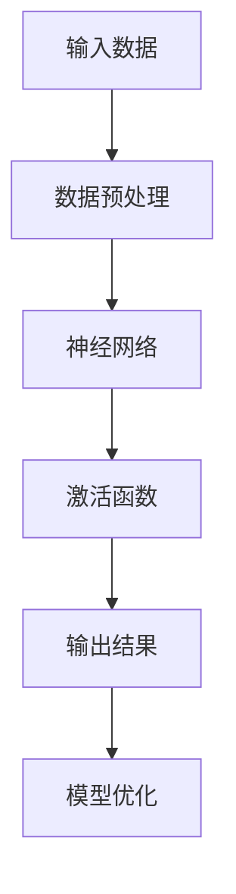

##### 1.2 AI大模型的发展历程

AI大模型的发展历程可以追溯到2006年，Hinton等人提出了深度信念网络（Deep Belief Network, DBN），开启了深度学习的先河。随后，2012年，AlexNet在ImageNet竞赛中取得了突破性的成绩，标志着深度学习在图像识别领域的崛起。近年来，随着计算能力的提升和大数据技术的发展，AI大模型取得了飞速的进步，应用范围也日益广泛。

**核心概念与联系**：

1. **深度信念网络（Deep Belief Network, DBN）**：深度信念网络是一种基于受限玻尔兹曼机（Restricted Boltzmann Machine, RBM）的多层神经网络，能够自动学习数据的低维表示。
2. **ImageNet竞赛**：ImageNet竞赛是一个针对图像识别任务的基准测试，每年的竞赛结果都反映了深度学习在图像识别领域的最新进展。
3. **计算能力提升**：GPU（图形处理器）和TPU（张量处理器）等硬件的普及，为AI大模型的训练提供了强大的计算支持。

**Mermaid流程图**：

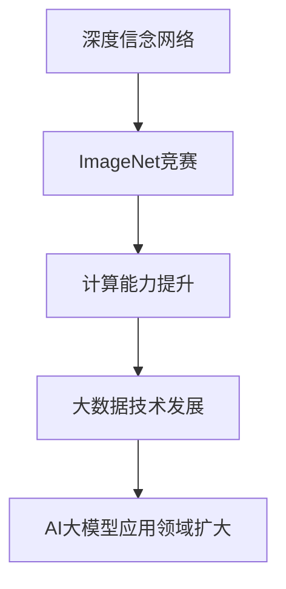

##### 1.3 AI大模型在数据中心的应用前景

随着数据中心技术的发展，AI大模型在数据中心的应用前景日益广阔。数据中心不仅为AI大模型提供了强大的计算资源，还提供了高效的数据存储和管理解决方案。未来，AI大模型将在数据中心领域发挥更大的作用，推动人工智能技术的发展。

**核心概念与联系**：

1. **数据中心（Data Center）**：数据中心是一种集中存储、处理和管理数据的设施，为各种应用提供了计算和存储资源。
2. **计算资源**：数据中心为AI大模型提供了大规模的GPU和TPU等计算资源，能够快速完成模型的训练和推理任务。
3. **数据存储和管理**：数据中心采用分布式存储技术，为AI大模型提供了高效、可靠的数据存储和管理方案。

**Mermaid流程图**：

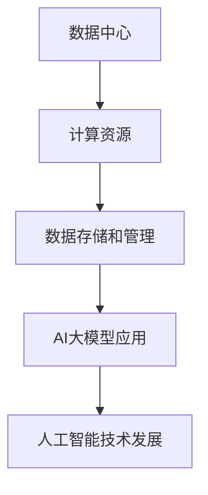

#### 第2章：数据处理平台核心组件

##### 2.1 数据存储与管理

数据存储与管理是数据处理平台的重要组成部分，涉及到数据的安全性、可靠性和高效性。以下是对数据存储与管理的关键概念和技术的详细解析。

**核心概念与联系**：

1. **分布式存储（Distributed Storage）**：分布式存储是将数据分散存储在多个节点上，以提高数据可靠性和扩展性。常用的分布式存储系统包括HDFS、Cassandra和HBase等。
2. **数据备份与恢复（Data Backup and Recovery）**：数据备份是将数据复制到其他存储设备上，以防止数据丢失。数据恢复是从备份设备中恢复数据的过程，常用的数据恢复工具有Rclone、Raidix等。
3. **数据压缩（Data Compression）**：数据压缩是一种减少数据占用存储空间的技术，常用的数据压缩算法包括Huffman编码、LZ77和LZ78等。

**Mermaid流程图**：

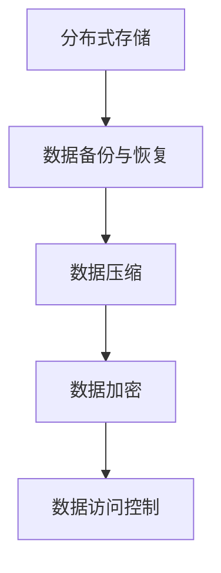

**数据处理框架与工具**

数据处理框架与工具为数据处理平台提供了高效、灵活的数据处理能力。以下是对数据处理框架与工具的关键概念和技术的详细解析。

**核心概念与联系**：

1. **Hadoop与MapReduce**：Hadoop是一种分布式数据处理框架，包括HDFS（分布式文件系统）和MapReduce（分布式计算模型）。Hadoop能够处理海量数据，并提供高可靠性和高扩展性。
2. **Spark与数据处理**：Spark是一种基于内存的分布式数据处理框架，能够提供高效的迭代计算和交互式查询。Spark包括Spark Core、Spark SQL、Spark Streaming和MLlib等模块。
3. **Flink与实时数据处理**：Flink是一种流处理框架，能够处理实时数据流，并提供高效的数据分析能力。Flink包括DataStream API、Table API和Flink SQL等模块。

**Mermaid流程图**：

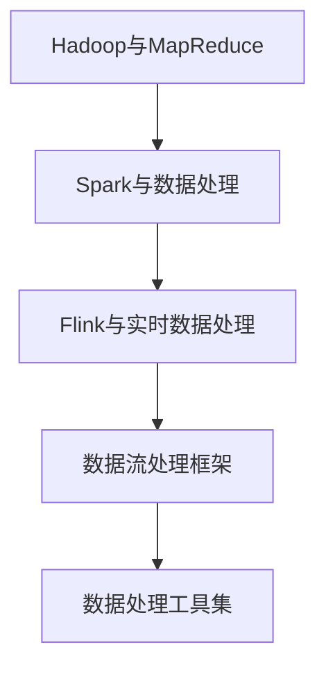

**数据清洗与预处理**

数据清洗与预处理是数据处理过程中至关重要的一步，涉及到数据的质量、完整性和一致性。以下是对数据清洗与预处理的关键概念和技术的详细解析。

**核心概念与联系**：

1. **数据清洗（Data Cleaning）**：数据清洗是指识别和纠正数据中的错误、遗漏和不一致之处。常用的数据清洗方法包括缺失值处理、异常值处理和重复值处理等。
2. **数据预处理（Data Preprocessing）**：数据预处理是指将原始数据转换为适合模型训练的形式。常用的数据预处理方法包括数据标准化、数据归一化和特征提取等。
3. **特征工程（Feature Engineering）**：特征工程是指从原始数据中提取出对模型训练有用的特征。特征工程能够提高模型的性能和泛化能力。

**Mermaid流程图**：

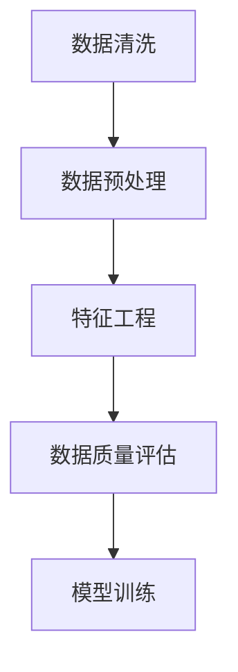

#### 第3章：深度学习在数据处理中的应用

##### 3.1 深度学习基础理论

深度学习（Deep Learning）是机器学习（Machine Learning）的一个分支，主要依赖于多层神经网络进行模型训练和预测。以下是对深度学习基础理论的详细解析。

**核心概念与联系**：

1. **神经网络（Neural Networks）**：神经网络是由大量相互连接的神经元组成的模型，用于模拟人脑的神经元结构和工作原理。神经网络通过学习输入数据，自动提取特征并生成预测结果。
2. **激活函数（Activation Functions）**：激活函数是神经网络中的一个关键组件，用于确定神经元的输出。常见的激活函数包括Sigmoid函数、ReLU函数和Tanh函数等。
3. **反向传播算法（Backpropagation Algorithm）**：反向传播算法是一种用于训练神经网络的优化算法，通过不断调整神经网络的权重和偏置，最小化预测误差。

**Mermaid流程图**：

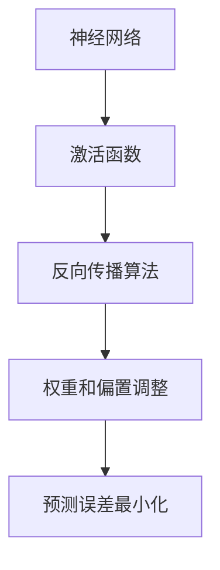

**神经网络在数据处理中的应用**

神经网络在数据处理中具有广泛的应用，包括图像识别、语音识别、文本分类等。以下是对神经网络在数据处理中的应用的详细解析。

**核心概念与联系**：

1. **卷积神经网络（Convolutional Neural Networks, CNN）**：卷积神经网络是一种专门用于处理图像数据的神经网络，通过卷积操作和池化操作提取图像特征。
2. **循环神经网络（Recurrent Neural Networks, RNN）**：循环神经网络是一种专门用于处理序列数据的神经网络，通过循环结构对序列数据进行建模。
3. **长短时记忆网络（Long Short-Term Memory, LSTM）**：长短时记忆网络是循环神经网络的一种变体，通过引入记忆单元来解决长序列依赖问题。

**Mermaid流程图**：

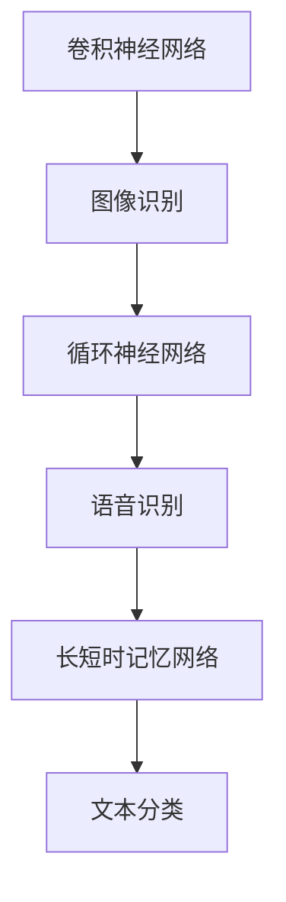

##### 3.3 卷积神经网络在图像数据处理中的应用

卷积神经网络（Convolutional Neural Networks, CNN）是一种专门用于图像识别和处理的人工神经网络。以下是对卷积神经网络在图像数据处理中的应用的详细解析。

**核心概念与联系**：

1. **卷积操作（Convolution Operation）**：卷积操作是CNN中的一个关键组件，用于提取图像特征。卷积操作通过滑动滤波器（卷积核）在图像上扫描，计算局部特征的加权和。
2. **池化操作（Pooling Operation）**：池化操作是CNN中的一个关键组件，用于减小数据维度并提高模型的鲁棒性。常见的池化操作包括最大池化和平均池化。
3. **深度可分离卷积（Depthwise Separable Convolution）**：深度可分离卷积是一种特殊的卷积操作，通过先进行深度卷积（深度wise卷积）再进行逐点卷积（pointwise卷积）的方式，提高模型计算效率。

**Mermaid流程图**：

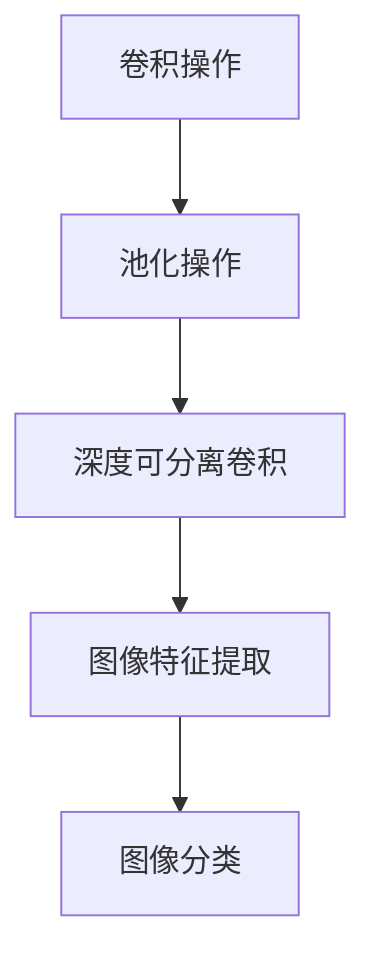

#### 第4章：自然语言处理在数据处理中的应用

##### 4.1 自然语言处理基础

自然语言处理（Natural Language Processing, NLP）是人工智能（Artificial Intelligence, AI）的一个重要分支，致力于使计算机能够理解、生成和处理人类自然语言。以下是对自然语言处理基础理论的详细解析。

**核心概念与联系**：

1. **词向量（Word Vectors）**：词向量是NLP中的一个核心概念，用于将文本表示为向量的形式。常见的词向量模型包括Word2Vec、GloVe和FastText等。
2. **词性标注（Part-of-Speech Tagging）**：词性标注是NLP中的一个重要任务，用于为文本中的每个单词标注其词性（如名词、动词、形容词等）。
3. **依存句法分析（Dependency Parsing）**：依存句法分析是NLP中的一个关键任务，用于分析句子中单词之间的依赖关系，构建句子的依存树。

**Mermaid流程图**：

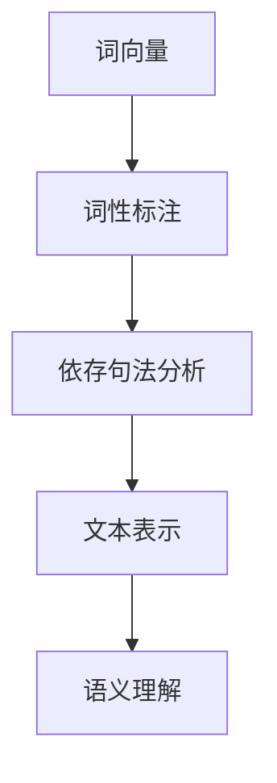

##### 4.2 语音识别在数据处理中的应用

语音识别（Speech Recognition）是NLP的一个重要分支，旨在将语音信号转换为文本。以下是对语音识别在数据处理中的应用的详细解析。

**核心概念与联系**：

1. **隐马尔可夫模型（Hidden Markov Model, HMM）**：隐马尔可夫模型是一种用于语音识别的概率模型，通过隐变量序列和观测变量序列之间的关系进行建模。
2. **高斯混合模型（Gaussian Mixture Model, GMM）**：高斯混合模型是一种用于语音识别的统计模型，通过多个高斯分布组成的混合模型来表示语音特征。
3. **深度神经网络（Deep Neural Networks, DNN）**：深度神经网络是语音识别中的一个关键组件，用于特征提取和分类。

**Mermaid流程图**：

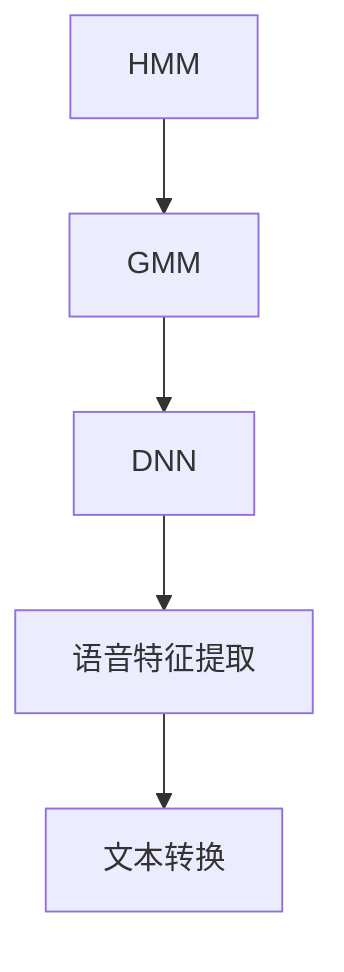

##### 4.3 机器翻译在数据处理中的应用

机器翻译（Machine Translation）是NLP的一个重要应用领域，旨在将一种自然语言翻译成另一种自然语言。以下是对机器翻译在数据处理中的应用的详细解析。

**核心概念与联系**：

1. **统计机器翻译（Statistical Machine Translation, SMT）**：统计机器翻译是一种基于概率模型的机器翻译方法，通过学习双语语料库，建立翻译模型和语言模型。
2. **神经机器翻译（Neural Machine Translation, NMT）**：神经机器翻译是一种基于深度学习的机器翻译方法，通过编码器-解码器模型实现端到端的翻译。
3. **注意力机制（Attention Mechanism）**：注意力机制是NMT中的一个关键组件，用于解决编码器和解码器之间的序列对齐问题。

**Mermaid流程图**：

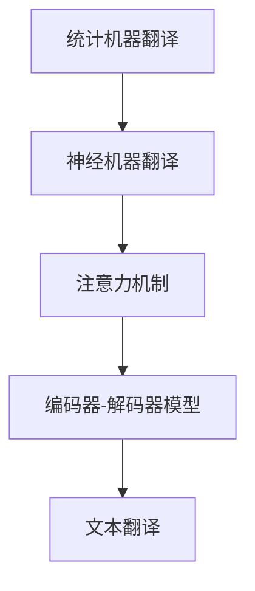

#### 第5章：大数据处理框架与应用

##### 5.1 Hadoop与MapReduce

Hadoop是一种分布式数据处理框架，由Apache软件基金会开发。它包括HDFS（分布式文件系统）和MapReduce（分布式计算模型）两大核心组件。以下是对Hadoop与MapReduce的详细解析。

**核心概念与联系**：

1. **HDFS（Hadoop Distributed File System）**：HDFS是一种分布式文件系统，用于存储大量数据。它将数据分成多个块（默认为128MB或256MB），并分布存储在多个节点上，以提高数据可靠性和扩展性。
2. **MapReduce**：MapReduce是一种分布式计算模型，用于处理大规模数据集。它将数据处理任务分解为Map（映射）和Reduce（归约）两个阶段，通过并行计算和分布式存储实现高效的数据处理。
3. **YARN（Yet Another Resource Negotiator）**：YARN是Hadoop的调度和资源管理框架，用于管理和分配计算资源，使Hadoop能够支持多种数据处理框架，如Spark和Flink。

**Mermaid流程图**：

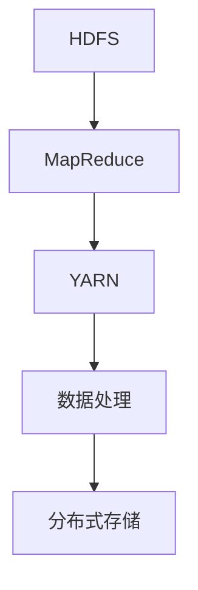

##### 5.2 Spark与数据处理

Spark是一种基于内存的分布式数据处理框架，由Apache软件基金会开发。它提供了丰富的数据处理API，包括Spark Core、Spark SQL、Spark Streaming和MLlib等模块。以下是对Spark与数据处理的详细解析。

**核心概念与联系**：

1. **Spark Core**：Spark Core是Spark的核心组件，提供了基本的分布式计算功能。它包括弹性分布式数据集（RDD，Resilient Distributed Dataset）和弹性分布式共享变量（RDD，弹性分布式共享变量）等数据结构和操作。
2. **Spark SQL**：Spark SQL是一个用于处理结构化数据的模块，提供了类似SQL的查询接口。它能够处理包括关系数据库、Parquet和JSON等多种数据格式。
3. **Spark Streaming**：Spark Streaming是Spark的一个实时数据处理模块，能够处理实时数据流，并提供高吞吐量和低延迟的数据处理能力。

**Mermaid流程图**：

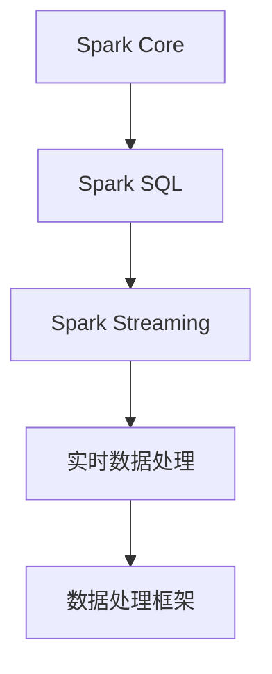

##### 5.3 Flink与实时数据处理

Apache Flink是一种分布式流处理框架，由Apache软件基金会开发。它提供了高性能、低延迟的实时数据处理能力，广泛应用于大规模数据处理、实时流处理和机器学习等领域。以下是对Flink与实时数据处理的详细解析。

**核心概念与联系**：

1. **DataStream API**：DataStream API是Flink的核心API，用于处理流数据。它提供了丰富的操作，如过滤、聚合、连接和窗口等，能够实现复杂的实时数据处理任务。
2. **Table API**：Table API是Flink的一个高级API，用于处理结构化数据。它提供了类似SQL的查询接口，能够与DataStream API无缝集成，提高数据处理的灵活性和易用性。
3. **Flink SQL**：Flink SQL是Flink的一个标准SQL接口，用于查询和分析流数据。它支持包括创建表、插入数据、查询数据和更新数据等多种操作。

**Mermaid流程图**：

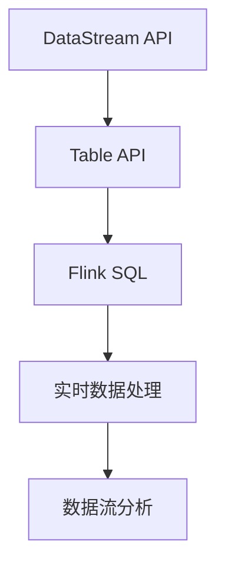

### 第三部分：AI大模型数据处理实战

#### 第6章：数据处理平台搭建实战

##### 6.1 数据处理平台架构设计

数据处理平台架构设计是搭建数据处理平台的第一步，需要明确数据处理平台的整体架构和各组件之间的关系。以下是对数据处理平台架构设计的详细解析。

**核心概念与联系**：

1. **数据源**：数据源是数据处理平台的起点，包括数据库、文件系统、流数据源等。数据源需要提供数据接入接口，以便数据处理平台能够方便地获取数据。
2. **数据存储**：数据存储是数据处理平台的存储层，负责存储和管理数据。常用的数据存储方案包括关系数据库、NoSQL数据库和分布式文件系统等。
3. **数据处理引擎**：数据处理引擎是数据处理平台的核心，负责执行数据处理任务。常见的数据处理引擎包括MapReduce、Spark、Flink等。
4. **数据分析模块**：数据分析模块是数据处理平台的输出层，负责对处理后的数据进行分析和可视化。数据分析模块通常包括报表系统、仪表盘和可视化工具等。

**Mermaid流程图**：

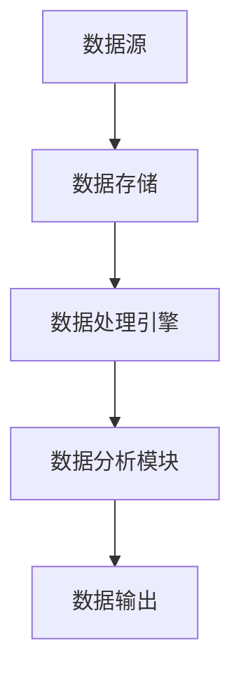

##### 6.2 数据处理平台搭建步骤

数据处理平台搭建步骤包括硬件准备、软件安装、配置和部署等环节。以下是对数据处理平台搭建步骤的详细解析。

**核心概念与联系**：

1. **硬件准备**：硬件准备包括选择合适的硬件设备，如服务器、存储设备和网络设备等。硬件设备的选择需要根据数据处理平台的需求和预算进行。
2. **软件安装**：软件安装包括安装操作系统、数据库、数据处理引擎和相关工具等。软件安装需要确保各组件之间版本兼容，并配置相应的环境变量。
3. **配置和部署**：配置和部署包括配置网络、存储和数据处理引擎等组件，并部署数据处理任务。配置和部署需要遵循最佳实践，确保数据处理平台的稳定性和安全性。

**Mermaid流程图**：

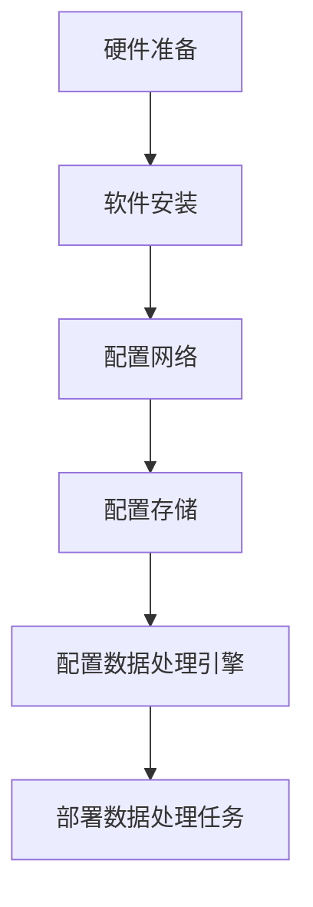

##### 6.3 数据处理平台性能优化

数据处理平台性能优化是提高数据处理效率和性能的关键。以下是对数据处理平台性能优化的详细解析。

**核心概念与联系**：

1. **数据分区（Data Partitioning）**：数据分区是将数据分布到多个分区中，以提高数据处理速度。数据分区可以通过指定分区键实现，常用的分区键包括时间戳、ID等。
2. **索引（Indexing）**：索引是加快数据查询速度的重要手段。索引可以通过B+树、哈希表等数据结构实现，常用的索引类型包括主键索引、唯一索引和全文索引等。
3. **缓存（Caching）**：缓存是将经常访问的数据存储在内存中，以减少磁盘I/O操作。常用的缓存技术包括LRU（最近最少使用）缓存和Redis缓存等。
4. **并行处理（Parallel Processing）**：并行处理是利用多核处理器并行执行数据处理任务，以提高数据处理速度。并行处理可以通过MapReduce、Spark等分布式计算框架实现。

**Mermaid流程图**：

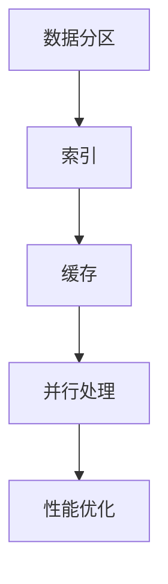

#### 第7章：AI大模型数据处理案例

##### 7.1 案例一：图像识别数据处理

图像识别数据处理是AI大模型应用的一个重要领域，通过深度学习模型对图像进行分类和识别。以下是对图像识别数据处理案例的详细解析。

**核心概念与联系**：

1. **数据集**：图像识别数据处理需要大量的图像数据作为训练集。常用的图像数据集包括ImageNet、CIFAR-10和MNIST等。
2. **预处理**：预处理包括图像缩放、裁剪、翻转等操作，以增加数据的多样性。预处理可以通过OpenCV等图像处理库实现。
3. **模型训练**：模型训练是通过深度学习算法（如卷积神经网络）对图像进行分类和识别。常用的深度学习框架包括TensorFlow、PyTorch和Keras等。
4. **模型评估**：模型评估是通过测试集评估模型的分类准确率、召回率和F1分数等指标。模型评估可以通过混淆矩阵、ROC曲线等工具实现。

**Mermaid流程图**：

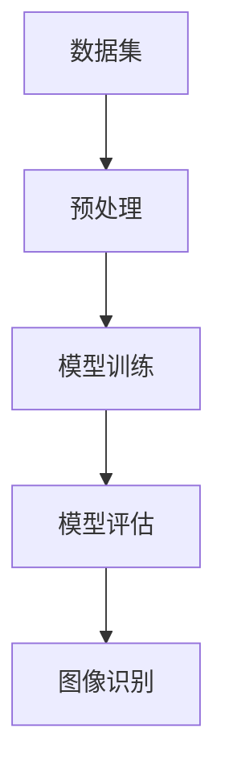

##### 7.2 案例二：语音识别数据处理

语音识别数据处理是AI大模型应用的重要领域，通过深度学习模型对语音进行识别和转换。以下是对语音识别数据处理案例的详细解析。

**核心概念与联系**：

1. **音频数据集**：语音识别数据处理需要大量的音频数据作为训练集。常用的音频数据集包括LibriSpeech、Common Voice和TED-LIUM等。
2. **特征提取**：特征提取是将音频信号转换为适合模型训练的向量表示。常用的特征提取方法包括梅尔频率倒谱系数（MFCC）和滤波器组（Filter Banks）等。
3. **模型训练**：模型训练是通过深度学习算法（如循环神经网络和卷积神经网络）对语音进行识别。常用的深度学习框架包括TensorFlow、PyTorch和Keras等。
4. **模型评估**：模型评估是通过测试集评估模型的识别准确率、召回率和错误率等指标。模型评估可以通过混淆矩阵、ROC曲线等工具实现。

**Mermaid流程图**：

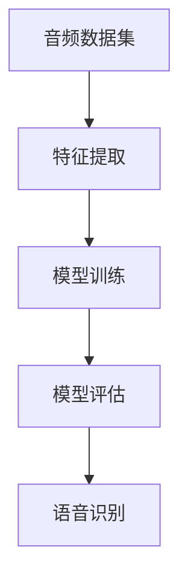

##### 7.3 案例三：文本分类与处理

文本分类与处理是AI大模型应用的重要领域，通过对文本进行分类和提取特征，实现文本信息的自动处理。以下是对文本分类与处理案例的详细解析。

**核心概念与联系**：

1. **文本数据集**：文本分类与处理需要大量的文本数据作为训练集。常用的文本数据集包括新闻分类数据集、社交媒体数据集和电子邮件数据集等。
2. **预处理**：预处理包括文本清洗、去停用词、词向量化等操作，以增加数据的多样性。预处理可以通过NLTK、spaCy等文本处理库实现。
3. **模型训练**：模型训练是通过深度学习算法（如卷积神经网络和循环神经网络）对文本进行分类。常用的深度学习框架包括TensorFlow、PyTorch和Keras等。
4. **模型评估**：模型评估是通过测试集评估模型的分类准确率、召回率和F1分数等指标。模型评估可以通过混淆矩阵、ROC曲线等工具实现。

**Mermaid流程图**：

```mermaid
graph TB
A[文本数据集] --> B[预处理]
B --> C[模型训练]
C --> D[模型评估]
D --> E[文本分类与处理]
```

### 第四部分：数据处理平台的发展趋势与挑战

#### 第8章：数据处理平台的发展趋势与挑战

##### 8.1 数据处理平台技术发展趋势

数据处理平台技术发展趋势主要体现在以下几个方面：

1. **云计算与大数据的深度融合**：云计算的普及为数据处理平台提供了强大的计算和存储资源，大数据技术的快速发展使得数据处理平台能够处理海量数据。未来，云计算和大数据将深度融合，为数据处理平台提供更高效、更灵活的数据处理能力。
2. **边缘计算与实时数据处理**：随着物联网和5G技术的快速发展，数据处理平台需要应对越来越大的数据量和越来越高的实时性要求。边缘计算作为一种分布式计算架构，能够在靠近数据源的地方进行数据处理，降低网络延迟和传输成本。未来，边缘计算与实时数据处理将成为数据处理平台的重要趋势。
3. **人工智能与机器学习技术的应用**：人工智能和机器学习技术在数据处理平台的各个层面都有广泛的应用。例如，自动化数据清洗和预处理、智能特征提取和模型优化等。未来，人工智能和机器学习技术将进一步推动数据处理平台的发展。
4. **数据处理平台的智能化和自动化**：随着人工智能技术的进步，数据处理平台将变得更加智能化和自动化。例如，自动数据质量评估、自动特征工程和自动模型优化等。智能化和自动化将提高数据处理平台的效率，降低人工干预的成本。

##### 8.2 数据处理平台面临的挑战与解决方案

数据处理平台在发展过程中也面临着一系列挑战：

1. **数据安全与隐私保护**：随着数据量的不断增加，数据安全和隐私保护成为数据处理平台面临的重要挑战。为了应对这一挑战，数据处理平台需要采取严格的数据加密、访问控制和隐私保护措施。
2. **数据存储与管理的复杂性**：大规模数据处理平台需要处理海量的数据，数据存储和管理变得异常复杂。为了应对这一挑战，数据处理平台需要采用分布式存储技术和高效的数据管理策略。
3. **数据处理性能优化**：随着数据量的增加和数据处理需求的提高，数据处理平台的性能优化成为一个重要的挑战。为了优化性能，数据处理平台需要采用并行处理、缓存技术和高效算法等。
4. **数据处理平台的可扩展性**：数据处理平台需要能够适应不断变化的数据处理需求，具备良好的可扩展性。为了实现可扩展性，数据处理平台需要采用模块化设计、分布式架构和弹性调度等技术。

针对上述挑战，可以采取以下解决方案：

1. **数据安全与隐私保护**：采用加密算法和身份认证机制保护数据安全；使用隐私保护技术，如差分隐私和联邦学习，保护用户隐私。
2. **数据存储与管理的复杂性**：采用分布式存储系统，如HDFS和Cassandra，提高数据存储的可靠性和扩展性；使用数据管理工具，如Apache NiFi和Apache Airflow，简化数据管理和流程。
3. **数据处理性能优化**：采用并行处理和分布式计算框架，如MapReduce和Spark，提高数据处理速度；使用缓存技术和高效算法，如B+树和LRU缓存，提高数据处理效率。
4. **数据处理平台的可扩展性**：采用模块化设计和分布式架构，如微服务架构和云计算架构，提高数据处理平台的扩展性和灵活性；使用自动化工具，如Kubernetes和Docker，实现弹性调度和自动化管理。

##### 8.3 数据处理平台未来发展方向

数据处理平台未来的发展方向主要体现在以下几个方面：

1. **智能化数据处理**：随着人工智能技术的不断进步，数据处理平台将实现智能化。智能化数据处理包括自动化数据预处理、智能特征提取和智能模型优化等。通过智能化数据处理，数据处理平台将大大提高数据处理的效率和准确性。
2. **实时数据处理**：实时数据处理是数据处理平台未来的重要方向。随着物联网和5G技术的快速发展，数据处理平台需要能够实时处理和分析大量数据，实现实时决策和实时反馈。
3. **数据处理平台的定制化**：未来的数据处理平台将更加注重定制化。根据不同行业和应用场景的需求，数据处理平台将提供多样化的功能和解决方案。定制化数据处理平台将更好地满足用户的需求，提高数据处理的效果和效率。
4. **数据处理平台的安全性和可靠性**：随着数据处理平台应用范围的扩大，安全性和可靠性变得尤为重要。未来的数据处理平台将采用更加严格的安全措施和可靠性保障机制，确保数据的安全性和完整性。

总之，数据处理平台在未来将继续快速发展，应对各种挑战，并在智能化、实时化、定制化和安全性等方面实现重大突破。

### 附录

#### 附录A：常用数据处理工具与框架

##### A.1 数据存储与管理工具

数据存储与管理工具在数据处理平台中扮演着重要角色，以下列出了一些常用的数据存储与管理工具：

1. **HDFS（Hadoop Distributed File System）**：HDFS是Hadoop的核心组件，用于分布式存储大数据。它具有高可靠性、高扩展性，能够处理海量数据。
2. **Cassandra**：Cassandra是一个高度可扩展的分布式NoSQL数据库，适用于存储大规模结构化数据。它具有高可用性和高性能，能够处理高并发读写操作。
3. **HBase**：HBase是一个分布式、可扩展的列存储数据库，基于Hadoop平台构建。它适用于存储海量半结构化或非结构化数据，提供高吞吐量的随机读写操作。
4. **MongoDB**：MongoDB是一个开源的NoSQL数据库，具有高性能、可扩展性和灵活性。它适用于存储大规模文档型数据，支持丰富的查询和索引功能。
5. **Redis**：Redis是一个开源的内存数据库，具有高性能和实时处理能力。它适用于存储少量高速缓存数据，支持丰富的数据结构和操作。

##### A.2 数据处理框架与工具

数据处理框架与工具在数据处理平台中起到了核心作用，以下列出了一些常用的数据处理框架与工具：

1. **Hadoop**：Hadoop是一个分布式数据处理框架，包括HDFS、MapReduce、YARN等组件。它适用于处理大规模数据集，提供高可靠性和高扩展性。
2. **Spark**：Spark是一个基于内存的分布式数据处理框架，提供高效的迭代计算和交互式查询。它适用于处理大规模数据集，具有高性能和低延迟。
3. **Flink**：Flink是一个分布式流处理框架，提供高性能的实时数据处理能力。它适用于处理实时数据流，支持复杂的数据分析和计算。
4. **TensorFlow**：TensorFlow是一个开源的深度学习框架，提供丰富的模型训练和推理功能。它适用于构建和部署深度学习模型，支持多种编程语言。
5. **PyTorch**：PyTorch是一个开源的深度学习框架，提供动态计算图和易于使用的接口。它适用于快速原型设计和实验，具有高性能和灵活性。

##### A.3 数据清洗与预处理工具

数据清洗与预处理是数据处理过程中不可或缺的步骤，以下列出了一些常用的数据清洗与预处理工具：

1. **Pandas**：Pandas是一个开源的Python库，提供丰富的数据处理和分析功能。它适用于数据清洗、数据预处理、数据转换和数据可视化等任务。
2. **NumPy**：NumPy是一个开源的Python库，提供高性能的数组操作和数学运算。它适用于数据预处理、数据分析和科学计算等任务。
3. **SciPy**：SciPy是一个开源的Python库，提供科学计算和工程领域的模块。它适用于数据处理、数据分析、优化和统计等任务。
4. **Scikit-learn**：Scikit-learn是一个开源的Python库，提供丰富的机器学习算法和工具。它适用于数据预处理、特征提取、模型训练和评估等任务。
5. **OpenCV**：OpenCV是一个开源的计算机视觉库，提供丰富的图像处理和计算机视觉功能。它适用于图像预处理、图像增强、图像分类和目标检测等任务。

#### 附录B：常见问题与解决方案

##### B.1 数据处理常见问题

在数据处理过程中，可能会遇到各种常见问题，以下列出了一些常见问题及其解决方案：

1. **数据缺失**：解决方案：使用填充方法，如平均值填充、中值填充或插值填充，来填补缺失数据。
2. **数据异常**：解决方案：使用统计学方法，如离群点检测或异常值分析，来识别和删除异常数据。
3. **数据不一致**：解决方案：使用数据清洗方法，如去重、标准化和统一编码，来确保数据的一致性。
4. **数据格式不统一**：解决方案：使用数据转换工具，如Pandas或NumPy，来统一数据格式。
5. **数据处理效率低**：解决方案：使用并行处理和分布式计算框架，如Spark或Flink，来提高数据处理效率。

##### B.2 数据处理平台搭建常见问题

在搭建数据处理平台时，可能会遇到一些常见问题，以下列出了一些常见问题及其解决方案：

1. **硬件资源不足**：解决方案：采用分布式计算架构，如Hadoop或Spark，来利用多台服务器资源。
2. **软件兼容性问题**：解决方案：确保各组件版本兼容，并使用容器化技术，如Docker，来简化部署和管理。
3. **数据处理任务失败**：解决方案：使用监控工具，如Kubernetes或Prometheus，来实时监控数据处理任务状态，并自动重启失败的任务。
4. **数据安全性问题**：解决方案：使用加密技术，如SSL/TLS，来保护数据传输和存储；采用访问控制机制，如RBAC（基于角色的访问控制），来限制数据访问权限。
5. **数据处理效率低**：解决方案：优化数据处理算法和流程，如使用缓存技术和高效算法，来提高数据处理效率。

##### B.3 AI大模型数据处理常见问题

在AI大模型数据处理过程中，可能会遇到一些常见问题，以下列出了一些常见问题及其解决方案：

1. **数据不足**：解决方案：使用数据增强方法，如图像旋转、裁剪和缩放，来扩充数据集；使用数据生成方法，如生成对抗网络（GAN），来生成新的数据。
2. **模型过拟合**：解决方案：采用正则化方法，如L1和L2正则化，来防止模型过拟合；使用交叉验证方法，如K折交叉验证，来评估模型性能。
3. **模型训练时间过长**：解决方案：使用更高效的算法和模型，如深度神经网络和卷积神经网络，来减少训练时间；使用分布式训练方法，如并行训练和分布式训练，来提高训练速度。
4. **模型性能不稳定**：解决方案：使用数据预处理方法，如标准化和归一化，来稳定模型输入；使用随机初始化和批量归一化，来减少模型性能波动。
5. **模型部署困难**：解决方案：使用模型压缩和量化技术，如模型压缩和量化，来减少模型大小和计算复杂度；使用模型即服务（MaaS）平台，如TensorFlow Serving，来简化模型部署和管理。

### 作者信息

作者：AI天才研究院/AI Genius Institute & 禅与计算机程序设计艺术 /Zen And The Art of Computer Programming

### 总结

本文《AI大模型应用数据中心的数据处理平台》系统地阐述了AI大模型的基本概念、数据处理平台核心组件及数据处理技术。通过详细分析深度学习、自然语言处理和大数据处理框架，本文为读者提供了一个全面、易懂的数据处理平台实战指南。同时，本文还探讨了数据处理平台的发展趋势与挑战，以及常用数据处理工具与框架。希望本文能为读者在AI大模型数据处理领域提供有价值的参考和启示。在未来的工作中，我们将继续深入研究AI大模型数据处理技术，不断推动人工智能技术的发展和应用。

