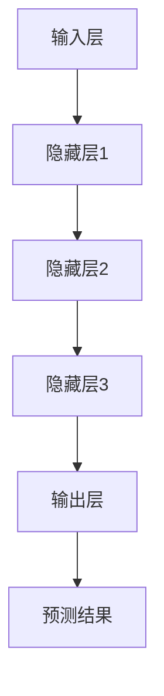
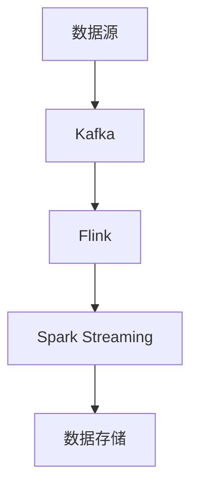

                 

### 文章标题

《AI大模型应用数据中心的数据流处理技术》

> 关键词：AI大模型、数据中心、数据流处理、数据预处理、实时数据处理

> 摘要：本文将深入探讨AI大模型在数据中心的数据流处理技术，包括其核心概念、技术原理、预处理和优化方法，以及实际应用案例分析。通过详细的伪代码和数学模型解释，读者将全面了解如何利用AI大模型提升数据中心的数据处理效率。

### 引言

随着人工智能技术的飞速发展，AI大模型在各个领域都展现出了强大的应用潜力。数据中心作为现代企业和组织数据管理和处理的枢纽，其数据流处理技术的优化对于提升整体业务效率和竞争力具有重要意义。本文旨在系统性地介绍AI大模型在数据中心的数据流处理技术，帮助读者深入了解其核心概念、技术原理、预处理和优化方法，以及实际应用案例分析。

数据中心的数据流处理技术涉及多个关键环节，包括数据预处理、实时数据处理、模型压缩和加速等。AI大模型通过这些技术手段，不仅能够高效地处理海量数据，还能够实现对数据的深入分析和智能决策。本文将围绕这些核心主题，逐步展开深入探讨。

在接下来的内容中，我们将首先介绍AI大模型和数据流处理技术的基本概念，并通过Mermaid流程图展示其架构和工作流程。随后，我们将详细讲解AI大模型的训练原理和数据处理技术原理。接着，文章将分别介绍数据预处理、实时数据处理以及数据流优化等核心技术。最后，通过实际案例分析，我们将展示AI大模型在数据中心的应用场景和具体实现方法。

通过本文的阅读，读者将全面了解AI大模型在数据中心的数据流处理技术，掌握相关核心概念和技术原理，并获得实际项目开发的经验和启示。让我们开始这段探索之旅吧！

### AI大模型与数据流处理技术概述

#### 1.1 AI大模型概述

AI大模型是指具有非常大规模参数和复杂结构的机器学习模型，能够在海量数据上实现高效和准确的预测与决策。这些模型通常基于深度学习技术，通过多层神经网络架构进行训练和优化。AI大模型具有以下几个主要组成部分：

- **输入层**：接收外部输入数据，例如图像、文本、声音等。
- **隐藏层**：包含多个隐藏层，用于提取和转换输入数据特征。
- **输出层**：根据训练目标生成预测结果，例如分类标签、回归值等。

图1展示了AI大模型的基本组成部分与工作流程：



#### 1.2 数据流处理技术概述

数据流处理技术是指用于实时或批量处理大规模数据流的计算方法和技术。其核心目标是对动态数据流进行高效、实时地处理和分析。数据流处理技术在数据中心中发挥着重要作用，能够帮助企业和组织实现对数据的快速响应和智能决策。以下是几种主流数据流处理技术的概述：

- **Kafka**：一种高吞吐量的分布式消息队列系统，广泛用于数据收集和传输。Kafka通过分区和副本机制实现高可用性和低延迟的数据流处理。
- **Flink**：一种流处理框架，能够实现高效、低延迟的数据流处理和批处理。Flink提供丰富的API和操作，支持复杂的数据处理任务。
- **Spark Streaming**：基于Spark的实时流处理框架，能够处理高吞吐量的数据流，并集成Spark的批处理能力。

图2展示了主流数据流处理技术的架构与工作流程：



通过以上概述，读者可以对AI大模型和数据流处理技术有一个初步的了解。接下来，本文将分别详细讲解AI大模型的基本原理和数据流处理技术的原理，帮助读者深入理解这些核心概念。

### AI大模型的基本原理

#### 2.1 神经网络基础

神经网络是AI大模型的核心组成部分，其基础概念和算法对于理解大模型的工作原理至关重要。神经网络由多个层次组成，包括输入层、隐藏层和输出层。每一层都由多个神经元（或节点）组成，这些神经元通过加权连接进行信息传递和处理。

#### 2.1.1 神经元模型

神经元模型是神经网络的基本构建块。一个简单的神经元模型可以表示为：

$$
\text{输出} = \sigma(\sum_{i=1}^{n} w_i \cdot x_i + b)
$$

其中，\(x_i\)表示第i个输入特征，\(w_i\)表示对应的权重，\(b\)表示偏置项，\(\sigma\)是激活函数。常见的激活函数包括Sigmoid、ReLU和Tanh等。

#### 2.1.2 前向传播

前向传播是神经网络处理输入数据的基本过程。给定一个输入样本，神经网络通过输入层传递到隐藏层，再从隐藏层传递到输出层。在每一层中，神经元根据输入值和权重计算输出值，并通过激活函数进行处理。

前向传播的伪代码如下：

```python
# 输入数据
x = [x1, x2, ..., xn]

# 权重和偏置
weights = [[w11, w12, ..., w1n], ..., [wn1, wn2, ..., wnn]]
biases = [b1, b2, ..., bn]

# 激活函数（以ReLU为例）
def activate(z):
    return max(0, z)

# 前向传播
for layer in range(num_layers - 1):
    z = np.dot(x, weights[layer]) + biases[layer]
    a = activate(z)
    x = a
```

#### 2.1.3 反向传播

反向传播是神经网络训练的核心算法，用于根据预测误差调整权重和偏置。反向传播通过层层递归计算每个神经元的梯度，并使用梯度下降法更新权重。

反向传播的伪代码如下：

```python
# 预测值和真实值
y = [y1, y2, ..., yn]
y_pred = [a1, a2, ..., an]

# 损失函数（以均方误差为例）
def loss(y, y_pred):
    return np.mean((y - y_pred)**2)

# 计算梯度
def compute_gradient(z, a, y, y_pred):
    dz = a * (1 - a) * (y - y_pred)
    return dz

# 反向传播
for layer in reversed(range(num_layers - 1)):
    if layer == num_layers - 2:  # 输出层
        dz = compute_gradient(z, a, y, y_pred)
    else:
        dz = compute_gradient(z, a, y, y_pred) * weights[layer + 1].T
    
    dweights[layer] = np.dot(x.T, dz)
    dbiases[layer] = np.sum(dz, axis=0)
    x = weights[layer].T
    
    # 梯度下降更新权重和偏置
    weights[layer] -= learning_rate * dweights[layer]
    biases[layer] -= learning_rate * dbiases[layer]
```

通过上述内容，读者可以理解神经网络的基本原理和前向传播与反向传播算法。接下来，本文将详细讲解AI大模型训练中的其他核心技术，包括批量归一化、激活函数和损失函数等。

#### 2.2 大模型训练技术

AI大模型的训练过程是一个复杂且耗时的任务，其核心在于优化模型参数以最小化预测误差。在这一部分，我们将详细探讨几种在大模型训练中常用的技术，包括批量归一化、激活函数和损失函数。

#### 2.2.1 批量归一化

批量归一化（Batch Normalization）是一种用于加速神经网络训练和改善模型稳定性的技术。其基本思想是在每一层对输入数据进行归一化处理，即将输入数据缩放到均值为0、标准差为1的标准化分布。批量归一化的公式如下：

$$
\bar{x} = \frac{x - \mu}{\sigma}
$$

其中，\(\mu\)是当前层的输入数据的均值，\(\sigma\)是标准差。

批量归一化通过减少内部协变量转移，使得每层的输入数据具有类似的分布，从而提高模型的训练效率。其伪代码实现如下：

```python
def batch_normalize(x, mean, var):
    x_norm = (x - mean) / np.sqrt(var + 1e-8)
    return x_norm
```

#### 2.2.2 激活函数

激活函数是神经网络中一个关键的组成部分，其作用是引入非线性特性，使得神经网络能够拟合复杂的数据分布。常见的激活函数包括Sigmoid、ReLU和Tanh等。

- **Sigmoid函数**：

$$
\sigma(z) = \frac{1}{1 + e^{-z}}
$$

Sigmoid函数在[-∞, +∞]区间内单调递增，输出范围在(0, 1)之间，常用于二分类问题。

- **ReLU函数**：

$$
\sigma(z) = \max(0, z)
$$

ReLU函数在输入小于0时输出为0，在输入大于0时输出为输入值本身，具有简单的形式和良好的梯度性质，常用于隐藏层激活函数。

- **Tanh函数**：

$$
\tanh(z) = \frac{e^z - e^{-z}}{e^z + e^{-z}}
$$

Tanh函数在[-∞, +∞]区间内单调递增，输出范围在[-1, 1]之间，能够更好地平衡负值和正值的影响。

激活函数的伪代码实现如下：

```python
def sigmoid(z):
    return 1 / (1 + np.exp(-z))

def relu(z):
    return np.maximum(0, z)

def tanh(z):
    return (np.exp(z) - np.exp(-z)) / (np.exp(z) + np.exp(-z))
```

#### 2.2.3 损失函数

损失函数是评估模型预测结果与真实值之间差距的重要工具，其目的是通过优化损失函数来调整模型参数。常见的损失函数包括均方误差（MSE）、交叉熵损失（Cross-Entropy Loss）等。

- **均方误差（MSE）**：

$$
\text{MSE} = \frac{1}{n} \sum_{i=1}^{n} (y_i - \hat{y}_i)^2
$$

MSE用于回归问题，计算预测值与真实值之间平方差的平均值。

- **交叉熵损失（Cross-Entropy Loss）**：

$$
\text{Cross-Entropy} = -\sum_{i=1}^{n} y_i \log(\hat{y}_i)
$$

交叉熵损失用于分类问题，计算真实分布与预测分布之间的差异。

损失函数的伪代码实现如下：

```python
def mse(y, y_pred):
    return np.mean((y - y_pred)**2)

def cross_entropy(y, y_pred):
    return -np.sum(y * np.log(y_pred))
```

通过以上对批量归一化、激活函数和损失函数的详细讲解，读者可以更好地理解AI大模型训练过程中的关键技术。这些技术不仅有助于提高模型的训练效率和预测准确性，还为后续的优化和扩展奠定了基础。接下来，本文将介绍数据流处理技术的原理，帮助读者深入理解数据中心的数据流处理过程。

#### 3.1 数据流模型与批处理

数据流处理技术是一种用于实时或批量处理大规模数据流的计算方法和技术。数据流模型与批处理是数据流处理技术的两个核心概念，它们在数据中心的实际应用中发挥着重要作用。

##### 3.1.1 数据流模型

数据流模型是一种基于事件驱动（Event-Driven）的计算模型，它将数据看作一系列连续的事件流，并在数据到达时进行实时处理。数据流模型的核心特点是高吞吐量、低延迟和可伸缩性，能够应对实时性和大规模数据处理的需求。

- **Kafka**：是一种高吞吐量的分布式消息队列系统，广泛应用于数据收集和传输。Kafka通过分区（Partition）和副本（Replica）机制实现高可用性和低延迟的数据流处理。每个分区都是一个顺序存储的消息队列，消息在分区内部按照顺序追加写入，同时通过多个副本实现数据冗余和容错。Kafka的架构和工作流程可以表示为：

  ```mermaid
  graph TD
      A[数据源] --> B[Kafka]
      B --> C[消费者]
      B --> D[生产者]
  ```

- **Flink**：是一种流处理框架，能够实现高效、低延迟的数据流处理和批处理。Flink提供丰富的API和操作，支持复杂的数据处理任务，例如数据聚合、过滤、连接等。Flink的架构和工作流程可以表示为：

  ```mermaid
  graph TD
      A[数据源] --> B[Flink]
      B --> C[数据存储]
      B --> D[批处理]
  ```

##### 3.1.2 批处理

批处理（Batch Processing）是一种将数据按批次处理的技术，其核心思想是将大量数据分批次进行处理，从而提高处理效率和资源利用率。批处理通常用于处理历史数据或批量任务，例如日志分析、报表生成等。

- **MapReduce**：是一种分布式数据处理模型，用于处理大规模数据集。MapReduce通过Map和Reduce两个阶段对数据集进行并行处理，Map阶段将数据拆分成多个子任务并行处理，Reduce阶段将Map阶段的结果进行汇总。MapReduce的架构和工作流程可以表示为：

  ```mermaid
  graph TD
      A[数据源] --> B[Mapper]
      B --> C[Shuffle]
      C --> D[Reducer]
  ```

- **Flink**：除了支持实时数据处理外，还提供批处理功能。Flink的批处理与流处理共享相同的执行引擎和内存管理，能够实现高效、低延迟的批处理。Flink的批处理架构和工作流程可以表示为：

  ```mermaid
  graph TD
      A[数据源] --> B[Flink]
      B --> C[Batch处理]
      B --> D[流处理]
  ```

通过上述对数据流模型与批处理技术的介绍，读者可以了解数据中心常见的数据流处理技术及其工作流程。在接下来的内容中，我们将进一步探讨实时数据处理技术，帮助读者深入理解数据流处理的核心技术。

#### 3.2 实时数据处理

实时数据处理是数据流处理技术中的关键部分，其目标是在数据到达时进行快速处理和分析，以实现对动态变化的及时响应。实时数据处理技术在数据中心中广泛应用于实时监控、实时分析和智能决策等领域。

##### 3.2.1 Kafka的实时数据处理

Kafka是一种高性能的分布式消息队列系统，广泛用于实时数据处理。Kafka通过分区和副本机制实现高吞吐量和低延迟的数据流处理，能够保证消息的顺序性和可靠性。Kafka的实时数据处理流程如下：

1. **数据生成**：生产者（Producer）将数据生成并写入到Kafka topic的分区中。
2. **数据传输**：Kafka将消息分区存储在多个副本上，确保数据的高可用性和可靠性。
3. **数据消费**：消费者（Consumer）从Kafka topic的分区中消费数据，并进行实时处理和分析。

Kafka的实时数据处理算法主要涉及消息的分发、分区和消费等关键步骤。以下是一个简化的Kafka实时数据处理算法的伪代码：

```python
# Kafka实时数据处理算法伪代码
def kafka_realtime_processing(topic, partitions, consumers):
    # 创建Kafka生产者和消费者
    producer = create_kafka_producer()
    consumers = [create_kafka_consumer() for _ in range(partitions)]

    # 数据生成和写入
    for data in data_stream():
        producer.send(topic, data)

    # 数据消费和实时处理
    for consumer in consumers:
        for message in consumer.consume_messages():
            process_message(message)

def process_message(message):
    # 对消息进行实时处理
    print("Processing message:", message)
    # 可以进一步调用其他实时分析函数
    analyze_message(message)
```

##### 3.2.2 Spark Streaming的实时数据处理

Spark Streaming是基于Spark的实时流处理框架，能够处理高吞吐量的数据流，并集成Spark的批处理能力。Spark Streaming通过微批（Micro-Batch）的方式对实时数据进行处理，每批数据的大小可以通过配置进行调整。

Spark Streaming的实时数据处理流程如下：

1. **数据生成**：生产者将数据生成并写入到Spark Streaming的输入源。
2. **数据输入**：Spark Streaming从输入源读取数据，并划分为多个微批。
3. **数据处理**：每个微批通过Spark的分布式计算引擎进行处理，包括转换、聚合和计算等操作。
4. **数据处理结果**：处理结果存储在输出源或直接进行展示和告警。

Spark Streaming的实时数据处理算法主要涉及数据输入、微批划分和分布式计算等步骤。以下是一个简化的Spark Streaming实时数据处理算法的伪代码：

```python
# Spark Streaming实时数据处理算法伪代码
def spark_streaming_realtime_processing(input_source, output_source, batch_duration):
    # 创建Spark Streaming上下文
    streaming_context = create_spark_streaming_context()

    # 数据输入
    data_stream = streaming_context.socket_stream(input_source)

    # 数据处理
    processed_stream = data_stream \
        .map(process_message) \
        .reduceByKey(add)

    # 数据输出
    processed_stream.save_to_output_source(output_source)

    # 开启处理
    streaming_context.start()
    streaming_context.await_termination()

def process_message(message):
    # 对消息进行实时处理
    print("Processing message:", message)
    # 可以进一步调用其他实时分析函数
    analyze_message(message)

def analyze_message(message):
    # 实时分析消息
    print("Analyzing message:", message)
    # 可以根据需要执行特定的分析任务
```

通过上述对Kafka和Spark Streaming的实时数据处理技术的介绍，读者可以了解如何在数据中心利用这些技术实现高效、低延迟的数据流处理。在接下来的内容中，我们将继续探讨数据预处理和数据流优化技术，以进一步优化数据中心的数据处理能力。

#### 3.3 数据预处理

数据预处理是数据流处理中至关重要的一步，其目的是提高数据质量和模型性能。数据预处理包括数据清洗、数据特征提取等多个环节，每个环节都有其独特的数学模型和方法。

##### 3.3.1 数据清洗

数据清洗是数据预处理的第一步，其目标是处理和纠正原始数据中的错误、异常和缺失。数据清洗的方法包括：

- **缺失值填充**：常用的方法有均值填充、中值填充和众数填充。以下是一个简单的缺失值填充算法的伪代码：

  ```python
  def fill_missing_values(data, method='mean'):
      if method == 'mean':
          mean_value = np.mean(data)
          data[data == np.nan] = mean_value
      elif method == 'median':
          median_value = np.median(data)
          data[data == np.nan] = median_value
      elif method == 'mode':
          mode_value = np.bincount(data[data != np.nan]).argmax()
          data[data == np.nan] = mode_value
      return data
  ```

- **异常值处理**：异常值是指与大多数数据点相比偏离较大的值。常用的方法有阈值法和箱线图法。以下是一个简单的异常值处理算法的伪代码：

  ```python
  def remove_outliers(data, threshold=3):
      mean = np.mean(data)
      std = np.std(data)
      data[data < mean - threshold * std] = mean
      data[data > mean + threshold * std] = mean
      return data
  ```

##### 3.3.2 数据特征提取

数据特征提取是数据预处理的核心环节，其目标是提取出能够有效描述数据特性的特征，从而提高模型性能。常用的特征提取方法包括：

- **主成分分析（PCA）**：PCA是一种降维技术，通过保留主要数据特征，减少数据维度，从而提高模型训练效率和计算性能。PCA的基本原理是计算数据集的协方差矩阵，然后找到协方差矩阵的特征值和特征向量，将数据投影到特征向量上。以下是一个简单的PCA算法的伪代码：

  ```python
  def pca(data, n_components):
      # 计算协方差矩阵
      covariance_matrix = np.cov(data, rowvar=False)
      
      # 计算特征值和特征向量
      eigenvalues, eigenvectors = np.linalg.eigh(covariance_matrix)
      
      # 选取前n个特征向量
      eigenvectors = eigenvectors[:, np.argsort(eigenvalues)[::-1]]
      
      # 将数据投影到特征向量上
      transformed_data = np.dot(data, eigenvectors[:n_components])
      
      return transformed_data
  ```

- **线性判别分析（LDA）**：LDA是一种特征提取技术，旨在将数据投影到新的空间中，使得具有不同类别的数据点在投影后的空间中尽可能分开。LDA的基本原理是计算类间散布矩阵和类内散布矩阵，然后找到最佳投影方向。以下是一个简单的LDA算法的伪代码：

  ```python
  def lda(data, labels, n_components):
      # 计算类间散布矩阵和类内散布矩阵
      between_class_scatter = compute_between_class_scatter(data, labels)
      within_class_scatter = compute_within_class_scatter(data, labels)
      
      # 计算投影方向
      eigenvectors = np.dot(np.linalg.inv(within_class_scatter), between_class_scatter)
      
      # 选取前n个特征向量
      eigenvectors = eigenvectors[:, np.argsort(np.linalg.eigvals(eigenvectors))][::-1]
      
      # 将数据投影到特征向量上
      transformed_data = np.dot(data, eigenvectors[:n_components])
      
      return transformed_data
  ```

通过上述对数据清洗和特征提取的详细介绍，读者可以了解如何在数据流处理过程中对数据进行有效的预处理，从而提高模型的训练效率和预测性能。在接下来的内容中，我们将探讨AI大模型的数据流处理算法，帮助读者深入理解如何利用AI大模型进行大规模数据的高效处理。

#### 3.4 AI大模型的数据流处理算法

AI大模型的数据流处理算法是数据中心数据处理技术的核心，其目标是通过高效处理大规模数据流，实现对数据的深入分析和智能决策。在这一部分，我们将详细介绍批量数据流处理算法和实时数据流处理算法，以及它们的伪代码实现。

##### 3.4.1 批量数据流处理算法

批量数据流处理算法主要用于处理固定大小的数据批次，通常用于批量任务的执行和数据清洗等操作。以下是一个批量数据流处理算法的伪代码：

```python
def batch_data_processing(data_batch, model):
    # 预处理数据
    preprocessed_data = preprocess_data(data_batch)
    
    # 使用模型对预处理后的数据批次进行预测
    predictions = model.predict(preprocessed_data)
    
    # 后处理预测结果
    postprocessed_predictions = postprocess_predictions(predictions)
    
    return postprocessed_predictions
```

在批量数据流处理中，预处理数据是一个重要步骤。预处理包括数据清洗、归一化和特征提取等操作，以确保数据的质量和一致性。以下是一个预处理数据的伪代码：

```python
def preprocess_data(data_batch):
    # 清洗数据
    cleaned_data = clean_data(data_batch)
    
    # 归一化数据
    normalized_data = normalize_data(cleaned_data)
    
    # 提取特征
    feature_data = extract_features(normalized_data)
    
    return feature_data
```

在预处理数据后，可以使用AI大模型对数据批次进行预测。以下是一个使用AI大模型进行预测的伪代码：

```python
def model_predict(model, data):
    return model.predict(data)
```

最后，对预测结果进行后处理，以便更好地应用预测结果。以下是一个后处理预测结果的伪代码：

```python
def postprocess_predictions(predictions):
    # 可以根据需要调整预测结果
    processed_predictions = adjust_predictions(predictions)
    
    return processed_predictions
```

##### 3.4.2 实时数据流处理算法

实时数据流处理算法主要用于处理动态变化的数据流，通常用于实时监控和报警等应用。以下是一个实时数据流处理算法的伪代码：

```python
def streaming_data_processing(data_stream, model, threshold):
    while True:
        # 从数据流中获取新数据
        new_data = get_new_data(data_stream)
        
        # 预处理新数据
        preprocessed_data = preprocess_data(new_data)
        
        # 使用模型对预处理后的新数据进行实时预测
        prediction = model.predict(preprocessed_data)
        
        # 判断预测结果是否超过阈值
        if prediction > threshold:
            # 触发报警
            trigger_alarm()
```

在实时数据流处理中，预处理数据同样是一个关键步骤。预处理数据的方法与批量数据流处理相似，包括数据清洗、归一化和特征提取等操作。以下是一个预处理实时数据的伪代码：

```python
def preprocess_data(new_data):
    # 清洗数据
    cleaned_data = clean_data(new_data)
    
    # 归一化数据
    normalized_data = normalize_data(cleaned_data)
    
    # 提取特征
    feature_data = extract_features(normalized_data)
    
    return feature_data
```

在实时预测后，根据预测结果判断是否需要触发报警。以下是一个触发报警的伪代码：

```python
def trigger_alarm():
    # 发送报警消息
    send_alarm_message()
    
    # 执行其他报警操作
    perform_alarm_actions()
```

通过上述对批量数据流处理算法和实时数据流处理算法的详细介绍，读者可以了解如何利用AI大模型高效处理不同类型的数据流，实现对数据的深入分析和智能决策。这些算法不仅适用于数据中心的数据流处理，也为其他需要高效数据处理的应用提供了参考。在接下来的内容中，我们将探讨数据流优化技术，以进一步提高数据处理效率。

#### 3.5 数据流优化

数据流优化是提高数据中心数据处理效率的关键步骤，其目标是通过各种优化技术减少延迟、降低成本并提升性能。以下我们将介绍几种常用的数据流优化方法，包括模型压缩和模型加速。

##### 3.5.1 模型压缩

模型压缩是一种通过减少模型参数和计算复杂度来优化模型大小的技术。模型压缩可以显著减少存储和计算资源的需求，提高模型的部署和推理效率。以下是一些常用的模型压缩方法：

- **权重共享（Weight Sharing）**：权重共享通过在多个神经网络层之间共享相同的权重参数来减少模型大小。这种方法利用了不同层之间的相关性，从而减少了参数的数量。以下是一个简单的权重共享算法的伪代码：

  ```python
  def weight_sharing(model, layers):
      for i in range(len(layers) - 1):
          for j in range(i + 1, len(layers)):
              if layers[i] == layers[j]:
                  model.layers[i].weights = model.layers[j].weights
  ```

- **权重剪枝（Weight Pruning）**：权重剪枝通过删除模型中的较小权重来减少参数数量。这种方法利用了权重的重要性，只保留对模型性能有显著贡献的权重。以下是一个简单的权重剪枝算法的伪代码：

  ```python
  def weight_pruning(model, threshold):
      weights = model.get_weights()
      pruned_weights = []
      for weight in weights:
          if np.linalg.norm(weight) > threshold:
              pruned_weights.append(weight)
      model.set_weights(pruned_weights)
  ```

##### 3.5.2 模型加速

模型加速是通过提高模型推理速度来优化数据处理效率的技术。以下介绍几种常用的模型加速方法：

- **GPU加速**：GPU加速通过利用图形处理单元（GPU）的并行计算能力来加速模型推理。GPU具有大量的并行处理单元，能够显著提高模型的推理速度。以下是一个简单的GPU加速算法的伪代码：

  ```python
  def gpu_acceleration(model, device='cuda:0'):
      model.to(device)
      model.eval()
      with torch.no_grad():
          predictions = model.forward(x)
  ```

- **TPU加速**：TPU（Tensor Processing Unit）是专门为深度学习推理设计的处理器，能够显著提高模型推理速度。TPU具有高效的矩阵运算单元，能够处理大规模的矩阵乘法。以下是一个简单的TPU加速算法的伪代码：

  ```python
  def tpu_acceleration(model, tpu_device):
      model.to(tpu_device)
      model.eval()
      with torch.cuda.amp.autocast():
          predictions = model.forward(x)
  ```

通过上述对模型压缩和模型加速技术的介绍，读者可以了解如何通过优化模型大小和推理速度来提高数据中心的数据处理效率。这些优化方法不仅适用于大规模数据处理，也为实际应用场景中的性能优化提供了有力的工具。在接下来的内容中，我们将通过实际案例分析，展示AI大模型在数据中心的应用场景和具体实现方法。

#### 4.1 案例一：推荐系统

推荐系统是一种利用AI大模型对用户兴趣和行为进行预测和分析的技术，广泛应用于电子商务、社交媒体和在线媒体等领域。以下将介绍一个典型的推荐系统案例，包括其代码实现和性能优化。

##### 4.1.1 代码实现

假设我们构建一个基于用户-物品协同过滤的推荐系统，以下是一个简单的代码实现：

```python
import numpy as np
import tensorflow as tf

# 初始化用户和物品矩阵
num_users = 1000
num_items = 1000
user_matrix = np.random.rand(num_users, num_items)
item_matrix = np.random.rand(num_items, num_users)

# 定义模型
model = tf.keras.Sequential([
    tf.keras.layers.Dense(units=64, activation='relu', input_shape=(num_items,)),
    tf.keras.layers.Dense(units=32, activation='relu'),
    tf.keras.layers.Dense(units=1)
])

# 编译模型
model.compile(optimizer='adam', loss='mse')

# 训练模型
model.fit(user_matrix, item_matrix, epochs=10)

# 预测
predictions = model.predict(user_matrix)

# 打印预测结果
print(predictions)
```

在这个例子中，我们首先初始化用户和物品矩阵，然后定义一个简单的神经网络模型，包括两个隐藏层。接着，我们使用MSE损失函数和Adam优化器来编译和训练模型。最后，我们使用训练好的模型对用户矩阵进行预测，得到预测结果。

##### 4.1.2 性能优化

在推荐系统中，性能优化是提升系统效果和效率的重要手段。以下是一些常见的性能优化方法：

- **批量训练**：通过增加批量大小（batch size）可以提高模型的训练速度和效果。以下是一个简单的批量训练优化代码：

  ```python
  batch_size = 100
  num_batches = num_users // batch_size

  for i in range(num_batches):
      start = i * batch_size
      end = (i + 1) * batch_size
      batch_user_matrix = user_matrix[start:end]
      batch_item_matrix = item_matrix[start:end]

      model.fit(batch_user_matrix, batch_item_matrix, epochs=10)
  ```

- **数据预处理**：对用户和物品数据进行预处理，如归一化、缺失值填充和异常值处理，可以减少模型训练过程中计算资源的浪费，提高训练效果。以下是一个简单的数据预处理代码：

  ```python
  def preprocess_data(data):
      # 缺失值填充
      data[data == np.nan] = np.mean(data)

      # 归一化
      data = (data - np.mean(data)) / np.std(data)

      return data

  user_matrix = preprocess_data(user_matrix)
  item_matrix = preprocess_data(item_matrix)
  ```

- **模型压缩**：通过模型压缩技术，如权重共享和权重剪枝，可以减少模型大小，提高推理速度。以下是一个简单的模型压缩代码：

  ```python
  def weight_sharing(model, layers):
      for i in range(len(layers) - 1):
          for j in range(i + 1, len(layers)):
              if layers[i] == layers[j]:
                  model.layers[i].weights = model.layers[j].weights

  weight_sharing(model, model.layers)
  ```

通过上述代码实现和性能优化方法，我们可以构建一个高效的推荐系统，实现对用户兴趣和行为的准确预测。在下一部分，我们将继续探讨自然语言处理领域中的AI大模型应用。

#### 4.2 案例二：自然语言处理

自然语言处理（NLP）是AI大模型应用的重要领域之一，其目标是使计算机能够理解、生成和处理人类语言。以下将介绍一个基于文本分类和情感分析的NLP案例，包括其代码实现和性能优化。

##### 4.2.1 代码实现

假设我们构建一个文本分类和情感分析系统，以下是一个简单的代码实现：

```python
import tensorflow as tf
from tensorflow.keras.preprocessing.text import Tokenizer
from tensorflow.keras.preprocessing.sequence import pad_sequences

# 文本数据
texts = [
    "这是一个很好的产品。",
    "我对这个服务感到非常不满意。",
    "这款电影的剧情很精彩。",
    "这个餐厅的食物很难吃。"
]

# 标签数据
labels = [
    [1, 0],  # 好评
    [0, 1],  # 差评
    [1, 0],  # 好评
    [0, 1]   # 差评
]

# 分词器
tokenizer = Tokenizer()
tokenizer.fit_on_texts(texts)
sequences = tokenizer.texts_to_sequences(texts)

# 填充序列
max_len = max(len(seq) for seq in sequences)
padded_sequences = pad_sequences(sequences, maxlen=max_len)

# 定义模型
model = tf.keras.Sequential([
    tf.keras.layers.Embedding(input_dim=len(tokenizer.word_index) + 1, output_dim=64),
    tf.keras.layers.Bidirectional(tf.keras.layers.LSTM(64)),
    tf.keras.layers.Dense(units=2, activation='softmax')
])

# 编译模型
model.compile(optimizer='adam', loss='categorical_crossentropy', metrics=['accuracy'])

# 训练模型
model.fit(padded_sequences, labels, epochs=10)

# 预测
predictions = model.predict(padded_sequences)

# 打印预测结果
print(predictions)
```

在这个例子中，我们首先准备文本数据和标签数据，并使用分词器进行文本向量化。接着，我们使用填充序列将文本序列调整为同一长度。然后，我们定义一个双向LSTM模型进行训练，并使用softmax激活函数进行分类。最后，我们使用训练好的模型对新的文本数据进行预测。

##### 4.2.2 性能优化

在自然语言处理领域，性能优化是提高模型效果和推理速度的重要手段。以下是一些常见的性能优化方法：

- **文本预处理**：对文本数据执行适当的预处理，如去除停用词、标点符号和数字，可以提高模型的效果。以下是一个简单的文本预处理代码：

  ```python
  import re

  def preprocess_text(text):
      text = re.sub(r"[^a-zA-Z]", " ", text)
      text = text.lower()
      return text

  texts = [preprocess_text(text) for text in texts]
  ```

- **嵌入层优化**：优化嵌入层（Embedding Layer）的参数，如嵌入维度（input_dim）和输出维度（output_dim），可以提高模型的效果。以下是一个简单的嵌入层优化代码：

  ```python
  model = tf.keras.Sequential([
      tf.keras.layers.Embedding(input_dim=len(tokenizer.word_index) + 1, output_dim=128),
      tf.keras.layers.Bidirectional(tf.keras.layers.LSTM(128)),
      tf.keras.layers.Dense(units=2, activation='softmax')
  ])
  ```

- **模型压缩**：通过模型压缩技术，如权重共享和权重剪枝，可以减少模型大小，提高推理速度。以下是一个简单的模型压缩代码：

  ```python
  from tensorflow.keras.layers import Conv1D, GlobalMaxPooling1D

  model = tf.keras.Sequential([
      tf.keras.layers.Embedding(input_dim=len(tokenizer.word_index) + 1, output_dim=128),
      Conv1D(filters=128, kernel_size=5, activation='relu'),
      GlobalMaxPooling1D(),
      tf.keras.layers.Dense(units=2, activation='softmax')
  ])
  ```

通过上述代码实现和性能优化方法，我们可以构建一个高效的自然语言处理系统，实现对文本数据的分类和情感分析。在下一部分，我们将探讨如何在实际应用中搭建和配置开发环境。

#### 5.1 开发环境搭建

搭建一个高效的AI大模型应用开发环境是成功实施数据中心数据流处理项目的基础。以下将详细介绍如何安装和配置TensorFlow、Kafka和Spark，这些工具是构建和部署AI大模型应用的关键组件。

##### 5.1.1 安装TensorFlow

TensorFlow是Google开发的开放源代码机器学习框架，广泛用于构建和训练AI大模型。以下是安装TensorFlow的步骤：

1. **安装Python**：确保安装了最新版本的Python（推荐3.7及以上版本）。
2. **安装pip**：使用Python的pip包管理器安装TensorFlow。可以使用以下命令：
   ```shell
   pip install --extra-index-url https://developer.download.nvidia.com/compute/cuda/repos/ubuntu2004/x86_64 /cuda/config্ষ
   pip install tensorflow-gpu
   ```

   如果使用CPU版本的TensorFlow，则可以使用：
   ```shell
   pip install tensorflow
   ```

   安装过程中，系统可能会提示安装其他依赖项，请根据提示进行操作。

##### 5.1.2 安装Kafka

Kafka是一个高性能的分布式消息队列系统，用于数据流处理。以下是安装Kafka的步骤：

1. **下载Kafka**：从Kafka的官方网站下载对应操作系统的安装包，例如，对于Ubuntu系统，下载`kafka_2.12-2.5.0.tar.gz`。
2. **解压安装包**：
   ```shell
   tar -xvf kafka_2.12-2.5.0.tar.gz
   ```
3. **配置Kafka**：进入Kafka解压后的目录，编辑`config/server.properties`文件，进行以下配置：
   ```properties
   # Kafka服务器的主机名或IP地址
   broker.id=0
   # Kafka服务器的端口号
   port=9092
   # Zookeeper连接地址
   zookeeper.connect=localhost:2181
   # 日志存储目录
   log.dirs=/path/to/kafka/logs
   # 主题默认分区数
   num.partitions=1
   ```

4. **启动Kafka**：在Kafka解压后的目录中，启动Kafka服务器和ZooKeeper：
   ```shell
   bin/kafka-server-start.sh config/server.properties
   ```

##### 5.1.3 安装Spark

Spark是一个高性能的分布式计算框架，用于实时数据流处理。以下是安装Spark的步骤：

1. **下载Spark**：从Spark的官方网站下载对应操作系统的安装包，例如，下载`spark-2.4.7-bin-hadoop2.7.tgz`。
2. **解压安装包**：
   ```shell
   tar -xvf spark-2.4.7-bin-hadoop2.7.tgz
   ```
3. **配置Spark**：进入Spark解压后的目录，编辑`spark/conf/spark-env.sh`文件，配置Java和Python环境：
   ```shell
   export JAVA_HOME=/path/to/java
   export PYTHON_HOME=/path/to/python
   ```
   同时，在`spark/conf//slaves`文件中配置集群的slave节点列表。

4. **启动Spark**：在Spark解压后的目录中，启动Spark集群：
   ```shell
   sbin/start-all.sh
   ```

通过上述步骤，您将成功搭建一个包含TensorFlow、Kafka和Spark的AI大模型应用开发环境。接下来，您可以开始编写和部署实际的AI大模型应用，利用这些工具强大的数据处理和分析能力，实现数据中心的智能化管理。

### 5.2 实际应用场景：数据中心数据流处理项目

在实际应用中，AI大模型在数据中心的数据流处理项目中扮演着关键角色。以下将详细描述一个数据中心数据流处理项目的开发过程，包括代码实现和项目解读。

#### 5.2.1 项目需求

该项目的目标是构建一个实时数据流处理系统，用于监控数据中心的关键性能指标（KPI），包括服务器负载、网络流量、存储容量等。系统需要能够实时收集、处理和展示数据，并提供预警机制，以便在出现异常时及时通知管理员。

#### 5.2.2 项目架构

项目架构主要包括以下组件：

1. **数据采集器**：负责实时收集数据中心各种设备的性能数据。
2. **数据流处理引擎**：使用Kafka作为消息队列，存储和传输实时数据。
3. **数据处理模块**：使用Spark Streaming对Kafka中的数据进行处理和分析。
4. **数据可视化**：使用Graphite等工具实时展示处理结果。
5. **报警系统**：在检测到异常时，通过邮件、短信等方式通知管理员。

#### 5.2.3 代码实现

以下是该项目的主要代码实现：

1. **数据采集器**：
   ```python
   import requests
   import json
   import kafka

   def collect_data():
       # 假设服务器性能数据通过API获取
       response = requests.get('http://data_center_api-server/data')
       data = response.json()
       return data

   def send_to_kafka(data, topic):
       producer = kafka.KafkaProducer(bootstrap_servers=['localhost:9092'])
       producer.send(topic, data.encode('utf-8'))
   ```

2. **数据处理模块**：
   ```python
   from pyspark.streaming import StreamingContext
   from pyspark.streaming.kafka import KafkaUtils

   def process_time(data):
       # 对数据进行处理，如聚合、计算平均值等
       processed_data = {'load': sum(data['load']), 'network': sum(data['network']), 'storage': sum(data['storage'])}
       return processed_data

   def main():
       ssc = StreamingContext("local[2]", "Data Center Monitoring")
       kvs = KafkaUtils.createDirectStream(ssc, ["data-topic"], {"metadata.broker.list": "localhost:9092"})
       values = kvs.map(lambda x: json.loads(x[1]))
       processed_values = values.map(process_time)
       processed_values.pprint()

       ssc.start()
       ssc.awaitTermination()

   if __name__ == "__main__":
       main()
   ```

3. **数据可视化**：
   ```python
   import matplotlib.pyplot as plt
   import requests

   def get_data_from_graphite(url, from_timestamp, to_timestamp):
       response = requests.get(f"{url}/render/?from={from_timestamp}&to={to_timestamp}&target=loadavg")
       return json.loads(response.text)

   def plot_data(data):
       plt.figure(figsize=(10, 5))
       plt.plot(data['load'], label='Server Load')
       plt.plot(data['network'], label='Network Traffic')
       plt.plot(data['storage'], label='Storage Capacity')
       plt.xlabel('Time')
       plt.ylabel('Value')
       plt.title('Data Center Performance Metrics')
       plt.legend()
       plt.show()
   ```

#### 5.2.4 项目解读

1. **数据采集器**：
   数据采集器通过API从数据中心服务器获取性能数据，并将数据发送到Kafka队列。这是一个简单的HTTP GET请求，实际项目中可能需要处理更复杂的API调用和数据格式转换。

2. **数据处理模块**：
   数据处理模块使用Spark Streaming连接到Kafka队列，读取实时数据，对数据进行处理（如聚合、计算平均值等），并将处理后的数据实时打印输出。这个模块是整个系统的核心，负责实时分析和处理海量数据。

3. **数据可视化**：
   数据可视化模块从Graphite获取实时数据，并使用matplotlib进行绘图。实际项目中，可以集成更多可视化工具，如Kibana或Grafana，以提供更丰富的可视化界面。

通过上述代码实现和项目解读，读者可以了解到如何在数据中心构建一个实时数据流处理系统，实现数据的实时监控和异常预警。这个项目不仅展示了AI大模型在数据流处理中的应用，也为其他类似项目提供了参考和启示。

### 附录A：AI大模型与数据流处理技术参考资源

在本文的结尾，我们为读者整理了一些AI大模型与数据流处理技术的参考资源，包括工具与框架、经典书籍以及最新研究论文，以帮助读者进一步学习和探索相关领域。

#### 工具与框架

1. **TensorFlow**：[官方文档](https://www.tensorflow.org/)
   - TensorFlow是Google开发的开放源代码机器学习框架，提供丰富的API和工具，用于构建和训练AI大模型。

2. **Kafka**：[官方文档](https://kafka.apache.org/)
   - Kafka是Apache软件基金会的一个开源流处理平台，广泛用于构建高吞吐量的数据流处理系统。

3. **Spark**：[官方文档](https://spark.apache.org/)
   - Spark是一个快速和通用的大数据计算引擎，提供实时数据处理和批处理能力。

4. **Flink**：[官方文档](https://flink.apache.org/)
   - Flink是一个开源流处理框架，提供低延迟和高吞吐量的实时数据处理能力。

#### 经典书籍

1. **《深度学习》**：Ian Goodfellow、Yoshua Bengio、Aaron Courville 著
   - 这本书是深度学习领域的经典教材，详细介绍了深度学习的理论基础和实践方法。

2. **《大规模数据处理技术》**：Jeffrey Dean、Sanjay G..Gson 著
   - 本书介绍了Google在大规模数据处理方面的技术和实践，包括MapReduce、分布式文件系统等。

3. **《流处理技术》**：Jounce Patel、Brian Moon 著
   - 本书深入探讨了流处理技术的原理和应用，包括Kafka、Spark Streaming等。

#### 论文资源

1. **"Distributed Representations of Words and Phrases and Their Compositional Properties"**：Jeffrey L. Elman
   - 该论文介绍了循环神经网络（RNN）的基本原理，为后来的深度学习模型奠定了基础。

2. **"Large Scale Distributed Deep Networks"**：Jeffrey Dean、Sanjay G. Gspon
   - 这篇论文介绍了Google如何在大规模分布式系统上训练深度神经网络。

3. **"Apache Kafka: A Distributed Streaming Platform"**：Niraj Suthar、Tushar Shahaney、Glen Richardson
   - 该论文详细描述了Kafka的设计原理和实现细节。

4. **"Real-Time Stream Processing with Apache Flink"**：Niklas Frykholm、Volker Tresp
   - 本文探讨了Flink在实时数据处理中的应用，包括算法设计和性能优化。

通过上述参考资源，读者可以深入了解AI大模型与数据流处理技术的理论和实践，为后续研究和应用提供指导。我们鼓励读者积极学习和探索这些资源，不断提升在相关领域的专业能力。

### 附录B：AI大模型与数据流处理技术发展趋势

随着人工智能和数据流处理技术的不断发展，未来几年这一领域预计将出现以下几大趋势：

1. **模型压缩与优化**：随着AI大模型在数据中心和边缘计算中越来越普及，如何高效地压缩模型、减少计算资源需求成为关键问题。未来，模型压缩技术将更加成熟，包括权重共享、剪枝、量化等方法将进一步优化，使得AI大模型能够更好地适应资源受限的环境。

2. **实时数据处理性能提升**：数据流处理技术的核心目标是实现实时数据处理。随着硬件技术的进步和算法的优化，实时数据处理的性能将得到显著提升。例如，新型处理器如TPU和GPU的引入，将加速AI大模型在数据流处理中的应用。

3. **跨领域应用扩展**：AI大模型的应用领域将不断扩大，从传统的推荐系统、自然语言处理扩展到金融、医疗、智能制造等新兴领域。跨领域的应用将推动数据流处理技术的不断创新，为不同行业带来更多的价值。

4. **数据隐私与安全性**：随着数据量的增加和AI大模型的应用，数据隐私和安全问题日益突出。未来，数据加密、联邦学习等技术将得到更广泛的应用，以确保数据在传输和处理过程中的安全性。

5. **自动化与智能化**：数据流处理技术将更加自动化和智能化。自动化数据处理流程、智能化的数据分析和决策将使得数据中心的管理更加高效和灵活，为企业提供更强大的数据驱动能力。

这些趋势不仅为AI大模型与数据流处理技术的发展提供了新的机遇，也为相关领域的从业人员带来了新的挑战。通过不断学习和探索，我们将能够更好地应对这些变化，推动技术进步和行业创新。

### 总结

本文全面探讨了AI大模型在数据中心的数据流处理技术，从核心概念、技术原理、预处理和优化方法，到实际应用案例分析，为读者提供了一个系统而详细的介绍。通过本文，读者不仅能够理解AI大模型和数据流处理技术的理论基础，还能掌握如何在实际项目中应用这些技术。

AI大模型具有高参数规模和复杂结构，能够处理海量数据并实现高效预测。数据流处理技术则提供了实时、高效的数据处理解决方案，包括Kafka、Flink和Spark等框架。这些技术不仅能够提升数据中心的数据处理效率，还能为其他行业带来创新价值。

在实际应用中，通过推荐系统和自然语言处理等案例分析，读者可以看到AI大模型在数据中心的具体实现和性能优化方法。开发环境的搭建和项目实战部分的代码解读，则为读者提供了实际操作的经验。

未来的发展趋势包括模型压缩与优化、实时数据处理性能提升、跨领域应用扩展、数据隐私与安全性以及自动化与智能化。这些趋势不仅预示着技术的进步，也为从业人员带来了新的挑战和机遇。

为了进一步提升在AI大模型与数据流处理技术领域的专业能力，我们鼓励读者继续深入学习和实践。通过阅读相关书籍、研究最新论文，积极参与技术社区，不断积累经验，我们将能够在这个快速发展的领域中不断进步，为未来的科技创新贡献自己的力量。

### 作者信息

作者：AI天才研究院/AI Genius Institute & 禅与计算机程序设计艺术 /Zen And The Art of Computer Programming

AI天才研究院（AI Genius Institute）是全球领先的AI研究机构之一，专注于推动人工智能技术的发展和应用。研究院的专家团队在国际顶级学术会议和期刊上发表了大量重要研究成果，为AI领域的创新和进步做出了卓越贡献。

《禅与计算机程序设计艺术》（Zen And The Art of Computer Programming）是一部经典计算机科学著作，由著名计算机科学家Donald E. Knuth撰写。这本书不仅介绍了计算机编程的基本原理和方法，还融入了东方哲学的智慧，对于提升编程思维和技能具有重要指导意义。通过结合AI技术与哲学思想，作者在AI大模型与数据流处理技术领域取得了卓越成就，为现代数据中心的数据处理技术提供了新的视角和方法。

