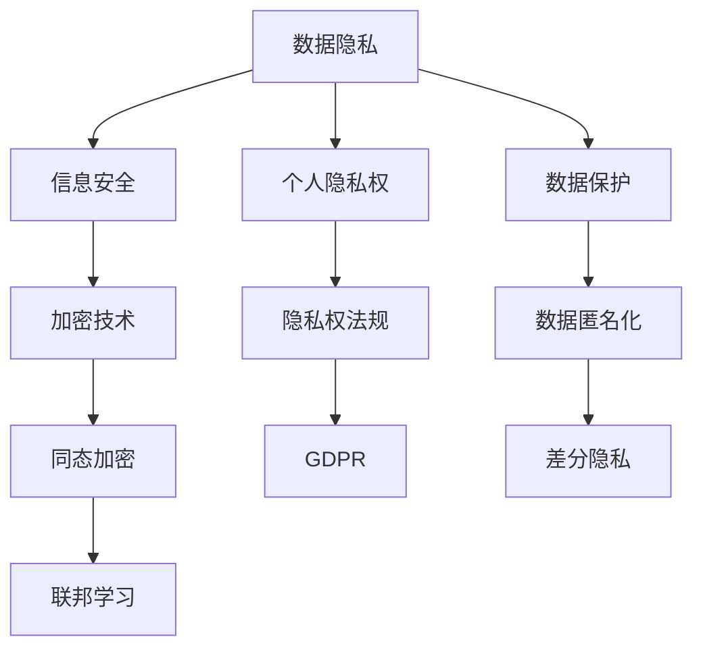

                 

### 《AI 大模型应用数据中心的数据隐私》

#### 关键词：人工智能、大模型、数据中心、数据隐私、法律法规、加密技术、算法、实践案例

#### 摘要：
随着人工智能技术的迅猛发展，大模型在数据中心的应用日益广泛。然而，这种应用也带来了数据隐私保护的新挑战。本文将从数据隐私的基础知识、AI大模型的数据隐私问题、数据隐私保护的法律框架、技术方案和实际应用等方面，深入探讨AI大模型应用数据中心的数据隐私问题，旨在为业界提供理论指导和实践参考。

### 目录大纲

## 第一部分: 数据隐私概述与法律框架

### 第1章: AI与数据隐私基础知识

#### 1.1 数据隐私的定义与重要性

#### 1.2 数据隐私面临的挑战

#### 1.3 数据隐私的法律框架

### 第2章: AI大模型的数据隐私问题

#### 2.1 AI大模型的数据依赖

#### 2.2 数据隐私泄露的风险

#### 2.3 数据隐私保护的解决方案

### 第3章: 数据隐私保护法律与政策分析

#### 3.1 数据隐私保护法律概述

#### 3.2 全球数据隐私政策对比

#### 3.3 我国数据隐私保护法规与实践

### 第4章: AI大模型数据隐私保护技术

#### 4.1 加密与同态加密技术

#### 4.2 差分隐私与联邦学习

#### 4.3 数据隐私保护算法分析

### 第5章: 数据隐私保护策略与实践

#### 5.1 数据隐私保护策略制定

#### 5.2 数据隐私保护体系构建

#### 5.3 数据隐私保护案例分析

## 第二部分: 数据隐私保护技术在AI大模型应用中的实践

### 第6章: AI大模型应用中的数据隐私保护实践

#### 6.1 数据隐私保护实践概述

#### 6.2 数据隐私保护实践案例

### 第7章: AI大模型应用数据中心的数据隐私保护方案设计

#### 7.1 数据隐私保护方案设计原则

#### 7.2 数据隐私保护方案实施策略

#### 7.3 数据隐私保护方案评估与优化

### 第8章: 未来数据隐私保护趋势与展望

#### 8.1 数据隐私保护技术的发展趋势

#### 8.2 数据隐私保护政策与法规的演变

#### 8.3 数据隐私保护的未来挑战与机遇

### 附录

#### 附录 A: 数据隐私保护相关法规与标准

#### 附录 B: 数据隐私保护技术工具介绍

#### 附录 C: 数据隐私保护实战案例解析

---

### 第一部分: 数据隐私概述与法律框架

#### 第1章: AI与数据隐私基础知识

#### 1.1 数据隐私的定义与重要性

**核心概念与联系：** 

数据隐私是指保护个人信息不被未授权访问和使用的基本原则，它涉及到信息安全、个人隐私权和数据保护等多个方面。在信息化社会中，数据隐私的重要性日益凸显。一方面，数据隐私保护关乎用户的合法权益；另一方面，数据隐私泄露可能导致严重的经济损失和社会信任危机。

**数据隐私的重要性：** 

1. **保护个人隐私权：** 随着大数据和人工智能技术的发展，个人信息的收集和使用越来越广泛，数据隐私保护成为保障个人隐私权的重要手段。
2. **维护社会秩序：** 数据隐私泄露可能导致个人信息被滥用，从而破坏社会秩序，影响社会稳定。
3. **促进技术发展：** 数据隐私保护是推动人工智能、大数据等新兴技术健康发展的基础，有利于构建和谐、安全的数字社会。

#### 1.2 数据隐私面临的挑战

随着大数据和人工智能技术的迅猛发展，数据隐私保护面临着前所未有的挑战。以下是一些主要挑战：

1. **数据量的爆炸性增长：** 大数据和人工智能技术的应用使得数据量呈指数级增长，数据隐私保护的任务变得更加艰巨。
2. **数据的多样化存储和使用方式：** 数据不仅存在于传统的数据库中，还分布在云存储、物联网设备等多种环境中，增加了数据隐私保护的技术难度。
3. **数据共享与流通的需求：** 在数字经济时代，数据共享和流通成为促进技术进步和产业发展的重要手段，但这也增加了数据隐私泄露的风险。
4. **隐私泄露事件的频繁发生：** 隐私泄露事件频发，给个人和组织带来了巨大的损失，同时也对数据隐私保护提出了更高的要求。

#### 1.3 数据隐私的法律框架

全球范围内，各国都在加强数据隐私保护的法律建设。以下是一些主要法律法规：

1. **《通用数据保护条例》（GDPR）：** GDPR是欧盟颁布的具有广泛影响力的数据隐私保护法规，对个人数据的收集、处理和传输提出了严格的要求。
2. **《加州消费者隐私法》（CCPA）：** CCPA是美国加州颁布的一项数据隐私保护法规，对企业的数据处理行为进行了详细规定。
3. **《个人信息保护法》（PIPL）：** PIPL是我国颁布的首部个人信息保护综合性法律，对个人信息的收集、处理和利用进行了全面规范。

这些法律法规的出台和实施，为数据隐私保护提供了法律依据和保障。同时，各国家和地区之间的数据隐私保护政策也存在差异，需要在全球范围内进行对比和分析。

### 第2章: AI大模型的数据隐私问题

#### 2.1 AI大模型的数据依赖

AI大模型，如深度学习模型、生成对抗网络（GAN）等，通常依赖于海量的数据进行训练和预测。这种数据依赖性使得数据隐私保护变得更加复杂和重要。以下是一些关键点：

1. **数据收集：** AI大模型需要从多个来源收集大量的数据，这些数据可能包含个人隐私信息。
2. **数据处理：** 在数据处理过程中，可能涉及数据清洗、归一化等操作，这些操作可能对数据隐私产生影响。
3. **数据共享：** AI大模型的研究和应用往往需要跨机构、跨地域的数据共享，这增加了数据隐私泄露的风险。

#### 2.2 数据隐私泄露的风险

AI大模型在数据处理过程中可能面临以下隐私泄露风险：

1. **数据泄露：** 未加密的数据在传输和存储过程中可能被未授权访问。
2. **数据滥用：** 加密的数据可能在加密算法漏洞或密钥管理不善的情况下被破解。
3. **数据分析：** 即使是匿名化的数据，也可能通过数据挖掘和模式识别等技术被重新识别和关联，导致隐私泄露。

#### 2.3 数据隐私保护的解决方案

为了应对AI大模型的数据隐私泄露风险，需要采取一系列解决方案：

1. **数据加密：** 对数据进行加密处理，确保数据在传输和存储过程中的安全性。
2. **同态加密：** 同态加密技术允许在加密数据上直接进行计算，而不需要解密，从而保护数据的隐私。
3. **差分隐私：** 差分隐私技术通过添加噪声来保护个体数据隐私，确保数据分析结果对个体信息的依赖性降低。
4. **联邦学习：** 联邦学习技术通过分布式计算和模型训练，使得数据无需离开本地进行共享和处理，从而保护数据隐私。

### 第3章: 数据隐私保护法律与政策分析

#### 3.1 数据隐私保护法律概述

全球范围内，各国都在加强数据隐私保护的法律建设。以下是一些主要法律法规：

1. **《通用数据保护条例》（GDPR）：** GDPR是欧盟颁布的具有广泛影响力的数据隐私保护法规，对个人数据的收集、处理和传输提出了严格的要求。GDPR的适用范围广泛，不仅涵盖欧盟成员国的数据处理活动，还包括涉及欧盟居民个人数据的跨境数据处理。
   
   **核心条款：**
   - **数据主体权利：** GDPR赋予数据主体多项权利，包括知情权、访问权、更正权、删除权等。
   - **合法性原则：** GDPR要求数据处理者必须确保数据处理活动的合法性、公正性和透明性。
   - **数据泄露通知：** GDPR要求在发生数据泄露时，数据处理者应在72小时内通知数据保护机构。

2. **《加州消费者隐私法》（CCPA）：** CCPA是美国加州颁布的一项数据隐私保护法规，旨在加强消费者对个人信息的控制权。CCPA的适用范围较窄，仅限于加州居民的个人信息的收集、处理和销售。

   **核心条款：**
   - **知情权：** 消费者有权知道其个人信息将被如何收集、使用和共享。
   - **拒绝权：** 消费者有权拒绝其个人信息的进一步销售。
   - **可访问权和可转移权：** 消费者有权访问其个人信息，并将其转移至另一服务提供商。

3. **《个人信息保护法》（PIPL）：** PIPL是我国颁布的首部个人信息保护综合性法律，旨在加强个人信息保护，规范个人信息处理活动。

   **核心条款：**
   - **个人信息定义：** PIPL明确了个人信息的定义，包括生物识别信息、身份识别信息、网络身份识别信息等。
   - **合法性原则：** PIPL要求个人信息处理者必须确保个人信息处理的合法性、正当性和必要性。
   - **敏感个人信息保护：** PIPL对敏感个人信息（如宗教信仰、生物识别信息等）的收集、处理和存储提出了更高要求。

#### 3.2 全球数据隐私政策对比

不同国家和地区的数据隐私政策存在一定差异，以下是一些主要差异：

1. **数据主体权利：** GDPR赋予数据主体较为全面的权利，包括知情权、访问权、更正权、删除权等。而CCPA则更侧重于消费者的知情权和拒绝权。PIPL在数据主体权利方面则相对较为全面，但也存在一些差异。

2. **数据处理限制：** GDPR对数据处理活动提出了严格的合法性要求，数据处理者必须确保数据处理活动的合法性、公正性和透明性。CCPA则更强调消费者的控制权，要求企业告知消费者个人信息的使用目的和共享情况。PIPL在数据处理限制方面也有明确规定，但相对于GDPR和CCPA，其要求相对宽松。

3. **跨境数据转移：** GDPR对跨境数据转移提出了严格的要求，数据处理者必须确保数据接收方的数据保护水平不低于欧盟标准。CCPA和PIPL在跨境数据转移方面则相对灵活，允许在满足一定条件的前提下进行跨境数据转移。

4. **数据保护官（DPO）：** GDPR要求大型数据处理者必须指定数据保护官，负责监督数据处理活动。CCPA和PIPL则没有明确要求设置数据保护官。

#### 3.3 我国数据隐私保护法规与实践

我国在数据隐私保护方面已经制定了多项法律法规，包括《网络安全法》、《数据安全法》和《个人信息保护法》等。以下是我国数据隐私保护法规的概述和实践：

1. **《网络安全法》：** 《网络安全法》是我国网络安全领域的基本法，对网络运营者的安全保护义务、网络信息安全管理、网络安全事件应对等方面进行了规定。

   **核心条款：**
   - **网络运营者义务：** 网络运营者必须采取技术和管理措施保护网络免受损害，保障网络数据的完整性、保密性和可用性。
   - **网络安全事件应对：** 网络运营者在发生网络安全事件时，应当立即采取补救措施，并按照规定报告有关部门。

2. **《数据安全法》：** 《数据安全法》是我国首部专门针对数据安全的法律法规，对数据安全管理、数据安全评估、数据安全事件应对等方面进行了规定。

   **核心条款：**
   - **数据分类分级：** 《数据安全法》要求对数据进行分类分级管理，根据数据的重要性、敏感性等属性，采取相应的安全措施。
   - **数据安全评估：** 网络运营者在处理重要数据时，应当进行数据安全评估，确保数据安全。

3. **《个人信息保护法》：** 《个人信息保护法》是我国首部个人信息保护综合性法律，对个人信息的收集、处理和利用进行了全面规范。

   **核心条款：**
   - **个人信息定义：** 《个人信息保护法》明确了个人信息的定义，包括生物识别信息、身份识别信息、网络身份识别信息等。
   - **合法性原则：** 《个人信息保护法》要求个人信息处理者必须确保个人信息处理的合法性、正当性和必要性。
   - **敏感个人信息保护：** 《个人信息保护法》对敏感个人信息（如宗教信仰、生物识别信息等）的收集、处理和存储提出了更高要求。

在实际应用中，我国数据隐私保护法规的执行还存在一些问题和挑战，如法规实施主体的责任划分、数据隐私保护的技术手段等。未来，我国需要进一步完善数据隐私保护法律法规，提高法规执行力度，以更好地保护个人数据和信息安全。

### 第4章: AI大模型数据隐私保护技术

#### 4.1 加密与同态加密技术

**加密技术：** 

加密技术是保护数据隐私的基础手段，通过将明文数据转换为密文，确保数据在传输和存储过程中的安全性。常见的加密技术包括对称加密和非对称加密。

- **对称加密：** 对称加密算法使用相同的密钥进行加密和解密，如AES（高级加密标准）。
- **非对称加密：** 非对称加密算法使用一对密钥进行加密和解密，如RSA（Rivest-Shamir-Adleman）。

**同态加密技术：** 

同态加密技术是一种在加密数据上进行计算，而不需要解密的技术。同态加密可以确保在计算过程中数据的隐私性，但计算性能较低，目前尚处于研究阶段。

**同态加密的工作原理：** 

1. **初始化：** 生成一对密钥（公钥和私钥）。
2. **加密：** 将明文数据加密为密文，使用公钥进行加密。
3. **计算：** 在加密数据上进行计算操作，如加法、乘法等。
4. **解密：** 使用私钥对计算结果进行解密，获取明文结果。

同态加密在AI大模型中的应用场景包括：

1. **数据共享与协同计算：** 同态加密允许不同组织或机构在保持数据隐私的前提下进行数据共享和协同计算。
2. **远程数据保护：** 同态加密可以保护远程数据在传输和计算过程中的安全性。

**同态加密的优势与挑战：**

**优势：**
- **保护数据隐私：** 同态加密可以在不泄露数据内容的情况下进行计算，保护数据隐私。
- **支持多种计算操作：** 同态加密可以支持多种计算操作，如加法、乘法、逻辑运算等。

**挑战：**
- **计算性能：** 同态加密算法的计算性能较低，可能导致计算延迟。
- **算法复杂度：** 同态加密算法的复杂度较高，对计算资源和存储资源的要求较高。

#### 4.2 差分隐私与联邦学习

**差分隐私：**

差分隐私是一种在数据分析过程中保护个体数据隐私的方法，通过在数据中添加噪声来降低个体数据的可识别性。

**差分隐私的工作原理：**

1. **噪声添加：** 在原始数据中添加噪声，使得原始数据的分布发生改变。
2. **数据分析：** 在添加噪声后的数据上进行数据分析，如统计、回归等。
3. **结果修正：** 对分析结果进行修正，以消除噪声对结果的影响。

**差分隐私的数学模型：**

差分隐私可以通过以下数学模型进行量化：

$$
\epsilon = \max_{x \in S} \frac{d(f(x), f(x'))}{\|x - x'\|_1}
$$

其中，$f(x)$和$f(x')$分别表示在添加噪声前后的分析结果，$x$和$x'$表示两个相邻的数据点，$\epsilon$表示差分隐私水平，$d$表示距离度量。

**差分隐私的优势与挑战：**

**优势：**
- **保护个体隐私：** 差分隐私可以在不泄露个体数据的前提下进行数据分析，保护个体隐私。
- **灵活性：** 差分隐私可以适用于各种数据分析任务，如统计、回归等。

**挑战：**
- **隐私-准确性权衡：** 差分隐私可能导致分析结果的准确性下降，需要在隐私和准确性之间进行权衡。
- **实现难度：** 差分隐私的实现较为复杂，需要处理噪声的添加和修正等问题。

**联邦学习：**

联邦学习是一种分布式学习技术，通过将数据分散存储在多个设备或服务器上，实现模型的训练和优化。联邦学习可以保护数据隐私，避免数据在传输过程中的泄露。

**联邦学习的工作原理：**

1. **模型初始化：** 在服务器端初始化模型。
2. **本地训练：** 设备端在本地对模型进行训练，并生成梯度。
3. **梯度聚合：** 服务器端收集设备端的梯度，进行聚合。
4. **模型更新：** 服务器端使用聚合后的梯度更新模型。

**联邦学习的数学模型：**

联邦学习可以通过以下数学模型进行量化：

$$
\theta_{t+1} = \theta_{t} + \frac{\lambda}{\sqrt{N}} \sum_{i=1}^{N} \nabla_{\theta} L(\theta_i)
$$

其中，$\theta$表示模型参数，$L$表示损失函数，$\lambda$表示学习率，$N$表示设备数量，$\theta_i$表示第$i$个设备端的模型参数。

**联邦学习的优势与挑战：**

**优势：**
- **保护数据隐私：** 联邦学习可以在不泄露数据的前提下进行模型训练，保护数据隐私。
- **降低通信成本：** 联邦学习可以减少数据在传输过程中的通信成本。
- **增强数据可用性：** 联邦学习可以充分利用分布式数据，提高模型的准确性和泛化能力。

**挑战：**
- **隐私-准确性权衡：** 联邦学习可能导致模型准确性下降，需要在隐私和准确性之间进行权衡。
- **算法复杂度：** 联邦学习的算法复杂度较高，对计算资源和存储资源的要求较高。
- **模型一致性：** 联邦学习需要处理设备端模型不一致的问题，确保模型的全局一致性。

#### 4.3 数据隐私保护算法分析

**隐私剪枝：**

隐私剪枝是一种数据隐私保护算法，通过剪枝模型中的冗余节点和权重，降低模型的复杂度，从而减少数据隐私泄露的风险。

**隐私剪枝的工作原理：**

1. **模型初始化：** 初始化原始模型。
2. **剪枝过程：** 对模型进行剪枝，保留重要的节点和权重，删除冗余的节点和权重。
3. **模型更新：** 使用剪枝后的模型进行训练和优化。

**隐私剪枝的优势与挑战：**

**优势：**
- **降低模型复杂度：** 隐私剪枝可以降低模型的复杂度，减少数据隐私泄露的风险。
- **提高计算效率：** 隐私剪枝可以提高模型的计算效率，减少训练和推理的时间。

**挑战：**
- **模型性能下降：** 隐私剪枝可能导致模型性能下降，需要在剪枝程度和模型性能之间进行权衡。
- **实现难度：** 隐私剪枝的实现较为复杂，需要对模型的架构和剪枝策略进行深入研究。

**隐私蒸馏：**

隐私蒸馏是一种数据隐私保护算法，通过将原始模型的知识传递给蒸馏模型，实现对原始模型的保护。

**隐私蒸馏的工作原理：**

1. **模型初始化：** 初始化原始模型和蒸馏模型。
2. **训练过程：** 使用原始模型训练蒸馏模型，将原始模型的知识传递给蒸馏模型。
3. **模型更新：** 使用蒸馏模型进行训练和优化。

**隐私蒸馏的优势与挑战：**

**优势：**
- **提高模型性能：** 隐私蒸馏可以提高模型的性能，降低模型隐私泄露的风险。
- **降低计算成本：** 隐私蒸馏可以降低模型的计算成本，提高训练和推理的效率。

**挑战：**
- **实现难度：** 隐私蒸馏的实现较为复杂，需要对模型的架构和蒸馏策略进行深入研究。
- **模型一致性：** 隐私蒸馏需要处理模型不一致的问题，确保模型的全局一致性。

### 第5章: 数据隐私保护策略与实践

#### 5.1 数据隐私保护策略制定

**数据隐私保护策略制定的原则：**

1. **合法性原则：** 确保数据处理活动符合法律法规的要求，保障数据主体的合法权益。
2. **最小化原则：** 仅收集和处理必要的数据，减少数据的冗余和泄露风险。
3. **保密性原则：** 确保数据的保密性，防止未授权访问和泄露。
4. **完整性原则：** 确保数据的完整性，防止数据的篡改和丢失。
5. **可用性原则：** 确保数据的可用性，确保数据在需要时可以被访问和使用。

**数据隐私保护策略制定的步骤：**

1. **需求分析：** 分析数据处理的需求，确定数据隐私保护的目标和范围。
2. **风险评估：** 评估数据处理活动可能带来的隐私泄露风险。
3. **策略设计：** 根据风险评估结果，设计具体的隐私保护策略。
4. **方案实施：** 实施隐私保护策略，包括技术措施和管理措施。
5. **监控与评估：** 监控隐私保护策略的实施效果，定期进行评估和优化。

#### 5.2 数据隐私保护体系构建

**数据隐私保护体系构建的组成部分：**

1. **组织架构：** 设立专门的数据隐私保护部门或团队，负责数据隐私保护工作的规划、实施和监督。
2. **法律法规：** 制定和完善数据隐私保护的相关法律法规，确保数据处理活动的合法性和合规性。
3. **技术手段：** 采用加密、同态加密、差分隐私等数据隐私保护技术，确保数据的保密性、完整性和可用性。
4. **管理措施：** 制定和实施数据隐私保护的管理措施，包括数据访问控制、数据备份和恢复、数据安全审计等。
5. **人员培训：** 对数据处理人员进行数据隐私保护相关知识的培训，提高其数据保护意识和技能。

**数据隐私保护体系构建的流程：**

1. **需求分析：** 分析数据处理的需求，确定数据隐私保护的目标和范围。
2. **风险评估：** 评估数据处理活动可能带来的隐私泄露风险。
3. **策略设计：** 根据风险评估结果，设计具体的隐私保护策略。
4. **方案实施：** 实施隐私保护策略，包括技术措施和管理措施。
5. **监控与评估：** 监控隐私保护策略的实施效果，定期进行评估和优化。

#### 5.3 数据隐私保护案例分析

**案例一：某金融公司的数据隐私保护实践**

**背景：** 某金融公司提供在线金融服务，包括存款、贷款、投资等。为了保护客户的个人信息，该公司需要实施数据隐私保护措施。

**策略：**
1. **数据收集最小化：** 仅收集必要的个人信息，如姓名、身份证号码、联系方式等。
2. **加密技术：** 使用AES加密技术对敏感信息进行加密存储。
3. **访问控制：** 对数据库进行访问控制，确保只有授权人员才能访问敏感数据。
4. **数据备份：** 定期对数据库进行备份，确保数据不会因故障或攻击而丢失。

**效果：**
1. **降低隐私泄露风险：** 通过数据加密和访问控制，有效降低了隐私泄露的风险。
2. **提高客户信任度：** 客户对公司的数据隐私保护措施表示信任，提高了客户满意度。
3. **合规性：** 符合相关法律法规的要求，确保公司在数据处理活动中的合法性和合规性。

**案例二：某电商平台的数据隐私保护实践**

**背景：** 某电商平台提供在线购物服务，涉及大量的用户个人信息和交易数据。为了保护用户的个人信息，该公司需要实施数据隐私保护措施。

**策略：**
1. **差分隐私：** 在数据分析过程中采用差分隐私技术，确保数据分析结果的准确性同时保护用户隐私。
2. **联邦学习：** 采用联邦学习技术，将用户数据分散存储在本地设备上，进行分布式计算，降低隐私泄露的风险。
3. **隐私保护算法：** 采用隐私剪枝和隐私蒸馏技术，降低模型复杂度，提高模型性能，同时保护数据隐私。

**效果：**
1. **提高数据隐私保护水平：** 通过差分隐私、联邦学习和隐私保护算法，有效提高了数据隐私保护水平。
2. **降低隐私泄露风险：** 通过分布式计算和隐私保护算法，降低了隐私泄露的风险。
3. **提升用户体验：** 通过联邦学习和隐私保护算法，提升了用户体验，提高了平台的竞争力。

### 第二部分: 数据隐私保护技术在AI大模型应用中的实践

#### 第6章: AI大模型应用中的数据隐私保护实践

#### 6.1 数据隐私保护实践概述

**数据隐私保护实践的背景：**

随着人工智能技术的迅猛发展，AI大模型在各个领域的应用日益广泛。然而，这种应用也带来了数据隐私保护的新挑战。为了保障用户的数据隐私，需要实施数据隐私保护措施，确保数据在采集、处理、存储和传输过程中的安全性。

**数据隐私保护实践的目标：**

1. **降低隐私泄露风险：** 通过实施数据隐私保护措施，降低隐私泄露的风险，保障用户的数据安全。
2. **提高数据可用性：** 在保护用户隐私的同时，确保数据在需要时可以被访问和使用。
3. **符合法律法规要求：** 确保数据处理活动符合相关法律法规的要求，保障数据处理的合法性和合规性。

**数据隐私保护实践的方法：**

1. **数据加密：** 使用加密技术对敏感数据进行加密处理，确保数据在传输和存储过程中的安全性。
2. **同态加密：** 在AI大模型训练过程中采用同态加密技术，确保在加密数据上直接进行计算，保护数据隐私。
3. **差分隐私：** 在数据分析过程中采用差分隐私技术，通过添加噪声降低个体数据的可识别性，保护用户隐私。
4. **联邦学习：** 采用联邦学习技术，将数据分散存储在本地设备上，进行分布式计算，降低隐私泄露的风险。

#### 6.2 数据隐私保护实践案例

**案例一：某电商平台的数据隐私保护实践**

**背景：** 某电商平台提供在线购物服务，涉及大量的用户个人信息和交易数据。为了保障用户的数据隐私，该公司需要实施数据隐私保护措施。

**策略：**
1. **数据收集最小化：** 仅收集必要的用户个人信息，如姓名、身份证号码、联系方式等。
2. **差分隐私：** 在用户行为分析过程中采用差分隐私技术，通过添加噪声降低个体数据的可识别性，保护用户隐私。
3. **联邦学习：** 采用联邦学习技术，将用户数据分散存储在本地设备上，进行分布式计算，降低隐私泄露的风险。
4. **加密技术：** 使用AES加密技术对敏感数据进行加密存储，确保数据在传输和存储过程中的安全性。

**效果：**
1. **降低隐私泄露风险：** 通过差分隐私、联邦学习和加密技术，有效降低了隐私泄露的风险。
2. **提高数据可用性：** 在保护用户隐私的同时，确保数据在需要时可以被访问和使用。
3. **提升用户体验：** 通过联邦学习和差分隐私技术，提升了用户体验，提高了平台的竞争力。

**案例二：某医疗机构的AI大模型应用**

**背景：** 某医疗机构应用AI大模型进行疾病诊断和预测，涉及大量的患者数据。为了保障患者的数据隐私，该机构需要实施数据隐私保护措施。

**策略：**
1. **同态加密：** 在AI大模型训练过程中采用同态加密技术，确保在加密数据上直接进行计算，保护患者数据隐私。
2. **数据备份：** 定期对AI大模型的数据进行备份，确保数据不会因故障或攻击而丢失。
3. **访问控制：** 对AI大模型的数据进行访问控制，确保只有授权人员才能访问敏感数据。
4. **安全审计：** 定期进行安全审计，评估数据隐私保护措施的实施效果，及时发现问题并采取措施。

**效果：**
1. **降低隐私泄露风险：** 通过同态加密、数据备份、访问控制和安全审计，有效降低了隐私泄露的风险。
2. **保障数据完整性：** 通过数据备份和访问控制，保障了AI大模型数据的完整性。
3. **提高数据安全性：** 通过实施数据隐私保护措施，提高了AI大模型数据的安全性，增强了患者对医疗机构的信任。

### 第7章: AI大模型应用数据中心的数据隐私保护方案设计

#### 7.1 数据隐私保护方案设计原则

**数据隐私保护方案设计原则：**

1. **安全性原则：** 确保数据在数据中心存储和传输过程中的安全性，防止未授权访问和数据泄露。
2. **可靠性原则：** 确保数据隐私保护方案的可执行性和可靠性，确保数据隐私保护措施能够有效实施。
3. **可扩展性原则：** 数据隐私保护方案应具有可扩展性，能够适应数据中心规模的扩大和业务需求的变更。
4. **易用性原则：** 数据隐私保护方案应具备良好的用户界面和操作流程，方便用户实施数据隐私保护措施。
5. **成本效益原则：** 在满足数据隐私保护要求的前提下，尽量降低数据隐私保护方案的实施和维护成本。

#### 7.2 数据隐私保护方案实施策略

**数据隐私保护方案实施策略：**

1. **需求分析：** 分析数据中心的数据隐私保护需求，确定需要保护的敏感数据类型和范围。
2. **风险评估：** 评估数据中心的数据隐私保护风险，确定数据隐私保护方案的具体实施策略。
3. **方案设计：** 根据需求分析和风险评估结果，设计具体的数据隐私保护方案，包括技术措施和管理措施。
4. **方案实施：** 实施数据隐私保护方案，包括技术部署、人员培训和管理措施落实。
5. **监控与评估：** 监控数据隐私保护方案的实施效果，定期进行评估和优化，确保数据隐私保护方案的有效性。

**技术措施：**
1. **数据加密：** 使用加密技术对敏感数据进行加密处理，确保数据在传输和存储过程中的安全性。
2. **同态加密：** 在AI大模型训练过程中采用同态加密技术，确保在加密数据上直接进行计算，保护数据隐私。
3. **差分隐私：** 在数据分析过程中采用差分隐私技术，通过添加噪声降低个体数据的可识别性，保护用户隐私。
4. **访问控制：** 对数据中心的数据进行访问控制，确保只有授权人员才能访问敏感数据。
5. **日志审计：** 记录数据中心的数据访问和操作日志，定期进行审计，及时发现和处理数据隐私泄露事件。

**管理措施：**
1. **数据分类分级：** 对数据进行分类分级管理，根据数据的重要性、敏感性等属性，采取相应的数据隐私保护措施。
2. **人员培训：** 对数据中心的工作人员进行数据隐私保护相关知识的培训，提高其数据保护意识和技能。
3. **安全审计：** 定期进行数据隐私保护的安全审计，评估数据隐私保护措施的实施效果，及时发现问题并采取措施。
4. **应急预案：** 制定数据隐私泄露事件的应急预案，确保在发生数据泄露事件时能够及时响应和处置。

#### 7.3 数据隐私保护方案评估与优化

**数据隐私保护方案评估：**

1. **有效性评估：** 评估数据隐私保护方案的实施效果，包括数据加密、同态加密、差分隐私、访问控制等技术的效果。
2. **安全性评估：** 评估数据中心的数据隐私保护措施的安全性，包括防火墙、入侵检测、数据备份等。
3. **可靠性评估：** 评估数据隐私保护方案的可靠性，包括技术实施和人员操作的稳定性。
4. **成本效益评估：** 评估数据隐私保护方案的成本效益，包括实施成本、维护成本和潜在的经济损失。

**优化策略：**

1. **技术优化：** 根据评估结果，对数据隐私保护技术进行优化，提高其性能和安全性。
2. **管理优化：** 根据评估结果，对数据隐私保护的管理措施进行优化，提高其执行效果。
3. **流程优化：** 优化数据隐私保护的实施流程，提高工作效率和用户体验。
4. **应急响应：** 加强数据隐私泄露事件的应急响应能力，提高应对突发事件的能力。

### 第8章: 未来数据隐私保护趋势与展望

#### 8.1 数据隐私保护技术的发展趋势

随着人工智能、大数据和云计算等技术的快速发展，数据隐私保护技术也在不断演进。以下是一些数据隐私保护技术的发展趋势：

1. **同态加密技术的成熟：** 同态加密技术作为一种在加密数据上直接进行计算的技术，具有广泛的应用前景。未来，同态加密技术将在性能、安全性等方面得到进一步提升，成为数据隐私保护的重要技术手段。
2. **多方安全计算技术的应用：** 多方安全计算技术通过在多个参与方之间安全地计算和分析数据，保护数据隐私。未来，多方安全计算技术将在金融、医疗、零售等领域得到更广泛的应用。
3. **区块链技术的融合：** 区块链技术具有去中心化、不可篡改等特性，可以用于保护数据隐私。未来，区块链技术将与数据隐私保护技术相结合，为数据隐私保护提供更安全、可靠的解决方案。
4. **隐私增强技术的研究：** 隐私增强技术通过在数据处理过程中添加噪声、掩盖数据等手段，提高数据的隐私性。未来，隐私增强技术将在数据隐私保护领域得到更多研究，开发出更多高效、实用的隐私保护算法。

#### 8.2 数据隐私保护政策与法规的演变

随着数据隐私保护问题的日益突出，各国政府和国际组织在数据隐私保护政策与法规方面也在不断演变。以下是一些主要趋势：

1. **全球数据隐私保护法规的趋同：** 随着数据隐私保护问题的全球化，各国政府和国际组织在数据隐私保护政策与法规方面将趋于一致，确保数据隐私保护标准的统一。
2. **数据隐私保护法规的细化：** 各国政府和国际组织将加强对数据隐私保护法规的细化，明确数据隐私保护的具体要求和操作规范，提高数据隐私保护的法律效力。
3. **跨境数据流动的规范：** 随着全球化的深入发展，跨境数据流动将更加频繁。各国政府和国际组织将加强对跨境数据流动的规范，确保跨境数据流动的合法、安全、有序。
4. **隐私保护政策的国际化：** 国际组织和企业将积极推动数据隐私保护政策的国际化，推动全球范围内的数据隐私保护合作，构建和谐、安全的数字世界。

#### 8.3 数据隐私保护的未来挑战与机遇

在未来，数据隐私保护将面临一系列挑战和机遇：

1. **技术挑战：** 随着数据隐私保护技术的发展，新的技术挑战将不断出现，如同态加密的性能优化、多方安全计算的安全保障等。这些挑战需要科研人员和产业界的共同努力，推动数据隐私保护技术的不断创新。
2. **法规挑战：** 数据隐私保护法规的不断完善和演变，将给企业带来一定的合规压力。企业需要密切关注法规变化，及时调整数据隐私保护策略，确保合规性。
3. **隐私与效率的权衡：** 数据隐私保护与数据处理效率之间存在一定的权衡。如何在保护数据隐私的同时，提高数据处理效率，将是一个重要的课题。
4. **跨界合作：** 数据隐私保护需要政府、企业、科研机构和国际组织等多方参与，跨界合作将成为未来数据隐私保护的重要模式。

### 附录

#### 附录 A: 数据隐私保护相关法规与标准

1. **《通用数据保护条例》（GDPR）：** 欧盟颁布的数据隐私保护法规，对个人数据的收集、处理和传输提出了严格的要求。
2. **《加州消费者隐私法》（CCPA）：** 美国加州颁布的数据隐私保护法规，对企业的数据处理行为进行了详细规定。
3. **《个人信息保护法》（PIPL）：** 我国颁布的首部个人信息保护综合性法律，对个人信息的收集、处理和利用进行了全面规范。
4. **《网络安全法》：** 我国网络安全领域的基本法，对网络运营者的安全保护义务、网络信息安全管理、网络安全事件应对等方面进行了规定。
5. **《数据安全法》：** 我国首部专门针对数据安全的法律法规，对数据安全管理、数据安全评估、数据安全事件应对等方面进行了规定。

#### 附录 B: 数据隐私保护技术工具介绍

1. **AES加密算法：** 高级加密标准，是一种常用的对称加密算法，用于数据加密存储。
2. **RSA加密算法：** 非对称加密算法，用于数据加密传输。
3. **差分隐私库：** 提供差分隐私算法的实现，用于保障数据分析过程中的数据隐私。
4. **联邦学习框架：** 提供联邦学习算法的实现，用于分布式模型训练和优化。
5. **同态加密库：** 提供同态加密算法的实现，用于在加密数据上直接进行计算。

#### 附录 C: 数据隐私保护实战案例解析

1. **某金融公司的数据隐私保护实践：** 分析某金融公司实施数据隐私保护措施的具体案例，包括数据加密、访问控制和差分隐私等。
2. **某电商平台的数据隐私保护实践：** 分析某电商平台实施数据隐私保护措施的具体案例，包括联邦学习和差分隐私等。
3. **某医疗机构的AI大模型应用：** 分析某医疗机构实施数据隐私保护措施的具体案例，包括同态加密和数据备份等。
4. **某企业跨境数据传输：** 分析某企业在跨境数据传输过程中实施数据隐私保护措施的具体案例，包括数据加密和同态加密等。

