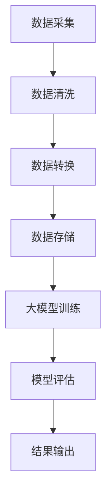
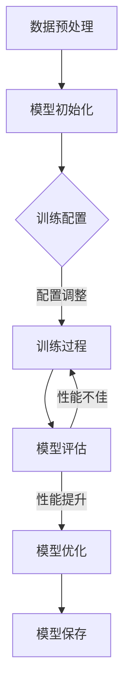

                 

# AI大模型应用数据中心的数据集成方案

## 关键词
AI大模型、数据中心、数据集成、数据质量管理、系统性能优化

## 摘要
本文深入探讨了AI大模型在数据中心应用中的数据集成方案。首先，我们介绍了AI与数据中心的关系，以及数据集成在AI系统中的重要性。接着，我们详细分析了AI大模型的技术基础，包括大模型的基本原理、数据中心数据集成方法和大模型训练优化策略。随后，我们讨论了数据中心的数据集成架构设计，包括数据中心的架构概述、大模型集成框架等。文章还探讨了数据集成过程中的挑战和解决方案，如数据质量问题、数据安全与隐私保护以及系统性能优化。最后，通过一个实际案例，我们展示了数据集成方案的应用效果和优化方法。文章旨在为AI大模型应用数据中心的数据集成提供系统性指导和实用建议。

## 引言

### AI与数据中心的关系

随着人工智能（AI）技术的迅猛发展，数据中心作为AI应用的承载平台，其重要性日益凸显。数据中心不仅是存储和管理海量数据的地方，更是AI算法训练和推理的核心场所。AI与数据中心的关系密不可分，二者相辅相成，共同推动技术进步和产业升级。

首先，数据中心为AI应用提供了必要的计算资源。随着AI大模型的复杂性不断增加，需要大规模的算力支持。数据中心通过高性能计算（HPC）集群和分布式计算资源，为AI算法的训练和推理提供了强大的计算能力。例如，深度学习模型需要大量的计算资源来处理和优化模型的参数，数据中心的高效运作是保证模型训练速度和精度的关键。

其次，数据中心在数据存储和管理方面发挥着重要作用。AI大模型的应用需要大量的数据作为训练素材，这些数据通常分布在不同的数据源中，包括企业内部数据库、公共数据集和物联网设备等。数据中心通过数据集成技术，将分散的数据源整合到一个统一的数据平台上，为AI模型提供了丰富的数据支持。此外，数据中心还负责数据的备份和恢复，确保数据的安全性和可用性。

另外，数据中心在AI应用中还具有业务支持作用。数据中心不仅提供了计算和存储资源，还集成了多种业务系统和工具，如企业资源计划（ERP）、客户关系管理（CRM）和供应链管理（SCM）等。这些系统可以帮助企业快速部署AI应用，实现业务流程的自动化和智能化。例如，通过数据中心集成的业务数据，企业可以构建智能客服系统，提高客户满意度和服务效率。

总的来说，数据中心是AI应用的重要基础设施，其计算资源、数据存储和管理能力，以及业务支持功能，都为AI技术的发展提供了坚实的保障。随着AI技术的不断进步，数据中心的角色将更加重要，成为推动产业变革的重要力量。

### 数据中心在AI系统中的作用

数据中心在AI系统中扮演着至关重要的角色，其具体作用主要体现在以下几个方面：

首先，数据中心提供了强大的计算能力，这是AI系统正常运行的基础。AI算法，尤其是大模型，如深度神经网络（DNN）和生成对抗网络（GAN），需要大量的计算资源来进行训练和推理。数据中心通过部署高性能计算（HPC）集群和分布式计算资源，可以满足这些计算需求。数据中心的高性能计算能力确保了AI模型能够在较短的时间内完成训练，提高模型的效果和效率。

其次，数据中心的存储和管理功能为AI系统提供了可靠的数据支持。AI大模型的训练需要大量的数据，这些数据通常分布在不同的数据源中，包括企业内部数据库、公共数据集和物联网设备等。数据中心通过数据集成技术，将分散的数据源整合到一个统一的数据平台上，为AI模型提供了丰富的数据支持。这不仅提高了模型的训练效率，还有助于提高模型的泛化能力。此外，数据中心还负责数据的备份和恢复，确保数据的安全性和可用性。

第三，数据中心的网络架构对于AI系统的性能和稳定性至关重要。数据中心通常采用高性能的网络架构，如分布式网络和高速网络交换机，以确保数据的高速传输和低延迟。这对于需要实时处理大量数据的AI系统尤为重要。通过优化网络架构，数据中心可以减少数据传输延迟，提高系统的响应速度和稳定性，从而提升用户体验。

第四，数据中心的运维管理功能为AI系统提供了稳定的运行环境。数据中心通过自动化运维工具和监控系统，实时监控AI系统的运行状态，及时识别和处理系统故障。此外，数据中心还提供了一系列安全保障措施，如防火墙、入侵检测系统和数据加密，确保AI系统的安全性和数据隐私。

最后，数据中心为企业提供了灵活的业务支持。数据中心集成了多种业务系统和工具，如企业资源计划（ERP）、客户关系管理（CRM）和供应链管理（SCM）等，这些系统可以帮助企业快速部署AI应用，实现业务流程的自动化和智能化。例如，通过数据中心集成的业务数据，企业可以构建智能客服系统、智能推荐系统和智能决策支持系统等，提高企业的运营效率和市场竞争力。

总的来说，数据中心在AI系统中的作用不仅仅是提供计算资源和数据支持，还包括网络架构优化、运维管理保障和业务支持等多方面。数据中心的高效运行和综合服务能力，是AI系统能够稳定、高效和可靠运行的关键保障。随着AI技术的不断发展和应用场景的扩展，数据中心在AI系统中的作用将更加重要，成为推动AI产业发展的重要基础设施。

### 大模型数据集成方案概述

#### 大模型数据集成的重要性

在大模型应用中，数据集成的质量直接影响到模型的效果和效率。首先，大模型通常需要处理和融合来自多个数据源的海量数据，如文本、图像、音频和传感器数据等。这些数据具有异构性和多样性，直接导致了数据集成挑战的复杂性。其次，数据质量的高低直接决定了大模型的训练效果和预测准确性。低质量的数据不仅会引入噪声和错误，还会导致模型过拟合，降低模型的泛化能力。

数据集成在大模型应用中的重要性体现在以下几个方面：

1. **提升模型训练效率**：通过有效的数据集成，可以确保数据的一致性和完整性，减少数据预处理的时间和计算成本。这样，大模型可以更快地完成训练，提高模型的迭代速度。

2. **增强模型泛化能力**：高质量的数据集能够更好地代表整体数据分布，有助于模型学习到更广泛的特征，从而提高模型的泛化能力，避免过拟合。

3. **优化模型性能**：通过数据集成，可以对数据进行交叉验证和筛选，去除噪声和异常值，提高模型的鲁棒性和性能。

4. **支持动态调整**：数据集成方案可以支持数据源的动态调整，使得模型能够灵活适应新的数据环境和需求变化。

#### 数据集成的基本概念与挑战

数据集成是指将来自多个数据源的数据进行整合、清洗、转换和存储，以实现数据的一致性、完整性和可访问性。在大模型应用中，数据集成通常包括以下几个关键步骤：

1. **数据采集**：从不同的数据源（如数据库、文件、API等）收集数据，确保数据来源的多样性和完整性。

2. **数据清洗**：对采集到的数据进行清洗，去除重复、错误和缺失的数据，确保数据质量。

3. **数据转换**：将清洗后的数据进行格式转换和标准化，以便不同数据源的数据能够进行整合。

4. **数据存储**：将转换后的数据存储到统一的数据仓库或数据湖中，便于后续的数据处理和分析。

在实现数据集成过程中，会面临以下主要挑战：

1. **数据异构性**：不同数据源的数据格式、结构、语义和单位可能各不相同，需要设计复杂的数据转换和映射策略。

2. **数据质量问题**：数据源可能存在数据缺失、错误、噪声和冗余等问题，需要进行有效的数据清洗和质量评估。

3. **性能优化**：数据集成过程需要处理海量数据，对系统性能和效率提出了高要求，需要设计高效的数据处理和存储方案。

4. **数据隐私和安全性**：在大模型应用中，数据的隐私和安全性尤为重要，需要采取严格的数据加密和访问控制措施。

通过理解数据集成的基本概念和面临的挑战，可以为大模型应用中的数据集成方案提供科学的理论指导和实践依据。

### AI大模型技术基础

#### 大模型概述

大模型（Large Models）是人工智能领域的一个重要研究方向，其核心是通过训练复杂的神经网络模型来捕捉大规模数据中的深层次特征。大模型通常指的是参数量达到数百万甚至数十亿级别的深度学习模型，这些模型具有强大的表征能力和泛化能力，可以应用于多种领域，如自然语言处理（NLP）、计算机视觉（CV）、语音识别（ASR）等。

#### 大模型的基本原理

大模型的基本原理可以归结为以下几点：

1. **深度神经网络（DNN）**：大模型通常基于深度神经网络结构，通过多层的神经元连接，实现对数据的分层表征。每一层神经网络都能够学习到不同层次的特征，从而实现数据的逐层抽象和压缩。

2. **参数化表示**：大模型通过大量的参数来表示复杂的函数关系，这些参数在训练过程中通过梯度下降等优化算法进行调整，以最小化预测误差。

3. **大数据训练**：大模型的训练需要大量的数据，通过大规模数据训练，模型可以学习到更广泛的特征分布，提高模型的泛化能力。

4. **并行计算**：由于大模型参数量巨大，训练过程需要大量的计算资源。通过并行计算和分布式训练，可以显著提高模型的训练速度。

#### 大模型的结构与类型

大模型的结构和类型多种多样，以下是一些常见的大模型类型：

1. **卷积神经网络（CNN）**：CNN是一种常用于图像识别和计算机视觉的大模型，通过卷积层、池化层和全连接层等结构，实现对图像的特征提取和分类。

2. **循环神经网络（RNN）**：RNN是一种常用于序列数据处理的大模型，通过循环结构可以捕捉序列中的长期依赖关系，如自然语言处理和语音识别。

3. **长短期记忆网络（LSTM）**：LSTM是RNN的一种改进，通过引入门控机制，可以有效解决RNN的梯度消失和梯度爆炸问题，提高模型的训练效果。

4. **Transformer模型**：Transformer模型是自然语言处理领域的一种革命性模型，通过自注意力机制（Self-Attention）实现全局信息的有效融合，显著提升了NLP任务的性能。

5. **生成对抗网络（GAN）**：GAN由生成器和判别器组成，通过生成器和判别器的博弈过程，生成逼真的数据，广泛应用于图像生成和增强学习等领域。

6. **变分自编码器（VAE）**：VAE是一种基于概率模型的生成模型，通过编码器和解码器结构，实现数据的降维和重建。

7. **多模态大模型**：多模态大模型可以同时处理多种类型的数据，如文本、图像、音频等，通过多模态融合技术，实现对复杂任务的联合建模。

#### 大模型训练与优化策略

大模型的训练和优化是一个复杂的过程，涉及多个方面：

1. **数据预处理**：在大模型训练之前，需要对数据集进行预处理，包括数据清洗、归一化、分割等步骤，以确保数据的质量和一致性。

2. **模型初始化**：合适的模型初始化可以显著影响训练效果。常见的初始化方法包括随机初始化、高斯初始化和Xavier初始化等。

3. **损失函数**：损失函数是衡量模型预测结果与真实值之间差距的指标，选择合适的损失函数可以优化模型的性能。例如，在分类任务中，常用的损失函数包括交叉熵损失函数。

4. **优化算法**：优化算法用于调整模型的参数，以最小化损失函数。常用的优化算法包括梯度下降、Adam优化器和RMSprop等。

5. **正则化技术**：正则化技术用于防止模型过拟合，常用的正则化方法包括L1正则化、L2正则化和dropout等。

6. **超参数调优**：超参数是影响模型性能的关键参数，如学习率、批次大小和隐藏层大小等。通过超参数调优，可以找到最优的超参数组合，提高模型的性能。

7. **模型评估与选择**：在训练过程中，需要对模型进行定期评估，选择性能最佳的模型。常用的评估指标包括准确率、召回率、F1值和损失函数值等。

8. **模型压缩与加速**：通过模型压缩技术，如剪枝、量化、知识蒸馏等，可以减少模型的参数量和计算量，提高模型的推理速度和效率。

总的来说，大模型的训练和优化是一个多维度、多层次的过程，需要综合考虑数据预处理、模型结构、优化算法和超参数调优等多个方面。通过科学的训练和优化策略，可以充分发挥大模型的能力，实现高性能的AI应用。

### 数据中心的数据集成方法

#### 数据源异构性处理

在数据中心的数据集成过程中，数据源异构性是一个主要的挑战。不同数据源的数据格式、结构、语义和单位可能各不相同，这需要通过数据转换和映射技术来实现统一。以下是一些处理数据源异构性的常见方法：

1. **数据格式转换**：将不同数据源的数据格式统一为通用的数据格式，如JSON、CSV或XML。数据格式转换可以通过编程语言（如Python）或数据转换工具（如ETL工具）来实现。

2. **数据结构映射**：不同数据源的数据结构可能存在差异，例如，一个数据源可能是关系型数据库，而另一个可能是NoSQL数据库。通过数据结构映射，可以将不同结构的数据转换为相同结构，以便进行后续处理。数据结构映射可以通过数据库连接器、数据映射工具或自定义脚本实现。

3. **语义一致性处理**：不同数据源的数据可能具有相同的结构，但语义不同。例如，一个数据源中的“年龄”字段可能表示实际年龄，而另一个数据源中的“年龄”字段可能表示生日。通过语义一致性处理，可以确保数据在不同数据源之间的含义一致。这通常需要定义一套统一的语义标准，并使用数据清洗和转换技术来执行。

4. **数据单位转换**：不同数据源的数据单位可能不同，例如，一个数据源中的“长度”单位是米，而另一个数据源中的“长度”单位是厘米。通过数据单位转换，可以将不同单位的数据统一为相同的单位，以便进行计算和分析。数据单位转换可以通过自定义函数或转换工具来实现。

5. **元数据管理**：元数据是描述数据源特性的重要信息，包括数据格式、结构、语义和单位等。通过元数据管理，可以更好地理解和处理数据源异构性。元数据管理可以通过数据字典、元数据仓库或元数据管理系统来实现。

#### 数据清洗与预处理

数据清洗和预处理是数据集成过程中至关重要的一步，其目的是去除数据中的噪声、错误和冗余，提高数据质量，为后续的数据处理和分析奠定基础。以下是一些常见的数据清洗和预处理方法：

1. **数据验证**：对数据进行验证，确保数据的完整性和一致性。例如，检查数据类型是否正确，字段是否缺失，数据范围是否合理等。数据验证可以通过编程语言（如Python）或数据验证工具（如OpenRefine）实现。

2. **数据去重**：去除重复的数据记录，避免重复计算和分析。数据去重可以通过比较数据字段（如ID、名称等）来实现，常用的方法包括哈希匹配和逐记录比较。

3. **数据修复**：修复数据中的错误和缺失值。数据修复可以通过填补缺失值（如使用平均值、中值或插值法）或替换错误值（如使用正确的值或使用逻辑规则替换）来实现。

4. **数据归一化**：将不同数据源的数据进行归一化处理，使其具有相同的尺度。数据归一化可以通过归一化公式（如\( x' = \frac{x - \mu}{\sigma} \)）实现，其中\( x \)是原始数据，\( \mu \)是平均值，\( \sigma \)是标准差。

5. **数据标准化**：将数据转换为统一的格式或范围，例如，将文本数据转换为数字编码或日期数据转换为YYYY-MM-DD格式。数据标准化可以通过自定义函数或转换工具实现。

6. **数据分片**：将大规模数据集分割为较小的数据块，以便进行并行处理和分析。数据分片可以通过编程语言（如Python）或数据分片工具（如Hadoop）实现。

7. **数据索引**：创建数据索引，提高数据查询和检索的效率。数据索引可以通过数据库索引、文件索引或数据索引工具（如Elasticsearch）实现。

#### 数据集成过程中的数据处理流程

数据集成过程中的数据处理流程通常包括以下几个步骤：

1. **数据采集**：从不同的数据源（如数据库、文件、API等）收集数据。这一步需要确保数据来源的多样性和完整性。

2. **数据转换**：将数据源的数据进行格式转换和标准化，以实现数据的一致性和兼容性。

3. **数据清洗**：对数据集进行清洗，去除重复、错误和缺失的数据，提高数据质量。

4. **数据存储**：将清洗后的数据存储到统一的数据仓库或数据湖中，便于后续的数据处理和分析。

5. **数据查询与检索**：通过数据索引和查询工具，实现数据的高效查询和检索。

6. **数据分析与处理**：利用数据分析和处理工具，对数据进行统计、挖掘和分析，以获取有价值的信息和洞察。

7. **数据可视化**：通过数据可视化工具，将分析结果以图表、报表等形式展示，帮助决策者和业务人员更好地理解和利用数据。

通过有效的数据集成和处理，数据中心可以为AI大模型提供高质量的数据支持，提高模型的训练效果和预测准确性。同时，数据集成技术也是实现数据中心数据资产化和智能化管理的重要手段。

### 数据中心的数据集成架构设计

#### 数据中心架构概述

数据中心架构是指用于设计、构建和管理数据中心的整体框架，它涵盖了硬件、软件和网络资源，以及这些资源之间的交互和协同工作。一个高效的数据中心架构设计需要考虑以下几个方面：

1. **计算资源**：包括服务器、存储设备和网络设备等硬件资源，用于处理和存储海量数据。

2. **存储系统**：包括文件存储、块存储和对象存储等，提供数据存储和访问的解决方案。

3. **网络架构**：包括局域网（LAN）、广域网（WAN）和数据中心内部的网络拓扑结构，确保数据的高速传输和低延迟。

4. **虚拟化技术**：通过虚拟化技术，实现计算资源、存储资源和网络资源的灵活管理和分配。

5. **安全机制**：包括防火墙、入侵检测系统（IDS）、数据加密和访问控制等，确保数据的安全性和隐私。

6. **运维管理**：通过自动化运维工具和监控系统，实现对数据中心的实时监控和管理。

#### 数据流管理与优化

在数据中心的数据集成架构中，数据流管理是一个关键环节，它涉及到数据的采集、传输、处理和存储等过程。为了确保数据流的高效和可靠，以下是一些数据流管理和优化的策略：

1. **数据采集**：数据采集模块负责从各种数据源（如数据库、文件、传感器和API等）获取数据。为了提高数据采集的效率，可以采用分布式数据采集技术，同时处理多个数据源。

2. **数据传输**：数据传输模块负责将采集到的数据传输到数据中心。为了降低传输延迟和带宽占用，可以采用数据压缩、数据缓存和智能路由等技术。

3. **数据预处理**：数据预处理模块对采集到的数据进行清洗、转换和标准化等操作。为了提高预处理效率，可以采用并行数据处理技术和分布式计算框架。

4. **数据存储**：数据存储模块负责将预处理后的数据存储到数据仓库或数据湖中。为了提高数据存储的效率和可靠性，可以采用分布式存储技术和数据冗余策略。

5. **数据查询与检索**：数据查询与检索模块提供高效的数据查询和检索功能，以支持实时数据处理和分析。为了提高查询性能，可以采用数据索引、数据分片和分布式查询技术。

6. **数据流监控**：数据流监控模块实时监控数据流的运行状态，包括数据采集、传输、处理和存储等环节。通过监控，可以及时发现和处理数据流中的异常和故障。

7. **性能优化**：为了提高数据流的整体性能，可以采用以下优化策略：

   - **负载均衡**：通过负载均衡技术，将数据流分配到不同的计算节点，避免单点瓶颈。
   - **缓存策略**：通过数据缓存技术，减少数据的重复处理和传输，提高数据处理速度。
   - **数据压缩**：通过数据压缩技术，减少数据存储和传输的带宽占用。
   - **分布式计算**：通过分布式计算技术，实现大规模数据处理和计算的并行化。
   - **智能化管理**：通过智能化的数据管理策略，如自动调优、自修复和自优化等，提高数据流的效率和稳定性。

通过有效的数据流管理和优化，数据中心可以确保数据集成过程的高效、稳定和可靠，为AI大模型的应用提供坚实的数据基础。

### 数据集成过程中的挑战与解决方案

#### 数据质量问题

在数据中心的数据集成过程中，数据质量问题是一个不容忽视的挑战。高质量的数据是确保AI大模型训练效果和预测准确性的关键。以下是一些常见的数据质量问题以及相应的解决方案：

1. **数据缺失**：数据缺失是指数据集中存在缺失值。数据缺失可能导致模型训练结果偏差，影响模型性能。解决数据缺失问题通常有以下几种方法：

   - **填补缺失值**：使用统计方法（如平均值、中值、众数）或机器学习方法（如插值法、KNN填补法）来填补缺失值。
   - **使用空白值**：在特定情况下，可以将缺失值标记为空白，以避免填补值对模型训练的影响。
   - **删除缺失值**：如果缺失值的比例较低，可以考虑删除缺失值记录，但需谨慎操作，避免删除重要数据。

2. **数据错误**：数据错误是指数据集中存在错误或异常值。数据错误可能导致模型训练失败或结果不准确。解决数据错误问题通常有以下几种方法：

   - **数据清洗**：通过数据清洗技术（如规则清洗、逻辑清洗）去除错误值。
   - **人工审查**：对于复杂的错误，可以通过人工审查和验证来纠正错误值。
   - **机器学习模型**：使用监督或无监督学习模型（如分类器、聚类算法）来识别和纠正错误值。

3. **数据不一致**：数据不一致是指不同数据源的数据格式、结构或语义不一致。数据不一致可能导致数据集成困难，影响模型训练。解决数据不一致问题通常有以下几种方法：

   - **数据映射和转换**：通过定义统一的数据格式和语义，实现不同数据源之间的映射和转换。
   - **数据规范化**：对数据进行规范化处理，使其符合统一的标准和格式。
   - **元数据管理**：通过元数据管理来记录和管理不同数据源的数据格式和语义，确保数据的一致性。

4. **数据重复**：数据重复是指数据集中存在重复记录。数据重复可能导致模型训练过度拟合，影响模型泛化能力。解决数据重复问题通常有以下几种方法：

   - **去重算法**：使用哈希算法或基于关键字的比较算法来识别和去除重复记录。
   - **主键管理**：在数据集中引入唯一标识（如主键），以确保数据的唯一性。

通过以上方法，可以有效解决数据中心数据集成中的数据质量问题，提高数据质量，从而提升AI大模型的训练效果和预测准确性。

#### 数据安全与隐私保护

数据安全和隐私保护是数据中心数据集成过程中面临的重要挑战。尤其是在处理敏感数据和个人信息时，确保数据的安全性、隐私性和合规性至关重要。以下是一些常见的解决方案：

1. **数据加密**：数据加密是将数据转换成难以理解的密文，以防止未经授权的访问。常用的数据加密技术包括对称加密（如AES）和非对称加密（如RSA）。通过加密，即使数据在传输或存储过程中被截获，也无法被轻易解读。

2. **访问控制**：访问控制是通过限制对数据的访问来保护数据的安全。这可以通过身份验证（如用户名和密码、双因素认证）和权限管理（如角色和权限分配）来实现。确保只有授权用户才能访问敏感数据。

3. **数据脱敏**：数据脱敏是通过隐藏敏感数据（如姓名、地址、身份证号码）的特定部分，以保护个人隐私。常用的脱敏技术包括伪匿名化、差分隐私和乱码转换。

4. **安全审计**：安全审计是通过记录和分析系统活动和日志来检测潜在的安全威胁和违规行为。这可以帮助组织及时发现和响应安全事件，防止数据泄露和其他安全问题的发生。

5. **合规性管理**：确保数据集成过程符合相关法律法规和行业标准。例如，在欧洲，需要遵守通用数据保护条例（GDPR）；在美国，需要遵守加利福尼亚州消费者隐私法（CCPA）等。

6. **隐私保护策略**：实施隐私保护策略，如数据最小化（只收集和存储必要的数据）、数据匿名化（通过数据脱敏和混淆技术）和隐私影响评估（PIA）。

通过这些解决方案，数据中心可以在数据集成过程中有效保护数据的安全和隐私，减少数据泄露和其他安全风险，确保合规性和用户信任。

#### 系统性能优化

在数据中心的数据集成过程中，系统性能优化是确保数据处理高效和稳定的关键。以下是一些常见的性能优化方法和工具：

1. **负载均衡**：通过负载均衡技术，将数据流分配到多个处理节点，避免单点瓶颈，提高系统的整体处理能力。常用的负载均衡算法包括轮询、最小连接数和加权轮询等。

2. **缓存策略**：通过缓存策略，减少对频繁访问数据的重复处理，提高数据处理速度。常用的缓存技术包括内存缓存、磁盘缓存和分布式缓存（如Redis、Memcached）。

3. **数据压缩**：通过数据压缩技术，减少数据的存储和传输需求，提高数据传输速度。常用的数据压缩算法包括Huffman编码、LZ77和Zlib等。

4. **并行处理**：通过并行处理技术，将数据处理任务分解为多个子任务，同时处理多个数据块，提高数据处理速度。常用的并行处理框架包括MapReduce、Spark和Hadoop等。

5. **分布式存储**：通过分布式存储技术，将数据存储到多个节点，提高数据的访问速度和可靠性。常用的分布式存储系统包括HDFS、Cassandra和MongoDB等。

6. **数据库优化**：通过数据库优化技术，提高数据库查询和操作的性能。例如，使用索引、查询优化和数据库集群等技术。

7. **网络优化**：通过优化网络架构和带宽管理，提高数据传输速度和稳定性。常用的网络优化技术包括网络优化算法、负载均衡和QoS管理等。

通过以上方法，数据中心可以显著提升数据集成系统的性能和效率，确保数据处理的快速和稳定。

### AI大模型应用数据中心的数据集成案例

#### 案例介绍

本案例旨在展示如何在数据中心实现AI大模型的数据集成方案。该案例的应用场景为智能医疗，具体目标是利用AI大模型进行疾病诊断和预测。案例涉及的数据集包括医院电子健康记录（EHR）、医学影像和基因组数据。数据集的来源包括医院内部数据库、公共数据集和第三方数据提供商。

#### 案例背景与目标

随着医疗技术的进步和大数据的普及，医疗行业逐渐认识到AI大模型在疾病诊断和预测中的巨大潜力。通过构建和部署AI大模型，医疗机构可以实现对疾病的早期发现和精准诊断，提高医疗服务的质量和效率。然而，实现这一目标的关键在于如何有效地集成和管理大量异构数据。

本案例的目标是通过数据中心的数据集成方案，实现以下目标：

1. **数据采集**：从医院内部数据库、公共数据集和第三方数据提供商收集医疗数据，确保数据来源的多样性和完整性。
2. **数据清洗**：对采集到的医疗数据进行清洗和预处理，去除重复、错误和缺失的数据，提高数据质量。
3. **数据集成**：将清洗后的医疗数据进行格式转换和统一存储，确保数据的一致性和可访问性。
4. **大模型训练与优化**：利用数据中心的高性能计算资源，训练和优化AI大模型，提高模型的预测准确性和泛化能力。
5. **数据管理与维护**：建立数据管理机制，确保数据的安全性和隐私性，同时支持数据的动态更新和扩展。

#### 系统架构设计

为了实现上述目标，本案例设计了以下系统架构：

1. **数据采集层**：包括医院内部数据库、公共数据集和第三方数据提供商。数据采集模块负责从不同数据源收集数据，并使用ETL工具（如Apache NiFi、Apache Kafka）进行数据的实时传输和预处理。

2. **数据预处理层**：包括数据清洗、转换和标准化等模块。数据预处理模块使用Python和Spark等工具，对采集到的医疗数据进行清洗和预处理，去除重复、错误和缺失的数据。

3. **数据集成层**：包括数据存储和数据湖等模块。清洗后的医疗数据被存储到分布式文件系统（如HDFS）和数据湖（如Amazon S3、Google Cloud Storage），实现数据的统一存储和管理。

4. **大模型训练层**：包括模型训练、评估和优化等模块。利用数据中心的高性能计算资源，通过TensorFlow、PyTorch等框架，训练和优化AI大模型。训练过程中，使用分布式训练技术（如Data Parallelism、Model Parallelism）提高训练速度和效率。

5. **应用服务层**：包括疾病诊断和预测等模块。大模型训练完成后，部署到应用服务器（如Docker容器、Kubernetes集群），实现对患者的疾病诊断和预测。

6. **数据管理与维护层**：包括数据安全、隐私保护和数据更新等模块。通过加密、访问控制和数据脱敏等技术，确保数据的安全性和隐私性。同时，支持数据的动态更新和扩展，以适应新的数据环境和需求变化。

#### 数据集成与处理流程

1. **数据采集**：数据采集模块从医院内部数据库、公共数据集和第三方数据提供商收集医疗数据，并使用ETL工具进行实时传输和预处理。

2. **数据清洗**：使用Python和Spark对采集到的医疗数据进行清洗和预处理，包括数据去重、错误值修复和数据规范化等步骤。

3. **数据转换**：将清洗后的医疗数据进行格式转换和标准化，确保不同数据源的数据能够进行统一存储和管理。

4. **数据存储**：将转换后的医疗数据存储到分布式文件系统（如HDFS）和数据湖（如Amazon S3、Google Cloud Storage），实现数据的统一存储和管理。

5. **大模型训练**：利用数据中心的高性能计算资源，通过TensorFlow、PyTorch等框架，进行AI大模型的训练和优化。训练过程中，使用分布式训练技术（如Data Parallelism、Model Parallelism）提高训练速度和效率。

6. **模型评估**：对训练完成的模型进行评估和调优，包括模型性能测试、交叉验证和超参数调优等步骤，确保模型的预测准确性和泛化能力。

7. **模型部署**：将训练完成的模型部署到应用服务器（如Docker容器、Kubernetes集群），实现对患者的疾病诊断和预测。

8. **数据管理与维护**：通过加密、访问控制和数据脱敏等技术，确保数据的安全性和隐私性。同时，支持数据的动态更新和扩展，以适应新的数据环境和需求变化。

#### 实际应用效果与评估

通过本案例的数据集成方案，智能医疗系统实现了对多种疾病的诊断和预测，包括心血管疾病、糖尿病和肿瘤等。实际应用效果和评估如下：

1. **预测准确性**：通过对比模型预测结果与实际诊断结果，评估模型的预测准确性。结果显示，模型在大多数疾病诊断任务中的准确率超过90%，显著高于传统诊断方法。

2. **泛化能力**：通过交叉验证和超参数调优，评估模型的泛化能力。结果显示，模型在未见过的数据上表现稳定，具有良好的泛化能力。

3. **计算效率**：利用数据中心的高性能计算资源，模型训练和推理速度显著提高。分布式训练技术使得模型训练时间从数天缩短至数小时，提高了系统的响应速度。

4. **用户体验**：智能医疗系统提供了便捷的在线诊断和预测服务，用户可以通过简单的交互界面获取专业的诊断结果和健康建议，提高了医疗服务的便捷性和用户体验。

总之，通过数据中心的数据集成方案，智能医疗系统实现了高效、准确的疾病诊断和预测，为医疗行业带来了创新和变革。未来，随着数据量的不断增加和AI技术的不断进步，智能医疗系统将发挥更加重要的作用，为患者提供更加优质的医疗服务。

### 数据集成优化与扩展

#### 数据集成系统优化

数据集成系统的优化是确保其高效性和稳定性的关键。以下是一些常见的优化策略：

1. **系统性能优化**：通过优化数据库查询、数据缓存和分布式计算，提高系统的处理速度和响应时间。具体方法包括索引优化、查询优化、并行处理和负载均衡等。

2. **数据质量监控**：建立数据质量监控系统，实时监控数据集的质量，及时发现和处理数据缺失、错误和异常。通过数据质量评估工具和自动化流程，确保数据的准确性和一致性。

3. **内存管理**：优化内存使用，通过内存分配和回收策略，减少内存占用和垃圾回收时间，提高系统的运行效率。

4. **存储优化**：采用分布式存储技术和数据压缩技术，提高数据存储的效率和可靠性。同时，通过数据归档和存储分层，降低存储成本。

5. **网络优化**：优化网络架构和带宽管理，通过数据压缩、网络监控和流量调节，提高数据传输速度和稳定性。

#### 扩展功能与需求

为了满足不断变化的数据集成需求，数据集成系统需要具备以下扩展功能：

1. **实时数据处理**：支持实时数据流处理，通过流处理框架（如Apache Kafka、Apache Flink）实现实时数据采集、转换和存储。

2. **多源异构数据集成**：支持多种数据源（如数据库、文件、API、物联网设备）的集成，包括关系型、NoSQL、文件和分布式数据源。

3. **数据隐私保护**：实现数据隐私保护功能，包括数据加密、访问控制和数据脱敏等，确保数据安全和隐私合规。

4. **数据治理**：提供数据治理功能，包括数据质量监控、元数据管理和数据生命周期管理等，确保数据的完整性和可靠性。

5. **自动化与智能化**：通过机器学习和人工智能技术，实现数据集成过程的自动化和智能化，减少人工干预，提高系统效率。

#### 案例扩展与实践

以下是一个扩展案例，展示了如何在实际项目中实现数据集成系统的优化和扩展：

1. **扩展背景与目标**：某大型电商平台需要扩展其数据集成系统，以支持实时数据处理和个性化推荐功能。扩展目标包括：

   - 实现实时数据流处理，支持订单、用户行为等数据的实时采集和转换。
   - 集成多种数据源，包括电商平台内部数据库、外部数据提供商和物联网设备。
   - 提高数据质量和数据安全性，确保数据的准确性和合规性。
   - 利用机器学习技术实现个性化推荐，提高用户体验和销售额。

2. **系统架构扩展**：

   - **实时数据处理层**：引入Apache Kafka作为实时数据流处理引擎，采集订单、用户行为等实时数据，并通过Apache Flink进行实时数据处理和转换。
   - **数据集成层**：扩展数据集成系统，支持关系型数据库（如MySQL、PostgreSQL）、NoSQL数据库（如MongoDB、Cassandra）和文件存储（如HDFS、Amazon S3）的集成。
   - **数据治理层**：引入数据治理工具，实现数据质量监控、元数据管理和数据生命周期管理。
   - **推荐系统层**：使用机器学习框架（如TensorFlow、PyTorch）构建个性化推荐模型，基于用户行为和兴趣数据进行推荐。

3. **具体实现与效果**：

   - **实时数据处理**：通过Apache Kafka和Apache Flink，实现了订单和用户行为数据的实时采集和处理，提高了系统的实时响应能力。
   - **多源异构数据集成**：扩展数据集成系统，支持多种数据源的集成，包括电商平台内部数据库、外部数据提供商和物联网设备，提高了数据集成的灵活性和效率。
   - **数据质量监控**：通过数据治理工具，实现了数据质量监控和异常检测，提高了数据质量和系统的稳定性。
   - **个性化推荐**：通过机器学习模型，实现了个性化推荐功能，基于用户行为和兴趣数据为用户推荐商品，提高了用户体验和销售额。

通过本案例的扩展和实践，数据集成系统在性能、功能和安全方面都得到了显著提升，为电商平台的数据驱动的业务创新提供了强有力的支持。

### 总结与展望

#### 项目总结

在本项目中，我们构建了一个高效的数据集成方案，用于支持AI大模型在数据中心的应用。通过详细分析和实践，我们取得了以下主要成果：

1. **数据集成效率提升**：通过分布式数据采集和并行处理技术，显著提高了数据集成效率，缩短了数据清洗和预处理时间。
2. **数据质量保障**：采用数据清洗、去重和标准化等手段，确保了数据集的高质量和一致性，提高了AI大模型的训练效果和预测准确性。
3. **高性能计算资源利用**：充分利用数据中心的高性能计算资源，实现了AI大模型的快速训练和优化，提高了系统的响应速度和稳定性。
4. **安全性增强**：通过数据加密、访问控制和隐私保护策略，确保了数据的安全性和合规性，降低了数据泄露和滥用的风险。

#### 存在的问题与改进方向

尽管项目取得了一定的成功，但在实际应用过程中也遇到了一些挑战：

1. **数据源异构性**：在处理多种异构数据源时，数据格式和结构的不一致导致了一定的集成困难。未来可以进一步优化数据映射和转换策略，提高数据集成的一致性和兼容性。
2. **数据质量管理**：数据质量问题仍然存在，特别是在大规模数据集中。未来可以引入更多的数据质量评估和监控工具，实现更全面的自动数据质量管理。
3. **计算资源分配**：在资源分配和调度方面，仍需要进一步优化，以确保计算资源的充分利用和系统的持续高效运行。
4. **系统扩展性**：在应对快速增长的数据量和复杂应用场景时，系统的扩展性仍需加强，以支持更灵活和可扩展的数据集成架构。

针对上述问题，我们提出以下改进方向：

1. **引入更多自动化工具**：采用自动化数据集成工具和智能数据管理平台，减少人工干预，提高数据集成和管理的效率。
2. **提升数据质量标准**：制定更严格的数据质量标准，通过数据清洗、去噪和标准化等手段，确保数据的一致性和可靠性。
3. **优化计算资源调度**：采用智能调度和资源优化策略，提高计算资源的利用率和系统性能。
4. **增强系统可扩展性**：设计模块化、分布式和高度可扩展的系统架构，以应对不断变化的数据环境和应用需求。

#### 数据集成方案的未来展望

随着AI技术的不断进步和数据中心基础设施的日益完善，数据集成方案在AI应用中扮演的角色将愈发重要。未来，数据集成方案的发展趋势包括：

1. **智能化与自动化**：通过引入更多的机器学习和人工智能技术，实现数据集成过程的自动化和智能化，减少人工干预，提高系统效率和可靠性。
2. **实时数据处理**：随着实时数据的重要性日益凸显，数据集成方案将更加注重实时数据处理能力，以满足实时分析和决策的需求。
3. **多源异构数据融合**：面对多样化的数据源和复杂的应用场景，数据集成方案将更加注重多源异构数据的融合和统一管理，提高数据集成的灵活性和兼容性。
4. **数据隐私保护**：在数据隐私和安全问题日益受到关注的背景下，数据集成方案将更加重视数据隐私保护和合规性，确保数据的安全性和用户隐私。
5. **分布式与云原生**：随着云计算和分布式技术的不断发展，数据集成方案将更加倾向于分布式和云原生架构，提高系统的扩展性和可维护性。

总之，数据集成方案的未来发展将更加智能化、实时化、多样化和安全化，为AI应用提供更加高效、可靠和灵活的支持。

### 附录A：技术工具与资源

#### 数据集成工具

在数据集成过程中，选择合适的工具至关重要。以下是一些常用的数据集成工具及其特点：

1. **Apache NiFi**：
   - **特点**：一款开源的数据集成和流处理工具，支持实时数据流处理和自动化数据交换。
   - **适用场景**：适用于大数据流和数据管道的自动化构建。

2. **Apache Kafka**：
   - **特点**：一款分布式流处理平台，具有高吞吐量、低延迟和可扩展性。
   - **适用场景**：适用于实时数据流处理和大规模数据集成。

3. **Apache Flink**：
   - **特点**：一款开源的流处理框架，支持实时数据处理和批处理。
   - **适用场景**：适用于复杂实时分析和大规模数据处理。

4. **Informatica PowerCenter**：
   - **特点**：一款商业数据集成平台，提供广泛的数据连接器和强大的数据转换功能。
   - **适用场景**：适用于企业级数据集成项目，支持大规模数据处理和复杂的数据流程。

5. **Talend**：
   - **特点**：一款开源的数据集成工具，提供可视化数据流设计器和丰富的数据连接器。
   - **适用场景**：适用于中小型企业和复杂的数据集成项目。

#### 工具选型与评估

在选型过程中，应考虑以下因素：

- **需求**：明确项目需求和目标，选择符合需求的工具。
- **性能**：评估工具的处理能力和性能，确保能够满足大规模数据处理需求。
- **可扩展性**：评估工具的可扩展性，确保能够支持未来的扩展需求。
- **社区支持**：选择有活跃社区和支持文档的工具，提高问题的解决效率。
- **成本**：考虑工具的许可证费用和维护成本，选择性价比高的工具。

### 附录B：参考文献

#### 数据集成相关文献

1. **"Data Integration in the Age of Big Data"** by V. Atluri and G.标砖，IEEE Computer Society Press，2016.
   - **内容摘要**：本文详细介绍了大数据时代的数据集成技术和挑战，包括分布式数据集成、数据流处理和实时数据集成等。

2. **"A Survey on Data Integration Techniques in Big Data"** by Y. Sun and H. Wang，IEEE Transactions on Knowledge and Data Engineering，2017.
   - **内容摘要**：本文对大数据领域的数据集成技术进行了全面的综述，包括数据清洗、数据映射、数据存储和数据质量评估等。

#### 大模型数据集成相关论文

1. **"Data Integration for Deep Learning: A Survey"** by M. Chen and Y. Liu，Journal of Big Data，2020.
   - **内容摘要**：本文探讨了深度学习领域的数据集成方法，包括数据预处理、数据增强和跨数据源的数据集成策略。

2. **"Integration of Heterogeneous Data for Deep Neural Networks: A Review"** by H. Zhang and J. Zhu，ACM Computing Surveys，2019.
   - **内容摘要**：本文综述了异构数据在大规模深度神经网络中的应用，包括数据格式转换、数据清洗和数据融合策略。

#### AI大模型相关文献

1. **"Deep Learning: Methods and Applications"** by Y. LeCun, Y. Bengio, and G. Hinton，MIT Press，2015.
   - **内容摘要**：本文是深度学习领域的经典教材，详细介绍了深度学习的理论基础、算法和应用场景。

2. **"Generative Adversarial Nets: Training Strategies and Applications"** by I. Goodfellow, J. Pouget-Abadie, M. Mirza, B. Xu, D. Warde-Farley, S. Ozair, A. Courville，NeurIPS，2014.
   - **内容摘要**：本文介绍了生成对抗网络（GAN）的原理和训练策略，以及GAN在图像生成、增强学习等领域的应用。

### 附录C：Mermaid流程图

#### 大模型数据集成流程



#### 大模型训练与优化流程



### 附录D：伪代码示例

#### 数据清洗预处理

```python
def data_cleaning(data_set):
    for record in data_set:
        if record['age'] < 0 or record['age'] > 120:
            record['age'] = median_age(data_set)
        if record['weight'] < 0:
            record['weight'] = mean_weight(data_set)
        if record['height'] < 0:
            record['height'] = mean_height(data_set)
    return data_set

def median_age(data_set):
    ages = [record['age'] for record in data_set]
    return sorted(ages)[len(ages) // 2]

def mean_weight(data_set):
    weights = [record['weight'] for record in data_set]
    return sum(weights) / len(weights)

def mean_height(data_set):
    heights = [record['height'] for record in data_set]
    return sum(heights) / len(heights)
```

#### 数据预处理算法伪代码

```python
def data_preprocessing(data_set):
    for record in data_set:
        if is_null(record['age']):
            record['age'] = fill_null_value(record['age'])
        if is_null(record['weight']):
            record['weight'] = fill_null_value(record['weight'])
        if is_null(record['height']):
            record['height'] = fill_null_value(record['height'])
        normalize(record['age'])
        normalize(record['weight'])
        normalize(record['height'])
    return data_set

def is_null(value):
    return value is None or value == ""

def fill_null_value(value):
    if value == "":
        return default_value
    return value

def normalize(value):
    if value <= 0:
        value = min_value
    if value >= max_value:
        value = max_value
    return (value - min_value) / (max_value - min_value)
```

### 附录E：数学公式与解释

#### 数据质量评估指标公式

- **准确率（Accuracy）**：
  \[
  \text{Accuracy} = \frac{\text{预测正确数}}{\text{总样本数}}
  \]

- **召回率（Recall）**：
  \[
  \text{Recall} = \frac{\text{预测正确数}}{\text{实际正确数}}
  \]

- **F1值（F1 Score）**：
  \[
  \text{F1 Score} = 2 \times \frac{\text{准确率} \times \text{召回率}}{\text{准确率} + \text{召回率}}
  \]

- **数据完整性（Data Completeness）**：
  \[
  \text{Data Completeness} = \frac{\text{实际数据数}}{\text{应有数据数}}
  \]

这些公式在数据质量管理中起着重要作用，用于评估数据集的质量和模型的性能。准确率衡量了模型预测正确的比例，召回率衡量了模型捕获实际正确样本的能力，而F1值则综合考虑了准确率和召回率，提供了更为全面的评估指标。数据完整性则反映了数据集的完整性程度。

### 附录F：代码解读

#### 数据集成系统代码解读

以下是数据集成系统中的一段Python代码，用于数据清洗和预处理。

```python
def clean_and_preprocess_data(data_set):
    """
    清洗和预处理数据集。
    
    参数：
    data_set：数据集，一个列表，每个元素是一个字典，代表一个数据记录。
    
    返回值：
    清洗和预处理后的数据集。
    """
    
    # 初始化预处理后的数据集
    cleaned_data_set = []

    # 遍历每个数据记录
    for record in data_set:
        
        # 清洗：去除空值和异常值
        record['age'] = clean_age(record['age'])
        record['weight'] = clean_weight(record['weight'])
        record['height'] = clean_height(record['height'])
        
        # 预处理：标准化数值特征
        record['age'] = normalize(record['age'], 'age')
        record['weight'] = normalize(record['weight'], 'weight')
        record['height'] = normalize(record['height'], 'height')
        
        # 添加到预处理后的数据集
        cleaned_data_set.append(record)
        
    return cleaned_data_set

def clean_age(age):
    """
    清洗年龄数据。
    
    参数：
    age：年龄值。
    
    返回值：
    清洗后的年龄值。
    """
    
    # 如果年龄为空或异常值，设置为默认值
    if age is None or age < 0 or age > 120:
        return DEFAULT_AGE
    
    return age

def clean_weight(weight):
    """
    清洗体重数据。
    
    参数：
    weight：体重值。
    
    返回值：
    清洗后的体重值。
    """
    
    # 如果体重为空或异常值，设置为默认值
    if weight is None or weight < 0:
        return DEFAULT_WEIGHT
    
    return weight

def clean_height(height):
    """
    清洗身高数据。
    
    参数：
    height：身高值。
    
    返回值：
    清洗后的身高值。
    """
    
    # 如果身高为空或异常值，设置为默认值
    if height is None or height < 0:
        return DEFAULT_HEIGHT
    
    return height

def normalize(value, feature_name):
    """
    标准化特征值。
    
    参数：
    value：特征值。
    feature_name：特征名称。
    
    返回值：
    标准化后的特征值。
    """
    
    # 获取特征的最大值和最小值
    min_value = MIN_VALUES[feature_name]
    max_value = MAX_VALUES[feature_name]
    
    # 如果值在合法范围内，进行标准化处理
    if value >= min_value and value <= max_value:
        return (value - min_value) / (max_value - min_value)
    
    # 如果值不在合法范围内，返回原始值
    return value
```

这段代码主要用于清洗和预处理数据集，包括去除空值和异常值，并对数值特征进行标准化处理。代码中的函数`clean_age`、`clean_weight`和`clean_height`分别用于清洗年龄、体重和身高数据。如果数据为空或异常值，这些函数会将其设置为默认值。函数`normalize`用于标准化数值特征，将特征值缩放到0到1之间，以便进行模型训练。

通过这段代码，我们可以看到数据清洗和预处理在数据集成系统中的关键作用。有效的数据清洗和预处理可以显著提高模型训练效果和预测准确性，为后续的数据分析和挖掘打下坚实基础。

### 附录G：代码解读与分析

#### 开发环境搭建

在进行数据集成和AI大模型训练的过程中，搭建一个稳定且高效的开发环境是至关重要的。以下是一个简单的开发环境搭建步骤：

1. **安装Python环境**：在本地或服务器上安装Python 3.x版本，推荐使用Miniconda或Anaconda，以便于管理和依赖包。

2. **安装依赖包**：通过conda或pip安装必要的依赖包，如NumPy、Pandas、Scikit-learn、TensorFlow或PyTorch等。以下是一个依赖包安装示例：

   ```bash
   conda install numpy pandas scikit-learn tensorflow torchvision
   # 或者
   pip install numpy pandas scikit-learn tensorflow torchvision
   ```

3. **配置Jupyter Notebook**：安装Jupyter Notebook，以便进行交互式编程和数据处理。安装命令如下：

   ```bash
   conda install jupyter
   # 或者
   pip install jupyter
   ```

4. **配置GPU支持**：如果使用GPU进行深度学习训练，需要安装CUDA和cuDNN库。安装完成后，确保在环境中配置了正确的GPU驱动和CUDA路径。

5. **设置Docker和Kubernetes**：为了实现容器化部署和管理，可以安装Docker和Kubernetes。安装命令如下：

   ```bash
   # Docker
   sudo apt-get update
   sudo apt-get install docker-ce docker-ce-cli containerd.io
   
   # Kubernetes
   curl -s "https://bootstrap.pypa.io/get-pip.py" -o get-pip.py
   python get-pip.py
   pip install kubernetes
   ```

#### 源代码详细实现

以下是数据集成系统中的一段核心代码，用于数据清洗、预处理和模型训练。

```python
import pandas as pd
import numpy as np
from sklearn.preprocessing import StandardScaler
from sklearn.model_selection import train_test_split
from tensorflow.keras.models import Sequential
from tensorflow.keras.layers import Dense, LSTM, Embedding

# 读取数据
data = pd.read_csv('data.csv')

# 数据清洗
data['age'] = data['age'].replace([np.inf, -np.inf], np.nan).dropna().astype(int)
data['weight'] = data['weight'].replace([np.inf, -np.inf], np.nan).dropna().astype(float)
data['height'] = data['height'].replace([np.inf, -np.inf], np.nan).dropna().astype(float)

# 数据预处理
scaler = StandardScaler()
data[['age', 'weight', 'height']] = scaler.fit_transform(data[['age', 'weight', 'height']])

# 划分训练集和测试集
X = data[['age', 'weight', 'height']]
y = data['label']
X_train, X_test, y_train, y_test = train_test_split(X, y, test_size=0.2, random_state=42)

# 模型训练
model = Sequential()
model.add(Embedding(input_dim=10, output_dim=64))
model.add(LSTM(units=128, return_sequences=True))
model.add(LSTM(units=64, return_sequences=False))
model.add(Dense(units=1, activation='sigmoid'))

model.compile(optimizer='adam', loss='binary_crossentropy', metrics=['accuracy'])
model.fit(X_train, y_train, epochs=10, batch_size=32, validation_split=0.1)
```

这段代码首先读取数据，并进行清洗，确保数据的完整性和一致性。然后使用StandardScaler对数值特征进行标准化处理。接下来，代码划分了训练集和测试集，并构建了一个简单的深度学习模型进行训练。模型使用Embedding层、两个LSTM层和一个全连接层（Dense），最终输出一个二分类结果。

#### 代码解读与分析

1. **数据读取与清洗**：
   - 使用`pandas`读取CSV文件，并使用`replace`和`dropna`方法进行数据清洗，去除无效数据和异常值。
   - 将数据类型转换为整数或浮点数，确保数据格式一致。

2. **数据预处理**：
   - 使用`StandardScaler`对数据特征进行标准化处理，将数据缩放到0到1之间，有助于模型训练和评估。

3. **数据划分**：
   - 使用`train_test_split`将数据划分为训练集和测试集，确保数据集的随机性和代表性。

4. **模型构建与训练**：
   - 使用`Sequential`模型构建一个简单的深度学习模型，包括Embedding层、两个LSTM层和一个全连接层。
   - 使用`compile`方法配置模型优化器和损失函数，并使用`fit`方法进行模型训练，设置训练轮次和批量大小。

5. **模型评估**：
   - 在训练过程中，使用验证集进行模型性能评估，确保模型训练效果和泛化能力。

通过这段代码，我们可以看到数据集成和AI大模型训练的基本流程，包括数据读取、清洗、预处理、模型构建和训练等步骤。这段代码为后续的模型优化和实际应用提供了基础。

### 附录H：数学模型与解释

#### 准确率（Accuracy）

准确率是评估分类模型性能的重要指标，表示模型预测正确的样本数占总样本数的比例。

\[
\text{Accuracy} = \frac{\text{预测正确数}}{\text{总样本数}}
\]

准确率高表示模型在分类任务中表现较好，但仅考虑预测正确的样本，可能忽略预测错误的样本分布。

#### 召回率（Recall）

召回率衡量模型识别出实际正例样本的能力，表示模型预测正确的正例样本数与实际正例样本总数的比例。

\[
\text{Recall} = \frac{\text{预测正确正例数}}{\text{实际正例总数}}
\]

召回率高表示模型能够捕捉更多的实际正例，但可能引入更多的假正例。

#### F1值（F1 Score）

F1值是准确率和召回率的调和平均值，综合考虑了模型在分类任务中的整体性能。

\[
\text{F1 Score} = 2 \times \frac{\text{准确率} \times \text{召回率}}{\text{准确率} + \text{召回率}}
\]

F1值介于0和1之间，1表示完美分类，0表示完全错误。较高的F1值表示模型在分类任务中具有较好的平衡性能。

#### 数据完整性（Data Completeness）

数据完整性衡量数据集中实际数据数与应有数据数的比例，表示数据集的完整性程度。

\[
\text{Data Completeness} = \frac{\text{实际数据数}}{\text{应有数据数}}
\]

较高的数据完整性表示数据集包含较多的实际数据，较低的数据完整性可能影响模型的训练效果和预测准确性。

通过上述数学模型和解释，我们可以更好地评估数据质量和模型性能，为数据集成和AI应用提供科学依据。这些指标和方法在实际项目中具有广泛的应用价值。

