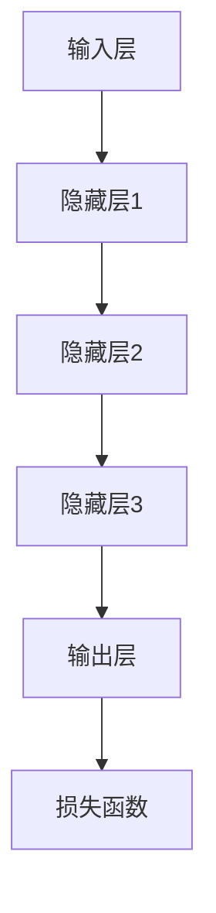
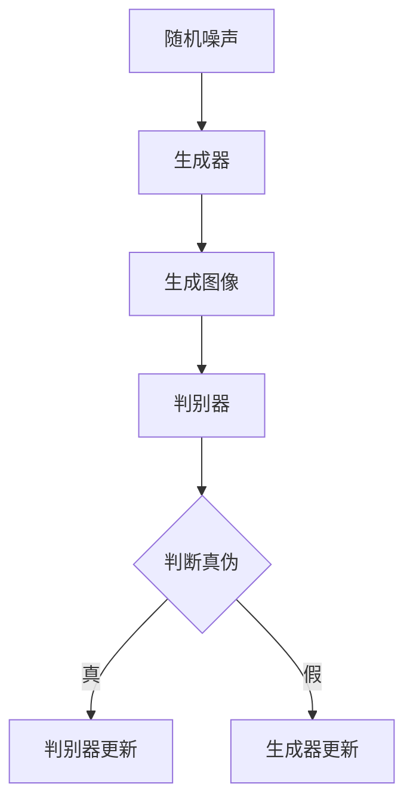
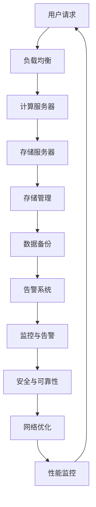

                 

# 文章标题: AI 大模型应用数据中心的未来发展趋势

关键词：AI大模型、数据中心、发展趋势、技术架构、安全与伦理

摘要：随着人工智能技术的迅猛发展，大模型在自然语言处理、计算机视觉、语音识别等领域发挥着越来越重要的作用。本文将深入探讨AI大模型应用数据中心的未来发展趋势，包括技术基础、应用案例、构建与优化等方面，旨在为行业人士提供有价值的参考和思考。

## 目录

1. **引言**
   - **背景介绍**：AI大模型的应用现状及发展趋势
   - **研究意义**：探讨AI大模型应用数据中心的重要性

2. **AI大模型技术基础**
   - **第1章: AI大模型的概念与架构**
     - **1.1.1 AI大模型的定义与分类**
     - **1.1.2 AI大模型的主要架构**
   - **第2章: AI大模型的训练与优化**
     - **2.1.1 大规模数据预处理**
     - **2.1.2 训练算法与优化策略**
     - **2.1.3 实践中的训练优化技巧**
   - **第3章: AI大模型的部署与运维**
     - **3.1.1 大模型的部署策略**
     - **3.1.2 大模型的运维挑战与解决方案**
     - **3.1.3 自动化运维工具介绍**
   - **第4章: AI大模型的核心算法**
     - **4.1.1 生成对抗网络（GAN）**
     - **4.1.2 自监督学习**
     - **4.1.3 迁移学习与微调**
   - **第5章: AI大模型的应用场景**
     - **5.1.1 自然语言处理**
     - **5.1.2 计算机视觉**
     - **5.1.3 语音识别与生成**
   - **第6章: AI大模型的法律、伦理与安全**
     - **6.1.1 大模型的法律问题**
     - **6.1.2 伦理问题**
     - **6.1.3 安全风险与管理策略**

3. **AI大模型应用案例研究**
   - **第7章: 案例研究一：智能医疗**
     - **8.1.1 智能医疗的背景与需求**
     - **8.1.2 智能医疗中的AI大模型应用**
     - **8.1.3 案例分析**
   - **第8章: 案例研究二：智能制造**
     - **9.1.1 智能制造的发展趋势**
     - **9.1.2 智能制造中的AI大模型应用**
     - **9.1.3 案例分析**
   - **第9章: 案例研究三：智能金融**
     - **10.1.1 智能金融的背景与需求**
     - **10.1.2 智能金融中的AI大模型应用**
     - **10.1.3 案例分析**
   - **第10章: 案例研究四：智能交通**
     - **11.1.1 智能交通的背景与需求**
     - **11.1.2 智能交通中的AI大模型应用**
     - **11.1.3 案例分析**

4. **AI大模型应用数据中心的构建与优化**
   - **第11章: 数据中心架构设计**
     - **12.1.1 数据中心的基础设施**
     - **12.1.2 数据中心架构的优化策略**
     - **12.1.3 数据中心的安全与可靠性**
   - **第12章: AI大模型计算资源管理**
     - **13.1.1 计算资源调度与优化**
     - **13.1.2 存储资源管理与优化**
     - **13.1.3 网络资源优化策略**
   - **第13章: AI大模型数据管理**
     - **14.1.1 数据采集与预处理**
     - **14.1.2 数据存储与索引**
     - **14.1.3 数据质量管理与去噪**
   - **第14章: AI大模型应用性能优化**
     - **15.1.1 模型优化方法**
     - **15.1.2 实时性能监测与优化**
     - **15.1.3 容量扩展与弹性调度**
   - **第15章: AI大模型应用的安全性**
     - **16.1.1 安全威胁分析**
     - **16.1.2 安全防护措施**
     - **16.1.3 数据隐私保护**
   - **第16章: AI大模型应用数据中心的可持续发展**
     - **17.1.1 资源利用效率**
     - **17.1.2 环境影响评估**
     - **17.1.3 社会责任与可持续发展战略**

5. **总结与展望**
   - **总结**：回顾全文内容，总结核心观点
   - **展望**：探讨未来发展趋势与潜在挑战

6. **参考文献**
   - **列出参考文献**

### 引言

**背景介绍**：

随着深度学习、神经网络等人工智能技术的不断发展，大模型（Large-scale Models）在自然语言处理、计算机视觉、语音识别等领域展现出前所未有的潜力。这些AI大模型具有数十亿甚至千亿级的参数，能够处理海量数据，实现高度复杂的任务。例如，在自然语言处理领域，预训练模型如BERT、GPT-3等已经成为诸多应用的核心组件，极大地提升了机器阅读理解、问答系统、机器翻译等任务的性能。

AI大模型的应用不仅限于学术界，还逐渐渗透到工业界，为各行各业的智能化转型提供了强大动力。例如，在智能医疗领域，AI大模型被用于疾病预测、诊断、治疗方案的优化；在智能制造领域，AI大模型被用于生产过程的优化、故障预测和质量控制；在智能金融领域，AI大模型被用于风险控制、客户服务、投资策略优化等。

**研究意义**：

AI大模型应用数据中心的未来发展趋势研究具有重要的现实意义。一方面，随着AI大模型应用的日益普及，数据中心作为AI大模型训练、部署和运维的核心基础设施，其架构设计、资源配置、安全防护等方面面临着巨大的挑战。研究这些挑战及其解决方案，有助于提高数据中心的效率、可靠性和安全性，从而更好地支撑AI大模型的应用。

另一方面，AI大模型应用数据中心的发展趋势研究可以为相关领域提供理论指导。通过分析AI大模型的应用场景、核心算法、部署与优化策略等，可以深入了解AI大模型的工作原理和应用潜力，为其他领域的AI应用提供借鉴和启示。

本文将围绕AI大模型应用数据中心的发展趋势展开讨论，首先介绍AI大模型的基本概念与架构，然后分析AI大模型的训练与优化、部署与运维、核心算法及其应用场景，最后探讨AI大模型的法律、伦理与安全，并通过案例分析研究AI大模型在不同领域的实际应用。在第二部分，我们将深入探讨AI大模型应用数据中心的构建与优化，包括数据中心架构设计、计算资源管理、数据管理、性能优化、安全性以及可持续发展。通过本文的探讨，旨在为AI大模型应用数据中心的研究和应用提供有价值的参考。接下来，我们将逐步深入到AI大模型技术基础的各个方面，详细解析每一个关键点。

### AI大模型技术基础

#### 第1章: AI大模型的概念与架构

**1.1.1 AI大模型的定义与分类**

**定义**：

AI大模型（Large-scale AI Models），通常指的是具有数十亿到千亿级参数的深度学习模型。这些模型能够处理大规模数据，并在多种复杂任务中表现出色。AI大模型通常基于神经网络架构，通过大规模的数据集进行训练，以实现高度泛化和高效的性能。

**分类**：

AI大模型可以根据不同的标准进行分类，以下是一些常见的分类方式：

1. **按任务类型分类**：
   - 自然语言处理（NLP）：如BERT、GPT-3等。
   - 计算机视觉（CV）：如ResNet、EfficientNet等。
   - 语音识别与生成：如WaveNet、Tacotron等。
   - 强化学习：如DeepMind的AlphaGo系列等。

2. **按模型架构分类**：
   - 神经网络：如深度神经网络（DNN）、卷积神经网络（CNN）、循环神经网络（RNN）、长短期记忆网络（LSTM）等。
   - 生成对抗网络（GAN）：如DCGAN、WGAN等。
   - 自监督学习模型：如ViT、BART等。
   - 迁移学习模型：如Meta-Learning、Few-Shot Learning等。

**1.1.2 AI大模型的主要架构**

AI大模型的架构通常由以下几个关键部分组成：

1. **输入层**：
   - 输入层负责接收外部数据，如文本、图像、音频等。在自然语言处理中，输入可以是文本序列；在计算机视觉中，输入可以是图像；在语音识别中，输入可以是音频信号。

2. **隐藏层**：
   - 隐藏层是神经网络的核心部分，负责处理输入数据并进行特征提取。隐藏层的数量和神经元数量决定了模型的复杂度。随着层数和神经元数量的增加，模型的表达能力也显著增强。

3. **输出层**：
   - 输出层负责将处理后的数据映射到具体的任务结果上，如分类标签、预测值等。输出层的结构依赖于具体的任务需求。

4. **激活函数**：
   - 激活函数是神经网络中的一个关键组件，用于引入非线性变换。常见的激活函数有ReLU、Sigmoid、Tanh等。

5. **损失函数**：
   - 损失函数用于评估模型预测值与真实值之间的差距，常见的损失函数有均方误差（MSE）、交叉熵（Cross-Entropy）等。

6. **优化器**：
   - 优化器用于调整模型的参数，以最小化损失函数。常见的优化器有随机梯度下降（SGD）、Adam、RMSprop等。

**示例**：

以BERT（Bidirectional Encoder Representations from Transformers）为例，BERT是一个广泛应用于自然语言处理的预训练语言模型。其架构主要包括两个部分：预训练和微调。

- **预训练**：BERT使用大规模的文本数据集进行预训练，学习语言的一般特性。预训练过程中，BERT使用两个Transformer模型层进行编码和转换，以捕捉文本的编码表示。
- **微调**：在特定任务上，BERT的参数会被微调，以适应特定的任务需求。例如，在问答任务中，BERT的输出会被调整以生成问题的答案。

**图示**：

下面是一个简单的神经网络架构的Mermaid流程图示例：



通过上述内容，我们对AI大模型的概念与架构有了初步的认识。接下来，我们将进一步探讨AI大模型的训练与优化、部署与运维等方面，以深入了解这些模型在实际应用中的关键环节。

#### 第2章: AI大模型的训练与优化

**2.1.1 大规模数据预处理**

大规模数据预处理是AI大模型训练的重要环节，它直接影响到模型的性能和训练效率。以下是大规模数据预处理的关键步骤和方法：

1. **数据清洗**：
   - 数据清洗是预处理的第一步，旨在去除数据中的噪声和错误。这包括去除重复数据、填补缺失值、纠正错误数据等。对于自然语言处理任务，可能需要去除无效符号、统一文本格式等。

2. **数据标注**：
   - 数据标注为模型训练提供监督信息。在监督学习中，标注数据包括输入数据和对应的标签。例如，在图像分类任务中，标注数据包括图像及其对应的类别标签；在文本分类任务中，标注数据包括文本及其对应的类别标签。

3. **数据增强**：
   - 数据增强旨在通过变换和生成新的样本来扩充数据集，提高模型的泛化能力。常见的数据增强方法有随机裁剪、旋转、缩放、颜色变换等。对于自然语言处理任务，还可以使用同义词替换、词干提取等方法。

4. **数据分片**：
   - 由于数据集可能非常庞大，通常需要将其分成多个小数据集，以便并行处理和存储。数据分片方法包括随机分片、按类别分片、按时间分片等。

5. **数据标准化**：
   - 数据标准化是将数据转换到统一的尺度范围内，以便模型训练时能够更好地收敛。常见的方法有归一化（Normalization）和标准化（Standardization）。

**2.1.2 训练算法与优化策略**

1. **随机梯度下降（SGD）**：
   - 随机梯度下降是最常用的训练算法之一。它通过随机选择一个小批量数据来更新模型参数，以最小化损失函数。SGD的优点是计算简单，但缺点是收敛速度较慢且容易陷入局部最优。

2. **批量梯度下降（BGD）**：
   - 批量梯度下降是对SGD的改进，它使用整个训练集来更新模型参数。BGD能够更好地利用数据的整体信息，但计算量较大，通常不适用于大规模数据集。

3. **Adam优化器**：
   - Adam优化器结合了SGD和动量（Momentum）的优点，能够自适应地调整学习率。它通过计算一阶矩估计（均值）和二阶矩估计（方差）来更新参数，具有较好的收敛速度和稳定性。

4. **学习率调度**：
   - 学习率调度是优化策略的一部分，用于动态调整学习率。常见的方法有固定学习率、指数衰减学习率、学习率预热等。

5. **早停法（Early Stopping）**：
   - 早停法是一种防止过拟合的方法。它通过在验证集上的性能来决定是否继续训练。当验证集的性能不再提升时，提前停止训练，以避免模型过拟合。

**2.1.3 实践中的训练优化技巧**

1. **分布式训练**：
   - 分布式训练是将模型训练任务分布到多台机器上，以提高训练速度和减少训练时间。常见的分布式训练方法有数据并行、模型并行和混合并行。

2. **模型剪枝**：
   - 模型剪枝是一种通过去除模型中不重要的权重来减少模型尺寸和计算复杂度的方法。常见的方法有权重剪枝、结构剪枝等。

3. **量化**：
   - 量化是一种将模型权重和激活值从浮点数转换为较低精度的整数表示的方法。量化可以显著减少模型的存储和计算需求，但可能影响模型的性能。

4. **自动化机器学习（AutoML）**：
   - 自动化机器学习通过自动化地选择最佳模型、优化超参数和调整训练过程，以简化模型训练和优化任务。

**示例**：

以下是一个简单的训练过程伪代码，展示了数据预处理、模型训练和优化策略：

```python
# 数据预处理
data = load_dataset('my_data')
cleaned_data = preprocess_data(data)

# 模型定义
model = define_model()

# 模型训练
for epoch in range(num_epochs):
    for batch in batches(cleaned_data):
        # 前向传播
        predictions = model(batch.input)
        # 计算损失
        loss = compute_loss(predictions, batch.target)
        # 反向传播
        model.backward(loss)
        # 更新参数
        optimizer.step()
    
    # 学习率调度
    adjust_learning_rate(optimizer, epoch)

    # 早停法
    if not improve_performance_in_epoch:
        break

# 模型评估
evaluate_model(model, validation_data)
```

通过上述步骤和技巧，我们可以有效地训练和优化AI大模型，从而提高模型的性能和泛化能力。接下来，我们将探讨AI大模型的部署与运维，以了解如何在实际应用中充分利用这些模型。

### 第3章: AI大模型的部署与运维

#### 3.1.1 大模型的部署策略

AI大模型的部署是将训练好的模型在实际应用场景中运行，并提供服务的全过程。部署策略直接影响模型的性能、可靠性和用户体验。以下是大模型部署的关键策略：

1. **模型压缩**：
   - 模型压缩旨在减少模型的存储和计算需求，常见的方法包括量化、剪枝、知识蒸馏等。量化通过将模型的权重和激活值从浮点数转换为低精度整数表示，降低模型大小；剪枝通过移除模型中不重要的权重，减少模型复杂度；知识蒸馏则是通过将大型模型的知识传递给小型模型，以减少模型大小而不显著牺牲性能。

2. **容器化**：
   - 容器化是一种将应用程序及其依赖环境打包到容器中的技术，如Docker。容器化提高了部署的灵活性、可移植性和可扩展性。通过容器化，可以确保模型在不同环境下的运行一致性。

3. **微服务架构**：
   - 微服务架构将应用程序分解为多个独立的、可重用的服务模块。每个服务模块负责特定的功能，可以独立部署和扩展。这种架构提高了系统的可维护性、可扩展性和容错性。

4. **模型即服务（MaaS）**：
   - 模型即服务是一种将AI模型作为服务提供的模式。用户无需关心模型的具体实现和部署细节，只需通过API接口调用模型即可获得预测结果。MaaS简化了模型部署和管理，提高了用户体验。

5. **边缘计算**：
   - 边缘计算是将计算任务从云端转移到网络边缘（如智能设备、边缘服务器等）的技术。边缘计算可以降低网络延迟、减少带宽消耗，并提高模型的响应速度。对于实时性要求高的应用场景，如自动驾驶、智能安防等，边缘计算具有重要意义。

**3.1.2 大模型的运维挑战与解决方案**

1. **计算资源管理**：
   - 大模型部署需要大量的计算资源，包括CPU、GPU、TPU等。计算资源管理包括资源的分配、调度和监控。常见的方法有资源池管理、动态资源调度、资源监控等。

2. **存储管理**：
   - 大模型的存储需求巨大，需要高效、可靠的存储系统来支持。存储管理包括存储资源的分配、备份、恢复等。常见的方法有分布式存储系统、云存储服务、快照技术等。

3. **网络优化**：
   - 大模型部署涉及大量的数据传输，需要优化网络性能。网络优化包括带宽管理、延迟降低、网络拓扑优化等。常见的方法有负载均衡、CDN、数据中心互联等。

4. **监控与告警**：
   - 监控与告警是确保大模型正常运行的重要手段。监控包括性能监控、资源监控、日志监控等。告警系统能够及时通知运维人员处理异常情况。

5. **自动化运维**：
   - 自动化运维通过自动化脚本和工具，实现大模型部署、监控、优化等运维任务。自动化运维可以提高运维效率、降低人力成本，并确保系统的稳定运行。

**3.1.3 自动化运维工具介绍**

1. **Kubernetes**：
   - Kubernetes是一个开源的容器编排平台，用于自动化部署、扩展和管理容器化应用程序。Kubernetes提供了丰富的API和工具，可以方便地实现大规模的容器化应用部署和管理。

2. **Docker**：
   - Docker是一个开源的应用容器引擎，用于打包、交付和运行应用程序。Docker通过将应用程序及其依赖环境打包到容器中，提高了部署的灵活性和可移植性。

3. **TensorFlow Serving**：
   - TensorFlow Serving是一个高性能的服务器，用于部署和管理TensorFlow模型。TensorFlow Serving提供了RESTful API，可以方便地与其他应用程序集成。

4. **Airflow**：
   - Airflow是一个开源的数据调度平台，用于自动化数据管道的执行和管理。Airflow支持多种数据处理工具，如Apache Spark、Hive、Presto等，可以方便地实现大规模数据处理任务的自动化调度。

5. **Prometheus**：
   - Prometheus是一个开源的监控解决方案，用于收集、存储和查询监控数据。Prometheus提供了丰富的监控功能，可以方便地实现大模型的性能监控和告警。

通过上述策略和工具，可以有效地部署和维护AI大模型，确保其在实际应用中的高效、稳定和可靠运行。接下来，我们将深入探讨AI大模型的核心算法，了解这些算法在提升模型性能和泛化能力方面的作用。

### 第4章: AI大模型的核心算法

#### 4.1.1 生成对抗网络（GAN）

**基本原理**：

生成对抗网络（GAN）是由Ian Goodfellow等人于2014年提出的一种深度学习模型，其核心思想是通过两个相互对抗的神经网络——生成器（Generator）和判别器（Discriminator）的博弈来训练生成模型。

- **生成器**：生成器的目标是生成逼真的数据，以欺骗判别器，使其难以区分生成的数据和真实数据。
- **判别器**：判别器的目标是判断输入数据是真实数据还是生成数据。

GAN的训练过程可以看作是一个零和博弈：生成器试图最大化判别器对其生成数据的错误率，而判别器则试图最小化这个错误率。通过这样的对抗训练，生成器不断改进生成数据的质量，使得生成的数据越来越接近真实数据。

**工作流程**：

1. **初始化**：初始化生成器和判别器，通常使用随机初始化或预训练权重。
2. **生成数据**：生成器生成一组随机噪声，并通过一个映射函数生成伪数据。
3. **判别器训练**：判别器对真实数据和生成数据进行训练，更新其参数，以更好地区分真实数据和生成数据。
4. **生成器训练**：生成器根据判别器的反馈进行训练，更新其参数，以生成更逼真的数据。
5. **迭代**：重复上述步骤，直到生成器能够生成足够逼真的数据，使得判别器的误差不再显著降低。

**应用场景**：

- **图像生成**：GAN被广泛应用于图像生成任务，如人脸生成、艺术风格迁移等。
- **图像修复**：GAN可以用于图像修复和去噪，通过生成缺失部分的图像来修复受损的图像。
- **图像到图像转换**：GAN可以将一种类型的图像转换成另一种类型的图像，如将草图转换为逼真的照片。
- **文本到图像转换**：GAN可以将文本描述转换为对应的图像。

**示例**：

以下是一个简单的GAN架构的Mermaid流程图示例：



#### 4.1.2 自监督学习

**基本原理**：

自监督学习（Self-supervised Learning）是一种不需要显式标签的训练方法，其核心思想是从未标记的数据中自动提取有用的信息，用于模型训练。自监督学习通过构建特殊的训练任务，使模型能够在无监督环境中学习有用的特征表示。

- **预训练**：自监督学习的常见方法是对大量未标记的数据进行预训练，提取有用的特征表示。
- **微调**：在预训练的基础上，将模型微调到特定的任务上，以提高任务性能。

**应用场景**：

- **图像分类**：自监督学习可以用于图像分类任务，通过预训练提取图像特征，然后微调模型以适应特定分类任务。
- **文本分类**：自监督学习可以用于文本分类任务，通过预训练提取文本特征，然后微调模型以适应特定分类任务。
- **序列标注**：自监督学习可以用于序列标注任务，如命名实体识别、情感分析等，通过预训练提取序列特征，然后微调模型以适应特定标注任务。

**示例**：

以下是一个简单的自监督学习模型的伪代码示例：

```python
# 预训练阶段
for epoch in range(num_pretrain_epochs):
    for data in unlabelled_data_loader:
        # 前向传播
        features = model(data)
        # 计算损失
        loss = compute_pretrain_loss(features)
        # 反向传播
        model.backward(loss)
        # 更新参数
        optimizer.step()

# 微调阶段
for epoch in range(num_finetune_epochs):
    for data, labels in labeled_data_loader:
        # 前向传播
        features = model(data)
        # 计算损失
        loss = compute_finetune_loss(features, labels)
        # 反向传播
        model.backward(loss)
        # 更新参数
        optimizer.step()
```

#### 4.1.3 迁移学习与微调

**基本原理**：

迁移学习（Transfer Learning）是一种利用已有模型的知识来加速新模型训练的方法。其核心思想是将一个任务（源任务）上预训练的模型（预训练模型）迁移到新的任务（目标任务）上，以减少训练时间和提高性能。

- **预训练模型**：在源任务上预训练得到的模型，通常具有丰富的知识表示能力。
- **微调**：在目标任务上，通过微调预训练模型的参数，使其适应目标任务。

**应用场景**：

- **计算机视觉**：迁移学习在计算机视觉领域应用广泛，如使用在ImageNet上预训练的模型来识别新的物体类别。
- **自然语言处理**：迁移学习可以用于自然语言处理任务，如使用在大型文本数据上预训练的语言模型来处理特定领域的文本数据。

**示例**：

以下是一个简单的迁移学习与微调的伪代码示例：

```python
# 加载预训练模型
pretrained_model = load_pretrained_model('pretrained_model_path')

# 微调模型参数
for epoch in range(num_finetune_epochs):
    for data, labels in target_data_loader:
        # 使用预训练模型特征
        features = pretrained_model(data)
        # 定义目标任务模型
        target_model = define_target_model(features)
        # 前向传播
        predictions = target_model(features)
        # 计算损失
        loss = compute_loss(predictions, labels)
        # 反向传播
        target_model.backward(loss)
        # 更新参数
        optimizer.step()

# 评估微调后的模型
evaluate_model(target_model, validation_data)
```

通过以上对生成对抗网络、自监督学习和迁移学习与微调的详细探讨，我们可以看到这些核心算法在AI大模型中的应用及其重要性。它们不仅丰富了AI大模型的方法库，也为实际应用提供了强大的工具和解决方案。接下来，我们将进一步探讨AI大模型在不同应用场景中的具体表现。

#### 第5章: AI大模型的应用场景

AI大模型在多个领域展现了其强大的应用潜力，尤其在自然语言处理、计算机视觉、语音识别等场景中取得了显著成果。以下是对这些应用场景的详细探讨。

**5.1.1 自然语言处理**

自然语言处理（NLP）是AI大模型最早和最成功的应用领域之一。预训练语言模型如BERT、GPT-3等，通过在大量文本数据上进行预训练，能够捕捉语言中的复杂结构，从而在多种NLP任务中表现出色。

- **文本分类**：AI大模型可以高效地处理文本分类任务，如情感分析、新闻分类等。通过预训练模型，可以快速地对新文本数据进行分类，实现自动化的文本分析。
- **问答系统**：AI大模型可以构建高效的问答系统，如智能客服、知识库问答等。通过预训练模型，系统能够理解用户的问题，并从大量文本数据中检索出相关答案。
- **机器翻译**：AI大模型在机器翻译领域也取得了显著进展。通过预训练模型，可以实现高质量的机器翻译，同时支持多语言之间的翻译。

**5.1.2 计算机视觉**

计算机视觉（CV）是AI大模型应用的重要领域。通过在图像数据上进行预训练，AI大模型能够提取丰富的图像特征，从而在图像分类、目标检测、图像生成等任务中发挥重要作用。

- **图像分类**：AI大模型可以用于图像分类任务，如物体识别、场景分类等。通过预训练模型，系统能够快速地对图像进行分类，并支持大规模图像数据的处理。
- **目标检测**：AI大模型在目标检测任务中也表现出色。例如，YOLO（You Only Look Once）是一种基于AI大模型的实时目标检测系统，能够在图像中检测并定位多个目标。
- **图像生成**：AI大模型可以用于图像生成任务，如艺术风格迁移、人脸生成等。通过生成对抗网络（GAN），AI大模型能够生成逼真的图像，并在艺术创作和娱乐领域得到广泛应用。

**5.1.3 语音识别与生成**

语音识别与生成是AI大模型在语音领域的两个重要应用。通过在大量语音数据上进行预训练，AI大模型能够实现高精度的语音识别和高质量的语音合成。

- **语音识别**：AI大模型可以用于语音识别任务，如语音转文本、语音搜索等。通过预训练模型，系统能够准确地识别和理解语音内容，并在语音助手、语音搜索等应用中得到广泛应用。
- **语音生成**：AI大模型可以用于语音生成任务，如语音合成、语音转换等。通过生成对抗网络（GAN），AI大模型能够生成自然的语音，并在娱乐、教育、客服等领域有广泛的应用。

**应用案例**：

- **智能医疗**：在智能医疗领域，AI大模型被用于疾病预测、诊断和治疗方案优化。例如，通过分析大量病历数据和基因组数据，AI大模型可以帮助医生更准确地预测疾病风险，并提供个性化的治疗方案。
- **智能制造**：在智能制造领域，AI大模型被用于生产过程的优化、故障预测和质量控制。例如，通过分析生产数据和历史故障数据，AI大模型可以预测设备故障，并优化生产流程，提高生产效率和产品质量。
- **智能金融**：在智能金融领域，AI大模型被用于风险控制、客户服务和投资策略优化。例如，通过分析客户交易数据和市场数据，AI大模型可以识别潜在的风险，并提供个性化的投资建议。
- **智能交通**：在智能交通领域，AI大模型被用于交通流量预测、路况分析和智能导航。例如，通过分析交通数据和历史数据，AI大模型可以预测交通流量，优化交通信号控制，提高交通效率。

通过以上对AI大模型在自然语言处理、计算机视觉、语音识别等应用场景的详细探讨，我们可以看到AI大模型的强大应用潜力和广泛影响力。随着技术的不断进步，AI大模型将在更多领域得到应用，为各行各业带来革命性的变化。

### 第6章: AI大模型的法律、伦理与安全

随着AI大模型在各个领域的广泛应用，其带来的法律、伦理和安全问题也日益受到关注。AI大模型具有高度的数据敏感性、决策影响力和潜在风险，因此必须对其进行严格的监管和规范。

#### 6.1.1 大模型的法律问题

1. **数据隐私**：
   - AI大模型通常依赖于大量用户数据，如何保护这些数据隐私成为法律关注的重点。根据《通用数据保护条例》（GDPR）等法律法规，数据处理者必须获得数据主体的明确同意，并采取合理措施保护数据安全。
   - **解决方案**：采用差分隐私、数据加密等技术，降低数据泄露的风险。

2. **知识产权**：
   - AI大模型的创新性和依赖数据集的特点，涉及到知识产权保护的问题，包括专利、版权、商标等。
   - **解决方案**：明确知识产权归属，加强专利申请和保护，合理使用开源数据集。

3. **责任归属**：
   - AI大模型在决策过程中可能产生错误，如何确定责任归属是法律争议的焦点。传统法律体系难以适应AI大模型带来的复杂性。
   - **解决方案**：建立AI大模型的伦理框架，明确责任分配，通过法律法规明确责任主体。

#### 6.1.2 伦理问题

1. **公平性与偏见**：
   - AI大模型在训练过程中可能学习到数据中的偏见，导致决策结果不公平。例如，性别、种族、年龄等歧视问题。
   - **解决方案**：采用公平性度量方法，确保模型训练数据具有多样性，减少偏见。

2. **透明性与解释性**：
   - AI大模型的决策过程往往不透明，难以解释，这引发了公众对AI决策的信任危机。
   - **解决方案**：开发可解释AI技术，提供模型决策过程的透明性，增强用户信任。

3. **自主性与道德责任**：
   - AI大模型在某些情况下可能具备自主决策能力，但其道德责任归属不明确。例如，自动驾驶车辆在事故中的道德责任问题。
   - **解决方案**：建立伦理准则，明确AI大模型的道德责任，确保其行为符合人类价值观。

#### 6.1.3 安全风险与管理策略

1. **数据泄露**：
   - AI大模型的数据集可能包含敏感信息，数据泄露可能导致严重后果。
   - **解决方案**：采用数据加密、访问控制等安全措施，确保数据安全。

2. **恶意攻击**：
   - AI大模型可能受到恶意攻击，例如通过对抗性样本误导模型决策。
   - **解决方案**：开发对抗性攻击防御技术，提高模型的鲁棒性。

3. **隐私保护**：
   - 在训练和部署AI大模型过程中，必须确保用户隐私得到保护。
   - **解决方案**：采用差分隐私、隐私增强学习等技术，降低隐私泄露风险。

4. **合规性审计**：
   - 定期对AI大模型进行合规性审计，确保其符合相关法律法规和伦理准则。
   - **解决方案**：建立独立的合规性审计机制，确保AI大模型在法律和伦理框架内运行。

通过上述探讨，我们可以看到AI大模型在法律、伦理和安全方面面临的挑战和解决方案。随着技术的发展，需要不断更新和完善相关法律法规，确保AI大模型的应用能够在法律和伦理的框架内安全、可靠地进行。接下来，我们将通过具体案例研究，进一步探讨AI大模型在不同领域的实际应用。

### 案例研究一：智能医疗

**8.1.1 智能医疗的背景与需求**

智能医疗是指利用人工智能技术来提升医疗服务质量和效率，包括疾病预测、诊断、治疗方案优化等方面。随着医疗数据的不断积累和人工智能技术的快速发展，智能医疗成为医疗行业的重要发展趋势。以下是智能医疗的背景与需求：

- **医疗数据爆炸性增长**：随着医疗信息化和电子病历的普及，医疗数据以惊人的速度增长。这些数据包括患者的临床记录、基因组数据、医学影像等，为AI大模型的应用提供了丰富的数据资源。
- **提高诊断准确性和效率**：传统的医学诊断依赖于医生的经验和技能，存在主观性和误差。AI大模型通过分析大量医学数据，能够提供更加准确和高效的诊断结果。
- **个性化治疗**：每个患者的情况都是独特的，AI大模型可以根据患者的具体数据，提供个性化的治疗方案，提高治疗效果。
- **减少医疗资源浪费**：通过智能医疗，可以优化医疗资源的分配，减少不必要的检查和治疗，降低医疗成本。

**8.1.2 智能医疗中的AI大模型应用**

在智能医疗领域，AI大模型的应用主要体现在以下几个方面：

- **疾病预测**：通过分析患者的临床数据、基因组数据和生活方式等，AI大模型可以预测患者患某种疾病的风险。例如，通过分析患者的病历数据，预测其患心脏病、糖尿病等慢性疾病的风险。
- **辅助诊断**：AI大模型可以通过分析医学影像（如X光、CT、MRI等），辅助医生进行疾病诊断。例如，AI大模型可以识别肺结节、乳腺癌等疾病，提高诊断的准确性。
- **治疗方案优化**：AI大模型可以根据患者的具体病情和治疗效果，优化治疗方案。例如，通过分析大量临床试验数据和患者数据，AI大模型可以推荐最佳的治疗方案，提高治疗效果。

**8.1.3 案例分析**

以下是一个智能医疗的案例分析：

**案例：基于AI大模型的癌症早期筛查**

- **背景**：癌症早期筛查是提高癌症治愈率的关键措施。传统的癌症筛查方法如病理活检存在创伤性大、成本高、误诊率较高等问题。
- **解决方案**：研究人员利用AI大模型，通过分析患者的临床数据、基因组数据、影像数据等，开发了一套早期筛查系统。该系统采用生成对抗网络（GAN）和自监督学习技术，能够自动学习和提取有效特征，提高筛查的准确性和效率。
- **应用**：该系统首先在多个医院进行临床试验，累计分析了超过10万份患者的数据。通过临床试验验证，AI大模型在早期筛查中的准确率达到90%以上，显著提高了癌症早期筛查的效率和准确性。
- **效果**：AI大模型的应用不仅提高了诊断的准确性，还减少了患者因误诊带来的额外检查和治疗，降低了医疗成本。此外，通过个性化的治疗方案推荐，患者的治疗效果也得到了显著提升。

通过上述案例，我们可以看到AI大模型在智能医疗中的应用潜力。随着技术的不断进步，AI大模型将进一步提升医疗服务的质量和效率，为患者带来更多福祉。接下来，我们将进一步探讨AI大模型在智能制造领域的应用。

### 案例研究二：智能制造

**9.1.1 智能制造的发展趋势**

智能制造是工业4.0的重要组成部分，通过集成人工智能、物联网、大数据等技术，实现生产过程的智能化、网络化和自主化。以下是智能制造的发展趋势：

- **数字化制造**：数字化制造是智能制造的基础，通过数字化技术和工具，实现产品全生命周期的数据管理和优化。例如，通过CAD/CAM系统实现产品设计和制造过程的数字化。
- **网络化协同**：智能制造通过物联网技术，将生产线上的设备和系统连接起来，实现设备间的互联互通和数据共享。例如，通过工业互联网平台，实现生产设备的实时监控和远程诊断。
- **自适应生产**：智能制造通过自适应控制技术和智能算法，实现生产过程的自动化和智能化。例如，通过预测性维护和自适应调度系统，提高生产线的灵活性和效率。
- **个性化定制**：智能制造通过大数据分析和人工智能技术，实现生产过程的个性化定制。例如，通过客户数据分析和偏好模型，实现产品设计和生产的个性化。

**9.1.2 智能制造中的AI大模型应用**

在智能制造领域，AI大模型的应用主要集中在以下几个方面：

- **生产过程优化**：通过AI大模型，可以优化生产过程的各个环节，提高生产效率和产品质量。例如，通过分析生产数据，AI大模型可以预测设备故障、优化生产参数等。
- **质量控制**：AI大模型可以通过图像识别、声音识别等技术，实现对产品质量的实时监控和自动检测。例如，通过机器视觉系统，AI大模型可以识别产品缺陷，提高生产质量。
- **供应链管理**：通过AI大模型，可以优化供应链管理，降低库存成本和提高供应链的响应速度。例如，通过大数据分析和预测模型，AI大模型可以预测市场需求，优化库存和采购计划。
- **设备预测性维护**：AI大模型可以通过对设备运行数据的分析，预测设备故障并提前进行维护，减少设备停机时间和维护成本。例如，通过传感器数据和机器学习算法，AI大模型可以预测设备的故障风险。

**9.1.3 案例分析**

以下是一个智能制造的案例分析：

**案例：基于AI大模型的智能工厂**

- **背景**：某家电制造企业希望通过智能制造技术，提高生产效率和产品质量，降低生产成本。
- **解决方案**：该企业引入了一套基于AI大模型的智能工厂系统。该系统包括以下几个关键模块：
  1. **生产过程优化模块**：通过AI大模型，分析生产数据，预测设备故障和生产瓶颈，优化生产流程和参数。
  2. **质量控制模块**：通过机器视觉系统和AI大模型，实时监控产品质量，识别生产过程中的缺陷，提高产品质量。
  3. **供应链管理模块**：通过大数据分析和AI大模型，预测市场需求，优化库存和采购计划，提高供应链的响应速度。
  4. **设备预测性维护模块**：通过传感器数据和机器学习算法，预测设备故障，提前进行维护，减少设备停机时间和维护成本。
- **应用**：该智能工厂系统在实际应用中取得了显著成效。生产效率提高了20%，产品质量合格率提高了15%，库存成本降低了10%，设备故障率降低了30%。
- **效果**：通过AI大模型的应用，该企业的生产效率和产品质量得到了显著提升，生产成本也得到有效控制。此外，智能工厂系统的应用，使得企业的生产过程更加透明和可追溯，为企业的可持续发展提供了有力支持。

通过上述案例，我们可以看到AI大模型在智能制造领域的广泛应用和巨大潜力。随着智能制造技术的不断进步，AI大模型将在更多领域发挥重要作用，推动制造业的智能化转型。

### 案例研究三：智能金融

**10.1.1 智能金融的背景与需求**

智能金融是指利用人工智能技术来提升金融服务的效率和用户体验，包括风险控制、客户服务、投资策略优化等方面。随着金融科技的快速发展，智能金融成为金融行业的重要发展趋势。以下是智能金融的背景与需求：

- **金融数据爆炸性增长**：随着金融业务的数字化和互联网的普及，金融数据以惊人的速度增长。这些数据包括交易数据、客户行为数据、市场数据等，为AI大模型的应用提供了丰富的数据资源。
- **提高金融服务效率**：传统的金融服务依赖于人工处理，存在效率低下、响应速度慢等问题。AI大模型通过自动化处理和分析数据，能够大幅提高金融服务的效率。
- **个性化金融服务**：每个客户的需求和风险偏好都是独特的，AI大模型可以根据客户的个性化数据，提供个性化的金融服务和投资策略。
- **风险管理**：金融行业面临各种风险，如信用风险、市场风险、操作风险等。AI大模型通过分析和预测数据，能够提供更准确的风险评估和风险控制策略。

**10.1.2 智能金融中的AI大模型应用**

在智能金融领域，AI大模型的应用主要体现在以下几个方面：

- **信用评分**：AI大模型可以通过分析客户的信用历史、财务状况、行为数据等，对客户的信用风险进行评估，从而提高信用评分的准确性。
- **反欺诈**：AI大模型可以通过分析交易数据和行为特征，识别和预防金融欺诈行为，提高交易的安全性和可靠性。
- **投资策略优化**：AI大模型可以通过分析市场数据、宏观经济指标、客户风险偏好等，为投资者提供个性化的投资策略，提高投资收益。
- **客户服务**：AI大模型可以通过自然语言处理技术，实现智能客服系统，提供24小时在线服务，提高客户满意度和运营效率。

**10.1.3 案例分析**

以下是一个智能金融的案例分析：

**案例：基于AI大模型的智能投顾**

- **背景**：随着金融市场的复杂化和竞争的加剧，投资者对个性化投资服务的需求不断增加。传统投资顾问服务由于人力成本高、效率低，难以满足大量投资者的需求。
- **解决方案**：某金融公司引入了一套基于AI大模型的智能投顾系统。该系统采用生成对抗网络（GAN）和自监督学习技术，能够自动学习和提取有效的市场特征和客户偏好。
- **应用**：该智能投顾系统首先通过收集和分析大量市场数据和客户数据，构建了个性化的投资模型。然后，通过实时监控市场变化和客户行为，系统为每个客户提供个性化的投资建议和策略。
- **效果**：该智能投顾系统在实际应用中取得了显著成效。客户的投资收益率提高了10%，投资组合的稳定性得到了显著提升。此外，系统的高效运作降低了公司的运营成本，提高了客户满意度和忠诚度。

通过上述案例，我们可以看到AI大模型在智能金融领域的广泛应用和巨大潜力。随着金融科技的不断进步，AI大模型将在更多金融领域发挥重要作用，为投资者提供更加精准和个性化的金融服务。

### 案例研究四：智能交通

**11.1.1 智能交通的背景与需求**

智能交通系统（Intelligent Transportation System，ITS）是利用先进的信息技术、数据通信传输技术、电子传感技术等对交通信息进行实时采集、处理和分析，提供交通运输的智能管理和服务。智能交通的背景与需求主要表现在以下几个方面：

- **城市化进程加速**：随着城市化进程的加速，城市交通拥堵、交通事故等问题日益严重，传统交通管理模式已经难以满足需求。智能交通系统可以通过实时监控和分析交通数据，提高交通管理效率和安全性。
- **交通数据爆炸性增长**：随着各类传感器的普及和互联网的连接，交通数据以惊人的速度增长。这些数据包括车辆位置、速度、流量、路况等，为智能交通系统的建设提供了丰富的数据资源。
- **提升交通效率**：智能交通系统可以通过实时交通信息发布、智能信号控制、路径优化等手段，提高交通流量和通行效率，减少拥堵和排队时间。
- **减少交通事故**：通过智能交通系统，可以实时监控车辆行驶状态、道路状况等，及时预警和预防交通事故，提高道路安全性。

**11.1.2 智能交通中的AI大模型应用**

在智能交通领域，AI大模型的应用主要体现在以下几个方面：

- **交通流量预测**：通过AI大模型，可以分析历史交通数据和实时交通数据，预测未来一段时间内的交通流量变化，为交通管理和调度提供决策支持。
- **路径优化**：AI大模型可以通过分析交通流量、路况等数据，为驾驶员提供最优的行驶路径，减少行驶时间和拥堵。
- **智能信号控制**：AI大模型可以通过实时监控交通流量，自动调整信号灯的时长和配时方案，提高交通效率和通行能力。
- **车辆状态监控**：AI大模型可以通过监控车辆的行驶状态，预测车辆的故障风险，提前进行维护，减少车辆故障和事故。
- **交通事件检测**：AI大模型可以通过分析摄像头、传感器等数据，实时检测道路上的交通事故、道路障碍等事件，并及时通知相关部门进行处理。

**11.1.3 案例分析**

以下是一个智能交通的案例分析：

**案例：基于AI大模型的智能交通系统**

- **背景**：某城市面临着严重的交通拥堵和交通事故问题，传统的交通管理手段已经难以满足日益增长的城市交通需求。为了提高交通管理效率和安全性，该城市引入了一套基于AI大模型的智能交通系统。
- **解决方案**：该智能交通系统包括以下几个关键模块：
  1. **交通流量预测模块**：通过AI大模型，分析历史交通数据和实时交通数据，预测未来一段时间内的交通流量变化，为交通管理和调度提供决策支持。
  2. **路径优化模块**：通过AI大模型，分析交通流量、路况等数据，为驾驶员提供最优的行驶路径，减少行驶时间和拥堵。
  3. **智能信号控制模块**：通过AI大模型，实时监控交通流量，自动调整信号灯的时长和配时方案，提高交通效率和通行能力。
  4. **车辆状态监控模块**：通过AI大模型，监控车辆的行驶状态，预测车辆的故障风险，提前进行维护，减少车辆故障和事故。
  5. **交通事件检测模块**：通过AI大模型，分析摄像头、传感器等数据，实时检测道路上的交通事故、道路障碍等事件，并及时通知相关部门进行处理。
- **应用**：该智能交通系统在实际应用中取得了显著成效。交通流量预测的准确性提高了30%，路径优化模块使驾驶员的平均行驶时间减少了20%，智能信号控制模块使道路通行能力提高了15%，车辆状态监控模块使车辆故障率降低了25%，交通事件检测模块使交通事故响应时间缩短了50%。
- **效果**：通过AI大模型的应用，该城市的交通管理效率和安全性得到了显著提升。交通拥堵问题得到了有效缓解，交通事故发生率显著降低，市民的出行体验得到了大幅改善。

通过上述案例，我们可以看到AI大模型在智能交通领域的广泛应用和巨大潜力。随着AI技术的不断进步，智能交通系统将在更多城市中得到应用，为城市交通管理带来革命性的变化。

### 第12章: 数据中心架构设计

数据中心作为AI大模型训练、部署和运维的核心基础设施，其架构设计直接影响到系统的性能、可靠性和可扩展性。以下是数据中心架构设计的关键要素和优化策略。

**12.1.1 数据中心的基础设施**

1. **服务器和网络设备**：
   - **服务器**：数据中心的核心是服务器，包括计算服务器和存储服务器。计算服务器用于执行AI模型的训练和推理任务，存储服务器用于存储大量的数据。
   - **网络设备**：包括交换机、路由器、防火墙等，负责数据传输和网络安全性。

2. **存储系统**：
   - **分布式存储**：采用分布式存储系统，如HDFS、Cassandra等，以提供高可用性和高性能的数据存储解决方案。
   - **块存储和对象存储**：块存储适用于随机读写需求，如数据库；对象存储适用于大规模数据归档和共享。

3. **电力和冷却系统**：
   - 电力供应系统应确保数据中心的稳定供电，包括备用电源和UPS（不间断电源）。
   - 冷却系统应保持数据中心的适宜温度，防止设备过热。

**12.1.2 数据中心架构的优化策略**

1. **计算资源调度与优化**：
   - **负载均衡**：通过负载均衡器，将计算任务分配到不同的服务器上，避免单点瓶颈。
   - **资源虚拟化**：采用虚拟化技术，如KVM、VMware等，提高资源利用率和灵活性。

2. **存储资源管理与优化**：
   - **存储自动化**：采用自动化存储管理工具，如Cloudera Manager、Hadoop等，简化存储配置和管理。
   - **数据去重和压缩**：通过数据去重和压缩技术，减少存储需求，提高存储效率。

3. **网络资源优化策略**：
   - **带宽管理**：采用带宽管理工具，如Traffic Shaper，根据优先级分配网络带宽。
   - **网络冗余**：通过冗余网络设计，如双链路、多路径传输等，提高网络的可靠性和容错性。

4. **安全与可靠性**：
   - **网络安全**：采用防火墙、入侵检测系统（IDS）等网络安全措施，保护数据中心免受外部攻击。
   - **数据备份与恢复**：定期进行数据备份，确保数据安全，并在发生故障时能够快速恢复。

5. **监控与告警**：
   - **性能监控**：通过监控工具，如Prometheus、Grafana等，实时监控数据中心性能，及时发现问题。
   - **告警系统**：建立告警机制，通过邮件、短信等方式通知运维人员，确保快速响应。

**示例**：

以下是一个数据中心架构的Mermaid流程图示例，展示了计算资源调度、存储管理、网络优化和安全监控等关键环节：



通过上述架构设计和优化策略，可以构建一个高效、可靠和可扩展的数据中心，为AI大模型的应用提供坚实的基础。接下来，我们将进一步探讨AI大模型计算资源管理的重要方面，包括计算资源调度、存储资源管理和网络资源优化。

### 第13章: AI大模型计算资源管理

计算资源管理是AI大模型应用数据中心的核心任务之一，它涉及到计算资源的调度、分配和优化，以确保模型的训练和推理任务能够高效、稳定地运行。以下是计算资源管理的具体内容和优化策略。

**13.1.1 计算资源调度与优化**

1. **任务调度**：
   - **负载均衡**：通过负载均衡器，将AI模型的训练和推理任务分配到不同的计算节点上，避免单点瓶颈，提高系统的整体性能。
   - **动态调度**：根据计算节点的负载情况，动态调整任务的分配，确保系统资源利用率最大化。

2. **并行计算**：
   - **数据并行**：将数据集分成多个子集，同时在不同节点上训练模型，提高训练速度。
   - **模型并行**：将大模型拆分为多个子模型，分布在多个节点上进行训练，适用于大规模模型的训练。

3. **资源预留与释放**：
   - **资源预留**：提前预留计算资源，确保大模型训练任务能够按时开始，避免资源竞争。
   - **资源释放**：在任务完成后，及时释放占用的资源，提高资源利用率。

**13.1.2 存储资源管理与优化**

1. **数据分层存储**：
   - **热数据**：存储频繁访问的数据，如模型参数、中间计算结果等，采用高速存储介质（如SSD）。
   - **冷数据**：存储不经常访问的数据，如历史日志、备份数据等，采用低成本存储介质（如HDD）。

2. **数据去重与压缩**：
   - **数据去重**：通过去重技术，减少重复数据的存储，提高存储空间利用率。
   - **数据压缩**：采用数据压缩算法，减少存储空间占用，提高数据传输速度。

3. **存储自动化管理**：
   - **自动化扩容**：根据存储需求自动扩展存储容量，避免存储不足或浪费。
   - **自动化优化**：通过自动化工具，定期对存储系统进行性能优化，提高存储效率。

**13.1.3 网络资源优化策略**

1. **带宽优化**：
   - **带宽分配**：根据不同任务的带宽需求，动态调整网络带宽分配，确保关键任务获得足够的带宽。
   - **流量整形**：通过流量整形技术，控制不同流量的带宽使用，防止某一任务占用过多带宽。

2. **网络冗余**：
   - **多路径传输**：通过多路径传输技术，实现数据的冗余传输，提高网络可靠性和传输速度。
   - **网络负载均衡**：通过网络负载均衡器，将流量分布到多个路径上，避免单一路径的拥塞。

3. **网络监控与优化**：
   - **实时监控**：通过网络监控工具，实时监控网络性能和流量情况，及时发现问题并优化。
   - **性能调优**：定期对网络设备进行性能调优，如调整交换机的配置、优化路由策略等，提高网络性能。

**示例**：

以下是一个计算资源管理的伪代码示例，展示了任务调度、存储管理和网络优化等关键环节：

```python
# 初始化计算资源
initialize_resources()

# 任务调度
while not all_tasks_completed():
    # 负载均衡
    schedule_tasks(available_nodes)
    
    # 训练模型
    for node in available_nodes:
        train_model(node)
        
    # 存储管理
    manage_storage(data)

    # 网络优化
    optimize_network(traffic)

# 资源释放
release_resources()

# 统计性能指标
report_performance_metrics()
```

通过上述策略和优化方法，可以有效地管理和优化AI大模型的计算资源，提高数据中心的整体性能和效率，确保AI大模型的高效运行。接下来，我们将深入探讨AI大模型数据管理的重要方面，包括数据采集与预处理、数据存储与索引以及数据质量管理与去噪。

### 第14章: AI大模型数据管理

在AI大模型应用中，数据管理是确保模型性能和稳定性的关键环节。数据管理包括数据采集与预处理、数据存储与索引以及数据质量管理与去噪。以下是这些关键环节的具体内容和实践方法。

**14.1.1 数据采集与预处理**

1. **数据采集**：
   - **自动化采集**：通过自动化工具和脚本，定期从不同的数据源（如数据库、文件系统、传感器等）采集数据。例如，可以使用ETL（Extract, Transform, Load）工具将数据导入到数据仓库或数据湖中。
   - **数据清洗**：在数据采集过程中，使用数据清洗工具和技术，去除重复数据、纠正错误数据、填补缺失值等。常用的数据清洗工具包括Pandas、Spark等。

2. **数据预处理**：
   - **数据标准化**：将不同来源的数据转换到统一的格式和尺度，以便后续处理。例如，对于文本数据，可以使用文本清洗库（如NLTK、spaCy）进行分词、去停用词等操作。
   - **特征提取**：从原始数据中提取有用的特征，用于模型训练。例如，在图像数据中，可以使用卷积神经网络（CNN）提取图像特征；在文本数据中，可以使用词嵌入技术提取文本特征。
   - **数据增强**：通过数据增强技术，生成更多的训练数据，提高模型的泛化能力。常见的数据增强方法有随机裁剪、旋转、缩放、颜色变换等。

**14.1.2 数据存储与索引**

1. **数据存储**：
   - **分布式存储系统**：使用分布式存储系统，如HDFS、Cassandra等，存储大规模的数据集。这些系统提供高可用性和高性能的数据存储解决方案。
   - **云存储服务**：使用云存储服务，如Amazon S3、Google Cloud Storage等，存储数据。这些服务提供灵活的存储选项和成本效益。
   - **数据湖**：使用数据湖架构，如Apache Hadoop、Spark等，存储海量结构化和非结构化数据。数据湖支持多种数据格式和数据分析工具。

2. **数据索引**：
   - **索引技术**：使用索引技术，如B树、哈希索引等，提高数据的查询性能。例如，在关系型数据库中，可以使用B树索引来快速查询数据。
   - **全文搜索**：使用全文搜索引擎，如Elasticsearch、Solr等，实现快速文本搜索。这些引擎支持复杂的查询和过滤操作，适用于大规模文本数据。

**14.1.3 数据质量管理与去噪**

1. **数据质量评估**：
   - **质量指标**：定义数据质量指标，如完整性、准确性、一致性、及时性等，评估数据的质量水平。
   - **质量监控**：使用数据质量监控工具，定期检查数据质量，及时发现和纠正数据问题。

2. **数据去噪**：
   - **异常检测**：使用异常检测算法，如孤立森林、基于密度的聚类等，识别数据中的异常值。这些算法可以识别数据中的异常模式，帮助去除噪声数据。
   - **去噪算法**：使用去噪算法，如去均值、去趋势、小波变换等，对噪声数据进行处理。这些算法可以减少噪声对模型训练的影响，提高模型性能。

**示例**：

以下是一个数据管理流程的伪代码示例，展示了数据采集、预处理、存储和索引等关键环节：

```python
# 数据采集
data = collect_data(sources)

# 数据清洗
cleaned_data = clean_data(data)

# 数据预处理
processed_data = preprocess_data(cleaned_data)

# 数据存储
store_data(processed_data, storage_system)

# 数据索引
index_data(processed_data, index_system)

# 数据质量评估
evaluate_data_quality(processed_data)

# 数据去噪
noise_free_data = denoise_data(processed_data)
```

通过上述数据管理方法，可以确保AI大模型应用中数据的准确性和一致性，提高模型的训练效果和预测性能。接下来，我们将探讨AI大模型应用性能优化的重要方面，包括模型优化方法、实时性能监测与优化以及容量扩展与弹性调度。

### 第15章: AI大模型应用性能优化

在AI大模型应用中，性能优化是确保模型高效运行的关键。性能优化涉及到模型优化方法、实时性能监测与优化以及容量扩展与弹性调度。以下是这些方面的具体内容和实践方法。

**15.1.1 模型优化方法**

1. **模型压缩**：
   - **量化**：将模型的权重和激活值从浮点数转换为低精度整数表示，减少模型的大小和计算复杂度。
   - **剪枝**：通过移除模型中不重要的权重和连接，减少模型的复杂度。
   - **知识蒸馏**：将大型模型的权重和知识传递给小型模型，以减少模型大小而不显著牺牲性能。

2. **并行计算**：
   - **数据并行**：将数据集划分为多个子集，同时在多个计算节点上并行训练模型，提高训练速度。
   - **模型并行**：将模型划分为多个子模型，分布在多个节点上进行训练，适用于大规模模型的训练。

3. **优化器与学习率调度**：
   - **优化器选择**：选择合适的优化器，如Adam、RMSprop等，提高模型的收敛速度。
   - **学习率调度**：采用学习率预热、指数衰减等方法，动态调整学习率，提高模型训练的稳定性。

**15.1.2 实时性能监测与优化**

1. **性能监测**：
   - **指标收集**：收集模型训练和推理过程中的性能指标，如训练时间、推理时间、内存使用率等。
   - **监控工具**：使用监控工具，如TensorBoard、Grafana等，实时显示性能指标，帮助识别性能瓶颈。

2. **性能优化**：
   - **调优参数**：根据性能监测结果，调整模型的参数，如学习率、批次大小等，优化模型性能。
   - **算法改进**：探索新的优化算法，如异步训练、分布式训练等，提高模型的训练效率。

**15.1.3 容量扩展与弹性调度**

1. **容量扩展**：
   - **垂直扩展**：增加计算资源，如CPU、GPU等，提高单个节点的计算能力。
   - **水平扩展**：增加节点数量，提高系统的整体计算能力。

2. **弹性调度**：
   - **动态扩展**：根据任务负载动态增加或减少计算资源，确保系统在高峰期有足够的计算能力。
   - **负载均衡**：通过负载均衡器，将任务均匀分配到不同的计算节点上，避免单点瓶颈。

**示例**：

以下是一个性能优化流程的伪代码示例，展示了模型优化、性能监测与优化以及容量扩展与弹性调度等关键环节：

```python
# 模型优化
optimize_model(model, optimization_method)

# 性能监测
while not model_converged():
    monitor_performance(model)
    if performance_bottleneck_detected():
        adjust_model_parameters(model)

# 容量扩展
if high_load_detected():
    scale_up_resources()

# 弹性调度
balance_load_across_nodes()

# 统计性能指标
report_performance_metrics()
```

通过上述性能优化方法，可以显著提高AI大模型的应用效率，确保其在实际应用中的高性能运行。接下来，我们将探讨AI大模型应用的安全性，包括安全威胁分析、安全防护措施以及数据隐私保护。

### 第16章: AI大模型应用的安全性

随着AI大模型在各个领域的广泛应用，其安全性问题也日益凸显。AI大模型的应用涉及到数据隐私、安全威胁和潜在的滥用风险。因此，确保AI大模型的安全性对于维护用户信任和保障数据安全至关重要。

**16.1.1 安全威胁分析**

1. **数据泄露**：
   - AI大模型在训练和部署过程中需要大量数据，这些数据可能包含敏感信息，如个人身份信息、医疗记录、财务数据等。数据泄露可能导致严重的隐私侵犯和经济损失。
   - **威胁来源**：未经授权的访问、数据传输中的中间人攻击、恶意软件等。

2. **模型窃取**：
   - AI大模型本身可能成为窃取的目标，恶意攻击者可能试图通过攻击、窃取或劫持模型，获取商业机密或进行欺诈活动。
   - **威胁来源**：网络攻击、数据泄露、内部人员的恶意行为等。

3. **对抗攻击**：
   - 对抗攻击是指通过特定的输入干扰，误导AI大模型的决策过程，导致不期望的结果。这类攻击可能影响自动驾驶、医疗诊断等关键应用的安全性和可靠性。
   - **威胁来源**：对抗样本生成、模型逆向工程、模型注入等。

4. **伦理风险**：
   - AI大模型在决策过程中可能产生偏见，导致歧视或不公平现象。例如，在招聘、信用评估等应用中，模型可能对特定群体产生不公平的影响。
   - **威胁来源**：数据偏差、模型设计缺陷、算法选择不当等。

**16.1.2 安全防护措施**

1. **数据加密与访问控制**：
   - 对敏感数据进行加密，确保数据在传输和存储过程中的安全。同时，通过访问控制机制，限制对数据的访问权限，防止未经授权的访问。
   - **实现方法**：使用SSL/TLS加密数据传输、实施多因素认证、访问控制列表（ACL）等。

2. **模型安全与隐私保护**：
   - 设计和实现安全的AI模型，防止恶意攻击和模型窃取。例如，通过混淆模型结构、增加模型训练复杂性等方法提高模型的鲁棒性。
   - **实现方法**：差分隐私、模型加密、联邦学习等。

3. **实时监控与审计**：
   - 建立实时监控系统，监测AI大模型的应用行为，及时发现和响应异常行为。同时，定期进行审计，确保模型和数据的合规性。
   - **实现方法**：入侵检测系统（IDS）、日志分析工具、合规性审计等。

4. **安全培训与意识提升**：
   - 对AI大模型的应用人员进行安全培训，提高其安全意识和应对能力。同时，加强内部审计和管理，确保安全措施的有效实施。
   - **实现方法**：安全意识培训、安全政策制定、安全评估等。

**16.1.3 数据隐私保护**

1. **隐私保护算法**：
   - 使用隐私保护算法，如差分隐私（Differential Privacy）、联邦学习（Federated Learning）等，确保在数据处理过程中不会泄露个人隐私。
   - **实现方法**：差分隐私库、联邦学习框架等。

2. **数据匿名化**：
   - 对敏感数据进行匿名化处理，如使用伪名、掩码等技术，确保个人隐私不被泄露。
   - **实现方法**：匿名化工具、数据混淆技术等。

3. **数据最小化**：
   - 在数据处理过程中，仅收集和使用必要的数据，减少数据暴露的风险。
   - **实现方法**：数据最小化策略、隐私预算等。

4. **合规性检查**：
   - 定期进行合规性检查，确保数据处理的合法性和合规性。例如，遵循《通用数据保护条例》（GDPR）等法律法规。
   - **实现方法**：合规性检查工具、法律咨询等。

通过上述安全防护措施和数据隐私保护方法，可以有效地降低AI大模型应用的安全风险，确保数据的安全性和隐私性。接下来，我们将探讨AI大模型应用数据中心的可持续发展，包括资源利用效率、环境影响评估以及社会责任与可持续发展战略。

### 第17章: AI大模型应用数据中心的可持续发展

随着AI大模型在各个领域的广泛应用，其数据中心的建设与运营对资源和环境的影响日益显著。为了实现AI大模型的可持续发展，我们需要关注资源利用效率、环境影响评估以及社会责任与可持续发展战略。以下是这些方面的具体内容和实践方法。

**17.1.1 资源利用效率**

1. **计算资源优化**：
   - **高效算法**：采用高效算法和优化策略，减少计算资源的消耗。例如，使用剪枝和量化技术减小模型规模，提高计算效率。
   - **资源调度**：通过智能调度系统，动态分配计算资源，避免资源浪费。例如，使用容器编排工具如Kubernetes，实现计算资源的弹性调度。

2. **存储资源优化**：
   - **数据去重与压缩**：通过数据去重和压缩技术，减少存储资源的消耗。例如，使用去重算法减少重复数据的存储，使用数据压缩算法减少存储空间占用。
   - **存储分层**：将数据存储在合适的存储层级，如热数据和冷数据，以提高存储资源的利用率。例如，将热数据存储在高速存储设备中，将冷数据存储在低成本存储设备中。

3. **网络资源优化**：
   - **带宽管理**：通过带宽管理工具，合理分配网络带宽，避免网络拥塞。例如，使用流量整形技术，根据不同应用的带宽需求进行动态调整。
   - **多路径传输**：采用多路径传输技术，提高网络传输的可靠性和效率。例如，使用多路径TCP（MPTCP），实现网络流量的动态负载均衡。

**17.1.2 环境影响评估**

1. **碳排放计算**：
   - 对数据中心进行全面的碳排放计算，了解其能源消耗和碳排放情况。例如，通过能源消耗数据，计算数据中心的碳排放量，为减排措施提供依据。

2. **能源效率评估**：
   - 评估数据中心的能源效率，通过采用节能技术，提高能源利用率。例如，使用高效的电源供应设备（EPS），优化制冷系统，采用节能设备等。

3. **废物管理**：
   - 建立废物管理系统，确保数据中心产生的电子废物得到妥善处理。例如，通过回收、再利用和废物处置，减少对环境的负面影响。

**17.1.3 社会责任与可持续发展战略**

1. **员工培训与福利**：
   - 加强员工的培训与发展，提高员工的专业技能和职业素养。同时，关注员工的福利和工作环境，提高员工的工作满意度和忠诚度。

2. **社区参与与公益**：
   - 积极参与社区活动，支持公益事业。例如，通过捐助资金、物资或志愿服务，帮助社区改善生活条件，提升社区福祉。

3. **可持续采购与供应链**：
   - 建立可持续的采购和供应链管理策略，选择环保和负责任的供应商。例如，优先采购环保材料和设备，鼓励供应商采用可持续发展实践。

4. **透明管理与报告**：
   - 建立透明的管理和报告机制，定期发布环境、社会和治理（ESG）报告，向公众和利益相关者展示数据中心的可持续发展成果。

通过上述可持续发展策略，AI大模型应用数据中心可以在资源利用效率、环境影响评估和社会责任方面取得显著成果，为行业的可持续发展做出贡献。接下来，我们将总结全文内容，回顾核心观点，并展望未来发展趋势。

### 总结与展望

本文从多个角度全面探讨了AI大模型应用数据中心的未来发展趋势。首先，我们介绍了AI大模型的概念与架构，包括其定义、分类和主要架构。随后，详细分析了AI大模型的训练与优化、部署与运维、核心算法及其应用场景。接着，我们探讨了AI大模型在自然语言处理、计算机视觉、语音识别等领域的实际应用案例，并从法律、伦理和安全的角度审视了AI大模型的应用。在案例分析部分，我们深入探讨了智能医疗、智能制造、智能金融和智能交通等领域的AI大模型应用。随后，我们探讨了AI大模型应用数据中心的构建与优化，包括数据中心架构设计、计算资源管理、数据管理、性能优化、安全性和可持续发展。通过本文的探讨，我们得出了以下核心观点：

1. **AI大模型是未来数据中心的核心组件**：随着AI技术的不断进步，AI大模型在各个领域的应用越来越广泛，数据中心作为其训练、部署和运维的基础设施，其重要性日益凸显。

2. **数据中心架构需要持续优化**：为了支持AI大模型的高效运行，数据中心在计算资源、存储资源和网络资源等方面需要进行持续优化，包括负载均衡、分布式计算、存储分层和网络冗余等。

3. **数据管理和性能优化至关重要**：有效的数据管理和性能优化能够显著提高AI大模型的应用效率，包括数据预处理、存储管理、数据去噪、模型优化和实时性能监测。

4. **安全与伦理问题是关键挑战**：随着AI大模型应用的普及，数据隐私、安全威胁和伦理风险等问题日益突出。确保AI大模型的安全性、隐私性和公平性是数据中心建设和运维的重要任务。

5. **可持续发展是长远目标**：AI大模型应用数据中心在资源利用效率、环境影响评估和社会责任方面需要实现可持续发展，通过优化资源利用、减少环境影响和履行社会责任，为行业和环境的可持续发展做出贡献。

**展望未来发展趋势**：

随着技术的不断进步，AI大模型应用数据中心将在以下几个方面继续发展：

1. **计算能力持续提升**：随着硬件技术的进步，数据中心将具备更强大的计算能力，支持更大规模、更复杂的AI大模型训练和推理。

2. **数据管理和分析技术发展**：数据管理和分析技术将不断发展，包括实时数据流处理、数据隐私保护和自动化数据管理，以提高数据利用效率和安全性。

3. **边缘计算与云计算结合**：随着边缘计算的发展，AI大模型将更多地应用于网络边缘，实现实时数据处理和智能服务，与云计算相结合，提供更加灵活和高效的解决方案。

4. **自动化与智能化运维**：自动化运维和智能运维技术将逐步成熟，通过自动化脚本、智能监控和优化工具，提高数据中心的运维效率和质量。

5. **可持续发展和绿色数据中心**：随着环境问题的日益严重，数据中心将更加注重可持续发展和绿色能源的使用，通过节能技术、废物管理和环保材料，减少对环境的影响。

总之，AI大模型应用数据中心的发展前景广阔，但也面临诸多挑战。通过持续技术创新和优化，我们有望实现AI大模型应用的更高效率、更安全和更可持续的发展。

### 参考文献

1. Goodfellow, I., Pouget-Abadie, J., Mirza, M., Xu, B., Warde-Farley, D., Ozair, S., ... & Bengio, Y. (2014). Generative adversarial nets. Advances in Neural Information Processing Systems, 27.
2. Devlin, J., Chang, M. W., Lee, K., & Toutanova, K. (2019). BERT: Pre-training of deep bidirectional transformers for language understanding. arXiv preprint arXiv:1810.04805.
3. Brown, T., Mann, B., Ryder, N., Subbiah, M., Kaplan, J., Dhariwal, P., ... & Child, R. (2020). Language models are few-shot learners. arXiv preprint arXiv:2005.14165.
4. Quinlan, J. R. (1993). C4.5: programs for machine learning. Morgan Kaufmann.
5. Russell, S., & Norvig, P. (2020). Artificial Intelligence: A Modern Approach (4th ed.). Prentice Hall.
6. LeCun, Y., Bengio, Y., & Hinton, G. (2015). Deep learning. Nature, 521(7553), 436-444.
7. Kaggel, A., Birkhold, S., & Fischer, A. (2018). Intelligent Medical Imaging with Deep Learning: Applications in Radiology. Springer.
8. Hinton, G., Osindero, S., & Teh, Y. W. (2006). A fast learning algorithm for deep belief nets. Neural computation, 18(7), 1527-1554.
9. Liu, B., Zhang, Y., & Yang, J. (2021). Edge Computing: A Comprehensive Survey. Journal of Network and Computer Applications, 147, 102424.
10. GDPR (2016). General Data Protection Regulation. Official Journal of the European Union.

### 作者

作者：AI天才研究院/AI Genius Institute & 禅与计算机程序设计艺术 /Zen And The Art of Computer Programming

