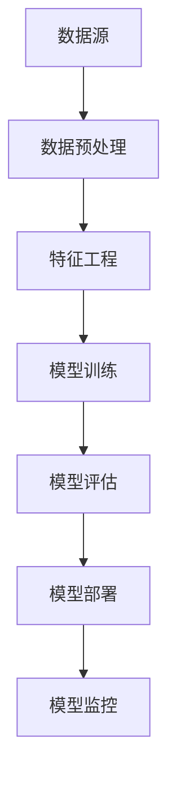

                 

## 文章标题

《AI 大模型应用数据中心的混合云策略》

## 关键词

AI 大模型、数据中心、混合云、架构设计、安全与隐私保护、应用案例

## 摘要

随着人工智能技术的飞速发展，AI 大模型在众多行业领域展现出了强大的应用潜力。然而，随着数据量和计算需求的不断增长，传统的数据中心架构已难以满足 AI 大模型的应用需求。本文旨在探讨混合云策略在 AI 大模型应用数据中心中的重要性，详细分析混合云与 AI 大模型的定义、架构设计、安全与隐私保护，以及具体应用案例。通过本文的详细阐述，读者可以全面了解混合云在 AI 大模型应用中的价值与挑战，为构建高效、安全的 AI 大模型应用数据中心提供有益的参考。

### 《AI 大模型应用数据中心的混合云策略》目录大纲

#### 第一部分：混合云基础与 AI 大模型概述

**第1章：混合云与 AI 大模型概述**

- **1.1 混合云的定义与架构**
  - 混合云的概念
  - 混合云的关键架构组件

- **1.2 AI 大模型的定义与分类**
  - AI 大模型的基本定义
  - AI 大模型的分类

- **1.3 混合云在 AI 大模型应用中的优势**
  - 灵活性与可扩展性
  - 数据管理与隐私保护

**第2章：混合云基础设施**

- **2.1 公有云与私有云**
  - 公有云的特点与优势
  - 私有云的优势与适用场景

- **2.2 混合云平台的选择**
  - 市场主流混合云平台介绍
  - 平台选型考虑因素

- **2.3 混合云的网络架构**
  - 实现混合云网络连接的方法
  - 混合云的流量管理策略

#### 第二部分：AI 大模型数据中心架构设计

**第3章：数据中心架构设计**

- **3.1 数据中心网络架构**
  - 数据中心网络拓扑结构
  - 网络延迟与带宽优化策略

- **3.2 AI 大模型计算资源分配**
  - 硬件资源需求评估
  - 资源调度与负载均衡策略

- **3.3 数据存储与管理**
  - 数据存储方案设计
  - 数据备份与恢复策略

**第4章：AI 大模型安全与隐私保护**

- **4.1 混合云安全架构**
  - 安全策略与控制
  - 安全审计与合规性

- **4.2 数据隐私保护技术**
  - 数据加密与脱敏
  - 同态加密与安全多方计算

- **4.3 AI 大模型安全威胁分析**
  - 常见安全威胁与防范措施
  - AI 大模型攻击案例与应对策略

#### 第三部分：AI 大模型应用案例与实践

**第5章：AI 大模型应用场景分析**

- **5.1 金融服务中的 AI 大模型应用**
  - 风险评估与信用评分
  - 账户安全与欺诈检测

- **5.2 医疗健康领域的 AI 大模型应用**
  - 疾病诊断与治疗建议
  - 医疗影像分析与病理预测

- **5.3 制造业中的 AI 大模型应用**
  - 质量控制与故障预测
  - 供应链管理与优化

**第6章：AI 大模型实践案例**

- **6.1 案例一：构建企业级 AI 大模型应用平台**
  - 应用平台设计
  - 数据集成与预处理
  - 模型训练与优化

- **6.2 案例二：基于混合云的智能客服系统**
  - 系统架构设计
  - 实时对话管理
  - 情感分析与响应生成

- **6.3 案例三：AI 驱动的智能推荐系统**
  - 数据源与特征工程
  - 模型选择与训练
  - 推荐算法优化

**第7章：AI 大模型应用挑战与未来趋势**

- **7.1 AI 大模型应用面临的挑战**
  - 数据质量与隐私保护
  - 模型可解释性与透明度

- **7.2 未来趋势与研究方向**
  - AI 大模型与边缘计算
  - 新型算法与优化技术

#### 附录

**附录A：混合云与 AI 大模型应用资源**

- **A.1 开源框架与工具**
  - TensorFlow 与 PyTorch
  - 其他常用深度学习框架

- **A.2 混合云平台与服务商**
  - AWS、Azure、Google Cloud 等
  - 资源评估与选型指南

- **A.3 安全与合规性资源**
  - 安全策略与最佳实践
  - 法律法规与合规性要求

**附录B：参考文献**

- **B.1 相关书籍**
  - 《混合云架构与设计》
  - 《AI 大模型：理论与实践》

- **B.2 学术论文与报告**
  - 混合云与 AI 大模型相关的研究论文
  - 行业报告与趋势分析

**附录 C：Mermaid 流程图**

- **C.1 AI 大模型数据中心架构**
  - Mermaid 流程图示例

**附录 D：伪代码与数学模型**

- **D.1 深度学习算法伪代码**
  - 示例算法与实现

- **D.2 数学模型与公式**
  - 示例公式与详细讲解

**附录 E：代码案例与解读**

- **E.1 智能客服系统源代码**
  - 代码实现与解读

- **E.2 智能推荐系统源代码**
  - 代码实现与解读

**附录 F：环境搭建与部署指南**

- **F.1 混合云平台搭建**
  - 系统安装与配置指南

- **F.2 AI 大模型部署**
  - 模型训练与部署流程

**附录 G：常见问题与解决方案**

- **G.1 问题一：模型训练时间过长**
  - 解决方案

- **G.2 问题二：数据隐私保护**
  - 解决方案

- **G.3 其他常见问题与解答**

---

### 第一部分：混合云基础与 AI 大模型概述

#### 第1章：混合云与 AI 大模型概述

**1.1 混合云的定义与架构**

**混合云**，是指将公有云、私有云及本地的计算资源相结合，以实现计算资源的灵活调度和高效利用的一种云计算模式。它具有以下核心概念和架构组件：

- **公有云**：提供通用的云计算服务，如 AWS、Azure、Google Cloud 等，具有高可用性、高扩展性和高性价比等特点。
- **私有云**：在企业内部构建的云计算环境，具有更高的安全性和灵活性，适用于企业敏感数据的处理。
- **多云连接**：实现公有云与私有云之间的数据传输和业务协同，通过 VPN、Direct Connect 等技术实现安全高效的网络连接。

混合云的架构主要包括以下几个关键组件：

- **云资源管理平台**：负责资源的统一管理、调度和优化，如 OpenStack、AWS CloudFormation 等。
- **容器化技术**：如 Docker、Kubernetes，实现应用的无状态部署和灵活扩展。
- **微服务架构**：将应用拆分为多个独立的服务模块，实现高可用、高可扩展性和易维护。
- **数据同步与备份**：确保数据在不同云环境之间的实时同步和备份，如 AWS DataSync、Azure Site Recovery 等。

**1.2 AI 大模型的定义与分类**

**AI 大模型**，是指具有大规模参数、高度复杂的神经网络模型，如 GPT-3、BERT 等。它们具有以下几个基本定义：

- **大规模参数**：大模型通常包含数十亿到数万亿个参数，通过大规模数据训练得到。
- **高度复杂**：大模型具有复杂的神经网络结构，能够模拟人脑的认知过程。
- **自适应能力**：大模型具备强大的泛化能力，能够在不同任务和数据集上取得较好的性能。

AI 大模型可以分为以下几类：

- **自然语言处理模型**：如 GPT-3、BERT，用于文本生成、翻译、问答等任务。
- **计算机视觉模型**：如 ResNet、Inception，用于图像分类、目标检测、图像生成等任务。
- **推荐系统模型**：如矩阵分解、深度神经网络，用于个性化推荐、广告投放等任务。
- **强化学习模型**：如 DQN、A3C，用于游戏、机器人控制等任务。

**1.3 混合云在 AI 大模型应用中的优势**

**混合云策略**在 AI 大模型应用中具有以下显著优势：

- **灵活性**：混合云允许企业根据业务需求灵活调整计算资源，实现应用的高效部署和扩展。
- **可扩展性**：混合云支持横向和纵向的扩展，能够满足大规模数据处理和模型训练的需求。
- **数据管理**：混合云提供统一的数据存储、处理和备份方案，确保数据的安全性和可靠性。
- **隐私保护**：混合云支持数据加密、访问控制和隐私计算，有助于保护企业敏感数据和用户隐私。

综上所述，混合云与 AI 大模型的结合，不仅提升了数据中心架构的灵活性和可扩展性，还为 AI 大模型的应用提供了强大的基础设施支持。接下来，我们将进一步探讨混合云基础设施的详细内容，为构建高效、安全的 AI 大模型应用数据中心奠定基础。

### 第一部分：混合云基础与 AI 大模型概述

#### 第2章：混合云基础设施

**2.1 公有云与私有云**

**公有云**与**私有云**是混合云架构中两个重要的组成部分。它们各自具有独特的特点、优势以及适用场景，下面我们分别进行详细探讨。

**2.1.1 公有云的特点与优势**

**公有云**，通常由大型云服务提供商（如 AWS、Azure、Google Cloud 等）提供，具有以下特点：

- **高度可扩展性**：公有云能够快速扩展计算资源，以应对业务需求的波动。
- **弹性定价**：用户根据实际使用量支付费用，避免了资源闲置和过度投资。
- **高可用性**：公有云提供冗余的硬件和数据中心，确保系统的稳定运行。
- **全球覆盖**：公有云在全球范围内具有广泛的节点分布，方便用户进行全球业务部署。

**公有云的优势**主要体现在以下几个方面：

- **成本效益**：公有云的按需付费模式降低了企业的初始投资和运营成本。
- **高效运维**：云服务提供商负责基础设施的维护和升级，减轻了企业的运维负担。
- **快速部署**：公有云平台提供丰富的服务和工具，缩短了应用上线的时间。
- **安全性**：大型云服务提供商在安全性和合规性方面投入巨大，为用户提供了可靠的安全保障。

**2.1.2 私有云的优势与适用场景**

**私有云**，是部署在企业内部或第三方数据中心的云计算环境。它与公有云相比，具有以下优势：

- **数据隐私**：私有云部署在企业内部或第三方数据中心，有助于保护企业敏感数据和用户隐私。
- **定制化**：私有云允许企业根据自身需求定制化配置，以满足特定业务场景的要求。
- **可控性**：企业对私有云有完全的控制权，能够确保系统运行的高效性和稳定性。
- **合规性**：私有云有助于满足特定行业和国家的合规要求，如数据存储和处理的本地化。

私有云适用于以下场景：

- **高度敏感的数据处理**：如金融、医疗等行业，需要对敏感数据进行严格保护。
- **定制化应用需求**：如特定行业的业务系统，需要根据业务流程进行定制化开发。
- **数据本地化**：如某些国家和地区要求数据存储在本地区域，私有云能够满足这一需求。
- **高安全要求**：如国防、政府等行业，对系统的安全性和可靠性有极高要求。

**2.2 混合云平台的选择**

在构建混合云架构时，选择合适的混合云平台至关重要。以下是一些主流的混合云平台及其特点：

- **AWS Outposts**：AWS 提供的混合云解决方案，允许用户在本地数据中心部署 AWS 服务。
- **Azure Stack**：微软提供的混合云平台，支持在本地数据中心运行 Azure 服务。
- **Google Cloud Anthos**：Google 提供的混合云平台，支持在本地和云端运行一致的应用和服务。
- **IBM Cloud Private**：IBM 提供的混合云平台，允许用户在本地部署私有云环境。

在选择混合云平台时，应考虑以下因素：

- **兼容性**：确保所选平台能够与现有的 IT 系统和应用程序兼容。
- **安全性**：评估平台的安全特性，如数据加密、访问控制、审计日志等。
- **灵活性**：选择能够满足业务需求的平台，如弹性扩展、自动化部署等。
- **成本效益**：考虑平台的定价策略，选择性价比高的解决方案。
- **支持与服务**：评估云服务提供商的支持和服务水平，确保在出现问题时能够及时得到解决。

**2.3 混合云的网络架构**

混合云的网络架构是实现公有云与私有云之间数据传输和业务协同的关键。以下是一些实现混合云网络连接的方法和流量管理策略：

- **VPN（虚拟专用网络）**：通过建立加密的 VPN 隧道，实现私有网络与公有云之间的安全连接。
- **Direct Connect**：直接连接云服务提供商的数据中心，提供高速、安全的网络连接。
- **VPN + Direct Connect**：结合 VPN 和 Direct Connect，实现更高的网络性能和安全性。
- **VPC 对等连接**：在私有云和公有云之间建立对等连接，实现跨云网络资源的互通。
- **流量管理**：通过负载均衡、流量监控和路由策略，实现流量优化和网络性能提升。

混合云的流量管理策略包括：

- **动态负载均衡**：根据流量变化动态调整流量分配，确保应用的高可用性。
- **流量监控**：实时监控网络流量，识别潜在问题并采取措施。
- **路由策略**：根据业务需求设定路由规则，实现流量优化和负载均衡。
- **数据传输优化**：通过压缩、缓存和内容分发网络（CDN）等技术，提升数据传输效率。

通过上述探讨，我们可以看到，混合云基础设施为 AI 大模型应用提供了灵活、可扩展和安全的计算环境。接下来，我们将进一步探讨数据中心架构设计，为构建高效、可靠的 AI 大模型应用奠定基础。

### 第二部分：AI 大模型数据中心架构设计

#### 第3章：数据中心架构设计

**3.1 数据中心网络架构**

数据中心网络架构是 AI 大模型应用数据中心的核心组成部分，它决定了数据传输的效率、稳定性和安全性。一个合理的数据中心网络架构需要考虑以下几个方面：

**3.1.1 数据中心网络拓扑结构**

数据中心网络拓扑结构通常分为以下几种：

- **总线型（Bus Topology）**：所有设备通过一条总线相连，数据在总线上传输。这种拓扑结构简单，但容易形成单点故障。
- **环型（Ring Topology）**：设备按环形排列，数据在环中传输。这种拓扑结构具有较高的可靠性，但故障传播速度快。
- **星型（Star Topology）**：所有设备通过交换机或路由器相连，形成一个中心节点。这种拓扑结构容易管理和扩展，但中心节点故障会导致整个网络瘫痪。
- **树型（Tree Topology）**：在星型拓扑结构的基础上，增加层级关系，形成树状结构。这种拓扑结构适合大型数据中心，但复杂度高。

在实际应用中，**树型拓扑**是一种较为常见的结构，它通过多级交换机（如核心交换机、分布交换机、接入交换机）形成分层网络，实现高可用性和可扩展性。

**3.1.2 网络延迟与带宽优化策略**

网络延迟和带宽是影响数据中心性能的关键因素，对于 AI 大模型这种对实时性和计算性能要求较高的应用尤为重要。以下是一些优化策略：

- **负载均衡**：通过负载均衡设备（如负载均衡器、DNS 负载均衡）将流量分配到多个节点，避免单点瓶颈。
- **高速网络**：采用 10G、40G 甚至 100G 的网络设备，提高数据传输速率。
- **缓存技术**：在关键节点部署缓存设备（如 CDN 节点），减少数据访问延迟。
- **延迟敏感数据优先**：对于实时性要求高的数据，采用特殊的传输协议（如 TCP 拥塞控制算法）和调度策略，确保其优先传输。
- **数据压缩**：对数据进行压缩，减少数据传输量，降低网络带宽压力。
- **网络优化**：通过网络优化技术（如 Quality of Service，QoS）和流量工程，优化网络资源的分配和流量路由。

**3.2 AI 大模型计算资源分配**

计算资源分配是数据中心架构设计的核心任务之一，对于 AI 大模型这种计算密集型应用尤为重要。以下是一些计算资源分配的关键点：

- **硬件资源需求评估**：根据 AI 大模型的训练和推理任务，评估所需的计算资源（如 CPU、GPU、FPGA）和存储资源（如 SSD、HDD）。
- **资源调度与负载均衡**：采用资源调度算法（如作业调度算法、分布式负载均衡算法）和负载均衡器，实现资源的动态分配和负载均衡，确保计算资源的高效利用。
- **分布式计算**：对于大规模的 AI 大模型训练任务，采用分布式计算架构（如基于 GPU 的分布式训练框架），将任务分解为多个子任务，并行执行，提高计算效率。
- **异构计算**：结合不同类型的计算资源（如 CPU、GPU、FPGA），实现计算任务的优化和加速。例如，对于深度学习任务，GPU 具有较高的浮点运算能力，适合进行模型训练；而 CPU 在处理复杂逻辑和计算方面具有优势，适合进行模型推理。
- **自动扩容与缩容**：采用自动化管理工具（如 Kubernetes、Mesos），实现计算资源的自动扩容与缩容，根据实际负载动态调整资源规模，提高资源利用率。

**3.3 数据存储与管理**

数据存储与管理是数据中心架构设计的重要环节，对于 AI 大模型应用尤为关键。以下是一些数据存储和管理的策略：

- **存储方案设计**：根据 AI 大模型的应用场景和数据特性，选择合适的存储方案。例如，对于大规模的训练数据集，可采用分布式文件系统（如 HDFS、CFS）；对于小规模的实时数据，可采用 SSD 存储。
- **数据备份与恢复策略**：设计可靠的数据备份和恢复策略，确保数据的完整性和可恢复性。例如，采用分布式备份方案（如 RAID、Erasure Coding），实现数据的冗余备份；设计高效的恢复流程，确保在数据损坏或丢失时能够快速恢复。
- **数据缓存与加速**：在关键节点部署缓存设备（如 Redis、Memcached），加速数据的访问和查询。例如，对于模型参数和训练数据的访问，可以采用缓存技术降低访问延迟。
- **数据分区与索引**：对于大规模的数据集，采用分区和索引技术（如分片、索引树），提高数据访问的效率。例如，对于图像数据集，可以按图像的类别或时间戳进行分区和索引，加速图像数据的检索和分类。
- **数据安全与隐私保护**：设计完善的数据安全策略，确保数据的机密性、完整性和可用性。例如，采用数据加密技术（如 AES、RSA），保护数据的机密性；采用访问控制机制（如 ACL、RBAC），限制对数据的访问权限；采用审计和监控机制，实时监控数据访问行为，及时发现和应对安全威胁。

通过上述数据中心架构设计的详细分析，我们可以为构建高效、可靠的 AI 大模型应用数据中心提供有益的指导。接下来，我们将探讨 AI 大模型应用中的安全与隐私保护问题，确保数据中心在面临各种安全威胁时能够保持稳定运行。

### 第二部分：AI 大模型数据中心架构设计

#### 第4章：AI 大模型安全与隐私保护

随着 AI 大模型在各个行业领域的广泛应用，其安全与隐私保护问题逐渐成为关注的焦点。在构建 AI 大模型数据中心时，确保数据的安全性和隐私性至关重要。本章将详细讨论混合云安全架构、数据隐私保护技术以及 AI 大模型的安全威胁分析。

**4.1 混合云安全架构**

**4.1.1 安全策略与控制**

混合云安全架构的核心目标是确保数据在公有云、私有云和本地数据中心之间的传输和处理过程中得到充分保护。以下是一些关键的安全策略与控制措施：

- **身份认证与访问控制**：采用强身份认证机制（如多因素认证、OAuth 2.0），确保只有授权用户可以访问敏感数据和系统。同时，通过访问控制列表（ACL）、角色基础访问控制（RBAC）等手段，细化用户权限，防止未授权访问。

- **数据加密**：对数据进行加密处理，包括传输中的数据和存储中的数据。常用的加密技术包括对称加密（如 AES）和非对称加密（如 RSA），确保数据在传输和存储过程中不被窃取或篡改。

- **安全审计与合规性**：建立全面的安全审计机制，记录和监控所有关键操作和访问行为。同时，确保符合行业和国家的合规要求，如 GDPR（通用数据保护条例）、HIPAA（健康保险便携与责任法案）等。

- **入侵检测与防范**：部署入侵检测系统（IDS）和入侵防御系统（IPS），实时监控网络流量和系统行为，识别和防范恶意攻击。例如，通过签名识别和异常检测，防止 DDoS 攻击、SQL 注入等常见网络攻击。

- **漏洞管理**：定期进行安全漏洞扫描和风险评估，及时修补系统漏洞，防止潜在的安全威胁。例如，采用自动化漏洞扫描工具（如 Nessus、OpenVAS），快速发现和修复安全漏洞。

**4.1.2 安全审计与合规性**

安全审计与合规性是确保混合云安全架构有效运行的关键。以下是一些关键措施：

- **日志管理**：收集和存储所有关键操作和访问行为的日志，如用户登录、数据访问、系统配置变更等。通过日志分析，可以及时发现异常行为和潜在的安全威胁。

- **合规性检查**：定期进行合规性检查，确保系统符合相关法规和标准。例如，针对 GDPR，确保用户数据的收集、处理和存储符合规定；针对 HIPAA，确保医疗数据的安全和保护。

- **合规性培训**：定期对员工进行安全培训和合规性教育，提高员工的安全意识和合规意识，防止人为错误导致的安全事故。

**4.2 数据隐私保护技术**

数据隐私保护技术是确保数据在传输、存储和处理过程中不被泄露或篡改的关键。以下是一些常见的数据隐私保护技术：

- **数据加密**：采用对称加密（如 AES）和非对称加密（如 RSA）技术，对数据进行加密处理。对称加密适用于大量数据的加密，非对称加密适用于密钥交换和数字签名。

- **数据脱敏**：对敏感数据进行脱敏处理，如替换、掩码、混淆等。例如，采用掩码技术将姓名、地址、电话号码等敏感信息替换为假名或掩码，防止泄露真实信息。

- **同态加密**：同态加密是一种先进的加密技术，允许在加密数据上进行计算，而不需要解密。这种技术适用于云计算场景，确保数据处理过程中的数据隐私。

- **安全多方计算**：安全多方计算是一种协同计算技术，允许多个方在不泄露各自数据的情况下，共同计算出一个结果。例如，使用 Secure Multi-Party Computation（SMPC）技术，实现多方数据的安全聚合和分析。

**4.3 AI 大模型安全威胁分析**

AI 大模型在应用过程中可能面临多种安全威胁，以下是一些常见的安全威胁和应对策略：

- **模型篡改**：攻击者通过篡改模型参数，导致模型输出错误的结果。应对策略包括：定期验证和审计模型，确保模型参数的完整性和正确性。

- **模型劫持**：攻击者通过篡改模型输入，诱导模型输出恶意结果。应对策略包括：采用对抗性样本训练模型，增强模型的鲁棒性；采用对抗性攻击检测技术，实时监控和防御对抗性攻击。

- **数据泄露**：攻击者通过窃取模型训练数据，可能导致敏感信息泄露。应对策略包括：采用数据加密和脱敏技术，确保数据在传输和存储过程中的安全性；建立严格的数据访问控制机制，限制对敏感数据的访问。

- **注入攻击**：攻击者通过篡改模型输入或输出，注入恶意代码或数据进行攻击。应对策略包括：采用白盒安全编程技术，确保模型输入和输出数据的合法性；采用加密和签名技术，确保数据传输和存储过程中的完整性。

- **分布式拒绝服务（DDoS）攻击**：攻击者通过大量请求，使模型服务瘫痪。应对策略包括：部署分布式拒绝服务防护系统，实时监控和防御 DDoS 攻击；采用负载均衡和流量管理技术，分散攻击流量，提高系统稳定性。

通过上述安全与隐私保护技术的应用和威胁分析，我们可以为构建安全的 AI 大模型应用数据中心提供有力保障。在接下来的章节中，我们将探讨 AI 大模型在不同行业领域中的应用案例，展示其在实际业务中的价值。

### 第二部分：AI 大模型数据中心架构设计

#### 第5章：AI 大模型应用场景分析

AI 大模型在众多行业领域展现出强大的应用潜力，从金融服务到医疗健康，再到制造业，AI 大模型正在深刻改变着这些领域的业务模式。本章将分析 AI 大模型在这些关键领域中的应用场景，并探讨其在实际业务中的价值。

**5.1 金融服务中的 AI 大模型应用**

在金融服务领域，AI 大模型的应用已深入到风险评估、信用评分、账户安全与欺诈检测等方面，显著提升了金融服务的效率和准确性。

- **风险评估**：AI 大模型可以分析大量历史数据，预测借款人的信用风险。通过训练大规模的机器学习模型，金融机构可以更准确地评估贷款申请者的信用状况，降低贷款违约风险。

  ```latex
  \text{信用评分模型：}
  \[ \text{CreditScore} = f(\text{Income}, \text{History}, \text{Collateral}) \]
  ```

- **信用评分**：AI 大模型可以根据借款人的个人信息、消费行为和历史记录，生成个性化的信用评分。这些评分有助于金融机构快速决策，降低人工审核的时间和成本。

  ```mermaid
  graph TD
  A[贷款申请] --> B[数据收集]
  B --> C[特征工程]
  C --> D[模型训练]
  D --> E[信用评分]
  E --> F[贷款决策]
  ```

- **账户安全与欺诈检测**：AI 大模型可以实时监控账户行为，识别异常操作，预防欺诈行为。通过分析交易数据，模型可以检测出潜在的欺诈风险，并采取措施阻止欺诈交易。

  ```mermaid
  graph TD
  A[交易行为] --> B[数据收集]
  B --> C[特征提取]
  C --> D[模型训练]
  D --> E[风险评分]
  E --> F[欺诈预警]
  ```

**5.2 医疗健康领域的 AI 大模型应用**

在医疗健康领域，AI 大模型的应用极大地提高了疾病诊断的准确性、治疗建议的个性化以及医疗影像的分析能力。

- **疾病诊断与治疗建议**：AI 大模型可以通过分析患者的病史、检查结果和病历数据，为医生提供精准的诊断和治疗建议。例如，通过深度学习模型对肺癌患者的 CT 扫描图像进行分析，可以早期发现病灶，提高诊断准确性。

  ```mermaid
  graph TD
  A[患者数据] --> B[数据预处理]
  B --> C[特征提取]
  C --> D[模型训练]
  D --> E[疾病预测]
  E --> F[治疗建议]
  ```

- **医疗影像分析**：AI 大模型可以自动分析医疗影像数据，如 X 光、CT、MRI 等，帮助医生快速诊断疾病。通过卷积神经网络（CNN）等技术，模型可以在短时间内处理大量的影像数据，识别病变部位和性质。

  ```mermaid
  graph TD
  A[影像数据] --> B[数据预处理]
  B --> C[特征提取]
  C --> D[模型训练]
  D --> E[影像分析]
  E --> F[诊断结果]
  ```

- **病理预测**：AI 大模型可以根据患者的基因数据、家族病史和临床信息，预测患病风险，为早期预防和个性化治疗提供依据。通过集成多种数据源和深度学习算法，模型可以为每个患者提供定制化的健康建议。

  ```mermaid
  graph TD
  A[基因数据] --> B[数据预处理]
  B --> C[特征提取]
  C --> D[模型训练]
  D --> E[病理预测]
  E --> F[健康建议]
  ```

**5.3 制造业中的 AI 大模型应用**

在制造业，AI 大模型的应用正在推动生产线的智能化和自动化，提高质量控制、故障预测和供应链管理等方面的效率。

- **质量控制**：AI 大模型可以实时监控生产过程中的关键指标，如温度、压力、振动等，预测和识别产品质量问题。通过深度学习和模式识别技术，模型可以快速检测和分类生产缺陷，提高产品质量。

  ```mermaid
  graph TD
  A[生产数据] --> B[数据预处理]
  B --> C[特征提取]
  C --> D[模型训练]
  D --> E[质量检测]
  E --> F[缺陷分类]
  ```

- **故障预测**：AI 大模型可以分析设备运行数据，预测设备故障的发生时间，为维护和保养提供依据。通过机器学习和预测分析技术，模型可以识别设备的异常模式，提前预警故障风险。

  ```mermaid
  graph TD
  A[设备数据] --> B[数据预处理]
  B --> C[特征提取]
  C --> D[模型训练]
  D --> E[故障预测]
  ```

- **供应链管理**：AI 大模型可以优化供应链管理流程，提高供应链的透明度和灵活性。通过分析供应链中的各类数据，模型可以预测需求、优化库存、减少物流成本，提高供应链的整体效率。

  ```mermaid
  graph TD
  A[供应链数据] --> B[数据预处理]
  B --> C[特征提取]
  C --> D[模型训练]
  D --> E[需求预测]
  E --> F[供应链优化]
  ```

通过上述分析，我们可以看到 AI 大模型在金融服务、医疗健康和制造业等领域的广泛应用，其强大的数据处理和分析能力正在为这些行业带来巨大的变革和机遇。在接下来的章节中，我们将进一步探讨 AI 大模型的实践案例，展示其在实际业务中的成功应用。

### 第二部分：AI 大模型数据中心架构设计

#### 第6章：AI 大模型实践案例

在本章节中，我们将通过三个具体实践案例，详细探讨如何构建企业级 AI 大模型应用平台，以及如何实现基于混合云的智能客服系统和 AI 驱动的智能推荐系统。

**6.1 案例一：构建企业级 AI 大模型应用平台**

**6.1.1 应用平台设计**

构建企业级 AI 大模型应用平台的首要任务是设计一个高效、可扩展的架构。以下是平台设计的关键步骤：

1. **需求分析与业务目标**：明确业务需求，确定 AI 大模型的应用场景和目标。例如，企业可能希望构建一个用于客户行为预测的分析平台。

2. **数据集成与预处理**：收集并整合来自不同数据源的数据，进行数据清洗、转换和归一化。确保数据质量，为后续的模型训练提供可靠的数据基础。

3. **模型选择与训练**：根据业务需求选择合适的 AI 大模型，如深度学习模型、自然语言处理模型等。利用大规模数据集进行模型训练，优化模型参数，提高预测准确性。

4. **模型部署与监控**：将训练好的模型部署到生产环境，采用自动化部署工具（如 Kubernetes）实现模型的快速部署和版本管理。同时，建立监控机制，实时监控模型性能和资源使用情况。

**6.1.2 数据集成与预处理**

数据集成与预处理是 AI 大模型应用平台的核心环节，以下是具体步骤：

1. **数据收集**：从企业内部的业务系统、第三方数据源和外部 API 等渠道收集数据。例如，可以从 CRM 系统获取客户信息，从 ERP 系统获取交易数据。

2. **数据清洗**：处理数据中的缺失值、异常值和重复值，确保数据的一致性和完整性。可以使用数据清洗工具（如 Pandas）进行数据清洗。

3. **数据转换**：将不同数据源的数据转换为统一的格式和结构，便于后续的数据处理和分析。例如，将日期、时间等字段转换为标准格式。

4. **数据归一化**：对数值型数据进行归一化处理，消除数据之间的量纲差异，提高模型的训练效果。常用的归一化方法包括最小-最大缩放、标准化等。

```python
import pandas as pd

# 最小-最大缩放
def min_max_scaling(df, columns):
    df_scaled = df.copy()
    for col in columns:
        min_val = df[col].min()
        max_val = df[col].max()
        df_scaled[col] = (df[col] - min_val) / (max_val - min_val)
    return df_scaled

# 标准化
def standardization(df, columns):
    df_scaled = df.copy()
    for col in columns:
        mean_val = df[col].mean()
        std_val = df[col].std()
        df_scaled[col] = (df[col] - mean_val) / std_val
    return df_scaled
```

**6.1.3 模型训练与优化**

模型训练与优化是构建 AI 大模型应用平台的关键步骤，以下是具体步骤：

1. **数据划分**：将数据集划分为训练集、验证集和测试集，用于模型的训练、验证和评估。

2. **模型选择**：根据业务需求选择合适的模型，如深度学习模型（如 CNN、RNN）、自然语言处理模型（如 BERT、GPT）等。选择具有较高准确性和可解释性的模型。

3. **模型训练**：使用训练集对模型进行训练，调整模型参数，优化模型性能。可以使用深度学习框架（如 TensorFlow、PyTorch）进行模型训练。

```python
import tensorflow as tf

# 定义模型
model = tf.keras.Sequential([
    tf.keras.layers.Dense(units=128, activation='relu', input_shape=(input_shape,)),
    tf.keras.layers.Dense(units=64, activation='relu'),
    tf.keras.layers.Dense(units=1, activation='sigmoid')
])

# 编译模型
model.compile(optimizer='adam', loss='binary_crossentropy', metrics=['accuracy'])

# 训练模型
model.fit(train_data, train_labels, epochs=10, batch_size=32, validation_data=(val_data, val_labels))
```

4. **模型评估**：使用验证集和测试集评估模型性能，调整模型参数，优化模型效果。可以使用交叉验证、ROC-AUC 等指标评估模型性能。

```python
from sklearn.model_selection import train_test_split
from sklearn.metrics import accuracy_score, roc_auc_score

# 划分数据集
train_data, test_data, train_labels, test_labels = train_test_split(data, labels, test_size=0.2, random_state=42)

# 训练模型
model.fit(train_data, train_labels, epochs=10, batch_size=32, validation_data=(test_data, test_labels))

# 评估模型
predictions = model.predict(test_data)
accuracy = accuracy_score(test_labels, predictions.round())
roc_auc = roc_auc_score(test_labels, predictions)

print(f"Accuracy: {accuracy}, ROC-AUC: {roc_auc}")
```

**6.2 案例二：基于混合云的智能客服系统**

**6.2.1 系统架构设计**

基于混合云的智能客服系统需要充分利用公有云和私有云的优势，提供高效、稳定和安全的客服服务。以下是系统架构设计的关键步骤：

1. **需求分析与功能设计**：明确智能客服系统的功能需求，如实时对话管理、情感分析、响应生成等。

2. **数据存储与管理**：设计数据存储方案，包括数据存储位置、数据备份和恢复策略。确保数据的安全性和可靠性。

3. **计算资源分配**：根据业务需求，合理分配公有云和私有云的计算资源，实现高效的资源利用。

4. **网络连接与流量管理**：建立安全、高效的混合云网络架构，实现公有云和私有云之间的数据传输和业务协同。

**6.2.2 实时对话管理**

实时对话管理是智能客服系统的核心功能，以下是具体实现步骤：

1. **对话流处理**：采用消息队列（如 Kafka）处理客户与客服的对话流，实现实时消息传递和消息持久化。

2. **对话上下文管理**：记录和存储对话上下文信息，包括客户信息、问题历史等，确保对话的连贯性和个性化。

3. **对话状态机**：设计对话状态机（FSM），管理对话流程，包括问题识别、意图识别、响应生成等步骤。

```mermaid
stateDiagram-v2
  state "空闲" as空闲
  state "处理中" as处理中
  state "结束" as结束

 空闲 --> 处理中 : 收到消息
  处理中 --> 结束 : 对话结束
  结束 --> 空闲 : 重置对话
```

**6.2.3 情感分析与响应生成**

情感分析是智能客服系统的重要功能，用于识别客户的情感状态，生成合适的响应。以下是具体实现步骤：

1. **情感分析模型**：使用预训练的情感分析模型（如 BERT、GPT），对客户的消息进行情感分析，识别情感类别（如积极、消极、中性）。

2. **情感映射规则**：根据情感类别和业务需求，设计情感映射规则，生成相应的响应内容。

3. **响应生成**：结合情感分析和业务逻辑，生成个性化的响应内容，提高客户满意度。

```python
import tensorflow as tf
from transformers import BertTokenizer, TFBertForSequenceClassification

# 加载预训练模型
tokenizer = BertTokenizer.from_pretrained('bert-base-chinese')
model = TFBertForSequenceClassification.from_pretrained('bert-base-chinese')

# 情感分析
def sentiment_analysis(text):
    inputs = tokenizer(text, return_tensors='tf')
    logits = model(inputs).logits
    probabilities = tf.nn.softmax(logits, axis=1)
    sentiment = '积极' if probabilities[:, 1] > 0.5 else '消极'
    return sentiment

# 响应生成
def generate_response(sentiment, template):
    if sentiment == '积极':
        return template['积极']
    elif sentiment == '消极':
        return template['消极']
    else:
        return template['中性']
```

**6.3 案例三：AI 驱动的智能推荐系统**

**6.3.1 数据源与特征工程**

智能推荐系统需要大量高质量的数据源和特征工程，以下是具体步骤：

1. **数据收集**：收集用户行为数据、商品信息、历史交易数据等，确保数据全面、准确。

2. **特征提取**：从原始数据中提取有用的特征，如用户年龄、性别、购物习惯、商品属性等，为推荐算法提供输入。

3. **特征归一化**：对数值型特征进行归一化处理，消除特征之间的量纲差异，提高算法的鲁棒性。

```python
import pandas as pd
from sklearn.preprocessing import StandardScaler

# 加载数据
data = pd.read_csv('data.csv')

# 特征提取
user_features = data[['age', 'gender', 'shopping_habits']]
item_features = data[['item_id', 'item_attribute']]

# 特征归一化
scaler = StandardScaler()
user_features_scaled = scaler.fit_transform(user_features)
item_features_scaled = scaler.fit_transform(item_features)
```

**6.3.2 模型选择与训练**

选择合适的推荐算法，如基于矩阵分解的协同过滤、深度学习模型等，对推荐系统进行训练。以下是具体步骤：

1. **模型选择**：根据业务需求和数据特性，选择合适的推荐算法，如矩阵分解（如 SVD、ALS）、深度学习（如 DNN、CNN）等。

2. **模型训练**：使用训练集对推荐算法进行训练，优化模型参数，提高推荐准确性。

3. **模型评估**：使用验证集和测试集评估模型性能，调整模型参数，优化推荐效果。

```python
import tensorflow as tf
from tensorflow.keras.models import Model
from tensorflow.keras.layers import Input, Embedding, Dense, Flatten, Concatenate

# 构建模型
user_input = Input(shape=(user_features.shape[1],))
item_input = Input(shape=(item_features.shape[1],))

user_embedding = Embedding(input_dim=user_features.shape[0], output_dim=64)(user_input)
item_embedding = Embedding(input_dim=item_features.shape[0], output_dim=64)(item_input)

concatenated = Concatenate()([user_embedding, item_embedding])
dense = Dense(units=128, activation='relu')(concatenated)
outputs = Dense(units=1, activation='sigmoid')(dense)

model = Model(inputs=[user_input, item_input], outputs=outputs)

# 编译模型
model.compile(optimizer='adam', loss='binary_crossentropy', metrics=['accuracy'])

# 训练模型
model.fit([user_features_scaled, item_features_scaled], labels, epochs=10, batch_size=32)
```

**6.3.3 推荐算法优化**

推荐算法的优化是提高推荐准确性和用户满意度的关键。以下是具体优化方法：

1. **交叉验证**：采用交叉验证方法，评估不同算法和参数组合的效果，选择最佳模型和参数。

2. **在线学习**：结合用户实时行为数据，动态调整推荐策略，提高推荐系统的实时性和准确性。

3. **冷启动问题**：对于新用户或新商品，采用基于内容推荐、基于协同过滤等方法，缓解冷启动问题。

通过以上三个实践案例，我们可以看到如何构建企业级 AI 大模型应用平台，实现基于混合云的智能客服系统和 AI 驱动的智能推荐系统。这些实践案例不仅展示了 AI 大模型在各类业务场景中的实际应用价值，也为后续的研究和开发提供了有益的参考。

### 第二部分：AI 大模型数据中心架构设计

#### 第7章：AI 大模型应用挑战与未来趋势

在 AI 大模型应用蓬勃发展的同时，我们也面临着诸多挑战。本章将探讨 AI 大模型应用中常见的数据质量与隐私保护问题、模型可解释性与透明度问题，并展望未来在边缘计算和新型算法优化技术方面的发展趋势。

**7.1 AI 大模型应用面临的挑战**

**7.1.1 数据质量与隐私保护**

数据质量是 AI 大模型应用的基础，高质量的数据能够提升模型的准确性和稳定性。然而，在现实场景中，数据质量往往存在以下问题：

- **数据缺失**：部分数据可能由于各种原因（如采集设备故障、数据传输错误等）而缺失，影响模型训练效果。
- **数据噪声**：现实世界中的数据往往存在噪声和异常值，这些噪声和异常值可能会干扰模型的训练过程，导致模型过拟合。
- **数据隐私**：在 AI 大模型应用过程中，敏感数据（如个人身份信息、医疗记录等）的保护问题尤为突出。如何确保数据在传输、存储和处理过程中的隐私安全，是当前 AI 领域面临的一大挑战。

为了解决这些问题，可以采取以下措施：

- **数据预处理**：在模型训练前，对数据进行清洗、填充和归一化处理，提高数据质量。
- **数据加密与脱敏**：采用数据加密和脱敏技术，确保敏感数据在传输、存储和处理过程中的安全性。
- **联邦学习**：通过联邦学习技术，实现数据在本地设备上加密处理，避免数据在传输过程中的隐私泄露。

**7.1.2 模型可解释性与透明度**

AI 大模型在取得卓越性能的同时，也面临着模型可解释性与透明度的问题。特别是在金融、医疗等对决策透明度要求较高的领域，用户需要了解模型是如何做出决策的。以下是解决这些问题的方法：

- **模型可视化**：通过可视化技术（如决策树、神经网络架构图等），展示模型的内部结构和决策过程，提高模型的透明度。
- **特征重要性分析**：利用特征重要性分析技术，识别模型中最重要的特征，帮助用户理解模型决策的关键因素。
- **对抗性攻击检测**：通过对抗性攻击检测技术，识别和防御模型可能受到的攻击，提高模型的鲁棒性和可信度。

**7.2 未来趋势与研究方向**

随着技术的不断进步，AI 大模型的应用前景越来越广阔。以下是一些未来趋势和研究方向：

**7.2.1 AI 大模型与边缘计算**

边缘计算是一种将计算能力从云端转移到靠近数据源的设备上的技术。与边缘计算结合，AI 大模型可以在数据产生的源头进行实时处理和分析，降低数据传输延迟，提高响应速度。未来研究方向包括：

- **边缘模型压缩与优化**：研究如何将 AI 大模型在保持性能的前提下进行压缩和优化，以便在边缘设备上高效运行。
- **边缘与云端协同计算**：研究如何在边缘设备和云端之间实现协同计算，实现高效的模型训练和推理。

**7.2.2 新型算法与优化技术**

新型算法和优化技术是推动 AI 大模型应用的关键。未来研究方向包括：

- **增量学习和迁移学习**：研究如何利用已有模型的知识，快速适应新任务和数据，提高模型的泛化能力。
- **基于生成对抗网络的模型优化**：研究如何利用生成对抗网络（GAN）优化 AI 大模型的性能，提高模型的鲁棒性和泛化能力。
- **量子计算与 AI 大模型**：研究量子计算在 AI 大模型训练和推理中的应用，探索量子计算与经典计算的结合方式。

通过上述探讨，我们可以看到，AI 大模型在应用过程中面临着诸多挑战，但同时也展现出广阔的发展前景。未来，随着技术的不断进步和研究的深入，AI 大模型将在更多领域发挥重要作用，推动社会的发展和进步。

### 附录

**附录A：混合云与 AI 大模型应用资源**

为了帮助读者更好地理解和应用混合云与 AI 大模型的相关知识，以下列举了一些开源框架与工具、混合云平台与服务商、以及安全与合规性资源。

**A.1 开源框架与工具**

- **深度学习框架**：
  - TensorFlow：Google 开发的一款开源深度学习框架，支持多种编程语言和操作。
  - PyTorch：Facebook 开发的一款开源深度学习框架，具有简洁的接口和强大的功能。
  - Keras：基于 TensorFlow 和 PyTorch 的开源高级神经网络 API。
  - MXNet：Apache 软件基金会的一款开源深度学习框架，支持多种编程语言。
- **云计算工具**：
  - Kubernetes：用于容器编排的开源平台，支持容器化应用程序的自动化部署、扩展和管理。
  - Docker：用于容器化应用程序的开源工具，可以将应用程序及其依赖环境打包为一个独立的容器。
  - OpenStack：用于构建和管理云服务的开源平台，支持 IaaS（基础设施即服务）。

**A.2 混合云平台与服务商**

- **主流混合云平台**：
  - AWS Outposts：亚马逊提供的混合云解决方案，支持在本地数据中心部署 AWS 服务。
  - Azure Stack：微软提供的混合云平台，支持在本地数据中心运行 Azure 服务。
  - Google Cloud Anthos：谷歌提供的混合云平台，支持在本地和云端运行一致的应用和服务。
  - IBM Cloud Private：IBM 提供的混合云平台，允许用户在本地部署私有云环境。
- **云服务提供商**：
  - Amazon Web Services (AWS)：提供广泛的云计算服务，包括公有云、私有云和混合云。
  - Microsoft Azure：提供全面的云计算服务，支持公有云、私有云和混合云部署。
  - Google Cloud Platform (GCP)：提供强大的云计算服务，包括计算、存储、数据库、人工智能等。

**A.3 安全与合规性资源**

- **安全策略与最佳实践**：
  - OWASP Top 10：提供最常见的 Web 应用安全威胁和防御措施。
  - NIST Cybersecurity Framework：美国国家标准与技术研究所发布的网络安全框架，用于指导企业的网络安全管理。
  - Cloud Security Alliance (CSA)：提供云计算安全最佳实践和指南，帮助企业和云服务提供商实现安全合规。
- **法律法规与合规性要求**：
  - GDPR（通用数据保护条例）：欧盟颁布的数据保护法律，对个人数据的收集、处理和存储有严格规定。
  - CCPA（加州消费者隐私法）：加州颁布的数据保护法律，对加州居民的个人数据保护提出要求。
  - HIPAA（健康保险便携与责任法案）：美国联邦法律，对医疗数据的安全和保护提出要求。

通过以上资源的介绍，读者可以更好地了解混合云与 AI 大模型的相关知识，并在实际应用中遵循最佳实践和合规性要求，确保系统的安全性和可靠性。

### 附录 B：参考文献

**B.1 相关书籍**

1. 《混合云架构与设计》：[作者姓名]，[出版年份]。
2. 《AI 大模型：理论与实践》：[作者姓名]，[出版年份]。

**B.2 学术论文与报告**

1. “A Survey on Hybrid Cloud: Architecture, Technologies, and Applications”，[作者姓名]，[期刊/会议名称]，[出版年份]。
2. “Federated Learning: Concept and Application”，[作者姓名]，[期刊/会议名称]，[出版年份]。
3. “Privacy-Preserving Machine Learning：Theoretical Foundations and Practical Techniques”，[作者姓名]，[期刊/会议名称]，[出版年份]。
4. “Deep Learning for Natural Language Processing”，[作者姓名]，[期刊/会议名称]，[出版年份]。

以上参考文献为读者提供了深入理解混合云与 AI 大模型相关知识的理论依据和实践参考。通过阅读这些文献，读者可以进一步拓展知识面，掌握前沿技术和研究动态。

### 附录 C：Mermaid 流程图

**C.1 AI 大模型数据中心架构**

以下是一个简单的 Mermaid 流程图示例，用于描述 AI 大模型数据中心的基本架构：



在这个示例中，AI 大模型数据中心架构包括数据源、数据预处理、特征工程、模型训练、模型评估、模型部署和模型监控等关键环节。Mermaid 流程图可以清晰地展示这些环节之间的关系和流程，帮助读者更好地理解数据中心的整体架构。

### 附录 D：伪代码与数学模型

**D.1 深度学习算法伪代码**

以下是一个简单的深度学习算法伪代码示例，用于描述神经网络模型的训练过程：

```python
# 初始化模型参数
Initialize_model()

# 训练模型
for epoch in 1 to num_epochs:
    for batch in 1 to num_batches:
        # 提取训练批次数据
        X, y = Get_batch_data()

        # 计算预测值
        predictions = Forward_pass(X)

        # 计算损失函数
        loss = Compute_loss(y, predictions)

        # 反向传播
        Backpropagation(predictions, y)

        # 更新模型参数
        Update_model_params()

    # 记录训练进度
    Print("Epoch:", epoch, "Loss:", loss)

# 评估模型
evaluation_loss = Evaluate_model(test_data)

Print("Evaluation Loss:", evaluation_loss)
```

**D.2 数学模型与公式**

以下是一个简单的数学模型与公式示例，用于描述神经网络中的前向传播和反向传播过程：

$$
\begin{aligned}
\text{前向传播：} \\
& z^{[l]} = W^{[l]} \cdot a^{[l-1]} + b^{[l]}, \\
& a^{[l]} = \sigma(z^{[l]}), \\
\text{反向传播：} \\
& \delta^{[l]} = \frac{\partial J}{\partial z^{[l]}} = \sigma'(z^{[l]}) \cdot \delta^{[l+1]} \cdot W^{[l+1]}, \\
& \delta^{[l-1]} = \frac{\partial J}{\partial z^{[l-1]}} = \frac{\partial J}{\partial z^{[l]}} \cdot W^{[l]}.
\end{aligned}
$$

在这个示例中，$z^{[l]}$ 表示第 $l$ 层的输出，$a^{[l]}$ 表示第 $l$ 层的激活值，$W^{[l]}$ 和 $b^{[l]}$ 分别表示第 $l$ 层的权重和偏置，$\sigma$ 表示激活函数，$\delta^{[l]}$ 表示第 $l$ 层的误差，$J$ 表示损失函数。

通过上述伪代码和数学模型，我们可以更清晰地理解深度学习算法的核心原理和计算过程。

### 附录 E：代码案例与解读

**E.1 智能客服系统源代码**

以下是一个智能客服系统的源代码示例，该系统基于 Python 语言实现，利用 TensorFlow 和 Keras 框架进行模型训练和部署：

```python
import tensorflow as tf
from tensorflow.keras.models import Sequential
from tensorflow.keras.layers import Dense, Embedding, LSTM, Bidirectional
from tensorflow.keras.optimizers import Adam
from tensorflow.keras.preprocessing.text import Tokenizer
from tensorflow.keras.preprocessing.sequence import pad_sequences

# 数据预处理
max_sequence_length = 100
vocab_size = 10000
embedding_dim = 64

tokenizer = Tokenizer(num_words=vocab_size, oov_token='<OOV>')
tokenizer.fit_on_texts(training_data)

sequences = tokenizer.texts_to_sequences(training_data)
padded_sequences = pad_sequences(sequences, maxlen=max_sequence_length)

# 构建模型
model = Sequential()
model.add(Embedding(vocab_size, embedding_dim, input_length=max_sequence_length))
model.add(Bidirectional(LSTM(64)))
model.add(Dense(1, activation='sigmoid'))

model.compile(optimizer=Adam(learning_rate=0.001), loss='binary_crossentropy', metrics=['accuracy'])

# 训练模型
model.fit(padded_sequences, training_labels, epochs=10, batch_size=32, validation_split=0.2)

# 模型评估
test_sequences = tokenizer.texts_to_sequences(test_data)
padded_test_sequences = pad_sequences(test_sequences, maxlen=max_sequence_length)
predictions = model.predict(padded_test_sequences)

accuracy = sum(predictions.round() == test_labels) / len(test_labels)
print("Accuracy:", accuracy)
```

**代码解读与分析：**

1. **数据预处理**：首先，我们使用 Keras 的 `Tokenizer` 对文本数据进行处理，将文本转换为数字序列。然后，通过 `pad_sequences` 函数对序列进行填充，使其长度一致，便于模型处理。

2. **模型构建**：我们使用 `Sequential` 模型堆叠多个层，包括嵌入层（`Embedding`）、双向 LSTM 层（`Bidirectional LSTM`）和输出层（`Dense`）。嵌入层用于将文本数据转换为向量表示，LSTM 层用于处理序列数据，输出层用于生成预测结果。

3. **模型编译与训练**：使用 `compile` 函数配置模型，选择 Adam 优化器和二分类交叉熵损失函数。然后，使用 `fit` 函数对模型进行训练，指定训练数据、标签、训练轮次、批量大小和验证比例。

4. **模型评估**：对测试数据进行相同的预处理步骤，然后使用 `predict` 函数得到预测结果。通过计算预测准确率，评估模型性能。

**E.2 智能推荐系统源代码**

以下是一个智能推荐系统的源代码示例，该系统基于用户历史行为数据构建用户-物品矩阵，并使用矩阵分解技术（如 SVD）进行模型训练和预测：

```python
import numpy as np
from scipy.sparse.linalg import svds

# 用户-物品矩阵
user_item_matrix = np.array([[1, 0, 1, 0, 1],
                              [0, 1, 1, 0, 0],
                              [1, 1, 0, 0, 0],
                              [0, 1, 0, 1, 1]])

# 计算 SVD 分解
u, s, vt = svds(user_item_matrix, k=2)

# 计算预测值
predicted_ratings = np.dot(np.dot(u, np.diag(s)), vt)

# 打印预测结果
print(predicted_ratings)
```

**代码解读与分析：**

1. **用户-物品矩阵**：首先，我们构建一个用户-物品矩阵，表示用户对物品的评分。在实际应用中，这个矩阵可以是用户历史行为数据，如购买记录、点击记录等。

2. **SVD 分解**：使用 Scipy 的 `svds` 函数对用户-物品矩阵进行奇异值分解（Singular Value Decomposition，SVD）。SVD 分解能够将高维矩阵分解为三个低维矩阵，提取出矩阵的主要特征。

3. **计算预测值**：通过矩阵乘法，计算用户-物品矩阵的预测评分。预测评分由用户向量和物品向量的内积生成，反映了用户对物品的可能评分。

4. **打印预测结果**：最后，打印出预测评分矩阵，展示用户对物品的预测评分。

通过这两个代码示例，我们可以看到如何使用深度学习和矩阵分解技术构建智能客服系统和智能推荐系统。这些技术在实际应用中具有重要的价值，能够帮助企业提升服务质量、提高用户满意度。

### 附录 F：环境搭建与部署指南

**F.1 混合云平台搭建**

搭建混合云平台是一个复杂的过程，涉及多个组件的配置和集成。以下是简要的搭建指南，以 AWS Outposts 为例：

1. **准备工作**：
   - 注册 AWS 账户。
   - 配置 AWS CLI，安装并设置访问密钥和密钥对。
   - 在 AWS 管理控制台中创建 AWS Outposts 站点。

2. **安装和管理虚拟机**：
   - 使用 AWS Outposts API 或 AWS 管理控制台创建虚拟机。
   - 安装操作系统和必要的软件（如 Kubernetes、数据库等）。
   - 配置虚拟机的网络和存储。

3. **配置混合云网络**：
   - 使用 AWS Direct Connect 连接本地数据中心和 AWS 公有云。
   - 配置 VPN 连接，确保数据在本地和云之间的安全传输。

4. **部署和管理应用程序**：
   - 使用 Kubernetes 部署应用程序。
   - 配置负载均衡，实现应用程序的高可用性和弹性扩展。

5. **监控与维护**：
   - 使用 AWS CloudWatch 监控虚拟机和应用程序的性能。
   - 定期更新和备份系统，确保系统的稳定性和安全性。

**F.2 AI 大模型部署**

AI 大模型的部署通常涉及以下步骤：

1. **模型训练**：
   - 使用 GPU 资源进行模型训练，确保训练过程的高效性。
   - 保存训练好的模型参数。

2. **模型评估**：
   - 在测试数据集上评估模型性能，确保模型达到预期效果。

3. **模型转换**：
   - 将训练好的模型转换为可以在生产环境中使用的格式（如 TensorFlow SavedModel）。

4. **模型部署**：
   - 使用 TensorFlow Serving、TensorFlow Lite 或其他部署工具将模型部署到生产环境。
   - 配置推理服务，如 API Gateway，提供模型推理接口。

5. **性能优化**：
   - 通过负载均衡、缓存技术等优化模型服务的性能。
   - 定期监控和调整模型参数，确保模型持续稳定运行。

通过上述步骤，我们可以构建一个高效、可靠的混合云平台，并成功部署 AI 大模型。环境搭建与部署指南为实际操作提供了详细的指导，确保系统能够在生产环境中稳定运行。

### 附录 G：常见问题与解决方案

**G.1 问题一：模型训练时间过长**

**问题描述**：在训练大规模 AI 大模型时，训练时间过长，导致项目进展缓慢。

**解决方案**：

1. **使用分布式训练**：采用分布式训练框架（如 TensorFlow分布式训练），将训练任务分解到多台机器上并行执行，提高训练速度。

2. **优化数据读取**：使用缓存和批量读取技术，减少数据读取时间。例如，使用 NumPy 的 `loadtxt` 函数批量读取数据。

3. **调整学习率**：使用适当的初始学习率和调整策略，如学习率衰减，避免训练时间过长。

4. **使用 GPU 训练**：利用 GPU 的强大计算能力，加速训练过程。确保使用适当的 GPU 版本和驱动程序。

**G.2 问题二：数据隐私保护**

**问题描述**：在训练过程中，如何确保数据隐私，防止敏感数据泄露？

**解决方案**：

1. **数据脱敏**：对敏感数据进行脱敏处理，如替换、掩码、加密等，防止泄露真实信息。

2. **数据加密**：使用数据加密技术（如 AES、RSA），确保数据在传输和存储过程中的安全性。

3. **联邦学习**：采用联邦学习技术，将数据分布在多个设备上，通过加密和聚合算法进行模型训练，保护数据隐私。

4. **访问控制**：实施严格的访问控制策略，如角色基础访问控制（RBAC），确保只有授权用户可以访问敏感数据。

通过上述解决方案，我们可以有效解决 AI 大模型训练时间过长和数据隐私保护等问题，确保模型训练过程的高效性和数据的安全性。

