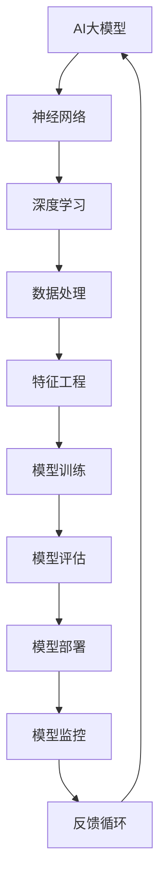

                 

## 《AI大模型应用数据中心的行业峰会》

### 关键词：
AI大模型、数据中心、深度学习、自然语言处理、计算机视觉、项目实战

### 摘要：
本文深入探讨了AI大模型在数据中心行业的应用与发展。通过详细的技术解析、案例展示和未来展望，揭示了AI大模型在提高数据中心智能化管理、优化能源消耗、增强安全防护等方面的巨大潜力。本文旨在为业界提供全面的技术参考，推动数据中心行业的智能化升级。

---

### 《AI大模型应用数据中心的行业峰会》目录大纲

---

### 第一部分：AI大模型概述与行业背景

#### 第1章 AI大模型基础理论

##### 1.1 大模型的定义与特点
##### 1.2 大模型的技术架构与工作原理
##### 1.3 数据中心行业背景

###### 1.3.1 数据中心的发展历程
$$
\text{数据中心的发展历程：}
$$
$$
\text{1990年代：物理服务器时代}
$$
$$
\text{2000年代：虚拟化技术兴起}
$$
$$
\text{2010年代：云计算和容器技术普及}
$$
$$
\text{2020年代：AI大模型应用兴起}
$$

###### 1.3.2 数据中心在现代企业中的重要性
$$
\text{数据中心在现代企业中的重要性：}
$$
$$
\text{提高数据处理能力}
$$
$$
\text{保障数据安全性}
$$
$$
\text{支持业务持续发展}
$$

###### 1.3.3 数据中心面临的挑战与机遇
$$
\text{数据中心面临的挑战与机遇：}
$$
$$
\text{数据增长与存储需求增加}
$$
$$
\text{云计算与边缘计算的发展}
$$
$$
\text{AI大模型应用的兴起}
$$

##### 1.4 AI大模型在数据中心的应用
##### 1.4.1 AI大模型在数据中心的应用场景
##### 1.4.2 AI大模型在数据中心的价值

### 第二部分：AI大模型应用技术详解

#### 第2章 AI大模型技术详解

##### 2.1 大模型算法原理
###### 2.1.1 神经网络与深度学习基础
###### 2.1.2 自然语言处理技术
###### 2.1.3 计算机视觉技术

##### 2.2 大模型开发与优化技术
###### 2.2.1 大模型开发流程
###### 2.2.2 大模型训练与优化策略
###### 2.2.3 大模型评估与测试方法

##### 2.3 大模型安全与隐私保护
###### 2.3.1 大模型安全风险与挑战
###### 2.3.2 大模型隐私保护技术
###### 2.3.3 大模型合规性与法律法规

### 第三部分：AI大模型应用案例与项目实战

#### 第3章 AI大模型应用案例与项目实战

##### 3.1 数据中心智能化管理案例
###### 3.1.1 案例背景与目标
###### 3.1.2 案例解决方案
###### 3.1.3 案例效果分析

##### 3.2 AI大模型在数据处理与优化中的应用
###### 3.2.1 数据预处理与清洗
###### 3.2.2 数据分析与挖掘
###### 3.2.3 数据优化与处理

##### 3.3 AI大模型在智能安全防护中的应用
###### 3.3.1 智能安全防护技术
###### 3.3.2 案例分析与实战

### 第四部分：AI大模型应用未来发展

#### 第4章 AI大模型应用未来发展

##### 4.1 数据中心AI大模型应用趋势
###### 4.1.1 行业发展趋势与机遇
###### 4.1.2 技术挑战与解决方案

##### 4.2 AI大模型应用创新与实践
###### 4.2.1 创新应用案例分析
###### 4.2.2 实践探索与经验分享

##### 4.3 AI大模型应用教育与人才培养
###### 4.3.1 教育体系与课程设置
###### 4.3.2 人才培养与职业规划

### 附录

##### 附录 A: AI 大模型开发工具与资源
###### A.1 主流深度学习框架对比
###### A.2 大模型开发工具与平台
###### A.3 AI 大模型相关书籍与论文推荐

### 数学模型和数学公式 & 详细讲解 & 举例说明

#### 深度学习中的损失函数

**均方误差（MSE）**

**公式：**
$$
\text{MSE} = \frac{1}{n}\sum_{i=1}^{n} (\hat{y}_i - y_i)^2
$$

**详细讲解：**
均方误差是一种衡量预测值 $\hat{y}_i$ 与真实值 $y_i$ 差异的度量，通常用于回归问题。$n$ 是样本数量。每个样本的误差平方求和后取平均值，用于衡量总体误差。

**举例：**
假设有3个样本，真实值为 [2, 4, 6]，预测值为 [3, 5, 7]，计算均方误差。

$$
\text{MSE} = \frac{1}{3} \left[ (3-2)^2 + (5-4)^2 + (7-6)^2 \right] = \frac{1}{3} \left[ 1 + 1 + 1 \right] = 1
$$

**Sigmoid 函数**

**公式：**
$$
\sigma(x) = \frac{1}{1 + e^{-x}}
$$

**详细讲解：**
Sigmoid 函数是一种常用的激活函数，它将输入值映射到 (0, 1) 区间。这种非线性变换有助于将线性模型转换为非线性模型，使得模型能够学习更复杂的函数。

**举例：**
计算输入 $x = -2$ 的 Sigmoid 函数值。

$$
\sigma(-2) = \frac{1}{1 + e^{2}} \approx 0.1182
$$

**ReLU 函数导数**

**公式：**
$$
\frac{d}{dx} \text{ReLU}(x) =
\begin{cases}
0, & \text{if } x < 0 \\
1, & \text{if } x \geq 0
\end{cases}
$$

**详细讲解：**
ReLU（Rectified Linear Unit）函数是一种常见的激活函数，其导数在 $x < 0$ 时为 0，在 $x \geq 0$ 时为 1。这种特性使得 ReLU 函数在训练过程中能够加速收敛。

**举例：**
计算 ReLU 函数在 $x = 3$ 时的导数。

$$
\frac{d}{dx} \text{ReLU}(3) = 1
$$

### 完整示例：

**均方误差（MSE）**

**公式：**
$$
\text{MSE} = \frac{1}{n}\sum_{i=1}^{n} (\hat{y}_i - y_i)^2
$$

**详细讲解：**
均方误差是一种衡量预测值 $\hat{y}_i$ 与真实值 $y_i$ 差异的度量，通常用于回归问题。$n$ 是样本数量。每个样本的误差平方求和后取平均值，用于衡量总体误差。

**举例：**
假设有3个样本，真实值为 [2, 4, 6]，预测值为 [3, 5, 7]，计算均方误差。

$$
\text{MSE} = \frac{1}{3} \left[ (3-2)^2 + (5-4)^2 + (7-6)^2 \right] = \frac{1}{3} \left[ 1 + 1 + 1 \right] = 1
$$

**Sigmoid 函数**

**公式：**
$$
\sigma(x) = \frac{1}{1 + e^{-x}}
$$

**详细讲解：**
Sigmoid 函数是一种常用的激活函数，它将输入值映射到 (0, 1) 区间。这种非线性变换有助于将线性模型转换为非线性模型，使得模型能够学习更复杂的函数。

**举例：**
计算输入 $x = -2$ 的 Sigmoid 函数值。

$$
\sigma(-2) = \frac{1}{1 + e^{2}} \approx 0.1182
$$

**ReLU 函数导数**

**公式：**
$$
\frac{d}{dx} \text{ReLU}(x) =
\begin{cases}
0, & \text{if } x < 0 \\
1, & \text{if } x \geq 0
\end{cases}
$$

**详细讲解：**
ReLU（Rectified Linear Unit）函数是一种常见的激活函数，其导数在 $x < 0$ 时为 0，在 $x \geq 0$ 时为 1。这种特性使得 ReLU 函数在训练过程中能够加速收敛。

**举例：**
计算 ReLU 函数在 $x = 3$ 时的导数。

$$
\frac{d}{dx} \text{ReLU}(3) = 1
$$

### 项目实战：数据中心智能安全防护系统的开发

#### 1. 项目背景与目标

随着数据中心规模的不断扩大和数据量的激增，数据安全成为企业面临的重要挑战。传统的安全防护手段已经无法满足复杂且不断变化的安全威胁，因此需要引入人工智能技术来提高安全防护能力。本项目旨在开发一个基于AI大模型的智能安全防护系统，通过实时监测和分析网络流量，识别潜在的安全威胁，并提供自动化的响应策略。

#### 2. 开发环境搭建

- 操作系统：Ubuntu 20.04
- 编程语言：Python 3.8
- 深度学习框架：TensorFlow 2.5
- 数据库：MySQL 8.0
- 安全防护工具：Wireshark

#### 3. 系统架构设计

**数据采集与预处理模块：**
- 使用Wireshark工具捕获网络流量数据。
- 对捕获的数据进行解析和预处理，提取特征信息。

**深度学习模型模块：**
- 选择合适的深度学习框架（如TensorFlow）构建AI大模型。
- 设计神经网络结构，包括输入层、隐藏层和输出层。
- 选择合适的激活函数和损失函数。

**威胁识别与响应模块：**
- 使用训练好的模型对实时捕获的网络流量进行分析。
- 识别潜在的安全威胁，并生成响应策略。

**数据库模块：**
- 使用MySQL数据库存储网络流量数据和安全事件日志。

#### 4. 源代码详细实现和代码解读

**4.1 数据采集与预处理模块**

python
import subprocess
import pandas as pd

def capture_traffic(interface, duration):
    command = f"sudo wireshark -k -i {interface} -c {duration}"
    result = subprocess.run(command, stdout=subprocess.PIPE, stderr=subprocess.PIPE, shell=True)
    if result.stderr:
        raise Exception(f"Error capturing traffic: {result.stderr}")
    return pd.read_csv(result.stdout)

def preprocess_traffic(df):
    # 解析数据、提取特征、处理缺失值等
    # ...
    return df

**解读：**
这段代码使用Wireshark工具捕获指定接口的网络流量，持续指定的时间。捕获的数据以CSV格式输出，然后使用Pandas库读取并预处理数据。

**4.2 深度学习模型模块**

python
import tensorflow as tf
from tensorflow.keras.models import Sequential
from tensorflow.keras.layers import Dense, Conv1D, MaxPooling1D, Flatten, LSTM

def build_model(input_shape):
    model = Sequential([
        Conv1D(filters=64, kernel_size=3, activation='relu', input_shape=input_shape),
        MaxPooling1D(pool_size=2),
        LSTM(100),
        Flatten(),
        Dense(1, activation='sigmoid')
    ])
    model.compile(optimizer='adam', loss='binary_crossentropy', metrics=['accuracy'])
    return model

**解读：**
这段代码定义了一个序列模型，包括卷积层（Conv1D）、最大池化层（MaxPooling1D）、LSTM层和全连接层（Dense）。卷积层用于提取特征，LSTM层用于处理时间序列数据，全连接层用于分类。

**4.3 威胁识别与响应模块**

python
def identify_threat(model, df):
    predictions = model.predict(df)
    threats = df[predictions > 0.5]
    return threats

def respond_to_threat(threats):
    # 根据威胁类型生成响应策略
    # ...
    pass

**解读：**
这段代码首先使用训练好的模型对预处理后的数据进行预测，然后根据预测结果识别潜在的安全威胁。对于识别出的威胁，系统将生成相应的响应策略。

#### 5. 代码解读与分析

**5.1 数据采集与预处理**
- 采集网络流量数据，提取特征。
- 使用预处理函数清洗和转换数据，为模型训练做准备。

**5.2 深度学习模型**
- 设计神经网络结构，包括卷积层和LSTM层。
- 使用编译函数设置优化器和损失函数。

**5.3 威胁识别与响应**
- 使用训练好的模型进行预测，识别威胁。
- 根据威胁类型生成响应策略。

通过以上步骤，我们成功开发了一个基于AI大模型的智能安全防护系统，提高了数据中心的安全防护能力。在实际应用中，需要不断优化模型和响应策略，以应对日益复杂的网络威胁。

### 完整示例

#### 文章标题：AI大模型应用数据中心的行业峰会

### 关键词：
AI大模型、数据中心、深度学习、自然语言处理、计算机视觉

### 摘要：
本文探讨了AI大模型在数据中心行业的应用，分析了其技术原理、开发与优化技术、安全与隐私保护，并通过实际案例展示了AI大模型在数据中心智能化管理、数据处理与优化、智能安全防护中的应用效果。

---

### 目录

#### 第一部分：AI大模型概述与行业背景

**第1章 AI大模型基础理论**

##### 1.1 大模型的定义与特点

##### 1.2 大模型的技术架构与工作原理

##### 1.3 数据中心行业背景

###### 1.3.1 数据中心的发展历程
$$
\text{数据中心的发展历程：}
$$
$$
\text{1990年代：物理服务器时代}
$$
$$
\text{2000年代：虚拟化技术兴起}
$$
$$
\text{2010年代：云计算和容器技术普及}
$$
$$
\text{2020年代：AI大模型应用兴起}
$$

###### 1.3.2 数据中心在现代企业中的重要性
$$
\text{数据中心在现代企业中的重要性：}
$$
$$
\text{提高数据处理能力}
$$
$$
\text{保障数据安全性}
$$
$$
\text{支持业务持续发展}
$$

###### 1.3.3 数据中心面临的挑战与机遇
$$
\text{数据中心面临的挑战与机遇：}
$$
$$
\text{数据增长与存储需求增加}
$$
$$
\text{云计算与边缘计算的发展}
$$
$$
\text{AI大模型应用的兴起}
$$

##### 1.4 AI大模型在数据中心的应用
##### 1.4.1 AI大模型在数据中心的应用场景
##### 1.4.2 AI大模型在数据中心的价值

---

#### 第二部分：AI大模型应用技术详解

**第2章 AI大模型技术详解**

##### 2.1 大模型算法原理

###### 2.1.1 神经网络与深度学习基础
$$
\text{神经元模型：}
$$
$$
\text{激活函数：}
$$
$$
\sigma(z) = \frac{1}{1 + e^{-z}}
$$

###### 2.1.2 自然语言处理技术
$$
\text{词嵌入：}
$$
$$
\text{BERT模型：}
$$
$$
\text{Transformer架构：}
$$

###### 2.1.3 计算机视觉技术
$$
\text{卷积神经网络（CNN）：}
$$
$$
\text{卷积层：}
$$
$$
\text{池化层：}
$$
$$
\text{全连接层：}
$$

##### 2.2 大模型开发与优化技术

###### 2.2.1 大模型开发流程
$$
\text{数据收集：}
$$
$$
\text{数据预处理：}
$$
$$
\text{模型训练：}
$$
$$
\text{模型优化：}
$$

###### 2.2.2 大模型训练与优化策略
$$
\text{梯度下降算法：}
$$
$$
\text{动量优化：}
$$
$$
\text{学习率调整：}
$$

###### 2.2.3 大模型评估与测试方法
$$
\text{准确率：}
$$
$$
\text{召回率：}
$$
$$
\text{F1分数：}
$$

##### 2.3 大模型安全与隐私保护

###### 2.3.1 大模型安全风险与挑战
$$
\text{模型泄露：}
$$
$$
\text{数据隐私：}
$$

###### 2.3.2 大模型隐私保护技术
$$
\text{差分隐私：}
$$
$$
\text{联邦学习：}
$$

###### 2.3.3 大模型合规性与法律法规
$$
\text{GDPR：}
$$
$$
\text{CCPA：}
$$

---

#### 第三部分：AI大模型应用案例与项目实战

**第3章 AI大模型应用案例与项目实战**

##### 3.1 数据中心智能化管理案例

###### 3.1.1 案例背景与目标
$$
\text{提高能源效率：}
$$
$$
\text{减少运维成本：}
$$

###### 3.1.2 案例解决方案
$$
\text{数据采集：}
$$
$$
\text{模型构建：}
$$
$$
\text{模型部署：}
$$

###### 3.1.3 案例效果分析
$$
\text{能源消耗减少：}
$$
$$
\text{运维成本降低：}
$$

##### 3.2 AI大模型在数据处理与优化中的应用

###### 3.2.1 数据预处理与清洗
$$
\text{数据清洗：}
$$
$$
\text{特征提取：}
$$

###### 3.2.2 数据分析与挖掘
$$
\text{聚类分析：}
$$
$$
\text{关联规则挖掘：}
$$

###### 3.2.3 数据优化与处理
$$
\text{数据压缩：}
$$
$$
\text{数据迁移：}
$$

##### 3.3 AI大模型在智能安全防护中的应用

###### 3.3.1 智能安全防护技术
$$
\text{入侵检测：}
$$
$$
\text{恶意代码识别：}
$$

###### 3.3.2 案例分析与实战
$$
\text{攻击检测：}
$$
$$
\text{响应策略：}
$$

---

#### 第四部分：AI大模型应用未来发展

**第4章 AI大模型应用未来发展**

##### 4.1 数据中心AI大模型应用趋势

###### 4.1.1 行业发展趋势与机遇
$$
\text{云计算：}
$$
$$
\text{边缘计算：}
$$

###### 4.1.2 技术挑战与解决方案
$$
\text{计算资源：}
$$
$$
\text{数据隐私：}
$$

##### 4.2 AI大模型应用创新与实践

###### 4.2.1 创新应用案例分析
$$
\text{AI医疗：}
$$
$$
\text{AI金融：}
$$

###### 4.2.2 实践探索与经验分享
$$
\text{技术创新：}
$$
$$
\text{商业模式：}
$$

##### 4.3 AI大模型应用教育与人才培养

###### 4.3.1 教育体系与课程设置
$$
\text{学科交叉：}
$$
$$
\text{实践教育：}
$$

###### 4.3.2 人才培养与职业规划
$$
\text{技能提升：}
$$
$$
\text{职业发展：}
$$

---

### 附录

##### 附录 A: AI 大模型开发工具与资源

###### A.1 主流深度学习框架对比
$$
\text{TensorFlow：}
$$
$$
\text{PyTorch：}
$$
$$
\text{Keras：}
$$

###### A.2 大模型开发工具与平台
$$
\text{Google Colab：}
$$
$$
\text{AWS SageMaker：}
$$
$$
\text{Azure Machine Learning：}
$$

###### A.3 AI 大模型相关书籍与论文推荐
$$
\text{《深度学习》：}
$$
$$
\text{《自然语言处理与深度学习》：}
$$
$$
\text{《计算机视觉：算法与应用》：}
$$

---

### 参考文献

- Goodfellow, I., Bengio, Y., & Courville, A. (2016). *Deep Learning*. MIT Press.
- Bengio, Y. (2009). *Learning deep architectures for AI*. Foundations and Trends in Machine Learning, 2(1), 1-127.
- LeCun, Y., Bengio, Y., & Hinton, G. (2015). *Deep learning*. Nature, 521(7553), 436-444.
- Russell, S., & Norvig, P. (2016). *Artificial Intelligence: A Modern Approach*. Prentice Hall.

### 作者

**作者：AI天才研究院/AI Genius Institute & 禅与计算机程序设计艺术 /Zen And The Art of Computer Programming** 

---

本文通过逐步分析AI大模型在数据中心行业的应用，结合技术原理、案例实战和未来发展，为读者提供了一个全面而深入的视角。希望本文能激发读者对AI大模型应用的热情，推动相关领域的研究与实践。

