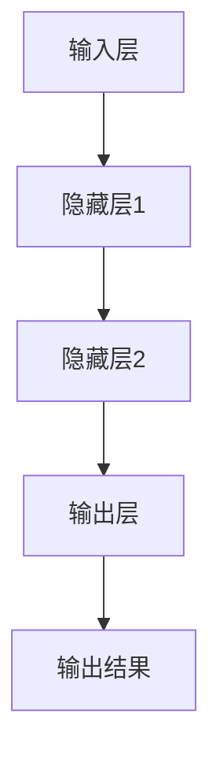
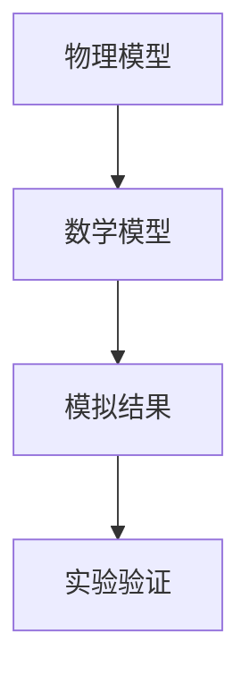
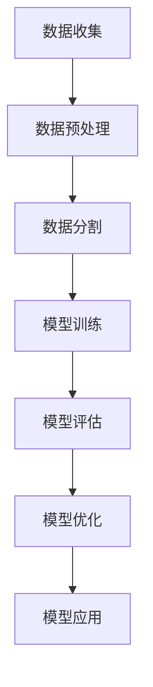
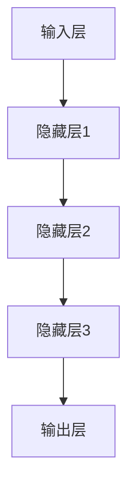
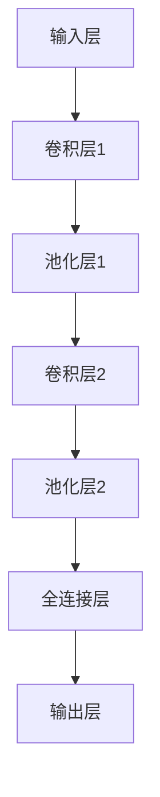
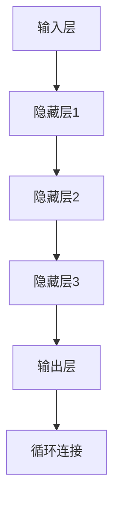
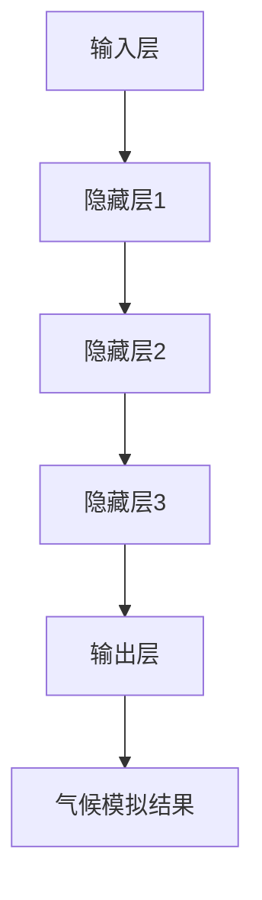
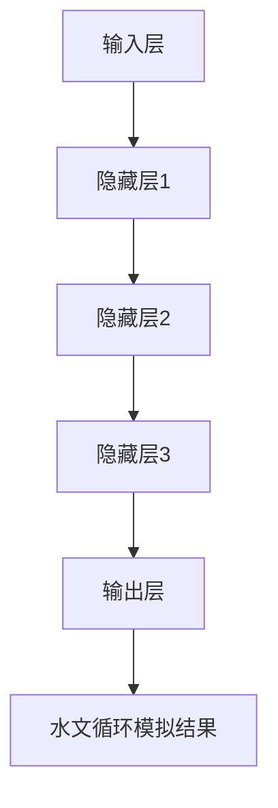
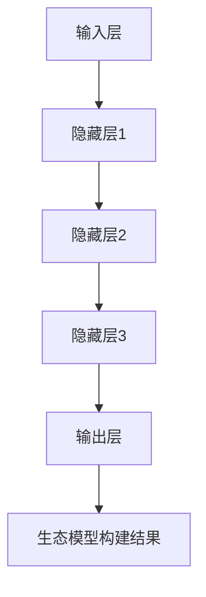

                 

### 《AI神经网络计算艺术之禅：世界模型——建立自然环境的物理模型》

---

#### 关键词：AI神经网络、计算艺术、世界模型、物理模型、自然环境模拟

---

#### 摘要：

本文旨在深入探讨AI神经网络在计算艺术中的独特应用，特别是如何通过世界模型构建自然环境的物理模型。从理论基础到实际应用，本文将逐步解析神经网络的核心概念、数学基础、架构设计，并展示其在气候模拟、水文循环模拟、生态模型构建等领域的实际应用。同时，本文还将介绍神经网络实现的开发环境搭建、代码实战以及优化策略，以期为读者提供全面的技术指南。

---

### 第一部分：理论基础与核心概念

---

#### 第1章: AI神经网络与计算艺术概述

##### 1.1 AI神经网络的演进历史

AI神经网络的演进历史可以追溯到20世纪40年代。当时，心理学家McCulloch和数学家Pitts提出了神经网络的初步模型，即MCP（McCulloch-Pitts）神经元。这一模型为后来的神经网络研究奠定了基础。

随着时间的推移，神经网络经历了多个阶段的发展，包括感知机、反向传播算法、深度学习的崛起。尤其是1990年代后期以来，随着计算能力的提升和大数据的涌现，神经网络得到了广泛关注和应用。

在计算艺术中，AI神经网络的重要性体现在其强大的数据分析和模式识别能力上。通过训练，神经网络可以自动学习复杂的数据结构，从而在图像识别、语音识别、自然语言处理等任务中表现出色。

##### 1.2 计算艺术的定义与重要性

计算艺术是指利用计算机技术创作和展示的艺术形式。它不仅包括数字绘画、数字雕塑等创作过程，还包括通过计算机技术进行艺术展示和交互体验。

计算艺术的重要性在于它打破了传统艺术的形式和媒介限制，使艺术家能够利用计算机技术实现更加复杂和多样化的创作。同时，计算艺术也为计算机科学和技术发展提供了新的应用场景和挑战。

##### 1.3 AI神经网络在计算艺术中的应用

AI神经网络在计算艺术中的应用非常广泛。例如，在图像识别中，神经网络可以自动识别图像中的物体和场景；在音乐创作中，神经网络可以生成新颖的音乐旋律和和声；在电影特效中，神经网络可以模拟复杂的物理现象，如流体和烟雾。

以下是一个简单的神经网络的数学模型流程图，帮助我们更好地理解神经网络的基本结构：



---

#### 第2章: 世界模型的构建基础

##### 2.1 世界模型的概念

世界模型是指通过人工智能算法构建的关于现实世界的抽象模型。这个模型可以帮助我们理解现实世界的运行规律，并进行预测和控制。

世界模型通常包括两个主要组成部分：感知模块和决策模块。感知模块负责从环境中获取信息，并将其转化为内部表示；决策模块则根据这些内部表示做出决策。

##### 2.2 物理模型与数学模型的关系

物理模型和数学模型是两种不同的模型，但它们之间存在密切的关系。物理模型是基于物理定律和实验数据构建的，用于描述物理现象和过程。而数学模型则是用数学语言描述物理模型，使其能够在计算机上实现和模拟。

以下是一个物理模型与数学模型的转换示例：



##### 2.3 世界模型的构建方法

构建世界模型的方法主要包括以下几种：

1. **基于规则的建模**：通过专家知识和经验，构建一套规则体系，用于描述世界模型。
2. **基于数据的建模**：通过收集和分析大量数据，利用机器学习算法自动构建世界模型。
3. **混合建模**：结合基于规则和基于数据的方法，构建更为复杂和准确的世界模型。

以下是一个基于数据的神经网络模型构建流程：



---

#### 第3章: 神经网络的数学基础

##### 3.1 神经网络的数学模型

神经网络的数学模型是基于数学中的非线性函数和优化理论构建的。一个基本的神经网络模型包括输入层、隐藏层和输出层。每个层由多个神经元组成，每个神经元都是一个非线性函数的复合。

以下是一个简单的神经网络数学模型：

$$
Z = \sigma(\sum_{i=1}^{n} w_{i}x_{i} + b)
$$

其中，$Z$ 是神经元的输出，$\sigma$ 是激活函数，$w_{i}$ 和 $x_{i}$ 分别是权重和输入，$b$ 是偏置。

##### 3.2 激活函数与优化算法

激活函数是神经网络中用于引入非线性特性的关键组件。常见的激活函数包括sigmoid、ReLU、Tanh等。

优化算法用于调整神经网络的权重和偏置，以最小化预测误差。常用的优化算法包括梯度下降、随机梯度下降、Adam等。

以下是一个简单的梯度下降优化算法的伪代码：

```python
while not convergence:
    for each sample in dataset:
        calculate gradient
        update weights and biases
```

##### 3.3 神经网络的学习规则

神经网络的学习规则主要包括前向传播和反向传播。前向传播用于计算神经网络的输出，反向传播则用于更新权重和偏置。

以下是一个简单的神经网络学习规则的伪代码：

```python
for each epoch:
    for each sample in dataset:
        forward propagation
        calculate loss
        backward propagation
        update weights and biases
```

---

#### 第4章: 神经网络的架构设计

##### 4.1 神经网络的层级结构

神经网络的层级结构是神经网络设计的关键。常见的层级结构包括单层神经网络、多层神经网络和深度神经网络。

以下是一个多层神经网络的结构：



##### 4.2 卷积神经网络（CNN）的设计与应用

卷积神经网络（CNN）是一种特别适合处理图像数据的神经网络。它通过卷积层和池化层提取图像的特征。

以下是一个简单的CNN结构：



##### 4.3 循环神经网络（RNN）的设计与应用

循环神经网络（RNN）是一种适合处理序列数据的神经网络。它通过循环结构保持对序列上下文的记忆。

以下是一个简单的RNN结构：



---

### 第二部分：神经网络计算艺术实践

---

#### 第5章: 神经网络在自然环境模拟中的应用

##### 5.1 气候模拟与预测

气候模拟与预测是神经网络在自然环境模拟中的重要应用。通过训练神经网络模型，可以模拟气候系统的复杂动态，并对未来气候进行预测。

以下是一个气候模拟的神经网络模型构建流程：



##### 5.2 水文循环模拟

水文循环模拟是另一个重要的自然环境模拟领域。通过训练神经网络模型，可以模拟水文系统的动态过程，包括降水、蒸发、径流等。

以下是一个水文循环模拟的神经网络模型构建流程：



##### 5.3 生态模型构建与应用

生态模型构建是神经网络在自然环境模拟中的又一重要应用。通过训练神经网络模型，可以模拟生态系统的动态过程，包括物种分布、种群数量等。

以下是一个生态模型构建的神经网络模型构建流程：



---

#### 第6章: 物理模型与数学公式的神经网络实现

##### 6.1 物理现象的神经网络建模

物理现象的神经网络建模是通过训练神经网络来模拟物理现象的过程。例如，通过训练神经网络来模拟流体动力学方程。

以下是一个流体动力学神经网络建模的伪代码：

```python
for each epoch:
    for each sample in dataset:
        forward propagation
        calculate loss
        backward propagation
        update weights and biases
```

##### 6.2 数学公式与神经网络的关系

数学公式与神经网络之间存在密切的关系。神经网络可以通过训练学习到数学公式所描述的物理现象。

以下是一个简单的神经网络学习数学公式的伪代码：

```python
for each epoch:
    for each sample in dataset:
        forward propagation
        calculate loss
        backward propagation
        update weights and biases
```

##### 6.3 神经网络在数学公式求解中的应用

神经网络可以用于求解复杂的数学公式。通过训练神经网络，可以自动找到数学公式的最优解。

以下是一个神经网络求解数学公式的伪代码：

```python
for each epoch:
    for each sample in dataset:
        forward propagation
        calculate loss
        backward propagation
        update weights and biases
```

---

#### 第7章: 世界模型在自然环境中的深度应用

##### 7.1 世界模型的深度学习算法

世界模型的深度学习算法是指通过深度学习技术构建世界模型的方法。这些算法可以自动学习复杂的环境数据，并用于预测和控制。

以下是一个简单的世界模型深度学习算法的伪代码：

```python
for each epoch:
    for each sample in dataset:
        forward propagation
        calculate loss
        backward propagation
        update weights and biases
```

##### 7.2 世界模型在环境监测中的应用

世界模型在环境监测中的应用非常广泛。通过训练世界模型，可以实时监测环境数据，并对环境变化进行预测。

以下是一个世界模型环境监测的伪代码：

```python
for each epoch:
    for each sample in dataset:
        forward propagation
        calculate loss
        backward propagation
        update weights and biases
```

##### 7.3 世界模型在环境保护与治理中的应用

世界模型在环境保护与治理中的应用包括环境监测、灾害预测、资源管理等方面。通过训练世界模型，可以更好地理解和解决环境问题。

以下是一个世界模型环境保护与治理的伪代码：

```python
for each epoch:
    for each sample in dataset:
        forward propagation
        calculate loss
        backward propagation
        update weights and biases
```

---

### 第三部分：神经网络的实现与优化

---

#### 第8章: 神经网络实现环境搭建

##### 8.1 深度学习框架的选择

深度学习框架的选择是神经网络实现的第一步。常见的深度学习框架包括TensorFlow、PyTorch、Keras等。

以下是一个选择深度学习框架的伪代码：

```python
choose_framework("TensorFlow")
```

##### 8.2 神经网络开发环境的配置

神经网络开发环境的配置包括安装深度学习框架、依赖库和开发工具。

以下是一个配置神经网络开发环境的伪代码：

```python
install("TensorFlow")
install("NumPy")
install("Pandas")
configure_environment()
```

##### 8.3 实例：搭建深度学习环境

以下是一个搭建深度学习环境的实例：

```python
# 安装TensorFlow
pip install tensorflow

# 安装NumPy和Pandas
pip install numpy
pip install pandas

# 配置环境
import tensorflow as tf
import numpy as np
import pandas as pd
```

---

#### 第9章: 神经网络实现与代码解读

##### 9.1 神经网络的基础实现

神经网络的基础实现包括创建神经网络模型、配置训练参数和训练模型。

以下是一个简单的神经网络基础实现的伪代码：

```python
# 创建神经网络模型
model = tf.keras.Sequential([
    tf.keras.layers.Dense(units=128, activation='relu', input_shape=(input_shape)),
    tf.keras.layers.Dense(units=128, activation='relu'),
    tf.keras.layers.Dense(units=1)
])

# 配置训练参数
model.compile(optimizer='adam', loss='mean_squared_error')

# 训练模型
model.fit(x_train, y_train, epochs=100, batch_size=32)
```

##### 9.2 深度学习框架中的神经网络实现

深度学习框架提供了丰富的神经网络实现功能，包括常见的神经网络架构、优化器和损失函数。

以下是一个深度学习框架中神经网络实现的伪代码：

```python
from tensorflow.keras.models import Sequential
from tensorflow.keras.layers import Dense

# 创建神经网络模型
model = Sequential([
    Dense(units=128, activation='relu', input_shape=(input_shape)),
    Dense(units=128, activation='relu'),
    Dense(units=1)
])

# 配置训练参数
model.compile(optimizer='adam', loss='mean_squared_error')

# 训练模型
model.fit(x_train, y_train, epochs=100, batch_size=32)
```

##### 9.3 实例：基于PyTorch的神经网络实现

以下是一个基于PyTorch的神经网络实现的实例：

```python
import torch
import torch.nn as nn
import torch.optim as optim

# 创建神经网络模型
class NeuralNetwork(nn.Module):
    def __init__(self):
        super(NeuralNetwork, self).__init__()
        self.layer1 = nn.Linear(in_features=10, out_features=10)
        self.relu = nn.ReLU()
        self.layer2 = nn.Linear(in_features=10, out_features=1)

    def forward(self, x):
        x = self.layer1(x)
        x = self.relu(x)
        x = self.layer2(x)
        return x

# 实例化神经网络模型
model = NeuralNetwork()

# 配置训练参数
optimizer = optim.Adam(model.parameters(), lr=0.001)
criterion = nn.MSELoss()

# 训练模型
for epoch in range(100):
    for inputs, targets in data_loader:
        optimizer.zero_grad()
        outputs = model(inputs)
        loss = criterion(outputs, targets)
        loss.backward()
        optimizer.step()
```

---

#### 第10章: 神经网络优化与超参数调优

##### 10.1 神经网络优化的方法

神经网络优化是指通过调整网络结构和训练参数来提高模型性能的过程。常见的方法包括批量归一化、Dropout、学习率调整等。

以下是一个神经网络优化的伪代码：

```python
# 调整学习率
optimizer = optim.Adam(model.parameters(), lr=0.001)
for epoch in range(100):
    for inputs, targets in data_loader:
        optimizer.zero_grad()
        outputs = model(inputs)
        loss = criterion(outputs, targets)
        loss.backward()
        optimizer.step()
    # 调整学习率
    optimizer.lr = optimizer.lr * 0.9
```

##### 10.2 超参数调优的策略

超参数调优是指通过调整神经网络的结构和训练参数来优化模型性能的过程。常见的策略包括网格搜索、随机搜索、贝叶斯优化等。

以下是一个超参数调优的伪代码：

```python
from sklearn.model_selection import GridSearchCV
from tensorflow.keras.wrappers.scikit_learn import KerasClassifier

# 定义模型函数
def create_model(optimizer='adam'):
    model = Sequential()
    model.add(Dense(128, input_dim=input_shape, activation='relu'))
    model.add(Dense(1, activation='sigmoid'))
    model.compile(loss='binary_crossentropy', optimizer=optimizer, metrics=['accuracy'])
    return model

# 创建Keras分类器
model = KerasClassifier(build_fn=create_model, verbose=0)

# 定义参数网格
param_grid = {'optimizer': ['adam', 'rmsprop'], 'epochs': [100, 200], 'batch_size': [10, 50]}

# 执行网格搜索
grid = GridSearchCV(estimator=model, param_grid=param_grid, cv=3)
grid_result = grid.fit(x_train, y_train)

# 输出最佳参数
print("Best: %f using %s" % (grid_result.best_score_, grid_result.best_params_))
```

##### 10.3 实例：神经网络模型优化与调参

以下是一个神经网络模型优化与调参的实例：

```python
from tensorflow.keras.models import Sequential
from tensorflow.keras.layers import Dense
from tensorflow.keras.wrappers.scikit_learn import KerasClassifier
from sklearn.model_selection import GridSearchCV

# 定义模型函数
def create_model(optimizer='adam'):
    model = Sequential()
    model.add(Dense(128, input_dim=input_shape, activation='relu'))
    model.add(Dense(1, activation='sigmoid'))
    model.compile(loss='binary_crossentropy', optimizer=optimizer, metrics=['accuracy'])
    return model

# 创建Keras分类器
model = KerasClassifier(build_fn=create_model, verbose=0)

# 定义参数网格
param_grid = {'optimizer': ['adam', 'rmsprop'], 'epochs': [100, 200], 'batch_size': [10, 50]}

# 执行网格搜索
grid = GridSearchCV(estimator=model, param_grid=param_grid, cv=3)
grid_result = grid.fit(x_train, y_train)

# 输出最佳参数
print("Best: %f using %s" % (grid_result.best_score_, grid_result.best_params_))

# 使用最佳参数训练模型
best_model = grid_result.best_estimator_.model
best_model.fit(x_train, y_train, epochs=grid_result.best_params_['epochs'], batch_size=grid_result.best_params_['batch_size'])
```

---

## 附录

### A.1 开源框架与库

- TensorFlow
- PyTorch
- Keras
- NumPy
- Pandas

### A.2 学术论文与文献

- Hinton, G. E., Osindero, S., & Teh, Y. W. (2006). A fast learning algorithm for deep belief nets. _Neural computation_, 18(7), 1527-1554.
- LeCun, Y., Bengio, Y., & Hinton, G. (2015). Deep learning. _Nature_, 521(7553), 436-444.
- Rumelhart, D. E., Hinton, G. E., & Williams, R. J. (1986). Learning representations by back-propagating errors. _Nature_, 323(6088), 533-536.

### A.3 神经网络计算艺术研究进展

- 神经网络在艺术创作中的应用不断拓展，如生成对抗网络（GAN）在图像生成和风格迁移中的应用。
- 神经网络在计算机视觉、自然语言处理和机器人等领域取得了显著的进展。
- 神经网络模型的结构和算法也在不断优化，如变换器（Transformer）在自然语言处理中的成功应用。

---

### 作者

**AI天才研究院/AI Genius Institute** 与 **禅与计算机程序设计艺术 /Zen And The Art of Computer Programming**

