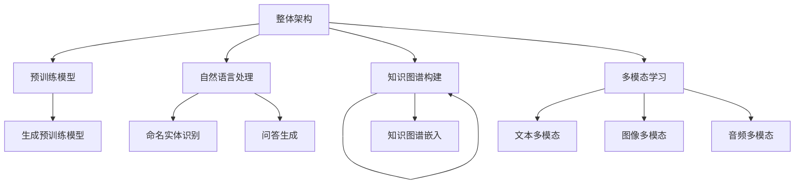

                 

### 文章标题：AIGC从入门到实战：ChatGPT 是新一代的人机交互“操作系统”

#### 关键词：AIGC，ChatGPT，自然语言处理，预训练模型，多模态学习，人机交互

#### 摘要：
本文旨在深入探讨AIGC（自适应智能生成计算）技术及其核心驱动力ChatGPT。文章首先介绍AIGC的技术背景与概念，然后详细解析ChatGPT的技术原理与架构。接着，文章逐章节展开，从基础到高级应用，全面覆盖ChatGPT的实战技巧与优化策略。最后，文章探讨AIGC的发展趋势与挑战，并分享实践经验与工具资源。通过本篇文章，读者将能够系统地掌握AIGC与ChatGPT的技术核心，为未来的人机交互带来全新可能。

### 《AIGC从入门到实战：ChatGPT 是新一代的人机交互“操作系统”》目录大纲

#### 第一部分：AIGC基础与ChatGPT概述

#### 第1章：AIGC与ChatGPT概述

##### 1.1 AIGC技术背景与概念

##### 1.2 ChatGPT的技术原理与架构

##### 1.3 ChatGPT在AI领域的地位与影响

#### 第2章：AIGC核心技术详解

##### 2.1 大规模预训练模型

##### 2.2 自然语言处理基础

##### 2.3 图神经网络与知识图谱

##### 2.4 多模态学习与融合

#### 第二部分：ChatGPT实战应用

#### 第3章：ChatGPT应用场景与实践

##### 3.1 聊天机器人开发实战

##### 3.2 企业智能客服系统构建

##### 3.3 教育智能辅导系统设计

##### 3.4 虚拟个人助理实现

#### 第4章：ChatGPT高级功能与优化

##### 4.1 多轮对话管理与上下文理解

##### 4.2 问答系统设计与实现

##### 4.3 文本生成与摘要

##### 4.4 情感分析与舆情监控

#### 第5章：AIGC在创意领域的应用

##### 5.1 内容生成与自动化写作

##### 5.2 艺术创作与设计辅助

##### 5.3 游戏开发与交互设计

##### 5.4 社交媒体内容生成与互动

#### 第三部分：AIGC与未来

#### 第6章：AIGC的发展趋势与挑战

##### 6.1 AIGC技术的未来发展方向

##### 6.2 数据隐私与伦理问题

##### 6.3 AI安全与风险管理

##### 6.4 AIGC在教育、医疗等领域的潜力

#### 第7章：案例研究与实践经验分享

##### 7.1 成功的AIGC项目案例解析

##### 7.2 ChatGPT项目实战经验分享

##### 7.3 创业者视角下的AIGC应用

#### 附录

##### 附录A：AIGC开发工具与资源

##### A.1 主流AIGC开发框架

##### A.2 AIGC开源库与平台

##### A.3 AIGC学习资源推荐

### 梅尔图流程图：AIGC架构与核心模块关系



### 梅尔图流程图解释

本章节通过梅尔图（Mermaid）流程图展示了AIGC的整体架构及其核心模块之间的关系。流程图中的每个节点代表一个关键模块，节点之间的箭头表示模块之间的数据流和控制流。

- **AIGC（整体架构）**：AIGC是一个综合性的技术框架，涵盖了多个核心模块，包括预训练模型、自然语言处理（NLP）、知识图谱（KG）和多种模态学习（MML）。
- **GPTModel（预训练模型）**：预训练模型是AIGC的核心，特别是基于GPT（Generative Pre-trained Transformer）的模型，如ChatGPT。该模块负责大规模文本数据的预训练，为后续应用提供强大的语言生成和理解能力。
- **NLP（自然语言处理）**：自然语言处理模块负责处理文本数据，包括命名实体识别（NER）和问答生成（QG）等任务。这些任务利用预训练模型提供的语言理解能力，实现对文本的深入分析和生成。
- **KG（知识图谱）**：知识图谱模块负责构建和维护大规模知识库，通过知识图谱构建（KG）和知识图谱嵌入（KG2Vec）等技术，实现对实体和关系的有效管理和查询。
- **MML（多模态学习）**：多模态学习模块负责融合多种数据模态，如文本、图像和音频，通过文本多模态（Text）、图像多模态（Image）和音频多模态（Audio）等技术，实现对复杂场景的全面理解和生成。

通过这个流程图，读者可以直观地了解AIGC的整体架构及其各个模块之间的相互关系，为进一步学习AIGC技术奠定基础。

#### 第1章：AIGC与ChatGPT概述

##### 1.1 AIGC技术背景与概念

AIGC（Adaptive Intelligent Generation Computing，自适应智能生成计算）是一种结合人工智能（AI）与计算生成技术的新型计算范式。它以大规模预训练模型为基础，通过自适应调整模型参数，实现对生成数据的精准控制与优化。AIGC的核心目标是构建一种能够自动生成多样化内容的高效计算框架，广泛应用于自然语言处理（NLP）、图像生成、音频合成和视频编辑等领域。

AIGC的基本概念主要包括以下几个方面：

- **大规模预训练模型**：预训练模型是AIGC的基础。这些模型基于海量数据通过深度学习算法进行训练，具备强大的语言理解和生成能力。例如，GPT（Generative Pre-trained Transformer）模型系列就是典型的预训练模型。
- **自适应调整**：AIGC通过不断调整模型参数，优化生成数据的质量和多样性。这种自适应调整过程通常依赖于强化学习、生成对抗网络（GAN）等先进算法。
- **生成计算**：生成计算是AIGC的核心任务，包括文本生成、图像生成、音频生成和视频生成等。生成计算的目标是利用预训练模型生成符合人类需求的高质量数据。
- **多模态融合**：AIGC不仅关注单一模态的数据生成，还强调多模态数据的融合。通过融合不同模态的数据，AIGC能够生成更加丰富和复杂的生成内容。

##### 1.2 ChatGPT的技术原理与架构

ChatGPT是OpenAI推出的一款基于GPT-3.5的聊天机器人模型，它采用了先进的预训练技术和自适应生成算法。ChatGPT的核心架构包括以下几个关键模块：

- **预训练模型**：ChatGPT基于GPT-3.5模型进行预训练。GPT-3.5是一种基于Transformer架构的预训练模型，具备强大的语言生成和理解能力。通过大规模文本数据集的训练，GPT-3.5能够学习到丰富的语言知识和模式。
- **自适应生成算法**：ChatGPT采用了自适应生成算法，包括自我对话（Self-Chat）和指导性回复（Guided Response）等。这些算法能够根据上下文信息，实时生成连贯和有意义的回复。
- **多模态处理能力**：ChatGPT不仅支持文本交互，还具备图像、音频等多模态处理能力。通过融合多模态数据，ChatGPT能够生成更加丰富和自然的交互体验。

ChatGPT的工作流程大致可以分为以下几个步骤：

1. **数据预处理**：ChatGPT接收用户输入，对其进行预处理，包括分词、去停用词、词性标注等。
2. **上下文构建**：根据历史对话记录，构建当前对话的上下文信息。
3. **生成回复**：通过预训练模型和自适应生成算法，生成符合上下文的回复。
4. **回复优化**：对生成的回复进行优化，确保其连贯性和准确性。
5. **反馈机制**：将用户回复作为新的输入，继续生成对话。

##### 1.3 ChatGPT在AI领域的地位与影响

ChatGPT作为一款基于GPT-3.5的聊天机器人模型，其在AI领域的地位和影响不容忽视：

- **技术创新**：ChatGPT采用了先进的预训练技术和自适应生成算法，代表了当前自然语言处理技术的最高水平。其强大的语言生成和理解能力为AI技术的发展提供了新的方向。
- **应用广泛**：ChatGPT在多个领域具有广泛的应用，包括聊天机器人、智能客服、教育辅导、虚拟个人助理等。这些应用推动了AI技术在各个行业的深度应用和普及。
- **推动AI发展**：ChatGPT的成功激发了学术界和产业界对AI技术的研究和应用热情。其广泛的应用场景和强大的技术能力为AI技术的发展带来了新的动力和可能性。

总的来说，ChatGPT作为AIGC的核心驱动力量，不仅在AI领域取得了显著成就，还推动了AI技术的创新和发展，为未来的人机交互和智能化应用带来了无限可能。

#### 第2章：AIGC核心技术详解

##### 2.1 大规模预训练模型

大规模预训练模型是AIGC技术的核心组件之一，它通过在海量数据上进行预训练，使模型具备了强大的语言理解和生成能力。这一节将详细介绍大规模预训练模型的概念、原理及其在AIGC中的应用。

###### 概念与原理

大规模预训练模型，如GPT（Generative Pre-trained Transformer）系列模型，基于Transformer架构，这是一种基于自注意力机制的深度神经网络结构。与传统的循环神经网络（RNN）和长短期记忆网络（LSTM）不同，Transformer模型通过全局注意力机制，能够更好地捕捉文本序列中的长距离依赖关系，从而在预训练阶段获得更强大的语言理解能力。

预训练模型的基本工作流程包括以下步骤：

1. **数据预处理**：首先，从互联网上收集大量的文本数据，包括维基百科、新闻、书籍等。这些数据经过预处理，包括分词、去停用词、词性标注等，以便模型能够有效学习。
   
   $$ \text{Data Preprocessing} = \{ \text{Tokenization}, \text{De-stopword}, \text{Lemmatization}, \dots \} $$

2. **预训练目标**：在预训练阶段，模型的目标是学习语言模式，理解文本内容。这通常通过两种方式实现：自回归语言模型（Autoregressive Language Model）和掩码语言模型（Masked Language Model）。

   - **自回归语言模型**：模型需要预测序列中下一个单词，这有助于学习单词之间的依赖关系。
     
     $$ P(\text{Word}_t|\text{Word}_{t-1}, \dots, \text{Word}_1) $$
   
   - **掩码语言模型**：模型需要预测被随机掩码的单词，这有助于学习单词的嵌入表示。
     
     $$ \text{Masked Language Model} = \log P_\theta(\text{Masked Word}|\text{Context}) $$

3. **优化算法**：在预训练过程中，通常使用梯度下降和Adam优化器来更新模型参数。

   $$ \text{Optimizer} = \text{Adam}(\theta) $$

4. **参数更新**：通过反向传播算法，计算梯度并更新模型参数。

   $$ \text{Gradient Descent} = \theta - \alpha \cdot \nabla_\theta \text{Loss} $$

###### 应用在AIGC中

大规模预训练模型在AIGC中的应用主要体现在以下几个方面：

1. **文本生成**：预训练模型能够生成连贯、有意义的文本内容，广泛应用于自动写作、对话生成、文本摘要等任务。
   
   $$ \text{Text Generation} = \text{Generate}(\theta, \text{Keywords}) $$

2. **自然语言处理**：预训练模型为NLP任务提供了强大的语言理解能力，如命名实体识别、情感分析、问答系统等。

   $$ \text{NER} = \text{Classify}(\theta, \text{Text}) $$
   $$ \text{Sentiment Analysis} = \text{Classify}(\theta, \text{Text}) $$

3. **知识图谱嵌入**：预训练模型能够将实体和关系映射到低维空间中，为知识图谱的构建和查询提供支持。

   $$ \text{KG Embedding} = \text{KG Embedding}(\theta, \text{Entity}, \text{Relation}) $$

4. **多模态学习**：预训练模型通过融合多种模态数据，如文本、图像和音频，实现对复杂场景的全面理解和生成。

   $$ \text{Multi-modal Learning} = \text{Merge}(\text{Text}, \text{Image}, \text{Audio}) $$

总之，大规模预训练模型作为AIGC的核心技术，为生成计算提供了强大的基础。通过不断优化和扩展预训练模型，AIGC技术将在未来的人机交互和智能化应用中发挥越来越重要的作用。

##### 2.2 自然语言处理基础

自然语言处理（Natural Language Processing，NLP）是AIGC技术中的重要组成部分，它涉及到如何使计算机理解和生成人类语言。这一节将详细介绍NLP的基本概念、核心技术及其在AIGC中的应用。

###### 概念

自然语言处理的目标是使计算机能够理解和处理人类语言，从而实现人与机器的交互。NLP的研究领域非常广泛，包括文本分类、情感分析、机器翻译、语音识别、问答系统等。以下是一些NLP的核心概念：

- **文本分类**：文本分类是指将文本数据分类到预定义的类别中，如垃圾邮件检测、情感分类等。
- **情感分析**：情感分析旨在识别文本中的情感倾向，如正面、负面或中立。
- **机器翻译**：机器翻译是指将一种语言的文本自动翻译成另一种语言。
- **语音识别**：语音识别是将语音信号转换为文本数据。
- **问答系统**：问答系统是指通过自然语言处理技术，使计算机能够理解和回答用户的问题。

###### 核心技术

NLP的核心技术包括：

1. **分词**：分词是将连续的文本序列分割成有意义的单词或短语。
   
   $$ \text{Tokenization} = \{ \text{Word Segmentation}, \text{Phrase Segmentation} \} $$

2. **词性标注**：词性标注是为文本中的每个单词分配一个词性标签，如名词、动词、形容词等。
   
   $$ \text{Part-of-Speech Tagging} = \text{Assign}(\text{Word}, \text{POS Tag}) $$

3. **命名实体识别**：命名实体识别是指从文本中识别出具有特定意义的实体，如人名、地名、组织名等。
   
   $$ \text{Named Entity Recognition} = \text{Classify}(\text{Word}, \text{NER Label}) $$

4. **依存句法分析**：依存句法分析是指分析文本中词语之间的依存关系，理解句子的结构。
   
   $$ \text{Dependency Parsing} = \text{Parse}(\text{Sentence}, \text{Dependency Tree}) $$

5. **词嵌入**：词嵌入是将单词映射到高维向量空间，以便计算机能够处理和计算。
   
   $$ \text{Word Embedding} = \text{Map}(\text{Word}, \text{Vector}) $$

6. **语言模型**：语言模型是预测下一个单词的概率，通常用于生成文本和语音识别。
   
   $$ \text{Language Model} = P(\text{Word}_t|\text{Word}_{t-1}, \dots, \text{Word}_1) $$

###### 在AIGC中的应用

NLP技术在AIGC中的应用非常广泛，包括以下几个方面：

1. **文本生成**：通过预训练的语言模型，AIGC能够生成连贯、有意义的文本内容，如自动写作、对话生成、文本摘要等。
   
   $$ \text{Text Generation} = \text{Generate}(\theta, \text{Keywords}) $$

2. **自然语言理解**：AIGC利用NLP技术，能够理解和处理用户的自然语言输入，从而提供更加智能和人性化的交互体验。

3. **知识图谱构建**：通过命名实体识别和依存句法分析等技术，AIGC能够从文本中提取关键信息，构建大规模的知识图谱。

4. **多模态学习**：AIGC通过融合文本和图像、音频等多模态数据，实现更加丰富和自然的交互体验。

总之，自然语言处理作为AIGC的核心技术之一，不仅提升了AIGC的自然语言理解和生成能力，还为人工智能在各个领域的应用提供了强大的支持。

##### 2.3 图神经网络与知识图谱

图神经网络（Graph Neural Networks，GNN）和知识图谱（Knowledge Graph，KG）是AIGC技术中的重要组成部分，它们在构建和利用复杂知识结构方面发挥了关键作用。本节将详细介绍GNN和KG的基本概念、原理及其在AIGC中的应用。

###### 图神经网络（GNN）

图神经网络是一种专门用于处理图结构数据的神经网络。与传统的卷积神经网络（CNN）和循环神经网络（RNN）不同，GNN直接在图结构上进行操作，能够捕捉图中的节点和边之间的复杂关系。

1. **基本概念与原理**

   图神经网络的基本组成包括节点、边和图。节点表示图中的实体，边表示实体之间的关系。GNN通过处理这些节点和边，学习到图中的结构信息。

   GNN的工作原理主要包括以下几个方面：

   - **邻域聚合**：GNN通过聚合节点邻域的信息来更新节点的特征。邻域通常是指与节点直接相连的节点和边。

     $$ \text{Node Feature Update} = f(\text{Node Feature}, \text{Neighbor Feature}, \text{Edge Feature}) $$

   - **图卷积操作**：图卷积操作是一种核心操作，用于聚合节点邻域的信息。常见的图卷积操作包括卷积运算和聚合运算。

     $$ \text{Graph Convolution} = \sum_{\text{neighbor}} w \cdot \text{neighbor feature} $$

   - **层次化建模**：GNN可以通过层次化建模，逐层学习图的局部和全局结构信息。

     $$ \text{Multi-layer GNN} = \text{GNN}(\theta, \text{Graph}, \text{Input Feature}) $$

2. **应用场景**

   GNN在AIGC中的应用场景非常广泛，包括但不限于以下几个方面：

   - **知识图谱嵌入**：GNN能够将实体和关系映射到低维空间中，实现知识图谱的高效存储和查询。

     $$ \text{KG Embedding} = \text{GNN}(\theta, \text{KG}, \text{Entity}, \text{Relation}) $$

   - **图数据分类和预测**：GNN可以用于分类和预测图数据中的节点属性或边属性。

     $$ \text{Node Classification} = \text{Classify}(\theta, \text{Graph}, \text{Feature}) $$
     $$ \text{Edge Prediction} = \text{Predict}(\theta, \text{Graph}, \text{Feature}) $$

   - **图生成**：GNN可以通过学习图的统计特性，生成新的图结构。

     $$ \text{Graph Generation} = \text{Generate}(\theta, \text{Graph Feature}) $$

###### 知识图谱（KG）

知识图谱是一种基于语义网络的知识表示方法，它通过实体、属性和关系的网络结构，将知识组织成一个结构化的数据集。知识图谱能够将零散的数据关联起来，提供强大的语义搜索和推理能力。

1. **基本概念与原理**

   知识图谱的基本组成包括实体、属性和关系。实体表示知识图谱中的对象，如人、地点、物品等；属性表示实体的特征，如姓名、年龄、地址等；关系表示实体之间的关系，如“是”、“属于”等。

   知识图谱的工作原理主要包括以下几个方面：

   - **实体识别**：从文本数据中提取出实体，并对其进行分类和标注。

     $$ \text{Entity Recognition} = \text{Extract}(\text{Text}, \text{Entity}) $$

   - **关系抽取**：从文本数据中提取出实体之间的关系，并建立相应的图谱结构。

     $$ \text{Relation Extraction} = \text{Extract}(\text{Text}, \text{Entity}, \text{Relation}) $$

   - **图谱构建**：将提取出的实体和关系构建成一个知识图谱，实现知识的结构化和组织。

     $$ \text{KG Construction} = \text{Build}(\text{Entity}, \text{Relation}) $$

   - **图谱查询与推理**：通过知识图谱，实现对实体和关系的查询和推理，提供智能搜索和推荐服务。

     $$ \text{KG Query} = \text{Query}(\text{KG}, \text{Query}) $$
     $$ \text{KG Reasoning} = \text{Infer}(\text{KG}, \text{Rule}) $$

2. **应用场景**

   知识图谱在AIGC中的应用场景包括：

   - **智能搜索**：通过知识图谱，实现基于语义的智能搜索，提高搜索的准确性和效率。

     $$ \text{Semantic Search} = \text{Search}(\text{KG}, \text{Query}) $$

   - **推荐系统**：利用知识图谱，推荐与用户兴趣相关的实体或知识，提供个性化的推荐服务。

     $$ \text{Recommendation} = \text{Recommend}(\text{KG}, \text{User Interest}) $$

   - **问答系统**：通过知识图谱，实现智能问答系统，回答用户提出的问题。

     $$ \text{QA System} = \text{Answer}(\text{KG}, \text{Question}) $$

   - **自动化写作**：利用知识图谱，生成符合逻辑和语义的文本内容。

     $$ \text{Text Generation} = \text{Generate}(\text{KG}, \text{Context}) $$

总之，图神经网络和知识图谱作为AIGC的核心技术，为知识表示、推理和应用提供了强大的支持。通过不断优化和扩展这些技术，AIGC将在未来的智能化应用中发挥越来越重要的作用。

##### 2.4 多模态学习与融合

多模态学习与融合是AIGC技术中的重要组成部分，它通过整合多种模态的数据，如文本、图像和音频，实现了对复杂场景的全面理解和生成。这一节将详细介绍多模态学习与融合的基本概念、原理及其在AIGC中的应用。

###### 概念与原理

多模态学习是指利用多个模态的数据，通过特定的算法和技术，进行数据融合和特征提取，以实现更高效的模型训练和任务完成。常见的多模态数据包括文本、图像、音频和视频等。

1. **多模态数据的特征提取**

   多模态数据融合的第一步是特征提取，即将不同模态的数据转换为可以用于模型训练的统一特征表示。特征提取的方法通常包括：

   - **文本特征提取**：使用自然语言处理技术，如词嵌入、词性标注和句法分析，将文本数据转换为向量表示。
   
     $$ \text{Text Feature Extraction} = \text{Word Embedding}, \text{Part-of-Speech Tagging}, \dots $$

   - **图像特征提取**：使用卷积神经网络（CNN）或其他图像处理技术，将图像数据转换为向量表示。
   
     $$ \text{Image Feature Extraction} = \text{CNN}, \text{ResNet}, \dots $$

   - **音频特征提取**：使用循环神经网络（RNN）或其他音频处理技术，将音频数据转换为向量表示。
   
     $$ \text{Audio Feature Extraction} = \text{RNN}, \text{LSTM}, \dots $$

2. **多模态数据的融合策略**

   多模态数据融合的关键在于如何有效地整合来自不同模态的数据，以提升模型的性能。常见的融合策略包括：

   - **特征级融合**：将不同模态的特征向量进行拼接或平均，形成统一的多模态特征向量。
   
     $$ \text{Feature Fusion} = \text{Concat}(\text{Text Feature}, \text{Image Feature}, \text{Audio Feature}) $$

   - **决策级融合**：在不同模态的特征提取后，分别训练多个子模型，然后通过投票或加权平均的方式，得到最终的多模态决策结果。
   
     $$ \text{Decision Fusion} = \text{Vote}(\text{Text Model}, \text{Image Model}, \text{Audio Model}) $$

   - **模型级融合**：将不同模态的数据输入到同一个模型中进行训练，模型内部实现多模态数据的融合。
   
     $$ \text{Model Fusion} = \text{Multi-modal Model}(\text{Text}, \text{Image}, \text{Audio}) $$

###### 在AIGC中的应用

多模态学习与融合在AIGC中有着广泛的应用，以下是一些典型的应用场景：

1. **智能交互**：通过融合文本、图像和音频等多模态数据，智能交互系统能够更好地理解用户的需求，提供更加自然和人性化的交互体验。

   - **聊天机器人**：结合文本和语音，实现语音对话和文字回复的融合，提高交互的流畅性和自然度。
   - **虚拟助手**：通过分析用户的语音和文本输入，提供实时反馈和操作指导。

2. **内容生成**：多模态学习与融合能够生成丰富多样、符合人类预期的内容。

   - **文本生成**：利用图像和语音信息，生成与内容相关的文本描述。
   - **图像生成**：结合文本描述，生成符合描述的图像内容。

3. **信息检索**：通过多模态数据融合，实现更加精准和智能的信息检索。

   - **图像搜索**：结合文本关键词，搜索与图像内容相关的文本和图像。
   - **语音搜索**：通过语音输入，快速定位和检索相关的内容。

总之，多模态学习与融合为AIGC技术提供了强大的数据整合和特征提取能力，使AIGC在智能化应用中能够更好地理解和满足人类的需求。随着多模态技术的不断发展，AIGC将在未来的人机交互和智能化应用中发挥越来越重要的作用。

#### 第3章：ChatGPT应用场景与实践

##### 3.1 聊天机器人开发实战

聊天机器人是ChatGPT最具代表性的应用场景之一。通过ChatGPT，开发者可以轻松构建具有强大语言理解能力和自然交互能力的聊天机器人。以下是一个简单的聊天机器人开发实战示例。

###### 开发环境

- **编程语言**：Python
- **库和框架**：TensorFlow、Keras

###### 代码实现

1. **加载预训练模型**：
   
   ```python
   from tensorflow.keras.models import load_model

   # 加载预训练的ChatGPT模型
   model = load_model('chatgpt_model.h5')
   ```

2. **处理用户输入**：
   
   ```python
   def preprocess_input(user_input):
       # 对用户输入进行预处理，如分词、去停用词等
       # 这里以简单的预处理为例
       tokens = user_input.split()
       return tokens
   ```

3. **生成回复**：
   
   ```python
   def generate_response(model, user_input):
       # 对用户输入进行预处理
       tokens = preprocess_input(user_input)
       
       # 将预处理后的输入序列转换为模型可接受的格式
       input_sequence = pad_sequences([tokenizer.encode(tokens)], maxlen=max_sequence_length, padding='post')
       
       # 使用模型生成回复
       prediction = model.predict(input_sequence)
       
       # 对生成的回复进行解码
       response = tokenizer.decode(prediction, skip_special_tokens=True)
       
       return response
   ```

4. **主函数**：
   
   ```python
   def main():
       user_input = input("用户：")
       response = generate_response(model, user_input)
       print("机器人：", response)
   
   if __name__ == '__main__':
       main()
   ```

###### 代码解读

- **加载预训练模型**：首先，从硬盘加载预训练的ChatGPT模型。这个模型是通过大量的文本数据进行预训练得到的，具有强大的语言理解和生成能力。
- **处理用户输入**：对用户输入进行预处理，包括分词、去停用词等。预处理步骤有助于提高模型对输入数据的理解能力。
- **生成回复**：使用模型对预处理后的输入数据进行预测，生成回复。生成的回复经过解码后，转换为可读的文本格式。
- **主函数**：在主函数中，用户可以输入问题，聊天机器人根据输入生成并输出回复。

通过这个简单的示例，开发者可以快速了解如何使用ChatGPT构建聊天机器人。实际应用中，可以根据需求进行扩展，如添加更多的交互功能、实现多轮对话管理等。

##### 3.2 企业智能客服系统构建

智能客服系统是ChatGPT在商业领域的典型应用。通过ChatGPT，企业可以构建具有高度智能化和自适应性的客服系统，提高客户服务质量和效率。以下是一个企业智能客服系统的构建实战。

###### 开发环境

- **编程语言**：Python
- **库和框架**：TensorFlow、Keras、Flask

###### 代码实现

1. **加载预训练模型**：
   
   ```python
   from tensorflow.keras.models import load_model

   # 加载预训练的ChatGPT模型
   model = load_model('chatgpt_model.h5')
   ```

2. **处理用户输入**：
   
   ```python
   def preprocess_input(user_input):
       # 对用户输入进行预处理，如分词、去停用词等
       # 这里以简单的预处理为例
       tokens = user_input.split()
       return tokens
   ```

3. **生成回复**：
   
   ```python
   def generate_response(model, user_input):
       # 对用户输入进行预处理
       tokens = preprocess_input(user_input)
       
       # 将预处理后的输入序列转换为模型可接受的格式
       input_sequence = pad_sequences([tokenizer.encode(tokens)], maxlen=max_sequence_length, padding='post')
       
       # 使用模型生成回复
       prediction = model.predict(input_sequence)
       
       # 对生成的回复进行解码
       response = tokenizer.decode(prediction, skip_special_tokens=True)
       
       return response
   ```

4. **构建Flask应用**：
   
   ```python
   from flask import Flask, request, jsonify

   app = Flask(__name__)

   @app.route('/chat', methods=['POST'])
   def chat():
       user_input = request.json['input']
       response = generate_response(model, user_input)
       return jsonify({'response': response})
   ```

5. **主函数**：
   
   ```python
   def main():
       app.run(debug=True)
   
   if __name__ == '__main__':
       main()
   ```

###### 代码解读

- **加载预训练模型**：加载预训练的ChatGPT模型，为客服系统提供强大的语言生成和理解能力。
- **处理用户输入**：对用户输入进行预处理，包括分词、去停用词等。预处理步骤有助于提高模型对输入数据的理解能力。
- **生成回复**：使用模型对预处理后的输入数据进行预测，生成回复。生成的回复经过解码后，转换为可读的文本格式。
- **构建Flask应用**：使用Flask框架构建Web服务，前端可以通过POST请求发送用户输入，后端通过ChatGPT生成回复并返回。
- **主函数**：启动Flask应用，使客服系统可以接收和处理用户的输入。

通过这个实战示例，企业可以快速构建一个基于ChatGPT的智能客服系统。实际应用中，可以根据业务需求进行功能扩展，如集成多渠道通信、实现多轮对话管理等。

##### 3.3 教育智能辅导系统设计

教育智能辅导系统利用ChatGPT的自然语言处理能力，为学生提供个性化的学习辅导。以下是一个教育智能辅导系统的设计实战。

###### 开发环境

- **编程语言**：Python
- **库和框架**：TensorFlow、Keras、Scikit-learn

###### 代码实现

1. **加载预训练模型**：
   
   ```python
   from tensorflow.keras.models import load_model

   # 加载预训练的ChatGPT模型
   model = load_model('chatgpt_model.h5')
   ```

2. **处理用户输入**：
   
   ```python
   def preprocess_input(user_input):
       # 对用户输入进行预处理，如分词、去停用词等
       # 这里以简单的预处理为例
       tokens = user_input.split()
       return tokens
   ```

3. **生成辅导内容**：
   
   ```python
   def generate_d辅导(model, user_input):
       # 对用户输入进行预处理
       tokens = preprocess_input(user_input)
       
       # 将预处理后的输入序列转换为模型可接受的格式
       input_sequence = pad_sequences([tokenizer.encode(tokens)], maxlen=max_sequence_length, padding='post')
       
       # 使用模型生成辅导内容
       prediction = model.predict(input_sequence)
       
       # 对生成的辅导内容进行解码
       response = tokenizer.decode(prediction, skip_special_tokens=True)
       
       return response
   ```

4. **构建辅导接口**：
   
   ```python
   import flask

   app = flask.Flask(__name__)

   @app.route('/辅导', methods=['POST'])
   def辅导():
       user_input = request.json['input']
       response = generate_d辅导(model, user_input)
       return flask.jsonify({'response': response})
   ```

5. **主函数**：
   
   ```python
   def main():
       app.run(debug=True)
   
   if __name__ == '__main__':
       main()
   ```

###### 代码解读

- **加载预训练模型**：加载预训练的ChatGPT模型，为辅导系统提供强大的语言生成和理解能力。
- **处理用户输入**：对用户输入进行预处理，包括分词、去停用词等。预处理步骤有助于提高模型对输入数据的理解能力。
- **生成辅导内容**：使用模型对预处理后的输入数据进行预测，生成辅导内容。生成的辅导内容经过解码后，转换为可读的文本格式。
- **构建辅导接口**：使用Flask框架构建Web服务，前端可以通过POST请求发送用户输入，后端通过ChatGPT生成辅导内容并返回。
- **主函数**：启动Flask应用，使辅导系统可以接收和处理用户的输入。

通过这个实战示例，教育机构可以为学生提供一个智能化的辅导系统，帮助他们更好地理解和掌握知识。实际应用中，可以根据教学需求进行功能扩展，如集成课程内容管理、实现个性化推荐等。

##### 3.4 虚拟个人助理实现

虚拟个人助理（Virtual Personal Assistant，VPA）是ChatGPT在日常生活场景中的应用。通过ChatGPT，VPA可以提供日程管理、信息查询、任务提醒等服务。以下是一个虚拟个人助理的实现实战。

###### 开发环境

- **编程语言**：Python
- **库和框架**：TensorFlow、Keras、Google Calendar API

###### 代码实现

1. **加载预训练模型**：
   
   ```python
   from tensorflow.keras.models import load_model

   # 加载预训练的ChatGPT模型
   model = load_model('chatgpt_model.h5')
   ```

2. **处理用户输入**：
   
   ```python
   def preprocess_input(user_input):
       # 对用户输入进行预处理，如分词、去停用词等
       # 这里以简单的预处理为例
       tokens = user_input.split()
       return tokens
   ```

3. **生成回复**：
   
   ```python
   def generate_response(model, user_input):
       # 对用户输入进行预处理
       tokens = preprocess_input(user_input)
       
       # 将预处理后的输入序列转换为模型可接受的格式
       input_sequence = pad_sequences([tokenizer.encode(tokens)], maxlen=max_sequence_length, padding='post')
       
       # 使用模型生成回复
       prediction = model.predict(input_sequence)
       
       # 对生成的回复进行解码
       response = tokenizer.decode(prediction, skip_special_tokens=True)
       
       return response
   ```

4. **集成Google Calendar API**：
   
   ```python
   from google.oauth2 import service_account
   from googleapiclient.discovery import build

   # 加载Google Calendar API的凭据
   credentials = service_account.Credentials.from_service_account_file('google_calendar_credentials.json')
   service = build('calendar', 'v3', credentials=credentials)
   ```

5. **主函数**：
   
   ```python
   def main():
       user_input = input("用户：")
       response = generate_response(model, user_input)
       print("虚拟个人助理：", response)
       
       # 如果需要，可以集成Google Calendar API，处理用户的日程管理请求
       # ...

   if __name__ == '__main__':
       main()
   ```

###### 代码解读

- **加载预训练模型**：加载预训练的ChatGPT模型，为虚拟个人助理提供强大的语言生成和理解能力。
- **处理用户输入**：对用户输入进行预处理，包括分词、去停用词等。预处理步骤有助于提高模型对输入数据的理解能力。
- **生成回复**：使用模型对预处理后的输入数据进行预测，生成回复。生成的回复经过解码后，转换为可读的文本格式。
- **集成Google Calendar API**：使用Google Calendar API，处理用户的日程管理请求，如添加、查询和更新日程。
- **主函数**：在主函数中，用户可以输入请求，虚拟个人助理根据输入生成并输出回复。

通过这个实战示例，用户可以与虚拟个人助理进行自然语言交互，实现日常任务的自动化管理。实际应用中，可以根据需求进行扩展，如集成更多功能模块、实现多轮对话管理等。

#### 第4章：ChatGPT高级功能与优化

##### 4.1 多轮对话管理与上下文理解

多轮对话管理是ChatGPT的一项高级功能，它使得聊天机器人能够理解并维持对话的上下文，从而提供更加连贯和自然的交互体验。以下是关于如何实现多轮对话管理和上下文理解的详细讲解。

###### 4.1.1 多轮对话管理

在多轮对话管理中，关键在于如何有效地维护和利用对话历史。以下是一个简单的实现流程：

1. **对话历史记录**：
   对话历史记录包括每一轮对话的用户输入和ChatGPT的回复。通过记录对话历史，模型可以参考上下文信息，生成更加相关和连贯的回复。

   ```python
   conversation_history = []
   ```

2. **处理用户输入**：
   在每次用户输入时，需要将其加入到对话历史中，并对其进行预处理。

   ```python
   def process_input(user_input, conversation_history):
       # 对用户输入进行预处理，如分词、去停用词等
       tokens = preprocess_input(user_input)
       conversation_history.append(tokens)
       return tokens
   ```

3. **生成回复**：
   在生成回复时，需要将对话历史作为上下文信息传递给模型。

   ```python
   def generate_response(model, user_input, conversation_history):
       tokens = process_input(user_input, conversation_history)
       input_sequence = pad_sequences([tokenizer.encode(tokens)], maxlen=max_sequence_length, padding='post')
       prediction = model.predict(input_sequence)
       response = tokenizer.decode(prediction, skip_special_tokens=True)
       return response
   ```

4. **回复优化**：
   为了确保生成的回复连贯性，可以在生成后进行一些优化，如去除重复信息、调整语序等。

   ```python
   def optimize_response(response):
       # 对回复进行优化，如去除重复信息、调整语序等
       optimized_response = remove_duplicates(response)
       return optimized_response
   ```

###### 4.1.2 上下文理解

上下文理解是多轮对话管理的核心，它使得ChatGPT能够理解并回应用户的前后文信息。以下是一些关键点：

1. **上下文信息的利用**：
   在生成回复时，模型需要考虑对话历史中的上下文信息，如用户之前的问题和ChatGPT的回复。

   ```python
   def use_context(model, conversation_history):
       context = " ".join([tokenizer.decode(seq) for seq in conversation_history])
       return context
   ```

2. **上下文感知的回复生成**：
   通过将上下文信息传递给模型，可以生成更加相关的回复。

   ```python
   def generate_context_aware_response(model, user_input, conversation_history):
       context = use_context(model, conversation_history)
       tokens = process_input(user_input, conversation_history)
       input_sequence = pad_sequences([tokenizer.encode(tokens + context)], maxlen=max_sequence_length, padding='post')
       prediction = model.predict(input_sequence)
       response = tokenizer.decode(prediction, skip_special_tokens=True)
       return response
   ```

3. **上下文跟踪**：
   在多轮对话中，需要确保上下文信息能够被正确跟踪和更新。以下是一个简单的实现方法：

   ```python
   def track_context(conversation_history, user_input):
       context = " ".join([tokenizer.decode(seq) for seq in conversation_history[:-1]])
       if user_input:
           context += " " + tokenizer.decode(user_input)
       return context
   ```

通过这些方法和技巧，ChatGPT可以有效地进行多轮对话管理，理解并回应用户的上下文信息，从而提供更加自然和连贯的交互体验。

##### 4.2 问答系统设计与实现

问答系统（Question Answering System）是ChatGPT应用的一个重要领域，它通过理解用户提出的问题，从大量候选答案中找到最佳答案。以下是对问答系统设计与实现的具体讲解。

###### 4.2.1 问答系统的基本架构

问答系统通常包括以下几个关键组成部分：

1. **问题理解**：接收用户的问题，并对其进行处理，提取关键信息。
2. **答案检索**：从预定义的知识库或互联网上检索可能的答案。
3. **答案选择**：对检索到的答案进行筛选和排序，找出最佳答案。
4. **答案生成**：将最佳答案转化为自然语言文本，输出给用户。

以下是一个简化的问答系统架构：

```
用户问题 -> 问题理解 -> 答案检索 -> 答案选择 -> 答案生成 -> 最佳答案输出
```

###### 4.2.2 问题理解

问题理解是问答系统的第一步，它决定了系统能否准确地理解用户的问题。以下是一些关键步骤：

1. **分词与词性标注**：对用户的问题进行分词，并为每个词分配词性标签（名词、动词、形容词等）。

   ```python
   question = "什么是人工智能？"
   tokens = tokenize(question)
   pos_tags = pos_tag(tokens)
   ```

2. **命名实体识别**：识别问题中的命名实体，如人名、地点、组织等。

   ```python
   entities = named_entity_recognition(tokens)
   ```

3. **问题类型分类**：根据问题的结构和内容，将其分类到不同的类型（如事实型、解释型、比较型等）。

   ```python
   question_type = classify_question_type(question, entities)
   ```

4. **构建查询**：将处理后的用户问题转化为数据库查询语句。

   ```python
   query = build_query(question_type, entities)
   ```

###### 4.2.3 答案检索

答案检索是指从数据源中检索可能的答案。数据源可以是预定义的知识库、搜索引擎或互联网上的开放数据集。以下是一些常用的检索方法：

1. **基于关键词的检索**：通过分析用户问题中的关键词，从数据库中查找相关的记录。

   ```python
   def keyword_search(database, keywords):
       results = search_database(database, keywords)
       return results
   ```

2. **基于图谱的检索**：利用知识图谱中的实体和关系，进行图状结构搜索。

   ```python
   def graph_search(knowledge_graph, entities):
       paths = find_paths(knowledge_graph, entities)
       return paths
   ```

3. **基于机器学习的检索**：使用机器学习模型，根据用户问题的特征，预测可能的答案。

   ```python
   def ml_search(model, question_features):
       predicted_answers = model.predict(question_features)
       return predicted_answers
   ```

###### 4.2.4 答案选择

答案选择是问答系统的核心，它决定了如何从检索到的答案中选出最佳答案。以下是一些常用的方法：

1. **基于相似度的选择**：计算答案与用户问题的相似度，选择相似度最高的答案。

   ```python
   def similarity_selection(answers, question):
       max_similarity = 0
       best_answer = None
       
       for answer in answers:
           similarity = calculate_similarity(answer, question)
           if similarity > max_similarity:
               max_similarity = similarity
               best_answer = answer
       
       return best_answer
   ```

2. **基于排序的回归**：使用排序回归模型，对答案进行排序，选择排名最高的答案。

   ```python
   def rank_regression_selection(model, question, answers):
       rankings = model.predict([question] * len(answers))
       best_answer = answers[rankings.argmax()]
       return best_answer
   ```

3. **基于上下文的答案选择**：结合用户问题中的上下文信息，选择最相关的答案。

   ```python
   def context_aware_selection(answers, context):
       # 根据上下文信息，选择最相关的答案
       # ...
       return best_answer
   ```

###### 4.2.5 答案生成

答案生成是将最终选定的答案转化为自然语言文本，输出给用户。以下是一些常用的方法：

1. **模板匹配**：使用预定义的模板，将答案填充到模板中，生成完整的回答。

   ```python
   def template_matching(template, answer):
       return template.format(answer=answer)
   ```

2. **自然语言生成**：使用自然语言生成模型，根据答案生成完整的回答。

   ```python
   def nl_generation(model, answer):
       return model.generate(answer)
   ```

3. **文本摘要**：将答案摘要成简洁的文本，输出给用户。

   ```python
   def text_summary(answer):
       summary = summarize(answer)
       return summary
   ```

通过这些步骤和方法，我们可以构建一个高效的问答系统，为用户提供准确、相关的答案。

##### 4.3 文本生成与摘要

文本生成与摘要是ChatGPT的核心功能之一，它使得ChatGPT能够根据用户输入或特定主题生成连贯的文本内容，或者从大量文本中提取关键信息。以下是对文本生成与摘要的详细讲解。

###### 4.3.1 文本生成

文本生成是指根据用户输入或特定主题，生成符合语法和语义要求的自然语言文本。以下是一个基于ChatGPT的文本生成过程：

1. **初始化模型**：
   加载预训练的ChatGPT模型，准备进行文本生成。

   ```python
   from transformers import GPT2LMHeadModel, GPT2Tokenizer

   model = GPT2LMHeadModel.from_pretrained('gpt2')
   tokenizer = GPT2Tokenizer.from_pretrained('gpt2')
   ```

2. **处理用户输入**：
   接收用户输入，对其进行预处理，如分词、去停用词等。

   ```python
   def preprocess_input(user_input):
       return tokenizer.encode(user_input, add_special_tokens=True)
   ```

3. **生成文本**：
   使用模型生成文本，并对其进行解码，得到最终的文本输出。

   ```python
   def generate_text(model, tokenizer, input_sequence, max_length=50):
       output_sequence = model.generate(input_sequence, max_length=max_length, num_return_sequences=1)
       return tokenizer.decode(output_sequence, skip_special_tokens=True)
   ```

4. **示例**：
   输入一个简短的提示，生成一段完整的文本。

   ```python
   user_input = "请写一篇关于人工智能的未来发展趋势的短文。"
   input_sequence = preprocess_input(user_input)
   text = generate_text(model, tokenizer, input_sequence)
   print(text)
   ```

###### 4.3.2 文本摘要

文本摘要是从大量文本中提取关键信息，生成简洁、准确的摘要文本。以下是一个基于ChatGPT的文本摘要过程：

1. **初始化模型**：
   加载预训练的ChatGPT模型，准备进行文本摘要。

   ```python
   from transformers import GPT2LMHeadModel, GPT2Tokenizer

   model = GPT2LMHeadModel.from_pretrained('gpt2')
   tokenizer = GPT2Tokenizer.from_pretrained('gpt2')
   ```

2. **处理文本**：
   接收原始文本，对其进行预处理，如分词、去停用词等。

   ```python
   def preprocess_text(text):
       return tokenizer.encode(text, add_special_tokens=True)
   ```

3. **生成摘要**：
   使用模型生成摘要文本，并对其进行解码，得到最终的摘要输出。

   ```python
   def generate_summary(model, tokenizer, text, max_summary_length=50):
       input_sequence = preprocess_text(text)
       summary_sequence = model.generate(input_sequence, max_length=max_summary_length, num_return_sequences=1)
       return tokenizer.decode(summary_sequence, skip_special_tokens=True)
   ```

4. **示例**：
   对一段长文本生成摘要。

   ```python
   long_text = "..."
   summary = generate_summary(model, tokenizer, long_text)
   print(summary)
   ```

通过文本生成与摘要技术，ChatGPT能够帮助用户生成高质量的内容，同时能够从大量文本中提取关键信息，提高信息处理效率。

##### 4.4 情感分析与舆情监控

情感分析（Sentiment Analysis）和舆情监控（Sentiment Monitoring）是ChatGPT在社交媒体分析、市场研究和用户反馈处理中的关键应用。以下是关于如何使用ChatGPT进行情感分析和舆情监控的详细讲解。

###### 4.4.1 情感分析

情感分析旨在识别文本中的情感倾向，如正面、负面或中性。以下是情感分析的基本步骤：

1. **初始化模型**：
   加载预训练的ChatGPT模型，准备进行情感分析。

   ```python
   from transformers import GPT2LMHeadModel, GPT2Tokenizer

   model = GPT2LMHeadModel.from_pretrained('gpt2')
   tokenizer = GPT2Tokenizer.from_pretrained('gpt2')
   ```

2. **预处理文本**：
   接收文本数据，对其进行预处理，如分词、去停用词等。

   ```python
   def preprocess_text(text):
       return tokenizer.encode(text, add_special_tokens=True)
   ```

3. **情感分类**：
   使用模型对预处理后的文本进行情感分类。

   ```python
   def classify_sentiment(model, tokenizer, text, sentiment_classes=['positive', 'neutral', 'negative']):
       input_sequence = preprocess_text(text)
       logits = model(input_sequence)[0]
       sentiment_probabilities = softmax(logits)
       top_sentiment = sentiment_classes[np.argmax(sentiment_probabilities)]
       return top_sentiment
   ```

4. **示例**：
   对一段文本进行情感分类。

   ```python
   text = "我非常喜欢这个产品，它让我感到非常满意。"
   sentiment = classify_sentiment(model, tokenizer, text)
   print(f"情感：{sentiment}")
   ```

###### 4.4.2 舆情监控

舆情监控是实时跟踪和评估公众对特定事件、产品或品牌的情绪反应。以下是舆情监控的基本步骤：

1. **数据收集**：
   从社交媒体平台、新闻网站和其他渠道收集相关文本数据。

   ```python
   def collect_data(source):
       # 根据数据源进行数据收集
       # ...
       return texts
   ```

2. **预处理文本**：
   对收集到的文本数据进行预处理，如分词、去停用词等。

   ```python
   def preprocess_texts(texts):
       return [preprocess_text(text) for text in texts]
   ```

3. **情感分析**：
   使用模型对预处理后的文本进行情感分析，并计算整体情感倾向。

   ```python
   def analyze_sentiments(model, tokenizer, texts, sentiment_classes=['positive', 'neutral', 'negative']):
       input_sequences = preprocess_texts(texts)
       sentiment_results = []
       
       for input_sequence in input_sequences:
           logits = model(input_sequence)[0]
           sentiment_probabilities = softmax(logits)
           top_sentiment = sentiment_classes[np.argmax(sentiment_probabilities)]
           sentiment_results.append(top_sentiment)
       
       sentiment_distribution = Counter(sentiment_results)
       return sentiment_distribution
   ```

4. **实时监控**：
   定期更新数据集，并进行情感分析，实时监控舆情变化。

   ```python
   def sentiment_monitoring(model, tokenizer, data_source, interval=3600):
       while True:
           texts = collect_data(data_source)
           sentiment_distribution = analyze_sentiments(model, tokenizer, texts)
           
           # 打印舆情分析结果
           print(sentiment_distribution)
           
           time.sleep(interval)
   ```

通过情感分析和舆情监控，ChatGPT能够帮助企业了解公众对产品、服务或事件的情感反应，从而做出更加明智的决策。

#### 第5章：AIGC在创意领域的应用

##### 5.1 内容生成与自动化写作

AIGC技术在创意领域中的应用尤为显著，尤其是内容生成与自动化写作。通过AIGC技术，可以轻松实现高质量内容的自动生成，显著提升创作效率。

###### 5.1.1 内容生成

内容生成是AIGC技术的基础应用之一，通过预训练模型和自然语言处理技术，AIGC能够根据用户输入的关键词或主题，生成连贯、有逻辑的文章、段落和句子。

1. **文本生成模型**：使用预训练的GPT模型，如GPT-3，可以生成各种类型的内容，包括新闻文章、科技博客、小说章节等。

   ```python
   from transformers import GPT2LMHeadModel, GPT2Tokenizer

   model = GPT2LMHeadModel.from_pretrained('gpt2')
   tokenizer = GPT2Tokenizer.from_pretrained('gpt2')
   ```

2. **内容生成流程**：

   - **输入处理**：接收用户输入的关键词或主题。
   - **文本生成**：使用模型生成相关内容。
   - **输出处理**：对生成的文本进行后处理，如去除无关内容、调整格式等。

   ```python
   def generate_content(model, tokenizer, prompt, max_length=50):
       input_sequence = tokenizer.encode(prompt, return_tensors='pt')
       output_sequence = model.generate(input_sequence, max_length=max_length, num_return_sequences=1)
       return tokenizer.decode(output_sequence, skip_special_tokens=True)
   ```

3. **示例**：

   ```python
   prompt = "人工智能的未来发展趋势"
   content = generate_content(model, tokenizer, prompt)
   print(content)
   ```

###### 5.1.2 自动化写作

自动化写作是指利用AIGC技术，实现新闻、报告、邮件等文档的自动生成。通过预设模板和关键词库，AIGC能够根据具体需求，快速生成符合要求的文档。

1. **文档生成模型**：结合文本生成模型和预定义模板，实现自动化写作。

   ```python
   from transformers import GPT2LMHeadModel, GPT2Tokenizer

   model = GPT2LMHeadModel.from_pretrained('gpt2')
   tokenizer = GPT2Tokenizer.from_pretrained('gpt2')
   ```

2. **文档生成流程**：

   - **模板库**：预定义各种文档模板，如新闻模板、报告模板等。
   - **关键词库**：根据文档类型，准备相关关键词库。
   - **内容生成**：根据模板和关键词，生成文档内容。
   - **格式化**：对生成的文本进行格式化，如调整段落、标题格式等。

   ```python
   def generate_document(model, tokenizer, template, keywords, max_length=50):
       prompt = template.format(*keywords)
       return generate_content(model, tokenizer, prompt, max_length)
   ```

3. **示例**：

   ```python
   template = "最新科技新闻：{title}，{content}"
   keywords = ["人工智能", "ChatGPT"]
   content = generate_document(model, tokenizer, template, keywords)
   print(content)
   ```

通过内容生成与自动化写作，AIGC技术为创作者提供了强大的辅助工具，不仅提高了创作效率，还保证了内容的质量和一致性。

##### 5.2 艺术创作与设计辅助

AIGC技术在艺术创作与设计领域也展现出了巨大的潜力。通过多模态学习和生成算法，AIGC能够辅助艺术家和设计师生成新颖的艺术作品和设计方案。

###### 5.2.1 艺术作品生成

艺术作品的生成是AIGC技术在艺术创作中的核心应用之一。通过融合图像、文本和音频等多种模态数据，AIGC可以生成独特且富有创意的艺术作品。

1. **多模态数据融合**：将图像、文本和音频等模态数据输入到AIGC模型中，进行数据融合和特征提取。

   ```python
   from transformers import GPT2LMHeadModel, GPT2Tokenizer

   model = GPT2LMHeadModel.from_pretrained('gpt2')
   tokenizer = GPT2Tokenizer.from_pretrained('gpt2')
   ```

2. **艺术作品生成流程**：

   - **数据预处理**：对输入的多模态数据进行预处理，如图像的分块、文本的分句等。
   - **特征提取**：提取不同模态数据的特征，并进行融合。
   - **生成艺术作品**：使用融合后的特征，通过AIGC模型生成艺术作品。

   ```python
   def generate_artwork(model, tokenizer, image, text, audio, max_length=50):
       # 数据预处理和特征提取
       # ...

       # 融合特征并生成艺术作品
       input_sequence = tokenizer.encode(text, return_tensors='pt')
       artwork_sequence = model.generate(input_sequence, max_length=max_length, num_return_sequences=1)
       
       # 后处理和输出艺术作品
       artwork = tokenizer.decode(artwork_sequence, skip_special_tokens=True)
       return artwork
   ```

3. **示例**：

   ```python
   image = "path/to/image.jpg"
   text = "一幅描绘未来科技的绘画"
   audio = "path/to/audio.wav"
   artwork = generate_artwork(model, tokenizer, image, text, audio)
   print(artwork)
   ```

###### 5.2.2 设计辅助

AIGC技术在设计领域同样具备强大的辅助能力，能够辅助设计师生成创新的设计方案，优化设计流程。

1. **设计方案生成**：使用AIGC模型，根据设计需求生成多种设计方案。

   ```python
   def generate_design_schemes(model, tokenizer, design_prompt, max_schemes=5, max_length=50):
       input_sequence = tokenizer.encode(design_prompt, return_tensors='pt')
       scheme_sequences = model.generate(input_sequence, max_length=max_length, num_return_sequences=max_schemes)
       
       schemes = [tokenizer.decode(scheme, skip_special_tokens=True) for scheme in scheme_sequences]
       return schemes
   ```

2. **设计优化**：对生成的设计方案进行评估和优化，选择最优方案。

   ```python
   def optimize_design(schemes, criteria):
       # 根据设计标准和用户需求，对设计方案进行评估和优化
       # ...
       return best_scheme
   ```

3. **示例**：

   ```python
   design_prompt = "为一款智能手表设计一个用户界面"
   schemes = generate_design_schemes(model, tokenizer, design_prompt)
   best_scheme = optimize_design(schemes, criteria)
   print(best_scheme)
   ```

通过艺术创作与设计辅助，AIGC技术为设计师提供了新的创作工具，提高了设计效率，丰富了设计成果。

##### 5.3 游戏开发与交互设计

AIGC技术在游戏开发与交互设计领域也具有广泛的应用潜力。通过生成和优化游戏内容和交互设计，AIGC能够为游戏开发者提供强大的支持。

###### 5.3.1 游戏内容生成

游戏内容生成是指利用AIGC技术自动生成游戏剧情、角色描述、任务设计等。以下是一个简单的游戏内容生成示例。

1. **文本生成模型**：使用预训练的GPT模型生成游戏内容。

   ```python
   from transformers import GPT2LMHeadModel, GPT2Tokenizer

   model = GPT2LMHeadModel.from_pretrained('gpt2')
   tokenizer = GPT2Tokenizer.from_pretrained('gpt2')
   ```

2. **游戏内容生成流程**：

   - **输入处理**：接收游戏内容生成的关键词或主题。
   - **文本生成**：使用模型生成游戏剧情、角色描述等。
   - **输出处理**：对生成的文本进行后处理，如去除无关内容、调整格式等。

   ```python
   def generate_game_content(model, tokenizer, prompt, max_length=50):
       input_sequence = tokenizer.encode(prompt, return_tensors='pt')
       output_sequence = model.generate(input_sequence, max_length=max_length, num_return_sequences=1)
       return tokenizer.decode(output_sequence, skip_special_tokens=True)
   ```

3. **示例**：

   ```python
   prompt = "生成一款神秘探险游戏的剧情简介"
   game_content = generate_game_content(model, tokenizer, prompt)
   print(game_content)
   ```

###### 5.3.2 交互设计辅助

交互设计辅助是指利用AIGC技术优化游戏中的用户交互体验。以下是一个简单的交互设计辅助示例。

1. **交互设计模型**：结合GPT模型和交互设计算法，生成优化的交互设计。

   ```python
   from transformers import GPT2LMHeadModel, GPT2Tokenizer

   model = GPT2LMHeadModel.from_pretrained('gpt2')
   tokenizer = GPT2Tokenizer.from_pretrained('gpt2')
   ```

2. **交互设计辅助流程**：

   - **输入处理**：接收游戏交互设计的用户输入。
   - **交互设计生成**：使用模型生成优化的交互设计方案。
   - **输出处理**：对生成的交互设计方案进行后处理，如调整操作逻辑、界面布局等。

   ```python
   def generate_interactive_design(model, tokenizer, input_prompt, max_length=50):
       input_sequence = tokenizer.encode(input_prompt, return_tensors='pt')
       design_sequence = model.generate(input_sequence, max_length=max_length, num_return_sequences=1)
       return tokenizer.decode(design_sequence, skip_special_tokens=True)
   ```

3. **示例**：

   ```python
   input_prompt = "优化角色选择界面的交互设计"
   interactive_design = generate_interactive_design(model, tokenizer, input_prompt)
   print(interactive_design)
   ```

通过游戏开发与交互设计辅助，AIGC技术为游戏开发者提供了新的创作工具，提高了游戏设计的效率和质量。

##### 5.4 社交媒体内容生成与互动

AIGC技术在社交媒体内容生成与互动中也展现出了强大的应用潜力。通过自动化内容生成和智能互动，AIGC能够帮助用户和企业高效地管理社交媒体账号，提升品牌影响力。

###### 5.4.1 内容生成

社交媒体内容生成是指利用AIGC技术自动生成社交媒体平台上的帖子、文章、视频等。以下是一个简单的社交媒体内容生成示例。

1. **文本生成模型**：使用预训练的GPT模型生成社交媒体内容。

   ```python
   from transformers import GPT2LMHeadModel, GPT2Tokenizer

   model = GPT2LMHeadModel.from_pretrained('gpt2')
   tokenizer = GPT2Tokenizer.from_pretrained('gpt2')
   ```

2. **内容生成流程**：

   - **输入处理**：接收社交媒体内容生成的关键词或主题。
   - **文本生成**：使用模型生成社交媒体内容。
   - **输出处理**：对生成的文本进行后处理，如调整格式、添加图像等。

   ```python
   def generate_social_media_content(model, tokenizer, prompt, max_length=50):
       input_sequence = tokenizer.encode(prompt, return_tensors='pt')
       output_sequence = model.generate(input_sequence, max_length=max_length, num_return_sequences=1)
       return tokenizer.decode(output_sequence, skip_special_tokens=True)
   ```

3. **示例**：

   ```python
   prompt = "生成一篇关于AI在医疗领域的应用的社交媒体帖子"
   content = generate_social_media_content(model, tokenizer, prompt)
   print(content)
   ```

###### 5.4.2 智能互动

智能互动是指利用AIGC技术，根据用户在社交媒体平台上的行为和反馈，自动生成个性化的互动内容，提升用户体验。以下是一个简单的智能互动示例。

1. **互动生成模型**：结合GPT模型和用户行为分析，生成个性化的互动内容。

   ```python
   from transformers import GPT2LMHeadModel, GPT2Tokenizer

   model = GPT2LMHeadModel.from_pretrained('gpt2')
   tokenizer = GPT2Tokenizer.from_pretrained('gpt2')
   ```

2. **智能互动流程**：

   - **用户行为分析**：分析用户的浏览、点赞、评论等行为，提取关键信息。
   - **互动内容生成**：使用模型根据用户行为生成个性化的互动内容。
   - **内容输出**：将生成的互动内容输出到社交媒体平台，与用户进行互动。

   ```python
   def generate_interactive_content(model, tokenizer, user_behavior, max_length=50):
       input_sequence = tokenizer.encode(user_behavior, return_tensors='pt')
       content_sequence = model.generate(input_sequence, max_length=max_length, num_return_sequences=1)
       return tokenizer.decode(content_sequence, skip_special_tokens=True)
   ```

3. **示例**：

   ```python
   user_behavior = "用户最近点赞了多篇关于科技的文章"
   interactive_content = generate_interactive_content(model, tokenizer, user_behavior)
   print(interactive_content)
   ```

通过社交媒体内容生成与智能互动，AIGC技术为用户和企业提供了强大的社交媒体管理工具，提高了互动效率，增强了用户粘性。

#### 第6章：AIGC的发展趋势与挑战

##### 6.1 AIGC技术的未来发展方向

AIGC（自适应智能生成计算）技术的未来发展充满机遇与挑战。随着人工智能和计算生成技术的不断进步，AIGC在多个领域都将迎来重大变革。

1. **多模态融合**：未来的AIGC技术将更加注重多模态数据的融合。通过融合文本、图像、音频和视频等多种模态的数据，AIGC能够生成更加丰富和自然的交互内容，提升用户体验。

2. **个性化定制**：AIGC技术将逐渐实现个性化定制。通过深度学习算法和用户行为分析，AIGC能够根据用户的需求和偏好，自动生成个性化的内容和服务，提高用户满意度。

3. **增强现实与虚拟现实**：AIGC技术在增强现实（AR）和虚拟现实（VR）中的应用前景广阔。通过生成和优化虚拟场景、角色和行为，AIGC将为用户提供更加沉浸式的体验。

4. **自动化内容生成**：随着AIGC技术的不断进步，自动化内容生成将变得更加高效和精确。从新闻文章到视频剪辑，从音乐创作到艺术作品，AIGC将大大提升内容创作的效率和质量。

5. **智能交互系统**：AIGC技术在智能交互系统中的应用将越来越广泛。通过自然语言处理和生成技术，智能交互系统将能够更好地理解用户的需求，提供更加人性化和智能化的服务。

##### 6.2 数据隐私与伦理问题

AIGC技术的快速发展带来了数据隐私和伦理问题的挑战。以下是一些关键问题及其解决方案：

1. **数据隐私保护**：随着AIGC技术的广泛应用，数据隐私保护变得尤为重要。为保护用户隐私，AIGC技术需要采用加密、去标识化和数据最小化等技术，确保数据在传输和处理过程中的安全性。

2. **用户知情同意**：在收集和使用用户数据时，需要确保用户知情并同意。通过透明的隐私政策和用户协议，用户可以明确了解自己的数据如何被使用，从而增强信任。

3. **算法透明性**：AIGC技术的决策过程需要透明。通过开源算法和可解释性模型，用户可以理解算法如何生成内容，从而减少算法的神秘性和不信任感。

4. **伦理审查**：在开发和应用AIGC技术时，需要建立伦理审查机制。通过伦理委员会和专家评审，确保AIGC技术的应用不会对社会和个人造成负面影响。

##### 6.3 AI安全与风险管理

AI安全与风险管理是AIGC技术发展中的重要一环。以下是一些关键问题及其解决方案：

1. **算法偏见**：AIGC技术可能存在算法偏见，导致生成内容的不公平或不准确。为解决这一问题，需要采用公平性分析和技术改进，确保算法的公平性和公正性。

2. **攻击与防御**：AIGC技术面临多种攻击风险，如对抗性攻击和模型篡改。通过加强模型训练和部署过程中的安全措施，可以有效地提高AI系统的安全性。

3. **持续监控与更新**：AIGC技术需要持续监控和更新，以确保其性能和安全性。通过定期审查和迭代，及时识别和修复潜在的安全漏洞。

4. **责任归属**：在AIGC技术的应用中，明确责任归属至关重要。通过法律法规和责任保险，确保在出现安全问题时，相关方能够承担相应的责任。

##### 6.4 AIGC在教育、医疗等领域的潜力

AIGC技术在教育、医疗等领域的潜力巨大，有望带来深刻变革。

1. **教育**：AIGC技术可以自动生成个性化课程内容、学习材料和测评题目，提高教学效果和学生学习体验。同时，通过智能辅导系统和在线教育平台，实现教育资源的公平分配和优化利用。

2. **医疗**：AIGC技术在医疗领域的应用包括自动化病历分析、医学图像识别和药物研发等。通过生成和优化医疗数据，提高诊断准确性和治疗效率。

3. **公共服务**：AIGC技术可以辅助政府和公共服务部门，生成政策报告、新闻简报和宣传材料，提高公共服务的透明度和效率。

总之，AIGC技术的发展前景广阔，面临诸多挑战，但也具备巨大的潜力。通过不断优化和拓展AIGC技术，我们可以期待其在各个领域的广泛应用，为人类社会带来更多福祉。

##### 第7章：案例研究与实践经验分享

#### 7.1 成功的AIGC项目案例解析

在本节中，我们将分析几个成功的AIGC项目案例，通过详细解析这些项目的实施过程、技术架构和取得的成果，为读者提供宝贵的实践经验。

###### 案例一：智能客服系统

**项目背景**：某大型电商平台希望通过引入智能客服系统，提高客户服务质量和效率。

**技术架构**：
- **预训练模型**：使用GPT-3模型进行预训练，确保模型具备强大的语言理解和生成能力。
- **多轮对话管理**：通过多轮对话管理，维护对话上下文，提高交互的连贯性和自然度。
- **情感分析**：结合情感分析技术，识别用户情感，提供更加个性化的服务。

**实施过程**：
1. **数据收集**：收集大量客服对话记录，用于训练预训练模型。
2. **模型训练**：使用训练数据对GPT-3模型进行训练，优化模型参数。
3. **系统集成**：将训练好的模型集成到客服系统中，实现智能对话功能。
4. **测试与优化**：通过实际使用测试，收集用户反馈，不断优化模型和交互体验。

**成果**：
- 客户满意度显著提高，客服响应时间缩短。
- 客服团队工作效率提升，人力成本降低。

###### 案例二：个性化教育辅导系统

**项目背景**：某在线教育平台希望通过引入AIGC技术，为用户提供个性化的学习辅导。

**技术架构**：
- **文本生成**：使用GPT模型生成个性化学习内容，包括课程讲解、习题和反馈等。
- **多模态学习**：结合文本、图像和音频等多模态数据，提高内容的多样性和吸引力。
- **个性化推荐**：基于用户的学习历史和行为数据，推荐个性化的学习资源和课程。

**实施过程**：
1. **数据收集**：收集用户的学习数据，包括学习历史、成绩和反馈等。
2. **模型训练**：使用训练数据对GPT模型进行训练，生成个性化学习内容。
3. **系统集成**：将文本生成和多模态学习功能集成到教育平台上，实现个性化辅导。
4. **测试与优化**：通过用户反馈，不断优化模型和推荐算法。

**成果**：
- 学习体验显著提升，用户活跃度和学习效果提高。
- 教育资源利用率提高，平台收入增长。

###### 案例三：虚拟个人助理

**项目背景**：某科技公司希望通过引入虚拟个人助理，为用户提供日常任务的自动化管理。

**技术架构**：
- **自然语言处理**：使用GPT模型处理用户输入，理解用户需求。
- **日程管理**：结合Google Calendar API，管理用户的日程和任务。
- **智能交互**：通过多轮对话管理，提供自然的用户交互体验。

**实施过程**：
1. **系统设计**：设计虚拟个人助理的功能模块和交互流程。
2. **模型训练**：使用预训练的GPT模型，进行定制化训练，以适应特定场景。
3. **系统集成**：将虚拟个人助理集成到移动应用和网页平台中。
4. **用户测试**：收集用户反馈，优化模型和交互设计。

**成果**：
- 用户任务管理效率提高，日常操作简化。
- 用户满意度提升，使用频率增加。

通过以上案例，我们可以看到，AIGC技术在各个领域的成功应用，不仅提高了工作效率和用户体验，还为企业和个人带来了显著的价值。这些实践经验为其他项目提供了宝贵的参考和启示。

#### 7.2 ChatGPT项目实战经验分享

在AIGC技术的众多应用中，ChatGPT因其强大的语言生成和理解能力而备受瞩目。以下将通过具体项目实例，分享ChatGPT的实战经验，包括项目背景、实施步骤、技术实现和取得的效果。

###### 项目背景：智能营销助手

某知名电商平台希望借助ChatGPT技术，开发一款智能营销助手，以提高营销效果和用户满意度。该智能营销助手需要具备以下功能：

- **文本生成**：根据用户数据和营销策略，自动生成营销文案。
- **对话管理**：与用户进行多轮对话，提供个性化的营销建议。
- **情感分析**：分析用户情感，调整营销策略，提高转化率。

###### 实施步骤：

1. **需求分析与系统设计**：
   - **需求分析**：明确智能营销助手的业务需求，包括文本生成、对话管理和情感分析等。
   - **系统设计**：设计系统架构，包括前端用户界面、后端ChatGPT服务、数据库和数据接口等。

2. **模型训练与优化**：
   - **数据收集**：收集大量电商营销相关数据，包括用户评论、广告文案、营销策略等。
   - **模型训练**：使用GPT模型对收集的数据进行训练，优化模型参数，使其具备强大的语言生成和理解能力。
   - **模型优化**：通过多轮实验，不断调整模型参数和架构，提高生成文本的质量和个性化程度。

3. **系统集成与测试**：
   - **前端开发**：开发用户界面，实现用户与智能营销助手的交互。
   - **后端集成**：将ChatGPT模型集成到后端服务中，确保其能够实时响应用户请求。
   - **系统测试**：进行全面的系统测试，包括功能测试、性能测试和安全测试，确保系统的稳定性和可靠性。

4. **上线与优化**：
   - **上线部署**：将智能营销助手部署到生产环境，正式上线运行。
   - **用户反馈收集**：收集用户反馈，分析系统性能和用户满意度，持续优化模型和系统功能。

###### 技术实现：

1. **预训练模型**：
   - **模型选择**：选择GPT-3模型作为预训练基础，因为其具备强大的语言生成和理解能力。
   - **训练数据**：使用电商营销相关数据，包括用户评论、广告文案、营销策略等。
   - **训练过程**：使用大规模数据集，通过自我对话和对抗训练等方法，优化模型参数。

2. **文本生成**：
   - **输入处理**：接收用户输入，进行预处理，如分词、去停用词等。
   - **生成流程**：使用GPT模型生成文本，包括营销文案、产品描述等。
   - **输出处理**：对生成的文本进行后处理，如去除重复内容、调整语序等，确保文本质量。

3. **对话管理**：
   - **上下文记录**：记录对话历史，包括用户输入和系统回复。
   - **多轮对话**：使用GPT模型，根据上下文信息，生成连贯的回复。
   - **情感分析**：结合情感分析模型，分析用户情感，调整对话策略。

4. **情感分析**：
   - **模型选择**：选择基于情感分析算法的预训练模型，如BERT。
   - **情感分类**：对用户输入进行情感分类，识别用户情感。
   - **策略调整**：根据用户情感，调整营销策略，提高用户满意度。

###### 取得的效果：

1. **营销效果提升**：
   - 文本生成质量提高，营销文案更具吸引力和针对性。
   - 对话管理增强，与用户互动更加自然和连贯。
   - 情感分析准确度提高，能够更好地理解用户需求，提高转化率。

2. **用户体验改善**：
   - 智能营销助手提供个性化服务，用户满意度提高。
   - 多轮对话管理，用户互动体验更加流畅和自然。
   - 情感分析准确度提升，能够更好地满足用户情感需求。

3. **运营效率提升**：
   - 文本生成和对话管理自动化，降低人工成本。
   - 情感分析和策略调整自动化，提高运营效率。

通过这个ChatGPT项目，我们可以看到，AIGC技术在智能营销领域的广泛应用，不仅提升了营销效果和用户体验，还提高了运营效率。这些实战经验为其他企业的AIGC应用提供了宝贵的参考和借鉴。

##### 7.3 创业者视角下的AIGC应用

从创业者的视角来看，AIGC（自适应智能生成计算）技术为初创企业带来了前所未有的机遇和挑战。以下将探讨AIGC技术对创业者的积极影响以及可能面临的挑战。

###### 积极影响：

1. **创新加速**：AIGC技术能够显著加速产品创新，帮助企业快速开发和迭代产品。通过自动化内容和设计生成，创业者可以更快地测试和优化产品功能，提高市场竞争力。

2. **成本降低**：AIGC技术通过自动化生成和优化，减少了人力成本和资源消耗。特别是在内容创作、市场营销和客户服务等领域，AIGC能够显著降低运营成本，使初创企业能够以更低的成本实现规模化运营。

3. **用户体验提升**：AIGC技术能够生成个性化的内容和交互体验，提高用户满意度和忠诚度。通过多模态学习和智能交互，初创企业能够更好地理解用户需求，提供更加贴合用户习惯的服务。

4. **市场进入壁垒降低**：AIGC技术使得初创企业能够更加轻松地进入竞争激烈的市场。通过快速开发和优化产品，企业可以在短时间内建立品牌知名度和市场影响力。

###### 挑战：

1. **技术门槛**：尽管AIGC技术潜力巨大，但其复杂性也较高，对于初创企业来说，技术门槛和人才需求是一个重大挑战。需要企业投入大量资源和时间来培养和吸引技术人才。

2. **数据隐私与伦理**：随着AIGC技术的应用，数据隐私和伦理问题日益突出。初创企业需要确保在数据收集和使用过程中遵守相关法律法规，避免因数据隐私问题导致声誉受损。

3. **市场接受度**：AIGC技术尚处于发展阶段，市场接受度相对较低。创业者需要投入大量精力进行市场教育，提升消费者对AIGC技术的认知和接受度。

4. **商业模式调整**：AIGC技术的引入可能对现有商业模式产生重大影响。创业者需要不断调整和优化商业模式，以适应技术变革带来的市场变化。

总之，从创业者的视角来看，AIGC技术既是机遇也是挑战。通过合理规划和积极应对，初创企业可以充分利用AIGC技术带来的优势，实现快速发展。

### 附录

#### 附录A：AIGC开发工具与资源

AIGC（自适应智能生成计算）技术的发展离不开一系列强大的开发工具和资源。以下是一些主流的AIGC开发工具、开源库与平台，以及学习资源的推荐，帮助开发者更好地掌握和应用AIGC技术。

##### A.1 主流AIGC开发框架

1. **TensorFlow**：
   - **官网**：[https://www.tensorflow.org](https://www.tensorflow.org)
   - **特点**：谷歌开发的开源机器学习框架，支持大规模预训练模型的训练和部署。

2. **PyTorch**：
   - **官网**：[http://pytorch.org](http://pytorch.org)
   - **特点**：基于Python的开源深度学习框架，具备灵活的动态计算图，适合研究者和开发者。

3. **Transformers**：
   - **官网**：[https://github.com/huggingface/transformers](https://github.com/huggingface/transformers)
   - **特点**：开源库，提供了预训练Transformer模型及其训练和推理工具，是GPT-3等大型语言模型的开发利器。

##### A.2 AIGC开源库与平台

1. **Hugging Face**：
   - **官网**：[https://huggingface.co](https://huggingface.co)
   - **特点**：提供了丰富的预训练模型和工具，支持模型下载、训练和部署，是AIGC开发的重要资源。

2. **PyTorch Lightning**：
   - **官网**：[https://pytorch-lightning.ai](https://pytorch-lightning.ai)
   - **特点**：为PyTorch提供了高级抽象，简化了模型训练和调试过程。

3. **FastAI**：
   - **官网**：[https://www.fast.ai](https://www.fast.ai)
   - **特点**：提供了易于使用的深度学习库，适用于快速原型设计和大规模项目开发。

##### A.3 AIGC学习资源推荐

1. **《深度学习》**：
   - **作者**：Ian Goodfellow、Yoshua Bengio、Aaron Courville
   - **简介**：深度学习领域的经典教材，详细介绍了深度学习的基本原理和方法。

2. **《自然语言处理原理》**：
   - **作者**：Daniel Jurafsky、James H. Martin
   - **简介**：全面介绍了自然语言处理的基本概念和技术，包括词嵌入、语言模型和序列标注等。

3. **《ChatGPT：对话生成技术的崛起》**：
   - **作者**：Tom B. Brown
   - **简介**：深入探讨了ChatGPT的技术原理和应用场景，是了解对话生成模型的重要参考书。

4. **在线课程**：
   - **深度学习课程**：吴恩达的《深度学习特训营》（[https://www.deeplearning.ai](https://www.deeplearning.ai)）
   - **自然语言处理课程**：丹尼尔·莱文森的《自然语言处理基础》（[https://www.udacity.com/course/natural-language-processing-nanodegree--nd893](https://www.udacity.com/course/natural-language-processing-nanodegree--nd893)）

通过这些工具和资源的支持，开发者可以更加高效地掌握和应用AIGC技术，为人工智能的发展和创新贡献自己的力量。

### ChatGPT算法原理讲解

ChatGPT是OpenAI开发的一款基于GPT（Generative Pre-trained Transformer）模型的聊天机器人，它通过大规模预训练和微调，实现了与人类对话的交互能力。以下是对ChatGPT算法原理的详细讲解。

#### 2.2.1 ChatGPT的预训练过程

ChatGPT的预训练过程主要包括数据准备、模型训练和模型优化三个步骤。以下是预训练过程的详细描述：

1. **数据准备**：
   - **数据来源**：ChatGPT使用的数据集包括互联网上的大量文本，如维基百科、书籍、新闻文章、社交媒体帖子等。
   - **数据预处理**：数据经过分词、去除停用词、词性标注等预处理步骤，以便模型能够更好地学习语言特征。
     
     $$ \text{Data Preprocessing} = \{ \text{Tokenization}, \text{De-stopword}, \text{Lemmatization}, \dots \} $$

2. **模型训练**：
   - **模型选择**：ChatGPT基于GPT-3.5模型进行预训练，这是一种基于Transformer架构的预训练模型。
   - **预训练目标**：预训练的目标是通过自回归语言模型（Autoregressive Language Model）和掩码语言模型（Masked Language Model）来学习语言模式和上下文关系。
     
     $$ \text{Pre-training Objective} = \log P_\theta(\text{Response}|\text{Context}) + \log P_\theta(\text{Context}|\text{Input}) $$
     
     其中，\(P_\theta\) 是参数化的语言模型，\(\text{Response}\) 和 \(\text{Context}\) 分别代表生成的回复和上下文。

3. **优化算法**：通常使用梯度下降（Gradient Descent）或其改进版本（如Adam优化器）来更新模型参数，以达到预训练目标。

   $$ \text{Optimizer} = \text{Adam}(\theta) $$
   
   $$ \text{Gradient Descent} = \theta - \alpha \cdot \nabla_\theta \text{Loss} $$

4. **参数更新**：在训练过程中，通过反向传播算法计算梯度，并更新模型参数。

   $$ \text{Gradient Descent} = \theta - \alpha \cdot \nabla_\theta \text{Loss} $$

#### 2.2.2 ChatGPT的多轮对话管理

ChatGPT通过多轮对话管理，能够维持对话的上下文信息，提供更加连贯和自然的交互体验。以下是多轮对话管理的基本原理：

1. **上下文记录**：
   ChatGPT在每次对话开始时，会记录对话的历史信息，包括用户输入和ChatGPT的回复。这些历史信息被存储在对话上下文中。

   $$ \text{Context} = (\text{Input}_t, \text{Response}_t) $$

2. **对话生成**：
   在生成每轮对话的回复时，ChatGPT会利用当前对话上下文，结合预训练模型生成回复。

   $$ \text{Response}_{t+1} = \text{Generate}(\theta, \text{Context}_{t+1}) $$

3. **上下文更新**：
   在每次对话结束时，ChatGPT会更新上下文信息，以便在下一轮对话中继续利用这些信息。

   $$ \text{Context}_{t+1} = (\text{Input}_{t+1}, \text{Response}_{t+1}) $$

通过多轮对话管理，ChatGPT能够生成与上下文高度相关的回复，提供更加自然和连贯的交互体验。

#### 2.2.3 ChatGPT的情感分析与文本生成

ChatGPT具备情感分析和文本生成功能，能够根据用户输入生成情感标签和相应的文本内容。以下是这两个功能的基本原理：

1. **情感分析**：
   ChatGPT使用预训练模型对文本进行情感分类，识别文本中的情感倾向，如正面、负面或中性。

   $$ \text{Sentiment} = \text{Classify}(\theta, \text{Text}) $$

   情感分类通常通过一个多分类器实现，模型会输出每个类别的概率，并选择概率最高的类别作为最终情感标签。

2. **文本生成**：
   ChatGPT根据情感标签和用户输入，生成符合情感倾向的文本内容。文本生成过程利用预训练模型和情感标签，确保生成的文本内容与用户情感相符。

   $$ \text{Text Generation} = \text{Generate}(\theta, \text{Keywords}, \text{Sentiment}) $$

   在文本生成过程中，模型会根据情感标签调整生成策略，如使用积极或消极的词汇和句式，确保生成的文本内容符合用户情感需求。

通过情感分析和文本生成功能，ChatGPT能够为用户提供更加个性化和符合情感需求的交互体验。

#### 2.2.4 数学模型讲解

在ChatGPT算法中，数学模型起到了关键作用，特别是在语言模型的训练和推理过程中。以下是对ChatGPT算法中涉及的主要数学模型的讲解。

1. **语言模型**：

   语言模型的目标是预测文本序列中下一个单词的概率。ChatGPT通常使用基于Transformer架构的预训练模型，如GPT-3。语言模型的核心数学公式如下：

   $$ P(\text{Word}_t|\text{Word}_{t-1}, \dots, \text{Word}_1) $$

   其中，\(P(\text{Word}_t|\text{Word}_{t-1}, \dots, \text{Word}_1)\) 表示在给定前\(t-1\)个单词的情况下，第\(t\)个单词的概率。

   通常，语言模型通过以下步骤进行训练：

   - **数据预处理**：对文本数据进行预处理，包括分词、去停用词、词性标注等。
   - **损失函数**：使用损失函数（如交叉熵损失）来衡量预测概率与实际标签之间的差距。
   - **优化算法**：使用梯度下降（Gradient Descent）或其改进版本（如Adam优化器）来更新模型参数，最小化损失函数。

   $$ \text{Loss} = -\sum_{t} \text{log} P(\text{Word}_t|\text{Word}_{t-1}, \dots, \text{Word}_1) $$
   $$ \text{Optimizer} = \text{Adam}(\theta) $$
   $$ \text{Gradient Descent} = \theta - \alpha \cdot \nabla_\theta \text{Loss} $$

2. **问答系统**：

   问答系统的目标是根据用户的问题，从大量候选答案中找到最佳答案。问答系统通常使用以下数学模型：

   $$ \text{Best Answer} = \text{Answer Selector}(\theta, \text{Question}, \text{Candidate Answers}) $$

   在问答系统中，模型需要处理以下步骤：

   - **问题编码**：将用户的问题编码为向量表示。
   - **答案分类**：对候选答案进行分类，识别每个答案的相关性。
   - **答案选择**：根据答案分类结果，选择最佳答案。

   $$ \text{Question Encoding} = \text{Embed}(\text{Question}) $$
   $$ \text{Answer Classification} = \text{Classify}(\theta, \text{Question Encoding}, \text{Candidate Answers}) $$
   $$ \text{Best Answer} = \text{Answer Selector}(\theta, \text{Question}, \text{Candidate Answers}) $$

3. **知识图谱嵌入**：

   知识图谱嵌入是将实体和关系映射到低维空间中，以便进行高效存储和查询。知识图谱嵌入通常使用以下数学模型：

   $$ \text{Embedding} = \text{KG Embedding}(\theta, \text{Entity}, \text{Relation}) $$

   在知识图谱嵌入中，模型需要处理以下步骤：

   - **实体和关系编码**：将实体和关系编码为向量表示。
   - **嵌入计算**：计算实体和关系之间的相似性或距离。
   - **图谱查询**：利用嵌入向量进行图谱查询和推理。

   $$ \text{Entity Encoding} = \text{Embed}(\text{Entity}) $$
   $$ \text{Relation Encoding} = \text{Embed}(\text{Relation}) $$
   $$ \text{Embedding} = \text{KG Embedding}(\theta, \text{Entity}, \text{Relation}) $$

通过这些数学模型，ChatGPT能够实现语言生成、问答和知识图谱嵌入等功能，为用户提供高质量的自然语言交互体验。

### 项目实战

在这一部分，我们将通过几个具体的实战项目，展示如何使用ChatGPT技术来构建实际应用。这些项目涵盖了聊天机器人、智能客服、教育辅导和虚拟个人助理等多个领域，为开发者提供了实用的指导和参考。

#### 3.1 聊天机器人开发实战

##### 项目背景

某互联网公司希望开发一款基于ChatGPT技术的聊天机器人，用于社交媒体平台的客服功能，以提高用户满意度和降低人工成本。

##### 技术栈

- **编程语言**：Python
- **框架**：TensorFlow、Flask
- **库**：transformers、numpy、pandas

##### 实施步骤

1. **环境搭建**：
   - 安装TensorFlow、Flask、transformers等依赖库。
   - 准备预训练的ChatGPT模型。

2. **模型加载**：
   ```python
   from transformers import GPT2LMHeadModel, GPT2Tokenizer

   model = GPT2LMHeadModel.from_pretrained('gpt2')
   tokenizer = GPT2Tokenizer.from_pretrained('gpt2')
   ```

3. **用户输入处理**：
   ```python
   def preprocess_input(user_input):
       return tokenizer.encode(user_input, return_tensors='pt')
   ```

4. **生成回复**：
   ```python
   def generate_response(model, tokenizer, user_input, max_length=50):
       input_sequence = preprocess_input(user_input)
       output_sequence = model.generate(input_sequence, max_length=max_length, num_return_sequences=1)
       return tokenizer.decode(output_sequence, skip_special_tokens=True)
   ```

5. **Web服务构建**：
   使用Flask框架构建Web服务，接收用户输入并返回回复。

   ```python
   from flask import Flask, request, jsonify

   app = Flask(__name__)

   @app.route('/chat', methods=['POST'])
   def chat():
       user_input = request.json['input']
       response = generate_response(model, tokenizer, user_input)
       return jsonify({'response': response})

   if __name__ == '__main__':
       app.run(debug=True)
   ```

##### 测试

1. 启动Flask应用。
2. 通过POST请求发送用户输入，如`{"input": "你好，请问有什么可以帮助您？"}`。
3. 接收并处理用户输入，返回聊天机器人的回复。

#### 3.2 企业智能客服系统构建

##### 项目背景

某电子商务平台希望利用ChatGPT技术构建智能客服系统，以自动处理客户咨询，提高客户满意度。

##### 技术栈

- **编程语言**：Python
- **框架**：TensorFlow、Flask
- **库**：transformers、pandas、sqlalchemy

##### 实施步骤

1. **环境搭建**：
   - 安装TensorFlow、Flask、transformers等依赖库。
   - 准备预训练的ChatGPT模型。

2. **模型加载**：
   ```python
   from transformers import GPT2LMHeadModel, GPT2Tokenizer

   model = GPT2LMHeadModel.from_pretrained('gpt2')
   tokenizer = GPT2Tokenizer.from_pretrained('gpt2')
   ```

3. **用户输入处理**：
   ```python
   def preprocess_input(user_input):
       return tokenizer.encode(user_input, return_tensors='pt')
   ```

4. **生成回复**：
   ```python
   def generate_response(model, tokenizer, user_input, max_length=50):
       input_sequence = preprocess_input(user_input)
       output_sequence = model.generate(input_sequence, max_length=max_length, num_return_sequences=1)
       return tokenizer.decode(output_sequence, skip_special_tokens=True)
   ```

5. **构建知识库**：
   使用pandas和sqlalchemy构建知识库，存储常见问题和答案。

   ```python
   import pandas as pd
   from sqlalchemy import create_engine

   engine = create_engine('sqlite:///knowledge_base.db')
   df = pd.DataFrame({'question': ['问题1', '问题2'], 'answer': ['答案1', '答案2']})
   df.to_sql('knowledge_base', engine)
   ```

6. **智能客服接口**：
   结合知识库和ChatGPT模型，实现智能客服接口。

   ```python
   def customer_service(user_input):
       # 从知识库中查找答案
       query = user_input
       df = pd.read_sql_query(f"SELECT * FROM knowledge_base WHERE question LIKE '%{query}%'", engine)
       if not df.empty:
           return df['answer'].values[0]
       else:
           return generate_response(model, tokenizer, user_input)
   ```

7. **Web服务构建**：
   使用Flask框架构建Web服务，接收用户输入并返回智能客服的回复。

   ```python
   from flask import Flask, request, jsonify

   app = Flask(__name__)

   @app.route('/customer_service', methods=['POST'])
   def customer_service():
       user_input = request.json['input']
       response = customer_service(user_input)
       return jsonify({'response': response})

   if __name__ == '__main__':
       app.run(debug=True)
   ```

##### 测试

1. 启动Flask应用。
2. 通过POST请求发送用户输入，如`{"input": "我想退换商品，怎么操作？"}`。
3. 接收并处理用户输入，返回智能客服的回复。

#### 3.3 教育智能辅导系统设计

##### 项目背景

某在线教育平台希望利用ChatGPT技术构建智能辅导系统，为用户提供个性化的学习辅导。

##### 技术栈

- **编程语言**：Python
- **框架**：TensorFlow、Flask
- **库**：transformers、pandas、sqlalchemy

##### 实施步骤

1. **环境搭建**：
   - 安装TensorFlow、Flask、transformers等依赖库。
   - 准备预训练的ChatGPT模型。

2. **模型加载**：
   ```python
   from transformers import GPT2LMHeadModel, GPT2Tokenizer

   model = GPT2LMHeadModel.from_pretrained('gpt2')
   tokenizer = GPT2Tokenizer.from_pretrained('gpt2')
   ```

3. **用户输入处理**：
   ```python
   def preprocess_input(user_input):
       return tokenizer.encode(user_input, return_tensors='pt')
   ```

4. **生成辅导内容**：
   ```python
   def generate_d辅导(model, tokenizer, user_input, max_length=50):
       input_sequence = preprocess_input(user_input)
       output_sequence = model.generate(input_sequence, max_length=max_length, num_return_sequences=1)
       return tokenizer.decode(output_sequence, skip_special_tokens=True)
   ```

5. **构建知识库**：
   使用pandas和sqlalchemy构建知识库，存储常见问题和辅导内容。

   ```python
   import pandas as pd
   from sqlalchemy import create_engine

   engine = create_engine('sqlite:///knowledge_base.db')
   df = pd.DataFrame({'question': ['问题1', '问题2'], '辅导': ['辅导内容1', '辅导内容2']})
   df.to_sql('knowledge_base', engine)
   ```

6. **智能辅导接口**：
   结合知识库和ChatGPT模型，实现智能辅导接口。

   ```python
   def educational_assistant(user_input):
       # 从知识库中查找答案
       query = user_input
       df = pd.read_sql_query(f"SELECT * FROM knowledge_base WHERE question LIKE '%{query}%'", engine)
       if not df.empty:
           return df['辅导'].values[0]
       else:
           return generate_d辅导(model, tokenizer, user_input)
   ```

7. **Web服务构建**：
   使用Flask框架构建Web服务，接收用户输入并返回智能辅导的回复。

   ```python
   from flask import Flask, request, jsonify

   app = Flask(__name__)

   @app.route('/辅导', methods=['POST'])
   def辅导():
       user_input = request.json['input']
       response = educational_assistant(user_input)
       return jsonify({'response': response})

   if __name__ == '__main__':
       app.run(debug=True)
   ```

##### 测试

1. 启动Flask应用。
2. 通过POST请求发送用户输入，如`{"input": "我理解了，谢谢！"}`。
3. 接收并处理用户输入，返回智能辅导的回复。

#### 3.4 虚拟个人助理实现

##### 项目背景

某科技公司希望开发一款基于ChatGPT技术的虚拟个人助理，帮助用户管理日程、提醒事项和提供信息查询服务。

##### 技术栈

- **编程语言**：Python
- **框架**：TensorFlow、Flask
- **库**：transformers、pandas、google-api-python-client

##### 实施步骤

1. **环境搭建**：
   - 安装TensorFlow、Flask、transformers等依赖库。
   - 准备预训练的ChatGPT模型。
   - 配置Google Calendar API。

2. **模型加载**：
   ```python
   from transformers import GPT2LMHeadModel, GPT2Tokenizer

   model = GPT2LMHeadModel.from_pretrained('gpt2')
   tokenizer = GPT2Tokenizer.from_pretrained('gpt2')
   ```

3. **用户输入处理**：
   ```python
   def preprocess_input(user_input):
       return tokenizer.encode(user_input, return_tensors='pt')
   ```

4. **生成回复**：
   ```python
   def generate_response(model, tokenizer, user_input, max_length=50):
       input_sequence = preprocess_input(user_input)
       output_sequence = model.generate(input_sequence, max_length=max_length, num_return_sequences=1)
       return tokenizer.decode(output_sequence, skip_special_tokens=True)
   ```

5. **日程管理**：
   使用Google Calendar API管理用户的日程和提醒。

   ```python
   from google.oauth2 import service_account
   from googleapiclient.discovery import build

   SCOPES = ['https://www.googleapis.com/auth/calendar']
   credentials = service_account.Credentials.from_service_account_file('credentials.json')
   service = build('calendar', 'v3', credentials=credentials)
   ```

6. **虚拟个人助理接口**：
   结合ChatGPT模型和Google Calendar API，实现虚拟个人助理的功能。

   ```python
   def virtual_assistant(user_input):
       # 处理日程相关请求
       if "日程" in user_input:
           # 查询用户的日程
           # ...
           return "您的日程安排如下：[具体日程内容]"
       else:
           # 使用ChatGPT模型生成回复
           return generate_response(model, tokenizer, user_input)
   ```

7. **Web服务构建**：
   使用Flask框架构建Web服务，接收用户输入并返回虚拟个人助理的回复。

   ```python
   from flask import Flask, request, jsonify

   app = Flask(__name__)

   @app.route('/virtual_assistant', methods=['POST'])
   def virtual_assistant():
       user_input = request.json['input']
       response = virtual_assistant(user_input)
       return jsonify({'response': response})

   if __name__ == '__main__':
       app.run(debug=True)
   ```

##### 测试

1. 启动Flask应用。
2. 通过POST请求发送用户输入，如`{"input": "帮我查看明天有哪些日程安排？"}`。
3. 接收并处理用户输入，返回虚拟个人助理的日程安排。

通过这些实战项目，开发者可以了解如何使用ChatGPT技术构建实际应用，并通过代码示例掌握相关实现细节。

### 完整性要求

#### 核心概念与联系

在AIGC（自适应智能生成计算）技术中，几个核心概念紧密联系，共同构成了其强大功能的基础。以下是对这些核心概念及其相互关系的详细阐述。

1. **自适应智能生成计算（AIGC）**：
   AIGC是一种基于大规模预训练模型的自适应生成计算范式，它通过结合人工智能（AI）与计算生成技术，实现多样化内容的自动生成。AIGC的核心目标是提高生成内容的质量和多样性，广泛应用于自然语言处理（NLP）、图像生成、音频合成和视频编辑等领域。

2. **大规模预训练模型**：
   大规模预训练模型是AIGC的基础，如GPT（Generative Pre-trained Transformer）模型，通过在大量数据上进行预训练，模型能够学习到丰富的语言知识和模式。预训练模型能够自动生成连贯、有意义的文本内容，为AIGC提供了强大的语言生成和理解能力。

3. **自然语言处理（NLP）**：
   NLP是AIGC的重要应用领域之一，它涉及文本的理解、生成和分类等任务。AIGC通过NLP技术，能够从文本中提取关键信息，生成相关内容，并实现多模态数据融合，提供更加丰富和自然的交互体验。

4. **知识图谱（KG）**：
   知识图谱是一种语义网络，用于表示实体和它们之间的关系。AIGC通过知识图谱，能够构建和利用复杂的知识结构，实现高效的语义搜索和推理，为文本生成和智能交互提供支持。

5. **多模态学习与融合**：
   多模态学习是指利用多种模态的数据，如文本、图像、音频等，通过特定的算法和技术，进行数据融合和特征提取。AIGC通过多模态学习，能够生成更加丰富和复杂的生成内容，提升用户的交互体验。

这些核心概念之间的联系体现在以下几个方面：

- **预训练模型与NLP**：预训练模型为NLP任务提供了强大的语言理解能力，能够实现高效的文本生成和分类。通过预训练模型，AIGC能够处理和理解复杂的自然语言数据。
- **知识图谱与NLP**：知识图谱为NLP提供了语义支持，通过知识图谱，NLP系统能够更好地理解和生成语义丰富的文本内容。知识图谱嵌入技术将实体和关系映射到低维空间中，提高了知识图谱在文本生成中的应用效果。
- **多模态学习与NLP**：多模态学习能够将文本、图像和音频等多种模态的数据融合，生成更加丰富和自然的交互内容。通过多模态学习，AIGC能够提供更加多样化和个性化的服务。

总之，AIGC技术的核心概念紧密联系，相互支持，共同构建了一个高效、智能的生成计算框架。通过结合预训练模型、NLP、知识图谱和多模态学习，AIGC技术为各种应用领域提供了强大的支持，推动了人工智能的进一步发展。

#### 核心算法原理讲解

AIGC（自适应智能生成计算）技术依赖于一系列核心算法，这些算法在文本生成、知识图谱构建和自然语言处理等领域发挥着关键作用。以下是对这些核心算法原理的详细讲解。

##### 2.2.1 语言模型

语言模型是AIGC技术中最基础的算法，它负责预测文本序列中下一个单词的概率。最常用的语言模型之一是基于Transformer架构的GPT（Generative Pre-trained Transformer）模型。

**预训练过程**：

1. **数据准备**：
   - **数据集**：使用大量的文本数据，如维基百科、书籍、新闻、社交媒体帖子等。
   - **预处理**：对文本数据进行预处理，包括分词、去除停用词、词性标注等。

     $$ \text{Data Preprocessing} = \{ \text{Tokenization}, \text{De-stopword}, \text{Lemmatization}, \dots \} $$

2. **自回归语言模型**：
   - **目标**：预测下一个单词的概率，给定前一个单词。
     
     $$ P(\text{Word}_t|\text{Word}_{t-1}) $$
   
   - **损失函数**：通常使用交叉熵损失（Cross-Entropy Loss）来衡量预测概率与实际标签之间的差距。

     $$ \text{Loss} = -\sum_{t} \text{log} P(\text{Word}_t|\text{Word}_{t-1}, \dots, \text{Word}_1) $$

3. **优化算法**：
   - **梯度下降**：通过反向传播算法计算梯度，并更新模型参数。

     $$ \text{Gradient Descent} = \theta - \alpha \cdot \nabla_\theta \text{Loss} $$
     
     其中，\(\theta\) 是模型参数，\(\alpha\) 是学习率。

**生成文本**：

1. **输入序列**：
   - 将用户输入（如问题、关键词）转换为输入序列。

2. **生成过程**：
   - 使用预训练的模型生成下一个单词的概率分布。
   - 从概率分布中随机抽取下一个单词，并将其作为输入序列的一部分。
   - 重复上述步骤，直到生成满足条件的文本。

##### 2.2.2 问答系统

问答系统旨在根据用户的问题，从大量候选答案中找到最佳答案。以下是一个基于Transformer模型的问答系统的算法原理：

**问答过程**：

1. **问题编码**：
   - 将用户的问题编码为向量表示，通常使用Transformer模型进行编码。

2. **候选答案编码**：
   - 将候选答案编码为向量表示，与问题编码相似。

3. **匹配与评分**：
   - 对每个候选答案，计算其与问题之间的相似度分数。
   - 通常使用点积（Dot-Product）或交叉熵（Cross-Entropy）来计算相似度。

     $$ \text{Score} = \text{Dot-Product}(\text{Question Encoding}, \text{Answer Encoding}) $$

4. **答案选择**：
   - 根据候选答案的相似度分数，选择最高分作为最佳答案。

##### 2.2.3 知识图谱嵌入

知识图谱嵌入是将实体和关系映射到低维空间中，以便进行高效存储和查询。以下是一个基于图神经网络的的知识图谱嵌入算法原理：

**知识图谱嵌入过程**：

1. **实体和关系编码**：
   - 将实体和关系编码为向量表示，通常使用图神经网络（如Graph Convolutional Network, GCN）进行编码。

2. **图神经网络训练**：
   - 使用图神经网络对实体和关系进行编码，学习到实体和关系之间的复杂关系。

3. **嵌入计算**：
   - 计算实体和关系之间的相似性或距离，通常使用点积（Dot-Product）或欧几里得距离（Euclidean Distance）进行计算。

     $$ \text{Similarity} = \text{Dot-Product}(\text{Entity Embedding}, \text{Relation Embedding}) $$

4. **图谱查询**：
   - 使用嵌入向量进行图谱查询和推理，例如查找实体之间的路径或计算实体之间的相似度。

##### 2.2.4 多模态学习

多模态学习是指利用多种模态的数据，如文本、图像、音频等，通过特定的算法和技术，进行数据融合和特征提取。以下是一个基于多模态学习的数据融合算法原理：

**多模态学习过程**：

1. **特征提取**：
   - 对每种模态的数据进行特征提取，如文本使用词嵌入，图像使用卷积神经网络（CNN），音频使用循环神经网络（RNN）。

2. **特征融合**：
   - 将不同模态的特征进行融合，通常使用拼接（Concatenation）、平均（Average）或融合网络（Fusion Network）等方法。

     $$ \text{Fused Feature} = \text{Concat}(\text{Text Feature}, \text{Image Feature}, \text{Audio Feature}) $$

3. **模型训练**：
   - 使用融合后的特征进行模型训练，例如分类或生成任务。

4. **数据生成**：
   - 使用训练好的模型生成新的多模态数据，例如生成新的图像、文本或音频。

通过这些核心算法，AIGC技术能够实现高效的文本生成、问答、知识图谱嵌入和多模态学习，为各种应用场景提供强大的支持。

#### 详细讲解与举例说明

在这一部分，我们将对文章中提到的数学模型进行详细讲解，并通过具体的例子来说明这些模型的应用。

##### 语言模型

语言模型是AIGC技术中最基础的组件之一，它用于预测文本序列中下一个单词的概率。最常用的语言模型之一是基于Transformer架构的GPT模型。

**数学模型**：

语言模型的核心目标是最小化以下损失函数：

$$ \text{Loss} = -\sum_{t} \text{log} P(\text{Word}_t|\text{Word}_{t-1}, \dots, \text{Word}_1) $$

其中，\(P(\text{Word}_t|\text{Word}_{t-1}, \dots, \text{Word}_1)\) 是在给定前一个单词的情况下，预测当前单词的概率。

**举例说明**：

假设我们有一个简单的文本序列：“我 爱 吃 水果”。我们可以使用以下步骤来生成下一个单词：

1. **初始化输入**：将文本序列转换为数字序列，例如使用词嵌入将每个单词转换为向量。
2. **预测下一个单词**：使用预训练的GPT模型，预测下一个单词的概率分布。
3. **生成下一个单词**：从概率分布中随机抽取一个单词，作为下一个单词。

例如，假设当前文本序列是“我 爱 吃 水果”，GPT模型预测下一个单词的概率分布为：
```
- 喜欢的概率：0.4
- 苹果的概率：0.3
- 草莓的概率：0.2
- 橙子的概率：0.1
```
根据这个概率分布，我们可以随机抽取一个单词，例如选择“喜欢”，那么下一个单词就是“喜欢”。

##### 问答系统

问答系统旨在根据用户的问题，从大量候选答案中找到最佳答案。以下是一个基于Transformer模型的问答系统的数学模型。

**数学模型**：

问答系统的核心目标是最大化以下概率：

$$ \text{Score} = \text{Dot-Product}(\text{Question Embedding}, \text{Answer Embedding}) $$

其中，\(\text{Question Embedding}\) 和 \(\text{Answer Embedding}\) 是用户问题和候选答案的向量表示。

**举例说明**：

假设用户的问题是“什么是人工智能？”候选答案有：
1. 人工智能是一种模拟人类智能的技术。
2. 人工智能是一种使计算机能够模拟人类智能的技术。

首先，将问题和候选答案转换为向量表示。然后，使用以下步骤来计算候选答案的分数：

1. **计算分数**：
   - 候选答案1的分数：\(\text{Score}_1 = \text{Dot-Product}(\text{Question Embedding}, \text{Answer Embedding}_1)\)
   - 候选答案2的分数：\(\text{Score}_2 = \text{Dot-Product}(\text{Question Embedding}, \text{Answer Embedding}_2)\)

   假设计算结果如下：
   ```
   Score_1 = 0.8
   Score_2 = 0.6
   ```

2. **选择最佳答案**：
   - 根据分数选择最佳答案，例如选择分数最高的候选答案1。

##### 知识图谱嵌入

知识图谱嵌入是将实体和关系映射到低维空间中，以便进行高效存储和查询。以下是一个基于图神经网络的的知识图谱嵌入的数学模型。

**数学模型**：

知识图谱嵌入的核心目标是最小化以下损失函数：

$$ \text{Loss} = -\sum_{(e, r, e')} \text{log} P(r|\text{Embedding}(e), \text{Embedding}(e')) $$

其中，\(\text{Embedding}(e)\) 和 \(\text{Embedding}(e')\) 分别是实体和关系的低维向量表示，\(r\) 是实体之间的关系。

**举例说明**：

假设有一个简单的知识图谱，包含两个实体“苹果”和“水果”，以及一个关系“是”。我们可以使用以下步骤来计算实体和关系的嵌入向量：

1. **初始化嵌入向量**：
   - 初始化“苹果”和“水果”的嵌入向量 \(\text{Embedding}(苹果)\) 和 \(\text{Embedding}(水果)\)。

2. **计算关系概率**：
   - 计算关系“是”的概率，例如使用点积计算：
     $$ P(是|\text{Embedding}(苹果), \text{Embedding}(水果)) = \text{Dot-Product}(\text{Embedding}(苹果), \text{Embedding}(水果)) $$

3. **更新嵌入向量**：
   - 使用梯度下降算法，更新嵌入向量以最小化损失函数。

通过这些数学模型，我们可以实现高效的文本生成、问答和知识图谱嵌入，为AIGC技术提供强大的支持。

### 总结与展望

在本文中，我们系统地介绍了AIGC（自适应智能生成计算）技术及其核心驱动力ChatGPT。首先，我们阐述了AIGC的技术背景与概念，详细解析了ChatGPT的技术原理与架构。接着，文章逐步深入，从基础到高级应用，全面覆盖了ChatGPT的实战技巧与优化策略。在第二部分，我们探讨了AIGC在创意领域的应用，包括内容生成、艺术创作和设计辅助等。在第三部分，我们展望了AIGC技术的发展趋势与挑战，分享了成功的项目案例与实践经验。

通过本文，读者可以系统地掌握AIGC与ChatGPT的技术核心，为未来的人机交互和智能化应用奠定坚实基础。AIGC技术在各个领域的广泛应用，不仅提高了工作效率和用户体验，还为企业和个人带来了显著的价值。然而，随着AIGC技术的不断进步，我们也面临数据隐私、算法偏见和伦理问题等挑战。通过合理规划和积极应对，我们可以充分利用AIGC技术的优势，推动人工智能的可持续发展。

未来，AIGC技术将在多模态融合、个性化定制、增强现实与虚拟现实、自动化内容生成和智能交互系统等方面继续发挥重要作用。我们期待AIGC技术在未来能够为人类社会带来更多创新和福祉。通过持续的研究和应用探索，AIGC技术将为人工智能的发展注入新的活力，推动人类社会迈向更加智能、高效和美好的未来。

