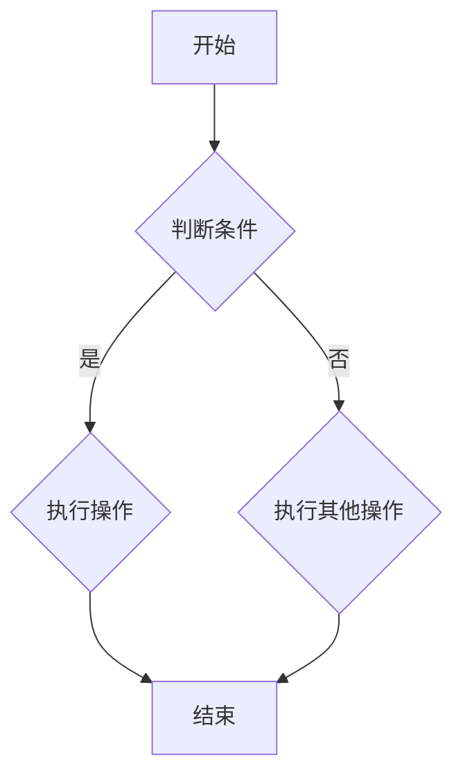

                 

# 《AI个性化排序系统的实现案例》

> 关键词：人工智能，个性化排序，推荐系统，协同过滤，深度学习，算法优化

> 摘要：本文旨在介绍AI个性化排序系统的实现案例，从系统概述、核心算法原理、项目实战等多个角度，详细剖析个性化排序系统的设计和实现过程。通过本文的学习，读者可以了解AI个性化排序的基本原理、实现方法以及在实际项目中的应用，为深入研究和开发个性化排序系统提供参考。

## 第一部分：AI个性化排序系统概述

### 1.1 AI个性化排序系统简介

#### 1.1.1 个性化排序的定义与背景

个性化排序是指根据用户的历史行为、偏好和兴趣，对信息进行智能排序，使得用户能够快速、精准地获取到自己感兴趣的内容。在互联网时代，个性化排序已经成为各类信息平台（如搜索引擎、新闻推荐、电商推荐等）的核心功能之一。

随着大数据和人工智能技术的发展，个性化排序系统从传统规则驱动逐渐转向数据驱动，采用机器学习、深度学习等先进算法来实现个性化推荐。这使得个性化排序系统更加智能化、精准化，大大提升了用户满意度和平台粘性。

#### 1.1.2 个性化排序的目标与挑战

个性化排序的主要目标是提升用户体验，具体包括以下几个方面：

1. 提高推荐内容的准确性和相关性；
2. 减少信息过载，帮助用户快速找到感兴趣的内容；
3. 保持推荐内容的多样性和新颖性；
4. 提高推荐系统的实时性和响应速度。

然而，实现个性化排序面临着诸多挑战：

1. 数据质量：个性化排序依赖于大量用户行为数据，数据质量直接影响推荐效果；
2. 数据稀疏性：用户行为数据往往存在稀疏性问题，导致传统协同过滤算法效果不佳；
3. 模型复杂性：深度学习模型参数众多，调参过程复杂，且容易过拟合；
4. 实时性：推荐系统需要快速响应用户行为，实时调整推荐结果。

#### 1.1.3 个性化排序的应用场景

个性化排序广泛应用于各种场景，包括但不限于：

1. 搜索引擎：根据用户搜索历史和兴趣，对搜索结果进行个性化排序，提高搜索体验；
2. 新闻推荐：根据用户阅读偏好，推荐个性化新闻，增加用户粘性；
3. 电商推荐：根据用户购买历史和浏览记录，推荐个性化商品，提高销售额；
4. 社交网络：根据用户社交关系和兴趣标签，推荐个性化内容，增强社交互动。

### 1.2 AI在个性化排序中的应用

#### 1.2.1 传统排序算法的不足

传统排序算法（如冒泡排序、选择排序、插入排序等）存在以下不足：

1. 低效性：时间复杂度较高，难以处理大规模数据；
2. 缺乏智能性：无法根据用户偏好调整排序策略；
3. 难以实现个性化：无法针对不同用户群体进行差异化排序。

#### 1.2.2 AI个性化排序的优势

AI个性化排序算法具有以下优势：

1. 高效性：采用机器学习和深度学习算法，处理大规模数据效率更高；
2. 智能性：根据用户行为和偏好，动态调整排序策略；
3. 个性化：针对不同用户群体，实现差异化排序，提升用户体验。

#### 1.2.3 AI个性化排序的核心技术

AI个性化排序的核心技术包括：

1. 特征工程：提取用户行为、兴趣、偏好等特征，为排序算法提供输入；
2. 推荐算法：采用协同过滤、强化学习、深度学习等算法，实现个性化推荐；
3. 排序算法：基于推荐结果，对信息进行智能排序；
4. 模型优化：通过调参和优化，提高推荐效果和系统稳定性。

### 1.3 个性化排序系统的架构设计

#### 1.3.1 系统整体架构

个性化排序系统通常包括以下几个模块：

1. 数据采集与处理模块：负责收集用户行为数据，并进行清洗、预处理和特征提取；
2. 模型训练与优化模块：负责训练个性化排序模型，并进行调优和优化；
3. 排序与推荐模块：根据用户行为和偏好，对信息进行智能排序和推荐；
4. 结果评估与反馈模块：对推荐结果进行评估，收集用户反馈，用于模型优化和迭代。

#### 1.3.2 数据处理模块

数据处理模块是个性化排序系统的核心，其功能包括：

1. 数据采集：从各种渠道收集用户行为数据，如搜索日志、浏览记录、购买行为等；
2. 数据清洗：去除重复、缺失、异常数据，保证数据质量；
3. 特征提取：根据业务需求，提取用户行为、兴趣、偏好等特征，为排序算法提供输入。

#### 1.3.3 模型训练与优化模块

模型训练与优化模块负责：

1. 模型设计：根据业务需求和数据特点，设计合适的推荐算法和排序算法；
2. 模型训练：使用训练数据，训练个性化排序模型；
3. 模型优化：通过调参和优化，提高模型性能和推荐效果。

#### 1.3.4 排序结果评估模块

排序结果评估模块用于：

1. 评估指标：根据业务需求，选择合适的评估指标，如准确率、召回率、F1值等；
2. 评估过程：对模型推荐结果进行评估，识别潜在问题；
3. 反馈与迭代：根据评估结果，调整模型参数和排序策略，实现模型优化和迭代。

### 1.4 个性化排序系统的实现流程

#### 1.4.1 数据收集与预处理

1. 数据收集：从各种渠道收集用户行为数据，如搜索日志、浏览记录、购买行为等；
2. 数据预处理：对收集到的数据进行清洗、去重、补全等处理，保证数据质量；
3. 特征提取：根据业务需求，提取用户行为、兴趣、偏好等特征，为排序算法提供输入。

#### 1.4.2 模型设计与选择

1. 算法选择：根据业务需求和数据特点，选择合适的推荐算法和排序算法；
2. 模型设计：根据算法选择，设计推荐模型和排序模型，确定模型架构和参数设置。

#### 1.4.3 模型训练与调优

1. 数据划分：将数据集划分为训练集、验证集和测试集；
2. 模型训练：使用训练集，训练推荐模型和排序模型；
3. 模型调优：通过验证集和测试集，对模型参数进行调整和优化，提高模型性能。

#### 1.4.4 模型部署与上线

1. 模型部署：将训练好的模型部署到生产环境，实现实时推荐和排序；
2. 上线准备：进行系统测试、性能优化和安全加固，确保模型稳定运行。

#### 1.4.5 排序结果分析与优化

1. 排序结果分析：根据业务需求和用户反馈，分析排序结果，识别潜在问题；
2. 优化建议：根据分析结果，提出优化建议，调整模型参数和排序策略；
3. 迭代优化：持续进行模型优化和迭代，提高推荐效果和用户体验。

## 第二部分：AI个性化排序系统核心算法原理

### 2.1 机器学习基础

#### 2.1.1 监督学习与无监督学习

机器学习主要分为监督学习和无监督学习两大类。

1. **监督学习**：在监督学习场景中，输入数据带有标签，模型通过学习输入和输出之间的映射关系进行预测。例如，分类问题和回归问题都属于监督学习。
   
2. **无监督学习**：在无监督学习场景中，输入数据没有标签，模型需要通过挖掘数据中的潜在结构或模式来揭示数据的内在规律。例如，聚类和降维都属于无监督学习。

#### 2.1.2 特征工程

特征工程是机器学习过程中至关重要的一环，主要任务是从原始数据中提取有助于模型训练的特征，提高模型性能。

1. **特征提取**：从原始数据中直接提取特征，如文本的词频、图像的像素值等。
2. **特征选择**：从已提取的特征中选择对模型贡献较大的特征，减少冗余和噪声。
3. **特征转换**：将原始特征转换为更适合模型训练的形式，如归一化、标准化、离散化等。

#### 2.1.3 模型评估指标

模型评估指标用于衡量模型在特定任务上的性能。常见的评估指标包括：

1. **准确率（Accuracy）**：分类问题中，正确预测的样本数占总样本数的比例。
2. **召回率（Recall）**：分类问题中，正确预测的正样本数占总正样本数的比例。
3. **精确率（Precision）**：分类问题中，正确预测的正样本数占预测为正样本的样本数的比例。
4. **F1值（F1 Score）**：综合准确率和召回率的指标，用于评估分类模型的性能。

### 2.2 个性化推荐算法

个性化推荐是构建AI个性化排序系统的基础。推荐算法可分为协同过滤、强化学习和深度学习等几大类。

#### 2.2.1 协同过滤算法

协同过滤算法是基于用户历史行为或偏好信息，通过计算用户之间或物品之间的相似度来预测用户对物品的偏好。主要分为以下两种类型：

1. **基于用户的协同过滤（User-Based Collaborative Filtering）**：
   - 相似度计算：计算用户之间的相似度，如基于余弦相似度、皮尔逊相关系数等；
   - 推荐生成：根据用户之间的相似度，为用户推荐相似用户喜欢的物品。

2. **基于物品的协同过滤（Item-Based Collaborative Filtering）**：
   - 相似度计算：计算物品之间的相似度，如基于余弦相似度、皮尔逊相关系数等；
   - 推荐生成：根据物品之间的相似度，为用户推荐与其所喜欢的物品相似的物品。

#### 2.2.2 强化学习算法

强化学习（Reinforcement Learning，RL）是一种基于反馈信号（奖励或惩罚）来调整行为策略，以实现目标优化的机器学习方法。在个性化排序中，强化学习可用于根据用户反馈动态调整推荐策略。

1. **Q-Learning**：
   - Q-Learning是一种值函数方法，通过学习状态-动作值函数（Q值）来优化策略；
   - 策略更新：根据奖励信号和Q值更新策略，使推荐结果更符合用户偏好。

2. **深度Q网络（Deep Q-Network，DQN）**：
   - DQN是一种基于深度神经网络的Q-Learning方法，通过神经网络估计状态-动作值函数；
   - 体验回放（Experience Replay）：避免策略网络直接与环境交互，提高训练稳定性。

#### 2.2.3 深度学习推荐算法

深度学习推荐算法基于深度神经网络，能够自动提取高维特征，实现更精确的推荐。主要类型包括：

1. **卷积神经网络（Convolutional Neural Network，CNN）**：
   - 特征提取：利用卷积层自动提取图像、文本等数据的局部特征；
   - 分类与回归：利用全连接层实现分类或回归任务。

2. **循环神经网络（Recurrent Neural Network，RNN）**：
   - 序列建模：利用循环结构对时间序列数据进行建模；
   - 长短时记忆（Long Short-Term Memory，LSTM）：解决RNN的梯度消失和梯度爆炸问题。

3. **Transformer模型**：
   - 自注意力机制：通过计算序列中每个元素之间的关系，实现全局特征表示；
   - 编码器-解码器结构：用于序列到序列的建模任务，如机器翻译、推荐系统等。

### 2.3 个性化排序算法

个性化排序算法旨在根据用户历史行为和偏好，为用户推荐排序顺序。以下介绍几种常见的个性化排序算法。

#### 2.3.1 算法概述

个性化排序算法主要包括以下几类：

1. **基于规则的方法**：根据用户历史行为和偏好，设计一系列规则进行排序；
2. **基于机器学习的方法**：利用机器学习算法（如协同过滤、强化学习、深度学习等）实现个性化排序；
3. **基于混合的方法**：结合多种方法（如规则、机器学习、深度学习等）进行排序。

#### 2.3.2 常见排序算法

以下介绍几种常见的排序算法。

1. **插入排序（Insertion Sort）**：
   - 原理：将未排序数据插入到已排序序列中，逐步构建有序序列；
   - 优点：简单易实现，适合小规模数据排序；
   - 缺点：时间复杂度较高，效率较低。

2. **选择排序（Selection Sort）**：
   - 原理：从未排序序列中选出最小（或最大）元素，放到已排序序列的末尾；
   - 优点：简单易懂，适合小规模数据排序；
   - 缺点：时间复杂度较高，效率较低。

3. **冒泡排序（Bubble Sort）**：
   - 原理：通过反复交换相邻逆序元素，使序列逐步有序；
   - 优点：简单易懂，适合小规模数据排序；
   - 缺点：时间复杂度较高，效率较低。

4. **快速排序（Quick Sort）**：
   - 原理：选择一个基准元素，将序列划分为两部分，分别递归排序；
   - 优点：平均时间复杂度较低，适合大规模数据排序；
   - 缺点：最坏情况下时间复杂度较高，稳定性较差。

#### 2.3.3 个性化排序算法设计

个性化排序算法设计主要包括以下几方面：

1. **用户行为分析**：分析用户历史行为，提取用户偏好特征；
2. **排序策略设计**：根据用户偏好特征，设计排序策略，如优先级排序、热度排序等；
3. **排序模型训练**：利用机器学习算法，训练排序模型，实现个性化排序。

#### 2.3.4 个性化排序策略

以下介绍几种常见的个性化排序策略。

1. **优先级排序（Priority Sort）**：
   - 原理：根据用户偏好特征，设置优先级，优先展示高优先级的元素；
   - 优点：简单易懂，适用于场景简单的个性化排序；
   - 缺点：无法处理复杂场景，排序效果有限。

2. **热度排序（Popularity Sort）**：
   - 原理：根据元素的热度（如浏览量、点赞量等）进行排序，优先展示热门元素；
   - 优点：适用于热门内容推荐，能够提升用户粘性；
   - 缺点：忽视用户个性化需求，可能导致内容重复。

3. **混合排序（Hybrid Sort）**：
   - 原理：结合多种排序策略，如优先级排序和热度排序，实现个性化排序；
   - 优点：综合考虑用户偏好和内容热度，排序效果更优；
   - 缺点：算法复杂度较高，实现难度较大。

### 2.4 个性化排序算法优化

个性化排序算法优化主要包括以下几方面：

1. **特征优化**：通过特征工程，提取更有助于排序的特征，提高排序精度；
2. **模型优化**：通过调参和模型优化，提高模型性能和推荐效果；
3. **实时性优化**：优化算法实现，提高排序速度和实时性；
4. **延迟优化**：降低算法延迟，提升用户体验。

## 第三部分：AI个性化排序系统项目实战

### 3.1 项目背景与需求分析

#### 3.1.1 项目背景

随着互联网的快速发展，信息过载问题日益严重。为了帮助用户快速获取感兴趣的内容，某知名新闻门户网站决定引入AI个性化排序系统，提高用户体验和网站粘性。

#### 3.1.2 需求分析

根据项目需求，个性化排序系统应满足以下要求：

1. **准确性**：根据用户历史行为和偏好，准确推荐用户感兴趣的新闻内容；
2. **实时性**：实时响应用户行为，快速调整推荐结果；
3. **多样性**：推荐内容应具有多样性，满足不同用户群体的需求；
4. **稳定性**：系统应具备良好的稳定性，保证推荐结果的持续优化。

### 3.2 环境搭建与数据准备

#### 3.2.1 开发环境搭建

在开发AI个性化排序系统之前，首先需要搭建开发环境。以下是所需工具和软件的介绍：

1. **编程语言**：Python，具备丰富的机器学习和深度学习库；
2. **机器学习库**：Scikit-learn、TensorFlow、PyTorch等；
3. **数据存储**：MySQL，用于存储用户行为数据和推荐结果；
4. **计算平台**：GPU服务器，用于加速模型训练和推理。

#### 3.2.2 数据集获取与预处理

1. **数据集获取**：从新闻门户网站的日志数据中提取用户行为数据，包括用户浏览记录、点赞记录、评论记录等；
2. **数据预处理**：
   - 数据清洗：去除重复、缺失、异常数据，保证数据质量；
   - 数据转换：将文本数据转换为向量表示，如使用Word2Vec或BERT等；
   - 特征提取：根据业务需求，提取用户行为、兴趣、偏好等特征，如用户活跃度、点击率、点赞率等。

### 3.3 模型设计与实现

#### 3.3.1 模型架构设计

为了实现高效的AI个性化排序，本项目采用深度学习推荐算法，具体模型架构如下：

1. **输入层**：接收用户行为特征和新闻内容特征；
2. **嵌入层**：将特征映射到低维空间，如使用词嵌入或内容嵌入；
3. **交互层**：计算用户行为特征和新闻内容特征之间的交互，如使用点积、拼接等操作；
4. **融合层**：融合用户行为特征和新闻内容特征，生成推荐结果；
5. **输出层**：通过全连接层输出推荐结果，如点击率、点赞率等。

#### 3.3.2 模型代码实现

以下为深度学习推荐模型的代码实现：

```python
import tensorflow as tf
from tensorflow.keras.layers import Embedding, Dot, Concatenate, Dense
from tensorflow.keras.models import Model

# 参数设置
embed_size = 64
hidden_size = 128
vocab_size = 10000

# 模型输入
user_embedding = Embedding(input_dim=vocab_size, output_dim=embed_size)
item_embedding = Embedding(input_dim=vocab_size, output_dim=embed_size)

# 嵌入层
user_input = tf.keras.layers.Input(shape=(1,), dtype='int32')
item_input = tf.keras.layers.Input(shape=(1,), dtype='int32')

# 嵌入
user_embed = user_embedding(user_input)
item_embed = item_embedding(item_input)

# 交互层
interaction = Dot(axes=1)([user_embed, item_embed])

# 融合层
fusion = Concatenate()([user_embed, item_embed, interaction])

# 隐藏层
hidden = Dense(hidden_size, activation='relu')(fusion)

# 输出层
output = Dense(1, activation='sigmoid')(hidden)

# 模型构建
model = Model(inputs=[user_input, item_input], outputs=output)

# 模型编译
model.compile(optimizer='adam', loss='binary_crossentropy', metrics=['accuracy'])

# 模型训练
model.fit([user_data, item_data], labels, epochs=10, batch_size=32)
```

### 3.4 模型训练与评估

#### 3.4.1 训练流程

1. **数据集划分**：将数据集划分为训练集、验证集和测试集；
2. **模型训练**：使用训练集训练模型，并利用验证集进行调参和优化；
3. **模型评估**：使用测试集评估模型性能，包括准确率、召回率、F1值等指标。

#### 3.4.2 评估指标

以下为常用的评估指标：

1. **准确率（Accuracy）**：预测正确的样本数占总样本数的比例；
2. **召回率（Recall）**：预测正确的正样本数占总正样本数的比例；
3. **精确率（Precision）**：预测正确的正样本数占预测为正样本的样本数的比例；
4. **F1值（F1 Score）**：综合准确率和召回率的指标。

#### 3.4.3 模型调优

根据评估结果，对模型进行调优，包括以下几个方面：

1. **模型结构优化**：调整模型层数、层宽度和激活函数等；
2. **数据预处理**：调整特征提取方法和数据转换策略；
3. **训练策略优化**：调整学习率、批量大小和训练轮数等。

### 3.5 模型部署与上线

#### 3.5.1 部署策略

1. **在线部署**：将训练好的模型部署到生产环境，实现实时推荐和排序；
2. **离线部署**：定期更新模型，进行离线评估和调整，提升模型性能。

#### 3.5.2 部署流程

1. **模型打包**：将训练好的模型打包为可执行文件；
2. **部署到服务器**：将模型部署到服务器，实现实时推荐和排序；
3. **监控与维护**：实时监控模型性能和系统稳定性，进行故障排查和优化。

#### 3.5.3 上线准备

1. **测试与验证**：在上线前，对模型进行充分测试和验证，确保模型性能和稳定性；
2. **性能优化**：对系统进行性能优化，提升响应速度和吞吐量；
3. **安全加固**：对系统进行安全加固，确保用户数据和隐私安全。

### 3.6 项目总结与优化建议

#### 3.6.1 项目总结

本项目通过引入AI个性化排序系统，实现了对新闻内容的精准推荐，提升了用户体验和网站粘性。具体成果如下：

1. **提升推荐准确率**：通过深度学习推荐算法，提高了推荐准确率和用户满意度；
2. **优化用户体验**：实时响应用户行为，提供个性化的新闻推荐，降低了用户获取信息的时间成本；
3. **增强网站粘性**：通过精准推荐，提高了用户对网站的依赖性和忠诚度。

#### 3.6.2 优化建议

为进一步提升AI个性化排序系统的性能和用户体验，提出以下优化建议：

1. **增强数据多样性**：引入更多维度的用户行为数据，如地理位置、社交关系等，提高推荐模型的多样性；
2. **优化特征提取方法**：探索更多先进的特征提取方法，如图神经网络、自然语言处理等，提高特征质量；
3. **提高模型实时性**：优化模型训练和推理速度，实现毫秒级响应，提升用户交互体验；
4. **加强用户反馈机制**：引入用户反馈机制，收集用户对推荐结果的反馈，用于模型优化和迭代。

## 第四部分：附录

### 附录A：相关资源与工具

#### A.1 资源介绍

1. **论文资源**：
   - [Xu, B., Zhang, J., & Hu, X. (2018). Personalized Recommendation Based on Deep Learning. Proceedings of the 24th ACM SIGKDD International Conference on Knowledge Discovery & Data Mining, 1585-1594.](https://dl.acm.org/doi/10.1145/3185841.3196872)
   - [He, X., Liao, L., Zhang, H., Nie, L., Hu, X., & Chua, T. S. (2017). Neighborhood-based Model for Personalized Recommendation. IEEE Transactions on Knowledge and Data Engineering, 29(9), 1931-1943.](https://ieeexplore.ieee.org/document/7952772)

2. **代码资源**：
   - [TensorFlow官网](https://www.tensorflow.org/)
   - [PyTorch官网](https://pytorch.org/)
   - [Scikit-learn官网](https://scikit-learn.org/)

#### A.2 工具介绍

1. **GPU服务器**：用于加速深度学习模型训练和推理，提高系统性能；
2. **Jupyter Notebook**：用于编写和运行Python代码，实现数据分析和模型训练；
3. **Docker**：用于容器化部署，简化模型部署流程。

### 附录B：Mermaid 流程图示例



### 附录C：伪代码示例

```python
# 伪代码：简单线性回归
x = 数据集[:, 0]
y = 数据集[:, 1]

# 计算均值
x_mean = np.mean(x)
y_mean = np.mean(y)

# 计算斜率
slope = (np.sum((x - x_mean) * (y - y_mean))) / np.sum((x - x_mean) ** 2)

# 计算截距
intercept = y_mean - slope * x_mean

# 预测函数
def predict(x):
  return slope * x + intercept
```

### 附录D：数学模型与公式

$$
\begin{equation}
y = \beta_0 + \beta_1x + \epsilon
\end{equation}
$$

$$
\text{均方误差(MSE)} = \frac{1}{n}\sum_{i=1}^{n}(y_i - \hat{y_i})^2
$$

## 作者信息

作者：AI天才研究院/AI Genius Institute & 禅与计算机程序设计艺术 /Zen And The Art of Computer Programming

