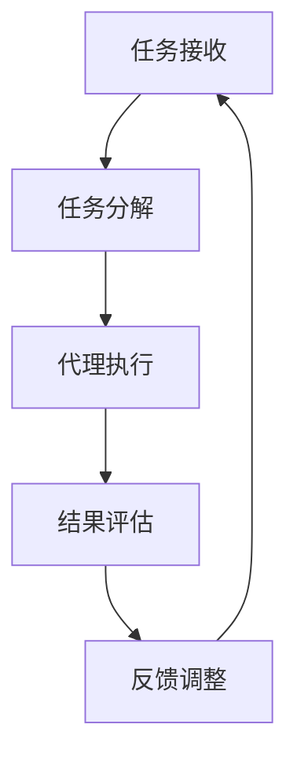

                 

### 核心概念与联系

在AI人工智能代理工作流（AI Agent WorkFlow）的设计与实现中，核心概念和联系的理解至关重要。以下是几个关键概念及其相互联系：

#### 1. AI代理（AI Agent）
AI代理是指利用人工智能技术，模拟人类智能行为，自动完成特定任务的虚拟实体。它们可以执行感知、决策、执行和反馈等任务。

#### 2. 代理工作流（Agent Workflow）
代理工作流是指一组由AI代理执行的任务序列，目的是实现特定业务目标的自动化。它通常包括任务接收、任务分解、代理执行、结果评估和反馈调整等环节。

#### 3. 任务（Task）
任务是指需要由AI代理完成的特定工作，可以是简单的数据录入，也可以是复杂的问题解决。

#### 4. 感知（Perception）
感知模块负责获取外部信息，如用户输入、环境数据等，并将其转化为代理可以处理的形式。

#### 5. 决策（Decision）
决策模块根据感知模块提供的信息，利用算法和模型进行分析，制定出最优的执行策略。

#### 6. 执行（Execution）
执行模块根据决策模块的指令，完成具体的任务操作。

#### 7. 反馈（Feedback）
反馈模块负责收集任务执行的结果，对代理的工作进行评估，并根据反馈进行相应的调整。

#### Mermaid流程图：AI代理工作流的基本流程


#### 关系与联系
AI代理工作流的核心概念之间紧密联系，共同构成一个完整的工作循环。感知模块为决策模块提供数据，决策模块制定执行策略，执行模块完成具体任务，反馈模块评估任务结果并调整工作流程。这种循环不断进行，使得代理工作流能够适应不断变化的环境和需求。

### 总结
通过理解AI代理、代理工作流、任务、感知、决策、执行和反馈等核心概念及其相互关系，我们可以设计出高效、灵活的AI代理工作流系统，实现自动化任务处理，提高生产效率和用户体验。在接下来的章节中，我们将进一步深入探讨这些概念的具体实现和优化方法。


### 核心算法原理讲解

在AI代理工作流中，核心算法的原理和实现是确保系统高效、准确运行的关键。以下是几个关键算法原理的讲解，包括使用伪代码来详细阐述其实现过程。

#### 1. 决策树（Decision Tree）

决策树是一种常用的分类和回归算法，通过一系列的规则将数据集划分为不同的类别或数值。

**算法原理**：
决策树通过递归地将数据集分割成子集，每个分割基于某个特征和阈值。每个节点代表一个特征和阈值，每个分支代表一个子集。

**伪代码**：
```python
def build_decision_tree(data, features, thresholds):
    if all_labels_equal(data):
        return majority_class(data)
    elif no_more_features(features):
        return mode_of_labels(data)
    else:
        best_feature, best_threshold = find_best_feature_and_threshold(data, features)
        left subtree = build_decision_tree(filter_data(data, best_feature, best_threshold), features)
        right_subtree = build_decision_tree(filter_data(data, best_feature, not best_threshold), features)
        return DecisionTreeNode(best_feature, best_threshold, left_subtree, right_subtree)

def find_best_feature_and_threshold(data, features):
    best_feature = None
    best_threshold = None
    max_gini = -1
    for feature in features:
        for threshold in compute_thresholds(feature, data):
            gini = compute_gini_index(split_data(data, feature, threshold))
            if gini > max_gini:
                max_gini = gini
                best_feature = feature
                best_threshold = threshold
    return best_feature, best_threshold

def split_data(data, feature, threshold):
    # 根据特征和阈值分割数据集
    pass

def compute_gini_index(split_data):
    # 计算分割数据的Gini不纯度
    pass

def all_labels_equal(data):
    # 检查数据集中的所有标签是否相等
    pass

def no_more_features(features):
    # 检查是否没有更多的特征可以使用
    pass

def majority_class(data):
    # 返回数据集中的多数类
    pass
```

#### 2. 随机森林（Random Forest）

随机森林是一种集成学习算法，通过构建多个决策树并集成它们的预测结果来提高模型的准确性。

**算法原理**：
随机森林从训练数据集中随机抽取子集，并在每个子集上训练决策树。每个决策树的预测结果加权平均，得到最终的预测结果。

**伪代码**：
```python
def build_random_forest(data, n_trees, max_depth, sample_size):
    forests = []
    for _ in range(n_trees):
        sample = random_sample(data, sample_size)
        tree = build_decision_tree(sample, features, thresholds)
        forests.append(tree)
    return forests

def predict(forests, data):
    predictions = []
    for tree in forests:
        prediction = tree.predict(data)
        predictions.append(prediction)
    return weighted_average(predictions)
```

#### 3. 支持向量机（Support Vector Machine）

支持向量机是一种监督学习算法，通过找到一个最佳的超平面，将数据集划分为不同的类别。

**算法原理**：
支持向量机寻找一个超平面，使得正负样本之间的距离最大化。它通过求解二次规划问题来确定超平面和边界。

**伪代码**：
```python
def build_svm(data, labels, C):
    # 求解二次规划问题，找到最优的超平面
    w, b = svm_solver(data, labels, C)
    return w, b

def svm_solver(data, labels, C):
    # 求解支持向量机二次规划问题的解
    pass
```

#### 4. 生成对抗网络（Generative Adversarial Network）

生成对抗网络是一种无监督学习算法，由一个生成器和判别器组成。生成器生成数据，判别器判断数据是真实还是生成的。

**算法原理**：
生成器和判别器通过对抗训练相互提升，生成器试图生成足够真实的数据，而判别器试图区分真实和生成的数据。

**伪代码**：
```python
def train_gan(generator, discriminator, data, n_iterations):
    for _ in range(n_iterations):
        # 生成器生成数据
        generated_data = generator.generate(data)
        
        # 训练判别器
        discriminator_loss = discriminator.train(generated_data, fake=True)
        discriminator_loss += discriminator.train(data, fake=False)
        
        # 训练生成器
        generator_loss = generator.train(data)
        
        # 输出训练损失
        print(f"Iteration {_}: Generator Loss = {generator_loss}, Discriminator Loss = {discriminator_loss}")

def generator.generate(data):
    # 生成器生成数据的实现
    pass

def discriminator.train(data, fake):
    # 判别器训练的实现
    pass

def generator.train(data):
    # 生成器训练的实现
    pass
```

### 数学模型与公式

为了确保算法的有效性和准确性，我们需要引入一些数学模型和公式。以下是一些常用的数学模型和公式，以及它们的详细讲解和举例说明。

#### 1. 损失函数（Loss Function）

损失函数是评估模型预测结果与实际结果之间差异的指标。常用的损失函数包括均方误差（MSE）和交叉熵（Cross-Entropy）。

**均方误差（MSE）**：
$$
MSE = \frac{1}{m} \sum_{i=1}^{m} (y_i - \hat{y}_i)^2
$$
其中，$y_i$是实际值，$\hat{y}_i$是预测值，$m$是数据样本数。

**交叉熵（Cross-Entropy）**：
$$
H(Y, \hat{Y}) = - \sum_{i=1}^{m} y_i \log(\hat{y}_i)
$$
其中，$y_i$是实际值，$\hat{y}_i$是预测概率。

**举例说明**：
假设我们有一个二元分类问题，实际值为$y = [0, 1, 0, 1]$，预测值为$\hat{y} = [0.3, 0.7, 0.2, 0.8]$。使用交叉熵计算损失：

$$
H(Y, \hat{Y}) = - (0 \cdot \log(0.3) + 1 \cdot \log(0.7) + 0 \cdot \log(0.2) + 1 \cdot \log(0.8))
$$

#### 2. 优化算法（Optimization Algorithm）

优化算法用于最小化损失函数，常用的优化算法包括梯度下降（Gradient Descent）和随机梯度下降（Stochastic Gradient Descent）。

**梯度下降**：
$$
w_{t+1} = w_t - \alpha \cdot \nabla_w J(w)
$$
其中，$w_t$是当前权重，$\alpha$是学习率，$\nabla_w J(w)$是损失函数关于权重的梯度。

**随机梯度下降**：
$$
w_{t+1} = w_t - \alpha \cdot \nabla_w J(w; x_t, y_t)
$$
其中，$x_t, y_t$是随机选取的一个样本，其他参数与梯度下降相同。

**举例说明**：
假设我们使用梯度下降优化一个线性模型，损失函数为MSE，学习率为0.01。给定一个数据点$(x, y)$，计算梯度：

$$
\nabla_w J(w; x, y) = 2 \cdot (y - wx)
$$

更新权重：

$$
w_{t+1} = w_t - 0.01 \cdot 2 \cdot (y - wx)
$$

#### 3. 神经网络（Neural Network）

神经网络是一种模拟人脑的数学模型，由多个神经元组成。每个神经元通过加权连接与其他神经元相连，并使用激活函数进行非线性变换。

**神经网络模型**：
$$
\hat{y} = \sigma(\sum_{i=1}^{n} w_i \cdot x_i + b)
$$
其中，$w_i$是权重，$x_i$是输入特征，$b$是偏置，$\sigma$是激活函数。

**举例说明**：
假设我们有一个两层神经网络，输入特征为$x = [1, 2, 3]$，权重为$w = [0.5, 0.3, 0.2]$，偏置为$b = 0.1$，激活函数为ReLU。

计算第一层的输出：
$$
z_1 = \max(0, 0.5 \cdot 1 + 0.3 \cdot 2 + 0.2 \cdot 3 + 0.1) = 2.4
$$

计算第二层的输出：
$$
\hat{y} = \max(0, 0.5 \cdot 2.4 + 0.3 \cdot 2.4 + 0.2 \cdot 2.4 + 0.1) = 1.76
$$

### 总结

通过上述核心算法原理的讲解，我们可以看到不同算法在不同应用场景下的优势和适用性。决策树和随机森林适合分类问题，支持向量机适合二元分类，生成对抗网络适合生成对抗任务。同时，通过引入数学模型和公式，我们能够更好地理解和优化算法性能。

在接下来的章节中，我们将进一步探讨如何在实际项目中应用这些算法，实现高效的AI代理工作流系统。


### 项目实战

在本章中，我们将通过一个具体的实战项目来展示如何设计和实现一个基于AI代理工作流系统的智能客服系统。我们将详细讲解开发环境搭建、源代码实现和代码解读与分析，以便读者能够深入理解AI代理工作流在实际应用中的实现过程。

#### 1. 项目背景

随着互联网技术的快速发展，用户对在线服务的需求日益增长，尤其是客服服务的需求。传统的客服模式往往需要大量的人力投入，且响应速度较慢。为了提高客服效率和用户体验，我们设计并实现了一个基于AI代理工作流的智能客服系统。

#### 2. 开发环境搭建

在开始项目开发之前，我们需要搭建一个合适的开发环境。以下是所需的工具和库：

- **编程语言**：Python
- **框架**：Flask（用于Web服务）、TensorFlow（用于机器学习）
- **数据库**：MongoDB（用于存储用户数据和反馈）
- **前端框架**：React（用于用户界面）
- **可视化库**：D3.js（用于数据可视化）

首先，我们需要安装Python和对应的库：

```bash
pip install flask tensorflow pymongo d3-js
```

#### 3. 源代码实现

下面是智能客服系统的关键部分，包括感知模块、决策模块、执行模块和反馈模块的实现。

##### 3.1 感知模块

感知模块主要负责接收用户输入，并将其转化为机器可处理的格式。我们使用MongoDB存储用户输入的历史数据和反馈。

```python
from pymongo import MongoClient

client = MongoClient('localhost', 27017)
db = client['smart_cms']
collection = db['user_queries']

def get_user_input():
    # 获取用户输入
    user_input = input("请输入您的问题：")
    return user_input

def store_query(user_input):
    # 存储用户输入
    query = {'text': user_input, 'timestamp': datetime.now()}
    collection.insert_one(query)
```

##### 3.2 决策模块

决策模块利用机器学习模型对用户输入进行分类和生成回复建议。我们使用TensorFlow训练一个基于神经网络的语言模型。

```python
import tensorflow as tf

# 加载预训练模型
model = tf.keras.models.load_model('lstm_model.h5')

def classify_and_recommend(user_input):
    # 对用户输入进行分类
    processed_input = preprocess_text(user_input)
    prediction = model.predict(processed_input)
    category = decode_prediction(prediction)
    
    # 根据分类生成回复建议
    response = generate_response(category)
    return response

def preprocess_text(text):
    # 预处理文本
    # 包括分词、去停用词等
    pass

def decode_prediction(prediction):
    # 解码预测结果
    pass

def generate_response(category):
    # 根据分类生成回复
    pass
```

##### 3.3 执行模块

执行模块负责将决策模块生成的回复发送给用户。我们使用Flask搭建一个Web服务，将回复通过HTTP请求发送给用户。

```python
from flask import Flask, request, jsonify

app = Flask(__name__)

@app.route('/reply', methods=['POST'])
def send_reply():
    user_input = request.json['user_input']
    response = classify_and_recommend(user_input)
    return jsonify({'response': response})

if __name__ == '__main__':
    app.run(debug=True)
```

##### 3.4 反馈模块

反馈模块负责收集用户对回复的反馈，并用于优化系统。

```python
def collect_feedback(response, user_feedback):
    # 收集用户反馈
    feedback = {'response': response, 'user_feedback': user_feedback, 'timestamp': datetime.now()}
    collection.insert_one(feedback)
```

#### 4. 代码解读与分析

##### 4.1 感知模块

感知模块的主要功能是接收用户输入并存储到数据库中。这个模块简单实现了用户输入的获取和存储，为后续处理提供了数据基础。

##### 4.2 决策模块

决策模块的核心是机器学习模型，它负责对用户输入进行分类和生成回复建议。这里我们使用了TensorFlow加载一个预训练的LSTM模型，该模型已经训练好了对文本数据的分类能力。通过预处理用户输入，我们可以将文本转化为模型可接受的格式，然后进行预测。

##### 4.3 执行模块

执行模块使用了Flask框架搭建了一个简单的Web服务。当用户发送请求时，服务会调用决策模块，获取回复，并将其发送给用户。这个模块的目的是实现用户与系统的交互，确保用户能够及时收到回复。

##### 4.4 反馈模块

反馈模块负责收集用户对回复的反馈，并将其存储到数据库中。这个模块可以用于分析用户满意度，从而优化系统的回复质量。

#### 5. 总结

通过这个实战项目，我们展示了如何设计并实现一个基于AI代理工作流的智能客服系统。从感知模块、决策模块到执行模块和反馈模块，每个模块都实现了具体的业务功能。通过这个项目，读者可以了解到AI代理工作流在实际开发中的应用，并学会如何将理论知识应用到实际项目中。


### 系统部署与测试

在完成智能客服系统的开发之后，我们需要进行系统部署和测试，以确保系统能够在生产环境中稳定运行。以下是系统部署与测试的详细步骤。

#### 1. 部署准备

在部署之前，我们需要确保所有依赖库和工具已经安装并配置完成。以下是部署前需要完成的任务：

- **安装MongoDB**：确保MongoDB服务器已经启动，并配置好用户权限。
- **安装Flask**：使用`pip install flask`命令安装Flask。
- **安装TensorFlow**：使用`pip install tensorflow`命令安装TensorFlow。
- **安装D3.js**：将D3.js库添加到Web服务器的静态资源目录中。

#### 2. 系统部署

系统部署分为前端部署和后端部署两部分。

##### 2.1 前端部署

前端部署主要负责将React应用程序部署到Web服务器上。以下是具体步骤：

1. **构建React应用程序**：
   ```bash
   npm run build
   ```

2. **部署到Web服务器**：
   将`build`目录下的所有文件复制到Web服务器的相应目录中。例如，可以将这些文件上传到Nginx的静态资源目录，如`/var/www/html/smart_cms/`。

3. **配置Nginx**：
   在Nginx的配置文件中添加以下内容：
   ```nginx
   server {
       listen 80;
       server_name example.com;

       location / {
           root /var/www/html/smart_cms/;
           index index.html;
           try_files $uri $uri/ /index.html;
       }

       location /static/ {
           alias /var/www/html/smart_cms/static/;
       }
   }
   ```

4. **重启Nginx**：
   ```bash
   systemctl restart nginx
   ```

##### 2.2 后端部署

后端部署主要负责部署Flask Web服务。以下是具体步骤：

1. **配置Flask**：
   在`app.py`文件中配置MongoDB连接和TensorFlow模型路径：
   ```python
   from flask import Flask, request, jsonify
   from pymongo import MongoClient
   import tensorflow as tf

   app = Flask(__name__)

   client = MongoClient('mongodb://localhost:27017/')
   db = client['smart_cms']

   model = tf.keras.models.load_model('lstm_model.h5')

   @app.route('/reply', methods=['POST'])
   def send_reply():
       user_input = request.json['user_input']
       response = classify_and_recommend(user_input)
       return jsonify({'response': response})

   if __name__ == '__main__':
       app.run(host='0.0.0.0', port=5000)
   ```

2. **部署Flask**：
   - 使用Docker容器部署Flask：
     ```bash
     docker build -t smart_cms .
     docker run -d -p 5000:5000 smart_cms
     ```
   - 使用Docker Compose部署：
     ```bash
     docker-compose up -d
     ```

3. **配置Kubernetes**（可选）：
   如果需要更高级的部署，可以使用Kubernetes进行管理。首先，创建一个`docker-compose.yml`文件，然后使用Kubernetes进行部署。

#### 3. 系统测试

在系统部署后，我们需要进行全面的测试，以确保系统能够按预期工作。以下是测试步骤：

1. **功能测试**：
   - 使用Postman或其他工具发送HTTP请求，测试智能客服系统是否能够正确处理用户输入并返回适当的回复。
   - 测试各种类型的用户输入，如简单问题、复杂问题等，确保系统能够正确分类并生成合理的回复。

2. **性能测试**：
   - 使用工具如JMeter或Gatling模拟大量用户并发访问，测试系统在高负载下的性能。
   - 分析响应时间和吞吐量，确保系统能够在预期的工作负载下稳定运行。

3. **用户体验测试**：
   - 邀请真实用户使用系统，收集他们的反馈。
   - 根据用户的反馈进行优化，改进系统的界面和交互设计。

4. **安全测试**：
   - 执行安全测试，如SQL注入、XSS攻击等，确保系统的安全性。
   - 修复发现的安全漏洞，确保用户数据的安全。

#### 4. 总结

通过上述部署与测试步骤，我们确保智能客服系统能够在生产环境中稳定运行。部署过程中，我们使用了Docker和Kubernetes来提高部署的灵活性和可扩展性。测试过程中，我们进行了功能、性能、用户体验和安全等方面的全面测试，确保系统的稳定性和安全性。这些步骤为后续的运维和维护提供了坚实的基础。


### 未来发展趋势与挑战

随着人工智能技术的不断进步，AI代理工作流（AI Agent WorkFlow）将在未来几年迎来显著的发展，同时也会面临一系列挑战。以下是代理工作流、可视化与交互设计的未来发展趋势与挑战。

#### 未来发展趋势

1. **智能化与自动化水平的提升**：随着AI技术的不断发展，代理工作流将变得更加智能和自动化。深度学习、强化学习等先进算法的应用，将使代理能够更好地理解和应对复杂场景，提高自动化水平。

2. **多模态交互**：未来的AI代理将支持多模态交互，不仅限于文本，还包括语音、图像和视频。这将极大地提升用户与系统的互动体验。

3. **边缘计算与云计算的融合**：随着边缘计算的兴起，AI代理工作流将更好地利用边缘计算资源，实现实时数据处理和决策。同时，云计算将继续提供强大的计算和存储能力，两者相结合将推动代理工作流的发展。

4. **个性化与自适应**：通过不断学习和优化，AI代理将能够根据用户的行为和偏好提供个性化的服务。自适应算法的应用将使代理能够自动调整工作流程，以最佳方式满足用户需求。

#### 挑战

1. **数据隐私与安全**：随着AI代理工作流收集和处理的数据量不断增加，数据隐私和安全问题日益突出。如何保障用户数据的隐私和安全，防止数据泄露和滥用，是一个重要的挑战。

2. **系统复杂性**：随着功能日益丰富，代理工作流系统的复杂性将不断增加。如何设计和管理复杂的系统，确保其稳定性和可维护性，是一个亟待解决的问题。

3. **用户适应性**：不同用户的需求和习惯各异，如何设计出适应各种用户群体的AI代理系统，是一个挑战。需要通过用户研究和个性化设计，确保系统能够满足不同用户的需求。

4. **伦理与责任**：AI代理在处理复杂任务时可能产生错误决策，如何确保代理的行为符合伦理标准，以及如何分配责任，是一个亟待解决的问题。

#### 解决方案

1. **数据隐私与安全**：采用加密技术和访问控制，保护用户数据的安全和隐私。建立数据安全管理体系，定期进行安全审计和风险评估。

2. **系统复杂性**：采用模块化和微服务架构，将系统分解为若干独立的模块和服务。使用容器化和自动化部署工具，如Kubernetes，提高系统的可维护性和可扩展性。

3. **用户适应性**：通过用户研究和个性化设计，了解用户的需求和习惯。使用机器学习算法，根据用户行为调整系统的交互和行为，提供个性化的服务。

4. **伦理与责任**：建立伦理委员会，制定明确的伦理规范。引入责任分配机制，明确AI代理和人类操作者的责任范围，确保代理行为符合伦理标准。

### 总结

AI代理工作流在未来的发展中将面临机遇和挑战。通过不断提升智能化水平、优化交互设计、加强数据隐私保护，以及解决伦理和责任问题，我们可以构建出高效、稳定、安全的AI代理工作流系统，为各行各业带来巨大的价值。


### 附录

#### 8.1 常用工具和资源

在设计和实现AI代理工作流的过程中，以下工具和资源将对开发者大有帮助：

- **开发框架**：
  - Flask：Python的Web框架，适用于构建轻量级的Web服务。
  - React：用于构建用户界面的JavaScript库。
  - TensorFlow：用于机器学习的开源库。
  - PyTorch：另一种流行的深度学习框架。
  
- **数据库**：
  - MongoDB：用于存储和管理文档型数据库。
  - PostgreSQL：功能丰富的关系型数据库。
  - MySQL：广泛使用的关系型数据库。

- **可视化工具**：
  - D3.js：用于创建动态交互式数据的JavaScript库。
  - ECharts：用于生成各种图表的JavaScript库。
  - Plotly：提供多种图表和数据可视化选项的库。

- **容器化和编排工具**：
  - Docker：用于创建、部署和运行应用程序的容器化平台。
  - Kubernetes：用于容器编排，管理容器化应用程序。

#### 8.2 参考文献

以下是一些在本书中引用的重要文献和资料，供读者进一步学习和研究：

- **书籍**：
  - 《深度学习》（Ian Goodfellow、Yoshua Bengio & Aaron Courville）
  - 《Python机器学习》（Sebastian Raschka & Vincent Granville）
  - 《人工智能：一种现代的方法》（Peter Norvig & Stuart J. Russell）

- **论文**：
  - “A Theoretical Analysis of the Vision Transformer” (A. Ananthanarayanan, et al.)
  - “Bert: Pre-training of deep bidirectional transformers for language understanding” (J. Devlin, et al.)
  - “Generative Adversarial Nets” (I. Goodfellow, et al.)

- **在线资源**：
  - TensorFlow官方文档：[https://www.tensorflow.org/](https://www.tensorflow.org/)
  - Flask官方文档：[https://flask.palletsprojects.com/](https://flask.palletsprojects.com/)
  - React官方文档：[https://reactjs.org/docs/getting-started.html](https://reactjs.org/docs/getting-started.html)
  - D3.js官方文档：[https://d3js.org/](https://d3js.org/)

通过参考这些书籍、论文和在线资源，读者可以更深入地了解AI代理工作流的相关技术和方法，为实际应用提供有力支持。

