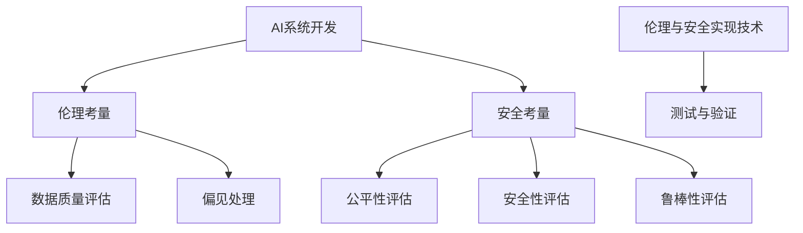

                 

# AI伦理与安全：构建负责任的AI系统

> 关键词：AI伦理，安全，负责任，AI系统，AI伦理原则，法律与政策框架

> 摘要：随着人工智能（AI）技术的迅猛发展，AI伦理与安全成为了一个备受关注的话题。本文从AI伦理与安全的基本概念出发，详细探讨了AI伦理的核心原则、法律与政策框架，以及如何在AI系统开发中考虑伦理与安全因素。通过案例分析，本文展示了国内外AI伦理与安全实践，并提出了未来发展的趋势与挑战。

## 目录

### 第一部分：AI伦理与安全的基本概念

#### 第1章：AI伦理与安全概述

1.1 AI伦理的基本概念

1.2 AI安全的定义与重要性

1.3 AI伦理与安全的关系

#### 第2章：AI伦理的核心原则

2.1 公平性

2.2 尊重隐私

2.3 透明性

2.4 可解释性

#### 第3章：AI伦理与安全的法律与政策框架

3.1 国际法律与政策框架

3.2 国内法律与政策框架

3.3 企业内部伦理与安全政策

### 第二部分：构建负责任的AI系统

#### 第4章：AI系统开发中的伦理与安全考量

4.1 数据质量与偏见

4.2 AI系统的公平性评估

4.3 AI系统的安全性与鲁棒性

#### 第5章：AI伦理与安全的实现技术

5.1 AI伦理与安全工具

5.2 AI伦理与安全模型

5.3 AI伦理与安全测试与验证

#### 第6章：AI伦理与安全的实践案例

6.1 国内外AI伦理与安全实践案例

6.2 企业AI伦理与安全实践案例

#### 第7章：AI伦理与安全的未来趋势

7.1 AI伦理与安全的未来发展

7.2 AI伦理与安全的教育与研究

7.3 AI伦理与安全的社会责任

### 第三部分：附录

#### 附录A：AI伦理与安全相关资源

#### 附录B：Mermaid流程图

#### 附录C：伪代码示例

#### 附录D：数学模型与公式

#### 附录E：代码实现与分析

## 第一部分：AI伦理与安全的基本概念

### 第1章：AI伦理与安全概述

#### 1.1 AI伦理的基本概念

人工智能伦理（AI Ethics）是关于人工智能系统设计、应用和影响的研究领域，涉及道德原则和价值观的讨论。AI伦理的核心是确保人工智能系统的行为符合人类的伦理标准和价值观。

AI伦理的定义可以归结为以下几个方面：

1. **公平性**：确保AI系统在不同人群中的表现是公平的，避免歧视和偏见。
2. **尊重隐私**：保护用户的隐私权，确保个人信息不被滥用。
3. **透明性**：AI系统的决策过程应该是可解释的，用户可以理解其工作原理。
4. **可解释性**：AI系统的决策过程应该能够被人类理解和审查。

#### 1.2 AI安全的定义与重要性

AI安全（AI Security）是指保护AI系统免受恶意攻击、数据泄露和错误的措施。AI安全的重要性在于：

1. **保护用户数据**：确保用户数据的安全，防止隐私泄露。
2. **防止错误决策**：确保AI系统的决策是可靠的，避免因错误导致的损失。
3. **防止恶意攻击**：防止黑客通过AI系统进行恶意攻击。

AI安全的挑战包括：

1. **复杂性**：AI系统通常由多个组件组成，安全性测试复杂。
2. **模型更新**：AI模型不断更新，安全性测试需要不断适应新的模型。
3. **对抗性攻击**：AI系统可能受到对抗性攻击，需要设计相应的防御机制。

#### 1.3 AI伦理与安全的关系

AI伦理与安全是相互关联的。AI伦理确保AI系统的行为符合道德标准，而AI安全确保AI系统的技术实现是可靠的。两者共同目标是构建负责任的AI系统，保障人类福祉。

AI伦理与安全的相互作用体现在以下几个方面：

1. **设计阶段**：在AI系统设计阶段，需要考虑伦理和安全因素，确保系统设计符合道德规范。
2. **开发阶段**：在AI系统开发过程中，需要实施安全措施，确保系统可靠性和数据安全。
3. **部署阶段**：在AI系统部署后，需要持续监控和评估系统的伦理和安全表现。

### 第2章：AI伦理的核心原则

#### 2.1 公平性

公平性是AI伦理的核心原则之一，旨在确保AI系统在不同人群中的表现是公平的，避免歧视和偏见。公平性可以体现在以下几个方面：

1. **无歧视**：AI系统应该平等对待所有人，不因性别、种族、年龄等因素产生歧视。
2. **透明性**：AI系统的决策过程应该是透明的，用户可以理解其工作原理。
3. **责任**：当AI系统产生不公平的决策时，需要明确责任归属。

公平性的挑战包括：

1. **数据偏见**：AI系统可能会受到训练数据的偏见影响，导致不公平的表现。
2. **算法偏见**：算法设计可能存在偏见，导致不公平的结果。

解决公平性的方案包括：

1. **多样性**：在数据集和开发团队中引入多样性，减少偏见。
2. **解释性**：提高AI系统的可解释性，让用户了解决策过程。
3. **监督**：对AI系统进行持续监督和评估，确保公平性。

#### 2.2 尊重隐私

尊重隐私是AI伦理的另一个核心原则，旨在保护用户的隐私权。隐私泄露的风险包括：

1. **数据泄露**：AI系统可能因数据泄露导致用户隐私泄露。
2. **数据滥用**：用户数据可能被滥用，用于未经授权的目的。

隐私保护的措施包括：

1. **数据加密**：对用户数据进行加密，防止泄露。
2. **匿名化**：对用户数据进行匿名化处理，减少可追溯性。
3. **隐私政策**：制定明确的隐私政策，告知用户数据如何使用。

#### 2.3 透明性

透明性是指AI系统的决策过程应该是透明的，用户可以理解其工作原理。透明性的挑战包括：

1. **算法复杂度**：复杂的AI算法可能难以解释。
2. **数据处理**：数据处理的细节可能影响AI系统的决策，但难以解释。

实现透明性的方法包括：

1. **可解释性AI**：开发可解释的AI模型，让用户了解决策过程。
2. **文档化**：详细记录AI系统的设计、开发和部署过程。
3. **审计**：定期对AI系统进行审计，确保透明性。

#### 2.4 可解释性

可解释性是指AI系统的决策过程应该是可解释的，用户可以理解其工作原理。可解释性的重要性在于：

1. **信任**：提高用户对AI系统的信任。
2. **监管**：让监管机构能够对AI系统进行监督。

提高可解释性的方法包括：

1. **可视化**：使用可视化工具展示AI系统的决策过程。
2. **解释性算法**：开发可解释的AI算法。
3. **用户参与**：让用户参与AI系统的设计和评估过程。

### 第3章：AI伦理与安全的法律与政策框架

#### 3.1 国际法律与政策框架

国际社会对AI伦理与安全高度重视，制定了一系列法律与政策框架。以下是一些重要的国际法律与政策框架：

1. **欧盟通用数据保护条例（GDPR）**：GDPR是欧盟制定的关于数据保护的重要法律，旨在保护个人数据隐私。
2. **美国加州消费者隐私法案（CCPA）**：CCPA是加州制定的关于消费者隐私的重要法律，旨在保护消费者数据隐私。
3. **联合国人工智能原则**：联合国制定了一套人工智能原则，旨在指导全球人工智能的发展。

#### 3.2 国内法律与政策框架

国内对AI伦理与安全也有相应的法律与政策框架，以下是一些重要的国内法律与政策框架：

1. **中国人工智能发展规划**：中国发布了《新一代人工智能发展规划》，旨在推动人工智能健康发展。
2. **国内相关法律法规**：包括《网络安全法》、《个人信息保护法》等，旨在保护数据安全和用户隐私。

#### 3.3 企业内部伦理与安全政策

企业内部也需要制定AI伦理与安全政策，以确保AI系统的伦理与安全。常见的内部伦理与安全政策包括：

1. **数据隐私政策**：明确数据收集、使用和保护的方式。
2. **算法公平性政策**：确保AI系统的决策过程公平、透明。
3. **安全防护政策**：确保AI系统的安全性，防止数据泄露和恶意攻击。

## 第二部分：构建负责任的AI系统

### 第4章：AI系统开发中的伦理与安全考量

#### 4.1 数据质量与偏见

数据质量是AI系统开发的关键因素之一。高质量的数据可以提升AI系统的性能，而低质量或偏见的数据可能导致AI系统产生错误的决策。数据质量的评估包括以下几个方面：

1. **完整性**：数据是否完整，是否存在缺失值。
2. **准确性**：数据是否准确，是否存在错误。
3. **一致性**：数据是否一致，是否存在矛盾。

数据偏见是指数据集中存在的偏差，可能导致AI系统产生不公平或歧视性的决策。数据偏见的处理方法包括：

1. **数据清洗**：删除或纠正错误数据。
2. **数据增强**：通过增加多样性的数据来减少偏见。
3. **算法改进**：使用算法来纠正偏见。

#### 4.2 AI系统的公平性评估

公平性评估是确保AI系统在不同人群中的表现是公平的重要步骤。公平性评估的方法包括以下几个方面：

1. **统计测试**：使用统计方法评估AI系统在不同群体中的表现差异。
2. **偏差评估**：评估AI系统是否受到数据偏见的影响。
3. **对偶分解**：将AI系统的决策过程分解为多个独立的步骤，评估每个步骤的公平性。

公平性评估的工具包括：

1. **公平性度量**：用于评估AI系统在不同群体中的公平性。
2. **评估指标**：如偏差、公平性指数等。

#### 4.3 AI系统的安全性与鲁棒性

安全性评估是确保AI系统在攻击和异常情况下能够正常工作的关键步骤。安全性评估的方法包括以下几个方面：

1. **攻击测试**：评估AI系统对常见攻击的抵抗力。
2. **鲁棒性评估**：评估AI系统在异常输入下的稳定性。
3. **模型验证**：验证AI系统的决策是否可靠。

提高AI系统安全性与鲁棒性的方法包括：

1. **对抗性训练**：通过对抗性样本训练AI系统，提高其抵抗攻击的能力。
2. **安全测试**：对AI系统进行安全测试，发现并修复潜在的安全漏洞。
3. **多模态融合**：通过融合多种数据源，提高AI系统的鲁棒性。

### 第5章：AI伦理与安全的实现技术

#### 5.1 AI伦理与安全工具

AI伦理与安全工具是用于支持AI系统伦理与安全评估和实现的技术。常见的AI伦理与安全工具包括：

1. **数据清洗工具**：用于清洗和预处理数据，提高数据质量。
2. **公平性评估工具**：用于评估AI系统在不同群体中的公平性。
3. **安全测试工具**：用于评估AI系统的安全性和鲁棒性。

#### 5.2 AI伦理与安全模型

AI伦理与安全模型是用于实现AI系统伦理与安全的技术。常见的AI伦理与安全模型包括：

1. **可解释性模型**：用于提高AI系统的可解释性。
2. **公平性模型**：用于确保AI系统在不同群体中的公平性。
3. **安全性模型**：用于提高AI系统的安全性和鲁棒性。

#### 5.3 AI伦理与安全测试与验证

AI伦理与安全测试与验证是确保AI系统符合伦理和安全标准的重要步骤。测试与验证的方法包括以下几个方面：

1. **功能测试**：评估AI系统是否实现预期功能。
2. **性能测试**：评估AI系统的性能和效率。
3. **安全测试**：评估AI系统的安全性和鲁棒性。
4. **验证**：通过对比实际表现与预期表现，验证AI系统是否符合伦理和安全标准。

### 第6章：AI伦理与安全的实践案例

#### 6.1 国内外AI伦理与安全实践案例

国内外有许多成功的AI伦理与安全实践案例，以下列举几个具有代表性的案例：

1. **谷歌AI伦理委员会**：谷歌设立了AI伦理委员会，负责评估AI系统的伦理问题，并制定相应的政策。
2. **苹果公司的隐私保护措施**：苹果公司采取了严格的隐私保护措施，确保用户数据的安全。
3. **特斯拉自动驾驶的安全问题**：特斯拉在自动驾驶技术中面临一系列安全问题，通过不断改进和提高，逐步提高了系统的安全性。

#### 6.2 企业AI伦理与安全实践案例

企业在AI伦理与安全方面也有许多实践案例，以下列举几个具有代表性的案例：

1. **阿里巴巴的AI伦理与安全政策**：阿里巴巴制定了AI伦理与安全政策，确保AI系统在不同业务场景中的伦理与安全。
2. **微软的AI伦理框架**：微软建立了AI伦理框架，涵盖了AI系统的开发、部署和监控过程。
3. **亚马逊的AI安全措施**：亚马逊采取了多种AI安全措施，确保AI系统在电商平台上的安全运行。

### 第7章：AI伦理与安全的未来趋势

#### 7.1 AI伦理与安全的未来发展

AI伦理与安全在未来将继续发展，以下是一些重要的发展趋势：

1. **标准化**：随着AI技术的发展，越来越多的标准将制定，以确保AI系统的伦理与安全。
2. **智能化**：AI伦理与安全工具将变得更加智能化，能够自动评估和改进AI系统的伦理与安全性能。
3. **国际合作**：国际社会将加强合作，共同制定全球性的AI伦理与安全标准。

#### 7.2 AI伦理与安全的教育与研究

AI伦理与安全的教育与研究也将成为未来的重要方向，以下是一些重要的发展趋势：

1. **跨学科研究**：AI伦理与安全研究将涉及多个学科，如计算机科学、伦理学、社会学等。
2. **课程建设**：高校将开设AI伦理与安全课程，培养具备AI伦理与安全意识的未来人才。
3. **实践导向**：研究将更加注重实践，通过实际项目来验证AI伦理与安全理论。

#### 7.3 AI伦理与安全的社会责任

AI伦理与安全的社会责任将日益受到关注，以下是一些重要的发展趋势：

1. **企业责任**：企业将承担更多的社会责任，确保AI系统的伦理与安全。
2. **公众参与**：公众将更加积极参与到AI伦理与安全讨论中，推动社会共识的形成。
3. **监管加强**：政府将加强监管，确保AI系统的伦理与安全。

### 第三部分：附录

#### 附录A：AI伦理与安全相关资源

附录A列出了AI伦理与安全领域的相关资源，包括学术论文、研究报告、法律法规、政策文件等，以供读者进一步学习。

#### 附录B：Mermaid流程图

附录B提供了一个AI系统开发中的伦理与安全考量流程图的Mermaid示例，以帮助读者更好地理解AI伦理与安全的过程。



#### 附录C：伪代码示例

附录C提供了一个数据清洗与预处理过程的伪代码示例，以帮助读者更好地理解数据预处理的关键步骤。

```python
def preprocess_data(data):
    # 数据清洗
    data = remove_missing_values(data)
    data = correct_data_errors(data)
    
    # 数据增强
    data = add_diversity(data)
    data = remove_bias(data)
    
    # 数据归一化
    data = normalize_data(data)
    
    return data
```

#### 附录D：数学模型与公式

附录D列出了AI算法中的关键数学模型与公式，以帮助读者更好地理解AI算法的工作原理。

$$
f(x) = \sigma(Wx + b)
$$

其中，$f(x)$是激活函数，$W$是权重矩阵，$x$是输入特征，$b$是偏置。

#### 附录E：代码实现与分析

附录E提供了一个AI伦理与安全实践案例的代码实现与详细解释说明，包括开发环境搭建、源代码详细实现和代码解读与分析。

```python
# 开发环境搭建
# 安装必要的库和依赖项

# 源代码实现
# 实现AI伦理与安全评估的关键步骤

# 代码解读与分析
# 分析代码的实现细节和关键步骤
```

## 参考文献

- [1] GDPR - General Data Protection Regulation. (2018). Retrieved from https://ec.europa.eu/justice/law/data-protection/index_en.htm
- [2] CCPA - California Consumer Privacy Act. (2020). Retrieved from https://oag.ca.gov/privacy/ccpa
- [3] United Nations. (2021). Artificial Intelligence for Development: A United Nations System-wide Framework for Action. Retrieved from https://www.un.org/en/technical-cooperation-development/science-technology/artificial-intelligence/
- [4] China. (2017). Next Generation Artificial Intelligence Development Plan (2017-2030). Retrieved from http://www.nmpa.gov.cn/xxgk/gg/ggfb1/cjfb1/201709/t20170921_275636.html
- [5] Europe. (2021). Ethics Guidelines for Trustworthy AI. Retrieved from https://www.europa.eu/epso/media/en/layout/index.html?cart=7925
- [6] Google. (2021). AI Principles. Retrieved from https://ai.google.com/principles/
- [7] Apple. (2021). Privacy. Retrieved from https://www.apple.com/privacy/
- [8] Tesla. (2021). Autopilot Safety. Retrieved from https://www.tesla.com/safety
- [9] Alibaba. (2021). AI Ethics & Security Policy. Retrieved from https://www.alibaba.com/aboutuszhaowj/ai/ethics-and-safety.html
- [10] Microsoft. (2021). AI Ethical Governance. Retrieved from https://www.microsoft.com/en-us/ai/ai-ethics
- [11] Amazon. (2021). AI and Machine Learning. Retrieved from https://www.amazon.com/topics/T000000005

## 作者信息

作者：AI天才研究院/AI Genius Institute & 禅与计算机程序设计艺术 /Zen And The Art of Computer Programming

## 总结

本文详细探讨了AI伦理与安全的基本概念、核心原则、法律与政策框架，以及构建负责任的AI系统的具体方法。通过实践案例，展示了AI伦理与安全的重要性和实际应用。未来，随着AI技术的不断进步，AI伦理与安全将面临新的挑战，但同时也为构建一个更加公平、透明和安全的AI世界提供了机遇。希望本文能为读者在AI伦理与安全领域的深入研究和实践提供有益的参考。

