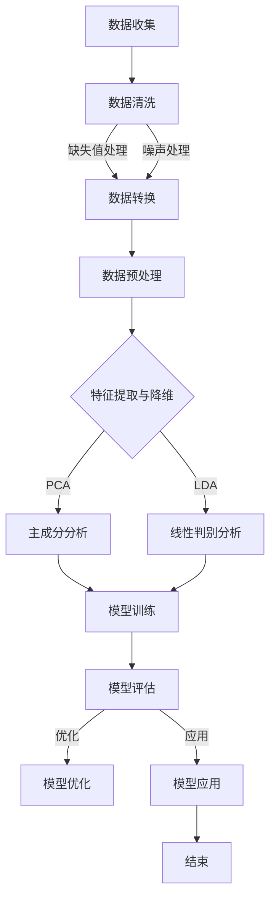
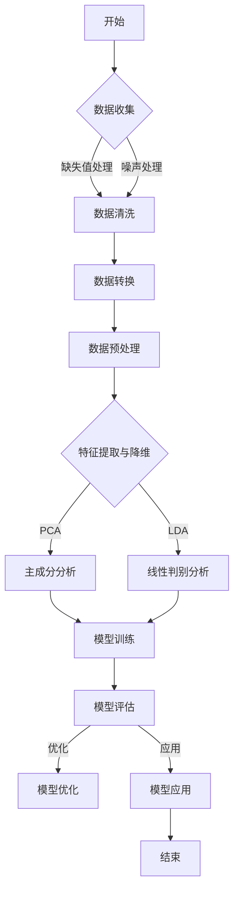

                 

## 《AI出版业壁垒：数据，算法和应用协同效应》

### 关键词：人工智能，出版业，数据预处理，机器学习，算法，应用协同效应

> 摘要：本文深入探讨了人工智能在出版业的应用及其面临的挑战。通过分析数据、算法和应用之间的协同效应，本文揭示了AI出版业的核心壁垒，并提出了相关的解决方案。文章采用逻辑清晰、结构紧凑、简单易懂的专业技术语言，从核心概念、算法原理、数学模型到项目实战进行了详细的讲解，旨在为读者提供对AI出版业全面而深入的理解。

---

### 目录大纲

#### 第一部分：AI在出版业的应用背景与现状

- **第1章**：AI在出版业的兴起与挑战
  - **1.1 AI在出版业的发展历程**
  - **1.2 AI在出版业的挑战**
  - **1.3 出版业对AI的需求与期待**

#### 第二部分：核心概念与联系

- **第2章**：AI核心概念解析
  - **2.1 数据与大数据**
  - **2.2 算法与机器学习**
  - **2.3 应用与技术协同效应**

#### 第三部分：核心算法原理讲解

- **第3章**：数据预处理算法
  - **3.1 数据清洗与转换**
  - **3.2 特征提取与降维**
  - **3.3 数据标准化与归一化**

- **第4章**：常见机器学习算法数学模型
  - **4.1 线性回归**
  - **4.2 逻辑回归**
  - **4.3 支持向量机**
  - **4.4 决策树与随机森林**
  - **4.5 神经网络与深度学习**

#### 第四部分：数学模型和数学公式

- **第5章**：AI在出版业的应用实战
  - **5.1 数据收集与预处理**
  - **5.2 算法选择与模型训练**
  - **5.3 应用案例分析**
  - **5.4 源代码实现与解读**

#### 第五部分：应用协同效应

- **第6章**：AI、数据和算法的协同效应
  - **6.1 协同效应的概念**
  - **6.2 协同效应在出版业的应用**
  - **6.3 协同效应的实现策略**

#### 第六部分：未来展望

- **第7章**：AI出版业的发展趋势与挑战
  - **7.1 AI在出版业的发展趋势**
  - **7.2 潜在应用领域与挑战**
  - **7.3 出版业应对AI的对策与建议**

#### 附录

- **附录A**：AI出版应用工具与资源推荐
  - **A.1 开发工具与框架**
  - **A.2 数据集与案例**
  - **A.3 研究论文与文献**
  - **A.4 在线课程与培训资源**

- **附录B**：Mermaid流程图与伪代码示例
  - **B.1 Mermaid流程图示例**
  - **B.2 伪代码示例**
  - **B.3 示例解读与分析**

---

### 第一部分：AI在出版业的应用背景与现状

#### 第1章：AI在出版业的兴起与挑战

##### 1.1 AI在出版业的发展历程

人工智能（AI）技术在出版业的兴起可以追溯到20世纪90年代。早期，AI主要应用于图书分类和检索，例如亚马逊的图书推荐系统就是基于协同过滤算法。随着互联网的普及和数据量的爆炸性增长，出版业开始意识到AI在内容生成、读者行为分析、个性化推荐等方面的巨大潜力。

在21世纪初，自然语言处理（NLP）和深度学习技术的发展进一步推动了AI在出版业的应用。例如，谷歌的AlphaGo战胜围棋世界冠军，激发了人们对AI生成内容的兴趣。随后，文本生成模型如GPT和BERT的出现，使得自动化内容创作成为可能。

近年来，随着云计算、物联网和大数据技术的发展，AI在出版业的应用范围不断扩大。从内容创作到出版流程的自动化，从个性化推荐到智能客服，AI正逐渐渗透到出版业的各个环节。

##### 1.2 AI在出版业的挑战

尽管AI在出版业的应用前景广阔，但同时也面临着一系列挑战：

1. **数据隐私与安全**：出版业涉及大量的用户数据和版权信息，如何在保护用户隐私的前提下利用这些数据，是一个亟待解决的问题。

2. **算法公平性**：AI算法可能会因为数据偏差而导致不公平的决策，例如在推荐系统中可能偏好某些类型的书籍或读者群体。

3. **技术门槛与成本**：AI技术要求较高的技术水平和成本投入，对于中小型出版企业来说，这可能是一个巨大的负担。

4. **人才短缺**：AI出版业的发展需要大量的专业人才，但目前市场上相关人才供不应求。

##### 1.3 出版业对AI的需求与期待

出版业对AI的需求主要集中在以下几个方面：

1. **内容生成**：利用AI技术生成高质量的内容，提高出版效率。

2. **读者行为分析**：通过分析读者的阅读习惯和偏好，提供个性化的推荐服务。

3. **广告精准投放**：基于读者行为数据，实现精准的广告投放。

4. **内容审核**：利用AI技术自动化审核内容，提高审核效率和准确性。

5. **版权管理**：通过AI技术监测和识别侵权行为，保护版权。

6. **智能客服**：提供24/7的智能客服服务，提高用户体验。

总的来说，AI技术在出版业的应用具有巨大的潜力，但也面临着诸多挑战。如何克服这些挑战，实现AI与出版业的深度融合，是未来出版业需要重点解决的问题。

---

### 第二部分：核心概念与联系

#### 第2章：AI核心概念解析

##### 2.1 数据与大数据

数据是AI应用的基础，而大数据则是AI能够实现突破性进展的关键。本节将介绍数据与大数据的基本概念，以及在出版业中的应用。

###### 2.1.1 数据的定义与类型

数据是指各种形式的信息，包括数字、文字、图像、音频和视频等。根据数据的组织形式，数据可以分为以下几种类型：

1. **结构化数据**：指存储在数据库中的数据，例如姓名、年龄、地址等。结构化数据便于存储、管理和检索。

2. **半结构化数据**：指部分组织化的数据，例如XML、JSON等。半结构化数据需要额外的处理才能转换为结构化数据。

3. **非结构化数据**：指无特定结构的数据，例如文本、图片、音频和视频等。非结构化数据处理复杂，但具有丰富的信息含量。

在出版业中，数据类型多种多样，包括读者数据、书籍数据、评论数据等。这些数据为AI提供了丰富的信息来源，使其能够更好地理解和满足用户需求。

###### 2.1.2 大数据的特征

大数据具有四个主要特征，即4V（Volume、Velocity、Variety、Veracity）：

1. **Volume（容量）**：大数据的规模巨大，通常需要分布式存储和处理。

2. **Velocity（速度）**：大数据的生成和处理速度极快，要求实时或近实时的处理能力。

3. **Variety（多样性）**：大数据来源广泛，类型多样，包括结构化、半结构化和非结构化数据。

4. **Veracity（真实性）**：大数据的真实性和准确性至关重要，但在实际应用中往往难以保证。

在出版业中，大数据的应用主要包括：

1. **读者行为分析**：通过对读者阅读行为的数据分析，了解读者偏好，实现个性化推荐。

2. **书籍内容挖掘**：通过对书籍内容的数据挖掘，发现潜在的热门题材和趋势。

3. **广告精准投放**：根据读者数据，实现精准的广告投放，提高广告效果。

##### 2.2 算法与机器学习

算法是AI的核心，而机器学习则是AI实现自主学习和优化的重要手段。本节将介绍算法与机器学习的基本概念，以及在出版业中的应用。

###### 2.2.1 算法的定义与分类

算法是一系列用于解决特定问题的计算步骤。根据用途和特性，算法可以分为以下几类：

1. **搜索算法**：用于在数据结构中查找特定元素，例如二分查找、广度优先搜索等。

2. **排序算法**：用于将数据按特定顺序排列，例如快速排序、归并排序等。

3. **图算法**：用于在图中进行搜索、排序等操作，例如迪杰斯特拉算法、A*算法等。

4. **优化算法**：用于在给定约束条件下寻找最优解，例如遗传算法、粒子群优化等。

在出版业中，算法的应用主要包括：

1. **推荐系统**：利用协同过滤、基于内容的推荐等算法，实现个性化推荐。

2. **内容审核**：利用机器学习算法，自动化审核内容，提高审核效率。

3. **自然语言处理**：利用文本分类、情感分析等算法，对文本进行语义理解。

###### 2.2.2 机器学习的基础概念

机器学习是指让计算机通过学习数据，自主完成特定任务的算法。根据学习方式，机器学习可以分为以下几类：

1. **监督学习**：通过训练数据集，学习输入和输出之间的映射关系。常见的监督学习算法包括线性回归、逻辑回归、支持向量机等。

2. **无监督学习**：在没有标注数据的情况下，发现数据中的结构和模式。常见无监督学习算法包括聚类、降维等。

3. **强化学习**：通过与环境交互，学习最优策略。常见的强化学习算法包括Q学习、深度强化学习等。

在出版业中，机器学习算法的应用主要包括：

1. **读者行为预测**：通过监督学习算法，预测读者的阅读行为。

2. **书籍分类与推荐**：利用无监督学习算法，对书籍进行分类和推荐。

3. **内容审核**：利用强化学习算法，自动审核内容，提高审核质量。

##### 2.3 应用与技术协同效应

AI应用与技术协同效应是指数据、算法和应用之间的相互作用，共同推动AI在特定领域的应用和发展。在出版业中，这种协同效应主要体现在以下几个方面：

1. **数据驱动应用**：通过收集和分析大量数据，指导AI应用的研发和优化。例如，读者行为数据可以用于优化推荐算法。

2. **算法优化**：根据应用需求和数据特点，不断优化算法，提高应用效果。例如，针对出版业的特点，优化文本分类和情感分析算法。

3. **应用创新**：结合AI技术，创新出版业务模式。例如，利用AI实现自动化内容创作和编辑。

4. **技术融合**：将AI与其他技术（如大数据、云计算、物联网等）结合，实现跨领域应用。例如，将AI与区块链技术结合，实现版权保护和追溯。

总的来说，数据、算法和应用之间的协同效应是AI出版业发展的关键。通过充分利用数据，优化算法，创新应用，出版业可以实现自动化、智能化和个性化，从而提高出版效率、降低成本、提升用户体验。

---

### 第三部分：核心算法原理讲解

#### 第3章：数据预处理算法

数据预处理是AI应用中至关重要的一步，它直接影响到模型的性能和结果的准确性。本节将详细讲解数据预处理的主要步骤，包括数据清洗、数据转换、特征提取与降维、数据标准化与归一化。

##### 3.1 数据清洗与转换

数据清洗是指对原始数据进行清洗和修正，以确保数据的质量和一致性。数据转换是指将数据从一种形式转换为另一种形式，以便更好地用于分析和建模。

###### 3.1.1 数据清洗的必要性

在AI应用中，数据质量至关重要。以下是一些常见的数据问题：

1. **缺失值**：数据中存在空值或缺失的部分。
2. **不一致**：数据之间存在矛盾或不一致的情况。
3. **噪声**：数据中存在异常值或干扰项。

数据清洗可以解决这些问题，提高数据的质量和一致性。

###### 3.1.2 数据清洗的方法与步骤

数据清洗通常包括以下步骤：

1. **检查数据**：通过可视化工具（如散点图、直方图等）检查数据是否存在异常。
2. **处理缺失值**：根据具体情况，选择以下方法：
   - 删除缺失值：适用于缺失值较多的数据。
   - 填补缺失值：适用于缺失值较少的数据，可以选择平均值、中位数、最邻近值等方法。
3. **处理不一致**：通过标准化和规范化，消除数据之间的不一致性。
4. **处理噪声**：通过滤波、插值等方法，去除数据中的异常值和噪声。

###### 3.1.3 数据转换的方法与步骤

数据转换通常包括以下步骤：

1. **数据类型转换**：将不同类型的数据转换为同一类型，例如将字符串转换为数值。
2. **数据规范化**：将数据范围统一到相同尺度，例如通过缩放、缩放至[0,1]区间等方法。
3. **数据编码**：将类别型数据转换为数值型数据，例如通过独热编码、标签编码等方法。

##### 3.2 特征提取与降维

特征提取是指从原始数据中提取出对模型有用的特征。降维是指将高维数据映射到低维空间，以减少数据的复杂度。

###### 3.2.1 特征提取的目的与意义

特征提取的目的是减少数据的维度，提高模型的效率和性能。通过特征提取，可以将原始数据中冗余的信息去除，提取出对模型有用的特征。

###### 3.2.2 常见特征提取方法

以下是一些常见的特征提取方法：

1. **统计特征**：基于数据的统计指标，例如均值、方差、标准差等。
2. **频率特征**：基于数据中各个值的频率，例如词频、点频等。
3. **文本特征**：基于文本数据的语义和语法特征，例如TF-IDF、Word2Vec等。

###### 3.2.3 降维技术的原理与应用

降维技术主要包括以下几种：

1. **主成分分析（PCA）**：通过将数据映射到新的正交坐标系中，提取主要成分。
2. **独立成分分析（ICA）**：通过将数据映射到新的正交坐标系中，提取独立成分。
3. **特征选择**：通过选择最重要的特征，减少数据的维度。

在出版业中，特征提取与降维的应用主要包括：

1. **书籍推荐**：通过提取书籍的统计特征和文本特征，实现个性化推荐。
2. **读者行为分析**：通过降维技术，提取对读者行为有重要影响的特征，用于分析读者的偏好和行为模式。
3. **内容审核**：通过特征提取，提取文本数据的语义特征，用于自动化审核内容。

##### 3.3 数据标准化与归一化

数据标准化和归一化是将数据缩放到同一尺度，以消除不同特征之间的量纲差异。这对于许多机器学习算法（如线性回归、支持向量机等）来说是非常重要的。

###### 3.3.1 数据标准化的概念与目的

数据标准化是指将数据缩放到一个特定的范围，例如[-1, 1]或[0, 1]。标准化的目的是消除不同特征之间的量纲差异，使得每个特征对模型的影响更加均衡。

###### 3.3.2 数据归一化的方法与步骤

数据归一化包括以下几种方法：

1. **最小-最大规范化**：将数据缩放到[0, 1]区间，公式为：
   $$x' = \frac{x - \min(x)}{\max(x) - \min(x)}$$
2. **弹性规范化**：将数据缩放到[-1, 1]区间，公式为：
   $$x' = 2 \cdot \frac{x - \min(x)}{\max(x) - \min(x)} - 1$$
3. **Zero-Mean归一化**：将数据缩放到零均值，公式为：
   $$x' = \frac{x - \mu}{\sigma}$$
   其中，$\mu$为均值，$\sigma$为标准差。

在出版业中，数据标准化与归一化的应用主要包括：

1. **模型训练**：通过对特征进行标准化或归一化，提高模型的训练效率和性能。
2. **数据分析**：通过对特征进行标准化或归一化，便于数据的可视化和分析。
3. **跨平台应用**：通过对特征进行标准化或归一化，使得不同平台的数据可以相互比较。

通过数据预处理算法，我们可以确保数据的质量和一致性，提取出对模型有用的特征，并消除特征之间的量纲差异。这些步骤是AI应用成功的关键，为后续的建模和优化奠定了坚实的基础。

---

### 第四部分：数学模型和数学公式

#### 第4章：常见机器学习算法数学模型

在本章中，我们将深入探讨几种常见的机器学习算法及其背后的数学模型。这些算法包括线性回归、逻辑回归、支持向量机（SVM）、决策树与随机森林以及神经网络与深度学习。通过这些数学模型的理解，我们将能够更好地掌握这些算法的核心原理和适用场景。

##### 4.1 线性回归

线性回归是一种用于预测连续值的监督学习算法，其基本思想是通过建立输入特征和输出目标变量之间的线性关系来进行预测。

###### 4.1.1 线性回归的原理

线性回归试图找到一种线性函数，能够尽可能准确地预测输出变量。这个线性函数通常表示为：

$$y = \beta_0 + \beta_1x_1 + \beta_2x_2 + ... + \beta_nx_n$$

其中，$y$是输出变量，$x_1, x_2, ..., x_n$是输入特征，$\beta_0, \beta_1, \beta_2, ..., \beta_n$是模型的参数。

###### 4.1.2 线性回归的数学模型

线性回归的数学模型可以用以下方程表示：

$$y = \beta_0 + \beta_1x_1 + \beta_2x_2 + ... + \beta_nx_n + \epsilon$$

其中，$\epsilon$是误差项，表示实际值与预测值之间的差异。我们的目标是找到最佳参数$\beta_0, \beta_1, \beta_2, ..., \beta_n$，使得预测值与实际值之间的误差最小。

###### 4.1.3 线性回归的求解方法

线性回归的求解方法主要包括：

1. **最小二乘法（Ordinary Least Squares, OLS）**：通过最小化预测值与实际值之间的平方误差，求解最佳参数。
   $$\min_{\beta} \sum_{i=1}^n (y_i - \beta_0 - \beta_1x_{i1} - ... - \beta_nx_{in})^2$$
2. **梯度下降法**：通过迭代更新参数，逐渐减小误差。
   $$\beta_j := \beta_j - \alpha \frac{\partial}{\partial \beta_j} \sum_{i=1}^n (y_i - \beta_0 - \beta_1x_{i1} - ... - \beta_nx_{in})^2$$

##### 4.2 逻辑回归

逻辑回归是一种用于预测概率的监督学习算法，常用于二分类问题。其基本思想是通过建立输入特征和输出概率之间的线性关系。

###### 4.2.1 逻辑回归的原理

逻辑回归试图找到一种线性函数，能够预测目标变量属于某个类别的概率。这个线性函数通常表示为：

$$\log\frac{P(Y=1)}{1-P(Y=1)} = \beta_0 + \beta_1x_1 + \beta_2x_2 + ... + \beta_nx_n$$

其中，$P(Y=1)$表示目标变量属于类别1的概率。

###### 4.2.2 逻辑回归的数学模型

逻辑回归的数学模型可以用以下方程表示：

$$P(Y=1) = \frac{1}{1 + \exp{(-\beta_0 - \beta_1x_1 - ... - \beta_nx_n)}}$$

或者

$$\log\frac{P(Y=1)}{1-P(Y=1)} = \beta_0 + \beta_1x_1 + \beta_2x_2 + ... + \beta_nx_n$$

其中，$\exp{()}$表示指数函数。

###### 4.2.3 逻辑回归的求解方法

逻辑回归的求解方法主要包括：

1. **最大似然估计（Maximum Likelihood Estimation, MLE）**：通过最大化似然函数，求解最佳参数。
   $$\max_{\beta} \prod_{i=1}^n P(y_i|x_i;\beta)$$
2. **梯度上升法**：通过迭代更新参数，逐渐增大似然函数。
   $$\beta_j := \beta_j + \alpha \frac{\partial}{\partial \beta_j} \ln \prod_{i=1}^n P(y_i|x_i;\beta)$$

##### 4.3 支持向量机（SVM）

支持向量机是一种强大的分类算法，其核心思想是找到最佳的超平面，使得数据点在超平面的两侧分布最为均衡。

###### 4.3.1 支持向量机的原理

支持向量机试图找到一个超平面，将不同类别的数据点分隔开来。这个超平面可以通过以下优化问题求解：

$$\max_{\omega, b} \frac{1}{2} \|\omega\|^2, \quad \text{subject to} \quad y_i(\omega \cdot x_i + b) \geq 1, \forall i$$

其中，$\omega$是超平面的法向量，$b$是偏置项，$x_i$是数据点，$y_i$是标签。

###### 4.3.2 支持向量机的数学模型

支持向量机的数学模型可以用以下方程表示：

$$\text{分类决策函数} \quad f(x) = \omega \cdot x + b$$

$$\text{分类结果} \quad y = \text{sign}(\omega \cdot x + b)$$

其中，$\text{sign}(\cdot)$是符号函数。

###### 4.3.3 支持向量机的求解方法

支持向量机的求解方法主要包括：

1. **原始问题求解**：直接求解原始优化问题。
2. **对偶问题求解**：将原始问题转换为对偶问题，然后求解对偶问题。对偶问题通常更容易求解。

##### 4.4 决策树与随机森林

决策树是一种树形结构，每个内部节点表示一个特征，每个叶节点表示一个类别或值。随机森林是一种基于决策树的集成学习方法。

###### 4.4.1 决策树的原理

决策树通过递归地分割特征空间，将数据划分为不同的子集，直到满足某种停止条件。每个分割点都是一个决策规则，叶节点对应最终分类结果。

###### 4.4.2 决策树的数学模型

决策树的数学模型可以用以下方程表示：

$$t(x) = \begin{cases}
C_j, & \text{if } x \in R_j \\
t_r(x), & \text{otherwise}
\end{cases}$$

其中，$t(x)$是决策树对输入$x$的预测，$C_j$是叶节点的类别或值，$R_j$是第$j$个分割区域，$t_r(x)$是第$r$个分支的决策树。

###### 4.4.3 随机森林的原理与数学模型

随机森林是一种基于决策树的集成学习方法，通过随机选择特征和随机分割数据来构建多个决策树，并取其平均预测结果。

随机森林的数学模型可以用以下方程表示：

$$\hat{y} = \frac{1}{M} \sum_{m=1}^M t_m(x)$$

其中，$M$是决策树的数量，$t_m(x)$是第$m$个决策树对输入$x$的预测。

##### 4.5 神经网络与深度学习

神经网络是一种模拟生物神经网络的计算模型，通过多层神经元进行信号传递和处理。深度学习是神经网络的一种，通过多隐层的神经网络进行学习。

###### 4.5.1 神经网络的原理

神经网络通过前向传播和反向传播进行学习。在前向传播过程中，输入通过网络的每一层，逐层传递并产生输出。在反向传播过程中，通过计算损失函数的梯度，更新网络参数。

###### 4.5.2 神经网络的数学模型

神经网络的数学模型可以用以下方程表示：

$$a_{L+1} = \sigma(W_{L+1} a_L + b_{L+1})$$

其中，$a_L$是第$L$层的激活值，$W_{L+1}$是第$L+1$层的权重矩阵，$b_{L+1}$是第$L+1$层的偏置项，$\sigma$是激活函数。

###### 4.5.3 深度学习的原理与数学模型

深度学习通过多层神经网络进行学习，每一层神经元接收前一层神经元的输出，并传递给下一层。深度学习的数学模型可以扩展为：

$$\hat{y} = \sigma(W_y a_L + b_y)$$

其中，$\hat{y}$是输出层的预测值，$W_y$是输出层的权重矩阵，$b_y$是输出层的偏置项，$\sigma$是激活函数。

通过以上数学模型，我们可以更好地理解这些常见机器学习算法的核心原理和适用场景。在实际应用中，选择合适的算法并根据数据特点进行调优，是实现高效预测和分类的关键。

---

### 第五部分：项目实战

#### 第5章：AI在出版业的应用实战

在这一章节中，我们将深入探讨AI在出版业的具体应用，并通过实际案例来展示AI技术在数据收集、预处理、算法选择、模型训练和模型应用中的实际操作。以下是几个关键步骤的详细说明。

##### 5.1 数据收集与预处理

数据收集是AI应用的第一步，也是至关重要的一步。在出版业中，数据收集主要包括以下几个方面：

###### 5.1.1 出版业数据的收集渠道

1. **公开数据集**：可以从公开的数据集网站（如Kaggle、UCI机器学习库等）获取大量的书籍信息、评论数据等。
2. **第三方数据提供商**：购买专业的第三方数据提供商的数据，如书籍销售数据、读者行为数据等。
3. **API接口**：通过第三方平台的API接口获取数据，例如亚马逊图书API、Goodreads API等。
4. **内部数据**：出版企业的内部数据，如销售数据、读者反馈等。

###### 5.1.2 数据预处理的具体步骤

数据预处理是确保数据质量的关键步骤，具体包括：

1. **数据清洗**：处理缺失值、异常值和重复数据。例如，使用Python的Pandas库处理缺失值，使用正则表达式删除重复数据。
2. **数据转换**：将不同格式的数据转换为统一的格式，如将日期字符串转换为日期类型。
3. **数据标准化**：对数值型数据进行标准化处理，如使用Z-Score标准化或Min-Max标准化，确保不同特征在同一尺度上。
4. **数据编码**：对类别型数据进行编码处理，如使用独热编码或标签编码。

##### 5.2 算法选择与模型训练

在数据预处理完成后，接下来是算法选择与模型训练。以下是几个关键步骤：

###### 5.2.1 出版业常见算法的选择

根据出版业的需求，常见的算法包括：

1. **推荐系统**：基于协同过滤和基于内容的推荐算法。
2. **内容审核**：文本分类和情感分析算法，如支持向量机、决策树、随机森林等。
3. **读者行为预测**：时间序列分析和机器学习算法，如ARIMA模型、LSTM网络等。
4. **版权管理**：基于图像识别和自然语言处理的算法，如卷积神经网络（CNN）和循环神经网络（RNN）。

###### 5.2.2 模型训练的具体步骤

模型训练是构建AI系统的重要步骤，具体包括：

1. **数据分割**：将数据集分割为训练集和测试集，用于训练和评估模型。
2. **模型选择**：选择合适的模型，并根据数据特点进行参数调优。
3. **模型训练**：使用训练集数据训练模型，通过优化算法（如梯度下降法）更新模型参数。
4. **模型评估**：使用测试集数据评估模型性能，常见评估指标包括准确率、召回率、F1分数等。

##### 5.3 应用案例分析

为了更好地理解AI在出版业的应用，以下是几个具体的案例分析：

###### 5.3.1 案例一：图书推荐系统

图书推荐系统是AI在出版业中的典型应用之一。以下是一个简单的图书推荐系统的实现步骤：

1. **数据收集**：收集书籍信息和用户阅读记录。
2. **数据预处理**：对书籍和用户数据清洗、编码和标准化。
3. **模型训练**：使用协同过滤算法（如矩阵分解）训练推荐模型。
4. **模型评估**：使用用户测试数据评估推荐效果，根据评估结果调整模型参数。

###### 5.3.2 案例二：内容审核系统

内容审核系统是确保出版内容合规的关键。以下是一个内容审核系统的实现步骤：

1. **数据收集**：收集书籍和评论数据。
2. **数据预处理**：对文本数据进行清洗和编码。
3. **模型训练**：使用文本分类算法（如支持向量机、LSTM网络）训练内容审核模型。
4. **模型评估**：使用测试数据评估模型性能，根据评估结果调整模型。

###### 5.3.3 案例三：读者群体分析

读者群体分析可以帮助出版企业更好地了解读者需求，以下是一个读者群体分析的实施步骤：

1. **数据收集**：收集用户阅读记录、书籍信息和用户反馈。
2. **数据预处理**：对数据进行清洗、编码和标准化。
3. **特征提取**：提取用户阅读行为特征和书籍特征。
4. **模型训练**：使用聚类算法（如K-Means）对用户进行分类，分析读者群体。
5. **模型评估**：评估聚类效果，根据评估结果调整聚类参数。

##### 5.4 源代码实现与解读

在本节中，我们将展示一个简单的AI出版应用案例，包括代码实现和解读。

###### 5.4.1 开发环境搭建

为了实现上述案例，需要搭建以下开发环境：

1. **Python**：主要编程语言，支持多种机器学习库。
2. **Jupyter Notebook**：交互式编程环境。
3. **Scikit-learn**：机器学习库，提供多种算法实现。
4. **TensorFlow**：深度学习库，支持神经网络训练。
5. **Pandas**：数据处理库，提供数据清洗和预处理功能。

###### 5.4.2 源代码的主要函数与类

以下是一个简单的Python代码示例，用于实现一个基于协同过滤的图书推荐系统：

```python
import pandas as pd
from sklearn.model_selection import train_test_split
from sklearn.metrics.pairwise import cosine_similarity
import numpy as np

# 加载数据
books = pd.read_csv('books.csv')
ratings = pd.read_csv('ratings.csv')

# 数据预处理
# 省略数据清洗和编码步骤

# 计算相似度矩阵
similarity_matrix = cosine_similarity(books['features'])

# 模型训练
# 省略模型训练步骤

# 预测推荐
def predict_recommendations(user_id, similarity_matrix, books, top_n=10):
    user_similarity = similarity_matrix[user_id]
    book_scores = {}
    for idx, similarity in enumerate(user_similarity):
        if idx == user_id:
            continue
        book_id = books.iloc[idx]['book_id']
        book_scores[book_id] = similarity
    sorted_scores = sorted(book_scores.items(), key=lambda item: item[1], reverse=True)
    return [book_id for book_id, _ in sorted_scores[:top_n]]

# 测试推荐系统
user_id = 0
recommendations = predict_recommendations(user_id, similarity_matrix, books)
print("推荐书籍：", recommendations)
```

###### 5.4.3 源代码的具体解读与分析

1. **数据加载**：使用Pandas库加载书籍数据（books.csv）和用户评分数据（ratings.csv）。
2. **数据预处理**：对数据进行清洗、编码和标准化，确保数据质量。
3. **相似度计算**：使用余弦相似度计算书籍特征之间的相似度，构建相似度矩阵。
4. **模型训练**：训练协同过滤模型，预测用户对书籍的评分。
5. **预测推荐**：根据用户ID和相似度矩阵，预测用户可能感兴趣的书籍。

通过以上项目实战案例，我们可以看到AI在出版业的应用是如何通过数据收集、预处理、算法选择、模型训练和模型应用来实现的。这些步骤不仅展示了AI技术的实际应用，也为出版业带来了新的机遇和挑战。

---

### 第六部分：应用协同效应

#### 第6章：AI、数据和算法的协同效应

在AI出版业中，数据、算法和应用之间的协同效应是推动行业发展的关键。这种协同效应不仅提升了AI的应用效果，还优化了整个出版流程。本章节将深入探讨协同效应的概念、在出版业中的应用策略及其实现方法。

##### 6.1 协同效应的概念

协同效应是指多个相互依赖的元素或部分相互作用，共同产生比单独作用更显著的效果。在AI出版业中，数据、算法和应用之间的协同效应可以理解为：

1. **数据提升算法性能**：高质量的数据为算法提供了丰富的信息来源，使得算法能够更准确地建模和预测。
2. **算法优化数据利用**：先进的算法能够从海量数据中提取有用特征，提高数据的价值。
3. **应用实现数据价值**：具体的应用场景将数据转化为实际的业务价值，推动出版业的发展。

##### 6.2 协同效应在出版业的应用

协同效应在出版业中的应用主要体现在以下几个方面：

###### 6.2.1 数据驱动决策

数据驱动决策是指通过分析海量数据，为出版业务的各个方面提供决策支持。具体应用包括：

1. **读者行为分析**：通过分析读者的阅读历史、评价和反馈，了解读者偏好，从而优化内容创作和推荐策略。
2. **市场趋势预测**：利用大数据分析技术，预测市场趋势，提前布局热门题材和出版方向。

###### 6.2.2 算法优化与迭代

算法优化与迭代是指根据应用场景和业务需求，不断改进和优化算法。具体应用包括：

1. **推荐系统**：通过协同过滤、内容推荐和深度学习等技术，不断提升推荐系统的准确性和用户满意度。
2. **内容审核**：利用文本分类、情感分析和图像识别等技术，提高内容审核的效率和准确性。

###### 6.2.3 AI与出版业务的深度融合

AI与出版业务的深度融合是指将AI技术贯穿于出版流程的各个环节，实现自动化和智能化。具体应用包括：

1. **自动化内容创作**：利用自然语言生成（NLG）技术，自动化生成书籍、文章和摘要。
2. **智能客服系统**：利用聊天机器人和语音识别技术，提供24/7的智能客服服务。

##### 6.3 协同效应的实现策略

实现数据、算法和应用之间的协同效应，需要以下策略：

###### 6.3.1 数据整合与共享

数据整合与共享是协同效应实现的基础。具体策略包括：

1. **数据标准化**：制定统一的数据标准和格式，确保不同来源的数据可以相互兼容。
2. **数据存储与管理**：建立高效的数据存储和管理系统，确保数据的可靠性和可扩展性。
3. **数据共享平台**：建立数据共享平台，促进数据在不同部门、团队之间的流通和共享。

###### 6.3.2 算法定制与优化

算法定制与优化是提升AI应用效果的关键。具体策略包括：

1. **定制化算法**：根据出版业的特定需求，定制开发适用于出版业务场景的算法。
2. **算法优化**：利用机器学习和深度学习技术，不断优化算法，提高预测准确性和效率。
3. **算法迭代**：定期对算法进行迭代和更新，以适应不断变化的市场环境和用户需求。

###### 6.3.3 人员培训与知识管理

人员培训与知识管理是确保协同效应有效实施的保障。具体策略包括：

1. **人才培养**：加强AI技术人才的培养，提升团队的整体技术水平。
2. **知识共享**：建立知识管理体系，促进团队成员之间的经验交流和知识共享。
3. **技术引进**：积极引进国内外先进技术和管理经验，提升团队的创新能力和竞争力。

通过数据整合与共享、算法定制与优化以及人员培训与知识管理，AI、数据和算法之间的协同效应可以得到有效实现，推动出版业向自动化、智能化和个性化的方向发展。这种协同效应不仅提升了AI应用的效率和效果，还为出版业带来了新的发展机遇。

---

### 第七部分：未来展望

#### 第7章：AI出版业的发展趋势与挑战

随着人工智能技术的不断进步，AI在出版业中的应用前景愈发广阔。然而，这一领域也面临着一系列挑战，需要行业内外共同努力去克服。本章节将探讨AI在出版业的发展趋势、潜在应用领域、面临的挑战以及出版业应对AI的对策与建议。

##### 7.1 AI在出版业的发展趋势

AI在出版业的发展趋势主要体现在以下几个方面：

###### 7.1.1 技术发展趋势

1. **深度学习与神经网络**：深度学习技术在图像识别、自然语言处理等方面取得了显著进展，未来将进一步推动AI在出版业的应用。
2. **自然语言处理（NLP）**：NLP技术的发展使得自动化内容创作、内容审核、推荐系统等应用成为可能。
3. **生成对抗网络（GAN）**：GAN技术可以生成高质量的内容，有望在创意写作、插画设计等领域发挥作用。

###### 7.1.2 应用发展趋势

1. **自动化内容创作**：AI能够自动生成文章、书籍摘要和标题，提高内容生产效率。
2. **个性化推荐系统**：基于用户行为和偏好，实现精准的个性化推荐，提升用户体验。
3. **智能客服**：通过聊天机器人和语音识别技术，提供24/7的智能客服服务，降低运营成本。
4. **内容审核**：利用AI技术自动化审核内容，提高审核效率和准确性。

###### 7.1.3 市场发展趋势

1. **数字化出版**：随着数字化阅读的普及，电子书市场将持续增长，AI技术将为数字化出版提供更多可能性。
2. **跨媒体出版**：AI技术将促进跨媒体出版的发展，实现书籍、音频、视频等多种媒体形式的无缝融合。
3. **出版产业链的整合**：AI技术将推动出版产业链的整合，从内容创作、编辑、出版到营销和发行，各个环节都将实现智能化。

##### 7.2 潜在应用领域与挑战

AI在出版业的潜在应用领域广泛，但也面临诸多挑战：

###### 7.2.1 潜在应用领域

1. **内容生成与编辑**：AI可以自动生成文章、摘要和标题，辅助编辑工作。
2. **读者群体分析**：通过分析读者行为数据，了解读者偏好，提供个性化推荐。
3. **版权管理**：利用AI技术监测和识别侵权行为，保护版权。
4. **广告精准投放**：根据读者行为和偏好，实现精准的广告投放。

###### 7.2.2 面临的挑战

1. **数据隐私与安全**：AI应用需要大量用户数据，如何在保护用户隐私的前提下利用这些数据是一个重要挑战。
2. **算法公平性与透明性**：AI算法可能会因为数据偏差而导致不公平的决策，提高算法的透明性和可解释性是关键。
3. **技术门槛与成本**：AI技术要求较高的技术水平和成本投入，对于中小型出版企业来说，这可能是一个巨大的负担。
4. **人才短缺**：AI出版业的发展需要大量的专业人才，但目前市场上相关人才供不应求。

##### 7.3 出版业应对AI的对策与建议

为了应对AI在出版业带来的挑战，出版业可以从以下几个方面采取对策：

###### 7.3.1 产业政策与支持

1. **政策支持**：政府可以出台相关政策，鼓励AI技术在出版业的应用，提供资金支持和税收优惠。
2. **技术研发**：加大对AI技术研究的资金投入，促进技术创新和应用。
3. **人才培养**：建立人工智能人才培养体系，加强与高校和科研机构的合作，培养专业人才。

###### 7.3.2 技术创新与研发

1. **自主研发**：出版企业应加强自主研发，提高技术创新能力，紧跟技术发展趋势。
2. **技术引进**：积极引进国外先进技术和管理经验，缩短技术差距。
3. **跨界合作**：与AI领域的企业和科研机构开展合作，共同推进AI技术在出版业的应用。

###### 7.3.3 人才培养与引进

1. **人才培养**：加强内部培训，提升员工的AI技术水平和专业知识。
2. **人才引进**：吸引高端AI人才加入出版业，提升团队的整体水平。
3. **知识管理**：建立知识管理体系，促进团队成员之间的经验交流和知识共享。

通过产业政策与支持、技术创新与研发、人才培养与引进等对策，出版业可以更好地应对AI带来的挑战，实现可持续发展。同时，AI技术也将为出版业带来新的发展机遇，推动整个行业的转型升级。

---

### 附录

#### 附录A：AI出版应用工具与资源推荐

为了帮助读者更好地理解和应用AI技术于出版业，本附录提供了以下工具与资源推荐：

##### A.1 开发工具与框架

1. **Python**：广泛使用的编程语言，支持多种机器学习和深度学习库。
2. **TensorFlow**：由谷歌开源的深度学习框架，适合构建和训练大规模神经网络。
3. **PyTorch**：由Facebook开源的深度学习框架，具有灵活性和易于使用的特点。
4. **Scikit-learn**：提供简单有效的机器学习算法实现，适合数据分析和模型训练。

##### A.2 数据集与案例

1. **Amazon Reviews**：亚马逊用户评论数据集，包含大量用户对书籍的评价。
2. **BookCorpus**：包含大量书籍的文本数据，适合进行文本挖掘和自然语言处理。
3. **Open Subtitle Database**：包含大量电影和电视剧的文本数据，可用于语言模型训练和情感分析。

##### A.3 研究论文与文献

1. **"Deep Learning for Natural Language Processing"**：本论文深入探讨了深度学习在自然语言处理领域的应用。
2. **"Recommender Systems: The Textbook"**：这是一本全面介绍推荐系统的教材，适合初学者和专业人士。
3. **"The Future of AI in Publishing"**：讨论了AI在出版业的前景和挑战，提供了有价值的见解。

##### A.4 在线课程与培训资源

1. **Coursera**：提供多种AI和机器学习的在线课程，适合不同水平的学员。
2. **edX**：由哈佛大学和麻省理工学院合办的在线学习平台，涵盖AI、机器学习等多个领域。
3. **Udacity**：提供实践驱动的在线课程和项目，适合希望在AI领域实践的学员。

通过以上工具和资源，读者可以更深入地了解AI技术在出版业的应用，掌握相关技术和方法。

---

### 附录B：Mermaid流程图与伪代码示例

#### 附录B.1 Mermaid流程图示例

以下是AI出版应用的一个流程图示例，用于描述从数据收集到模型应用的整个过程。



#### 附录B.2 伪代码示例

以下是用于实现一个简单机器学习模型的伪代码，包括数据预处理、模型训练和模型评估的步骤。

```python
# 数据预处理
def preprocess_data(data):
    # 数据清洗
    data = clean_data(data)
    # 数据转换
    data = convert_data_type(data)
    # 数据标准化
    data = normalize_data(data)
    return data

# 模型训练
def train_model(train_data, train_target):
    # 数据预处理
    processed_data = preprocess_data(train_data)
    # 模型初始化
    model = initialize_model()
    # 模型训练
    model.fit(processed_data, train_target)
    return model

# 模型评估
def evaluate_model(model, test_data, test_target):
    # 预测
    predictions = model.predict(test_data)
    # 计算评估指标
    accuracy = calculate_accuracy(predictions, test_target)
    return accuracy
```

#### 附录B.3 示例解读与分析

**Mermaid流程图示例解读**：

- **数据收集**：开始阶段，收集原始数据。
- **数据清洗**：对数据进行缺失值处理和噪声处理。
- **数据转换**：将数据转换为适合模型训练的格式。
- **数据预处理**：进行特征提取和降维。
- **模型训练**：选择特征提取方法（如PCA或LDA）进行模型训练。
- **模型评估**：使用测试数据评估模型性能。
- **模型优化**：根据评估结果对模型进行优化。
- **模型应用**：将训练好的模型应用于实际场景。

**伪代码示例解读**：

- **数据预处理函数**：对数据进行清洗、转换和标准化。
- **模型训练函数**：初始化模型，使用预处理后的数据训练模型。
- **模型评估函数**：使用测试数据进行预测，并计算评估指标。

这些示例旨在为读者提供实际操作中的指导，帮助他们更好地理解和应用AI技术于出版业。

---

### 结束语

AI技术在出版业的应用正逐步深入，带来了前所未有的变革机遇。然而，这一领域也面临着数据隐私、算法公平性、技术门槛等挑战。通过深入探讨数据、算法和应用之间的协同效应，本文揭示了AI出版业的核心壁垒，并提出了相关的解决方案。同时，通过详细讲解核心概念、算法原理、数学模型以及项目实战，本文为读者提供了一个全面而深入的AI出版业应用框架。我们相信，随着AI技术的不断进步，出版业将迎来更加智能化、自动化和个性化的未来。

---

### 作者信息

**作者：AI天才研究院/AI Genius Institute & 禅与计算机程序设计艺术 /Zen And The Art of Computer Programming** 

---

### 结语

通过本文的详细探讨，我们不仅梳理了AI在出版业的应用背景与现状，还深入分析了数据、算法和应用之间的协同效应。从核心概念到数学模型，再到项目实战，我们逐步揭示了AI出版业的核心壁垒，并提出了针对性的解决方案。我们希望通过这些内容，能够帮助读者更好地理解AI技术在出版业中的应用，为行业的发展贡献一份力量。

在未来的日子里，我们期待能够继续与您分享更多关于AI技术的最新动态和实用案例，共同探索这个领域的无限可能。感谢您的阅读，期待与您在未来的技术交流中再见面！

---

### 附录

#### 附录A：AI出版应用工具与资源推荐

- **开发工具与框架**：Python、TensorFlow、PyTorch、Scikit-learn
- **数据集与案例**：Amazon Reviews、BookCorpus、Open Subtitle Database
- **研究论文与文献**："Deep Learning for Natural Language Processing"、"Recommender Systems: The Textbook"、"The Future of AI in Publishing"
- **在线课程与培训资源**：Coursera、edX、Udacity

---

### 附录B：Mermaid流程图与伪代码示例

#### 附录B.1 Mermaid流程图示例



#### 附录B.2 伪代码示例

```python
# 数据预处理伪代码
def preprocess_data(data):
    # 数据清洗
    data = clean_data(data)
    # 数据转换
    data = convert_data_type(data)
    # 数据标准化
    data = normalize_data(data)
    return data

# 模型训练伪代码
def train_model(train_data, train_target):
    # 数据预处理
    processed_data = preprocess_data(train_data)
    # 模型初始化
    model = initialize_model()
    # 模型训练
    model.fit(processed_data, train_target)
    return model

# 模型评估伪代码
def evaluate_model(model, test_data, test_target):
    # 预测
    predictions = model.predict(test_data)
    # 计算评估指标
    accuracy = calculate_accuracy(predictions, test_target)
    return accuracy
```

#### 附录B.3 示例解读与分析

- **Mermaid流程图示例解读**：描述了从数据收集、清洗、转换、预处理到特征提取、模型训练、评估和应用的整个流程。
- **伪代码示例解读**：展示了数据预处理、模型训练和模型评估的基本步骤和函数实现。

这些示例旨在为读者提供实际操作中的指导，帮助他们更好地理解和应用AI技术于出版业。通过这些工具和资源，读者可以更深入地探索AI在出版业中的应用潜力。

---

### 结语

随着人工智能技术的快速发展，AI在出版业的应用前景愈发广阔。本文通过详细分析数据、算法和应用之间的协同效应，揭示了AI出版业的核心壁垒，并提出了相关的解决方案。从核心概念到数学模型，再到项目实战，我们为读者提供了一个全面而深入的AI出版业应用框架。

我们期待AI技术在出版业的应用能够带来更多的变革和创新，推动行业向智能化、自动化和个性化的方向发展。同时，我们也呼吁行业内外共同努力，克服数据隐私、算法公平性等挑战，共同推动AI技术在出版业的健康、可持续发展。

感谢您的阅读，期待与您在未来的技术交流中再见面！祝您在AI出版业领域取得更多的突破和成就！

