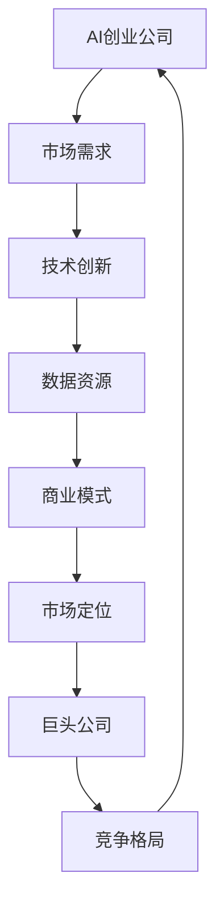

                 

### 《AI创业公司如何应对巨头竞争?》

> 关键词：AI创业公司、巨头竞争、技术创新、数据资源、商业模式、市场定位、合作战略

> 摘要：本文旨在探讨AI创业公司在面临巨头竞争时的应对策略。通过对AI行业环境、创业公司核心能力构建、商业模式创新与市场定位、巨头竞争应对策略等关键方面的分析，结合成功与失败案例，提出了一套实战性的策略体系，以帮助AI创业公司在激烈的市场竞争中脱颖而出。

---

# 第一部分：AI创业公司环境分析

## 第1章：AI行业概述与竞争格局

### 1.1 AI行业发展趋势

人工智能（AI）作为21世纪最具颠覆性的技术之一，正迅速改变着各个行业的面貌。从深度学习、自然语言处理到计算机视觉，AI技术的应用越来越广泛，市场规模也在不断扩大。据市场研究公司IDC预测，到2025年，全球AI市场规模将达到1万亿美元。

#### 市场规模增长

- **AI硬件市场**：随着GPU、TPU等专用硬件的普及，AI计算能力不断提升，预计硬件市场将保持高速增长。
- **AI软件市场**：软件作为AI技术的载体，市场需求同样旺盛，包括开发工具、平台解决方案等。
- **AI服务市场**：随着AI应用的深入，服务市场也在迅速扩张，如AI咨询、运维、数据标注等。

#### 技术发展趋势

- **深度学习**：作为当前AI领域的核心技术，深度学习在图像识别、自然语言处理等方面取得了显著突破。
- **强化学习**：强化学习在游戏、自动驾驶等领域的应用潜力巨大，正逐渐从理论研究走向实际应用。
- **边缘计算**：随着物联网和智能设备的普及，边缘计算能够更好地满足实时性需求，降低网络延迟。

### 1.2 巨头公司的优势与挑战

在AI领域，巨头公司如Google、Microsoft、Amazon等拥有强大的技术积累、丰富的数据资源和庞大的用户基础。然而，这些优势也伴随着一系列挑战：

#### 优势

- **技术积累**：巨头公司在AI领域长期投入，积累了丰富的技术储备和研究成果。
- **数据资源**：通过大量的用户数据和业务场景，巨头公司能够获取更丰富的训练数据，提升模型性能。
- **用户基础**：庞大的用户基础为巨头公司提供了广阔的市场和强大的影响力。

#### 挑战

- **高昂的投入**：持续的技术研发和市场拓展需要巨额资金支持，对财务状况和资金链构成压力。
- **市场竞争**：随着AI技术的普及，市场竞争日趋激烈，巨头公司需要不断创新以保持领先地位。
- **合规风险**：AI技术的快速发展带来了数据隐私、安全等方面的合规风险，需要严格遵守相关法律法规。

### 1.3 创业公司的机会与威胁

尽管巨头公司在AI领域占据主导地位，但创业公司仍然有机会通过差异化竞争和创新赢得市场。同时，创业公司也面临一系列威胁：

#### 机会

- **细分市场**：巨头公司难以全面覆盖所有细分市场，创业公司可以通过专注特定领域，实现市场细分。
- **技术创新**：创业公司更具灵活性，能够更快地响应市场需求，推出创新产品。
- **用户互动**：通过紧密的用户互动，创业公司能够更好地了解用户需求，提供定制化服务。

#### 威胁

- **资源限制**：创业公司通常面临资金、技术、人才等方面的资源限制，难以与巨头公司抗衡。
- **市场压力**：在巨头公司的压力下，创业公司需要不断降低成本、提高效率，以维持竞争力。
- **生存挑战**：巨头公司可能会通过并购、合作等方式，挤压创业公司的生存空间。

## 第2章：创业公司核心能力构建

### 2.1 技术创新与研发策略

技术创新是AI创业公司的核心竞争力，通过持续的研发投入，创业公司可以在激烈的市场竞争中脱颖而出。以下是一些关键策略：

#### 技术创新的重要性

- **差异化竞争**：技术创新能够帮助创业公司实现产品差异化，提高市场竞争力。
- **快速响应**：通过技术创新，创业公司能够更快地响应市场需求，抓住市场机遇。

#### 研发策略

- **集中研发**：专注于特定领域的技术研发，形成核心竞争力。
- **开放式创新**：与高校、研究机构等合作，引入外部创新资源，提升研发效率。
- **快速迭代**：采用敏捷开发模式，实现快速迭代，缩短产品上市时间。

### 2.2 数据资源管理与利用

数据资源是AI创业公司的重要资产，有效的数据管理对于提升模型性能和竞争力至关重要。以下为关键策略：

#### 数据资源的重要性

- **模型性能**：丰富的训练数据能够提高模型的准确性和泛化能力。
- **业务发展**：通过数据驱动的决策，创业公司能够更好地了解市场需求，优化业务策略。

#### 数据管理策略

- **数据清洗**：去除重复数据、填补缺失值、处理异常值，确保数据质量。
- **数据存储**：采用分布式存储技术，提高数据存储和访问效率。
- **数据安全**：建立严格的数据安全机制，保护数据隐私和知识产权。

### 2.3 团队建设与人才引进

人才是创业公司的核心竞争力，通过优秀的人才团队，创业公司能够实现技术创新和业务拓展。以下为关键策略：

#### 人才战略的重要性

- **技术创新**：优秀的人才能够推动技术创新，提高产品竞争力。
- **业务拓展**：多元化的人才团队能够更好地理解市场需求，实现业务拓展。

#### 人才引进策略

- **精准招聘**：通过精准的招聘策略，吸引行业内的顶尖人才。
- **内部培养**：建立内部培养机制，提升现有员工的能力和素质。
- **外部合作**：与高校、研究机构等建立合作关系，引入外部人才资源。

# 第二部分：商业模式创新与市场定位

### 2.4 创业公司的商业模式

创业公司的商业模式决定了其在市场中的定位和发展路径。以下为几种常见的商业模式：

#### 1. 产品导向模式

- **核心优势**：专注于技术创新，提供高品质的产品。
- **适用场景**：技术驱动型创业公司，如AI算法提供商。

#### 2. 服务导向模式

- **核心优势**：提供定制化的解决方案，帮助企业实现业务目标。
- **适用场景**：咨询服务、数据服务、运维服务等。

#### 3. 平台导向模式

- **核心优势**：构建开放的平台，吸引第三方开发者和服务提供商。
- **适用场景**：云计算平台、应用商店等。

### 2.5 市场细分与客户需求分析

市场细分和客户需求分析是创业公司制定市场策略的重要基础。以下为关键策略：

#### 市场细分策略

- **行业细分**：根据不同行业的特点，提供针对性的解决方案。
- **区域细分**：针对不同地区的市场需求，调整产品策略和推广方式。
- **客户细分**：根据客户的规模、需求、购买力等因素，划分不同的客户群体。

#### 客户需求分析

- **市场调研**：通过问卷调查、用户访谈等方式，了解客户的需求和痛点。
- **数据分析**：利用大数据技术，分析客户行为和需求趋势。
- **用户反馈**：通过用户反馈机制，及时了解产品的优缺点，优化产品功能。

### 2.6 竞争策略与差异化优势

在竞争激烈的市场中，创业公司需要通过差异化策略，树立独特的品牌形象和市场地位。以下为关键策略：

#### 竞争策略

- **产品差异化**：通过技术创新，提供独特的功能和服务，满足客户的个性化需求。
- **价格策略**：根据不同的市场和客户群体，制定灵活的价格策略，提高竞争力。
- **渠道策略**：通过线上线下渠道的整合，拓宽销售渠道，提高市场覆盖率。

#### 差异化优势

- **技术创新**：通过持续的技术创新，保持产品的领先地位。
- **客户服务**：提供优质的客户服务，建立良好的品牌口碑。
- **市场定位**：准确的市场定位，有助于公司专注于特定领域，提高市场竞争力。

## 第3章：巨头竞争应对策略

### 3.1 联合与合作的战略选择

面对巨头公司的竞争，创业公司可以通过联合与合作的战略选择，实现资源整合和优势互补，提高市场竞争力。以下为关键策略：

#### 合作伙伴选择

- **产业链上下游企业**：与产业链上下游的企业建立合作关系，实现产业链的整合。
- **同行企业**：通过行业联盟、合作开发等方式，与其他同行企业共同应对市场压力。
- **研究机构**：与高校、研究机构合作，引入外部创新资源，提升研发能力。

#### 合作模式

- **战略合作**：建立长期稳定的合作关系，共同研发新产品、开拓新市场。
- **技术合作**：通过技术共享、联合研发等方式，提升技术水平和产品竞争力。
- **资本合作**：通过股权投资、并购等方式，实现资源整合和业务拓展。

### 3.2 市场细分与差异化定位

在竞争激烈的市场中，创业公司需要通过市场细分和差异化定位，找到自己的市场定位，实现差异化竞争。以下为关键策略：

#### 市场细分策略

- **行业细分**：根据不同行业的特点，提供针对性的解决方案。
- **区域细分**：针对不同地区的市场需求，调整产品策略和推广方式。
- **客户细分**：根据客户的规模、需求、购买力等因素，划分不同的客户群体。

#### 差异化定位

- **技术创新**：通过技术创新，提供独特的功能和服务，满足客户的个性化需求。
- **客户服务**：提供优质的客户服务，建立良好的品牌口碑。
- **市场定位**：准确的市场定位，有助于公司专注于特定领域，提高市场竞争力。

### 3.3 技术创新与快速迭代

在AI领域，技术创新是创业公司的核心竞争力，通过持续的技术创新和快速迭代，创业公司能够迅速占领市场。以下为关键策略：

#### 技术创新策略

- **核心技术突破**：在关键技术领域实现突破，形成核心竞争力。
- **开放式创新**：与高校、研究机构等合作，引入外部创新资源，提升研发能力。
- **快速迭代**：采用敏捷开发模式，实现快速迭代，缩短产品上市时间。

#### 快速迭代策略

- **用户反馈机制**：建立用户反馈机制，及时了解产品的优缺点，优化产品功能。
- **数据驱动**：通过大数据技术，分析用户行为和需求趋势，指导产品迭代。
- **敏捷开发**：采用敏捷开发模式，提高开发效率，缩短产品上市时间。

## 第二部分：实战案例分析

### 第4章：成功案例研究

### 4.1 案例一：创业公司A的逆袭之路

#### 案例背景

创业公司A成立于2015年，专注于计算机视觉技术的研发和应用。在巨头公司占据主导地位的竞争环境下，公司通过持续的技术创新和市场拓展，成功实现了市场逆袭。

#### 关键策略

1. **技术创新**：公司专注于计算机视觉领域的核心技术突破，研发出具有自主知识产权的算法。
2. **市场细分**：通过市场细分，公司专注于特定行业，如零售、医疗等，提供定制化的解决方案。
3. **用户互动**：公司建立了紧密的用户互动机制，通过用户反馈不断优化产品功能。

#### 结果展示

- 公司在短短五年内，成功实现了从初创公司到上市公司的跨越，市值达到数十亿美元。
- 公司的产品在多个领域取得了显著应用成果，客户满意度持续提升。

### 4.2 案例二：创业公司B的颠覆式创新

#### 案例背景

创业公司B成立于2018年，专注于自动驾驶技术的研发和应用。面对巨头公司的竞争压力，公司通过颠覆式创新，成功实现了市场突破。

#### 关键策略

1. **颠覆式创新**：公司采用全新的技术路线，研发出具有竞争力的自动驾驶系统。
2. **市场拓展**：公司积极开展市场拓展，与多家汽车制造商和物流公司建立合作关系。
3. **资本运作**：公司通过多轮融资，积累了充足的资金，为技术创新和市场拓展提供了有力支持。

#### 结果展示

- 公司在短时间内取得了多项技术突破，产品在多个实际场景中表现出色。
- 公司与多家知名企业建立了战略合作关系，实现了市场规模的快速扩张。

### 4.3 案例三：创业公司C的市场拓展策略

#### 案例背景

创业公司C成立于2017年，专注于智能家居设备的研发和生产。在巨头公司的竞争压力下，公司通过精准的市场定位和有效的市场拓展策略，成功打开了市场。

#### 关键策略

1. **市场定位**：公司专注于中高端市场，提供高品质的智能家居设备。
2. **品牌建设**：公司通过品牌营销和口碑传播，树立了良好的品牌形象。
3. **渠道拓展**：公司积极拓展线上线下销售渠道，提高市场覆盖率。

#### 结果展示

- 公司在短短三年内，市场占有率稳步提升，成为智能家居领域的知名品牌。
- 公司的产品在多个国家和地区取得了良好的市场反响，实现了全球市场的拓展。

## 第5章：失败案例分析

### 5.1 案例一：创业公司D的运营困境

#### 案例背景

创业公司D成立于2016年，专注于智能医疗设备的研发和生产。然而，公司在运营过程中遭遇了诸多困境，最终导致失败。

#### 关键问题

1. **技术研发不足**：公司技术研发投入不足，核心产品竞争力不强。
2. **市场定位模糊**：公司市场定位模糊，难以在激烈的市场竞争中脱颖而出。
3. **资金链断裂**：公司融资不顺，资金链断裂，导致运营困难。

#### 失败原因

- **技术创新不足**：公司在技术研发方面投入不足，导致产品竞争力不强。
- **市场定位模糊**：公司市场定位模糊，难以在激烈的市场竞争中找到自己的优势。
- **资金管理不善**：公司资金管理不善，导致资金链断裂，无法维持正常运营。

### 5.2 案例二：创业公司E的产品失败

#### 案例背景

创业公司E成立于2018年，专注于智能健康监测设备的研发和生产。然而，公司的首款产品在市场上表现不佳，最终导致失败。

#### 关键问题

1. **产品功能不足**：公司首款产品的功能较为单一，无法满足用户的多样化需求。
2. **市场推广不足**：公司市场推广力度不足，产品知名度不高。
3. **用户体验不佳**：公司对用户需求的把握不准确，导致用户体验不佳。

#### 失败原因

- **产品功能不足**：公司对用户需求的把握不准确，导致产品功能单一，无法满足用户的多样化需求。
- **市场推广不足**：公司市场推广力度不足，产品知名度不高，难以吸引潜在客户。
- **用户体验不佳**：公司对用户体验的重视程度不足，导致用户体验不佳，影响产品口碑。

### 5.3 案例三：创业公司F的退出市场

#### 案例背景

创业公司F成立于2017年，专注于物联网技术的研发和应用。然而，公司在市场竞争中逐渐失去了优势，最终选择退出市场。

#### 关键问题

1. **技术研发落后**：公司技术研发水平落后，无法与巨头公司竞争。
2. **市场定位错误**：公司市场定位错误，选择了竞争激烈的领域，难以获得市场份额。
3. **资金短缺**：公司融资困难，资金短缺，导致运营困难。

#### 失败原因

- **技术研发落后**：公司在技术研发方面投入不足，导致技术水平和产品竞争力落后。
- **市场定位错误**：公司选择了竞争激烈的领域，但未能找到自己的优势，导致市场份额不足。
- **资金短缺**：公司融资困难，资金短缺，导致无法维持正常运营。

## 第三部分：持续竞争力培养

### 第6章：创新能力持续培养

### 6.1 内部创新机制建立

#### 内部创新机制的重要性

- **推动技术进步**：内部创新机制能够推动公司技术的持续进步，保持竞争力。
- **激发员工创造力**：内部创新机制能够激发员工的创造力，提高整体研发效率。

#### 内部创新机制的建立

1. **研发投入**：公司应确保足够的研发投入，为创新提供资金支持。
2. **激励机制**：建立激励机制，鼓励员工提出创新想法和解决方案。
3. **知识共享**：建立知识共享平台，促进员工之间的知识交流和协作。

### 6.2 开放式创新与合作

#### 开放式创新与合作的重要性

- **资源共享**：开放式创新能够整合外部资源，提高创新效率。
- **降低风险**：通过合作，公司能够分担创新风险，降低失败概率。

#### 开放式创新与合作策略

1. **研发合作**：与高校、研究机构、同行企业等建立合作关系，共同研发新产品。
2. **技术交流**：参加行业会议、研讨会等活动，与业内专家交流技术经验。
3. **开放平台**：建立开放平台，吸引外部开发者参与产品研发。

### 6.3 创新文化的建设

#### 创新文化的重要性

- **激发创造力**：创新文化能够激发员工的创造力，提高研发效率。
- **保持竞争力**：创新文化能够使公司始终保持竞争力，适应市场变化。

#### 创新文化的建设策略

1. **价值观引导**：将创新作为公司核心价值观，引导员工追求创新。
2. **培训与教育**：提供创新培训和教育，提升员工创新能力。
3. **支持失败**：建立容错机制，鼓励员工尝试新思路，支持失败。

## 第7章：适应市场的快速迭代

### 7.1 市场反馈机制的建立

#### 市场反馈机制的重要性

- **优化产品**：市场反馈能够帮助公司及时了解用户需求和产品问题，优化产品功能。
- **调整策略**：市场反馈能够帮助公司调整市场策略，提高市场竞争力。

#### 市场反馈机制的建立

1. **用户调研**：定期进行用户调研，了解用户需求和满意度。
2. **反馈渠道**：建立多渠道的反馈机制，如在线评价、用户反馈等。
3. **数据分析**：利用大数据技术，分析用户反馈，指导产品优化和策略调整。

### 7.2 产品迭代与优化策略

#### 产品迭代与优化策略的重要性

- **满足需求**：通过产品迭代和优化，能够更好地满足用户需求，提高用户体验。
- **保持竞争力**：持续的产品迭代和优化能够使公司保持竞争力，适应市场变化。

#### 产品迭代与优化策略

1. **需求分析**：定期分析用户需求，确定产品优化方向。
2. **敏捷开发**：采用敏捷开发模式，实现快速迭代，缩短产品上市时间。
3. **数据驱动**：通过数据驱动，指导产品优化和策略调整。

### 7.3 风险管理与决策优化

#### 风险管理与决策优化的重要性

- **降低风险**：风险管理与决策优化能够降低公司运营风险，提高决策准确性。
- **提高效率**：通过有效的风险管理和决策优化，能够提高公司运营效率，降低成本。

#### 风险管理与决策优化策略

1. **风险识别**：建立风险识别机制，及时发现潜在风险。
2. **风险评估**：对风险进行评估，确定风险优先级。
3. **决策优化**：通过数据分析和模型预测，优化决策过程，提高决策准确性。

## 第8章：法律与合规风险管理

### 8.1 数据保护与隐私政策

#### 数据保护与隐私政策的重要性

- **合规要求**：数据保护与隐私政策是公司遵守相关法律法规的基本要求。
- **用户信任**：良好的数据保护与隐私政策能够增强用户对公司的信任，提高用户满意度。

#### 数据保护与隐私政策的关键内容

1. **数据收集与使用**：明确数据收集的目的、范围和使用方式。
2. **用户同意**：确保用户在提供数据前明确同意数据收集和使用。
3. **数据安全**：建立数据安全措施，确保用户数据的安全性和保密性。

### 8.2 知识产权保护

#### 知识产权保护的重要性

- **竞争优势**：知识产权保护能够帮助公司维护技术竞争优势，防止技术被窃取或模仿。
- **法律保护**：知识产权保护是公司法律风险管理的核心内容。

#### 知识产权保护的策略

1. **专利申请**：及时申请专利，保护公司的技术创新成果。
2. **版权保护**：保护公司的软件代码、文档等知识产权。
3. **法律咨询**：聘请专业律师团队，提供知识产权保护咨询服务。

### 8.3 市场合规与监管应对

#### 市场合规与监管应对的重要性

- **合规运营**：市场合规与监管应对能够确保公司的合法运营，降低合规风险。
- **信誉保护**：良好的合规记录有助于提升公司的社会形象和信誉。

#### 市场合规与监管应对策略

1. **合规培训**：定期进行合规培训，提高员工的合规意识。
2. **合规审计**：定期进行合规审计，确保公司的运营符合相关法律法规。
3. **监管沟通**：与监管机构保持沟通，及时了解监管动态，调整公司策略。

## 附录

### 附录A：AI创业公司资源汇总

#### 附录A.1 研发工具与平台

- **TensorFlow**：用于构建和训练深度学习模型的强大开源框架。
- **PyTorch**：具有动态计算图功能的深度学习框架，易于研究和原型设计。
- **Scikit-learn**：提供一系列机器学习算法和数据操作的工具包。

#### 附录A.2 市场分析与研究机构

- **Gartner**：提供广泛的市场分析和预测。
- **IDC**：专注于IT市场的研究和咨询。

#### 附录A.3 创业支持与投资机构

- **创业孵化器**：提供创业指导、资金支持和办公空间。
- **风险投资机构**：为创业公司提供资金支持，助力公司成长。

### 附录B：核心概念与联系

#### 附录B.1 Mermaid流程图



### 附录C：核心算法原理讲解

#### 附录C.1 数据资源管理与利用

```python
# 数据清洗
def clean_data(data):
    # 删除重复数据
    data = remove_duplicates(data)
    # 填补缺失值
    data = fill_missing_values(data)
    # 处理异常值
    data = handle_outliers(data)
    return data

# 特征工程
def feature_engineering(data):
    # 特征提取
    features = extract_features(data)
    # 特征选择
    selected_features = select_features(features)
    return selected_features

# 数据增强
def data_augmentation(data):
    # 数据增广
    augmented_data = augment_data(data)
    return augmented_data

# 数据标准化
def normalize_data(data):
    # 数据标准化
    normalized_data = (data - mean) / std
    return normalized_data
```

### 附录D：数学模型和公式

#### 附录D.1 技术创新与研发策略

```latex
\text{Loss}(y, \hat{y}) = \frac{1}{2} \sum_{i=1}^{N} (y_i - \hat{y}_i)^2
```

#### 附录D.2 聚类算法 - K均值

```latex
c_k = \frac{1}{N_k} \sum_{i=1}^{N_k} x_i
```

```latex
x_i = \frac{1}{K} \sum_{k=1}^{K} \frac{1}{\|c_k - x_i\|} c_k
```

### 附录E：项目实战

#### 附录E.1 市场定位与竞争策略

```python
# 导入所需库
import tensorflow as tf
from tensorflow.keras.models import Sequential
from tensorflow.keras.layers import Dense, LSTM, Embedding, GlobalAveragePooling1D
from tensorflow.keras.preprocessing.sequence import pad_sequences

# 数据预处理
# ...（数据清洗、特征提取等）

# 构建模型
model = Sequential()
model.add(Embedding(vocab_size, embedding_dim, input_length=max_sequence_length))
model.add(LSTM(units=128, return_sequences=True))
model.add(GlobalAveragePooling1D())
model.add(Dense(units=1, activation='sigmoid'))

# 编译模型
model.compile(optimizer='adam', loss='binary_crossentropy', metrics=['accuracy'])

# 训练模型
model.fit(X_train, y_train, epochs=10, batch_size=32)

# 预测与评估
# ...（使用测试集进行预测和模型评估）
```

### 附录F：创业支持与投资机构

#### 附录F.1 创业支持与投资机构介绍

- **创新创业引导基金**：提供创业资金支持，帮助企业完成早期研发和市场拓展。
- **各地创业中心**：提供创业孵化服务，包括办公空间、技术支持、市场推广等。
- **天使投资人**：提供早期创业资金和行业资源，帮助企业快速发展。
- **风险投资机构**：提供大额资金支持，帮助企业进行中后期扩展和并购。

### 附录G：相关市场分析与研究机构

- **数据分析公司**：提供行业数据报告、市场预测和分析服务。
- **行业协会**：促进行业交流与合作，提供政策建议和行业标准制定。
- **大学与研究机构**：开展人工智能相关研究和教育，为企业提供人才和技术支持。

### 附录H：AI创业公司资源汇总

- **研发工具与平台**：TensorFlow、PyTorch、Scikit-learn等。
- **市场分析与研究机构**：Gartner、IDC等。
- **创业支持与投资机构**：创业孵化器、风险投资机构等。

---

**作者：AI天才研究院/AI Genius Institute & 禅与计算机程序设计艺术 /Zen And The Art of Computer Programming**

