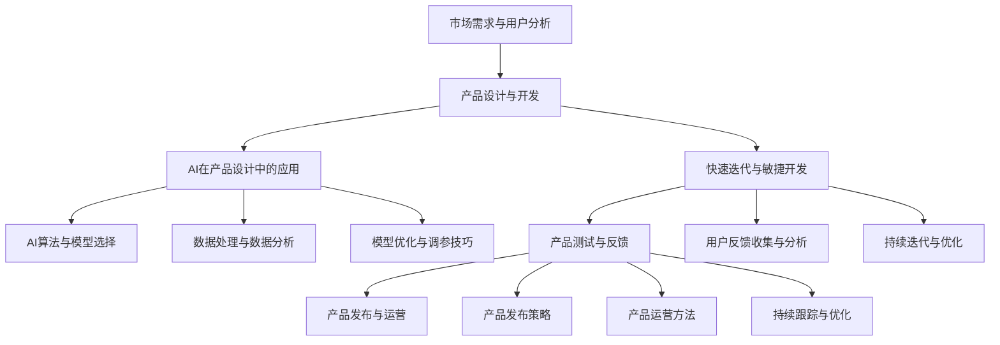

                 

# 文章标题: AI创业公司的产品迭代策略

> 关键词：人工智能，产品迭代，创业公司，需求分析，用户反馈，敏捷开发

> 摘要：本文深入探讨了AI创业公司在产品迭代过程中的策略和实践。通过对市场需求与用户分析、产品设计与开发、AI技术在产品迭代中的应用、产品测试与反馈、产品发布与运营等方面的详细分析，结合实战案例，为AI创业公司提供了有效的产品迭代策略。

## 目录大纲

## 第一部分：AI与创业公司的概述

### 第1章：AI技术概述

#### 1.1 AI的基本概念与发展历程

人工智能（AI）是一种模拟人类智能的技术，旨在使计算机具备人类智能的某些功能，如学习、推理、感知和语言理解。自1956年达特茅斯会议以来，AI技术经历了数个发展阶段，从最初的符号主义到基于规则的系统，再到基于数据的机器学习和深度学习，AI技术逐渐成熟并广泛应用。

#### 1.2 AI技术在创业公司中的角色

在创业公司中，AI技术扮演着至关重要的角色。它不仅可以提高效率、降低成本，还能帮助创业公司快速响应市场需求，抢占市场先机。AI技术在创业公司的产品开发、市场营销、运营管理等各个方面都有广泛应用。

#### 1.3 AI与创业公司的机遇与挑战

AI技术为创业公司带来了巨大的机遇，但同时也伴随着挑战。机遇在于AI技术可以创造新的商业模式、扩大市场边界；挑战在于AI技术的复杂性、数据隐私和安全等问题。创业公司需要充分利用AI技术的优势，同时应对潜在的挑战。

### 第2章：创业公司的产品迭代概述

#### 2.1 创业公司的产品生命周期

创业公司的产品生命周期通常包括概念验证、市场调研、产品开发、市场推广和产品运营等阶段。每个阶段都有其特定的目标和挑战，产品迭代是实现这些目标的关键手段。

#### 2.2 产品迭代的定义与重要性

产品迭代是指通过持续改进和优化，不断提升产品功能、性能和用户体验的过程。在竞争激烈的市场中，产品迭代是创业公司保持竞争力的关键。通过迭代，创业公司可以快速响应市场需求，提高用户满意度，从而赢得市场份额。

#### 2.3 产品迭代的方法与工具

创业公司可以使用多种方法与工具进行产品迭代，如用户调研、需求分析、原型设计、敏捷开发等。这些方法与工具可以帮助创业公司快速构建、测试和优化产品，提高开发效率。

## 第二部分：AI创业公司的产品迭代策略

### 第3章：市场需求与用户分析

#### 3.1 市场需求分析

市场需求分析是产品迭代的第一步，创业公司需要了解目标市场的需求、竞争态势和用户痛点。通过市场需求分析，创业公司可以确定产品的核心功能和市场定位。

#### 3.2 用户研究方法

用户研究是获取用户需求的有效途径，创业公司可以使用多种用户研究方法，如问卷调查、用户访谈、用户行为分析等。这些方法可以帮助创业公司深入了解用户需求和行为，为产品迭代提供依据。

#### 3.3 用户画像与需求挖掘

通过用户画像和需求挖掘，创业公司可以识别出目标用户群体的特征和需求。这有助于创业公司更好地满足用户需求，提高产品竞争力。

### 第4章：产品设计与开发

#### 4.1 AI在产品设计中的应用

AI技术可以应用于产品设计的各个方面，如需求分析、原型设计、用户体验优化等。通过AI技术，创业公司可以更加高效地完成产品设计，提高产品设计质量。

#### 4.2 AI创业公司的开发模式

AI创业公司的开发模式通常采用敏捷开发，这种模式强调快速迭代、持续交付和用户反馈。敏捷开发可以帮助创业公司迅速适应市场变化，提高开发效率。

#### 4.3 快速迭代与敏捷开发

快速迭代与敏捷开发是AI创业公司产品迭代的重要策略。通过不断迭代和优化，创业公司可以快速响应市场需求，提高产品竞争力。

### 第5章：AI技术在产品迭代中的应用

#### 5.1 AI算法与模型选择

AI算法与模型选择是产品迭代的关键环节。创业公司需要根据产品需求选择合适的算法和模型，并通过不断优化和调整，提高模型性能。

#### 5.2 数据处理与数据分析

数据处理与数据分析是AI技术在产品迭代中的重要应用。创业公司需要收集、处理和分析大量数据，以了解用户需求和市场动态。

#### 5.3 模型优化与调参技巧

模型优化与调参技巧是提高AI模型性能的关键。创业公司需要不断优化模型结构、调整参数，以实现更好的预测效果和用户体验。

### 第6章：产品测试与反馈

#### 6.1 产品测试方法与流程

产品测试是确保产品质量和稳定性的关键步骤。创业公司需要采用科学的产品测试方法与流程，确保产品在发布前达到预期质量。

#### 6.2 用户反馈收集与分析

用户反馈是产品迭代的重要依据。创业公司需要建立完善的用户反馈收集与分析机制，及时发现和解决产品问题，提高用户满意度。

#### 6.3 持续迭代与优化

持续迭代与优化是创业公司产品迭代的核心策略。通过不断收集用户反馈和市场信息，创业公司可以持续优化产品，提高市场竞争力。

### 第7章：产品发布与运营

#### 7.1 产品发布策略

产品发布是产品迭代的重要环节。创业公司需要制定合理的发布策略，确保产品在市场上取得成功。

#### 7.2 产品运营方法

产品运营是确保产品长期稳定发展的关键。创业公司需要采用科学的产品运营方法，提高用户活跃度和留存率。

#### 7.3 持续跟踪与优化

持续跟踪与优化是创业公司产品运营的重要策略。通过持续监控产品性能和市场动态，创业公司可以及时调整运营策略，提高产品竞争力。

## 第三部分：AI创业公司的产品迭代实战案例

### 第8章：AI创业公司产品迭代案例解析

#### 8.1 案例一：智能推荐系统的迭代策略

智能推荐系统是一种广泛应用于电商、社交媒体等领域的AI产品。通过案例一，我们将分析智能推荐系统的迭代策略，包括需求分析、算法选择、数据预处理、模型训练和优化等环节。

#### 8.2 案例二：智能客服系统的迭代策略

智能客服系统是一种基于自然语言处理技术的AI产品，可以自动处理用户咨询和投诉。通过案例二，我们将探讨智能客服系统的迭代策略，包括需求分析、对话管理、文本分类、语音识别等技术的应用。

#### 8.3 案例三：智能家居系统的迭代策略

智能家居系统是一种基于物联网技术的AI产品，可以实现家电设备的智能控制和自动化管理。通过案例三，我们将分析智能家居系统的迭代策略，包括传感器技术、数据分析、场景识别和智能家居控制等技术的应用。

## 第四部分：附录

### 第9章：AI创业公司的资源与工具

#### 9.1 开发工具与框架

AI创业公司在开发过程中需要使用多种工具和框架，如编程语言、开发平台、数据库和人工智能框架等。本节将介绍一些常用的开发工具和框架，帮助创业公司高效地进行产品开发。

#### 9.2 数据集与算法库

数据集和算法库是AI创业公司进行产品迭代的重要资源。本节将介绍一些常用的数据集和算法库，如公开数据集、开源算法库和深度学习框架等。

#### 9.3 行业报告与参考资料

行业报告和参考资料是AI创业公司了解市场动态和技术趋势的重要渠道。本节将推荐一些权威的行业报告和参考资料，帮助创业公司把握行业动向，优化产品迭代策略。

# Mermaid 流程图：AI技术在创业公司的产品迭代中的应用



# 伪代码：快速迭代与敏捷开发中的用户反馈收集与分析

```python
# 伪代码：用户反馈收集与分析

# 初始化用户反馈数据结构
user_feedbacks = []

# 收集用户反馈
def collect_user_feedback():
    # ...收集用户反馈的逻辑...
    user_feedback = ...
    user_feedbacks.append(user_feedback)

# 分析用户反馈
def analyze_user_feedback():
    for feedback in user_feedbacks:
        # ...分析用户反馈的逻辑...
        analysis_result = ...
        # ...处理分析结果...

# 持续迭代与优化
def iterate_and_optimize():
    while True:
        analyze_user_feedback()
        # ...根据分析结果进行产品优化...
        # ...更新产品版本...
```

# 数学模型和数学公式

### 回归模型

$$ y = \beta_0 + \beta_1 \cdot x + \epsilon $$

- 其中 $y$ 是因变量，$x$ 是自变量，$\beta_0$ 和 $\beta_1$ 是模型参数，$\epsilon$ 是误差项。

# 举例说明

### 智能推荐系统的用户行为预测

- 假设用户行为可以表示为 $y$，用户的特征可以表示为 $x$，我们使用线性回归模型来预测用户行为。

$$ y = \beta_0 + \beta_1 \cdot x + \epsilon $$

- 通过训练模型，我们得到参数 $\beta_0$ 和 $\beta_1$ 的值。

$$ \beta_0 = 1.2, \beta_1 = 0.8 $$

- 现在预测用户购买某商品的概率，当用户特征 $x = 5$ 时，代入模型：

$$ y = 1.2 + 0.8 \cdot 5 + \epsilon = 5.4 + \epsilon $$

- 其中 $\epsilon$ 是误差项，代表预测值与真实值之间的差异。

# 项目实战

### 智能推荐系统开发案例

- 开发环境：Python，TensorFlow
- 数据集：用户行为数据集，包括用户特征和用户行为记录

### 代码实现

```python
import tensorflow as tf
import numpy as np

# 数据预处理
# ...数据加载与预处理...

# 模型定义
model = tf.keras.Sequential([
    tf.keras.layers.Dense(units=1, input_shape=[num_features], activation='linear')
])

# 编译模型
model.compile(optimizer='sgd', loss='mse')

# 训练模型
model.fit(X_train, y_train, epochs=100)

# 预测用户行为
predictions = model.predict(X_test)
```

### 代码解读与分析

- 模型定义：使用线性回归模型，输入层包含用户特征，输出层包含预测的用户行为。
- 编译模型：选择随机梯度下降（SGD）优化器和均方误差（MSE）损失函数。
- 训练模型：使用训练数据训练模型，训练过程中通过调整模型参数来最小化损失函数。
- 预测用户行为：使用训练好的模型对测试数据进行预测，得到预测的用户行为值。

# 作者

作者：AI天才研究院/AI Genius Institute & 禅与计算机程序设计艺术 /Zen And The Art of Computer Programming

接下来，我们将按照目录大纲结构，逐步分析推理并撰写各章节的内容。由于篇幅限制，本文无法一次性完成所有内容的撰写，但我们会尽量在后续的文章中详细展开每个章节的讨论。敬请期待！## 第一部分：AI与创业公司的概述

### 第1章：AI技术概述

#### 1.1 AI的基本概念与发展历程

人工智能（AI）是一种模拟人类智能的技术，旨在使计算机具备人类智能的某些功能，如学习、推理、感知和语言理解。AI技术的起源可以追溯到20世纪50年代，当时计算机科学刚刚起步，人们开始设想能否让计算机像人类一样思考和决策。

1956年，达特茅斯会议被认为是人工智能领域的诞生之地。这次会议聚集了一批计算机科学家和心理学家，他们提出了人工智能的概念，并讨论了如何通过编程实现机器智能。这个时期的AI研究主要基于逻辑推理和符号主义，即通过定义一套规则和逻辑来模拟人类的推理过程。

随着计算机性能的提升和大数据技术的发展，AI技术经历了从符号主义到基于数据的机器学习的转变。20世纪80年代，专家系统成为AI研究的热点，这些系统通过收集领域专家的知识，形成一套推理规则，用于解决复杂问题。然而，专家系统在处理复杂问题和动态环境时存在局限性。

进入21世纪，随着深度学习技术的发展，AI进入了一个新的阶段。深度学习通过模仿人类大脑的结构和功能，使用大量数据进行训练，从而实现图像识别、语音识别、自然语言处理等任务。这一时期，AI技术在各个领域取得了显著突破，如自动驾驶、医疗诊断、金融分析等。

近年来，AI技术逐渐从实验室走向实际应用，成为创业公司的重要竞争力。AI技术不仅提高了创业公司的效率，还帮助它们在市场上找到了新的增长点。

#### 1.2 AI技术在创业公司中的角色

在创业公司中，AI技术扮演着多重角色，从产品开发到市场营销，再到运营管理，AI技术无处不在。以下是AI技术在创业公司中的一些典型应用：

1. **产品开发**：AI技术可以帮助创业公司快速开发具有创新性和竞争力的产品。通过自然语言处理、图像识别和机器学习等技术，创业公司可以创建智能客服、智能推荐系统、智能家居等产品，提高用户体验。

2. **数据分析**：AI技术可以处理和分析大量数据，帮助创业公司了解市场动态和用户需求。通过数据挖掘和预测模型，创业公司可以优化业务策略，提高决策效率。

3. **市场营销**：AI技术在市场营销中也有广泛应用。通过用户画像和精准推荐，创业公司可以更有效地定位目标客户，提高广告投放效果。同时，AI技术还可以帮助创业公司进行市场调研，了解竞争对手的策略和动态。

4. **运营管理**：AI技术可以帮助创业公司优化运营流程，提高生产效率。例如，通过预测模型和自动化系统，创业公司可以减少库存积压，提高供应链管理水平。

5. **客户服务**：AI技术可以创建智能客服系统，自动化处理客户咨询和投诉，提高客户满意度。同时，AI技术还可以进行情感分析，识别客户的情感状态，提供更加个性化的服务。

#### 1.3 AI与创业公司的机遇与挑战

AI技术为创业公司带来了巨大的机遇，但同时也伴随着挑战。以下是AI技术对创业公司的影响：

**机遇**：

1. **创新机会**：AI技术为创业公司提供了创新的机会，通过引入新技术和新产品，创业公司可以开辟新的市场领域。

2. **竞争优势**：AI技术可以帮助创业公司提高效率和降低成本，从而在竞争激烈的市场中获得优势。

3. **增长潜力**：AI技术的应用可以扩大创业公司的业务范围，提高市场份额和盈利能力。

4. **人才吸引力**：AI技术的发展吸引了大量技术人才加入创业公司，为公司的创新和发展提供了强大的支持。

**挑战**：

1. **技术复杂性**：AI技术涉及多个学科和领域，创业公司在开发和应用AI技术时需要具备较高的技术能力。

2. **数据隐私和安全**：AI技术依赖于大量数据，如何保护用户数据隐私和安全是创业公司面临的重要挑战。

3. **人才短缺**：AI技术领域人才短缺，创业公司在招聘和培养专业人才方面面临困难。

4. **法规和伦理**：AI技术的发展引发了伦理和法律问题，创业公司需要遵守相关法规和伦理标准，确保技术应用的正当性和合理性。

总之，AI技术为创业公司带来了巨大的机遇，但同时也伴随着挑战。创业公司需要充分利用AI技术的优势，同时应对潜在的挑战，才能在激烈的市场竞争中脱颖而出。

### 第2章：创业公司的产品迭代概述

#### 2.1 创业公司的产品生命周期

创业公司的产品生命周期通常包括以下几个阶段：

1. **概念验证（Proof of Concept, PoC）**：在这个阶段，创业公司需要验证产品的基本概念和可行性。通过构建最小可行性产品（Minimum Viable Product, MVP），创业公司可以测试市场需求和用户反馈，确定产品的发展方向。

2. **市场调研（Market Research）**：在概念验证阶段之后，创业公司需要进一步了解市场需求和竞争态势。通过市场调研，创业公司可以确定产品的市场定位、目标用户和核心功能。

3. **产品开发（Product Development）**：在市场调研的基础上，创业公司开始进行产品开发。这个阶段包括需求分析、原型设计、开发测试和用户测试等环节。创业公司需要确保产品满足市场需求，并且具备良好的用户体验。

4. **市场推广（Market Promotion）**：在产品开发完成后，创业公司需要进行市场推广，以提高产品的知名度和用户数量。市场推广可以包括广告、公关、促销和社交媒体营销等多种手段。

5. **产品运营（Product Operation）**：在市场推广阶段，产品开始进入实际运营阶段。创业公司需要关注产品的运营情况，包括用户活跃度、用户留存率和业务指标等。同时，创业公司还需要根据用户反馈和市场变化，不断优化产品功能和服务。

6. **产品维护（Product Maintenance）**：在产品运营阶段，创业公司需要对产品进行维护和更新，确保产品的稳定性和安全性。这包括修复漏洞、升级功能和优化性能等。

#### 2.2 产品迭代的定义与重要性

产品迭代是指通过持续改进和优化，不断提升产品功能、性能和用户体验的过程。在创业公司的产品生命周期中，迭代是一个持续进行的过程，每个阶段都需要进行产品迭代。

**产品迭代的重要性**：

1. **快速响应市场变化**：市场变化快速，用户需求不断变化。通过产品迭代，创业公司可以快速响应市场变化，满足用户需求，提高市场竞争力。

2. **持续优化产品功能**：产品迭代可以帮助创业公司不断优化产品功能，提高产品的实用性和用户体验，从而增加用户满意度和忠诚度。

3. **提高产品质量**：通过迭代，创业公司可以修复产品中的缺陷和漏洞，提高产品的质量和稳定性，降低用户投诉和产品退换率。

4. **促进创新**：产品迭代鼓励创业公司不断尝试新的功能和技术，促进产品的创新和升级，提高产品的市场竞争力。

5. **降低开发风险**：通过小步快跑的迭代方式，创业公司可以降低开发风险，避免一次性投入大量资源导致项目失败。

#### 2.3 产品迭代的方法与工具

创业公司可以采用多种方法与工具进行产品迭代，以下是一些常见的方法与工具：

1. **用户调研（User Research）**：通过用户调研，创业公司可以了解用户的需求、行为和痛点，为产品迭代提供依据。用户调研可以采用问卷调查、用户访谈、用户行为分析等方法。

2. **需求分析（Requirement Analysis）**：需求分析是产品迭代的重要环节，创业公司需要明确产品的功能需求、性能需求和用户体验需求。通过需求分析，创业公司可以确定产品的开发方向和优先级。

3. **原型设计（Prototyping）**：原型设计可以帮助创业公司快速验证产品概念和设计，收集用户反馈。原型设计可以采用低保真原型、高保真原型或交互原型等方法。

4. **敏捷开发（Agile Development）**：敏捷开发是一种以用户需求为导向的软件开发方法，强调快速迭代、持续交付和团队协作。通过敏捷开发，创业公司可以高效地完成产品开发，快速响应市场变化。

5. **持续集成（Continuous Integration）**：持续集成是一种软件开发实践，通过自动化测试和持续部署，确保代码的稳定性和质量。持续集成可以帮助创业公司快速发现和修复代码缺陷，提高开发效率。

6. **用户反馈（User Feedback）**：用户反馈是产品迭代的重要来源，创业公司需要建立有效的用户反馈收集和分析机制，及时了解用户需求和满意度。通过用户反馈，创业公司可以优化产品功能和用户体验。

7. **数据分析（Data Analysis）**：数据分析可以帮助创业公司了解用户行为、市场趋势和业务指标，为产品迭代提供数据支持。通过数据分析，创业公司可以制定更加精准的产品策略和营销策略。

总之，产品迭代是创业公司产品生命周期中不可或缺的一部分。通过采用合适的方法和工具，创业公司可以不断提升产品的质量和用户体验，从而在激烈的市场竞争中脱颖而出。

### 第3章：市场需求与用户分析

#### 3.1 市场需求分析

市场需求分析是创业公司产品迭代过程中至关重要的一步。通过市场需求分析，创业公司可以了解市场的需求和趋势，从而确定产品的方向和定位。市场需求分析主要包括以下几个步骤：

1. **市场调研（Market Research）**：

   - **行业分析**：创业公司需要对所处行业进行全面的分析，包括市场规模、增长趋势、竞争态势等。通过行业分析，创业公司可以确定市场的发展前景和潜在机会。

   - **用户研究**：创业公司需要了解目标用户群体的特征、需求和行为。通过用户研究，创业公司可以识别用户痛点和需求，为产品设计提供依据。

   - **竞争对手分析**：创业公司需要分析主要竞争对手的产品、市场策略和用户评价。通过竞争对手分析，创业公司可以了解市场现状和竞争态势，找到自身的优势和市场定位。

2. **需求识别（Requirement Identification）**：

   - **用户访谈**：通过用户访谈，创业公司可以直接与用户交流，了解用户的需求和期望。用户访谈可以采用一对一访谈、小组访谈等方式。

   - **问卷调查**：通过问卷调查，创业公司可以收集大量用户的意见和建议。问卷调查可以采用线上和线下两种方式，以获取更多用户数据。

   - **用户行为分析**：通过用户行为分析，创业公司可以了解用户的浏览、购买、互动等行为。通过分析用户行为，创业公司可以识别出用户的偏好和需求。

3. **需求优先级排序（Requirement Prioritization）**：

   - **Kano 模型**：Kano 模型是一种用于需求优先级排序的工具，根据用户对需求的满意程度将需求分为五个层次：必备需求、性能需求、诱因需求、无差异需求和反向需求。

   - **MoSCoW 模型**：MoSCoW 模型是一种基于优先级的分类方法，将需求分为必须做（Must have）、应该做（Should have）、可以不做（Could have）、想做但可以不做（Would have）。

   - **用户故事地图**：用户故事地图是一种可视化工具，用于展示用户需求的故事和优先级。通过用户故事地图，创业公司可以清晰地了解用户的需求和期望。

4. **需求文档（Requirement Document）**：

   - **需求规格说明书**：需求规格说明书是需求分析的最终成果，它详细描述了产品的功能需求、性能需求和用户界面等。需求规格说明书是开发团队和产品团队之间的沟通桥梁。

   - **用户故事**：用户故事是一种描述用户需求的简洁方法，通常采用“作为...，我想...，以便...”的格式。通过用户故事，创业公司可以更好地理解用户的需求和目标。

市场需求分析是一个持续的过程，创业公司需要不断地收集和分析市场数据，以适应市场的变化。通过市场需求分析，创业公司可以确保产品的需求与市场实际需求相符，提高产品的市场竞争力。

#### 3.2 用户研究方法

用户研究是了解用户需求和行为的重要途径，创业公司可以采用多种用户研究方法，以获取有价值的用户数据。以下是一些常见的用户研究方法：

1. **用户访谈（User Interview）**：

   - **一对一访谈**：一对一访谈是一种直接与用户交流的方法，可以帮助创业公司深入了解用户的需求、行为和痛点。访谈过程中，创业者可以提问、倾听和记录用户的反馈。

   - **小组访谈**：小组访谈是一种同时与多个用户交流的方法，可以促进用户之间的互动和讨论。通过小组访谈，创业公司可以收集更多的用户观点和意见。

2. **问卷调查（User Survey）**：

   - **在线问卷**：在线问卷是一种方便快捷的调查方法，可以通过邮件、社交媒体或网站链接发送给用户。在线问卷可以设计成多选题、单选题或开放性问题，以获取用户的反馈。

   - **电话调查**：电话调查是一种直接与用户进行沟通的调查方法，可以深入了解用户的需求和意见。电话调查通常由调查员进行，以确保调查的准确性和有效性。

3. **用户行为分析（User Behavior Analysis）**：

   - **用户跟踪（User Tracking）**：用户跟踪是一种通过技术手段记录用户在产品上的行为和互动的方法。通过用户跟踪，创业公司可以了解用户的浏览路径、点击行为和转化率等数据。

   - **A/B 测试（A/B Testing）**：A/B 测试是一种比较两种或多种设计方案的方法，通过对比不同方案的转化率和用户满意度，创业公司可以确定最佳的设计方案。

4. **用户体验地图（User Experience Map）**：

   - **用户体验地图**是一种可视化工具，用于展示用户在产品中的体验流程和痛点。通过用户体验地图，创业公司可以清晰地了解用户的需求和期望，从而优化产品功能。

5. **用户故事（User Story）**：

   - **用户故事**是一种描述用户需求的故事方法，通常采用“作为...，我想...，以便...”的格式。用户故事可以帮助创业公司更好地理解用户的需求和目标，从而制定更有效的产品策略。

在用户研究中，创业公司需要根据产品特点和目标用户选择合适的研究方法。同时，用户研究不是一次性的活动，而是一个持续的过程。通过不断进行用户研究，创业公司可以及时了解用户需求和变化，为产品迭代提供有力支持。

#### 3.3 用户画像与需求挖掘

用户画像和需求挖掘是创业公司在产品迭代过程中非常重要的环节，它们帮助创业公司深入了解目标用户群体，从而优化产品功能和用户体验。以下是用户画像和需求挖掘的详细方法：

1. **用户画像（User Profiling）**：

   - **用户属性分析**：用户画像首先需要分析用户的属性，包括年龄、性别、职业、教育背景、地理位置等。通过分析用户属性，创业公司可以了解用户的基本特征和需求。

   - **用户行为分析**：用户画像还需要分析用户的行为，包括浏览习惯、购买行为、互动行为等。通过分析用户行为，创业公司可以了解用户的兴趣点和痛点。

   - **用户场景分析**：用户画像还需要考虑用户的场景，即用户在什么情况下使用产品。通过分析用户场景，创业公司可以了解用户的实际需求和使用场景，从而优化产品功能。

2. **需求挖掘（Requirement Mining）**：

   - **文本挖掘**：文本挖掘是一种通过分析用户评论、反馈和需求描述来挖掘用户需求的方法。通过文本挖掘，创业公司可以识别出用户的常见问题和需求。

   - **用户行为分析**：用户行为分析是一种通过分析用户在产品中的行为和互动来挖掘用户需求的方法。通过用户行为分析，创业公司可以了解用户的兴趣点和痛点。

   - **数据分析**：数据分析是一种通过分析用户数据（如用户行为数据、购买数据等）来挖掘用户需求的方法。通过数据分析，创业公司可以识别出用户的潜在需求和偏好。

3. **用户细分（User Segmentation）**：

   - **特征细分**：创业公司可以根据用户的属性和行为特征进行细分，将用户分为不同的群体。通过特征细分，创业公司可以了解不同用户群体的需求和偏好。

   - **需求细分**：创业公司还可以根据用户的需求和需求强度进行细分，将用户分为不同的群体。通过需求细分，创业公司可以针对不同用户群体提供个性化的产品和服务。

4. **用户画像和需求挖掘的应用**：

   - **产品优化**：通过用户画像和需求挖掘，创业公司可以了解用户的真实需求，从而优化产品功能和服务，提高用户体验。

   - **市场定位**：通过用户画像和需求挖掘，创业公司可以确定目标用户群体，从而制定更精准的市场营销策略。

   - **产品迭代**：通过用户画像和需求挖掘，创业公司可以不断收集用户反馈和市场信息，为产品迭代提供依据，确保产品的持续优化和更新。

总之，用户画像和需求挖掘是创业公司在产品迭代过程中不可或缺的环节。通过深入了解用户群体和挖掘用户需求，创业公司可以优化产品功能和用户体验，提高市场竞争力。同时，用户画像和需求挖掘是一个持续的过程，创业公司需要不断收集和分析用户数据，以适应市场的变化和用户需求的变化。

### 第4章：产品设计与开发

#### 4.1 AI在产品设计中的应用

人工智能（AI）技术在产品设计中扮演着越来越重要的角色，它可以帮助创业公司提高设计效率、优化用户体验，从而提升产品的市场竞争力。以下是AI在产品设计中的应用：

1. **需求分析**：

   - **AI辅助需求分析**：通过自然语言处理（NLP）技术，AI可以帮助创业公司自动分析用户调研数据，如用户访谈、问卷调查等。通过分析用户反馈，AI可以识别出用户的主要需求和痛点，从而为产品设计提供有力支持。

   - **语义分析**：AI可以对用户的语言进行语义分析，提取出用户的关键需求和情感倾向。例如，通过情感分析，创业公司可以了解用户对产品的满意度和不满意度，从而调整产品设计和功能。

2. **原型设计**：

   - **自动生成原型**：使用AI生成原型工具，如AI绘画、3D建模等，创业公司可以快速生成各种设计原型。这些原型不仅可以提高设计效率，还可以为设计师提供灵感和创意。

   - **交互设计优化**：AI技术可以帮助设计师优化产品的交互设计。通过用户行为数据分析，AI可以识别出用户在产品中的交互痛点，并提供优化建议。例如，AI可以调整按钮的位置、颜色和大小，以提高用户的操作便捷性。

3. **用户体验优化**：

   - **个性化推荐**：通过机器学习算法，AI可以为用户提供个性化的推荐。例如，在电商平台上，AI可以根据用户的浏览和购买历史，推荐符合用户兴趣的商品。个性化推荐不仅可以提高用户满意度，还可以增加销售转化率。

   - **情感计算**：情感计算是一种通过分析用户的情绪和行为来优化用户体验的技术。例如，在智能客服中，AI可以通过语音识别和情感分析，识别用户的情绪状态，并做出相应的回应。通过情感计算，创业公司可以提供更加人性化的服务。

4. **设计优化与迭代**：

   - **A/B测试**：AI可以帮助创业公司进行A/B测试，比较不同设计方案的效果。通过分析用户数据，AI可以识别出最佳的设计方案，从而优化产品设计和功能。

   - **自动化设计**：AI可以在设计过程中自动生成各种设计元素，如图标、按钮、页面布局等。通过自动化设计，创业公司可以快速迭代和优化产品界面。

总之，AI在产品设计中的应用可以帮助创业公司提高设计效率、优化用户体验，从而提升产品的市场竞争力。通过充分利用AI技术，创业公司可以在激烈的市场竞争中脱颖而出。

#### 4.2 AI创业公司的开发模式

在快速变化的市场环境中，AI创业公司需要采取高效的开发模式，以确保产品能够快速迭代和持续优化。以下是一些AI创业公司的常见开发模式：

1. **敏捷开发（Agile Development）**：

   - **迭代开发**：敏捷开发强调迭代开发和持续交付。在每次迭代中，开发团队会完成一部分功能，并进行测试和用户反馈。通过不断迭代，团队可以快速响应市场需求和用户反馈，持续优化产品。

   - **持续集成（Continuous Integration）**：敏捷开发强调持续集成，通过自动化测试和代码审查，确保代码的稳定性和质量。持续集成可以快速发现和修复代码缺陷，减少开发风险。

   - **用户故事地图（User Story Map）**：用户故事地图是一种可视化工具，用于展示用户需求的故事和优先级。通过用户故事地图，团队可以明确产品的功能需求和开发顺序。

2. **快速原型开发（Rapid Prototyping）**：

   - **快速构建原型**：快速原型开发强调快速构建和测试原型。通过低保真原型或高保真原型，团队可以快速验证产品的概念和设计，收集用户反馈。快速原型开发有助于降低开发风险，提高产品的市场适应性。

   - **用户测试**：在原型开发过程中，团队会进行用户测试，以评估产品的可用性和用户体验。通过用户测试，团队可以识别出产品的潜在问题和优化点，从而改进设计。

3. **DevOps（Development and Operations）**：

   - **自动化部署**：DevOps强调开发和运维的紧密合作，通过自动化部署和监控，确保产品的稳定性和可靠性。自动化部署可以加快产品的发布速度，减少手动操作的风险。

   - **持续监控**：DevOps还强调持续监控，通过监控系统的运行状态和性能指标，团队可以及时发现和解决潜在问题。持续监控有助于提高产品的稳定性和用户体验。

4. **数据驱动开发（Data-Driven Development）**：

   - **数据分析**：数据驱动开发强调通过数据分析指导产品开发。通过分析用户行为数据、市场数据和业务指标，团队可以了解产品的优势和劣势，制定相应的优化策略。

   - **数据反馈循环**：数据驱动开发强调建立数据反馈循环，通过不断收集和分析数据，团队可以优化产品功能和用户体验。数据反馈循环有助于提高产品的市场竞争力。

5. **跨职能团队（Cross-Functional Team）**：

   - **协作与沟通**：AI创业公司的开发模式强调跨职能团队的协作与沟通。通过将不同职能（如开发、设计、测试、运维等）的团队成员组织在一起，团队可以快速响应市场需求和变化。

   - **共同目标**：跨职能团队有助于确保团队成员共同追求产品目标，减少内部摩擦和沟通障碍。通过共同目标，团队可以更加高效地完成产品开发。

总之，AI创业公司需要采取高效的开发模式，以确保产品能够快速迭代和持续优化。通过采用敏捷开发、快速原型开发、DevOps、数据驱动开发和跨职能团队等模式，AI创业公司可以更好地适应市场变化，提高产品的市场竞争力。

#### 4.3 快速迭代与敏捷开发

快速迭代与敏捷开发是AI创业公司产品迭代的重要策略，它们不仅提高了开发效率，还确保了产品能够快速响应市场需求和用户反馈。以下是快速迭代与敏捷开发的详细方法：

1. **迭代开发（Iterative Development）**：

   - **持续交付**：迭代开发强调持续交付，开发团队在每个迭代周期内完成一部分功能，并进行测试和用户反馈。通过持续交付，团队可以快速迭代和优化产品，减少开发周期和风险。

   - **短周期**：迭代周期通常较短，例如一周或两周。短周期有助于团队快速反馈和调整，确保产品能够持续满足用户需求。

   - **增量交付**：迭代开发采用增量交付方式，每次迭代都会增加新的功能或优化现有功能。通过增量交付，团队可以逐步完善产品，避免一次性交付大量功能的压力。

2. **敏捷开发（Agile Development）**：

   - **用户故事（User Story）**：敏捷开发使用用户故事来描述产品功能，每个用户故事代表一项具体需求。用户故事通常采用“作为...，我想...，以便...”的格式，明确用户的需求和目标。

   - **迭代计划（Sprint Planning）**：在每次迭代开始时，团队会进行迭代计划，确定本次迭代的目标和任务。迭代计划通常包括用户故事的选择、任务分解和优先级排序。

   - **每日站会（Daily Stand-up）**：每日站会是敏捷开发中的日常会议，团队成员会在站会上分享工作进展、遇到的困难和计划。每日站会有助于团队保持沟通和协调，及时解决问题。

   - **迭代回顾（Sprint Retrospective）**：在每次迭代结束时，团队会进行迭代回顾，总结本次迭代的经验和教训，提出改进建议。迭代回顾有助于团队不断优化开发过程，提高效率。

3. **用户反馈（User Feedback）**：

   - **反馈机制**：敏捷开发强调建立有效的反馈机制，通过用户调研、用户测试和用户反馈收集，团队可以及时了解用户的需求和意见。用户反馈是产品迭代的重要依据，有助于团队调整和优化产品。

   - **快速响应**：团队需要快速响应用户反馈，及时调整产品功能和用户体验。通过快速响应，团队可以确保产品能够持续满足用户需求，提高用户满意度。

4. **持续改进（Continuous Improvement）**：

   - **迭代优化**：在每次迭代中，团队都会对产品进行优化和改进。通过不断迭代和优化，团队可以不断提高产品的质量和用户体验。

   - **自动化测试**：敏捷开发强调自动化测试，通过自动化测试工具，团队可以快速发现和修复代码缺陷。自动化测试有助于提高产品的稳定性和可靠性。

   - **持续集成（CI）**：敏捷开发中的持续集成，通过自动化构建和部署，确保代码的稳定性和质量。持续集成可以加快产品的发布速度，减少手动操作的风险。

总之，快速迭代与敏捷开发是AI创业公司产品迭代的重要策略。通过持续迭代和优化，团队可以快速响应市场需求和用户反馈，提高产品的市场竞争力。同时，敏捷开发强调团队协作和用户反馈，有助于建立高效、透明的开发流程，为产品的长期成功奠定基础。

### 第5章：AI技术在产品迭代中的应用

#### 5.1 AI算法与模型选择

在产品迭代过程中，选择合适的AI算法和模型对于提升产品性能和用户体验至关重要。以下是一些常见的AI算法和模型及其适用场景：

1. **机器学习算法**：

   - **线性回归（Linear Regression）**：适用于预测线性关系，如用户购买概率、价格预测等。

   - **逻辑回归（Logistic Regression）**：适用于分类问题，如用户是否购买、是否点击广告等。

   - **决策树（Decision Tree）**：适用于分类和回归问题，通过树形结构进行决策。

   - **随机森林（Random Forest）**：基于决策树的集成方法，可以提高模型性能和泛化能力。

   - **支持向量机（Support Vector Machine, SVM）**：适用于分类和回归问题，通过最大化分类间隔提高分类准确性。

2. **深度学习模型**：

   - **卷积神经网络（Convolutional Neural Network, CNN）**：适用于图像识别和分类任务。

   - **循环神经网络（Recurrent Neural Network, RNN）**：适用于序列数据，如文本、语音等。

   - **长短时记忆网络（Long Short-Term Memory, LSTM）**：基于RNN的一种改进模型，可以更好地处理长序列数据。

   - **生成对抗网络（Generative Adversarial Network, GAN）**：适用于生成图像、文本等数据。

   - **变换器（Transformer）**：适用于自然语言处理任务，如机器翻译、文本生成等。

3. **强化学习算法**：

   - **Q-Learning**：适用于优化策略，如推荐系统、游戏AI等。

   - **深度强化学习（Deep Reinforcement Learning）**：结合深度学习和强化学习，适用于复杂的决策问题。

在选择AI算法和模型时，创业公司需要考虑以下因素：

- **数据量**：大量数据通常更适合使用深度学习模型，而小数据量可能更适合使用传统的机器学习算法。

- **任务类型**：不同的任务类型（如分类、回归、生成等）需要选择不同的算法和模型。

- **计算资源**：深度学习模型通常需要较高的计算资源，而传统的机器学习算法计算成本较低。

- **可解释性**：深度学习模型通常具有较低的透明度，而传统的机器学习算法（如决策树）具有较好的可解释性。

#### 5.2 数据处理与数据分析

数据处理和数据分析是AI技术在产品迭代中的关键环节，通过有效的数据处理和分析，创业公司可以提取有价值的信息，为产品优化提供依据。以下是数据处理与数据分析的详细方法：

1. **数据收集**：

   - **用户行为数据**：通过用户互动数据，如点击、浏览、购买等，创业公司可以了解用户的行为模式和偏好。

   - **业务数据**：包括销售额、订单量、库存量等，通过业务数据，创业公司可以分析业务趋势和用户需求。

   - **外部数据**：如天气数据、地理位置数据等，外部数据可以帮助创业公司进行市场分析和用户定位。

2. **数据预处理**：

   - **数据清洗**：删除重复数据、缺失数据和异常值，确保数据质量。

   - **数据归一化**：通过归一化处理，将不同特征的数据缩放到相同的范围，便于模型训练。

   - **特征工程**：通过特征工程，提取和构建新的特征，提高模型的预测性能。例如，通过时间序列特征、文本特征和图像特征等，可以丰富数据的信息量。

3. **数据分析方法**：

   - **描述性分析**：通过统计方法，如均值、中位数、标准差等，了解数据的基本特征和分布。

   - **相关性分析**：通过相关性分析，了解不同特征之间的关联性，为模型训练提供依据。

   - **分类分析**：通过分类算法，如逻辑回归、决策树、随机森林等，分析用户的行为和需求。

   - **回归分析**：通过回归算法，如线性回归、非线性回归等，预测用户的行为和业务指标。

   - **聚类分析**：通过聚类算法，如K-means、层次聚类等，将用户分为不同的群体，为个性化推荐提供依据。

4. **数据分析工具**：

   - **Python**：Python是数据分析的常用语言，具有丰富的数据分析库，如Pandas、NumPy、Scikit-learn等。

   - **R语言**：R语言是一种专门用于统计分析和图形表示的语言，具有强大的数据分析功能。

   - **Tableau**：Tableau是一种数据可视化工具，可以快速生成图表和报表，帮助创业公司直观地了解数据分析结果。

通过有效的数据处理和数据分析，创业公司可以深入了解用户行为和需求，为产品优化提供数据支持。同时，数据分析是一个持续的过程，创业公司需要不断收集和分析数据，以适应市场的变化和用户需求的变化。

#### 5.3 模型优化与调参技巧

在AI产品迭代过程中，模型优化和调参是提高模型性能和稳定性的关键环节。以下是一些常见的模型优化和调参技巧：

1. **超参数调整**：

   - **网格搜索（Grid Search）**：通过遍历预设的超参数组合，找到最优超参数配置。网格搜索适用于超参数较少的情况。

   - **随机搜索（Random Search）**：随机选择超参数组合进行测试，适用于超参数较多的情况。随机搜索可以减少计算成本，提高搜索效率。

   - **贝叶斯优化（Bayesian Optimization）**：基于概率模型，通过模拟贝叶斯后验分布，找到最优超参数配置。贝叶斯优化具有较好的全局搜索能力，适用于复杂优化问题。

2. **模型调优技巧**：

   - **交叉验证（Cross-Validation）**：通过交叉验证，评估模型的泛化能力。交叉验证可以避免过拟合，提高模型的稳定性和可靠性。

   - **正则化（Regularization）**：通过添加正则化项，如L1正则化、L2正则化等，防止模型过拟合。正则化可以提高模型的泛化能力，减少过拟合风险。

   - **批量归一化（Batch Normalization）**：批量归一化可以加速模型训练，提高模型性能。批量归一化通过将激活值缩放到标准正态分布，减少梯度消失和梯度爆炸问题。

   - **数据增强（Data Augmentation）**：通过数据增强，生成更多的训练样本，提高模型的泛化能力。数据增强可以缓解模型过拟合，提高模型鲁棒性。

3. **集成学习（Ensemble Learning）**：

   - **堆叠（Stacking）**：通过将多个模型进行堆叠，构建一个新的集成模型。堆叠模型可以充分利用不同模型的优点，提高整体性能。

   - **随机森林（Random Forest）**：随机森林是一种基于决策树的集成学习方法，通过随机选择特征和样本，构建多个决策树，提高模型的稳定性和性能。

   - **梯度提升树（Gradient Boosting Tree）**：梯度提升树是一种基于决策树的集成学习方法，通过迭代更新模型，逐步优化预测性能。梯度提升树可以处理大规模数据和复杂问题。

4. **调参工具**：

   - **Hyperopt**：Hyperopt是一种基于Python的自动化超参数优化工具，可以通过搜索算法自动调整超参数，找到最优配置。

   - **BayesOpt**：BayesOpt是一种基于贝叶斯优化的超参数优化工具，通过模拟贝叶斯后验分布，找到最优超参数。

   - **MLJet**：MLJet是一种集成学习平台，提供多种调参方法和工具，帮助用户进行模型优化和调参。

通过模型优化和调参技巧，创业公司可以不断提高AI产品的性能和稳定性，为用户带来更好的体验。同时，调参是一个持续的过程，创业公司需要不断尝试和优化，以适应不断变化的市场需求。

### 第6章：产品测试与反馈

#### 6.1 产品测试方法与流程

产品测试是确保产品质量和稳定性的关键步骤。在AI创业公司的产品迭代过程中，科学的产品测试方法与流程至关重要。以下是一些常见的产品测试方法与流程：

1. **功能测试**：

   - **黑盒测试（Black Box Testing）**：黑盒测试不考虑内部实现，只关注输入和输出。通过黑盒测试，可以验证产品功能是否按照预期工作。

   - **白盒测试（White Box Testing）**：白盒测试考虑内部实现，通过检查代码逻辑和结构，验证代码的正确性和可靠性。

   - **灰盒测试（Gray Box Testing）**：灰盒测试结合了黑盒测试和白盒测试，同时考虑内部实现和输入输出。

2. **性能测试**：

   - **负载测试（Load Testing）**：负载测试通过模拟大量用户同时访问产品，验证产品在高负载情况下的性能和稳定性。

   - **压力测试（Stress Testing）**：压力测试通过模拟极端情况，如高并发、大流量等，验证产品在极限条件下的性能和稳定性。

   - **容量测试（Capacity Testing）**：容量测试通过逐渐增加用户数量和系统负载，确定产品的最大承载能力和性能瓶颈。

3. **安全性测试**：

   - **漏洞扫描（Vulnerability Scanning）**：漏洞扫描通过自动化工具检查产品中的安全漏洞，确保产品的安全性。

   - **渗透测试（Penetration Testing）**：渗透测试通过模拟黑客攻击，验证产品的安全性，识别潜在的安全漏洞。

   - **代码审计（Code Auditing）**：代码审计通过检查代码质量，识别潜在的安全隐患，提高产品的安全性。

4. **用户体验测试**：

   - **A/B测试（A/B Testing）**：A/B测试通过比较不同设计方案的效果，确定最佳的设计方案，优化用户体验。

   - **可用性测试（Usability Testing）**：可用性测试通过观察用户在使用产品过程中的行为和反馈，评估产品的易用性和用户体验。

   - **满意度调查（ Satisfaction Survey）**：满意度调查通过收集用户对产品的满意度和意见，了解用户对产品的评价，为产品优化提供依据。

5. **测试流程**：

   - **测试计划**：制定测试计划，明确测试目标、测试策略、测试资源等。

   - **测试用例设计**：设计测试用例，包括功能测试用例、性能测试用例、安全性测试用例等。

   - **测试执行**：按照测试用例进行测试，记录测试结果和问题。

   - **缺陷管理**：对测试过程中发现的问题进行跟踪和管理，确保问题得到及时解决。

   - **测试报告**：编写测试报告，总结测试结果、问题和改进建议，为后续产品迭代提供依据。

通过科学的产品测试方法与流程，AI创业公司可以确保产品的质量、性能和用户体验，提高产品的市场竞争力。

#### 6.2 用户反馈收集与分析

用户反馈是产品迭代的重要依据，它可以帮助AI创业公司了解用户的真实需求和满意度，为产品的优化和改进提供方向。以下是用户反馈收集与分析的详细方法：

1. **用户反馈渠道**：

   - **在线反馈**：通过网站、APP等在线平台，用户可以提交反馈意见，包括文字、图片、视频等多种形式。

   - **客服反馈**：用户可以通过在线客服、电话客服等渠道，与客服人员直接交流，反馈使用过程中的问题和建议。

   - **问卷调查**：通过问卷调查，可以收集大量用户的意见和建议，了解用户对产品的整体评价和具体需求。

   - **社交媒体**：用户可以在社交媒体平台上发表对产品的评价和反馈，如微博、知乎、Reddit等。

2. **用户反馈收集方法**：

   - **主动收集**：通过设计反馈表单、意见箱等，主动引导用户提交反馈意见。例如，在APP内设置反馈按钮，方便用户随时提交反馈。

   - **被动收集**：通过分析用户行为数据，如登录次数、使用时长、操作路径等，发现用户在使用过程中的问题和痛点。

   - **用户访谈**：通过一对一访谈、小组访谈等方式，深入了解用户的需求和意见。用户访谈可以采用面对面、电话或视频通话等形式。

   - **用户调研**：通过问卷调查、在线调研等方式，收集大量用户的意见和建议。用户调研可以采用随机抽样、分层抽样等方法。

3. **用户反馈分析**：

   - **数据整理**：将收集到的用户反馈数据进行整理和分类，提取关键信息和意见。

   - **关键词提取**：通过自然语言处理技术，提取用户反馈中的关键词和主题，了解用户的关注点和需求。

   - **情感分析**：使用情感分析技术，分析用户反馈中的情感倾向，了解用户的满意度和不满意度。

   - **趋势分析**：分析用户反馈的时间分布和变化趋势，了解用户需求的变化和产品的改进方向。

   - **聚类分析**：将用户反馈进行聚类分析，识别出具有相似意见的用户群体，为产品优化提供针对性建议。

4. **用户反馈应用**：

   - **产品优化**：根据用户反馈，优化产品的功能、界面和用户体验。例如，调整界面布局、改进功能设计等。

   - **问题解决**：针对用户反馈中的问题，及时进行修复和改进，提高产品的稳定性和可靠性。

   - **满意度提升**：通过满足用户需求和改进产品，提高用户满意度，增加用户忠诚度。

   - **产品迭代**：根据用户反馈，制定产品迭代计划，持续改进产品，适应市场需求。

总之，用户反馈是产品迭代的重要依据，通过科学地收集和分析用户反馈，AI创业公司可以不断优化产品，提高用户体验和市场竞争力。同时，用户反馈是一个持续的过程，创业公司需要不断收集用户意见和建议，以适应市场的变化和用户需求的变化。

#### 6.3 持续迭代与优化

持续迭代与优化是AI创业公司在产品迭代过程中不可或缺的策略。通过持续迭代和优化，创业公司可以不断满足用户需求，提高产品竞争力。以下是一些实现持续迭代与优化的方法：

1. **用户反馈驱动的迭代**：

   - **建立反馈机制**：通过在线反馈表单、用户调研、社交媒体等多种渠道，建立完善的用户反馈收集机制，确保用户意见和建议能够及时传递给产品团队。

   - **快速响应**：对于用户反馈的问题和需求，产品团队需要快速响应，制定优化方案，并在后续版本中实现。快速响应可以提升用户满意度，增强用户忠诚度。

   - **定期回顾**：定期回顾用户反馈情况，分析用户需求的变化和趋势，为产品优化提供依据。

2. **数据驱动的优化**：

   - **数据收集与分析**：通过分析用户行为数据、业务数据等，了解用户的使用习惯、需求变化和市场趋势。数据驱动的优化可以基于实际数据，确保优化方向与用户需求相符。

   - **A/B测试**：通过A/B测试，比较不同设计方案的效果，找出最佳方案。A/B测试可以帮助创业公司降低优化风险，提高优化效果。

   - **持续监控**：对产品的性能、稳定性和用户体验进行持续监控，及时发现和解决问题。持续监控可以确保产品在运行过程中保持良好状态。

3. **敏捷开发**：

   - **短周期迭代**：采用短周期迭代模式，如两周或一个月，快速完成产品开发和优化。短周期迭代可以加快产品迭代速度，提高开发效率。

   - **用户故事地图**：使用用户故事地图，明确产品的功能需求、优先级和开发顺序。用户故事地图可以帮助团队专注于关键需求和用户价值。

   - **跨职能团队**：组建跨职能团队，包括开发、设计、测试、产品管理等角色，确保团队协作和沟通。跨职能团队可以提高开发效率，确保产品迭代顺利进行。

4. **持续学习与改进**：

   - **知识共享**：鼓励团队成员分享经验和知识，提高团队的整体能力。知识共享可以减少重复劳动，提高工作效率。

   - **技术更新**：关注最新的技术趋势和研究成果，引入新的技术和方法，为产品优化提供支持。技术更新可以帮助创业公司保持竞争优势。

   - **流程优化**：对开发流程进行不断优化，减少不必要的环节和步骤，提高开发效率。流程优化可以确保产品迭代过程的顺利进行。

通过持续迭代与优化，AI创业公司可以不断提高产品的质量和用户体验，满足用户需求，提高市场竞争力。同时，持续迭代与优化是一个持续的过程，创业公司需要不断学习和改进，以适应市场的变化和用户需求的变化。

### 第7章：产品发布与运营

#### 7.1 产品发布策略

产品发布是创业公司产品迭代过程中的重要环节，合理的发布策略可以帮助公司确保产品在市场上的成功。以下是产品发布策略的详细方法：

1. **确定发布时机**：

   - **市场趋势**：根据市场趋势和用户需求，确定产品的发布时机。选择市场需求旺盛的时期发布，可以提高产品的市场关注度。

   - **竞争态势**：分析竞争对手的发布策略，避免与竞争对手在短时间内发布相似的产品，以减少竞争压力。

   - **公司资源**：考虑公司的资源状况，包括人力资源、资金、技术支持等，确保产品发布时有足够的资源支持。

2. **制定发布计划**：

   - **初步测试**：在发布前进行初步测试，确保产品的基本功能、性能和稳定性达到预期。初步测试可以帮助发现和修复潜在的问题。

   - **预热活动**：在发布前进行预热活动，通过社交媒体、官网、发布会等方式，提高产品的知名度和用户期待。预热活动可以包括宣传视频、预告片、用户体验活动等。

   - **发布日程**：制定详细的发布日程，包括发布时间、发布地点、参与人员等。发布日程可以帮助团队明确任务和责任，确保发布顺利进行。

3. **发布渠道选择**：

   - **线上发布**：通过官网、APP商店、应用市场等线上渠道发布产品，便于用户下载和使用。线上发布可以快速覆盖广泛用户群体。

   - **线下发布**：通过线下发布会、展会等活动发布产品，可以提高产品的曝光度和权威性。线下发布可以吸引行业专家、潜在客户和媒体的关注。

   - **多渠道发布**：结合线上和线下发布渠道，实现全方位覆盖。多渠道发布可以提高产品的知名度和市场影响力。

4. **发布宣传策略**：

   - **内容营销**：通过撰写产品介绍、用户体验、行业分析等高质量内容，吸引潜在用户的关注。内容营销可以帮助建立品牌形象，提高用户信任度。

   - **社交媒体推广**：利用社交媒体平台（如微博、微信、Facebook、Twitter等），发布产品宣传信息，扩大产品的影响力。社交媒体推广可以迅速传播产品信息，提高用户参与度。

   - **合作伙伴宣传**：与行业合作伙伴、媒体等进行合作宣传，共同推广产品。合作伙伴宣传可以借助对方的资源和渠道，提高产品的市场知名度。

   - **KOL（Key Opinion Leader）**：邀请行业意见领袖和知名博主进行产品评测和推荐，提高产品的权威性和认可度。KOL推广可以迅速提升产品的市场影响力。

5. **发布后续行动**：

   - **用户反馈收集**：发布后，积极收集用户反馈，了解用户对产品的评价和使用体验。用户反馈是产品优化的重要依据，可以帮助公司持续改进产品。

   - **持续更新**：根据用户反馈和市场变化，持续更新产品功能，优化用户体验。持续更新可以保持产品的竞争力，提高用户满意度。

   - **营销活动**：通过举办线上线下营销活动，如促销、优惠券、免费试用等，吸引新用户，提高用户活跃度和留存率。

#### 7.2 产品运营方法

产品运营是确保产品长期稳定发展的关键，有效的产品运营方法可以帮助创业公司提高用户活跃度和留存率。以下是产品运营方法的详细方法：

1. **用户增长策略**：

   - **用户拓展**：通过多种渠道（如社交媒体、广告、合作伙伴等）拓展新用户，扩大用户基础。

   - **用户激活**：通过引导用户完成关键任务（如注册、登录、购买等），提高用户激活率。

   - **用户留存**：通过提供高质量的内容和服务，提高用户留存率。例如，定期推出新功能、举办线上活动等。

2. **用户留存策略**：

   - **用户激励**：通过积分、优惠券、奖励等激励措施，鼓励用户持续使用产品。用户激励可以增加用户粘性和活跃度。

   - **用户互动**：通过社区、论坛、直播等方式，促进用户之间的互动和交流，提高用户参与度。用户互动可以增强用户对产品的认同感和忠诚度。

   - **用户反馈**：建立有效的用户反馈机制，及时收集用户意见和建议，为产品优化提供依据。用户反馈可以提高产品满意度，降低用户流失率。

3. **数据分析与监控**：

   - **用户行为分析**：通过数据分析工具，监控用户的使用行为，如点击、浏览、购买等，了解用户需求和使用习惯。

   - **关键指标监控**：设置关键指标（如用户留存率、活跃度、转化率等），实时监控产品的运营状况，及时发现和解决问题。

   - **数据驱动决策**：根据数据分析结果，制定和调整产品运营策略，提高用户满意度和留存率。

4. **市场营销策略**：

   - **内容营销**：通过撰写高质量的内容（如博客、白皮书、案例分析等），吸引目标用户，提高品牌知名度。

   - **广告投放**：通过搜索引擎广告、社交媒体广告、展示广告等，扩大产品的曝光度和用户覆盖面。

   - **合作伙伴推广**：与行业合作伙伴、媒体等进行合作推广，借助合作伙伴的资源和渠道，提高产品的市场影响力。

5. **用户服务与支持**：

   - **在线客服**：提供在线客服服务，及时解答用户的疑问和问题，提高用户满意度。

   - **用户培训**：为用户提供产品使用培训，帮助用户更好地了解和掌握产品的功能。

   - **用户社区**：建立用户社区，促进用户之间的交流和互动，增强用户归属感和忠诚度。

通过科学的产品运营方法，创业公司可以持续提高用户活跃度和留存率，实现产品的长期稳定发展。同时，产品运营是一个持续的过程，创业公司需要不断收集用户数据、分析市场趋势，优化运营策略，以适应市场的变化和用户需求的变化。

#### 7.3 持续跟踪与优化

持续跟踪与优化是AI创业公司在产品发布后必须坚持的工作，它有助于公司及时了解产品在市场中的表现，并根据反馈进行改进。以下是持续跟踪与优化的详细方法：

1. **性能监控**：

   - **系统监控**：通过系统监控工具，实时监控产品的性能指标，如响应时间、吞吐量、错误率等。系统监控可以帮助公司及时发现性能瓶颈和潜在问题。

   - **日志分析**：收集和分析产品的运行日志，识别异常行为和错误信息。日志分析有助于公司了解产品的运行状态，为优化提供数据支持。

2. **用户行为分析**：

   - **行为追踪**：使用数据分析工具，追踪用户在产品中的行为路径，如点击、浏览、操作等。通过行为追踪，公司可以了解用户的使用习惯和偏好。

   - **事件分析**：通过分析用户事件数据（如登录、购买、评价等），了解用户的参与度和满意度。事件分析可以帮助公司识别用户痛点，为优化提供方向。

3. **用户反馈收集**：

   - **在线调查**：通过在线调查工具，定期收集用户对产品的反馈和评价。在线调查可以提供大量用户数据，帮助公司了解用户需求。

   - **用户访谈**：与用户进行一对一访谈，深入了解用户的意见和需求。用户访谈可以获取更详细的用户反馈，有助于公司制定针对性优化方案。

4. **数据分析**：

   - **数据可视化**：通过数据可视化工具，将复杂的数据转化为图表和报表，便于公司理解和分析。数据可视化可以提高数据分析的效率。

   - **趋势分析**：分析用户行为数据的变化趋势，预测用户需求和市场动态。趋势分析可以帮助公司提前做好准备，及时调整产品策略。

5. **迭代优化**：

   - **持续迭代**：根据用户反馈和数据分析结果，持续优化产品功能、性能和用户体验。持续迭代可以帮助公司保持产品的竞争力。

   - **A/B测试**：通过A/B测试，比较不同设计方案的效果，选择最佳方案。A/B测试可以帮助公司降低优化风险，提高优化效果。

   - **用户参与**：鼓励用户参与产品优化过程，收集用户的意见和建议。用户参与可以提高产品的满意度，增强用户忠诚度。

通过持续跟踪与优化，AI创业公司可以不断改进产品，提高用户满意度，增强市场竞争力。同时，持续跟踪与优化是一个持续的过程，创业公司需要不断收集用户数据、分析市场趋势，优化运营策略，以适应市场的变化和用户需求的变化。

### 第8章：AI创业公司产品迭代案例解析

#### 8.1 案例一：智能推荐系统的迭代策略

智能推荐系统是AI创业公司中常见的应用场景，通过分析用户行为和偏好，为用户提供个性化的推荐。以下是智能推荐系统迭代策略的详细分析：

1. **需求分析**：

   - **用户调研**：通过用户访谈和问卷调查，了解用户对推荐系统的需求。例如，用户希望推荐系统能够提供个性化的、符合自己兴趣的内容。

   - **数据收集**：收集用户的历史行为数据，如浏览记录、购买记录、搜索记录等。数据收集是推荐系统迭代的基础。

2. **模型选择**：

   - **基于协同过滤（Collaborative Filtering）**：协同过滤是一种基于用户行为相似性的推荐算法，通过分析用户的行为模式，为用户推荐相似用户喜欢的内容。协同过滤包括基于用户的协同过滤（User-based）和基于项目的协同过滤（Item-based）两种方法。

   - **基于内容推荐（Content-based）**：基于内容推荐通过分析内容的特征，为用户推荐相似的内容。例如，如果用户喜欢某篇新闻文章，推荐系统可以推荐风格相似的其他文章。

   - **混合推荐（Hybrid）**：混合推荐结合协同过滤和内容推荐，以提高推荐准确性。例如，可以首先通过协同过滤找到相似用户，然后使用内容推荐进一步筛选推荐内容。

3. **模型优化**：

   - **数据预处理**：对用户行为数据和处理前的预处理，如缺失值处理、数据归一化等，以提高模型训练效果。

   - **特征工程**：提取用户和物品的特征，如用户年龄、性别、地理位置、历史行为等。特征工程是提高推荐系统性能的关键。

   - **模型调参**：通过网格搜索、随机搜索等调参方法，找到最佳的超参数组合，以提高模型性能。

4. **用户反馈收集与分析**：

   - **用户反馈机制**：通过在线反馈表单、用户访谈等方式，收集用户对推荐结果的反馈。用户反馈是模型优化的重要依据。

   - **A/B测试**：通过A/B测试，比较不同推荐算法和策略的效果，选择最佳方案。A/B测试可以降低优化风险，提高推荐准确性。

5. **持续迭代与优化**：

   - **定期更新**：定期更新推荐算法和策略，以适应用户需求的变化。例如，每月或每季度更新一次推荐模型。

   - **用户参与**：鼓励用户参与推荐系统的优化，通过用户调研和反馈，收集用户意见和建议。用户参与可以提高推荐系统的满意度。

案例一展示了智能推荐系统在迭代策略中的关键步骤，从需求分析、模型选择到用户反馈收集和分析，每个环节都需要精心设计和实施。通过不断的迭代和优化，智能推荐系统可以不断提高推荐准确性，满足用户需求，提高用户满意度。

#### 8.2 案例二：智能客服系统的迭代策略

智能客服系统在AI创业公司中扮演着重要角色，通过自然语言处理和机器学习技术，自动化处理用户咨询和投诉。以下是智能客服系统迭代策略的详细分析：

1. **需求分析**：

   - **用户调研**：通过用户访谈和问卷调查，了解用户对客服系统的需求。例如，用户希望客服系统能够快速响应、提供个性化的服务。

   - **业务分析**：分析公司的业务流程和客服需求，确定客服系统需要处理的关键任务和功能。

2. **系统架构设计**：

   - **NLP处理**：使用自然语言处理技术，对用户输入的文本进行分析和理解。NLP处理包括分词、词性标注、句法分析等。

   - **对话管理**：设计对话管理模块，负责处理用户会话的流程和策略。对话管理包括意图识别、实体识别、回复生成等。

   - **知识库**：构建知识库，存储常见问题的答案和解决方案。知识库可以基于规则或机器学习模型。

3. **模型选择与优化**：

   - **分类模型**：使用分类模型（如SVM、朴素贝叶斯等）进行意图识别和问题分类。

   - **序列模型**：使用序列模型（如LSTM、GRU等）进行实体识别和对话生成。

   - **生成模型**：使用生成模型（如GPT、BERT等）进行自然语言生成，提高回复的自然度和准确性。

4. **用户反馈收集与分析**：

   - **反馈机制**：通过在线反馈表单、用户访谈等方式，收集用户对客服系统的反馈。

   - **A/B测试**：通过A/B测试，比较不同模型和策略的效果，选择最佳方案。

5. **持续迭代与优化**：

   - **定期更新**：定期更新模型和知识库，以适应用户需求的变化。

   - **用户参与**：鼓励用户参与客服系统的优化，通过用户调研和反馈，收集用户意见和建议。

案例二展示了智能客服系统在迭代策略中的关键步骤，从需求分析、系统架构设计到用户反馈收集和分析，每个环节都需要充分考虑用户需求和技术实现。通过不断的迭代和优化，智能客服系统可以提供更加智能化、个性化的服务，提高用户满意度。

#### 8.3 案例三：智能家居系统的迭代策略

智能家居系统通过物联网技术，实现家电设备的智能控制和自动化管理，为用户带来便捷的生活体验。以下是智能家居系统迭代策略的详细分析：

1. **需求分析**：

   - **用户调研**：通过用户访谈和问卷调查，了解用户对智能家居系统的需求。例如，用户希望系统能够远程控制家电、自动调节室内环境。

   - **技术分析**：分析现有技术和市场趋势，确定智能家居系统的功能和技术实现。

2. **系统设计**：

   - **传感器技术**：设计传感器网络，收集温度、湿度、光照等环境数据。

   - **通信协议**：选择合适的通信协议（如WiFi、蓝牙、Zigbee等），确保设备之间的通信稳定和可靠。

   - **控制算法**：设计控制算法，实现设备间的协调和自动化管理。

3. **模型选择与优化**：

   - **预测模型**：使用预测模型（如ARIMA、LSTM等），预测环境变化和用户行为，为设备控制提供依据。

   - **聚类算法**：使用聚类算法（如K-means、DBSCAN等），分析用户行为和设备使用模式，优化设备控制策略。

   - **优化算法**：使用优化算法（如遗传算法、模拟退火等），优化设备配置和能耗管理。

4. **用户反馈收集与分析**：

   - **反馈机制**：通过在线反馈表单、用户访谈等方式，收集用户对智能家居系统的反馈。

   - **A/B测试**：通过A/B测试，比较不同模型和策略的效果，选择最佳方案。

5. **持续迭代与优化**：

   - **定期更新**：定期更新系统功能和控制策略，以适应用户需求的变化。

   - **用户参与**：鼓励用户参与智能家居系统的优化，通过用户调研和反馈，收集用户意见和建议。

案例三展示了智能家居系统在迭代策略中的关键步骤，从需求分析、系统设计到用户反馈收集和分析，每个环节都需要充分考虑用户需求和技术实现。通过不断的迭代和优化，智能家居系统可以提供更加智能化、个性化的服务，提高用户满意度。

### 第9章：AI创业公司的资源与工具

#### 9.1 开发工具与框架

AI创业公司在开发过程中需要使用多种工具和框架，以下是一些常用的开发工具和框架：

1. **编程语言**：

   - **Python**：Python是一种广泛使用的编程语言，具有丰富的AI库和框架，如TensorFlow、PyTorch等。

   - **Java**：Java是一种强大的编程语言，适用于构建大型AI系统，具有较好的跨平台性能。

   - **JavaScript**：JavaScript是一种前端编程语言，可以用于构建交互式网页和应用。

2. **开发平台**：

   - **Jupyter Notebook**：Jupyter Notebook是一种交互式开发环境，适用于数据分析和模型训练。

   - **Google Colab**：Google Colab是一种在线开发环境，提供免费的GPU资源，适用于深度学习开发。

   - **AWS SageMaker**：AWS SageMaker是一种云端机器学习平台，提供模型训练、部署和监控等功能。

3. **数据库**：

   - **MySQL**：MySQL是一种关系型数据库，适用于存储结构化数据。

   - **MongoDB**：MongoDB是一种文档型数据库，适用于存储非结构化数据。

   - **Redis**：Redis是一种键值存储数据库，适用于缓存和实时数据处理。

4. **人工智能框架**：

   - **TensorFlow**：TensorFlow是一种开源深度学习框架，适用于构建和训练复杂模型。

   - **PyTorch**：PyTorch是一种开源深度学习框架，具有较好的灵活性和易用性。

   - **Keras**：Keras是一种高层神经网络API，可以简化深度学习模型的构建和训练。

5. **数据预处理工具**：

   - **Pandas**：Pandas是一种数据处理库，适用于数据清洗、转换和分析。

   - **NumPy**：NumPy是一种科学计算库，适用于数组操作和矩阵计算。

   - **Scikit-learn**：Scikit-learn是一种机器学习库，提供多种常用的机器学习算法和工具。

#### 9.2 数据集与算法库

数据集和算法库是AI创业公司进行产品迭代的重要资源，以下是一些常用的数据集和算法库：

1. **数据集**：

   - **Kaggle Datasets**：Kaggle提供丰富的公共数据集，适用于各种机器学习任务。

   - **UCI Machine Learning Repository**：UCI提供多种公开数据集，涵盖不同领域和应用。

   - **ImageNet**：ImageNet是一个大规模的图像数据集，用于图像识别和分类研究。

   - **CIFAR-10**：CIFAR-10是一个包含10个类别的小图像数据集，适用于图像分类任务。

2. **算法库**：

   - **Scikit-learn**：Scikit-learn提供多种常用的机器学习算法，如线性回归、决策树、随机森林等。

   - **TensorFlow**：TensorFlow提供深度学习模型训练和预测工具，支持多种深度学习架构。

   - **PyTorch**：PyTorch提供灵活的深度学习框架，支持动态计算图和自动微分。

   - **scikit-learn**：scikit-learn提供多种常用的机器学习算法和工具，适用于数据分析和模型训练。

3. **开源算法库**：

   - **TensorFlow**：TensorFlow是一个开源深度学习框架，适用于构建和训练复杂模型。

   - **PyTorch**：PyTorch是一个开源深度学习框架，具有较好的灵活性和易用性。

   - **Keras**：Keras是一个开源的高层神经网络API，可以简化深度学习模型的构建和训练。

   - **MLlib**：MLlib是Apache Spark的机器学习库，提供多种机器学习算法和工具。

#### 9.3 行业报告与参考资料

行业报告和参考资料是AI创业公司了解市场动态和技术趋势的重要渠道，以下是一些建议的行业报告和参考资料：

1. **行业报告**：

   - **Gartner**：Gartner是一家知名的市场研究公司，提供多种AI行业报告，涵盖市场趋势、技术预测等。

   - **IDC**：IDC是一家知名的市场研究公司，提供全球和地区的AI市场分析报告。

   - **Forrester**：Forrester是一家知名的市场研究公司，提供AI战略和案例分析报告。

2. **技术论文**：

   - **NeurIPS**：NeurIPS是人工智能领域顶级会议，提供丰富的论文和研究成果。

   - **ICML**：ICML是机器学习领域顶级会议，提供多种机器学习研究论文。

   - **JMLR**：JMLR是一份机器学习领域的顶级期刊，发表高质量的研究论文。

3. **开源项目**：

   - **GitHub**：GitHub是开源项目托管平台，包含大量AI开源项目，可供学习和借鉴。

   - **AI Challenger**：AI Challenger是一个AI挑战平台，提供多种AI竞赛和挑战。

   - **AI Moonshot**：AI Moonshot是一个AI开源项目，提供多种AI工具和框架。

通过利用这些开发工具、数据集和算法库，AI创业公司可以更加高效地进行产品开发和迭代，从而在激烈的市场竞争中脱颖而出。

## 总结

在本文中，我们系统地探讨了AI创业公司的产品迭代策略，从市场需求与用户分析、产品设计与开发、AI技术在产品迭代中的应用、产品测试与反馈、产品发布与运营等方面进行了详细分析。以下是本文的主要结论：

1. **市场需求与用户分析**：市场需求与用户分析是产品迭代的第一步，通过深入的市场调研和用户研究，创业公司可以准确把握用户需求，为产品迭代提供依据。

2. **产品设计与开发**：AI技术在产品设计与开发中发挥了重要作用，通过AI技术，创业公司可以快速构建智能化的产品原型，提高设计效率。

3. **AI技术在产品迭代中的应用**：AI技术在产品迭代中的应用包括算法与模型选择、数据处理与数据分析、模型优化与调参技巧等，通过这些技术，创业公司可以不断提升产品的性能和用户体验。

4. **产品测试与反馈**：产品测试与反馈是确保产品质量和用户满意度的重要环节，通过科学的产品测试方法和用户反馈收集与分析，创业公司可以及时优化产品功能。

5. **产品发布与运营**：产品发布与运营是产品迭代的重要阶段，创业公司需要制定合理的发布策略和运营方法，确保产品在市场中的成功。

6. **实战案例解析**：通过智能推荐系统、智能客服系统和智能家居系统的实战案例，展示了AI创业公司在产品迭代中的具体实践和策略。

7. **资源与工具**：开发工具与框架、数据集与算法库、行业报告与参考资料是AI创业公司进行产品迭代的重要资源，创业公司需要充分利用这些资源，提高开发效率。

总之，AI创业公司在产品迭代过程中需要综合考虑市场需求、用户反馈、技术实现和运营策略，通过持续迭代和优化，不断提高产品的质量和用户体验，从而在激烈的市场竞争中脱颖而出。

## 进一步研究

尽管本文已经详细探讨了AI创业公司的产品迭代策略，但在实际应用中，产品迭代是一个复杂且动态的过程，需要不断适应市场变化和用户需求。以下是一些值得进一步研究的方向：

1. **个性化推荐系统的优化**：个性化推荐系统在AI创业公司中广泛应用，但如何进一步提高推荐准确性、降低冷启动问题仍是一个挑战。未来研究可以探索新的推荐算法、用户画像构建方法和数据挖掘技术，以提升推荐系统的性能。

2. **智能客服系统的交互体验**：智能客服系统在处理用户咨询和投诉时，如何提高交互体验和用户满意度是一个重要课题。未来研究可以关注自然语言生成、情感计算和对话管理技术，以实现更加智能化和人性化的客服系统。

3. **智能家居系统的安全性**：随着智能家居系统的普及，安全性问题越来越受到关注。未来研究需要探讨如何确保智能家居系统的数据安全和隐私保护，防止黑客攻击和数据泄露。

4. **AI创业公司的可持续发展**：在AI创业公司的产品迭代过程中，如何实现可持续发展是一个重要议题。未来研究可以关注AI创业公司的商业模式创新、社会责任和可持续发展策略，以促进企业的长期发展。

5. **跨领域协同创新**：AI技术在不同领域的应用存在很大的交叉和融合，未来研究可以探讨如何通过跨领域协同创新，推动AI技术的广泛应用和产业升级。

通过不断深入研究和实践，AI创业公司可以不断提升产品竞争力，推动技术创新和产业发展。希望本文能为AI创业公司的产品迭代策略提供有益的参考和启示。未来，我们将继续关注AI技术的最新动态和发展趋势，为AI创业公司提供更多的研究和实践指导。

