                 

# AI创业公司的商业秘密保护

## 关键词

- 商业秘密保护
- AI创业公司
- 风险评估
- 加密技术
- 法律手段
- 跨国合作

## 摘要

本文旨在探讨AI创业公司在商业秘密保护方面所面临的问题和挑战。文章首先介绍了商业秘密的基本概念和法律保护框架，随后分析了商业秘密泄露的常见途径，提出了风险评估与防护策略。接下来，文章详细讨论了技术性和管理性商业秘密保护措施，包括加密技术、访问控制、数据备份与恢复策略等。随后，文章介绍了法律手段与维权措施，以及国际商业秘密保护与合作。最后，文章探讨了AI技术对商业秘密保护的影响与挑战，并提出了应对策略与未来展望。通过本文，希望能够为AI创业公司提供有价值的商业秘密保护参考。

### 目录大纲：AI创业公司的商业秘密保护

- 第一部分: 商业秘密保护基础
  - 第1章: 商业秘密的基本概念与法律保护
    - 1.1 商业秘密的定义与特征
    - 1.2 商业秘密的类型与范围
    - 1.3 商业秘密的法律保护框架
    - 1.4 国际视角下的商业秘密保护
  - 第2章: 商业秘密的风险评估与防护策略
    - 2.1 商业秘密风险评估框架
    - 2.2 常见商业秘密泄露途径
    - 2.3 防护策略与方法
    - 2.4 员工保密协议与管理
  - 第3章: 技术性商业秘密保护措施
    - 3.1 加密技术
    - 3.2 访问控制与权限管理
    - 3.3 数据备份与恢复策略
    - 3.4 数字签名与时间戳
  - 第4章: 管理性商业秘密保护措施
    - 4.1 保密制度与流程
    - 4.2 保密教育与培训
    - 4.3 保密审计与检查
    - 4.4 应急响应与危机管理
  - 第5章: 法律手段与维权措施
    - 5.1 商业秘密侵权认定
    - 5.2 民事诉讼与赔偿
    - 5.3 刑事责任与刑罚
    - 5.4 行政责任与处罚
  - 第6章: 国际商业秘密保护与合作
    - 6.1 国际商业秘密保护框架
    - 6.2 跨国公司的商业秘密保护策略
    - 6.3 国际合作与信息交流
    - 6.4 跨境维权案例解析
  - 第7章: AI技术对商业秘密保护的影响与挑战
    - 7.1 AI技术在商业秘密保护中的应用
    - 7.2 AI技术带来的新风险与挑战
    - 7.3 应对策略与未来展望

- 第二部分: 附录
  - 附录 A: 商业秘密保护相关法律法规与标准
  - 附录 B: 常用商业秘密保护工具与资源
  - 附录 C: 商业秘密保护案例分析

### 第一部分：商业秘密保护基础

#### 第1章：商业秘密的基本概念与法律保护

#### 1.1 商业秘密的定义与特征

商业秘密是指企业或个人在经营活动中，通过合法手段获取、保持并利用的信息，具有商业价值且不为公众所知悉。其特征主要包括：

1. **非公知性**：商业秘密是未公开的信息，仅限于少数人知悉。
2. **商业价值性**：商业秘密具有潜在的或实际的商业利益。
3. **可复制性**：商业秘密可以被复制或使用。

**定义与特征图示**

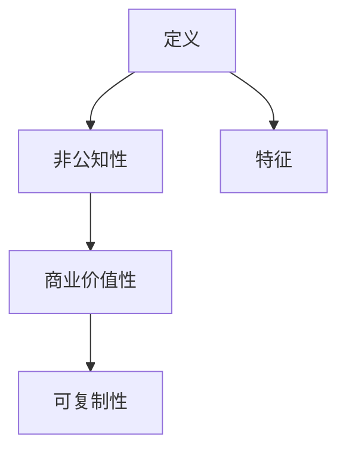

#### 1.2 商业秘密的类型与范围

商业秘密可以分为技术性商业秘密和经营性商业秘密：

1. **技术性商业秘密**：包括技术方案、设计图纸、研发文档等。
2. **经营性商业秘密**：包括客户名单、商业计划、营销策略等。

商业秘密的保护范围涉及：

1. **内部信息**：如公司内部报告、会议纪要、员工手册等。
2. **外部信息**：如合作伙伴信息、客户反馈、市场分析报告等。
3. **专利、商标之外的信息**：如商业计划、营销策略、客户名单等。

**类型与范围图示**

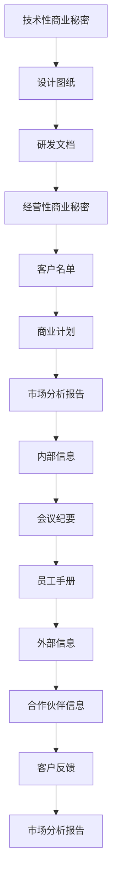

#### 1.3 商业秘密的法律保护框架

商业秘密的法律保护框架主要包括民事法律保护、刑事法律保护和行政法律保护：

1. **民事法律保护**：如《中华人民共和国合同法》、《中华人民共和国商标法》等。
2. **刑事法律保护**：如《中华人民共和国刑法》、《中华人民共和国反不正当竞争法》等。
3. **行政法律保护**：如《中华人民共和国知识产权保护条例》等。

**法律保护框架图示**

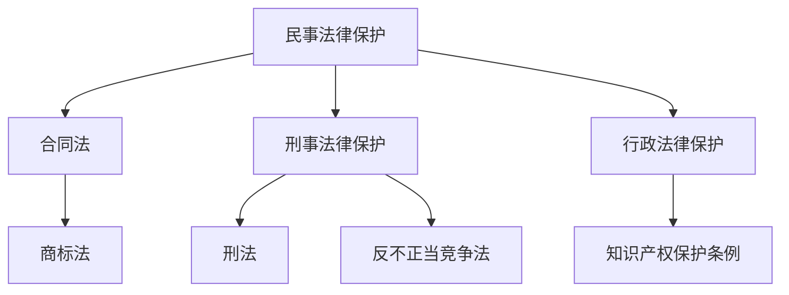

#### 1.4 国际视角下的商业秘密保护

国际视角下的商业秘密保护涉及多个国际组织和法律框架：

1. **联合国**：通过了《保护工业产权巴黎公约》，规定各成员国应保护商业秘密。
2. **世界贸易组织**：通过《与贸易有关的知识产权协定》，进一步规范商业秘密保护。
3. **国际组织**：如经济合作与发展组织、欧盟等，也对商业秘密保护提出相关建议和指导。

**国际保护现状**

1. **保护力度加强**：各国逐步加强对商业秘密的保护，制定相关法律和政策。
2. **国际合作深化**：各国通过国际会议、协议等，加强商业秘密保护的合作与交流。
3. **挑战与机遇**：全球化背景下，商业秘密保护面临新挑战，但同时也带来了新机遇。

**国际视角图示**

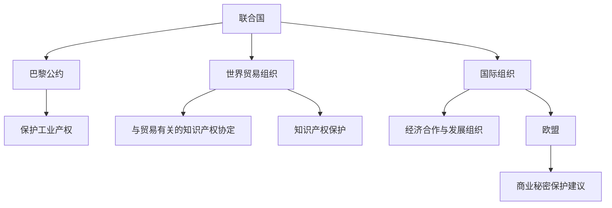

#### 第2章：商业秘密的风险评估与防护策略

#### 2.1 商业秘密风险评估框架

商业秘密风险评估框架包括以下几个步骤：

1. **风险识别**：识别潜在的威胁和风险因素。
2. **风险分析**：评估风险的概率和影响。
3. **风险评估**：综合分析风险，确定风险等级。
4. **风险应对**：制定并实施风险应对策略。

**风险评估流程图**

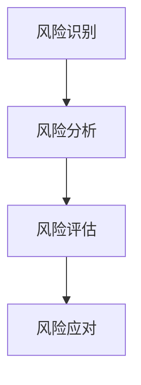

**风险识别**

1. **内部因素**：如员工离职、内部泄露、管理失误等。
2. **外部因素**：如竞争对手、合作伙伴、黑客攻击等。

**风险分析**

1. **概率**：评估风险发生的可能性。
2. **影响**：评估风险对商业秘密的潜在影响。

**风险评估**

1. **低风险**：风险较低，可采取基本防护措施。
2. **中风险**：风险中等，需采取加强防护措施。
3. **高风险**：风险较高，需采取紧急防护措施。

**风险应对**

1. **风险规避**：避免高风险行为。
2. **风险转移**：通过保险等方式分散风险。
3. **风险减轻**：采取措施降低风险。

#### 2.2 常见商业秘密泄露途径

商业秘密泄露途径可以分为内部泄露、外部泄露和管理失误：

**内部泄露**

1. **员工离职**：离职员工可能带走商业秘密。
2. **员工不当行为**：如内部交流、私自复制等。

**外部泄露**

1. **竞争对手**：通过不正当手段获取商业秘密。
2. **合作伙伴**：未经授权泄露商业秘密。
3. **黑客攻击**：通过网络入侵获取商业秘密。

**管理失误**

1. **信息安全意识不足**：员工不重视商业秘密保护。
2. **保密制度不健全**：缺乏有效的保密措施。
3. **流程不规范**：信息流转过程中存在漏洞。

#### 2.3 防护策略与方法

商业秘密防护策略可以分为技术防护、管理防护和法律防护：

**技术防护**

1. **加密技术**：对敏感信息进行加密处理。
2. **访问控制**：限制对商业秘密的访问权限。
3. **数据备份**：定期备份商业秘密数据。

**管理防护**

1. **建立保密制度**：明确保密要求与责任。
2. **保密教育与培训**：提高员工保密意识。
3. **保密审计与检查**：定期审查保密措施的有效性。

**法律防护**

1. **签订保密协议**：与员工、合作伙伴签订保密协议。
2. **维权措施**：依法对侵权行为采取诉讼或其他维权措施。

#### 2.4 员工保密协议与管理

**员工保密协议**

1. **内容**：明确保密范围、保密期限、违约责任等。
2. **签订程序**：依法签订，确保协议的合法性和有效性。

**员工管理**

1. **选拔与培训**：选拔有保密意识和责任心的人才。
2. **约束与激励**：采取约束与激励相结合的管理措施。
3. **离职管理**：对离职员工进行保密审查，确保其不再泄露商业秘密。

#### 第3章：技术性商业秘密保护措施

#### 3.1 加密技术

**加密技术原理**

加密技术通过将明文转换为密文来保护信息。常见的加密技术包括：

1. **对称加密**：使用相同的密钥进行加密和解密。
2. **非对称加密**：使用一对密钥进行加密和解密，公钥加密，私钥解密。
3. **消息摘要**：使用哈希函数生成固定长度的消息摘要，确保信息的完整性。

**加密技术应用**

1. **数据传输加密**：如SSL/TLS协议，确保数据在网络传输过程中的安全性。
2. **存储加密**：对存储在硬盘、U盘等设备上的商业秘密进行加密保护。
3. **文件加密**：对敏感文件进行加密，防止未经授权的访问。

**加密技术选择与实现**

1. **加密算法选择**：根据实际需求选择合适的加密算法。
2. **密钥管理**：确保密钥的安全存储、分发和更新。
3. **加密实现**：结合编程语言和工具，实现加密功能。

**加密技术流程图**

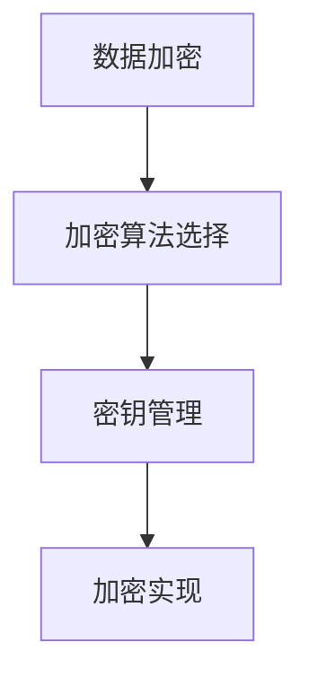

#### 3.2 访问控制与权限管理

**访问控制原理**

访问控制通过限制用户对资源的访问权限来保护信息。常见的访问控制方式包括：

1. **基于用户身份**：根据用户身份授予访问权限。
2. **基于角色**：根据用户角色授予访问权限。
3. **基于属性**：根据用户属性（如部门、职位等）授予访问权限。

**访问控制实现**

1. **用户身份验证**：如密码验证、双因素验证等。
2. **权限分配**：根据用户身份或角色分配访问权限。
3. **权限控制**：在系统层面或文件层面实现访问控制。

**权限管理工具与应用**

1. **文件权限管理**：如Linux的chmod命令。
2. **数据库权限管理**：如MySQL的权限设置。
3. **应用权限管理**：如基于角色的访问控制（RBAC）。

#### 3.3 数据备份与恢复策略

**数据备份原理**

数据备份是将数据复制到其他存储介质上，以防止数据丢失。常见的备份类型包括：

1. **完全备份**：备份所有数据。
2. **差异备份**：备份自上次备份后更改的数据。
3. **增量备份**：备份自上次备份后新增的数据。

**数据备份策略**

1. **定期备份**：如每日、每周备份。
2. **离线备份**：将备份存储在安全的地方，如外部硬盘、云存储等。
3. **异地备份**：将备份存储在不同的地理位置，提高数据安全性。

**数据恢复策略**

1. **数据恢复工具**：如数据恢复软件、数据库备份与恢复工具等。
2. **数据恢复流程**：根据备份类型和数据丢失情况，选择合适的恢复方法。
3. **数据恢复测试**：定期进行数据恢复测试，确保数据备份的有效性。

#### 3.4 数字签名与时间戳

**数字签名原理**

数字签名是通过加密算法对信息进行签名，以确保信息的完整性和真实性。数字签名的基本过程如下：

1. 发送方使用私钥对信息进行加密。
2. 接收方使用发送方的公钥验证签名。

**数字签名应用**

1. **电子邮件加密**：确保邮件内容的安全和完整性。
2. **电子合同**：确保合同的合法性和可信性。
3. **系统安全认证**：如数字证书、安全令牌等。

**时间戳服务**

1. **时间戳服务原理**：通过权威机构对文件的生成时间进行认证。
2. **时间戳应用**：如版权保护、法律证据等。

#### 第4章：管理性商业秘密保护措施

#### 4.1 保密制度与流程

**保密制度**

保密制度是企业为保护商业秘密而制定的一系列规章和规定。其内容包括：

1. **保密范围**：明确需要保护的信息范围。
2. **保密责任**：明确员工和管理层的保密责任。
3. **保密措施**：规定保密的具体措施和方法。
4. **保密期限**：规定商业秘密的保密期限。

**保密流程**

保密流程是保密制度的具体实施过程，包括以下几个步骤：

1. **信息分类**：根据信息的重要性进行分类，如绝密、机密、秘密等。
2. **信息传递**：采取加密、限制访问等手段，确保信息在传递过程中的安全。
3. **信息存储**：对敏感信息进行加密存储，并定期备份。
4. **信息销毁**：确保敏感信息在不需要时得到安全销毁。

#### 4.2 保密教育与培训

**教育目标**

保密教育与培训的目标包括：

1. **提高员工对商业秘密保护的认识**：使员工了解商业秘密的重要性。
2. **强化员工保密意识**：使员工认识到保密的重要性，并遵守保密规定。
3. **培养员工保密习惯**：使员工养成良好的保密习惯。

**教育内容**

保密教育的内容包括：

1. **商业秘密的基本概念与法律保护**：使员工了解商业秘密的定义、特征和法律保护。
2. **商业秘密泄露的途径与防范**：使员工了解商业秘密泄露的常见途径，并学会防范措施。
3. **保密制度与流程**：使员工了解企业的保密制度、流程和具体操作。
4. **保密技术与工具**：使员工掌握基本的保密技术和工具。

**培训形式**

保密培训的形式包括：

1. **内部培训**：组织内部保密培训课程。
2. **外部培训**：邀请专业机构或专家进行保密培训。
3. **在线培训**：通过互联网进行保密知识普及。

#### 4.3 保密审计与检查

**审计目的**

保密审计与检查的目的是：

1. **检查保密制度与流程的执行情况**：确保保密制度得到有效执行。
2. **发现保密漏洞与不足**：识别保密工作中存在的问题，及时改进。
3. **提高保密管理水平**：通过审计，提高企业的保密管理水平。

**审计内容**

保密审计的内容包括：

1. **保密制度与流程**：检查保密制度是否完善，流程是否规范。
2. **保密设施与设备**：检查保密设施是否有效，设备是否正常运行。
3. **保密教育与培训**：检查保密教育与培训的覆盖率与有效性。

**检查方法**

保密检查的方法包括：

1. **文件审查**：检查相关文件与记录。
2. **现场检查**：实地查看保密设施与设备的运行情况。
3. **问卷调查**：了解员工对保密制度的认知与执行情况。

#### 4.4 应急响应与危机管理

**应急响应原则**

应急响应的原则包括：

1. **及时性**：迅速采取行动，防止事态扩大。
2. **稳妥性**：确保应对措施不会对正常业务造成严重影响。
3. **协调性**：各部门协同合作，共同应对危机。

**应急响应流程**

应急响应的流程包括：

1. **立即报告**：发现商业秘密泄露情况，立即向上级报告。
2. **初步评估**：评估泄露情况，确定危机级别。
3. **制定方案**：根据评估结果，制定应急响应方案。
4. **实施方案**：按照方案实施，采取措施控制事态。

**危机管理**

危机管理包括以下几个方面：

1. **危机预防**：制定危机预防措施，降低危机发生的概率。
2. **危机响应**：按照应急响应流程处理危机。
3. **危机恢复**：危机过后，进行善后处理，总结经验教训。

#### 第5章：法律手段与维权措施

#### 5.1 商业秘密侵权认定

商业秘密侵权认定是确定侵权行为是否构成侵权的关键步骤。其认定过程包括以下几个环节：

1. **侵权行为认定**：判断侵权行为是否涉及披露、使用或允许他人使用商业秘密。
2. **侵权证据收集**：收集侵权行为的相关证据，包括证人证言、书证、物证等。
3. **侵权责任判定**：根据侵权行为的性质、情节等因素，判定侵权责任。

**侵权证据收集**

侵权证据收集包括以下几个步骤：

1. **取证方法**：确定取证的方法和手段，如调查取证、调取证据等。
2. **证据保全**：采取保全措施，确保证据的真实性和有效性。
3. **证据审查**：审查收集到的证据，确保证据的合法性、有效性。

**侵权责任判定**

侵权责任判定包括以下几个方面：

1. **损害赔偿计算**：根据侵权行为对权利人造成的损失，计算赔偿金额。
2. **侵权责任形式**：判断侵权责任的形式，如停止侵害、赔偿损失、消除影响等。
3. **侵权责任免除**：根据法律规定，判断侵权责任的免除情况。

**侵权责任认定流程**

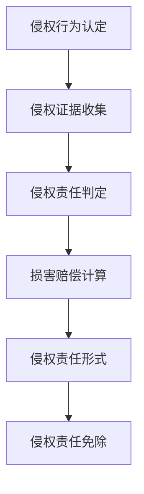

#### 5.2 民事诉讼与赔偿

**民事诉讼程序**

民事诉讼程序包括以下几个步骤：

1. **起诉**：权利人向法院提起侵权诉讼，提交起诉状和相关证据。
2. **审理**：法院对案件进行审理，判决侵权责任和赔偿金额。
3. **执行**：判决生效后，执行侵权赔偿和其他相关措施。

**损害赔偿计算**

损害赔偿计算包括以下几个方面：

1. **直接损失**：侵权行为导致的实际损失，如客户流失、市场份额减少等。
2. **预期利益损失**：侵权行为导致的市场机会损失，如潜在客户流失等。
3. **其他损失**：如律师费、诉讼费等。

**损害赔偿计算公式**

损害赔偿金额 = 直接损失 + 预期利益损失 + 其他损失

#### 5.3 刑事责任与刑罚

**刑事责任**

刑事责任是指侵权行为构成犯罪，应承担的法律责任。刑事责任包括以下几个方面：

1. **刑事责任主体**：包括直接责任人和单位。
2. **刑事责任形式**：包括罚金、拘役、有期徒刑等。
3. **刑事责任免除**：根据法律规定，部分侵权行为可以免除刑事责任。

**刑事责任认定**

刑事责任认定包括以下几个步骤：

1. **侵权行为定性**：判断侵权行为是否构成犯罪。
2. **侵权责任主体**：确定侵权责任主体，包括直接责任人和单位。
3. **侵权责任形式**：根据侵权行为的性质和情节，确定刑事责任形式。

**刑事责任认定流程**

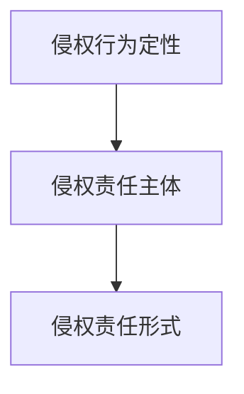

**刑罚**

刑罚是指对侵权行为人施加的惩罚措施，包括以下几种：

1. **罚金**：罚款，如5000元至50000元不等。
2. **拘役**：短期拘禁，如1个月至6个月。
3. **有期徒刑**：长期拘禁，如6个月以上。

#### 5.4 行政责任与处罚

**行政责任**

行政责任是指侵权行为违反了行政法律法规，应承担的法律责任。行政责任包括以下几个方面：

1. **行政处罚**：警告、罚款、没收非法所得等。
2. **行政处分**：降级、撤职、留用察看等。
3. **行政责任免除**：根据法律规定，部分侵权行为可以免除行政责任。

**行政责任认定**

行政责任认定包括以下几个步骤：

1. **侵权行为定性**：判断侵权行为是否违反了行政法律法规。
2. **侵权责任主体**：确定侵权责任主体，包括直接责任人和单位。
3. **侵权责任形式**：根据侵权行为的性质和情节，确定行政责任形式。

**行政责任认定流程**

**处罚**

处罚是指对侵权行为人施加的惩罚措施，包括以下几种：

1. **警告**：书面警告，提醒侵权行为人改正。
2. **罚款**：罚款，如5000元至50000元不等。
3. **没收非法所得**：没收侵权行为人的非法所得。

#### 第6章：国际商业秘密保护与合作

#### 6.1 国际商业秘密保护框架

国际商业秘密保护框架主要包括以下内容：

1. **国际保护原则**：包括合法性、全面性和有效性。
2. **国际保护法律体系**：包括国际公约、国际组织、国际惯例等。
3. **国际保护法律体系**

国际保护法律体系主要包括以下内容：

1. **国际公约**：如《保护工业产权巴黎公约》、《与贸易有关的知识产权协定》等。
2. **国际组织**：如世界知识产权组织、经济合作与发展组织等。
3. **国际惯例**：如保密协议、技术许可协议等。

**国际保护框架图示**

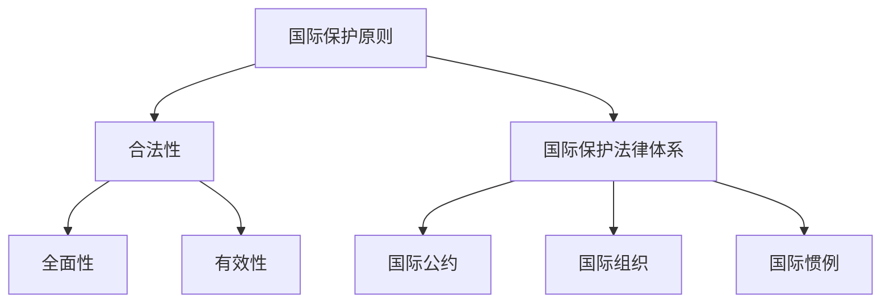

#### 6.2 跨国公司的商业秘密保护策略

跨国公司的商业秘密保护策略应包括以下几个方面：

1. **策略制定**：根据企业特点和商业秘密的重要性，制定具体的保护策略。
2. **实施与监督**：按照制定的策略，采取技术、管理、法律等多方面的保护措施。
3. **国际合作**：与其他跨国公司合作，共享商业秘密保护经验。

**跨国公司保护策略**

1. **技术防护**：采用先进的加密技术和访问控制措施，确保商业秘密的安全。
2. **管理防护**：建立完善的保密制度和流程，提高员工保密意识。
3. **法律防护**：签订保密协议，依法维权，对侵权行为采取法律手段。

**跨国公司保护策略图示**

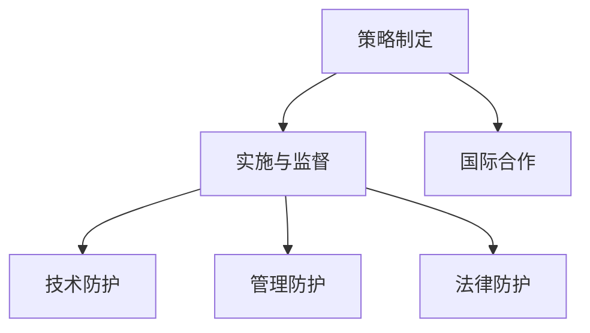

#### 6.3 国际合作与信息交流

国际合作与信息交流是跨国公司商业秘密保护的重要方面。以下内容介绍了国际合作的方式和信息交流的渠道：

**国际合作方式**

1. **合作协议**：签订保密协议、技术许可协议等，明确合作双方的保护责任。
2. **国际会议**：参加国际会议、研讨会等，交流商业秘密保护经验。
3. **学术研究**：开展国际学术合作，共同研究商业秘密保护问题。

**信息交流渠道**

1. **国际互联网**：利用互联网进行信息交流和协作。
2. **国际邮件**：通过国际邮件传递商业秘密信息。
3. **国际快递**：通过国际快递传递敏感商业秘密。

**国际合作与信息交流图示**

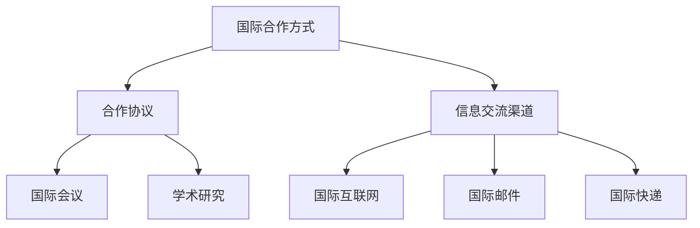

#### 6.4 跨境维权案例解析

**案例背景**

某跨国公司A在中国市场上开发了一款具有核心竞争力的产品，但不久后，发现竞争对手B在其市场上销售了与A产品功能类似的产品。经调查，发现竞争对手B获取了A的商业秘密。

**事件经过**

1. **侵权行为**：竞争对手B通过不正当手段获取了A的商业秘密，包括技术方案、客户名单等。
2. **起诉与答辩**：A公司向中国法院提起诉讼，指控B公司侵权。B公司进行了答辩，否认侵权行为。
3. **庭审与判决**：法院审理了案件，判决B公司侵犯了A公司的商业秘密，判决其停止侵权行为，并赔偿A公司经济损失。

**结果与影响**

1. **结果**：法院判决B公司停止侵权行为，并赔偿A公司经济损失。A公司成功维护了其商业秘密权益。
2. **影响**：该案例提高了A公司在中国市场的竞争力，也警示了其他企业加强商业秘密保护。

**案例启示**

1. **加强商业秘密保护**：企业应采取有效的技术和管理措施，防止商业秘密泄露。
2. **国际合作与信息交流**：加强国际间的合作与信息交流，提高商业秘密保护水平。
3. **维权意识**：企业应提高维权意识，勇于维护自身合法权益。

**案例图示**

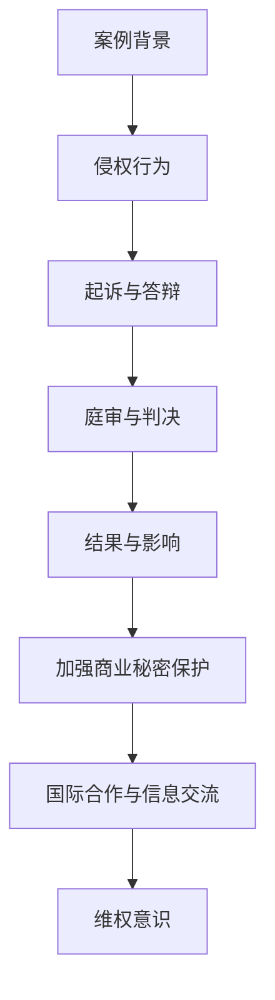

#### 第7章：AI技术对商业秘密保护的影响与挑战

#### 7.1 AI技术在商业秘密保护中的应用

AI技术在商业秘密保护中的应用主要包括以下几个方面：

1. **加密与解密技术**：使用AI技术优化加密算法，提高数据安全性。
2. **访问控制与权限管理**：使用AI技术进行身份认证和权限分配，提高访问安全性。
3. **数据备份与恢复策略**：使用AI技术自动选择合适的备份策略，提高数据恢复效率。
4. **数字签名与时间戳**：使用AI技术验证数字签名，确保信息真实性。

**AI技术应用图示**

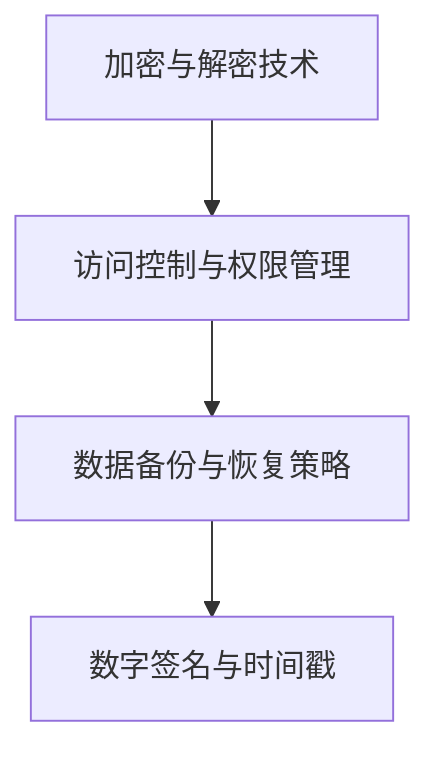

#### 7.2 AI技术带来的新风险与挑战

AI技术虽然为商业秘密保护提供了新的手段，但也带来了一系列新的风险和挑战：

1. **人工智能泄露风险**：AI模型可能包含敏感信息，如客户数据等。
2. **人工智能滥用风险**：黑客可能利用AI技术进行攻击，员工可能滥用AI获取商业秘密。
3. **人工智能监管挑战**：现有法律法规难以适应快速发展的AI技术。

**AI技术风险与挑战图示**

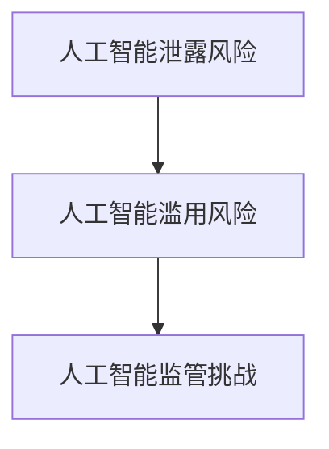

#### 7.3 应对策略与未来展望

为了应对AI技术带来的新风险与挑战，企业可以采取以下策略：

1. **技术措施**：加强对AI模型的加密，提高访问控制技术。
2. **管理措施**：制定AI技术使用规范，加强员工培训。
3. **法律措施**：完善法律法规，提高对AI技术侵权行为的打击力度。

**应对策略与未来展望图示**

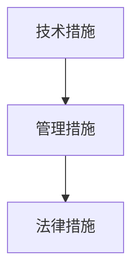

### 附录 A: 商业秘密保护相关法律法规与标准

#### A.1 我国商业秘密保护法律法规概述

我国商业秘密保护法律法规体系主要包括以下法律法规：

1. **民法典**：明确了商业秘密的财产权利和法律保护。
2. **合同法**：规定了合同当事人对商业秘密的保护义务。
3. **刑法**：规定了侵犯商业秘密的刑事责任。
4. **反不正当竞争法**：规范商业秘密保护与不正当竞争行为。

#### A.2 国际商业秘密保护法律法规简介

国际商业秘密保护法律法规主要包括以下法律体系：

1. **国际公约**：如《保护工业产权巴黎公约》、《与贸易有关的知识产权协定》等。
2. **国际组织**：如世界知识产权组织、经济合作与发展组织等。
3. **国际惯例**：如保密协议、技术许可协议等。

### 附录 B: 常用商业秘密保护工具与资源

#### B.1 加密软件与应用

1. **加密软件**：如WinRAR、7-Zip、GnuPG等。
2. **应用**：数据传输、存储加密、文件加密。

#### B.2 权限管理工具与解决方案

1. **权限管理工具**：如Windows、Linux、Mac等。
2. **解决方案**：文件权限管理、数据库权限管理、应用权限管理。

#### B.3 数据备份与恢复工具

1. **备份工具**：如Windows备份和还原功能、Linux的rsync命令、Mac的Time Machine。
2. **恢复工具**：如Windows备份和还原功能、Linux的rsync命令、Mac的Time Machine。

### 附录 C: 商业秘密保护案例分析

#### C.1 案例一：某公司商业秘密泄露事件

**案例背景**：某公司是一家专注于人工智能技术研发的企业，其某项目的技术方案和客户信息被泄露。

**事件经过**：
1. **员工泄露**：员工私自复制技术方案和客户信息，并上传到个人云端存储。
2. **黑客入侵**：黑客获取员工泄露的信息，并将其贩卖给竞争对手。

**结果与影响**：
1. **公司声誉受损**：客户对公司的信任度降低，业务受到影响。
2. **经济损失**：公司因客户流失和业务停滞，造成直接经济损失。

**教训与启示**：
1. **加强员工管理**：制定严格的员工保密协议，加强员工保密意识。
2. **提高技术水平**：采用先进的加密技术，防止数据泄露。
3. **强化网络安全**：加强网络安全防护，防止黑客入侵。

### 文章作者

**作者**：AI天才研究院/AI Genius Institute & 禅与计算机程序设计艺术 /Zen And The Art of Computer Programming

[本文为AI天才研究院（AI Genius Institute）原创，转载请注明出处]

