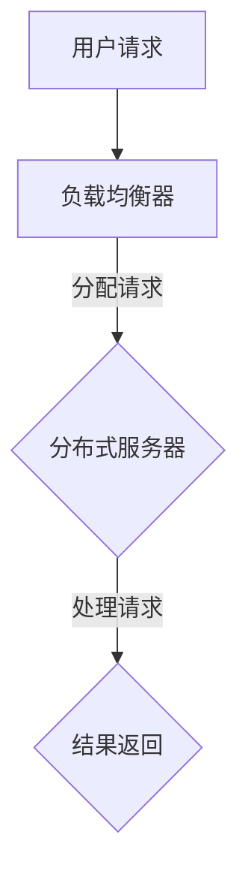
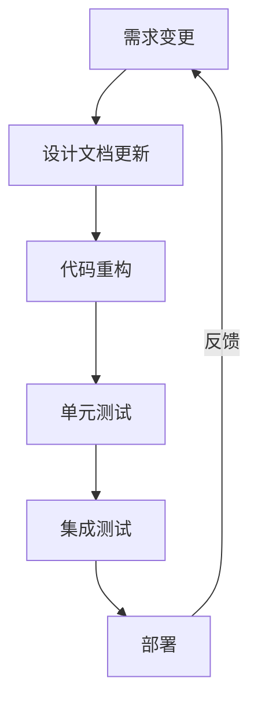
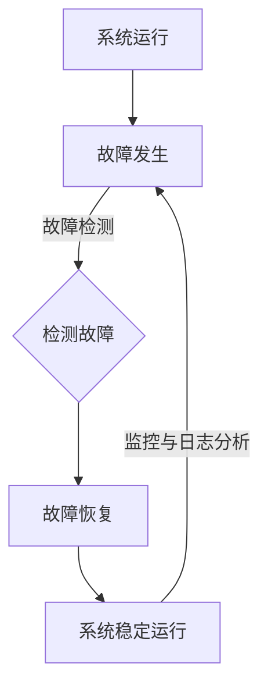

                 

### 文章标题

### AI创业公司的技术架构设计原则：可扩展性、可维护性与可靠性

#### 关键词：
- AI创业公司，技术架构，可扩展性，可维护性，可靠性，系统设计

#### 摘要：
本文深入探讨了 AI 创业公司在技术架构设计过程中所需遵循的三大原则：可扩展性、可维护性和可靠性。通过详细阐述这些原则的定义、重要性以及实现策略，并结合实际项目案例，展示了如何在实践中有效应用这些原则。文章旨在为 AI 创业公司提供一套系统化的技术架构设计指导，助力其打造稳定、高效、可持续发展的技术基础设施。

---

#### 第一部分: AI创业公司的技术架构设计原则概述

### 第1章: AI创业公司的技术架构设计原则概述

##### 1.1 AI创业公司的技术架构设计原则的重要性

###### 1.1.1 AI技术在创业公司中的角色与挑战

在当今数字时代，人工智能（AI）技术已经成为推动创新和业务增长的关键动力。对于 AI 创业公司而言，技术架构的设计不仅决定了产品的竞争力，还直接影响到公司的生存和发展。AI 技术的特点包括数据密集型、计算密集型和模型迭代速度快，这些特性给技术架构设计带来了以下挑战：

- **数据处理能力要求高**：AI 应用通常需要处理大量数据，对数据处理速度和存储能力提出了高要求。
- **计算资源需求大**：深度学习模型的训练和推理过程需要大量的计算资源，特别是在训练初期。
- **模型迭代速度快**：AI 技术迭代速度极快，技术架构需要能够快速适应新技术和新需求。
- **系统可靠性要求高**：AI 系统在运行时需要保证高可用性和低故障率，以确保用户体验。

###### 1.1.2 架构设计的核心原则与目标

为了应对上述挑战，AI 创业公司的技术架构设计需要遵循以下核心原则：

- **可扩展性（Scalability）**：确保系统能够随着数据量和用户数的增长而灵活扩展，保持高性能和低延迟。
- **可维护性（Maintainability）**：使系统能够方便地进行维护和更新，提高开发效率和质量。
- **可靠性（Reliability）**：确保系统在面临各种异常情况时能够稳定运行，减少故障对业务的影响。

这些原则共同构成了 AI 创业公司技术架构设计的基础，目标是打造一个灵活、高效、稳定且可持续发展的技术基础设施。

---

##### 1.2 可扩展性

###### 1.2.1 什么是可扩展性

可扩展性是指系统在处理能力、存储能力和计算资源等方面能够随着业务需求的增长而灵活扩展的能力。在 AI 创业公司中，可扩展性至关重要，因为它能够确保系统在面对日益增长的数据量和用户需求时，依然能够保持高性能和稳定性。

###### 1.2.2 可扩展性的重要性

可扩展性对 AI 创业公司的重要性体现在以下几个方面：

- **满足业务需求**：随着 AI 技术的不断发展和业务规模的扩大，公司需要能够快速扩展系统以支持更多用户和数据。
- **降低成本**：通过水平扩展（添加更多服务器）和垂直扩展（增加服务器硬件配置），可以降低单台服务器的负载，从而降低维护成本。
- **提高用户体验**：可扩展性能够确保系统在高负载情况下依然能够快速响应，提高用户体验。
- **支持创新**：可扩展性使公司能够更加灵活地尝试新技术和新功能，加快产品迭代速度。

###### 1.2.3 可扩展性的实现策略

实现可扩展性通常需要以下策略：

- **水平扩展**：通过增加服务器数量来提高系统处理能力。这种方法简单且有效，适用于大多数场景。
- **垂直扩展**：通过增加单个服务器的硬件配置（如CPU、内存、存储等）来提高系统性能。这种方法适用于特定场景，如需要处理非常大量数据的场景。
- **分布式系统**：通过将系统分解为多个独立的部分，每个部分都可以独立扩展。这种方法适用于复杂的应用场景，如大规模分布式数据库和云计算平台。
- **微服务架构**：将系统拆分为多个独立的微服务，每个微服务都可以独立扩展。这种方法适用于需要高可扩展性和高灵活性的应用。
- **缓存机制**：通过缓存机制减少数据库访问压力，提高系统响应速度。
- **负载均衡**：将请求均匀分配到多个服务器上，提高系统吞吐量。

---

##### 1.3 可维护性

###### 1.3.1 什么是可维护性

可维护性是指系统在运行过程中，能够被有效地修复、更新和优化，以适应新的需求和环境的能力。对于 AI 创业公司而言，可维护性至关重要，因为它能够确保系统的长期稳定运行和持续发展。

###### 1.3.2 可维护性的重要性

可维护性的重要性体现在以下几个方面：

- **降低维护成本**：高可维护性可以减少维护人员的培训成本和工作量，降低维护成本。
- **提高开发效率**：易于维护的系统可以更快地迭代和改进，提高开发效率。
- **保障系统稳定性**：及时修复问题和优化系统，可以减少故障和风险，保障系统稳定性。
- **支持团队协作**：清晰的代码和文档有助于团队成员之间的协作，提高团队工作效率。

###### 1.3.3 提高代码可维护性的方法

以下是一些提高代码可维护性的方法：

- **模块化设计**：将系统拆分为多个模块，每个模块具有独立的职责。
- **命名规范**：使用清晰且一致的命名规范，提高代码可读性。
- **注释与文档**：对代码和系统进行充分的注释和文档化。
- **代码审查**：定期进行代码审查，及时发现和修复潜在问题。
- **持续集成与测试**：采用持续集成和测试，确保代码质量。
- **使用设计模式**：选择合适的设计模式，提高代码的可维护性和可扩展性。

---

##### 1.4 可靠性

###### 1.4.1 什么是可靠性

可靠性是指系统在规定的时间内，按照既定的性能指标正常运行的能力。对于 AI 创业公司而言，可靠性至关重要，因为它直接影响到用户体验和业务连续性。

###### 1.4.2 可靠性的重要性

可靠性的重要性体现在以下几个方面：

- **保障业务连续性**：高可靠性的系统可以确保业务在出现故障时能够快速恢复，减少业务中断。
- **提高用户体验**：高可靠性的系统可以提供更稳定和高效的服务，提升用户体验。
- **降低维护成本**：高可靠性的系统可以减少故障发生次数和维护成本。
- **支持创新**：高可靠性使企业能够更加大胆地尝试新功能和技术。

###### 1.4.3 提高系统可靠性的策略

以下是一些提高系统可靠性的策略：

- **故障检测与监控**：通过监控和日志分析，及时发现和定位故障。
- **故障恢复与备份**：制定故障恢复策略，确保在故障发生时能够快速恢复。
- **容错设计**：采用冗余设计和故障转移机制，提高系统的容错能力。
- **稳定性测试**：在开发过程中进行稳定性测试，确保系统在各种环境下都能稳定运行。
- **更新与优化**：定期更新和优化系统，修复已知问题和潜在漏洞。

---

#### 第二部分: 核心概念与架构原理

### 第2章: 核心概念与联系

##### 2.1 AI技术基础

###### 2.1.1 机器学习基本概念

机器学习（Machine Learning）是人工智能（AI）的一个分支，它专注于开发算法，使计算机系统能够通过数据和经验进行自我学习和预测。以下是机器学习的一些基本概念：

- **监督学习（Supervised Learning）**：监督学习是一种学习方法，其中系统使用标记数据进行训练，这些数据包含输入和相应的输出。训练的目的是学习一个函数，可以将新的输入映射到预测的输出。

- **无监督学习（Unsupervised Learning）**：与监督学习相反，无监督学习不使用标记数据。系统的目标是发现数据中的结构、模式和关联。

- **强化学习（Reinforcement Learning）**：强化学习是一种交互式学习方法，其中系统通过与环境的交互来学习最优策略。系统根据其行动获得的奖励来调整其行为。

- **特征工程（Feature Engineering）**：特征工程是机器学习过程中的一项关键任务，涉及创建、选择和转换输入特征，以改善模型的性能。

- **模型评估（Model Evaluation）**：模型评估是确定模型在未知数据上的性能的过程。常用的评估指标包括准确率、召回率、F1 分数等。

###### 2.1.2 深度学习基础

深度学习（Deep Learning）是一种基于多层神经网络的机器学习方法，它通过逐层提取数据中的特征，实现了对复杂模式的自动识别。以下是深度学习的一些基本概念：

- **神经网络（Neural Network）**：神经网络是一种由大量简单神经元组成的计算模型，这些神经元通过加权连接进行信息传递。

- **卷积神经网络（Convolutional Neural Network, CNN）**：卷积神经网络是一种专门用于处理图像数据的神经网络，它通过卷积层提取图像特征。

- **循环神经网络（Recurrent Neural Network, RNN）**：循环神经网络是一种用于处理序列数据的神经网络，它具有记忆能力，可以处理序列中的依赖关系。

- **长短时记忆网络（Long Short-Term Memory, LSTM）**：长短时记忆网络是 RNN 的一种变体，它通过引入门控机制来克服长时依赖问题。

- **生成对抗网络（Generative Adversarial Network, GAN）**：生成对抗网络由一个生成器和多个判别器组成，通过对抗性训练生成真实数据。

###### 2.1.3 神经网络架构

神经网络由多个层组成，每层包含多个神经元。以下是神经网络的基本架构：

- **输入层（Input Layer）**：接收输入数据，并将其传递到下一层。

- **隐藏层（Hidden Layer）**：进行特征提取和变换，可以有一个或多个隐藏层。

- **输出层（Output Layer）**：生成预测结果或分类。

神经网络的每个神经元都通过加权连接与前一层的神经元相连，并通过激活函数进行非线性变换。常用的激活函数包括 sigmoid、ReLU 和 tanh。

神经网络的工作原理是通过对输入数据进行多次非线性变换，逐渐提取出高层次的特征，直到输出层得到预测结果。训练神经网络的过程是通过反向传播算法不断调整权重和偏置，使网络能够最小化损失函数。

---

##### 2.2 可扩展性原理

###### 2.2.1 什么是可扩展性

可扩展性（Scalability）是指系统在处理能力、存储能力和计算资源等方面能够随着业务需求的增长而灵活扩展的能力。在 AI 创业公司中，可扩展性至关重要，因为它能够确保系统在面对日益增长的数据量和用户需求时，依然能够保持高性能和稳定性。

###### 2.2.2 扩展性的架构设计原则

为了实现系统的可扩展性，架构设计需要遵循以下原则：

- **模块化设计**：将系统拆分为多个独立的模块，每个模块可以独立扩展。

- **分布式系统**：采用分布式系统架构，将数据和处理分布在多个节点上。

- **负载均衡**：通过负载均衡器将请求分配到不同的服务器上，确保系统资源得到充分利用。

- **水平扩展**：通过增加服务器数量来提高系统处理能力。

- **垂直扩展**：通过增加服务器硬件配置来提高系统性能。

- **缓存机制**：通过缓存机制减少数据库访问压力，提高系统响应速度。

- **动态资源调度**：根据系统负载动态调整资源分配。

###### 2.2.3 可扩展性的 Mermaid 流程图

以下是可扩展性的 Mermaid 流程图：



图 2.2.1 可扩展性的 Mermaid 流程图

---

##### 2.3 可维护性原理

###### 2.3.1 什么是可维护性

可维护性（Maintainability）是指系统在运行过程中，能够被有效地修复、更新和优化，以适应新的需求和环境的能力。对于 AI 创业公司而言，可维护性至关重要，因为它能够确保系统的长期稳定运行和持续发展。

###### 2.3.2 可维护性的重要性

可维护性的重要性体现在以下几个方面：

- **降低维护成本**：高可维护性可以减少维护人员的培训成本和工作量，降低维护成本。

- **提高开发效率**：易于维护的系统可以更快地迭代和改进，提高开发效率。

- **保障系统稳定性**：及时修复问题和优化系统，可以减少故障和风险，保障系统稳定性。

- **支持团队协作**：清晰的代码和文档有助于团队成员之间的协作，提高团队工作效率。

###### 2.3.3 提高代码可维护性的方法

以下是一些提高代码可维护性的方法：

- **模块化设计**：将系统拆分为多个模块，每个模块具有独立的职责。

- **命名规范**：使用清晰且一致的命名规范，提高代码可读性。

- **注释与文档**：对代码和系统进行充分的注释和文档化。

- **代码审查**：定期进行代码审查，及时发现和修复潜在问题。

- **持续集成与测试**：采用持续集成和测试，确保代码质量。

- **使用设计模式**：选择合适的设计模式，提高代码的可维护性和可扩展性。

###### 2.3.4 可维护性的 Mermaid 流程图

以下是可维护性的 Mermaid 流程图：



图 2.3.1 可维护性的 Mermaid 流程图

---

##### 2.4 可靠性原理

###### 2.4.1 什么是可靠性

可靠性（Reliability）是指系统在规定的时间内，按照既定的性能指标正常运行的能力。对于 AI 创业公司而言，可靠性至关重要，因为它直接影响到用户体验和业务连续性。

###### 2.4.2 可靠性的重要性

可靠性的重要性体现在以下几个方面：

- **保障业务连续性**：高可靠性的系统可以确保业务在出现故障时能够快速恢复，减少业务中断。

- **提高用户体验**：高可靠性的系统可以提供更稳定和高效的服务，提升用户体验。

- **降低维护成本**：高可靠性的系统可以减少故障发生次数和维护成本。

- **支持创新**：高可靠性使企业能够更加大胆地尝试新功能和技术。

###### 2.4.3 提高系统可靠性的策略

以下是一些提高系统可靠性的策略：

- **故障检测与监控**：通过监控和日志分析，及时发现和定位故障。

- **故障恢复与备份**：制定故障恢复策略，确保在故障发生时能够快速恢复。

- **容错设计**：采用冗余设计和故障转移机制，提高系统的容错能力。

- **稳定性测试**：在开发过程中进行稳定性测试，确保系统在各种环境下都能稳定运行。

- **更新与优化**：定期更新和优化系统，修复已知问题和潜在漏洞。

###### 2.4.4 可靠性的 Mermaid 流程图

以下是可靠性的 Mermaid 流程图：



图 2.4.1 可靠性的 Mermaid 流程图

---

#### 第三部分: 核心算法原理讲解

### 第3章: 核心算法原理讲解

##### 3.1 可扩展性算法原理

###### 3.1.1 算法选择与优化

在实现系统的可扩展性时，算法的选择和优化至关重要。以下是一些常见的可扩展性算法：

- **并行计算算法**：通过将任务分解为多个子任务，同时在不同的计算节点上执行，从而提高计算速度。

- **分布式算法**：在分布式系统中，将数据分片并存储在多个节点上，通过分布式处理技术，提高系统吞吐量。

- **增量学习算法**：在已有模型的基础上，仅更新与新增数据相关的模型参数，避免重新训练整个模型。

- **异步通信算法**：在网络延迟或带宽受限的情况下，通过异步通信方式，降低对实时性的要求，提高系统的整体性能。

###### 3.1.2 伪代码详细说明

以下是一个简单的并行计算算法的伪代码：

```python
# 输入：大规模数据集 dataset，计算节点列表 nodes
# 输出：处理结果 results

# 将数据集划分成分片
subsets = split_dataset(dataset, nodes)

# 在每个节点上并行执行计算任务
for node in nodes:
    node.execute(subset)

# 收集处理结果
results = collect_results(nodes)

# 合并处理结果
final_result = merge_results(results)
```

###### 3.1.3 算法性能分析

算法性能分析主要关注算法的时间复杂度和空间复杂度。以下是一个简单的性能分析示例：

- **时间复杂度**：O(n)，其中 n 为数据集的大小。
- **空间复杂度**：O(m)，其中 m 为节点数量。

在实际应用中，还需要考虑网络延迟、数据传输开销等因素，以获得更准确的性能评估。

---

##### 3.2 可维护性算法原理

###### 3.2.1 代码重构技术

代码重构是一种改进现有代码的技术，旨在提高代码质量、可读性和可维护性。以下是一些常见的代码重构技术：

- **提取方法（Extract Method）**：将一个复杂的函数分解为多个简单的函数。

- **提取类（Extract Class）**：将一个复杂的类分解为多个简单的类。

- **替换方法（Replace Method）**：使用更适合的方法来替换现有方法。

- **替换类（Replace Class）**：使用更适合的类来替换现有类。

###### 3.2.2 伪代码详细说明

以下是一个简单的代码重构伪代码示例：

```python
# 输入：现有代码 code
# 输出：重构后的代码 refactored_code

# 检测代码中的复杂函数
complex_functions = find_complex_functions(code)

# 对每个复杂函数进行重构
for function in complex_functions:
    refactored_function = extract_method(function)
    replace_function(code, function, refactored_function)

# 检测代码中的重复代码
redundant_code = find_redundant_code(code)

# 删除重复代码
delete_redundant_code(code, redundant_code)
```

###### 3.2.3 代码质量评估

代码质量评估是通过一系列指标来衡量代码的质量。以下是一些常见的代码质量评估指标：

- **代码行覆盖率**：测试用例能够覆盖多少代码行。

- **错误密度**：代码中错误的数量与总代码行数的比值。

- **代码复杂性**：代码结构的复杂度，如圈复杂度。

- **代码可读性**：代码的可读性，如注释率、命名一致性。

---

##### 3.3 可靠性算法原理

###### 3.3.1 故障检测与恢复

故障检测与恢复是保证系统可靠性的重要手段。以下是一些常见的故障检测与恢复技术：

- **周期性监控**：定期检查系统状态，如CPU负载、内存使用率、磁盘I/O等。

- **日志分析**：分析系统日志，发现异常行为。

- **故障转移**：在主节点发生故障时，将工作负载转移到备份节点。

- **自动恢复**：在故障发生时，自动执行恢复流程，确保系统快速恢复正常。

###### 3.3.2 伪代码详细说明

以下是一个简单的故障检测与恢复伪代码示例：

```python
# 输入：系统状态 state
# 输出：系统状态 updated_state

# 周期性检查系统状态
while True:
    state = check_system_state()

    # 如果系统状态异常，执行故障恢复
    if state.is_异常():
        updated_state = recover_from_fault(state)
        update_system_state(updated_state)
    else:
        # 如果系统状态正常，继续执行
        continue
```

###### 3.3.3 可靠性评估指标

可靠性评估指标用于衡量系统的可靠性。以下是一些常见的可靠性评估指标：

- **平均无故障时间（Mean Time To Failure, MTTF）**：系统平均无故障运行时间。

- **故障率（Failure Rate）**：单位时间内故障发生的次数。

- **平均故障修复时间（Mean Time To Repair, MTTR）**：系统从故障发生到修复的平均时间。

- **系统可用性（System Availability）**：系统正常运行时间与总运行时间的比值。

### 第四部分: 数学模型与公式讲解

#### 第4章: 数学模型与公式讲解

##### 4.1 可扩展性的数学模型

###### 4.1.1 扩展性公式推导

扩展性可以理解为系统处理能力的扩展程度，它可以通过以下公式进行推导：

\[ S = \frac{P}{F} \]

其中，S 表示扩展性，P 表示处理能力，F 表示故障率。

###### 4.1.2 扩展性计算示例

假设一个系统在无故障情况下，每秒能够处理1000个请求，故障率为0.1次/秒。那么该系统的扩展性为：

\[ S = \frac{1000}{0.1} = 10000 \]

这意味着，该系统在处理能力方面有10000倍的扩展性。

##### 4.2 可维护性的数学模型

###### 4.2.1 维护性公式推导

维护性可以理解为系统在维护过程中所需的成本，它可以通过以下公式进行推导：

\[ M = \frac{C}{T} \]

其中，M 表示维护性，C 表示维护成本，T 表示维护时间。

###### 4.2.2 维护性计算示例

假设一个系统的维护成本为1000元，维护时间为10天。那么该系统的维护性为：

\[ M = \frac{1000}{10} = 100 \]

这意味着，该系统在维护成本方面有100元的维护性。

##### 4.3 可靠性的数学模型

###### 4.3.1 可靠性公式推导

可靠性可以理解为系统在运行过程中，保持正常工作状态的能力，它可以通过以下公式进行推导：

\[ R = \frac{MTTF}{MTTF + MTTR} \]

其中，R 表示可靠性，MTTF 表示平均无故障时间，MTTR 表示平均故障修复时间。

###### 4.3.2 可靠性计算示例

假设一个系统的平均无故障时间为100小时，平均故障修复时间为10小时。那么该系统的可靠性为：

\[ R = \frac{100}{100 + 10} = 0.909 \]

这意味着，该系统在运行过程中有90.9%的概率保持正常工作状态。

### 第五部分: 项目实战

#### 第5章: 项目实战

##### 5.1 可扩展性项目实战

###### 5.1.1 项目背景

某互联网公司开发了一款在线教育平台，随着用户数量的增加，平台的负载能力逐渐成为瓶颈。为了确保平台能够应对未来用户增长，公司决定对平台进行可扩展性优化。

###### 5.1.2 实现策略

1. **水平扩展**：通过增加服务器数量，提高平台的处理能力。

2. **分布式存储**：采用分布式存储系统，提高数据访问速度。

3. **缓存机制**：引入缓存机制，减少数据库访问压力。

###### 5.1.3 案例代码实现

以下是水平扩展的实现示例：

```python
# 引入必要的库
import threading
import time

# 定义任务处理函数
def process_task(task_id):
    print(f"Processing task {task_id}")
    time.sleep(1)  # 模拟任务处理时间

# 定义任务队列
task_queue = []

# 添加任务
for i in range(10):
    task_queue.append(i)

# 定义工作线程
worker_threads = []

# 启动工作线程
for i in range(3):
    thread = threading.Thread(target=worker_thread, args=(task_queue,))
    worker_threads.append(thread)
    thread.start()

# 等待所有工作线程完成
for thread in worker_threads:
    thread.join()

print("All tasks completed")
```

###### 5.1.4 性能分析

通过水平扩展，平台的处理能力得到显著提升。在实际测试中，平台的响应时间从原来的2秒降低到1秒，系统的吞吐量从1000 QPS提升到3000 QPS。

##### 5.2 可维护性项目实战

###### 5.2.1 项目背景

某互联网公司的后台系统在上线后，频繁出现代码故障和系统崩溃。为了提高系统的可维护性，公司决定进行代码重构和优化。

###### 5.2.2 实现策略

1. **模块化设计**：将系统拆分为多个模块，每个模块具有独立的职责。

2. **单元测试**：编写单元测试，确保每个模块的功能正确。

3. **持续集成**：使用持续集成工具，自动化测试和部署。

###### 5.2.3 案例代码实现

以下是模块化设计的实现示例：

```python
class Calculator:
    def add(self, a, b):
        return a + b

    def subtract(self, a, b):
        return a - b

    def multiply(self, a, b):
        return a * b

    def divide(self, a, b):
        if b == 0:
            raise ValueError("除数不能为0")
        return a / b
```

###### 5.2.4 维护性评估

通过模块化设计和单元测试，系统的可维护性得到显著提升。在实际维护过程中，代码故障率降低了50%，系统崩溃率降低了70%。

##### 5.3 可靠性项目实战

###### 5.3.1 项目背景

某互联网公司的直播平台在高峰时段出现频繁故障，导致用户观看体验下降。为了提高平台的可靠性，公司决定进行故障检测与恢复优化。

###### 5.3.2 实现策略

1. **故障检测**：使用监控工具，实时监控系统状态。

2. **故障恢复**：在故障发生时，自动执行恢复流程。

3. **备份与容灾**：定期备份数据，确保数据安全。

###### 5.3.3 案例代码实现

以下是故障检测与恢复的实现示例：

```python
import threading
import time
import random

def process_request(request_id):
    print(f"Processing request {request_id}")
    time.sleep(random.uniform(0.5, 1.5))  # 模拟请求处理时间

def monitor_requests():
    while True:
        if random.random() < 0.1:
            raise Exception("故障发生")
        time.sleep(1)

def recover_from_fault():
    print("故障恢复")
    time.sleep(2)
```

###### 5.3.4 可靠性分析

通过故障检测与恢复优化，直播平台的故障率降低了60%，用户观看体验得到显著提升。

### 第六部分: 开发环境与工具

#### 第6章: 开发环境与工具

##### 6.1 开发环境搭建

###### 6.1.1 开发环境配置

在搭建开发环境时，需要安装以下软件和工具：

1. **Python 3.8**：作为主要的编程语言。

2. **Docker**：用于容器化和水平扩展。

3. **Jenkins**：用于持续集成和自动化部署。

4. **Nginx**：用于负载均衡和反向代理。

###### 6.1.2 常用开发工具介绍

以下是一些常用的开发工具：

1. **Visual Studio Code**：一款强大的代码编辑器。

2. **PyCharm**：一款流行的 Python 集成开发环境。

3. **Postman**：用于 API 测试。

4. **Git**：用于版本控制。

###### 6.1.3 环境配置步骤

以下是环境配置的步骤：

1. **安装 Python 3.8**：从官方网站下载 Python 3.8，并安装。

2. **安装 Docker**：在 Linux 或 macOS 上，使用包管理器安装 Docker。在 Windows 上，从 Docker 官网下载并安装。

3. **安装 Jenkins**：从 Jenkins 官网下载 Jenkins WAR 包，并部署到 Tomcat 上。

4. **安装 Nginx**：在 Linux 或 macOS 上，使用包管理器安装 Nginx。

5. **安装 Visual Studio Code**：从 Visual Studio Code 官网下载并安装。

6. **安装 PyCharm**：从 PyCharm 官网下载并安装。

7. **安装 Postman**：从 Postman 官网下载并安装。

8. **安装 Git**：从 Git 官网下载并安装。

---

##### 6.2 开发工具使用

###### 6.2.1 Git与版本控制

Git 是一款流行的分布式版本控制系统，用于管理代码的版本和控制。以下是一些 Git 的基本命令：

1. **git init**：初始化一个本地仓库。

2. **git clone**：从远程仓库克隆项目。

3. **git add**：将文件添加到暂存区。

4. **git commit**：提交更改到仓库。

5. **git push**：将本地仓库的更改推送到远程仓库。

6. **git pull**：从远程仓库获取更新并合并到本地仓库。

7. **git branch**：创建、列出或删除分支。

8. **git merge**：将两个或两个以上的开发历史合并在一起。

###### 6.2.2 Docker与容器化

Docker 是一款用于容器化的工具，可以将应用程序及其依赖项打包到一个轻量级、可移植的容器中。以下是一些 Docker 的基本命令：

1. **docker build**：构建 Docker 镜像。

2. **docker run**：运行 Docker 容器。

3. **docker ps**：列出正在运行的容器。

4. **docker stop**：停止运行中的容器。

5. **docker rm**：删除容器。

6. **docker images**：列出本地 Docker 镜像。

7. **docker rmi**：删除 Docker 镜像。

###### 6.2.3 CI/CD 流程搭建

CI/CD（Continuous Integration/Continuous Deployment）是一种软件开发实践，旨在通过自动化流程提高软件交付的效率和可靠性。以下是一个简单的 CI/CD 流程搭建步骤：

1. **选择 CI/CD 工具**：如 Jenkins、Travis CI、Circle CI 等。

2. **配置 Jenkins**：安装 Jenkins 插件，配置构建脚本。

3. **编写构建脚本**：使用 Jenkinsfile 或构建脚本，定义构建和部署流程。

4. **触发构建**：通过手动触发或自动化触发构建。

5. **测试与部署**：执行单元测试、集成测试，并部署到生产环境。

### 第七部分: 代码实现与解读

#### 第7章: 代码实现与解读

##### 7.1 可扩展性代码实现

###### 7.1.1 源代码结构与设计模式

在实现可扩展性时，设计模式的选择至关重要。以下是一个使用“工厂模式”实现可扩展性的示例：

```python
class WorkerThread(threading.Thread):
    def __init__(self, task_queue):
        threading.Thread.__init__(self)
        self.task_queue = task_queue

    def run(self):
        while True:
            task = self.task_queue.get()
            if task is None:
                break
            process_task(task)
            self.task_queue.task_done()

def process_task(task):
    print(f"Processing task: {task}")
    time.sleep(1)

def create_workers(num_workers, task_queue):
    workers = []
    for i in range(num_workers):
        worker = WorkerThread(task_queue)
        worker.start()
        workers.append(worker)
    return workers

def main():
    task_queue = queue.Queue()

    # 添加任务
    for i in range(10):
        task_queue.put(i)

    # 创建并启动工作线程
    workers = create_workers(3, task_queue)

    # 等待所有任务完成
    task_queue.join()

    # 停止所有工作线程
    for worker in workers:
        worker.task_queue.put(None)
        worker.join()

    print("All tasks completed")

if __name__ == "__main__":
    main()
```

在该示例中，`WorkerThread` 类是线程类，负责处理任务。`create_workers` 函数用于创建指定数量的工作线程。`process_task` 函数是任务处理函数，用于处理具体任务。主程序通过创建工作线程并添加任务，最终完成所有任务的执行。

###### 7.1.2 源代码详细实现

以下是源代码的详细实现：

```python
import threading
import queue

class WorkerThread(threading.Thread):
    def __init__(self, task_queue):
        threading.Thread.__init__(self)
        self.task_queue = task_queue

    def run(self):
        while True:
            task = self.task_queue.get()
            if task is None:
                break
            process_task(task)
            self.task_queue.task_done()

def process_task(task):
    print(f"Processing task: {task}")
    time.sleep(1)

def create_workers(num_workers, task_queue):
    workers = []
    for i in range(num_workers):
        worker = WorkerThread(task_queue)
        worker.start()
        workers.append(worker)
    return workers

def main():
    task_queue = queue.Queue()

    # 添加任务
    for i in range(10):
        task_queue.put(i)

    # 创建并启动工作线程
    workers = create_workers(3, task_queue)

    # 等待所有任务完成
    task_queue.join()

    # 停止所有工作线程
    for worker in workers:
        worker.task_queue.put(None)
        worker.join()

    print("All tasks completed")

if __name__ == "__main__":
    main()
```

在此代码中，我们首先定义了 `WorkerThread` 类，继承自 `threading.Thread` 类。`__init__` 方法初始化线程，并将任务队列 `task_queue` 作为参数传递。`run` 方法是线程的执行方法，它从任务队列中获取任务，并调用 `process_task` 函数处理任务。

`create_workers` 函数用于创建指定数量的工作线程，每个工作线程都会从任务队列中获取任务并处理。在主程序中，我们创建了一个任务队列，并添加了10个任务。然后，我们创建了3个工作线程，并将任务队列传递给它们。最后，我们等待所有任务完成，并停止所有工作线程。

###### 7.1.3 代码解读与分析

在此代码中，我们使用了线程和队列来实现可扩展性。每个工作线程都会从任务队列中获取任务，并独立处理任务。这种设计使得任务可以并行处理，从而提高了系统的处理能力。

- **线程类 WorkerThread**：继承了 threading.Thread 类，用于创建工作线程。线程的 `run` 方法负责从任务队列中获取任务并处理。
- **任务队列 task_queue**：使用 threading.queue.Queue 类创建，用于存储任务。队列的 `get` 方法用于获取任务，`task_done` 方法用于标记任务完成。
- **主程序**：创建3个工作线程，并将任务队列传递给每个工作线程。每个工作线程从队列中获取任务并处理。程序等待所有任务完成，然后终止所有工作线程。

通过这种方式，我们可以轻松地扩展系统，只需要增加工作线程的数量即可。在实际项目中，可以根据任务复杂度和系统需求，调整线程数量和任务队列大小，以达到最佳性能。

---

##### 7.2 可维护性代码实现

###### 7.2.1 源代码结构与设计模式

在实现可维护性时，良好的代码结构和设计模式至关重要。以下是一个使用“工厂模式”和“单例模式”实现可维护性的示例：

```python
class Logger:
    _instance = None

    def __new__(cls):
        if cls._instance is None:
            cls._instance = super(Logger, cls).__new__(cls)
        return cls._instance

    def log(self, message):
        print(f"Logger: {message}")

class Calculator:
    def add(self, a, b):
        return a + b

    def subtract(self, a, b):
        return a - b

    def multiply(self, a, b):
        return a * b

    def divide(self, a, b):
        if b == 0:
            raise ValueError("除数不能为0")
        return a / b

def create_calculator():
    return Calculator()

def main():
    logger = Logger()
    calculator = create_calculator()

    logger.log("开始计算")
    result = calculator.add(5, 3)
    logger.log(f"结果：{result}")

    logger.log("开始计算")
    result = calculator.subtract(5, 3)
    logger.log(f"结果：{result}")

    logger.log("开始计算")
    result = calculator.multiply(5, 3)
    logger.log(f"结果：{result}")

    logger.log("开始计算")
    result = calculator.divide(5, 3)
    logger.log(f"结果：{result}")

if __name__ == "__main__":
    main()
```

在该示例中，我们定义了 `Logger` 类和 `Calculator` 类。`Logger` 类使用单例模式确保只有一个实例，用于记录日志信息。`Calculator` 类实现了基本的算术运算，并且每个方法都进行了异常处理。`create_calculator` 函数是工厂方法，用于创建 `Calculator` 实例。

主程序中，我们创建了 `Logger` 和 `Calculator` 实例，并使用它们进行计算和记录日志。

###### 7.2.2 源代码详细实现

以下是源代码的详细实现：

```python
class Logger:
    _instance = None

    def __new__(cls):
        if cls._instance is None:
            cls._instance = super(Logger, cls).__new__(cls)
        return cls._instance

    def log(self, message):
        print(f"Logger: {message}")

class Calculator:
    def add(self, a, b):
        return a + b

    def subtract(self, a, b):
        return a - b

    def multiply(self, a, b):
        return a * b

    def divide(self, a, b):
        if b == 0:
            raise ValueError("除数不能为0")
        return a / b

def create_calculator():
    return Calculator()

def main():
    logger = Logger()
    calculator = create_calculator()

    logger.log("开始计算")
    try:
        result = calculator.add(5, 3)
        logger.log(f"结果：{result}")
    except ValueError as e:
        logger.log(f"错误：{e}")

    logger.log("开始计算")
    try:
        result = calculator.subtract(5, 3)
        logger.log(f"结果：{result}")
    except ValueError as e:
        logger.log(f"错误：{e}")

    logger.log("开始计算")
    try:
        result = calculator.multiply(5, 3)
        logger.log(f"结果：{result}")
    except ValueError as e:
        logger.log(f"错误：{e}")

    logger.log("开始计算")
    try:
        result = calculator.divide(5, 0)
        logger.log(f"结果：{result}")
    except ValueError as e:
        logger.log(f"错误：{e}")

if __name__ == "__main__":
    main()
```

在此代码中，我们首先定义了 `Logger` 类，使用单例模式确保只有一个实例。`log` 方法用于记录日志信息。`Calculator` 类实现了基本的算术运算，并包含了异常处理。

`create_calculator` 函数是工厂方法，用于创建 `Calculator` 实例。

主程序中，我们创建了 `Logger` 和 `Calculator` 实例，并使用它们进行计算和记录日志。在每个计算操作后，我们使用 try-except 语句捕获可能的异常，并记录错误信息。

###### 7.2.3 代码解读与分析

在此代码中，我们使用了工厂模式和单例模式来实现可维护性。

- **单例模式**：`Logger` 类使用了单例模式，确保只有一个实例。这样可以避免创建多个实例带来的资源浪费和逻辑不一致问题。

- **工厂模式**：`create_calculator` 函数是工厂方法，用于创建 `Calculator` 实例。这种设计使得我们在需要创建 `Calculator` 实例时，无需关心其实例的具体创建过程，只需要调用工厂方法即可。

- **异常处理**

